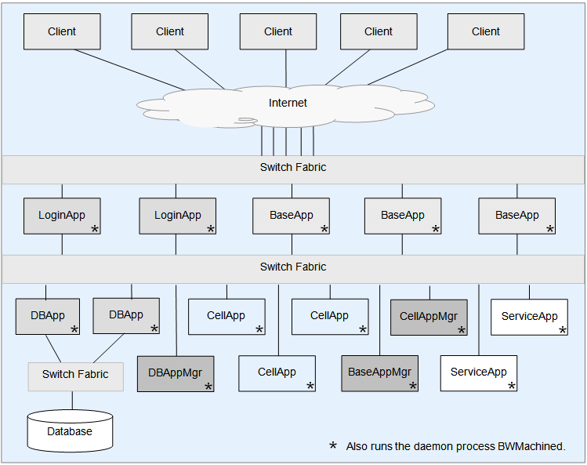
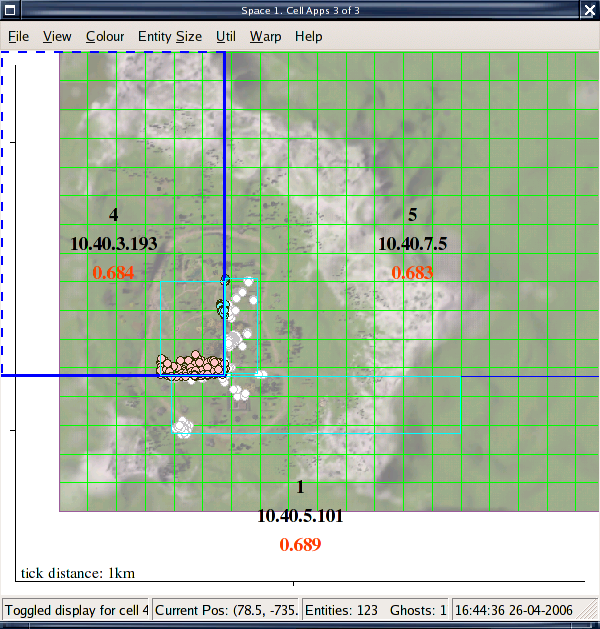
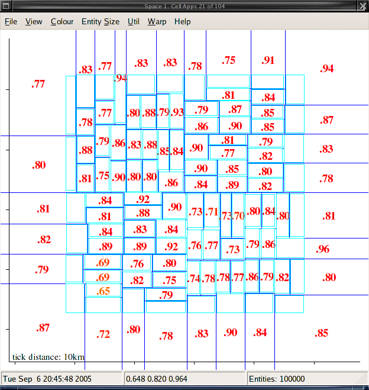
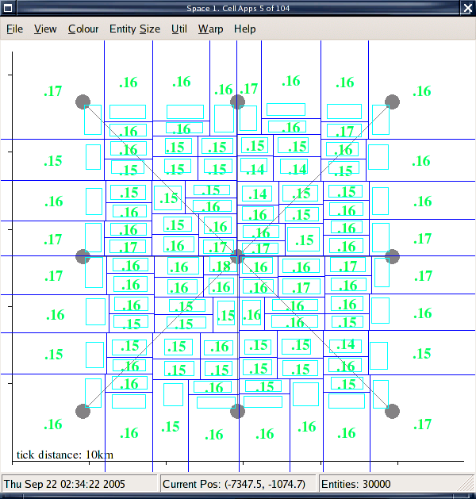
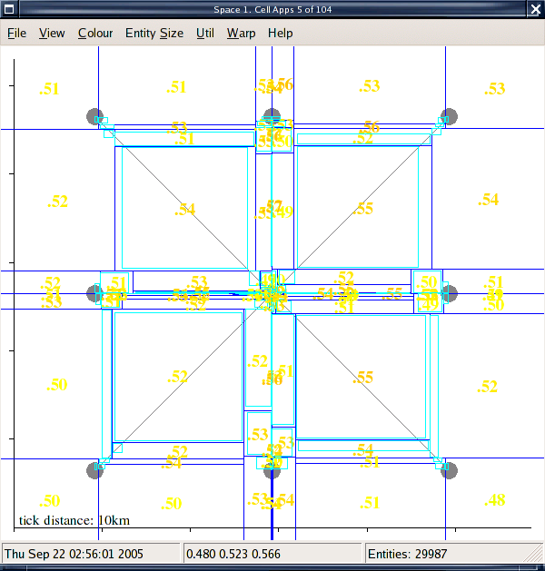
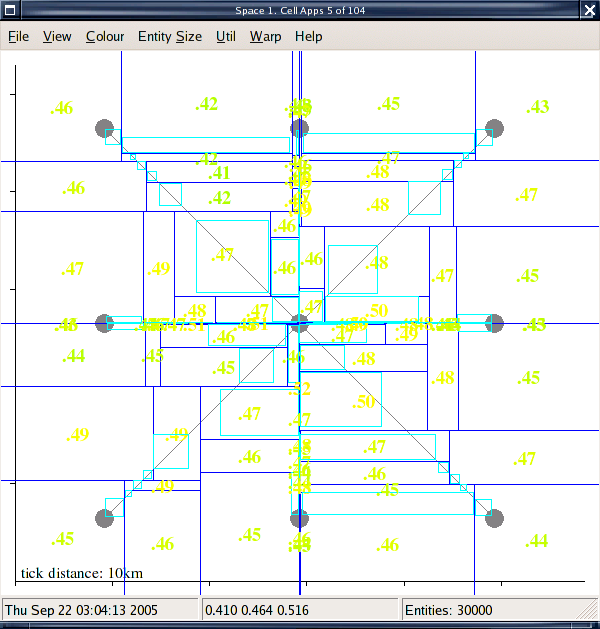
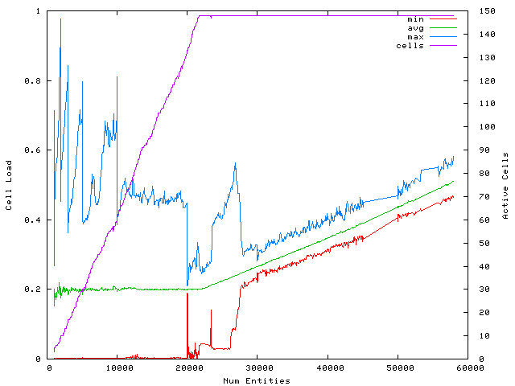
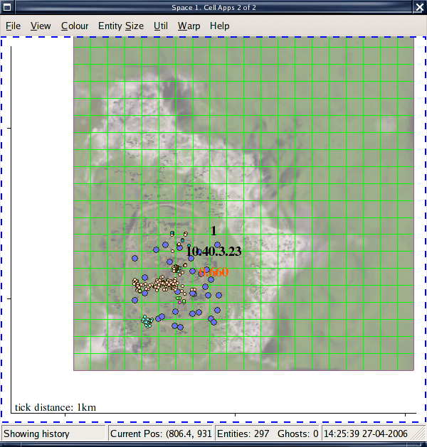
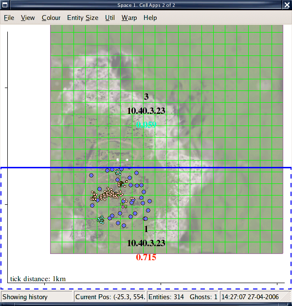
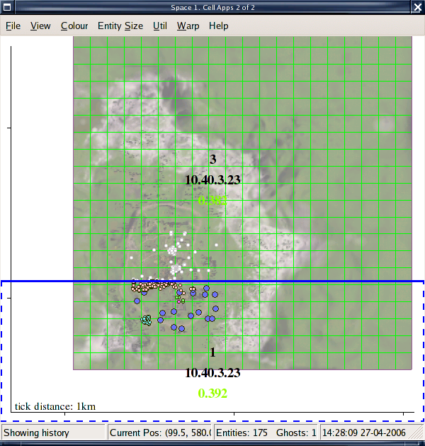

# BigWorld Technology Server Whitepaper（BigWorld 技术服务器白皮书）

## 目录

- 关于本白皮书（第 3 页）
- 架构概述（第 4 页）
  - 结构概述（第 4 页）
  - 关键特性（第 5 页）
    - 负载均衡（第 5 页）
    - 可扩展性（第 7 页）
    - 容错性（第 8 页）
      - 高可用性 —— 第一级容错（第 8 页）
      - 保持游戏数据完整性与一致性 —— 第二级容错（第 9 页）
- 案例研究（第 10 页）
  - 客户 I（第 10 页）
    - 选定方案（第 10 页）
      - 方案特性（第 10 页）
      - 实施细节（第 11 页）
    - 小结（第 12 页）
  - 客户 II（第 12 页）
    - 选定方案（第 12 页）
      - 方案特性（第 12 页）
      - 实施细节（第 13 页）
    - 小结（第 14 页）
  - 客户 III（第 14 页）
    - 选定方案（第 15 页）
      - 方案特性（第 15 页）
      - 实施细节（第 15 页）
    - 小结（第 16 页）
- 演示与分析（第 17 页）
  - 引言（第 17 页）
  - BigWorld 工具（第 17 页）
    - StatLogger（第 17 页）
    - SpaceViewer（第 19 页）
    - Bots（第 20 页）
  - 测试环境（第 20 页）
  - 硬件配置（第 20 页）
    - IBM 测试集群 1（第 21 页）
    - IBM 测试集群 2（第 21 页）
    - BigWorld 本地测试集群（第 21 页）
  - 游戏配置（第 21 页）
  - 特性演示（第 21 页）
    - 服务器可扩展性（第 22 页）
      - 描述（第 22 页）
      - 结果与分析（第 22 页）
    - 负载均衡（第 24 页）
      - 描述（第 24 页）
      - 移动模式切换（第 24 页）
      - 经济化机器分配（第 27 页）
    - 可扩展性演示（第 28 页）
      - 描述（第 28 页）
      - 结果与分析（第 29 页）
    - 容错性（第 30 页）
      - 描述（第 30 页）
      - 结果与分析（第 30 页）
- 总结（第 35 页）

---


<!-- PAGE 1 -->

### BigWorld Technology Server
### Whitepaper（白皮书）
BigWorld Technology OSE。2014 年 12 月发布。
BigWorld Pty Ltd, Level 2, 1 Smail Street, Ultimo NSW 2007, Australia
www.bigworldtech.com
版权所有 © 2014 BigWorld Pty Ltd。保留所有权利。

<!-- PAGE 2 -->

### 目录

| 标题 | 页码 |
| --- | --- |
| 关于本白皮书 | 2 |
| 架构概述 | 3 |
| 结构概述 | 4 |
| 关键特性 | 5 |
| 案例研究 | 9 |
| 客户 I | 10 |
| 客户 II | 12 |
| 客户 III | 14 |
| 演示与分析 | 16 |
| 引言 | 17 |
| BigWorld 工具 | 17 |
| 测试环境 | 20 |
| 硬件配置 | 20 |
| 游戏配置 | 21 |
| 特性演示 | 21 |
| 总结 | 34 |

<!-- PAGE 3 -->

# 关于本白皮书

BigWorld Technology 由服务器、客户端和工具组件构成，客户将其组合使用以构建大型多人在线游戏和虚拟世界。本文档回顾了将 BigWorld Server 作为 MMO 后端的关键优势。文档首先回顾服务器架构，接着介绍不同客户的部署情况，最后讨论在实验室中对服务器可扩展性和容错性特性所进行的测试。

<!-- PAGE 4 -->

# 架构概述
## 结构概述
## 关键特性

BigWorld Server 由一组共同管理一个游戏分片（shard）的进程组成。这些进程通常运行在一组联网机器组成的集群上。BigWorld Server 为任意数量的并发连接用户提供了一个可扩展、可靠的游戏服务器。分片的规模以及相应的并发用户数（CCUs）可以根据客户需求进行伸缩。一些客户倾向于安装多个 BigWorld 实例，每个实例对应不同的分片；另一些客户则为整个游戏只部署一个分片。

每个 BigWorld Server 实例包含多个进程。集群中的大部分机器专门用于运行 CellApps。CellApps 运行绝大多数的实际游戏代码，并在它们之间实时动态地均衡负载。客户端不会直接连接到 CellApp 机器，而是每个客户端连接到一个 BaseApp，后者作为客户端与其玩家实体当前所在 cell 机器之间的代理。BaseApps 运行在具有公网 IP 地址的机器上，本质上充当服务器集群的防火墙。除专门运行 CellApps 的机器以外，其余大部分机器专门用于运行 BaseApps。

CellAppMgr 和 BaseAppMgr 是单例进程，分别管理 CellApps 和 BaseApps 的负载均衡，并提供其他管理功能。LoginApps 负责验证客户端登录，是除 BaseApps 之外仅有的需要运行在具有公网 IP 地址机器上的进程。登录事务以及此后所有从客户端到服务器的通信都经过加密。

DBApps 将持久化数据存储在 MySQL 数据库中，并接收服务器游戏状态的定期备份。这些备份在可用的 DBApps 之间分散进行。该状态保持一致，并可在硬件或系统故障时进行恢复。DBAppMgr 是管理 DBApp 进程的单例进程。

<!-- PAGE 5 -->

## 关键特性
### 负载均衡

要理解 CellApps、BaseApps 与客户端之间的关系，需要先了解使用 BigWorld Technology 构建的游戏在架构上的一个重要方面：游戏实体被实现为分布式类。每个实体可以具有 Cell、Base 和客户端这三部分中的任意组合，分别运行在 CellApps、BaseApps 和客户端上。下图给出了 BigWorld Server 各组件及其相互关系的高层示意图：



BigWorld Server 高层示意图

BigWorld Server 动态分配其资源以实现两个目标：

1. 仅使用将平均负载维持在配置阈值之下所需的尽可能少的机器；

<!-- PAGE 6 -->

2. 在已激活的机器之间尽可能均匀地分配负载。

这样可以实现对资源经济、高效的使用，并使服务器状态能够良好应对突发的负载尖峰。我们实现这一动态负载均衡方案的主要机制是 Cell 的动态分配和调整大小。每个 CellApp 控制若干 cell，每个 cell 负责一个空间（space）的特定部分。每个游戏空间的区域根据需要被划分到一个或多个 cell 中，以使控制它的 CellApps 的负载保持在配置阈值之下。各 cell 控制的区域互不重叠，并且这些 cell 共同覆盖了游戏世界中所有空间的所有区域。下面的 SpaceViewer 截图展示了多个 cell 如何分担单一空间的负载。当某个特定 cell 的负载上升时，CellAppMgr 会动态地缩小其总面积，并将实体迁移到相邻 cell，以在可用 CellApps 之间均衡负载。当某空间的平均系统负载超过配置阈值时，CellAppMgr 会添加一个新 cell 并将其分配给在该空间中尚未持有 cell 的某个 CellApp。当平均系统负载下降时，CellAppMgr 会开始回收 Cell，将对应的 CellApps 从该空间中释放，以将平均负载维持在配置阈值。服务器设计的这一方面基于以下启发式原则：通常实体只对在空间上邻近的其他实体感兴趣。由于每个 cell 控制一个空间中连续区域内的实体，在大多数情况下，这些实体之间的交互可以在本地解决，而无需与其他 CellApp 通信。这最大程度地减少了网络流量及其伴随的（且显著的）CPU 开销，从而提供最高的效率和服务器容量。

虽然 Cell 的负载均衡算法是动态的，但 BaseApps 的算法目前是静态的（不过我们正在开发改进这一行为），即实体的 base 部分（通常）创建在负载最低的 BaseApp 上，且不会被迁移。系统中合理的周转率（即创建与销毁的速率）可使负载在可用 BaseApps 之间保持均衡。BaseApp 负载均衡的设计基于如下假设：大部分游戏代码在 CellApp 上执行，因此最大比例的游戏代码执行可以采用动态而非静态的负载均衡。玩家实体的 Base 部分大部分时间用于在客户端与其 cell 实体之间转发数据包，由于下行比特率保持恒定，BaseApp 负载的波动通常远小于 CellApp 负载的波动。截至目前，这种静态均衡方案在均匀分配负载方面已绰绰有余。


<!-- PAGE 7 -->

### 可扩展性


请向 BigWorld 业务经理索取服务器负载均衡能力的现场演示。该演示展示了随游戏条件变化而进行的 cell 动态分配与调整。

BigWorld Server 的一个重要特性是：负载随实体数量大致呈线性扩展。更具体地说，在 AI、活动频率等其他变量保持不变的情况下，增加实体（客户端与 NPC）数量应使整体服务器负载呈线性正比增长。这一点很重要，因为这意味着 BigWorld Server 在性能上不存在“天花板”——即为了逐步提升服务器实体容量所需的额外硬件投入不会变得难以承受。简而言之，使用 BigWorld Server，如果您希望将实体数量翻倍，则只需将集群中的硬件翻倍——服务器会根据客户群的需求以可预测的成本进行扩展。

BigWorld Server 通过两种主要方法实现这些线性扩展特性：控制每个客户端可用的下行带宽；以及将每个实体的视野限制在预定的范围内。由于服务器总 CPU 消耗的很大一部分用于构建和发送数据包，因此为每个客户端设置最大下行比特率，可在每个客户端达到带宽上限后使负载与客户端数量呈线性关系。如果没有这些扩展机制，服务器负载会随客户端数量呈平方级增长：随着客户端数量增加，每个客户端

```
O(n^2)
```

能看到的其它实体数量也会以大致相同的速率增加，从而给下行流量和服务器负载带来 O(n²) 的复杂度。为了确保客户端不会因带宽限制而处于劣势，我们在构建下行数据包时会优先更新附近实体。距离客户端 avatar 最近的实体会获得更大的带宽份额，更新频率更高；距离较远的实体获得的带宽份额较小，更新频率较低。客户端具有对实体在两次更新之间运动进行平滑的过滤器，因此即使对于更新稀疏的远处实体，运动也会显得平滑。当客户端接近一个原本较远的实体时，更新频率会平滑提高，使交互响应越来越灵敏。严格来说，一旦下行带宽被完全利用，服务器负载应以略高于线性的速率增长。尽管每个客户端的发送量保持不变，但优先排序实体并决定更新哪些实体的算法在与客户端 avatar 周围实体数量上呈对数关系。

<!-- PAGE 8 -->

### 容错性
#### 高可用性 —— 第一级容错

上述对数部分复杂度的系数相对于构建和发送数据包的线性部分来说预计会非常小。这意味着在小范围内实体密度过高会对服务器性能产生影响。然而，实体密度过高不仅是服务器的问题，对客户端而言同样是问题。某一区域内实体密度过高会因所需的额外渲染而降低客户端性能。良好的游戏设计应确保实体密度维持在能够保证良好终端用户体验的合理水平。根据我们的经验，在数百平方米的小区域内放置两千个实体可以由服务器良好处理，并且如果客户端采用合适的渲染方式，性能也可以接受。


服务器的可扩展性能力将在“演示与分析”章节的“特性演示”中加以展示。

BigWorld Server 实施了多种应对组件或大规模机器故障的对策，以确保服务器的数据完整性和高可用性。这可以防止游戏事件历史（例如物品交易、完成的任务等）的丢失，并保证不间断的游戏体验。第一级容错的目标是处理孤立的服务器组件或机器故障。当因任何原因发现组件或机器不可达时，系统对用户透明地恢复，使游戏在尽可能小的中断下继续进行。CellApps 的容错通过让每个 cell 实体定期将其状态备份到其 Base 实体实现。如果 CellApp 因任何原因宕机，Base 实体会检测到其 cell 部分已不可联系，并在另一个可用的 CellApp 上重新创建其 cell 实体。对于 BaseApps，目前容错通过让 BaseApps 之间相互备份实现。每个 base 实体都备份到另一个 BaseApp，并接收周期性的备份更新。如果某个 BaseApp 宕机，其他 BaseApps 会恢复该 BaseApp 上备份的 base 实体。

<!-- PAGE 9 -->

#### 保持游戏数据完整性与一致性 —— 第二级容错

一个名为 "Reviver" 的哨兵进程为其余服务器组件（LoginApp、CellAppMgr、BaseAppMgr、DBApp 和 DBAppMgr）提供容错。如果这些进程中的任何一个发生故障，Reviver 会检测到并立即启动该进程的新实例，以确保游戏连续性。


请向 BigWorld 业务经理索取服务器高可用性的现场演示。该演示展示了在杀死一个 CellApp 的情况下游戏的连续性。

第二级容错应对大规模的系统级故障（例如停电、网络硬件中断等），由 DBApps 和 BaseApps 实现。第二级容错的目标是确保数据完整性，而非保证游戏的连续性。当进入这一级容错时，可以认为服务器已不再处于能够正常运行的状态。BigWorld Server 持续地将游戏状态的滚动分布式备份写入分布式数据库。对于关键的状态变更（例如物品交易），可以手动触发数据库写入，以确保无论滚动回写进行到哪一步，游戏状态都能被保存。一旦系统级中断的原因被定位并修复，游戏就可以从数据库中存储的游戏状态重新启动。第二级容错机制通过为每个 BaseApp 配备辅助数据库的分布式数据库系统实现。此外，还支持在在线运行期间对服务器状态进行快照。

<!-- PAGE 10 -->

# 案例研究
## 客户 I
### 选定方案
#### 方案特性

本节讨论客户案例研究。这些案例基于真实部署。出于商业原因，本文件不包含可识别客户身份的细节。我们鼓励您与 BigWorld 业务经理讨论公开的客户信息。

该客户部署的游戏需要一个极大的单一空间（200 平方公里），并要求所有玩家连接到同一空间，能够相互交互。方案特定需求：

1. 承载一个极大的空间。
2. 支持不限数量的玩家。

该客户选择使用单一网络集群部署单个 BigWorld Server。此 BigWorld Server 通过添加主要用作 BaseApps 和 CellApps 的额外机器进行扩展。

| 特性 | 适用性 | 描述 |
| --- | --- | --- |
| 服务器容错性 | 适用 | 此部署利用 BigWorld 容错能力提供了非常高级别的容错。每个已部署的 BaseApp 或 CellApp 都由其他 BaseApps 备份，服务器能够在多个组件崩溃的情况下无停机地继续运行。 |

<!-- PAGE 11 -->

#### 实施细节

| 特性 | 描述 |
| --- | --- |
| 如何扩展 | 在保持合理实体密度的前提下，可通过添加更多 CellApps 和 BaseApps 按需扩展游戏服务器。 |
| 负载均衡与高效硬件使用 | 所有硬件均被利用，负载均衡由单一服务器管理。 |
| 维护工作量 | 在多个网络集群上维护多个大型分片较为复杂。建议配备一名 MySQL DBA 管理 MySQL 数据库。 |

| 资源 | 描述 | 数量 |
| --- | --- | --- |
| 分片总数 | | 1 |
| 每个分片的机器数 | | 30 |
| 每台机器的 CPU 数 | | 4（四核机器） |
| 每台机器内存 | | 6 GB |
| 硬盘需求 | | 100 GB 磁盘 |
| 部署总 CPU 数 | | 120 |
| DBAppMgr CPU 数 | | 2 |
| BaseAppMgr CPU 数 | | 2 |
| CellAppMgr CPU 数 | | 2 |
| LoginApp CPU 数 | | 4 |

<!-- PAGE 12 -->

### 小结
## 客户 II
### 选定方案
#### 方案特性

| 资源 | 描述 | 数量 |
| --- | --- | --- |
| DBApp CPU 数 | | 8 |
| BaseApp CPU 数 | | 24 |
| CellApp CPU 数 | | 78 |
| 每分片机器估算成本（美元） | | 40,000 - 50,000 |
| 观测到的最大 CCU | | 20,000 |

该客户选择单分片部署。所部署的方案承载了一个 200 平方公里的空间，同时承载超过 20,000 个 CCU，目前作为一款在线游戏对外提供。通过使用 BigWorld Server 方案，该客户实现了一个其他游戏供应商无法提供的独特部署。

该客户部署的游戏同时承载超过 100,000 个 CCU。游戏逻辑允许将该方案拆分为多个分片。方案特定需求：

1. 承载超过 100,000 个 CCU。
2. 该游戏支持分片，且不同分片之间的互联需求极少。
3. 客户选择投入额外资源，将每个分片部署在独立的网络集群上；这提供了更高的可用性，但硬件利用率较低。

该客户选择部署“使用多个网络集群的多分片部署”。此方案通过为每个分片添加更多机器或通过添加更多分片进行扩展。

<!-- PAGE 13 -->

#### 实施细节

| 特性 | 适用性 | 描述 |
| --- | --- | --- |
| 服务器容错性 | 适用 | 此部署提供了极佳的容错级别，因为除 BigWorld Server 的标准容错能力外，一个分片的故障对其他分片的运行没有任何影响。 |
| 如何扩展 | 游戏服务器可通过两种方式扩展：首先，可以通过向每个分片添加硬件使其线性扩展；其次，可以在专用网络集群中添加更多分片。 |
| 负载均衡与高效硬件使用 | 客户选择为每个分片配置独立的网络集群。该决策需要为每个分片手动分配服务器，并消除各分片之间的相互依赖。客户也可以选择使用一个网络集群承载多个分片的部署方式，该方案在保持相似能力的同时，可提供比本方案更好的可扩展性。 |
| 维护工作量 | 在多个网络集群上维护多个大型分片较为复杂。建议配备一名 MySQL DBA 管理 MySQL 数据库。 |

下面给出了“使用多个网络集群的多大型分片部署”中一个典型分片的示例：

| 资源 | 描述 | 数量 |
| --- | --- | --- |
| 分片总数 | | 不限 |
| 每个分片的机器数 | | 10 |
| 每台机器的 CPU 数 | | 4（四核机器） |
| 每台机器内存 | | 6 GB |

<!-- PAGE 14 -->

### 小结
## 客户 III

| 资源 | 描述 | 数量 |
| --- | --- | --- |
| 硬盘需求 | | 100 GB 磁盘 |
| 部署总 CPU 数 | | 40 |
| DBAppMgr CPU 数 | | 1 |
| BaseAppMgr CPU 数 | | 1 |
| CellAppMgr CPU 数 | | 1 |
| LoginApp CPU 数 | | 2 |
| DBApp CPU 数 | | 2 |
| BaseApp CPU 数 | | 8 |
| CellApp CPU 数 | | 25 |
| 每分片机器估算成本（美元） | | 14,000 - 20,000 |
| 观测到的最大 CCU | | 每分片 6,000，整个部署 120,000 |

该客户选择了多分片部署。所部署的方案同时承载约 120,000 名玩家。该部署提供了世界级的解决方案，并且仍在扩展以容纳更多玩家需求。


此规模的部署通常需要专门的部署团队，或与经验丰富的托管公司合作。BigWorld 拥有多家合作伙伴，能够提供与上述方案类似的托管方案。

<!-- PAGE 15 -->

### 选定方案
#### 方案特性
#### 实施细节

该客户游戏处于 Beta 阶段，需要最高 2000 个 CCU。方案特定需求：

1. 方案简单，便于在 Beta 与测试阶段进行相对容易的部署。
2. 方案易于扩展到完整规模的方案。

该客户选择使用单一网络集群部署一个中等规模的 BigWorld Server。此方案支持所需的 CCU 数量，并可以轻松扩展到上述任一方案或任何其他 BigWorld Server 部署。

| 特性 | 适用性 | 描述 |
| --- | --- | --- |
| 服务器容错性 | 适用 | 此部署使用 BigWorld Technology 的标准容错特性，提供非常高级别的容错。 |
| 如何扩展 | 可通过添加机器扩展游戏服务器，或在游戏逻辑允许多分片部署时通过添加更多分片进行扩展。 |
| 负载均衡与高效硬件使用 | BigWorld Server 的标准负载均衡特性可用于此部署。 |
| 维护工作量 | 维护一个中等规模的 BigWorld 集群相对简单，通常不需要专门的资源。 |

| 资源 | 描述 | 数量 |
| --- | --- | --- |
| 分片总数 | | 1 |

<!-- PAGE 16 -->

### 小结

| 资源 | 描述 | 数量 |
| --- | --- | --- |
| 每个分片的机器数 | | 6 |
| 每台机器的 CPU 数 | | 2（双核机器） |
| 每台机器内存 | | 2 GB |
| 硬盘需求 | | 100 GB 磁盘 |
| 部署总 CPU 数 | | 12 |
| DBMgr CPU 数 | | 0.5 |
| BaseAppMgr CPU 数 | | 0.5 |
| CellAppMgr CPU 数 | | 0.5 |
| LoginApp CPU 数 | | 0.5 |
| DBApp CPU 数 | | 1 |
| BaseApp CPU 数 | | 2 |
| CellApp CPU 数 | | 7 |
| 每分片机器估算成本（美元） | | 6,000 - 10,000 |
| 观测到的最大 CCU | | 1,500 |

该客户选择了中等规模的 BigWorld Server 部署。所部署的方案可承载最高 1,500 个 CCU，并在产品的 Beta 阶段投入使用。该 Beta 测试取得成功，目前游戏已使用更大规模的部署正式发布。

<!-- PAGE 17 -->

# 演示与分析
## 引言
## BigWorld 工具
### StatLogger

以下演示和测试的目的是以科学方式证明：架构一章中所描述的 BigWorld Server 的特性和渐近趋势在真实部署中确实成立。通过分析真实客户的部署概况以及科学测试结果，可以为前一章所述的不同服务器部署估算硬件成本。

需要注意的是，在大规模测试中并未使用运行复杂人工智能（AI）例程的游戏实体。这是有意为之，因为真实游戏中 AI 的复杂度与效率差异可能非常大，并且几乎完全由具体游戏的设计决定，而非由 BigWorld Server 决定。这也是“案例研究”中所引用的 CCU 数量差异较大的主要原因。由于这些差异难以计入考量，因此被排除在本次测试之外。由于 BigWorld 已经拥有多家处于 Beta 与正式发布阶段的客户游戏，我们掌握了关于这些因素预期行为的良好统计数据。

以下测试中展示的数据均通过 BigWorld Server 工具采集。BigWorld Server 附带一组基于 Web 的工具，用于监控和管理服务器。以下是这些工具的简要描述：

<!-- PAGE 18 -->

StatLogger 顾名思义，用于从运行中的 BigWorld Server 采集运行时统计数据。它通过周期性地向 BigWorld 服务器机器和进程查询预定义的统计信息集，并将结果写入 MySQL 数据库来实现。这些统计信息通常包括（但不限于）：

1. CPU、内存、磁盘和网络使用率；
2. 服务器状态的各项指标，例如当前和累计的实体数量；
3. 特定代码块的性能剖析（profiles）。

StatLogger 采集的统计数据构成本文档中大部分分析的基础。可以使用 WebConsole 的

```
Graphs
```

模块（参见下文 StatGrapher 截图）以图形方式查看 StatLogger 采集的数据。注意：出于演示目的，本文档中部分图表是使用 gnuplot（http://www.gnuplot.info/）生成的。


WebConsole Graphs 实时监控界面

<!-- PAGE 19 -->

### SpaceViewer

SpaceViewer 提供了对 BigWorld Server 上特定空间内实体与 cell 分布的自上而下的图形化展示。目前 BigWorld 提供两个版本的 SpaceViewer 实现：一个是 wxPython GUI 桌面应用程序（此处所示），另一个是基于 HTML5 Canvas 的 Web 应用，作为基于 Web 的 WebConsole 服务器工具套件的一部分。请注意，wxPython 版本的 SpaceViewer 已正式弃用。



显示三个 cell 的 SpaceViewer

<!-- PAGE 20 -->

### Bots
## 测试环境
## 硬件配置

SpaceViewer 将 cell 边界显示为蓝色线条，实体显示为按类型着色的小圆圈。绿色网格线表示构成 3D 世界数据的区块（chunk）的边界。每个 cell 都标注了其 ID、IP 地址以及当前负载（用 0 到 1 之间的浮点数表示）。SpaceViewer 还可以显示每个 cell 的实体大致范围（此处以青色矩形表示）。这对于了解大型多 cell 系统中实体分布很有用。在这种规模的系统中，记录并显示每个单独实体的位置并不可行，因此 SpaceViewer 一次只能跟踪单个 cell 上的实体。在上面的示例中，选中了 Cell 4，我们可以看到其边界内的各个实体（彩色圆圈）以及其边界附近的幽灵实体（灰色圆圈）。

在我们的测试流程中，用于生成服务器负载的技术是一组

```
"bot"
```

进程。单个 Bot 进程能够以较低的每连接内存 / CPU 开销建立多个客户端连接到服务器，而 GUI 客户端通常资源消耗大得多。通过 Bot 进程建立的客户端连接能够执行与 GUI 客户端相同的所有操作，并接收相同的网络流量 / 事件。Bots 是一种有价值的负载生成技术，因为它们使用相对较少的专用硬件即可模拟大量并发连接的客户端，同时仍能对服务器进行准确且真实的测试。由于服务器不区分 bots 和真实（GUI）客户端，因此服务器上的负载可以准确反映等量真实客户端所产生的负载。开发者应在开发周期以及接近 Beta 阶段时使用 bots 测试其游戏。这是一种有用的工具，可通过将给定实体集合下的负载统计与基线直接对比，来评估新特性和优化效果。

大规模测试在位于纽约州波基普西的 IBM 深度计算设施中进行。我们安装了各种日志记录应用以记录测试结果，随后对这些结果进行了分析。

<!-- PAGE 21 -->

### IBM 测试集群 1
### IBM 测试集群 2
### BigWorld 本地测试集群
## 游戏配置
## 特性演示

本白皮书所示的结果采集自三个不同的集群。每个集群的硬件配置如下：

- **IBM 测试集群 1**：96 台双 3.06GHz Xeon 机器，每台配 3GB 内存和千兆以太网，运行 Redhat Enterprise Linux。其中 16 台机器启用了超线程（HT）（即具有 4 个逻辑 CPU）。除非另有说明，本集群上运行的所有测试都将 16 台 HT 机器分配给 bots 进程、日志记录与管理使用，其余 80 台非 HT 机器用于运行游戏服务器。
- **IBM 测试集群 2**：128 台双 3.06GHz Xeon 机器，每台配 3GB 内存和千兆以太网，运行 Redhat Enterprise Linux。其中 22 台机器启用了 HT。除非另有说明，本集群上运行的所有测试均使用 20 台 HT 机器运行 bots，1 台 HT 机器作为控制节点（用于日志记录与管理）。剩余 1 台 HT 机器和 106 台非 HT 机器用于运行游戏服务器。
- **BigWorld 本地测试集群**：20 台机器，速度介于 1GHz 与 3GHz 之间，运行不同版本的 Fedora 和 Debian。集群在硬件和操作系统上的异构性，使我们能够在多种可能的配置下测试服务器，同时验证负载均衡与冗余算法即使在性能差异较大的集群节点上也能有效运行。

每项测试均使用以下服务器端设置：

- 游戏 tick 速率 = 10Hz（服务器向玩家发送更新的速率）；
- 客户端兴趣区域（AoI）半径 = 500m；
- 客户端下行带宽上限 = 20kbit/s；

<!-- PAGE 22 -->

### 服务器可扩展性
#### 描述
#### 结果与分析

本测试旨在验证服务器在单一分片中处理极端大量并发玩家的能力，并确定在可用硬件上可连接的最大客户端数量。测试在 IBM 测试集群 1 上进行，方法是向单一空间内一个 40km × 40km 的方形区域添加 bots。需要特别说明的是，游戏世界中唯一的实体就是客户端实体，没有生成任何 NPC。就服务器负载而言，本测试对服务器处理大量实体的能力的估算应偏于保守。客户端实体在服务器上的开销（一般而言）大于 NPC 实体，因为客户端实体周围的实体更新必须发送给客户端，而 NPC 则无需如此。例如，使用随 BigWorld Server 附带的 FantasyDemo 世界，一个客户端实体相对于一个 Guard NPC（其会持续巡逻并监视其他 Guard 受到攻击）的开销比大约为

```
heavy-weight
```

4:1。Guard 被视为

```
light-weight
```

持续寻路并运行 AI 例程的重量级 NPC。轻量级 NPC 的例子包括商店老板、任务发放者以及其他不怎么移动、主要对玩家

```
actions as opposed to acting of their own volition. We would expect these dumb
```

行为作出反应而非自主行动的 NPC。我们预计这些“笨”NPC 的开销只有客户端实体的 1/20 甚至更少。在同时包含客户端实体和 NPC 的典型游戏世界中，大部分 CPU 时间都消耗在为客户端实体构建并发送下行数据包上；因此，由于客户端实体在经验上比 NPC 更昂贵，并且只要 NPC AI 不至于过度复杂，预计在典型游戏中一个客户端实体的开销可以容纳许多 NPC。

IBM 测试集群 1 共实现了 100,000 个并发连接的客户端。下方的空间查看器图显示了空间在 80 个 cellapp 之间的分布，这些 cellapp 用于处理客户端负载。

<!-- PAGE 23 -->



显示 100,000 个并发用户的 SpaceViewer

这些结果表明，BigWorld Server 能够通过在多个 cellapp 之间自动分配负载来处理 100,000 个 CCU。当时，这是单一世界中玩家数量的最高纪录。

<!-- PAGE 24 -->

### 负载均衡
#### 描述
#### 移动模式切换

上方所示的实体边界表明客户端分布在 40km × 40km 的区域，即 1,600 km² 上。每个实体的兴趣区域（AoI）半径为 500m，这意味着每个实体能感知到其周围 1 平方公里范围内的实体。

对于分布在 1,600 km² 上的 100,000 个实体而言，这意味着每个客户端的 AoI 内约有 62 个实体，对于标准《魔兽世界》风格的 MMO 来说，这是一个合理的可感知实体数量。

BigWorld Server 旨在将负载分布到多台机器上并及时完成此操作，其中所需的平均负载水平由服务器管理员指定。这也意味着管理员可以随时在 BigWorld 集群中添加或移除机器，服务器将始终充分利用其可用资源。本演示旨在展示服务器能够及时响应实体分布的变化，并尽可能将平均负载维持在接近目标水平，偏差尽可能小，同时使用尽可能少的机器。

我们运行了多次采用不同实体分布的测试，以展示负载在不同 CellApps 之间均衡分布。下面给出了其中一些测试。以下是“八角星”测试的结果。初始时，30,000 个客户端均匀分布在一个 40km × 40km 的空间中，可以看到空间被均匀地划分为多个 cell：

<!-- PAGE 25 -->



30000 个实体均匀分布在 40km × 40km 的区域上

客户端开始向星形的某一个角行走，随着客户端在星形的角及其中心附近聚集，负载也随之上升。这里需要注意的重要一点是，即使在实体分布（以及 cell 布局）发生变化时，最小和最大负载与平均负载的差距仍小于 5%：

<!-- PAGE 26 -->



30000 个实体现在集中在九个位置

当客户端开始沿星的角与中心之间的路径行走时，密度降低，分布向中心回移，但负载仍保持在平均负载的 ±5% 范围内：

<!-- PAGE 27 -->

#### 经济化机器分配



客户端开始沿从角到中心的路径行走

这些结果表明，服务器会在多个 CellApps 之间自动均衡负载，达到一种在各 CellApp 进程之间一致的负载均衡状态，反映出对资源的最优利用。其他移动模式的测试也产生了类似的结果。

在本测试中，我们将服务器目标平均负载设置为 20%，同时增加实体数量（参见横轴）。随着实体数量增加，服务器自动使用更多的 cell（紫色线），并保持每个 cell 上的平均负载（

<!-- PAGE 28 -->

### 可扩展性演示
#### 描述

绿色线）恒定。在耗尽可用的 CellApps 后，服务器开始在每个 cell 上平均使用超过 20% 的 CPU。请注意，此演示使用与下方可扩展性演示相似的原始数据。客户可以类似地设置目标服务器负载，随着实体数量增长，BigWorld Server 会自动添加更多 cell，直到 CellApps 数量耗尽。超过该点后，负载随系统中实体数量呈线性增长。下图显示了平均 cell 负载（绿色）、最大 cell 负载（蓝色）、最小 cell 负载（红色）以及 cell 总数（紫色）。



向 BigWorld Server 添加实体时服务器负载与活动 Cell 数量的关系图

我们进行了多次测试以考察更改不同服务器参数的影响，但就本演示而言，它们在功能上非常相似。每次测试都包含添加保持恒定密度的移动 bots，

<!-- PAGE 29 -->

#### 结果与分析

同时确保每个客户端的下行带宽都被充分利用。这使我们能够证明：在其他变量（密度、AI 等）保持不变的情况下，BigWorld Server 的负载确实随实体数量呈线性扩展。

下图展示了服务器负载和活动 CellApp 数量与实体数量之间的关系。在每张图中需要注意的是，负载随实体数量呈线性增长。目标 cell 负载设置为 20%。结果显示：

1. 平均负载（绿色）保持恒定，同时活动 cell 数量（紫色）线性增长；
2. 活动 cell 数量保持恒定（即所有 CellApps 现在都已激活），同时平均负载线性增长。


测试 2 中 cell 负载与活动 cell 数量随实体数量变化的关系图

<!-- PAGE 30 -->

### 容错性
#### 描述
#### 结果与分析

这些结果证明 BigWorld Server 确实能够线性扩展，因此任何基于 BigWorld Technology 的游戏都可以根据其客户群的需求自由扩展。

我们对 BigWorld Server 的容错能力进行了演示：在运行中的服务器上杀死一个 CellApp 进程，并观察被杀死的 CellApp 所拥有的 Cell 上的所有实体如何由 BaseApps 恢复到另一个可用的 Cell 上。本测试与集群规模无关，因为它处理的是单组件故障，如有需要可由您的客户经理进行演示。

本测试使用的服务器由 3 个 CellApps 组成。初始时只有 2 个 CellApps 处于活动状态。本测试使用 BigWorld Technology 附带的标准 FantasyDemo 游戏，连接了 32 个 bot 客户端和 1 个真实游戏客户端。

<!-- PAGE 31 -->


CellApp 被杀死之前的服务器状态

下图显示了 Cell 2 被手动硬杀死之后的状态：

<!-- PAGE 32 -->



图 14. Cell 2 被杀死后立即的服务器状态

一旦 CellApp 2 被杀死，BaseApp 会将该 Cell 的实体恢复到该空间上下一个可用的 Cell 上（本例中为 Cell 1）。在客户端上，我们观察到实体更新出现短暂（约 2 秒）的暂停（即守卫和野生动物停止移动），直到恢复完成。自然地，第一个 Cell 上的负载会因额外的实体负载而迅速上升，这会导致两件事发生：

1. CellAppMgr 注意到 Cell 1 上的负载现在超过了 0.5 的目标水平，因此将处于储备状态的 CellApp 加入到该空间。

<!-- PAGE 33 -->

```
scales back
```

2.  在临时过载期间，Cell 1 会进入“降级”模式（scales back），即它会暂时降低对客户端的下行比特率以减少负载，同时等待另一个 Cell 启动并分担其过剩负载。这意味着客户端会暂时以更低的频率收到每个实体的更新，但服务器状态保持稳定。



未使用的 cell 被加入该空间以替换已死亡的 cell

随着新 Cell 接管越来越多的空间区域，第一个 CellApp 上的负载向两个 cell 负载相等的较低均衡状态移动：

<!-- PAGE 34 -->



目标负载水平已恢复

上述示例是第一级容错工作方式的典型示例。客户端的游戏流程几乎没有受到干扰（感觉就像是一次短暂的卡顿），游戏状态被准确保留。我们已说明：当一个 Cell 发生故障时，相邻的 Cell 会接管该空间及先前位于故障 Cell 上的实体。在短时间内，每个 Cell 的平均负载会上升到一个水平，该水平与分配给该空间的可用 Cell 数量成反比。因此，拥有更多可用的 CellApps 可以通过将失败 Cell 的负载分散到更多可用 Cell 上来提高容错能力，从而缩短玩家所感知到的降级持续时间。

<!-- PAGE 35 -->

# 总结

本文档涵盖了 BigWorld Server 的多个方面。它回顾了服务器架构，讨论了常见的客户部署，解释了每种部署的优缺点，并回顾了在 BigWorld Server 上进行的科学测试。
