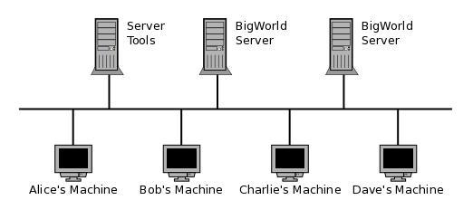
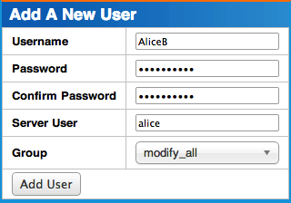
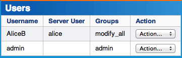
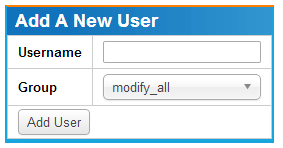
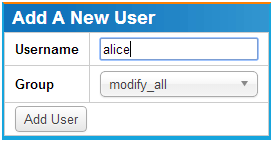
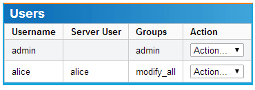
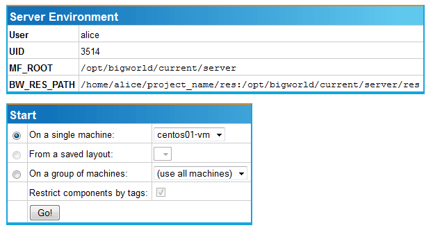

# Server Installation Guide

## 目录 / Table of Contents

- About the Server Installation Guide (p.4)
  - Requirements (p.4)
    - Hardware Requirements (p.4)
    - Software Requirements (p.4)
  - Reading this document (p.5)
- Simple Installation (p.6)
  - Recommended Setup (p.6)
    - Supported Distributions (p.7)
  - Preparation (p.7)
    - Installing CentOS (p.7)
      - Update System Packages (p.7)
    - Installing the EPEL Repository (p.8)
    - Installing, Configuring and Starting MySQL (p.8)
      - MySQL on CentOS 5 (p.9)
        - Start the MySQL server (p.9)
      - MySQL on CentOS 7 (p.10)
        - Start the MariaDB/MySQL community server (p.11)
      - MySQL Accounts (p.12)
        - BigWorld Server Tools (p.12)
        - BigWorld Server User Account (p.13)
          - Use Case (p.14)
  - Installing the BigWorld Technology Server package (p.16)
    - BWMachineD (p.16)
    - BigWorld Server (p.17)
    - BigWorld Server Tools (p.17)
      - Installing the Server Tools (p.17)
      - Upgrading from an Existing Server Tools Installation (p.17)
    - Configuring StatLogger (p.18)
      - Configure MySQL (p.18)
      - Configure Carbon support (p.19)
    - Configuring MessageLogger (p.19)
    - Restart StatLogger and WebConsole (p.22)
    - Confirm tools are running (p.22)
    - Connecting to WebConsole (p.23)
  - Customising your installation (p.23)
  - Upgrading the BigWorld Technology Server package (p.24)
- Server First Run (p.25)
  - Creating a Developer Account (p.25)
    - Account creation example (p.26)
    - Common Mistakes (p.26)
  - Create a new project (p.27)
  - Package specific key generation (p.29)
    - LoginApp Keypair (p.29)
    - BigWorld Server Key (p.29)
  - Managing the BigWorld Server (p.29)
    - Adding a New User (p.30)
      - Adding Password Based Users (p.30)
      - Configure WebConsole to support LDAP Based Users (p.32)
      - Adding A LDAP Based User (p.33)
    - Access Control (p.35)
  - Login to WebConsole (p.36)
  - Starting a BigWorld server (p.36)
- Cluster Configuration (p.39)
  - Process Configuration (p.39)
    - Default system startup configuration (p.39)
  - Security (p.40)
    - Centos 5 (p.40)
    - CentOS 7 (p.41)
    - Securing WebConsole (p.42)
  - Routing (p.42)
  - Buffer sizes (p.43)
  - Disabling cron jobs (p.44)
- Appendix A. Hardware Requirements (p.46)
  - CPU Specifications (p.46)
  - Duals/Single/Quad/Blades (p.47)
  - Network Interface Cards (p.47)
  - Disk Storage (p.48)
  - Power Supplies (p.48)
  - Memory (p.48)
  - NOC Bandwidth (p.49)
  - VMWare (p.49)
- Appendix B. Installing CentOS (p.50)
  - Installing (p.50)
  - Post-installation Setup (p.53)
    - Install updates (p.53)
    - Configure services (p.53)
    - Install build tools (p.53)
    - Changing UIDs (p.54)
- Appendix C. Copying files to Linux (p.56)
  - USB Thumb Drive / External Hard Disk (p.56)
    - Installing NTFS Support (p.57)
  - Python SimpleHTTPServer hosted on                                Windows (p.57)
  - Windows network share (p.58)
- Appendix D. Creating a custom BigWorld server installation (p.59)
  - Customising RPMs (p.59)
  - Manual Installation (p.59)
    - BWMachined (p.60)
    - Server (p.60)
  - Server Tools (p.61)
    - Requirements and Caveats (p.61)
      - Requirements (p.61)
      - Dependencies (p.61)
      - Installation process (p.61)
- Appendix E. Understanding the BigWorld Machine Daemon (BWMachineD) (p.64)
  - How BWMachined Works (p.64)
  - Configuring BWMachined (p.64)
    - Creating ~/.bwmachined.conf (p.65)
    - Creating /etc/bwmachined.conf (p.66)
      - Reviver Configuration (p.67)
      - Timing Method (p.67)
      - Machine groups (p.67)
      - Internal Interface Configuration for Multi-interface                                          Hosts (p.68)
      - Service Configuration (p.69)
      - Delaying packets to avoid network flooding (p.69)
- Appendix F. Setting up a Reverse HTTPS Proxy Server with httpd (p.70)
  - Generating an SSL certificate and private key (p.70)
  - Installing httpd and required modules (p.71)
  - Configuring httpd and integrating WebConsole with it (p.72)
- Appendix G. Installing and Configuring MongoDB (p.74)
  - Installing MongoDB (p.74)
  - Configuring MongoDB (p.74)
    - Recommended Linux System Configurations for MongoDB (p.74)
    - MongoDB Configuration Options (p.77)
  - MongoDB Sharding Setup (p.77)
    - Configure MongoDB Cluster (p.78)
    - User Creation (p.81)
    - Shard Initialisation (p.82)
    - Message Logger Configuration (p.83)
  - Enabling Authentication (p.83)
  - Log backup and restore with MongoDB (p.84)
    - Database Schema of Message Logger in MongoDB (p.84)
    - User Log Data (p.84)
    - Common Data (p.86)
    - Backing up and Restoring Message Logger Log Data in MongoDB (p.86)
      - Approaches recommended by MongoDB (p.87)
      - Other ways to Archive Log Data (p.88)
        - Using mlcat.py to archive partial logs (p.88)
        - Using a dedicated MongoDB Cluster to archive all log data (p.88)
- Appendix H. Installing and Configuring Carbon and Graphite (p.89)
  - Carbon and Graphite Prerequisites (p.89)
  - Installing Carbon / Graphite (p.90)
  - Configuring Carbon (p.91)
  - Configuring WebConsole (p.93)
  - WebConsole Analytics (p.93)
- Appendix I. Troubleshooting (p.96)
  - Check That BWMachined is Running (p.96)
    - Troubleshooting BWMachined (p.96)
  - StatLogger (p.97)

---


<!-- PAGE 1 -->

### Server Installation Guide
BigWorld Technology OSE. Released December 2014. BigWorld Pty Ltd, Level 2, 1 Smail Street Ultimo NSW 2007, Australia www.bigworldtech.com Copyright © 2014 BigWorld Pty Ltd. All rights reserved.

<!-- PAGE 2 -->

### Table of Contents
| About the Server Installation Guide | . . . . . . . . . . . . . . . . . . . . . . . . . . . . . . . . | 3 |
| Requirements . . . . . . . . . . . . . . . . . . . . . . . . . . . . . . . . . . . . . . . . . . . . . . | 4 |
| Reading this document | . . . . . . . . . . . . . . . . . . . . . . . . . . . . . . . . . . . . . . . | 5 |
| Simple Installation | . . . . . . . . . . . . . . . . . . . . . . . . . . . . . . . . . . . . . . . . . . . . | 5 |
| Recommended Setup | . . . . . . . . . . . . . . . . . . . . . . . . . . . . . . . . . . . . . . . . | 6 |
| Preparation | . . . . . . . . . . . . . . . . . . . . . . . . . . . . . . . . . . . . . . . . . . . . . . . | 7 |
| Installing the BigWorld Technology Server package . . . . . . . . . . . . . . . . . . . | 16 |
| Customising your installation | . . . . . . . . . . . . . . . . . . . . . . . . . . . . . . . . . . | 23 |
| Upgrading the BigWorld Technology Server package | . . . . . . . . . . . . . . . . . . | 23 |
| Server First Run | . . . . . . . . . . . . . . . . . . . . . . . . . . . . . . . . . . . . . . . . . . . . . | 24 |
| Creating a Developer Account . . . . . . . . . . . . . . . . . . . . . . . . . . . . . . . . . . | 25 |
| Create a new project | . . . . . . . . . . . . . . . . . . . . . . . . . . . . . . . . . . . . . . . . | 27 |
| Package specific key generation | . . . . . . . . . . . . . . . . . . . . . . . . . . . . . . . . | 29 |
| Managing the BigWorld Server | . . . . . . . . . . . . . . . . . . . . . . . . . . . . . . . . . | 29 |
| Login to WebConsole | . . . . . . . . . . . . . . . . . . . . . . . . . . . . . . . . . . . . . . . . | 36 |
| Starting a BigWorld server | . . . . . . . . . . . . . . . . . . . . . . . . . . . . . . . . . . . . | 36 |
| Cluster Configuration | . . . . . . . . . . . . . . . . . . . . . . . . . . . . . . . . . . . . . . . . . | 38 |
| Process Configuration | . . . . . . . . . . . . . . . . . . . . . . . . . . . . . . . . . . . . . . . | 39 |
| Security | . . . . . . . . . . . . . . . . . . . . . . . . . . . . . . . . . . . . . . . . . . . . . . . . . | 39 |
| Routing | . . . . . . . . . . . . . . . . . . . . . . . . . . . . . . . . . . . . . . . . . . . . . . . . . | 42 |
| Buffer sizes | . . . . . . . . . . . . . . . . . . . . . . . . . . . . . . . . . . . . . . . . . . . . . . | 43 |
| Disabling cron jobs | . . . . . . . . . . . . . . . . . . . . . . . . . . . . . . . . . . . . . . . . . | 44 |
| Appendix A. Hardware Requirements | . . . . . . . . . . . . . . . . . . . . . . . . . . . . . . | 45 |
| CPU Specifications . . . . . . . . . . . . . . . . . . . . . . . . . . . . . . . . . . . . . . . . . . | 46 |
| Duals/Single/Quad/Blades | . . . . . . . . . . . . . . . . . . . . . . . . . . . . . . . . . . . . | 47 |
| Network Interface Cards | . . . . . . . . . . . . . . . . . . . . . . . . . . . . . . . . . . . . . | 47 |
| Disk Storage . . . . . . . . . . . . . . . . . . . . . . . . . . . . . . . . . . . . . . . . . . . . . . | 47 |
| Power Supplies | . . . . . . . . . . . . . . . . . . . . . . . . . . . . . . . . . . . . . . . . . . . . | 48 |
| Memory | . . . . . . . . . . . . . . . . . . . . . . . . . . . . . . . . . . . . . . . . . . . . . . . . . | 48 |
| NOC Bandwidth . . . . . . . . . . . . . . . . . . . . . . . . . . . . . . . . . . . . . . . . . . . . | 48 |
| VMWare | . . . . . . . . . . . . . . . . . . . . . . . . . . . . . . . . . . . . . . . . . . . . . . . . . | 49 |
| Appendix B. Installing CentOS | . . . . . . . . . . . . . . . . . . . . . . . . . . . . . . . . . . . | 49 |
| Installing | . . . . . . . . . . . . . . . . . . . . . . . . . . . . . . . . . . . . . . . . . . . . . . . . | 50 |
| Post-installation Setup . . . . . . . . . . . . . . . . . . . . . . . . . . . . . . . . . . . . . . . | 53 |
| Appendix C. Copying files to Linux | . . . . . . . . . . . . . . . . . . . . . . . . . . . . . . . . | 55 |
| USB Thumb Drive / External Hard Disk | . . . . . . . . . . . . . . . . . . . . . . . . . . . | 56 |
| Python SimpleHTTPServer hosted on Windows | . . . . . . . . . . . . . . . . . . . . . . | 57 |

<!-- PAGE 3 -->

| Windows network share | . . . . . . . . . . . . . . . . . . . . . . . . . . . . . . . . . . . . . . | 58 |
| Appendix D. Creating a custom BigWorld server installation . . . . . . . . . . . . . . . | 58 |
| Customising RPMs | . . . . . . . . . . . . . . . . . . . . . . . . . . . . . . . . . . . . . . . . . . | 59 |
| Manual Installation | . . . . . . . . . . . . . . . . . . . . . . . . . . . . . . . . . . . . . . . . . | 59 |
| Server Tools | . . . . . . . . . . . . . . . . . . . . . . . . . . . . . . . . . . . . . . . . . . . . . . | 61 |
| Appendix E. Understanding the BigWorld Machine Daemon (BWMachineD) | . . . . | 63 |
| How BWMachined Works | . . . . . . . . . . . . . . . . . . . . . . . . . . . . . . . . . . . . . | 64 |
| Configuring BWMachined | . . . . . . . . . . . . . . . . . . . . . . . . . . . . . . . . . . . . . | 64 |
| Appendix F. Setting up a Reverse HTTPS Proxy Server with httpd | . . . . . . . . . . | 69 |
| Generating an SSL certificate and private key | . . . . . . . . . . . . . . . . . . . . . . | 70 |
| Installing httpd and required modules | . . . . . . . . . . . . . . . . . . . . . . . . . . . . | 71 |
| Configuring httpd and integrating WebConsole with it | . . . . . . . . . . . . . . . . . | 72 |
| Appendix G. Installing and Configuring MongoDB | . . . . . . . . . . . . . . . . . . . . . . | 73 |
| Installing MongoDB | . . . . . . . . . . . . . . . . . . . . . . . . . . . . . . . . . . . . . . . . . | 74 |
| Configuring MongoDB | . . . . . . . . . . . . . . . . . . . . . . . . . . . . . . . . . . . . . . . | 74 |
| MongoDB Sharding Setup | . . . . . . . . . . . . . . . . . . . . . . . . . . . . . . . . . . . . | 77 |
| Enabling Authentication | . . . . . . . . . . . . . . . . . . . . . . . . . . . . . . . . . . . . . . | 83 |
| Log backup and restore with MongoDB | . . . . . . . . . . . . . . . . . . . . . . . . . . . | 84 |
| Appendix H. Installing and Configuring Carbon and Graphite | . . . . . . . . . . . . . . | 88 |
| Carbon and Graphite Prerequisites | . . . . . . . . . . . . . . . . . . . . . . . . . . . . . . | 89 |
| Installing Carbon / Graphite | . . . . . . . . . . . . . . . . . . . . . . . . . . . . . . . . . . . | 90 |
| Configuring Carbon | . . . . . . . . . . . . . . . . . . . . . . . . . . . . . . . . . . . . . . . . . | 91 |
| Configuring WebConsole | . . . . . . . . . . . . . . . . . . . . . . . . . . . . . . . . . . . . . | 93 |
| WebConsole Analytics | . . . . . . . . . . . . . . . . . . . . . . . . . . . . . . . . . . . . . . . | 93 |
| Appendix I. Troubleshooting | . . . . . . . . . . . . . . . . . . . . . . . . . . . . . . . . . . . . | 95 |
| Check That BWMachined is Running | . . . . . . . . . . . . . . . . . . . . . . . . . . . . . | 96 |
| StatLogger | . . . . . . . . . . . . . . . . . . . . . . . . . . . . . . . . . . . . . . . . . . . . . . . | 97 |
| BigWorld Support | . . . . . . . . . . . . . . . . . . . . . . . . . . . . . . . . . . . . . . . . . . | 98 |

<!-- PAGE 4 -->

# About the Server Installation Guide
## Requirements
### Hardware Requirements
### Software Requirements
Reading this document This document describes how to quickly install the BigWorld Server and Tools in order to see an operational environment up and running in the shortest possible time. This document assumes you have read the and understand Server Overview the basic interaction between BigWorld server processes. As the majority of this installation procedure is automated, this mechanism of installation may not be suited for more advanced users who are experienced with BigWorld and wish to customise the installation process. For more advanced installation documentation, please refer to Appendix D, Creating a custom BigWorld . server installation The BigWorld server will run on most mainstream PC desktop hardware providing it is 64 bit (x86_64). For a detailed description of hardware requirements and recommendations for the BigWorld server please refer to Appendix A, Hardware . The BigWorld server tools have a recommended minimum hardware configuration as follows: 1GHz CPU 1GB RAM 30GB Hard disk (for main OS install) 120GB Hard disk (for logging) 100Mbit NIC If an external machine is hosting the MySQL server for use with WebConsole and StatLogger, we recommend that machine to have similar specifications. We also recommend that the network link between the machine hosting the WebConsole and/or StatLogger and the link to the MySQL server be low-latency and high capacity for best performance.

<!-- PAGE 5 -->

## Reading this document
CentOS 5 64 bit and CentOS 7 64 bit are the recommended platforms for development and production environments, however RedHat Enterprise Linux 5 and RedHat Enterprise Linux 7 are also supported. For instructions on installing CentOS 5, please refer to . Appendix B, Installing CentOS Other software dependencies should automatically be met by the RPM dependency list when installing packages from an RPM While reading this document there are some subtle conventions we use to distinguish between different situations. One of these conventions is the difference we use between commands that are intended to be run as the root user as opposed to a command to be run in a normal user account. This difference is significant in the same way as requiring Administrator access on a Windows machine.
#
Commands to be run as root will be prefixed with a " " symbol, while commands to
$
be run as a regular user will be prefixed with a " " symbol.
cat /proc/1/mem
For example, if we wanted to run the command ' ' as the root user we would express it as:
# cat /proc/1/mem
Whereas if it were to be run as a regular user it would look like:
$ cat /proc/1/mem
Where possible we try and be explicit with regard to how a command should be run, however this visual indication should assist you if there is any confusion. Another convention we use is to italicise parts of commands that you should substitute for the value relevant to your situation or needs.
useradd
For example, if we wanted to use the command ' ', which is followed by a new username, we would express it as:
$ useradd <username>
This can help to prevent ambiguity in some complex or unfamiliar commands that are used in this document.

<!-- PAGE 6 -->

# Simple Installation
## Recommended Setup
Preparation Installing the BigWorld Technology Server package Customising your installation Upgrading the BigWorld Technology Server package Installing the BigWorld server consists of installing 3 separate components: BigWorld Machine Daemon (BWMachineD) BigWorld Server (BaseApp, CellApp, DBApp, etc) BigWorld Server Tools (MessageLogger, WebConsole, etc) BWMachineD is required by both the BigWorld server and the BigWorld server tools, however both the server and server tools can run independently of one another and are commonly installed on separate machines to avoid load issues of one service interfering with another. The simplest path to installing the server and tools is to use the pre-generated RPM packages which are tested and known to work on the supported Linux distributions. The recommended system configuration for a scalable BigWorld server environment is to separate the BigWorld server from the machine that will run the BigWorld server tools. The isolation of the server tools on a separate machine is recommended in order to ensure that if high load situations occur on any cluster machines, the associated increase in logging and monitoring tasks performed by the server tools do not further degrade performance on any of the active cluster machines. Due to the potential for log files to grow quite drastically in both a development and a production environment it is recommended that, when creating partitions for the operating system installation, to create a separate partition or have an entirely separate hard disk dedicated for the BigWorld server logs. For the purposes of an initial installation or small scale development it is perfectly acceptable to install both the server and tools onto the same machine, and this installation guide will assume that the installation is being performed on a single machine.

<!-- PAGE 7 -->

### Supported Distributions
## Preparation
### Installing CentOS
#### Update System Packages
BigWorld only officially supports the 64-bit CentOS 5.x and 7.x distributions, and 64 -bit RedHat Enterprise Linux 5.x and 7.x distributions. BigWorld has previously supported other Linux distributions, however in order to better support customers we have consolidated our support list to have a greater focus and reduce variability when resolving customer issues. CentOS can be downloaded from the . CentOS community portal RedHat Enterprise Linux is available from the . RedHat website As the BigWorld server is a complex set of programs with a number of dependencies, it is important to ensure that all your system has been installed correctly and prepared before continuing with the primary installation. A quick overview of what is required to install the BigWorld server and tools follows: 64 bit x86_64 hardware CentOS 5 64 bit or CentOS 7 64 bit (note that anywhere CentOS is mentioned , Red Hat Enterprise Linux may be substituted) EPEL repository enabled MySQL installed, configured and started The following sections will outline in more detail how to achieve a functional installation of CentOS ready for an installation of the BigWorld server. A guide on how to install Linux is out of the scope of this documentation as this process will commonly need to be tailored to your circumstances. We have however provided a rough overview of the CentOS installation process which outlines specific packages and configuration options that may be useful for a BigWorld server cluster machine. This overview can be found in . Appendix B, Installing CentOS After any system installation it is a good idea to update all the installed system packages as there may have been important security fixes or other bug fixes which can impact the performance and security of your system since the installation media used for your install was produced.

<!-- PAGE 8 -->

### Installing the EPEL Repository
### Installing, Configuring and Starting MySQL
Run the following command as root:
# yum update
After performing this update it is a good idea to reboot your computer to pick up any system changes such as kernel updates. In order to fully support the server tools under CentOS it is necessary to install some packages that are not available in the default CentOS installation. In order to facilitate this you must enable the Extra Packages for Enterprise Linux (EPEL) repository which is provided by the Fedora Project. The Fedora project manages this repository as they are the base distribution from which Red Hat and CentOS are forked from. To enable the EPEL repository use the following command:


The EPEL packages aren't kept as up to date as the official releases. If you have trouble downloading a version, try navigating to the directory and searching for the current version of the EPEL package. For example as of the CentOS 5.6 release the EPEL package still refers to 5.4. Please modify the following URL as required. As root, run:
# wget http://download.fedoraproject.org/pub/epel/5/x86_64/ epel-release-5-4.noarch.rpm # rpm -Uvh epel-release-5-4.noarch.rpm
This step has now made the packages from the EPEL repository available to your CentOS installation which will be used when the BigWorld server RPMs are installed. This step is required if you wish to use BigWorld WebConsole and StatLogger, or use DBApp with MySQL support. Both the BigWorld server and server tools can make use of MySQL for persistent data storage. In order to take advantage of MySQL it must be properly configured for each use case.

<!-- PAGE 9 -->

#### MySQL on CentOS 5
##### Start the MySQL server
The instructions in the sections below differ depending on which version of CentOS and which implementation of MySQL (Oracle MySQL or MariaDB) you are installing. Refer to the appropriate section as required. To install the MySQL server on CentOS 5, run the following command as root:
# yum install mysql-server
This will install the MySQL server only. In order to interact with the MySQL server to create initial databases and set user access privileges we need to install the MySQL client. To do this run the following command as root:
# yum install mysql
DBApp requires that its tables use the InnoDB storage engine, which is not necessarily the default engine used by MySQL. To make InnoDB the default engine
/etc/my.cnf [mysqld]
for MySQL, edit the file , and add the following entry in the section:
default-storage-engine=InnoDB
After installing the MySQL server it is quite common to not have the actual MySQL server running or configured to restart after a reboot. As it is a core component in most environments it is important to check the MySQL server is setup correctly before proceeding. As root run:
# /sbin/chkconfig --levels 345 mysqld on # /etc/init.d/mysqld start

<!-- PAGE 10 -->

#### MySQL on CentOS 7
This ensures that the MySQL server will be running after the machine is rebooted, and starts up the MySQL server for immediate use. If you are new to Linux and are
```
runlevels
```
unfamiliar with the concept of it would be useful to gain a basic understanding of this concept if you intend to maintain a BigWorld server cluster. More information can be found on the website. Red Hat Documentation


From CentOS 7 onwards, MySQL has been replaced by MariaDB. MariaDB is a community fork of MySQL designed to be a transparent and backwards compatible binary replacement. Unless otherwise specified, all MySQL references and commands in the BigWorld documentation also apply to MariaDB. Alternatively you can install Oracle MySQL on CentOS 7. To install the MariaDB server on CentOS 7, run the following command as root:
# yum install mariadb-server
To install the Oracle MySQL community server on CentOS 7, run the following command as root:
# rpm -Uvh http://dev.mysql.com/get/mysql-community-release-el7-5. noarch.rpm # yum install mysql-community-server
In order to interact with the MariaDB/MySQL community server to create initial databases and set user access privileges we use the MariaDB/MySQL community client. The above commands will also automatically install the MariaDB/MySQL community client. DBApp requires that its tables use the InnoDB storage engine, which is not necessarily the default engine used by MariaDB. To make InnoDB the default engine
/etc/my.cnf
for MariaDB/MySQL community server, edit the file , and add the
[mysqld]
following entry in the section:
default-storage-engine=InnoDB

<!-- PAGE 11 -->

##### Start the MariaDB/MySQL community server
It is important to check that the MariaDB/MySQL community server is set up correctly before proceeding. As root run: For MariaDB:
# systemctl enable mariadb # systemctl start mariadb
For MySQL community:
# systemctl enable mysqld # systemctl start mysqld
This starts up the MariaDB/MySQL community server for immediate use. It also ensures that the MariaDB/MySQL community server will be running after the
systemctl enable
machine is rebooted. The command makes use of targets. If
```
targets
```
you are unfamiliar with the concept of it would be useful to gain a basic understanding of this concept if you intend to maintain a BigWorld server cluster. More information can be found on the website. Red Hat Documentation If you intend to use DBApp with MySQL support, you must also ensure you have the MariaDB/MySQL client development package, as this is needed to rebuild DBApp with MySQL support. To install the MariaDB client development package run the following command as root:
# yum install mariadb-devel
To install the MySQL community client development package run the following command as root:
# yum install mysql-community-devel

<!-- PAGE 12 -->

#### MySQL Accounts
##### BigWorld Server Tools
Both the BigWorld server and the BigWorld server tools have different requirements of the MySQL server as they are both performing unique tasks. As a result of this, we recommend that a separate account is created for the BigWorld server tools, and for every user who will be running a BigWorld server.
root
The default MySQL installation is configured with one user called . This is not the same as the system root user. In order to create a new MySQL user we log in to
root
MySQL using the MySQL user account as follows:
$ mysql -u root
This command can be run as any user providing the MySQL root user account has no password set.


For detailed instructions on MySQL account creation and management
```
MySQL
```
please refer to the , specifically the MySQL documentation website
```
Server Administration
MySQL User Account Management
```
chapter, section . The BigWorld Server Tools component StatLogger requires a MySQL server to work, while WebConsole by default will use SQLite but can be configured to use MySQL if you prefer. WebConsole will use MySQL by default if it is installed using the
install_tools.py
script or run directly from the command line. The following example illustrates how to create a MySQL user for the StatLogger
```
bwtools
bwtools_passwd
```
with a username of and a password of connecting from
```
localhost
```
(Use % for any host) and assign the required privileges to allow the StatLogger to operate normally. To create a user and grant privileges, run the following command:
$ mysql -u root mysql> GRANT ALL PRIVILEGES ON `bw\\_stat\\_log\\_%`.* TO 'bwtools '@'localhost' IDENTIFIED BY 'bwtools_passwd';

<!-- PAGE 13 -->

##### BigWorld Server User Account
The following example illustrates how to create a MySQL user for the WebConsole
```
bwtools
bwtools_passwd
```
with a username of and a password of connecting from
```
localhost
```
(Use % for any host) and assign the required privileges to allow the
bw_web_console
WebConsole to operate normally using the database. To create a user, grant privileges, and create the database for WebConsole, run the following commands:
$ mysql -u root mysql> GRANT ALL PRIVILEGES ON bw_web_console.* TO 'bwtools'@' localhost' IDENTIFIED BY 'bwtools_passwd'; mysql> CREATE DATABASE bw_web_console;
After creating the MySQL database, WebConsole must be configured to use MySQL rather than SQLite. See , chapter Server Operations Guide Production Mode vs for details of how to do this. Development Mode Every user in the network that will run their own BigWorld server will need to have a MySQL account created for that server instance. For example in a development environment with two server developers, Alice and Bob, and a QA team that runs a single server, three MySQL databases would need to be created and assigned to each server user. It is considered good practice to limit the privileges of a database user to the tasks they will be required to perform. As the DBApp process (and related tools) require less privileges than the BigWorld server tools, when we create an account for the server we will be more specific in regards to the privileges that user has. We will need three pieces of information when creating a database for use with the BigWorld server.
bw.xml <db/mysql/username>
Username (set in using )
bw.xml <db/mysql/password>
Password (set in using )
bw.xml <db/mysql/databaseName>
Database name (set in using )
bw.xml
If you are not yet familiar with the file, don't worry as this will be covered in more detail later in this document. The following SQL commands provide the basic syntax to use when creating a MySQL account for use with the BigWorld server. Specific examples follow.

<!-- PAGE 14 -->

###### Use Case
$ mysql -u root GRANT SELECT, INSERT, UPDATE, DELETE, ALTER, CREATE, DROP, INDEX ON game_db_name.* TO 'username'@'localhost' IDENTIFIED BY ' password'; GRANT SELECT, INSERT, UPDATE, DELETE, ALTER, CREATE, DROP, INDEX ON game_db_name.* TO 'username'@'%' IDENTIFIED BY 'password'; GRANT RELOAD ON *.* TO 'username'@'localhost' IDENTIFIED BY ' password'; GRANT RELOAD ON *.* TO 'username'@'%' IDENTIFIED BY 'password';
The commands above do the following:
1.
root
Connect to the MySQL server using the MySQL account. By default no password is required to use this account.
2.
Grant access for the database table operations SELECT, INSERT, UPDATE,
```
game_db_name
```
DELETE, ALTER, CREATE and INDEX to the database named
```
username
password
```
for the user using the password when connecting to the
```
localhost
```
MySQL server from the local machine (ie: ).
3.
This is the same as the previous GRANT command, however this rule is to give access for the user when connecting to the MySQL server from a remote
```
localhost
```
machine (ie: not connecting from ). It is possible to restrict the machines from which the user can connect by specifying a more restrictive
@
| pattern after the | symbol. |
4.
Grant access for the RELOAD capability on all databases from the local machine.
5.
This is the same as the previous GRANT, however as before this rule grants the privilege when connecting from a remote machine. To create the game database use the following command:
$ mysql -u root mysql> CREATE DATABASE game_db_name;
In our use case office there are two server developers, Alice and Bob. Alice is involved in the development on a new game project, Parrot Attack and an existing game project Chickens Fight Back. Bob on the other hand is only involved in the development of the new Parrot Attack game.

<!-- PAGE 15 -->

Alice will need two databases created for her, one for each project she is working on, and Bob will only need a single database for his own development purposes. The following table outlines the information that will be used by the database administrator in order to create the required MySQL database accounts. Database Name Username Password alice_parrot_attack alice 1234567 alice_chickens_fight_back alice 1234567 bob_parrot_attack bob bobs secret password1 You can see from this table that both Alice and Bob have been assigned their own database for each game project they are working on. This is to ensure that the when Alice starts her own BigWorld server, she doesn't impact any work that Bob may be currently involved in. Using Bob's example above we would create an account for Bob giving him privileges on his own Parrot Attack database as follows:
$ mysql -u root mysql> GRANT SELECT, INSERT, UPDATE, DELETE, ALTER, CREATE, DROP, INDEX ON bob_parrot_attack.* TO 'bob'@'localhost' IDENTIFIED BY ' bobs secret password1'; Query OK, 0 rows affected (0.08 sec) mysql> GRANT SELECT, INSERT, UPDATE, DELETE, ALTER, CREATE, DROP, INDEX ON bob_parrot_attack.* TO 'bob'@'%' IDENTIFIED BY 'bobs secret password1'; Query OK, 0 rows affected (0.00 sec) mysql> GRANT RELOAD ON *.* TO 'bob'@'localhost' IDENTIFIED BY ' bobs secret password1'; Query OK, 0 rows affected (0.00 sec) mysql> GRANT RELOAD ON *.* TO 'bob'@'%' IDENTIFIED BY 'bobs secret password1'; Query OK, 0 rows affected (0.00 sec)

<!-- PAGE 16 -->

## Installing the BigWorld Technology Server package
### BWMachineD
### Installing the BigWorld Technology Server
### package
rpm
Now your system should be ready to install the RPM packages contained in the directory of your downloaded package. This guide will assume that you have copied
/root
the RPM files into your root user's home directory . If you are uncertain of how to transfer your files from a Windows machine to your newly installed Linux machine please refer to . Appendix C, Copying files to Linux These instructions assume that you are operating on a Linux command line, either via a text based login, or via a Console or Terminal opened through your Window Manager. We will start by illustrating a basic office installation


The BigWorld Machine Daemon is required on all machines in a server cluster that will run BigWorld processes. As such this is the first program we will install.
# cd /root # yum install --nogpgcheck bigworld-bwmachined-2.1.0.x86_64.rpm
We first change to the directory to which the RPM files were copied. In this section
/root
we assume this is the directory (adjust this as necessary). We then install the bwmachined package, making sure to replace the package name with the correct filename if the version numbers are different.

<!-- PAGE 17 -->

### BigWorld Server
### BigWorld Server Tools
#### Installing the Server Tools
#### Upgrading from an Existing Server Tools Installation
Installing the BigWorld server is trivial. As root, run:
# cd /root # yum install --nogpgcheck bigworld-server-2.1.0.x86_64.rpm
Although the BigWorld server should now be successfully installed, there are still a two steps remaining before a BigWorld server instance can be run. The first step requires us to install the BigWorld server tools which provides you with the ability to start, stop, and interact with a BigWorld server instance. Installing the server tools is discussed in more detail in the following section . A user account also needs to be correctly configured so the server tools are able to locate the appropriate executables and game resources for when starting a BigWorld server instance. This is discussed in passing in , and Create a new project in more detail in Appendix E, Understanding the BigWorld Machine Daemon ( . BWMachineD) Run the following commands as root to install the BigWorld Server Tools:
# cd /root # yum install --nogpgcheck bigworld-tools-2.1.0.x86_64.rpm


As of BigWorld Technology 2.6 the bwlockd utility has been removed from the bigworld-tools package. It must be installed from the RPM. If you are upgrading from an existing Server Tools installation (from a BWT version earlier than 2.9) you must clear out the old MessageLogger data prior to performing the update, as MessageLogger cannot work with the old data. Note, that it is not possible to view the archived log data with the BWT 2.9 Server Tools. To clear out the old MessageLogger data:

<!-- PAGE 18 -->

### Configuring StatLogger
#### Configure MySQL
1.
Stop Message Logger.
2.
Archive the old Message Logger data. This can be done by copying or moving the whole log directory. The log directory is defined in message_logger.conf as logdir. Alternatively you can use the mltar.py utility.
3.
Remove all of the files under the log directory. After clearing out the old Message Logger data, install the Server Tools as described in . Installing the Server Tools StatLogger can work with a MySQL database or a Carbon service. The following sections describe how to configure these versions. Note, the Carbon version of StatLogger is provided as a developer preview only. It is not fully supported in this release. More information about the Carbon version can be found in Appendix H, . Installing and Configuring Carbon and Graphite To use the MySQL version of StatLogger, a MySQL account is required. When installing StatLogger from an RPM, the preferences file that StatLogger uses (
stat_logger.xml /etc/bigworld
) will be placed in the directory. To configure MySQL, you will need to edit this file.
<enable>
To make StatLogger work with MySQL, you will need to set the option
<database> true
under the entry to and configure the MySQL host, port, username and password. To illustrate how to modify these values we will use the MySQL account details created in . Using this information we could BigWorld Server Tools
stat_logger.xml
set the configuration options as follows:
<database> <enable>true</enable> <host>localhost</host> <port>3306</port> <user>bwtools</user> <password>bwtools_passwd</password> <prefix>bw_stat_log_data</prefix> </database> prefix
The here is used to define the prefix of the name of the databases used to store StatLogger data.

<!-- PAGE 19 -->

#### Configure Carbon support
### Configuring MessageLogger


Note, the Carbon version of StatLogger is provided as a developer preview only. It is not fully supported in this release. Before following the instructions below, install and configure Carbon and Graphite, as described in . Appendix H, Installing and Configuring Carbon and Graphite When installing StatLogger from an RPM, the preferences file that StatLogger uses (
stat_logger.xml /etc/bigworld
) will be placed in the directory. To configure the Carbon version of StatLogger, you will need to edit this file as the root user and
<options>
change some elements of .
<enable> <carbon>
To make StatLogger work with Carbon, you need to set the of
true
to and configure the Carbon service information. We would set the
stat_logger.xml
configuration options as follows:
<carbon> <enable>true</enable> <host>localhost</host> <port>2004</port> <prefix>stat_logger</prefix> </carbon> prefix
The here declares the namespace for the statistics that StatLogger and StatGrapher will use. To configure Message Logger:
1.
Choose whether to use MongoDB or MLDB (file based storage) to store log data. The main advantages of using MongoDB are scalability and the ability to filter log messages by metadata. The advantage of MLDB is smaller data size and better performance when writing logs.
2.
If you want to use MongoDB, follow the steps in Appendix G, Installing and Configuring MongoDB
3.
In the message_logger section of /etc/bigworld/message_logger.conf set the following options:

<!-- PAGE 20 -->

Option Description storage_type Choose between mldb or mongodb (as described in step 1 above) groups A comma separated list of machine group names. When specified, MessageLogger will only accept log messages originating from machines that have a matching group name listed in the [Groups] section of /etc/bwmachined.conf. For more details see . Production Scalability
4.
If you selected mldb as the storage_type, set the following options in the mldb section of message_logger.conf: Option Description logdir The location of the top-level directory to which MessageLogger will write its logs. This option can be either a relative or an absolute path. If a relative path is specified, then it is calculated relative to the location of the configuration file. segment_size Size (in bytes) at which the logger will automatically roll the current log segment for a particular user. default_archive File used by mltar.py when the --default_archive option is used. This file is also inserted into MessageLogger's logrotate script during installation.
5.
If you selected mongodb as the storage_type, set the following options in the mongodb section of message_logger.conf: Option Description host The host address of MongoDB. This could be the address of the MongoDB database instance if it's a single instance deployment, or the MongoDB router address if the MongoDB is a cluster deployment. Multiple Message Loggers are allowed to use the same

<!-- PAGE 21 -->

Option Description MongoDB instance, provided they have different loggerIDs. For more details about this multi Message Logger support, see Database Schema of Message Logger in MongoDB port The port of the MongoDB. This could be the port of the MongoDB database instance if it's a single instance deployment, or the MongoDB router port if the MongoDB is a cluster deployment. However, the default port of both cases is 27017. user The name of the user to authenticate against MongoDB . This is a MongoDB server user configured when installing and configuring MongoDB. password The password of the above MongoDB user. max_buffered_lines The maximum log lines buffered before flushing to database. This is to utilize the bulk insertion feature of MongoDB to improve the writing performance. Increasing this will result in more memory consumption for the buffer but less writing operations to database. flush_interval The interval (in milliseconds) at which to flush logs to MongoDB. Increasing this may cause new logs to take longer to appear in query results, and decreasing this may reduce the performance because of frequent write operations. tcp_time_out The TCP timeout in seconds for the read/write operation of MongoDB. This is for read and write only, not for connect. The timeout for connect is fixed in the MongoDB C++ driver as 5 seconds. expire_logs_days The number of days that logs will be kept before being purged from the database. The expiration and purging is over the entire collection, which means a collection will only be expired and purged when all of its logs

<!-- PAGE 22 -->

### Restart StatLogger and WebConsole
### Confirm tools are running
Option Description have expired. Collections containing both expired and non-expired logs will not be purged. To avoid keeping an extra day's logs when rotation doesn't happen at exactly the same time everyday, a one hour offset will be deducted when checking the timestamp of each collection. After configuring StatLogger, you will need to start StatLogger and restart WebConsole as follows: On CentOS 5:
# /etc/init.d/bw_stat_logger start
| Starting bw_stat_logger: | [ | OK |
] # /etc/init.d/bw_web_console restart
| Stopping web_console: | [ | OK |
]
| Starting bw_web_console: | [ | OK |
]
On CentOS 7:
# systemctl restart bw_stat_logger # systemctl restart bw_web_console
With the server tools installed on your tools machine it is worthwhile ensuring that they have started correctly so that you can be sure nothing has gone awry in the initial part of your installation. To do this we simply run the startup scripts with a
status
command to ensure they are working as expected. As root run the following commands: On CentOS 5:
# /etc/init.d/bw_stat_logger status

<!-- PAGE 23 -->

### Connecting to WebConsole
## Customising your installation
Status of stat_logger: running # /etc/init.d/bw_message_logger status Status of message_logger: running # /etc/init.d/bw_web_console status Status of web_console: running
On CentOS 7:
# systemctl status bw_stat_logger | grep Active: Active:active (running) since [...] # systemctl status bw_message_logger | grep Active: Active:active (running) since [...] # systemctl status bw_web_console | grep Active: Active:active (running) since [...]
With the server tools installed you should now be able to see the WebConsole page by simply connecting a web browser to it. The URL of WebConsole is the hostname of the machine on which it has been installed at port 8080. For example:
http://localhost:8080
When connected you should be presented with a page similar to the following:


Creating a WebConsole account will be discussed in more detail in . Server First Run As development environments progress or a game starts to reach the release stage of its production cycle it may become necessary to customise your installation of BigWorld to your own environment. If this is the case, please refer to Appendix D, for more information. Creating a custom BigWorld server installation

<!-- PAGE 24 -->

## Upgrading the BigWorld Technology Server package
### Upgrading the BigWorld Technology Server
### package
When a new release occurs of the BigWorld Technology package, utilising the upgrade capabilities of the RPMs is useful for saving time as well as ensuring the installation is correctly performed. Providing you have installed using an old RPM package, to upgrade to a new package is as simple as performing an install operation with the new RPM filename. This will automatically detect a newer version and upgrade the old package with the new package. To do this perform the following operation as the root user:
# yum install --nogpgcheck bigworld-package.rpm
Alternatively if you utilised the recommendation in the Server Operations Guide chapter to install RPMs with a local Yum repository, you can simply install the RPM new RPM files into your Apache server and update your hosts using the command:
# yum update

<!-- PAGE 25 -->

# Server First Run
## Creating a Developer Account
Create a new project Package specific key generation Managing the BigWorld Server Login to WebConsole Starting a BigWorld server
```
First Run
```
This section assumes that the user is completely new to a BigWorld server setup and is working on a freshly installed machine. As such we will step through some basic setup steps such as creating a new user account for the developer to run a BigWorld server with. Feel free to step over any steps you already feel confident with. The following procedures will also assume that the operations will be performed using a Linux console or terminal. While there are graphical alternatives available for users that have chosen a GUI installation, by describing the text based alternatives we are able to simplify the steps to the core behaviour being performed .


If you are working in a large office environment you may wish to talk to your Systems Administrator about the user configuration mechanism that is already in place in the office. The approach described below may conflict with other distributed account management systems such as LDAP or NIS. Each developer that will need to run their own server must have a Linux user account created for them. This is to enable them to have a location that stores their individual development files and the configuration files which determine how their server instance will be started. The following command which is run as the root user is used to create a new user account in Linux.
# useradd <username>

<!-- PAGE 26 -->

### Account creation example
### Common Mistakes
Upon issuing this command a new user home directory will be created by default as
/home/<username>
. With the user directory created we now need to set a password for the user to ensure they are the only one who is allowed to login. To do this issue the following command as root:
# passwd <username> Changing password for user <username>. New UNIX password: Retype new UNIX password: passwd: all authentication tokens updated successfully.
With these two steps completed you now have a new user account that you should
```
First Run
```
be able to login with and continue the steps. To fully illustrate the steps described above we will show the entire process of
Alice
creating a new user account for a new server developer called .
# useradd alice # passwd alice Changing password for user alice. New UNIX password: Retype new UNIX password: passwd: all authentication tokens updated successfully.
While we haven't discussed multiple computer installations in much detail up to this point, one of the most common mistakes with user accounts can occur when a user account is created on different machines in the network with different numerical
host-A
user IDs (UID). For example, suppose we had two server machines and
host-B
and we performed the following operations:
# On host-A useradd alice useradd bob # On host-B useradd bob useradd alice

<!-- PAGE 27 -->

## Create a new project
host-B
Notice that the sequence of operations has been reversed on compared with
host-A bob
what was performed on . As a result the UID that is created for the user
host-B alice host-A
on may be the same as user on . If the UIDs conflict for two users, there will be issues with server management and server monitoring. There are a number of alternatives you can use to resolve this potential issue which will depend on how many machines you will need to use in your network. The most simple approach is to specify a UID when you create the accounts, such as:
$ useradd -u 6001 <username>
In this example the UID of 6001 was specified as the user was created, which allows us to specify the same UID when we create the account on another machine. This approach however becomes unfeasible when dealing with a large number of machines, in which case we may look to use a centralised account management solution such as LDAP or NIS. These approaches are more complex and are out of the scope of this document. There are numerous online resources that will guide you through the process of setting up these account management solutions. With your user account created you can now login and start your first project which will enable you to start a server. Once you have a terminal logged in to your newly setup machine as the user created in creating an Creating a Developer Account initial example project is quite simple. As part of the server installation a program
bw_configure
called was installed which is used to assist in configuring your user account to run a BigWorld server. By running this script with a new project name it will both create a new project as well as set our configuration file that is used to start a server. To create a new project run the following command, replacing the string < project_name> with the name of your own project:
$ bw_configure <project_name>
For example if the server developer Alice were to create a new project called '
bigworld_first_run
' she would see the following output:
$ bw_configure bigworld_first_run

<!-- PAGE 28 -->

'bigworld_first_run' project directory not found. Create 'bigworld_first_run' with tutorial resources [y/N]? y Creating new project at /home/alice/bigworld_first_run Generating for chapter 6 - BASIC_NPC from /opt/bigworld/2.1/server/bin/res to /home/alice/bigworld_first_run/res Writing /home/alice/bigworld_first_run/run.bat Writing to /home/alice/.bwmachined.conf succeeded Installation root : /opt/bigworld/current/server BigWorld resources: /opt/bigworld/current/server/res
| Game resources | : bigworld_first_run |
This command will create a directory that is populated with the resources from the . It will also create a new configuration file in your home directory BigWorld Tutorial
.bwmachined.conf
called . As a starting point it is useful to understand the basic
.bwmachined.conf
breakdown of the file in case you need to modify it at a later stage.
.bwmachined.conf
The file is a file that contains a single line that is used by the bwmachined process on each machine to determine how to start server processes for a user. The information contained inside this file then has to point to the server binaries to be used as well as the game resources. The breakdown of the file is as follows:
<server_binary_directory>;<game_res_directory>[:< secondary_res_directory>] .bwmachined.conf bw_configure
In the file that was created for you by the program the three paths mentioned above will be set as follows: <server_binary_directory> is automatically filled in with the installation path of the BigWorld server binaries. <game_res_directory> will most likely be filled out with a directory path that
/home/<username>/<project_name>/res. <project_name>
resembles This directory will be where all your additions and modifications will occur: it is where your game will be implemented. <secondary_res_directory> is automatically filled in with the BigWorld resource directory. The BigWorld resource directory is generally required for all games as it contains default configuration files and Python libraries that are used by the server processes.
.bwmachined.conf
For more details on the file, please refer to Appendix E, . Understanding the BigWorld Machine Daemon (BWMachineD)

<!-- PAGE 29 -->

## Package specific key generation
### LoginApp Keypair
### BigWorld Server Key
## Managing the BigWorld Server
BigWorld server packages require some key files to be generated and placed in the correct location in order to work correctly. Please refer to the section below that is relevant to your package. In order to ensure that a Client is connecting to an authentic game server and the
username / password sent by the Client are not able to be intercepted from a public
network, the initial communication with the BigWorld server to the LoginApp is encrypted using a public keypair. The BigWorld Technology package ships with a default LoginApp keypair, however since all customers receive the same keypair it is strongly recommended to create your own keypair from the start of your project and store it in your game resource directory rather than in the BigWorld resource directory. For information on how to go about creating your own custom game keypair please
see the Server Programming Guide section Generating your own RSA keypair. Once
you have created your keypair, place it into your game resource directory that was created in Create a new project. For example the loginapp.privkey would be placed in /home/<username>/<project_name>/res/server while the loginapp.pubkey would be placed in the directory /home/<username>/< project_name>/res. Users must place the bigworld.key file that is located in the source code into their game resource tree. This file should be placed either in game/res/bigworld/server or <project_res>/server. With a project created and with all the relevant configuration files set, we can look to start our server. In order to interact with a BigWorld server cluster we provide both a web interface and a set of command line tools. For most server interacts we recommend using the web interface and we will describe this approach here. The web interface to the BigWorld server is called WebConsole. It provides a
number of features for interacting with a BigWorld server cluster that are more fully
outlined in the Server Operations Guide's chapter Cluster Administration Tools.

<!-- PAGE 30 -->

### Adding a New User
#### Adding Password Based Users
WebConsole is automatically started and runs on port 8080 of the machine on
bigworld-tools
which the RPM was installed. To connect to the WebConsole we
http://<hostname>:8080/
would then use a URL such as replacing <hostname> with either the IP address of the machine or its hostname depending on how the other machines in your network have been configured. To avoid confusion when testing WebConsole for the first time we recommend using the IP address of the WebConsole machine to confirm that any issues aren't related to hostname or DNS resolution problems. When connecting for the first time you should be presented with a screen similar to the following:


The WebConsole login screen The user accounts on the WebConsole now need to be created and the default
admin
administration login password changed. To do this, log in with username ,
admin
password . WebConsole now supports creating two different kinds of users: password-based users and LDAP-based users. Note, it is not possible to use both types of user at the same time. With the default WebConsole settings, users are password based. To support LDAP-based WebConsole accounts, you need to change some WebConsole configuration options. Please refer to for creating password-based users, and refer to Configure WebConsole to support LDAP and for configuring WebConsole and Based Users Adding A LDAP Based User creating LDAP-based users. With the default WebConsole settings, users are password based. To add a new user, click the "Add User" menu item on the left of the page. The following form is displayed:

<!-- PAGE 31 -->


The table below summarises the form fields: Field Description Username The username for the new user. Password The password with which the new user will log in. Confirm The password from the previous field, retyped. Password Server The Linux user this account will be associated with. This is the Linux User user that the BigWorld server processes will be run as. Group The user group for the new user. The group assigned determines what level of access that user will have for viewing and modifying their own server as well as servers belonging to others. Group permissions and access control features are discussed in further detail in the Cluster . Administration Tools
AliceB
The following image shows a new user account being created and
alice
associated with the Linux user account :

<!-- PAGE 32 -->

#### Configure WebConsole to support LDAP Based Users


```
Add User
```
Once all the user information has been entered, simply click the button and you will be returned to the main user listing, which will include the new user.


To create LDAP-based WebConsole users, you first need to change some configuration options in the WebConsole configuration file. When run from the
dev.cfg
command line, WebConsole uses the configuration file . When run as a system daemon installed from the RPM, WebConsole uses the configuration file /etc /bigworld/web_console.conf. After opening the WebConsole configuration file, set the authentication method to " ldap" as shown below:
identity.auth_method = "ldap"
Then configure these LDAP server settings in the configuration file. Please read the comments above each option before setting the value. Here are some example values (change these to appropriate values for your LDAP server):
identity.soldapprovider.host = "127.0.0.1" identity.soldapprovider.port = 389 identity.soldapprovider.network_time_out = 30 identity.soldapprovider.time_out = 60

<!-- PAGE 33 -->

#### Adding A LDAP Based User
identity.soldapprovider.use_tls = "never" identity.soldapprovider.allow_invalid_tls_cert = True identity.soldapprovider.use_sasl_digest_md5 = True identity.soldapprovider.user_dn = "domain_name\\user_name" identity.soldapprovider.user_password = "password" identity.soldapprovider.basedn = "DC=domain,DC=com" identity.soldapprovider.userObjectClass = "person" identity.soldapprovider.loginUserNameAttr = "sAMAccountName" identity.soldapprovider.serverUserNameAttr = "sAMAccountName"
After configuring WebConsole, restart WebConsole as follows: On CentOS 5:
# /etc/init.d/bw_web_console restart
| [ | OK |
Stopping web_console: ]
| [ | OK |
Starting bw_web_console: ]
On CentOS 7:
# systemctl restart bw_web_console
After configuring WebConsole to support LDAP based users, you can create LDAP based users now. To add a LDAP based new user, click on the "Add User" menu item on the left hand side of the page. The following form is displayed:


The table below summarises the input fields. Field Description Username

<!-- PAGE 34 -->

Field Description The user name for the new user. The user name here must be linked to a valid LDAP account. The linkage between this field and a LDAP account is defined by the configuration item
identity.soldapprovider.loginUserNameAttr
of WebConsole. WebConsole will use this field to search and authenticate with LDAP when this user logs in WebConsole. Group The user group for the new user. The group assigned determines what level of access that user will have for viewing and modifying their own server as well as servers belonging to others. Group permissions and access control features are discussed in further detail in the Cluster in the . Administration Tools Server Operations Guide When creating this user, WebConsole will search the server user of this user from the LDAP server by the attribute defined by the WebConsole configuration item
identity.soldapprovider.serverUserNameAttr
. For the password, WebConsole will use the password that the user inputs when logging in and authenticate that password against LDAP, so WebConsole does not need to store it locally.
alice
The following image shows a new user account being created:


```
Add User
```
Once you have entered the user name and selected a group, click the button. WebConsole will search for user information on the LDAP server and create this user. An error message will be displayed if there is an error during this process. If the user is created successfully, you will be returned to the main user listing, which will include the new user:

<!-- PAGE 35 -->

### Access Control


WebConsole includes a flexible, group-based access control system. In this system, each group in WebConsole has a set of permissions defined, which limit the extent of what that user can view or modify. By default, only 2 permissions are defined:
```
view
modify
```
and . Users generally interact with WebConsole as the BigWorld server user they were originally assigned with at user creation, however WebConsole also provides the facility to temporarily "act as" a different server user, during which time all operations are performed as the adopted server user. Accordingly, the 2 permissions "view" and "modify" can be applied to the 2 different states: acting as own server user, and acting as other server user, to form a 2x2 permissions matrix. By default, WebConsole pre-defines several groups, which correspond to the permissions they provide, as shown by the "Groups" page of the Admin module.


```
Groups
Admin
```
The page of the module of WebConsole, showing permissions by group For further information on customising permissions and groups, see the Server section . Programming Guide Customising Access Control

<!-- PAGE 36 -->

## Login to WebConsole
## Starting a BigWorld server
Now that a WebConsole user account has been created, you can login and start your first BigWorld server instance. To do this, return to the WebConsole login screen, enter the username and password that you created in the previous section,
Log In
and press the button. You should now be presented with a screen similar to the following:


```
Processes
Cluster
```
The page of the module Each blue bar on the left hand side of the page contains a collection of loosely related functionality for interacting with a BigWorld server cluster. For information about each module refer to the 'Help' menu option in the navigation menu located on the left-hand side of the screen. With all the hard work out of the way, you are now only a few mouse clicks away
```
Cluster
```
from having your first server up and running. From the WebConsole module,
```
Start The Server
```
click the button. You should now be presented with a web page outlining your user information, the
.bwmachined.conf
separate components of the file, and a list of machines on which you can start the server:

<!-- PAGE 37 -->



```
Processes
Cluster
```
Starting the BigWorld server from the page of the module The purpose of this page is to allow you to review both your configuration settings and the machine (or machines) on which you would like to start the server prior to launching the cluster. For our purposes we will use the default settings which should launch the server on a single machine, identified using either your hostname or the IP address of your local machine. To start the server simply press the 'Go!' button. You should now see an interim web page that automatically updates as each server process starts:


```
Processes
Cluster
```
A view of the page of the module while starting the server The above image shows us all the server processes except the BaseApp and CellApp have started running and are operational. The BaseApp and CellApp processes are the last to start as they rely on all the other server processes to operate correctly. You should now have an active server instance which presents you with a web page similar to the following:

<!-- PAGE 38 -->


```
Processes
Cluster
```
A view of the page of the module after starting the server with the default layout At this point you should be ready to move on to the which will BigWorld Tutorial start to lead you through the process of creating your own game and understanding the programming concepts involved in interacting with BigWorld. Good luck with your development!

<!-- PAGE 39 -->

# Cluster Configuration
## Process Configuration
### Default system startup configuration
Security Routing Buffer sizes Disabling cron jobs There are a number of issues within a network cluster that can influence the behaviour of a BigWorld server. This chapter outlines these issues along with the steps that should be taken both to deal with them and to ensure the optimal performance of your BigWorld cluster environment. To assist system administrators in customising the behaviour of system startup scripts that should otherwise be left unmodifed, the BigWorld server init.d scripts
/etc/default/<process_name>
source a per-process configuration file from when starting. This allows the modification of variables utilised by the script to be modified as part of a consistent deployment strategy without having to modify the underlying service scripts. For example to modify MessageLogger to only receive logs for server process that
```
"HighPerformance"
```
/etc/default/
have a logger ID set to , you can modify the file
message_logger
to contain the following:
# /etc/default/message_logger # If set, log only messages destined for this LoggerID. LOGGER_ID="HighPerformance"
There is currently not a comprehensive set of options available for all the processes.
The best reference to use would be the server init.d scripts. These are located in / etc/init.d /opt/bigworld/<version>/tools/init.d
on CentOS 5 or in on CentOS 7.

<!-- PAGE 40 -->

## Security
### Centos 5
In a BigWorld Server cluster, not all machines are connected to the public Internet, but those that are must be secured well. This is most easily achieved by using a firewall to block incoming packets. In general, the approach for machines with public IP addresses should be to block all incoming packets on the interface with the public IP. The exception is that LoginApps and BaseApps need to allow UDP traffic to the ports
res/server/bw.xml
on which they listen. The ports to be used are defined in the
loginApp/externalPorts/port baseApp/externalPorts/
file using the options and
port
. For details on these options, see the 's chapter Server Operations Guide Server
Configuration with bw.xml
, sections and BaseApp Configuration Options LoginApp . Configuration Options The commands to configure firewalls on CentOS 5 and CentOS 7 are different. They are described below.
iptables
Using the Linux firewall configuration tool, , we can add a rule to drop all incoming traffic on the external interface. In the following examples, we assume the
eth1
external interface is .
# /sbin/iptables -A INPUT -i eth1 -j DROP
On the machines running LoginApps, we can add a rule to allow traffic through on
20013
the login port, using the default port of , as illustrated below:
# /sbin/iptables -I INPUT 1 -p udp -i eth1 --destination-port 20013 -j ACCEPT
For machines running BaseApps, we add similar rules to allow traffic through on the
baseApp/externalPorts/port
BaseApp external port as specified in the options.
-I INPUT 1 -A INPUT iptables
We use in the new rule instead of because applies the first rule in the chain that matches an incoming packet. Therefore, we need to insert the rule for accepting login packets before the rule for rejecting all UDP traffic
eth1
on . For a production server, you should disable all networking services apart from SSH from trusted IP addresses.

<!-- PAGE 41 -->

### CentOS 7
BWMachined requires the ability to broadcast on the internal interface and receive
20018 20019
back its own replies on UDP ports and . The internal interface is denoted
eth0
here as . The firewall rules should accommodate this requirement. For example:
# /sbin/iptables -I INPUT 1 -p udp -i eth0 -m multiport -- destination-ports 20018:20019 -j ACCEPT
For details about the ports used by a BigWorld server see . Server Security You must ensure that the firewall rules are restored each time the machine boots.
iptables
You can use the following command to save the configuration:
# /etc/init.d/iptables save firewalld
On CentOS 7, by default the firewall is controlled by and the command
firewall-cmd firewalld
is provided to manage the policies of it. provides zone based policies, so the configurations will be zone specific as well. You can run this command to get the active zones:
# firewall-cmd --get-active-zones public
It is assumed that the active zone is and the examples here are based on this assumption. If you are using different zones, you need to specify the matching zone name when running the commands. The default setting of public zone rejects all incoming connections except for the SSH service. On the machines running LoginApps, we can add a rule to allow traffic through on
20013
the login port, using the default port of , as illustrated below:
# firewall-cmd --permanent --zone=public --add-port= 20013/udp --permanent
We use in the new rule to make the rule persist, even after a server restart.

<!-- PAGE 42 -->

### Securing WebConsole
## Routing
For machines running BaseApps, we add similar rules to allow traffic through on the
baseApp/externalPorts/port
BaseApp external port as specified in the options. For a production server, you should disable all networking services apart from SSH from trusted IP addresses. BWMachined requires the ability to broadcast on the internal interface and receive
20018 20019
back its own replies on UDP ports and . The firewall rules should accommodate this requirement. For example:
# firewall-cmd --permanent --zone=public --add-port=20018-20019/ udp
For details about the ports used by a BigWorld server see . Server Security You can use the following command to reload the new configuration to have it work immediately after the change:
# firewall-cmd --reload
To make WebConsole more secure, you can hide it behind a reverse HTTPS proxy server. The proxy server uses HTTPS to communicate securely with clients. You can use an existing HTTPS proxy server or set up a new one. There are several free open source software packages you can use to set up reverse HTTPS proxy servers, for example, Apache HTTP Server ("httpd") and nginx. Refer to Appendix F, Setting for information on how to set up a up a Reverse HTTPS Proxy Server with httpd reverse HTTPS proxy server with Apache HTTP Server and integrate it with WebConsole. A large number of tools and server components in BigWorld Technology rely on being able to send IP broadcast packets to the default broadcast address ( 255.255.255.255), and for them to be routed correctly. This will happen by default on a machine with only one network interface (i.e., machines on the internal network only, such as CellApp machines, DBApp machines , etc.).

<!-- PAGE 43 -->

## Buffer sizes
For machines with two network interfaces (i.e., BaseApp and LoginApp machines), we need to make sure that packets sent to the broadcast address are routed via the internal interface. We can make sure this is done correctly by making an entry in the kernel routing
ip
table with the command. This command may not be installed by default. You can install this utility by running the following command as root:
# yum install iproute eth0
In the example below, we once again assume that interface is the internal network. To add a default broadcast route, run the following command as the root user:
# /sbin/ip route add broadcast 255.255.255.255 dev eth0
This command will only add the route to the current routing table, and will not apply after rebooting your machine. In order to ensure this route is applied
eth0
whenever the interface is brought online run the following command as the root user:
# echo "broadcast 255.255.255.255 dev eth0" > /etc/sysconfig/ network-scripts/route-eth0 /etc/sysconfig/network-scripts/route-eth0
This command will create the file if it doesn't already exist. Some of BigWorld's network components require socket buffers that are generally larger than system defaults. In order for these components to work properly, the amount of memory allocated for these buffers must be increased. This involves values: the maximum read and write buffer sizes, and the default write buffer size. If you installed BWMachined using the RPM package, these values should have been
/etc/sysctl.conf /etc/sysctl.d/
automatically added or updated in the or
bwmachined2.conf
(7.x distributions) file, and you can skip this section.

<!-- PAGE 44 -->

## Disabling cron jobs
The size allocated for socket buffers is determined from kernel settings, which can
sysctl
be modified on the fly using the command. For example, the maximum size of read buffers can be increased to 16 MB with:
# /sbin/sysctl -w net.core.rmem_max=16777215
However, to make these changes persistent, we strongly recommend defining
/etc/sysctl.conf /etc/sysctl.d/bwmachined2.conf
higher values in the or file. The entries for the relevant settings should have the following values:
net.core.rmem_max = 16777216 net.core.wmem_max = 1048576 net.core.wmem_default = 1048576
Cron is a system daemon which enables tasks to be scheduled for running at pre-determined intervals, such as hourly, daily, weekly, etc. Cron refers to these
```
jobs
```
periodic tasks as . These jobs may adversely affect the performance of a running server due to the the kind of functionality they perform. For example it is
locate
quite common for cron jobs to update the database which involves performing a recursive directory listing on the entire machine. These kinds of jobs can involve reading from each part of a hard drive, effectively causing a flush of the disk cache Linux has in memory. This can cause a momentary lapse in performance of server processes, as disk swapping starts to occur on the host machine. We recommend that BigWorld Server machines have resource-intensive (CPU, memory or disk) cron jobs disabled in production environments. You can achieve this (with various levels of granularity) by disabling these cron jobs. Cron jobs can be disabled by clearing the executable bit on the relevant job. For
/etc/cron.daily/makewhatis.cron
example, to disable the job run by :
# chmod -x /etc/cron.daily/makewhatis.cron
Re-enabling cronjobs can be done by setting the executable bit using the reverse operation:

<!-- PAGE 45 -->

# chmod +x /etc/cron.daily/makewhatis.cron
System cron jobs are stored in the following locations: /etc/cron.d (contains cron jobs for system services) /etc/cron.hourly (for hourly cron job scripts) /etc/cron.daily (for daily cron job scripts) /etc/cron.weekly (for weekly cron job scripts) /etc/cron.monthly (for monthly cron job scripts) Also remove any unnecessary user-level cron jobs. These can be listed per-user using:
$ crontab -l


We do not recommend completely disabling the cron service as facilities such as log rotation and some security mechanisms may rely on the cron service being active.

<!-- PAGE 46 -->

# Appendix A. Hardware Requirements
## CPU Specifications
### Appendix A. Hardware
### Requirements
Duals/Single/Quad/Blades Network Interface Cards Disk Storage Power Supplies Memory NOC Bandwidth VMWare The appendix is intended as a quick summary of the required hardware specification needed in order to run a BigWorld. The following list should be considered as the minimum set of required hardware: 1GHz CPU (non-mobile CPU preferred) 256MB RAM 8GB Hard Disk 100Mbps Network Interface Card The following list outlines BigWorld's recommended hardware requirements for an optimal price vs performance solution. In general, use the fastest CPUs that you can. Faster CPUs mean more entities per CPU and fewer machines. As far as which CPU to buy, look at the normal kinds of things for servers: big L1 and L2 cache sizes, and fast front-side buses are always better than small L1 and L2 cache sizes and slow front-side buses. Multiple processors will help you out due to lower network traffic and fewer machines, until such time as the processors are generating too much data to get to the network card (or over the PCI bus to the network card). If you have multiple processors, then make sure that you have one server component running on each CPU.

<!-- PAGE 47 -->

## Duals/Single/Quad/Blades
## Network Interface Cards
In general CPU density in each box is a price decision. Blade machines are expensive, but if you are paying expensive rates for your NOC it may work out to be cheaper. If we ignored the NOC cost, we recommend dual CPU machines. An example Blade setup would be as follows:
```
BladeCenter LS20 885051U
```
Processor: Low Power AMD Opteron Processor Model 246 (Standard) Memory: 4 GB PC3200 ECC DDR RDIMM (2 x 2 GB Kit) System Memory IBM eServer BladeCenter ™ Gigabit Ethernet Expansion Card SCSI Hard disk drive 1 : 73GB Non Hot-Swap 2.5" 10K RPM Ultra320 SCSI HDD
```
BladeCenter 86773XU
```
Optical device: IBM 8X Max DVD-ROM Ultrabay Slim Drive (Standard) Diskette drive: IBM 1.44MB 3.5-inch Diskette Drive (Standard) Power supply modules 1 and 2: BladeCenter 2000W Power Supplies one and two (Standard) Management modules: BladeCenter KVM / Management Module (Standard) Switch module bay 1: Nortel Networks Layer 2/3 Copper GbE Switch Module for IBM eServer BladeCenter Switch module bay 2: Nortel Networks Layer 2/3 Copper GbE Switch Module for IBM eServer BladeCenter A setup with 10 LS20 blades in a 86773XU BladeCenter would cost approx $60k USD. 1Gbps NICs are recommended. The accurate way to determine what NIC is required is to measure the inter-server traffic for your game. If the traffic is reaching 25% of the cards capacity we recommend using a faster card (i.e. if the traffic is more than 25Mbps use a 1Gbps NIC). Note most 100Mbps NIC cards cannot handle more than 50Mbps sustained throughput.

<!-- PAGE 48 -->

## Disk Storage
## Power Supplies
## Memory
For the general machines (CellApps, BaseApps, and the various managers) RAID disk setups are not recommended. None of these machines use the disk sub-system extensively (and are certainly not disk bound). Use standard drives, that are big enough to store the entire world data (typically in the order of 1 to 10G). If a drive dies it can be replaced and the data copied from the master. The machine with the master copy of the data should use a RAID 5 system for speed and data integrity. Hot-swap drives will facilitate easy replacement when drives fail. The database server also needs to use RAID 5 for data integrity and Logical Volume Management for snapshotting. We also recommend using 10k or 15k RPM drives (SATA or SCSI). The database for a game stores backup copies of all entities. This database can be large, potentially 10G to 1TB, but this should be measured during development. This can be estimated by multiplying the number of entities by their size. We recommend the use of dual redundant PSUs for the database machine, and the master data server. All other machines can use standard single PSUs, since a failure of these machines is not critical. It is cheaper to let the BigWorld fault tolerance system do the work on the software side. To calculate memory requirements for the CellApp we recommend the following: Around 32MB to 128MB, for Linux to run comfortably (depends on how well you have stripped back the kernel and system services). Around 32MB for a CellApp or BaseApp to run comfortably with no entities on them and no spaces loaded. Enough RAM for your entities, and for your world geometry (remember that the cell needs to load up enough geometry to cover for the AoI for all entities it is supporting). This amount will depend on how dense your meshes are, and how much data is stored with each entity. 2GB of RAM would not be unusual for an average game. The BaseApps would typically require around 512M, depending on how much entity data is stored. All other machines require around 512M.

<!-- PAGE 49 -->

## NOC Bandwidth
## VMWare
This is easy to calculate. Multiply the number of players by the desired bandwidth per player. Outgoing bandwidth is generally higher than the incoming bandwidth. It is possible to use VMWare for single developer testing purposes, however VMWare is not recommended as a scaleable production configuration due to the timing latency that can be introduced. It is also important to note that if you are intending to use a VMWare image that the architecture of the package you are creating should be same as the intended machine you will run the image on. While this may seem counter-intuitive, this is important as the cross-architecture emulation significantly slows down the server and will generally causing process deaths due to a lack of responsiveness.

<!-- PAGE 50 -->

# Appendix B. Installing CentOS
## Installing
Post-installation Setup


Even experienced users should skim the following sections to make sure that required packages are installed. You may wish to refer to the CentOS documentation (CentOS 5: http:// , CentOS 7: ) for additional notes and www.centos.org/docs/5/ http://wiki.centos.org guidelines on installing and configuring CentOS. Boot the computer using the installation DVD, or other media (for example PXE boot). See the CentOS documentation for further details. You may need to select the CD/DVD ROM drive as a bootable device in the BIOS when installing from DVD. This installation guide is based on the graphical installer. Press ENTER at the
Install in graphical mode
first boot screen to select . If you are having trouble with video card drivers, then you can reboot and try the text-only installer. If this is the first time that the CD/DVD has been used, then it is worthwhile to use the built-in test option. The test will take around 15 minutes. If you do not want to test, just select Skip.
```
Language and keyboard type.
```
The language selected will be used for the installation procedure as well as being the default language of the installed system.
```
Installation method
```
Local CDROM
Choose if you are using DVD to install, or you can choose your local CentOS mirror.

<!-- PAGE 51 -->

```
Disk partitioning
```
You can partition the disk as you see fit. The Remove all partitions on selected drives and create default layout
option should work for most
situations. You can modify the default layout by checking the Review and modify partitioning layout
checkbox.


If the machine will host the database server running MySQL and you are using secondary databases, you will need to use LVM partitions and you will also need to allocate some free space for the LVM snapshot. You can add unallocated space on one of your logical drives when reviewing the partitioning layout. SeeDatabase Snapshot for more details about the snapshotting tool. Tool
```
Boot loader configuration
```
Select the appropriate options for you machine (by default, the bootloader will be installed to the MBR).
```
Network configuration
```
Ensure that you have at least one network device listed, and that IPv4 is enabled for it. In production, for BaseApp and LoginApp machines, there should be two network interfaces, one for external traffic, and the other for internal server traffic. In development, these can be the same. The hostname can be specified manually or it can be set from DHCP. If you are not using DHCP, you will need to enter the default gateway and DNS addresses.
```
Time zone selection
```
Select your time zone. We recommend that you leave the system clock as UTC as per the default.
```
Setting the
password
root
```
root
You will need access to the account to install some BigWorld Server components, make sure you remember this password.
```
Package selection
```
If this is a production machine, we recommend that you haveDesktop - Gnome
unchecked. You can leave the other options unchecked, the specific packages that the BigWorld server requires will be installed later on in this

<!-- PAGE 52 -->

guide. In development, you may wish to use the machine as a desktop development machine, in which case you can choose to install whichever packages you
Desktop - Gnome
require for development, such as the package group.
```
First boot configuration
```
The installation program will format the disk partitions, install the base system and system packages. After this process is complete, you will be asked to reboot the machine. On first boot, you will be prompted for further configuration.
```
Authentication
```
This tool sets up how your OS will look up user account information. BigWorld components assume that the username to UID mapping is unique across the network i.e. two users with the same name on two different machines will have the same UID and vice versa. If you are creating accounts with the same name on multiple machines, please ensure that they all have the UID by manually specifying their UID. Furthermore, the BigWorld server also assumes that server components started by the same user (as identified by their UID) belongs to the same server instance, even when those components are running on different machines. To run multiple BigWorld Server instances, multiple user accounts are needed. You can set up remote account information servers such as LDAP. We recommend using LDAP during development to ensure that every machine in the cluster has the same user set. Typically, each developer user has an account where they can run their own servers independent of other users. Refer to the OpenLDAP documentation for further information on how to configure an LDAP service to authenticate users.
```
Firewall configuration
```
For a development machine, the firewall should be disabled. The default firewall blocks all UDP traffic, which prevents the BigWorld Server from
Security Level
operating. You can disable the firewall by setting the option
Disabled
to . For a production machine, you will need to setup specialised firewall rules for your specific security requirements. Guides for BigWorld Server specific firewall settings are given in the section of this Cluster Configuration document. The BigWorld Server is known to work with the default SELinux settings ( enforcing).

<!-- PAGE 53 -->

## Post-installation Setup
### Install updates
### Configure services
### Install build tools
```
System services
```
For production machines, in order to avoid unexpected load spikes on your system from background services, we recommend that you disable any non-essential services. You can configure which services are started up at boot time. Services that are recommended to be disabled include: cups bluetooth yum-updatesd
```
Finishing the installation
```
Once exiting the first boot configuration screen, you will be presented with a login prompt. Login as the root user to continue the installation. Although not strictly required, it is a good idea to install the latest updates. You can update the packages by running the following command as root:
# yum update
In order to avoid unexpected load spikes on your system from background services, non-essential services should be disabled. The service configuration can be modified by running the following as root:
# firstboot --reconfig
This will bring up the same configuration menu that appears after the OS has been
System services
installed. Select the option , and uncheck those services that you don't wish to start at boot time. See above in for a list of recommended Installing services to disable.

<!-- PAGE 54 -->

### Changing UIDs
To build the BigWorld Server, GCC and Make must be installed. These should be the default compiler and make utility on your Linux installation.
# yum install gcc-c++ make
A requirement of BWMachined is that all machines in your cluster must have the same user account information, in particular, that the numerical user IDs (UID) for a particular username are the same on every machine. When setting up your cluster, one system in your cluster may end up with a mapping of UIDs to usernames that is different from other systems in your cluster. This is especially likely if you are not using LDAP or a similar tool to synchronise login names. If you are using the GNOME desktop environment on these machines, there can be problems when you change the UID for a username. This section outlines the steps to change the UID of a username and avoid these problems. If all the machines were set up such that each user account has the same UID on each machine, you can skip this section.
1.
Make sure no one is logged in graphically.
2.
CTRL + ALT + F1
If you are in graphical mode, press to switch to a text console.
3.
root
Log in as .
4.
Choose the new user ID and group ID for your user, making sure that the new user ID is not being used by any other user, and similarly that the group ID is
/etc/passwd
not used by another group. You can check by looking through
/etc/group
and . By convention, the user's primary group ID and user ID are the same, though this need not be the case.
5.
Change the user ID and group ID of the user and the user's primary group by invoking the following commands:
# groupmod -g <new GID> <groupname> # usermod -u <new UID> -g <new GID> <username>
6.
Confirm that the new user has the new UID and GID:

<!-- PAGE 55 -->

# id <username>
7.
Issue the command below to remove any invalidated user state:
# rm -rf /tmp/*<username>*


rm is the command to remove files, and the
-rf
flags direct a recursive search, and force deletion of all directories and files that match the name, without prompting you. These flags should therefore only ever be used with extreme care. The asterisks represent sets of wild-card characters in the search for files to remove. For example, for the user Alice, this command would
/tmp/mapping-Alice
remove a file called if it were to exist.
8.
You will now need to change the ownership of the home directory to the new user and group:
# chown -R <username>:<groupname> /home/<username>
9.
CTRL + ALT + F7
Press to return to the graphical login if required.

<!-- PAGE 56 -->

# Appendix C. Copying files to Linux
## USB Thumb Drive / External Hard Disk
Python SimpleHTTPServer hosted on Windows Windows network share For people unfamiliar with using Linux, even a simple task such as copying files from a Windows machine to a Linux machine can be daunting. This section aims to assist this process by providing a number of (hopefully) convenient alternatives that can be used to assist in transferring files between machines. There a number of approaches that can be used for copying files from Windows to Linux. These include but are not limited to:
SimpleHTTPServer
Python hosted on Windows Windows network share Below is a brief outline of each of the mentioned methods. We encourage you to investigate each approach independently in order to feel comfortable performing these operations whenever required without assistance from BigWorld. The following examples will assume you are copying the RPM files from a standard
rpm
BigWorld package which are located in the directory at the top level of your package. It doesn't matter where you copy the files on the Linux machine. However, the commands listed in the section are given under the assumption Simple Installation
/root
that you copy the files to .


In Linux the entire file system is organised in a single hierarchy. The
/
| location | refers to the root level and subdirectories are listed after that. For |
/usr/include cd
example, to switch to the directory, you can use the , or ' change directory' command in the following way:
$ cd /usr/include

<!-- PAGE 57 -->

### Installing NTFS Support
## Python SimpleHTTPServer hosted on                                Windows
When using this approach you may need to pay attention to the filesystem type of the drive you are using. A FAT32 filesystem is natively supported by Linux, while NTFS is not. Quite often, drives that have been formatted under Windows will have an NTFS filesystem rather than FAT32. If this occurs in your drive, see Installing . NTFS Support This approach is perhaps the easiest for copying a small number of files between machines on a once-off basis. Once you have copied the files from your Windows machine to the USB device and inserted it into the Linux machine the device should be auto-mounted. If you are logged into a graphical account you should see the device appear as a new icon on your desktop. Command line only users may need to perform more steps to discover where the
mount
device was mounted. The command should provide you with a list of all device-to-directory mappings to enable you to discover the directory in which the files are located. To install NTFS support for your CentOS installation, firstly ensure that you have installed the EPEL repository as outlined in and then Installing the EPEL Repository run the following command as root:
# yum install ntfs-3g ntfsprogs
### Python SimpleHTTPServer hosted on Windows
This approach assumes that you have installed Python on your Windows machine
$PATH
and have the Python executables in your environment variable. After installing or downloading your BigWorld Technology package, open a
cmd
command line window by clicking on Run in the Start menu, and typing into the
rpm
prompt. Navigate to the directory in your new installation and type:
C:\\BigWorld\\rpm> python.exe -m SimpleHTTPServer rving HTTP on 0.0.0.0 port 8000 ...

<!-- PAGE 58 -->

## Windows network share
wget
You can now use the program or a Web browser on your Linux machine to copy files via HTTP. If you are unsure of your Windows machine IP address you can
ipconfig
use the program on the command line. For example, to copy the 2.1 bwmachined RPM file you would use the following command, replacing 10.40.3.145 with your own IP address:
$ wget http://10.40.3.145:8000/bigworld-bwmachined-2.1.0.x86_64. rpm
| --2011-11-05 11:16:28-- | http://10.40.3.145:8000/ |
bigworld-bwmachined-2.1.0.x86_64.rpm Connecting to 10.40.3.145:8000... connected. HTTP request sent, awaiting response... 200 OK Length: 1096149 (1.0M) [application/octet-stream] Saving to: `bigworld-bwmachined-2.1.0.x86_64.rpm'
| 100%[======================================>] 1,096,149 | 4.93M/s |
in 0.3s 2011-11-05 11:16:29 (11.8 MB/s) - `bigworld-bwmachined-2.1.0.x86_ 64.rpm' saved [1096149/1096149]
Copying files from a Windows network share can be extremely convenient, but depending on your network setup it may be problematic to initially setup. In order to use this file-copying mechanism, ensure that you share your windows files using Advanced network file sharing, not the default simple file sharing. More detailed instructions on configuring a network share on Windows can be found in the Server 's chapter . Programming Guide Shared Development Environments For simplicity's sake, to retrieve the files on the Linux machine you should use a graphical login and navigate to your Windows machine using the Places>Network Servers menu options.

<!-- PAGE 59 -->

# Appendix D. Creating a custom BigWorld server installation
## Customising RPMs
## Manual Installation
### Appendix D. Creating a custom
### BigWorld server installation
Server Tools As a game advances through its development process it may become necessary to perform a custom installation of the BigWorld server. This may be due to BigWorld server binaries having been regenerated, or production environment machines needing to alter the installation location from the default provided in the RPM files. This chapter outlines some of the approaches that can be used to customise the installation of each BigWorld server component. Whichever approach you choose to use, we assume that you have obtained the BigWorld Technology package correctly. This is to ensure that there are no line ending issues, such as having Windows CRLF line endings when attempting to use scripts from Linux, which assume LF only line endings. This chapter will also assume that you have a solid understanding of Linux (in particular the CentOS file system hierarchy) and are confident in navigating the environment on the command line to locate files as required.
.spec
BigWorld distributes the RPM files and Python scripts that are used for building the officially shipped RPMs. This enables you to customise the RPMs for your own environment should you need to. Should you wish to use this approach of customisation, please refer to the Server 's chapter which fully outlines both how the BigWorld RPM Operations Guide RPM build scripts work, and approaches that can be used for automating the distribution of the RPMs within a large network environment.

<!-- PAGE 60 -->

### BWMachined
### Server
Out of all the BigWorld server components, BWMachined is perhaps the easiest to customise the installation of due to its simplicity.
bwmachined2.sh
To install BWMachined manually you can run the script as the root
game/tools/bigworld/server/install
user in the directory as follows:
# ./bwmachined2.sh install
This operation will perform the following steps on CentOS 5: Stop any existing installed BWMachined daemon, and uninstall it if it does exist. This will not uninstall an RPM package of BWMachined however.
/etc/rc.d/init.d/
Create the BWMachined init script in .
/etc/rc[1-5].d/ rc1.d/
Create the symbolic links in . It is setup to stop in
rc[2-5].d/
and start in . These can be changed manually if desired.
/usr/sbin/
Copy the BWMachined executable to the directory . Launch the executable in daemon mode as if the init script were called with
start
the argument. On CentOS 7 it will perform the following steps: Stop any existing installed BWMachined daemon, and uninstall it. This will not uninstall an RPM package of BWMachined however. Create the BWMachined systemd script in the systemd unit directory (typically
/usr/lib/systemd/system
). Reload the systemd manager configuration to detect the new service. Enable the bwmachined service so that it will automatically start on boot. Start the bwmachined service immediately. A custom installation of the BigWorld server is not constrained by any installation scripts or file system locations. All that is necessary is that the user(s) that will run the BigWorld server on each machine in the cluster have access to the server binaries and the game resources. This means that it is possible to install the BigWorld server binaries either in a user's home directory, or in any other location on a host.

<!-- PAGE 61 -->

## Server Tools
### Requirements and Caveats
#### Requirements
#### Dependencies
#### Installation process
.bwmachined.conf
Because it is generally enforced that the file is the same between machines for an individual user in a BigWorld network cluster, it is preferable to ensure that the installation location of the BigWorld server binaries is consistent on each machined. This also ensures that ongoing maintenance of the machines is much easier. If you choose to manage your own BigWorld server binary installation you may wish to refer to some of the options mentioned in the document 's Release Planning section . Distributing Game Resources The server tools perhaps benefit the most from being installed from an RPM due to the complexity of subsystems and configuration that is involved in installing them correctly. The following instructions describe dependancy list as well as a basic installation guide although we no longer support a manual installation of the server tools. BWMachined installed and operational on the server tools machine Dedicated user account for the server tools MySQL Database Python 2.4 or higher (default for RedHat / CentOS) TurboGears v1.x (default for RedHat / CentOS) python-ldap v2.2 or higher (default for RedHat / CentOS) WebConsole by default uses an SQLite database for managing all persistent data such as user information, preferences, etc. The statistics-collecting process, StatLogger, relies on a MySQL database server for storing process and machine statistics.

<!-- PAGE 62 -->

The installation process will not be outlined in a step-by-step manner as has been done for the RPM installation process. If you are attempting a custom installation of the BigWorld server tools it is assumed that you have enough system understanding and experience with BigWorld to perform each step described below. A custom installation of the BigWorld server tools requires you to perform the following steps: Install the EPEL repository as outlined in . Installing the EPEL Repository
MySQL-python
Install the RPM package as distributed with the BigWorld package to prevent any WebConsole and StatLogger connection issues. Install all dependencies. Even when performing a custom installation we recommend that you install the dependency chain via the default CentOS repositories used for the BigWorld RPMs, as it will ensure that the versions of installed packages are correct. The following yum packages should be installed: python-setuptools python-sqlobject TurboGears python-ldap yum update your distribution to ensure all security and bug fixes have been applied. Create a user account within your domain which will be used to run the tools.
bwtools
For example, create the user that is able to be resolved on all machines in the server cluster and has a unique user ID on all cluster machines. Ensure the MySQL server is running and enabled for all appropriate runlevels. Create a MySQL server account for the BigWorld server tools. Install the BigWorld server tools into the BigWorld tools users directory.
_bwlog.so
Set the SELinux security context for . Update the WebConsole configuration file. Update the StatLogger configuration file. Update the MessageLogger configuration file.
game/tools/bigworld/server/install
Copy the service scripts from into
/etc/init.d
the directory and set the service runlevels.

<!-- PAGE 63 -->

Start MessageLogger, StatLogger and WebConsole. Configure log rotation for the server tools log files. Verify that all services are running after a server restart.

<!-- PAGE 64 -->

# Appendix E. Understanding the BigWorld Machine Daemon (BWMachineD)
## How BWMachined Works
## Configuring BWMachined
### Appendix E. Understanding the
### BigWorld Machine Daemon (
### BWMachineD)
For information about the role of BWMachined please refer to the 's Server Overview chapter . BWMachined In order for the BWMachined process to act as an agent for starting and locating server processes for users within a network cluster it is necessary to have a mechanism for BWMachineD to be able to locate game resources on a per user basis on each machine it is running on. The approach chosen for BWMachineD was to have a configuration file in each user's home directory that intends to launch any BigWorld processes. This configuration file directs BWMachineD as to where it can locate the BigWorld server binaries as well as the game resources to use on each machine. While it is uncommon this approach allows each machine to potentially have a different installation location for the server binaries and game resources. When interacting with the BigWorld server tools and requesting to launch a server, a message will be sent to BWMachineD which in turn queries the configuration file associated with the requesting user. The paths specified in the configuration file are then used by the BWMachineD process when it attempts to launch the server processes. For more details regarding the layout of the BWMachineD configuration files please refer to the following section . BWMachined plays a crucial role in the ongoing operation of your cluster environment, so it's important to understand how it can be configured and which configuration options are relevant for your server environment. There are two configuration files which are relevant to the operation of BWMachined :

<!-- PAGE 65 -->

### Creating ~/.bwmachined.conf
~/.bwmachined.conf
This file is used to specify options relating to how an individual user working within a BigWorld cluster should find the server resources required to operate on any available cluster machines.
/etc/bwmachined.conf
This file is primarily used to specify settings relating to how the machine on which BWMachined is running should operate within the cluster environment. When starting a server and related components there are two important pieces of information that are required: Where to find the BigWorld server executable files. Which directories contain the game resources to use with the server.
~/.bwmachined.conf
The preferred way to specify these settings is in the file .


For users not familiar with Linux:
~
| The | (tilde) indicates the user's home directory, for example a user |
johns /home/
called would generally have a home directory located at
johns
The period character before the filename indicates it is a hidden file which causes it to not be displayed by many directory listing
-a
applications including ls (unless the option is specified).
~/.bwmachined.conf johns
Below is an example of a file for a user . This file needs to be manually created when the user account is created. Note the different places where a semi-colon and a colon are used:
~/.bwmachined.conf
The preferred way to specify these settings is in a file .


For users not familiar with Linux:
~
| The | (tilde) indicates the user's home directory, for example a user |
alice /home/
called would generally have a home directory located at
alice
The period character before the filename indicates it is a hidden file which causes it to not be displayed by many directory listing
-a
applications including ls (unless the option is specified).

<!-- PAGE 66 -->

### Creating /etc/bwmachined.conf


~/.bwmachined.conf alice
Below is an example of a file for a user . This file needs to be manually created when the user account is created. Note the different places where a semi-colon and a colon are used.
# .bwmachined.conf # Format: BW_ROOT;BW_RES_PATH:[BW_RES_PATH] ... /opt/bigworld/current/server;/home/alice/fantasydemo/res:/opt/ bigworld/current/server/res
The path before the semi-colon should point to the root directory of the installed
bigworld
files. You will generally have the directory underneath this root directory. The paths after the semi-colon (separated by colon characters) specify the resource paths that will be used to find resources used by your game. When starting a BigWorld server using the standard server tools, such as
control_cluster.py
or WebConsole, BWMachined is responsible for launching the
~/.bwmachined.conf
server binaries and uses the information located in as well as the architecture of the host system to determine how to launch the server for the requesting user.


Each user that needs to run a server within your cluster environment will
~/.bwmachined.conf
need a file created and configured for them.
/etc/bwmachined.conf
The global configuration file is used for setting options that define how BWMachined will operate on the host it is running on. For example, if you have multiple machines in your cluster, and during development you wish to isolate certain machines into groups for developer usage, this would be applied in the global configuration file. The following list provides a quick summary of host
/etc/bwmachined.conf
based configuration options that may be applied in the file : User defined categories Reviver configuration BigWorld server timing method Interface configuration for multi-interface hosts

<!-- PAGE 67 -->

#### Reviver Configuration
#### Timing Method
#### Machine groups


The configuration file is only read when BWMachined starts. It will have to be restarted if you want it to acknowledge your changes. When the Reviver process starts, it queries the local BWMachined process, and will only support the components that have an entry in a special user defined category
[Components]
called . An example configuration specifying that the Reviver should support all server components would be defined as below:
[Components] baseApp baseAppMgr cellApp cellAppMgr dbApp dbAppMgr loginApp


[Components]
BaseApp and CellApp will not be restarted by Reviver, the
control_cluster.py
entries are used by the WebConsole and to determine which processes should be started by BWMachined on that host. This list however is only a hint for the server tools and the processes may still be started on that host if required.
[Components]
If the category does not contain any entries, then Reviver will support all server components. By default, time services is provided by the clock_gettime system call. The default is the recommended timing method and works for all supported platforms, for further options, please refer to the 's chapter . Server Operations Guide Clock

<!-- PAGE 68 -->

#### Internal Interface Configuration for Multi-interface                                          Hosts
The membership of the machine running BWMachined can also be optionally
/etc/bwmachined.conf
specified in . For more details on what machine groups are used for, and how to specify them, refer to the 's chapter Server Operations Guide . Machine Groups and Categories
##### Internal Interface Configuration for Multi-interface Hosts
The BigWorld machine daemon is used for both internal machines and out-facing machines such as those that BaseApps and LoginApps are run on. The protocol that BigWorld components use for discovery of server processes, and process startup registry involves a UDP broadcast to the machine daemons. The machine daemon must determine the interface to receive these broadcasts from. By default, the machine daemon will determine which interface is the internal interface by sending a broadcast packet on each interface and waiting for this broadcast packet to be returned. The interface which receives the first broadcast packet is assumed to be the internal network. For the out-facing machines with more than one interface, this may result in the incorrect interface being chosen. In these situations, it is best to check your broadcast routing rules (see ) and consider adding firewall rules to block Routing receiving from BWMachined ports (20018 and 20019) on these other interfaces.
eth1
For example, if is not your internal interface:
# /sbin/iptables -I INPUT 1 -p udp -i eth1 -m multiport -- destination-ports 20018:20019 -j DROP


In most circumstances it is better to block all ports and then only open the ports that are needed. See . Security
[InternalInterface]
In rare cases, the configuration option can be set with either the dotted-decimal address or the name of the interface that is connected to the internal network. For example, using the name of the interface:
[InternalInterface] eth0
Using dotted-decimal notation:

<!-- PAGE 69 -->

#### Service Configuration
#### Delaying packets to avoid network flooding
[InternalInterface] 192.168.0.1
If this option is not specified, auto-discovery of the internal interface will be performed. If the option is specified, but no interface is found that matches the
[InternalInterface]
value set in , then an error will be logged to syslog and the machine daemon process will terminate.
[bwmachined] /etc/
This option may now also be specified in the section of
bigworld.conf
as follows:
[bwmachined] internal_interface = <value>
When a ServiceApp starts, it queries the local BWMachined process, and will start
the services that have an entry in a special user defined category called [Services ] ExampleService
. An example configuration specifying that only the and
NoteStore
services should start on a new ServiceApp is defined below:
[Services] ExampleService NoteStore
For more information about the ServiceApp and services, refer to to the Server 's chapter . Overview ServiceApp


[Services]
If there is no category, then a ServiceApp will start all services. The [MaxPacketDelay] option allows BWMachineD to randomly delay replies to network broadcast messages by up to the specified number of milliseconds. This is useful for large network clusters that produce a large number of packets within a short amount of time. Randomly delaying replies to these types of packets avoids flooding network hardware with replies to a single host.

<!-- PAGE 70 -->

# Appendix F. Setting up a Reverse HTTPS Proxy Server with httpd
## Generating an SSL certificate and private key
### Appendix F. Setting up a Reverse
### HTTPS Proxy Server with httpd
Installing httpd and required modules Configuring httpd and integrating WebConsole with it This section describes how to set up a reverse HTTPS proxy server on Linux with httpd (Apache HTTP Server). It also describes how to integrate WebConsole with the httpd server. These instructions assume that Yum is installed and configured on your Linux server, and that the Apache HTTP Server and openssl packages are available in your Yum repository. There are three steps to setting up a reverse HTTPS proxy server and integrating WebConsole with it:
1.
Generate an SSL certificate and a private key.
2.
Install httpd and required modules.
3.
Configure httpd and integrate WebConsole with it. Each step is described in detail below. You need an SSL certificate and private key to enable httpd to use HTTPS. You can purchase an SSL certificate from a Certification Authority (CA) or generate a self-signed one. The instructions provided here describe how to generate a self-sign certificate with openssl.
```
Install openssl
```
If openssl has not been installed on your Linux server, install it by running the following command as root:
# yum install openssl
```
Generate an SSL private key
```
You can generate an SSL private key by running the following command:

<!-- PAGE 71 -->

## Installing httpd and required modules
$ openssl genrsa -out server.key 1024
The key file server.key is generated under your current working folder.
```
Generate a Certificate Signing Request
```
Now use your key to create a Certificate Signing Request. You can leave the password option blank to create a certificate that does not require a password :
$ openssl req -new -key server.key -out server.csr
You can either input or ignore the options shown on screen during this step.
```
Generate an SSL certificate
```
Now create an SSL certificate with the key and csr file generated above by running the following command:
$ openssl x509 -req -days 366 -in server.csr -signkey server.key -out server.crt
Now you have a self-signed SSL certificate (server.crt) and key (server.key) which can be used by httpd. To install httpd and mod_ssl run the following commands as root.
# yum install httpd # yum install mod_ssl
You need to deactivate the configuration file of mod_ssl (/etc/httpd/conf.d/ssl.conf) because it has conflicts with the configuration we will make below. You can deactivate it by renaming it. To do so, run the following command as root:
# mv /etc/httpd/conf.d/ssl.conf{,.bak}

<!-- PAGE 72 -->

## Configuring httpd and integrating WebConsole with it
### Configuring httpd and integrating WebConsole
### with it
To have httpd provide a reverse HTTPS proxy service, you need to modify its configuration file (httpd.conf), as described below. These changes must be made as root. httpd.conf is located under /etc/httpd/conf/.
```
Load required modules
```
httpd relies on the SSL module and the Proxy module to provide the reverse HTTPS proxy service. These modules must be loaded into httpd when it starts up. Loading proxy-related modules is enabled by default in httpd.conf. To make httpd load the SSL module on startup, add the following line to httpd.conf:
LoadModule ssl_module modules/mod_ssl.so
```
Listen on a specified port for HTTPS
```
In httpd.conf change the default listening port from 80 to another value (for example, you could use 443, the default port for the HTTPS service).
Listen 443
```
Make httpd provide the HTTPS service
```
To make httpd provide the HTTPS service, add a VirtualHost to httpd.conf, as shown below:
<VirtualHost *:443> ServerName https://<hostname or IP of this Linux server>: 443 SSLEngine on SSLCertificateFile /home/alice/keys/server.crt SSLCertificateKeyFile /home/alice/keys/server.key </VirtualHost>
In this example the SSL certificate and key are kept under /home/alice/keys/. You can choose a different folder for your server certificate and key provided that the paths here point to them.

<!-- PAGE 73 -->

```
Make httpd act as reverse HTTPS proxy server of WebConsole
```
Configure the HTTPS service to work as a reverse proxy for WebConsole by appending these lines to httpd.conf:
<IfModule mod_proxy.c> # Disable forward proxy requests ProxyRequests Off # Allow requests from all hosts <Proxy *> Order Allow,Deny Allow from all </Proxy> # Configure reverse proxy requests for all requests ProxyPass / <Put full WebConsole URL here, like http:// 10.1.2.3:8080> ProxyPassReverse / <Put full WebConsole URL here, like http://10.1.2.3:8080> # Require SSL between browsers and the proxy server for all requests <Location ~ "^/"> SSLRequireSSL </Location> </IfModule>
Now you can start your reverse HTTPS proxy server by running the following command as root: On CentOS 5:
# /etc/init.d/httpd start
On CentOS 7:
# systemctl start httpd
You can visit this proxy server with your browser via the "ServerName" you just specified in VirtualHost. If the WebConsole you specified above is also running, you should be able to see the WebConsole web page via this proxy server URL.

<!-- PAGE 74 -->

# Appendix G. Installing and Configuring MongoDB
## Installing MongoDB
## Configuring MongoDB
### Recommended Linux System Configurations for MongoDB
### Appendix G. Installing and
MongoDB Sharding Setup Enabling Authentication Log backup and restore with MongoDB MongoDB can be used as backend storage for MessageLogger. For information on Configuring MessageLogger, see . This chapter describes Configuring MessageLogger how to install and configure MongoDB. This appendix provides links to version 2.4 of the MongoDB documentation. If you install a different version of MongoDB, use the matching MongoDB documentation. The MongoDB Server must be installed on CentOS 7. If you want to use MongoDB as the message logger backend storage, you also need to install the BigWorld Server Tools rpm on CentOS 7. You can install the MongoDB Server and the BigWorld Server Tools on different CentOS 7 hosts. Before installing MongoDB, make sure that epel has been installed. MongoDB can be installed on CentOS 7 via epel. After epel has been installed, run the following commands to install MongoDB.
#yum install mongodb #yum install mongodb-server
MongoDB make several recommendations on how to improve performance at http:/ /docs.mongodb.org/v2.4/administration/production-notes/# . This section outlines how to implement these changes recommended-configuration on CentOS 7.

<!-- PAGE 75 -->

An important consideration when configuring MongoDB is which file system to use to store data. The MongoDB documentation recommends using either Ext4 or XFS file systems. Note that Ext3 is not recommended: our internal testing found that the pre-allocation of data files on Ext3 resulted in serious performance problems. For example, we found it took MongoDB more than 20 seconds to allocate a 1GB file and fill it with zeros. Turn off disk access times. For example, if /var/lib/mongodb is the storage volume containing the database files: 1. Add "noatime" to the drive options in /etc/fstab:
| /dev/mapper/vg01-lv_mongodb /var/lib/mongodb | ext4 |
defaults,noatime 1 2
2. Remount the drive with the command:
mount -o remount /var/lib/mongodb
Increase file and process limits by updating the [Service] section of /usr/lib/ systemd/system/mongod.service to include these options:
LimitNOFILE=64000 LimitNPROC=64000
Disable transparent huge pages. To do so: 1. Permanently disable huge pages by adding the following to the end of / etc/rc.local:
if test -f /sys/kernel/mm/transparent_hugepage/enabled; then echo never > /sys/kernel/mm/transparent_hugepage/ enabled fi if test -f /sys/kernel/mm/transparent_hugepage/defrag; then echo never > /sys/kernel/mm/transparent_hugepage/ defrag fi

<!-- PAGE 76 -->

2. This file is not executable by default, so you need to change the permissions with the command:
chmod +x /etc/rc.d/rc.local
3. Disable them in the current session with the commands:
echo never > /sys/kernel/mm/transparent_hugepage/enabled echo never > /sys/kernel/mm/transparent_hugepage/defrag
Ensure that NTP is operational. To do so, run the command:
ps aux | grep ntp
and confirm that the output is something like:
| ntp | 3338 | 0.0 | 0.0 | 29228 | 1720 ? | Ss | Sep17 | 0 |
:00 /usr/sbin/ntpd -u ntp:ntp -g
If not, then install NTP with the commands:
yum -y install ntp chkconfig --level 235 ntpd on service ntpd start
Ensure that NUMA is disabled. To do so, run the command:
grep -i numa /var/log/dmesg
and confirm that the output is something like:
| [ | 0.000000] No NUMA configuration found |
If the output indicates that NUMA is enabled, follow the instructions on http:// docs.mongodb.org/manual/administration/production-notes/# to disable it. mongodb-and-numa-hardware

<!-- PAGE 77 -->

### MongoDB Configuration Options
## MongoDB Sharding Setup
MongoDB configuration options can be specified in the MongoDB configuration file or via the MongoDB command line options. The following are some of the important configuration options for mongod. For more information on MongoDB configuration options, see http://docs.mongodb.org/ . v2.4/reference/configuration-options/ dbpath — Specifies the path to the data directory that MongoDB server will store data to. port — Specifies the port MongoDB server will listen on. configsvr — Starting mongod with this option will make the mongod work as a config server. auth — Set to true to enable authentication and false to disable authentication. logpath — Specifies where MongoDB should store its own logs. keyFile — Specifies the path to a key file to store authentication information. This option is used for interprocess authentication among the mongos and mongod instances of a sharded cluster or replica set. This section explains how to set up a sharded MongoDB environment on CentOS 7, for use with Message Logger. Sharding stores data across multiple machines in order to improve read and write performance under conditions of heavy load. More details are available at . http://docs.mongodb.org/manual/sharding/
```
routers
```
A production sharded cluster requires three different services: one or more ,
```
shards
config servers
```
two or more and exactly three . Routers interface with client applications and direct operations to the appropriate shard or shards. Only one is required, but additional routers can help to divide the client request load and add redundancy. Shards store the data. They are effectively the same as standard MongoDB services, so their system requirements (disk, memory, etc.) are the same. Config servers store the cluster’s metadata, detailing which shards contain what data. The routers use this metadata to target operations to specific shards.

<!-- PAGE 78 -->

### Configure MongoDB Cluster
http://docs.mongodb.org/manual/_images/ sharded-cluster-production-architecture.png illustrates the relationship between these services. The basic layout described here uses three hosts (mongo01, mongo02, mongo03), each running all three services. Isolating each service to a single host may yield better performance and reliability.
```
Set up and distribute key file
```
1.
Begin by creating a key file on one of the hosts with the command:
openssl rand -base64 741 > /etc/mongodb-keyfile
2.
Distribute the key file to all other hosts in the cluster, then run these commands on each:
chmod 600 /etc/mongodb-keyfile chown mongodb:mongodb /etc/mongodb-keyfile
```
Set up Config Servers
```
Follow the steps below for each host:
1.
Create config server configuration files by running the commands:
cp /usr/lib/systemd/system/mongod.service /usr/lib/systemd/ system/mongod-config.service cp /etc/sysconfig/mongod /etc/sysconfig/mongod-config cp /etc/mongodb.conf /etc/mongodb-config.conf mkdir /var/lib/mongodb-config chown mongodb:mongodb /var/lib/mongodb-config
2.
Replace the existing values for the following lines in /usr/lib/systemd/system/ mongod-config.service:
PIDFile=/var/run/mongodb/mongodb-config.pid EnvironmentFile=/etc/sysconfig/mongod-config

<!-- PAGE 79 -->

3.
Replace the contents of /etc/sysconfig/mongod-config with:
OPTIONS="--quiet -f /etc/mongodb-config.conf"
4.
Replace the top "Basic Defaults" section of /etc/mongodb-config.conf with:
#bind_ip = 127.0.0.1 #port = 27017
```
fork = true
```
pidfilepath = /var/run/mongodb/mongodb-config.pid logpath = /var/log/mongodb/mongodb-config.log dbpath =/var/lib/mongodb-config
```
journal = true
configsvr = true
```
keyFile = /etc/mongodb-keyfile
5.
Start and enable the mongod-config service with the commands:
systemctl start mongod-config systemctl enable mongod-config
6.
If the service fails to start, check for errors in /var/log/mongodb/ mongodb-config.log. You can also use the command:
systemctl status mongod-config.service
7.
If you made any changes to the mongo-config.service, before trying to run it again it's best to reset the config with the command:
systemctl daemon-reload
```
Router (mongos)
```
Follow the steps below for each host:
1.
Create router configuration files by running the commands:
cp /usr/lib/systemd/system/mongod.service /usr/lib/systemd/ system/mongos.service

<!-- PAGE 80 -->

cp /etc/sysconfig/mongod /etc/sysconfig/mongos cp /etc/mongodb.conf /etc/mongos.conf
2.
Replace the values for the following lines in /usr/lib/systemd/system/ mongos.service:
PIDFile=/var/run/mongodb/mongos.pid EnvironmentFile=/etc/sysconfig/mongos ExecStart=/usr/bin/mongos $OPTIONS
3.
Replace the contents of /etc/sysconfig/mongos:
OPTIONS="--quiet -f /etc/mongos.conf"
4.
Replace the top "Basic Defaults" section of /etc/mongos.conf. Make sure that the configdb values match your configured config hostnames.
#bind_ip = 127.0.0.1 #port = 27017
```
fork = true
```
pidfilepath = /var/run/mongodb/mongos.pid logpath = /var/log/mongodb/mongos.log configdb = mongo01,mongo02,mongo03 keyFile = /etc/mongodb-keyfile
5.
Start and enable the mongos service with the commands:
systemctl start mongos systemctl enable mongos
6.
If the service fails to start, check for errors in /var/log/mongodb/mongos.log. You can also use the command:
systemctl status mongos.service
7.
If you made any changes to the mongos.service, it's best to reset the config with the following command before trying to run it again:

<!-- PAGE 81 -->

### User Creation
systemctl daemon-reload
```
Shard (mongod)
```
The shard server is a standard mongo service, so it requires minimal configuration changes. Follow the steps below for each host:
1.
Replace the top "Basic Defaults" section of /etc/mongod.conf. These instructions change its port to a non-default value to prevent a clash with the router running on the same host, but that is not strictly necessary if the services are on different hosts.
#bind_ip = 127.0.0.1 port = 27018
```
fork = true
```
pidfilepath = /var/run/mongodb/mongodb.pid logpath = /var/log/mongodb/mongodb.log dbpath =/var/lib/mongodb
```
journal = true
```
keyFile = /etc/mongodb-keyfile
2.
Start and enable the mongod service with the commands:
systemctl start mongod systemctl enable mongod
3.
If the service fails to start, check for errors in /var/log/mongodb/mongod.log and with:
systemctl status mongod.service
Once all the services are configured and running correctly, you need to create users with the ability to administer the cluster.
1.
Add the admin user with the commands:
mongo admin mongos> db.addUser( { user: "admin", pwd: "admin", roles: [ " userAdminAnyDatabase", "clusterAdmin" ] } )

<!-- PAGE 82 -->

### Shard Initialisation
2.
Exit, then reconnect as admin to add the bwtools user:
mongo -u admin -p admin admin > db.addUser( { user: "bwtools", pwd: "bwtools", roles: [" dbAdminAnyDatabase", "clusterAdmin", "readWriteAnyDatabase"] } )
3.
Note that if you have already created the users, you need to update their roles instead:
> use admin > db.system.users.update( { user: "admin" }, { $set: { roles:
| [ "userAdminAnyDatabase", | "readWriteAnyDatabase" ] } } ) |
> db.system.users.update( { user: "bwtools" }, { $set: { roles
| : [ "dbAdminAnyDatabase", | "clusterAdmin", | " |
readWriteAnyDatabase" ] } } )
The next step is to initialise the shards for use by Message Logger. Connect as admin to add each of your configured shard hosts. In this case, there are are three shards available on mongo01:27108, mongo02:27108 and mongo03: 27108:
mongo -u admin -p admin admin > sh.addShard("mongo01:27018") { "shardAdded" : "shard0000", "ok" : 1 } > sh.addShard("mongo02:27018") { "shardAdded" : "shard0001", "ok" : 1 } > sh.addShard("mongo03:27018") { "shardAdded" : "shard0002", "ok" : 1 }
It is possible to add more shards at any time using this approach. The cluster is now ready for use! You can remove shards if necessary, too. Note that the removed shard needs to relocate all its data to other hosts, which can be time consuming and impact on cluster performance.
mongo -u admin -p admin admin

<!-- PAGE 83 -->

### Message Logger Configuration
## Enabling Authentication
> use admin > db.runCommand({removeshard: 'shard0002'}) > sh.status()
The status should now show that the shard is "draining", and may do so for a long time. Eventually, though, all of its data will relocate to other shards and it will no longer show in the status summary. A sharded configuration for Message Logger is identical to a regular MongoDB configuration, except that the host should now refer to one of the routers. It is not currently possible to specify multiple routers in a configuration file. To enable the authentication of connections to a MongoDB server or server cluster, you need to create users in a MongoDB admin database and start MongoDB components with authentication enabled. Follow the steps below to set up basic authentication with username bwtools and password bwtools:
1.
Create users via MongoDB shell. To do so, switch to the admin database with the command: use admin, and add users with following commands:
db.addUser( { user: "admin", pwd: "admin", roles: [ " userAdminAnyDatabase" ] } ) db.addUser( { user: "bwtools", pwd: "bwtools", roles: [" dbAdminAnyDatabase", "clusterAdmin", "readWriteAnyDatabase"] } )
You will need the user name and password created above (user: " bwtools", pwd: "bwtools" in this example) when you specify the MongoDB user and password as part of Message Logger Configuration.
2.
Start your database server/cluster with authentication enabled. If you are only starting a single database server, you can enable the authentication by specifying the –auth option when starting mongod:
mongod --auth <other options>

<!-- PAGE 84 -->

## Log backup and restore with MongoDB
### Database Schema of Message Logger in MongoDB
### User Log Data
If you are starting a cluster, you need generate a key file and start
{{–keyFile <key file path>}}
every MongDB component with . See http://docs.mongodb.org/v2.4/tutorial/ for more information. enable-authentication-in-sharded-cluster/
3.
Connect MongoDB shell to the authentication enabled server/router: mongo < other options> -u bwtools -p bwtools --authenticationDatabase admin
This section describes how to back up and restore log data stored in MongoDB. To back up and restore Message Logger log data in MongoDB, it is important to know how the Message Logger log data is stored in MongoDB. There are two different types of data stored by Message Logger: user log data which stores user logs and common data which is referred to by user log data. They are stored in different databases. Common data is stored in one database and each user's logs are stored in that user's own database. Multiple Message Logger instances are allowed to use the same MongoDB instance, if they have different loggerIDs. Each Message Logger will have its own set of databases, including its own common data database and user log databases. To support these, the loggerID of each Message Logger will be encoded into the names of its databases. Each Message Logger will only create and manage its own
mlcat.py
databases. When a user is querying logs using LogViewer or , the query will return logs for that user written by any Message Logger. Each user's log data is stored in their own database named bw_ml_user_< username>#<loggerID>. In each of these databases, there are three types of collection: entries, uid, and server_start_ups. Each entry collection has a timestamp in its name to identify when it was created. The name of the collection is in the format entries_<timestamp> (for example, entries_20141027050547). New entry collections are created only during Message Logger startup and log rotation.
entries_<timestamp>
Here is the complete schema of :

<!-- PAGE 85 -->

Name Description Type Notes _id _id ObjectID Will be created by default by MongoDB when not specified, 12 bytes ts timestamp Date In BSON, Date is a 64-bit integer that represents the number of milliseconds since the Unix epoch. In MongoDB driver API, should pay attention to about how to use Date types cnt counter Integer This is used to maintain the insertion order of the logs. This number is an automatic increment value starts from 0 for each second. ctg category Integer This is the id of one record in the categories collection, like a foreign key src source Integer The source of the log, C++, Python. This is the id to one record of the sources collection, like a foreign key svt severity Integer The severity level of the log, like DEBUG, ERROR, etc. This is the id to one record of the severities collection, like a foreign key host host Integer The integer value of source host IP address (so currently we would only support IPv4), corresponding to one ip value in hosts collection pid pid Integer The process id fmt format Integer The format string of this log, the id of string corresponding recording in format_strings collection cpt component Integer This is the id of one record in the components collection, like a foreign key aid app id Integer

<!-- PAGE 86 -->

### Common Data
### Backing up and Restoring Message Logger Log Data in MongoDB
Name Description Type Notes The app id (for example CellApp ID). This will not be present if the process is not an app. msg log String The message content of this log message md meta data Object The meta data field, a JSON object Apart from the entries collection, there are two other collections: Collection Name Description server_start_ups The server start up times, could be capped collections for MongoDB. uid The user id, will be only one record. Common data is stored in the database bw_ml_common#<loggerID>. Common data is the data shared by user logs. It includes format strings, host names, component names, log categories, sources, severities and the current database schema version. This data is stored in separate collections and is typically in the format of an ID and a value for each record. The ID is used in user logs to save disk space and the value, which is usually a string, is used for log display. When backing up user logs, this common data should be backed up together, otherwise the user log data will be invalid and cannot be used by Log Viewer or Message Logger tools. There is no straightforward way to backup log data without affecting the performance of the MongoDB server. This section summarises the backup and restore methods recommended by MongoDB. Note these approaches are not appropriate for regularly backing up/archiving large clusters or large data sets, either because the operations are complicated to perform or because they adversely impact performance and may take a long time to complete.

<!-- PAGE 87 -->

#### Approaches recommended by MongoDB
To archive the log data of a large server cluster, you may find the best option is to set up a dedicated archiving MongoDB cluster (see "Using a dedicated MongoDB Cluster to archive all log data" below). There are several ways to back up and restore Message Logger Log Data in MongoDB. For more information on these approaches, see http://docs.mongodb.org . The solutions suggested by MongoDB are Back up /v2.4/administration/backup/ and Restore with MongoDB Management Service (MMS), Back up and Restore with Filesystem Snapshots and Back Up and Restore with MongoDB Tools.
```
Back up and Restore with MongoDB Management Service (MMS)
```
Backing up with MMS means backing up data to the MongoDB cloud and is not free, so it is not ideal for a large production deployment.
```
Backup and Restore with Filesystem Snapshots
```
This approach involves backing up all MongoDB data by taking file system snapshots using system-level tools, such as LVM. This approach uses system level tools to create copies of the device that holds MongoDB’s data files. These methods complete quickly and work reliably, but require system configuration outside of MongoDB. This solution can be used to back up a single MongoDB instance or a cluster. However, complex operations are required to back up an entire cluster, so it may not be ideal for performing regular cluster backups. For detailed information about how to back up and restore with file system snapshots, please refer to: Backup and Restore with Filesystem Snapshots, Backup a Sharded Cluster with Filesystem Snapshots.
```
Back Up and Restore with MongoDB Tools
```
This approach involves using the MongoDB dump and restore tools mongodump and mongorestore to backup and restore log data. This solution can be used to back up a single MongoDB instance or a cluster. When doing the backup, you can choose to back up a collection, a database or even part of a collection by providing a query option. However, this solution may adversely affect MongoDB performance as data needs to be read from the MongoDB server. Backing up only part of a collection with a query may increase performance problems, as MongoDB needs to query the collection and holds the result in memory, which consumes a lot of memory if the dumped data set is large. Overall, this solution is not ideal for large data sets and should be done not at game server peak time. For more information, see Back Up and Restore with MongoDB Tools, Backup a Small Sharded Cluster with mongodump, Backup a Sharded Cluster with Database Dumps

<!-- PAGE 88 -->

#### Other ways to Archive Log Data
##### Using mlcat.py to archive partial logs
##### Using a dedicated MongoDB Cluster to archive all log data
As mentioned above, the approaches recommended by MongoDB may not be appropriate for regularly backing up/archiving large clusters or large data sets. One alternative is to to partially archive log data is using the command line tool mlcat.py. With mlcat.py, you can query the logs stored in MongoDB and redirect the output to a file for archival purposes. This is ideal for archiving a single user's log which is not very large. For more information about how to use mlcat.py, please refer to the http://docs/2/current/html/server_operations_guide/ . Note, this approach server_operations_guide.html#xref_Command_Line_Utilities may affect the MongoDB server performance because a query will be performed to read the data from MongoDB. Archiving all log data in a large server cluster may generate a huge amount of data. One possible option is to set up a large dedicated MongoDB cluster, which is only used for archiving, and start dedicated Message Logger instances to receive logs from the server cluster and write data to this MongoDB cluster.

<!-- PAGE 89 -->

# Appendix H. Installing and Configuring Carbon and Graphite
## Carbon and Graphite Prerequisites
### Appendix H. Installing and
### Configuring Carbon and Graphite
Installing Carbon / Graphite Configuring Carbon Configuring WebConsole WebConsole Analytics Graphite/Carbon is a widely-used metrics recording and querying service, which will become the basis for the eventual replacement of the existing relational database-backed version of StatLogger. A prototype of this Carbon-based version of StatLogger, together with the corresponding Graphite-based Graphs module in WebConsole has been included in this release as a developer preview.


Carbon / Graphite installations are currently only officially supported on a CentOS 6 host, however StatLogger and WebConsole can still be installed on CentOS 5 and communicate with the Carbon / Graphite installation. This appendix covers the installation and configuration of the Carbon and Graphite services that are required when StatLogger and the Graphs module of WebConsole have been configured to utilise the Carbon data store. For more information on how to configure StatLogger to take advantage of this feature, see Configuring . StatLogger The StatLogger Carbon integration requires a Carbon server to be installed and running within the same network as the StatLogger instance. Currently the only officially supported Carbon installation is on CentOS 6 via the . This EPEL repository section assumes you have already installed a new host running the CentOS 6 distribution and installed the EPEL repository using a similar method to that described in the section (substituting CentOS 6 Installing the EPEL Repository directory locations where CentOS 5 was otherwise specified).


<!-- PAGE 90 -->

## Installing Carbon / Graphite


Based on in-house testing, we strongly recommend that the directory to
/var/lib/carbon
which the Carbon service will be writing ( by default) be mounted from a physically-attached disk, as this has been shown to provide considerably better query performance over network mounted or virtualised disk. The Graphite web service, used by the new Carbon-based Graphs module in WebConsole also requires a web server (Apache). The Carbon and Graphite services must be located on the same physical machine in order for Graphite to be able to read the data logged from Carbon. SELinux should be disabled on the Linux server before installing Carbon and
/etc/selinux/config
Graphite. This can be done by editing and changing:
SELINUX=enforcing
to
SELINUX=disabled
Restart the Linux server after this change. To install Carbon and Graphite on your CentOS 6 host, perform the following command as root:
# yum install graphite-web python-carbon
This will download and install the Carbon data logging server as well as the Graphite front end web service. To complete the installation, run the following as root:
# cd /usr/lib/python2.6/site-packages/graphite # su -s /bin/bash apache -c "python ./manage.py syncdb"

<!-- PAGE 91 -->

## Configuring Carbon
/etc/graphite-web/local_settings.py TIMEZONE
Open the file and edit the value to correspond with your local timezone, following the . TZ timezone format
Next, Apache must be configured to permit cross-site requests. In file/etc/httpd/ conf.d/graphite-web.conf VirtualHost
, add the following line into the section:
Header set Access-Control-Allow-Origin "*"
Alternatively, replace the asterisk with the base URI of the WebConsole instance that will be used to serve the Carbon version of the Graphs module. For further details on the Access-Control-Allow-Origin header and cross-site resource access, see and/or the https://developer.mozilla.org/en/docs/HTTP/Access_control_CORS . W3C recommendation Finally, the Apache web server must be (re)started:
# /etc/init.d/httpd restart
In contrast to the database-backed version of StatLogger, Carbon implements its own mechanism of aggregating metrics into lower resolution archives over time. Accordingly, Carbon's aggregation levels must be configured independently.
On the Graphite/Carbon host machine, open the file/etc/carbon/ storage-schemas.conf
and add the following lines directly below the header
[carbon]
comments and before the first entry:
[stat_logger] pattern = ^stat_logger\\. retentions = 2s:1d,20s:2d,5m:30d,1h:2y


[stat_logger]
It is critical that the above section appears above any/all other sections that could potentially match StatLogger metric names, as Carbon applies the first matching aggregation rule.

<!-- PAGE 92 -->

Also the Graphite/Carbon host machine, open or create the file/etc/carbon/ storage-aggregation.conf
and add the following lines:
# Apply min when aggregating statistics containing the text "Min" [stat_logger_min] pattern = ^stat_logger\\..+[_\\.]Min[\\w-]*$ aggregationMethod = min xFilesFactor = 0.0 # Apply max when aggregating statistics containing the text "Max" [stat_logger_max] pattern = ^stat_logger\\..+[_\\.]Max[\\w-]*$ aggregationMethod = max xFilesFactor = 0.0 # Else apply average (default) [stat_logger] pattern = ^stat_logger xFilesFactor = 0.0
Specific information on what each of these lines mean can be found athttp:// . graphite.readthedocs.org/en/latest/config-carbon.html
stat_logger pattern <
The prefix assigned to must be the same as the value of the
prefix> <carbon> preferences.xml
tag in the section of StatLogger's , as described in . Configuration
retentions <aggregation>
The configuration must also match the section of
preferences.xml preferences.xml
. Note however that declares aggregation windows in terms of the number of samples, whereas Carbon declares aggregation windows in terms of periods of time.
The general pattern used by Carbon is to declare a resolution level as "< resolution-of-one-point> <duration-of-level>
: "; for example, the given configuration snippet above declares 4 resolution levels: the highest being one day of data at 2 second resolution, and the lowest being one year of data at one hour resolution.
storage-aggregation.conf
The configuration in indicates to Carbon that it should aggregate statistics matching the text "Min" or "Max" by their mathematical minimum or maximum respectively, instead of the default method, which is by average. When configuration is complete, start the Carbon service:
# /etc/init.d/carbon-cache start

<!-- PAGE 93 -->

## Configuring WebConsole
## WebConsole Analytics
The Carbon version of WebConsole's Graphs module must be explicitly enabled and configured to access the appropriate Graphite/Carbon host. In the WebConsole
/etc/bigworld/web_console.conf
configuration file, located at on a machine that has had the BigWorld server tools installed on it, find the line:
web_console.graphs.on = False
and change it to:
web_console.graphs.on = True
Finally, set the Graphite/Carbon hostname and port to the machine you just installed Graphite/Carbon on:
web_console.graphs.graphite_host = 'http://your_graphite_server:80 '
WebConsole will need to be restarted after these configuration changes for them to take effect: If WebConsole is installed on CentOS 5:
# /etc/init.d/bw_web_console start
If WebConsole is installed on CentOS 7:
# systemctl start bw_web_console
The Carbon version of the Graphs module will now appear in the left-hand WebConsole menu.

<!-- PAGE 94 -->

WebConsole includes the ability to send analytics data (such as page request times, CPU load and memory usage) to Carbon. This data can then be viewed in Graphite. To configure WebConsole analytics, first configure a Carbon server. For information on how to configure Carbon and Graphite, refer toAppendix H, Installing and . Configuring Carbon and Graphite The default Carbon aggregation interval is 1 minute. Datapoints will be aggregated and stored at the standard frequency unless otherwise specified in your Carbon configuration. We recommend changing the storage schema to increase granularity.
On the Graphite/Carbon host machine, open the file/etc/carbon/ storage-schemas.conf
and insert a section with the desired intervals before the
[carbon]
first entry. For example:
[web_console] pattern = ^web_console\\. retentions = 15s:1d,60s:30d,1h:1y
For information on specifying retentions in Carbon, refer to the Carbon documentation. After changing the Carbon configuration, restart the Carbon service. Next, in the WebConsole configuration file, enable analytics and specify your Carbon server. When run from the command line, WebConsole uses the configuration file
dev.cfg
. When run as a system daemon installed from the RPM, it uses the
/etc/bigworld/web_console.conf
configuration file .
web_console.analytics.on = True web_console.analytics.carbon_host = "your_carbon_server" web_console.analytics.carbon_port = 2004 web_console.analytics.stat_cache_timeout = 1 # seconds
The default Carbon port is 2004. If your Carbon service has been configured with an alternate port, change the port number above as required. To reduce unnecessary disk accesses, WebConsole will gather and cache the CPU and memory usage statistics from /proc at the interval specified by
web_console.analytics.stat_cache_timeout
. Although the default value of 1 second should be high enough to reduce unnecessary disk accesses to /proc, this value can be increased if necessary. It should not be increased beyond the shortest Carbon retention interval specified in the Carbon storage schema (in the example above that would be 15 seconds).

<!-- PAGE 95 -->

After changing the WebConsole configuration, restart WebConsole.

<!-- PAGE 96 -->

# Appendix I. Troubleshooting
## Check That BWMachined is Running
### Troubleshooting BWMachined
StatLogger BigWorld Support While we attempt to prevent problems from occurring during the installation process, some will inevitably arise. This appendix aims to outline some of the more common failure cases that can occur when installing the BigWorld server and tools.
control_cluster.py
To check if the daemon is running, use utility. For details , see the 's section . To Server Operations Guide Server Command-Line Utilities
control_cluster.py
use to check the status of BWMachined, issue the following command:
$ game/tools/bigworld/server/control_cluster.py cinfo
The machines correctly running BWMachined should be displayed, as in the example below:
shire 10.40.3.37
| 0 processes | 0%, 0% of 2000MHz ( |
4% mem)
Make sure that the process has an address that is on the internal network. If it does not, make sure that your broadcast route is set correctly. If your machine is not listed, but has BWMachined running, then you might need to check your firewall rules. For more details, see section in this Security document. You can also run the following command to check the relationship between bwmachined processes in the cluster.
$ game/tools/bigworld/server/control_cluster.py checkring

<!-- PAGE 97 -->

## StatLogger
Some of the most common problems that can occur when installing a BigWorld service are a result of BWMachined not running after the initial installation. The following outlines the most common issues encountered and how to resolve these problems. These steps should be checked in order. Is BWMachined running?
/sbin/service bwmachined2 status
If BWMachined is running, you may have to adjust firewall rules in order to allow UDP broadcast messages to be sent and received around the server cluster. For more information please refer to . Security If BWMachined is not running, continue with the following step. Was BWMachined able to start at all? BWMachined is quite often able to successfully startup but will then fail when attempting to send broadcast messages out to the network. In order to determine what happened on startup we need to investigate the system logs
/var/log/messages
(syslog) which can be found by default in . Output from a successful startup should appear as follows:
/opt/bigworld/2.1/bwmachined/sbin/bwmachined2: --- BWMachined start --- /opt/bigworld/2.1/bwmachined/sbin/bwmachined2: Host architecture: 64 bit. /opt/bigworld/2.1/bwmachined/sbin/bwmachined2: Using gettime timing /opt/bigworld/2.1/bwmachined/sbin/bwmachined2: Broadcast discovery receipt from 10.40.3.145. /opt/bigworld/2.1/bwmachined/sbin/bwmachined2: Confirmed 10.4 0.3.145 (eth0) as default broadcast route interface.
The key line here is the final line that confirms the default broadcast route. If you do not see this line and in its place see an error message you will most likely need to adjust the default broadcast routing rules. For more details see . Routing If you are having trouble finding BWMachined output in your syslogs, try restarting BWMachined which should generate new logs as it starts. Some of the most common issues encountered with StatLogger include: