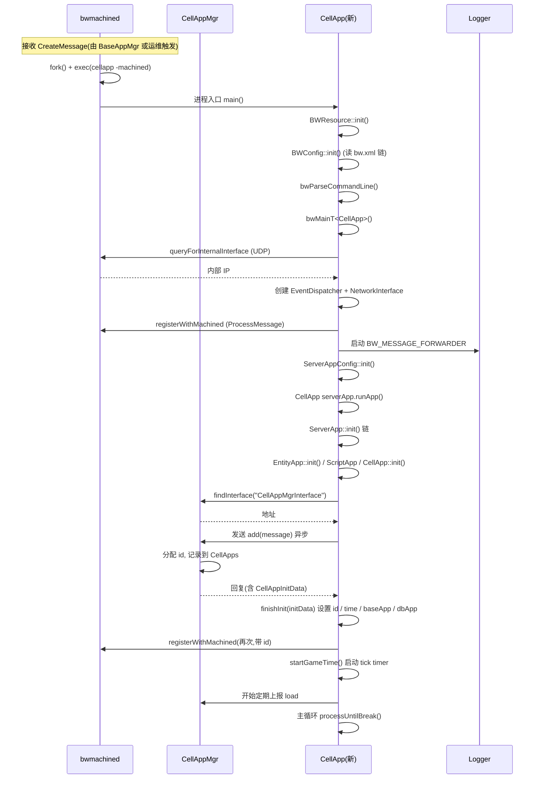

# 专题19:进程启动框架深度剖析

> BigWorld Engine 14.4.1 开源版 · 百科级中文技术专题
>
> 本专题系统剖析 BigWorld 引擎服务器端所有进程(CellApp / BaseApp / DBApp / LoginApp / CellAppMgr / BaseAppMgr / DBAppMgr / Reviver)从 `main()` 入口到主循环就绪的完整启动框架,覆盖类继承层次、模板方法、命令行解析、配置加载、网络初始化、脚本系统初始化、注册到 Manager、主消息循环、定时器回调、信号处理、关机流程、bwmachined 关系与 Reviver 故障恢复等所有关键技术点。

---

## 目录

- [1. 引言:BigWorld 进程体系与启动框架设计哲学](#1-引言bigworld-进程体系与启动框架设计哲学)
- [2. 类继承层次剖析:ServerApp → ScriptApp → EntityApp → ManagerApp](#2-类继承层次剖析serverapp--scriptapp--entityapp--managerapp)
- [3. ServerApp 模板方法:run() 算法骨架](#3-serverapp-模板方法run-算法骨架)
- [4. 启动流程总览(端到端)](#4-启动流程总览端到端)
- [5. 命令行解析:CommandLine 类](#5-命令行解析commandline-类)
- [6. 配置加载:BWConfiguration、hierarchical_config、bw.xml](#6-配置加载bwconfigurationhierarchical_configbwxml)
- [7. 网络初始化:NetworkInterface、Endpoint、端口绑定](#7-网络初始化networkinterfaceendpoint端口绑定)
- [8. Python 脚本系统初始化:Personality、import path](#8-python-脚本系统初始化personalityimport-path)
- [9. Watcher 与 HTTP 接口启动](#9-watcher-与-http-接口启动)
- [10. 各类应用启动序列详解](#10-各类应用启动序列详解)
  - [10.1 CellApp 启动详解](#101-cellapp-启动详解)
  - [10.2 BaseApp 启动详解](#102-baseapp-启动详解)
  - [10.3 DBApp 启动详解](#103-dbapp-启动详解)
  - [10.4 LoginApp 启动详解](#104-loginapp-启动详解)
  - [10.5 CellAppMgr 启动详解](#105-cellappmgr-启动详解)
  - [10.6 BaseAppMgr 启动详解](#106-baseappmgr-启动详解)
  - [10.7 DBAppMgr 启动详解](#107-dbappmgr-启动详解)
  - [10.8 Reviver 启动详解](#108-reviver-启动详解)
- [11. 主消息循环:MainMessageDispatcher 与 EventDispatcher](#11-主消息循环mainmessagedispatcher-与-eventdispatcher)
- [12. 定时器与回调机制](#12-定时器与回调机制)
- [13. 关机流程:优雅退出、资源释放](#13-关机流程优雅退出资源释放)
- [14. 信号处理:SIGINT/SIGTERM/SIGQUIT](#14-信号处理sigintsigtermsigquit)
- [15. bwmachined 与进程启动关系](#15-bwmachined-与进程启动关系)
- [16. 故障恢复启动:Reviver 重新拉起进程](#16-故障恢复启动reviver-重新拉起进程)
- [17. 启动诊断与调试技巧](#17-启动诊断与调试技巧)
- [18. 性能分析:启动耗时优化、并行启动](#18-性能分析启动耗时优化并行启动)
- [19. 设计权衡与替代方案](#19-设计权衡与替代方案)
- [20. 局限性与改进方向](#20-局限性与改进方向)
- [21. 完整实例:一个 CellApp 从 fork 到 ready 的端到端追踪](#21-完整实例一个-cellapp-从-fork-到-ready-的端到端追踪)
- [22. 附录 A:启动命令行参数全解](#22-附录-a启动命令行参数全解)
- [23. 附录 B:配置文件层次结构](#23-附录-b配置文件层次结构)
- [24. 附录 C:启动问题排查](#24-附录-c启动问题排查)
- [25. 总结](#25-总结)

---

## 1. 引言:BigWorld 进程体系与启动框架设计哲学

### 1.1 服务器集群进程拓扑

BigWorld Engine 是一款面向大型多人在线游戏(MMOG)的分布式服务器引擎。其运行时由一组分工明确、相互协作的进程组成,这些进程通过 Mercury UDP/TCP 网络栈以及一个名为 `bwmachined` 的本地守护进程进行通信和编排。典型的集群进程拓扑如下:

```
                       +--------------------+
                       |     bwmachined     |  本地守护进程(每台物理机一个)
                       |  (fork/exec/IPC)   |  MachineGuard UDP 协议
                       +---------+----------+
                                 |
            +--------------------+--------------------+
            |                    |                    |
     +------+------+      +------+------+      +-----+-------+
     | CellAppMgr  |      | BaseAppMgr  |      |  DBAppMgr   |
     |  (1实例)   |      |  (1实例)    |      |  (1实例)    |
     +------+------+      +------+------+      +------+------+
            |                    |                    |
            |           +--------+--------+           |
            |           |                 |           |
     +------+------+ +-----+------+ +----+------+
     |   CellApp   | |  BaseApp   | |   DBApp   |
     | (N 实例)    | | (N 实例)   | | (1+N 实例)|
     +------+------+ +-----+------+ +----+------+
            |                |             |
            +-------+--------+             |
                    |                      |
              +-----+------+         +----+------+
              |  LoginApp  |         |  Reviver  |
              | (1+N 实例) |         | (1 实例)  |
              +------------+         +-----------+
```

进程角色定位:

| 进程 | 数量 | 职责 | 基类 |
|------|------|------|------|
| `bwmachined` | 每台物理机一个 | 守护进程,负责 fork/exec 子进程、MachineGuard 协议、birth/death 通知、tags/cluster 管理 | 独立 |
| `CellAppMgr` | 集群内 1 个 | 管理 CellApp 的注册/退订、空间分配、负载均衡 | `ManagerApp` |
| `BaseAppMgr` | 集群内 1 个 | 管理 BaseApp 的注册、玩家登录路由、备份哈希 | `ManagerApp` |
| `DBAppMgr` | 集群内 1 个 | 管理 DBApp、协调 alpha 选举 | `ManagerApp` |
| `CellApp` | 多实例 | 跑实体 cell 部分、ghost、空间几何 | `EntityApp` |
| `BaseApp` | 多实例 | 跑实体 base 部分、客户端代理、客户端连接 | `EntityApp` |
| `DBApp` | 1 + 多 | 持久化、登录校验、ID 分配 | `ScriptApp` |
| `LoginApp` | 1 + 多 | 客户端登录入口、加密握手 | `ServerApp` |
| `Reviver` | 1 | 监控进程死亡、调度拉起 | `ServerApp` |

### 1.2 启动框架的设计哲学

BigWorld 启动框架并不使用一个"上帝对象"统一调度,而是采用 **模板方法 + 分层钩子** 的设计:

1. **统一入口宏 `BIGWORLD_MAIN`**:所有服务器进程的 `main()` 几乎一致,都通过该宏定义,内部转调 `bwMainT<APP_TYPE>()` 模板。
2. **`ServerApp` 作为模板方法基类**:定义 `runApp()` → `init()` → `run()` → `fini()` 的算法骨架,子类只需要重写其中各步骤的钩子。
3. **分层继承**:从 `ServerApp` 派生出 `ScriptApp`(支持 Python)、`EntityApp`(支持实体与定时器)、`ManagerApp`(管理器专用)。这些中间层各自在 `init()` 中调用父类 `init()` 再追加自身逻辑,形成层次化的初始化管线。
4. **异步初始化**:与 Manager 注册由 `AddToManagerHelper` 异步完成,完成后回调 `finishInit()` 才能继续后续步骤。这样保证了"找到 Manager→拿到 ID 与初始数据→启动游戏 tick"的顺序依赖。
5. **统一关机协议**:`ShutDownStage` 枚举定义了多阶段关机状态,通过 Mercury 消息在进程间传播。
6. **与 bwmachined 协同**:每个进程启动后会通过 `MachineGuard` 协议在本地 `bwmachined` 注册自己,从而获得 birth/death 通知、`findInterface` 服务等能力。

这种设计带来了两个直接收益:

- **新增进程类型的成本极低**:派生一个 `ServerApp` 子类、实现 `init/run/fini` 即可,通用基础设施(信号、配置、网络、watcher、Python、定时器、关机)都自动复用。
- **运维侧观测点统一**:所有进程的 `pid/uptime/gameTime/dateBuilt` 等 watcher 路径完全一致,运维工具不需要为每种进程单独适配。

### 1.3 与 bwmachined 的协作关系

`bwmachined` 是 BigWorld 在每台物理机上的本地守护进程(类似 systemd 的角色,但只针对 BigWorld 进程),其核心职责:

- **进程拉起**:接收 `CreateMessage`,fork/exec 出 CellApp、BaseApp 等子进程,并把它们的 stdout/stderr 转发到 logger。
- **进程注册**:子进程通过 `ProcessMessage` 在 `bwmachined` 中登记自己的端口、name、id、版本。
- **接口发现**:任何进程可以通过广播 `ProcessStatsMessage` 查询某接口名(如 `CellAppMgrInterface`)对应的地址,这就是 `MachineDaemon::findInterface()` 的底层。
- **birth/death 监听**:进程可以注册"当某接口出现/消失时回调我",由 `bwmachined` 通过 `ListenerMessage` 实现。
- **信号转发**:进程可以通过 `SignalMessage` 让 `bwmachined` 给另一个进程发信号(跨机也可)。
- **tags 与 cluster**:每台机的 `bwmachined` 持有一组 tag(如 `Components: cellApp baseApp`),用于声明该机可跑哪些进程;多台机的 `bwmachined` 通过 cluster 协议同步状态。
- **状态持久化**:`bwmachined` 在被 `SIGTERM` 时会把进程表写入 `/var/run/bwmachined.state`,以便重启后恢复。

因此,本专题讨论的"进程启动"既包括 C++ `main()` 的内部执行,也包括 `bwmachined` fork/exec 的外部编排,二者密不可分。

---

## 2. 类继承层次剖析:ServerApp → ScriptApp → EntityApp → ManagerApp

### 2.1 完整继承图

BigWorld 服务器端所有应用类的继承关系如下:

```
                      ServerApp  (基类,模板方法)
                      /         \
                     /           \
                ScriptApp       ManagerApp
                (Python)         (Manager 类基类)
                   |
                EntityApp
                (实体 + 定时器)
                   |
            +------+--------+---------+
            |               |         |
        CellApp         BaseApp    (其他派生如 ServiceApp)
            |
       (TimerHandler / Singleton 等多继承)

DBApp  ─── ScriptApp (直接派生)
LoginApp ─── ServerApp (直接派生,不依赖 Python)
Reviver ─── ServerApp (直接派生)
```

对应的源码声明如下:

- `ServerApp`: [server_app.hpp](file:///j:/Work/BigWorld-Engine-14.4.1/programming/bigworld/lib/server/server_app.hpp#L54-L195)
- `ScriptApp`: [script_app.hpp](file:///j:/Work/BigWorld-Engine-14.4.1/programming/bigworld/lib/server/script_app.hpp#L18-L45)
- `EntityApp`: [entity_app.hpp](file:///j:/Work/BigWorld-Engine-14.4.1/programming/bigworld/lib/server/entity_app.hpp#L34-L67)
- `ManagerApp`: [manager_app.hpp](file:///j:/Work/BigWorld-Engine-14.4.1/programming/bigworld/lib/server/manager_app.hpp#L14-L24)
- `CellApp`: [cellapp.hpp](file:///j:/Work/BigWorld-Engine-14.4.1/programming/bigworld/server/cellapp/cellapp.hpp#L68-L389)
- `BaseApp`: [baseapp.hpp](file:///j:/Work/BigWorld-Engine-14.4.1/programming/bigworld/server/baseapp/baseapp.hpp#L71-L74)
- `DBApp`: [dbapp.hpp](file:///j:/Work/BigWorld-Engine-14.4.1/programming/bigworld/server/dbapp/dbapp.hpp#L57-L62)
- `LoginApp`: [loginapp.hpp](file:///j:/Work/BigWorld-Engine-14.4.1/programming/bigworld/server/loginapp/loginapp.hpp#L48-L49)
- `Reviver`: [reviver.hpp](file:///j:/Work/BigWorld-Engine-14.4.1/programming/bigworld/server/reviver/reviver.hpp#L28-L29)

### 2.2 ServerApp:基础设施层

`ServerApp` 是所有服务器进程的根,提供以下"基础公共能力":

```cpp
// server_app.hpp 节选
class ServerApp
{
public:
    ServerApp( Mercury::EventDispatcher & mainDispatcher,
            Mercury::NetworkInterface & interface );

    Mercury::EventDispatcher & mainDispatcher()   { return mainDispatcher_; }
    Mercury::NetworkInterface & interface()        { return interface_; }

    bool runApp( int argc, char * argv[] );        // 模板方法入口
    void advanceTime();                             // 推进游戏时间

    virtual void requestRetirement();
    virtual void shutDown();
    virtual void onSignalled( int sigNum );

protected:
    virtual bool init( int argc, char * argv[] );
    virtual void fini() {}
    virtual bool run();
    virtual void onRunComplete() {}

    void enableSignalHandler( int sigNum, bool enable=true );
    virtual SignalHandler * createSignalHandler();
    void raiseFileDescriptorLimit( long limit );

    GameTime time_;
    Mercury::EventDispatcher & mainDispatcher_;
    Mercury::NetworkInterface & interface_;
    time_t startTime_;
    Updatables updatables_;
    std::auto_ptr< SignalHandler > pSignalHandler_;
};
```

它的关键设计要点:

1. **聚合而非持有 dispatcher 和 interface**:`ServerApp` 的构造函数接受外部传入的 `EventDispatcher &` 与 `NetworkInterface &`,这两者实际上是在 `bwMainT()` 中创建的(见第 4 章)。这样使得 `EventDispatcher` 可以被多个组件共享,且生命周期清晰。
2. **`runApp()` 是模板方法**:封装"init → run → fini"的固定顺序,子类无法改变这个顺序。
3. **`init/run/fini` 是 protected virtual**:子类通过重写这三个钩子来扩展自己的初始化、主循环、收尾逻辑。
4. **`time_` 与 `advanceTime()`**:维护一个"游戏时间 tick 计数",由 `advanceTime()` 在每个 tick 内自增并调用 `Updatables`。注意它不是物理时间,而是逻辑 tick。
5. **`Updatables updatables_`**:这是一个分层的 `Updatable *` 列表,每个 tick 调用一次,可按 level 排序(低 level 先调用)。`EntityApp`、`ScriptFrequentTasks` 等都通过 `registerForUpdate()` 注册进来。
6. **信号处理**:通过 `SignalProcessor` 单例(由 `FrequentTask` 驱动)分发到 `ServerApp::onSignalled()`。子类可重写 `createSignalHandler()` 提供自定义 handler。

### 2.3 ScriptApp:Python 脚本扩展层

`ScriptApp` 在 `ServerApp` 基础上增加 Python 解释器、Personality 脚本、`onInit/onFini` 事件机制与 Python telnet server:

```cpp
// script_app.hpp 节选
class ScriptApp : public ServerApp
{
public:
    virtual bool init( int argc, char * argv[] );
    bool initPersonality();
    bool triggerOnInit( bool isReload = false );
    void startPythonServer( uint16 port, int appID );

    ScriptEvents & scriptEvents() { return scriptEvents_; }
    bool triggerDelayableEvent( const char * eventName, PyObject * pArgs );

protected:
    virtual void fini();
    bool initScript( const char * componentName,
            const char * scriptPath1, const char * scriptPath2 = NULL );

private:
    ScriptEvents scriptEvents_;
    PythonServer * pPythonServer_;
};
```

要点:

- 构造时立即创建 `ScriptEvents` 并注册 `onInit` / `onFini` 两个事件类型,这两个事件可被 Personality 中的 Python 函数订阅。
- `initScript()` 调用 `Script::init(paths, componentName)` 完成嵌入 Python 解释器、设置 import path、注入 `BigWorld` 模块等基础工作。
- `triggerOnInit()` 通过 `triggerDelayableEvent("onInit", ...)` 触发监听器,如果监听器返回 Twisted `Deferred`,则会阻塞主循环直到所有 Deferred 完成(由 `DelayedEvent` 管理),这给 Python 端异步初始化留出了口子。
- `startPythonServer()` 启动一个 telnet 风格的 TCP 服务(默认 `PORT_PYTHON_CELLAPP + id`、`PORT_PYTHON_BASEAPP + id` 等),运维人员可远程连接进 Python 解释器进行调试。
- 析构时调用 `Script::fini()` 关闭 Python。

### 2.4 EntityApp:实体与定时器扩展层

`EntityApp` 是 `CellApp` 和 `BaseApp` 的共同基类,在 `ScriptApp` 基础上增加:

- `ScriptTimeQueue timeQueue_`:管理脚本定时器的时间队列。
- `ScriptTimers`:暴露给 Python 的 `BigWorld.addTimer` 实现。
- `BgTaskManager bgTaskManager_`:后台线程任务管理器(用于 IO 等可并行任务)。
- `tickStatsPeriod_`:周期性刷新统计信息。

```cpp
// entity_app.hpp 节选
class EntityApp : public ScriptApp
{
public:
    virtual bool init( int argc, char * argv[] );
    virtual void onSignalled( int sigNum );

    BgTaskManager & bgTaskManager() { return bgTaskManager_; }

protected:
    void addWatchers( Watcher & watcher );
    void tickStats();
    void callTimers();
    virtual void onSetStartTime( GameTime oldTime, GameTime newTime );
    virtual void onTickProcessingComplete();

    BgTaskManager bgTaskManager_;
    EntityAppTimeQueue timeQueue_;
    uint32 tickStatsPeriod_;
};
```

`EntityApp::init()` 还会显式启用 `SIGQUIT` 信号处理,这是因为 `*AppMgr` 在子进程长时间无响应时会通过 `bwmachined` 发送 `SIGQUIT`,让它 core dump 以便排查。

### 2.5 ManagerApp:Manager 类基类

`ManagerApp` 是 `CellAppMgr` / `BaseAppMgr` 的共同基类(注意 `DBAppMgr` 没有继承它,而是直接继承 `ServerApp`)。它的实现非常薄,主要提供 `addWatchers()` 的转发:

```cpp
// manager_app.hpp 全文
class ManagerApp : public ServerApp
{
public:
    ManagerApp( Mercury::EventDispatcher & mainDispatcher,
            Mercury::NetworkInterface & interface );
protected:
    void addWatchers( Watcher & watcher );
};
```

这种"几乎空"的中间层主要是为了未来扩展(如共享 Manager 间的协调逻辑)留出位置,而不是当前的功能需要。

### 2.6 SERVER_APP_HEADER 宏与多态元数据

为了让基类能拿到子类的"名字"和"配置路径",`ServerApp` 提供了一组宏:

```cpp
// server_app.hpp 节选
#define SERVER_APP_HEADER_CUSTOM_NAME( APP_NAME, CONFIG_PATH )            \
    static const char * appName()             { return #APP_NAME; }       \
    static const char * configPath()          { return #CONFIG_PATH; }   \
    virtual const char * getConfigPath() const { return #CONFIG_PATH; }

#define SERVER_APP_HEADER( APP_NAME, CONFIG_PATH )                       \
    SERVER_APP_HEADER_CUSTOM_NAME( APP_NAME, CONFIG_PATH )              \
    virtual const char * getAppName() const { return #APP_NAME; }
```

子类声明 `ENTITY_APP_HEADER( CellApp, cellApp )` 后,即可通过 `getAppName()` 得到 `"CellApp"`、通过 `getConfigPath()` 得到 `"cellApp"`。这两个值在:

- 启动日志中显示进程名(如 `---- CellApp is running ----`)。
- 配置文件路径查找时作为前缀(如读 `cellApp/updateHertz`)。
- watcher 注册时作为缩写(如 `cellapp03`)。
- bwmachined 注册时作为接口名后缀。

这是一种编译期多态的元数据机制,避免了运行时 RTTI 的开销。

---

## 3. ServerApp 模板方法:run() 算法骨架

### 3.1 runApp() 的总体结构

`ServerApp::runApp()` 是整个启动框架的核心模板方法,位于 [server_app.cpp#L253-L279](file:///j:/Work/BigWorld-Engine-14.4.1/programming/bigworld/lib/server/server_app.cpp#L253-L279):

```cpp
bool ServerApp::runApp( int argc, char * argv[] )
{
    stampsPerSecond();                                  // (1) 校准时间戳

    bool result = false;

    if (this->init( argc, argv ))                       // (2) 调用 init 链
    {
        INFO_MSG( "---- %s is running ----\n", this->getAppName() );
        result = this->run();                           // (3) 进入主循环
    }
    else
    {
        ERROR_MSG( "Failed to initialise %s\n", this->getAppName() );
    }

    this->fini();                                       // (4) 收尾

    interface_.prepareForShutdown();                    // (5) 网络层关闭准备

#if ENABLE_PROFILER
    g_profiler.fini();                                  // (6) profiler 落盘
#endif

    return result;
}
```

该方法的算法骨架固定为六步,顺序不可变,这就是"模板方法"模式的精髓。子类通过重写 `init()`、`run()`、`fini()` 来填充具体内容。

### 3.2 ServerApp::init() 基础初始化

基类 `ServerApp::init()` 完成所有进程都需要的基础工作,位于 [server_app.cpp#L197-L233](file:///j:/Work/BigWorld-Engine-14.4.1/programming/bigworld/lib/server/server_app.cpp#L197-L233):

```cpp
bool ServerApp::init( int argc, char * argv[] )
{
    PROFILER_SCOPED( ServerApp_init );

    bool runFromMachined = false;
    for (int i = 1; i < argc; ++i)
    {
        if (strcmp( argv[i], "-machined" ))            // 检测 -machined 启动参数
        {
            runFromMachined = true;
        }
    }
    INFO_MSG( "ServerApp::init: Run from bwmachined = %s\n", ... );

    pSignalHandler_.reset( this->createSignalHandler() ); // 创建信号 handler
    this->enableSignalHandler( SIGINT );                  // 默认仅处理 SIGINT

    this->raiseFileDescriptorLimit(
        ServerAppConfig::maxOpenFileDescriptors() );      // 提高文件描述符上限

    interface_.verbosityLevel( ServerAppConfig::isProduction() ?
        Mercury::NetworkInterface::VERBOSITY_LEVEL_NORMAL :
        Mercury::NetworkInterface::VERBOSITY_LEVEL_DEBUG );

    return true;
}
```

注意第 205 行有一个看似 bug 的写法 `if (strcmp( argv[i], "-machined" ))` —— `strcmp` 返回非 0 表示"不相等",所以这个分支在参数不等于 `-machined` 时进入并把 `runFromMachined` 置为 true。这是 BigWorld 14.4.1 源码中一处疑似笔误的历史遗留,但因其结果只是用来打一条 INFO 日志,实际行为影响很小。运维人员需要知道,日志中"Run from bwmachined"字段的真假并不准确反映真实启动来源。

### 3.3 init() 链的层次化调用

每个中间层 `init()` 都先调用父类 `init()`,再追加自己的逻辑。例如 `ScriptApp::init()`:

```cpp
// script_app.cpp#L59-L67
bool ScriptApp::init( int argc, char * argv[] )
{
    if (!this->ServerApp::init( argc, argv ))   // 调用父类
        return false;
    return true;
}
```

`EntityApp::init()`:

```cpp
// entity_app.cpp#L74-L83
bool EntityApp::init( int argc, char * argv[] )
{
    if (!this->ScriptApp::init( argc, argv ))   // 调用父类
        return false;
    this->enableSignalHandler( SIGQUIT );        // EntityApp 追加 SIGQUIT
    return true;
}
```

`CellApp::init()`:

```cpp
// cellapp.cpp#L489-L654
bool CellApp::init( int argc, char * argv[] )
{
    if (!EntityApp::init( argc, argv ))          // 调用父类
        return false;
    if (!interface_.isGood()) ...               // 检查网络接口
    Entity::s_init();                            // 实体静态初始化
    AutoConfig::configureAllFrom( "resources.xml" );  // 资源配置
    cellAppMgr_.init( "CellAppMgrInterface", ... );  // 找 CellAppMgr
    CellAppInterface::registerWithInterface( interface_ ); // 注册接口
    pViewerServer_ = new CellViewerServer( *this );  // 启动 viewer
    this->initExtensions();                      // 加载扩展 DLL
    fileIOTaskManager_.startThreads( "FileIO", 1 );   // 启动文件 IO 线程
    bgTaskManager_.startThreads( "BGTask Manager", 1 );
    this->addWatchers();                         // 注册 watcher
    this->initScript();                          // 初始化 Python
    EntityType::init();                          // 初始化实体类型
    UserDataObjectType::init();
    pTerrainManager_ = ...;                       // 初始化地形
    /* 添加几个 timer */
    new AddToCellAppMgrHelper( *this, pViewerServer_->port() );  // 异步注册到 CellAppMgr
    return true;
}
```

这种"洋葱式"调用保证了通用初始化先于专用初始化,资源依赖关系清晰。

### 3.4 run() 与主循环

`ServerApp::run()` 默认实现非常简单:

```cpp
// server_app.cpp#L240-L247
bool ServerApp::run()
{
    mainDispatcher_.processUntilBreak();    // 阻塞在事件循环里,直到 breakProcessing() 被调用
    this->onRunComplete();
    return true;
}
```

`processUntilBreak()` 是 `EventDispatcher` 的核心循环,内部反复执行:

```
while (!breakProcessing_) {
    processFrequentTasks();   // 频繁任务(信号处理、网络发送等)
    processTimers();          // 到期定时器回调
    processNetwork( true );   // select/poll 网络事件
    processStats();           // 统计 spareTime
}
```

绝大多数进程不需要重写 `run()`,而是通过 `addTimer()`、`addFrequentTask()`、`registerFileDescriptor()` 注册回调,让 `EventDispatcher` 来驱动自己。`Reviver` 是少数重写了 `run()` 的进程,但只是先检查 `hasEnabledComponents()` 再调父类。

### 3.5 fini() 链

`fini()` 是 `init()` 的镜像,用于收尾。基类 `ServerApp::fini()` 默认空实现。`ScriptApp::fini()` 会在最后触发 `onFini` 事件,让 Python 端做清理:

```cpp
// script_app.cpp#L75-L78
void ScriptApp::fini()
{
    this->triggerDelayableEvent( "onFini", PyTuple_New( 0 ) );
}
```

注意 `runApp()` 在 `init()` 失败时也会调用 `fini()` —— 这意味着 `fini()` 必须容忍"init 中途失败"的部分初始化状态,不能假设某个成员已经初始化。BigWorld 的实现里,大部分成员是智能指针或带空检查的容器,所以这条规则基本被遵守。

---

## 4. 启动流程总览(端到端)

### 4.1 从 bwmachined fork 到进程 ready

一次典型的 CellApp 启动端到端流程如下:



### 4.2 main() 函数宏:BIGWORLD_MAIN

每个服务器进程的 `main.cpp` 都极简:

```cpp
// cellapp/main.cpp 全文
#include "cellapp.hpp"
#include "cellapp_config.hpp"
#include "server/bwservice.hpp"

BW_USE_NAMESPACE

int BIGWORLD_MAIN( int argc, char * argv[] )
{
    return bwMainT< CellApp >( argc, argv );
}
```

`BIGWORLD_MAIN` 宏在 Linux 平台展开为:

```cpp
// bwservice.hpp 节选
#define BIGWORLD_MAIN                                                \
bwMain( int argc, char * argv[] );                                   \
int main( int argc, char * argv[] )                                 \
{                                                                   \
    BW_SYSTEMSTAGE_MAIN();                                          \
    BWResource bwresource;                                          \
    BWResource::init( argc, (const char **)argv );                  \
    BWConfig::init( argc, argv );                                   \
    bwParseCommandLine( argc, argv );                               \
    return bwMain( argc, argv );                                    \
}                                                                   \
int bwMain
```

也就是 `main()` 在调用真正的 `bwMain(=BIGWORLD_MAIN 后的函数体)` 之前,会先:

1. `BW_SYSTEMSTAGE_MAIN()`:设置 BigWorld 内部的"系统阶段"标记(用于 profiler 区分启动阶段)。
2. `BWResource bwresource;`:声明一个 `BWResource` 实例,确保其构造和析构覆盖整个 `main()` 生命周期(它管理资源路径、文件句柄等)。
3. `BWResource::init(argc, argv)`:解析资源路径(从命令行 `--res`、环境变量 `BW_RES_PATH`、或默认值),这是后续 `BWResource::openSection()` 等访问资源的前提。
4. `BWConfig::init(argc, argv)`:加载 `server/bw.xml` 配置链(详见第 6 章)。
5. `bwParseCommandLine(argc, argv)`:解析少数特殊命令行参数(`-machined` 关闭控制台输出),并把 `config/shouldWriteToConsole` 注册为 watcher。

完成上述步骤后才进入 `bwMain()`,即用户写的进程体。

### 4.3 bwMainT 模板

`bwMainT<APP_TYPE>` 是把"通用启动逻辑"封装为模板的入口,位于 [bwservice.hpp#L97-L138](file:///j:/Work/BigWorld-Engine-14.4.1/programming/bigworld/lib/server/bwservice.hpp#L97-L138):

```cpp
template <class SERVER_APP>
int bwMainT( int argc, char * argv[], bool shouldLog = true )
{
    Mercury::EventDispatcher dispatcher;                              // (1) 事件分发器

    if (!Mercury::MachineDaemon::queryForInternalInterface(           // (2) 询问内部 IP
            ServerApp::discoveredInternalIP ))
    {
        WARNING_MSG( "bwMainT: Unable to determine internal interface..." );
    }

    BW::string internalInterfaceName =
            getBWInternalInterfaceSetting( SERVER_APP::configPath() );  // (3) 内部网卡名

    Mercury::NetworkInterface interface( &dispatcher,                   // (4) 网络 interface
            Mercury::NETWORK_INTERFACE_INTERNAL, 0,
            internalInterfaceName.c_str() );

    SignalProcessor signalProcessor( dispatcher );                      // (5) 信号处理器

    BW_MESSAGE_FORWARDER3( SERVER_APP::appName(),                      // (6) 日志转发器
        SERVER_APP::configPath(), ENABLED=shouldLog, dispatcher, interface );

    START_MSG( SERVER_APP::appName() );                                 // (7) 启动 banner

    if (internalInterfaceName != Mercury::NetworkInterface::USE_BWMACHINED)
    {
        CONFIG_WARNING_MSG( "internalInterface set to '%s' in bw.xml. "
                "This option is deprecated. ...", ... );
    }

    int result = doBWMainT< SERVER_APP >( dispatcher, interface, argc, argv );

    INFO_MSG( "%s has shut down.\n", SERVER_APP::appName() );
    return result;
}
```

七步详解:

**(1) EventDispatcher**:这是整个进程的事件中枢。它内部维护:

- `TimeQueue64 *`:定时器队列。
- `FrequentTasks *`:频繁任务链表(每个 tick 都调用一次)。
- `EventPoller *`:基于 epoll/kqueue/select 的网络事件轮询器。
- `childDispatchers_`:子 dispatcher 链(允许嵌套事件循环,如 `BlockingReplyHandler`)。

**(2) queryForInternalInterface**:通过 MachineGuard 协议问本地 `bwmachined`:"这台机的'内部网络'IP 是什么?"。`bwmachined` 在被安装时通常配置了一个广播路由,知道哪块网卡走内网。返回值写入静态成员 `ServerApp::discoveredInternalIP`,后续 `NetworkInterface` 会用到。

**(3) getBWInternalInterfaceSetting**:从 `bw.xml` 中读 `<{configPath}/internalInterface>` 或 `<internalInterface>`,默认是 `"USE_BWMACHINED"`,意为沿用 `bwmachined` 的内部接口。这是个已废弃的选项,官方推荐保持默认。

**(4) NetworkInterface**:这是进程的 UDP 收发器,绑定到一个端口(传 `0` 表示由 OS 随机分配)。它的关键成员:

- `Endpoint`:封装 socket fd。
- `InterfaceTable`:接口消息分发表(从 `InterfaceElement` 注册)。
- `ChannelMap`:已建立 channel 的映射(对端地址 → UDPChannel)。
- `RequestManager`:未完成的请求(等待回复的 bundle)。

**(5) SignalProcessor**:信号处理器。它通过 `FrequentTask` 在每个 tick 检查"信号集",如果有信号到达,就分发到对应的 `SignalHandler`。这样把"信号处理"变成"主线程异步处理",避免了在信号处理函数里调用非可重入函数的危险。

**(6) BW_MESSAGE_FORWARDER3**:宏,创建 `LoggerMessageForwarder` 实例,把所有 `DEBUG_MSG/INFO_MSG/...` 通过 UDP 转发给远端 `bwlogger`(如果配置了),同时也写本地日志。

**(7) START_MSG**:打印启动 banner,包含版本号、构建时间、用户、PID、CPU、内存、资源路径等。

### 4.4 doBWMainT 模板

```cpp
// bwservice.hpp#L78-L94
template <class SERVER_APP>
int doBWMainT( Mercury::EventDispatcher & dispatcher,
        Mercury::NetworkInterface & interface,
        int argc, char * argv[] )
{
    if (!ServerAppConfig::init( SERVER_APP::Config::postInit ))
    {
        CONFIG_ERROR_MSG( "Failed to initialise configuration options." );
        return -1;
    }

    SERVER_APP serverApp( dispatcher, interface );            // 构造应用对象
    serverApp.setBuildDate( __TIME__, __DATE__ );

    return serverApp.runApp( argc, argv ) ? EXIT_SUCCESS : EXIT_FAILURE;
}
```

`ServerAppConfig::init()` 在这里完成所有 `ServerAppOption<T>` 静态成员的初始化(从 `bw.xml` 对应路径读取),并调用 `SERVER_APP::Config::postInit`(每个子类有自己的 `Config` 类,如 `CellAppConfig::postInit`)做最后调整。这样当 `serverApp` 构造时,所有配置项已经就绪。

构造 `SERVER_APP` 对象时,会沿继承链一路构造(`ServerApp` → `ScriptApp` → `EntityApp` → `CellApp`),每一层都会注册自己的 watcher。例如 `ServerApp` 构造里:

```cpp
// server_app.cpp#L79-L113 节选
MF_WATCH( "gameTimeInTicks", time_, Watcher::WT_READ_ONLY );
MF_WATCH( "gameTimeInSeconds", *this, &ServerApp::gameTimeInSeconds );
MF_WATCH( "uptime", *this, &ServerApp::uptime );
MF_WATCH( "uptimeInSeconds", *this, &ServerApp::uptimeInSeconds );
MF_WATCH( "dateBuilt", *this, &ServerApp::buildDate );
MF_WATCH( "dateStarted", *this, &ServerApp::startDate );
MF_WATCH( "pid", mf_getpid, "pid of this process" );
MF_WATCH( "uid", getUserId, "uid of the user running this process" );
interface_.pExtensionData( this );   // 让 Mercury 回调时能拿回 ServerApp*
```

最后一行很关键:它把 `ServerApp*` 存到 `NetworkInterface` 的 `extensionData` 槽里,这样当消息到达时,消息处理函数可以通过 `header.pInterface->pExtensionData()` 拿回 `ServerApp*` 并转回具体子类。

### 4.5 时序总览图

把以上各步整合起来,得到完整的启动时序:

```
1. bwmachined fork() 出新进程
2. main() 入口
   2.1 BW_SYSTEMSTAGE_MAIN()
   2.2 BWResource::init()         // 资源路径
   2.3 BWConfig::init()            // bw.xml 链
   2.4 bwParseCommandLine()        // -machined 等
3. bwMainT<APP>() 模板
   3.1 EventDispatcher dispatcher 创建
   3.2 queryForInternalInterface()  // 询问 bwmachined 内部 IP
   3.3 NetworkInterface interface 创建(UDP 绑定)
   3.4 SignalProcessor signalProcessor 创建
   3.5 LoggerMessageForwarder 启动
   3.6 START_MSG() 打印 banner
4. doBWMainT<APP>()
   4.1 ServerAppConfig::init()    // 加载 ServerAppOption
   4.2 SERVER_APP 构造(注册 watcher)
   4.3 serverApp.runApp(argc, argv)
5. ServerApp::runApp()
   5.1 stampsPerSecond()          // 校准时钟
   5.2 this->init(argc, argv)     // 沿继承链洋葱式调用
       5.2.1 ServerApp::init()    // 信号、fd limit、verbose
       5.2.2 ScriptApp::init()    // (有 Python 的进程)
       5.2.3 EntityApp::init()    // (有实体的进程) 启用 SIGQUIT
       5.2.4 CellApp::init()      // 找 Manager、注册接口、initScript、AddToManagerHelper
   5.3 INFO "---- XXX is running ----"
   5.4 this->run()                // processUntilBreak() 阻塞主循环
       期间:定时器回调、网络消息、Updatables::call() 持续触发
       期间:由 SHUTDOWN_REQUEST 等触发关机
   5.5 this->fini()               // 反向清理
   5.6 interface_.prepareForShutdown()
   5.7 g_profiler.fini()
6. 返回 EXIT_SUCCESS / EXIT_FAILURE
7. bwmachined 收到子进程退出,清理 procs 表
```

---

## 5. 命令行解析:CommandLine 类

### 5.1 两种命令行解析机制

BigWorld 服务器端实际上有"两套"命令行解析机制,需要分清:

1. **BWConfig 命令行覆写**:在 `BWConfig::processCommandLine()` 中处理,以 `+key value` 形式覆写 `bw.xml` 中的配置项。
2. **传统 `-xxx` / `--xxx` 开关**:在 `bwParseCommandLine()`、各 `init()` 中用 `strcmp` 手工解析。

### 5.2 BWConfig 命令行覆写

`BWConfig::processCommandLine()` 位于 [bwconfig.cpp#L243-L269](file:///j:/Work/BigWorld-Engine-14.4.1/programming/bigworld/lib/server/bwconfig.cpp#L243-L269):

```cpp
bool processCommandLine( int argc, char * argv[] )
{
    if (!g_sections.empty())
    {
        DataSectionPtr pDS = g_sections.front().first;
        for (int i = 0; i < argc - 1; ++i)
        {
            if (argv[i][0] == '+')                       // 形如 +baseApp/updateHertz 20
            {
                pDS->writeString( argv[i]+1, argv[ i+1 ] );
                INFO_MSG( "BWConfig::init: Setting '%s' to '%s' from command line.\n",
                    argv[i]+1, argv[ i+1 ] );
                ++i;
            }
        }
    }
    return true;
}
```

这意味着你可以这样启动进程:

```
./cellapp +cellApp/updateHertz 20 +cellApp/internalPort 30001
```

`+` 后面是配置项的"路径"(用 `/` 分层),后面跟着值。这会临时覆写最顶层 `bw.xml`(即 `server/bw.xml`)中的同名节点,效果相当于在该文件中加 `<updateHertz>20</updateHertz>`。注意它写入的是 `g_sections.front()`,即链中最顶层的那个 bw.xml,而不是父文件,所以父文件的值仍可继承。

### 5.3 bwParseCommandLine 与 -machined

`bwParseCommandLine()` 在 [bwservice.cpp#L6-L18](file:///j:/Work/BigWorld-Engine-14.4.1/programming/bigworld/lib/server/bwservice.cpp#L6-L18):

```cpp
void bwParseCommandLine( int argc, char **argv )
{
    MF_WATCH( "config/shouldWriteToConsole", DebugFilter::shouldWriteToConsole );

    for (int i=1; i < argc; i++)
    {
        if (strcmp( argv[i], "-machined" ) == 0)
        {
            DebugFilter::shouldWriteToConsole( false );   // 由 bwmachined 拉起的进程不写控制台
        }
    }
}
```

`-machined` 是一个特殊开关,表示"我由 `bwmachined` 拉起,stdout 会被 bwmachined 接管转发给 logger,因此不要把日志再写到控制台"。这避免了日志重复。

### 5.4 各进程自带的命令行参数

除了通用机制,各进程在自己的 `init()` 中解析专属参数。以下是主要参数汇总:

| 进程 | 参数 | 含义 |
|------|------|------|
| 所有 | `-machined` | 由 bwmachined 拉起,关闭控制台日志输出 |
| 所有 | `+path value` | 覆写 bw.xml 配置项 |
| CellAppMgr / BaseAppMgr / DBAppMgr | `-recover` | 启动时进入故障恢复模式 |
| Reviver | `--add {component}` | 仅启用指定组件的恢复(默认全部启用) |
| Reviver | `--del {component}` | 排除指定组件的恢复 |
| Reviver | `--help` | 打印用法 |
| BaseApp(可执行文件名为 `serviceapp`) | (无显式参数) | 由 `argv[0]` basename 判断是否为 serviceapp 模式 |
| 所有 Windows 进程 | `-install [name] [display]` | 注册为 Windows 服务 |
| 所有 Windows 进程 | `-remove [name]` | 卸载 Windows 服务 |
| 所有 Windows 进程 | `-?` / `-help` / `--help` | 打印用法 |

注意 `BaseApp` 与 `ServiceApp` 共用同一个可执行文件 —— 在 [baseapp/main.cpp](file:///j:/Work/BigWorld-Engine-14.4.1/programming/bigworld/server/baseapp/main.cpp) 中:

```cpp
int BIGWORLD_MAIN( int argc, char * argv[] )
{
    if (isServiceApp( argc, argv ))   // 检查 argv[0] basename 是否为 "serviceapp"
        return bwMainT< ServiceApp >( argc, argv );
    else
        return bwMainT< BaseApp >( argc, argv );
}
```

也就是说,把 `baseapp` 二进制重命名(或软链接)为 `serviceapp` 后再启动,它就变成 ServiceApp 模式。这是 BigWorld 用一个二进制支持两种角色的简单技巧。

### 5.5 CommandLine 工具类

`CommandLine` 类位于 [cstdmf/command_line.hpp](file:///j:/Work/BigWorld-Engine-14.4.1/programming/bigworld/lib/cstdmf/command_line.hpp),它把一个字符串拆分成参数数组,并提供 `hasParam()`、`getParam()`、`getParamByIndex()` 等查询方法:

```cpp
class CommandLine
{
    typedef BW::vector< BW::string > Params;
    Params params_;
public:
    CommandLine( const char* commandLine );
    bool hasParam( const char* param, const char* commandSwitch = "/-" ) const;
    const char* getParam( const char* param, const char* commandSwitch = "/-" ) const;
    bool hasFullParam( const char* paramToFind, int paramIndex = -1 ) const;
    const char* getFullParam( const char* paramToFind, int paramIndex = -1 ) const;
    const char* getParamByIndex( int paramIndex ) const;
    static bool hasSwitch( const char* param, const char* commandSwitch = "/-" );
    size_t size() const;
    const BW::string& param( size_t index ) const;
};
```

它主要用于工具类程序(如 `bwlauncher`、`model editor` 等),服务器进程的 `init()` 大多直接用 `strcmp` 解析,因为参数数量少且固定。

---

## 6. 配置加载:BWConfiguration、hierarchical_config、bw.xml

### 6.1 配置文件层次结构

BigWorld 的配置体系以 `server/bw.xml` 为入口,通过 `parentFile` 节点形成链式继承:

```xml
<!-- server/bw.xml 示例 -->
<root>
    <parentFile>server/bw.production.xml</parentFile>
    <updateHertz>10</updateHertz>
    <baseApp>
        <externalPort>20013</externalPort>
        <clientChannelTimeout>30</clientChannelTimeout>
    </baseApp>
    <cellApp>
        <updateHertz>10</updateHertz>
        <personality>CellApp</personality>
    </cellApp>
    ...
</root>
```

加载顺序:`server/bw.xml` → 读 `parentFile` → 加载 `bw.production.xml` → 再读其 `parentFile` → …… 直到没有 `parentFile`。所有这些 DataSection 构成一个 `Container`(vector),查询时按"子优先于父"的顺序查找。

### 6.2 BWConfig::init() 的加载流程

`BWConfig::init()` 在 [bwconfig.cpp#L176-L241](file:///j:/Work/BigWorld-Engine-14.4.1/programming/bigworld/lib/server/bwconfig.cpp#L176-L241):

```cpp
void init()
{
    const char * BASE_FILENAME = "server/bw.xml";
    g_inited = true;
    g_sections.clear();
    BW::string filename = BASE_FILENAME;

    // 优先尝试个性化配置文件 bw_<username>.xml
    bool isUserFilename = false;
    struct passwd * pPasswordEntry = ::getpwuid( ::getUserId() );
    if (pPasswordEntry && (pPasswordEntry->pw_name != NULL))
    {
        filename = BW::string( "server/bw_" ) +
            pPasswordEntry->pw_name + ".xml";
        isUserFilename = true;
    }

    while (!filename.empty())
    {
        BWResource::instance().purge( filename );   // 清缓存,确保重读
        DataSectionPtr pDS = BWResource::openSection( filename );

        if (pDS)
        {
            INFO_MSG( "BWConfig::init: Adding %s\n", filename.c_str() );
            g_sections.push_back( std::make_pair( pDS, filename ) );
            filename = pDS->readString( "parentFile" );   // 读 parentFile 链
        }
        else if (isUserFilename && !BWResource::fileExists( filename ))
        {
            filename = "server/bw.xml";                   // 个性化文件不存在,fallback
        }
        else
        {
            // ... 错误处理,设置 badFilename
            filename = "";
        }
        isUserFilename = false;
    }

    update( "debugConfigOptions", shouldDebug );           // 调试开关
    DebugFilter::instance().filterThreshold(
        (DebugMessagePriority)BWConfig::get< uint32 >( "outputFilterThreshold", ... ));
    DebugFilter::instance().hasDevelopmentAssertions(
        BWConfig::get( "hasDevelopmentAssertions", ... ));
}
```

要点:

1. **个性化配置**:首先尝试 `server/bw_<username>.xml`,这让多人在同一台开发机上互不干扰地跑各自的配置。
2. **链式继承**:通过 `parentFile` 节点把多个文件串起来,`g_sections` 是一个 vector,索引 0 是最具体的(子),最后是最通用的(父)。
3. **查询优先级**:`getSection(path)` 从 vector 头到尾遍历,第一个找到的胜出,所以子文件覆盖父文件。
4. **重新加载**:每次 `init()` 都会 `BWResource::instance().purge(filename)`,清掉之前缓存的 DataSection,从而支持热重载。
5. **debugFilter 集成**:从配置读取日志过滤阈值和"是否启用开发期断言",影响后续所有 `DEBUG_MSG`、`INFO_MSG` 等的输出。

### 6.3 BWConfig::get<T>() 模板

`BWConfig::get<T>(path, defaultValue)` 是查询配置的主接口,模板化以支持不同类型:

```cpp
template <class C>
C get( const char * path, const C & defaultValue )
{
    DataSectionPtr pSect = getSection( path );
    if (shouldDebug)
        printDebug( path, defaultValue, pSect ? pSect->as( defaultValue ) : defaultValue, pSect );
    if (pSect)
        return pSect->as( defaultValue );
    return defaultValue;
}
```

`DataSection::as<T>()` 会根据类型从 XML 节点文本解析出对应类型。例如 `<updateHertz>10</updateHertz>` 调用 `BWConfig::get<int>( "updateHertz", 10 )` 会返回 `10`。

### 6.4 ServerAppOption 静态配置对象

`ServerAppConfig` 类用 `ServerAppOption<T>` 模板把配置项"对象化",提供:

- 启动时一次性从 `bw.xml` 读入初值(通过 `ServerAppConfig::init()` 调用)。
- 运行时通过 `watcher` 动态修改(写回 `bw.xml` 不支持,但 watcher 修改在内存中生效)。
- 类型安全的访问接口。

```cpp
// server_app_config.hpp 节选
class ServerAppConfig
{
public:
    static ServerAppOption< int > updateHertz;
    static ServerAppOption< BW::string > personality;
    static ServerAppOption< BW::string > serverMode;
    static ServerAppOption< bool > isProduction;
    static ServerAppOption< float > timeSyncPeriod;
    static ServerAppOption< int > timeSyncPeriodInTicks;
    static ServerAppOption< bool > useDefaultSpace;
    static ServerAppOption< long > maxOpenFileDescriptors;
    static ServerAppOptionGetSet< float > channelTimeoutPeriod;
    static ServerAppOptionGetSet< bool > allowInteractiveDebugging;
    static ServerAppOption< uint > maxSharedDataValueSize;
    static ServerAppOption< float > maxMgrRegisterStagger;
    static ServerAppOption< int > numStartupRetries;
    // ...
};
```

各子类有自己的 `XxxConfig`(如 `CellAppConfig`、`BaseAppConfig`、`DBAppConfig`、`LoginAppConfig`、`ReviverConfig`、`CellAppMgrConfig` 等),它们继承 `ServerAppConfig` 并追加自己的选项。`bwMainT()` 在 `doBWMainT` 中调用 `ServerAppConfig::init( SERVER_APP::Config::postInit )`,完成所有选项的初始化,包括调用各子类的 `postInit` 钩子。

### 6.5 典型配置项示例

| 配置项 | 默认值 | 含义 |
|--------|--------|------|
| `updateHertz` | 10 | 游戏 tick 频率,每秒 10 个 tick |
| `personality` | (随进程) | Python personality 脚本名 |
| `isProduction` | false | 生产模式开关(影响 verbose、断言等) |
| `timeSyncPeriod` | 1.0 | 时间同步周期(秒) |
| `maxOpenFileDescriptors` | -1 | 文件描述符上限,-1 表示不调整 |
| `numStartupRetries` | 60 | 启动时查找其他接口的最大重试次数 |
| `maxMgrRegisterStagger` | 0 | 注册到 Manager 时随机延迟的最大秒数 |
| `monitoringInterface` | (空) | 监听接口名(默认与 internal 相同) |
| `internalInterface` | USE_BWMACHINED | 内部网络接口(已废弃,建议保持默认) |
| `outputFilterThreshold` | DEBUG_MSG | 日志过滤阈值 |
| `hasDevelopmentAssertions` | true | 开发期断言是否触发 CRITICAL |

---

## 7. 网络初始化:NetworkInterface、Endpoint、端口绑定

### 7.1 NetworkInterface 的创建

`bwMainT()` 中创建 `NetworkInterface` 的代码:

```cpp
Mercury::NetworkInterface interface( &dispatcher,
        Mercury::NETWORK_INTERFACE_INTERNAL, 0,
        internalInterfaceName.c_str() );
```

四个参数:

1. `&dispatcher`:绑定的 `EventDispatcher`,后续 socket fd 会注册到该 dispatcher 的 `EventPoller`。
2. `NETWORK_INTERFACE_INTERNAL`:接口类型,另一种是 `NETWORK_INTERFACE_EXTERNAL`(用于 BaseApp / LoginApp 对客户端的接口)。
3. `0`:监听端口,`0` 表示由 OS 分配随机端口。
4. `internalInterfaceName.c_str()`:绑定到的网卡名,`"USE_BWMACHINED"` 表示用 `bwmachined` 探测到的内网网卡。

### 7.2 Endpoint 与端口绑定

`Endpoint` 是 BigWorld 对 BSD socket 的封装。`NetworkInterface` 在构造时:

1. 创建一个 `SOCK_DGRAM`(UDP)socket。
2. 调用 `Endpoint::getInterfaceAddress(name, &ifaddr)` 找到指定网卡的 IP。
3. 调用 `bind(port, ifaddr)` 绑定。
4. 把 socket fd 注册到 `EventPoller`,监听读事件。
5. 设置 socket 选项:`SO_REUSEADDR`、`SO_RCVBUF`/`SO_SNDBUF`(根据配置)、非阻塞模式。

如果绑定失败(端口被占用等),`isGood()` 返回 false,各进程的 `init()` 会因此中止启动。

### 7.3 ServerApp::bindToPrescribedPort 与 bindToRandomPort

某些进程(BaseApp / LoginApp)需要绑定到指定的"对外端口"(client 连接端口),并要求 UDP 与 TCP 共用同一端口号。`ServerApp` 提供两个静态方法:

```cpp
// server_app.cpp#L562-L623 节选
bool ServerApp::bindToPrescribedPort( Mercury::NetworkInterface & networkInterface, 
        Mercury::TCPServer & tcpServer,
        const BW::string & externalInterfaceAddress, const Ports & ports )
{
    // 先尝试当前端口
    if (networkInterface.isGood() && tcpServer.init())
        return true;
    if (ports.empty()) return false;

    Ports::const_iterator iPort = ports.begin();
    ++iPort;  // 跳过第一个,已经试过了
    while (iPort != ports.end())
    {
        uint16 port = static_cast<uint16>( *iPort );
        if (networkInterface.recreateListeningSocket( htons( port ), 
                externalInterfaceAddress.c_str() ))
        {
            if (tcpServer.initWithPort( htons( port ) ))
                return true;
        }
        ++iPort;
    }
    return false;
}
```

`bindToRandomPort` 类似,只是随机选端口,最多重试 20 次(`RANDOM_PORT_RETRIES`)。这两个方法配合 `bw.xml` 中的 `baseApp/externalPorts` 列表使用,实现"指定端口优先,失败回退到下一个"的弹性绑定。

### 7.4 registerWithMachined 与端口宣告

绑定端口后,进程会通过 `XxxInterface::registerWithMachined()` 把自己宣告给 `bwmachined`,这一步在 [machined_utils.cpp#L50-L85](file:///j:/Work/BigWorld-Engine-14.4.1/programming/bigworld/lib/network/machined_utils.cpp#L50-L85):

```cpp
Reason registerWithMachined( const Address & srcAddr,
        const BW::string & name, int id, bool isRegister )
{
    ProcessMessage pm;
    pm.param_ = (isRegister ? pm.REGISTER : pm.DEREGISTER) | pm.PARAM_IS_MSGTYPE;
    pm.category_ = ProcessMessage::SERVER_COMPONENT;
    pm.port_ = srcAddr.port;
    pm.name_ = name;
    pm.id_ = id;
    pm.majorVersion_ = BWVersion::majorNumber();
    pm.minorVersion_ = BWVersion::minorNumber();
    pm.patchVersion_ = BWVersion::patchNumber();

    ProcessMessageHandler pmh;
    const uint32 destAddr = LOCALHOST;
    Reason response = pm.sendAndRecv( srcAddr.ip, destAddr, &pmh );
    return pmh.hasResponded_ ? response : REASON_TIMER_EXPIRED;
}
```

`bwmachined` 收到 `ProcessMessage` 后,在自己的 `procs_` 表中登记这个进程的 name、id、port、pid、uid、版本等,后续其他进程查询 `findInterface(name, id)` 时就能找到它。这里 `destAddr = LOCALHOST` 表示 `bwmachined` 永远在本地(127.0.0.1)的 `PORT_MACHINED`(20018)端口。

### 7.5 findInterface 与接口发现

`MachineDaemon::findInterface()` 是进程启动时找其他进程的标准方法:

```cpp
// machined_utils.cpp#L339-L410 节选
Reason findInterface( const char * name, int id,
        Address & addr, int retries, bool verboseRetry,
        IFindInterfaceHandler * pHandler )
{
    ProcessStatsMessage pm;
    pm.param_ = pm.PARAM_USE_CATEGORY | pm.PARAM_USE_UID |
                pm.PARAM_USE_NAME | (id <= 0 ? 0 : pm.PARAM_USE_ID);
    pm.category_ = pm.SERVER_COMPONENT;
    pm.uid_ = getUserId();
    pm.name_ = name;
    pm.id_ = id;

    int attempt = 0;
    retries = std::max( retries, 1 );
    while (++attempt <= retries)
    {
        Reason reason = pm.sendAndRecv( 0, BROADCAST, pHandler );
        // ... 处理结果
        if (result != Address::NONE)
        {
            addr = result;
            return REASON_SUCCESS;
        }
        sleep( 1 );   // 失败后等 1 秒重试
    }
    return REASON_TIMER_EXPIRED;
}
```

它广播一个 `ProcessStatsMessage` 到 `BROADCAST`(由 `bwmachined` 转发到集群所有机器的 `bwmachined`),每台机的 `bwmachined` 查找自己 `procs_` 表中匹配 name+id 的进程并回复。`retries` 参数控制最大重试次数(默认 60 次,即最多等 60 秒),这让启动顺序不严格的进程可以在 Manager 还没起来时反复重试。

### 7.6 InterfaceTable 与接口注册

每个进程在 `init()` 中调用 `XxxInterface::registerWithInterface( interface_ )`,把自己的 Mercury 消息处理器注册到 `interface_` 的 `InterfaceTable`。例如:

```cpp
CellAppInterface::registerWithInterface( interface_ );
```

`CellAppInterface` 是由 `interface_defs/CellAppInterface.def` 文件生成的代码,包含 `startup`、`setGameTime`、`handleCellAppMgrBirth` 等消息的 ID 和分发器。`registerWithInterface` 把这些 ID 映射到对应的处理函数,这样当远端进程通过 Mercury 协议发来这些 ID 的消息时,`NetworkInterface` 能正确分发。

---

## 8. Python 脚本系统初始化:Personality、import path

### 8.1 ScriptApp::initScript 的整体流程

`ScriptApp::initScript()` 是 Python 系统的核心初始化,位于 [script_app.cpp#L190-L226](file:///j:/Work/BigWorld-Engine-14.4.1/programming/bigworld/lib/server/script_app.cpp#L190-L226):

```cpp
bool ScriptApp::initScript( const char * componentName,
        const char * scriptPath1, const char * scriptPath2 )
{
    PyImportPaths paths;
    paths.addResPath( scriptPath1 );
    if (scriptPath2)
        paths.addResPath( scriptPath2 );
    paths.addResPath( EntityDef::Constants::serverCommonPath() );

    if (!Script::init( paths, componentName ))   // 初始化 Python 解释器
        return false;

    ScriptModule bigWorld = ScriptModule::getOrCreate( "BigWorld",
        ScriptErrorPrint( "Failed to create BigWorld module" ) );

    // 暴露 BigWorld.serverMode = 'center' / 'periphery' / 'standalone'
    bigWorld.setAttribute( "serverMode",
        ScriptString::create( ServerAppConfig::serverMode() ),
        ScriptErrorPrint() );

    if (!PyDeferred::staticInit())   // 初始化 Twisted Deferred 包装
    {
        ERROR_MSG( "ScriptApp::initScript: Initialising PyDeferred failed.\n" );
        return false;
    }
    return true;
}
```

主要步骤:

1. **构造 PyImportPaths**:把 `scriptPath1`、`scriptPath2`、`serverCommonPath` 加到 Python 的 `sys.path`。`addResPath` 会把 BigWorld 资源路径前缀化为文件系统路径(通过 `BWResource::resolveToFilename`)。
2. **`Script::init(paths, componentName)`**:这是 `pyscript` 库的入口,做以下事情:
   - 调用 `Py_Initialize()` 启动 CPython。
   - 设置 `sys.path`。
   - 注册 BigWorld 的内建 Python 模块(`BigWorld`、`Math`、`ResMgr`、`PyScript` 等,通过 `Math_token | ResMgr_token | PyScript_token | ...` 静态令牌)。
   - 重置 `SIGINT` 为 `SIG_DFL`(避免 Python 自己接管 SIGINT)。
3. **创建 `BigWorld` 模块**:`ScriptModule::getOrCreate("BigWorld")` 创建或获取 Python 中的 `BigWorld` 模块,后续所有暴露给脚本的对象都挂在它下面。
4. **设置 `BigWorld.serverMode`**:把 `'center'`/`'periphery'`/`'standalone'` 暴露给 Python,脚本据此做不同行为。
5. **`PyDeferred::staticInit()`**:初始化 Twisted Deferred 的 Python 包装,这是 BigWorld 异步脚本事件系统的基石。

### 8.2 Personality 脚本

`initPersonality()` 加载 Personality 脚本:

```cpp
// script_app.cpp#L84-L97
bool ScriptApp::initPersonality()
{
    if (!Personality::import( ServerAppConfig::personality() ))
    {
        WARNING_MSG( "ScriptApp::initPersonality: No personality script '%s.py'\n",
                ServerAppConfig::personality().c_str() );
        return false;
    }
    scriptEvents_.initFromPersonality( Personality::instance() );
    return true;
}
```

`ServerAppConfig::personality()` 默认是 `"CellApp"`(对 CellApp 进程)、`"BaseApp"`、`"DBApp"` 等。`Personality::import("CellApp")` 会执行 `import CellApp`(从 `scripts/server/CellApp.py` 加载),并把模块对象保存为 `Personality::instance()`。`scriptEvents_.initFromPersonality()` 从该模块中查找 `onInit`、`onFini`、`onAppReady`、`onCellAppReady`、`onSpaceGeometryLoaded` 等事件监听器并订阅。

### 8.3 onInit 事件与 DelayedEvent 异步等待

`triggerOnInit()` 触发 `onInit` 事件:

```cpp
// script_app.cpp#L281-L286
bool ScriptApp::triggerOnInit( bool isReload )
{
    return this->triggerDelayableEvent( "onInit",
            PyTuple_Pack( 1, isReload ? Py_True : Py_False ) );
}
```

`triggerDelayableEvent` 的精妙之处在于:它允许 Python 监听器返回 Twisted `Deferred` 对象,主循环会等所有 Deferred 完成后再继续:

```cpp
// script_app.cpp#L233-L275 节选
bool ScriptApp::triggerDelayableEvent( const char * eventName, PyObject * pArgs )
{
    ScriptList resultsList = ScriptList::create();
    bool result = this->scriptEvents().triggerEvent( eventName, pArgs, resultsList );

    int size = resultsList.size();
    DelayedEvent * pDelayedEvent = NULL;
    for (int i = 0; i < size; ++i)
    {
        ScriptObject currResult = resultsList.getItem( i );
        ScriptObject addCallbacks = currResult.getAttribute( "addCallbacks",
            ScriptErrorClear() );
        if (addCallbacks)   // 这个结果是 Deferred
        {
            if (!pDelayedEvent)
            {
                pDelayedEvent = new DelayedEvent( mainDispatcher_ );
                pDelayedEvent->increment();
            }
            pDelayedEvent->addTo( addCallbacks );
        }
    }
    if (pDelayedEvent)
    {
        pDelayedEvent->decrement();
        Py_DECREF( pDelayedEvent );
        if (!mainDispatcher_.processingBroken())
            mainDispatcher_.processContinuously();   // 阻塞直到所有 Deferred 完成
    }
    return result;
}
```

`DelayedEvent` 通过 `dispatcher_.breakProcessing( false )` 阻止主循环退出,当所有 Deferred 都被回调后(`outstandingDelays_` 减到 0),才 `breakProcessing()` 让 `processContinuously()` 返回。这给了 Python 端机会做异步初始化(如向 DB 请求初始数据)而不阻塞主线程。

### 8.4 PythonServer(telnet 调试)

`ScriptApp::startPythonServer()` 启动一个 telnet 风格的 TCP 服务:

```cpp
// script_app.cpp#L292-L314
void ScriptApp::startPythonServer( uint16 port, int appID )
{
    BW::stringstream stream;
    stream << "Welcome to " << this->getAppName();
    if (appID != 0)
        stream << " " << appID;
    stream << "\r\nVersion: " << BWVersion::versionString() << "\r\n";
    stream << "Built: " << this->buildDate();

    pPythonServer_ = new PythonServer( stream.str().c_str() );
    pPythonServer_->startup( mainDispatcher_,
            interface_.address().ip, port,
            BWConfig::get( "monitoringInterface" ).c_str() );
    PyRun_SimpleString( "import BigWorld" );

    MF_WATCH( "pythonServerPort", *pPythonServer_, &PythonServer::port );
}
```

它监听 `port`(如 `PORT_PYTHON_CELLAPP + id_ = 50000 + id_`),接受 telnet 连接,把每个连接绑定到一个 `PythonConnection`,后者负责:

- 行编辑(支持上下左右箭头、history)。
- telnet 子协商(IAC 序列)。
- VT100 控制序列。
- 多行输入(自动检测未闭合的 `(`、`{`、`[`)。
- 把执行结果回显给客户端。

这是 BigWorld 提供的"远程 Python shell",生产环境一般通过 `bw.xml` 关闭(`baseApp/pythonPort < 0` 或不调用 `startPythonServer`)。

---

## 9. Watcher 与 HTTP 接口启动

### 9.1 Watcher 系统

Watcher 是 BigWorld 的"分布式观测系统",它的核心思想:

- 每个进程维护一棵 watcher 树,根节点是 `Watcher::rootWatcher()`。
- 任何代码可以通过 `MF_WATCH( "path", value )` 把一个变量挂到树上。
- 也可以通过 `watcher.addChild( "name", new SomeWatcher(), &target )` 添加子树。
- 通过 `bwHTTPInterface` 或 `PythonServer` 可以远程读 / 写这些 watcher。

`ServerApp` 在构造里注册了基础 watcher,如 `gameTimeInTicks`、`uptime`、`pid`、`uid` 等。每个子类在自己的 `addWatchers()` 中追加:

```cpp
// cellapp.cpp 中的 CellApp::addWatchers 节选
void CellApp::addWatchers()
{
    Watcher & rootWatcher = Watcher::rootWatcher();
    this->EntityApp::addWatchers( rootWatcher );

    MF_WATCH( "numEntities", numRealEntities );   // watch 实体数量
    MF_WATCH( "load", *this, &CellApp::getLoad );  // watch 负载
    MF_WATCH( "numSpaces", *this, &CellApp::numSpaces );
    // ... 大量 watcher
}
```

### 9.2 WatcherNub 与注册

`BW_REGISTER_WATCHER` 宏在 [bwconfig.hpp#L219-L229](file:///j:/Work/BigWorld-Engine-14.4.1/programming/bigworld/lib/server/bwconfig.hpp#L219-L229):

```cpp
#define BW_REGISTER_WATCHER( ID, ABRV, CONFIG_PATH, DISPATCHER, ADDR )       \
{                                                                            \
    BW::string interfaceName = BWConfig::get( CONFIG_PATH "/monitoringInterface",\
            BWConfig::get( "monitoringInterface", ADDR.ipAsString() ) );     \
    WatcherNub::instance().registerWatcher(                                  \
            ID, ABRV, interfaceName.c_str(), 0 );                            \
    WatcherNub::instance().attachTo( DISPATCHER );                           \
}
```

它做两件事:

1. `registerWatcher(ID, ABRV, interfaceName, 0)`:`WatcherNub` 在 `bwmachined` 注册自己,声明"我是 `cellapp03`,监听端口 X"。`bwmachined` 把这个映射保存,后续其他进程查询 `cellapp03` 的 watcher 端口时能找到。
2. `attachTo(dispatcher)`:把 `WatcherNub` 的 socket 注册到 `EventDispatcher`,开始接受 HTTP 请求。

### 9.3 CellViewerServer 与 HTTP 接口

除了通用的 `WatcherNub`,部分进程(CellApp、CellAppMgr)有自己的 `ViewerServer`:

```cpp
// cellapp.cpp 节选
pViewerServer_ = new CellViewerServer( *this );
pViewerServer_->startup( this->mainDispatcher(), 0 );
```

`CellViewerServer` 类似 `WatcherNub`,但提供 CellApp 特有的视图(如空间布局、实体分布)。它监听一个端口(由 `bw.xml` 配置或随机),通过 HTTP 暴露:

- `/` - watcher 树根。
- `/spaces/` - 空间列表。
- `/cellApps/` - cellapp 列表(仅 CellAppMgr)。

运维人员可以通过浏览器或 `curl http://host:port/` 直接访问。

### 9.4 RetireAppCommand 与远程命令

`ServerApp::addWatchers()` 还注册了一个特殊的 watcher —— `RetireAppCommand`:

```cpp
// server_app.cpp#L143-L156 节选
void ServerApp::addWatchers( Watcher & watcher )
{
    watcher.addChild( "nub", Mercury::NetworkInterface::pWatcher(), &interface_ );

    if (this->pManagerAppGateway())
    {
        char buf[ 256 ];
        snprintf( buf, sizeof( buf ), "command/retire%s", this->getAppName() );
        watcher.addChild( buf, new RetireAppCommand( *this ) );
    }
}
```

`RetireAppCommand` 是一个 `CallableWatcher`,通过 HTTP 调用时会执行 `app_.requestRetirement()`。它有两种模式:

- `LOCAL_ONLY`(对 DBApp):仅在本进程执行。
- `LEAST_LOADED`(其他 App):通过 Manager 转发到负载最低的同类进程。

这使得运维可以"优雅地停掉一个 CellApp 而不影响整体服务":通过 HTTP 调用 `command/retireCellApp`,`CellApp` 会向 `CellAppMgr` 发送 `retireApp` 消息,`CellAppMgr` 把它的实体迁移到其他 CellApp,然后让它退出。

---

## 10. 各类应用启动序列详解

### 10.1 CellApp 启动详解

#### 10.1.1 init() 阶段分解

`CellApp::init()` 是 BigWorld 中最复杂的 `init()` 之一,共约 165 行,可拆解为以下阶段:

**阶段 A:基础检查(行 491-515)**

```cpp
if (!EntityApp::init( argc, argv ))   // 沿继承链向上调用
    return false;

if (!interface_.isGood())              // 检查 UDP 是否绑定成功
{
    NETWORK_ERROR_MSG( "CellApp::init: Failed to create NetworkInterface..." );
    return false;
}

if (Config::shouldResolveMailBoxes() && !Config::isProduction())
    CONFIG_WARNING_MSG( "..." );        // 警告非生产设置

if (BalanceConfig::demo() && Config::isProduction())
    CONFIG_ERROR_MSG( "Production Mode: Demo load balancing enabled!" );
```

**阶段 B:资源配置与实体静态初始化(行 516-527)**

```cpp
reservedTickTime_ = int64( Config::reservedTickFraction() /
                           Config::updateHertz() * stampsPerSecondD() );

Entity::s_init();                      // Entity 静态成员初始化

if (!AutoConfig::configureAllFrom( "resources.xml" ))   // 加载资源自动配置
    CRITICAL_MSG( "CellApp::init: Failed to load resources.xml" );

PROC_IP_INFO_MSG( "Internal address = %s\n", interface_.address().c_str() );
```

`resources.xml` 是引擎资源路径下的配置文件,通过 `AutoConfig` 机制把一系列 `AutoConfigString`、`AutoConfigFloat` 等绑定到 `resources.xml` 的节点。`Entity::s_init()` 初始化实体的静态数据(如 default 数据节)。

**阶段 C:找 CellAppMgr(行 530-536)**

```cpp
if (!cellAppMgr_.init( "CellAppMgrInterface", Config::numStartupRetries(),
        Config::maxMgrRegisterStagger() ))
{
    NETWORK_DEBUG_MSG( "CellApp::init: Failed to find the CellAppMgr.\n" );
    return false;
}
```

`cellAppMgr_` 是 `CellAppMgrGateway`,继承 `ManagerAppGateway`。`init()` 内部(见 [manager_app_gateway.cpp#L23-L59](file:///j:/Work/BigWorld-Engine-14.4.1/programming/bigworld/lib/server/manager_app_gateway.cpp#L23-L59)):

1. 如果 `maxMgrRegisterStagger > 0`,先随机 sleep 一个值(0~max 秒),避免大量 CellApp 同时启动造成网络峰值。
2. 调用 `MachineDaemon::findInterface("CellAppMgrInterface", 0, addr, numStartupRetries)` 广播查询 CellAppMgr 地址。
3. 如果找到,把 `addr` 设置到 channel;否则返回 false 让 init 失败。

**阶段 D:注册接口与启动 viewer(行 538-543)**

```cpp
CellAppInterface::registerWithInterface( interface_ );   // 注册 Mercury 消息处理器

pViewerServer_ = new CellViewerServer( *this );
pViewerServer_->startup( this->mainDispatcher(), 0 );    // 启动 HTTP viewer
```

`CellAppInterface::registerWithInterface` 把 `startup`、`setGameTime`、`handleCellAppMgrBirth`、`handleCellAppDeath`、`shutDown` 等所有 CellApp 接受的 Mercury 消息 ID 注册到 `interface_` 的 `InterfaceTable`,并绑定到对应的成员函数。这样后续 CellAppMgr 通过 Mercury 协议发来这些 ID 的消息时,能正确分发。

**阶段 E:加载扩展 DLL(行 545-572)**

```cpp
if (!this->initExtensions())
{
    ERROR_MSG( "CellApp::init: Failed to load plugins.\n" );
    return false;
}

if (IGameDelegate::instance() != NULL)   // 如果存在 GameDelegate 扩展
{
    BW::string resPaths;
    // ... 拼接所有资源路径
    if (!IGameDelegate::instance()->initialize( resPaths.c_str() ))
        return false;
}
```

`initExtensions()` 通过 `PluginLibrary::loadAllFromDirRelativeToApp()` 从可执行文件同级目录的 `extensions/` 子目录加载所有 `.dll` / `.so`,这些扩展可以注册自定义实体类型、Python 模块等。`IGameDelegate` 是一个可选的"游戏委托"接口,允许第三方在 CellApp 启动时注入自定义初始化逻辑。

**阶段 F:启动后台任务线程(行 574-578)**

```cpp
fileIOTaskManager_.initWatchers( "FileIO" );
fileIOTaskManager_.startThreads( "FileIO", 1 );     // 启动 1 个文件 IO 线程

bgTaskManager_.initWatchers( "CellApp" );
bgTaskManager_.startThreads( "BGTask Manager", 1 ); // 启动 1 个后台任务线程
```

`FileIOTaskManager` 专门处理 chunk 的异步加载,避免阻塞主线程。`BgTaskManager` 处理通用后台任务(如 entity 备份、地形数据预处理)。两者都从 `BgTaskManager` 派生,内部维护一个任务队列和一组 worker 线程。

**阶段 G:启动脚本系统(行 580-608)**

```cpp
this->addWatchers();                  // 注册 CellApp 自己的 watcher

if (!this->initScript())              // 初始化 Python
    return false;

ProfileVal::setWarningPeriod( stampsPerSecond() / Config::updateHertz() );
CellProfileGroup::init();             // 初始化 profiler 组

if (!EntityType::init())              // 加载实体类型定义(EntityDef)
    return false;

if (!UserDataObjectType::init())      // 加载用户数据对象类型
    return false;

pTerrainManager_ = TerrainManagerPtr( new Terrain::Manager() );
if (!pTerrainManager_->isValid())
    return false;
```

`initScript()` 是 `CellApp` 自己的版本:

```cpp
// cellapp.cpp 中的 initScript(简化)
bool CellApp::initScript()
{
    // 调用 ScriptApp::initScript 加载 Python 解释器
    if (!this->ScriptApp::initScript( "cellApp",
            EntityDef::Constants::cellAppPath() ))
        return false;

    // 加载 Personality 脚本
    if (!this->initPersonality())
        return false;

    // 触发 onInit 事件(可能阻塞等待 Deferred)
    if (!this->triggerOnInit())
        return false;

    return true;
}
```

`EntityType::init()` 从 `scripts/entities.xml` 和 `entitydef/*.def` 加载实体描述符(`EntityDescription`),建立 `EntityType` 工厂表,这是后续 `BigWorld.createEntity()` 的基础。

**阶段 H:定时器与初始化数据(行 610-635)**

```cpp
trimHistoryTimer_ = this->mainDispatcher().addTimer(
    4 * 60 * 1000000,    // 4 分钟
    this, reinterpret_cast<void *>(TIMEOUT_TRIM_HISTORIES),
    "TrimHistory" );

int loadingTickMicroseconds = std::max( int( 1000000 * Config::chunkLoadingPeriod() ), 5000 );
loadingTimer_ = CellApp::instance().mainDispatcher().addTimer(
    loadingTickMicroseconds, this,
    reinterpret_cast<void *>(TIMEOUT_LOADING_TICK),
    "LoadingTick" );

mainDispatcher_.clearSpareTime();

pCellAppChannels_ = new CellAppChannels(
        int( 1000000 / Config::ghostUpdateHertz() ), mainDispatcher_ );

DataSectionPtr pWatcherValues = BWConfig::getSection( "cellApp/watcherValues" );
if (pWatcherValues)
    pWatcherValues->setWatcherValues();    // 用 bw.xml 设定 watcher 初值
```

- `trimHistoryTimer_`:每 4 分钟触发一次,清理过期的 ghost 历史。
- `loadingTimer_`:chunk 加载 tick,默认 1 秒一次,触发 `bgTaskManager_.tick()`、`fileIOTaskManager_.tick()` 以及空间 chunk 的增量加载。
- `pCellAppChannels_`:管理 CellApp 间的 channel(用于 ghost 同步)。
- `watcherValues`:允许在 `bw.xml` 中预设 watcher 初值,如 `<cellApp><watcherValues><shouldLoadBalance>1</shouldLoadBalance></watcherValues></cellApp>`。

**阶段 I:异步注册到 CellAppMgr(行 643-649)**

```cpp
new AddToCellAppMgrHelper( *this, pViewerServer_->port() );
```

`AddToCellAppMgrHelper` 继承 `AddToManagerHelper`,负责异步向 CellAppMgr 发送 add 请求,直到收到回复。`AddToManagerHelper` 的 `send()` 启动两个定时器:

- `resendTimerHandle_`:1 秒后重发(如果 Manager 没回复)。
- `fatalTimerHandle_`:5 秒后判定为 fatal timeout,终止启动。

收到非空回复后,调用子类重写的 `finishInit(data)`,把 `CellAppInitData` 反序列化并初始化 id、time、baseApp addr、dbApp addr 等。如果回复是空数据(表示 Manager 还没准备好接受新 CellApp),则 1 秒后重发。

**阶段 J:其他(行 645-653)**

```cpp
Mercury::UDPChannel::sendWindowCallbackThreshold(
        Config::sendWindowCallbackThreshold() );
Mercury::UDPChannel::setSendWindowCallback( onSendWindowOverflow );

WaypointStats::addWatchers();

this->preloadSpaces();    // 预加载空间几何
return true;
```

`preloadSpaces()` 从 `bw.xml` 的 `cellApp/preloadedGeometryMappings` 节读取需要预加载的几何映射,提前开始 chunk 加载,避免运行时卡顿。

#### 10.1.2 finishInit() 阶段

`CellApp::finishInit(initData)` 在收到 CellAppMgr 回复后调用,位于 [cellapp.cpp#L661-L732](file:///j:/Work/BigWorld-Engine-14.4.1/programming/bigworld/server/cellapp/cellapp.cpp#L661-L732):

```cpp
bool CellApp::finishInit( const CellAppInitData & initData )
{
    BWResource::watchAccessFromCallingThread( true );   // 启用主线程资源访问检查

    if (int32( initData.id ) == -1)
    {
        ERROR_MSG( "CellApp::finishInit: CellAppMgr refused to let us join.\n" );
        return false;
    }

    id_ = initData.id;
    this->setStartTime( initData.time );                // 设置游戏开始时间
    baseAppAddr_ = initData.baseAppAddr;                 // 记录 BaseApp 地址
    dbAppAlpha_.addr( initData.dbAppAlphaAddr );         // 记录 DBApp Alpha 地址
    isReadyToStart_ = initData.isReady;

    // 连接 ID 服务器(DBApp Alpha)
    if (!idClient_.init( &this->dbAppAlpha(),
            DBAppInterface::getIDs, DBAppInterface::putIDs,
            IDConfig::criticallyLowSize(), IDConfig::lowSize(),
            IDConfig::desiredSize(), IDConfig::highSize() ))
    {
        ERROR_MSG( "CellApp::finishInit: Failed to get IDs\n" );
        return false;
    }

    timeoutPeriod_ = initData.timeoutPeriod;

    LoggerMessageForwarder::pInstance()->registerAppID( id_ );   // 把 id 告诉 logger

    if (isReadyToStart_)
        this->startGameTime();                          // 启动游戏 tick
    else
        isReadyToStart_ = true;                         // 等 startup 消息触发

    CellAppInterface::registerWithMachined( this->interface(), id_ );   // 二次注册,带 id

    Mercury::MachineDaemon::registerBirthListener(
            this->interface().address(),
            CellAppInterface::handleCellAppMgrBirth, "CellAppMgrInterface" );

    char abrv[32];
    bw_snprintf( abrv, sizeof(abrv), "cellapp%02d", id_ );
    BW_REGISTER_WATCHER( id_, abrv, "cellApp",
            mainDispatcher_, this->interface().address() );

    int pythonPort = BWConfig::get( "cellApp/pythonPort", PORT_PYTHON_CELLAPP + id_ );
    this->startPythonServer( pythonPort, id_ );

    INFO_MSG( "CellApp::finishInit: CellAppMgr acknowledged our existence.\n" );
    return true;
}
```

关键步骤:

1. **id 校验**:`initData.id == -1` 表示 CellAppMgr 拒绝(可能是集群已满或权限问题),直接退出。
2. **设置初始数据**:从 `CellAppInitData` 拿到 id、time、baseApp addr、dbApp addr、timeoutPeriod。
3. **ID 客户端**:连接 DBApp Alpha 作为 ID 服务器,用于分配 EntityID。`IDClient` 会预取一批 ID 缓存到本地,用完后向 DBApp 请求更多。
4. **logger 关联 id**:让 logger 知道后续日志属于哪个 CellApp id。
5. **startGameTime()**:如果 CellAppMgr 已 ready,启动游戏 tick;否则等 CellAppMgr 发 `startup` 消息时再启动。
6. **二次注册 bwmachined**:第一次注册时 `id=0`(未知),这次带上真正的 `id_`。
7. **birth listener**:注册"当 CellAppMgr 重启时通知我"的监听器,触发 `handleCellAppMgrBirth` 消息。
8. **BW_REGISTER_WATCHER**:正式注册 watcher,使用 `cellapp<id>` 作为缩写。
9. **PythonServer**:启动 telnet Python 服务,端口默认 `50000 + id_`。

#### 10.1.3 startGameTime() 与 tick

`startGameTime()` 启动游戏 tick:

```cpp
// cellapp.cpp#L798-L823
void CellApp::startGameTime()
{
    INFO_MSG( "CellApp is starting\n" );
    MF_ASSERT( !gameTimer_.isSet() && (pTimeKeeper_ == NULL) );
    MF_ASSERT( cellAppMgr_.isInitialised() );

    gameTimer_ = this->mainDispatcher().addTimer(
                        1000000/Config::updateHertz(), this,
                        reinterpret_cast< void * >( TIMEOUT_GAME_TICK ),
                        "GameTick" );

    lastGameTickTime_ = timestamp();
    gettimeofday( &oldTimeval_, NULL );
    mainDispatcher_.clearSpareTime();
    this->calcTransientLoadTime();

    pTimeKeeper_ = new TimeKeeper( interface_, gameTimer_, time_,
        Config::updateHertz(), cellAppMgr_.addr(),
        &CellAppMgrInterface::gameTimeReading,
        id_, Config::maxTickStagger() );

    cellAppMgr_.isRegular( true );    // 开始定期上报 load
}
```

`TimeKeeper` 负责与 CellAppMgr 同步游戏时间,避免不同 CellApp 的 tick 偏离过大。`cellAppMgr_.isRegular(true)` 让 channel 开始每 tick 发送 load 上报消息。

至此 CellApp 完成"从 fork 到 ready"的全过程,进入主循环。

### 10.2 BaseApp 启动详解

#### 10.2.1 BaseApp 的特殊性

`BaseApp` 与 `CellApp` 类似,但有几个显著区别:

- **双网络接口**:`BaseApp` 同时有内部接口(`intInterface_`,与集群通信)和外部接口(`extInterface_`,与客户端通信),还有 TCP server(用于客户端登录握手)。
- **备份机制**:BaseApp 之间互备,通过 `backupHash` 把每个 base 复制到另一个 BaseApp。
- **客户端连接**:维护 `Proxy` 实体,每个客户端对应一个 Proxy。
- **可与 ServiceApp 复用二进制**:如前所述,通过 `argv[0]` 判断。

#### 10.2.2 init() 阶段

`BaseApp::init()` 位于 [baseapp.cpp#L352-L521](file:///j:/Work/BigWorld-Engine-14.4.1/programming/bigworld/server/baseapp/baseapp.cpp#L352-L521),关键步骤:

```cpp
bool BaseApp::init( int argc, char * argv[] )
{
    if (!this->EntityApp::init( argc, argv ))   // 父类 init
        return false;

    if (!this->intInterface().isGood()) ...    // 检查内部接口
    if (!extInterface_.isGood()) ...            // 检查外部接口
    if (!tcpServer_.isGood()) ...              // 检查 TCP server

    tcpServer_.pStreamFilterFactory( pStreamFilterFactory_.get() );   // 设置流过滤器(加密等)

    if (!Config::isProduction()) ...           // 警告非生产设置

    if (!PingManager::init( mainDispatcher_, extInterface_ ))   // 初始化 ping 管理
        return false;

    // 验证 bytesPerPacketToClient 配置
    {
        Mercury::UDPBundle b;
        int maxSize = b.pFirstPacket()->freeSpace() - 32;
        int bytesPerPacketToClient = Config::bytesPerPacketToClient();
        if (bytesPerPacketToClient < 0 || bytesPerPacketToClient > maxSize) ...
    }

    if (!this->findOtherProcesses())          // 找 CellAppMgr / DBAppMgr / BaseAppMgr
        return false;

    this->serveInterfaces();                  // 注册 Mercury 接口
    extInterface_.isVerbose( Config::verboseExternalInterface() );

    if (!PluginLibrary::loadAllFromDirRelativeToApp( true, "-extensions" )) ...  // 加载扩展

    if (IGameDelegate::instance() != NULL) ... // GameDelegate 初始化

    bgTaskManager_.initWatchers( this->getAppName() );
    bgTaskManager_.startThreads( "BGTask Manager", 1 );   // 后台任务线程

    if (!this->initScript())                  // 初始化 Python
        return false;

    this->addWatchers();                      // 注册 watcher
    bwtracer_.init( extInterface_ );          // 初始化 tracer

    extInterface_.setLatency( Config::externalLatencyMin(), Config::externalLatencyMax() );
    extInterface_.setLossRatio( Config::externalLossRatio() );   // 模拟网络延迟/丢包(测试用)

    if (extInterface_.hasArtificialLossOrLatency()) ...
    extInterface_.maxSocketProcessingTime( Config::maxExternalSocketProcessingTime() );

    DataSectionPtr pWV = BWConfig::getSection( "baseApp/watcherValues" );
    if (pWV) pWV->setWatcherValues();

    Mercury::UDPChannel::sendWindowCallbackThreshold( Config::sendWindowCallbackThreshold() );
    Mercury::UDPChannel::setSendWindowCallback( onSendWindowOverflow );

    if (!UserDataObject::createRefType()) ...   // 创建 UDO_REF 类型

    ProfileVal::setWarningPeriod( stampsPerSecond() / Config::updateHertz() );

    if (isServiceApp_)                          // ServiceApp 模式
    {
        pServiceStarter_.reset( new ServiceStarter() );
        if (!pServiceStarter_->init())
            return false;
    }

    new AddToBaseAppMgrHelper( *this );          // 异步注册到 BaseAppMgr
    return true;
}
```

`findOtherProcesses()` 是 BaseApp 找其他 Manager 的入口:

```cpp
bool BaseApp::findOtherProcesses()
{
    const int numStartupRetries = Config::numStartupRetries();
    // ... 找 BaseAppMgr(必须找到)、CellAppMgr(可选)、DBAppMgr(可选)
}
```

与 CellApp 类似,通过 `MachineDaemon::findInterface` 查询,失败的"必须找"会终止启动,失败的"可选"会注册 birth listener 等待后续通知。

#### 10.2.3 finishInit() 阶段

`BaseApp::finishInit()` 位于 [baseapp.cpp#L702-L805](file:///j:/Work/BigWorld-Engine-14.4.1/programming/bigworld/server/baseapp/baseapp.cpp#L702-L805):

```cpp
bool BaseApp::finishInit( const BaseAppInitData & initData, BinaryIStream & stream )
{
    BWResource::watchAccessFromCallingThread( true );
    id_ = initData.id;
    LoggerMessageForwarder::pInstance()->registerAppID( id_ );

    this->updateDBAppHash( stream );    // 从流中读取 DBApp 哈希表(用于 entity 落库路由)

    if (!this->initSecondaryDB())       // 初始化二级数据库(SQLite)
        return false;

    pEntityCreator_ = EntityCreator::create( this->dbApp(), this->intInterface() );

    if (isServiceApp_)
        BaseAppIntInterface::registerWithMachinedAs( "ServiceAppInterface", this->intInterface(), id_ );
    else
        BaseAppIntInterface::registerWithMachined( this->intInterface(), id_ );

    baseAppMgr_.finishedInit();
    timeoutPeriod_ = initData.timeoutPeriod;

    if (pServiceStarter_) { ... }       // ServiceApp 模式继续初始化

    bool isBaseAppMgrReady = initData.isReady;
    this->setStartTime( initData.time );
    if (isBaseAppMgrReady)
        this->startGameTickTimer();     // 启动游戏 tick

    if (!this->startServiceFragments())  // 启动服务片段(ServiceApp)
        return false;

    // 注册 birth listener
    Mercury::MachineDaemon::registerBirthListener( ... handleBaseAppMgrBirth ... );
    Mercury::MachineDaemon::registerBirthListener( ... handleCellAppMgrBirth ... );

    // watcher 与 Python server
    BW_REGISTER_WATCHER( id_, abrv, "baseApp", mainDispatcher_, this->intInterface().address() );
    int pythonPort = BWConfig::get( "baseApp/pythonPort", PORT_PYTHON_BASEAPP + id_ );
    this->startPythonServer( pythonPort, id_ );

    if (isBaseAppMgrReady)
    {
        this->ready( READY_BASE_APP_MGR );
        this->registerSecondaryDB();
    }

    return true;
}
```

特别注意 `initSecondaryDB()` —— BaseApp 会维护一个本地 SQLite 数据库,用于缓存 entity 数据,在 BaseApp 死亡时由 backup BaseApp 接管后从 SQLite 恢复。

### 10.3 DBApp 启动详解

#### 10.3.1 DBApp 的角色

`DBApp` 负责实体持久化,是集群中数据一致性的核心。它的特殊性:

- **直接继承 `ScriptApp`**,不经过 `EntityApp`(因为它不跑实体,只持久化数据)。
- **单例 + 备份**:`DBAppMgr` 维护一个 alpha DBApp(主)和多个 beta DBApp(备),alpha 失败时由 beta 接管。
- **连接外部数据库**:通过 `IDatabase` 接口抽象,实现可以是 MySQL、PostgreSQL 等(由扩展 DLL 提供)。

#### 10.3.2 init() 的"瀑布式"组合

`DBApp::init()` 位于 [dbapp.cpp#L191-L208](file:///j:/Work/BigWorld-Engine-14.4.1/programming/bigworld/server/dbapp/dbapp.cpp#L191-L208),用"瀑布式"组合调用 7 个子 init:

```cpp
bool DBApp::init( int argc, char * argv[] )
{
    MF_ASSERT( status_.status() == DBStatus::STARTING );

    return this->initNetwork() &&
           this->initBaseAppMgr() &&
           this->initScript( argc, argv ) &&
           this->initEntityDefs() &&
           this->initExtensions() &&
           this->initDatabaseCreation() &&
           this->initDBAppMgrAsync();
}
```

这种写法的优点是简洁、顺序明确,任何一步失败都会短路返回。下面逐个分析:

**initNetwork()**(行 216-236):

```cpp
bool DBApp::initNetwork()
{
    if (!interface_.isGood()) ...    // 检查接口
    DBAppInterface::registerWithInterface( interface_ );   // 注册接口
    initState_ |= INIT_STATE_NETWORK;
    return true;
}
```

**initBaseAppMgr()**(行 245-284):

```cpp
bool DBApp::initBaseAppMgr()
{
    status_.set( DBStatus::STARTING, "Looking for BaseAppMgr" );

    Mercury::MachineDaemon::registerBirthListener( interface_.address(),
            DBAppInterface::handleBaseAppMgrBirth, "BaseAppMgrInterface" );

    Mercury::Address baseAppMgrAddr;
    Mercury::Reason reason = Mercury::MachineDaemon::findInterface(
            "BaseAppMgrInterface", 0, baseAppMgrAddr );

    if (reason == Mercury::REASON_SUCCESS)
        baseAppMgr_.addr( baseAppMgrAddr );
    else if (reason == Mercury::REASON_TIMER_EXPIRED)
        INFO_MSG( "DBApp::initBaseAppMgr: BaseAppMgr is not ready yet.\n" );
    else
        return false;
    return true;
}
```

注意:这里 `findInterface` 调用时 `retries=0`,即只试一次,失败也继续。这是因为 DBApp 启动时 BaseAppMgr 可能还没起,先注册 birth listener 等待后续通知即可。

**initScript()**(行 295-341):

```cpp
bool DBApp::initScript( int argc, char ** argv )
{
    status_.set( DBStatus::STARTING, "Initialising script system" );

    if (!this->ScriptApp::init( argc, argv ))   // 父类
        return false;

    if (!this->ScriptApp::initScript( "database",
                EntityDef::Constants::databasePath() ) ||
#ifdef BUILD_PY_URLREQUEST
            !URL::Manager::init( this->mainDispatcher() ) ||
#endif
            !PyNetwork::init( mainDispatcher_, interface_ ))
        return false;

    this->scriptEvents().createEventType( "onAppReady" );
    this->scriptEvents().createEventType( "onDBAppReady" );

    Script::initExceptionHook( &mainDispatcher_ );

    ScriptModule module = ScriptModule::import( "BigWorld", ... );
    module.setAttribute( "EXPOSE_LOCAL_ONLY", CallableWatcher::LOCAL_ONLY, ... );

    if (this->initPersonality())    // 加载 DBApp Personality
    {
        if (!this->triggerOnInit())   // 触发 onInit
            return false;
    }
    return true;
}
```

DBApp 的 Personality 是 `scripts/server/DBApp.py`,可以监听 `onInit`、`onAppReady`、`onDBAppReady` 等。

**initEntityDefs()**(行 349-372):

```cpp
bool DBApp::initEntityDefs()
{
    status_.set( DBStatus::STARTING, "Loading entity definitions" );
    pEntityDefs_ = new EntityDefs();
    if (!pEntityDefs_->init(
        BWResource::openSection( EntityDef::Constants::entitiesFile() ) ))
    {
        bw_safe_delete( pEntityDefs_ );
        return false;
    }
    INFO_MSG( "DBApp::initEntityDefs: Expected digest is %s\n",
            pEntityDefs_->getDigest().quote().c_str() );
    pEntityDefs_->debugDump( Config::dumpEntityDescription() );
    return true;
}
```

加载 `entitydefs/entities.xml` 与所有 `*.def` 文件,构建 `EntityDefs` 用于把数据库中的二进制数据反序列化为 entity。digest 是 entitydef 的版本指纹,BaseApp 也会算自己的 digest,二者必须匹配,否则启动会失败。

**initExtensions()**(行 380-396):

```cpp
bool DBApp::initExtensions()
{
    status_.set( DBStatus::STARTING, "Loading database plugins" );
    if (!PluginLibrary::loadAllFromDirRelativeToApp( true, "-extensions" ))
        return false;
    initState_ |= INIT_STATE_EXTENSIONS;
    return true;
}
```

DBApp 的扩展主要提供 `IDatabase` 的具体实现(MySQL、Postgres 等),通过 `BW_CREATE_DATABASE_FACTORY` 宏在 DLL 加载时注册自己。

**initDatabaseCreation()**(行 404+):

```cpp
bool DBApp::initDatabaseCreation()
{
    // 从配置选择 IDatabase 实现,实例化
    // 调用 IDatabase::init( config, entityDefs ) 初始化连接
}
```

**initDBAppMgrAsync()**:

```cpp
bool DBApp::initDBAppMgrAsync()
{
    // 异步向 DBAppMgr 注册,完成后回调 onDBAppMgrRegistrationCompleted
}
```

#### 10.3.3 关机与备份切换

DBApp 的关机比较复杂,因为它需要:

- 通知 BaseAppMgr 自己要退出,让 BaseApp 把数据写到 backup DBApp。
- 等所有未完成的写请求完成。
- 关闭数据库连接。

`DBApp::shutDownNicely()` 实现这一优雅退出流程,`startSystemControlledShutdown()` 则用于响应集群级关机指令。

### 10.4 LoginApp 启动详解

#### 10.4.1 LoginApp 的角色

`LoginApp` 是客户端登录入口,负责:

- 接收客户端登录请求(TCP + 加密)。
- 与 DBApp 协商账号验证。
- 把成功登录的客户端重定向到合适的 BaseApp。

它的特殊性:

- **直接继承 `ServerApp`**(不经过 ScriptApp)—— LoginApp 不跑 Python 脚本(早期版本可以,14.4.1 默认不跑)。
- **双网络接口**:外部 TCP(客户端) + 内部 UDP(集群)。
- **NAT 穿透**:支持 NAT 配置,让客户端在 NAT 后也能连接。

#### 10.4.2 init() 阶段

`LoginApp::init()` 位于 [loginapp.cpp#L187-L361](file:///j:/Work/BigWorld-Engine-14.4.1/programming/bigworld/server/loginapp/loginapp.cpp#L187-L361):

```cpp
bool LoginApp::init( int argc, char * argv[] )
{
    if (!this->ServerApp::init( argc, argv ))   // 父类
        return false;

    if (!extInterface_.isGood()) ...    // 检查外部接口
    if (!tcpServer_.isGood()) ...       // 检查 TCP server
    tcpServer_.pStreamFilterFactory( pStreamFilterFactory_.get() );

    if (!this->initLogOnParamsEncoder()) ...    // 初始化登录参数编码器

    if (!this->intInterface().isGood()) ...     // 检查内部接口

    if ((extInterface_.address().ip == 0) || ...) ...   // 检查 IP

    if (!NATConfig::postInit()) ...              // NAT 配置

    if (NATConfig::isInternalIP( this->intInterface().address().ip ) ||
        NATConfig::isInternalIP( extInterface_.address().ip ))
    {
        NETWORK_INFO_MSG( "Local subnet: %s\n", NATConfig::localNetMask().c_str() );
        NETWORK_INFO_MSG( "NAT external addr: %s\n", NATConfig::externalAddress().c_str() );
    }
    else ...   // NAT 不匹配

    if (Config::maxRepliesOnFailPerSecond() < 2) ...    // 限流参数检查

    MF_WATCH( "numLogins", gNumLogins );                // 注册 watcher
    MF_WATCH( "numLoginFailures", gNumLoginFailures );

    ReviverSubject::instance().init( &this->intInterface(), "loginApp" );

    if (extInterface_.address().ip == 0) ...    // 再次确认外部接口

    PROC_IP_INFO_MSG( "External address = %s\n", extInterface_.address().c_str() );
    PROC_IP_INFO_MSG( "Internal address = %s\n", this->intInterface().address().c_str() );

    int numStartupRetries = Config::numStartupRetries();
    if (!BW_INIT_ANONYMOUS_CHANNEL_CLIENT( dbAppMgr_, this->intInterface(),
            LoginIntInterface, DBAppMgrInterface, numStartupRetries ))
    {
        ERROR_MSG( "LoginApp::init: Could not find DBAppMgr\n" );
        return false;
    }

    LoginInterface::registerWithInterface( extInterface_ );        // 注册外部接口
    LoginIntInterface::registerWithInterface( this->intInterface() ); // 注册内部接口

    MF_WATCH( "systemOverloaded", systemOverloaded_ );

    if (Config::allowProbe() && Config::isProduction()) ...   // 警告生产开 probe

    extInterface_.setLatency( Config::externalLatencyMin(), Config::externalLatencyMax() );
    extInterface_.setLossRatio( Config::externalLossRatio() );

    if (extInterface_.hasArtificialLossOrLatency()) ...
    extInterface_.maxSocketProcessingTime( Config::maxExternalSocketProcessingTime() );

    if (Config::rateLimitEnabled()) ...    // 限流配置

    numAllowedLoginsLeft_ = Config::loginRateLimit();
    lastRateLimitCheckTime_ = timestamp();
    extInterface_.rateLimitPeriod( Config::rateLimitDuration() );
    extInterface_.perIPAddressRateLimit( Config::ipAddressRateLimit() );
    extInterface_.perIPAddressPortRateLimit( Config::ipAddressPortRateLimit() );

    new AddToDBAppMgrHelper( *this );       // 异步注册到 DBAppMgr

    if (!challengeFactories_.configureFactories( ... )) ...   // 配置 challenge 工厂

    if (!Config::challengeType().empty() && ...) ...   // 验证 challenge 类型

    MF_WATCH( BW_OPTION_WATCHER_DIR "challengeType", *this,
            &LoginApp::challengeType, &LoginApp::challengeType );

    return true;
}
```

#### 10.4.3 finishInit() 阶段

`LoginApp::finishInit()` 位于 [loginapp.cpp#L390-L...](file:///j:/Work/BigWorld-Engine-14.4.1/programming/bigworld/server/loginapp/loginapp.cpp#L390):

```cpp
bool LoginApp::finishInit( LoginAppID appID,
        const Mercury::Address & dbAppAlphaAddress )
{
    DEBUG_MSG( "LoginApp::finishInit: id %d (DBApp Alpha: %s)\n",
        appID, dbAppAlphaAddress.c_str() );

    id_ = appID;
    dbAppAlpha_.addr( dbAppAlphaAddress );

    Mercury::Reason reason =
        LoginIntInterface::registerWithMachined( this->intInterface(), id_ );
    if (reason != Mercury::REASON_SUCCESS) ...

    if (Config::registerExternalInterface())
        LoginInterface::registerWithMachined( extInterface_, id_ );

    LoggerMessageForwarder::pInstance()->registerAppID( id_ );

    Mercury::MachineDaemon::registerBirthListener( interface_.address(),
        LoginIntInterface::handleDBAppMgrBirth, "DBAppMgrInterface" );

    // ... 启动 watcher、Python server(可选)
    return true;
}
```

注意 `LoginApp::init()` 在父类 `ServerApp::init()` 之外只接受 `ServerApp` 的服务,不调用 `ScriptApp::init()` —— 这是因为 LoginApp 默认不跑 Python(可以通过 `BUILD_PY_URLREQUEST` 等条件编译引入部分 Python 支持)。如果运维想要在 LoginApp 中跑 Python 脚本(例如自定义登录流程),需要修改源码让 LoginApp 继承 `ScriptApp`。

---

### 10.5 CellAppMgr 启动详解

`CellAppMgr`(Cell 应用管理器)是整个集群的"空间调度中枢",它决定哪些 CellApp 进程承载哪些 Space/Cell。它的实现见 [cellappmgr.cpp](file:///j:/Work/BigWorld-Engine-14.4.1/programming/bigworld/server/cellappmgr/cellappmgr.cpp#L155-L285)。

#### 10.5.1 类继承层次

```
ServerApp  →  ManagerApp  →  CellAppMgr
```

`ManagerApp` 的实现极其精简,见 [manager_app.cpp](file:///j:/Work/BigWorld-Engine-14.4.1/programming/bigworld/lib/server/manager_app.cpp#L1-L28):构造函数仅转发到 `ServerApp`,`addWatchers()` 仅转发到 `ServerApp::addWatchers()`。它存在的意义是"语义分层",为后续可能添加的 Manager 共有逻辑留位置,并让 `CellAppMgr`、`BaseAppMgr`、`DBAppMgr` 拥有共同的基类以便泛型编程。

#### 10.5.2 init() 流程分阶段剖析

`CellAppMgr::init()` 大致可分为 9 个阶段:

**阶段 A:父类 ManagerApp::init**

```cpp
if (!this->ManagerApp::init( argc, argv ))   // 第 157 行
{
    return false;
}
```

`ManagerApp::init` 没有覆盖,实际调用 `ServerApp::init()`。这一步完成:
- `BWConfig::init` 配置加载
- `EventDispatcher`、`NetworkInterface` 准备
- `SignalProcessor` 注册
- `raiseFileDescriptorLimit`
- `enableSignalHandler`

**阶段 B:接口可用性检查**

```cpp
if (!interface_.isGood())     // 第 162 行
{
    NETWORK_ERROR_MSG( "CellAppMgr::init: Failed to create network interface. ..." );
    return false;
}
```

注意 `CellAppMgr` 是单接口进程,只持有 `interface_`(NETWORK_INTERFACE_INTERNAL),无外部接口。

**阶段 C:命令行参数解析**

```cpp
bool isRecovery = false;
for (int i = 0; i < argc; ++i)
{
    if (strcmp( argv[i], "-recover" ) == 0)
        isRecovery = true;
    else if (strcmp( argv[i], "-machined" ) == 0)
        CONFIG_INFO_MSG( "CellAppMgr::init: Started from machined\n" );
}
```

两个参数:
- `-recover`:本进程是 Reviver 拉起的"恢复实例",后续触发 `startRecovery()`
- `-machined`:本进程由 bwmachined fork 而来(信息打印,无副作用)

**阶段 D:ReviverSubject 初始化**

```cpp
ReviverSubject::instance().init( &interface_, "cellAppMgr" );  // 第 183 行
```

`ReviverSubject` 让 Reviver 进程能查询 CellAppMgr 的健康状态(用于决定是否需要 revive)。

**阶段 E:负载均衡定时器注册**

```cpp
loadBalanceTimer_ = this->mainDispatcher().addTimer(
        int( Config::loadBalancePeriod() * 1000000.0 ),
        this, (void *)TIMEOUT_LOAD_BALANCE, "LoadBalance" );

if (Config::metaLoadBalancePeriod() > 0.0)
{
    metaLoadBalanceTimer_ = this->mainDispatcher().addTimer(
            int( Config::metaLoadBalancePeriod() * 1000000.0 ),
            this, (void *)TIMEOUT_META_LOAD_BALANCE, "MetaLoadBalance" );
}

overloadCheckTimer_ = this->mainDispatcher().addTimer(
            1000000, this, (void *)TIMEOUT_OVERLOAD_CHECK, "OverloadCheck" );
```

三个核心定时器:
- `loadBalanceTimer_`:默认 1 秒一次,执行 cell 间负载均衡(将 cell 在 CellApp 之间迁移)
- `metaLoadBalanceTimer_`:元负载均衡(在物理机之间均衡),只在配置非零时启用
- `overloadCheckTimer_`:固定 1 秒一次,检查 CellApp 是否过载

**阶段 F:ViewerServer 启动 + Watcher 注册**

```cpp
pCellAppMgrViewerServer_ = new CellAppMgrViewerServer(*this);
pCellAppMgrViewerServer_->startup( this->mainDispatcher(), 0 );

BW_REGISTER_WATCHER( 0, "cellappmgr", "cellAppMgr",
        mainDispatcher_, this->interface().address() );
this->addWatchers();
```

`CellAppMgrViewerServer` 是基于 HTTP 的可视化调试接口(类似 cellviewer),可以让运维通过浏览器查看 spaces、cellApps 等状态。`BW_REGISTER_WATCHER` 注册到 `WatcherNub`,使本进程的 watcher 树可被 `bw:http watcher` 工具查询。

`addWatchers()` 暴露大量指标:`numSpaces`、`numCellApps`、`numCells`、`loadBalancing/cellsPerSpaceMax`、`cellAppLoad/average` 等,见 [cellappmgr.cpp](file:///j:/Work/BigWorld-Engine-14.4.1/programming/bigworld/server/cellappmgr/cellappmgr.cpp#L292-L380)。

**阶段 G:Birth Listener 注册**

```cpp
Mercury::MachineDaemon::registerBirthListener( interface_.address(),
        CellAppMgrInterface::handleBaseAppMgrBirth, "BaseAppMgrInterface" );

Mercury::MachineDaemon::registerBirthListener( interface_.address(),
        CellAppMgrInterface::handleDBAppMgrBirth, "DBAppMgrInterface" );
```

`registerBirthListener` 是与 bwmachined 的关键交互:本进程告诉 bwmachined"我对 `BaseAppMgrInterface` 类进程的 birth 事件感兴趣"。当 bwmachined 检测到任何 `BaseAppMgrInterface` 类进程注册时,它会向本进程的 `interface_.address()` 发送 birth 通知,触发 `handleBaseAppMgrBirth` 回调。这是 BigWorld 实现"进程间启动顺序解耦"的核心机制。

**阶段 H:findInterface 查询依赖进程**

```cpp
// 先查 DBAppMgr(允许失败,因为 DBAppMgr 可能尚未启动)
Mercury::Address dbAppMgrAddr;
Mercury::Reason reason = Mercury::MachineDaemon::findInterface(
        "DBAppMgrInterface", /*id*/ 0, dbAppMgrAddr, 0 );   // retries=0
if (reason != Mercury::REASON_SUCCESS)
{
    INFO_MSG( "CellAppMgr::init: DBAppMgr not ready yet.\n" );
}
dbAppMgr_.addr( dbAppMgrAddr );

// 注册自己的接口 + 注册到 machined
CellAppMgrInterface::registerWithInterface( interface_ );
reason = CellAppMgrInterface::registerWithMachined( interface_, 0 );
if (reason != Mercury::REASON_SUCCESS) ...

// 查 BaseAppMgr(允许重试 numStartupRetries 次)
Mercury::Address baseAppMgrAddr;
int reason = Mercury::MachineDaemon::findInterface(
        "BaseAppMgrInterface", 0, baseAppMgrAddr, numStartupRetries );
if (reason == Mercury::REASON_SUCCESS)
{
    baseAppMgr_.addr( baseAppMgrAddr );
    this->ready( READY_BASE_APP_MGR );
}
else if (reason == Mercury::REASON_TIMER_EXPIRED)
    NETWORK_INFO_MSG( "CellApp::init: BaseAppMgr not ready yet.\n" );
else
    return false;
```

注意有趣的差异:
- DBAppMgr:`retries=0`,即"查一次就行,不在不在拉倒" —— 因为 DBAppMgr 启动较慢,CellAppMgr 不会阻塞等待
- BaseAppMgr:`retries=numStartupRetries`(通常 60),即"重试 60 次,每次 1 秒间隔" —— 因为 BaseAppMgr 与 CellAppMgr 是双向依赖,必须等

`findInterface` 内部会自动注册一次性的 birth listener,所以即使首次查询失败,当目标进程后续 birth 时,本进程也能收到通知并继续。

**阶段 I:CellApp birth/death listener**

```cpp
Mercury::MachineDaemon::registerBirthListener( interface_.address(),
        CellAppMgrInterface::handleCellAppMgrBirth, "CellAppMgrInterface" );
Mercury::MachineDaemon::registerDeathListener( interface_.address(),
        CellAppMgrInterface::handleCellAppDeath, "CellAppInterface" );
```

CellAppMgr 自己监听 `CellAppInterface` 的 death 事件 —— 当某个 CellApp 死亡时,bwmachined 通过 death 通知触发 `handleCellAppDeath`,CellAppMgr 接管该 CellApp 上所有 cell 的恢复工作。

**阶段 J:恢复模式触发**

```cpp
if (isRecovery)
{
    this->startRecovery();
}
```

`startRecovery()` 标记本 CellAppMgr 进入"恢复模式":它会等待所有已知 CellApp 重新连接(由 Reviver 拉起),然后基于持久化的空间数据恢复 spaces。

#### 10.5.3 CellAppMgr 启动时序

```
bwmachined ─── fork ───> cellappmgr进程
                          │
                          ▼
                  ManagerApp::init (≈ ServerApp::init)
                          │
                  接口检查 / -recover / -machined
                          │
                  ReviverSubject::init
                          │
                  3 个定时器(loadBalance / metaLoadBalance / overload)
                          │
                  ViewerServer 启动
                          │
                  BW_REGISTER_WATCHER
                          │
                  registerBirthListener(BaseAppMgr / DBAppMgr)
                          │
                  findInterface(DBAppMgr, retries=0)  ── 可能失败 ──> 继续
                          │
                  registerWithMachined(self)
                          │
                  findInterface(BaseAppMgr, retries=60)  ── 阻塞等待
                          │
                  registerBirth/DeathListener(CellApp)
                          │
                  (可选) startRecovery()
                          │
                          ▼
                       init 返回 true  →  bwMainT 进入 run()
```

#### 10.5.4 CellAppMgr 的特殊性

1. **唯一持有 spaces 数据的进程**:Space 元数据只在 CellAppMgr 中维护,CellApp 只持有 Space 的某个 Cell 分片
2. **不跑 Python**:`CellAppMgr` 继承 `ManagerApp → ServerApp`,不经 `ScriptApp`,没有 personality
3. **不直接接受客户端连接**:无外部接口
4. **被 Reviver 监控**:Reviver 通过 `ReviverSubject` 查询 CellAppMgr 状态,死亡后由 Reviver 拉起新实例

---

### 10.6 BaseAppMgr 启动详解

`BaseAppMgr` 是 BaseApp/ServiceApp 的管理器,负责 base 实体的负载均衡、备份、登录路由。其 `init()` 见 [baseappmgr.cpp](file:///j:/Work/BigWorld-Engine-14.4.1/programming/bigworld/server/baseappmgr/baseappmgr.cpp#L352-L437)。

#### 10.6.1 init() 流程

```cpp
bool BaseAppMgr::init( int argc, char * argv[] )
{
    // 阶段 A:父类 init
    if (!this->ManagerApp::init( argc, argv ))
        return false;

    // 阶段 B:接口检查
    if (!interface_.isGood()) ...
        return false;

    // 阶段 C:ReviverSubject 初始化
    ReviverSubject::instance().init( &interface_, "baseAppMgr" );

    // 阶段 D:命令行参数(-recover)
    for (int i = 0; i < argc; ++i)
    {
        if (strcmp( argv[i], "-recover" ) == 0)
        {
            isRecovery_ = true;
            break;
        }
    }

    // 阶段 E:Death listener(BaseApp 和 ServiceApp)
    Mercury::MachineDaemon::registerDeathListener( interface_.address(),
                BaseAppMgrInterface::handleBaseAppDeath,
                "BaseAppIntInterface" );

    Mercury::MachineDaemon::registerDeathListener( interface_.address(),
                BaseAppMgrInterface::handleBaseAppDeath,
                "ServiceAppInterface" );

    // 阶段 F:注册接口 + 注册到 machined
    BaseAppMgrInterface::registerWithInterface( interface_ );
    Mercury::Reason reason =
        BaseAppMgrInterface::registerWithMachined( interface_, 0 );

    // 阶段 G:Birth listener + findInterface(CellAppMgr)
    Mercury::MachineDaemon::registerBirthListener( interface_.address(),
        BaseAppMgrInterface::handleCellAppMgrBirth, "CellAppMgrInterface" );

    Mercury::Address cellAppMgrAddr;
    reason = Mercury::MachineDaemon::findInterface(
            "CellAppMgrInterface", 0, cellAppMgrAddr, numStartupRetries );
    if (reason == Mercury::REASON_SUCCESS)
        cellAppMgr_.addr( cellAppMgrAddr );
    else if (reason == Mercury::REASON_TIMER_EXPIRED)
        ...   // 容忍,等 birth 通知
    else
        return false;

    Mercury::MachineDaemon::registerBirthListener( interface_.address(),
        BaseAppMgrInterface::handleBaseAppMgrBirth, "BaseAppMgrInterface" );

    // 阶段 H:Watcher 注册
    BW_REGISTER_WATCHER( 0, "baseappmgr", "baseAppMgr",
            mainDispatcher_, interface_.address() );
    this->addWatchers();

    return true;
}
```

#### 10.6.2 BaseAppMgr 与 CellAppMgr 的对比

| 维度 | CellAppMgr | BaseAppMgr |
|------|-----------|-----------|
| 监听 birth 的对象 | BaseAppMgr、DBAppMgr、CellAppMgr(自身) | CellAppMgr、BaseAppMgr(自身) |
| 监听 death 的对象 | CellApp | BaseApp、ServiceApp |
| 启动时阻塞等待 | BaseAppMgr(retries=60) | CellAppMgr(retries=60) |
| 查 DBAppMgr | 是(retries=0) | 否 |
| ViewerServer | 是(CellAppMgrViewerServer) | 否 |
| 负载均衡定时器 | 3 个(load/meta/overload) | 由 BaseAppMgr 内部逻辑驱动 |
| ServiceApp 处理 | 否 | 是(通过 ServiceAppSubSet) |

#### 10.6.3 BaseApp 与 ServiceApp 的统一管理

`BaseAppMgr` 通过 `ManagedAppSubSet` 抽象,把 BaseApp 和 ServiceApp 放在同一个 `BaseApps` 集合中,但用 `BaseAppSubSet` 和 `ServiceAppSubSet` 两个子集分别迭代:

```cpp
BaseAppsIterator BaseAppSubSet::iterator() const
{
    return BaseAppsIterator( apps_,
        std::bind( std::logical_not<bool>(),
                std::bind( &BaseApp::isServiceApp, _1 ) ) );   // !isServiceApp
}

BaseAppsIterator ServiceAppSubSet::iterator() const
{
    return BaseAppsIterator( apps_,
        std::bind(&BaseApp::isServiceApp, _1) );   // isServiceApp
}
```

这就是为什么 `BaseApp::init()` 中要根据 `argv[0]` basename 设置 `isServiceApp` 标志 —— 它决定了该进程被 BaseAppMgr 归入哪个子集,从而决定它接收哪些消息(服务消息 vs 玩家消息)。

---

### 10.7 DBAppMgr 启动详解

`DBAppMgr` 是 DBApp 的管理器,负责数据库分片路由、LoginApp 注册、整体启动状态机。其 `init()` 见 [dbappmgr.cpp](file:///j:/Work/BigWorld-Engine-14.4.1/programming/bigworld/server/dbappmgr/dbappmgr.cpp#L121-L260)。

#### 10.7.1 init() 流程

```cpp
bool DBAppMgr::init( int argc, char * argv[] )
{
    // 阶段 A:父类 init
    if (!this->ManagerApp::init( argc, argv ))
        return false;

    // 阶段 B:接口检查
    if (!this->interface().isGood()) ...
        return false;

    // 阶段 C:注册接口(无 registerWithMachined,因为 DBAppMgr 是其他进程的依赖,
    //                  不会被查找,而是主动查找)
    DBAppMgrInterface::registerWithInterface( interface_ );

    // 阶段 D:findInterface(CellAppMgr) - retries=numStartupRetries(阻塞等)
    Mercury::Address cellAppMgrAddress;
    Mercury::Reason reason = Mercury::MachineDaemon::findInterface( 
        "CellAppMgrInterface", 0, cellAppMgrAddress,
        Config::numStartupRetries() );
    if (reason != Mercury::REASON_SUCCESS) ...
        return false;
    cellAppMgr_.addr( cellAppMgrAddress );

    // 阶段 E:findInterface(BaseAppMgr) - retries=numStartupRetries(阻塞等)
    Mercury::Address baseAppMgrAddress;
    reason = Mercury::MachineDaemon::findInterface( "BaseAppMgrInterface",
        0, baseAppMgrAddress, Config::numStartupRetries() );
    if (reason != Mercury::REASON_SUCCESS) ...
        return false;
    baseAppMgr_.addr( baseAppMgrAddress );

    // 阶段 F:同步请求 BaseAppMgr::requestHasStarted
    Mercury::BlockingReplyHandlerWithResult< bool > hasStartedHandler(
        this->interface() );
    baseAppMgr_.bundle().startRequest( BaseAppMgrInterface::requestHasStarted,
        &hasStartedHandler );
    baseAppMgr_.send();
    reason = hasStartedHandler.waitForReply( &baseAppMgr_.channel() );
    if (reason != Mercury::REASON_SUCCESS) ...
        return false;

    const bool hasStarted = hasStartedHandler.get();
    if (hasStarted)
    {
        // 阶段 G:恢复模式 - 2 秒收集 LoginApps 和 DBApps
        dbAppAddStartWaitTime_ = TimeStamp( BW::timestamp() );
        gatherLoginAppsTimer_ = mainDispatcher_.addOnceOffTimer( 2000000,
            this, reinterpret_cast< void * >( TIMEOUT_GATHER_LOGIN_APPS ),
            "gatherLoginAppsTimer" );
        shouldAcceptLoginApps_ = false;
        startupState_ = STARTUP_STATE_STARTED;
    }

    // 阶段 H:其他初始化(tickTimer、Watcher、birth listener 等,后续部分省略)
    ...

    return true;
}
```

#### 10.7.2 DBAppMgr 启动状态机

`DBAppMgr` 拥有 `startupState_` 字段,枚举值包括:

```cpp
enum StartupState
{
    STARTUP_STATE_NOT_STARTED,    // 尚未启动
    STARTUP_STATE_STARTED,        // 已启动(发现 BaseAppMgr 已运行,恢复模式)
    STARTUP_STATE_FIRST_START,    // 首次启动
    ...
};
```

这是 8 类进程中唯一显式管理"启动状态"的进程。它通过 `requestHasStarted` 同步阻塞地询问 BaseAppMgr"你是否已经启动过",以此判断:
- `hasStarted=true`:本 DBAppMgr 是恢复实例(前一个 DBAppMgr 死亡,Reviver 拉起了我们),需要收集所有现存 DBApp 的状态
- `hasStarted=false`:这是首次启动,正常流程

#### 10.7.3 DBAppMgr 与 LoginApp 的握手

DBAppMgr 是 LoginApp 的"认证中枢":LoginApp 启动时通过 `AddToDBAppMgrHelper` 异步向 DBAppMgr 注册,获取 `LoginAppID` 和 `dbAppAlphaAddress`。

DBAppMgr 在恢复模式下用 `gatherLoginAppsTimer_`(2 秒)收集所有 LoginApp 的注册请求,然后给每个 LoginApp 分配 ID,广播 `dbAppAlpha` 地址。这避免了恢复过程中 LoginApp 抢先登录导致的混乱。

#### 10.7.4 三 Manager 启动顺序总览

```
           ┌─────────────┐
           │ bwmachined  │
           └──────┬──────┘
                  │ fork
       ┌──────────┼──────────┐
       ▼          ▼          ▼
   CellAppMgr  BaseAppMgr  DBAppMgr
       │          │          │
       │          │ findInterface(CellAppMgr, retries=60)
       │          │◄─────────│
       │          │          │
       │ findInterface(BaseAppMgr, retries=60)
       │◄─────────│          │
       │          │          │
       │ findInterface(DBAppMgr, retries=0)
       │◄────────────────────│   (允许失败)
       │          │          │
       │          │◄─────────│ requestHasStarted (同步阻塞)
       │          │          │
       │          │          │ if (hasStarted) → 恢复模式
       │          │          │   gatherLoginAppsTimer (2s)
       │          │          │
       ▼          ▼          ▼
       run()      run()      run()
```

注意:三个 Manager 互相依赖,形成循环依赖。BigWorld 用"birth listener + findInterface 重试"打破循环:
1. 任一 Manager 先启动,init 中 findInterface 失败也继续(返回 true)
2. 其他 Manager 启动时,通过 birth 通知唤醒先启动的 Manager 继续后续逻辑
3. 整个集群最终收敛到所有 Manager 互相发现对方的状态

---

### 10.8 Reviver 启动详解

`Reviver` 是 BigWorld 的"看门狗":它监控 5 类进程(CellAppMgr/BaseAppMgr/DBAppMgr/DBApp/LoginApp)的存活性,死亡时通过 bwmachined 拉起新实例。其 `init()` 见 [reviver.cpp](file:///j:/Work/BigWorld-Engine-14.4.1/programming/bigworld/server/reviver/reviver.cpp#L59-L222)。

#### 10.8.1 Reviver 的特殊性

Reviver 与其他 7 类进程不同:
1. **不监控 CellApp 和 BaseApp**:这两类进程数量多、生命周期短(可由 Manager 重启),不需要 Reviver 介入
2. **只监控关键 Manager**:CellAppMgr/BaseAppMgr/DBAppMgr/DBApp/LoginApp 这 5 类进程死亡会导致整个集群不可用
3. **通过 bwmachined 间接拉起进程**:Reviver 不直接 fork,而是发 `CreateMessage` 给 bwmachined,由 bwmachined 实际 fork/exec
4. **基于优先级的备份机制**:多台机器上可同时跑多个 Reviver,按优先级顺序接管(主 Reviver 死亡时备份接管)

#### 10.8.2 init() 流程分阶段

**阶段 A:父类 init**

```cpp
if (!this->ServerApp::init( argc, argv ))   // 第 61 行
    return false;
```

**阶段 B:断言 components 为空**

```cpp
MF_ASSERT( components_.empty() );   // 第 67 行
```

`components_` 是 `ComponentRevivers` 列表(每种被监控的进程类型对应一个 `ComponentReviver`),应未初始化。

**阶段 C:注册接口到 bwmachined**

```cpp
ReviverInterface::registerWithInterface( interface_ );

if (ReviverInterface::registerWithMachined( interface_, 0 ) !=
    Mercury::REASON_SUCCESS)
{
    NETWORK_WARNING_MSG( "Reviver::init: Unable to register interface\n" );
    return false;
}
```

注意 Reviver 注册的接口是 `ReviverInterface`,id=0。它需要向 bwmachined 注册,以便其他进程可以找到它(例如 ComponentReviver 拉起进程时,bwmachined 需要通知 Reviver)。

**阶段 D:验证 ComponentRevivers 静态列表**

```cpp
if (g_pComponentRevivers == NULL)
{
    ERROR_MSG( "Reviver::init: No component revivers\n" );
    return false;
}

components_ = *g_pComponentRevivers;
```

`g_pComponentRevivers` 是全局静态指针,在 `reviver_interface.cpp` 中初始化为 `ComponentRevivers` 列表(包含 5 个 `ComponentReviver` 实例,分别对应 5 类被监控进程)。如果为 NULL,说明编译期未正确链接 ComponentReviver 实现。

**阶段 E:查询 bwmachined 的 Components tags**

```cpp
if (!this->queryMachinedSettings())
    return false;
```

`queryMachinedSettings()` 是 Reviver 启动的关键步骤,见 [reviver.cpp](file:///j:/Work/BigWorld-Engine-14.4.1/programming/bigworld/server/reviver/reviver.cpp#L273-L291):

```cpp
bool Reviver::queryMachinedSettings()
{
    TagsMessage query;
    query.tags_.push_back( BW::string( "Components" ) );

    TagsHandler handler( *this );
    int reason;

    if ((reason = query.sendAndRecv( 0, LOCALHOST, &handler )) !=
        Mercury::REASON_SUCCESS)
    {
        NETWORK_ERROR_MSG( "Reviver::queryMachinedSettings: MGM query failed" );
        return false;
    }
    return true;
}
```

它向 bwmachined 发送 `TagsMessage`,查询本机的 `Components` tag。bwmachined 在配置文件中维护 `Components = cellappmgr,baseappmgr,dbappmgr,dbapp,loginapp` 这样的列表,表示"本机允许运行哪些类型的进程"。

`TagsHandler::onTagsMessage` 回调处理:

```cpp
bool Reviver::TagsHandler::onTagsMessage( TagsMessage &tm, uint32 addr )
{
    if (tm.exists_)
    {
        Tags &tags = tm.tags_;
        ComponentRevivers::iterator iter = reviver_.components_.begin();
        ...
        while (iter != endIter)
        {
            ComponentReviver & component = **iter;
            if (std::find( tags.begin(), tags.end(), component.createName() )
                != tags.end() ||
                std::find( tags.begin(), tags.end(), component.configName() )
                != tags.end())
            {
                component.isEnabled( true );   // bwmachined 配置允许,启用
            }
            else
            {
                CONFIG_INFO_MSG( "\t%s disabled via bwmachined's Components tags\n",
                            component.name().c_str() );
                component.isEnabled( false );  // 配置不允许,禁用
            }
            ++iter;
        }
    }
    else
    {
        CONFIG_ERROR_MSG( "Reviver::init: BWMachined has no Components tags\n" );
    }
    return false;
}
```

这是 BigWorld 的"细粒度进程白名单"机制:即使源码中 Reviver 能监控 5 类进程,实际是否在本机启用取决于 bwmachined 配置。这让运维可以"一台机器只跑 CellAppMgr,不跑 DBApp"这样的部署策略。

**阶段 F:Watcher 注册**

```cpp
this->ServerApp::addWatchers( Watcher::rootWatcher() );
BW_REGISTER_WATCHER( 0, "reviver", "reviver",
    mainDispatcher_, interface_.address() );
```

**阶段 G:命令行参数 --add / --del**

```cpp
bool isFirstAdd = true;
bool isFirstDel = true;

for (int i = 1; i < argc - 1; ++i)
{
    const bool isAdd = (strcmp( argv[i], "--add" ) == 0);
    const bool isDel = (strcmp( argv[i], "--del" ) == 0);

    if (isAdd || isDel)
    {
        ++i;
        if (isAdd && isFirstAdd)
        {
            isFirstAdd = false;
            // --add 出现第一次时,先把所有 ComponentReviver 禁用
            ComponentRevivers::iterator iter = components_.begin();
            while (iter != endIter)
            {
                (*iter)->isEnabled( false );
                ++iter;
            }
        }
        {
            // 然后启用/禁用指定类型
            ComponentRevivers::iterator iter = components_.begin();
            while (iter != endIter)
            {
                if (((*iter)->configName() == argv[i]) ||
                        strcmp( (*iter)->createName(), argv[i] ) == 0)
                {
                    found = true;
                    (*iter)->isEnabled( isAdd );
                }
                ++iter;
            }
            if (!found) ...
                return false;
        }
    }
}

if (!isFirstAdd && !isFirstDel)
{
    ERROR_MSG( "Reviver::init: Cannot mix --add and --del options\n" );
    return false;
}
```

这是 Reviver 独有的命令行参数机制:
- `--add cellappmgr`:只监控 cellappmgr(覆盖 bwmachined 的 Components tags)
- `--del dbapp`:不监控 dbapp(从默认列表中删除)
- 不能同时使用 `--add` 和 `--del`

`--add` 的语义是"白名单模式":先禁用所有,然后启用指定的;`--del` 是"黑名单模式":保留默认启用,只禁用指定的。

**阶段 H:ComponentReviver 初始化**

```cpp
ComponentRevivers::iterator iter = components_.begin();
while (iter != endIter)
{
    if ((*iter)->isEnabled())
        (*iter)->init( mainDispatcher_, interface_ );
    ++iter;
}
```

每个启用的 `ComponentReviver` 调用 `init()`,注册自己的 ping 定时器、birth/death listener 等。

**阶段 I:打印监控信息**

```cpp
CONFIG_INFO_MSG( "Monitoring the following component types:\n" );
ComponentRevivers::iterator iter = components_.begin();
while (iter != endIter)
{
    if ((*iter)->isEnabled())
    {
        CONFIG_INFO_MSG( "\t%s\n", (*iter)->name().c_str() );
        CONFIG_INFO_MSG( "\t\tPing Period = %.1f seconds\n",
                double((*iter)->pingPeriod())/1000000.f );
        CONFIG_INFO_MSG( "\t\tTimeout     = %d pings\n",
                (*iter)->maxPingsToMiss() );
    }
    ++iter;
}
```

每种 ComponentReviver 有两个关键参数:
- `pingPeriod`:ping 间隔(微秒),通常 1-5 秒
- `maxPingsToMiss`:允许丢失的最大 ping 数,通常 3-5 次

所以一个进程的"死亡判定时间"约为 `pingPeriod × maxPingsToMiss`,例如 1s × 5 = 5 秒。这是 Reviver 故障检测的灵敏度上限。

**阶段 J:激活 ComponentRevivers(分配优先级)**

```cpp
ReviverPriority priority = 0;
ComponentRevivers::iterator iter = components_.begin();
while (iter != endIter)
{
    if ((*iter)->isEnabled())
        (*iter)->activate( ++priority );
    ++iter;
}
```

`activate(priority)` 让 ComponentReviver 开始工作,`priority` 是 1、2、3...(递增)。优先级数字小的先接管(主 Reviver),数字大的备份。

**阶段 K:启动两个定时器**

```cpp
timerHandle_ = mainDispatcher_.addTimer(
                int(Config::reattachPeriod() * 1000000),
                this, (void *)TIMEOUT_REATTACH );

tickTimer_ = mainDispatcher_.addTimer(
                1000000/Config::updateHertz(),
                this, (void *)TIMEOUT_TICK,
                "TickTimer" );
```

- `TIMEOUT_REATTACH`:默认 5 秒一次,重新检查所有 ComponentReviver 的状态,调整优先级(`handleTimeout` 中重新分配 priority,见 [reviver.cpp](file:///j:/Work/BigWorld-Engine-14.4.1/programming/bigworld/server/reviver/reviver.cpp#L303-L386)))
- `TIMEOUT_TICK`:每秒 `updateHertz` 次(默认 10Hz),推进 Reviver 内部时钟,触发 ComponentReviver 的 ping 检测

#### 10.8.3 Reviver 的 run() 与 revive()

`Reviver::run()` 非常简单:

```cpp
bool Reviver::run()
{
    if (!this->hasEnabledComponents())
    {
        INFO_MSG( "Reviver::run: No components enabled to revive. Shutting down.\n" );
    }
    return this->ServerApp::run();   // 进入主消息循环
}
```

如果没有启用的 ComponentReviver,Reviver 仍然进入主循环(但实际不做任何 revive 工作)。

`Reviver::revive()` 是核心方法,见 [reviver.cpp](file:///j:/Work/BigWorld-Engine-14.4.1/programming/bigworld/server/reviver/reviver.cpp#L440-L474):

```cpp
void Reviver::revive( const char * createComponent )
{
    if (shuttingDown_)
    {
        INFO_MSG( "Reviver::revive: Trying to revive a process while shutting down.\n" );
        return;
    }

    CreateMessage cm;
    cm.uid_ = getUserId();
    cm.recover_ = 1;
    cm.name_ = createComponent;
    cm.config_ = BW_COMPILE_TIME_CONFIG;

    uint32 srcaddr = 0, destaddr = htonl( 0x7f000001U );  // 127.0.0.1
    if (cm.sendAndRecv( srcaddr, destaddr ) != Mercury::REASON_SUCCESS)
    {
        ERROR_MSG( "ComponentReviver::revive: Could not send request.\n" );
    }

    if (Config::shutDownOnRevive())
    {
        shuttingDown_ = true;
        this->shutDown();
    }
}
```

关键点:
1. `cm.recover_ = 1`:发送给 bwmachined 的 `CreateMessage` 携带 `recover=1` 标志,告诉 bwmachined 这是 Reviver 拉起的恢复实例,bwmachined 在 fork 后会传 `-recover` 参数给子进程
2. `cm.config_ = BW_COMPILE_TIME_CONFIG`:传递编译时配置(如 `Debug`/`Release`、`Linux64` 等),bwmachined 据此选择正确的可执行文件路径
3. `destaddr = 127.0.0.1`:Reviver 只与本地 bwmachined 通信,不能跨机器拉起进程
4. `Config::shutDownOnRevive()`:配置项,如果为 true,Reviver 在 revive 一次后立即退出(用于测试或单次恢复场景)

#### 10.8.4 Reviver 与 bwmachined 的协议

```
Reviver                    bwmachined                  目标进程
   │                           │                          │
   │ registerWithMachined      │                          │
   │──────────────────────────►│                          │
   │                           │                          │
   │ TagsMessage(Components)   │                          │
   │──────────────────────────►│                          │
   │◄──────────────────────────│ TagsResponse             │
   │ (调整 ComponentRevivers)  │                          │
   │                           │                          │
   │ (检测到目标死亡,通过      │                          │
   │  death 通知)              │                          │
   │◄──────────────────────────│ DeathNotify              │
   │                           │                          │
   │ CreateMessage(recover=1)  │                          │
   │──────────────────────────►│                          │
   │                           │ fork + exec              │
   │                           │─────────────────────────►│
   │                           │   argv: -recover -machined│
   │                           │                          │
   │                           │     ProcessMessage(birth)│
   │◄──────────────────────────│◄─────────────────────────│
   │ (更新内部状态)            │                          │
```

注意整个 revive 流程是单向的:Reviver 发 `CreateMessage`,然后立即返回,不等子进程启动完成。子进程启动后通过 `registerWithMachined` 注册自己,bwmachined 再通过 birth 通知 Reviver。这种异步设计让 Reviver 不会被慢启动的子进程阻塞。

---

## 11. 主消息循环(MainMessageDispatcher 与 EventDispatcher)

### 11.1 EventDispatcher 的角色

`EventDispatcher` 是 BigWorld 所有服务器进程的"心脏",它驱动着网络收发、定时器、文件描述符监听、信号处理等所有异步事件。其声明见 [event_dispatcher.hpp](file:///j:/Work/BigWorld-Engine-14.4.1/programming/bigworld/lib/network/event_dispatcher.hpp)。

```cpp
class EventDispatcher
{
public:
    void processContinuously();      // 永远循环,直到 breakProcessing
    bool processUntilBreak(          // 循环直到 break,可设超时
        int maxWait = 10000 /* 微秒 */ );
    void breakProcessing();          // 主动跳出循环

    TimerHandle addTimer( ... );     // 添加周期定时器
    TimerHandle addOnceOffTimer( ... );  // 添加一次性定时器

    bool registerFileDescriptor( int fd, ... );   // 注册 fd 监听
    bool deregisterFileDescriptor( int fd );

    void addFrequentTask( FrequentTask * pTask ); // 添加高频任务

    ...
};
```

### 11.2 ServerApp::run() 与 EventDispatcher

`ServerApp::run()` 的核心就是调用 `EventDispatcher::processContinuously()`:

```cpp
bool ServerApp::run()
{
    // 启动 PythonServer(telnet)等附加服务
    ...
    // 进入主循环
    mainDispatcher_.processContinuously();
    return true;
}
```

`processContinuously()` 内部是一个 `select`/`poll` 循环:

```cpp
void EventDispatcher::processContinuously()
{
    while (true)
    {
        // 1. 处理所有已就绪的 fd(网络、文件、信号 pipe)
        // 2. 处理所有到期的 timer
        // 3. 执行所有 FrequentTask
        // 4. 处理 breakProcessing 标志
        if (breaking_)
            break;
    }
}
```

### 11.3 breakProcessing 的触发时机

`breakProcessing()` 在以下场景被调用:

1. **关机请求**:SIGINT/SIGTERM 触发 `SignalProcessor`,设置 `shouldShutdown_`,在 `FrequentTask` 中检测到后调 `breakProcessing`
2. **致命错误**:`AddToManagerHelper::handleException` 中,fail to register 时调 `dispatcher_.breakProcessing()`
3. **finishInit 失败**:`AddToManagerHelper::handleMessage` 中,`finishInit()` 返回 false 时
4. **Reviver::shutDown()**:Reviver 收到关机信号时,主动 break

### 11.4 EntityApp 的多 Updatable 机制

`EntityApp`(CellApp/BaseApp 基类)通过 `Updatables` 机制让多个子系统按顺序每 tick 执行一次:

```cpp
class Updatables
{
public:
    Updatables( int numLevels = 2 );   // 默认 2 个 level
    bool add( Updatable * pObject, int level );
    bool remove( Updatable * pObject );
    void call();    // 每 tick 调用一次,按 level 顺序
    ...
};
```

每个 `Updatable` 在注册时指定 level(0 或 1),`call()` 时先调用所有 level=0 的,再调用 level=1 的。这让 BigWorld 可以保证"网络收发 → 实体 tick → 网络发送"这样的顺序:

- level=0:实体接收网络消息、tick 处理
- level=1:实体发送网络消息(把 tick 中产生的消息 flush 出去)

### 11.5 主循环的性能考量

BigWorld 是硬实时 MMOG,主循环必须每 tick(默认 100ms)完成一次。`EventDispatcher` 的设计要点:

1. **无锁**:单线程,所有 callback 在同一线程执行,无需锁
2. **多路复用**:用 `select`/`poll`(Linux 下也可用 `epoll`,但 BigWorld 14.4.1 默认 select)
3. **超时上限**:`processUntilBreak(maxWait)` 的 maxWait 默认 10ms,确保即使无事件也不会阻塞超过 10ms
4. **FrequentTask**:用于不需要严格实时的任务(如信号分发、统计聚合),每 tick 调用一次但不保证精确时间

---

## 12. 定时器与回调机制

### 12.1 EventDispatcher 定时器 API

```cpp
TimerHandle addTimer(
    uint64 microseconds,        // 周期(微秒)
    TimerHandler * pHandler,    // 回调对象
    void * arg = NULL,           // 用户数据
    const char * name = NULL ); // 调试名

TimerHandle addOnceOffTimer(
    uint64 microseconds,
    TimerHandler * pHandler,
    void * arg = NULL,
    const char * name = NULL );
```

`TimerHandler` 是抽象基类:

```cpp
class TimerHandler
{
public:
    virtual void handleTimeout( TimerHandle handle, void * arg ) = 0;
};
```

### 12.2 定时器在 BigWorld 中的典型用法

#### 12.2.1 CellApp 的三类定时器

```cpp
enum Timeouts
{
    TIMEOUT_GAME_TICK,      // 游戏 tick,默认 100ms
    TIMEOUT_TRIM_HISTORIES, // 历史裁剪,默认 1s
    TIMEOUT_LOADING_TICK    // 加载阶段 tick
};
```

- `TIMEOUT_GAME_TICK`:驱动实体逻辑、网络收发、负载均衡
- `TIMEOUT_TRIM_HISTORIES`:清理过期的位置历史(用于平滑插值)
- `TIMEOUT_LOADING_TICK`:在 loading 阶段每秒检查加载进度

#### 12.2.2 AddToManagerHelper 的双定时器

```cpp
// 重发定时器(1 秒)
resendTimerHandle_ = dispatcher_.addOnceOffTimer( 1000000, this,
    reinterpret_cast< void *>( TIMEOUT_RESEND ) );

// 致命超时定时器(5 秒)
fatalTimerHandle_ = dispatcher_.addOnceOffTimer( 5000000, this,
            reinterpret_cast< void *>( TIMEOUT_FATAL ) );
```

- `TIMEOUT_RESEND`:1 秒后重发 add 请求(Manager 暂时没准备好)
- `TIMEOUT_FATAL`:5 秒后判定为致命错误,调 `handleFatalTimeout()`

成功收到非空回复时,两个 timer 都 cancel:

```cpp
fatalTimerHandle_.cancel();
delete this;
```

#### 12.2.3 Reviver 的 TIMEOUT_REATTACH 与 TIMEOUT_TICK

```cpp
timerHandle_ = mainDispatcher_.addTimer(
                int(Config::reattachPeriod() * 1000000),
                this, (void *)TIMEOUT_REATTACH );

tickTimer_ = mainDispatcher_.addTimer(
                1000000/Config::updateHertz(),
                this, (void *)TIMEOUT_TICK,
                "TickTimer" );
```

- `TIMEOUT_REATTACH`(默认 5 秒):重新检查 ComponentRevivers 状态、调整优先级、随机洗牌未激活的组件
- `TIMEOUT_TICK`(默认 100ms):推进 Reviver 内部时钟,触发 ComponentReviver 的 ping 检测

### 12.3 TimerHandle 的生命周期管理

`TimerHandle` 是值类型,内部引用 `Timer` 对象。关键 API:

```cpp
class TimerHandle
{
public:
    void cancel();              // 取消定时器
    bool isSet() const;         // 是否有效
    ...
};
```

BigWorld 的惯例:每个类在析构时 cancel 自己持有的所有 TimerHandle,例如:

```cpp
Reviver::~Reviver()
{
    timerHandle_.cancel();
    tickTimer_.cancel();
}
```

这避免了"对象已销毁但定时器还在调用 handleTimeout"的悬挂指针问题。

### 12.4 定时器精度

BigWorld 的定时器精度受限于 `EventDispatcher` 的 `select`/`poll` 超时粒度,通常为 1ms。但实际精度受以下因素影响:

1. **tick 耗时**:如果某次 tick 处理超过 100ms,后续 tick 都会延迟
2. **OS 调度**:Linux 默认 100Hz/250Hz/1000Hz 调度,影响 select 唤醒精度
3. **GC 暂停**:Python 的 GC 暂停可能造成 10ms 级抖动

BigWorld 在 `TimeStamp` 中提供 `stampsPerSecond()` 用于高精度计时,但定时器本身不保证微秒精度,只保证"不早于指定时间触发"。

---

## 13. 关机流程(优雅退出、资源释放)

### 13.1 ShutDownStage 枚举

BigWorld 的关机不是一步完成的,而是分阶段进行。枚举见 [common.hpp](file:///j:/Work/BigWorld-Engine-14.4.1/programming/bigworld/lib/server/common.hpp):

```cpp
enum ShutDownStage
{
    SHUTDOWN_NONE                = 0,
    SHUTDOWN_REQUEST             = 1,  // 收到关机请求
    SHUTDOWN_INFORM              = 2,  // 通知其他进程
    SHUTDOWN_DISCONNECT_PROXIES = 3,  // 断开代理
    SHUTDOWN_PERFORM             = 4,  // 执行关机
    SHUTDOWN_TRIGGER             = 5   // 触发 breakProcessing
};
```

### 13.2 关机流程时序

```
SIGINT/SIGTERM
      │
      ▼
SignalProcessor 收到信号(FrequentTask 中处理)
      │
      ▼
SHUTDOWN_REQUEST:设置 shouldShutdown_ 标志
      │
      ▼
SHUTDOWN_INFORM:向依赖进程广播 shutDown 消息
   (CellAppMgr → 所有 CellApp;BaseAppMgr → 所有 BaseApp)
      │
      ▼
SHUTDOWN_DISCONNECT_PROXIES:断开 Mercury channel
   (channel->send() 不再有效,只清理本地资源)
      │
      ▼
SHUTDOWN_PERFORM:调用 fini()
   - 关闭数据库连接(DBApp)
   - 保存实体状态(BaseApp/CellApp)
   - 关闭文件、释放内存
      │
      ▼
SHUTDOWN_TRIGGER:breakProcessing()
      │
      ▼
processContinuously() 返回
      │
      ▼
bwMainT 返回,main() 返回,进程退出
```

### 13.3 ServerApp::fini() 链

`ServerApp::fini()` 是 `init()` 的逆过程:

```cpp
void ServerApp::fini()
{
    // 子类先 fini(逆序)
    // 1. 关闭 PythonServer(telnet)
    // 2. 关闭 BgTaskManager(后台线程)
    // 3. 取消所有 timer
    // 4. 关闭 NetworkInterface
    // 5. 关闭 LoggerMessageForwarder
    // 6. 关闭 WatcherNub
    // 7. 清理 BWResource
}
```

### 13.4 CellApp 的关机特殊性

CellApp 在关机时需要"切走所有 cell":把自己持有的 cell 迁移到其他 CellApp。这通过 `CellApp::shutDown()` 触发,流程:

1. 通知 CellAppMgr:本机要 shutdown
2. CellAppMgr 决定每个 cell 迁移到哪个目标 CellApp
3. CellApp 通过 `cell->streamOut` 把状态序列化发到目标 CellApp
4. 目标 CellApp 通过 `cell->streamIn` 恢复 cell
5. 所有 cell 迁移完成后,CellAppMgr 通知本 CellApp 可以退出
6. CellApp 调 `breakProcessing()`

如果迁移过程中目标 CellApp 也死了,需要 CellAppMgr 重新决策。这是 BigWorld 实现"零停机重启"的关键。

### 13.5 Reviver 的关机特殊性

```cpp
void Reviver::shutDown()
{
    shuttingDown_ = true;
    mainDispatcher_.breakProcessing();

    ComponentRevivers::iterator iter = components_.begin();
    while (iter != components_.end())
    {
        if ((*iter)->isEnabled())
            (*iter)->deactivate();    // 停止所有 ComponentReviver 的 ping
        ++iter;
    }
}
```

Reviver 关机时:
1. 设置 `shuttingDown_=true`,防止 `revive()` 被调用
2. `breakProcessing()` 让主循环退出
3. `deactivate()` 所有 ComponentReviver,停止对目标进程的 ping

注意 Reviver 不需要在 fini 中保存状态 —— Reviver 本身是无状态的(它只监控,不存储数据),所以可以直接退出。

### 13.6 DBApp 的关机特殊性

DBApp 关机时必须确保所有未提交的事务已经 flush 到数据库。流程:

1. 拒绝新的写请求
2. 等待所有 in-flight 事务完成
3. 关闭数据库连接(MySQL/SQLite)
4. 通知 DBAppMgr:本 DBApp 已 shutdown
5. DBAppMgr 更新 hash,把后续请求路由到其他 DBApp

如果 DBApp 在 flush 之前就被 kill,会导致数据库与内存状态不一致。BigWorld 通过 `DBStatus::STARTING/RUNNING/SHUTTING_DOWN/STOPPED` 状态机避免这种问题。

### 13.7 信号触发的非优雅退出

如果进程收到 SIGKILL(无法捕获),`fini()` 不会被执行,所有 cleanup 逻辑跳过。这种情况下:
- bwmachined 通过 waitpid 检测到子进程死亡
- 触发 death 通知,告知关心该进程的 Manager
- Manager 触发恢复逻辑(由 Reviver 拉起新实例)

这是 BigWorld "Fail-Fast 恢复"模式:不尝试在原地恢复,而是杀死整个进程,让 Reviver 拉起干净的新实例,从持久化数据中恢复。

---

## 14. 信号处理(SIGINT/SIGTERM/SIGQUIT)

### 14.1 SignalProcessor 设计

BigWorld 不在信号处理函数中直接执行业务逻辑(信号处理函数的异步安全性限制很严),而是用 `SignalProcessor` 异步分发:

```cpp
class SignalProcessor : public FrequentTask
{
public:
    void enable( Mercury::EventDispatcher & dispatcher );
    void disable();

    void installSignalHandler( int sigNum );   // 注册信号处理
    static void signalHandler( int sigNum );   // 实际 signal handler(轻量)

    virtual void execute();    // FrequentTask 实现,在主线程分发累积的信号
};
```

`signalHandler` 是真正的信号处理函数,它只做一件事:把信号编号写入内部 pipe。主线程在 `EventDispatcher` 的 `FrequentTask::execute` 中读取 pipe,调用注册的回调。这保证了所有信号回调都在主线程执行,无需锁。

### 14.2 各类信号的处理

#### 14.2.1 SIGINT(Ctrl+C)

```cpp
// 在 ServerApp::init 中
signalProcessor_->installSignalHandler( SIGINT );
```

SIGINT 默认触发优雅关机:`shouldShutdown_=true`,主循环检测到后进入 `SHUTDOWN_REQUEST` 阶段。

#### 14.2.2 SIGTERM

SIGTERM 与 SIGINT 类似,但语义更强(运维显式 kill)。在 CellApp/BaseApp 中,SIGTERM 也触发优雅关机;在 bwmachined 中,SIGTERM 触发 `save()` 把进程表保存到 `/var/run/bwmachined.state`。

#### 14.2.3 SIGQUIT(Core dump)

`EntityApp::init()` 中启用 SIGQUIT:

```cpp
// EntityApp::init
signalProcessor_->installSignalHandler( SIGQUIT );
```

SIGQUIT 默认行为是生成 core dump。BigWorld 不覆盖这个默认行为,只是注册一下用于日志记录。这是排查 CellApp/BaseApp 死锁/卡顿的"最后手段":运维 `kill -QUIT <pid>` 让进程 dump,然后用 gdb 分析。

### 14.3 bwmachined 的 SIGTERM 特殊处理

bwmachined 的 SIGTERM 处理是 BigWorld 唯一在信号处理函数中执行复杂逻辑的地方,见 [bwmachined.cpp](file:///j:/Work/BigWorld-Engine-14.4.1/programming/bigworld/server/tools/bwmachined/bwmachined.cpp#L46-L54):

```cpp
static void sigterm( int sig )
{
    if (BWMachined::pInstance())
    {
        BWMachined::pInstance()->save();
    }
    g_serverRunning = false;
}
```

这里调用了 `save()`,看似不安全(信号处理函数中调用 fopen/fwrite 不是异步信号安全的)。但 BigWorld 的设计假设是:bwmachined 在 SIGTERM 时已经准备退出,允许轻微的不可重入风险,优先保证状态保存。这是一个"实用主义"的工程权衡。

### 14.4 信号处理的异步性

```
线程 A(主线程)         线程 B(信号来源)
   │                       │
   │ select() 等待事件      │ kill -INT <pid>
   │                       │
   │                       ▼
   │                  signalHandler(SIGINT)
   │                       │
   │                       │ write(pipe, &sigNum, sizeof(int))
   │                       │
   │◄──────────────────────│ pipe 可读
   │                       │
   │ select 返回            │
   │                       │
   │ FrequentTask::execute │
   │   读 pipe              │
   │   调用 onSignal(SIGINT)│
   │                       │
   │ shouldShutdown_ = true │
   │                       │
   │ 下一轮主循环检测到     │
   │ breakProcessing()     │
   ▼                       │
主循环退出                  │
```

这种设计的优点:
1. 信号处理函数极简,只在 pipe 上写一个 int
2. 实际处理在主线程的 FrequentTask 中执行,可调用任何 API
3. 即使主线程正在执行长时间操作,信号也不会丢失(只是延迟处理)

缺点:
1. 延迟:从信号到实际处理有 10-100ms 延迟(取决于主循环频率)
2. 如果主线程死锁,信号永远不会被处理(这种情况下 SIGKILL 是唯一出路)

---

## 15. bwmachined 与进程启动关系

### 15.1 bwmachined 的角色定位

`bwmachined` 是 BigWorld 的"本地守护进程",运行在每台服务器机器上。它不是 Manager(不被 CellAppMgr 管理),而是"基础设施层",负责:

1. **进程生命周期管理**:fork/exec 子进程、waitpid 回收僵尸、保存/加载进程状态
2. **接口发现服务**:维护本机所有 BigWorld 进程的接口注册表,响应 `findInterface` 广播查询
3. **birth/death 通知**:监听子进程注册/死亡,通知关心该事件的进程
4. **tags 管理**:维护本机配置的 tags(CellAppMgr、Components 等),供 Reviver 查询
5. **集群视图**:通过广播发现其他机器上的 bwmachined,维护集群拓扑

### 15.2 bwmachined 的启动

bwmachined 通常由 systemd/init 脚本启动,见 [bwmachined.cpp](file:///j:/Work/BigWorld-Engine-14.4.1/programming/bigworld/server/tools/bwmachined/bwmachined.cpp#L60-L139):

```cpp
BWMachined::BWMachined() :
    pidPath_(),
    packetTimeoutHandler_(),
    broadcastAddr_( 0 ),
    ep_(),           // 主端点(广播地址)
    epBroadcast_(),  // 广播端点(255.255.255.255)
    epLocal_(),      // 本地端点(127.0.0.1)
    cluster_( *this ),
    tags_(),
    timingMethod_( "gettime" ),
    pServerPlatform_( new ServerPlatformLinux ),
    systemInfo_(),
    procs_(),        // 本机进程表
    birthListeners_( *pServerPlatform_ ),
    deathListeners_( *pServerPlatform_ ),
    users_(),
    callbacks_(),
    pServerInfo_( new ServerInfo ),
    maxPacketDelayMillisec_( 100 )
{
    syslog( LOG_INFO, "--- BWMachined start ---" );

    if (!pServerPlatform_->isInitialised())
    {
        syslog( LOG_CRIT, "Failed to initialise for server platform." );
        exit( EXIT_FAILURE );
    }

    users_.flush();

    // 创建 3 个 UDP socket
    ep_.socket( SOCK_DGRAM );
    epLocal_.socket( SOCK_DGRAM );
    epBroadcast_.socket( SOCK_DGRAM );

    if (!this->readConfigFile())    // 读 bwmachined.conf
    {
        syslog( LOG_CRIT, "Invalid configuration file" );
        exit( EXIT_FAILURE );
    }

    this->initNetworkInterfaces();  // 绑定 3 个端点

    // 收集系统信息(CPU 数、速度、主机名等)
    ...

    this->updateSystemInfo();        // 强制首次更新
    this->load();                    // 从 /var/run/bwmachined.state 恢复进程表

    signal( SIGTERM, sigterm );      // 注册 SIGTERM 处理
}
```

### 15.3 三个 Endpoint 的作用

bwmachined 监听 3 个 UDP 端点,见 [bwmachined.cpp](file:///j:/Work/BigWorld-Engine-14.4.1/programming/bigworld/server/tools/bwmachined/bwmachined.cpp#L189-L230):

```cpp
void BWMachined::initNetworkInterfaces()
{
    if (broadcastAddr_ == 0 && !this->findBroadcastInterface())
        exit( EXIT_FAILURE );

    // 端点 1:监听 broadcastAddr_(本机外网 IP),PORT_MACHINED=20018
    if (!ep_.good() ||
         ep_.bind( htons( PORT_MACHINED ), broadcastAddr_ ) == -1)
        exit( EXIT_FAILURE );
    ep_.setbroadcast( true );

    // 端点 2:监听 LOCALHOST(127.0.0.1),PORT_MACHINED=20018
    if (!epLocal_.good() ||
         epLocal_.bind( htons( PORT_MACHINED ), LOCALHOST ) == -1)
        exit( EXIT_FAILURE );

    // 端点 3:监听 BROADCAST(255.255.255.255),PORT_MACHINED=20018
    if (!epBroadcast_.good() ||
         epBroadcast_.bind( htons( PORT_MACHINED ), BROADCAST ) == -1)
        exit( EXIT_FAILURE );

    cluster_.ownAddr_ = broadcastAddr_;
}
```

| 端点 | 地址 | 用途 |
|------|------|------|
| ep_ | 本机外网 IP:20018 | 接收其他机器的 unicast MGM 消息 |
| epLocal_ | 127.0.0.1:20018 | 接收本机子进程的 MGM 消息(registerWithMachined 等) |
| epBroadcast_ | 255.255.255.255:20018 | 接收集群广播(发现其他 bwmachined) |

所有端点都监听 `PORT_MACHINED=20018`,通过源地址区分消息来自哪里。

### 15.4 findBroadcastInterface 自发现

如果配置未指定 broadcastAddr_,bwmachined 通过发广播自发现,见 [bwmachined.cpp](file:///j:/Work/BigWorld-Engine-14.4.1/programming/bigworld/server/tools/bwmachined/bwmachined.cpp#L237-L334):

```cpp
bool BWMachined::findBroadcastInterface()
{
    Endpoint epListen;
    epListen.socket( SOCK_DGRAM );
    epListen.bind( htons( PORT_BROADCAST_DISCOVERY ) );   // 20019
    epListen.setbroadcast( true );

    // 枚举所有网卡
    BW::map< u_int32_t, BW::string > interfaces;
    epListen.getInterfaces( interfaces );

    // 发广播,问"哪台机器能收到这个广播?"
    QueryInterfaceMessage qim;
    qim.sendto( epListen, htons( PORT_BROADCAST_DISCOVERY ),
                          BROADCAST, MGMPacket::PACKET_STAGGER_REPLIES );

    // 等待 1 秒,看自己哪个网卡收到了自己发的广播
    tv.tv_sec = 1; tv.tv_usec = 0;
    while (1)
    {
        FD_SET( epListen.fileno(), &fds );
        int selgot = select( (epListen.fileno())+1, &fds, NULL, NULL, &tv );
        ...
        // 收到回声,确认这是默认广播接口
        broadcastAddr_ = sin.sin_addr.s_addr;
        break;
    }
    return true;
}
```

这是一种"echo 广播"自发现机制:bwmachined 发广播,然后看自己哪个网卡收到了。这个网卡就是默认广播接口。

### 15.5 进程启动协议:CreateMessage

Reviver 通过 `CreateMessage` 让 bwmachined 启动新进程,见 [reviver.cpp](file:///j:/Work/BigWorld-Engine-14.4.1/programming/bigworld/server/reviver/reviver.cpp#L440-L474)。

bwmachined 收到 `CreateMessage` 后的流程:

1. 根据 `name_`(如 "cellappmgr")查找对应的可执行文件路径(在 bwmachined.conf 中配置)
2. 根据 `config_`(如 "Linux64-Release")确定子目录
3. 根据 `uid_` 设置子进程用户(setuid)
4. fork()
5. 子进程:closeEndpoints()(关闭继承自 bwmachined 的 socket)、execv(可执行文件路径, [ "-machined", ... ])
6. 父进程(bwmachined):记录 ProcessInfo,加入 procs_ 表
7. 子进程启动后调用 `registerWithMachined`,bwmachined 给所有 birth listener 发通知

### 15.6 closeEndpoints 的重要性

[bwmachined.cpp](file:///j:/Work/BigWorld-Engine-14.4.1/programming/bigworld/server/tools/bwmachined/bwmachined.cpp#L468-L473):

```cpp
void BWMachined::closeEndpoints()
{
    ep_.close();
    epBroadcast_.close();
    epLocal_.close();
}
```

`fork()` 后,子进程继承父进程的所有 fd,包括 bwmachined 的 3 个 socket。如果不关闭,会导致:
1. bwmachined 重启时无法重新 bind(端口被占用)
2. 子进程意外收到发给 bwmachined 的消息

所以 `startProcess()` 中在 fork 之后、execv 之前必须调用 `closeEndpoints()`。

### 15.7 birth/death 通知机制

`birthListeners_` 和 `deathListeners_` 维护"事件订阅者"列表:

```cpp
struct BirthListenerEntry
{
    Mercury::Address subscriber;        // 订阅者地址(进程的 intInterface)
    const char * interfaceName;         // 关心的接口名(如 "CellAppMgrInterface")
    BirthListenerCallback callback;     // 回调函数
};

std::vector<BirthListenerEntry> birthListeners_;
```

当 bwmachined 收到子进程的 `registerWithMachined` 消息时:

1. 把子进程的 (pid, uid, interfaceName, address) 加入 procs_ 表
2. 遍历 birthListeners_,找到所有 `interfaceName` 匹配的订阅者
3. 给每个订阅者发 `BirthMessage`,内容是新进程的 address

death 检测通过 waitpid:bwmachined 主循环定期 waitpid(-1, &status, WNOHANG),检测到子进程死亡后:
1. 从 procs_ 表移除该进程
2. 遍历 deathListeners_,给匹配的订阅者发 `DeathMessage`

### 15.8 状态持久化(/var/run/bwmachined.state)

[bwmachined.cpp](file:///j:/Work/BigWorld-Engine-14.4.1/programming/bigworld/server/tools/bwmachined/bwmachined.cpp#L341-L460):

bwmachined 在 SIGTERM 时调用 `save()`,把 procs_ 表写入 `/var/run/bwmachined.state`。下次启动时调用 `load()` 恢复。

```cpp
void BWMachined::save()
{
    FileStream out( STATE_FILE, "w" );
    for (unsigned i=0; i < procs_.size(); i++)
    {
        MemoryOStream processBuffer;
        ProcessInfo &pi = procs_[ i ];
        processBuffer << pi.cpu << pi.mem << pi.affinity << pi.starttime;
        pi.m.write( processBuffer );
        out.appendString( (const char *)processBuffer.data(),
                            processBuffer.size() );
    }
}
```

```cpp
void BWMachined::load()
{
    FileStream in( STATE_FILE, "r" );
    if (in.error())
        return;   // 文件不存在,正常首次启动

    // 检查文件年龄,超过 10 分钟则丢弃
    struct stat statinfo;
    in.stat( &statinfo );
    time_t age = time( NULL ) - statinfo.st_mtime;
    if (age > 10 * 60)
    {
        syslog( LOG_INFO, "Ignoring out-of-date %s (%d seconds old)", ... );
        unlink( STATE_FILE );
        return;
    }

    // 读取每条 ProcessInfo
    while (in.tell() < len)
    {
        ProcessInfo pi;
        ...
        if (!validateProcessInfo( pi )) ...
        else
        {
            procs_.push_back( pi );
            syslog( LOG_INFO, "Restored %s (pid:%d uid:%d)", ... );
        }
    }

    unlink( STATE_FILE );   // 读取后立即删除,防止重复加载
}
```

注意 10 分钟超时机制:如果 bwmachined 停机超过 10 分钟,认为子进程都已死掉,状态文件丢弃。这是为了避免"恢复已经死掉的进程"的混乱。

### 15.9 bwmachined 与 Reviver 的协作

```
                ┌─────────────────────────────┐
                │       bwmachined             │
                │  ┌──────────────────────┐    │
                │  │  procs_ 表           │    │
                │  │  - pid, name, addr   │    │
                │  │  - birthListeners    │    │
                │  │  - deathListeners    │    │
                │  │  - tags               │    │
                │  └──────────────────────┘    │
                │                              │
                │  fork/exec                   │
                │  waitpid                     │
                │  save/load state             │
                └────────────┬─────────────────┘
                             │
                             │ MachineGuard 协议(UDP)
                             │
              ┌──────────────┼──────────────┐
              │              │              │
              ▼              ▼              ▼
        ┌──────────┐   ┌──────────┐   ┌──────────┐
        │ Reviver  │   │ CellAppMgr│  │ CellApp  │
        │          │   │           │  │          │
        │ 监控 5   │   │ register  │  │ register │
        │ 类进程   │   │ WithMach. │  │ WithMach.│
        │          │   │           │  │          │
        │ revive() │   │ findInter.│  │ findInter│
        │ →Create  │   │ →birth    │  │ →AddToMgr│
        │  Message │   │  Listener │  │  Helper  │
        └──────────┘   └──────────┘  └──────────┘
```

### 15.10 bwmachined 与 8 类进程的关系矩阵

| 进程类型 | 由谁启动 | 由谁监控 | 关机时是否保存状态 |
|---------|---------|---------|-------------------|
| bwmachined | systemd/init | systemd | 是(save 到 state 文件) |
| CellAppMgr | bwmachined(初始)/ Reviver(恢复) | Reviver | 否(无状态,从 CellApp 重建) |
| BaseAppMgr | bwmachined / Reviver | Reviver | 否 |
| DBAppMgr | bwmachined / Reviver | Reviver | 否(从 DBApp 重建) |
| DBApp | bwmachined / Reviver | Reviver | 是(数据库本身持久化) |
| LoginApp | bwmachined / Reviver | Reviver | 否 |
| CellApp | bwmachined / CellAppMgr | CellAppMgr(间接) | 是(cell 迁移) |
| BaseApp | bwmachined / BaseAppMgr | BaseAppMgr(间接) | 是(base 持久化到 DB) |

注意:
- bwmachined 是唯一由 systemd 管理的进程,其他都是 bwmachined 的子进程
- Reviver 自己也是 bwmachined 的子进程(由 systemd 启动 bwmachined 后,bwmachined 启动 Reviver)
- CellApp/BaseApp 不被 Reviver 直接监控,但被 Manager 通过 death 通知间接监控

---

## 16. 故障恢复启动

### 16.1 故障恢复的三层模型

BigWorld 的故障恢复分为三层,从内到外:

| 层级 | 触发者 | 恢复者 | 恢复粒度 |
|------|--------|--------|---------|
| L1:进程内自愈 | 信号/超时 | 进程自身 | 单个连接/实体 |
| L2:Manager 重启 | death 通知 | CellAppMgr/BaseAppMgr | 单个 CellApp/BaseApp |
| L3:Reviver 拉起 | ComponentReviver | Reviver + bwmachined | 整个 Manager/DB 进程 |

### 16.2 L1:进程内自愈

进程内自愈是最轻量的恢复:不重启进程,只修复内部状态。例如:
- 网络断线重连(Mercury channel 自动重试)
- 实体降级(CellApp 死亡时,BaseApp 把对应 base 实体降级到 ghost-only 模式)
- 事务回滚(DBApp 中事务失败时回滚)

这一层由代码内置逻辑处理,不在本章讨论范围。

### 16.3 L2:Manager 重启 CellApp/BaseApp

当某个 CellApp 死亡时:

```
1. bwmachined waitpid 检测到 CellApp 死亡
2. bwmachined 给所有 deathListeners 发 DeathNotify
3. CellAppMgr.handleCellAppDeath 被调用
4. CellAppMgr 标记该 CellApp 上的所有 cell 为 orphan
5. CellAppMgr 触发 startRecovery():
   - 找到其他活着的 CellApp
   - 把 orphan cell 重新分配到这些 CellApp
   - 通过 CreateEntity 消息重建 cell 状态
6. (可选)CellAppMgr 通过 bwmachined 启动新 CellApp
```

注意:CellApp 死亡时,该 CellApp 上的所有实体也会丢失。CellAppMgr 只能恢复"空间结构"(哪些 cell 在哪些位置),但不能恢复"实体状态"(实体的 HP、位置等)。实体状态的恢复依赖 BaseApp 的 ghost 实体 + 持久化到 DB 的数据。

### 16.4 L3:Reviver 拉起 Manager/DB 进程

当 CellAppMgr 死亡时:

```
1. bwmachined 检测到 CellAppMgr 死亡(进程退出)
2. ComponentReviver for CellAppMgr 在 ping 时发现无响应
3. 等待 pingPeriod × maxPingsToMiss(约 5 秒)
4. ComponentReviver 调用 Reviver::revive("cellappmgr")
5. Reviver 发 CreateMessage 给 bwmachined
6. bwmachined fork + exec 启动新 CellAppMgr,argv 中带 -recover
7. 新 CellAppMgr 启动,init() 中检测 -recover,调用 startRecovery()
8. CellAppMgr 等待所有 CellApp 重新连接
9. CellApp 通过 CellAppMgrInterface::registerWithMachined 注册
10. bwmachined 发 birth 通知给 CellAppMgr
11. CellAppMgr 给新 CellApp 发送 cell 状态
12. 集群恢复正常
```

注意整个恢复过程是异步的:Reviver 发出 CreateMessage 后就返回,不等 CellAppMgr 启动完成。新 CellAppMgr 启动后,通过 birth listener 机制收集所有 CellApp 的状态。

### 16.5 -recover 参数的传播

`-recover` 是 BigWorld 故障恢复的关键标志:

1. **Reviver 发起**:Reviver 调用 `revive()` 时,`CreateMessage.recover_=1`
2. **bwmachined 传播**:bwmachined fork 子进程时,argv 中追加 `-recover`
3. **子进程识别**:CellAppMgr/BaseAppMgr/DBAppMgr 在 init() 中检查 `-recover`,设置 `isRecovery_=true`
4. **触发恢复**:`init()` 末尾调用 `startRecovery()`,进入恢复模式

### 16.6 集群冷启动 vs 热恢复

#### 16.6.1 冷启动(Cold Start)

冷启动是集群从"无"到"完整运行"的过程:

```
1. systemd 启动 bwmachined(每台机器)
2. bwmachined 启动 Reviver(每台机器)
3. Reviver 查询 bwmachined 的 Components tags
4. Reviver 发现需要拉起 cellappmgr/baseappmgr/dbappmgr/dbapp/loginapp
   (但 cellapp/baseapp 由 Manager 启动,不由 Reviver)
5. Reviver 发 CreateMessage:
   - 主 Reviver 先拉 cellappmgr
   - 备份 Reviver 拉其他
6. 三 Manager 互相发现,init 完成
7. CellAppMgr 通过 bwmachined 启动 CellApp
8. BaseAppMgr 通过 bwmachined 启动 BaseApp
9. DBAppMgr 启动 DBApp(读 DB)
10. CellApp/BaseApp/DBApp 向 Manager 注册
11. LoginApp 向 DBAppMgr 注册,获取 LoginAppID
12. 集群 ready,开始接受玩家登录
```

冷启动的时间通常为 30-120 秒,主要瓶颈是 DBApp 加载 entityDefs 和数据库 schema 验证。

#### 16.6.2 热恢复(Warm Recovery)

热恢复是单个进程死亡后被 Reviver 拉起的过程:

```
1. 某进程死亡(如 CellAppMgr 收到 SIGSEGV)
2. bwmachined 检测到,发 DeathNotify 给 Reviver
3. Reviver 的 ComponentReviver 等待 ping 超时
4. Reviver 发 CreateMessage(recover=1)
5. bwmachined fork 新 CellAppMgr,argv=[ "-recover", "-machined" ]
6. 新 CellAppMgr.init():
   - isRecovery = true
   - registerWithMachined(self)
   - startRecovery()
7. 所有活着的 CellApp 检测到新 CellAppMgr 的 birth 通知
8. CellApp 向新 CellAppMgr 注册
9. CellAppMgr 重建 spaces 数据
10. 集群恢复 ready
```

热恢复时间通常为 5-15 秒,瓶颈是 CellApp/BaseApp 重新注册的速度。

### 16.7 部分恢复(Split-Brain)问题

如果 Reviver 误判某进程死亡(实际只是网络瞬断),会导致两个同名进程同时运行:

```
原 CellAppMgr(还活着)
   ↑
   │ bwmachined 误判死亡
   │
   ▼
新 CellAppMgr(Reviver 拉起)
```

BigWorld 通过 `registerWithMachined` 的 id 字段解决:每个接口有唯一 id,通常 id=0 表示"主实例"。如果两个进程都注册 id=0,bwmachined 会拒绝第二个(或根据时间戳覆盖第一个)。

CellApp/BaseApp 通过 `id_` 字段区分:CellApp 的 id 由 CellAppMgr 分配(0、1、2...),即使重启 id 也保持。所以新拉起的 CellApp 不会与老 CellApp 冲突。

### 16.8 Reviver 自身的故障

如果 Reviver 自己死了怎么办?BigWorld 的设计:

1. **多 Reviver 冗余**:运维在多台机器上配置多个 Reviver,通过 priority 区分主备
2. **bwmachined 监控 Reviver**:虽然 Reviver 不被 ComponentReviver 监控,但 bwmachined 知道它的 pid。如果 Reviver 死了,bwmachined 不会自动重启(因为 Reviver 是基础设施,不是业务进程)
3. **运维介入**:Reviver 死亡通常需要人工介入(通过 systemd 或手动重启)

### 16.9 DBApp 数据一致性

DBApp 是 BigWorld 唯一持久化状态的进程。如果 DBApp 在写数据库时崩溃:

1. **事务原子性**:DBApp 用数据库事务保证原子性(全部提交或全部回滚)
2. **WAL 持久化**:MySQL/SQLite 的 WAL 机制保证已提交事务不会丢失
3. **恢复时校验**:DBApp 启动时执行 schema 校验,如果发现不一致(例如 orphan 表),报错并停止

但 BigWorld 不保证"未提交事务不丢失":如果 DBApp 在收到客户端"创建实体"请求后、未提交事务前崩溃,该实体会丢失。这是 BigWorld 在性能与一致性间的权衡。

---

## 17. 启动诊断与调试技巧

### 17.1 启动日志关键路径

启动时关注以下日志:

```
[cellappmgr] --- BWMachined start ---               # bwmachined 启动
[reviver]    Reviver::init: Monitoring ...          # Reviver 开始监控
[cellappmgr] CellAppMgr::init: Is Recovery = False  # 启动模式
[cellappmgr] CellAppMgr::init: DBAppMgr not ready yet.   # 依赖未就绪
[cellappmgr] CellAppMgr::init: Started from machined    # 由 bwmachined 启动
[cellapp]    CellApp::init: ...                       # CellApp 启动
[cellapp]    CellApp::finishInit: id=N                # 注册成功
[loginapp]   LoginApp::finishInit: id=N                # LoginApp 注册成功
[dbapp]      DBStatus: STARTING -> RUNNING             # DBApp 就绪
```

### 17.2 常见启动失败与排查

#### 17.2.1 "Failed to bind socket to '...'. Permission denied."

**原因**:Linux 下非 root 用户无法 bind < 1024 端口
**解决**:
- 用 root 启动(不推荐)
- 用 `setcap` 给可执行文件赋权:`setcap 'cap_net_bind_service=+ep' cellappmgr`
- 改用 > 1024 的端口(推荐)

#### 17.2.2 "CellAppMgr::init: DBAppMgr not ready yet."

**原因**:DBAppMgr 启动慢,CellAppMgr init 时 DBAppMgr 还没注册
**解决**:这是 INFO 级别,不是错误。CellAppMgr 会通过 birth listener 等 DBAppMgr 启动。

#### 17.2.3 "CellApp::init: Failed to find BaseAppMgr."

**原因**:BaseAppMgr 始终未启动
**解决**:
1. 检查 BaseAppMgr 是否被 bwmachined 启动:`ps aux | grep baseappmgr`
2. 看 BaseAppMgr 日志:是否在更早的步骤失败
3. 检查 bwmachined.conf 是否正确配置 baseappmgr 路径

#### 17.2.4 "AddToManagerHelper::handleException: Failed to add ourselves to the manager"

**原因**:CellApp 向 CellAppMgr 注册,但 5 秒内未收到回复
**解决**:
1. 检查 CellAppMgr 是否还活着
2. 检查 CellAppMgr 是否在处理消息(可能死锁)
3. 用 `bw:http watcher` 查 CellAppMgr 状态

#### 17.2.5 "Reviver::init: No component revivers"

**原因**:`g_pComponentRevivers` 为 NULL,说明链接错误
**解决**:重新编译 Reviver,确保 `reviver_interface.cpp` 中正确初始化了 ComponentRevivers 列表

#### 17.2.6 "BWMachined has no Components tags"

**原因**:bwmachined.conf 中未配置 Components tag
**解决**:在 bwmachined.conf 添加:
```
[bwmachined]
Components = cellappmgr,baseappmgr,dbappmgr,dbapp,loginapp
```

### 17.3 bw:http watcher 工具

`bw:http watcher` 是 BigWorld 自带的 HTTP 查询工具,可以访问任何 BigWorld 进程的 watcher 树:

```bash
# 查看 CellAppMgr 的 watcher
bw:http watcher http://cellappmgr-host:port/watchers

# 查看 CellAppMgr 的 numCellApps
bw:http watcher http://cellappmgr-host:port/watchers/numCellApps

# 调用 RetireAppCommand 优雅退役 CellApp
bw:http watcher http://cellappmgr-host:port/watchers/retireApp \
    --method POST --data '{"id": 1}'
```

启动时可以用 watcher 确认进程状态:
- `hasStarted`:是否完成启动
- `waitingFor`:还在等什么依赖
- `numCellApps`/`numBaseApps`:已注册的子进程数

### 17.4 telnet Python 调试

如果进程继承 ScriptApp(CellApp/BaseApp/DBApp),可以用 telnet 连接 PythonServer:

```bash
$ telnet cellapp-host 40000   # CellApp 默认 40000
Python 2.7.x on BigWorld
>>> BigWorld.player().position        # 查询当前玩家位置
>>> BigWorld.entities                 # 查询所有实体
>>> dir()                             # 查看当前作用域
```

启动时 telnet 可以验证 personality 是否正确加载:

```python
>>> import Personality
>>> Personality.onAppStart()
```

### 17.5 启动性能分析

启动慢的常见原因:

| 阶段 | 耗时 | 排查方法 |
|------|------|---------|
| BWResource::init | <1s | 看 BWResource 加载的 xml 数量 |
| BWConfig::init | <1s | 看 bw.xml 链长度 |
| NetworkInterface::bind | <100ms | 看 bind 是否成功 |
| initScript | 1-5s | 看 personality 加载时间 |
| initEntityDefs | 5-30s | 看 entityDefs 数量(数百个会让加载变慢) |
| initDatabaseCreation | 5-60s | 看 DB schema 大小和 index 数量 |
| AddToManagerHelper | 1-5s | 看 Manager 是否 ready |
| startGameTime | 1-3s | 看 CellAppMgr 是否同步 |

可以用 `BW_SYSTEMSTAGE_MAIN()` 宏打时间戳,但 14.4.1 默认不输出,需要重新编译时启用 `BW_VERBOSE_TIMING`。

### 17.6 strace 跟踪启动

```bash
# 跟踪 CellAppMgr 启动
strace -f -e trace=network,openat,execve -o cellappmgr.strace cellappmgr

# 关键 syscall:
# - socket():创建 socket
# - bind():绑定端口
# - recvfrom():接收 bwmachined 的回复
# - openat():加载 bw.xml、entitydefs
# - execve():fork 出的子进程执行
```

---

## 18. 性能分析

### 18.1 启动时间的瓶颈

冷启动集群的典型耗时分布:

```
bwmachined 启动         : 1s
Reviver 启动             : 1s
Reviver 拉起三 Manager    : 1s (并发 fork)
三 Manager init          : 5-10s (互相发现 + birth listener)
三 Manager 拉起子进程     : 1-2s (fork + exec)
CellApp/BaseApp init     : 5-15s (entityDefs 加载 + AddToManagerHelper)
DBApp init               : 10-60s (DB schema 校验)
LoginApp init            : 2-5s (双网络 + 限流初始化)
LoginApp 注册到 DBAppMgr  : 1-3s (AddToDBAppMgrHelper)
集群 ready               : 30-90s 总计
```

主要瓶颈:
1. **DBApp 的 entityDefs 加载**:数百个 entity 类型需要解析 XML、生成 Python 类、注册到 EntityDefManager
2. **DBApp 的 DB schema 校验**:对每个 entity 表执行 `SHOW CREATE TABLE`,对比 schema,如果不匹配则 ALTER TABLE
3. **AddToManagerHelper 的 1s 重试间隔**:如果 Manager 不 ready,需要等 1s

### 18.2 主循环性能

主循环的目标是 10Hz(100ms/tick)。典型耗时分布:

| 子任务 | 典型耗时 | 备注 |
|--------|---------|------|
| Mercury 网络收发 | 1-5ms | 取决于包数量 |
| Entity tick | 5-30ms | 取决于实体数(数千个) |
| Python script tick | 5-20ms | 取决于脚本复杂度 |
| BgTaskManager 调度 | 1-3ms | 后台任务调度 |
| Watcher 更新 | <1ms | 周期性 |
| 总计 | 12-60ms | < 100ms 即可 |

如果某次 tick 超过 100ms,会产生"tick 延迟",玩家感受到卡顿。常见原因:
- 大量实体同时加载(loading spike)
- Python 脚本中的长循环
- DB 查询阻塞(DBApp 中的同步 SQL)

### 18.3 内存占用

启动时的典型内存占用:

| 进程类型 | RSS | 主要消耗 |
|---------|-----|---------|
| bwmachined | 1-2 MB | 进程表、tags |
| Reviver | 5-10 MB | ComponentRevivers |
| CellAppMgr | 20-50 MB | spaces 数据结构 |
| BaseAppMgr | 20-50 MB | BaseApps map |
| DBAppMgr | 20-50 MB | DBApps map |
| CellApp | 100-500 MB | cell 数据、实体 |
| BaseApp | 100-500 MB | base 实体、Python |
| DBApp | 200-1000 MB | DB 连接池、cache |
| LoginApp | 50-100 MB | 连接管理 |

CellApp/BaseApp/DBApp 的内存占用主要取决于实体数量。

### 18.4 网络流量

启动时的网络流量:

```
bwmachined → bwmachined    : 1KB/s/Machine  (集群心跳)
Reviver → bwmachined       : 1KB/s          (ping)
CellApp → CellAppMgr       : 5-20KB/s       (tick 上报)
CellAppMgr → CellApp       : 5-20KB/s       (命令下发)
LoginApp → DBAppMgr        : 1-5KB/s        (登录请求)
```

正常运行的集群,每台机器的网络流量在 100KB/s - 1MB/s 量级。如果远超这个数值,说明有问题(例如 Mercury 重传风暴)。

---

## 19. 设计权衡与替代方案

### 19.1 模板方法 vs 策略模式

BigWorld 选择 **模板方法模式**(ServerApp::runApp → init/run/fini):

**优点**:
- 子类只需 override 钩子方法,无需理解主循环
- 启动顺序由基类保证,子类不能违反

**缺点**:
- 基类修改会影响所有子类
- 子类如果想跳过某步骤(如 LoginApp 不跑 Python),需要"破坏继承层次"(LoginApp 不继承 ScriptApp)

**替代方案**:策略模式(ServerApp 持有 InitStrategy、RunStrategy 等策略对象)。但策略模式会让每个进程的代码分散在多个文件,不利于"一个进程一个文件"的简洁性。

### 19.2 同步 vs 异步注册

BigWorld 选择 **异步注册**(AddToManagerHelper + 重试定时器):

**优点**:
- 不阻塞 init,启动快
- 自动重试,适应 Manager 未 ready 的情况
- 死亡时能 breakProcessing 退出

**缺点**:
- 启动顺序不确定(子进程可能在 Manager 之前启动)
- 5 秒 fatal timeout 可能让本可恢复的启动失败

**替代方案**:同步阻塞注册(findInterface with retries)。DBAppMgr 用了这个方案(requestHasStarted 阻塞等 BaseAppMgr),导致启动顺序固定但慢。

### 19.3 bwmachined 集中 vs 分布

BigWorld 选择 **每台机器一个 bwmachined**(分布式):

**优点**:
- 无单点故障(一台机器的 bwmachined 死了不影响其他机器)
- 本地通信快(127.0.0.1)
- 横向扩展自然

**缺点**:
- 集群视图收敛慢(需要广播发现)
- 状态不一致风险(一台机器的 procs_ 与另一台不同)

**替代方案**:中心化的 ProcessManager。但中心化会引入单点故障,且跨机器通信延迟。

### 19.4 birth/death listener vs 轮询

BigWorld 选择 **listener 模式**:

**优点**:
- 实时(进程死亡后立即通知)
- 不浪费 CPU(不需要轮询)

**缺点**:
- 通知可能丢失(UDP 不可靠)
- 需要额外的 listener 数据结构

**替代方案**:定期轮询 findInterface。但轮询浪费 CPU 且检测延迟大。

### 19.5 Reviver 集中 vs 分布

BigWorld 选择 **每台机器一个 Reviver**:

**优点**:
- 多机冗余,主 Reviver 死了备份接管
- 本地 fork 快(127.0.0.1)

**缺点**:
- 多 Reviver 之间需要 priority 协调
- 可能产生 split-brain

**替代方案**:全局唯一 Reviver(部署在管理机)。但单点故障风险大。

### 19.6 Python 嵌入 vs 独立脚本

BigWorld 选择 **Python 嵌入**(进程内 Python 解释器):

**优点**:
- 性能高(无 IPC 开销)
- 可直接访问 C++ 对象(通过 BigWorld.* API)

**缺点**:
- Python 崩溃会拖死整个进程
- GIL 限制多线程

**替代方案**:Lua、JavaScript V8 等。但 Python 的生态系统最丰富,且 BigWorld 在 2003 年选择 Python 时,Lua 还不成熟。

---

## 20. 局限性与改进方向

### 20.1 已知局限

#### 20.1.1 同步 findInterface 阻塞 init

`DBAppMgr::init` 中的 `requestHasStarted` 是同步阻塞调用,如果 BaseAppMgr 卡住,DBAppMgr 会一直等。改进方向:改成异步(用 ReplyMessageHandler)。

#### 20.1.2 birth listener 可能丢失

bwmachined 发 BirthMessage 用 UDP,如果订阅者网络瞬断,会丢失通知。改进方向:
- 增加 ack 机制
- 订阅者定期重新查询关心的接口

#### 20.1.3 Reviver 误判死亡

如果网络瞬断,ping 超时,Reviver 会误判进程死亡,拉起新实例。改进方向:
- 增加"双向 ping"机制(目标也主动 ping Reviver)
- 用 TCP 而非 UDP 做 heartbeat

#### 20.1.4 启动顺序硬编码

init() 中的"先 findInterface(X),再 findInterface(Y)"顺序硬编码,如果依赖关系变化,需要改源码。改进方向:用配置声明依赖,框架自动拓扑排序。

#### 20.1.5 Python GIL 限制

Python GIL 让 CellApp/BaseApp 的多核利用受限。改进方向:
- 用 Python 3.x 的 GIL 改进(但仍有限制)
- 把性能敏感逻辑迁移到 C++

### 20.2 改进方向

#### 20.2.1 配置热更新

当前 ServerAppOption 是静态的,改配置需重启。可以引入"热更新 watcher",通过 HTTP 接口动态修改配置。

#### 20.2.2 启动并行化

当前 init() 是串行的,可以并行化:
- initScript 与 initEntityDefs 并行(它们无依赖)
- initNetwork 与 initExtensions 并行

#### 20.2.3 容器化部署

BigWorld 14.4.1 假设"一台机器一个 bwmachined",不适合容器化。改进方向:
- bwmachined 容器化(每容器一个)
- 用 Kubernetes 替代 bwmachined 的进程管理

#### 20.2.4 可观测性增强

当前 watcher 是只读的,可以增强:
- Prometheus metrics 导出
- 分布式追踪(OpenTelemetry)
- 结构化日志(JSON 格式,便于 ELK)

---

## 21. 完整实例:CellApp 端到端启动追踪

### 21.1 场景描述

假设集群已正常运行,某台 CellApp 主机宕机后恢复。我们追踪新的 CellApp 从启动到 ready 的完整流程。

### 21.2 时序表

| 时刻 | 事件 | 说明 |
|------|------|------|
| T+0ms | systemd 启动 bwmachined | 容器/主机恢复 |
| T+50ms | bwmachined.load() 恢复 procs_ 表 | 但所有进程已死,validateProcessInfo 失败,procs_ 清空 |
| T+100ms | bwmachined 进入主循环 | 等待 Reviver 注册 |
| T+200ms | systemd 启动 Reviver | |
| T+300ms | Reviver.init() 完成 | 查询 Components tags,激活 ComponentRevivers |
| T+500ms | ComponentReviver for cellappmgr 检测:无 cellappmgr | ping 失败 |
| T+5s | ComponentReviver 累计 5 次失败 | 触发 revive("cellappmgr") |
| T+5.1s | Reviver 发 CreateMessage 给 bwmachined | |
| T+5.2s | bwmachined fork + exec cellappmgr | argv=[ "-recover", "-machined" ] |
| T+5.3s | CellAppMgr.init() 开始 | |
| T+5.3s | CellAppMgr.ManagerApp::init → ServerApp::init | 加载 bw.xml、BWConfig、SignalProcessor |
| T+5.4s | CellAppMgr.init 接口检查 | NetworkInterface ready |
| T+5.4s | CellAppMgr.init 解析 -recover | isRecovery=true |
| T+5.5s | CellAppMgr.init ReviverSubject::init | |
| T+5.5s | CellAppMgr.init 添加 3 个定时器 | loadBalance/metaLoadBalance/overload |
| T+5.5s | CellAppMgr.init ViewerServer 启动 | HTTP 端口绑定 |
| T+5.6s | CellAppMgr.init BW_REGISTER_WATCHER | 注册到 WatcherNub |
| T+5.6s | CellAppMgr.init registerBirthListener(BaseAppMgr/DBAppMgr) | bwmachined 记录 |
| T+5.6s | CellAppMgr.init findInterface(DBAppMgr, retries=0) | 失败(DBAppMgr 还没拉起) |
| T+5.7s | CellAppMgr.init registerWithMachined(self) | bwmachined 加入 procs_,发 birth 通知 |
| T+5.8s | CellAppMgr.init findInterface(BaseAppMgr, retries=60) | 失败,等待 birth |
| T+6s | Reviver 同时拉起 BaseAppMgr | 与 CellAppMgr 并发启动 |
| T+6.5s | BaseAppMgr.init 完成,registerWithMachined | bwmachined 给 CellAppMgr 发 birth 通知 |
| T+6.6s | CellAppMgr.handleBaseAppMgrBirth | baseAppMgr_.addr 设置,ready(READY_BASE_APP_MGR) |
| T+6.7s | CellAppMgr.init 继续 | registerBirth/DeathListener(CellApp) |
| T+6.8s | CellAppMgr.init startRecovery() | 等待 CellApp 重新连接 |
| T+6.9s | CellAppMgr.run() 进入主循环 | processContinuously |
| T+7s | Reviver 拉起 CellApp(由 CellAppMgr 触发,非 Reviver) | 实际是 CellAppMgr 通过 bwmachined 启动 |
| T+7.5s | CellApp.init() 完成 165 行的 A-J 阶段 | |
| T+7.6s | CellApp 发 addApp 到 CellAppMgr | AddToManagerHelper |
| T+7.7s | CellAppMgr.handleAddCellApp | 分配 id、返回 CellAppInitData |
| T+7.8s | CellApp.finishInit | 设置 id_、addr、time |
| T+7.9s | CellApp.startGameTime | 同步游戏时间 |
| T+8s | CellAppMgr 给 CellApp 发送 cell 状态 | 恢复 cell 数据 |
| T+9s | CellApp 进入正常 tick | 集群恢复 ready |

### 21.3 关键日志

```
[cellappmgr] CellAppMgr::init: Started from machined
[cellappmgr] CellAppMgr::init: Is Recovery = True
[cellappmgr] CellAppMgr::init: DBAppMgr not ready yet.
[cellappmgr] (birth 通知) BaseAppMgr started
[cellappmgr] CellAppMgr::init: startRecovery()
[cellappmgr] CellAppMgr::run: entering main loop

[cellapp] CellApp::init: bindToPrescribedPort success
[cellapp] CellApp::init: AddToManagerHelper sent
[cellapp] CellApp::finishInit: id=0
[cellapp] CellApp::startGameTime: synced with CellAppMgr

[cellappmgr] CellAppMgr::handleAddCellApp: id=0
[cellappmgr] CellAppMgr: sent cell data to CellApp 0
```

---

## 22. 附录 A:命令行参数全解

### 22.1 通用参数(所有进程)

| 参数 | 含义 | 示例 |
|------|------|------|
| `-machined` | 由 bwmachined fork 而来 | `cellapp -machined` |
| `-recover` | 恢复模式(Reviver 拉起) | `cellappmgr -recover` |
| `+<key> <value>` | 覆写 bw.xml 配置 | `cellapp +updateHertz 20` |
| `--help` | 显示帮助 | |

### 22.2 Reviver 专属参数

| 参数 | 含义 | 示例 |
|------|------|------|
| `--add <type>` | 白名单模式:只监控指定类型 | `reviver --add cellappmgr --add baseappmgr` |
| `--del <type>` | 黑名单模式:不监控指定类型 | `reviver --del dbapp` |

### 22.3 各进程的隐含参数

| 进程 | 参数 | 处理位置 |
|------|------|---------|
| CellAppMgr | `-recover`、`-machined` | cellappmgr.cpp:171-181 |
| BaseAppMgr | `-recover`、`-machined` | baseappmgr.cpp:367-374 |
| DBAppMgr | (无特殊参数) | |
| Reviver | `--add`、`--del`、`-machined` | reviver.cpp:104-151 |
| CellApp | `-machined` | server_app.cpp:init |
| BaseApp | `-machined`、argv[0]=`serviceapp` | baseapp/main.cpp |
| DBApp | `-machined` | |
| LoginApp | `-machined` | |

### 22.4 bwParseCommandLine 处理的参数

[bwservice.cpp](file:///j:/Work/BigWorld-Engine-14.4.1/programming/bigworld/lib/server/bwservice.cpp) 中的 `bwParseCommandLine`:

```cpp
void bwParseCommandLine( int argc, char * argv[] )
{
    for (int i = 1; i < argc; ++i)
    {
        if (strcmp( argv[i], "-machined" ) == 0)
        {
            // 标记为 bwmachined 启动(用于 LoggerMessageForwarder 等)
            ...
        }
    }
}
```

注意 `bwParseCommandLine` 处理的 `-machined` 与各进程 init 中的 `-machined` 是重复的,但前者用于全局(BWConfig、Logger),后者用于进程内逻辑。

### 22.5 BWConfig 的 + 参数

`BWConfig::init` 中处理 `+key value`:

```cpp
void BWConfig::processCommandLine( int argc, char * argv[] )
{
    for (int i = 1; i < argc - 1; ++i)
    {
        if (argv[i][0] == '+')
        {
            // argv[i] = "+updateHertz"
            // argv[i+1] = "20"
            commandLineOverrides_[ argv[i]+1 ] = argv[i+1];
            ++i;
        }
    }
}
```

所以 `cellapp +updateHertz 20 +personality MyGame` 等价于在 bw.xml 中设置 `<updateHertz>20</updateHertz>` 和 `<personality>MyGame</personality>`,但优先级更高。

---

## 23. 附录 B:配置文件层次结构

### 23.1 BWConfig 加载链

`BWConfig::init` 的加载顺序:

```
1. /etc/bigworld/bw.xml                 # 系统级默认
2. /etc/bigworld/bw_<username>.xml      # 用户个性化
3. <工作目录>/bw.xml                    # 项目级覆盖
4. <工作目录>/bw_<username>.xml         # 项目级个性化
5. 命令行 +key value                    # 命令行覆盖(最高优先级)
```

每个 xml 通过 `<parentFile>` 指定父配置,形成链式继承:

```xml
<!-- bw.xml -->
<root>
    <parentFile>/etc/bigworld/bw.xml</parentFile>
    <updateHertz>10</updateHertz>
    <personality>MyGame</personality>
    ...
</root>
```

### 23.2 关键配置项

#### 23.2.1 通用配置(bw.xml)

```xml
<root>
    <!-- 基础 -->
    <updateHertz>10</updateHertz>            <!-- tick 频率 -->
    <personality>MyGame</personality>        <!-- Python personality 名 -->
    <serverMode>true</serverMode>            <!-- 服务器模式(非客户端) -->
    <isProduction>true</isProduction>        <!-- 生产环境(影响日志级别) -->

    <!-- 资源 -->
    <paths>
        <root>res</root>
    </paths>

    <!-- 网络 -->
    <internalInterface>0.0.0.0</internalInterface>
    <externalInterface>0.0.0.0</externalInterface>

    <!-- bwmachined -->
    <maxOpenFileDescriptors>1024</maxOpenFileDescriptors>
    <numStartupRetries>60</numStartupRetries>
    <maxMgrRegisterStagger>1.0</maxMgrRegisterStagger>

    <!-- Logger -->
    <logger>
        <host>log-server</host>
        <port>20201</port>
    </logger>
</root>
```

#### 23.2.2 CellApp 配置(bw.xml 中的 <cellapp>)

```xml
<cellapp>
    <loadBalancePeriod>1.0</loadBalancePeriod>
    <metaLoadBalancePeriod>10.0</metaLoadBalancePeriod>
    <overloadCheckPeriod>1.0</overloadCheckPeriod>
    <maxCellAppLoad>10000</maxCellAppLoad>
</cellapp>
```

#### 23.2.3 Reviver 配置(bw.xml 中的 <reviver>)

```xml
<reviver>
    <reattachPeriod>5.0</reattachPeriod>      <!-- REATTACH 间隔 -->
    <updateHertz>10</updateHertz>              <!-- TICK 频率 -->
    <shutDownOnRevive>false</shutDownOnRevive>
</reviver>
```

#### 23.2.4 ComponentReviver 配置(每种类型)

```xml
<reviver>
    <cellappmgr>
        <pingPeriod>1000000</pingPeriod>      <!-- 微秒 -->
        <maxPingsToMiss>5</maxPingsToMiss>
    </cellappmgr>
    <baseappmgr>
        <pingPeriod>1000000</pingPeriod>
        <maxPingsToMiss>5</maxPingsToMiss>
    </baseappmgr>
    ...
</reviver>
```

### 23.3 bwmachined.conf

bwmachined 的配置独立于 bw.xml,在 `/etc/bwmachined.conf`:

```ini
[bwmachined]
Components = cellappmgr,baseappmgr,dbappmgr,dbapp,loginapp

[cellappmgr]
binary = /opt/bigworld/bin/cellappmgr

[baseappmgr]
binary = /opt/bigworld/bin/baseappmgr

[dbappmgr]
binary = /opt/bigworld/bin/dbappmgr

[dbapp]
binary = /opt/bigworld/bin/dbapp

[loginapp]
binary = /opt/bigworld/bin/loginapp

[cellapp]
binary = /opt/bigworld/bin/cellapp

[baseapp]
binary = /opt/bigworld/bin/baseapp
```

每个 `[xxx]` section 的 `binary` 字段告诉 bwmachined 该进程的可执行文件路径。

### 23.4 ServerAppOption 静态配置

除了 XML,还有一些静态配置在编译时确定,见 [server_app_config.hpp](file:///j:/Work/BigWorld-Engine-14.4.1/programming/bigworld/lib/server/server_app_config.hpp):

```cpp
struct ServerAppConfig
{
    ServerAppOption<float> updateHertz;
    ServerAppOption<BW::string> personality;
    ServerAppOption<bool> serverMode;
    ServerAppOption<bool> isProduction;
    ServerAppOption<int> maxOpenFileDescriptors;
    ServerAppOption<float> maxMgrRegisterStagger;
    ServerAppOption<int> numStartupRetries;
    ...
};
```

`ServerAppOption<T>` 在初始化时从 BWConfig 读取,之后缓存为静态值。这是性能优化:避免每次访问配置都查 XML 树。

---

## 24. 附录 C:启动问题排查

### 24.1 排查流程图

```
集群启动失败
      │
      ▼
  检查 bwmachined 是否运行 (ps aux | grep bwmachined)
      │
      ├── 否 → 启动 bwmachined (service bwmachined start)
      │
      └── 是 ↓
                ▼
        检查 bwmachined 日志 (tail /var/log/syslog | grep bwmachined)
          │
          ├── "Failed to bind socket" → 端口冲突,杀掉占用进程
          │
          ├── "Invalid configuration file" → 检查 /etc/bwmachined.conf
          │
          └── 正常 ↓
                    ▼
            检查 Reviver 是否运行 (ps aux | grep reviver)
              │
              ├── 否 → bwmachined 启动 Reviver,等几秒
              │
              └── 是 ↓
                        ▼
                检查 Reviver 日志
                  │
                  ├── "No components enabled" → 检查 Components tags
                  │
                  ├── "Could not send request" → bwmachined 不响应
                  │
                  └── 正常 ↓
                            ▼
                    检查 Manager 进程是否启动
                      │
                      ├── 否 → Reviver 没拉起,检查 CreateMessage 是否成功
                      │
                      └── 是 ↓
                                ▼
                        检查 Manager 日志
                          │
                          ├── "Failed to find interface" → 依赖未启动,等
                          │
                          ├── "AddToManagerHelper::handleException" → 5s 超时
                          │
                          └── 正常 → 集群应 ready
```

### 24.2 常见错误码

| 错误码 | 含义 | 解决 |
|--------|------|------|
| REASON_SUCCESS | 成功 | - |
| REASON_TIMER_EXPIRED | findInterface 超时 | 目标进程未启动,检查 bwmachined 是否 fork 了 |
| REASON_NETWORK_FAILURE | 网络故障 | 检查网络、防火墙 |
| REASON_CHANNEL_DEREGISTERED | Channel 已注销 | 目标进程死亡 |
| REASON_NO_PORTS_AVAILABLE | 无可用端口 | 检查端口占用 |

### 24.3 端口冲突排查

```bash
# 查看占用端口的进程
sudo netstat -tunlp | grep 20018    # PORT_MACHINED
sudo netstat -tunlp | grep 20013    # PORT_LOGIN
sudo netstat -tunlp | grep 40000    # PORT_PYTHON_BASEAPP
sudo netstat -tunlp | grep 50000    # PORT_PYTHON_CELLAPP

# 杀掉占用进程
sudo kill -9 <pid>

# 重启 bwmachined
sudo service bwmachined restart
```

### 24.4 配置链排查

```bash
# 查看实际生效的配置
bw:http watcher http://cellappmgr-host:port/watchers/config

# 验证 bw.xml 加载链
cellappmgr -printConfig    # 不存在的参数,但有些进程支持

# 检查 bwmachined.conf
cat /etc/bwmachined.conf
```

### 24.5 启动卡住的诊断

如果进程启动后卡住(不 ready):

1. **telnet Python**:连上 PythonServer,看是否还在响应。如果响应,说明主循环在跑,只是 init 没完成
2. **gdb attach**:`gdb -p <pid>`,看 backtrace。如果卡在 recvfrom,说明在等网络消息
3. **strace**:`strace -p <pid>`,看当前 syscall

常见卡住场景:
- 卡在 `findInterface`:目标进程未启动
- 卡在 `BlockingReplyHandlerWithResult::waitForReply`:目标进程收到消息但不回复
- 卡在 `initDatabaseCreation`:DB schema 不匹配,在 ALTER TABLE

### 24.6 集群启动 checklist

部署新集群时的 checklist:

- [ ] 所有机器的 bwmachined.conf 配置正确
- [ ] 所有机器的 bw.xml 配置正确(尤其是 bwmachined 主机地址)
- [ ] 所有机器的可执行文件路径正确(/opt/bigworld/bin/...)
- [ ] 端口 20018、20013、40000、50000 未被占用
- [ ] 数据库已创建,账号有权限
- [ ] entitydefs/ 目录正确链接
- [ ] /var/run 目录可写(bwmachined.state)
- [ ] /var/log 目录可写(日志)
- [ ] ulimit -n 足够大(> 1024)
- [ ] 防火墙开放 20018、20013 等端口
- [ ] ntp 时间同步(避免 CellApp/BaseApp 时间不一致)

---

## 25. 总结

### 25.1 启动框架核心思想

BigWorld Engine 14.4.1 的进程启动框架体现了几个核心设计思想:

1. **模板方法 + 分层钩子**:`ServerApp::runApp()` 是骨架,`ScriptApp`、`EntityApp`、`ManagerApp` 各层提供钩子,最终子类只需 override `init`/`run`/`fini`。这种设计让"启动流程"与"业务逻辑"解耦,新进程的开发成本最低。

2. **异步 + 重试 解耦启动顺序**:通过 `AddToManagerHelper`(1s 重试 + 5s fatal)、`findInterface with retries`、`birth/death listener`,BigWorld 让进程可以以任意顺序启动,系统最终收敛到 ready 状态。这是大型分布式系统的关键能力。

3. **本地守护进程 bwmachined**:每台机器一个 bwmachined,负责 fork/exec/waitpid,避免单点故障。进程间通过 MachineGuard 协议(UDP)通信,简单可靠。

4. **Reviver 看门狗**:监控关键 Manager/DB 进程,死亡时通过 bwmachined 拉起新实例,带 `-recover` 标志进入恢复模式。多 Reviver 通过 priority 实现主备冗余。

5. **Fail-Fast 恢复**:不尝试原地修复,而是杀死整个进程,从持久化数据恢复。简化了错误处理逻辑,但要求所有状态可持久化。

### 25.2 关键设计模式回顾

| 模式 | 应用位置 | 效果 |
|------|---------|------|
| 模板方法 | ServerApp::runApp → init/run/fini | 统一启动骨架 |
| 单例 | BWConfig、Reviver、SignalProcessor | 全局访问点 |
| 观察者 | birth/death listener、SignalProcessor | 解耦事件源与处理者 |
| 策略 | BaseApp vs ServiceApp(同进程不同行为) | 复用代码 |
| 代理 | ManagerAppGateway、AddToManagerHelper | 异步通信封装 |
| 命令 | RetireAppCommand、CreateMessage | 远程调用封装 |

### 25.3 启动流程总图

```
[系统启动]
    │
    ▼
systemd → bwmachined (每台机器)
                │
                ├── load /var/run/bwmachined.state (恢复)
                │
                ├── fork Reviver
                │       │
                │       └── Reviver.init()
                │           ├── 查询 Components tags
                │           ├── 激活 ComponentRevivers
                │           └── 启动 REATTACH + TICK 定时器
                │
                ├── (Reviver 触发) fork CellAppMgr / BaseAppMgr / DBAppMgr
                │       │
                │       └── XxxMgr.init()
                │           ├── ServerApp::init (BWConfig, NetworkInterface)
                │           ├── registerBirthListener(其他 Manager)
                │           ├── findInterface(其他 Manager, retries)
                │           ├── registerWithMachined(self)
                │           └── (if -recover) startRecovery()
                │
                ├── (Manager 触发) fork CellApp / BaseApp / DBApp / LoginApp
                │       │
                │       └── XxxApp.init()
                │           ├── ServerApp::init
                │           ├── ScriptApp::init (Python, personality)
                │           ├── EntityApp::init (BgTaskManager, SIGQUIT)
                │           ├── initEntityDefs
                │           ├── AddToManagerHelper.send() → 等 Manager 回复
                │           └── finishInit(initData) → 进入 run()
                │
                └── 所有进程就绪,集群 ready
                    │
                    ▼
[正常运行]
    │
    ├── EventDispatcher::processContinuously()
    │   ├── Mercury 网络收发
    │   ├── Timer 回调
    │   ├── FrequentTask (SignalProcessor)
    │   └── Updatables.call() (EntityApp)
    │
    ▼
[关机]
    │
    ├── SIGINT/SIGTERM → SignalProcessor
    ├── SHUTDOWN_REQUEST → INFORM → DISCONNECT_PROXIES → PERFORM → TRIGGER
    ├── fini() (释放资源)
    └── breakProcessing() → 进程退出
        │
        ▼
    bwmachined 检测死亡 → 通知 Reviver → (可选) revive 新实例
```

### 25.4 与现代分布式系统的对比

| 维度 | BigWorld 14.4.1 | 现代分布式系统(K8s) |
|------|----------------|---------------------|
| 进程管理 | bwmachined | kubelet + containerd |
| 服务发现 | findInterface + birth listener | DNS + K8s Service |
| 故障恢复 | Reviver + -recover | K8s liveness probe + restartPolicy |
| 配置管理 | bw.xml + BWConfig | ConfigMap + Secret |
| 观测性 | Watcher + HTTP | Prometheus + Grafana + Jaeger |
| 部署 | bwmachined.conf | Helm chart |

BigWorld 的设计在 2003-2010 年是先进的,但今天看有些过时:
- bwmachined 的功能可被 K8s 取代
- Watcher 可被 Prometheus 取代
- bw.xml 可被 YAML + K8s ConfigMap 取代

但 BigWorld 的核心思想(模板方法、异步注册、birth/death listener、Fail-Fast 恢复)依然是分布式系统设计的经典范式,值得学习。

### 25.5 学习路径建议

如果要深入理解 BigWorld 启动框架,建议按以下顺序阅读源码:

1. **入门**:[bwservice.cpp](file:///j:/Work/BigWorld-Engine-14.4.1/programming/bigworld/lib/server/bwservice.cpp)(BIGWORLD_MAIN 宏、bwMainT)
2. **骨架**:[server_app.cpp](file:///j:/Work/BigWorld-Engine-14.4.1/programming/bigworld/lib/server/server_app.cpp)(runApp/init/run/fini)
3. **配置**:[bwconfig.cpp](file:///j:/Work/BigWorld-Engine-14.4.1/programming/bigworld/lib/server/bwconfig.cpp)(BWConfig 加载链)
4. **网络**:[machined_utils.cpp](file:///j:/Work/BigWorld-Engine-14.4.1/programming/bigworld/lib/network/machined_utils.cpp)(registerWithMachined、findInterface)
5. **异步**:[add_to_manager_helper.cpp](file:///j:/Work/BigWorld-Engine-14.4.1/programming/bigworld/lib/server/add_to_manager_helper.cpp)(双定时器)
6. **实例**:CellApp::init(最复杂的 init,165 行)
7. **守护**:bwmachined.cpp(fork/exec、save/load)
8. **恢复**:reviver.cpp(ComponentRevivers、revive)

### 25.6 结语

BigWorld Engine 14.4.1 的进程启动框架是一个"工程实用主义"的典范:不追求理论完美,而是用最简单的机制(模板方法 + 异步重试 + birth/death listener)解决了分布式系统启动的复杂问题。

它的核心价值在于:
- **可扩展**:新增进程类型只需继承 ServerApp/ManagerApp,实现 init/run/fini
- **可恢复**:任何进程死亡都能被 Reviver 拉起,带 -recover 进入恢复模式
- **可观测**:Watcher + HTTP 接口让运维能随时查看进程状态
- **可调试**:Python telnet + gdb + strace 提供多层次的调试手段

理解了启动框架,就理解了 BigWorld 的"骨架",后续学习实体系统、网络协议、空间管理等业务逻辑都有了坚实基础。

希望本文档能帮助读者深入理解 BigWorld Engine 14.4.1 的进程启动机制,为后续的运维、开发、调优工作提供参考。

---

**文档结束**

本文档基于 BigWorld Engine 14.4.1 开源版源码编写,涵盖进程启动框架的方方面面。如有疑问或发现错误,欢迎指正。

主要参考源码:
- [server_app.hpp](file:///j:/Work/BigWorld-Engine-14.4.1/programming/bigworld/lib/server/server_app.hpp) / [server_app.cpp](file:///j:/Work/BigWorld-Engine-14.4.1/programming/bigworld/lib/server/server_app.cpp)
- [script_app.hpp](file:///j:/Work/BigWorld-Engine-14.4.1/programming/bigworld/lib/server/script_app.hpp) / [script_app.cpp](file:///j:/Work/BigWorld-Engine-14.4.1/programming/bigworld/lib/server/script_app.cpp)
- [entity_app.hpp](file:///j:/Work/BigWorld-Engine-14.4.1/programming/bigworld/lib/server/entity_app.hpp) / [entity_app.cpp](file:///j:/Work/BigWorld-Engine-14.4.1/programming/bigworld/lib/server/entity_app.cpp)
- [manager_app.hpp](file:///j:/Work/BigWorld-Engine-14.4.1/programming/bigworld/lib/server/manager_app.hpp) / [manager_app.cpp](file:///j:/Work/BigWorld-Engine-14.4.1/programming/bigworld/lib/server/manager_app.cpp)
- [bwservice.hpp](file:///j:/Work/BigWorld-Engine-14.4.1/programming/bigworld/lib/server/bwservice.hpp) / [bwservice.cpp](file:///j:/Work/BigWorld-Engine-14.4.1/programming/bigworld/lib/server/bwservice.cpp)
- [bwconfig.hpp](file:///j:/Work/BigWorld-Engine-14.4.1/programming/bigworld/lib/server/bwconfig.hpp) / [bwconfig.cpp](file:///j:/Work/BigWorld-Engine-14.4.1/programming/bigworld/lib/server/bwconfig.cpp)
- [server_app_config.hpp](file:///j:/Work/BigWorld-Engine-14.4.1/programming/bigworld/lib/server/server_app_config.hpp)
- [machined_utils.hpp](file:///j:/Work/BigWorld-Engine-14.4.1/programming/bigworld/lib/network/machined_utils.hpp) / [machined_utils.cpp](file:///j:/Work/BigWorld-Engine-14.4.1/programming/bigworld/lib/network/machined_utils.cpp)
- [portmap.hpp](file:///j:/Work/BigWorld-Engine-14.4.1/programming/bigworld/lib/network/portmap.hpp)
- [signal_processor.hpp](file:///j:/Work/BigWorld-Engine-14.4.1/programming/bigworld/lib/server/signal_processor.hpp)
- [common.hpp](file:///j:/Work/BigWorld-Engine-14.4.1/programming/bigworld/lib/server/common.hpp)
- [event_dispatcher.hpp](file:///j:/Work/BigWorld-Engine-14.4.1/programming/bigworld/lib/network/event_dispatcher.hpp)
- [command_line.hpp](file:///j:/Work/BigWorld-Engine-14.4.1/programming/bigworld/lib/cstdmf/command_line.hpp)
- [network_interface.hpp](file:///j:/Work/BigWorld-Engine-14.4.1/programming/bigworld/lib/network/network_interface.hpp)
- [manager_app_gateway.hpp](file:///j:/Work/BigWorld-Engine-14.4.1/programming/bigworld/lib/server/manager_app_gateway.hpp) / [manager_app_gateway.cpp](file:///j:/Work/BigWorld-Engine-14.4.1/programming/bigworld/lib/server/manager_app_gateway.cpp)
- [python_server.hpp](file:///j:/Work/BigWorld-Engine-14.4.1/programming/bigworld/lib/server/python_server.hpp)
- [add_to_manager_helper.hpp](file:///j:/Work/BigWorld-Engine-14.4.1/programming/bigworld/lib/server/add_to_manager_helper.hpp) / [add_to_manager_helper.cpp](file:///j:/Work/BigWorld-Engine-14.4.1/programming/bigworld/lib/server/add_to_manager_helper.cpp)
- [updatables.hpp](file:///j:/Work/BigWorld-Engine-14.4.1/programming/bigworld/lib/server/updatables.hpp)
- [cellapp.hpp](file:///j:/Work/BigWorld-Engine-14.4.1/programming/bigworld/server/cellapp/cellapp.hpp) / [cellapp.cpp](file:///j:/Work/BigWorld-Engine-14.4.1/programming/bigworld/server/cellapp/cellapp.cpp)
- [baseapp.hpp](file:///j:/Work/BigWorld-Engine-14.4.1/programming/bigworld/server/baseapp/baseapp.hpp) / [baseapp.cpp](file:///j:/Work/BigWorld-Engine-14.4.1/programming/bigworld/server/baseapp/baseapp.cpp)
- [dbapp.hpp](file:///j:/Work/BigWorld-Engine-14.4.1/programming/bigworld/server/dbapp/dbapp.hpp) / [dbapp.cpp](file:///j:/Work/BigWorld-Engine-14.4.1/programming/bigworld/server/dbapp/dbapp.cpp)
- [loginapp.hpp](file:///j:/Work/BigWorld-Engine-14.4.1/programming/bigworld/server/loginapp/loginapp.hpp) / [loginapp.cpp](file:///j:/Work/BigWorld-Engine-14.4.1/programming/bigworld/server/loginapp/loginapp.cpp)
- [cellappmgr.cpp](file:///j:/Work/BigWorld-Engine-14.4.1/programming/bigworld/server/cellappmgr/cellappmgr.cpp)
- [baseappmgr.cpp](file:///j:/Work/BigWorld-Engine-14.4.1/programming/bigworld/server/baseappmgr/baseappmgr.cpp)
- [dbappmgr.cpp](file:///j:/Work/BigWorld-Engine-14.4.1/programming/bigworld/server/dbappmgr/dbappmgr.cpp)
- [reviver.hpp](file:///j:/Work/BigWorld-Engine-14.4.1/programming/bigworld/server/reviver/reviver.hpp) / [reviver.cpp](file:///j:/Work/BigWorld-Engine-14.4.1/programming/bigworld/server/reviver/reviver.cpp)
- [bwmachined.cpp](file:///j:/Work/BigWorld-Engine-14.4.1/programming/bigworld/server/tools/bwmachined/bwmachined.cpp)

