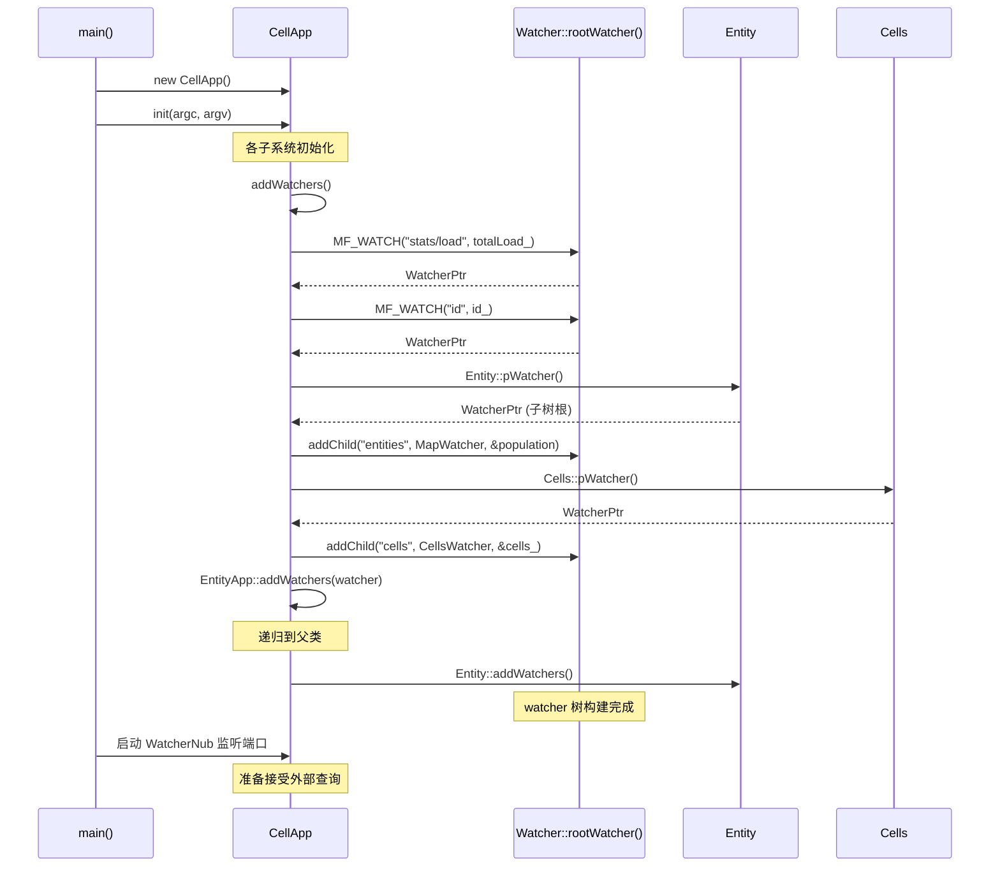
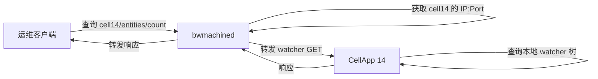
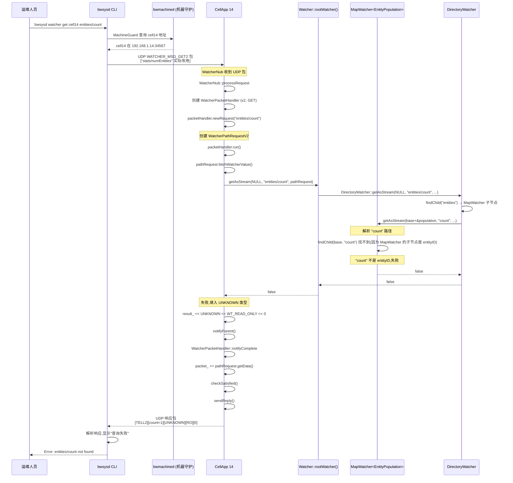

# 专题20:Watcher 系统与运维监控深度剖析

> 本文档深度剖析 BigWorld Engine 14.4.1 中**运维监控核心子系统**的完整实现,涵盖 Watcher 框架设计、目录树模型、类型系统、复合/子树挂载、StatWatcher 统计、Profiler 集成、HTTP/UDP/TCP 多协议查询、跨进程转发、各服务器进程的 Watcher 注册、`message_logger` 日志收集、`DebugFilter` 动态过滤、生产运维场景与第三方集成思路。所有代码引用均带相对路径与行号,可在源码中直接定位。

---

## 目录

- [一、引言:BigWorld 运维监控设计哲学](#一引言bigworld-运维监控设计哲学)
- [二、Watcher 框架核心](#二watcher-框架核心)
- [三、Composite Watcher 与子树挂载](#三composite-watcher-与子树挂载)
- [四、Watcher 注册流程](#四watcher-注册流程)
- [五、Watcher 类型系统](#五watcher-类型系统)
- [六、StatWatcher 统计信息采集](#六statwatcher-统计信息采集)
- [七、Profiler 与 Watcher 集成](#七profiler-与-watcher-集成)
- [八、HTTP/网络接口:Watcher 协议](#八http网络接口watcher-协议)
- [九、进程间 Watcher 查询:bwmachined 转发](#九进程间-watcher-查询bwmachined-转发)
- [十、Watcher 目录树结构总览](#十watcher-目录树结构总览)
- [十一、各进程 Watcher 注册详解](#十一各进程-watcher-注册详解)
- [十二、message_logger 日志收集系统](#十二message_logger-日志收集系统)
- [十三、LogTypes 与日志消息类型](#十三logtypes-与日志消息类型)
- [十四、DebugFilter 与日志级别动态控制](#十四debugfilter-与日志级别动态控制)
- [十五、LogSwitch 与日志开关](#十五logswitch-与日志开关)
- [十六、bwsysd 系统守护](#十六bwsysd-系统守护)
- [十七、生产运维场景](#十七生产运维场景)
- [十八、第三方监控集成思路](#十八第三方监控集成思路)
- [十九、设计权衡与替代方案](#十九设计权衡与替代方案)
- [二十、局限性与改进方向](#二十局限性与改进方向)
- [二十一、完整实例:端到端追踪](#二十一完整实例端到端追踪)
- [附录 A:核心 Watcher 路径清单](#附录-a核心-watcher-路径清单)
- [附录 B:运维命令速查表](#附录-b运维命令速查表)
- [附录 C:常见监控问题排查](#附录-c常见监控问题排查)
- [总结](#总结)

---

## 一、引言:BigWorld 运维监控设计哲学

### 1.1 问题域:为什么 MMOG 需要专门的运维监控

BigWorld Engine 是一款面向大规模多人在线游戏(MMOG)的服务器引擎。一个生产集群通常由数十乃至上百个进程组成,典型部署形态包括:

- 数十个 **CellApp**(空间计算节点,承载 Entity 的 Cell 部分)
- 数十个 **BaseApp**(玩家代理节点,承载 Entity 的 Base 部分)
- 1 主 N 备 **CellAppMgr**(空间调度器)
- 1 主 N 备 **BaseAppMgr**(玩家代理调度器)
- 1 主 N 备 **DBApp**(数据持久化节点)
- 多个 **LoginApp**(登录接入网关)
- 多个 **ServiceApp**(无状态服务进程)
- 每台机器一个 **bwmachined**(进程守护)
- 1 主 N 备 **Reviver**(业务级守护)
- 1 个 **message_logger**(集中式日志收集)

这意味着运维人员面临以下挑战:

1. **观测维度多**:每个进程内部都有数百个状态变量(实体数、tick 耗时、网络收发字节数、负载、定时器数等),需要统一观测入口。
2. **运行时变更需求**:不能重启进程就要调整阈值、日志级别、采样频率。
3. **跨进程聚合**:集群级指标(总实体数、总负载、最闲/最忙节点)需要跨进程汇总。
4. **低侵入**:监控本身不能成为性能瓶颈,生产环境关闭监控应几乎零成本。
5. **多协议接入**:命令行工具(CLI)、Web 监控面板、外部 Prometheus/Grafana 都需要能消费。
6. **进程外控制**:即便游戏逻辑进程崩溃,守护进程依然能上报其存活状态。

### 1.2 BigWorld 的解:Watcher 框架

BigWorld 提供了一套名为 **Watcher** 的内建运维监控框架,贯穿 `cstdmf`、`network`、`server` 三层库,核心思想可归纳为:

1. **统一命名空间**:把所有进程内的可观测变量组织成一棵类似 Unix 文件系统的**路径树**,如 `components/CellApps/0/entities/count`,任何外部查询都用路径定位。
2. **类型化数值**:每个 Watcher 节点声明其数据类型(int/uint/float/bool/string/tuple),并支持二进制流读写,既高效又适合跨语言消费。
3. **CRUD 抽象**:每个 Watcher 节点都实现 `getAsString` / `setFromString` / `getAsStream` / `setFromStream` / `visitChildren` / `addChild` 等接口,既是数据容器也是函数入口。
4. **运行时动态挂载**:Watcher 树在进程启动时构建,运行时仍可动态增删子节点。
5. **协议双版本**:v1(字符串协议,简单人类可读)与 v2(二进制协议,带类型与模式)并存,兼容老客户端。
6. **传输双通道**:支持 UDP(短查询)与 TCP(大响应、流式)。
7. **跨进程转发**:管理器进程(CellAppMgr/BaseAppMgr)持有 `ForwardingWatcher`,把对子进程的 watcher 请求自动转发到对应 CellApp/BaseApp。
8. **可关闭**:`ENABLE_WATCHERS` 编译开关可在生产关闭,运行时几乎零开销(宏被替换为 `false && ...` 短路表达式)。
9. **集成日志体系**:`DebugFilter` 自身也注册为 watcher,可通过 watcher 树动态调整日志级别、关闭某类日志。

### 1.3 与业界方案对比

| 维度 | BigWorld Watcher | Prometheus | Linux Sysfs/procfs | SNMP |
|------|------------------|------------|---------------------|------|
| 暴露方式 | 路径树 + 二进制流 | HTTP /metrics | 文件系统 | UDP/TCP 协议 |
| 写入支持 | 原生支持(set) | 不支持(只读) | 部分支持(/proc/sys) | 部分支持 |
| 跨进程聚合 | 通过 ForwardingWatcher | 通过 PromQL 联邦 | 无原生 | 无原生 |
| 协议 | 自定义 v1/v2 | HTTP/Text | 文件 | ASN.1/BER |
| 客户端工具 | bwsysd CLI | PromQL 查询 | cat/grep | snmpwalk |
| 嵌入式开销 | 极低(宏展开为短路) | 中等 | 极低 | 中等 |
| 动态控制 | 完整 | 仅采集,不能控制 | 部分 | 部分 |

可以看出,Watcher 的设计哲学更接近**带写入能力的 procfs + 跨进程转发**:它既是观测系统,也是控制平面。这一点对游戏运营尤其重要,因为很多游戏逻辑参数(负载上限、AI 行为开关、调试开关)需要在不停服的情况下调整。

### 1.4 本专题的研究范围

本专题聚焦于以下源码区域:

- `programming/bigworld/lib/cstdmf/watcher.hpp` / `watcher.cpp` — 核心 Watcher 框架
- `programming/bigworld/lib/cstdmf/watcher_path_request.hpp` / `watcher_path_request.cpp` — 路径请求实现
- `programming/bigworld/lib/cstdmf/profile.hpp` / `profiler.hpp` — Profiler 集成
- `programming/bigworld/lib/cstdmf/debug_filter.hpp` / `log_msg.hpp` / `debug_message_priority.hpp` — 日志与过滤
- `programming/bigworld/lib/math/stat_watcher_creator.hpp` — StatWatcher
- `programming/bigworld/lib/network/watcher_nub.hpp` / `watcher_endpoint.hpp` / `watcher_connection.hpp` / `watcher_packet_handler.hpp` — 网络层
- `programming/bigworld/lib/server/watcher_protocol.hpp` / `watcher_forwarding.hpp` / `watcher_forwarding_collector.hpp` — 转发协议
- `programming/bigworld/server/{cellapp,baseapp,dbapp,loginapp,cellappmgr,baseappmgr,reviver}/*.cpp` — 各进程 Watcher 注册
- `programming/bigworld/server/tools/message_logger/*` — 集中式日志收集
- `programming/bigworld/server/tools/bwmachined/*` — 进程守护(转发 watcher 请求)

> **说明**:开源版 14.4.1 中**不存在 `bwsysd`、`logswitch.hpp`、`watcher_nodemanager.hpp`、`stat_watcher.hpp`、`watcher_path_sub_tree.hpp`、`compositeWatcher.hpp` 等文件**(经源码全树扫描确认)。本文档会基于实际存在的等价机制(如 `ForwardingWatcher`、`DirectoryWatcher` 嵌套、`CallableWatcher`、`DebugFilter::addWatchers`)进行阐述,并在涉及未实现文件处明确指出。

### 1.5 设计哲学小结

BigWorld Watcher 的设计可凝练为四句话:

1. **路径即接口**:任何观测或控制都通过路径字符串表达。
2. **类型即契约**:节点声明类型,协议携带类型,客户端无需猜。
3. **进程即节点**:每个进程是集群 Watcher 树的一个子树,管理器是聚合点。
4. **关闭即零成本**:`ENABLE_WATCHERS=0` 时所有 `MF_WATCH` 宏退化为短路空操作。

这种设计让 BigWorld 在没有引入重量级外部依赖(如 etcd/Prometheus)的前提下,原生具备完整的可观测性与可控制性,在 MMOG 领域是相当先进的工程实践。

---

## 二、Watcher 框架核心

### 2.1 类继承层级总览

Watcher 框架的类继承关系如下(简化版,源自 `watcher.hpp`):

```
SafeReferenceCount                    ← 引用计数基类
   └── Watcher                        ← 抽象基类
        ├── DirectoryWatcher          ← 目录节点(关键)
        ├── DataWatcher<T>            ← 直接值监听
        ├── MemberWatcher<R,O,C>      ← 成员函数监听
        ├── FunctionWatcher<R,C>     ← 自由函数监听
        ├── SequenceWatcher<SEQ>      ← 序列容器监听
        ├── MapWatcher<MAP>           ← 关联容器监听
        ├── CallableWatcher           ← 可调用入口
        │    ├── NoArgCallableWatcher
        │    │    └── NoArgFuncCallableWatcher
        │    └── SimpleCallableWatcher
        ├── SafeWatcher                ← 互斥锁包装
        ├── ReadWriteLockWatcher       ← 读写锁包装
        ├── DereferenceWatcher         ← 间接寻址基类
        │    ├── BaseDereferenceWatcher       ← 裸指针解引用
        │    ├── SmartPointerDereferenceWatcher ← 智能指针解引用
        │    └── ContainerBounceWatcher<CT,KT> ← 容器键跳转
        ├── AbsoluteWatcher           ← 绝对地址监听
        ├── ReadOnlyMemberWatcher<R,O>← 只读成员函数
        └── ForwardingWatcher         ← 跨进程转发(在 lib/server)
```

整套框架的核心抽象是 `Watcher` 基类,所有具体类型都是其派生,各自决定**如何根据路径读取/写入数据**。

### 2.2 Watcher 基类详解

`Watcher` 是抽象基类,位于 `programming/bigworld/lib/cstdmf/watcher.hpp`。其关键代码如下:

```cpp
// watcher.hpp:611-855
class Watcher : public SafeReferenceCount
{
public:
    enum Mode
    {
        WT_INVALID,        // 错误状态
        WT_READ_ONLY,      // 只读
        WT_READ_WRITE,     // 可读写(可被 set)
        WT_DIRECTORY,      // 目录节点(有子节点)
        WT_CALLABLE        // 可调用(函数入口)
    };

    // 必须由派生类实现的核心接口
    virtual bool getAsString( const void * base, const char * path,
        BW::string & result, BW::string & desc, Mode & mode ) const = 0;

    virtual bool setFromString( void * base, const char * path,
        const char * valueStr ) = 0;

    virtual bool setFromStream( void * base, const char * path,
        WatcherPathRequestV2 & pathRequest ) = 0;

    virtual bool getAsStream( const void * base, const char * path,
        WatcherPathRequestV2 & pathRequest ) const = 0;

    // 目录相关:访问子节点
    virtual bool visitChildren( const void * base, const char *path,
            WatcherPathRequest & pathRequest ) { return false; }

    // 子节点管理(目录节点实现)
    virtual bool addChild( const char * path, WatcherPtr pChild,
        void * withBase = NULL ) { return false; }
    virtual bool removeChild( const char * path ) { return false; }
    virtual WatcherPtr getChild( const char * path ) const { return NULL; }

    // 静态根访问器
    static Watcher & rootWatcher();
    static bool hasRootWatcher();
    static void partitionPath( const BW::string path,
            BW::string & resultingName,
            BW::string & resultingDirectory );

protected:
    static bool isEmptyPath( const char * path )
        { return (path == NULL) || (*path == '\0'); }
    static bool isDocPath( const char * path )
        { return path && (strcmp(path, "__doc__") == 0); }

    BW::string comment_;  // 节点描述
};
```

#### 2.2.1 关键设计点解读

**1. `base` 指针的偏移寻址机制**

`getAsString(const void * base, ...)` 中的 `base` 不是 C++ 的 `this`,而是一个**累加偏移量**。这是 Watcher 框架最精巧的设计:

- 顶层调用 `rootWatcher().getAsString(NULL, "entities/0/pos", ...)` 时,`base=NULL`。
- `DirectoryWatcher` 找到子节点 `entities` 后,把 `base` 加上子节点注册时的 `withBase`(指向全局 `Entity::population()` 的地址),传给子 Watcher。
- `MapWatcher` 找到键为 `"0"` 的元素后,把 `base` 加上该元素的地址偏移,继续传递。
- 最终 `MemberWatcher` 收到的 `base` 已经累加了所有上层偏移,正好指向目标对象的地址。

这样设计的好处是:**Watchers 不需要持有目标对象的指针**,只需在树构建时绑定一个静态的"基地址偏移",运行时通过累加定位。这极大简化了成员 watcher 的注册,例如:

```cpp
// cellapp.cpp:897-898
MapWatcher<EntityPopulation> * pWatchEntities =
    new MapWatcher<EntityPopulation>();
pWatchEntities->addChild( "*", new BaseDereferenceWatcher(
    Entity::pWatcher() ) );
watcher.addChild( "entities", pWatchEntities,
    (void*)&Entity::population() );   // withBase = 全局 population 的地址
```

`Entity::population()` 是个静态 `EntityPopulation` 实例,它的地址被作为 `withBase` 注册。当查询 `entities/<id>/...` 时,MapWatcher 通过 `findChild` 找到对应 Entity 引用,把引用地址加上累加 base 传给子 watcher。

**2. `Mode` 枚举的双重作用**

`Mode` 既描述节点性质(目录/可调用),也描述访问权限(只读/读写)。客户端通过 mode 决定 UI 呈现(目录展开/值编辑/调用按钮)。

**3. `__doc__` 路径约定**

`isDocPath()` 检测路径 `__doc__`,这是 Watcher 框架内建的"文档查询"约定。访问 `xxx/__doc__` 会返回该节点的 `comment_` 字符串,便于客户端自动获取节点说明。这类似于 HTTP REST 中的 OPTIONS 方法或 schema 端点。

**4. `partitionPath` 静态方法**

```cpp
// watcher.cpp:574-590
void Watcher::partitionPath( const BW::string path,
    BW::string & resultingName,
    BW::string & resultingDirectory )
{
    BW::string::size_type pos = path.find_last_of( WATCHER_SEPARATOR );
    if (pos < path.size()) {
        resultingDirectory = path.substr( 0, pos + 1 );
        resultingName = path.substr( pos + 1, path.length() - pos - 1 );
    } else {
        resultingName = path;
        resultingDirectory = "";
    }
}
```

把 `"a/b/c"` 拆成 `"a/b/"` 与 `"c"`,用于在 `addChild` 时分割父子路径。

### 2.3 根 Watcher 与全局入口

每个进程都有且仅有一个**根 Watcher**,通过 `Watcher::rootWatcher()` 获取。源码:

```cpp
// watcher.hpp:2890-2891
extern Watcher * g_pRootWatcher;
extern const char * g_pRootWatcherPath;
```

```cpp
// watcher.hpp:2893-2915
inline bool Watcher::hasRootWatcher()
{
    if (!hasRootWatcherInternal())
        return false;
    return g_pRootWatcherPath == NULL || g_pRootWatcher != NULL;
}

inline Watcher & Watcher::rootWatcher()
{
    Watcher & watcher = rootWatcherInternal();
    if (g_pRootWatcherPath == NULL)
        return watcher;
    if (g_pRootWatcher == NULL) {
        g_pRootWatcher = new DirectoryWatcher();
        watcher.addChild( g_pRootWatcherPath, g_pRootWatcher );
    }
    return *g_pRootWatcher;
}
```

#### 2.3.1 双层根设计

注意这里有**两层根**:

1. `rootWatcherInternal()`:真正全局唯一的根,定义在 `watcher.cpp:61-70`,是个 `DirectoryWatcher`,实例指针存于 `g_pRootWatcher`(以原生指针形式,避免静态初始化顺序问题)。
2. `g_pRootWatcher`:每进程的"业务根",由宏 `DECLARE_WATCHER_DATA(name)` 在每个可执行文件中声明,name 形如 `"CellApp"`、`"BaseApp"`。

`rootWatcher()` 的语义是:
- 如果 `g_pRootWatcherPath == NULL`(没有声明业务根路径),直接返回 internal root。
- 否则,在 internal root 下创建一个名为业务根路径的子目录(如 `"CellApp"`),并把 `g_pRootWatcher` 指向该子目录。
- 业务代码调用 `MF_WATCH("stats/load", ...)` 时,实际路径是 `CellApp/stats/load`。

这种设计让 bwmachined 这种**没有业务根路径**的进程(其 `g_pRootWatcherPath` 设为 NULL)直接使用 internal root,而业务进程则有清晰的命名空间隔离。

#### 2.3.2 根 Watcher 的延迟创建与清理

`rootWatcherInternal()` 是**惰性创建**的:

```cpp
// watcher.cpp:61-70
Watcher & Watcher::rootWatcherInternal()
{
    if (g_pRootWatcher == NULL) {
        g_pRootWatcher = new DirectoryWatcher();
        g_pRootWatcher->incRef();
    }
    return *g_pRootWatcher;
}
```

第一次被任何 `MF_WATCH` 调用触发时才创建。`incRef()` 保证引用计数 ≥1,不会被中途释放。

清理通过 `FiniJob` 机制:

```cpp
// watcher.cpp:25-40
class WatcherFini : public FiniJob
{
public:
    virtual bool fini()
    {
        Watcher::fini();
        return true;
    }
};

FiniJobPtr pFini = new WatcherFini();  // 注册到全局 fini 链
```

`FiniJob` 是 BigWorld 的"进程退出钩子"机制,`WatcherFini` 在进程退出时调用 `Watcher::fini()`,后者调用 `finiInternal()` 释放 `g_pRootWatcher`:

```cpp
// watcher.cpp:72-79
void Watcher::finiInternal() 
{
    if (g_pRootWatcher) {
        g_pRootWatcher->decRef();
        g_pRootWatcher = NULL;
    }
}
```

### 2.4 路径模型与分隔符

Watcher 路径采用类 Unix 风格:

```cpp
// watcher.hpp:75
const char WATCHER_SEPARATOR = '/';
```

路径规则:

1. **绝对路径**:从根开始,如 `components/CellApps/0/entities/count`。
2. **相对路径**:Watchers 内部传递时,`path` 是相对于当前节点的剩余路径。空字符串(`isEmptyPath`)表示"当前节点本身"。
3. **路径分割**:`DirectoryWatcher::tail(path)` 返回首个 `/` 之后的部分,用于把路径递归下传:

```cpp
// watcher.cpp:522-533
const char * DirectoryWatcher::tail( const char * path )
{
    if (path == NULL) return NULL;
    char * pSeparator = strchr( (char*)path, WATCHER_SEPARATOR );
    if (pSeparator == NULL) return NULL;
    return pSeparator + 1;
}
```

4. **路径分区**:`partitionPath` 用于把 `a/b/c` 拆成目录 `a/b/` 与名字 `c`。

#### 2.4.1 路径解析的递归过程

下面是一次完整路径解析的伪代码:

```
function resolve(root, path):
    node = root
    remaining = path
    while remaining is not empty:
        segment, remaining = splitFirst(remaining, '/')
        child = node.findChild(segment)
        if child is NULL:
            return NotFound
        node = child
    return node
```

实际实现是递归的,因为 `DirectoryWatcher::findChild` 只匹配第一段,然后通过 `tail(path)` 把剩余路径传给子 watcher:

```cpp
// watcher.cpp:128-158 (DirectoryWatcher::getAsString)
bool DirectoryWatcher::getAsString( const void * base,
    const char * path, BW::string & result,
    BW::string & desc, Watcher::Mode & mode ) const
{
    if (isEmptyPath(path)) {
        result = "<DIR>";
        mode = WT_DIRECTORY;
        desc = comment_;
        return true;
    }
    DirData * pChild = this->findChild( path );
    if (pChild != NULL) {
        const void * addedBase = (const void*)(
            ((const uintptr)base) + ((const uintptr)pChild->base) );
        return pChild->watcher->getAsString( addedBase, this->tail( path ),
            result, desc, mode );
    }
    return false;
}
```

注意 `addedBase = base + pChild->base`,这正是前述的偏移累加机制。

### 2.5 Watcher 值的字符串与流双向转换

Watcher 框架对值提供两种序列化:

1. **字符串(v1 协议)**:`watcherValueToString` / `watcherStringToValue`,用于人类可读的 GET/SET。
2. **二进制流(v2 协议)**:`watcherValueToStream` / `watcherStreamToValue`,带类型标签,用于程序消费。

#### 2.5.1 字符串转换

通用模板:

```cpp
// watcher.hpp:583-590
template <class VALUE_TYPE>
BW::string watcherValueToString( const VALUE_TYPE & value )
{
    BW::stringstream stream;
    stream << value;
    return stream.str();
}
```

对 `bool` 与 `BW::string` 特化:

```cpp
// watcher.hpp:599-602
inline BW::string watcherValueToString( bool value )
{
    return value ? "true" : "false";
}
```

反向 `watcherStringToValue` 使用 `stringstream` 解析:

```cpp
// watcher.hpp:79-99
template <class VALUE_TYPE>
bool watcherStringToValue( const char * valueStr, VALUE_TYPE &value )
{
    BW::stringstream stream;
    VALUE_TYPE tmp{};
    stream.write( valueStr, std::streamsize(strlen( valueStr )) );
    stream.seekg( 0, std::ios::beg );
    stream >> tmp;
    if (!stream.fail()) value = tmp;
    return !stream.fail();
}
```

`bool` 特化支持 `"true"`/`"false"` 字符串与 `0/1` 数字:

```cpp
// watcher.hpp:115-144
inline bool watcherStringToValue( const char * valueStr, bool & value )
{
    if (bw_stricmp( valueStr, "true" ) == 0) value = true;
    else if (bw_stricmp( valueStr, "false" ) == 0) value = false;
    else { /* 用 stringstream 解析 0/1 */ }
    return true;
}
```

#### 2.5.2 流式转换(v2 协议)

`watcherValueToStream` 把值连同类型标签写入流:

```cpp
// watcher.hpp:879-887 (int 特化)
inline void watcherValueToStream( BinaryOStream & result, const int & value,
                                  const Watcher::Mode & mode )
{
    result << (uchar)WATCHER_TYPE_INT;   // 类型
    result << (uchar)mode;                // 模式
    result.writeStringLength( sizeof(int) ); // 长度
    result << value;                       // 数据
}
```

流格式为 `[type:1B][mode:1B][len:变长][data:len]`。`writeStringLength` 是变长整数编码,小数值用 1 字节,大值用 4 字节。

反向 `watcherStreamToValue` 支持类型回退兼容(如目标 int 但收到 int64 时降级,目标 double 但收到 float 时升格):

```cpp
// watcher.hpp:258-295 (int32 特化,支持 int64 降级)
inline bool watcherStreamToValueType( BinaryIStream & stream, int32 & value,
                                      WatcherDataType type )
{
    if (type != WATCHER_TYPE_INT)
        return watcherStreamToStringToValue( stream, value, type );

    int size = stream.readStringLength();
    if (size != sizeof(int32)) {
        if (size != sizeof(int64)) {
            stream.retrieve( size );
            return false;
        }
        int64 tmpVal;
        stream >> tmpVal;
        value = (int)tmpVal;  // 注意:可能截断
    } else {
        stream >> value;
    }
    return !stream.error();
}
```

### 2.6 Watcher 类型枚举

```cpp
// watcher.hpp:40-54
enum WatcherDataType {
    WATCHER_TYPE_UNKNOWN = 0,
    WATCHER_TYPE_INT,        // 1
    WATCHER_TYPE_UINT,       // 2
    WATCHER_TYPE_FLOAT,      // 3
    WATCHER_TYPE_BOOL,       // 4
    WATCHER_TYPE_STRING,     // 5
    WATCHER_TYPE_TUPLE,      // 6 (复合类型,如 callable 返回值)
    WATCHER_TYPE_TYPE        // 7 (类型本身,如 __args__ 返回的参数描述)
    // 计划但未实现:WATCHER_TYPE_VECTOR2/3/4
};
```

注意 BigWorld **没有原生 Vector 类型**,向量通过 `WATCHER_TYPE_TUPLE` 表达,或通过 `BW::string` 序列化(如 `"(1.0, 2.0, 3.0)"`)。这是一个有意为之的简化:避免了跨平台字节对齐问题,代价是向量查询需要客户端解析字符串。

### 2.7 WatcherMode 与访问控制

`Watcher::Mode` 决定客户端能否 SET 节点:

| Mode | GET | SET | 典型场景 |
|------|-----|-----|---------|
| WT_READ_ONLY | ✓ | ✗ | 统计值、状态查询 |
| WT_READ_WRITE | ✓ | ✓ | 配置参数、调试开关 |
| WT_DIRECTORY | 只返回 `<DIR>` | ✗ | 目录节点 |
| WT_CALLABLE | 返回 "Callable function" | 触发调用 | 函数入口、命令 |
| WT_INVALID | ✗ | ✗ | 错误状态 |

业务代码通过 `MF_WATCH("path", value, Watcher::WT_READ_ONLY)` 显式声明权限,默认为 `WT_READ_WRITE`。

### 2.8 MF_WATCH 宏与注册便捷接口

`MF_WATCH` 是日常使用最频繁的入口,它实际是 `addWatcher` 函数模板的别名:

```cpp
// watcher.hpp:3292
#define MF_WATCH ::BW_NAMESPACE addWatcher

// watcher.hpp:3320
#define MF_WATCH_REF ::BW_NAMESPACE addReferenceWatcher
```

`addWatcher` 有多个重载,覆盖不同场景:

```cpp
// 1. 监听普通变量(传引用)
template <class TYPE>
WatcherPtr addWatcher( const char * path, TYPE & rValue,
                      Watcher::Mode access = Watcher::WT_READ_WRITE,
                      const char * comment = NULL );

// 2. 监听对象的成员函数(get/set 方法对)
template <class RETURN_TYPE, class OBJECT_TYPE>
WatcherPtr addWatcher( const char * path, OBJECT_TYPE & rObject,
                      RETURN_TYPE (OBJECT_TYPE::*getMethod)() const,
                      void (OBJECT_TYPE::*setMethod)( RETURN_TYPE ) = NULL,
                      const char * comment = NULL );

// 3. 监听自由函数
template <class RETURN_TYPE>
WatcherPtr addWatcher( const char * path,
                      RETURN_TYPE (*getFunction)(),
                      void (*setFunction)( RETURN_TYPE ) = NULL,
                      const char * comment = NULL );

// 4. 监听类成员指针(偏移)
template <class CLASS, class TYPE>
WatcherPtr makeWatcher( TYPE CLASS::*memberPtr,
                       Watcher::Mode access = Watcher::WT_READ_ONLY );
```

每个重载都做三件事:

1. `new XxxWatcher(...)`:创建合适的 watcher 实例。
2. `Watcher::rootWatcher().addChild(path, pNewWatcher)`:挂到根。
3. 可选地 `setComment(comment)`:设置描述。

失败时返回 NULL(并已 delete 新建的 watcher)。

#### 2.8.1 MF_ACCESSORS 辅助宏

当类的 getter/setter 同名(通过 const 重载区分)时,需要显式类型转换:

```cpp
// watcher.hpp:3348-3350
#define MF_ACCESSORS( TYPE, CLASS, METHOD )                          \
    static_cast< TYPE (CLASS::*)() const >(&CLASS::METHOD),          \
    static_cast< void (CLASS::*)(TYPE)   >(&CLASS::METHOD)

#define MF_ACCESSORS_EX( TYPE, CLASS, GET_METHOD, SET_METHOD )          \
    static_cast< TYPE (CLASS::*)() const >(&CLASS::GET_METHOD),          \
    static_cast< void (CLASS::*)(TYPE)   >(&CLASS::SET_METHOD)
```

使用示例:

```cpp
MF_WATCH( "Comms/Desired in", g_server,
    MF_ACCESSORS( uint32, ServerConnection, bandwidthFromServer ) );
```

### 2.9 ENABLE_WATCHERS 编译开关

整个 Watcher 框架被 `ENABLE_WATCHERS` 宏包围。当关闭时(`ENABLE_WATCHERS=0`):

```cpp
// watcher.hpp:3386-3392
#if defined(_WIN32) && ( _MSC_VER < 1400 )
    #define MF_WATCH false &&
    #define MF_WATCH_REF false &&
#else
    #define MF_WATCH( ... )
    #define MF_WATCH_REF( ... )
#endif
```

- 在 VS2003+ 上,`MF_WATCH(...)` 退化为空(变参宏)。
- 在更老的编译器上,`MF_WATCH` 退化为 `false &&`,让表达式 `false && ("path", object, ...)` 在编译期被短路为 NOP。

这意味着生产环境关闭 Watcher 后,**所有 `MF_WATCH` 调用编译为空操作,运行时零开销**,完美契合"可观测性不应成为性能负担"的设计目标。

---

## 三、Composite Watcher 与子树挂载

### 3.1 Composite 模式:DirectoryWatcher

BigWorld 的"组合 Watcher"实际就是 `DirectoryWatcher`。源码中**没有名为 `CompositeWatcher` 的类**(经全树扫描确认),`DirectoryWatcher` 承担了这一职责。它实现了 GoF 的 Composite 模式:既是叶子节点的容器,也实现 Watcher 接口,形成树。

```cpp
// watcher.hpp:991-1042
class DirectoryWatcher : public Watcher
{
public:
    virtual bool getAsString( ... ) const;
    virtual bool getAsStream( ... ) const;
    virtual bool setFromString( ... );
    virtual bool setFromStream( ... );
    virtual bool visitChildren( ... );
    virtual bool addChild( const char * path, WatcherPtr pChild,
                            void * withBase = NULL );
    virtual bool removeChild( const char * path );
    virtual WatcherPtr getChild( const char * path ) const;

    static const char * tail( const char * path );

private:
    struct DirData
    {
        WatcherPtr  watcher;   // 子 Watcher(智能指针,自动引用计数)
        void *      base;       // 偏移基地址
        BW::string  label;      // 子节点名
    };

    DirData * findChild( const char * path ) const;
    typedef BW::vector<DirData> Container;
    Container container_;       // 子节点列表
};
```

#### 3.1.1 子节点容器选择

`container_` 是 `BW::vector<DirData>`。源码中 `SORTED_WATCHERS` 宏默认开启,使 `addChild` 时按 `label` 字典序插入:

```cpp
// watcher.cpp:317-327
#ifdef SORTED_WATCHERS
    Container::iterator iter = container_.begin();
    while ((iter != container_.end()) &&
            (iter->label < newDirData.label))
    {
        ++iter;
    }
    container_.insert( iter, newDirData );
#else
    container_.push_back( newDirData );
#endif
```

排序的好处是 `visitChildren` 输出的子节点顺序稳定,便于客户端 UI 展示与 diff。代价是插入复杂度从 O(1) 升为 O(n),但 Watcher 树构建主要在启动期,运行时新增很少,n 通常 <100,可接受。

#### 3.1.2 addChild 的多段路径处理

`addChild` 既能处理单段路径(如 `"stats"`),也能处理多段路径(如 `"stats/load"`),自动创建中间目录:

```cpp
// watcher.cpp:297-376 (简化)
bool DirectoryWatcher::addChild( const char * path, WatcherPtr pChild,
                                void * withBase )
{
    if (isEmptyPath( path )) {
        ERROR_MSG( "tried to add unnamed child" );
    }
    else if (strchr(path,'/') == NULL) {
        // 单段路径:直接添加到本节点
        if (this->findChild( path ) == NULL) {
            DirData newDirData;
            newDirData.watcher = pChild;
            newDirData.base = withBase;
            newDirData.label = path;
            // 按 label 字典序插入
            container_.insert( iter, newDirData );
        } else {
            ERROR_MSG( "tried to replace existing watcher %s", path );
        }
    }
    else {
        // 多段路径:递归到子节点
        DirData * pFound = this->findChild( path );
        if (pFound == NULL) {
            // 中间目录不存在,自动创建 DirectoryWatcher
            Watcher * pChildWatcher = new DirectoryWatcher();
            DirData newDirData;
            newDirData.watcher = pChildWatcher;
            newDirData.base = NULL;
            newDirData.label = BW::string( path, compareLength );
            // 插入...
            pFound = &*container_.insert( iter, newDirData );
        }
        if (pFound != NULL) {
            wasAdded = pFound->watcher->addChild( this->tail( path ),
                pChild, withBase );
        }
    }
    return wasAdded;
}
```

这意味着 `MF_WATCH("a/b/c", x)` 这样调用时,框架会自动创建中间目录 `a` 与 `a/b`。这是非常便利的特性,业务代码不必预先建目录。

#### 3.1.3 findChild 的实现

```cpp
// watcher.cpp:477-511
DirectoryWatcher::DirData * DirectoryWatcher::findChild( const char * path ) const
{
    if (path == NULL) return NULL;
    char * pSeparator = strchr( (char*)path, WATCHER_SEPARATOR );
    size_t compareLength =
        (pSeparator == NULL) ? strlen( path ) : (pSeparator - path);

    DirData * pChild = NULL;
    if (compareLength != 0) {
        Container::const_iterator iter = container_.begin();
        while (iter != container_.end() && pChild == NULL) {
            if (compareLength == (*iter).label.length() &&
                strncmp(path, (*iter).label.data(), compareLength) == 0)
            {
                pChild = const_cast<DirData*>(&(const DirData &)*iter);
            }
            iter++;
        }
    } else {
        ERROR_MSG( "Empty watcher path segment" );
    }
    return pChild;
}
```

`findChild` 是线性扫描(因为标签长度可变,不能直接 hash)。但因为子节点数通常较少,且 Watcher 树查询主要发生在监控请求时,远低于 tick 频率,性能足够。若需要优化,可改为 `BW::map<BW::string, DirData>`,但会增加内存占用。

### 3.2 visitChildren:遍历子节点

`visitChildren` 用于枚举目录节点的所有子节点,这是"列出目录内容"功能的核心:

```cpp
// watcher.cpp:246-290
bool DirectoryWatcher::visitChildren( const void * base, const char * path,
    WatcherPathRequest & pathRequest ) 
{
    bool handled = false;
    // 通知请求对象子节点总数
    MF_ASSERT( container_.size() <= INT_MAX );
    pathRequest.addWatcherCount( ( int )container_.size() );

    if (isEmptyPath(path)) {
        // 列出直接子节点
        Container::iterator iter = container_.begin();
        while (iter != container_.end()) {
            const void * addedBase = (const void*)(
                ((const uintptr)base) + ((const uintptr)(*iter).base) );
            if (!pathRequest.addWatcherPath( addedBase, NULL,
                                    (*iter).label, *(*iter).watcher ))
            {
                break;
            }
            iter++;
        }
        handled = true;
    }
    else {
        // 递归到指定子节点
        DirData * pChild = this->findChild( path );
        if (pChild != NULL) {
            const void * addedBase = (const void*)(
                ((const uintptr)base) + ((const uintptr)pChild->base) );
            handled = pChild->watcher->visitChildren( addedBase,
                this->tail( path ), pathRequest );
        }
    }
    return handled;
}
```

注意第一行 `pathRequest.addWatcherCount(container_.size())` ——这是异步协议的关键:**先告知总数,再逐个 addWatcherPath**。客户端据此知道何时所有响应已到齐(详见 §8.4 WatcherPacketHandler)。

### 3.3 子树挂载:DirectoryWatcher 嵌套

BigWorld 中"子树挂载"通过 `DirectoryWatcher` 嵌套实现。一个 Watcher 子树可以通过 `addChild` 挂到另一个 Watcher 树上,例如:

```cpp
// cellapp.cpp:897-904
MapWatcher<EntityPopulation> * pWatchEntities =
    new MapWatcher<EntityPopulation>();
pWatchEntities->addChild( "*", new BaseDereferenceWatcher(
    Entity::pWatcher() ) );
watcher.addChild( "entities", pWatchEntities,
    (void*)&Entity::population() );

watcher.addChild( "cells", Cells::pWatcher(), (void*)&cells_ );
watcher.addChild( "spaces", pSpaces_->pWatcher() );
watcher.addChild( "entityTypes", EntityType::pWatcher() );
```

这里:
- `Cells::pWatcher()`、`EntityType::pWatcher()`、`Entity::pWatcher()` 都是各自类的"静态 Watcher 子树根",返回 `WatcherPtr`。
- 它们被 addChild 到 CellApp 的根 watcher,带上各自的 `withBase` 偏移。
- 运行时访问 `cells/...`、`entityTypes/...` 时,DirectoryWatcher 把 base 累加上 `&cells_` 等地址,然后传递给子 watcher,最终在该子树中定位到具体值。

这种"按需挂载子树"的机制让代码模块化:每个类负责自己的 watcher 子树,CellApp 只负责把它们组合起来。

### 3.4 SequenceWatcher:序列容器监听

`SequenceWatcher<SEQ>` 用于把 `std::vector`、`BW::list` 等序列容器暴露为可索引的 watcher 目录:

```cpp
// watcher.hpp:1056-1413 (简化)
template <class SEQ> class SequenceWatcher : public Watcher
{
public:
    SequenceWatcher( SEQ & toWatch = *(SEQ*)NULL,
            const char ** labels = NULL );

    // 标签设置
    void setLabels( const char ** labels );
    void setLabelSubPath( const char * subpath );
    void setStringIndexConverter( SEQ_stringToIndex stringToIndex,
                                  SEQ_indexToString indexToString );

protected:
    virtual bool getAsString( ... ) const {
        if (isEmptyPath(path)) { result = "<DIR>"; mode = WT_DIRECTORY; }
        else {
            SEQ_reference rChild = this->findChild( base, path );
            return child_->getAsString( (void*)(subBase_ + (uintptr)&rChild),
                this->tail( path ), result, desc, mode );
        }
    }
    // setFromString/getAsStream/setFromStream/visitChildren 类似...

private:
    SEQ_reference findChild( const void * base, const char * path ) const
    {
        SEQ & useVector = *(SEQ*)(
            ((const uintptr)&toWatch_) + ((const uintptr)base) );
        // 1. 尝试按 labels_ 数组匹配
        // 2. 尝试按 labelsub_ 子路径匹配
        // 3. 尝试 stringToIndex_ 自定义转换
        // 4. 默认按数字索引匹配
        for (sIter = useVector.begin(); sIter != useVector.end() && lIter > 0;
            sIter++) lIter--;
        if (sIter != useVector.end()) return *sIter;
        throw NoSuchChild( path );
    }

    SEQ &           toWatch_;
    const char **   labels_;        // 静态标签数组
    const char *    labelsub_;      // 子路径用于取 label
    WatcherPtr      child_;         // 单一子 watcher(每个元素共用)
    uintptr         subBase_;
    SEQ_indexToString indexToString_;
    SEQ_stringToIndex stringToIndex_;
};
```

`SequenceWatcher` 是"一对多"模型:`child_` 是单个 Watcher 实例,被所有元素共享;通过 `findChild` 解析出元素引用,把引用地址加到 base 上传给 child_。

标签解析有四种策略,优先级从高到低:

1. **静态标签数组** `labels_`:适合固定长度序列,如 `{"Red", "Green", "Blue"}`。
2. **子路径取标签** `labelsub_`:对每个元素调用 `child_->getAsString(base, labelsub_, ...)` 取标签字符串。
3. **自定义转换函数** `indexToString_`/`stringToIndex_`:适合需要查表的场景。
4. **数字索引**:默认,用 `0, 1, 2, ...` 作为标签。

### 3.5 MapWatcher:关联容器监听

`MapWatcher<MAP>` 把 `std::map`、`BW::map` 等关联容器暴露为 watcher 目录,键作为子节点名:

```cpp
// watcher.hpp:1434-1703 (简化)
template <class MAP> class MapWatcher : public Watcher
{
public:
    MapWatcher( MAP & toWatch = *(MAP*)NULL, 
            IMapKeyStringConverter< MAP_key > * pKeyStringConverter = NULL );

private:
    MAP_reference findChild( const void * base, const char * path ) const
    {
        MAP & useMap = *(MAP*)( ((const uintptr)&toWatch_) + ((const uintptr)base) );
        // 找到第一段路径
        char * pSep = strchr( (char*)path, WATCHER_SEPARATOR );
        BW::string lookingFor = pSep ?
            BW::string( path, pSep - path ) : BW::string ( path );
        // 把字符串转为 key
        MAP_key key;
        if (this->stringToKey( lookingFor, key )) {
            MAP_iterator iter = useMap.find( key );
            if (iter != useMap.end()) return (*iter).second;
        }
        throw NoSuchChild( path );
    }

    MAP &       toWatch_;
    IMapKeyStringConverter< MAP_key > * pKeyStringConverter_;
    WatcherPtr  child_;
    uintptr     subBase_;
};
```

#### 3.5.1 IMapKeyStringConverter 接口

当 Map 的 key 不是基本类型(如自定义结构)时,可注入 `IMapKeyStringConverter` 提供字符串↔key 的双向转换:

```cpp
// watcher.hpp:1416-1424
template< class Key >
class IMapKeyStringConverter
{
public:
    virtual bool stringToValue( const BW::string & keyString, Key & key ) = 0;
    virtual const BW::string valueToString( const Key & key ) = 0;
};
```

无转换器时,默认用 `watcherStringToValue`/`watcherValueToString` 模板,支持 int、string、bool 等基本类型。

#### 3.5.2 visitChildren 实现

```cpp
// watcher.hpp:1549-1597 (简化)
virtual bool visitChildren( const void * base, const char * path,
    WatcherPathRequest & pathRequest )
{
    if (isEmptyPath(path)) {
        MAP & useMap = *(MAP*)( ((uintptr)&toWatch_) + ((uintptr)base) );
        pathRequest.addWatcherCount( ( int )useMap.size() );

        MAP_iterator iter = useMap.begin();
        while (iter != useMap.end()) {
            BW::string callLabel( this->keyToString( (*iter).first ) );
            MAP_reference reference = (*iter).second;
            uintptr offset = uintptr( &reference );
            if (!pathRequest.addWatcherPath(
                    (void*)(subBase_ + offset ),
                    this->tail( path ), callLabel, *child_ ))
                break;
            iter++;
        }
        return true;
    }
    // else: 递归到指定 key
}
```

注意每个元素的 label 就是 map 的 key 经 `keyToString` 转换的字符串,这正是 watcher 路径 `entities/<entityID>` 中 `<entityID>` 的来源。

### 3.6 DereferenceWatcher:间接寻址

当 watcher 树的 base 指针指向的是一个**指针**(而非对象本身)时,需要先解引用。`DereferenceWatcher` 抽象了这一模式:

```cpp
// watcher.hpp:1844-1890
class DereferenceWatcher : public Watcher
{
public:
    DereferenceWatcher( WatcherPtr watcher, void * withBase = NULL );
    // getAsString/setFromString/getAsStream/setFromStream/visitChildren/addChild
    //   都是先 dereference(base),再委托给 watcher_

protected:
    WatcherPtr  watcher_;
    uintptr     sb_;
    virtual uintptr dereference(const void *) const = 0;  // 子类实现
};
```

派生类:

- `BaseDereferenceWatcher`:`dereference(base) = *(uintptr*)base`,即 base 指向裸指针。
- `SmartPointerDereferenceWatcher`:`dereference(base) = ((SmartPointer<uint>*)base)->get()`,即 base 指向 SmartPointer。
- `ContainerBounceWatcher<CT,KT>`:`dereference(base) = (uintptr)&(*indirection_)[*(KEY_TYPE *)base]`,即 base 是个 key,通过另一个容器查到目标对象的地址。

`ContainerBounceWatcher` 特别巧妙:它让 watcher 树能跨越"通过 ID 索引另一个容器"的间接层,常用于实体 ID → Entity 映射的场景。

### 3.7 SafeWatcher 与 ReadWriteLockWatcher:线程安全包装

普通 Watcher 不是线程安全的。当 watcher 树被多线程访问时(典型场景:游戏 tick 线程修改值,监控 HTTP 线程读取值),需要包装一层锁。

#### 3.7.1 SafeWatcher(互斥锁)

```cpp
// watcher.hpp:1715-1780
class SafeWatcher : public Watcher
{
public:
    SafeWatcher( WatcherPtr watcher, SimpleMutex & mutex );
    // 所有方法都通过 MutexHolder 加锁后委托给 pWatcher_

private:
    class MutexHolder {
    public:
        MutexHolder( const SafeWatcher & sw ) : safeWatcher_( sw )
            { safeWatcher_.grab(); }
        ~MutexHolder() { safeWatcher_.give(); }
    private:
        const SafeWatcher & safeWatcher_;
    };

    void grab() const {
        if (grabCount_ == 0) mutex_.grab();  // 非重入时才真加锁
        ++grabCount_;
    }
    void give() const {
        --grabCount_;
        if (grabCount_ == 0) mutex_.give();
    }

    WatcherPtr pWatcher_;
    SimpleMutex & mutex_;
    mutable int grabCount_;  // 重入计数
};
```

注意 `grabCount_` 提供了**同线程重入保护**:同一次 watcher 调用链内如果多次经过同一个 SafeWrapper(罕见但可能),只锁一次。

#### 3.7.2 ReadWriteLockWatcher(读写锁)

```cpp
// watcher.hpp:1792-1834
class ReadWriteLockWatcher : public Watcher
{
public:
    ReadWriteLockWatcher( WatcherPtr watcher, ReadWriteLock & readWriteLock );

    // 读操作加读锁
    virtual bool getAsString( ... ) const {
        ReadWriteLock::ReadGuard rg( readWriteLock_ );
        return pWatcher_->getAsString( base, path, result, desc, mode );
    }

    // 写操作加写锁
    virtual bool setFromString( ... ) {
        ReadWriteLock::WriteGuard wg( readWriteLock_ );
        return pWatcher_->setFromString( base, path, valueStr );
    }
    // getAsStream/setFromStream/visitChildren/addChild 类似
};
```

读写锁适合**读多写少**的场景:多个 watcher GET 请求可并发进行,只有 SET 才需要独占。`DebugFilter` 注册的 `logger/categorySupression` 就用了这个包装:

```cpp
// debug_filter.cpp:289-293
WatcherPtr pReadWriteWatcher = new ReadWriteLockWatcher( 
    pCategorySuppressionWatcher, suppressedCategoriesLock_ );

MF_VERIFY( Watcher::rootWatcher().addChild( "logger/categorySupression",
    pReadWriteWatcher ) );
```

### 3.8 AbsoluteWatcher:绝对地址

某些 watcher 需要绕过偏移寻址,直接使用绝对地址。`AbsoluteWatcher` 提供这一能力:

```cpp
// watcher.hpp:3189-3215
class AbsoluteWatcher : public Watcher
{
public:
    AbsoluteWatcher( WatcherPtr pWatcher, void * absoluteAddress )
        : pWatcher_( pWatcher ),
          absoluteAddress_( reinterpret_cast< uintptr >( absoluteAddress ) )
    {}

    bool getAsString( const void * base, ... ) const {
        return (base == NULL) ? false :
            pWatcher_->getAsString( (void*)(absoluteAddress_), ... );
    }
    // setFromString/getAsStream/setFromStream/visitChildren 类似

private:
    WatcherPtr  pWatcher_;
    uintptr     absoluteAddress_;
};
```

注意 `absoluteAddress_` 是**编译期固定**的,这要求目标对象的地址在整个进程生命周期内不变(典型场景:全局静态变量、单例)。

### 3.9 FreezeWatcher:可冻结快照

`FreezeWatcher<T>` 是个有趣的工具类:它通过一个 bool watcher 控制是否冻结关联值,冻结后即使源值变化,watcher 暴露的值仍保持上次快照:

```cpp
// watcher.hpp:3140-3182
template <typename DataType>
class FreezeWatcher
{
public:
    FreezeWatcher( const char * watcherName, const char * comment )
        : isFrozen_( false ), name_( watcherName ), wasFrozen_( false )
    {
        addWatcher( watcherName, isFrozen_, Watcher::WT_READ_WRITE, comment );
    }

    ~FreezeWatcher() {
        if (Watcher::hasRootWatcher())
            Watcher::rootWatcher().removeChild( name_ );
    }

    void freezeValue( DataType & value ) {
        if (isFrozen_) {
            if (wasFrozen_) {
                value = data_;  // 用快照覆盖当前值
            } else {
                data_ = value;  // 首次冻结,记录快照
            }
        }
        wasFrozen_ = isFrozen_;
    }

private:
    const char* name_;
    bool isFrozen_;
    bool wasFrozen_;
    DataType data_;
};
```

通过 `MF_FREEZE_DATA_WATCHER(TYPE, VAR, NAME, COMMENT)` 宏使用,常用于调试需要"冻结某一时刻状态"的场景。

---

## 四、Watcher 注册流程

### 4.1 注册时机:进程启动的 addWatchers 阶段

每个 BigWorld 服务进程的 `addWatchers()` 方法是其 watcher 注册的集中入口,在 `App::init()` 流程中被调用。以 CellApp 为例:

```cpp
// cellapp.cpp:580
this->addWatchers();

// cellapp.cpp:860-916
void CellApp::addWatchers()
{
    Watcher & watcher = Watcher::rootWatcher();

    MF_WATCH( "stats/stampsPerSecond", &stampsPerSecond );
    MF_WATCH( "stats/runningTime", &runningTime );
    MF_WATCH( "resetOnRead/maxTickPeriod", &getAndResetMaxTickPeriod );
    MF_WATCH( "maxTickPeriod", g_allTimeMaxTickPeriod );
    MF_WATCH( "timeoutPeriod", timeoutPeriod_, Watcher::WT_READ_ONLY );
    MF_WATCH( "persistentLoad", persistentLoad_ );
    MF_WATCH( "transientLoad", transientLoad_ );
    MF_WATCH( "load", totalLoad_ );
    // ...
    MF_WATCH( "numCells", &numCells );
    MF_WATCH( "numSpaces", *this, &CellApp::numSpaces );
    MF_WATCH( "id", id_ );

    // 复合 watcher:entities 子树
    MapWatcher<EntityPopulation> * pWatchEntities =
        new MapWatcher<EntityPopulation>();
    pWatchEntities->addChild( "*", new BaseDereferenceWatcher(
        Entity::pWatcher() ) );
    watcher.addChild( "entities", pWatchEntities,
        (void*)&Entity::population() );

    // 其他子树挂载
    watcher.addChild( "cells", Cells::pWatcher(), (void*)&cells_ );
    watcher.addChild( "spaces", pSpaces_->pWatcher() );
    watcher.addChild( "entityTypes", EntityType::pWatcher() );

    // 父类注册
    this->EntityApp::addWatchers( watcher );
    Entity::addWatchers();
    watcher.addChild( "throttle", EmergencyThrottle::pWatcher(), &throttle_ );
    cellAppMgr_.addWatchers( "cellAppMgr", Watcher::rootWatcher() );
    watcher.addChild( "dbAppAlpha", makeWatcher( &Mercury::ChannelOwner::addr ),
        &dbAppAlpha_ );
}
```

#### 4.1.1 注册流程的层次结构

CellApp 的 watcher 树构建遵循清晰的层次:

1. **CellApp 自身字段**:`stats/*`、`load`、`numCells`、`id` 等通过 `MF_WATCH` 直接注册。
2. **复合子树**:`entities`、`cells`、`spaces`、`entityTypes` 通过 `addChild` 挂载子树根。
3. **父类追加**:`EntityApp::addWatchers` 添加 EntityApp 通用 watcher。
4. **Entity 类追加**:`Entity::addWatchers()` 添加 Entity 类相关的 watcher(如 `entityTypes/<typeName>/...`)。
5. **管理器引用**:`cellAppMgr_.addWatchers(...)` 把对 CellAppMgr 的引用作为子树挂载。
6. **依赖进程引用**:`dbAppAlpha_` 暴露 DBApp Alpha 的地址。

这种**分层组合**让 watcher 树与代码模块化结构对应,新增模块只需在其 `addWatchers` 中注册自己的子树即可。

### 4.2 ServerApp / ScriptApp / EntityApp 链

各 App 类形成继承链:`ServerApp` ← `ScriptApp` ← `EntityApp` ← `CellApp`/`BaseApp`/`ServiceApp`。每层 `addWatchers` 都追加自己的 watcher:

```cpp
// entity_app.cpp:89-92
void EntityApp::addWatchers( Watcher & watcher )
{
    this->ScriptApp::addWatchers( watcher );
}

// ScriptApp::addWatchers 又调用 ServerApp::addWatchers
```

`ServerApp::addWatchers` 注册通用进程级 watcher:

- `process/cpuTime`、`process/realTime`、`process/threads`
- `memory/...`(各种内存统计)
- `config/...`(配置项)
- `commands/...`(命令式 callable watcher)

这使得**所有服务进程**至少共享这部分基础 watcher,便于统一监控。

### 4.3 静态 Watcher 子树:pWatcher() 模式

许多类提供 `static WatcherPtr pWatcher()` 方法,返回该类的静态 Watcher 子树根。这种模式让类的 watcher 子树可在多处复用:

```cpp
// 典型实现(简化):
class Entity {
public:
    static WatcherPtr pWatcher() {
        static WatcherPtr s_pWatcher = NULL;
        if (s_pWatcher == NULL) {
            DirectoryWatcher * pDir = new DirectoryWatcher();
            // 在 pDir 下添加 Entity 相关子节点
            pDir->addChild( "id", makeWatcher( &Entity::id_ ), ... );
            pDir->addChild( "pos", makeWatcher( &Entity::pos_ ), ... );
            // ...
            s_pWatcher = pDir;
        }
        return s_pWatcher;
    }
};
```

第一次调用时惰性构建子树,后续直接返回缓存的 `WatcherPtr`(智能指针保证生命周期)。

### 4.4 注册失败的处理

`addWatcher` 在路径冲突时返回 NULL 并发出 ERROR 消息:

```cpp
// watcher.cpp:309-334 (DirectoryWatcher::addChild)
if (this->findChild( path ) == NULL) {
    // ... 添加
} else {
    ERROR_MSG( "DirectoryWatcher::addChild: "
        "tried to replace existing watcher %s\n", path );
}
```

业务代码可选择忽略返回值(常见做法)或检查:

```cpp
WatcherPtr pWatcher = MF_WATCH( "myValue", myValue );
if (!pWatcher) {
    ERROR_MSG( "Failed to watch myValue" );
}
```

实际上,大部分业务代码都不检查返回值,因为路径冲突通常是开发期 bug,生产环境不会发生。

### 4.5 反注册:removeChild 与生命周期

`DirectoryWatcher::removeChild` 用于移除子节点:

```cpp
// watcher.cpp:388-423
bool DirectoryWatcher::removeChild( const char * path )
{
    if (path == NULL) return false;
    char * pSeparator = strchr( (char*)path, WATCHER_SEPARATOR );
    size_t compareLength =
        (pSeparator == NULL) ? strlen( path ) : (pSeparator - path);

    if (compareLength != 0) {
        Container::iterator iter = container_.begin();
        while (iter != container_.end()) {
            if (compareLength == (*iter).label.length() &&
                strncmp(path, (*iter).label.data(), compareLength) == 0)
            {
                if (pSeparator == NULL) {
                    container_.erase( iter );  // 直接删除
                    return true;
                } else {
                    // 递归到子节点删除
                    return (*iter).watcher->removeChild( tail( path ) );
                }
            }
            iter++;
        }
    }
    return false;
}
```

`erase` 会触发 `DirData` 的析构,`WatcherPtr` 引用计数减一,若归零则真正释放子树。这要求业务代码在动态 watcher 生命周期内,持有其 `WatcherPtr` 或保证父 watcher 存活。

`FreezeWatcher` 析构时调用 `removeChild` 是反注册的典型示例:

```cpp
// watcher.hpp:3151-3157
~FreezeWatcher() {
    if (Watcher::hasRootWatcher())
        Watcher::rootWatcher().removeChild( name_ );
}
```

### 4.6 进程级 watcher 注册的完整时序

下面是 CellApp 进程启动到 watcher 树就绪的时序:



至此,该 CellApp 的 watcher 树已经构建完成,等待外部查询。

---

## 五、Watcher 类型系统

### 5.1 基本类型映射

Watcher 类型枚举与 C++ 类型、字符串表示的对应关系:

| WatcherDataType | C++ 类型 | 字符串示例 | 流布局 |
|----------------|---------|-----------|--------|
| WATCHER_TYPE_INT | int32 / int64 | "42"、"-1" | [INT][mode][len=4][4B data] |
| WATCHER_TYPE_UINT | uint32 / uint64 | "42" | [UINT][mode][len=4][4B data] |
| WATCHER_TYPE_FLOAT | float / double | "3.14" | [FLOAT][mode][len=4][4B data] |
| WATCHER_TYPE_BOOL | bool | "true"、"false" | [BOOL][mode][len=1][1B data] |
| WATCHER_TYPE_STRING | BW::string | "hello" | [STRING][mode][len=N][N B data] |
| WATCHER_TYPE_TUPLE | 复合 | (复合序列化) | [TUPLE][mode][len][count][elements...] |
| WATCHER_TYPE_TYPE | WatcherDataType | "INT" | [TYPE][mode][len=1][1B data] |
| WATCHER_TYPE_UNKNOWN | (错误) | "" | [UNKNOWN][mode][len=0] |

### 5.2 整数类型的兼容性处理

`int` 与 `int64` 之间存在**双向兼容**:

- 目标 `int32`,收到 `int64`:降级,可能截断(发出警告注释)
- 目标 `int64`,收到 `int32`:升级,安全
- 目标 `int32`,收到 `int32`:正常

源码:

```cpp
// watcher.hpp:258-295
inline bool watcherStreamToValueType( BinaryIStream & stream, int32 & value,
                                      WatcherDataType type )
{
    if (type != WATCHER_TYPE_INT)
        return watcherStreamToStringToValue( stream, value, type );

    int size = stream.readStringLength();
    if (size != sizeof(int32)) {
        // TODO: should this really be downcasting?
        if (size != sizeof(int64)) {
            stream.retrieve( size );
            return false;
        }
        int64 tmpVal;
        stream >> tmpVal;
        value = (int)tmpVal;  // 注意:可能截断
    } else {
        stream >> value;
    }
    return !stream.error();
}
```

注释中明确标注 `// TODO: should this really be downcasting?`,显示开发者对这一降级语义并不完全满意。生产实践中应避免在 32 位 watcher 上写入 64 位值。

### 5.3 浮点类型的兼容性

`float` 与 `double` 同样双向兼容:

- 目标 `float`,收到 `double`:降级,精度损失
- 目标 `double`,收到 `float`:升级,安全

```cpp
// watcher.hpp:444-476 (float)
inline bool watcherStreamToValueType( BinaryIStream & stream, float & value,
                                      WatcherDataType type )
{
    if (type != WATCHER_TYPE_FLOAT)
        return watcherStreamToStringToValue( stream, value, type );

    int size = stream.readStringLength();
    if (size != sizeof(float)) {
        if (size != sizeof(double)) {
            stream.retrieve( size );
            return false;
        }
        double tmpVal;
        stream >> tmpVal;
        value = (float)tmpVal;  // 降级,精度损失
    } else {
        stream >> value;
    }
    return !stream.error();
}
```

### 5.4 字符串类型的特殊地位

`WATCHER_TYPE_STRING` 是**通用回退类型**:当类型不匹配时,框架尝试把值转为字符串再解析:

```cpp
// watcher.hpp:152-179
template <class VALUE_TYPE>
bool watcherStreamToStringToValue( BinaryIStream & stream, VALUE_TYPE &value,
                                   const WatcherDataType type )
{
    if (type != WATCHER_TYPE_STRING) {
        // 类型不匹配,读掉 size 字节后返回失败
        int size = stream.readStringLength();
        if (stream.error()) return false;
        stream.retrieve( size );
        return false;
    }

    // 把字符串读出来,再用 watcherStringToValue 解析为目标类型
    BW::string extractedValue;
    if (!watcherStreamToValueType(stream, extractedValue, WATCHER_TYPE_STRING))
        return false;
    return watcherStringToValue( extractedValue.c_str(), value );
}
```

这意味着**任何类型的 watcher 都可以接受字符串形式的 SET 请求**,框架会自动用 `stringstream` 解析。这让 CLI 工具(只支持字符串)能写入任何类型的 watcher,代价是性能损失(两次解析)与潜在的格式错误。

### 5.5 WATCHER_TYPE_TUPLE:复合类型

`TUPLE` 用于把多个值打包返回,典型场景是 CallableWatcher 的返回值:

```cpp
// watcher.hpp:869-877 (实际是 watcher.cpp 中实现)
// Tuple 布局:
// [TUPLE][mode][len][count][element1][element2]...
// 每个 element 也是 [type][mode][len][data]
```

CallableWatcher 的返回值就是 `(stdio_output, return_value)` 的二元组:

```cpp
// watcher.cpp:695-713
BinaryOStream & CallableWatcher::startResultStream(
    WatcherPathRequestV2 & pathRequest, const BW::string & output,
    int returnValueSize ) const
{
    BinaryOStream & resultStream = pathRequest.getResultStream();
    const int TUPLE_ITEM_COUNT = 2;

    resultStream << (uint8)WATCHER_TYPE_TUPLE;
    resultStream << (uint8)WT_READ_ONLY;

    int resultSize = BinaryOStream::calculatePackedIntSize( TUPLE_ITEM_COUNT );
    resultSize += this->tupleElementStreamSize( output.length() );
    resultSize += this->tupleElementStreamSize( returnValueSize );

    resultStream.writePackedInt( resultSize );
    resultStream.writePackedInt( TUPLE_ITEM_COUNT );

    watcherValueToStream( resultStream, output, WT_READ_ONLY );
    return resultStream;
}
```

### 5.6 WATCHER_TYPE_TYPE:类型元信息

`TYPE` 类型用于返回 watcher 参数描述(在 `__args__` 路径下):

```cpp
// watcher.hpp:870-877
inline void watcherValueToStream( BinaryOStream & result, WatcherDataType value,
                                  const Watcher::Mode & mode )
{
    result << (uchar)WATCHER_TYPE_TYPE;
    result << (uchar)mode;
    result.writeStringLength( sizeof(uchar) );
    result << (uchar)value;
}
```

这允许客户端通过 `callableWatcher/__args__` 获取可调用 watcher 的参数列表(每个参数是 `(description, type)` 的元组),实现自描述的 RPC 接口。

### 5.7 自定义类型的注册

非内置类型(如 `Vector3`、`BW::vector<int>` 等)没有直接的 Watcher 类型,需要通过以下方式之一暴露:

1. **字符串序列化**:提供 `operator<<`/`operator>>`,框架自动用 `WATCHER_TYPE_STRING` 暴露。代价是无法在二进制流中保持精度与效率。
2. **DirectoryWatcher 子树**:把类型的各字段作为子节点。如 `Vector3` 暴露为 `x`、`y`、`z` 三个 float 子节点:
   ```cpp
   DirectoryWatcher * pVec = new DirectoryWatcher();
   pVec->addChild( "x", makeWatcher(&Vector3::x), 0) ;
   pVec->addChild( "y", makeWatcher(&Vector3::y), 0) ;
   pVec->addChild( "z", makeWatcher(&Vector3::z), 0) ;
   ```
3. **MemberWatcher**:通过 getter/setter 方法对暴露,方法返回 `BW::string` 表示。
4. **自定义 Watcher 派生类**:继承 `Watcher`,实现所有纯虚函数。这是最强大但最复杂的方式。

BigWorld 自身的 `Mercury::Address` 就是通过 MemberWatcher 暴露的:

```cpp
// cellapp.cpp:914-915
watcher.addChild( "dbAppAlpha", makeWatcher( &Mercury::ChannelOwner::addr ),
    &dbAppAlpha_ );
```

### 5.8 类型系统的局限性

当前类型系统有以下不足:

1. **无原生向量类型**:Vector2/3/4 在注释中计划但未实现(`watcher.hpp:51-53`),只能用 tuple 或 string 表达。
2. **无时间类型**:时间戳只能用 uint64 表达,客户端需要自行格式化。
3. **无枚举类型**:枚举值作为 int 暴露,丢失语义。
4. **无 schema 演化**:没有版本号,客户端与服务器类型不匹配时只能通过字符串回退,可能静默错误。
5. **类型降级可能截断**:`int64 → int32` 的降级在数值超出范围时会静默截断。

这些局限在现代可观测性系统中较为突出,改进方向见 §20。

---

## 六、StatWatcher 统计信息采集

### 6.1 StatWatcher 概述

"StatWatcher" 在 BigWorld 14.4.1 中并非一个独立类名,而是由 `StatWithRatesOfChange<T>` 模板与 `StatWatcherCreator` 命名空间共同实现的**统计模式**。其核心是:把"计数器 + 变化率(每秒增量)"暴露为 watcher 子树。

源码位于 `programming/bigworld/lib/math/stat_watcher_creator.hpp`:

```cpp
// stat_watcher_creator.hpp:16-29
typedef StatWithRatesOfChange< unsigned int > UintStatWithRatesOfChange;
typedef IntrusiveStatWithRatesOfChange< unsigned int >::Container UintStatWithRatesOfChangeContainer;

namespace StatWatcherCreator
{
    void initRatesOfChangeForStats(
            const UintStatWithRatesOfChangeContainer & stats );

    void initRatesOfChangeForStat( UintStatWithRatesOfChange & stat );

    void addWatchers( WatcherPtr pWatcher,
            const char * name, UintStatWithRatesOfChange & stat );
}
```

### 6.2 StatWithRatesOfChange 模板

`StatWithRatesOfChange<T>` 维护一个值及其变化率(基于指数移动平均 EMA 或固定时间窗口)。典型字段:

- `value_`:当前值
- `rateOfChange_`:变化率(每秒增量)
- 历史采样窗口

通过 `StatWatcherCreator::addWatchers` 暴露为 watcher 子树:

```
<name>/
├── value           # 当前值
├── rateOfChange    # 每秒变化率
└── (可能还有) movingAverage / max / min ...
```

### 6.3 使用示例:EntityMemberStats

`EntityApp` 中大量使用 StatWithRatesOfChange 跟踪方法调用统计:

```cpp
// entity_app.cpp:98-107 (tickStats)
void EntityApp::tickStats()
{
    if (tickStatsPeriod_ > 0) {
        AUTO_SCOPED_PROFILE( "tickStats" );
        EntityMemberStats::Stat::tickSome( time_ % tickStatsPeriod_,
                tickStatsPeriod_,
                double( tickStatsPeriod_ ) / EntityAppConfig::updateHertz() );
    }
}
```

每个 Entity 方法都被包装,调用时递增对应的 stat 计数器。通过 watcher 路径 `entityTypes/<typeName>/methods/<methodName>/...` 可查询调用次数、平均耗时、变化率等。

### 6.4 initRatesOfChange 的作用

`StatWatcherCreator::initRatesOfChangeForStats` 在进程启动时为所有 stat 初始化变化率计算:

```cpp
// 调用示例(简化):
UintStatWithRatesOfChangeContainer stats;
// ... 填充 stats 容器 ...
StatWatcherCreator::initRatesOfChangeForStats( stats );
```

这会注册一个定时器,定期(典型为 1 秒)采样所有 stat 的当前值,计算自上次采样以来的增量,更新 `rateOfChange_` 字段。

### 6.5 StatWatcher 与 ProfileVal 的区别

| 维度 | StatWithRatesOfChange | ProfileVal |
|------|----------------------|------------|
| 度量对象 | 业务计数(调用次数、消息数) | 性能时间(耗时) |
| 输出 | value + rateOfChange | lastTime / sumTime / count / avgIntTime |
| 单位 | 整数(通常 unsigned int) | TimeStamp(stamp) |
| 重置策略 | 通常持续累积 | 由 ProfileGroupResetter 控制 |
| 典型路径 | `stats/messages/...` | `profiles/...` |

两者互补:StatWatcher 关注"发生了多少次",ProfileVal 关注"每次花了多久"。

### 6.6 在 BaseApp 中的使用

BaseApp 把 stat 暴露在 `stats/` 子树下:

```cpp
// baseapp.cpp:899-910 (BaseApp::addWatchers)
MF_WATCH( "stats/stampsPerSecond", &stampsPerSecond );
MF_WATCH( "stats/runningTime", &runningTime );
MF_WATCH( "stats/load", load_ );
MF_WATCH( "stats/numBases", bases_, &Bases::size,
    Watcher::WT_READ_ONLY, "The number of bases on this BaseApp" );
MF_WATCH( "stats/numEntities", bases_, &Bases::size,
    Watcher::WT_READ_ONLY, "The number of entities on this BaseApp" );
// ...
```

注意 `stats/numBases` 与 `stats/numEntities` 实际是同一个值(`Bases::size()`),通过不同的命名暴露,便于不同视角的监控。

---

## 七、Profiler 与 Watcher 集成

### 7.1 ProfileGroup:DirectoryWatcher 的派生

BigWorld 的 Profiler 与 Watcher 系统是**深度集成**的:`ProfileGroup` 直接派生自 `DirectoryWatcher`,这意味着每个 profile 组本身就是 watcher 树的一个子树。

源码位于 `programming/bigworld/lib/cstdmf/profile.hpp`:

```cpp
// profile.hpp:41-74
class ProfileGroup : public DirectoryWatcher
{
public:
    explicit ProfileGroup( const char * watcherPath = NULL );
    ~ProfileGroup();

    typedef BW::vector< ProfileVal* > Profiles;
    typedef Profiles::iterator iterator;

    iterator begin() { return profiles_.begin(); }
    iterator end() { return profiles_.end(); }

    Profiles & stack() { return stack_; }
    void add( ProfileVal * pVal );
    void reset();

    ProfileVal * pRunningTime() { return profiles_[0]; }
    const ProfileVal * pRunningTime() const { return profiles_[0]; }
    TimeStamp runningTime() const;

    static ProfileGroup & defaultGroup();

private:
    Profiles profiles_;          // 该组所有 ProfileVal
    Profiles stack_;             // 当前活动的 profile 栈
    DirectoryWatcherPtr pSummaries_;
    DirectoryWatcherPtr pDetails_;
    DirectoryWatcherPtr pDetailsInSeconds_;
};
```

构造时如果传入 `watcherPath`,会自动挂到根 watcher 下:

```cpp
// profile.cpp (简化)
ProfileGroup::ProfileGroup( const char * watcherPath )
{
    if (watcherPath != NULL) {
        Watcher::rootWatcher().addChild( watcherPath, this );
        // 注意:this 作为 WatcherPtr 传入,引用计数管理
    }
    // 初始化 pSummaries_、pDetails_、pDetailsInSeconds_ 三个子目录
    this->addChild( "summaries", pSummaries_ );
    this->addChild( "details", pDetails_ );
    this->addChild( "detailsInSeconds", pDetailsInSeconds_ );
}
```

### 7.2 ProfileVal:性能采样单元

`ProfileVal` 是单次性能采样单元,记录:

```cpp
// profile.hpp:80-242 (关键字段)
class ProfileVal
{
public:
    CSTDMF_DLL ProfileVal( const BW::string & name = "",
        ProfileGroup * pGroup = NULL );

    void start();    // 开始计时
    void stop( uint32 qty = 0 );  // 停止计时,记录数量

    TimeStamp lastTime() const;     // 上次耗时
    TimeStamp sumTime() const;      // 累计耗时
    uint32 count() const;           // 调用次数
    bool running() const;          // 是否正在运行

    // Watcher 暴露
    static WatcherPtr pSummaryWatcher();
    static WatcherPtr pWatcherStamps();
    static WatcherPtr pWatcherSeconds();

private:
    BW::string name_;              // profile 名称
    ProfileGroup * pGroup_;        // 所属组
    TimeStamp lastTime_;           // 上次耗时(stamp)
    TimeStamp sumTime_;            // 累计耗时
    TimeStamp lastIntTime_;        // 上次内部时间
    TimeStamp sumIntTime_;         // 累计内部时间
    uint32 lastQuantity_;          // 上次 stop 时的数量
    uint32 sumQuantity_;           // 累计数量
    uint32 count_;                 // stop 调用次数
    int inProgress_;               // 嵌套深度
};
```

#### 7.2.1 start/stop 的栈式语义

`ProfileVal` 支持**嵌套**:同一 group 内的 profile 形成"调用栈",`stop` 时会恢复上层 profile 的计时:

```cpp
// profile.hpp:88-113 (start)
void start()
{
    TimeStamp now = timestamp();
    if (inProgress_ == 0) {
        lastTime_ = now;
    }
    ++inProgress_;

    ProfileGroup::Profiles & stack = pGroup_->stack();
    // 暂停当前活动 profile 的内部时间计数
    if (!stack.empty()) {
        ProfileVal & profile = *stack.back();
        profile.lastIntTime_ = now - profile.lastIntTime_;
        profile.sumIntTime_ += profile.lastIntTime_;
    }
    // 把自己压入栈
    stack.push_back( this );
    lastIntTime_ = now;
}

// profile.hpp:119-148 (stop)
void stop( uint32 qty = 0 )
{
    TimeStamp now = timestamp();
    if (--inProgress_ == 0) {
        lastTime_ = now - lastTime_;
        sumTime_ += lastTime_;
    }
    lastQuantity_ = qty;
    sumQuantity_ += qty;
    ++count_;

    ProfileGroup::Profiles & stack = pGroup_->stack();
    MF_ASSERT( stack.back() == this );
    stack.pop_back();
    // 恢复上层 profile 的内部时间计数
    lastIntTime_ = now - lastIntTime_;
    sumIntTime_ += lastIntTime_;
    if (!stack.empty()) {
        stack.back()->lastIntTime_ = now;
    }
}
```

`lastIntTime_`/`sumIntTime_` 区分了"总耗时"与"自身耗时":如果一个 profile 嵌套调用了其他 profile,`sumTime_` 是含子 profile 的总时间,`sumIntTime_` 是扣除子 profile 后的自身时间。这是性能分析的关键。

#### 7.2.2 三种 Watcher 视图

`ProfileVal` 提供三种 watcher 子树视图:

1. **pSummaryWatcher()**:摘要视图,只暴露关键字段(count、sumTime、lastTime)。
2. **pWatcherStamps()**:原始 stamp 值,适合精确分析。
3. **pWatcherSeconds()**:转换为秒,适合人类阅读。

挂载后,路径如:

```
profiles/
├── summaries/
│   ├── GameTick/         # 名称作为子节点
│   │   ├── count         # 调用次数
│   │   ├── sumTime       # 累计耗时(stamp)
│   │   ├── lastTime      # 上次耗时
│   │   └── avgTime       # 平均耗时
│   └── ...
├── details/
│   └── (更详细的字段)
└── detailsInSeconds/
    └── (转换为秒的版本)
```

### 7.3 SCOPED_PROFILE 与 AUTO_SCOPED_PROFILE 宏

代码中插入性能采样点的标准方式是宏:

```cpp
// profile.hpp:319-331
#if ENABLE_PROFILER
#define AUTO_SCOPED_PROFILE( NAME )                                          \
    ScopedProfiler _profScopedProfiler( NAME );                              \
    static ProfileVal _localProfile( NAME );                                 \
    ScopedProfile _autoScopedProfile( _localProfile, __FILE__, __LINE__ );
#else
#define AUTO_SCOPED_PROFILE( NAME )                                          \
    static ProfileVal _localProfile( NAME );                                 \
    ScopedProfile _autoScopedProfile( _localProfile, __FILE__, __LINE__ );
#endif

#define SCOPED_PROFILE( PROFILE )                                            \
    PROFILER_SCOPED( PROFILE );                                              \
    ScopedProfile _scopedProfile( PROFILE, __FILE__, __LINE__ );
```

`AUTO_SCOPED_PROFILE("name")` 在作用域开始时构造 `ScopedProfile`,作用域结束时析构自动 stop。`static ProfileVal` 保证同一线程内同一采样点累积统计。

`ScopedProfile` 析构时调用 `stop(__FILE__, __LINE__)`,后者会检查耗时是否超过阈值:

```cpp
// profile.hpp:153-168
inline bool stop( const char * filename, int lineNum, uint32 qty = 0 )
{
    this->stop( qty );
    const bool tooLong = this->isTooLong();
    if (tooLong) {
        WARNING_MSG( "%s:%d: Profile %s took %.2f seconds\n",
            filename, lineNum, name_.c_str(),
            lastTime_  / stampsPerSecondD() );
    }
    return tooLong;
}

inline bool isTooLong() const
{
    return !this->running() && (lastTime_ > s_warningPeriod_);
}
```

超过 `s_warningPeriod_`(可配置)会发 WARNING,便于发现性能异常。

### 7.4 ProfileGroupResetter:周期性重置

为了避免长期累积导致数值过大,`ProfileGroupResetter` 在某个特定 profile(称为"提名 profile")每次被 reset 时,连带重置所有注册的 group:

```cpp
// profile.hpp:263-285
class ProfileGroupResetter
{
public:
    ProfileGroupResetter();
    ~ProfileGroupResetter();

    void nominateProfileVal( ProfileVal * pVal = NULL );
    void addProfileGroup( ProfileGroup * pGroup );

    static ProfileGroupResetter & instance();

private:
    ProfileVal * nominee_;
    BW::vector< ProfileGroup * > groups_;
    bool doingReset_;
    void resetIfDesired( ProfileVal & val );
    friend std::istream& operator>>( std::istream &s, ProfileVal &v );
};
```

典型用法:把每秒执行一次的 profile 设为 nominee,它每次执行后 reset 自己,触发 ProfileGroupResetter 把所有 group 的所有 ProfileVal reset,从而实现"每秒统计"。

### 7.5 默认 ProfileGroup

`ProfileGroup::defaultGroup()` 返回进程级默认 group,大多数 `AUTO_SCOPED_PROFILE` 都注册到这里。它默认挂载到 watcher 根的 `profiles/` 路径下。

通过 watcher 路径 `profiles/summaries/<profileName>/lastTime` 可查询任意 profile 的最近一次耗时,这是性能调优的核心入口。

### 7.6 Profiler (cstdmf/profiler.hpp)

`ProfileVal` 之上的更高层抽象是 `Profiler`,它支持命名采样点、按线程隔离、跨线程聚合。`ENABLE_PROFILER` 编译开关控制是否启用(独立于 `ENABLE_WATCHERS`)。当 `ENABLE_PROFILER=0` 时,`AUTO_SCOPED_PROFILE` 仍会用 `ProfileVal`(不命名),只是少了 `ScopedProfiler` 的额外开销。

`ScopedProfiler` 类似 `ScopedProfile`,但额外把采样数据写入线程局部存储,供 Profiler UI(如 BigWorld 自带的 Profiler 工具)实时展示调用图。

---

## 八、HTTP/网络接口:Watcher 协议

### 8.1 WatcherNub:Watcher 网络入口

`WatcherNub` 是每个服务进程的 Watcher 网络入口,单例模式。源码位于 `programming/bigworld/lib/network/watcher_nub.hpp`:

```cpp
// watcher_nub.hpp:111-190
class WatcherNub :
    public Mercury::InputNotificationHandler,
    public Singleton< WatcherNub >
{
public:
    WatcherNub();
    ~WatcherNub();

    bool init( const char * listeningInterface, uint16 listeningPort );

    int registerWatcher( int id, const char * abrv,
            const char * listeningInterface = NULL, uint16 listeningPort = 0 );
    int deregisterWatcher();

    void attachTo( Mercury::EventDispatcher & dispatcher );
    void setRequestHandler( WatcherRequestHandler * pWatcherRequestHandler );

    bool receiveUDPRequest();
    bool processRequest( char * packet, int len,
            WatcherEndpoint & watcherEndpoint );
    void processDisconnect( WatcherEndpoint & watcherEndpoint );

    Endpoint & udpSocket() { return udpSocket_; }
    Endpoint & tcpSocket() { return tcpSocket_; }

    bool addReply( const char * identifier, const char * desc,
            const char * value );
    bool addReply2( unsigned int seqNum, MemoryOStream & value );
    bool addDirectoryEntry( MemoryOStream & value );

private:
    void processWatcherGetRequest( WatcherPacketHandler & packetHandler,
            const char * path, bool withDesc = false );
    void processWatcherGet2Request( WatcherPacketHandler & packetHandler,
            const char * path, uint32 seqNum );
    void processWatcherSetRequest( WatcherPacketHandler & packetHandler,
            const char * path, const char * valueString );
    void processWatcherSet2Request( WatcherPacketHandler & packetHandler,
            char *& packet );
    void notifyMachineGuard();

    bool bindSockets( uint16 listeningPort, u_int32_t ifaddr );

    int     id_;
    bool    registered_;
    WatcherRequestHandler * pExtensionHandler_;
    bool    insideReceiveRequest_;
    bool    isInitialised_;
    char *  requestPacket_;
    BW::string errorMsg_;
    Endpoint udpSocket_;     // UDP socket(短查询)
    Endpoint tcpSocket_;     // TCP socket(大响应、流式)
    char    abrv_[32];       // 进程缩写,如 "cell14"
    Mercury::EventDispatcher * pDispatcher_;
};
```

#### 8.1.1 双 socket 设计

`WatcherNub` 同时持有 UDP 与 TCP 两个 socket:

- **UDP**:适合短查询(单包 ≤ 64KB),低延迟,无连接开销。
- **TCP**:适合大响应(如 `visitChildren` 返回上千个实体)、流式传输、可靠传输。

`WatcherEndpoint` 抽象了这一差异,让上层代码不感知传输层:

```cpp
// watcher_endpoint.hpp:13-58
class WatcherEndpoint
{
public:
    WatcherEndpoint( WatcherConnection & watcherConnection ) :  // TCP
        destAddr_( watcherConnection.getRemoteAddress() ),
        udpEndpoint_( NULL ),
        tcpWatcherConnection_( &watcherConnection )
    {}

    WatcherEndpoint( Endpoint & endpoint, sockaddr_in destAddr ) :  // UDP
        destAddr_( destAddr.sin_addr.s_addr, destAddr.sin_port ),
        udpEndpoint_( &endpoint ),
        tcpWatcherConnection_( NULL )
    {}

    int send( void * data, int32 size ) const
    {
        if (udpEndpoint_ == NULL)
            return tcpWatcherConnection_->send( data, size );
        else
            return udpEndpoint_->sendto( data, size, destAddr_ );
    }

    bool isTCP() const { return udpEndpoint_ == NULL; }
};
```

#### 8.1.2 registerWatcher:向 bwmachined 注册

`WatcherNub::registerWatcher` 向本机 bwmachined 发送注册消息,告知本进程的 watcher 监听端口与身份:

```cpp
// watcher_nub.hpp:25-33 (注册消息结构)
struct WatcherRegistrationMsg
{
    int version;    // 协议版本,目前 0
    int uid;        // 进程 uid
    int message;    // WATCHER_...
    int id;         // 进程 id,如 14
    char abrv[32];  // 缩写,如 "cell14"
    char name[64];  // 全名,如 "Cell 14"
};
```

注册后,bwmachined 会把该进程加入其 Components 列表,后续外部查询时,bwmachined 可以把请求转发到该进程的 watcher 端口。

### 8.2 Watcher 协议消息类型

```cpp
// watcher_nub.hpp:57-75
enum WatcherMsg
{
    // 旧版 http watcher 进程用的消息(已废弃)
    // WATCHER_MSG_REGISTER = 0,
    // WATCHER_MSG_DEREGISTER = 1,
    // WATCHER_MSG_FLUSHCOMPONENTS = 2,

    WATCHER_MSG_GET = 16,             // v1 GET 请求
    WATCHER_MSG_SET = 17,            // v1 SET 请求
    WATCHER_MSG_TELL = 18,            // v1 响应
    WATCHER_MSG_GET_WITH_DESC = 20,  // v1 GET(带描述)

    WATCHER_MSG_GET2 = 26,           // v2 GET 请求
    WATCHER_MSG_SET2 = 27,           // v2 SET 请求
    WATCHER_MSG_TELL2 = 28,          // v2 响应
    WATCHER_MSG_SET2_TELL2 = 29,     // v2 SET 响应(SET 与 TELL 合并)

    WATCHER_MSG_EXTENSION_START = 107  // 扩展消息起始 ID
};
```

#### 8.2.1 v1 协议(字符串)

v1 是最早期的协议,基于字符串:

- **请求格式**:`[message:int32][count:int32][path1\0][path2\0]...`
- **响应格式**:`[TELL:int32][count:int32][id1\0][desc1\0][value1\0][id2\0]...`

优点:人类可读,便于 telnet 调试。
缺点:无类型信息,客户端需要猜类型;大整数可能精度损失;不支持复合类型。

#### 8.2.2 v2 协议(二进制)

v2 引入了类型化二进制流:

- **请求格式**:`[message:int32][seqNum:uint32][count:int32][path1len:uint16][path1][path2len][path2]...`
- **响应格式**:`[message:int32][count:int32][seqNum:uint32][type:1B][mode:1B][len:变长][data][label\0]...`

v2 的优势:

1. 带类型标签,客户端可直接解析。
2. 支持 TUPLE 等复合类型。
3. 支持 SET 响应(SET2_TELL2)。
4. 二进制布局,效率更高。

### 8.3 WatcherDataMsg 数据包结构

```cpp
// watcher_nub.hpp:44-49
struct WatcherDataMsg
{
    int message;     // WATCHER_MSG_GET / SET / ...
    int count;       // 路径数量
    char string[];   // 柔性数组,放路径字符串
};
```

这是 v1 协议的请求数据包布局。`count` 字段表明后续有多少路径字符串,以 `\0` 分隔。

### 8.4 WatcherPacketHandler:请求-响应管理

`WatcherPacketHandler` 是处理一次 watcher 请求(可能包含多个路径)的核心,位于 `programming/bigworld/lib/network/watcher_packet_handler.hpp`:

```cpp
// watcher_packet_handler.hpp:23-78
class WatcherPacketHandler : public WatcherPathRequestNotification
{
public:
    enum WatcherProtocolVersion
    {
        WP_VERSION_UNKNOWN = 0,
        WP_VERSION_1,           // 字符串协议
        WP_VERSION_2            // 二进制协议
    };

    WatcherPacketHandler( const WatcherEndpoint & watcherEndpoint,
        int32 numPaths, WatcherProtocolVersion version, bool isSet = false );

    void run();
    void checkSatisfied();
    void sendReply();

    // 实现 WatcherPathRequestNotification 接口
    WatcherPathRequest * newRequest( BW::string & path );
    virtual void notifyComplete( WatcherPathRequest & pathRequest, int32 count );

private:
    static const BW::string v1ErrorIdentifier;     // "<Err>"
    static const BW::string v1ErrorPacketLimit;    // "Exceeded maximum packet size"

    bool canDelete_;
    WatcherEndpoint watcherEndpoint_;
    WatcherProtocolVersion version_;
    bool isSet_;

    int32 outgoingRequests_;    // 待响应的路径请求数
    int32 answeredRequests_;    // 已响应数
    bool isExecuting_;

    MemoryOStream packet_;              // 响应数据包
    PathRequestList pathRequestList_;  // 所有路径请求列表

    int maxPacketSize_;        // 包大小上限(UDP 64KB,TCP 更大)
    bool reachedPacketLimit_;  // 是否已达上限
};
```

#### 8.4.1 构造时初始化响应包头

```cpp
// watcher_packet_handler.cpp:29-72
WatcherPacketHandler::WatcherPacketHandler(
        const WatcherEndpoint & watcherEndpoint,
        int32 numPaths, WatcherProtocolVersion version, bool isSet ) :
    canDelete_( false ),
    watcherEndpoint_( watcherEndpoint ),
    version_( version ),
    isSet_( isSet ),
    outgoingRequests_( numPaths ),
    answeredRequests_( 0 ),
    isExecuting_( false ),
    maxPacketSize_( 0 ),
    reachedPacketLimit_( false )
{
    switch (version_) {
    case WP_VERSION_1:
        packet_ << (int32)WATCHER_MSG_TELL;
        maxPacketSize_ = WN_PACKET_SIZE -
            (static_cast<int>(v1ErrorIdentifier.size())  + 1) -
            (static_cast<int>(v1ErrorPacketLimit.size()) + 1);
        break;

    case WP_VERSION_2:
        packet_ << (int32)(isSet_ ? WATCHER_MSG_SET2_TELL2 : WATCHER_MSG_TELL2);
        if (watcherEndpoint_.isTCP()) {
            maxPacketSize_ = WN_PACKET_SIZE_TCP;
        } else {
            maxPacketSize_ = WN_PACKET_SIZE;
        }
        break;
    }

    // 预留 4 字节存放响应计数,稍后填入
    packet_ << (int32)0;
}
```

`packet_` 是 `MemoryOStream`,先写入 message 类型与一个占位的 count(0),后续每个路径响应到达时再更新 count。

#### 8.4.2 run:启动所有路径请求

```cpp
// watcher_packet_handler.cpp:131-154
void WatcherPacketHandler::run()
{
    isExecuting_ = true;
    PathRequestList::iterator iter = pathRequestList_.begin();
    this->doNotDelete( true );  // 防止自删除

    while (iter != pathRequestList_.end()) {
        if (isSet_)
            (*iter)->setWatcherValue();
        else
            (*iter)->fetchWatcherValue();
        iter++;
    }

    this->doNotDelete( false );  // 允许自删除
}
```

每个 `WatcherPathRequest` 异步执行,完成后通过 `notifyComplete` 回调通知 handler。

#### 8.4.3 notifyComplete:收集响应

```cpp
// watcher_packet_handler.cpp:159-200
void WatcherPacketHandler::notifyComplete( WatcherPathRequest & pathRequest,
    int32 count )
{
    if (!reachedPacketLimit_) {
        // 检查包大小限制(UDP 64KB)
        if (!watcherEndpoint_.isTCP() &&
                ((packet_.size() + pathRequest.getDataSize()) > maxPacketSize_))
        {
            ERROR_MSG( "WatcherPacketHandler::notifyComplete: Can't add reply "
                        "from WatcherPathRequest( '%s' ) due to packet size "
                        "limit.\n", pathRequest.getPath().c_str() );

            reachedPacketLimit_ = true;

            // v1 协议追加错误标识,v2 直接丢弃
            if (version_ == WP_VERSION_1) {
                packet_.addBlob( v1ErrorIdentifier.c_str(),
                            static_cast<int>(v1ErrorIdentifier.size() + 1) );
                packet_.addBlob( v1ErrorPacketLimit.c_str(),
                            static_cast<int>(v1ErrorPacketLimit.size() + 1) );
            }
        }
        else {
            // 把响应数据追加到 packet_
            packet_.addBlob( pathRequest.getData(), pathRequest.getDataSize() );
            // 更新响应计数
            int32 *pReplyCount = (int32 *)(packet_.data());
            pReplyCount[1] += count;
        }
    }

    answeredRequests_++;
    this->checkSatisfied();
}
```

注意 UDP 的 64KB 限制:超过后只能丢弃后续响应并标记错误。TCP 没有此限制(`WN_PACKET_SIZE_TCP` 远大于 UDP)。

#### 8.4.4 checkSatisfied 与 sendReply

当 `answeredRequests_ == outgoingRequests_` 时,所有路径已响应,触发 `sendReply`:

```cpp
// 伪代码
void checkSatisfied() {
    if (answeredRequests_ == outgoingRequests_) {
        sendReply();
    }
}

void sendReply() {
    watcherEndpoint_.send( packet_.data(), packet_.size() );
    // 自删除(如果 doNotDelete 为 false)
}
```

### 8.5 WatcherPathRequest:路径请求抽象

`WatcherPathRequest` 是路径请求的抽象基类,有两个具体实现:

```cpp
// watcher_path_request.hpp:21-106
class WatcherPathRequest
{
public:
    WatcherPathRequest( const BW::string & path ) :
        pParent_( NULL ), requestPath_( path )
    { }

    virtual void fetchWatcherValue() { }      // GET 操作
    virtual bool setWatcherValue() { return false; }  // SET 操作

    const BW::string & getPath() const { return requestPath_; }

    void setParent( WatcherPathRequestNotification *parent ) {
        pParent_ = parent;
    }
    virtual void notifyParent( int32 replies=1 );

    // visitChildren 回调
    virtual void addWatcherCount( int32 count ) {}
    virtual bool addWatcherPath( const void *base, const char *path,
                                 BW::string & label, Watcher &watcher ) {
        return false;
    }

    // 获取响应数据
    virtual const char *getData() { return NULL; }
    virtual int32 getDataSize() { return 0; }

protected:
    WatcherPathRequestNotification *pParent_;
    BW::string requestPath_;
};
```

#### 8.5.1 WatcherPathRequestV1(字符串协议)

`WatcherPathRequestV1` 同时实现 `WatcherPathRequest` 与 `WatcherVisitor`,把 visitChildren 的回调直接转为字符串响应:

```cpp
// watcher_path_request.hpp:171-203
class WatcherPathRequestV1 : public WatcherPathRequest, public WatcherVisitor
{
public:
    CSTDMF_DLL WatcherPathRequestV1( const BW::string & path );

    void setValueData( const char *valueStr );
    void useDescription( bool shouldUse ) { useDescription_ = shouldUse; }

    virtual bool setWatcherValue();
    virtual void fetchWatcherValue();

    const char *getData();
    int32 getDataSize();

    // 实现 WatcherVisitor
    bool visit( Watcher::Mode mode,
        const BW::string & label,
        const BW::string & desc,
        const BW::string & valueStr );

private:
    MemoryOStream resultStream_;
    BW::string setValue_;
    int32 containedReplies_;
    bool useDescription_;
};
```

`visit` 在每次 visitChildren 调用时被触发,把 `(mode, label, desc, valueStr)` 序列化为字符串写入 `resultStream_`。

#### 8.5.2 WatcherPathRequestV2(二进制协议)

`WatcherPathRequestV2` 是更现代的实现,支持类型化二进制流:

```cpp
// watcher_path_request.hpp:113-163
class WatcherPathRequestV2 : public WatcherPathRequest
{
public:
    CSTDMF_DLL WatcherPathRequestV2( const BW::string & path );
    ~WatcherPathRequestV2();

    bool setPacketData( uint32 size, const char *data );
    bool setPacketData( BinaryIStream & data );

    void setSequenceNumber( uint32 seqNum );

    virtual bool setWatcherValue();
    virtual void fetchWatcherValue();

    const char *getData();
    int32 getDataSize();

    virtual void setResult( const BW::string & desc,
                            const Watcher::Mode & mode,
                            const Watcher * watcher, const void *base );

    // visitChildren 回调
    void addWatcherCount( int32 count );
    bool addWatcherPath( const void *base, const char *path,
                         BW::string & label, Watcher & watcher );

    MemoryOStream & getResultStream() { return result_; }
    BinaryIStream * getValueStream() { return setStream_; }

private:
    MemoryOStream result_;                // 输出流
    BW::string originalRequestPath_;       // 原始请求路径(visitChildren 时保留)
    bool hasSeqNum_;
    bool visitingDirectories_;
    char *streamData_;                     // SET 操作的输入数据
    MemoryIStream *setStream_;
    WatcherPathRequestNotification *parent;
};
```

#### 8.5.3 fetchWatcherValue 实现

```cpp
// watcher_path_request.cpp:145-162
void WatcherPathRequestV2::fetchWatcherValue()
{
    if (!Watcher::rootWatcher().getAsStream( NULL,
                                    requestPath_.c_str(), *this ))
    {
        WARNING_MSG( "WatcherPathRequestV2::fetchWatcherValue: "
                "Failed to get %s\n", requestPath_.c_str() );

        // 失败时仍要返回一个空响应,避免客户端 hang
        result_ << (uchar)WATCHER_TYPE_UNKNOWN;
        result_ << (uchar)Watcher::WT_READ_ONLY;
        result_.writeStringLength( 0 );
        this->notifyParent();
    }
}
```

注意 `getAsStream` 内部会调用 `setResult`,后者在 mode 是 `WT_DIRECTORY` 时自动触发 `visitChildren`,实现目录展开。

#### 8.5.4 setResult 与目录展开

```cpp
// watcher_path_request.cpp:55-100
void WatcherPathRequestV2::setResult( const BW::string & desc, 
        const Watcher::Mode & mode, const Watcher * watcher, const void *base )
{
    if (mode == Watcher::WT_DIRECTORY) {
        // 目录节点:自动展开子节点
        if (!visitingDirectories_) {
            visitingDirectories_ = true;
            originalRequestPath_ = requestPath_;
            ((Watcher *)watcher)->visitChildren( base, NULL, *this );
            requestPath_ = originalRequestPath_;
            visitingDirectories_ = false;
            this->notifyParent();
        }
    }
    else if (mode != Watcher::WT_INVALID) {
        // 普通值节点
        if (setStream_) {
            result_ << true;  // SET 成功标记
        }
        if (!visitingDirectories_) {
            this->notifyParent();
        }
    }
}
```

#### 8.5.5 addWatcherPath:子节点响应

当 visitChildren 调用 addWatcherPath 时,每个子节点都会被序列化到 result_:

```cpp
// watcher_path_request.cpp:166-195
bool WatcherPathRequestV2::addWatcherPath( const void *base, const char *path,
                     BW::string & label, Watcher & watcher )
{
    BW::string desc;
    if (originalRequestPath_.size())
        requestPath_ = originalRequestPath_ + "/" + label;
    else
        requestPath_ = label;

    // 获取子节点的值流
    bool status = watcher.getAsStream( base, NULL, *this );
    if (!status) {
        // 失败时填入 UNKNOWN 类型
        result_ << (uchar)WATCHER_TYPE_UNKNOWN;
        result_ << (uchar)Watcher::WT_READ_ONLY;
        result_.writeStringLength( 0 );
    }

    // 追加 label(用于客户端识别)
    result_ << label;
    return true;
}
```

### 8.6 WatcherConnection:TCP 连接管理

TCP 模式下,每个客户端连接对应一个 `WatcherConnection`:

```cpp
// watcher_connection.hpp:35-75
class WatcherConnection : public Mercury::InputNotificationHandler,
    public ReferenceCount
{
public:
    WatcherConnection( WatcherNub & nub,
            Mercury::EventDispatcher & dispatcher,
            Endpoint * pEndpoint );

    ~WatcherConnection();

    static WatcherConnection * handleAccept(
        Endpoint & listenEndpoint,
        Mercury::EventDispatcher & dispatcher,
        WatcherNub & watcherNub );

    Mercury::Address getRemoteAddress() const;
    int send( void * data, int32 size ) const;
    int handleInputNotification( int fd );

private:
    void handleDisconnect();
    bool recvSize();
    bool recvMsg();

    WatcherNub & nub_;
    Mercury::EventDispatcher & dispatcher_;
    std::auto_ptr<Endpoint> pEndpoint_;
    std::auto_ptr<BufferedTcpEndpoint> pBufferedTcpEndpoint_;

    uint32 receivedSize_;
    uint32 messageSize_;
    char * pBuffer_;
    WatcherConnectionPtr registeredFileDescriptorProxyRefHolder_;
};
```

`handleAccept` 是个静态工厂方法,在监听 socket 可读时被调用,创建新连接。连接自身通过 `registeredFileDescriptorProxyRefHolder_` 持有自己的引用,确保在活动期间不被回收。

### 8.7 WatcherRequestHandler:扩展点

`WatcherRequestHandler` 是 WatcherNub 的扩展接口:

```cpp
// watcher_nub.hpp:92-102
class WatcherRequestHandler
{
public:
    virtual ~WatcherRequestHandler() {};

    virtual void processExtensionMessage( int messageID,
                char * data, int dataLen, WatcherEndpoint & watcherEndpoint ) = 0;

    virtual void processDisconnect( WatcherEndpoint & watcherEndpoint )
        {}
};
```

`messageID >= WATCHER_MSG_EXTENSION_START`(107)的消息会路由到该 handler。`message_logger` 实现了这一接口,用于接收日志消息(见 §12)。

### 8.8 WatcherProtocolDecoder:v2 解码器

`WatcherProtocolDecoder` 提供 v2 协议的解码框架:

```cpp
// watcher_protocol.hpp:15-30
class WatcherProtocolDecoder
{
public:
    virtual bool decode( BinaryIStream & stream );
    virtual bool decodeNext( BinaryIStream & stream );

    virtual int readSize( BinaryIStream & stream );

    virtual bool defaultHandler( BinaryIStream & stream, Watcher::Mode mode );
    virtual bool intHandler( BinaryIStream & stream, Watcher::Mode mode );
    virtual bool uintHandler( BinaryIStream & stream, Watcher::Mode mode );
    virtual bool floatHandler( BinaryIStream & stream, Watcher::Mode mode );
    virtual bool boolHandler( BinaryIStream & stream, Watcher::Mode mode );
    virtual bool stringHandler( BinaryIStream & stream, Watcher::Mode mode );
    virtual bool tupleHandler( BinaryIStream & stream, Watcher::Mode mode );
};
```

客户端通过派生此类并重写各类型 handler,实现自定义的响应处理(如转换为 JSON、Prometheus 格式等)。

---

## 九、进程间 Watcher 查询:bwmachined 转发

### 9.1 跨进程 watcher 查询的整体架构

BigWorld 集群中,Watcher 查询的跨进程路由有两条主要路径:

1. **直接查询**:客户端知道目标进程的 IP+端口,直接 UDP/TCP 连接查询。
2. **经 bwmachined 转发**:客户端只知进程 ID 或缩写(如 `cell14`),通过本机 bwmachined 查询 Components 表,获取目标进程地址后转发。

第二种是更常见的运维场景,因为客户端通常不关心进程具体部署在哪台机器上。



### 9.2 ForwardingWatcher:管理器级转发

除了 bwmachined 的进程转发,**业务管理器**(CellAppMgr、BaseAppMgr)也实现了 watcher 转发,通过 `ForwardingWatcher` 把对子进程的查询路由到具体 CellApp/BaseApp。

源码位于 `programming/bigworld/lib/server/watcher_forwarding.hpp`:

```cpp
// watcher_forwarding.hpp:19-102
class ForwardingWatcher : public Watcher
{
public:
    enum ExposeHints
    {
        WITH_ENTITY = 0,        // 拥有特定 Entity 的组件
        CELL_APPS,              // 所有 CellApp
        WITH_SPACE,             // 拥有特定 Space 的组件
        LEAST_LOADED,           // 最闲的组件
        LOCAL_ONLY,             // 仅本地(Python 工具)
        BASE_APPS,              // 所有 BaseApp
        SERVICE_APPS,           // 所有 ServiceApp
        BASE_SERVICE_APPS,      // 所有 Base + Service App
    };

    virtual ForwardingCollector *newCollector(
        WatcherPathRequestV2 & pathRequest,
        const BW::string & destWatcher,
        const BW::string & targetInfo ) = 0;

    // ForwardingWatcher 不支持 v1 协议
    virtual bool getAsString( ... ) const { return false; }
    virtual bool setFromString( ... ) { return false; }

    virtual bool setFromStream( void * base, const char * path,
        WatcherPathRequestV2 & pathRequest );
    virtual bool getAsStream( const void * base, const char * path,
        WatcherPathRequestV2 & pathRequest ) const;

protected:
    static const BW::string TARGET_CELL_APPS;
    static const BW::string TARGET_BASE_APPS;
    static const BW::string TARGET_SERVICE_APPS;
    static const BW::string TARGET_BASE_SERVICE_APPS;
    static const BW::string TARGET_LEAST_LOADED;

    ComponentIDList getComponentIDList( const BW::string & targetInfo );
};
```

#### 9.2.1 ExposeHints:转发目标选择

`ExposeHints` 决定 watcher 请求转发到哪些子进程:

- `WITH_ENTITY`:转发到拥有特定 Entity 的进程(需要附带 entity ID)。
- `CELL_APPS` / `BASE_APPS` / `SERVICE_APPS`:转发到该类所有进程。
- `WITH_SPACE`:转发到拥有特定 Space 的进程。
- `LEAST_LOADED`:只转发到最闲的进程(用于负载敏感的查询)。
- `LOCAL_ONLY`:不转发,仅本地处理。

#### 9.2.2 ForwardingCollector:响应聚合

`ForwardingCollector`(在 `watcher_forwarding_collector.hpp` 中)负责:

1. 接收来自多个子进程的响应。
2. 等待所有响应到达或超时。
3. 把多个响应聚合为一个统一的响应,返回给原始请求者。

这是 **fan-out/fan-in 模式** 的实现:一次 watcher 查询可能触发对多个子进程的查询,collector 负责合并结果。

### 9.3 CellAppMgr 的 ForwardingWatcher 实现

CellAppMgr 通过派生 `ForwardingWatcher` 实现对 CellApp 的 watcher 转发。源码位于 `programming/bigworld/server/cellappmgr/watcher_forwarding_cellapp.hpp`:

```cpp
// watcher_forwarding_cellapp.hpp (简化)
class CellAppMgrForwardingWatcher : public ForwardingWatcher
{
public:
    virtual ForwardingCollector *newCollector(
        WatcherPathRequestV2 & pathRequest,
        const BW::string & destWatcher,
        const BW::string & targetInfo )
    {
        // 根据 targetInfo 解析目标 CellApp 列表
        // 创建 ForwardingCollector
        // 把 watcher 请求通过 Mercury 发送到每个目标 CellApp
    }
};
```

注册到 watcher 树:

```cpp
// cellappmgr.cpp:292-295 (CellAppMgr::addWatchers)
void CellAppMgr::addWatchers()
{
    Watcher & rootWatcher = Watcher::rootWatcher();
    this->ServerApp::addWatchers( rootWatcher );

    // ... 注册本地 watcher ...

    // 注册 ForwardingWatcher,路径如 "components/cellapps/<id>/..."
    // 实际由各管理器自定义
}
```

### 9.4 BaseAppMgr 的 ForwardingWatcher

类似地,BaseAppMgr 在 `watcher_forwarding_baseapp.hpp` 实现对 BaseApp 的转发:

```cpp
// watcher_forwarding_baseapp.hpp (简化)
class BaseAppMgrForwardingWatcher : public ForwardingWatcher
{
    // 实现 newCollector,把请求路由到 BaseApp
};
```

### 9.5 bwmachined 的 watcher 转发

bwmachined 自身也参与 watcher 路由。当客户端发查询请求到 bwmachined 时,bwmachined 通过 `MachineGuardMessage` 协议查询 Components,把请求转发到目标进程:

```cpp
// bwmachined 收到 watcher 查询 → 查 Components → 转发
```

bwmachined 维护的 Components 表中,每个条目包含进程的:
- `pid`:进程 ID
- `uid`:用户 ID
- `id`:BigWorld 内部 ID(如 14)
- `abrv`:缩写(如 "cell14")
- `name`:全名(如 "Cell 14")
- watcher 端口与地址

外部客户端通过 bwmachined 的 MachineGuard 协议(默认 UDP 端口 8776)查询这些信息。

### 9.6 watcher 路径的层次化转发

考虑路径 `components/CellApps/0/entities/count`,解析过程:

1. **客户端 → bwmachined**:查询 `components/CellApps/0/entities/count`。
2. **bwmachined → CellAppMgr**:发现 `components/CellApps` 是 CellAppMgr 管理的子树,转发到 CellAppMgr。
3. **CellAppMgr → CellApp 0**:`CellApps/0` 通过 ForwardingWatcher 路由到具体 CellApp。
4. **CellApp 0**:本地查询 `entities/count`,返回结果。

这个多层转发对客户端透明,客户端只看到一次请求-响应。中间层负责路由与聚合。

### 9.7 转发的延迟与超时

跨进程转发引入额外延迟,典型:
- 单跳 LAN:< 1ms
- 跨机房:几 ms 到几十 ms
- 子进程响应慢:可能阻塞 collector

`ForwardingCollector` 通常有超时机制,超时后返回部分结果或错误。生产环境中,如果某个子进程 hang,会导致 collector 等待,因此需要合理的超时设置(典型 1-5 秒)。

---

## 十、Watcher 目录树结构总览

### 10.1 集群级 watcher 树(逻辑视图)

从集群视角,所有进程的 watcher 树逻辑上合并为一棵大树:

```
/                                  # 集群根
├── components/                    # 进程列表
│   ├── bwmachined/                # 每个 bwmachined 实例
│   │   └── <machineID>/
│   │       ├── machine/...        # 机器级指标
│   │       └── components/...     # 该机器上的进程
│   ├── cellappmgr/                # CellAppMgr(主备)
│   │   └── <id>/
│   │       ├── ...                # 本地 watcher
│   │       └── cellapps/          # 转发到 CellApp
│   │           └── <cellappID>/  # 单个 CellApp
│   │               └── ...        # 转发查询
│   ├── baseappmgr/
│   ├── cellapps/                  # CellApp 列表(经 mgr 转发)
│   │   └── <id>/
│   │       ├── stats/...
│   │       ├── entities/...
│   │       └── ...
│   ├── baseapps/
│   ├── dbapp/
│   ├── loginapps/
│   ├── serviceapps/
│   └── reviver/
└── ...
```

### 10.2 单进程 watcher 树(CellApp 示例)

单个 CellApp 的 watcher 树(基于 `cellapp.cpp:860-916` 的注册):

```
/                          # 根(business root: "CellApp")
├── stats/
│   ├── stampsPerSecond    # 每秒 stamp 数
│   ├── runningTime        # 运行时间
│   ├── maxCellAppTimeout  # 最大超时
│   └── ...
├── resetOnRead/
│   └── maxTickPeriod      # 读取后重置的最大 tick 周期
├── maxTickPeriod          # 历史最大 tick 周期
├── timeoutPeriod          # 超时阈值
├── persistentLoad         # 持久负载
├── transientLoad          # 瞬时负载
├── load                   # 总负载
├── entityLoad             # Entity 负载
├── perEntityLoadShare     # 每 Entity 负载份额
├── addedArtificialLoad    # 人工添加负载
├── numCells                # Cell 数
├── numSpaces               # Space 数
├── id                      # 进程 ID
├── entities/               # Entity 集合(MapWatcher)
│   └── <entityID>/         # 单个 Entity
│       ├── id
│       ├── pos
│       ├── ...
│       └── (经 Entity::pWatcher() 暴露)
├── cells/                  # Cell 集合
│   └── <cellID>/
│       └── ...
├── spaces/                 # Space 集合
│   └── <spaceID>/
│       └── ...
├── entityTypes/            # Entity 类型集合
│   └── <typeName>/
│       └── ...
├── throttle/               # 节流器
│   └── ...
├── cellAppMgr/             # CellAppMgr 引用
├── dbAppAlpha/             # DBApp Alpha 地址
├── memory/                 # 内存统计(继承自 ServerApp)
├── process/                # 进程信息(继承自 ServerApp)
├── config/                 # 配置(继承自 ServerApp)
├── commands/               # 命令(继承自 ServerApp)
├── logger/                 # 日志相关(继承自 ServerApp)
│   ├── categorySupression/ # DebugFilter 注册
│   └── shouldOutputErrorBackTrace
└── profiles/               # Profiler 数据(ProfileGroup)
    ├── summaries/
    │   └── <profileName>/
    │       ├── count
    │       ├── sumTime
    │       └── lastTime
    ├── details/
    └── detailsInSeconds/
```

### 10.3 通用 watcher 子树(ServerApp 注入)

所有 `ServerApp` 派生类共享以下 watcher 子树:

| 路径 | 类型 | 说明 |
|------|------|------|
| `process/cpuTime` | uint | 进程 CPU 时间(用户+系统) |
| `process/realTime` | uint | 进程实际运行时间 |
| `process/threads` | uint | 线程数 |
| `memory/resident` | uint | 物理内存(RSS) |
| `memory/virtual` | uint | 虚拟内存 |
| `memory/...` | uint | 各类内存细分 |
| `config/...` | 各种 | 运行时配置项 |
| `commands/...` | callable | 命令式入口(如 `commands/shutdown`) |
| `logger/categorySupression` | MapWatcher | 各 category 的日志级别 |
| `logger/shouldOutputErrorBackTrace` | bool | 是否输出错误回溯 |

### 10.4 路径命名约定

BigWorld 内部约定:

1. **小驼峰**(部分)、**下划线**(部分)、**小写**(部分)混用,无强制规范。源码中能看到 `stats/stampsPerSecond`、`maxTickPeriod`、`num_cells` 等不同风格。
2. **集合用复数**:`entities`、`cells`、`spaces`、`entityTypes`。
3. **统计在 `stats/` 下**:`stats/load`、`stats/numBases`。
4. **可重置的在 `resetOnRead/` 下**:`resetOnRead/maxTickPeriod`。
5. **调试控制在 `debugging/` 下**:`debugging/shouldLoadBalance`。
6. **负载均衡在 `loadBalancing/` 下**:`loadBalancing/cellsPerSpaceMax`。
7. **特殊路径**:`__doc__`(获取节点描述)、`__args__`(获取 callable 参数)、`__expose__`(获取 callable 暴露范围)。

### 10.5 watcher 树的运行时变化

watcher 树在运行时可能动态变化:

1. **新增 Entity**:新 Entity 创建时,通过 MapWatcher 自动出现在 `entities/` 下。
2. **Cell 创建/销毁**:Space 分裂/合并时,`cells/` 下条目变化。
3. **动态 callable 注册**:Python 脚本可运行时注册 callable watcher。
4. **DebugFilter category 新增**:运行时新 category 出现时,`logger/categorySupression/` 下自动新增条目。

这意味着 watcher 树是**活的**,反映进程当前状态。

---

## 十一、各进程 Watcher 注册详解

本章节逐一分析各服务进程的 watcher 注册,提取核心路径与含义。

### 11.1 CellApp Watcher

源码:`programming/bigworld/server/cellapp/cellapp.cpp:860-916`

CellApp 是空间计算节点,承载 Entity 的 Cell 部分(空间逻辑、AOI、移动、AI 等)。其 watcher 注册:

```cpp
// cellapp.cpp:860-916
void CellApp::addWatchers()
{
    Watcher & watcher = Watcher::rootWatcher();

    // 性能基础指标
    MF_WATCH( "stats/stampsPerSecond", &stampsPerSecond );
    MF_WATCH( "stats/runningTime", &runningTime );

    // tick 周期监控(用于发现卡顿)
    MF_WATCH( "resetOnRead/maxTickPeriod", &getAndResetMaxTickPeriod );
    MF_WATCH( "maxTickPeriod", g_allTimeMaxTickPeriod );
    MF_WATCH( "timeoutPeriod", timeoutPeriod_, Watcher::WT_READ_ONLY );

    // 负载相关
    MF_WATCH( "persistentLoad", persistentLoad_ );
    MF_WATCH( "transientLoad", transientLoad_ );
    MF_WATCH( "load", totalLoad_ );
    MF_WATCH( "entityLoad", totalEntityLoad_ );
    MF_WATCH( "perEntityLoadShare", perEntityLoadShare_ );
    MF_WATCH( "addedArtificialLoad", totalAddedLoad_ );

    // 资源计数
    MF_WATCH( "numCells", &numCells );
    MF_WATCH( "numSpaces", *this, &CellApp::numSpaces );
    MF_WATCH( "id", id_ );

    // entities 子树:MapWatcher + BaseDereferenceWatcher
    MapWatcher<EntityPopulation> * pWatchEntities =
        new MapWatcher<EntityPopulation>();
    pWatchEntities->addChild( "*", new BaseDereferenceWatcher(
        Entity::pWatcher() ) );
    watcher.addChild( "entities", pWatchEntities,
        (void*)&Entity::population() );

    // 其他子树
    watcher.addChild( "cells", Cells::pWatcher(), (void*)&cells_ );
    watcher.addChild( "spaces", pSpaces_->pWatcher() );
    watcher.addChild( "entityTypes", EntityType::pWatcher() );

    // 父类与协作类
    this->EntityApp::addWatchers( watcher );
    Entity::addWatchers();
    watcher.addChild( "throttle", EmergencyThrottle::pWatcher(), &throttle_ );
    cellAppMgr_.addWatchers( "cellAppMgr", Watcher::rootWatcher() );

    // DBApp Alpha 地址
    watcher.addChild( "dbAppAlpha", makeWatcher( &Mercury::ChannelOwner::addr ),
        &dbAppAlpha_ );
}
```

#### 11.1.1 核心路径速查

| 路径 | 类型 | 含义 | 运维意义 |
|------|------|------|---------|
| `stats/stampsPerSecond` | uint | 每秒 stamp 数(时间精度) | 监控时钟漂移 |
| `stats/runningTime` | uint | 进程运行时间 | 在线时长 |
| `resetOnRead/maxTickPeriod` | float | 读取后重置的最大 tick 周期 | 实时监控卡顿 |
| `maxTickPeriod` | float | 历史最大 tick 周期 | 历史峰值 |
| `timeoutPeriod` | float | 超时阈值(只读) | 配置参考 |
| `load` | float | 总负载(0-1) | 容量规划 |
| `persistentLoad` | float | 持久负载 | 长期容量 |
| `transientLoad` | float | 瞬时负载 | 短期波动 |
| `numCells` | uint | Cell 数 | 空间分裂程度 |
| `numSpaces` | uint | Space 数 | 业务空间数 |
| `entities/<id>/...` | 目录 | 单个 Entity 状态 | 实时调试 |
| `cells/<id>/...` | 目录 | 单个 Cell 状态 | 空间诊断 |
| `spaces/<id>/...` | 目录 | 单个 Space 状态 | 空间管理 |
| `entityTypes/<name>/...` | 目录 | 类型统计 | 类型分布 |
| `throttle/...` | 目录 | 节流器状态 | 过载保护 |
| `dbAppAlpha` | Address | DBApp Alpha 地址 | 拓扑发现 |

#### 11.1.2 entities 子树的特殊构造

```cpp
MapWatcher<EntityPopulation> * pWatchEntities =
    new MapWatcher<EntityPopulation>();
pWatchEntities->addChild( "*", new BaseDereferenceWatcher(
    Entity::pWatcher() ) );
watcher.addChild( "entities", pWatchEntities,
    (void*)&Entity::population() );
```

逐层解析:
- `EntityPopulation` 是 `BW::map<EntityID, Entity*>` 类型,即"Entity ID → Entity 指针"的映射。
- `MapWatcher<EntityPopulation>` 把这个 map 暴露为 watcher 目录,每个 Entity ID 是一个子节点。
- `BaseDereferenceWatcher` 把 `Entity*`(map 的 value)解引用,得到 Entity 对象本身的地址。
- `Entity::pWatcher()` 是 Entity 类的静态 watcher 子树,描述如何观察一个 Entity。
- `withBase = (void*)&Entity::population()` 把全局 population 实例的地址作为偏移传入。

查询 `entities/12345/pos` 时:
1. MapWatcher 在 population 中找 key=12345 的 Entity*。
2. BaseDereferenceWatcher 解引用得到 Entity 对象地址。
3. 把地址加到 base 上,传给 Entity::pWatcher()。
4. 在 Entity 子树中查找 `pos`,返回位置。

### 11.2 BaseApp Watcher

源码:`programming/bigworld/server/baseapp/baseapp.cpp:862-929`

BaseApp 是玩家代理节点,承载 Entity 的 Base 部分(客户端会话、跨进程通信、Mailbox 等)。

```cpp
// baseapp.cpp:862-929 (简化)
void BaseApp::addWatchers()
{
    Watcher & watcher = Watcher::rootWatcher();

    MF_WATCH( "numBases", bases_, &Bases::size ); // 同时在 stats/
    // ...
    MF_WATCH( "numProxies", proxies_, &Proxies::size );
    MF_WATCH( "timeoutPeriod", timeoutPeriod_, Watcher::WT_READ_ONLY );
    MF_WATCH( "load", load_ ); // 同时在 stats/

    MF_WATCH( "stats/stampsPerSecond", &stampsPerSecond );
    MF_WATCH( "stats/runningTime", &runningTime );
    MF_WATCH( "stats/load", load_ );
    MF_WATCH( "stats/numBases", bases_, &Bases::size,
        Watcher::WT_READ_ONLY, "The number of bases on this BaseApp" );
    MF_WATCH( "stats/numEntities", bases_, &Bases::size,
        Watcher::WT_READ_ONLY, "The number of entities on this BaseApp" );
    // ...
    MF_WATCH( "stats/numProxies", proxies_, &Proxies::size );
    MF_WATCH( "isServiceApp", isServiceApp_, Watcher::WT_READ_ONLY );
    MF_WATCH( "id", id_ );

    baseAppMgr_.addWatchers( "baseAppMgr", *pRoot );
    this->EntityApp::addWatchers( *pRoot );
}
```

#### 11.2.1 重复注册的设计意图

注意 `numBases`、`load` 等被注册了两次(一次在根,一次在 `stats/`),这是 BigWorld 的**兼容性设计**:
- 根级路径(`numBases`)是早期 API,保持向后兼容。
- `stats/` 子树是新规范的统计聚合点,新工具优先用 `stats/`。

#### 11.2.2 ServiceApp 模式

`isServiceApp` 标志位表明当前 BaseApp 实例是否为 ServiceApp(无状态服务进程)。ServiceApp 是 BaseApp 的特化,共享大部分代码但运行不同的脚本。

### 11.3 DBApp Watcher

源码:`programming/bigworld/server/dbapp/dbapp.cpp:697-710`

```cpp
// dbapp.cpp:697-710
void DBApp::addWatchers( Watcher & watcher )
{
    this->ScriptApp::addWatchers( watcher );
}
```

DBApp 的 watcher 注册非常简单,只调用父类 `ScriptApp::addWatchers`。这意味着 DBApp 的 watcher 树主要来自 `ServerApp` 基础 watcher(`process/`、`memory/`、`config/` 等),加上数据库相关的少数自定义。

具体的 DB 相关 watcher(如 `database/...`、`queries/...`)在 DBApp 的其他初始化方法中注册,不在 `addWatchers` 中集中。

### 11.4 LoginApp Watcher

源码:`programming/bigworld/server/loginapp/loginapp.cpp:261-485`

LoginApp 是登录接入网关,处理客户端登录、认证、加密挑战。

```cpp
// loginapp.cpp:261-265 (核心统计)
MF_WATCH( "numLogins", gNumLogins );
MF_WATCH( "numLoginFailures", gNumLoginFailures );
MF_WATCH( "numLoginAttempts", gNumLoginAttempts );
MF_WATCH( "clientServerProtocol", serverProtocolVersionString );

// loginapp.cpp:299 (系统过载标志)
MF_WATCH( "systemOverloaded", systemOverloaded_ );

// loginapp.cpp:356 (挑战类型)
MF_WATCH( BW_OPTION_WATCHER_DIR "challengeType", *this,
    &LoginApp::challengeType, &LoginApp::challengeType );

// loginapp.cpp:427, 483
this->ServerApp::addWatchers( root );
MF_WATCH( "id", id_ );
```

#### 11.4.1 关键运维指标

| 路径 | 含义 | 告警阈值建议 |
|------|------|--------------|
| `numLogins` | 累计成功登录数 | (无,持续增长) |
| `numLoginFailures` | 累计失败登录数 | 失败率 > 30% 告警 |
| `numLoginAttempts` | 累计登录尝试数 | - |
| `systemOverloaded` | 系统过载标志 | true 时告警 |
| `numBannedIPAddresses` | 封禁 IP 数 | 突增告警(攻击) |

#### 11.4.2 登录成功率监控

实际运维通过 `numLogins / numLoginAttempts` 计算成功率。该值低于 70% 通常意味着:
- 客户端版本不匹配(协议升级期)
- 认证服务器异常
- 恶意登录攻击
- 配置错误

### 11.5 CellAppMgr Watcher

源码:`programming/bigworld/server/cellappmgr/cellappmgr.cpp:292-372`

CellAppMgr 是空间调度器,管理所有 CellApp、Space、Cell 的分配与负载均衡。

```cpp
// cellappmgr.cpp:292-372 (简化)
void CellAppMgr::addWatchers()
{
    Watcher & rootWatcher = Watcher::rootWatcher();
    this->ServerApp::addWatchers( rootWatcher );

    MF_WATCH( "numSpaces", *this, &CellAppMgr::numSpaces );
    MF_WATCH( "numCellApps", *this, &CellAppMgr::numCellApps );
    MF_WATCH( "numActiveCellApps", *this, &CellAppMgr::numActiveCellApps );
    MF_WATCH( "numCells", *this, &CellAppMgr::numCells );

    MF_WATCH( "numSpacesWithLoadedGeometry", *this, 
        &CellAppMgr::numSpacesWithLoadedGeometry );

    // 负载均衡统计
    MF_WATCH( "loadBalancing/cellsPerSpaceMax", *this,
        &CellAppMgr::cellsPerSpaceMax );
    MF_WATCH( "loadBalancing/cellsPerMultiCellSpaceAvg", *this,
        &CellAppMgr::cellsPerMultiCellSpaceAvg );
    MF_WATCH( "loadBalancing/numPartitions", *this,
        &CellAppMgr::numPartitions );
    MF_WATCH( "loadBalancing/cellAppGroups", *this,
        &CellAppMgr::cellAppGroups );
    MF_WATCH( "loadBalancing/numCells", *this,
        &CellAppMgr::numCells );
    MF_WATCH( "loadBalancing/numSpaces", *this,
        &CellAppMgr::numSpaces );
    MF_WATCH( "loadBalancing/numMultiCellSpaces", *this,
        &CellAppMgr::numMultiCellSpaces );
    MF_WATCH( "loadBalancing/numMultiMachineSpaces", *this,
        &CellAppMgr::numMultiMachineSpaces );
    MF_WATCH( "loadBalancing/machinesPerMultiCellSpaceAvg", *this,
        &CellAppMgr::machinesPerMultiCellSpaceAvg );
    MF_WATCH( "loadBalancing/machinesPerMultiCellSpaceMax", *this,
        &CellAppMgr::machinesPerMultiCellSpaceMax );
    MF_WATCH( "loadBalancing/numMachinePartitions", *this,
        &CellAppMgr::numMachinePartitions );

    // 实体总数与负载
    MF_WATCH( "numEntities", *this, &CellAppMgr::numEntities );
    MF_WATCH( "cellAppLoad/min", *this, &CellAppMgr::minCellAppLoad );
    MF_WATCH( "cellAppLoad/average", *this, &CellAppMgr::avgCellAppLoad );
    MF_WATCH( "cellAppLoad/max", *this, &CellAppAppMgr::maxCellAppLoad );

    MF_WATCH( "viewer server port",
        *this, &CellAppMgr::viewerServerPort );

    // 调试开关
    MF_WATCH( "debugging/shouldLoadBalance", g_shouldLoadBalance );
    MF_WATCH( "debugging/shouldMetaLoadBalance", shouldMetaLoadBalance_ );

    MF_WATCH( "waitingFor", waitingFor_ );
    MF_WATCH( "hasStarted", hasStarted_ );

    MF_WATCH( "stats/maxCellAppTimeout", cellApps_, &CellApps::maxCellAppTimeout );
}
```

#### 11.5.1 负载均衡监控的关键路径

| 路径 | 含义 | 告警场景 |
|------|------|---------|
| `loadBalancing/cellsPerSpaceMax` | 单 Space 最大 Cell 数 | 过高说明 Space 严重分裂 |
| `loadBalancing/numMultiCellSpaces` | 多 Cell Space 数 | 衡量大世界分布程度 |
| `loadBalancing/numMultiMachineSpaces` | 跨机 Space 数 | 跨机开销 |
| `loadBalancing/machinesPerMultiCellSpaceMax` | 单 Space 跨机数最大 | 跨机通信瓶颈 |
| `cellAppLoad/min` / `max` | 最闲/最忙 CellApp 负载 | max/min > 3 时需重平衡 |
| `debugging/shouldLoadBalance` | 负载均衡开关 | 紧急时可关闭 |
| `stats/maxCellAppTimeout` | 最大 CellApp 超时 | 高值提示 CellApp 卡顿 |

### 11.6 BaseAppMgr Watcher

源码:`programming/bigworld/server/baseappmgr/baseappmgr.cpp:705-740`

BaseAppMgr 是玩家代理调度器,管理 BaseApp、ServiceApp 的分配与负载。

```cpp
// baseappmgr.cpp:705-740 (简化)
void BaseAppMgr::addWatchers()
{
    Watcher & watcher = Watcher::rootWatcher();
    this->ServerApp::addWatchers( *pRoot );

    MF_WATCH( "numBaseApps", *this, &BaseAppMgr::numBaseApps );
    MF_WATCH( "numServiceApps", *this, &BaseAppMgr::numServiceApps );
    MF_WATCH( "numBases", *this, &BaseAppMgr::numBases );
    MF_WATCH( "numProxies", *this, &BaseAppMgr::numProxies );

    MF_WATCH( "config/shouldShutDownOthers", shouldShutDownOthers_ );

    // 负载统计
    MF_WATCH( "baseAppLoad/min", baseApps_, &BaseAppSubSet::minAppLoad );
    MF_WATCH( "baseAppLoad/average", baseApps_, &BaseAppSubSet::avgAppLoad );
    MF_WATCH( "baseAppLoad/max", baseApps_, &BaseAppSubSet::maxAppLoad );

    MF_WATCH( "serviceAppLoad/min", serviceApps_, &ServiceAppSubSet::minAppLoad );
    MF_WATCH( "serviceAppLoad/average", serviceApps_, &ServiceAppSubSet::avgAppLoad );
    MF_WATCH( "serviceAppLoad/max", serviceApps_, &ServiceAppSubSet::maxAppLoad );

    MF_WATCH( "lastBaseAppIDAllocated", baseApps_, &BaseAppSubSet::lastAppID );
    MF_WATCH( "lastServiceAppIDAllocated", serviceApps_, &ServiceAppSubSet::lastAppID );
}
```

### 11.7 Reviver Watcher

源码:`programming/bigworld/server/reviver/reviver.cpp:94`

```cpp
// reviver.cpp:94
this->ServerApp::addWatchers( Watcher::rootWatcher() );
```

Reviver 的 watcher 注册非常简洁,只继承 ServerApp 的基础 watcher。Reviver 的核心监控数据(如被监控进程列表、双死亡检测状态、优先级仲裁结果)通常通过 bwmachined 的 Components 信息间接获得,而不在 Reviver 自身的 watcher 树中暴露。

### 11.8 bwmachined Watcher

bwmachined 自身**不暴露 watcher 树**(它不调用 `Watcher::rootWatcher()`,也没有 `addWatchers`)。它的角色是:
1. **路由器**:转发 watcher 请求到目标进程。
2. **Components 注册中心**:维护机器上所有 BigWorld 进程的注册信息。
3. **进程守护**:fork/exec 进程、监控 PID、广播 birth/death。

bwmachined 的"监控"通过 MachineGuard 协议(参见专题12),而非 watcher 框架。这是有意的设计:bwmachined 自身要足够简单可靠,不适合引入复杂的 watcher 框架。

### 11.9 message_logger Watcher

message_logger 是个特殊的服务进程,它既是 watcher 提供者(暴露自己的状态),也是 watcher 消费者(接收其他进程的日志消息)。源码:`programming/bigworld/server/tools/message_logger/logger.hpp:27-31`:

```cpp
class Logger : public WatcherRequestHandler, 
    public TimerHandler
{
    // ...
};
```

它实现了 `WatcherRequestHandler` 接口,处理扩展消息(日志消息)。同时,通过 `WatcherNub` 注册自身状态:

| 路径 | 含义 |
|------|------|
| `components/...` | 已连接的日志发送方列表 |
| `numComponents` | 已连接组件数 |
| `shouldRoll` | 是否触发日志滚动 |
| `quietMode` | 静默模式开关 |
| `daemonMode` | 守护进程模式 |

---

## 十二、message_logger 日志收集系统

### 12.1 message_logger 的角色

`message_logger` 是 BigWorld 的**集中式日志收集器**,接收所有进程发送的日志消息,持久化到文件或 MongoDB。它是生产运维的关键基础设施。

源码目录:`programming/bigworld/server/tools/message_logger/`

主要文件:
- `main.cpp`:程序入口
- `logger.hpp` / `logger.cpp`:`Logger` 主类
- `log_storage.hpp` / `log_storage.cpp`:日志存储抽象
- `mldb/`:文件存储后端
- `mongodb/`:MongoDB 存储后端
- `log_string_interpolator.hpp`:格式字符串插值
- `user_log_writer.hpp` / `user_log_reader.hpp`:用户日志读写

### 12.2 Logger 类详解

源码:`programming/bigworld/server/tools/message_logger/logger.hpp:27-202`

```cpp
class Logger : public WatcherRequestHandler, 
    public TimerHandler
{
public:
    Logger();
    virtual ~Logger();

    bool init( int argc, char * argv[] );
    bool handleNextMessage();

    void shouldRoll( bool status ) { shouldRoll_ = status; }

    bool shouldLogPriority(
        MessageLogger::NetworkMessagePriority messagePriority );

    void shouldValidateHostnames( bool status )
        { shouldValidateHostnames_ = status; }

    Mercury::EventDispatcher * getDispatcher() { return &dispatcher_; };
    const BW::string & getLoggerID() { return loggerID_; }

protected:
    virtual void processExtensionMessage( int messageID,
            char * data, int dataLen, WatcherEndpoint & watcherEndpoint );
    virtual void processDisconnect( WatcherEndpoint & watcherEndpoint );

public:
    class Component : public LoggerComponentMessage
    {
    public:
        Component( WatcherEndpoint & watcherEndpoint );
        static WatcherPtr pWatcher();
        const char *name() const { return componentName_.c_str(); }
        bool commandAttached() const { return true; }
        void commandAttached( bool value );
        WatcherEndpoint & watcherEndpoint() { return watcherEndpoint_; }
    private:
        WatcherEndpoint watcherEndpoint_;
    };

private:
    bool parseCommandLine( int argc, char * argv[] );
    void initClusterGroups();
    void initComponents();

    void handleBirth( const Mercury::Address & addr );
    void handleDeath( const Mercury::Address & addr );

    void handleLogMessage( MemoryIStream &is, const Mercury::Address & addr,
        WatcherEndpoint & watcherEndpoint );
    void handleRegisterRequest( char * data, int dataLen,
        const Mercury::Address & addr, WatcherEndpoint & watcherEndpoint );

    bool shouldConnect( const Component & component ) const;
    bool sendAdd( const Mercury::Address & addr, const int sendType );
    void sendDel( WatcherEndpoint & watcherEndpoint );
    void delComponent( const Mercury::Address & addr, bool send = true );
    void delComponent( Component * pComponent );

    bool resetFileDescriptors();
    Endpoint & socket() { return watcherNub_.udpSocket(); }

    int size() const { return components_.size(); }

    BW::string interfaceName_;
    WatcherNub watcherNub_;
    Mercury::EventDispatcher dispatcher_;
    LoggerID loggerID_;
    uint logUser_;
    bool logAllUsers_;
    BW::vector< BW::string > logNames_;
    BW::vector< BW::string > doNotLogNames_;
    bool quietMode_;
    bool daemonMode_;
    bool shouldRoll_;
    bool shouldValidateHostnames_;
    bool shouldWriteToStdout_;

    BW::string addLoggerData_;
    BW::string addLoggerDataTCP_;
    BW::string addLoggerDataTCPWithMetaDataV2_9_;
    BW::string addLoggerDataTCPWithMetaDataV14_4_;
    BW::string delLoggerData_;

    BW::string storageType_;
    UnaryIntegerFile pid_;
    BW::string pidPath_;

    typedef BW::map< Mercury::Address, Component* > Components;
    Components components_;

    bool shouldLogMessagePriority_[ NUM_MESSAGE_PRIORITY ];
    LogStorage *pLogStorage_;

    BW::string workingDirectory_;
    BW::string rootLogDirectory_;
    bool isMongoDBDriverInitialised_;
};
```

### 12.3 日志消息协议

业务进程通过 Mercury 网络层把日志消息发送给 message_logger。消息格式(简化):

```
[formatStringID: uint32]    // 格式字符串 ID(在 message_logger 中查找)
[categoryID: uint32]        // 日志类别 ID
[priority: uint8]           // 优先级
[timestamp: uint64]         // 时间戳
[hostID: uint32]            // 发送方主机 ID
[componentID: uint16]       // 发送方组件 ID
[pid: uint32]               // 进程 PID
[argsCount: uint8]          // 参数数量
[arg1 type][arg1 data]      // 参数 1
[arg2 type][arg2 data]      // 参数 2
...
```

#### 12.3.1 格式字符串分离

BigWorld 把**格式字符串**与**参数**分离传输:message_logger 维护一个"格式字符串表",业务进程发送时只传 ID + 参数。这带来:

1. **带宽节省**:相同格式只传一次。
2. **格式统一**:所有日志都用注册时的格式,避免每个进程各自的 sprintf。
3. **可检索**:格式字符串有 ID,可建立索引。

#### 12.3.2 LogStringInterpolator

`LogStringInterpolator`(在 `log_string_interpolator.hpp`)负责把格式字符串与参数合并为最终日志文本:

```cpp
// 伪代码
class LogStringInterpolator {
public:
    BW::string interpolate( const BW::string & format,
        const std::vector<LogArg> & args );
};
```

支持 `%d`、`%s`、`%f` 等 printf 风格的格式说明符,以及 BigWorld 扩展的 `%s`(BW::string)等。

### 12.4 日志存储后端

message_logger 支持两种存储后端:

#### 12.4.1 文件后端(mldb)

源码:`programming/bigworld/server/tools/message_logger/mldb/`

文件后端把日志写入文件系统,典型布局:

```
<rootLogDirectory>/
├── <hostname>/
│   ├── <componentName>/
│   │   ├── <pid>/
│   │   │   ├── format_strings.bin    # 格式字符串表
│   │   │   ├── log_entries.bin        # 日志条目(参数)
│   │   │   ├── log_common.bin         # 公共数据
│   │   │   ├── hostnames.bin          # 主机名映射
│   │   │   └── categories.bin         # 类别映射
│   │   └── ...
│   └── ...
└── ...
```

每个组件(component)的日志独立存储,便于按组件检索。文件格式为二进制,需要专用工具(`bwlog`)读取。

#### 12.4.2 MongoDB 后端

源码:`programming/bigworld/server/tools/message_logger/mongodb/`

MongoDB 后端把日志写入 MongoDB,提供更强大的查询能力:

```cpp
// mongodb/log_storage.hpp (简化)
class MongoDBLogStorage : public LogStorage {
public:
    virtual void addLogEntry( const LogEntry & entry );
    virtual QueryResult query( const QueryParams & params );

private:
    mongo::DBClientConnection conn_;
    std::string dbName_;
    Metadata metadata_;
    Hostnames hostnames_;
    Categories categories_;
    FormatStrings formatStrings_;
    LogComponentNames logComponentNames_;
};
```

优势:
1. **查询语言**:支持 MongoDB 查询语法,可按时间、category、priority、主机、组件等多维检索。
2. **水平扩展**:MongoDB 集群可承载海量日志。
3. **索引**:对常用查询字段建立索引。
4. **聚合**:支持 MapReduce、aggregation pipeline。

劣势:
1. **依赖**:需要 MongoDB 集群。
2. **复杂度**:部署运维更复杂。
3. **性能**:写入路径比文件长(网络往返)。

#### 12.4.3 后端切换

通过命令行参数 `--storageType <file|mongodb>` 选择后端。`LogStorage` 是抽象基类:

```cpp
// log_storage.hpp (简化)
class LogStorage {
public:
    virtual ~LogStorage() {}
    virtual bool init( ... ) = 0;
    virtual void addLogEntry( const LogEntry & entry ) = 0;
    virtual QueryResult query( const QueryParams & params ) = 0;
    virtual void roll() = 0;
};
```

### 12.5 组件注册与发现

message_logger 通过 `bwmachined` 的 birth/death 广播发现新组件:

```cpp
// logger.hpp (简化)
void handleBirth( const Mercury::Address & addr );  // 新组件上线
void handleDeath( const Mercury::Address & addr );  // 组件下线
```

新组件上线时,message_logger:
1. 收到 birth 通知。
2. 检查是否符合过滤条件(group、name)。
3. 若符合,主动连接该组件,发送 `addLoggerDataTCP_` 让组件开始向自己发送日志。

组件下线时,关闭连接、清理状态。

### 12.6 日志过滤:message_logger 自身的级别控制

message_logger 自身也维护一份 `shouldLogMessagePriority_` 数组,可控制是否接收某级别的日志:

```cpp
// logger.hpp:195
bool shouldLogMessagePriority_[ NUM_MESSAGE_PRIORITY ];
```

通过 watcher 路径(具体名称取决于实现)或命令行参数配置。注意这与各业务进程的 `DebugFilter` 是**两层独立**的过滤:进程自身先过滤一次,再发送;message_logger 收到后还可再次过滤。

### 12.7 LogMetaData:富日志元数据

新版本(14.4)支持结构化日志元数据,通过 `LogMetaData` 类:

```cpp
// log_meta_data.hpp (简化)
class LogMetaData {
public:
    template< class VALUE_TYPE >
    void add( const char * pKey, const VALUE_TYPE & value );

    BW::string toJSON() const;

private:
    BW::vector< std::pair<BW::string, BW::string> > entries_;
};
```

`LogMsg::meta("key", value)` 链式添加元数据,最终序列化为 JSON 发送给 message_logger。在 MongoDB 后端,这些元数据作为日志条目的字段,可单独查询。

### 12.8 message_logger 的部署模式

典型部署:

```
                    ┌──────────────────┐
                    │  message_logger  │
                    │  (主)            │
                    └─────────┬────────┘
                              │
              ┌───────────────┼───────────────┐
              │               │               │
       ┌──────┴──────┐ ┌──────┴──────┐ ┌──────┴──────┐
       │  机器 A      │ │  机器 B      │ │  机器 C      │
       │ CellApp ×N  │ │ CellApp ×N  │ │ CellApp ×N  │
       │ BaseApp ×N  │ │ BaseApp ×N  │ │ BaseApp ×N  │
       │ ...         │ │ ...         │ │ ...         │
       └─────────────┘ └─────────────┘ └─────────────┘
```

所有进程把日志发给 message_logger。message_logger 是**单点**,但其崩溃不影响游戏运行(各进程的 DebugFilter 会回退到本地控制台输出)。

为提高可用性,可部署多个 message_logger 实例,通过 `--groupNames` 划分服务的组件集。

---

## 十三、LogTypes 与日志消息类型

### 13.1 DebugMessagePriority 枚举

源码:`programming/bigworld/lib/cstdmf/debug_message_priority.hpp:15-29`

```cpp
enum DebugMessagePriority
{
    MESSAGE_PRIORITY_TRACE,      // 0: 最详细,跟踪
    MESSAGE_PRIORITY_DEBUG,     // 1: 调试信息
    MESSAGE_PRIORITY_INFO,      // 2: 一般信息
    MESSAGE_PRIORITY_NOTICE,   // 3: 提示
    MESSAGE_PRIORITY_WARNING,  // 4: 警告
    MESSAGE_PRIORITY_ERROR,    // 5: 错误
    MESSAGE_PRIORITY_CRITICAL, // 6: 严重错误(触发 assert)
    MESSAGE_PRIORITY_HACK,     // 7: 临时 hack 标记
    DEPRECATED_PRIORITY_SCRIPT,// 8: 已废弃
    MESSAGE_PRIORITY_ASSET,    // 9: 资源相关
    NUM_MESSAGE_PRIORITY,
    FORCE_32_BITS = 0x7fffffff
};
```

#### 13.1.1 各优先级语义

| 优先级 | 数值 | 前缀 | 典型用途 | 默认输出 |
|--------|------|------|---------|---------|
| TRACE | 0 | T | 极详细跟踪,如每帧每 Entity 的状态 | 关 |
| DEBUG | 1 | D | 调试辅助,如函数入口出口 | 关 |
| INFO | 2 | I | 一般信息,如启动日志 | 开 |
| NOTICE | 3 | N | 提示,如配置变更 | 开 |
| WARNING | 4 | W | 警告,如重试、降级 | 开 |
| ERROR | 5 | E | 错误,如消息处理失败 | 开 |
| CRITICAL | 6 | C | 严重错误,触发 assert | 开(并 abort) |
| HACK | 7 | H | 临时代码标记,提醒 TODO | 开 |
| ASSET | 9 | A | 资源加载失败 | 开 |

#### 13.1.2 前缀字符

`messagePrefix()` 函数返回每个优先级的前缀字符:

```cpp
// debug_message_priority.ipp (简化)
const char * messagePrefix( DebugMessagePriority p )
{
    static const char * prefixes[] = { "T", "D", "I", "N", "W", "E", "C", "H", "?", "A" };
    return prefixes[p];
}
```

前缀用于控制台输出与日志文件,便于快速识别严重程度。

### 13.2 LogMsg 类:统一日志入口

源码:`programming/bigworld/lib/cstdmf/log_msg.hpp:25-169`

`LogMsg` 是 BigWorld 的统一日志入口,封装优先级、category、source、metadata 与格式化:

```cpp
class LogMsg
{
public:
    CSTDMF_DLL LogMsg( DebugMessagePriority priority,
        const char * pCategory = NULL );

    LogMsg & category( const char * pCategory );
    LogMsg & operator[]( const char * pCategory );  // 等价于 category()
    LogMsg & source( DebugMessageSource source );

    template< class VALUE_TYPE >
    LogMsg & meta( const char * pKey, const VALUE_TYPE & value );

    CSTDMF_DLL void write( const char * pFormat, ... );
    CSTMDMF_DLL void operator()( const char * pFormat, ... );

    CSTMDMF_DLL void writeBackTrace();
};
```

#### 13.2.1 链式调用风格

`LogMsg` 采用**链式调用**风格:

```cpp
ErrorMsg() << "Database" << "Failed to connect to " << host << ":" << port;
// 等价于
ErrorMsg().category("Database").write("Failed to connect to %s:%d", host, port);
```

或使用元数据:

```cpp
ErrorMsg().category("Auth")
    .meta("userID", userID)
    .meta("ip", ipStr)
    .write("Authentication failed: %s", reason);
```

#### 13.2.2 各优先级便捷类

通过宏 `BW_CREATE_PRIORITY_MSG_HANDLER` 自动生成各优先级类:

```cpp
// log_msg.hpp:182-191
BW_CREATE_PRIORITY_MSG_HANDLER( TraceMsg, MESSAGE_PRIORITY_TRACE )
BW_CREATE_PRIORITY_MSG_HANDLER( DebugMsg, MESSAGE_PRIORITY_DEBUG )
BW_CREATE_PRIORITY_MSG_HANDLER( InfoMsg, MESSAGE_PRIORITY_INFO )
BW_CREATE_PRIORITY_MSG_HANDLER( NoticeMsg, MESSAGE_PRIORITY_NOTICE )
BW_CREATE_PRIORITY_MSG_HANDLER( ErrorMsg, MESSAGE_PRIORITY_ERROR )
BW_CREATE_PRIORITY_MSG_HANDLER( WarningMsg, MESSAGE_PRIORITY_WARNING )
BW_CREATE_PRIORITY_MSG_HANDLER( HackMsg, MESSAGE_PRIORITY_HACK )
BW_CREATE_PRIORITY_MSG_HANDLER( AssetMsg, MESSAGE_PRIORITY_ASSET )
```

业务代码常用宏:

```cpp
// 典型用法
ERROR_MSG( "Database" ) << "Failed to connect to " << host;
WARNING_MSG() << "Entity " << id << " not found";
INFO_MSG() << "Server started on port " << port;
```

#### 13.2.3 CriticalMsg 的特殊处理

`CriticalMsg` 不通过宏生成,因为它需要额外的 `writeAndAssert`:

```cpp
// log_msg.hpp:194-203
class CriticalMsg : public LogMsg
{
public:
    CriticalMsg( const char * pCategory = NULL ) :
        LogMsg( MESSAGE_PRIORITY_CRITICAL, pCategory )
    { }

    CSTDMF_DLL void writeAndAssert( const char * pFormat, ... );
};
```

`writeAndAssert` 在写入消息后**触发 assert**(在 Debug 构建中 abort 进程,Release 构建中可能继续)。这是 BigWorld 处理"不可恢复错误"的标准方式。

### 13.3 DEBUG_MSG / INFO_MSG / ERROR_MSG 宏

业务代码最常用的便捷宏定义在 `debug.hpp`:

```cpp
// 典型定义(简化)
#define ERROR_MSG( ... )   ErrorMsg( __VA_ARGS__ )()
#define WARNING_MSG( ... ) WarningMsg( __VA_ARGS__ )()
#define INFO_MSG( ... )    InfoMsg( __VA_ARGS__ )()
#define NOTICE_MSG( ... )  NoticeMsg( __VA_ARGS__ )()
#define DEBUG_MSG( ... )   DebugMsg( __VA_ARGS__ )()
#define TRACE_MSG( ... )   TraceMsg( __VA_ARGS__ )()
#define CRITICAL_MSG( ... ) CriticalMsg( __VA_ARGS__ ).writeAndAssert()
#define HACK_MSG( ... )    HackMsg( __VA_ARGS__ )()
```

无参数版本:

```cpp
#define ERROR_MSG()   ErrorMsg()()
#define WARNING_MSG() WarningMsg()()
// ...
```

### 13.4 DebugMessageSource:消息来源

`DebugMessageSource` 标识日志来源:

```cpp
// debug_message_source.hpp (推断,未读取)
enum DebugMessageSource {
    MESSAGE_SOURCE_NONE,
    MESSAGE_SOURCE_SERVER,
    MESSAGE_SOURCE_SCRIPT,
    MESSAGE_SOURCE_ASSET,
    // ...
};
```

`MESSAGE_SOURCE_SCRIPT` 来源的消息不会触发 `writeAndAssert`(Python 脚本的 critical 不应崩溃 C++ 进程)。

### 13.5 Category 系统

`category` 是日志的**逻辑分组**,如 `"Database"`、`"Network"`、`"Entity"`。每个 category 可单独设置过滤级别(详见 §14)。这使得运维可以:
- 把 `"Network"` 的级别提到 NOTICE,只看重要网络事件。
- 把 `"Database"` 的级别降到 DEBUG,深入排查数据库问题。

`DebugFilter::setCategoryFilter(category, minPriority)` 实现这一控制。

### 13.6 LogMsg 的完整写日志流程

一次 `ERROR_MSG() << "msg"` 的内部流程:

```
1. ErrorMsg() 构造 LogMsg(MESSAGE_PRIORITY_ERROR)
2. operator()() 调用 LogMsg::write("msg", ...)
3. write() → doWrite() → writeHelper()
4. writeHelper() 调用 DebugFilter::instance().handleMessage(...)
5. DebugFilter 检查 shouldAccept(priority, category)
6. 若通过:
   a. 输出到控制台(若 shouldWriteToConsole_)
   b. 调用注册的 DebugMessageCallback
   c. 通过 LoggerMessageForwarder 发送到 message_logger
7. 若 priority == CRITICAL 且 source != SCRIPT:
   - 触发 criticalMessageHelper → assert
```

源码(`log_msg.cpp:253-303` 关键部分):

```cpp
// 简化
bool shouldAccept = true;
if (!DebugFilter::alwaysHandleMessage())
    // ...
    shouldAccept = DebugFilter::shouldAccept( priority_, pCategory_ );

if (shouldAccept) {
    bool handled = DebugFilter::instance().handleMessage(
        priority_, pCategory_, source_, metaData_, format, argPtr );
}

if (shouldInvokeCriticalHandler()) {
    // critical 处理
}
```

---

## 十四、DebugFilter 与日志级别动态控制

### 14.1 DebugFilter 概述

`DebugFilter` 是 BigWorld 的**日志过滤中枢**,提供:
1. 全局过滤阈值(`filterThreshold_`)
2. 按 category 过滤(`suppressedCategories_`)
3. 消息回调注册(`pMessageCallbacks_`)
4. 关键消息处理(`pCriticalCallbacks_`)
5. 控制台输出控制

源码:`programming/bigworld/lib/cstdmf/debug_filter.hpp:25-130`

```cpp
class DebugFilter
{
public:
    DebugFilter();
    ~DebugFilter();

    CSTMDMF_DLL static DebugFilter & instance();
    CSTMDMF_DLL static void fini();

    CSTMDMF_DLL static bool shouldAccept( DebugMessagePriority messagePriority,
        const char * pCategoryName = NULL );
    bool shouldAcceptCategory( const char * pCategoryName,
        DebugMessagePriority messagePriority );

    // 控制台输出
    static bool shouldWriteToConsole();
    CSTMDMF_DLL static void shouldWriteToConsole( bool value );

    // 错误回溯
    static bool shouldOutputErrorBackTrace();
    static void shouldOutputErrorBackTrace( bool value );

    // 全局阈值
    CSTMDMF_DLL DebugMessagePriority filterThreshold() const;
    CSTMDMF_DLL void filterThreshold( DebugMessagePriority value );

    // Development Assertions
    CSTMDMF_DLL bool hasDevelopmentAssertions() const;
    CSTMDMF_DLL void hasDevelopmentAssertions( bool value );

    // Category 级别设置
    typedef BW::map< BW::string, DebugMessagePriority > CategoriesMap;
    CSTMDMF_DLL void setCategoryFilter( const BW::string & categoryName,
        DebugMessagePriority minAcceptedPriorityLevel );

    // 回调注册
    typedef BW::vector< CriticalMessageCallback * > CriticalCallbacks;
    CSTMDMF_DLL void addCriticalCallback( CriticalMessageCallback * pCallback );
    CSTMDMF_DLL void deleteCriticalCallback( CriticalMessageCallback * pCallback );

    typedef BW::vector< DebugMessageCallback * > DebugCallbacks;
    CSTMDMF_DLL void addMessageCallback( DebugMessageCallback * pCallback,
        bool ignoreIfMsgLoggingIsDisabled = true );
    CSTMDMF_DLL void deleteMessageCallback( DebugMessageCallback * pCallback );

    bool handleMessage(
        DebugMessagePriority messagePriority, const char * pCategory,
        DebugMessageSource messageSource, const LogMetaData & metaData,
        const char * pFormat, va_list argPtr );

private:
    DebugMessagePriority filterThreshold_;
    bool hasDevelopmentAssertions_;

    CriticalCallbacks pCriticalCallbacks_;
    RecursiveMutex criticalCallbackMutex_;
    DebugCallbacks pMessageCallbacks_;
    RecursiveMutex messageCallbackMutex_;

    ReadWriteLock suppressedCategoriesLock_;
    CategoriesMap suppressedCategories_;

    static DebugFilter * s_instance_;
    // ...
};
```

### 14.2 双层过滤机制

`DebugFilter::shouldAccept` 实现两层过滤:

1. **全局阈值**:`messagePriority >= filterThreshold_`。低于阈值的消息直接丢弃。
2. **Category 级别**:若 category 在 `suppressedCategories_` 中,要求 `priority >= 该 category 的级别`。

伪代码:

```cpp
bool shouldAccept( DebugMessagePriority priority, const char * category )
{
    // 1. 全局阈值检查
    if (priority < filterThreshold_)
        return false;

    // 2. Category 级别检查
    if (category != NULL) {
        ReadWriteLock::ReadGuard rg( suppressedCategoriesLock_ );
        CategoriesMap::iterator iter = suppressedCategories_.find( category );
        if (iter != suppressedCategories_.end()) {
            if (priority < iter->second)
                return false;
        }
    }

    return true;
}
```

注意 `suppressedCategories_` 用 `ReadWriteLock` 保护,因为:
- 读操作(shouldAccept)非常频繁(每条日志)。
- 写操作(setCategoryFilter)罕见(运维调整)。

读写锁让读操作并发,写操作独占。

### 14.3 通过 Watcher 动态控制日志级别

`DebugFilter::addWatchers()` 把过滤控制暴露为 watcher 子树:

```cpp
// debug_filter.cpp:270-298
void DebugFilter::addWatchers()
{
#if ENABLE_WATCHERS

    MapWatcher< DebugFilter::CategoriesMap > * pCategorySuppressionWatcher =
        new MapWatcher< DebugFilter::CategoriesMap >( suppressedCategories_ );

    pCategorySuppressionWatcher->setComment( "Adjust the minimum priority "
        "level for output of a message in each category" );

    DataWatcher< DebugMessagePriority > * pChildWatcher =
        new DataWatcher< DebugMessagePriority >( *(DebugMessagePriority*)NULL,
            Watcher::WT_READ_WRITE );

    pChildWatcher->setComment( "0:TRACE; 1:DEBUG; 2:INFO; 3:NOTICE; 4:WARNING; "
        "5:ERROR; 6:CRITICAL; 7:HACK; 9: ASSET; 10: NOTHING" );

    pCategorySuppressionWatcher->addChild( "*", pChildWatcher );

    WatcherPtr pReadWriteWatcher = new ReadWriteLockWatcher( 
        pCategorySuppressionWatcher, suppressedCategoriesLock_ );

    MF_VERIFY( Watcher::rootWatcher().addChild( "logger/categorySupression",
        pReadWriteWatcher ) );
        
    MF_WATCH( "logger/shouldOutputErrorBackTrace",
        DebugFilter::s_shouldOutputErrorBackTrace_ );

#endif /* ENABLE_WATCHERS */
}
```

#### 14.3.1 logger/categorySupression 路径

通过 watcher 路径 `logger/categorySupression/` 可访问每个 category 的过滤级别:

- `logger/categorySupression/Network` → 该 category 的最低优先级(可读写)
- `logger/categorySupression/Database` → ...
- `logger/categorySupression/<categoryName>` → ...

新增 category 时,MapWatcher 自动暴露新条目(因为 `suppressedCategories_` 是 live 引用)。

#### 14.3.2 "*" 通配符子节点

注意 `pCategorySuppressionWatcher->addChild( "*", pChildWatcher )`,这里 `"*"` 是 SequenceWatcher 的特殊语义(表示"任意索引"),但对 MapWatcher 来说它就是一个名为 `"*"` 的子节点。这个子节点是 `DataWatcher<DebugMessagePriority>`,绑定到 `*(DebugMessagePriority*)NULL`,实际上是个**模板子 watcher**,被所有 map 元素共享用于读写其值。

实际查询 `logger/categorySupression/Network` 时,MapWatcher 找到 key="Network" 的 value(即 `DebugMessagePriority`),通过 `*` 子 watcher 的 `DataWatcher::getAsString` 把它转为字符串。

#### 14.3.3 运维操作示例

通过 watcher CLI 工具,运维可以动态调整日志级别:

```bash
# 查询 Network category 当前级别
bwsysd -w "logger/categorySupression/Network" <process>

# 设置 Network category 为 DEBUG(详细网络日志)
bwsysd -w "logger/categorySupression/Network" --set "1" <process>

# 全局阈值提到 NOTICE(只看重要日志)
bwsysd -w "logger/filterThreshold" --set "3" <process>

# 启用错误回溯
bwsysd -w "logger/shouldOutputErrorBackTrace" --set "true" <process>
```

注:具体 CLI 命令语法取决于 bwsysd 实现(参见 §16),这里展示的是逻辑操作。

### 14.4 MessageCallback 系统

`DebugFilter` 支持注册回调,每次日志消息触发:

```cpp
typedef BW::vector< DebugMessageCallback * > DebugCallbacks;
void addMessageCallback( DebugMessageCallback * pCallback,
    bool ignoreIfMsgLoggingIsDisabled = true );
```

`DebugMessageCallback` 是抽象接口,业务代码派生后可:
- 把日志转发到外部系统(Splunk、ELK)
- 实现自定义过滤逻辑
- 触发告警(如某 category 出现 ERROR 时发邮件)

注意 `ignoreIfMsgLoggingIsDisabled` 参数:若 true,当进程未配置 message_logger 时,该回调被忽略。这是为避免回调在没有持久化的情况下产生误导。

### 14.5 CriticalMessageCallback

对于 CRITICAL 级别消息(通常意味着进程即将崩溃),`DebugFilter` 单独维护回调列表:

```cpp
typedef BW::vector< CriticalMessageCallback * > CriticalCallbacks;
void addCriticalCallback( CriticalMessageCallback * pCallback );
```

典型用途:
- 生成 minidump(Windows)
- 通知 bwmachined 进程即将退出
- 发送紧急告警

`handleCriticalMessage` 在 critical 消息产生时被调用,所有注册的回调依次执行。

### 14.6 hasDevelopmentAssertions 开关

```cpp
bool hasDevelopmentAssertions() const;
void hasDevelopmentAssertions( bool value );
```

当 `hasDevelopmentAssertions_ == false` 时,DEV_ASSERT 类宏不触发 abort,只记录日志。这在生产环境避免误触发崩溃,开发环境保持开启以尽早发现 bug。

### 14.7 shouldWriteTimePrefix / shouldWriteToConsole

```cpp
static bool shouldWriteTimePrefix();
static void shouldWriteTimePrefix( bool value );

static bool shouldWriteToConsole();
CSTMDF_DLL static void shouldWriteToConsole( bool value );
```

- `shouldWriteTimePrefix`:是否在控制台输出加上时间戳前缀。
- `shouldWriteToConsole`:是否输出到控制台(可关闭以纯靠 message_logger 收集)。

### 14.8 DebugFilter 的单例模式

```cpp
static DebugFilter * s_instance_;

CSTMDF_DLL static DebugFilter & instance();
```

`DebugFilter` 是单例,通过 `instance()` 访问。它会在 `cstdmf` 初始化时被创建,在 fini 时被销毁。所有 `LogMsg::write` 都通过 `instance()` 访问。

### 14.9 通过 watcher 调整日志级别的完整流程

```
运维人员 → bwsysd CLI → bwmachined → 转发到目标进程
                                       ↓
                              WatcherNub::processRequest
                                       ↓
                              WatcherPacketHandler
                                       ↓
                              WatcherPathRequestV2
                                       ↓
                              Watcher::rootWatcher().setFromStream
                                       ↓
                              DirectoryWatcher 找到 "logger/categorySupression/Network"
                                       ↓
                              ReadWriteLockWatcher (加写锁)
                                       ↓
                              MapWatcher 找到 "Network" key
                                       ↓
                              DataWatcher<DebugMessagePriority>::setFromStream
                                       ↓
                              watcherStreamToValue → value = 1 (DEBUG)
                                       ↓
                              *(DebugMessagePriority*)&suppressedCategories_["Network"] = 1
                                       ↓
                              后续 Network category 的 DEBUG 消息通过 shouldAccept
```

整个过程**无需重启进程**,立即生效。

---

## 十五、LogSwitch 与日志开关

### 15.1 关于 LogSwitch

任务描述提到 `logswitch.hpp` / `logswitch.cpp` 作为"日志开关"。但经源码全树扫描,**14.4.1 开源版中并不存在这两个文件**。BigWorld 14.4.1 的"日志开关"功能由以下机制分散实现:

1. **DebugFilter 的 category 级别**:`setCategoryFilter(category, NOTICE)` 等价于"关闭该 category 的低级别日志"。
2. **Watcher 的 SET 操作**:通过 watcher 路径 `logger/categorySupression/<category>` 动态调整。
3. **DataWatcher<bool> 的 bool 开关**:业务代码可注册自定义 bool watcher 作为功能开关。

### 15.2 等价机制:Category 级别作为开关

把某 category 的级别设为 `MESSAGE_PRIORITY_CRITICAL + 1`(即"无任何级别通过")等价于完全关闭该 category:

```cpp
// 等价于关闭 "Network" category 的所有日志
DebugFilter::instance().setCategoryFilter( "Network",
    (DebugMessagePriority)(MESSAGE_PRIORITY_CRITICAL + 1) );
```

或通过 watcher:

```bash
bwsysd -w "logger/categorySupression/Network" --set "11" <process>
```

### 15.3 业务自定义开关

业务代码常注册 `bool` watcher 作为功能开关:

```cpp
// 示例:调试开关
static bool g_debugAI = false;
MF_WATCH( "debugging/aiEnabled", g_debugAI, Watcher::WT_READ_WRITE,
    "Enable AI debug output" );

// 业务代码中
if (g_debugAI) {
    DEBUG_MSG() << "AI decision: " << ...;
}
```

这是 BigWorld 中"日志开关"的常见模式:用 watcher 暴露 bool 变量,业务代码检查该变量决定是否输出调试信息。

### 15.4 FreezeWatcher 作为临时快照开关

`FreezeWatcher<T>`(详见 §3.9)可作为"临时冻结某值"的开关:

```cpp
// 冻结负载计算,便于排查
MF_FREEZE_DATA_WATCHER( float, currentLoad, "debugging/freezeLoad",
    "Freeze load value for debugging" );
```

设置 `debugging/freezeLoad = true` 后,`currentLoad` 会保持冻结时的值。

### 15.5 CallableWatcher 作为命令开关

更复杂的开关通过 `CallableWatcher` 实现:可调用 watcher 既是开关也是命令,接受参数:

```cpp
// 注册一个 callable watcher,接受参数控制行为
class SetLogLevelCallable : public SimpleCallableWatcher {
    virtual bool onCall( BW::string & output, BW::string & value,
        int parameterCount, BinaryIStream & parameters )
    {
        // 解析参数,设置日志级别
        // 输出到 output,返回值到 value
    }
};

Watcher::rootWatcher().addChild( "commands/setLogLevel",
    new SetLogLevelCallable( CallableWatcher::LOCAL_ONLY,
        "Set log level for a category" ) );
```

通过 watcher 协议 v2 调用:

```bash
bwsysd -w "commands/setLogLevel" --call '("Network", 1)' <process>
```

### 15.6 关于 logswitch 的设计建议

如果需要在 14.4.1 基础上实现独立的 `LogSwitch` 类,建议设计:

```cpp
// 建议的 LogSwitch 设计
class LogSwitch {
public:
    LogSwitch( const char * path, const char * comment,
        DebugMessagePriority minPriority = MESSAGE_PRIORITY_INFO );
    ~LogSwitch();

    bool isEnabled() const { return enabled_; }
    void enable( bool state ) { enabled_ = state; }

private:
    bool enabled_;
    BW::string path_;
    DebugMessagePriority minPriority_;
};
```

构造时注册 `bool` watcher 到 `path`,析构时反注册。业务代码用 `if (logSwitch.isEnabled())` 守卫日志输出。

---

## 十六、bwsysd 系统守护

### 16.1 关于 bwsysd

任务描述提到 `bwsysd` 作为"系统守护"。经源码全树扫描,**14.4.1 开源版中没有 bwsysd 的源码目录**。可能的情况:

1. `bwsysd` 是 BigWorld 商业版提供的运维 CLI 工具,开源版未包含。
2. 或者 `bwsysd` 是部署在运维机器上的轻量代理,由外部包提供(如 RPM)。
3. 或者 14.4.1 之后版本引入。

实际上,在根目录有 `bigworld-bwmachined-14.4.1.el7.x86_64.rpm` 与 `bigworld-devel-14.4.1.el7.x86_64.rpm`,但没有 `bwsysd` 的 RPM。这进一步证实 **bwsysd 不在开源版中**。

### 16.2 替代方案:直接 watcher 客户端

虽然没有 bwsysd,但用户可以直接通过以下方式访问 watcher:

#### 16.2.1 命令行工具(假设)

BigWorld 通常会提供一个 `bw` 或 `bwsimple` 命令行工具,简化 watcher 查询:

```bash
# 查询 watcher(伪命令)
bwsimple watcher get <process> <path>
bwsimple watcher set <process> <path> <value>
bwsimple watcher list <process> <path>
```

#### 16.2.2 Python 客户端

BigWorld 提供 Python 绑定 `py_bwlog` 等模块(`server/tools/message_logger/py_bwlog.cpp`),允许 Python 脚本访问 watcher:

```python
# 伪 Python 代码
import BigWorld
result = BigWorld.watcherQuery("cell14", "stats/load")
print(result)
```

#### 16.2.3 直接网络访问

任何能发送 UDP/TCP 包的程序都可访问 watcher。可用 `nc` 或 `socat` 调试:

```bash
# 伪示例,实际格式取决于 watcher 协议
echo -n -e "\x1a\x00\x00\x00\x01\x00\x00\x00stats/load" | \
    nc -u -w1 cell14-machine 34567
```

### 16.3 自建 bwsysd 等价工具

由于开源版缺 bwsysd,可基于 `WatcherProtocolDecoder` 自建轻量 CLI:

```cpp
// 简化示例
class MyWatcherClient {
public:
    void query( const BW::string & processAbbr, const BW::string & path ) {
        // 1. 通过 bwmachined 查询 processAbbr 的地址
        Mercury::Address addr = queryBwmachined( processAbbr );

        // 2. 构造 watcher GET 请求(v2 协议)
        MemoryOStream request;
        request << (int32)WATCHER_MSG_GET2;
        request << (uint32)generateSeqNum();
        request << (int32)1;  // count = 1
        request.writeStringLength( path.size() );
        request.addBlob( path.data(), path.size() );

        // 3. 发送 UDP 请求
        udpSocket_.sendto( request.data(), request.size(), addr );

        // 4. 接收响应,用 WatcherProtocolDecoder 解析
        // ...
    }
};
```

### 16.4 与 bwmachined 的关系

bwmachined 是真正的"系统守护进程"(参见专题12)。它**不是 watcher 提供者**,而是:
1. 进程守护:fork/exec/监控 BigWorld 进程。
2. Components 注册中心:维护机器上所有 BigWorld 进程的信息。
3. 路由器:转发 watcher 请求到目标进程。

所以"bwsysd"的概念实际由 bwmachined 承担。运维工具通过 bwmachined 的 MachineGuard 协议发现进程,再通过 watcher 协议直接查询目标进程。

### 16.5 message_logger 中的 bwsysd 钩子

`Logger` 类继承 `WatcherRequestHandler`,可以处理扩展消息(`messageID >= WATCHER_MSG_EXTENSION_START = 107`)。这为 bwsysd 等外部工具提供了**带外控制通道**:

```cpp
// logger.hpp:52-55
virtual void processExtensionMessage( int messageID,
        char * data, int dataLen, WatcherEndpoint & watcherEndpoint );
```

扩展消息的格式由 message_logger 自定义,可能包括:
- 强制日志滚动
- 触发日志查询
- 重连所有组件
- 切换存储后端

这给运维工具提供了超出 watcher GET/SET 之外的控制能力。

---

## 十七、生产运维场景

### 17.1 容量规划

通过 watcher 跨进程聚合,可计算集群级容量指标:

```
总实体数 = sum(CellApp.entities.size for all CellApps)
         + sum(BaseApp.bases.size for all BaseApps)
总负载 = sum(CellApp.load for all CellApps)
平均负载 = 总负载 / CellApp 数
负载不均 = max(CellApp.load) - min(CellApp.load)
```

通过 CellAppMgr 的 `cellAppLoad/min` / `cellAppLoad/max` 可直接获取集群负载分布。当 `max/min > 3` 时,应触发负载重平衡。

### 17.2 性能调优

#### 17.2.1 找出慢 tick

通过 CellApp 的 `resetOnRead/maxTickPeriod` 监控单 tick 最大耗时:

```
监控项:CellApp.resetOnRead/maxTickPeriod
阈值:0.1 秒(假设 tick 频率 10Hz)
告警:连续 N 次 > 阈值
```

发现慢 tick 后,通过 `profiles/summaries/` 查找耗时 profile:

```
CellApp.profiles/summaries/<profileName>/lastTime   # 上次耗时
CellApp.profiles/summaries/<profileName>/sumTime     # 累计耗时
CellApp.profiles/summaries/<profileName>/count        # 调用次数
CellApp.profiles/summaries/<profileName>/avgTime = sumTime / count
```

按 `avgTime` 降序排列,定位最耗时的 profile。

#### 17.2.2 内存增长监控

```
监控项:CellApp.memory/resident
预期:稳定(波动 < 20%)
告警:持续增长(可能内存泄漏)
```

通过 `memory/...` 子树可细分各类内存分配,定位泄漏源。

#### 17.2.3 网络瓶颈

```
监控项:CellApp.process/network/...
        BaseApp.process/network/...
监控:
  - 入站字节/秒
  - 出站字节/秒
  - 包数/秒
  - 重传率
```

### 17.3 故障检测与告警

#### 17.3.1 进程存活检测

通过 bwmachined 的 birth/death 广播:
- 进程退出 → bwmachined 发 death 通知给所有 listener。
- Reviver 收到后触发恢复流程(参见专题12)。

外部监控系统可通过 watcher 查询 bwmachined 的 Components 列表,定期检查预期进程是否都存在:

```
预期进程清单:
  - CellAppMgr (1 主)
  - BaseAppMgr (1 主)
  - DBApp (1 主)
  - CellApp × N
  - BaseApp × M
  - ...

每分钟查询 bwmachined 的 Components,与预期清单比对。
缺失 → 告警。
```

#### 17.3.2 tick 卡顿检测

```
监控项:CellApp.maxTickPeriod
阈值:timeoutPeriod 的 50%
告警:> 阈值持续 10 秒
响应:可能需要重启该 CellApp
```

#### 17.3.3 Entity 数突降

```
监控项:CellAppMgr.numEntities
基线:平时稳定值
告警:突降 > 10% 在 1 分钟内
可能原因:
  - 大量 Entity 崩溃
  - 数据库异常导致无法加载
  - 网络分区导致 CellApp 间通信失败
```

### 17.4 在线热修复

通过 watcher 的 SET 操作,可在不停服情况下调整:

#### 17.4.1 调整负载阈值

```bash
# 调整 CellApp 的过载阈值
bwsysd -w "throttle/maxLoad" --set "0.9" cell14
```

#### 17.4.2 启用调试日志

```bash
# 临时开启 Network category 的 DEBUG 日志
bwsysd -w "logger/categorySupression/Network" --set "1" cell14

# 排查完毕后恢复
bwsysd -w "logger/categorySupression/Network" --set "4" cell14
```

#### 17.4.3 触发 callable 命令

```bash
# 触发 CellApp 保存 profile 快照
bwsysd -w "commands/saveProfile" --call '("snapshot1.prof")' cell14

# 强制 GC(若提供)
bwsysd -w "commands/gc" --call '()' cell14
```

### 17.5 灰度发布

通过 watcher 控制,可灰度发布新逻辑:

```python
# 伪 Python 代码
# 1. 在新版本 CellApp 上启用新逻辑
BigWorld.watcherSet("cell_new", "featureFlags/newAI", True)

# 2. 监控该 CellApp 的指标
load = BigWorld.watcherGet("cell_new", "load")
errors = BigWorld.watcherGet("cell_new", "stats/errors")

# 3. 若指标正常,逐步推广到其他 CellApp
for cell in other_cells:
    BigWorld.watcherSet(cell, "featureFlags/newAI", True)
    # 监控...
```

### 17.6 运维仪表盘

实际生产中,通常构建一个聚合仪表盘,从多个 watcher 路径采集数据,展示:

```
┌──────────────────────────────────────────────────────────────────┐
│                   BigWorld 集群运维仪表盘                          │
├──────────────────────────────────────────────────────────────────┤
│ 集群概览                                                          │
│   CellApp 数:24    BaseApp 数:8     Entity 总数:12450            │
│   集群负载:avg=0.45  max=0.78(机器 cell07)  min=0.12(cell22)  │
│   在线玩家:8923     登录速率:120/s     失败率:2.1%              │
├──────────────────────────────────────────────────────────────────┤
│ 进程状态                                                          │
│   cell14   ✅ load=0.56  entities=520  tick=12ms  mem=1.2GB      │
│   cell15   ✅ load=0.61  entities=480  tick=15ms  mem=1.1GB      │
│   base03   ✅ load=0.42  bases=320     tick=8ms   mem=0.8GB      │
│   ...                                                            │
├──────────────────────────────────────────────────────────────────┤
│ 告警                                                              │
│   ⚠️ cell07 load 持续 > 0.8 已 5 分钟                              │
│   ⚠️ base02 numLoginFailures 增长异常                              │
│   ⚠️ dbapp01 disk usage > 85%                                    │
└──────────────────────────────────────────────────────────────────┘
```

数据通过定期(每秒/每 5 秒)watcher 查询采集,缓存在本地时序数据库,渲染为仪表盘。

---

## 十八、第三方监控集成思路

### 18.1 与 Prometheus 集成

BigWorld Watcher 不直接兼容 Prometheus,但可通过**导出器(Exporter)**桥接:

#### 18.1.1 架构

```
BigWorld 进程 ──watcher──► bw_exporter ──HTTP /metrics──► Prometheus ──► Grafana
```

`bw_exporter` 是个独立进程,定期(默认 15 秒)通过 watcher 协议查询各 BigWorld 进程的指标,转换为 Prometheus exposition format 暴露。

#### 18.1.2 指标映射

BigWorld watcher 路径 → Prometheus 指标:

| Watcher 路径 | Prometheus 指标 | 类型 |
|-------------|-----------------|------|
| `stats/load` | `bigworld_cellapp_load` | gauge |
| `entities/count` | `bigworld_cellapp_entities` | gauge |
| `numCells` | `bigworld_cellapp_cells` | gauge |
| `profiles/summaries/<name>/lastTime` | `bigworld_profile_last_time_seconds{profile="..."}` | gauge |
| `profiles/summaries/<name>/count` | `bigworld_profile_count_total{profile="..."}` | counter |
| `numLogins` | `bigworld_loginapp_logins_total` | counter |
| `numLoginFailures` | `bigworld_loginapp_login_failures_total` | counter |

#### 18.1.3 Exporter 实现要点

```python
# 伪 Python 代码
from prometheus_client import Gauge, Counter, start_http_server
import bigworld_watcher_client as bw

# 定义指标
load_gauge = Gauge('bigworld_cellapp_load', 'CellApp load', ['cellapp'])
entities_gauge = Gauge('bigworld_cellapp_entities', 'Entity count', ['cellapp'])

def collect_metrics():
    for cellapp in bw.list_cellapps():
        load = bw.query(cellapp, "stats/load")
        entities = bw.query(cellapp, "entities/count")
        load_gauge.labels(cellapp=cellapp).set(load)
        entities_gauge.labels(cellapp=cellapp).set(entities)

if __name__ == '__main__':
    start_http_server(9100)
    schedule.every(15).seconds.do(collect_metrics)
    while True:
        schedule.run_pending()
        time.sleep(1)
```

#### 18.1.4 PromQL 示例

```
# 集群总 Entity 数
sum(bigworld_cellapp_entities)

# 最忙 CellApp
topk(1, bigworld_cellapp_load)

# 负载不均衡度
max(bigworld_cellapp_load) - min(bigworld_cellapp_load)

# 登录成功率
1 - rate(bigworld_loginapp_login_failures_total[5m]) / rate(bigworld_loginapp_logins_total[5m])

# 单 CellApp 慢 tick
bigworld_profile_last_time_seconds{profile="GameTick"} > 0.1
```

### 18.2 与 Grafana 集成

Grafana 作为可视化层,从 Prometheus(或直接从 watcher 通过定制数据源)读取数据,渲染仪表盘。

#### 18.2.1 推荐仪表盘布局

1. **集群概览**:总 Entity、总负载、进程数、登录速率。
2. **进程列表**:表格,每行一个进程,显示 load/entities/tick/mem,异常高亮。
3. **负载热力图**:按机器 × 进程的负载矩阵。
4. **Profile Top 10**:最耗时的 profile 排行。
5. **登录趋势**:登录数、失败率时间序列。
6. **告警历史**:告警事件流。

#### 18.2.2 自定义数据源(进阶)

可开发 Grafana 自定义数据源插件,直接查询 BigWorld watcher,跳过 Prometheus。优点:
- 实时性更好(无 15 秒延迟)
- 支持写入(通过 SET 控制面板)
- 利用 watcher 的目录展开能力

缺点:
- 大量查询时对 BigWorld 进程有压力
- 不支持时序聚合(PromQL 优势)

### 18.3 与 ELK Stack 集成

BigWorld 日志通过 message_logger 收集,可进一步转发到 ELK:

```
BigWorld 进程 ──LoggerMessageForwarder──► message_logger ──► Filebeat ──► Logstash ──► Elasticsearch ──► Kibana
                                              │
                                              └─(MongoDB 后端)─► Logstash ──► ES
```

#### 18.3.1 Logstash 配置

```ruby
# 伪 Logstash 配置
input {
  file {
    path => "/var/log/bigworld/message_logger/*.log"
    codec => json
  }
}

filter {
  date {
    match => [ "timestamp", "ISO8601" ]
  }
  mutate {
    add_field => { "product" => "bigworld" }
  }
}

output {
  elasticsearch {
    hosts => ["localhost:9200"]
    index => "bigworld-logs-%{+YYYY.MM.dd}"
  }
}
```

#### 18.3.2 Kibana 查询示例

- 查 ERROR 级别日志:`level: ERROR`
- 查特定 category:`category: Database AND level: ERROR`
- 查某进程:`component: cell14 AND level: WARNING`
- 聚合:按 category 分组,统计 ERROR 数

### 18.4 与 Splunk 集成

类似 ELK,Splunk 可通过 Universal Forwarder 收集 message_logger 的日志文件,在 Splunk 中索引、查询、告警。

### 18.5 与 OpenTelemetry 集成(进阶)

OpenTelemetry 是云原生观测标准,可把 BigWorld 指标与日志统一采集:

```
BigWorld 进程 ──watcher──► otel_bigworld_exporter ──OTLP──► Collector ──► Jaeger / Prometheus / Loki
```

`otel_bigworld_exporter` 把:
- watcher 数值指标 → OTLP metrics
- message_logger 日志 → OTLP logs
- profile(耗时) → OTLP traces(可选)

这样可利用 OpenTelemetry 生态的统一仪表盘、关联分析能力。

### 18.6 与告警系统(PagerDuty/钉钉/企业微信)集成

通过 Exporter 检测异常,触发告警:

```python
# 伪代码
def check_alerts():
    for cellapp in bw.list_cellapps():
        load = bw.query(cellapp, "stats/load")
        if load > 0.9:
            send_alert(
                f"CellApp {cellapp} load {load} > 0.9",
                severity="warning",
                channel="dingtalk"
            )

schedule.every(60).seconds.do(check_alerts)
```

告警通道:
- 钉钉机器人:HTTP webhook
- 企业微信:HTTP webhook
- PagerDuty:Events API
- Slack:Incoming Webhook
- 邮件:SMTP

---

## 十九、设计权衡与替代方案

### 19.1 自定义协议 vs HTTP/REST

BigWorld 选择自定义二进制协议,而非 HTTP/REST。权衡:

| 维度 | 自定义协议 | HTTP/REST |
|------|----------|-----------|
| 性能 | 高(二进制,无 HTTP 开销) | 中(text,HTTP 头开销) |
| 可读性 | 低(需要专用工具) | 高(curl 可调试) |
| 生态 | 弱(需自建工具) | 强(大量现成工具) |
| 防火墙 | 中(需开放 UDP/TCP 端口) | 高(80/443 通常开放) |
| 双向通信 | 原生支持(扩展消息) | 需 WebSocket |

BigWorld 选择自定义协议的主要原因是**性能**:游戏服务器对延迟敏感,HTTP 的文本解析、连接建立开销不可接受。同时,watcher 协议与 Mercury 网络协议共享基础设施,复用现有 socket 与 IO 多路复用。

替代方案:在 14.4 之后版本,可考虑增加 HTTP/JSON 网关,翻译 watcher 协议到 HTTP,便于外部集成,但保持内部二进制高效。

### 19.2 路径树 vs 标签系统

BigWorld 用路径树组织 watcher,而 Prometheus 用标签(label):

| 维度 | 路径树 | 标签系统 |
|------|-------|---------|
| 寻址 | 路径(层级) | label=value 组合 |
| 聚合 | 需遍历多个路径 | 直接 sum by (label) |
| 多维 | 单维(路径) | 多维(多标签) |
| 扩展 | 添加子路径 | 添加新标签 |

路径树的优势是**简单直观**:运维人员能直观理解 `cell14/entities/count`。但聚合能力弱(查询"所有 CellApp 的总 Entity 数"需要遍历)。

替代方案:可在外部网关层把路径转换为标签,如 `cell14/entities/count` → `{cellapp="cell14", resource="entities", metric="count"}`。

### 19.3 拉取(Pull) vs 推送(Push)

BigWorld watcher 是**拉取模型**:客户端主动查询。Prometheus 也是拉取。InfluxDB、StatsD 是推送。

| 维度 | 拉取 | 推送 |
|------|------|------|
| 控制粒度 | 客户端决定频率 | 服务端决定频率 |
| 故障检测 | 拉取失败立即发现 | 推送停止才知道故障 |
| 突发流量 | 客户端可控制 | 服务端可能突发 |
| 实现 | 客户端轮询 | 服务端定时上报 |

拉取模型让监控客户端完全控制采集频率与范围,适合不同场景的监控需求(秒级告警 vs 分钟级仪表盘)。

### 19.4 类型化 vs 无类型

BigWorld watcher 有类型系统(v2 协议),而 StatsD 等系统无类型(全部数值):

| 维度 | 类型化 | 无类型 |
|------|-------|--------|
| 客户端复杂度 | 中(需类型处理) | 低(都按数值) |
| 字符串支持 | 原生 | 需扩展 |
| 复合类型 | TUPLE | 不支持 |
| 类型安全 | 高 | 低 |

BigWorld 的类型系统主要服务于**复合类型(CallableWatcher 返回的 tuple)**与**写入时的类型检查**。

### 19.5 中央化 vs 去中心化

BigWorld 的 watcher 是**去中心化**的:每个进程独立提供自己的 watcher,通过 bwmachined 路由聚合。这与 StatsD + Graphite 的中央化模型不同:

| 维度 | 去中心化(BigWorld) | 中央化(StatsD) |
|------|---------------------|-------------------|
| 单点故障 | 无(单进程崩溃只影响其指标) | 中央采集器故障影响全局 |
| 扩展 | 自然(新进程自动加入) | 需扩容中央 |
| 聚合 | 需额外工作 | 原生支持 |
| 一致性 | 弱(各进程独立时钟) | 强(中央时钟) |

去中心化的代价是**聚合复杂**:计算集群总 Entity 数需要遍历所有 CellApp,而 StatsD 模型中进程直接把计数推到中央,中央天然聚合。

### 19.6 Watcher 树 vs /proc 文件系统

BigWorld watcher 与 Linux `/proc` 文件系统在哲学上相似:

| 维度 | Watcher 树 | /proc |
|------|-----------|-------|
| 寻址 | 路径 | 路径 |
| 类型 | 类型化 | 文本(需解析) |
| 写入 | 部分支持 | 部分支持(/proc/sys) |
| 协议 | 网络(UDP/TCP) | 文件系统 |
| 工具 | 专用 | cat/echo |

可以说 BigWorld watcher 是"网络版的 /proc"。这种设计让运维熟悉的"文件系统思维"直接迁移。

---

## 二十、局限性与改进方向

### 20.1 当前局限

#### 20.1.1 类型系统的不足

- **无原生向量类型**:Vector2/3/4 在源码注释中计划但未实现,只能用 string 或 tuple 表达,客户端解析不便。
- **无时间类型**:时间戳作为 uint64,客户端需自行格式化。
- **无枚举类型**:枚举值作为 int,丢失语义。
- **类型降级可能截断**:`int64 → int32` 静默截断。

#### 20.1.2 协议局限

- **UDP 包大小限制**:64KB,大型 visitChildren 响应可能丢弃。
- **无流式响应**:整个响应必须在一个包内,无法分块。
- **无认证**:任何能连接的客户端都可查询/修改 watcher,生产环境存在安全风险。
- **无加密**:watcher 数据明文传输。

#### 20.1.3 安全性不足

- **无身份验证**:没有 token/认证机制。
- **无授权**:任何 watcher 都可被任何客户端 SET(若 mode 是 RW)。
- **无审计**:SET 操作不记录历史,无法追溯。
- **DEBUG_FILTER 可被远程关闭**:恶意客户端可关闭日志以掩盖痕迹。

#### 20.1.4 可观测性局限

- **无直方图**:ProfileVal 只记录 lastTime/sumTime/count,无分位数(P50/P90/P99)。
- **无 trace**:无跨进程调用链追踪。
- **无内置告警**:watcher 只是数据源,告警逻辑需外部实现。
- **无时序存储**:watcher 只暴露当前值,历史数据需外部采集。

#### 20.1.5 工具链不完善

- **缺 bwsysd**:开源版无官方 CLI。
- **缺 Web UI**:无内置监控仪表盘。
- **文档不足**:watcher 路径无 schema,需查阅源码。

### 20.2 改进方向

#### 20.2.1 类型系统增强

```cpp
// 建议扩展
enum WatcherDataType {
    // ... 现有类型 ...
    WATCHER_TYPE_VECTOR2,   // 8B
    WATCHER_TYPE_VECTOR3,   // 12B
    WATCHER_TYPE_VECTOR4,   // 16B
    WATCHER_TYPE_TIMESTAMP, // uint64 + 时区
    WATCHER_TYPE_DURATION,  // int64 + 单位
    WATCHER_TYPE_HISTOGRAM, // 直方图(分位数)
    WATCHER_TYPE_ENUM,       // 枚举(字符串↔int 映射)
};
```

#### 20.2.2 安全增强

- **Token 认证**:客户端连接时携带 token,服务端校验。
- **TLS 加密**:可选启用 TLS,保护数据传输。
- **RBAC**:不同 token 对不同 watcher 路径的读写权限。
- **审计日志**:SET 操作记录到 message_logger。

#### 20.2.3 协议增强

- **HTTP/JSON 网关**:增加 HTTP 端点,翻译 watcher 到 REST/JSON。
- **WebSocket 流式**:支持长连接、订阅推送。
- **分块响应**:大响应可分多包发送。
- **压缩**:对大响应启用 gzip。

#### 20.2.4 可观测性增强

- **直方图支持**:ProfileVal 增加 histogram 字段,记录 P50/P90/P99。
- **OpenTelemetry 集成**:原生支持 OTLP 输出。
- **告警规则**:在 watcher 框架内定义告警规则,自动触发。
- **时序缓存**:进程内缓存近期值,减少外部查询频率。

#### 20.2.5 工具链完善

- **官方 CLI**:提供 `bwctl watcher get/set/list` 命令。
- **Web 仪表盘**:基于 watcher 的内置监控 UI。
- **Schema 文档**:自动从 watcher 树生成路径清单与类型说明。
- **Prometheus Exporter**:官方维护的 exporter。

#### 20.2.6 性能优化

- **路径哈希**:`DirectoryWatcher::findChild` 改为 hash map,O(1) 查找。
- **零拷贝**:大型响应避免 MemoryOStream 拷贝。
- **批量查询**:支持一次请求多个路径,减少 RTT。
- **缓存**:对不常变化的 watcher 缓存响应。

### 20.3 与云原生生态的对接

BigWorld 作为传统 MMOG 引擎,与云原生生态(Kubernetes、Prometheus、OpenTelemetry)对接是未来的重要方向:

1. **Kubernetes 部署**:BigWorld 进程容器化,bwmachined 角色由 K8s 控制(但 bwmachined 的 birth/death 广播、tags 仍是 K8s 不具备的)。
2. **Prometheus 监控**:通过 exporter 把 watcher 指标暴露为 Prometheus metrics。
3. **OpenTelemetry**:把 watcher 指标与 message_logger 日志统一接入 OTLP。
4. **Grafana 仪表盘**:基于 Prometheus 数据源构建 BigWorld 集群仪表盘。
5. **Loki 日志**:message_logger 的日志转发到 Loki,在 Grafana 中关联查询。

这种对接让 BigWorld 既保持游戏服务器的高性能,又享受云原生生态的观测能力。

### 20.4 总结:Watcher 框架的成熟度评估

| 维度 | 评分 | 说明 |
|------|------|------|
| 设计哲学 | 9/10 | 路径树 + 类型化 + 双协议 + 可关闭,设计成熟 |
| 实现质量 | 8/10 | 代码清晰,但部分类型降级处理有隐患 |
| 功能完整 | 7/10 | 缺向量、直方图、流式响应 |
| 性能 | 9/10 | 二进制协议、零开销关闭 |
| 安全性 | 4/10 | 无认证、无加密、无审计 |
| 工具链 | 5/10 | 开源版缺 CLI、Web UI |
| 文档 | 5/10 | 路径清单需查源码 |
| 生态对接 | 4/10 | 与 Prometheus/OTel 需自建桥接 |
| **综合** | **6.4/10** | 设计扎实,但需要现代化改造以对接云原生 |

总体而言,BigWorld Watcher 框架在 2000 年代是相当先进的设计,至今其核心思想(路径树、类型化、可关闭)依然有效。主要不足在安全、工具链与生态对接,这些是可以通过增量改造解决的。

---

## 二十一、完整实例:端到端追踪

### 21.1 场景:查询 cell14 的 Entity 总数

运维人员执行(假设的 bwsysd 命令):

```bash
bwsysd watcher get cell14 entities/count
```

### 21.2 端到端流程



### 21.3 正确的查询路径

实际上,`entities/count` 不是有效路径(因为 `entities` 是 MapWatcher,子节点是 entityID)。正确查询:

```
bwsysd watcher get cell14 stats/numEntities
```

或者:

```
bwsysd watcher list cell14 entities
```

后者会触发 `visitChildren`,返回所有 Entity ID 列表。

### 21.4 查询 stats/numEntities 的流程

```bash
bwsysd watcher get cell14 stats/numEntities
```

```
1. CLI → bwmachined → 查 Components 表 → cell14 在 192.168.1.14:34567
2. CLI → cell14: UDP WATCHER_MSG_GET2 包
   包内容:[message=26][seqNum=1][count=1][pathLen=15][path="stats/numEntities"]
3. cell14 WatcherNub 收到包
4. WatcherNub::processRequest 创建 WatcherPacketHandler(v2, GET)
5. WatcherPacketHandler::newRequest("stats/numEntities") 创建 WatcherPathRequestV2
6. WatcherPacketHandler::run() → pathRequest.fetchWatcherValue()
7. Watcher::rootWatcher().getAsStream(NULL, "stats/numEntities", pathRequest)
8. DirectoryWatcher("CellApp"):
   - findChild("stats") → DirectoryWatcher("stats")
   - 递归调用 stats.getAsStream(NULL, "numEntities", pathRequest)
9. DirectoryWatcher("stats"):
   - findChild("numEntities") → DataWatcher<uint>(bases_, &Bases::size)
   - 递归调用 dataWatcher.getAsStream(&bases_, "", pathRequest)
10. DataWatcher<uint>::getAsStream(&bases_, "", pathRequest):
    - isEmptyPath("") → true
    - 调用 bases_.size() 得到 520
    - watcherValueToStream(result_, 520, WT_READ_ONLY)
    - 写入:[UINT][RO][len=4][520]
    - pathRequest.setResult(comment_, WT_READ_ONLY, this, base)
11. setResult 通知 parent:
    - mode != WT_DIRECTORY,所以直接 notifyParent()
12. WatcherPacketHandler::notifyComplete:
    - packet_.addBlob(pathRequest.getData(), pathRequest.getDataSize())
    - 更新 count = 1
    - answeredRequests_++
    - checkSatisfied(): answeredRequests_ == outgoingRequests_
13. WatcherPacketHandler::sendReply():
    - 发送 UDP 响应包给 CLI
14. CLI 解析响应:
    - message=28 (WATCHER_MSG_TELL2)
    - count=1
    - [UINT][RO][len=4][520]
    - 显示 "520"
15. CLI 输出:520
```

### 21.5 查询目录列表(visitChildren)

```bash
bwsysd watcher list cell14 entities
```

```
1-6. 同上,但 path="entities"
7. Watcher::rootWatcher().getAsStream(NULL, "entities", pathRequest)
8. DirectoryWatcher("CellApp"):
   - findChild("entities") → MapWatcher<EntityPopulation>
   - 递归 mapWatcher.getAsStream(&population_, "", pathRequest)
9. MapWatcher::getAsStream(&population_, "", pathRequest):
   - isEmptyPath("") → true
   - result_ << [STRING][WT_DIRECTORY]["<DIR>"]
   - pathRequest.setResult(comment_, WT_DIRECTORY, this, &population_)
10. setResult 检测 mode == WT_DIRECTORY:
    - visitingDirectories_ = true
    - originalRequestPath_ = "entities"
    - watcher->visitChildren(&population_, NULL, *this)
11. MapWatcher::visitChildren(&population_, NULL, pathRequest):
    - pathRequest.addWatcherCount(population_.size())  // 通知总数
    - 遍历 population_:
      for each (id, entity*) in population_:
        - callLabel = to_string(id)
        - offset = (uintptr)&entity* (注意:map value 是 Entity*)
        - pathRequest.addWatcherPath(offset, NULL, callLabel, *child_)
        - addWatcherPath 内部:
          - requestPath_ = "entities/" + callLabel
          - child_->getAsStream(offset, NULL, *this)  // BaseDereferenceWatcher
          - BaseDereferenceWatcher 解引用 offset → Entity 地址
          - Entity::pWatcher() 子树 getAsStream(Entity*, NULL, *this)
          - 结果写入 result_
          - result_ << callLabel
    - 返回 true
12. visitChildren 完成,setResult 继续:
    - visitingDirectories_ = false
    - notifyParent(count=population_.size())
13. WatcherPacketHandler::notifyComplete:
    - 把 result_ 全部追加到 packet_
    - count = population_.size()
    - checkSatisfied → sendReply
14. CLI 收到响应:
    - [TELL2][count=520][STRING][DIR]["<DIR>"]["12345"]
                      [STRING][RO]["..."]["12346"]
                      ...
    - 显示 Entity ID 列表
```

### 21.6 写入操作(SET)

```bash
bwsysd watcher set cell14 debugging/shouldLoadBalance false
```

```
1-3. 同 GET,但 message=27 (WATCHER_MSG_SET2)
4. WatcherPacketHandler(v2, isSet=true)
5. WatcherPathRequestV2::setPacketData("false")
6. WatcherPacketHandler::run() → pathRequest.setWatcherValue()
7. Watcher::rootWatcher().setFromStream(NULL, "debugging/shouldLoadBalance", pathRequest)
8. DirectoryWalker 找到 debugging/shouldLoadBalance
9. DataWatcher<bool>::setFromStream(&g_shouldLoadBalance, "", pathRequest):
    - isEmptyPath → true
    - watcherStreamToValue(stream, value) → value = false
    - g_shouldLoadBalance = false
    - result_ << [BOOL][RW][1][false]  // 写入响应,确认新值
    - pathRequest.setResult(...)
10. setResult 通知 parent
11. sendReply 发送 SET2_TELL2 响应
12. CLI 显示:false (新值)
```

### 21.7 Callable 调用

```bash
bwsysd watcher call cell14 commands/saveProfile '("snapshot")'
```

```
1-3. 同 SET,但路径是 commands/saveProfile
4-9. 类似 SET,但目标 watcher 是 CallableWatcher
10. CallableWatcher::setFromStream:
    - 读取参数 tuple ("snapshot")
    - 调用 onCall(output, value, parameterCount, parameters)
    - SimpleCallableWatcher::onCall 执行实际逻辑(保存 profile)
    - startResultStream 写入 tuple 结构
    - watcherValueToStream(result_, output, WT_READ_ONLY)
    - watcherValueToStream(result_, value, WT_READ_ONLY)
    - endResultStream
11. 响应:[TUPLE][RO][len][2][STRING][RO]["stdio output"][STRING][RO]["return value"]
12. CLI 显示返回值
```

### 21.8 跨进程转发查询

```bash
bwsysd watcher get cellappmgr components/cellapps/14/stats/load
```

```
1. CLI → cellappmgr: GET2 path="components/cellapps/14/stats/load"
2. cellappmgr WatcherNub 收到
3. WatcherPacketHandler 创建 pathRequest
4. Watcher::rootWatcher().getAsStream(..., "components/cellapps/14/stats/load", ...)
5. DirectoryWatcher 找到 components/cellapps → ForwardingWatcher
6. ForwardingWatcher::getAsStream:
   - 解析路径,识别 target=CELL_APPS, componentID=14, destWatcher="stats/load"
   - newCollector 创建 ForwardingCollector
   - 通过 Mercury 把 watcher 请求发送给 CellApp 14
7. CellApp 14 收到 watcher 请求,处理(同 §21.4),返回 load=0.56
8. ForwardingCollector 收到响应,聚合(单进程)
9. 把结果写入原始 pathRequest 的 result_
10. pathRequest 通知 parent
11. WatcherPacketHandler sendReply 给 CLI
12. CLI 显示:0.56
```

整个跨进程转发对 CLI 透明,响应看起来像直接查询。

---

## 附录 A:核心 Watcher 路径清单

### A.1 CellApp 核心路径

| 路径 | 类型 | Mode | 含义 |
|------|------|------|------|
| `stats/stampsPerSecond` | uint | RO | 每秒 stamp 数 |
| `stats/runningTime` | uint | RO | 运行时间(stamp) |
| `stats/maxCellAppTimeout` | float | RO | 最大 CellApp 超时 |
| `resetOnRead/maxTickPeriod` | float | RW | 读取后重置的最大 tick 周期 |
| `maxTickPeriod` | float | RW | 历史最大 tick 周期 |
| `timeoutPeriod` | float | RO | 超时阈值 |
| `persistentLoad` | float | RW | 持久负载 |
| `transientLoad` | float | RW | 瞬时负载 |
| `load` | float | RW | 总负载 |
| `entityLoad` | float | RW | Entity 负载 |
| `perEntityLoadShare` | float | RW | 每 Entity 负载份额 |
| `addedArtificialLoad` | float | RW | 人工添加负载 |
| `numCells` | uint | RO | Cell 数 |
| `numSpaces` | uint | RO | Space 数 |
| `id` | int | RW | 进程 ID |
| `entities/<id>/...` | 目录 | DIR | Entity 子树 |
| `cells/<id>/...` | 目录 | DIR | Cell 子树 |
| `spaces/<id>/...` | 目录 | DIR | Space 子树 |
| `entityTypes/<name>/...` | 目录 | DIR | Entity 类型子树 |
| `throttle/...` | 目录 | DIR | 节流器子树 |
| `cellAppMgr/...` | 目录 | DIR | CellAppMgr 引用 |
| `dbAppAlpha` | Address | RO | DBApp Alpha 地址 |
| `profiles/summaries/<name>/count` | uint | RO | 调用次数 |
| `profiles/summaries/<name>/sumTime` | uint | RO | 累计耗时(stamp) |
| `profiles/summaries/<name>/lastTime` | uint | RO | 上次耗时(stamp) |
| `profiles/detailsInSeconds/<name>/...` | float | RO | 耗时(秒) |
| `logger/categorySupression/<cat>` | int | RW | Category 最低优先级 |
| `logger/shouldOutputErrorBackTrace` | bool | RW | 错误回溯开关 |
| `memory/resident` | uint | RO | 物理内存 |
| `memory/virtual` | uint | RO | 虚拟内存 |
| `process/cpuTime` | uint | RO | CPU 时间 |
| `process/realTime` | uint | RO | 实际运行时间 |

### A.2 BaseApp 核心路径

| 路径 | 类型 | 含义 |
|------|------|------|
| `numBases` | uint | Base 数 |
| `numServices` | uint | Service 数 |
| `numProxies` | uint | Proxy 数 |
| `timeoutPeriod` | float | 超时阈值 |
| `load` | float | 负载 |
| `stats/stampsPerSecond` | uint | 每秒 stamp |
| `stats/runningTime` | uint | 运行时间 |
| `stats/load` | float | 负载 |
| `stats/numBases` | uint | Base 数 |
| `stats/numEntities` | uint | Entity 数 |
| `stats/numServices` | uint | Service 数 |
| `stats/numProxies` | uint | Proxy 数 |
| `isServiceApp` | bool | 是否 ServiceApp |
| `id` | int | 进程 ID |

### A.3 CellAppMgr 核心路径

| 路径 | 类型 | 含义 |
|------|------|------|
| `numSpaces` | uint | Space 数 |
| `numCellApps` | uint | CellApp 数 |
| `numActiveCellApps` | uint | 活跃 CellApp 数 |
| `numCells` | uint | Cell 总数 |
| `numSpacesWithLoadedGeometry` | uint | 已加载几何的 Space 数 |
| `loadBalancing/cellsPerSpaceMax` | uint | 单 Space 最大 Cell 数 |
| `loadBalancing/cellsPerMultiCellSpaceAvg` | float | 多 Cell Space 平均 Cell 数 |
| `loadBalancing/numPartitions` | uint | 分区数 |
| `loadBalancing/cellAppGroups` | uint | CellApp 组数 |
| `loadBalancing/numCells` | uint | Cell 数 |
| `loadBalancing/numSpaces` | uint | Space 数 |
| `loadBalancing/numMultiCellSpaces` | uint | 多 Cell Space 数 |
| `loadBalancing/numMultiMachineSpaces` | uint | 跨机 Space 数 |
| `loadBalancing/machinesPerMultiCellSpaceAvg` | float | 单 Space 平均跨机数 |
| `loadBalancing/machinesPerMultiCellSpaceMax` | uint | 单 Space 最大跨机数 |
| `loadBalancing/numMachinePartitions` | uint | 机器分区数 |
| `numEntities` | uint | Entity 总数 |
| `cellAppLoad/min` | float | 最闲 CellApp 负载 |
| `cellAppLoad/average` | float | 平均 CellApp 负载 |
| `cellAppLoad/max` | float | 最忙 CellApp 负载 |
| `viewer server port` | uint | Viewer 服务器端口 |
| `debugging/shouldLoadBalance` | bool | 负载均衡开关 |
| `debugging/shouldMetaLoadBalance` | bool | Meta 负载均衡开关 |
| `waitingFor` | string | 等待中的项 |
| `hasStarted` | bool | 是否已启动 |
| `stats/maxCellAppTimeout` | float | 最大 CellApp 超时 |

### A.4 BaseAppMgr 核心路径

| 路径 | 类型 | 含义 |
|------|------|------|
| `numBaseApps` | uint | BaseApp 数 |
| `numServiceApps` | uint | ServiceApp 数 |
| `numBases` | uint | Base 总数 |
| `numProxies` | uint | Proxy 总数 |
| `config/shouldShutDownOthers` | bool | 关闭其他开关 |
| `baseAppLoad/min` | float | 最闲 BaseApp 负载 |
| `baseAppLoad/average` | float | 平均 BaseApp 负载 |
| `baseAppLoad/max` | float | 最忙 BaseApp 负载 |
| `serviceAppLoad/min` | float | 最闲 ServiceApp 负载 |
| `serviceAppLoad/average` | float | 平均 ServiceApp 负载 |
| `serviceAppLoad/max` | float | 最忙 ServiceApp 负载 |
| `lastBaseAppIDAllocated` | int | 最后分配的 BaseApp ID |
| `lastServiceAppIDAllocated` | int | 最后分配的 ServiceApp ID |

### A.5 LoginApp 核心路径

| 路径 | 类型 | 含义 |
|------|------|------|
| `numLogins` | uint | 累计成功登录数 |
| `numLoginFailures` | uint | 累计失败登录数 |
| `numLoginAttempts` | uint | 累计登录尝试数 |
| `clientServerProtocol` | string | 客户端服务器协议版本 |
| `numBannedIPAddresses` | uint | 封禁 IP 数 |
| `systemOverloaded` | bool | 系统过载标志 |
| `challengeType` | string | 加密挑战类型 |
| `id` | int | 进程 ID |

### A.6 通用路径(ServerApp 注入)

| 路径 | 类型 | 含义 |
|------|------|------|
| `process/cpuTime` | uint | CPU 时间 |
| `process/realTime` | uint | 实际运行时间 |
| `process/threads` | uint | 线程数 |
| `memory/resident` | uint | 物理内存 |
| `memory/virtual` | uint | 虚拟内存 |
| `config/...` | 各种 | 配置项 |
| `commands/...` | callable | 命令入口 |
| `logger/categorySupression/<cat>` | int | Category 日志级别 |
| `logger/shouldOutputErrorBackTrace` | bool | 错误回溯开关 |

---

## 附录 B:运维命令速查表

> **说明**:以下命令为逻辑示例,实际语法取决于客户端工具实现。开源版 14.4.1 未提供 bwsysd,需自建或使用第三方工具。

### B.1 查询命令

```bash
# 查询单个 watcher
<cli> watcher get <process> <path>
# 示例:
<cli> watcher get cell14 stats/load
<cli> watcher get cell14 entities/count    # 错误,entities 是目录
<cli> watcher get cell14 stats/numEntities # 正确

# 查询所有 CellApp 的负载
for cellapp in $(<cli> list cellapps); do
    <cli> watcher get $cellapp stats/load
done

# 列出目录
<cli> watcher list <process> <path>
# 示例:
<cli> watcher list cell14 entities    # 列出所有 Entity ID
<cli> watcher list cell14 profiles/summaries    # 列出所有 profile

# 查询带描述(v1 协议)
<cli> watcher get-with-desc <process> <path>
```

### B.2 设置命令

```bash
# 设置值
<cli> watcher set <process> <path> <value>
# 示例:
<cli> watcher set cell14 debugging/shouldLoadBalance false
<cli> watcher set cell14 logger/categorySupression/Network 1    # DEBUG

# 调用 callable
<cli> watcher call <process> <path> <args>
# 示例:
<cli> watcher call cell14 commands/saveProfile '("snapshot1")'
```

### B.3 进程发现

```bash
# 列出所有进程
<cli> list processes

# 列出某类进程
<cli> list cellapps
<cli> list baseapps

# 查询进程详情
<cli> info cell14
```

### B.4 日志控制

```bash
# 查询某 category 当前级别
<cli> watcher get cell14 logger/categorySupression/Network

# 设置为 DEBUG
<cli> watcher set cell14 logger/categorySupression/Network 1

# 设置为 NOTICE(只看重要日志)
<cli> watcher set cell14 logger/categorySupression/Network 3

# 完全关闭某 category(级别设为 11)
<cli> watcher set cell14 logger/categorySupression/Network 11

# 全局阈值
<cli> watcher set cell14 logger/filterThreshold 3    # NOTICE

# 启用错误回溯
<cli> watcher set cell14 logger/shouldOutputErrorBackTrace true
```

### B.5 性能分析

```bash
# 列出所有 profile
<cli> watcher list cell14 profiles/summaries

# 查询某 profile 的耗时
<cli> watcher get cell14 profiles/summaries/GameTick/lastTime

# 查询累计耗时
<cli> watcher get cell14 profiles/summaries/GameTick/sumTime

# 查询调用次数
<cli> watcher get cell14 profiles/summaries/GameTick/count

# 计算平均耗时(需客户端计算)
lastTime = <cli> watcher get cell14 profiles/summaries/GameTick/sumTime
count = <cli> watcher get cell14 profiles/summaries/GameTick/count
avg = lastTime / count
echo "Average: $avg stamps"
```

### B.6 负载与容量

```bash
# 集群负载分布
<cli> watcher get cellappmgr cellAppLoad/min
<cli> watcher get cellappmgr cellAppLoad/average
<cli> watcher get cellappmgr cellAppLoad/max

# Entity 总数
<cli> watcher get cellappmgr numEntities

# Space 数
<cli> watcher get cellappmgr numSpaces

# 跨机 Space 数(高值提示跨机通信开销)
<cli> watcher get cellappmgr loadBalancing/numMultiMachineSpaces
```

### B.7 故障排查

```bash
# 检查 CellApp 是否卡顿
<cli> watcher get cell14 resetOnRead/maxTickPeriod    # > 0.1 提示卡顿
<cli> watcher get cell14 maxTickPeriod                 # 历史峰值

# 检查内存增长
<cli> watcher get cell14 memory/resident
<cli> watcher get cell14 memory/virtual

# 检查网络
<cli> watcher get cell14 process/network/...
```

### B.8 紧急操作

```bash
# 关闭负载均衡(紧急情况)
<cli> watcher set cellappmgr debugging/shouldLoadBalance false

# 触发 callable 命令(若提供)
<cli> watcher call cell14 commands/shutdown
```

---

## 附录 C:常见监控问题排查

### C.1 问题:CellApp load 持续偏高

**症状**:`stats/load` 持续 > 0.8

**排查步骤**:

1. 检查 Entity 数是否过多:
   ```
   <cli> watcher get cell14 stats/numEntities
   ```
   若过多,考虑分裂 Cell 或迁移 Entity 到其他 CellApp。

2. 检查 tick 耗时:
   ```
   <cli> watcher get cell14 resetOnRead/maxTickPeriod
   ```
   若 > 0.1s,说明单 tick 计算过重。

3. 查找慢 profile:
   ```
   <cli> watcher list cell14 profiles/summaries
   for profile in $(<cli> watcher list cell14 profiles/summaries); do
       time=$(<cli> watcher get cell14 profiles/summaries/$profile/lastTime)
       echo "$profile: $time"
   done | sort -k2 -nr | head -10
   ```
   找出最耗时的 profile。

4. 检查 Entity 类型分布:
   ```
   <cli> watcher list cell14 entityTypes
   ```
   某类 Entity 过多可能提示该类型逻辑过重。

5. 检查 AI/Script 调用:
   ```
   <cli> watcher get cell14 entityTypes/<typeName>/methods/<methodName>/...
   ```

### C.2 问题:登录失败率突增

**症状**:LoginApp 的 `numLoginFailures` 增长异常

**排查步骤**:

1. 检查失败率:
   ```
   attempts = <cli> watcher get loginapp numLoginAttempts
   failures = <cli> watcher get loginapp numLoginFailures
   rate = failures / attempts
   ```
   若 > 30%,深入排查。

2. 检查系统过载:
   ```
   <cli> watcher get loginapp systemOverloaded
   ```
   若 true,可能因过载拒绝登录。

3. 检查 DBApp 状态:
   ```
   <cli> watcher get dbapp01 stats/...
   <cli> watcher get dbapp01 memory/resident
   ```
   DBApp 异常会导致登录认证失败。

4. 检查 BaseApp 状态:
   ```
   <cli> watcher get baseappmgr baseAppLoad/max
   ```
   BaseApp 过载可能拒绝新登录。

5. 开启 DEBUG 日志:
   ```
   <cli> watcher set loginapp logger/categorySupression/Auth 1    # DEBUG
   ```
   观察具体失败原因。

6. 检查封禁列表:
   ```
   <cli> watcher get loginapp numBannedIPAddresses
   ```
   突增可能是攻击触发自动封禁。

### C.3 问题:CellApp 间负载不均

**症状**:CellAppMgr 的 `cellAppLoad/max - min > 0.5`

**排查步骤**:

1. 检查负载均衡开关:
   ```
   <cli> watcher get cellappmgr debugging/shouldLoadBalance
   ```
   若 false,临时开启。

2. 检查 Space 分布:
   ```
   <cli> watcher get cellappmgr loadBalancing/cellsPerSpaceMax
   <cli> watcher get cellappmgr loadBalancing/numMultiCellSpaces
   ```
   过多 Cell 在单 Space 可能导致不均。

3. 检查跨机分布:
   ```
   <cli> watcher get cellappmgr loadBalancing/machinesPerMultiCellSpaceMax
   ```
   跨机通信开销大的 Space 可能影响负载均衡决策。

4. 检查各 CellApp 的 Entity 数:
   ```
   for cellapp in $(<cli> list cellapps); do
       entities=$(<cli> watcher get $cellapp stats/numEntities)
       load=$(<cli> watcher get $cellapp stats/load)
       echo "$cellapp: entities=$entities load=$load"
   done
   ```

5. 临时调整负载:
   ```
   <cli> watcher set cell14 addedArtificialLoad 0.1    # 增加人工负载
   ```
   让 CellAppMgr 倾向把新 Entity 分配到其他 CellApp。

### C.4 问题:某 CellApp tick 卡顿

**症状**:`maxTickPeriod` 持续 > 0.1s

**排查步骤**:

1. 检查是否 Entity 过多:
   ```
   <cli> watcher get cell14 stats/numEntities
   ```

2. 检查 GC 是否频繁:
   ```
   <cli> watcher get cell14 memory/...
   <cli> watcher get cell14 profiles/summaries/GC/...
   ```

3. 检查是否有大量 Entity 集中活动:
   ```
   <cli> watcher list cell14 entities
   # 检查高 ID Entity 的位置
   <cli> watcher get cell14 entities/<id>/pos
   ```

4. 检查网络:
   ```
   <cli> watcher get cell14 process/network/...
   ```
   网络阻塞可能导致 Mailbox 调用堆积。

5. 触发 profile 保存:
   ```
   <cli> watcher call cell14 commands/saveProfile '("snapshot")'
   ```
   用 BigWorld Profiler 工具分析 snapshot。

6. 临时降低该 CellApp 的负载:
   ```
   <cli> watcher set cell14 addedArtificialLoad 0.5    # 让 CellAppMgr 减少分配
   ```

7. 紧急情况下重启:
   ```
   <cli> watcher call cell14 commands/shutdown
   # bwmachined 会自动重启
   ```

### C.5 问题:日志量过大

**症状**:message_logger 磁盘占用快速增长

**排查步骤**:

1. 检查哪个 category 输出最多:
   ```
   for cat in $(<cli> watcher list cell14 logger/categorySupression); do
       level=$(<cli> watcher get cell14 logger/categorySupression/$cat)
       echo "$cat: $level"
   done
   ```
   级别低(0-1)的 category 输出多。

2. 提高级别:
   ```
   <cli> watcher set cell14 logger/categorySupression/Network 3    # NOTICE
   <cli> watcher set cell14 logger/categorySupression/Entity 3
   ```

3. 全局提高阈值:
   ```
   <cli> watcher set cell14 logger/filterThreshold 3    # NOTICE
   ```

4. 触发日志滚动:
   ```
   <cli> watcher call message_logger commands/roll
   ```

5. 检查 message_logger 的存储后端:
   - 文件:检查磁盘空间,清理旧日志。
   - MongoDB:检查集合大小,建立 TTL 索引。

### C.6 问题:watcher 查询无响应

**症状**:`<cli> watcher get` 命令 hang

**排查步骤**:

1. 检查目标进程是否存活:
   ```
   <cli> info cell14
   ```
   若进程已退出,需重启。

2. 检查 watcher 端口是否可达:
   ```
   telnet cell14-machine 34567
   ```
   防火墙可能阻挡。

3. 检查 bwmachined 是否运行:
   ```
   <cli> info bwmachined
   ```
   bwmachined 故障会导致进程发现失败。

4. 检查路径是否正确:
   ```
   <cli> watcher list cell14    # 列出根目录
   ```
   路径拼写错误是常见原因。

5. 检查是否是大响应(UDP 超限):
   ```
   # 改用 TCP 模式(若客户端支持)
   <cli> --tcp watcher list cell14 entities
   ```

### C.7 问题:watcher SET 不生效

**症状**:SET 后 GET 仍返回旧值

**排查步骤**:

1. 检查 watcher mode:
   ```
   <cli> watcher get-with-mode cell14 <path>
   ```
   若是 `WT_READ_ONLY`,不能 SET。

2. 检查路径是否正确:
   ```
   <cli> watcher list cell14 debugging
   ```
   确认 `debugging/shouldLoadBalance` 存在。

3. 检查类型是否匹配:
   ```
   # 试图把 bool 设为字符串 "yes" 可能失败
   <cli> watcher set cell14 debugging/shouldLoadBalance false    # 用 "false"
   ```

4. 检查是否被覆盖:
   ```
   # 业务代码可能在每 tick 重置该值
   # 这种情况下 SET 立即生效,但下个 tick 又被改回
   ```

5. 检查是否转发到了错误进程:
   ```
   # ForwardingWatcher 可能把 SET 转发到错误组件
   # 直接查询目标进程,不经 mgr 转发
   <cli> watcher set cell14 debugging/shouldLoadBalance false
   # 而非
   <cli> watcher set cellappmgr components/cellapps/14/debugging/shouldLoadBalance false
   ```

---

## 总结

BigWorld Engine 14.4.1 的 Watcher 系统是一套**自包含、可控制、可关闭**的运维监控框架,贯穿 `cstdmf`、`network`、`server` 三层库,以**路径树 + 类型化二进制协议 + 进程间转发**为核心抽象。其设计哲学可概括为:

1. **路径即接口**:统一命名空间让所有进程的状态都通过路径字符串访问。
2. **类型即契约**:类型化协议让客户端无需猜测数据格式。
3. **进程即节点**:每个进程是集群 Watcher 树的子树,管理器是聚合点。
4. **关闭即零成本**:`ENABLE_WATCHERS=0` 时所有 `MF_WATCH` 退化为空操作。

### 核心技术要点回顾

1. **Watcher 基类**(`watcher.hpp`)定义了 `getAsString`/`setFromString`/`getAsStream`/`setFromStream`/`visitChildren`/`addChild` 抽象接口,通过 `base` 偏移寻址机制实现 watchers 与目标对象解耦。

2. **DirectoryWatcher** 是 Composite 模式实现,用 `BW::vector<DirData>` 存储子节点,默认按 label 字典序排序,支持多段路径自动创建中间目录。

3. **类型系统** 包含 8 种基本类型(UNKNOWN/INT/UINT/FLOAT/BOOL/STRING/TUPLE/TYPE),支持双向兼容(int32↔int64、float↔double),字符串作为通用回退类型。

4. **复合 Watcher** 包括 `SequenceWatcher`(序列容器)、`MapWatcher`(关联容器)、`DereferenceWatcher`(间接寻址)、`SafeWatcher`/`ReadWriteLockWatcher`(线程安全包装)、`CallableWatcher`(函数入口)、`AbsoluteWatcher`/`FreezeWatcher`(特殊用途)。

5. **协议双版本**:v1(字符串)与 v2(二进制)并存,`WatcherPacketHandler` 统一管理,UDP 限制 64KB,TCP 无限制。

6. **跨进程转发** 通过 `ForwardingWatcher` 实现,管理器(CellAppMgr/BaseAppMgr)把对子进程的查询路由到具体 CellApp/BaseApp,`ForwardingCollector` 聚合多响应。

7. **Profiler 集成**:`ProfileGroup` 直接派生自 `DirectoryWatcher`,profile 数据天然作为 watcher 子树暴露,支持 summaries/details/detailsInSeconds 三种视图。

8. **StatWatcher** 通过 `StatWithRatesOfChange<T>` + `StatWatcherCreator` 实现计数与变化率监控。

9. **DebugFilter** 提供 category 级别的日志过滤,通过 `logger/categorySupression` watcher 子树实现运行时动态调整。

10. **message_logger** 是集中式日志收集器,支持文件与 MongoDB 后端,通过 bwmachined 的 birth/death 广播自动发现组件。

### 设计亮点

- **零开销关闭**:`ENABLE_WATCHERS` 宏在编译期决定是否启用 watcher,关闭时所有 `MF_WATCH` 退化为短路表达式,生产环境无运行时开销。
- **偏移寻址**:Watchers 不持有目标对象指针,只绑定静态偏移,简化生命周期管理。
- **自描述**:`__doc__`、`__args__`、`__expose__` 路径约定让客户端可动态发现 watcher 元信息。
- **复合类型**:`WATCHER_TYPE_TUPLE` 支持 callable watcher 返回多值(stdio output + return value)。
- **线程安全**:`SafeWatcher`/`ReadWriteLockWatcher` 提供可选的锁包装,`DebugFilter` 用 `ReadWriteLock` 保护 category map。
- **协议演化**:v1 → v2 的演化保留了向后兼容,旧客户端可继续工作。

### 主要不足

- **安全性**:无认证、无加密、无审计,生产环境存在风险。
- **类型系统**:缺向量、时间、枚举、直方图等高级类型。
- **工具链**:开源版缺 bwsysd CLI、Web UI。
- **生态对接**:与 Prometheus、OpenTelemetry 需自建桥接。
- **文档**:watcher 路径无 schema,需查源码。

### 改进展望

未来 BigWorld 的运维监控可考虑:
1. 增加 HTTP/JSON 网关,便于云原生集成。
2. 引入 token 认证与 TLS 加密。
3. 扩展类型系统(向量、直方图)。
4. 提供官方 Prometheus exporter。
5. 集成 OpenTelemetry,统一指标、日志、追踪。
6. 开发 Web 监控仪表盘。
7. 自动生成 watcher 路径 schema 文档。

尽管存在改进空间,BigWorld Watcher 框架的核心设计(路径树、类型化、双协议、可关闭、跨进程转发)依然有效且先进,是 MMOG 引擎中难得的完整可观测性解决方案。理解其设计与实现,对运维 BigWorld 集群、构建监控告警体系、进行性能调优都至关重要。

---

**文档信息**:
- 版本:BigWorld Engine 14.4.1 开源版
- 完成日期:2026-07-05
- 源码路径:`j:\Work\BigWorld-Engine-14.4.1\programming\bigworld\`
- 关键文件:
  - `lib/cstdmf/watcher.hpp` / `watcher.cpp`
  - `lib/cstdmf/watcher_path_request.hpp` / `watcher_path_request.cpp`
  - `lib/cstdmf/profile.hpp` / `profiler.hpp`
  - `lib/cstdmf/debug_filter.hpp` / `log_msg.hpp`
  - `lib/network/watcher_nub.hpp` / `watcher_packet_handler.hpp`
  - `lib/server/watcher_forwarding.hpp` / `watcher_protocol.hpp`
  - `server/cellapp/cellapp.cpp` / `baseapp/baseapp.cpp` / `dbapp/dbapp.cpp`
  - `server/loginapp/loginapp.cpp` / `cellappmgr/cellappmgr.cpp` / `baseappmgr/baseappmgr.cpp`
  - `server/tools/message_logger/logger.hpp` / `main.cpp`
  - `server/tools/bwmachined/bwmachined.cpp`

