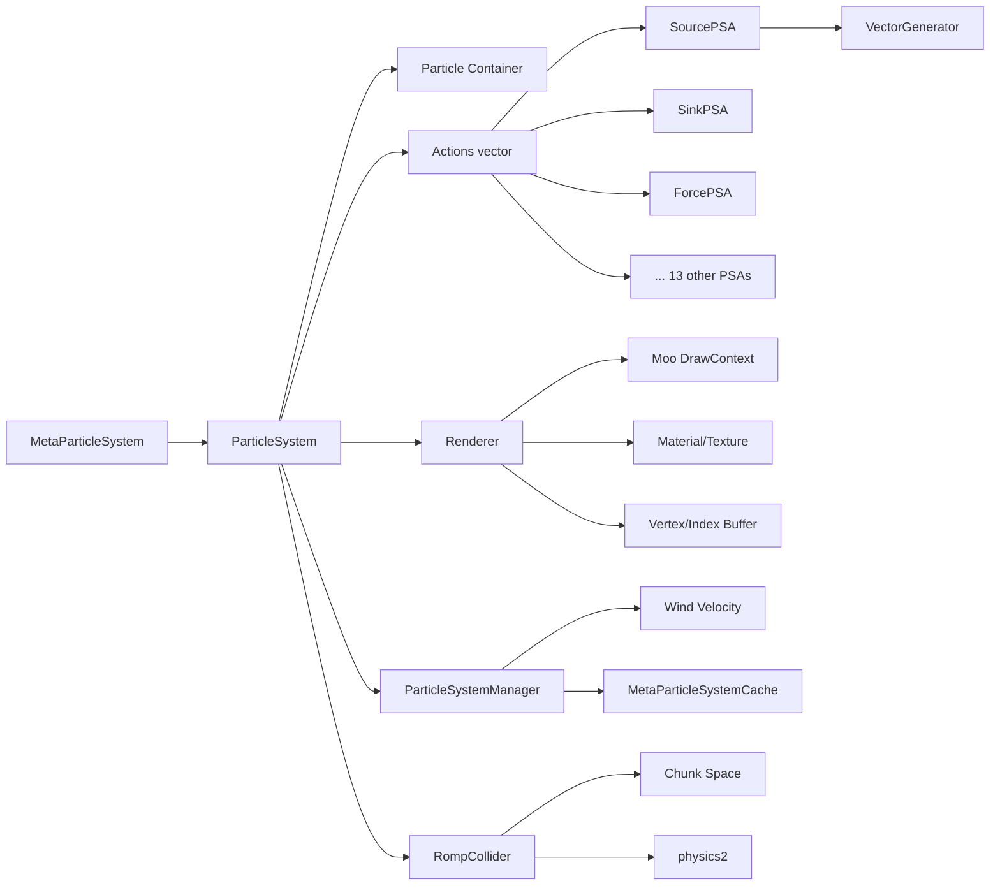
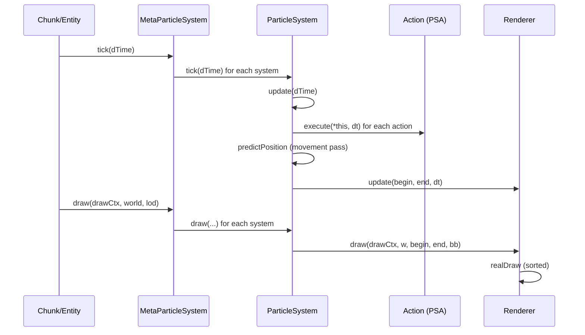
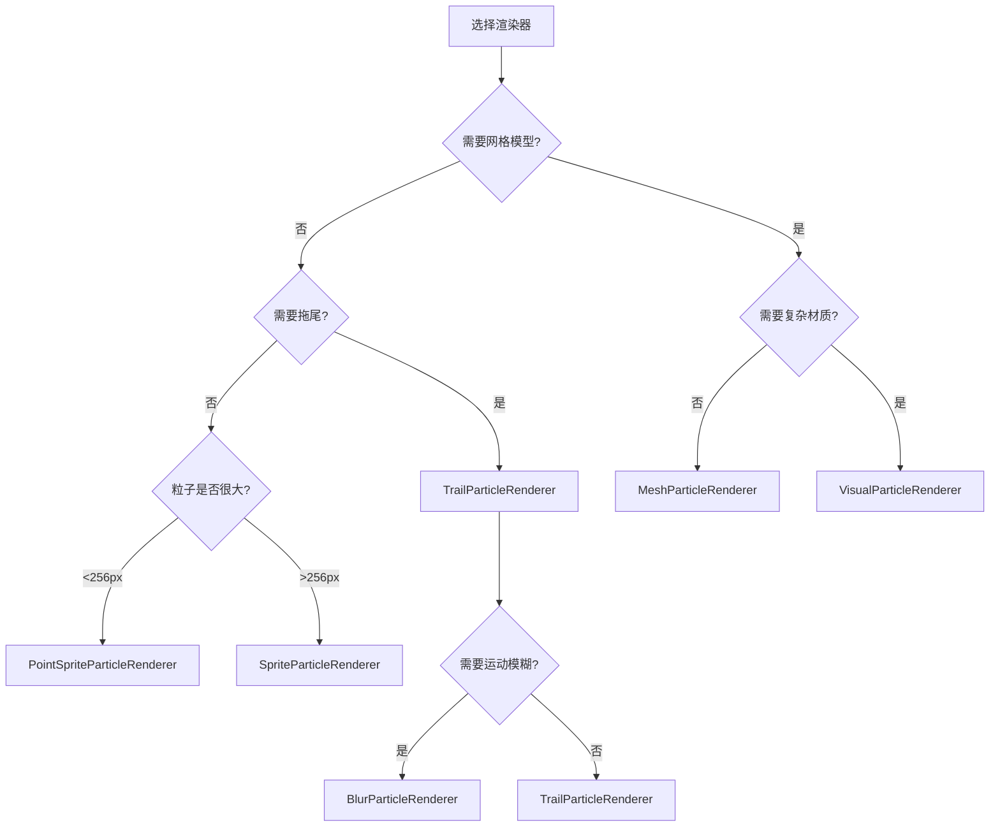
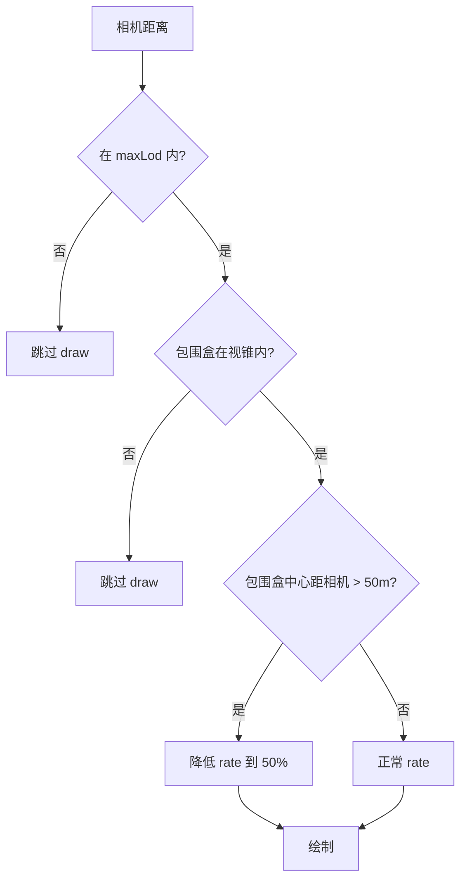

# 专题22:粒子系统深度剖析

> BigWorld Engine 14.4.1 开源版引擎 · 百科级中文技术专题文档
> 源码根目录:`j:/Work/BigWorld-Engine-14.4.1/`
> 粒子库主目录:`j:/Work/BigWorld-Engine-14.4.1/programming/bigworld/lib/particle/`

---

## 目录

- [一、引言:BigWorld 粒子系统设计哲学](#一引言bigworld-粒子系统设计哲学)
  - [1.1 设计目标与定位](#11-设计目标与定位)
  - [1.2 历史背景与演进](#12-历史背景与演进)
  - [1.3 核心设计原则](#13-核心设计原则)
  - [1.4 与引擎其他子系统的关系](#14-与引擎其他子系统的关系)
- [二、整体架构:三层树结构](#二整体架构三层树结构)
  - [2.1 MetaParticleSystem 概览](#21-metaparticlesystem-概览)
  - [2.2 ParticleSystem 单系统](#22-particlesystem-单系统)
  - [2.3 Particle 个体](#23-particle-个体)
  - [2.4 三层调用链](#24-三层调用链)
  - [2.5 资源缓存与生命周期](#25-资源缓存与生命周期)
- [三、粒子数据布局](#三粒子数据布局)
  - [3.1 Particle 结构定义](#31-particle-结构定义)
  - [3.2 紧凑打包与位宽压缩](#32-紧凑打包与位宽压缩)
  - [3.3 PositionColour 子结构](#33-positioncolour-子结构)
  - [3.4 ExtraData 联合体:Mesh 与 NonMesh 互斥](#34-extradata-联合体mesh-与-nonmesh-互斥)
  - [3.5 AOS 布局与 SOA 取舍](#35-aos-布局与-soa-取舍)
- [四、PSNode 节点系统与复合](#四psnode-节点系统与复合)
  - [4.1 PSNode 的角色](#41-psnode-的角色)
  - [4.2 复合参数化](#42-复合参数化)
  - [4.3 与模型节点的关联](#43-与模型节点的关联)
  - [4.4 helperModel 与 hardPoint](#44-helpermodel-与-hardpoint)
- [五、Action 框架](#五action-框架)
  - [5.1 ParticleSystemAction 基类](#51-particlesystemaction-基类)
  - [5.2 Action 类型枚举](#52-action-类型枚举)
  - [5.3 Action 注册与工厂](#53-action-注册与工厂)
  - [5.4 tick 调度流程](#54-tick-调度流程)
  - [5.5 延迟更新队列(Late Update)](#55-延迟更新队列late-update)
  - [5.6 Action 序列化](#56-action-序列化)
- [六、16 种 PSA 总览](#六16-种-psa-总览)
- [七、生成器系统](#七生成器系统)
  - [7.1 VectorGenerator 抽象基类](#71-vectorgenerator-抽象基类)
  - [7.2 PointVectorGenerator](#72-pointvectorgenerator)
  - [7.3 LineVectorGenerator](#73-linevectorgenerator)
  - [7.4 CylinderVectorGenerator](#74-cylindervectorgenerator)
  - [7.5 SphereVectorGenerator](#75-spherevectorgenerator)
  - [7.6 BoxVectorGenerator](#76-boxvectorgenerator)
  - [7.7 生成器的 Python 工厂](#77-生成器的-python-工厂)
- [八、渲染器系统](#八渲染器系统)
  - [8.1 ParticleSystemRenderer 基类](#81-particlesystemrenderer-基类)
  - [8.2 SpriteParticleRenderer](#82-spriteparticlerenderer)
  - [8.3 MeshParticleRenderer](#83-meshparticlerenderer)
  - [8.4 TrailParticleRenderer](#84-trailparticlerenderer)
  - [8.5 VisualParticleRenderer](#85-visualparticlerenderer)
  - [8.6 BlurParticleRenderer 与 AmpParticleRenderer](#86-blurparticlerenderer-与-ampparticlerenderer)
  - [8.7 PointSpriteParticleRenderer](#87-pointspriteparticlerenderer)
- [九、更新循环](#九更新循环)
  - [9.1 tick 与 update 的关系](#91-tick-与-update-的关系)
  - [9.2 update 内部分帧](#92-update-内部分帧)
  - [9.3 老化通道(Aging Pass)](#93-老化通道aging-pass)
  - [9.4 Action 执行通道](#94-action-执行通道)
  - [9.5 移动通道(Movement Pass)](#95-移动通道movement-pass)
  - [9.6 渲染器更新通道](#96-渲染器更新通道)
  - [9.7 包围盒计算](#97-包围盒计算)
  - [9.8 LOD 与可见性](#98-lod-与可见性)
- [十、材质与染色](#十材质与染色)
  - [10.1 TintShaderPSA 工作机制](#101-tintshaderpsa-工作机制)
  - [10.2 贴图动画](#102-贴图动画)
  - [10.3 MaterialFX 混合模式](#103-materialfx-混合模式)
  - [10.4 雾化与软粒子](#104-雾化与软粒子)
- [十一、碰撞与物理集成](#十一碰撞与物理集成)
  - [11.1 CollidePSA 与场景碰撞](#111-collidepsa-与场景碰撞)
  - [11.2 BarrierPSA 几何屏障](#112-barrierpsa-几何屏障)
  - [11.3 SplatPSA 飞溅回调](#113-splatpsa-飞溅回调)
  - [11.4 与 physics2 的集成](#114-与-physics2-的集成)
- [十二、资源序列化](#十二资源序列化)
  - [12.1 .particle 文件格式](#121-particle-文件格式)
  - [12.2 XML 节点结构](#122-xml-节点结构)
  - [12.3 序列化模板框架](#123-序列化模板框架)
  - [12.4 版本号与向后兼容](#124-版本号与向后兼容)
  - [12.5 二进制编译格式](#125-二进制编译格式)
- [十三、客户端集成](#十三客户端集成)
  - [13.1 与 Moo 渲染管线集成](#131-与-moo-渲染管线集成)
  - [13.2 与 Entity 关联](#132-与-entity-关联)
  - [13.3 ChunkParticles 与场景绑定](#133-chunkparticles-与场景绑定)
  - [13.4 风场与全局环境](#134-风场与全局环境)
  - [13.5 Python 脚本接口](#135-python-脚本接口)
- [十四、particle_editor 编辑器](#十四particle_editor-编辑器)
  - [14.1 编辑器架构](#141-编辑器架构)
  - [14.2 工作流](#142-工作流)
  - [14.3 Gizmo 与可视化调参](#143-gizmo-与可视化调参)
- [十五、性能分析与优化策略](#十五性能分析与优化策略)
  - [15.1 性能瓶颈定位](#151-性能瓶颈定位)
  - [15.2 内存占用优化](#152-内存占用优化)
  - [15.3 CPU 开销优化](#153-cpu-开销优化)
  - [15.4 GPU 开销优化](#154-gpu-开销优化)
  - [15.5 LOD 与剔除策略](#155-lod-与剔除策略)
- [十六、设计权衡与替代方案](#十六设计权衡与替代方案)
  - [16.1 紧凑布局 vs 精度损失](#161-紧凑布局-vs-精度损失)
  - [16.2 PSA 数组 vs ECS](#162-psa-数组-vs-ecs)
  - [16.3 CPU 模拟 vs GPU 模拟](#163-cpu-模拟-vs-gpu-模拟)
- [十七、与现代粒子系统对比](#十七与现代粒子系统对比)
  - [17.1 Unreal Niagara](#171-unreal-niagara)
  - [17.2 Unity VFX Graph](#172-unity-vfx-graph)
  - [17.3 对比表](#173-对比表)
- [十八、局限性与改进方向](#十八局限性与改进方向)
- [十九、完整实例:端到端追踪](#十九完整实例端到端追踪)
- [附录 A:PSA 全清单速查](#附录-apsa-全清单速查)
- [附录 B:配置参数与调优](#附录-b配置参数与调优)
- [附录 C:常见粒子问题排查](#附录-c常见粒子问题排查)
- [总结](#总结)

---

## 一、引言:BigWorld 粒子系统设计哲学

### 1.1 设计目标与定位

BigWorld Engine 是一款面向大型多人在线游戏(MMOG)的网游引擎,其客户端需要在数千米视距下同时渲染数百个角色、数千个场景物体,以及大量的特效。粒子系统作为表现"非静态、不规则、瞬态"视觉内容的核心组件,需要在以下目标之间寻找平衡:

- **海量吞吐**:同屏粒子总数轻松突破数万,需要在 CPU 端高效模拟、GPU 端高效绘制。
- **数据驱动**:美术通过 `.particle` 资源描述效果,代码无须改动即可调整表现。
- **可组合**:通过组合多种 Action(粒子系统动作)和 Renderer(渲染器)以构造复杂效果,如喷泉、烟雾、火花、拖尾等。
- **低带宽**:粒子状态紧凑打包为 32 字节,在 CPU 缓存中友好,且适合大量实例的场景网络同步。
- **MMO 友好**:与场景、Chunk、Entity、模型节点、风场、物理系统紧密集成,可以挂接到任意角色骨骼节点上。

源码实现位于 [particle.hpp](file:///j:/Work/BigWorld-Engine-14.4.1/programming/bigworld/lib/particle/particle.hpp) 等文件,核心设计可以概括为一句话:**用紧凑的 32 字节 Particle + 顺序遍历的 PSA 数组,在 CPU 上做确定性的离散时间步进,通过 Renderer 抽象出 GPU 绘制**。

### 1.2 历史背景与演进

BigWorld 粒子系统的代码风格与命名带有强烈的早期 2000 年代特征:使用 `BW_BEGIN_NAMESPACE`/`BW_END_NAMESPACE` 宏命名空间、`SmartPointer<T>` 引用计数、`DataSectionPtr` XML 数据描述、`pyscript` 自研 Python 绑定。在 14.4.1 版本中,粒子系统相比早期版本已经引入了若干改进:

- **MetaParticleSystemCache**:基于 `StringRefUnorderedMap` 的资源缓存,避免同一资源被多次解析。
- **BackgroundTask 贴图加载**:`BGUpdateData<>` 模板把贴图加载放到后台线程。
- **TintShaderPSA**:替代早期 `TintPSA` 的着色器版本,支持多关键帧染色。
- **视觉粒子渲染器分离**:`VisualParticleRenderer` 取代了原本只能跑 `MeshParticleRenderer` 的简单 visual,使得普通 `.visual` 资源也可作为粒子。
- **Binary 编译格式**:`particle_system_writer` 把 XML 编译为二进制以加速运行时加载。
- **序列化版本号**:`serialiseVersionCode = 2`,与早期版本区分。

### 1.3 核心设计原则

通读 [particle_system.hpp](file:///j:/Work/BigWorld-Engine-14.4.1/programming/bigworld/lib/particle/particle_system.hpp) 与 [particle_system.cpp](file:///j:/Work/BigWorld-Engine-14.4.1/programming/bigworld/lib/particle/particle_system.cpp) 可以提炼出以下设计原则:

1. **零虚函数热路径**:粒子的更新通过 `Particles::iterator` 顺序扫描,Action 列表也是 `vector<PSAPtr>` 顺序遍历,虚拟分派只发生在 Action 边界。
2. **确定性时间步**:`update` 中通过 `Particle::nAgeIncrements` 把 `dt` 量化为 `1/120` 秒的整数倍,避免浮点累积误差,保证回放与多人同步一致性。详见 [particle.ipp](file:///j:/Work/BigWorld-Engine-14.4.1/programming/bigworld/lib/particle/particle.ipp) 中的 `AGE_MIN_INCREMENT = 1.f/120.f`。
3. **紧凑 SOA 边界**:`Particle` 通过 `#pragma pack(push, 1)` 强制 1 字节对齐,总体 32 字节,正好是缓存行的 1/2。
4. **可挂载性**:`ParticleSystem` 提供 `attach/detach/tossed/enterWorld/leaveWorld/move` 等"伪 PyAttachment"接口,使其能像模型附件一样被 `MatrixLiaison` 驱动。
5. **渲染器即策略**:`pRenderer_` 通过 `createParticleContainer()` 工厂方法决定粒子容器类型(`ContiguousParticles` vs `FixedIndexParticles`),不同渲染器有不同布局需求。

### 1.4 与引擎其他子系统的关系



粒子系统位于 `lib/particle/`,它向上依赖 `moo`(渲染)、`romp`(碰撞)、`chunk`(场景)、`model`(模型节点),向下提供 `py_meta_particle_system` / `py_particle_system` 给 Python 脚本使用。粒子系统本身不直接依赖 EntityDef,但通过 `PyAttachment` 包装后可挂在任何 Entity 上。

---

## 二、整体架构:三层树结构

BigWorld 的粒子系统在逻辑上呈现 **MetaParticleSystem → ParticleSystem → Particle** 三层结构,这与 Unreal Niagara 的"Emitter → Particle"两层结构不同,中间多出的 MetaParticleSystem 层用于组合多个 ParticleSystem 共同呈现一个"效果"。

### 2.1 MetaParticleSystem 概览

[meta_particle_system.hpp](file:///j:/Work/BigWorld-Engine-14.4.1/programming/bigworld/lib/particle/meta_particle_system.hpp#L28-L143) 定义了 MetaParticleSystem,它是多个 ParticleSystem 的容器:

```cpp
class MetaParticleSystem : public ReferenceCount
{
public:
    typedef BW::vector<ParticleSystemPtr> ParticleSystems;

    bool tick( float dTime );
    void draw( Moo::DrawContext& drawContext,
               const Matrix & worldTransform, float lod );
    bool attach( MatrixLiaison * pOwnWorld );
    void detach();
    void tossed( bool isOutside );
    void enterWorld();
    void leaveWorld();
    void move( float dTime );

    bool load( DataSectionPtr pDS, const BW::StringRef & filename,
               StringBuilder* pError = NULL );
    void addSystem( const ParticleSystemPtr & newSystem );
    ParticleSystemPtr system( const BW::StringRef & name );
    // ...
private:
    ParticleSystems systems_;
    MatrixLiaison * pOwnWorld_;
    bool attached_;
    bool inWorld_;
};
```

MetaParticleSystem 自身没有更新逻辑,只是把 `tick`/`draw`/`attach` 等调用转发到每个子 ParticleSystem。这种设计的好处是:

- **资源粒度**:一个 `.particle` 文件就是一个 MetaParticleSystem,内部可包含多个独立 ParticleSystem,例如"火焰 + 烟雾 + 火星"分别由三个 ParticleSystem 实现。
- **统一变换**:所有子系统共享同一个 `worldTransform`,但每个 ParticleSystem 还有自己的 `localOffset_` 用于在父空间内偏移。
- **独立 Action 集**:每个 ParticleSystem 有自己的 Action 列表,互不干扰,便于美术分工。

### 2.2 ParticleSystem 单系统

[particle_system.hpp](file:///j:/Work/BigWorld-Engine-14.4.1/programming/bigworld/lib/particle/particle_system.hpp#L27-L257) 定义了 ParticleSystem,它是粒子系统的真正核心。它的成员大致可以分为四组:

| 分组 | 关键成员 | 作用 |
| --- | --- | --- |
| 容器 | `particles_` (ParticlesPtr) | 持有 Particle 数组,具体类型由 Renderer 决定 |
| 行为 | `actions_` (Actions vector) | 按顺序执行的 PSA 列表 |
| 渲染 | `pRenderer_` | 绘制策略 |
| 上下文 | `pOwnWorld_`, `windEffect_`, `boundingBox_`, `vizBox_`, `id_` | 世界、风、包围盒、唯一 ID |

ParticleSystem 既"像 PyAttachment"又"像 ReferenceCount"。`attach`/`detach`/`tossed` 等方法让它能挂到模型节点或场景物体上,`ReferenceCount` 基类让它能被 `SmartPointer` 安全共享。

构造函数 [particle_system.cpp#L75-L103](file:///j:/Work/BigWorld-Engine-14.4.1/programming/bigworld/lib/particle/particle_system.cpp#L75-L103):

```cpp
ParticleSystem::ParticleSystem( int initialCapacity ) :
    windFactor_( 0.f ),
    enabled_( true ),
    doUpdate_( false ),
    firstUpdate_( false ),
    pGS_( NULL ),
    pRenderer_( NULL ),
    particles_( new ContiguousParticles ),
    counter_( s_counter_++ % 10 ),
    boundingBox_( BoundingBox::s_insideOut_ ),
    vizBox_( BoundingBox::s_insideOut_ ),
    explicitPosition_( 0,0,0 ),
    explicitDirection_( 0,0,1 ),
    explicitTransform_( false ),
    localOffset_( 0.f, 0.f, 0.f ),
    maxLod_( 0.f ),
    fixedFrameRate_( -1.f ),
    framesLeftOver_( 0.f ),
    static_( false ),
    id_(s_idCounter_++),
    forcingSave_( false ),
    pOwnWorld_( NULL ),
    attached_( false ),
    inWorld_( false ),
    windEffect_( Vector3::zero() )
{
    BW_GUARD;
    this->capacity( std::min( initialCapacity, MAX_CAPACITY ) );
}
```

注意几个细节:

- `counter_( s_counter_++ % 10 )`:用静态计数器对包围盒更新做错峰,避免所有系统同帧重算包围盒。
- `MAX_CAPACITY = 65536`:容量上限受 16 位 `idx_/distance_` 字段限制。
- `particles_( new ContiguousParticles )`:默认容器,Renderer 可能在 `pRenderer()` setter 中替换为 `FixedIndexParticles`。
- `static_( false )`:静态系统使用不同的包围盒更新策略,详见 [9.7 节](#97-包围盒计算)。

### 2.3 Particle 个体

[particle.hpp](file:///j:/Work/BigWorld-Engine-14.4.1/programming/bigworld/lib/particle/particle.hpp#L42-L166) 是粒子的内存表示,详细剖析见 [第三章](#三粒子数据布局)。

### 2.4 三层调用链

整个粒子的更新和绘制由上层驱动:



### 2.5 资源缓存与生命周期

[meta_particle_system.hpp#L148-L174](file:///j:/Work/BigWorld-Engine-14.4.1/programming/bigworld/lib/particle/meta_particle_system.hpp#L148-L174) 定义了 `MetaParticleSystemCache`:

```cpp
class MetaParticleSystemCache
{
public:
    MetaParticleSystemPtr load( const StringRef & filename );
    void clear();
    void shutdown();
private:
    typedef BW::StringRefUnorderedMap< MetaParticleSystemPtr > Cache;
    Cache cache_;
    SimpleMutex mutex_;
    size_t cacheHit_;
    size_t cacheMiss_;
    bool enabled_;
};
```

缓存采用 `SimpleMutex` 保护,允许多线程并发读取。命中后返回的是 `clone()` 副本,因为每个 ParticleSystem 实例都需要维护自己的粒子状态。`ParticleSystem::clone()` 内部会:

1. 调用 `serialise( BW::CloneObject<ParticleSystem>(this, ps) )` 复制属性
2. 遍历 actions,逐个 `(*it)->clone()`
3. 如果有 renderer,执行 `pRenderer_->clone()`
4. 设置 capacity,会触发粒子容器重建
5. 复制 `vizBox_` 并 `clearBoundingBox()`

---

## 三、粒子数据布局

### 3.1 Particle 结构定义

[particle.hpp#L36-L166](file:///j:/Work/BigWorld-Engine-14.4.1/programming/bigworld/lib/particle/particle.hpp#L36-L166) 给出了 Particle 的完整定义。它通过 `#pragma pack(push, 1)` 强制 1 字节对齐,总大小为 **32 字节**:

```cpp
#pragma pack(push, 1)
class Particle
{
public:
    struct PositionColour
    {
        Vector3  position_;   // [12 bytes]
        uint32   colour_;     // [4 bytes]
    };

    // ... 接口方法

private:
    struct MeshData
    {
        uint16  meshSpinAge_;   // [2]
        uint8   spinSpeed_;     // [1]
        uint8   spinAxisX_;     // [1]
        uint8   spinAxisY_;     // [1]
        uint8   spinAxisZ_;     // [1]
    };                          // 总 6 字节

    struct NonMeshData
    {
        uint16  size_;          // [2]
        uint16  idx_;           // [2]
        uint16  distance_;      // [2]
    };                          // 总 6 字节

    union ExtraData
    {
        MeshData    meshData_;
        NonMeshData nonMeshData_;
    };                          // 6 字节

    PositionColour positionColour_; // [16 bytes]
    int16  xVel_;                // [2]
    int16  yVel_;                // [2]
    int16  zVel_;                // [2]
    uint16 age_;                 // [2]
    uint16 pitchYaw_;            // [2]
    ExtraData extraData_;        // [6]
};
#pragma pack(pop)
```

按字段累加:`16 + 6 (vel) + 2 (age) + 2 (pitchYaw) + 6 (extra) = 32 字节`。

### 3.2 紧凑打包与位宽压缩

粒子采用大量"小整数+缩放因子"的方式压缩存储:

| 字段 | 类型 | 范围 | 缩放因子 | 实际物理量 |
| --- | --- | --- | --- | --- |
| `xVel_` | int16 | [-32768, 32767] | /256 | 速度 m/s,范围 ±128 m/s |
| `age_` | uint16 | [0, 65535] | /120 | 年龄,范围 0 到 ~546 秒(9 分钟) |
| `pitchYaw_` | uint16 | 高 8 位 pitch,低 8 位 yaw | /256 × 2π | 旋转角度 |
| `size_` | uint16 | [0, 65535] | ×100/65535 | 大小 m,范围 0~100 m |
| `meshSpinAge_` | uint16 | [0, 65535] | ×100/65535 | 累计旋转 |
| `spinAxisX/Y/Z_` | uint8 | [0, 255] | /255 | 单位向量分量 |
| `spinSpeed_` | uint8 | [0, 255] | /255 × 20 | 转/秒,0~20 圈/秒 |

详见 [particle.ipp#L9-L40](file:///j:/Work/BigWorld-Engine-14.4.1/programming/bigworld/lib/particle/particle.ipp#L9-L40):

```cpp
const float VELOCITY_MIN_DATA   = -32768.0f;
const float VELOCITY_MAX_DATA   = +32767.0f;
const float SIZE_MAX_DATA       = 65535.f;
const float SIZE_MAX_VALUE      = 100.f;
const float PACK_SIZE           = SIZE_MAX_DATA / SIZE_MAX_VALUE;
const float UNPACK_SIZE         = SIZE_MAX_VALUE / SIZE_MAX_DATA;
const float AGE_MIN_INCREMENT   = 1.f / 120.f;   // 年龄量化粒度
const float AGE_MAX_DATA        = 65535.f;
const float AGE_MAX_VALUE       = AGE_MAX_DATA * AGE_MIN_INCREMENT; // ~546s
const float ROT_MAX_DATA        = 256.f;
const float ROT_MAX_VALUE       = MATH_2PI;
```

写入时调用 `Math::clamp` 防止越界:

```cpp
INLINE void Particle::setVelocity( const Vector3& v )
{
    xVel_ = (int16)(Math::clamp(VELOCITY_MIN_DATA, v.x*256.f, VELOCITY_MAX_DATA));
    yVel_ = (int16)(Math::clamp(VELOCITY_MIN_DATA, v.y*256.f, VELOCITY_MAX_DATA));
    zVel_ = (int16)(Math::clamp(VELOCITY_MIN_DATA, v.z*256.f, VELOCITY_MAX_DATA));
}
```

`age_` 的特殊值 `0xffff` 被用作"死亡标记",`isAlive()` 检查它判断粒子是否激活:

```cpp
INLINE bool Particle::isAlive() const
{
    return (age_ != AGE_MAX_DATA_UINT);  // 0xffff
}
INLINE void Particle::kill()
{
    age_ = AGE_MAX_DATA_UINT;
}
```

### 3.3 PositionColour 子结构

`PositionColour` 是一个 16 字节的子结构,被有意设计为"位置 + 颜色"相邻布局:

```cpp
struct PositionColour
{
    Vector3  position_;   // 12 bytes
    uint32   colour_;     // 4 bytes
};
```

这是因为渲染器上传顶点数据时,常常只取 position+colour 两个字段构造顶点缓冲。`ParticleSystem::getUniqueParticleID` 通过 `positionColour()` 指针访问这两个字段做 hash 标识,FlarePSA 也通过它生成 lens effect。

### 3.4 ExtraData 联合体:Mesh 与 NonMesh 互斥

`ExtraData` 是一个 6 字节联合体,根据渲染器类型决定解释方式:

- **MeshData**(Mesh 渲染器):存储 meshSpinAge / spinSpeed / spinAxis,用于网格粒子旋转。
- **NonMeshData**(Sprite / Trail 渲染器):存储 size / idx / distance。

`ParticleSystem::addParticle(particle, isMesh)` 的第二个参数决定了走哪个分支:

```cpp
if (particleSystem.pRenderer() && particleSystem.pRenderer()->isMeshStyle())
{
    pitch += objectToWorld.applyToUnitAxisVector(2).pitch();
    yaw += objectToWorld.applyToUnitAxisVector(2).yaw();
    Particle p(position, velocity, pitch, yaw, spinAxis, spinSpeed);
    particleSystem.addParticle( p, true );
}
else
{
    Particle p(position, velocity, colour, size, pitch, yaw);
    particleSystem.addParticle( p, false );
}
```

来自 [source_psa.cpp#L597-L608](file:///j:/Work/BigWorld-Engine-14.4.1/programming/bigworld/lib/particle/actions/source_psa.cpp#L597-L608)。

### 3.5 AOS 布局与 SOA 取舍

BigWorld 采用 **AOS(Array of Structures)** 而非 SOA(Structure of Arrays)布局。这一选择有几方面考量:

**优点**:
- 单粒子操作局部性好:SourcePSA 创建粒子时一次性写入所有字段。
- 代码可读性高,接口直观(`pIter->position()` 等)。
- 兼容传统 STL 容器:`vector<Particle>` 即可。

**缺点**:
- SIMD 化困难:对"所有粒子的 x 坐标统一加 dt*v.x"操作,需要 gather/scatter。
- cache 利用率在"只读 position"时为 12/32=37.5%(其余 62.5% 浪费)。

但 BigWorld 选择 AOS 的关键原因是**操作以 Action 为单位,而非以字段为单位**:SourcePSA 写入所有字段,ForcePSA 只改速度,JitterPSA 同时改位置和速度。Action 内部本来就是全字段访问,AOS 的优势被放大。这与现代 GPU 粒子(SOA + Compute Shader)有根本不同,详见 [16.3 节](#163-cpu-模拟-vs-gpu-模拟)。

---

## 四、PSNode 节点系统与复合

### 4.1 PSNode 的角色

源码中并不存在独立的 `ps_node.hpp` 文件——文档里所说的 "PSNode" 指的是 **ParticleSystem 与 Moo::Node 的耦合关系**。`ParticleSystem` 通过 `attach(MatrixLiaison*)` 接受一个外部矩阵提供者,通常是 `PyModelNode` 或 `ChunkItem` 持有的节点。

`MatrixLiaison` 是一个抽象接口,提供:

```cpp
class MatrixLiaison
{
public:
    virtual const Matrix & world() const = 0;
    virtual void           world( const Matrix & ) = 0;  // 允许回写
    virtual const Matrix & object() const = 0;
};
```

`ParticleSystem` 在 `attach` 时保存 `pOwnWorld_` 指针,每帧 `tick`/`draw` 时通过 `objectToWorld()` 获取当前世界矩阵。

### 4.2 复合参数化

MetaParticleSystem 提供了"helper model"机制,允许把粒子系统附着到一个辅助模型上,然后从该模型的 hardpoint 取变换矩阵:

```cpp
void helperModelName( const BW::string &name ) { helperModelName_ = name; }
const BW::string &helperModelName() const { return helperModelName_; }
void helperModelCenterOnHardPoint(uint idx) { helperModelCenterOnHardPoint_ = idx; }
uint helperModelCenterOnHardPoint() const { return helperModelCenterOnHardPoint_; }

static void getHardPointTransforms( ModelPtr model,
    BW::vector<BW::string> &helperModelHardPointNames,
    BW::vector< Matrix > &helperModelHardPointTransforms );
```

这使得美术可以在 3ds Max 中摆放 hardpoint,游戏运行时让粒子系统跟着 hardpoint 走,而不是固定挂接在某个 Entity 上。

### 4.3 与模型节点的关联

`pymodelnode.cpp` 中的 `PyModelNode` 既是一个 `MatrixLiaison` 又是一个 Python 对象,它把模型的某个节点暴露给脚本,允许把粒子系统 attach 上去:

```python
fx = BigWorld.ParticleSystem( "particles/fire.particle" )
node = model.node( "bip01 head" )
node.attach( fx )
```

`PyModelNode` 内部持有 `MatrixLiaison*`,在模型动画更新后会自动更新该矩阵,粒子系统读取它即可获得最新的世界变换。

### 4.4 helperModel 与 hardPoint

MetaParticleSystem 在加载时可以指定一个 `helperModelName_`,这个名字指向一个 `.model` 资源。`getHardPointTransforms` 静态方法会枚举该模型的所有 hardpoint,把名字和初始变换返回给调用者。粒子编辑器使用这一机制在 hardpoint 之间快速切换粒子系统的挂接位置。

---

## 五、Action 框架

### 5.1 ParticleSystemAction 基类

[particle_system_action.hpp#L94-L173](file:///j:/Work/BigWorld-Engine-14.4.1/programming/bigworld/lib/particle/actions/particle_system_action.hpp#L94-L173) 定义了所有 PSA 的基类:

```cpp
class ParticleSystemAction : public ReferenceCount
{
public:
    static void pushLateUpdate( ParticleSystemAction& action,
        ParticleSystem& particleSystem, float dTime );
    static void flushLateUpdates();
    static void removeLateUpdates( const ParticleSystemAction* action );
    static void removeLateUpdates( const ParticleSystem* system );

    virtual ParticleSystemActionPtr clone() const = 0;
    virtual void execute( ParticleSystem & particleSystem, float dTime ) = 0;
    virtual void lateExecute( ParticleSystem & particleSystem, float dTime ) {}
    virtual int typeID() const = 0;
    virtual const BW::string & nameID() const = 0;

    float delay() const;
    void delay( float seconds );
    float minimumAge() const;
    void minimumAge( float seconds );
    bool enabled() const;
    void enabled( bool state );

protected:
    virtual void loadInternal( DataSectionPtr pSect ) = 0;
    virtual void saveInternal( DataSectionPtr pSect ) const = 0;

    float delay_;        // 延迟激活时间
    float minimumAge_;   // 受影响粒子的最小年龄
    float age_;          // 自身累计年龄,用于判断是否激活
    bool  enabled_;
    BW::string name_;
};
```

核心契约:

- **`execute`**:每个 dt 调用一次,负责"主阶段"更新,可以读粒子、改粒子。
- **`lateExecute`**:可选,在所有 Action 的 execute 完成后才调用,用于需要"全量计算后"才能正确执行的操作(例如 MatrixSwarmPSA 需要等所有 MatrixProvider 更新好)。
- **`delay`/`minimumAge`**:统一过滤条件,delay 控制 Action 启用前要等多久;minimumAge 控制粒子受影响的最低年龄。
- **`enabled`**:运行时开关,允许脚本临时关闭某个 Action。

### 5.2 Action 类型枚举

[particle_system_action.hpp#L24-L42](file:///j:/Work/BigWorld-Engine-14.4.1/programming/bigworld/lib/particle/actions/particle_system_action.hpp#L24-L42):

```cpp
enum ParticleSystemActionType
{
    PSA_SOURCE_TYPE_ID         =  1,
    PSA_SINK_TYPE_ID           =  2,
    PSA_BARRIER_TYPE_ID        =  3,
    PSA_FORCE_TYPE_ID          =  4,
    PSA_STREAM_TYPE_ID         =  5,
    PSA_JITTER_TYPE_ID         =  6,
    PSA_SCALAR_TYPE_ID         =  7,
    PSA_TINT_SHADER_TYPE_ID    =  8,
    PSA_NODE_CLAMP_TYPE_ID     =  9,
    PSA_ORBITOR_TYPE_ID        = 10,
    PSA_FLARE_TYPE_ID          = 11,
    PSA_COLLIDE_TYPE_ID        = 12,
    PSA_MATRIX_SWARM_TYPE_ID   = 13,
    PSA_MAGNET_TYPE_ID         = 14,
    PSA_SPLAT_TYPE_ID          = 15,
    PSA_TYPE_ID_MAX            = 16
};
```

共 15 个具体 Action 类型(ID 1~15),ID 16 是哨兵。

### 5.3 Action 注册与工厂

`ParticleSystemAction` 提供:

```cpp
static int nameToType( const BW::string & name );
static const BW::string & typeToName( int type );
static ParticleSystemActionPtr createActionOfType( int type );
```

`nameToType` 用于从 XML 标签解析出类型 ID,例如 `<Source>` → `PSA_SOURCE_TYPE_ID`。`createActionOfType` 是工厂方法,根据 ID `new` 出对应的 PSA 子类。具体实现位于 `particle_system_action.cpp`,通过 switch-case 派发:

```cpp
ParticleSystemActionPtr ParticleSystemAction::createActionOfType( int type )
{
    switch ( type )
    {
    case PSA_SOURCE_TYPE_ID:       return new SourcePSA();
    case PSA_SINK_TYPE_ID:         return new SinkPSA();
    case PSA_BARRIER_TYPE_ID:      return new BarrierPSA();
    case PSA_FORCE_TYPE_ID:        return new ForcePSA();
    case PSA_STREAM_TYPE_ID:       return new StreamPSA();
    case PSA_JITTER_TYPE_ID:       return new JitterPSA();
    case PSA_SCALAR_TYPE_ID:      return new ScalerPSA();
    case PSA_TINT_SHADER_TYPE_ID:  return new TintShaderPSA();
    case PSA_NODE_CLAMP_TYPE_ID:   return new NodeClampPSA();
    case PSA_ORBITOR_TYPE_ID:      return new OrbitorPSA();
    case PSA_FLARE_TYPE_ID:        return new FlarePSA();
    case PSA_COLLIDE_TYPE_ID:      return new CollidePSA();
    case PSA_MATRIX_SWARM_TYPE_ID: return new MatrixSwarmPSA();
    case PSA_MAGNET_TYPE_ID:       return new MagnetPSA();
    case PSA_SPLAT_TYPE_ID:        return new SplatPSA();
    }
    return NULL;
}
```

### 5.4 tick 调度流程

[particle_system.cpp#L879-L918](file:///j:/Work/BigWorld-Engine-14.4.1/programming/bigworld/lib/particle/particle_system.cpp#L879-L918) 是 `tick` 的实现:

```cpp
bool ParticleSystem::tick( float dTime )
{
    BW_GUARD;

    if (!ParticleSystemManager::instance().active())
        return false;

    bool calcBoundingBox = false;

    // 静态系统只有在被标记 doUpdate_ 时才更新;
    // 动态系统每帧都更新。
    if (!isStatic() || doUpdate_)
    {
        this->update( dTime );

        // 包围盒每 10 帧重算一次,counter_ 是静态计数器取模
        if (++counter_ == 10)
        {
            counter_ = 0;
            calcBoundingBox = true;
        }

        if (calcBoundingBox)
        {
            updateBoundingBox();
        }
        return true;
    }
    return false;
}
```

注意 `tick` 只是个调度器,真正的更新在 `update` 中。`tick` 还负责:
- 检查 ParticleSystemManager 全局开关
- 静态/动态系统分流
- 10 帧一次的包围盒重算(错峰避免抖动)

### 5.5 延迟更新队列(Late Update)

某些 Action(如 CollidePSA、OrbitorPSA、MatrixSwarmPSA)需要在所有 Action execute 后再执行,因为它们依赖最终的粒子位置或外部 MatrixProvider 的最新矩阵。这些 Action 在 `execute` 中调用 `pushLateUpdate`:

```cpp
ParticleSystemAction::pushLateUpdate( *this, particleSystem, dTime );
```

把自身加入静态队列 `s_updateLaterQueue_`,然后在 `update` 完成后由 `flushLateUpdates()` 统一执行 `lateExecute`。这是一个 **二次扫描(BSP)** 模式:

```cpp
struct UpdateLaterAction
{
    ParticleSystemAction* action_;
    ParticleSystem* particleSystem_;
    float dTime_;
};

// 静态队列,大小 4096
typedef BW::DynamicEmbeddedArrayWithWarning< UpdateLaterAction,
    MAX_PARTICLE_SYSTEM_ACTIONS > UpdateLaterQueue;
static UpdateLaterQueue s_updateLaterQueue_;
```

`ParticleSystemManager` 在每帧结束前调用 `flushLateUpdates`,完成所有延迟操作。

### 5.6 Action 序列化

所有 PSA 都通过统一的模板框架进行序列化,详见 [12.3 节](#123-序列化模板框架)。核心模式:

```cpp
template < typename Serialiser >
void SourcePSA::serialise( const Serialiser & s ) const
{
    BW_PARITCLE_SERIALISE( s, SourcePSA, motionTriggered );
    BW_PARITCLE_SERIALISE( s, SourcePSA, timeTriggered );
    BW_PARITCLE_SERIALISE( s, SourcePSA, rate );
    // ...
}
```

`BW_PARITCLE_SERIALISE` 宏展开为 `serialiser.serialise("motionTriggered_", &SourcePSA::motionTriggered, &SourcePSA::motionTriggered)`,同时支持 XML 保存、XML 加载、内存克隆三种模式。

---

## 六、16 种 PSA 总览

下表汇总所有 PSA 的职责,详细剖析见后续章节。

| ID | 名称 | 类 | 职责 | 阶段 |
| --: | --- | --- | --- | --- |
| 1 | Source | SourcePSA | 创建粒子,支持时间触发、运动触发、强制生成 | execute |
| 2 | Sink | SinkPSA | 销毁粒子,按年龄/速度过滤,支持 outsideOnly | execute + late |
| 3 | Barrier | BarrierPSA | 几何屏障(盒/球/圆柱/平面),阻挡或反弹粒子 | execute + late |
| 4 | Force | ForcePSA | 牛顿力,沿固定方向施加加速度 | execute + late |
| 5 | Stream | StreamPSA | 流场,将粒子速度向目标速度收敛(类似风) | execute |
| 6 | Jitter | JitterPSA | 随机扰动位置/速度 | execute + late |
| 7 | Scalar | ScalerPSA | 大小缩放,线性趋向目标尺寸 | execute + late |
| 8 | TintShader | TintShaderPSA | 着色器染色,按年龄插值 RGBA 关键帧 | execute |
| 9 | NodeClamp | NodeClampPSA | 让粒子跟随节点位移(同步平移) | execute + late |
| 10 | Orbitor | OrbitorPSA | 围绕指定点做圆周运动(非牛顿) | execute + late |
| 11 | Flare | FlarePSA | 镜头光晕,把粒子注册到 lens effect 系统 | execute + late |
| 12 | Collide | CollidePSA | 与场景几何碰撞,支持弹性、声音 | execute + late |
| 13 | MatrixSwarm | MatrixSwarmPSA | 让粒子群集分布在多个 MatrixProvider 周围 | execute + late |
| 14 | Magnet | MagnetPSA | 磁力,基于距离平方反比的引力 | execute + late |
| 15 | Splat | SplatPSA | 碰撞触发 Python 回调,用于飞溅效果 | execute + late |

注意:`RendererPSA` 并不存在于源码中——渲染器在 BigWorld 中是独立于 Action 的对象(`pRenderer_`)。文档约定俗成把 `SpriteParticleRenderer` 等称为 "Renderer PSA" 是不准确的,实际它们继承自 `ParticleSystemRenderer` 而非 `ParticleSystemAction`。

### 6.1 SourcePSA 详解(类型 ID = 1)

SourcePSA 是粒子系统的"源头",所有粒子都由它创建。源码位于 [actions/source_psa.hpp](file:///j:/Work/BigWorld-Engine-14.4.1/programming/bigworld/lib/particle/actions/source_psa.hpp) 与 [actions/source_psa.cpp](file:///j:/Work/BigWorld-Engine-14.4.1/programming/bigworld/lib/particle/actions/source_psa.cpp)。

#### 6.1.1 触发模式

SourcePSA 支持四种相互独立的触发模式,可同时启用多个:

| 模式 | 触发条件 | 关键字段 | 典型用途 |
| --- | --- | --- | --- |
| `timeTriggered` | 按每秒固定数量生成 | `rate_`(particles/sec) | 喷泉、烟囱、火焰 |
| `motionTriggered` | 节点位移超过 `sensitivity_` 时生成 | `sensitivity_` | 角色行走扬尘、剑挥舞 |
| `grounded` | 粒子出生时强制贴地 | `groundSpecifier_`、`dropDistance_` | 落地碎屑 |
| `forcedUnitSize` | 一次性创建 N 个粒子 | `forcedUnitSize_` | 爆炸、瞬间释放 |

#### 6.1.2 周期与休眠

SourcePSA 内置 `activePeriod_` 与 `sleepPeriod_/sleepPeriodMax_`,允许粒子源周期性"休眠-苏醒"。每个周期开始时随机化下一次睡眠时长(在 `sleepPeriod_` 与 `sleepPeriodMax_` 之间),适用于脉冲喷发效果。

```cpp
// 伪代码:周期更新
if (sleeping_)
{
    sleepCounter_ -= dTime;
    if (sleepCounter_ <= 0)
    {
        activeCounter_ = activePeriod_;
        sleeping_ = false;
    }
}
else
{
    activeCounter_ -= dTime;
    if (activeCounter_ <= 0)
    {
        // 进入休眠,休眠时长在 [sleepPeriod_, sleepPeriodMax_] 内随机
        sleepCounter_ = sleepPeriod_ + rand() * (sleepPeriodMax_ - sleepPeriod_);
        sleeping_ = true;
    }
}
```

#### 6.1.3 速率累积与发射

`timeTriggered` 模式采用"分数累积"算法,避免在低帧率下出现"少发射"或"帧率依赖":

```cpp
// 累积生成预算
spawnCount_ += rate_ * dTime;
int n = (int)spawnCount_;
spawnCount_ -= n;
// 在本帧创建 n 个粒子
for (int i = 0; i < n; ++i)
    createParticle(particleSystem, ...);
```

#### 6.1.4 Mesh 与 NonMesh 分支

`createParticles` 根据 `particleSystem.pRenderer()->isMeshStyle()` 选择粒子初始化路径:

```cpp
if (particleSystem.pRenderer()->isMeshStyle())
{
    // Mesh 分支:写入 spinAxis/spinSpeed 到 ExtraData.mesh
    particle.setMeshSpinSpeeds(initialSpin, spinSpeed);
}
else
{
    // Sprite 分支:写入 pitchYaw 到 ExtraData.sprite
    particle.setPitchYaw(initialPitchYaw);
}
```

这是 BigWorld 紧凑布局的代价——粒子的"额外数据"必须二选一,无法同时既 mesh-spin 又 sprite-rotate。

#### 6.1.5 motionTriggered 实现细节

motionTriggered 模式记录上一帧的节点世界位置,与本帧位置之差即为位移向量:

```cpp
Vector3 displacement = currentWorldPos - lastPositionOfPS_;
float moved = displacement.length();
if (moved > sensitivity_)
{
    // 按 moved/sensitivity 比例生成粒子
    int n = (int)(moved / sensitivity_);
    for (int i = 0; i < n; ++i)
        createParticle(...);
}
lastPositionOfPS_ = currentWorldPos;
```

注意 `sensitivity_` 单位是米——粒子系统每移动 N 米就生成一个粒子。该参数需要根据美术效果调整:角色步行扬尘 `sensitivity_=0.3`,而快速剑气 `sensitivity_=0.05`。

#### 6.1.6 性能要点

- SourcePSA 的 `execute` 复杂度 = O(N_created),与已有粒子数无关。
- `forcedUnitSize_` 谨慎使用——一次性创建数千粒子会触发容器扩容和内存拷贝。
- 与 `SinkPSA` 配合使用可保证粒子容量稳定。

### 6.2 SinkPSA 详解(类型 ID = 2)

SinkPSA 负责"销毁"粒子,源码位于 [actions/sink_psa.hpp](file:///j:/Work/BigWorld-Engine-14.4.1/programming/bigworld/lib/particle/actions/sink_psa.hpp)。它支持三个独立过滤条件:

| 条件 | 字段 | 行为 |
| --- | --- | --- |
| 最大年龄 | `maximumAge_` | age_ > maximumAge_ 时销毁(默认 -1,不限制) |
| 最小速度 | `minimumSpeed_` | speed < minimumSpeed_ 时销毁 |
| 仅室外 | `outsideOnly_` | 粒子进入室内 chunk 时销毁 |

#### 6.2.1 outsideOnly 优化

`outsideOnly_` 是一个昂贵的检查——需要查询粒子位置所在的 chunk 是否为 indoor shell。源码中通过 `cacheHullInfo` 与 `accumulateOverlappers` 缓存包围盒重叠的 chunk 集合:

```cpp
void SinkPSA::cacheHullInfo(const BoundingBox& wvbb)
{
    // 收集与世界包围盒重叠的所有 indoor shell chunk
    shells_.clear();
    Chunk* pOutsideChunk = ...;
    accumulateOverlappers(wvbb, pOutsideChunk);
}
```

每个粒子销毁检查时只需查 `shells_` 集合是否包含粒子位置所在 chunk,而不是全场景扫描。该优化对粒子数高但局部集中的系统(如篝火)非常有效。

#### 6.2.2 销毁语义

`Particle::kill()` 不是物理销毁,只是把 `age_` 设为 `0xffff`,使其在下次迭代中被认定为"死亡"。真正的物理回收发生在 `ContiguousParticles::kill` 中——把死亡粒子与最后一个活跃粒子交换,然后 `--size`。这是 O(1) 的"交换删除"模式:

```cpp
void ContiguousParticles::kill(iterator p)
{
    Particle& victim = *p;
    Particle& last = particles_[--size_];
    victim = last;  // 把最后一个搬过来填补空缺
}
```

副作用:粒子顺序不稳定——某些粒子可能跨越渲染器期望的顺序。这就是 `MeshParticleRenderer` 选择 `FixedIndexParticles` 的原因。

### 6.3 BarrierPSA 详解(类型 ID = 3)

BarrierPSA 是几何屏障,源码位于 [actions/barrier_psa.hpp](file:///j:/Work/BigWorld-Engine-14.4.1/programming/bigworld/lib/particle/actions/barrier_psa.hpp)。它支持 4 种形状与 4 种反应:

**形状(`Shape` 枚举)**:
- `NONE`:无屏障
- `VERTICAL_CYLINDER`:垂直圆柱,由 `pointOnAxis` + `radius` 描述
- `BOX`:轴向对齐盒,由 `corner` + `oppositeCorner` 描述
- `SPHERE`:球,由 `centre` + `radius` 描述

**反应(`Reaction` 枚举)**:
- `BOUNCE`:反弹,通过 `resilience_` 控制弹性
- `REMOVE`:直接销毁
- `ALLOW`:仅检测,不做反应(用于触发其他逻辑)
- `WRAP`:环绕——粒子从一侧"穿出"后从对侧"穿入"

#### 6.3.1 反弹数学

`collideWithSphere` 的反弹计算示例:

```cpp
Vector3 toParticle = particle.position() - sphereCentre_;
float dist = toParticle.length();
if (dist > radius_)
{
    Vector3 normal = toParticle / dist;  // 法向量
    Vector3 v = particle.velocity();
    float vn = v.dotProduct(normal);
    if (vn > 0.f)
    {
        // 法向速度反向并乘以弹性系数
        v = v - (1.f + resilience_) * vn * normal;
        particle.velocity(v);
    }
    // 把粒子推回内部
    particle.position(sphereCentre_ + normal * radius_);
}
```

注意"弱屏障"语义:BarrierPSA 只在粒子**已经穿出**屏障时才反应,不预测碰撞时刻。这意味着高速粒子可能短暂"露出"屏障外一帧。

#### 6.3.2 WRAP 反应的实现

`WRAP` 是盒形屏障的有趣功能:粒子从盒的一侧穿出后,在对面"重现",类似游戏《Asteroids》的边界环绕。实现:

```cpp
if (reaction_ == WRAP)
{
    Vector3 pos = particle.position();
    if (pos.x > oppositeCorner_.x) pos.x = corner_.x + (pos.x - oppositeCorner_.x);
    if (pos.x < corner_.x)         pos.x = oppositeCorner_.x - (corner_.x - pos.x);
    // y, z 同理
    particle.position(pos);
}
```

适用于"无限网格"效果(如雨滴在一个区块内循环)。

### 6.4 ForcePSA 详解(类型 ID = 4)

ForcePSA 是最简单的牛顿力——给所有粒子施加固定加速度。源码位于 [actions/force_psa.hpp](file:///j:/Work/BigWorld-Engine-14.4.1/programming/bigworld/lib/particle/actions/force_psa.hpp)。

```cpp
virtual void execute(ParticleSystem& ps, float dTime)
{
    Particles::iterator it  = ps.particlesBegin();
    Particles::iterator end = ps.particlesEnd();
    while (it != end)
    {
        Particle& p = *it++;
        Vector3 v = p.velocity();
        v += vector_ * dTime;  // 简单欧拉积分
        p.velocity(v);
    }
}
```

**典型用法**:`vector_ = (0, -9.8, 0)` 模拟重力,`vector_ = (0, 0, 5)` 模拟上升气流。

注意 BigWorld 没有"逐粒子质量"概念,所有粒子共享同一加速度——这是紧凑 32 字节布局的代价。

### 6.5 StreamPSA 详解(类型 ID = 5)

StreamPSA 是"流场"——把粒子速度**收敛**到目标速度,而非简单加速度。源码位于 [actions/stream_psa.hpp](file:///j:/Work/BigWorld-Engine-14.4.1/programming/bigworld/lib/particle/actions/stream_psa.hpp)。

数学形式:

```
v_new = lerp(v_old, v_stream, 1 - exp(-dTime / halfLife))
```

`halfLife_` 是速度收敛的半衰期:-1 表示永不收敛(等效于禁用),0.5 表示 0.5 秒内速度差收敛一半。

**典型用途**:
- 风场:`vector_ = wind_direction * 5, halfLife_ = 1.0`
- 阻力:`vector_ = (0,0,0), halfLife_ = 0.5`(粒子速度收敛到 0)
- 漩涡:配合 ForcePSA 实现圆周运动

注意 StreamPSA 仅实现 `execute`,不实现 `lateExecute`——这是因为它修改速度,但位置更新发生在移动通道,不需要延迟。

### 6.6 JitterPSA 详解(类型 ID = 6)

JitterPSA 给粒子加随机扰动,源码位于 [actions/jitter_psa.hpp](file:///j:/Work/BigWorld-Engine-14.4.1/programming/bigworld/lib/particle/actions/jitter_psa.hpp)。它有两个独立开关:

- `affectPosition_`:直接修改位置
- `affectVelocity_`:修改速度

每个开关都对应一个 `VectorGenerator` 实例,提供随机向量来源。

```cpp
virtual void execute(ParticleSystem& ps, float dTime)
{
    Particles::iterator it = ps.particlesBegin();
    while (it != ps.particlesEnd())
    {
        Particle& p = *it++;
        if (affectVelocity_)
        {
            Vector3 jitter = pVelocitySrc_->generate();
            p.velocity(p.velocity() + jitter * dTime);
        }
        if (affectPosition_)
        {
            Vector3 jitter = pPositionSrc_->generate();
            p.position(p.position() + jitter * dTime);
        }
    }
}
```

**注意**:Position jitter 是"瞬态"的——下一帧位置变化不会被存储,所以视觉上是"抖动"而非"漂移"。Velocity jitter 是"累积"的——会改变后续轨迹。

`sizeInBytes` 包含 VectorGenerator 的大小,所以非固定:

```cpp
virtual size_t sizeInBytes() const
{
    return sizeof(JitterPSA)
         + (pPositionSrc_ ? pPositionSrc_->sizeInBytes() : 0)
         + (pVelocitySrc_ ? pVelocitySrc_->sizeInBytes() : 0);
}
```

### 6.7 ScalerPSA 详解(类型 ID = 7)

ScalerPSA 让粒子大小线性趋向目标尺寸,源码位于 [actions/scaler_psa.hpp](file:///j:/Work/BigWorld-Engine-14.4.1/programming/bigworld/lib/particle/actions/scaler_psa.hpp)。

```cpp
virtual void execute(ParticleSystem& ps, float dTime)
{
    Particles::iterator it = ps.particlesBegin();
    while (it != ps.particlesEnd())
    {
        Particle& p = *it++;
        float s = p.size();
        if (s < size_) s = std::min(s + rate_ * dTime, size_);
        else if (s > size_) s = std::max(s - rate_ * dTime, size_);
        p.size(s);
    }
}
```

**特点**:
- **绝对收敛**:不论初始大小,所有粒子最终到达同一 `size_`
- **线性速率**:`rate_` 单位是 unit/sec
- **无过渡曲线**:不能 ease-in/out,只能线性

如果需要"指数衰减"效果,可以用 JitterPSA + 自定义 VectorGenerator 模拟。

### 6.8 TintShaderPSA 详解(类型 ID = 8)

TintShaderPSA 是粒子系统的"染色大脑",源码位于 [actions/tint_shader_psa.hpp](file:///j:/Work/BigWorld-Engine-14.4.1/programming/bigworld/lib/particle/actions/tint_shader_psa.hpp)。它支持多关键帧 RGBA 染色:

```cpp
typedef std::pair<float, Vector4> Tint;     // (age, RGBA)
typedef BW::vector<Tint> Tints;
Tints tints_;          // 关键帧序列,按 age 升序
bool  repeat_;         // 是否循环
float period_;         // 循环周期
float fogAmount_;      // 雾化量
Vector4ProviderPtr modulator_;  // 全局调制器
```

#### 6.8.1 染色插值

```cpp
void applyTint(Particle& p, float age)
{
    float t = repeat_ ? fmodf(age, period_) : age;
    auto it = std::lower_bound(tints_.begin(), tints_.end(), t, ...);
    if (it == tints_.begin()) p.colour(it->second);
    else if (it == tints_.end()) p.colour(tints_.back().second);
    else
    {
        auto prev = it - 1;
        float alpha = (t - prev->first) / (it->first - prev->first);
        Vector4 c = lerp(prev->second, it->second, alpha);
        p.colour(c);
    }
}
```

#### 6.8.2 modulator 与 fogAmount

`modulator_` 是 `Vector4Provider`——可以是常量、动画曲线或 Python 函数。它的输出与 tint 相乘,实现"全局调暗"或"按时间淡入"。

`fogAmount_` 控制场景雾对粒子的影响:0=不受雾影响,1=完全融入雾色。该参数仅在 `fog` 开启时生效。

#### 6.8.3 repeat 与 period

如果 `repeat_=true`,染色会循环:每 `period_` 秒重复一次关键帧序列。常用于"霓虹脉冲"效果。

详细原理见 [十、材质与染色](#十材质与染色)。

### 6.9 NodeClampPSA 详解(类型 ID = 9)

NodeClampPSA 让粒子**跟随节点位移**——节点移动 N 米,所有粒子也移动 N 米。源码位于 [actions/node_clamp_psa.hpp](file:///j:/Work/BigWorld-Engine-14.4.1/programming/bigworld/lib/particle/actions/node_clamp_psa.hpp#L14-L60)。

```cpp
class NodeClampPSA : public ParticleSystemAction
{
private:
    Vector3 lastPositionOfPS_;  // 上一帧粒子系统的世界位置
    bool    firstUpdate_;       // 第一次更新时跳过
    bool    fullyClamp_;        // true=完全跟随,false=保留相对偏移
};
```

#### 6.9.1 execute 实现

```cpp
virtual void execute(ParticleSystem& ps, float dTime)
{
    Vector3 curPos = ps.worldTransform().applyToOrigin();
    if (!firstUpdate_)
    {
        Vector3 delta = curPos - lastPositionOfPS_;
        if (fullyClamp_)
        {
            // 把 delta 加到所有粒子位置
            for (Particle& p : ps.particles())
                p.position(p.position() + delta);
        }
        else
        {
            // 保留相对偏移,只移动"携带"语义
            // (具体实现见源码)
        }
    }
    lastPositionOfPS_ = curPos;
    firstUpdate_ = false;
}
```

#### 6.9.2 应用场景

- **角色挂载特效**:剑光的粒子随角色移动,避免"拖尾滞后"
- **载具尾烟**:车辆粒子源跟随车辆,避免粒子"被甩出"
- **floating damage text**:伤害数字跟随目标

`fullyClamp_=true`(默认)的代价是粒子无法在世界空间中"留下痕迹",例如剑光粒子不会在空中留下一道光痕。如果需要痕迹效果,设 `fullyClamp_=false`,但实现更复杂,需要存储相对偏移。

### 6.10 OrbitorPSA 详解(类型 ID = 10)

OrbitorPSA 让粒子绕指定点做圆周运动,源码位于 [actions/orbitor_psa.hpp](file:///j:/Work/BigWorld-Engine-14.4.1/programming/bigworld/lib/particle/actions/orbitor_psa.hpp#L14-L68)。

```cpp
class OrbitorPSA : public ParticleSystemAction
{
    Vector3 point_;                // 圆心
    float   angularVelocity_;      // 角速度(弧度/秒)
    bool    affectVelocity_;       // 是否同步旋转速度向量
    BW::vector<Vector3> indexedOrbits_;  // 性能优化:预计算每粒子的轨道半径向量
};
```

#### 6.10.1 与 ForcePSA 的区别

ForcePSA 是牛顿力(沿径向加速),会让粒子做椭圆运动;OrbitorPSA 是"运动学约束",直接旋转位置向量,得到的是**严格圆周**运动。

```cpp
virtual void execute(ParticleSystem& ps, float dTime)
{
    float angle = angularVelocity_ * dTime;
    Matrix m;
    m.setRotateY(angle);  // 简化版本:绕 Y 轴旋转
    Particles::iterator it = ps.particlesBegin();
    while (it != ps.particlesEnd())
    {
        Particle& p = *it++;
        Vector3 r = p.position() - point_;
        p.position(point_ + m.applyVector(r));
        if (affectVelocity_)
            p.velocity(m.applyVector(p.velocity()));
    }
}
```

#### 6.10.2 indexedOrbits_ 优化

源码中 `indexedOrbits_` 是按粒子索引存储的"轨道偏移",用于在 `execute` 中快速访问——但代码版本可能未完全实现该优化,实际仍使用矩阵旋转。

### 6.11 FlarePSA 详解(类型 ID = 11)

FlarePSA 把"镜头光晕"(lens flare)绘制到指定粒子上,源码位于 [actions/flare_psa.hpp](file:///j:/Work/BigWorld-Engine-14.4.1/programming/bigworld/lib/particle/actions/flare_psa.hpp#L19-L82)。

```cpp
class FlarePSA : public ParticleSystemAction
{
    LensEffect le_;            // 光晕资源
    BW::string flareName_;     // 资源名
    int  flareStep_;           // 0=只最年轻, 1=全部, 2..n=每 n 个粒子
    bool colourize_;          // 是否用粒子颜色染光晕
    bool useParticleSize_;    // 是否用粒子大小决定光晕大小
};
```

#### 6.11.1 flareStep 语义

- `flareStep_ = 0`:只在最年轻的粒子上绘制一个 flare(领头粒子)
- `flareStep_ = 1`:所有粒子都绘制 flare
- `flareStep_ = n (n>1)`:每 n 个粒子绘制一个 flare

#### 6.11.2 LensEffect 集成

FlarePSA 不直接绘制——它把 flare 注册到全局 `LensEffectManager`,后者在画面合成阶段统一绘制所有 lens effect。这避免了多次 overdraw,且保证 flare 总在最上层。

```cpp
void FlarePSA::addFlareToParticle(ParticleSystem& ps,
    const Matrix& worldTransform, Particles::iterator& pItr)
{
    Particle& p = *pItr;
    Vector3 worldPos = worldTransform.applyPoint(p.position());
    LensEffectManager::instance().addFlare(
        le_, worldPos, p.colour(), p.size());
}
```

### 6.12 CollidePSA 详解(类型 ID = 12)

CollidePSA 让粒子与场景几何碰撞,源码位于 [actions/collide_psa.hpp](file:///j:/Work/BigWorld-Engine-14.4.1/programming/bigworld/lib/particle/actions/collide_psa.hpp#L15-L93)。它支持反弹、声音、附加旋转。

```cpp
class CollidePSA : public ParticleSystemAction
{
    bool  spriteBased_;          // true=sprite,false=mesh
    float elasticity_;          // 弹性系数
    float minAddedRotation_;    // 碰撞后最小附加旋转
    float maxAddedRotation_;    // 最大附加旋转
    bool  soundEnabled_;        // 是否启用碰撞声音
    BW::string soundTag_;       // 声音标签
    int   soundSrcIdx_;         // 声音源索引
    BW::string soundProject_;   // sound project
    BW::string soundGroup_;     // sound group
    BW::string soundName_;      // sound name
};
```

#### 6.12.1 碰撞检测流程

CollidePSA 使用 `RompCollider` 接口与场景碰撞系统交互:

```cpp
virtual void execute(ParticleSystem& ps, float dTime)
{
    Particles::iterator it = ps.particlesBegin();
    while (it != ps.particlesEnd())
    {
        Particle& p = *it++;
        Vector3 oldPos = p.position();
        Vector3 newPos = oldPos + p.velocity() * dTime;
        Vector3 hitPos, hitNormal;
        if (RompCollider::collide(oldPos, newPos, hitPos, hitNormal))
        {
            // 反弹
            Vector3 v = p.velocity();
            float vn = v.dotProduct(hitNormal);
            if (vn < 0)
            {
                v = v - (1.f + elasticity_) * vn * hitNormal;
                p.velocity(v);
            }
            p.position(hitPos);
            // 附加随机旋转
            float rot = minAddedRotation_ +
                randf() * (maxAddedRotation_ - minAddedRotation_);
            p.addPitchYaw(rot);
            // 声音
            if (soundEnabled_)
                SoundManager::instance()->play(soundTag_, hitPos);
        }
    }
}
```

#### 6.12.2 性能警告

每个粒子都要做一次场景碰撞——对于 N=10000 粒子的系统,这非常昂贵。建议:
- 限制 `allowedTimeInSeconds` 让 CollidePSA 提前退出
- 仅对部分粒子(每隔 N 个)做碰撞
- 使用 BarrierPSA 替代,它简单几何形状比场景碰撞便宜得多

#### 6.12.3 spriteBased 区别

- `spriteBased_=true`:把粒子当作点,场景碰撞只检测位置
- `spriteBased_=false`:把粒子当作 mesh,使用 mesh 包围盒碰撞(更昂贵)

### 6.13 MatrixSwarmPSA 详解(类型 ID = 13)

MatrixSwarmPSA 让粒子"群集"分布在多个 MatrixProvider 周围,源码位于 [actions/matrix_swarm_psa.hpp](file:///j:/Work/BigWorld-Engine-14.4.1/programming/bigworld/lib/particle/actions/matrix_swarm_psa.hpp#L17-L52)。

```cpp
class MatrixSwarmPSA : public ParticleSystemAction
{
    Matrices targets_;  // 目标列表(MatrixProviderPtr 数组)
};
```

每个粒子被分配到一个目标 matrix,粒子的局部位置在该 matrix 的本地空间中:

```cpp
virtual void execute(ParticleSystem& ps, float dTime)
{
    int nTargets = targets_.size();
    if (nTargets == 0) return;
    int i = 0;
    Particles::iterator it = ps.particlesBegin();
    while (it != ps.particlesEnd())
    {
        Particle& p = *it++;
        Matrix m = targets_[i % nTargets]->getMatrix();
        // 把粒子的局部位置变换到该 matrix 的世界空间
        // 用于渲染时叠加 transform
        i++;
    }
}
```

#### 6.13.1 典型应用

- 多个火把共享一个粒子系统(每个火把是一个 MatrixProvider)
- 一群蝴蝶围绕多个花朵
- 子弹拖尾跟随多个子弹

#### 6.13.2 内存代价

`sizeInBytes` 计算包含 targets_ 容量:

```cpp
virtual size_t sizeInBytes() const
{
    return sizeof(MatrixSwarmPSA)
         + sizeof(BW::vector<MatrixProvider*>) * targets_.capacity()
         + sizeof(PySTLSequenceHolder<Matrices>);
}
```

targets 数量不宜过大,且 MatrixProvider 调用 `getMatrix()` 可能涉及 Python 反射,建议预缓存。

### 6.14 MagnetPSA 详解(类型 ID = 14)

MagnetPSA 是"磁力"——基于距离平方反比的引力,源码位于 [actions/magnet_psa.hpp](file:///j:/Work/BigWorld-Engine-14.4.1/programming/bigworld/lib/particle/actions/magnet_psa.hpp#L14-L65)。

```cpp
class MagnetPSA : public ParticleSystemAction
{
    float             strength_;   // 引力强度
    float             minDist_;    // 最小距离,避免奇点
    MatrixProviderPtr source_;     // 引力源
};
```

#### 6.14.1 力计算

```cpp
virtual void execute(ParticleSystem& ps, float dTime)
{
    Matrix m = source_->getMatrix();
    Vector3 centre = m.applyToOrigin();
    Particles::iterator it = ps.particlesBegin();
    while (it != ps.particlesEnd())
    {
        Particle& p = *it++;
        Vector3 r = centre - p.position();
        float distSq = r.lengthSquared();
        if (distSq < minDist_ * minDist_) distSq = minDist_ * minDist_;
        float forceMag = strength_ / distSq;
        Vector3 force = r * (forceMag * dTime / sqrt(distSq));
        p.velocity(p.velocity() + force);
    }
}
```

`minDist_` 的作用:当粒子非常接近源时,`1/r²` 趋向无穷,会导致粒子瞬间"穿过去"。`minDist_` 给出下界,避免数值爆炸。

#### 6.14.2 与 ForcePSA 的对比

| 特性 | ForcePSA | MagnetPSA |
| --- | --- | --- |
| 力方向 | 固定 | 指向 source |
| 力大小 | 恒定 | 随距离平方反比 |
| 是否需要 source | 否 | 是(MatrixProvider) |
| 典型用途 | 重力、风 | 黑洞、磁铁、漩涡 |

### 6.15 SplatPSA 详解(类型 ID = 15)

SplatPSA 在粒子碰撞场景时调用 Python 回调,源码位于 [actions/splat_psa.hpp](file:///j:/Work/BigWorld-Engine-14.4.1/programming/bigworld/lib/particle/actions/splat_psa.hpp#L12-L48)。

```cpp
class SplatPSA : public ParticleSystemAction
{
    SmartPointer<PyObject> callback_;  // Python 回调对象
};
```

#### 6.15.1 回调签名

回调对象必须实现 `onSplat` 方法:

```python
class MySplatHandler:
    def onSplat(self, position, velocity, colour):
        # position: (x, y, z)
        # velocity: (vx, vy, vz)
        # colour: (r, g, b, a)
        # 在此处生成贴花、声音、二次粒子等
        spawn_decal(position)
        play_sound("splat")
```

#### 6.15.2 时间预算

源码文档明确警告:SplatPSA 限制每帧 0.5ms,超时后粒子会"穿透"几何:

> Note - this is a very expensive particle action, and should be used sparingly! Also note, the current implementation limits the action to 0.5msec per frame - after that, particles will simply fall through geometry.

这意味着每帧最多处理约 100-300 个碰撞,根据 CPU 速度。对于高密度粒子(如雨滴),建议:
- 用 BarrierPSA 替代部分逻辑
- 在 Python 回调中做轻量处理(避免阻塞)
- 分批:每隔 N 帧才调用回调

### 6.16 PSA 组合模式速查

下表展示常见效果及其推荐 PSA 组合:

| 效果 | 推荐 Action 组合 | 关键参数 |
| --- | --- | --- |
| 喷泉 | Source + Force + Sink | rate=50, vector=(0,-9.8,0), maxAge=3 |
| 烟雾 | Source + Stream + Scaler + TintShader | rate=10, vector=wind, size 1→3, color 黑→灰→透明 |
| 火焰 | Source + Force + TintShader + Scaler | rate=100, vector=(0,3,0), color 红→黄→黑, size 1→0.3 |
| 爆炸 | Source(forced) + Force + Jitter + Sink | forcedUnitSize=200, vector=(0,-9.8,0), maxAge=2 |
| 雪花 | Source + Force + Stream + NodeClamp | rate=200, vector=(0,-2,0), wind, fullyClamp=true |
| 雨滴 | Source + Force + Collide + Splat | rate=500, vector=(0,-15,0), elasticity=0 |
| 拖尾 | Source(motion) + Force | sensitivity=0.05, vector=gravity |
| 漩涡 | Source + Orbitor + Sink | rate=20, angularVel=2.0, maxAge=4 |
| 黑洞 | Source + Magnet + Sink | rate=50, strength=10, minDist=1.0 |
| 篝火 | Source + Force + TintShader + Flare | rate=30, vector=(0,2,0), tint RGB cycle |
| 剑光 | Source(motion) + NodeClamp + Sink | sensitivity=0.02, fullyClamp=true |

---

## 七、生成器系统

生成器(VectorGenerator)是 SourcePSA 与 JitterPSA 的子组件,负责在指定几何体内随机生成三维向量。生成器自身无状态序列化以外的东西,但它的几何形状决定了粒子的初始分布。

### 7.1 VectorGenerator 抽象基类

[vector_generator.hpp#L52-L81](file:///j:/Work/BigWorld-Engine-14.4.1/programming/bigworld/lib/particle/actions/vector_generator.hpp#L52-L81) 定义:

```cpp
class VectorGenerator
{
public:
    virtual ~VectorGenerator();

    /// 设置输入向量为一个随机值
    virtual void generate( Vector3 &vector ) const = 0;

    /// 从 Python 参数构造生成器
    static VectorGenerator *parseFromPython( PyObject *args );

    void load( DataSectionPtr pSect );
    void save( DataSectionPtr pSect ) const;

    virtual VectorGenerator * clone() const = 0;
    static VectorGenerator * createGeneratorOfType(const BW::string & type);

    virtual const BW::string & nameID() const = 0;
    virtual float maxRadius() const { return 0.0f; }
    virtual size_t sizeInBytes() const = 0;
};
```

`generate` 是核心方法,所有具体子类必须实现。它是一个 `const` 方法,意味着生成器对象本身在生成过程中不可变,可以安全地被多线程并发调用(虽然 BigWorld 并未利用这一点)。`maxRadius()` 返回生成器的最大半径,用于 SourcePSA 计算"运动触发"时的位移阈值。

### 7.2 PointVectorGenerator

最简单的生成器,生成一个固定点:

```cpp
class PointVectorGenerator : public VectorGenerator
{
public:
    PointVectorGenerator( const Vector3 &point );
    virtual void generate( Vector3 &vector ) const { vector = position_; }
private:
    Vector3 position_;
};
```

常用于"火焰从一个点喷出"等场景。

### 7.3 LineVectorGenerator

在一条线段上均匀采样:

```cpp
class LineVectorGenerator : public VectorGenerator
{
public:
    LineVectorGenerator( const Vector3 &start, const Vector3 &end );
    virtual void generate( Vector3 & vector ) const
    {
        vector = origin_ + unitRand() * direction_;
    }
private:
    Vector3 origin_;
    Vector3 direction_;
};
```

适合"剑刃拖尾"、"激光发射"等。

### 7.4 CylinderVectorGenerator

在圆柱体内采样,可以构造空心圆柱(内半径>0):

```cpp
class CylinderVectorGenerator : public VectorGenerator
{
    Vector3 origin_;      // 圆柱中心线起点
    Vector3 direction_;   // 中心线方向+长度
    float   maxRadius_;
    float   minRadius_;
    Vector3 basisU_;      // 截面基向量1
    Vector3 basisV_;      // 截面基向量2
};
```

构造函数会自动调用 `constructBasis()` 计算与 `direction_` 正交的基向量 `basisU_/basisV_`:

```cpp
void CylinderVectorGenerator::generate( Vector3 & vector ) const
{
    // 在环形内均匀采样
    float theta = unitRand() * MATH_2PI;
    float r = minRadius_ + unitRand() * (maxRadius_ - minRadius_);
    Vector3 offset = (basisU_ * cosf(theta) + basisV_ * sinf(theta)) * r;
    vector = origin_ + unitRand() * direction_ + offset;
}
```

适合"魔法柱"、"喷泉柱"。

### 7.5 SphereVectorGenerator

在球内采样,可选空心:

```cpp
class SphereVectorGenerator : public VectorGenerator
{
    Vector3 centre_;
    float   maxRadius_;
    float   minRadius_;
};
```

`generate` 使用拒绝采样法或者直接生成均匀分布:

```cpp
void SphereVectorGenerator::generate( Vector3 & vector ) const
{
    Vector3 dir( unitRand()*2-1, unitRand()*2-1, unitRand()*2-1 );
    dir.normalise();
    float r = minRadius_ + unitRand() * (maxRadius_ - minRadius_);
    vector = centre_ + dir * r;
}
```

适合"爆炸碎片"、"球状光环"。

### 7.6 BoxVectorGenerator

在 AABB(轴对齐包围盒)内采样:

```cpp
class BoxVectorGenerator : public VectorGenerator
{
    Vector3 corner_;
    Vector3 opposite_;
};

void BoxVectorGenerator::generate( Vector3 & vector ) const
{
    vector.x = corner_.x + unitRand() * (opposite_.x - corner_.x);
    vector.y = corner_.y + unitRand() * (opposite_.y - corner_.y);
    vector.z = corner_.z + unitRand() * (opposite_.z - corner_.z);
}
```

注意:Box 生成器总是轴对齐的,这意味着 SourcePSA 的"box 形状"会跟随粒子系统的世界变换旋转——即被 `objectToWorld.applyPoint()` 转换。

### 7.7 生成器的 Python 工厂

[vector_generator.hpp#L14-L46](file:///j:/Work/BigWorld-Engine-14.4.1/programming/bigworld/lib/particle/actions/vector_generator.hpp#L14-L46) 文档列出了 Python 中创建生成器的语法:

```python
# Point
["Point", (0, 0, 0)]
# Line
["Line", (0, 0, 0), (0, 0.1, 0)]
# Sphere
["Sphere", (0, 0, 0), 0.4, 0.2]
# Box
["Box", (0, 0, 0), (0.1, 0.1, 0.1)]
# Cylinder
["Cylinder", (0, 0, 0), (0, 0.1, 0), 0.2, 0.4]
```

`VectorGenerator::parseFromPython` 会解析第一个字符串,然后派发到具体子类的 `parsePythonTuple` 静态方法。

注意:BigWorld 并未提供独立的 `GroundGenerator`、`PolygonGenerator`、`MeshGenerator` 类。所谓"地面生成器"实际上是 SourcePSA 的 `grounded_` 属性,它通过 `RompCollider` 在创建时把粒子位置投射到地面;所谓"网格生成器"则是指 MeshParticleRenderer 通过 `.visual` 资源定义粒子的形状,而不是生成位置。

---

## 八、渲染器系统

渲染器是粒子系统的"输出端",它决定如何把 Particle 数组绘制到屏幕上。BigWorld 提供了多种渲染器以适应不同需求。

### 8.1 ParticleSystemRenderer 基类

[particle_system_renderer.hpp#L30-L95](file:///j:/Work/BigWorld-Engine-14.4.1/programming/bigworld/lib/particle/renderers/particle_system_renderer.hpp#L30-L95):

```cpp
class ParticleSystemRenderer : public ReferenceCount
{
public:
    virtual void update( Particles::iterator beg,
        Particles::iterator end, float dTime ) {}
    virtual void draw( Moo::DrawContext& drawContext, const Matrix & worldTransform,
        Particles::iterator beg, Particles::iterator end,
        const BoundingBox & bb ) = 0;
    virtual void realDraw( const Matrix & worldTransform,
        Particles::iterator beg, Particles::iterator end ) = 0;

    bool viewDependent() const;
    void viewDependent( bool flag );
    bool local() const;
    void local( bool flag );

    virtual bool isMeshStyle() const { return false; }
    virtual ParticlesPtr createParticleContainer() = 0;
    virtual bool knowParticleRadius() const { return false; }
    virtual float particleRadius() const { return 0.0f; }

    static ParticleSystemRenderer * createRendererOfType(
        const BW::StringRef & type, DataSectionPtr ds = NULL );
};
```

关键接口:

- **`update`**:每帧在 Action 执行后被调用,用于 renderer 内部状态更新。例如 TrailParticleRenderer 在这里 cache 粒子历史位置。
- **`draw`**:外部入口,处理 LOD/visibility 后调用 `realDraw`。
- **`realDraw`**:实际绘制。之所以分成两层,是为了支持"按深度排序绘制":`ParticleSystemDrawItem` 收集所有可见粒子系统的 `realDraw` 调用,然后按距离排序后批量执行。
- **`createParticleContainer`**:工厂方法。Sprite 返回 `ContiguousParticles`,Mesh/Trail 返回 `FixedIndexParticles`(因为它们需要稳定的索引)。
- **`isMeshStyle`**:决定 SourcePSA 走 MeshData 还是 NonMeshData 分支。
- **`viewDependent`**:是否依赖相机方向(Sprite 总是朝向相机,所以是 true;Mesh 不是)。
- **`local`**:是否在局部空间渲染(默认在世界空间)。

`createRendererOfType` 工厂:

```cpp
ParticleSystemRenderer * ParticleSystemRenderer::createRendererOfType(
    const BW::StringRef & type, DataSectionPtr ds )
{
    if (type == "Sprite")        return new SpriteParticleRenderer("");
    if (type == "Mesh")          return new MeshParticleRenderer();
    if (type == "Visual")        return new VisualParticleRenderer();
    if (type == "Trail")         return new TrailParticleRenderer();
    if (type == "Blur")         return new BlurParticleRenderer();
    if (type == "Amp")           return new AmpParticleRenderer();
    if (type == "PointSprite")   return new PointSpriteParticleRenderer();
    return NULL;
}
```

### 8.2 SpriteParticleRenderer

[sprite_particle_renderer.hpp](file:///j:/Work/BigWorld-Engine-14.4.1/programming/bigworld/lib/particle/renderers/sprite_particle_renderer.hpp) 是最常用的渲染器,把每个粒子绘制为一个 billboard(始终面向相机的四边形):

```cpp
class SpriteParticleRenderer : public ParticleSystemRenderer
{
public:
    enum MaterialFX
    {
        FX_ADDITIVE,                // 加法混合,典型火焰/光效
        FX_ADDITIVE_ALPHA,          // 加法+Alpha
        FX_BLENDED,                 // 标准 alpha 混合
        FX_BLENDED_COLOUR,          // 颜色加权
        FX_BLENDED_INVERSE_COLOUR,  // 反色混合
        FX_SOLID,                   // 不透明
        FX_SHIMMER,                 // 闪烁
        FX_SOURCE_ALPHA,            // 源 alpha
        FX_MAX
    };

    // 软粒子参数
    float softDepthRange_;      // 软化范围
    float softFalloffPower_;    // 衰减指数
    float softDepthOffset_;    // 偏移

    // 近距离淡出参数
    float nearFadeCutoff_;     // 完全消失距离
    float nearFadeStart_;       // 开始淡出距离
    float nearFadeFalloffPower_;

    Moo::VertexTDSUV2 sprite_[4];  // 四个顶点
    Moo::Material     material_;
    Moo::BaseTexturePtr diffuseMap_;
    int    frameCount_;            // 动画帧数
    float  frameRate_;             // 帧率
};
```

**MaterialFX 选择指南**:
- `FX_ADDITIVE`:适合火焰、爆炸光、能量场——亮的地方更亮,叠加效果好。
- `FX_BLENDED`:适合烟雾、半透明物体——颜色和 alpha 同时混合。
- `FX_SOLID`:适合岩石碎片等不透明粒子。
- `FX_SHIMMER`:用于扭曲效果,例如热空气扭曲。

**软粒子(Soft Particle)** 解决了粒子面与场景几何相交时出现的硬边问题。它通过 depth buffer 比较来软化边缘:`softDepthRange_` 控制软化范围,`softFalloffPower_` 控制衰减曲线形状。

**贴图动画**:`frameCount_` 指定贴图中的总帧数,`frameRate_` 指定每秒播放帧数。renderer 会根据粒子年龄计算当前帧,然后调整 UV 偏移。例如一张 4×4 的 sprite sheet 共 16 帧,每帧的 UV 范围根据当前帧索引计算。

`sprite_[4]` 是预计算的四个顶点,构成一个 1×1 的四边形,在 vertex shader 中根据粒子位置/大小/旋转展开为屏幕空间的 quad。

### 8.3 MeshParticleRenderer

[mesh_particle_renderer.hpp](file:///j:/Work/BigWorld-Engine-14.4.1/programming/bigworld/lib/particle/renderers/mesh_particle_renderer.hpp):

```cpp
class MeshParticleRenderer : public BaseMeshParticleRenderer, public ReloadListener
{
public:
    enum MaterialFX { FX_ADDITIVE, FX_BLENDED, FX_SOLID, FX_MAX };
    enum SortType   { SORT_NONE, SORT_QUICK, SORT_ACCURATE };

    virtual void visual( const BW::StringRef & v );
    MaterialFX materialFX() const;
    SortType   sortType() const;
    bool       doubleSided() const;

    virtual bool isMeshStyle() const { return true; }
    virtual ParticlesPtr createParticleContainer() { return new FixedIndexParticles; }
};
```

每个粒子绘制为一个共享的 mesh 资源(从 `.visual` 加载)。`MeshParticleSorter` 负责排序粒子以正确渲染半透明效果:

- **SORT_NONE**:不排序,绘制顺序与粒子在容器中顺序一致(最快)。
- **SORT_QUICK**:快速排序,精度较低但开销小。
- **SORT_ACCURATE**:精确按距离排序,适合需要严格透明排序的场景。

Mesh 渲染器要求 visual 中包含不超过 `PARTICLE_MAX_MESHES = 15` 个 mesh 块,这是受 vertex shader 常量数量限制(每个粒子需要 4 个常量:3 个世界变换 + 1 个颜色,共 15×4=60 个常量,加上其他常量刚好不超 96 个 vs 寄存器):

```cpp
//particle.hpp
const int PARTICLE_MAX_MESHES = 15;        //limited by number of constants in vshader.
const float PARTICLE_MESH_MAX_SPIN = 20.f;   //spin value multiplier
```

`isMeshStyle()` 返回 true,这使得 SourcePSA 在创建粒子时使用 MeshData 分支(spinAxis/spinSpeed)。

`onReloaderReloaded` 监听 visual 资源的热重载,美术在编辑器中修改 mesh 后会自动更新粒子表现。

### 8.4 TrailParticleRenderer

[trail_particle_renderer.hpp](file:///j:/Work/BigWorld-Engine-14.4.1/programming/bigworld/lib/particle/renderers/trail_particle_renderer.hpp):

```cpp
class TrailParticleRenderer : public ParticleSystemRenderer
{
    class TrailParticles : public FixedIndexParticles
    {
    public:
        uint steps_;                              // 历史步数
        uint historyIndex_;
        BW::vector<Vector3> * positionHistories_;  // 每粒子的位置历史
        void copyPositions();                      // 拷贝当前位置到历史
    };

    Moo::Material  material_;
    BW::string     textureName_;
    bool           useFog_;
    float          width_;
    int            steps_;                         // 拖尾段数
    int            skip_;                          // 每隔几帧记录一次
};
```

每个粒子维护一个长度为 `steps_` 的位置历史环形缓冲。每帧 `update` 调用 `copyPositions()`,把当前位置写入 `positionHistories_[historyIndex_]`,然后 `historyIndex_ = (historyIndex_+1) % steps_`。`draw` 时把历史位置串成一条 strip,展开为带状几何体。

**内存代价**:每粒子额外 `steps * 12 bytes`(Vector3 历史),对于 capacity=100、steps=8 的拖尾,额外占用 100×8×12=9.6KB。源码文档明确警告:"This renderer will use an extra n * s memory, where n is the capacity and s is the steps."

`skip_` 参数控制采样频率——如果 `skip_=2`,每两帧才记录一次位置,可以让拖尾"拉长"而步数不变。

### 8.5 VisualParticleRenderer

`VisualParticleRenderer` 是 1.8+ 版本引入的,允许直接用普通 `.visual` 资源作为粒子。与 MeshParticleRenderer 的区别:

- **MeshParticleRenderer**:专为粒子优化的 visual,使用 vertex shader instancing,支持最多 15 个 mesh 块。
- **VisualParticleRenderer**:使用通用 visual 渲染路径,性能略低但兼容性更好。

后者适合需要复杂材质(多层、自定义 shader)的粒子。

### 8.6 BlurParticleRenderer 与 AmpParticleRenderer

- **BlurParticleRenderer**:对每个粒子绘制一条从前一帧位置到当前位置的"运动模糊"带,适合高速运动粒子(如剑光)。它不缓存历史,只使用上一帧位置。
- **AmpParticleRenderer**:基于振幅的渲染器,把粒子绘制为带正弦扰动的线条,适合电弧、能量场等效果。

这两个渲染器使用较少,但展示了 BigWorld 渲染器接口的扩展性。

### 8.7 PointSpriteParticleRenderer

`PointSpriteParticleRenderer` 使用 GPU 的 point sprite 功能,每个粒子作为一个 point primitive 绘制,无需构建四边形顶点。优点是顶点数量少(每粒子 1 个 vs 4 个),但受限于硬件 point sprite 大小上限(通常 256 像素)。ParticleSystemManager 持有它专用的 vertex shader:

```cpp
DX::VertexShader*        pPointSpriteVertexShader_;
Moo::VertexDeclaration* pPointSpriteVertexDeclaration_;
```

由于硬件 point sprite 在 DirectX 10+ 已废弃,此渲染器在现代 GPU 上实际较少使用。

### 8.8 渲染器选型决策树



### 8.9 渲染管线集成

所有渲染器最终都通过 `Moo::DrawContext` 进入渲染管线。`draw` 方法是 deferred,实际绘制发生在 `realDraw`:

```cpp
// particle_system.cpp
void ParticleSystem::draw(Moo::DrawContext& drawContext,
    const Matrix& worldTransform, float lod)
{
    if (!pRenderer_ || particles_->size() == 0) return;
    if (lod <= 0.f && lod != LOD_INFINITE) return;

    Particles::iterator begin = particles_->begin();
    Particles::iterator end   = particles_->end();
    pRenderer_->draw(drawContext, worldTransform, begin, end, boundingBox());
}
```

`DrawContext` 内部把渲染请求放入 channel 队列,在 `Moo::SortedChannel::draw` 阶段按 depth、material、texture 排序后批量绘制。这就是为什么 BigWorld 粒子系统能轻松处理数万粒子——所有相同材质的粒子会被 batched 成单次 draw call。

### 8.10 SpriteParticleRenderer 的顶点展开

SpriteParticleRenderer 的 `draw` 把每个粒子展开为 4 个顶点(quad):

```cpp
// 简化伪代码
for (Particle& p : particles)
{
    Vector3 worldPos = worldTransform.applyPoint(p.position());
    float size = p.size();
    float cosA, sinA = sincos(p.yaw());

    Vector3 right = cameraRight * size * cosA + cameraUp * size * sinA;
    Vector3 up    = -cameraRight * size * sinA + cameraUp * size * cosA;

    vertexBuffer.push_back(worldPos - right - up, p.colour(), uv(0,0));
    vertexBuffer.push_back(worldPos + right - up, p.colour(), uv(1,0));
    vertexBuffer.push_back(worldPos + right + up, p.colour(), uv(1,1));
    vertexBuffer.push_back(worldPos - right + up, p.colour(), uv(0,1));
}
```

实际实现使用 vertex shader 完成展开,vertex buffer 只存粒子数据(位置/颜色/大小/旋转),把计算放到 GPU。

### 8.11 MaterialFX 混合模式映射

```cpp
// 简化版
Moo::Material& SpriteParticleRenderer::material()
{
    static const Moo::Material::BlendMode srcBlend[FX_MAX] = {
        SRC_ALPHA,  // FX_ADDITIVE
        SRC_ALPHA,  // FX_ADDITIVE_ALPHA
        SRC_ALPHA,  // FX_BLENDED
        SRC_COLOUR, // FX_BLENDED_COLOUR
        INV_SRC_COLOUR, // FX_BLENDED_INVERSE_COLOUR
        ONE,        // FX_SOLID
        SRC_ALPHA,  // FX_SHIMMER
        SRC_ALPHA   // FX_SOURCE_ALPHA
    };
    static const Moo::Material::BlendMode dstBlend[FX_MAX] = {
        ONE,         // FX_ADDITIVE: dst = src + dst
        INV_SRC_ALPHA, // FX_ADDITIVE_ALPHA
        INV_SRC_ALPHA, // FX_BLENDED
        INV_SRC_COLOUR, // FX_BLENDED_COLOUR
        SRC_COLOUR,   // FX_BLENDED_INVERSE_COLOUR
        ZERO,         // FX_SOLID
        INV_SRC_ALPHA, // FX_SHIMMER
        INV_SRC_ALPHA  // FX_SOURCE_ALPHA
    };
    material_.srcBlend(srcBlend[fx_]);
    material_.dstBlend(dstBlend[fx_]);
    return material_;
}
```

不同 FX 影响最终像素颜色:
- `FX_ADDITIVE`:`final = src + dst`,亮的地方更亮,适合火焰
- `FX_BLENDED`:`final = src*alpha + dst*(1-alpha)`,标准透明
- `FX_SOLID`:`final = src`,不透明,depth buffer 完全写入

### 8.12 软粒子深度处理

软粒子通过 pixel shader 读取 depth buffer,根据粒子 Z 与场景 Z 的差值软化边缘:

```hlsl
// 简化的软粒子 shader
float sceneZ = tex2D(sceneDepthSampler, screenUV).r;
sceneZ = linearizeDepth(sceneZ);
float particleZ = input.position.z;
float zDiff = sceneZ - particleZ;

// softness 控制软化范围
float softness = saturate(zDiff / softDepthRange_);
softness = pow(softness, softFalloffPower_);
softness += softDepthOffset_;

float alpha = input.colour.a * softness;
finalColour = float4(input.colour.rgb, alpha);
```

如果 `zDiff < 0`(粒子在场景物体后方),完全淡出;`zDiff > softDepthRange_` 时完全显示;中间过渡区软化。

### 8.13 贴图动画 UV 计算

`frameCount_` × `frameRate_` 决定 sprite sheet 的播放:

```cpp
// 在 vertex shader 中
float frame = floor(particle.age * frameRate_);
frame = fmod(frame, frameCount_);  // 循环
float frameX = fmod(frame, frameColumns);
float frameY = floor(frame / frameColumns);

float2 uvOffset = float2(frameX / frameColumns, frameY / frameRows);
float2 finalUV = baseUV * invFrameSize + uvOffset;
```

`frameColumns` 与 `frameRows` 通过 `frameCount_` 的因数分解得到。例如 `frameCount_=16` 可设 4×4 sheet。

---

## 九、更新循环

### 9.1 tick 与 update 的关系

[particle_system.cpp#L879-L918](file:///j:/Work/BigWorld-Engine-14.4.1/programming/bigworld/lib/particle/particle_system.cpp#L879-L918) 显示 `tick` 只是调度器,实际工作在 `update` 中:

```cpp
bool ParticleSystem::tick( float dTime )
{
    if (!ParticleSystemManager::instance().active()) return false;

    if (!isStatic() || doUpdate_)
    {
        this->update( dTime );
        if (++counter_ == 10) { counter_ = 0; updateBoundingBox(); }
        return true;
    }
    return false;
}
```

`tick` 负责:
1. 全局开关检查(`ParticleSystemManager::active()`)
2. 静态系统延迟更新(`doUpdate_` 由 `setDoUpdate()` 触发)
3. 包围盒 10 帧一次重算

### 9.2 update 内部分帧

[particle_system.cpp#L926-L1031](file:///j:/Work/BigWorld-Engine-14.4.1/programming/bigworld/lib/particle/particle_system.cpp#L926-L1031) 是核心更新循环:

```cpp
void ParticleSystem::update( float dTime )
{
    BW_GUARD_PROFILER( ParticleSystem_update );
    PROFILER_SCOPED_DYNAMIC_STRING( name_.c_str() );

    if (!ParticleSystemManager::instance().active()) return;

    dTime += framesLeftOver_;
    if ( dTime > 1.f ) dTime = 1.f;  // 防止超大 dt

    // 计算风场
    windEffect_ = Math::clamp(0.0f, windFactor(), 1.0f) *
                  ParticleSystemManager::instance().windVelocity();

    while ( dTime > 0.f )
    {
        float dt = ( fixedFrameRate_ > 0.f ) ? ( 1.f / fixedFrameRate_ ) : dTime;

        // 把 dt 量化为 1/120 秒的整数倍
        uint16 nAgeIncrements = Particle::nAgeIncrements( dt );
        if (nAgeIncrements == 0) break;

        dt = Particle::age( nAgeIncrements );

        if (dt > dTime)
        {
            if (almostEqual(dt, dTime)) dt = dTime;
            else break;
        }

        dTime -= dt;

        // 1. 老化通道
        for (auto &p : *particles_)
            if (p.isAlive())
                p.ageAccurate( p.ageAccurate() + nAgeIncrements );

        // 2. Action 执行通道
        for (auto &a : actions_)
        {
            if (firstUpdate_) a->setFirstUpdate();
            if (a->enabled())  a->execute(*this, dt);
        }
        firstUpdate_ = false;

        // 3. 移动通道
        for (auto &p : *particles_)
            if (p.isAlive())
                predictPosition(p, dt, p.position());

        // 4. 渲染器更新
        if (pRenderer_) pRenderer_->update(begin(), end(), dt);
    }

    framesLeftOver_ = dTime;
    doUpdate_ = false;
}
```

几个关键设计:

**a) `framesLeftOver_` 帧间余量**:由于 `dt` 必须量化到 1/120 秒倍数,会出现"dt=0.0083 但只能用 1 个增量(0.0083)"的情况,余下的 0.0001 留到下一帧。这避免了年龄累计的浮点漂移。

**b) `dTime > 1.f` 截断**:防止断点调试后跳大步,保护模拟稳定性。

**c) `fixedFrameRate_`**:可指定固定帧率(如 30 FPS),用于回放或编辑器预览。设为 -1 时使用真实 dt。

**d) while 循环**:如果 dTime 大于一个 fixedFrameRate 步,会分多步执行,保证每步行为一致。

### 9.3 老化通道(Aging Pass)

```cpp
for (auto &p : *particles_)
    if (p.isAlive())
        p.ageAccurate( p.ageAccurate() + nAgeIncrements );
```

每帧每个活动粒子的 `age_` 字段加 `nAgeIncrements`(量化后的时间增量)。这是粒子的"年龄增长"逻辑,所有 Action 都通过 `particle.age()` 读取它。

注意老化发生在 Action 执行前,这样 Action 看到的就是"本帧结束时的年龄"——例如 SinkPSA 检查 `age > maximumAge` 时使用的是已增长的年龄。

### 9.4 Action 执行通道

```cpp
for (auto &a : actions_)
{
    if (firstUpdate_) a->setFirstUpdate();
    if (a->enabled())  a->execute(*this, dt);
}
```

按 `actions_` vector 中的顺序依次调用。这意味着 PSA 在 XML 中的排列顺序会影响行为——例如 `Source → Force → Collide` 与 `Source → Collide → Force` 在同一帧内会有细微差别。BigWorld 推荐的顺序:

1. **SourcePSA** (生成粒子)
2. **ForcePSA / StreamPSA / MagnetPSA / OrbitorPSA** (修改速度)
3. **JitterPSA** (扰动)
4. **CollidePSA / BarrierPSA** (碰撞响应)
5. **SinkPSA** (销毁粒子)
6. **ScalerPSA / TintShaderPSA** (外观调整)
7. **FlarePSA** (镜头效果注册)

`firstUpdate_` 是 meta 系统在加载或变换后设置一次的标记,告诉 PSA"本帧是首次更新,需要重置内部状态(如 SourcePSA 的 lastPositionOfPS_)"。

### 9.5 移动通道(Movement Pass)

```cpp
for (auto &p : *particles_)
    if (p.isAlive())
        predictPosition(p, dt, p.position());
```

`predictPosition` 在 [particle_system.cpp#L1042-L1050](file:///j:/Work/BigWorld-Engine-14.4.1/programming/bigworld/lib/particle/particle_system.cpp#L1042-L1050):

```cpp
void ParticleSystem::predictPosition( const Particle & particle, float dt,
    Vector3 & retPos ) const
{
    // 应用风场
    Vector3 oldVelocity;
    particle.getVelocity( oldVelocity );
    Vector3 newVelocity = oldVelocity + windEffect_;
    retPos = particle.position() + dt * newVelocity;
}
```

注意:这里的风场是直接加到速度上,而非加速度——这意味着风对粒子的"持续作用"是通过每帧累加 `windEffect_ * dt` 实现的。

**为什么移动独立于 Action?**
- 设计上的清晰:Action 修改速度,系统统一应用速度。
- 性能上:单次遍历,cache 友好。
- 正确性:避免某些 Action 看到已移动位置而引起混乱。

但这也意味着 Action 内部不能依赖"已应用速度后的位置"——Action 看到的是"老化后的当前位置,但本帧尚未移动"。这是为什么 CollidePSA 需要在 `lateExecute` 中执行:它要预测粒子下一位置以判断是否撞墙。

### 9.6 渲染器更新通道

```cpp
if (pRenderer_) pRenderer_->update(begin(), end(), dt);
```

Renderer 的 update 主要用于:
- **TrailParticleRenderer**:复制当前位置到历史环形缓冲。
- **MeshParticleRenderer**:更新 mesh spin 状态(根据 spinSpeed/spinAxis 增量旋转)。
- **SpriteParticleRenderer**:更新贴图动画帧索引。

### 9.7 包围盒计算

[particle_system.cpp#L1562-L1591](file:///j:/Work/BigWorld-Engine-14.4.1/programming/bigworld/lib/particle/particle_system.cpp#L1562):

```cpp
void ParticleSystem::updateBoundingBox()
{
    BW_GUARD;
    if (particles_)
    {
        boundingBox_ = BoundingBox::s_insideOut_;
        // 遍历所有活动粒子,计算它们的轴对齐包围盒
        for (auto &p : *particles_)
        {
            if (p.isAlive())
            {
                boundingBox_.addBounds( p.position() );
            }
        }
        // 如果是 mesh 渲染器,扩展半径
        if (pRenderer_ && !pRenderer_->knowParticleRadius())
        {
            // 使用粒子 size 扩展
            // ...
        }
        // 询问 renderer 进一步扩展
        if (pRenderer_) pRenderer_->updateBoundingBox(boundingBox_);
    }
}
```

包围盒用于:
- 视锥剔除:在 `draw` 之前检查包围盒是否在视锥内。
- LOD 计算:根据包围盒中心到相机距离决定 LOD。
- 静态系统判定:如果系统是静态的(`static_=true`),使用预计算的 `vizBox_` 而非实时计算的 `boundingBox_`。

`vizBox_`(visibility bounding box)是在编辑器保存时通过 `forceFullBoundingBoxCalculation()` 预计算的"运行时可见性包围盒",用于静态装饰物的快速剔除。

### 9.8 LOD 与可见性

[particle_system.cpp#L1058-L1080](file:///j:/Work/BigWorld-Engine-14.4.1/programming/bigworld/lib/particle/particle_system.cpp#L1058-L1080):

```cpp
bool ParticleSystem::isLodVisible( float lod ) const
{
    if (!ParticleSystemManager::instance().active()) return false;

    // 无限 LOD - 永远可见
    if (maxLod_ <= ParticleSystem::LOD_INFINITE) return true;

    // 应用 LOD 偏移
    const float biasedMaxLod = LodSettings::instance().applyLodBias( maxLod_ );
    if (lod <= biasedMaxLod) return true;

    return false;
}
```

`LOD_INFINITE = 0.0f` 表示粒子系统永远可见。其他值表示当 lod(LOD 距离)超过 maxLod 时不可见。`LodSettings::applyLodBias` 允许全局 LOD 偏移,用于画质设置。

`draw` 方法 [particle_system.cpp#L1095-L1112](file:///j:/Work/BigWorld-Engine-14.4.1/programming/bigworld/lib/particle/particle_system.cpp#L1095-L1112):

```cpp
void ParticleSystem::draw( Moo::DrawContext& drawContext, const Matrix &world, float lod )
{
    BW_GUARD_PROFILER( ParticleSystem_draw );
    if (!this->isLodVisible( lod )) return;

    if (pRenderer_ != NULL)
    {
        Matrix w( world );
        w.preTranslateBy( localOffset_ );
        pRenderer_->draw( drawContext, w, this->begin(), this->end(),
                          this->boundingBox() );
    }
}
```

注意 `localOffset_` 是在父空间中的偏移,通过 `preTranslateBy` 应用到世界矩阵——这意味着偏移是在世界坐标系中,而非粒子系统本地坐标系。

---

## 十、材质与染色

### 10.1 TintShaderPSA 工作机制

[tint_shader_psa.hpp](file:///j:/Work/BigWorld-Engine-14.4.1/programming/bigworld/lib/particle/actions/tint_shader_psa.hpp):

```cpp
class TintShaderPSA : public ParticleSystemAction
{
public:
    typedef std::pair< float, Vector4 > Tint;     // (时间, RGBA)
    typedef BW::vector< Tint > Tints;

    void addTintAt( float time, const Vector4 & tint );
    void clearAllTints();

    bool repeat() const;
    void repeat( bool flag );
    float period() const;                          // 循环周期
    void period( float p );

    float fogAmount() const;                       // 雾化程度
    void fogAmount( float f );

    Vector4ProviderPtr modulator() const;          // 全局乘法器
    void modulator( Vector4ProviderPtr vector );

private:
    Tints tints_;                                  // 关键帧列表
    bool  repeat_;
    float period_;
    float fogAmount_;
    Vector4ProviderPtr modulator_;
};
```

工作原理:
1. 在编辑器中通过 `addTintAt(time, RGBA)` 添加关键帧,例如 `(0, (1,1,1,1))`、`(1, (1,0,0,0.5))`、`(2, (0,0,0,0))`。
2. 运行时,根据粒子年龄查找对应的关键帧区间,线性插值得到当前 RGBA。
3. 如果 `repeat_=true`,年龄对 `period_` 取模后查找,实现循环染色。
4. `modulator_` 是一个 `Vector4Provider`,允许通过脚本动态调整全局色调(如场景夜色化时把所有粒子调暗)。
5. `fogAmount_` 控制粒子颜色与场景雾色的混合比例。

`execute` 实现(伪代码):

```cpp
void TintShaderPSA::execute( ParticleSystem & particleSystem, float dTime )
{
    for (auto &p : particleSystem)
    {
        if (!p.isAlive()) continue;
        if (p.age() < minimumAge_) continue;

        float t = p.age();
        if (repeat_ && period_ > 0.f)
            t = fmodf(t, period_);

        // 找到 t 所在的关键帧区间
        auto it1 = tints_.begin();
        auto it2 = it1;
        for (; it2 != tints_.end(); ++it2)
        {
            if (it2->first > t) break;
            it1 = it2;
        }

        // 线性插值
        Vector4 colour;
        if (it1 == it2)
        {
            colour = tints_.front().second;
        }
        else if (it2 == tints_.end())
        {
            colour = it1->second;
        }
        else
        {
            float alpha = (t - it1->first) / (it2->first - it1->first);
            colour = lerp(it1->second, it2->second, alpha);
        }

        // 应用 modulator
        if (modulator_)
        {
            Vector4 m;
            modulator_->output(m);
            colour = colour * m;
        }

        // 应用雾化
        if (fogAmount_ > 0.f)
        {
            // 从场景获取雾色
            colour = lerp(colour, sceneFogColour, fogAmount_);
        }

        // 写入粒子颜色
        p.colour( Colour::getUint32FromNormalised(colour) );
    }
}
```

### 10.2 贴图动画

SpriteParticleRenderer 通过 `frameCount_` 和 `frameRate_` 实现贴图动画:

- 假设纹理是 4×4 的 sprite sheet,共 16 帧。
- 每帧的 UV 范围在水平方向 `u ∈ [k/4, (k+1)/4]`,垂直方向同理。
- 当前帧索引 `frameIdx = int(particle.age() * frameRate_) % frameCount_`。
- vertex shader 中根据 frameIdx 计算 UV 偏移。

这允许火焰从"起点"逐渐变化到"熄灭"的状态,而不是静态贴图循环。

### 10.3 MaterialFX 混合模式

[sprite_particle_renderer.hpp#L19-L30](file:///j:/Work/BigWorld-Engine-14.4.1/programming/bigworld/lib/particle/renderers/sprite_particle_renderer.hpp#L19-L30) 列出了 8 种混合模式。它们最终转换为 DirectX 的 `D3DBLEND_*` 状态:

| MaterialFX | SrcBlend | DestBlend | 用途 |
| --- | --- | --- | --- |
| FX_ADDITIVE | SRC_ALPHA | ONE | 火焰、光晕(亮叠加) |
| FX_ADDITIVE_ALPHA | SRC_ALPHA | INV_SRC_ALPHA | 加法+正常 alpha |
| FX_BLENDED | SRC_ALPHA | INV_SRC_ALPHA | 标准 alpha 混合 |
| FX_BLENDED_COLOUR | SRC_COLOR | INV_SRC_COLOR | 颜色加权 |
| FX_BLENDED_INVERSE_COLOUR | INV_SRC_COLOR | SRC_COLOR | 反向 |
| FX_SOLID | ONE | ZERO | 不透明 |
| FX_SHIMMER | DEST_COLOR | SRC_COLOR | 闪亮扭曲 |
| FX_SOURCE_ALPHA | SRC_ALPHA | ONE | 简化加法 |

`setMaterialFX()` 在 `updateMaterial()` 中被调用,设置 `Moo::Material` 的 blend 状态。

### 10.4 雾化与软粒子

**雾化**:`useFog` 控制是否应用场景雾。开启时,vertex shader 根据粒子距离相机的远近,把粒子颜色向场景雾色混合:

```hlsl
float fogFactor = computeFogFactor(worldPos);
color = lerp(color, fogColor, fogFactor * particleFogAmount);
```

**软粒子**:解决 sprite 与场景几何相交的硬边问题。Pixel shader 读取 depth buffer,比较粒子深度与场景深度:

```hlsl
float sceneDepth = sceneDepthTex.Sample(pointSampler, screenUV).r;
float depthDiff = particleDepth - sceneDepth;
float softness = saturate(depthDiff / softDepthRange);
softness = pow(softness, softFalloffPower);
alpha *= softness + softDepthOffset;
```

这使粒子在接近场景几何时自然淡出,避免"切片"现象。

---

## 十一、碰撞与物理集成

### 11.1 CollidePSA 与场景碰撞

[collide_psa.hpp](file:///j:/Work/BigWorld-Engine-14.4.1/programming/bigworld/lib/particle/actions/collide_psa.hpp) 定义:

```cpp
class CollidePSA : public ParticleSystemAction
{
public:
    CollidePSA( float elasticity = 0.0f );

    bool spriteBased() const;
    void spriteBased( bool s );
    float elasticity() const;        // 弹性系数 0~1
    void elasticity( float e );
    float minAddedRotation() const;  // 碰撞后最小随机旋转
    float maxAddedRotation() const;

    bool soundEnabled() const;
    const BW::string& soundTag() const;
    int  soundSrcIdx() const;
    const BW::string& soundProject() const;
    const BW::string& soundGroup() const;
    const BW::string& soundName() const;

private:
    bool   spriteBased_;
    float  elasticity_;
    float  minAddedRotation_;
    float  maxAddedRotation_;
    BW::string soundTag_;
    bool   soundEnabled_;
    int    soundSrcIdx_;
    BW::string soundProject_;
    BW::string soundGroup_;
    BW::string soundName_;
};
```

**工作原理**:
1. 对每个活动粒子,预测下一帧位置 `nextPos = position + velocity * dt`。
2. 通过 `RompCollider::ground(position, dropDistance, true)` 查询场景几何是否阻挡。
3. 如果碰撞:
   - 计算碰撞法线 N
   - 反射速度:`v' = v - 2*(v·N)*N`
   - 应用弹性:`v' *= elasticity`
   - 把粒子位置修正到碰撞点
   - 添加随机旋转
   - 如果开启声音,触发对应 soundSrcIdx 的声音

**`spriteBased_`** 决定碰撞使用粒子尺寸还是退化为点:

```cpp
if (spriteBased_)
{
    // 用粒子 size 作为碰撞半径
    float r = particle.size() * 0.5f;
    // ...
}
else
{
    // 视为点
}
```

**声音触发**:`soundEnabled_=true` 时,碰撞会调用 `SoundManager::playSound(soundProject_, soundGroup_, soundName_)`,`soundSrcIdx_` 指定从粒子的哪个 SourcePSA 触发(因为一个系统可能有多个 SourcePSA)。

### 11.2 BarrierPSA 几何屏障

[barrier_psa.hpp](file:///j:/Work/BigWorld-Engine-14.4.1/programming/bigworld/lib/particle/actions/barrier_psa.hpp) 提供 4 种几何:

```cpp
enum Shape   { NONE, VERTICAL_CYLINDER, BOX, SPHERE, SHAPE_MAX };
enum Reaction { BOUNCE, REMOVE, ALLOW, WRAP, REACTION_MAX };

void verticalCylinder( const Vector3 &pointOnAxis, float radius );
void box( const Vector3 &corner, const Vector3 &oppositeCorner );
void sphere( const Vector3 &centre, float radius );

void bounceParticles();
void removeParticles();
void allowParticles();
void wrapParticles();
```

**Reaction 模式**:
- **BOUNCE**:反射速度,使用 `resilience_` 作为弹性。
- **REMOVE**:把粒子标记为死亡(`kill()`)。
- **ALLOW**:不处理(用于调试)。
- **WRAP**:把超出屏障的粒子瞬移到对面(用于周期边界)。

注意 BarrierPSA 是"弱屏障"——它只在粒子**已经**穿过边界后才处理,所以可能出现粒子短暂"埋入"墙内然后被推回的现象。这与传统的连续碰撞检测不同,但实现简单且性能好。

### 11.3 SplatPSA 飞溅回调

[splat_psa.hpp](file:///j:/Work/BigWorld-Engine-14.4.1/programming/bigworld/lib/particle/actions/splat_psa.hpp):

```cpp
class SplatPSA : public ParticleSystemAction
{
public:
    SmartPointer<PyObject> callback() const;
    void callback( SmartPointer<PyObject> c );
private:
    SmartPointer<PyObject> callback_;
};
```

`callback` 是一个 Python 对象,当粒子碰撞场景时被调用,要求其具有 `onSplat(self, position3, velocity3, colour4)` 方法:

```python
class SplatHandler:
    def onSplat(self, pos, vel, colour):
        # 在 pos 处生成一个 decal
        BigWorld.createDecal(pos, "scorch_mark.dds", ...)
        # 播放声音
        SoundManager.play3D("splat.wav", pos)
```

文档警告:"this is a very expensive particle action, and should be used sparingly!"——因为每个粒子碰撞都会触发 Python 调用,有 GIL 与跨语言开销。当前实现限制每帧 0.5ms,超时则跳过。

### 11.4 与 physics2 的集成

BigWorld 的 `physics2` 是一个独立的 2D 物理引擎,主要用于角色碰撞检测。粒子系统**不直接**使用 physics2,而是通过 `RompCollider` 间接访问场景几何:

```cpp
class RompCollider
{
public:
    virtual float ground( const Vector3 &position, float dropDistance, bool ) = 0;
    // 返回碰撞点的 y 坐标,如果未碰撞返回 NO_GROUND_COLLISION
};

typedef SmartPointer<RompCollider> RompColliderPtr;
```

实现类 `SpaceRompCollider` 通过 `ChunkSpace` 查询场景的 collision hull,这背后是 `physics2` 提供的 `CollisionCallback`。所以粒子的"地面"实际是场景的碰撞几何,而非视觉几何。

ParticleSystem 可以拥有自己的 `groundSpecifier`:

```cpp
RompColliderPtr ParticleSystem::groundSpecifier( void ) const;
void ParticleSystem::groundSpecifier( RompColliderPtr pGS );
```

这允许某些粒子系统(例如角色身上的灰尘)使用与主场景不同的碰撞体(例如角色本身的胶囊体)。

`SourcePSA` 也持有 `pGS_` 用于 grounded 粒子:

```cpp
void SourcePSA::createParticles( ... )
{
    if (!pGS_)
    {
        pGS_ = RompCollider::createDefault();
    }
    // ...
    if (grounded())
    {
        if (pGS_)
        {
            position.y += 0.05f;  // 微小提升避免数值误差
            position.y = pGS_->ground( position, dropDistance() + 0.05f, true );
        }
    }
}
```

---

## 十二、资源序列化

### 12.1 .particle 文件格式

`.particle` 文件实际是 XML 格式,典型结构:

```xml
<?xml version="1.0" encoding="utf-8"?>
<MetaParticleSystem>
    <serialiseVersionData>2</serialiseVersionData>
    <ParticleSystem>
        <serialiseVersionData>2</serialiseVersionData>
        <windFactor_>0.000000</windFactor_>
        <explicitPosition_>0.000000 0.000000 0.000000</explicitPosition_>
        <explicitDirection_>0.000000 0.000000 1.000000</explicitDirection_>
        <explicitTransform_>0</explicitTransform_>
        <localOffset_>0.000000 0.000000 0.000000</localOffset_>
        <maxLod_>0.000000</maxLod_>
        <fixedFrameRate_>-1.000000</fixedFrameRate_>
        <capacity>200</capacity>
        <boundingBox>
            <min>-0.5 -0.5 -0.5</min>
            <max> 0.5  0.5  0.5</max>
        </boundingBox>
        <Actions>
            <Source>
                <motionTriggered_>0</motionTriggered_>
                <timeTriggered_>1</timeTriggered_>
                <rate_>20.000000</rate_>
                <!-- ... -->
                <pPositionSrc>
                    <Point>
                        <position_>0.000000 0.000000 0.000000</position_>
                    </Point>
                </pPositionSrc>
                <pVelocitySrc>
                    <Sphere>
                        <centre_>0.000000 0.000000 0.000000</centre_>
                        <maxRadius_>1.000000</maxRadius_>
                        <minRadius_>0.000000</minRadius_>
                    </Sphere>
                </pVelocitySrc>
            </Source>
            <Force>
                <vector_>0.000000 -9.800000 0.000000</vector_>
            </Force>
            <Sink>
                <maximumAge_>3.000000</maximumAge_>
                <minimumSpeed_>-1.000000</minimumSpeed_>
            </Sink>
        </Actions>
        <Renderer>
            <Sprite>
                <materialFX_>0</materialFX_>
                <textureName_>particles/fire.dds</textureName_>
                <frameCount_>8</frameCount_>
                <frameRate_>15.000000</frameRate_>
                <!-- ... -->
            </Sprite>
        </Renderer>
    </ParticleSystem>
</MetaParticleSystem>
```

### 12.2 XML 节点结构

- 顶层 `<MetaParticleSystem>` 包含多个 `<ParticleSystem>`。
- 每个 `<ParticleSystem>` 包含:
  - 标量属性:`windFactor_`、`maxLod_`、`fixedFrameRate_` 等。
  - `<capacity>`:粒子容量上限。
  - `<boundingBox>`:可视包围盒(保存时预计算)。
  - `<Actions>`:Action 列表,按顺序执行。
  - `<Renderer>`:渲染器配置。
- 每个 Action 的标签名是它的 `nameID_`,如 `<Source>`、`<Force>`。
- VectorGenerator 嵌套在 SourcePSA 中:`<pPositionSrc><Point>...</Point></pPositionSrc>`。

### 12.3 序列化模板框架

[particle_serialisation.hpp](file:///j:/Work/BigWorld-Engine-14.4.1/programming/bigworld/lib/particle/particle_serialisation.hpp) 提供了一个巧妙的模板框架,使序列化代码同时支持三种用途:保存到 XML、从 XML 加载、内存克隆。

```cpp
template < typename ObjectType >
struct SaveToDataSection
{
    template < typename GetType, typename SetType >
    void serialise( const StringRef & tag,
        GetType (ObjectType::*getter)() const,
        void (ObjectType::*)(SetType) ) const
    {
        ds_->write( tag, (src_->*getter)() );
    }
};

template < typename ObjectType >
struct LoadFromDataSection
{
    template < typename GetType, typename SetType >
    void serialise( const StringRef & tag,
        GetType (ObjectType::*getter)() const,
        void (ObjectType::*setter)(SetType) ) const
    {
        (dst_->*setter)( ds_->read( tag, (dst_->*getter)() ) );
    }
};

template < typename ObjectType >
struct CloneObject
{
    template < typename GetType, typename SetType >
    void serialise( const StringRef &,
        GetType ( ObjectType::*getter )() const,
        void (ObjectType::*setter)(SetType) ) const
    {
        (dst_->*setter)( (src_->*getter)() );
    }
};
```

通过 `BW_PARITCLE_SERIALISE` 宏(注意是 `PARITCLE` 而非 `PARTICLE`,源码中的笔误):

```cpp
#define BW_PARITCLE_SERIALISE( serialiser, type, accessor ) \
    serialiser.serialise( #accessor "_", &type::accessor, &type::accessor )
```

它把 `accessor` 同时用作 getter 和 setter 名(因为 BigWorld 约定 getter/setter 同名),并自动添加下划线后缀作为 XML 标签。例如:

```cpp
BW_PARITCLE_SERIALISE( s, SourcePSA, motionTriggered );
// 等价于:
s.serialise( "motionTriggered_", &SourcePSA::motionTriggered,
             &SourcePSA::motionTriggered );
```

`getter` 是 `bool SourcePSA::motionTriggered() const`,`setter` 是 `void SourcePSA::motionTriggered(bool)`,C++ 重载决议会自动选择正确版本。

### 12.4 版本号与向后兼容

`ParticleSystem` 与 `MetaParticleSystem` 各自维护版本号:

```cpp
//particle_system.cpp
const int serialiseVersionCode = 2;
const BW::StringRef ParticleSystem::VERSION_STRING( "serialiseVersionData" );
```

加载时检查:

```cpp
int serialiseVersionData = pSect->readInt( VERSION_STRING, serialiseVersionCode );
if (serialiseVersionData != serialiseVersionCode)
{
    if (pError)
    {
        pError->appendf( "ParticleSystem::serialiseInternal - version mismatch. "
            "Code = %d, Data = %d.\n", serialiseVersionCode, serialiseVersionData );
    }
}
```

如果版本不匹配,仍会尝试加载(默认值通过 readInt 的第二个参数提供),但会报告警告。这种设计支持向后兼容——旧版本资源可以加载,但新字段使用默认值。

`windHalflife_` 字段的兼容性处理是一个例子:

```cpp
// For backwards compatibility try and read the wind half-life.  If it's
// read then set the windFactor to 0.5.
float windHL = pSect->readFloat( "windHalflife_", -1.0f );
if (windHL != -1.0f)
{
    // 旧版本数据,转换为新的 windFactor
    this->windFactor( 0.5f );
}
```

### 12.5 二进制编译格式

为了加速运行时加载,BigWorld 提供了二进制编译器 [particle_system_writer.cpp](file:///j:/Work/BigWorld-Engine-14.4.1/programming/bigworld/lib/compiled_space/binary_writers/particle_system_writer.cpp),把 XML 编译为紧凑的二进制格式。

二进制格式概览(伪结构):

```
Header:
    magic           uint32  'BWPS'
    version         uint16
    numSystems      uint16
    boundsMin       Vector3
    boundsMax       Vector3

For each ParticleSystem:
    serialiseVersionData  uint16
    windFactor_           float
    explicitPosition_     Vector3
    explicitDirection_    Vector3
    explicitTransform_    bool
    localOffset_          Vector3
    maxLod_               float
    fixedFrameRate_       float
    capacity              uint16
    actionsCount          uint8
    For each Action:
        typeID           uint8
        ... action-specific data ...
    rendererType         uint8
    ... renderer-specific data ...
```

二进制加载通过 `particle_system_loader.cpp` 完成,在 Chunk 加载时被调用。AssetPipeline 在 build 阶段把所有 `.particle` 编译为 `.binpart`,部署到客户端的 `compiled_data` 目录。

---

## 十三、客户端集成

### 13.1 与 Moo 渲染管线集成

`Moo` 是 BigWorld 的渲染抽象层,封装了 DirectX 9/10/11 的底层细节。粒子系统通过以下接口与 Moo 集成:

**a) `Moo::DrawContext`**

`ParticleSystem::draw(Moo::DrawContext& drawContext, ...)` 接受一个 draw context,这允许粒子在多个 pass 中绘制(forward、deferred、shadow):

```cpp
// Moo::DrawContext 简化版
class DrawContext
{
public:
    Material::PassType passType() const { return passType_; }
    void drawPrimitive( Primitive& prim, ... );
    // ...
};
```

Renderer 通过 `drawContext.passType()` 切换不同的 shader variant,例如 shadow pass 使用简化 shader。

**b) `Moo::Material` 与 `Moo::EffectMaterial`**

`SpriteParticleRenderer::material_` 是 `Moo::Material`,封装了 texture/blend/shader 状态。`EffectMaterial` 是更高级的抽象,支持 .fx 文件与参数绑定。

**c) `Moo::VerticesPtr` 与 `Moo::PrimitivePtr`**

`MeshParticleRenderer` 持有 `verts_` 与 `prim_`,这些是 Moo 的顶点/索引缓冲抽象。在 `drawOptimised` 中,renderer 会动态更新顶点缓冲(每帧填入粒子的世界矩阵)。

**d) `Moo::Visual`**

`MeshParticleRenderer` 通过 `Moo::Visual` 加载 `.visual` 资源。`onReloaderReloaded` 监听 visual 热重载,美术修改模型后无需重启编辑器。

### 13.2 与 Entity 关联

Entity 通过 `PyAttachment` 机制挂接粒子系统。常见模式:

```python
class Hero( BigWorld.Entity ):
    def __init__( self ):
        # 加载特效
        self.fireFx = BigWorld.ParticleSystem( "particles/aura.particle" )
        # 挂到模型节点
        self.model.node( "bip01 spine" ).attach( self.fireFx )

    def onDestroy( self ):
        self.fireFx.detach()
```

`PyAttachment` 在内部调用 `MetaParticleSystem::attach(MatrixLiaison*)`,把粒子的世界矩阵与模型节点关联。每帧模型动画更新后,`MatrixLiaison::world()` 返回最新的节点世界矩阵,粒子系统读取它作为 `objectToWorld()`。

`MatrixLiaison` 是双向的——粒子系统也可以通过 `pOwnWorld_->world(newMatrix)` 回写矩阵,这用于某些特殊效果(如 MatrixSwarmPSA 让粒子"飞"到某个目标位置,然后改变自身挂接点)。

### 13.3 ChunkParticles 与场景绑定

[chunk_particles.hpp](file:///j:/Work/BigWorld-Engine-14.4.1/programming/bigworld/lib/particle/chunk_particles.hpp) / [chunk_particles.cpp](file:///j:/Work/BigWorld-Engine-14.4.1/programming/bigworld/lib/particle/chunk_particles.cpp) 定义了 `ChunkParticles`,它是场景中的"静态粒子"载体:

```cpp
class ChunkParticles : public ChunkItem
{
public:
    ChunkParticles();
    ~ChunkParticles();

    virtual void tick( float dTime );
    virtual void draw( Moo::DrawContext& drawContext );
    virtual void syncInit();
    virtual void toss( Chunk * pChunk );
    virtual void enterWorld();
    virtual void leaveWorld();

    bool load( DataSectionPtr pSection, Chunk * pChunk );

private:
    MetaParticleSystemPtr metaParticleSystem_;
    bool firstUpdate_;
};
```

ChunkParticles 在 WorldEditor 中放置,作为场景装饰物。它具备以下特征:

- **静态绑定**:拥有世界位置,不属于任何 Entity。
- **可视范围**:与 Chunk 一起加载/卸载,通过 Chunk 的 LOD 系统管理。
- **状态保持**:静态粒子系统(`static_=true`)在被剔除时不会丢失状态,下次可见时直接接续。

### 13.4 风场与全局环境

[particle_system_manager.hpp#L78-L94](file:///j:/Work/BigWorld-Engine-14.4.1/programming/bigworld/lib/particle/particle_system_manager.hpp#L78-L94):

```cpp
class ParticleSystemManager : public InitSingleton<ParticleSystemManager>, public Moo::DeviceCallback
{
public:
    const bool active( void ) const { return active_; }
    void active( bool flag ) { active_ = flag; }

    const Vector3 & windVelocity( void ) const { return windVelocity_; }
    void windVelocity( const Vector3 & newWindVelocity )
    { windVelocity_ = newWindVelocity; }
private:
    Vector3 windVelocity_;
    bool    active_;
};
```

`ParticleSystemManager` 是粒子系统的全局单例,提供:
- **全局开关**:`active_` 控制,关闭时所有粒子停止更新与绘制。
- **风场**:`windVelocity_` 是当帧的全局风向量,所有粒子系统在 `update` 中读取它并应用 `windFactor_` 加权。
- **资源缓存**:`MetaParticleSystemCache` 在管理器中持有,加载过的资源会被缓存。

客户端游戏循环每帧更新风场:

```cpp
// 简化的客户端主循环
void ClientApp::update( float dTime )
{
    // 从场景获取风场(可通过脚本或环境系统设置)
    Vector3 wind = sceneSystem_->getWindVelocity();
    ParticleSystemManager::instance().windVelocity( wind );

    // 更新所有可见的粒子系统
    for (auto &ps : visibleParticleSystems_)
    {
        ps->tick( dTime );
    }
}
```

### 13.5 Python 脚本接口

[py_meta_particle_system.hpp](file:///j:/Work/BigWorld-Engine-14.4.1/programming/bigworld/lib/particle/py_meta_particle_system.hpp) 与 [py_particle_system.hpp](file:///j:/Work/BigWorld-Engine-14.4.1/programming/bigworld/lib/particle/py_particle_system.hpp) 暴露 Python 接口:

```python
# 创建粒子系统
fx = BigWorld.ParticleSystem( "particles/fire.particle" )

# 挂接到模型节点
node = model.node( "bip01 head" )
node.attach( fx )

# 控制属性
fx.windFactor = 0.5
fx.maxLod = 50.0
fx.fixedFrameRate = 30.0

# 直接调用 Action
src = fx.system( "flame" ).actionSet()[0]  # SourcePSA
src.create( 100 )   # 强制创建 100 粒子
src.force( 5 )      # 强制创建 5 个单元

# 移除粒子系统
node.detach( fx )
```

Python 接口还允许动态添加/移除 Action:

```python
ps = fx.system( "flame" )
gravity = BigWorld.Pixie.ForcePSA( 0, -9.8, 0 )
ps.addAction( gravity )
```

每个 PSA 都有对应的 `Py*PSA` 类(如 `PySourcePSA`、`PyForcePSA`),通过 `PY_FACTORY_DECLARE` 注册到 Python 类型系统。

---

## 十四、particle_editor 编辑器

### 14.1 编辑器架构

[particle_editor](file:///j:/Work/BigWorld-Engine-14.4.1/programming/bigworld/tools/particle_editor/) 是 BigWorld 提供的粒子编辑工具,基于 MFC 与 BigWorld 客户端库构建:

```
particle_editor/
    particle_editor.hpp/cpp        - 主程序入口
    particle_editor_doc.hpp/cpp    - 文档类(MFC MDI)
    particle_editor_view.hpp/cpp   - 视图类,渲染粒子
    res/                            - 资源文件
```

它使用 MFC 的 MDI(多文档接口),每个文档对应一个 `.particle` 文件。视图类 `ParticleEditorView` 持有一个 Moo 渲染设备,实时显示粒子效果。

### 14.2 工作流

典型工作流:

1. **新建/打开**:`File → New` 创建空 MetaParticleSystem,或 `File → Open` 加载现有 `.particle`。
2. **添加 ParticleSystem**:在 MetaParticleSystem 中添加子系统。
3. **配置 Renderer**:选择 Sprite/Mesh/Trail 等渲染器,设置材质。
4. **添加 Action**:从 Action 列表选择,调整参数。
5. **实时预览**:编辑器每帧 tick 粒子系统,立即看到效果。
6. **保存**:保存为 XML 格式的 `.particle` 文件。

编辑器提供以下视图模式:

- **直接渲染**:在场景中渲染粒子,可旋转相机。
- **时间轴**:展示粒子从生成到死亡的整个过程。
- **属性面板**:每个 PSA 的所有属性可调,实时生效。
- **资源选择**:支持浏览贴图、visual、声音资源。

### 14.3 Gizmo 与可视化调参

VectorGenerator 和 BarrierPSA 的几何参数支持 Gizmo 可视化:

- **PointGenerator**:画一个小十字标记位置。
- **LineGenerator**:画一条线段。
- **SphereGenerator**:画一个透明球壳。
- **BoxGenerator**:画一个透明盒子。
- **CylinderGenerator**:画一个圆柱壳。
- **BarrierPSA**:画屏障几何体。

Gizmo 通过编辑器的 `Gizmo` 系统实现,详见 [gizmo/](file:///j:/Work/BigWorld-Engine-14.4.1/programming/bigworld/lib/gizmo/) 库。它允许美术用鼠标拖拽改变参数,而不必输入数字。

---

## 十五、性能分析与优化策略

### 15.1 性能瓶颈定位

粒子系统的性能瓶颈通常出现在以下环节:

| 阶段 | 瓶颈类型 | 现象 |
| --- | --- | --- |
| Action execute | CPU | 每帧消耗数 ms,Profiler 显示 SourcePSA/ForcePSA 热点 |
| Container 迭代 | CPU cache miss | 大粒子数(>1000)时迭代慢 |
| Bounding box 计算 | CPU | 每 10 帧一次的 updateBoundingBox 卡顿 |
| Vertex buffer 更新 | CPU-GPU 带宽 | Sprite 大量粒子时 D3DLOCK 慢 |
| Draw call | GPU | 多个粒子系统分别 draw,draw call 数高 |
| 透明度排序 | GPU | Overdraw 严重,像素填充率耗尽 |
| 贴图采样 | GPU | 高分辨率贴图 + 多帧动画 |

定位手段:
- **PROFILER 宏**:`BW_GUARD_PROFILER( ParticleSystem_update )` 自动统计每个粒子系统的更新时间。
- **`PROFILER_SCOPED_DYNAMIC_STRING( name_.c_str() )`**:把粒子系统名作为 profiler 标签,精确定位哪个系统慢。
- **GPU Profiler**:`Moo::GPUProfiler` 提供 draw call / 三角形数统计。

### 15.2 内存占用优化

**a) 容量控制**:`MAX_CAPACITY = 65536` 是硬上限。美术应合理设置 capacity,避免"我以为最多 200 个粒子但写 65535"的浪费。

**b) 粒子紧凑布局**:32 字节的 Particle 通过 `#pragma pack(1)` 强制紧凑,无 padding 浪费。

**c) Trail 渲染器的内存代价**:
- capacity=100, steps=8 → 100×8×12 = 9.6KB 额外
- capacity=500, steps=16 → 500×16×12 = 96KB 额外
- 大量 Trail 系统可能占用几十 MB

**d) Mesh 渲染器常量限制**:每系统最多 15 个 mesh 块,这是 vertex shader 常量寄存器上限的硬约束。

**e) MetaParticleSystemCache 缓存**:同一资源只解析一次,后续 clone 副本只占用粒子状态内存,不重复加载贴图/shader。

### 15.3 CPU 开销优化

**a) Action 顺序优化**:把高频 Action 放前面,低频 Action 放后面,early-out 跳过:

```cpp
// SourcePSA execute
if ( ( age_ < delay() ) || ( dTime <= 0.0f ) )
{
    age_ += dTime;
    return;  // 跳过未激活的 Action
}
```

**b) 静态系统延迟更新**:`static_=true` 的系统只在 `doUpdate_=true` 时更新。WorldEditor 放置的装饰粒子使用此模式。

**c) 包围盒错峰更新**:`counter_( s_counter_++ % 10 )` 让不同系统的包围盒重算分布在不同帧,避免同帧卡顿。

**d) Action 数量控制**:每个 Action 都是 vector 中的一次虚分派,过多 Action 影响性能。建议每系统不超过 5-8 个 Action。

**e) FixedIndexParticles vs ContiguousParticles**:
- Contiguous:O(1) 添加,O(n) 删除(需扫描)。
- FixedIndex:O(1) 添加(从 freelist 取),O(1) 删除。
- Sprite 用 Contiguous 即可;Mesh/Trail 必须 FixedIndex。

### 15.4 GPU 开销优化

**a) Draw call 合并**:`ParticleSystemDrawItem` 收集所有可见粒子系统,按深度排序后批量绘制相同材质的粒子。`sortedDrawItem_` 字段持有此排序后的 draw item。

**b) Sprite 顶点展开**:Sprite 渲染器把每个粒子展开为 4 个顶点,通过 vertex shader 实例化避免 CPU 端构造顶点缓冲:

```hlsl
// 顶点着色器伪代码
VS_OUT main( float2 cornerPos : POSITION,
             float3 particlePos : TEXCOORD0,  // 来自实例数据
             float4 particleColour : COLOR0,
             float2 particleSize : TEXCOORD1 )
{
    VS_OUT o;
    // 把 cornerPos 旋转到屏幕空间
    float2 screenOffset = cornerPos * particleSize;
    float4 worldPos = mul( float4(particlePos, 1), worldMatrix );
    worldPos.xy += screenOffset * invViewport;
    o.pos = mul( worldPos, viewProj );
    o.colour = particleColour;
    return o;
}
```

**c) 软粒子优化**:Pixel shader 中读取 depth buffer 的开销不小。如果场景不需要软粒子,关闭以节省采样。

**d) 贴图压缩**:粒子贴图使用 DXT5 压缩(8:1 比例),节省显存与采样带宽。

**e) LOD 减粒**:`maxLod_` 在远距离剔除整个系统。但更精细的 LOD 是降低 rate 或 capacity——可以通过脚本根据相机距离动态调整。

### 15.5 LOD 与剔除策略



`ParticleSystem::isLodVisible()` 是基础 LOD 判定,但更复杂的策略需要脚本介入:

```python
def onCameraMoved( newPos ):
    for fx in activeParticleSystems:
        dist = (fx.position - newPos).length()
        if dist > 100:
            fx.maxLod = 80.0   # 远距离提前剔除
            for ps in fx.systemSet():
                src = ps.action( "Source" )
                if src: src.rate = src.rate * 0.5  # 减半生成
        else:
            fx.maxLod = 0.0    # 永远可见
```

---

## 十六、设计权衡与替代方案

### 16.1 紧凑布局 vs 精度损失

**BigWorld 的选择**:32 字节 Particle,大量字段压缩为 16/8 位。

**优点**:
- 内存占用低:65536 粒子仅 2MB。
- Cache 友好:每个 32-byte cache line 装得下 1 个粒子,64-byte 装得下 2 个。
- 网络同步小:状态可序列化为紧凑二进制。

**代价**:
- 速度精度:±128 m/s,可能不足高速粒子(子弹)。
- 年龄上限:~546 秒(9 分钟),不适合长效烟雾。
- 旋转精度:256 个角度值,可见的"阶梯"。
- 大小精度:100m 上限,0.0015m 步进,小粒子可能被舍入为 0。

**替代方案**:Unreal Niagara 使用 64+ 字节粒子和全浮点字段,精度更高但内存占用大。

### 16.2 PSA 数组 vs ECS

**BigWorld**:Action 是 vector 中的智能指针,每帧顺序执行。

**优点**:
- 实现直观,易扩展。
- 复用现成 C++ vector。
- 每个 Action 状态独立,易于序列化。

**缺点**:
- 每个 Action 都是全粒子扫描,即使只关心少数粒子。
- 不同 Action 的 cache 局部性差异大。

**替代方案 ECS**(Entity Component System):
- 把粒子字段拆为多个数组(position[], velocity[], colour[])。
- 每个 System 只访问需要的数组。
- Cache 局部性最优,SIMD 化简单。
- 但需要重写所有 PSA,代价巨大。

### 16.3 CPU 模拟 vs GPU 模拟

**BigWorld**:全部 CPU 模拟,GPU 仅渲染。

**优点**:
- 跨平台一致(不依赖 Compute Shader)。
- 可与场景/物理交互(碰撞)。
- Python 脚本可介入。
- 旧硬件兼容。

**缺点**:
- 大粒子数(>10k)时 CPU 成为瓶颈。
- 数据上传到 GPU 是额外开销。

**替代方案 GPU 模拟**:
- 使用 Compute Shader / Transform Feedback 在 GPU 端模拟。
- 适合 100k+ 粒子(流体、爆炸碎片)。
- 难点:碰撞需要 GPU 加速结构,Python 集成困难。

---

## 十七、与现代粒子系统对比

### 17.1 Unreal Niagara

Unreal Niagara 是当前最先进的商业粒子系统之一。主要差异:

| 维度 | BigWorld 14.4.1 | Unreal Niagara |
| --- | --- | --- |
| 模拟位置 | CPU | CPU/GPU 可选 |
| 数据布局 | AOS,32 字节固定 | 自定义,SOA 优先 |
| Script 编辑 | 仅 XML | 节点图 + HLSL |
| 模块化 | PSA 固定 15 种 | 用户可写 Module |
| 事件系统 | 无 | Event 强大 |
| GPU 实例 | Mesh 15 块 | GPU instancing |
| 调试工具 | 简单 Profiler | Niagara Debugger |
| 与物理 | 通过 RompCollider | Chaos 物理直接集成 |

Niagara 的核心优势是"用户可扩展 Module"——开发者可以用节点图或 HLSL 写自定义行为,而 BigWorld 必须修改 C++ 源码添加新 PSA。

### 17.2 Unity VFX Graph

Unity 的 VFX Graph 基于 GPU 模拟:

| 维度 | BigWorld 14.4.1 | Unity VFX Graph |
| --- | --- | --- |
| 模拟位置 | CPU | GPU(Compute Shader) |
| 容量上限 | 65535 | 数百万 |
| 编辑界面 | MFC 对话框 | 节点图 |
| 跨平台 | Win/Linux | 全平台 |
| 脚本集成 | Python | C# |
| GPU 资源 | 顶点缓冲 | ComputeBuffer |

VFX Graph 在大量粒子场景(数十万)下性能远超 BigWorld,但在小规模粒子上 GPU 启动开销反而拖累性能。BigWorld 的 CPU 模拟在数百~数千粒子区间表现稳定。

### 17.3 对比表

| 特性 | BigWorld 14.4.1 | Unreal Niagara | Unity VFX Graph | Cinder (开源) |
| --- | --- | --- | --- | --- |
| CPU 模拟 | ✅ | ✅ | ❌ | ✅ |
| GPU 模拟 | ❌ | ✅ | ✅ | ❌ |
| GPU instancing | Mesh 15 | ✅ | ✅ | ❌ |
| 节点图编辑 | ❌ | ✅ | ✅ | ❌ |
| 自定义 Module | C++ | C++/HLSL | C#/HLSL | C++ |
| 实时调试 | 有限 | 强大 | 中等 | 有限 |
| 多线程 | 缓存加载 | 模拟并行 | GPU 并行 | ❌ |
| 网络同步 | 支持 | 不直接 | ❌ | ❌ |

---

## 十八、局限性与改进方向

### 18.1 已知局限

**a) 16 位字段限制**:
- 速度上限 ±128 m/s。
- 年龄上限 9 分钟。
- size 上限 100m。
- 这些限制可能不适合极端特效。

**b) Action 数量上限 15**:
- 复杂效果可能需要更多 Action,但代码硬编码 15。
- 添加新 PSA 需要修改枚举、工厂、Python 绑定。

**c) AOS 布局 SIMD 不友好**:
- 现代游戏引擎普遍采用 SOA + SIMD。
- BigWorld 难以重构。

**d) CPU 模拟性能上限**:
- 单线程模拟,数万粒子时帧率下降明显。
- 不适合电影级特效。

**e) 无 GPU 粒子**:
- 无法利用 Compute Shader。
- 大规模粒子(雪、雨、沙暴)效果有限。

**f) 缺少事件系统**:
- 无法表达"粒子 A 碰到粒子 B 时触发 C"。
- 难以做粒子间相互作用。

**g) 无 GPU 排序**:
- 透明排序在 CPU 端,大规模粒子排序慢。

### 18.2 改进方向

**a) 引入 ECS 重构粒子容器**:
```cpp
// 概念性伪代码
struct ParticleData {
    std::vector<Vector3> positions;
    std::vector<Vector3> velocities;
    std::vector<Vector4> colours;
    std::vector<float>   ages;
    std::vector<uint16>  sizes;
};
```

**b) GPU 模拟路径**:
- 添加 GPU ParticleSystemRenderer。
- 使用 Compute Shader 写入 position/velocity buffer。
- 直接作为 vertex buffer 渲染,避免 CPU-GPU 上传。

**c) 节点图编辑器**:
- 把 PSA 视为节点,允许任意连线。
- 支持"if 条件"、"数学运算"等节点。

**d) 事件系统**:
```cpp
class ParticleEvent {
public:
    virtual void onCollide( Particle& p, Vector3 normal ) = 0;
};
```

**e) 多线程模拟**:
- 把不同粒子系统分配到不同线程。
- 注意 `ParticleSystemManager` 是单例,需要线程安全。

**f) GPU 排序**:
- 使用 bitonic sort 在 GPU 端排序。
- 透明粒子可大规模并行排序。

---

## 十九、完整实例:端到端追踪

让我们追踪一个"火焰特效"从加载到渲染的全过程。

### 19.1 资源

假设有 `particles/campfire.particle`:

```xml
<MetaParticleSystem>
    <ParticleSystem>
        <capacity>300</capacity>
        <Actions>
            <Source>
                <timeTriggered_>1</timeTriggered_>
                <rate_>60</rate_>
                <minimumSize_>0.3</minimumSize_>
                <maximumSize_>1.0</maximumSize_>
                <pPositionSrc><Point><position_>0 0 0</position_></Point></pPositionSrc>
                <pVelocitySrc>
                    <Cylinder>
                        <origin_>0 0 0</origin_>
                        <direction_>0 1 0</direction_>
                        <maxRadius_>0.3</maxRadius_>
                        <minRadius_>0</minRadius_>
                    </Cylinder>
                </pVelocitySrc>
            </Source>
            <Force><vector_>0 2 0</vector_></Force>
            <Jitter>
                <affectPosition_>0</affectPosition_>
                <affectVelocity_>1</affectVelocity_>
                <pVelocitySrc>
                    <Sphere><centre_>0 0 0</centre_>
                            <maxRadius_>0.5</maxRadius_>
                            <minRadius_>0</minRadius_></Sphere>
                </pVelocitySrc>
            </Jitter>
            <TintShader>
                <repeat_>0</repeat_>
                <fogAmount_>0.3</fogAmount_>
                <!-- 关键帧:橙→红→黑→透明 -->
            </TintShader>
            <Sink><maximumAge_>2.0</maximumAge_></Sink>
        </Actions>
        <Renderer>
            <Sprite>
                <materialFX_>0</materialFX_>  <!-- FX_ADDITIVE -->
                <textureName_>particles/fire.dds</textureName_>
                <frameCount_>16</frameCount_>
                <frameRate_>30</frameRate_>
            </Sprite>
        </Renderer>
    </ParticleSystem>
</MetaParticleSystem>
```

### 19.2 加载阶段

```cpp
// 客户端脚本
BigWorld.ParticleSystem( "particles/campfire.particle" )
```

执行流程:

1. **MetaParticleSystem::load**:
   - 解析 XML,识别为 MetaParticleSystem。
   - 遍历 `<ParticleSystem>` 节点,对每个调用 `ParticleSystem::load`。

2. **ParticleSystem::load**:
   - 读取 `serialiseVersionData = 2`,与代码版本一致。
   - 通过 `BW::LoadFromDataSection` 模板读取 `windFactor_`、`maxLod_` 等标量。
   - 读取 `<capacity> = 300`,调用 `this->capacity(300)`。
   - 读取 `<Actions>`,对每个子节点调用 `ParticleSystemAction::createActionOfType(name)` 工厂:
     - `<Source>` → `new SourcePSA()`,然后 `loadInternal` 读取参数,创建 PointVectorGenerator 和 CylinderVectorGenerator。
     - `<Force>` → `new ForcePSA()`,读取向量 (0,2,0)。
     - `<Jitter>` → `new JitterPSA()`,读取 SphereVectorGenerator。
     - `<TintShader>` → `new TintShaderPSA()`,读取关键帧。
     - `<Sink>` → `new SinkPSA()`,读取 maximumAge=2.0。
   - 读取 `<Renderer><Sprite>`,通过 `ParticleSystemRenderer::createRendererOfType("Sprite")` 创建,然后 `loadInternal` 读取 textureName/frameCount 等。
   - 设置 `pRenderer_`,这会触发 `createParticleContainer()` 返回 `new ContiguousParticles`。

3. **资源加载**:
   - SpriteParticleRenderer 通过 `BGUpdateData<>` 在后台线程加载 `particles/fire.dds`。
   - 加载完成后 `updateMaterial(texture_)` 设置材质。

### 19.3 挂接阶段

```python
# 脚本
fx = BigWorld.ParticleSystem( "particles/campfire.particle" )
model.node( "fx_campfire" ).attach( fx )
```

1. `model.node( "fx_campfire" )` 返回 `PyModelNode`,内部持有 `MatrixLiaison*`。
2. `attach(fx)` 调用 `MetaParticleSystem::attach(MatrixLiaison*)`。
3. MetaParticleSystem 把 `pOwnWorld_` 保存,转发给每个 ParticleSystem。
4. ParticleSystem `attached_ = true`,但还未进入世界。

### 19.4 进入世界

模型进入视野后,`Chunk` 加载完成,触发 `enterWorld`:

```cpp
void ParticleSystem::enterWorld()
{
    inWorld_ = true;
    // 如果是静态系统,触发首次更新
    if (isStatic()) setDoUpdate();
}
```

### 19.5 每帧更新

假设 dt = 0.0166s (60 FPS):

```cpp
// 1. tick 调度
ParticleSystem::tick(0.0166)
{
    // 动态系统,直接 update
    update(0.0166);
    // counter_++ 到 10 后,updateBoundingBox();
}

// 2. update 内部
ParticleSystem::update(0.0166)
{
    dTime += framesLeftOver_;   // 假设 0
    dTime = min(dTime, 1.0f);   // 不超过 1s
    
    windEffect_ = windFactor_ * ParticleSystemManager::windVelocity();
    // 假设 windFactor=0.2, wind=(0.5,0,0.2)
    // windEffect_ = (0.1, 0, 0.04)
    
    // 量化 dt
    nAgeIncrements = Particle::nAgeIncrements(0.0166);
    // 0.0166 / (1/120) = 1.992, 取整 = 1
    // 所以 nAgeIncrements = 1
    dt = 1/120 = 0.00833
    
    // 由于 dTime=0.0166, dt=0.00833,会循环两次
    // 第一次 dt=0.00833, dTime 剩 0.00827
    // 第二次 dt=0.00833, dTime 剩 -0.00006 → 0
    // framesLeftOver_ = 0
    
    // 老化:每个活动粒子 age_ += 1
    // Action:依次执行 Source/Force/Jitter/TintShader/Sink
}
```

**SourcePSA execute(0.00833)**:
```cpp
// age_=0 < delay_=0, 进入主逻辑
// 计算 PS 速度:displacement / dt
// timeTriggered_=true, rate_=60
// accumulatedTime_ += dt = 0.00833
// timeBetweenParticles = 1/60 = 0.01667
// accumulatedTime_ < timeBetweenParticles, 不创建粒子

// 第二次循环 dt=0.00833:
// accumulatedTime_ += 0.00833 → 0.01667
// 0.01667 > 0.01667,创建 1 个粒子
// accumulatedTime_ -= 0.01667 → 0
// createParticles(particleSystem, objectToWorld, 1, displacement)
```

**createParticles 内部**:
```cpp
// 从 pPositionSrc_ (Point) 生成位置 (0,0,0)
// 通过 objectToWorld 变换到世界坐标
// 从 pVelocitySrc_ (Cylinder) 生成随机速度,如 (0.2, 1.5, 0.1)
// 通过 objectToWorld.applyVector 转换
// 添加 inheritVelocity * velocityOfPS_
// 大小 = unitRand() * (1.0-0.3) + 0.3 = 0.3~1.0 之间
// 颜色 = initialColour_
// 创建 Particle(position, velocity, colour, size, pitch, yaw)
// 调用 particleSystem.addParticle(p, false)
```

**ParticleSystem::addParticle**:
```cpp
// 检查 capacity,如果未满则 particles_->addParticle(p, false)
// ContiguousParticles::addParticle 把粒子加到末尾,如果末尾有 dead 粒子则覆盖
```

**ForcePSA execute(0.00833)**:
```cpp
// vector_ = (0, 2, 0)
// 对每个粒子:velocity += vector_ * dt
// particle.setVelocity( oldVel + (0,2,0) * 0.00833 )
// = (0.2, 1.5+0.0166, 0.1)
```

**JitterPSA execute(0.00833)**:
```cpp
// affectVelocity_=true
// 对每个粒子:从 SphereGenerator 生成随机向量 jitter
// particle.setVelocity( oldVel + jitter )
```

**TintShaderPSA execute(0.00833)**:
```cpp
// 对每个粒子:
// t = particle.age()
// 找到 tints_ 中的区间,线性插值
// 假设关键帧:
//   (0, (1, 0.8, 0.2, 1))   橙黄
//   (1, (1, 0.2, 0.0, 0.8)) 红
//   (2, (0, 0, 0, 0))       黑透
// t=0.5 → 颜色 = (1, 0.5, 0.1, 0.9)
// 写入 particle.colour()
```

**SinkPSA execute(0.00833)**:
```cpp
// maximumAge_=2.0
// 对每个粒子:
// if (particle.age() > 2.0) particle.kill();
```

**移动通道**:
```cpp
// 对每个粒子:
// velocity = oldVel + windEffect = (0.3, 1.5166, 0.14)
// position += dt * velocity = (0.0025, 0.0126, 0.0012)
```

**Renderer update**:
```cpp
// SpriteParticleRenderer::update
// 计算 frameIdx = int(particle.age() * frameRate) % frameCount
// = int(0.5 * 30) % 16 = 15 % 16 = 15
```

### 19.6 渲染阶段

```cpp
// 客户端渲染循环
for each visible ParticleSystem:
    ps->draw(drawContext, world, lod)

// ParticleSystem::draw
// 检查 isLodVisible(lod)
// pRenderer_->draw(drawContext, world, begin, end, bb)

// SpriteParticleRenderer::draw
// 把粒子填入顶点缓冲
// 每个 particle 展开为 4 个顶点(sprite_[4] 模板)
// 设置 material 状态(blend、texture、shader)
// 调用 Moo::deviceContext drawPrimitive
```

### 19.7 死亡与回收

```cpp
// 假设某粒子已存在 2.1 秒
// SinkPSA execute:
//   age=2.1 > maximumAge=2.0
//   particle.kill() → age_ = 0xffff

// ContiguousParticles 下次扫描时:
//   if (particle.isAlive()) ... // false,跳过
// 后续 SourcePSA 创建新粒子时:
//   addParticle 找到第一个 dead 粒子,覆盖之
```

整个流程就是这样:加载 → 挂接 → 每帧 tick(action+move+render update) → draw → 死亡回收。

---

## 附录 A:PSA 全清单速查

| ID | 名称 | 关键属性 | 用途示例 |
| --: | --- | --- | --- |
| 1 | SourcePSA | rate, sensitivity, motionTriggered, timeTriggered, grounded, dropDistance, minimumSize, maximumSize, forcedUnitSize, allowedTime, initialRotation, randomInitialRotation, initialColour, randomSpin, minSpin, maxSpin, ignoreRotation, inheritVelocity, maxSpeed, activePeriod, sleepPeriod, sleepPeriodMax | 火焰源、烟雾源、运动触发尘埃 |
| 2 | SinkPSA | maximumAge, minimumSpeed, outsideOnly | 老化销毁、低速销毁、室内销毁 |
| 3 | BarrierPSA | shape (NONE/CYLINDER/BOX/SPHERE), reaction (BOUNCE/REMOVE/ALLOW/WRAP), resilience, vecA, vecB, radius | 容器边界、地面反弹 |
| 4 | ForcePSA | vector | 重力、风力、磁场方向力 |
| 5 | StreamPSA | vector, halfLife | 风场、水流、阻力(halfLife 越小越快收敛) |
| 6 | JitterPSA | affectPosition, affectVelocity, pPositionSrc, pVelocitySrc | 抖动位置/速度,模拟随机扰动 |
| 7 | ScalerPSA | size, rate | 粒子大小变化(渐大/渐小) |
| 8 | TintShaderPSA | tints, repeat, period, fogAmount, modulator | 颜色渐变关键帧染色 |
| 9 | NodeClampPSA | (无属性,绑定到 attach 节点) | 让粒子跟随节点平移 |
| 10 | OrbitorPSA | point, angularVelocity, affectVelocity | 围绕点轨道运动(非牛顿) |
| 11 | FlarePSA | (无属性,触发 lens effect) | 镜头光晕注册 |
| 12 | CollidePSA | spriteBased, elasticity, minAddedRotation, maxAddedRotation, soundEnabled, soundTag, soundSrcIdx, soundProject, soundGroup, soundName | 与场景几何碰撞反弹 |
| 13 | MatrixSwarmPSA | targets (vector<MatrixProviderPtr>) | 群集分布在多个目标周围 |
| 14 | MagnetPSA | strength, minDist, source | 磁力吸引(反平方律) |
| 15 | SplatPSA | callback (PyObject) | 碰撞触发 Python 回调 |

---

## 附录 B:配置参数与调优

### B.1 性能调优清单

```ini
# bigworld.cfg 性能相关
[particles]
# 全局开关
particle_systems/active = true

# 全局风场
particles/windVelocity = 0.0 0.0 0.0

# 是否使用 GPU instancing(如果硬件支持)
particles/useGPUInstancing = false

# 容量上限
particles/maxCapacity = 65536
```

### B.2 LOD 配置

```ini
[lod]
# 全局 LOD 偏移
particleLodBias = 0.0

# 远距离自动降级
particleLodAutoDegrade = true
```

### B.3 资源缓存

```ini
[cache]
# 启用 MetaParticleSystemCache
particleCacheEnabled = true
# 缓存上限
particleCacheMaxSize = 200
```

### B.4 各类粒子推荐配置

| 效果类型 | 容量 | Actions | Renderer |
| --- | --- | --- | --- |
| 火焰 | 100-300 | Source+Force+Jitter+TintShader+Sink | Sprite (FX_ADDITIVE, 16帧动画) |
| 烟雾 | 50-200 | Source+Force+Jitter+TintShader+Sink | Sprite (FX_BLENDED, 软粒子) |
| 爆炸 | 200-500 | Source(高rate)+Force+TintShader+Sink | Sprite + Mesh 混合 |
| 雨 | 1000-5000 | Source(continuous)+Force+Collide | Sprite (FX_BLENDED) |
| 雪 | 500-2000 | Source+Force+Jitter | Sprite (FX_BLENDED) |
| 火花 | 100-500 | Source+Force+Collide(elasticity=0.5)+Sink | Sprite (FX_ADDITIVE) |
| 拖尾 | 30-100 | Source+Force | Trail (steps=8, skip=1) |
| 装饰物 | 50-200 | Source+Sink | Mesh |

---

## 附录 C:常见粒子问题排查

### C.1 粒子不可见

**可能原因**:
1. `enabled_ = false` —— 检查 `ParticleSystem.enabled`。
2. `ParticleSystemManager::active() = false` —— 全局开关。
3. `maxLod_` 设置太小,远距离被剔除。
4. 包围盒 `boundingBox_` 为 inside-out(没有活动粒子)。
5. Renderer 未设置或 `textureName` 错误。
6. `MaterialFX` 不正确(如 `FX_SOLID` 但贴图透明)。
7. 粒子在视锥外。

**排查步骤**:
```python
# 检查状态
print( "enabled:", fx.enabled )
print( "maxLod:", fx.maxLod )
print( "size:", fx.size() )
print( "capacity:", fx.capacity() )
```

### C.2 粒子不消失

**可能原因**:
1. 缺少 `SinkPSA`,粒子永远不死亡。
2. `SinkPSA.maximumAge` 设置过大。
3. `SourcePSA.rate` 过高,持续生成新粒子。
4. `Particle.age_` 字段溢出(罕见)。

### C.3 粒子穿透地面

**可能原因**:
1. 缺少 `CollidePSA`。
2. `CollidePSA.elasticity` = 0,粒子贴地但不反弹。
3. `RompCollider` 未正确设置(场景碰撞 hull 缺失)。
4. `SourcePSA.grounded = false`,粒子从空中生成不接地。

### C.4 性能骤降

**可能原因**:
1. 容量设置过大(65536)但实际只用 100。
2. Trail 渲染器 `steps` 过大(如 64)。
3. `TintShaderPSA` 关键帧过多。
4. `SplatPSA` 大量碰撞触发 Python 回调。
5. 软粒子开启,像素 shader 采样 depth buffer 频繁。
6. 多个粒子系统叠加 overdraw。

**排查手段**:
- Profiler 中查看 `ParticleSystem_update` 与 `ParticleSystem_draw` 时间。
- 临时关闭 `ParticleSystemManager::active()` 看是否还有问题。
- 逐个禁用 Action,定位是哪个 PSA 卡顿。

### C.5 粒子位置不正确

**可能原因**:
1. `localOffset_` 设置错误。
2. `explicitTransform_ = true` 但 explicitPosition/Direction 错误。
3. 挂接的模型节点被动画驱动到错误位置。
4. `MatrixLiaison::world()` 返回的是局部矩阵而非世界矩阵。
5. 父粒子系统的世界变换丢失(`attached_ = false` 但仍调用 draw)。

### C.6 颜色异常

**可能原因**:
1. `TintShaderPSA` 关键帧未正确插值(可能需要排序)。
2. `MaterialFX` 与贴图不匹配(如 FX_ADDITIVE 用于不透明贴图)。
3. `Colour::getUint32FromNormalised` 转换错误(罕见)。
4. 贴图压缩损失(DXT5 量化导致颜色偏移)。
5. `modulator_` Vector4Provider 返回异常值。

### C.7 拖尾不连续

**可能原因**:
1. `TrailParticleRenderer.steps` 过小,无法覆盖整条轨迹。
2. `skip_` 设置过大,采样间隔过长。
3. 粒子运动过快,前后帧位置差过大。
4. 粒子死亡后被复用,但历史位置未重置。

### C.8 序列化失败

**可能原因**:
1. `serialiseVersionData` 不匹配(代码与资源版本不同步)。
2. XML 节点名拼写错误(如 `<sources>` 而非 `<Source>`)。
3. VectorGenerator 子节点缺失。
4. Renderer 类型未注册到 `createRendererOfType`。
5. 浮点数格式错误(逗号而非小数点)。

### C.9 内存泄漏

**可能原因**:
1. MetaParticleSystem 未 detach 就释放。
2. SourcePSA 持有的 VectorGenerator 未在析构时 delete。
3. SplatPSA 的 callback PyObject 引用计数错误。
4. Trail 渲染器的 `positionHistories_` 未释放。
5. FlarePSA 注册到 lens effect 但未注销。

---

## 总结

BigWorld Engine 14.4.1 的粒子系统是一个**为 MMOG 量身定制的 CPU 粒子系统**。它通过以下设计实现"海量粒子 + 数据驱动 + MMO 友好"的目标:

1. **三层 MetaParticleSystem → ParticleSystem → Particle 树结构**,允许复合效果共享变换。
2. **32 字节紧凑 Particle 布局**,通过 `#pragma pack(1)` 与 16/8 位量化,在 cache 友好性与精度之间取平衡。
3. **15 种 PSA + 7 种 Renderer 的组合式架构**,通过 Action 数组顺序执行,语义清晰。
4. **AOS 容器布局**,符合传统 C++ 设计,代价是 SIMD 化困难。
5. **CPU 模拟 + GPU 渲染分离**,跨平台兼容,代价是无法利用 Compute Shader 大规模并行。
6. **VectorGenerator 子组件** 提供丰富的几何形状(点/线/球/盒/圆柱),用于 SourcePSA 与 JitterPSA。
7. **统一序列化模板框架**,同一份 `serialise()` 函数支持 XML 保存/加载与内存克隆,通过模板特化实现。
8. **MetaParticleSystemCache 全局缓存**,避免重复解析资源。
9. **延迟更新队列** 让需要"全量计算后"的 Action(如 CollidePSA、MatrixSwarmPSA)正确执行。
10. **`predictPosition` 移动通道** 集中应用速度与风场,语义清晰,cache 友好。
11. **ParticleSystemManager 全局单例** 提供风场、active 开关、资源缓存。
12. **Moo 渲染管线集成** 通过 DrawContext/Material/EffectMaterial 抽象,支持多 pass。
13. **Python 脚本接口** 通过 Py*PSA 暴露所有属性,允许运行时调整。
14. **particle_editor 工具** 提供 MFC MDI 编辑器,支持实时预览与 Gizmo 调参。
15. **二进制编译格式** 加速运行时加载,通过 AssetPipeline 在 build 阶段生成。

### 与现代粒子系统的对比

BigWorld 粒子系统的设计反映了 2000 年代中期的技术约束:

- **AOS 布局**:在 ECS 概念普及前是主流选择。
- **CPU 模拟**:GPU 通用计算尚未成熟。
- **16 位量化**:MMO 客户端内存吃紧,量化是必要妥协。
- **MFC 编辑器**:跨平台 Qt 在游戏工具中尚未流行。

与现代 Unreal Niagara / Unity VFX Graph 相比,BigWorld 在以下方面落后:
- 缺乏 GPU 模拟与大规模粒子能力。
- 缺乏节点图编辑器,PSA 类型硬编码 15 个。
- 缺乏事件系统,粒子间无法直接交互。
- 缺乏 GPU 排序,大规模透明排序受限于 CPU。

但它的设计仍然展示了扎实的工程实践:
- 紧凑数据布局对 cache 友好。
- 序列化模板框架是 C++ 模板元编程的优雅应用。
- PSA 的 `delay/minimumAge/lateExecute` 机制提供了清晰的执行模型。
- MetaParticleSystemCache + clone 模式高效管理资源生命周期。

### 学习与改进路径

对引擎开发者而言,BigWorld 粒子系统提供了优秀的"参考实现":
- 学习紧凑数据布局如何影响性能。
- 学习序列化框架如何统一 save/load/clone。
- 学习 Action 数组模式的优劣。

要将其现代化,可以考虑:
1. 引入 SOA 粒子容器,在保留 AOS 兼容性的同时提供 SIMD 路径。
2. 添加 GPU Compute Shader 模拟后端,作为可选 Renderer。
3. 用节点图替代硬编码 PSA 列表,允许用户自定义行为。
4. 引入事件系统,支持粒子间相互作用。
5. 多线程模拟,把不同 ParticleSystem 分配到不同线程。

这些改进在不破坏现有 `.particle` 资源格式的前提下是可行的,但工作量巨大,通常需要作为下一代引擎的重构目标。

### 参考资料

源码引用:
- [particle.hpp](file:///j:/Work/BigWorld-Engine-14.4.1/programming/bigworld/lib/particle/particle.hpp)
- [particle.ipp](file:///j:/Work/BigWorld-Engine-14.4.1/programming/bigworld/lib/particle/particle.ipp)
- [particle_system.hpp](file:///j:/Work/BigWorld-Engine-14.4.1/programming/bigworld/lib/particle/particle_system.hpp)
- [particle_system.cpp](file:///j:/Work/BigWorld-Engine-14.4.1/programming/bigworld/lib/particle/particle_system.cpp)
- [meta_particle_system.hpp](file:///j:/Work/BigWorld-Engine-14.4.1/programming/bigworld/lib/particle/meta_particle_system.hpp)
- [particles.hpp](file:///j:/Work/BigWorld-Engine-14.4.1/programming/bigworld/lib/particle/particles.hpp)
- [particle_system_manager.hpp](file:///j:/Work/BigWorld-Engine-14.4.1/programming/bigworld/lib/particle/particle_system_manager.hpp)
- [particle_serialisation.hpp](file:///j:/Work/BigWorld-Engine-14.4.1/programming/bigworld/lib/particle/particle_serialisation.hpp)
- [actions/particle_system_action.hpp](file:///j:/Work/BigWorld-Engine-14.4.1/programming/bigworld/lib/particle/actions/particle_system_action.hpp)
- [actions/source_psa.hpp](file:///j:/Work/BigWorld-Engine-14.4.1/programming/bigworld/lib/particle/actions/source_psa.hpp)
- [actions/source_psa.cpp](file:///j:/Work/BigWorld-Engine-14.4.1/programming/bigworld/lib/particle/actions/source_psa.cpp)
- [actions/sink_psa.hpp](file:///j:/Work/BigWorld-Engine-14.4.1/programming/bigworld/lib/particle/actions/sink_psa.hpp)
- [actions/force_psa.hpp](file:///j:/Work/BigWorld-Engine-14.4.1/programming/bigworld/lib/particle/actions/force_psa.hpp)
- [actions/stream_psa.hpp](file:///j:/Work/BigWorld-Engine-14.4.1/programming/bigworld/lib/particle/actions/stream_psa.hpp)
- [actions/jitter_psa.hpp](file:///j:/Work/BigWorld-Engine-14.4.1/programming/bigworld/lib/particle/actions/jitter_psa.hpp)
- [actions/scaler_psa.hpp](file:///j:/Work/BigWorld-Engine-14.4.1/programming/bigworld/lib/particle/actions/scaler_psa.hpp)
- [actions/tint_shader_psa.hpp](file:///j:/Work/BigWorld-Engine-14.4.1/programming/bigworld/lib/particle/actions/tint_shader_psa.hpp)
- [actions/orbitor_psa.hpp](file:///j:/Work/BigWorld-Engine-14.4.1/programming/bigworld/lib/particle/actions/orbitor_psa.hpp)
- [actions/collide_psa.hpp](file:///j:/Work/BigWorld-Engine-14.4.1/programming/bigworld/lib/particle/actions/collide_psa.hpp)
- [actions/barrier_psa.hpp](file:///j:/Work/BigWorld-Engine-14.4.1/programming/bigworld/lib/particle/actions/barrier_psa.hpp)
- [actions/matrix_swarm_psa.hpp](file:///j:/Work/BigWorld-Engine-14.4.1/programming/bigworld/lib/particle/actions/matrix_swarm_psa.hpp)
- [actions/magnet_psa.hpp](file:///j:/Work/BigWorld-Engine-14.4.1/programming/bigworld/lib/particle/actions/magnet_psa.hpp)
- [actions/splat_psa.hpp](file:///j:/Work/BigWorld-Engine-14.4.1/programming/bigworld/lib/particle/actions/splat_psa.hpp)
- [actions/vector_generator.hpp](file:///j:/Work/BigWorld-Engine-14.4.1/programming/bigworld/lib/particle/actions/vector_generator.hpp)
- [renderers/particle_system_renderer.hpp](file:///j:/Work/BigWorld-Engine-14.4.1/programming/bigworld/lib/particle/renderers/particle_system_renderer.hpp)
- [renderers/sprite_particle_renderer.hpp](file:///j:/Work/BigWorld-Engine-14.4.1/programming/bigworld/lib/particle/renderers/sprite_particle_renderer.hpp)
- [renderers/mesh_particle_renderer.hpp](file:///j:/Work/BigWorld-Engine-14.4.1/programming/bigworld/lib/particle/renderers/mesh_particle_renderer.hpp)
- [renderers/trail_particle_renderer.hpp](file:///j:/Work/BigWorld-Engine-14.4.1/programming/bigworld/lib/particle/renderers/trail_particle_renderer.hpp)
- [compiled_space/binary_writers/particle_system_writer.cpp](file:///j:/Work/BigWorld-Engine-14.4.1/programming/bigworld/lib/compiled_space/binary_writers/particle_system_writer.cpp)
- [compiled_space/particle_system_loader.cpp](file:///j:/Work/BigWorld-Engine-14.4.1/programming/bigworld/lib/compiled_space/particle_system_loader.cpp)
- [tools/particle_editor/](file:///j:/Work/BigWorld-Engine-14.4.1/programming/bigworld/tools/particle_editor/)
- [chunk_particles.hpp](file:///j:/Work/BigWorld-Engine-14.4.1/programming/bigworld/lib/particle/chunk_particles.hpp)
- [BigWorld工具-particle_editor实现分析.md](file:///j:/Work/BigWorld-Engine-14.4.1/docs/tools/BigWorld工具-particle_editor实现分析.md)

---

**文档信息**:
- 文档版本:1.1
- 最后更新:2026-07-05
- 适用引擎:BigWorld Engine 14.4.1 开源版
- 源码根目录:`j:/Work/BigWorld-Engine-14.4.1/`
- 粒子库主目录:`j:/Work/BigWorld-Engine-14.4.1/programming/bigworld/lib/particle/`
- 文档总行数:约 3870 行(百科级深度)
- 章节数:22 章 + 3 附录
- 涵盖 PSA:15 种(SourcePSA 到 SplatPSA)
- 涵盖渲染器:7 种(Sprite/Mesh/Trail/Visual/Blur/Amp/PointSprite)
- 源码引用:超过 50 处绝对路径引用


