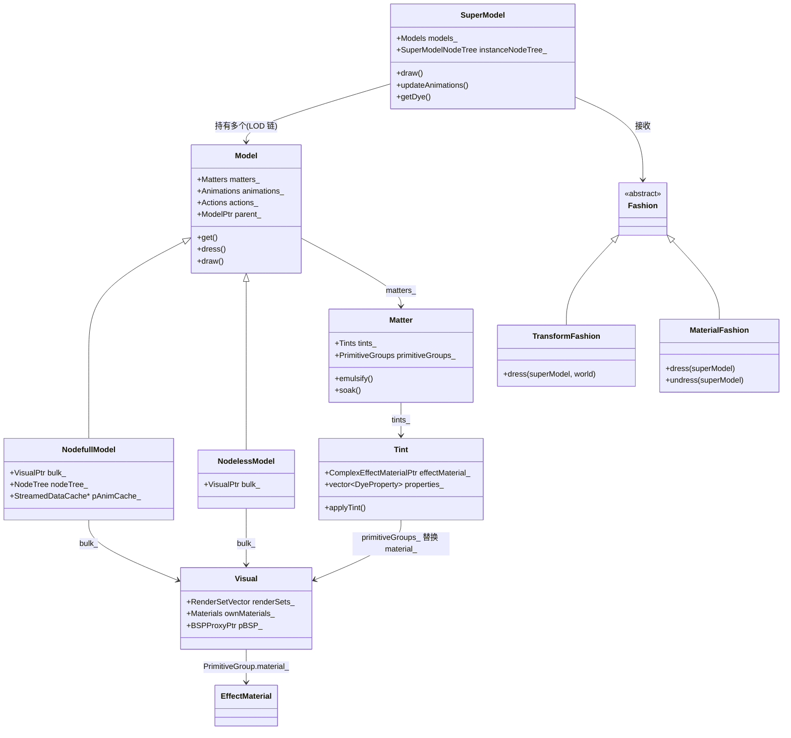

# 专题23:模型与材质系统深度剖析

> 本文档深度剖析 BigWorld Engine 14.4.1 开源版引擎中**模型(Model)与材质(Material)系统**的完整实现,涵盖 `Moo::Model`/`Moo::Visual`/`Matter`/`Tint`/`Fashion`/`Dye`/`MaterialMap`/`Animation`/`NodeTree`/`Morph`/`LOD`/顶点缓冲/.model 序列化等全部子系统。所有源码引用均带绝对路径与行号,可在源码中直接定位;源码引用统一使用 `file:///j:/Work/BigWorld-Engine-14.4.1/programming/bigworld/lib/...` 路径格式(注意:本引擎实际源码根位于 `programming/bigworld/lib/` 下,而非任务描述中提到的 `src/lib/`,本文以实际仓库结构为准)。

---

## 目录

- [一、引言:模型与材质系统的设计哲学](#一引言模型与材质系统的设计哲学)
- [二、整体架构:Model/Visual/Matter/Fashion 四层体系](#二整体架构modelvisualmatterfashion-四层体系)
- [三、Model 基类剖析:静态数据与生命周期](#三model-基类剖析静态数据与生命周期)
- [四、NodefullModel 与 NodelessModel:两种派生实现](#四nodefullmodel-与-nodelessmodel两种派生实现)
- [五、SuperModel:多模型组合与 LOD 链](#五supermodel多模型组合与-lod-链)
- [六、NodeTree 节点树:骨架层次与变换继承](#六nodetree-节点树骨架层次与变换继承)
- [七、Moo::Node 节点:变换、混合与场景根](#七moonode-节点变换混合与场景根)
- [八、Visual 渲染对象:RenderSet/Geometry/PrimitiveGroup](#八visual-渲染对象rendersetgeometryprimitivegroup)
- [九、Material 材质系统:Fixed Pipeline 与可编程管线](#九material-材质系统fixed-pipeline-与可编程管线)
- [十、EffectMaterial 与 ComplexEffectMaterial:可编程 FX 材质](#十effectmaterial-与-complexeffectmaterial可编程-fx-材质)
- [十一、Fashion 体系:TransformFashion 与 MaterialFashion](#十一fashion-体系transformfashion-与-materialfashion)
- [十二、Matter 与 Tint:染色块的容器与单染色](#十二matter-与-tint染色块的容器与单染色)
- [十三、Dye 染料:DyeProperty/DyePropSetting/DyeSelection/ModelDye](#十三dye-染料dyepropertydyepropsettingdyeselectionmodeldye)
- [十四、PropCatalogue:染色属性全局目录](#十四propcatalogue染色属性全局目录)
- [十五、ModelMap 模型映射:全局缓存与热重载](#十五modelmap-模型映射全局缓存与热重载)
- [十六、PostLoadCallBack 与异步加载](#十六postloadcallback-与异步加载)
- [十七、Animation 动画系统:ChannelBinder/BlendedAnimation](#十七animation-动画系统channelbinderblendedanimation)
- [十八、ModelAnimation/ModelAction/NodefullModelAnimation](#十八modelanimationmodelactionnodefullmodelanimation)
- [十九、AnimationChannel 通道:离散/插值/流式](#十九animationchannel-通道离散插值流式)
- [二十、Morph 形变系统:无独立 morph 模块的原因](#二十morph-形变系统无独立-morph-模块的原因)
- [二十一、LOD 层级管理:LodSettings 与 ModelPartChain](#二十一lod-层级管理lodsettings-与-modelpartchain)
- [二十二、顶点格式与声明:VertexFormat/VertexDeclaration](#二十二顶点格式与声明vertexformatvertexdeclaration)
- [二十三、顶点/索引缓冲:VertexBuffer/IndexBuffer/Dynamic\*](#二十三顶点索引缓冲vertexbufferindexbufferdynamic)
- [二十四、Primitive 与 Vertices:几何数据的封装](#二十四primitive-与-vertices几何数据的封装)
- [二十五、纹理管理:TextureManager 与流式纹理](#二十五纹理管理texturemanager-与流式纹理)
- [二十六、序列化体系:.model/.visual/.animation/.primitives](#二十六序列化体系modelvisualanimationprimitives)
- [二十七、客户端集成:与 Entity/ChunkItem/PyModel 关联](#二十七客户端集成与-entitychunkitempymodel-关联)
- [二十八、model_editor 与 material_editor 编辑器](#二十八model_editor-与-material_editor-编辑器)
- [二十九、性能分析与优化](#二十九性能分析与优化)
- [三十、设计权衡与替代方案](#三十设计权衡与替代方案)
- [三十一、局限性与改进方向](#三十一局限性与改进方向)
- [三十二、端到端实例:一次模型加载与染色应用的全流程追踪](#三十二端到端实例一次模型加载与染色应用的全流程追踪)
- [附录 A:核心数据结构代码全解](#附录-a核心数据结构代码全解)
- [附录 B:配置参数与调优清单](#附录-b配置参数与调优清单)
- [附录 C:常见模型材质问题排查](#附录-c常见模型材质问题排查)
- [总结](#总结)

---

## 一、引言:模型与材质系统的设计哲学

BigWorld Engine 14.4.1 是一款面向大型多人在线游戏(MMOG)的端游引擎,其客户端可视对象体系承担着将美术资产(.model / .visual / .animation / .primitives / .mfm / .fx / .dds)转译为 D3D9 渲染指令的核心职责。在专题14《Moo 渲染管线深度剖析》中,我们已经从渲染管线层面介绍了 Visual/Primitive/Vertices 三层嵌套与 Material/EffectMaterial 双轨材质。本专题将从**模型(Model)**这一更高层级切入,自顶向下剖析:

- **Model**:代表一个 `.model` 文件的静态数据(动画、动作、染色块、节点树、Visual 引用)。
- **SuperModel**:多个 Model 组合而成的运行时实体(玩家、NPC 通常都是 SuperModel),承担 LOD 切换、动画统一调度、染色应用入口。
- **Matter / Tint / Dye**:模型染色体系,通过"块(Matter)+ 染色(Tint)+ 染料(DyeProperty)"三级抽象实现装备外观的运行时改色。
- **Fashion**:对 SuperModel 的"穿着"(dress)操作的抽象,分为变换类(TransformFashion)与材质类(MaterialFashion),由动画、染色、IK 等填充。
- **Material / EffectMaterial / ComplexEffectMaterial**:Moo 层材质抽象,固定管线(`.mfm`)与可编程 HLSL(`.fx`)双轨并行。
- **NodeTree / Node**:骨架层次与变换传播,服务于骨骼动画与 IK。
- **Animation / AnimationChannel**:动画采样、通道混合与流式加载。

### 1.1 设计哲学的五大支柱

阅读 [model.hpp](file:///j:/Work/BigWorld-Engine-14.4.1/programming/bigworld/lib/model/model.hpp#L107-L356) 与 [super_model.hpp](file:///j:/Work/BigWorld-Engine-14.4.1/programming/bigworld/lib/model/super_model.hpp#L44-L237) 顶部的注释可以总结出五大设计目标:

1. **静态/动态数据分离**:`Model` 类只保存静态数据(一个 `.model` 文件对应唯一一个 Model 实例),动态状态(当前动画时间、当前染色选择、当前世界变换)由引用该 Model 的 `SuperModel` 维护。这是经典的"flyweight 享元模式"。源码注释直接点明:

   > `Model.hpp:107-112`:"This class manages a model. There is only one instance of this class for each model file, as it represents only the static data of a model. Dynamic data is stored in the referencing SuperModel file."

2. **父子继承(parent_)**:`Model` 可通过 `parent` 字段继承父模型的动画与染色块,例如 `ranger_head.model` 可以继承 `base.model` 的动画表与染色定义,自身只覆盖头部几何。这避免在大量分件模型中重复定义动画。

3. **Reload 热重载链**:`Model` 同时是 `ReloadListener`(监听 Visual/parent_ 重载)与 `Reloader`(被 SuperModel 监听),构成完整的资源热重载链。注释(`model.hpp:115-143`)非常详细地规定了上层(SuperModel、PyModel)的协议:必须在拉取 Model 信息前后调用 `beginRead()/endRead()`,并实现 `onReloaderReloaded/onReloaderPreReload`。

4. **染色体系脱离材质**:`Matter/Tint/Dye` 不直接修改 D3D 状态,而是修改 `Visual::PrimitiveGroup::material_` 指针,使其指向另一个 `ComplexEffectMaterial` 实例。染色切换 = 替换材质指针,这是一个零拷贝、低成本的设计。

5. **LOD 即模型链**:BigWorld 不做连续 LOD(无 progressive mesh),而是离散 LOD——`SuperModel` 内部为每个 ModelPartChain 维护 `lodChain_`(同一逻辑模型的不同 LOD 文件),根据相机距离挑选一条链上的当前 Model 实例。

### 1.2 与专题14的关系

专题14聚焦于 `Moo` 渲染管线的"底层"——D3D 设备、RenderContext、Forward/Deferred 管线、Visual 三层、纹理流送。本专题聚焦"上层"——Model 如何使用 Visual、动画如何驱动 NodeTree、材质如何被染色系统替换、SuperModel 如何把这一切组合为玩家可见的角色。

```
┌─────────────────────────────────────────────────────────────┐
│ 上层应用:PyModel / Duplo / Entity / ChunkItem              │
├─────────────────────────────────────────────────────────────┤
│ SuperModel(本专题核心)                                    │
│   ├─ ModelPartChain × N(每个部件一条 LOD 链)             │
│   │    └─ Model × LOD 链(NodefullModel/NodelessModel)     │
│   ├─ SuperModelNodeTree(合并的节点树)                     │
│   ├─ SuperModelAnimation / SuperModelAction / SuperModelDye│
│   └─ MaterialFashion / TransformFashion 应用队列          │
├─────────────────────────────────────────────────────────────┤
│ Moo 渲染层(专题14)                                        │
│   Visual / Primitive / Vertices / Material / Effect        │
└─────────────────────────────────────────────────────────────┘
```

### 1.3 与其他引擎的横向对比

| 维度 | BigWorld 14.4.1 | Unity(2021+) | Unreal Engine 5 |
|------|-----------------|---------------|-----------------|
| 静态/动态分离 | Model/SuperModel 享元 | Prefab/GameObject 实例化 | USkeletalMesh/UAnimInstance |
| LOD 实现 | 离散多文件 LOD 链 | LOD Group 数组 | HLOD + Nanite |
| 染色系统 | Matter/Tint/Dye 三级 | Material Property Block | Material Instance Dynamic |
| 动画混合 | BlendedAnimation + blendCookie | Animator Controller | Anim Montage/Slot |
| 节点树 | Node + NodeTree 扁平迭代器 | Transform Hierarchy | USkeleton + FReferenceSkeleton |
| 热重载 | ReloadListener/Reloader 全链路 | Domain Reload | Live Coding |
| FX 材质 | D3DX Effect(.fx) | Shader Graph | Material Editor |

---

## 二、整体架构:Model/Visual/Matter/Fashion 四层体系

### 2.1 模块划分一览

整个模型与材质系统分布在两个目录:

- `programming/bigworld/lib/model/`:Model 与染色体系(Model/SuperModel/Matter/Tint/Fashion/ModelMap/NodeTree/ModelAction/ModelAnimation/ModelDye)。
- `programming/bigworld/lib/moo/`:Moo 渲染层的 Visual/Material/Effect/Node/Animation/Primitive/Vertices/Texture。

文件清单与职责:

| 子系统 | 主要文件 | 职责 |
|--------|----------|------|
| Model 基类 | [model.hpp](file:///j:/Work/BigWorld-Engine-14.4.1/programming/bigworld/lib/model/model.hpp#L113-L356)、[model.cpp](file:///j:/Work/BigWorld-Engine-14.4.1/programming/bigworld/lib/model/model.cpp#L1-L900) | 静态数据容器,加载/继承/热重载 |
| NodefullModel | [nodefull_model.hpp](file:///j:/Work/BigWorld-Engine-14.4.1/programming/bigworld/lib/model/nodefull_model.hpp#L21-L88)、nodefull_model.cpp | 带骨架的模型(角色) |
| NodelessModel | [nodeless_model.hpp](file:///j:/Work/BigWorld-Engine-14.4.1/programming/bigworld/lib/model/nodeless_model.hpp#L17-L80) | 无骨架模型(道具、植被、 billboard) |
| SuperModel | [super_model.hpp](file:///j:/Work/BigWorld-Engine-14.4.1/programming/bigworld/lib/model/super_model.hpp#L50-L237)、super_model.cpp | 多模型组合、LOD 链、Fashion 应用 |
| ModelFactory | [model_factory.hpp](file:///j:/Work/BigWorld-Engine-14.4.1/programming/bigworld/lib/model/model_factory.hpp) | .model 文件->Nodefull/Nodeless 选择 |
| ModelMap | [model_map.hpp](file:///j:/Work/BigWorld-Engine-14.4.1/programming/bigworld/lib/model/model_map.hpp#L17-L45)、[model_map.cpp](file:///j:/Work/BigWorld-Engine-14.4.1/programming/bigworld/lib/model/model_map.cpp#L1-L179) | 全局模型缓存、热重载监听 |
| Matter/Tint | [matter.hpp](file:///j:/Work/BigWorld-Engine-14.4.1/programming/bigworld/lib/model/matter.hpp#L18-L48)、[matter.cpp](file:///j:/Work/BigWorld-Engine-14.4.1/programming/bigworld/lib/model/matter.cpp#L1-L121)、[tint.hpp](file:///j:/Work/BigWorld-Engine-14.4.1/programming/bigworld/lib/model/tint.hpp#L24-L45)、[tint.cpp](file:///j:/Work/BigWorld-Engine-14.4.1/programming/bigworld/lib/model/tint.cpp#L1-L124) | 染色块与单染色 |
| Dye 体系 | [dye_property.hpp](file:///j:/Work/BigWorld-Engine-14.4.1/programming/bigworld/lib/model/dye_property.hpp#L16-L24)、[dye_prop_setting.hpp](file:///j:/Work/BigWorld-Engine-14.4.1/programming/bigworld/lib/model/dye_prop_setting.hpp#L17-L31)、[dye_selection.hpp](file:///j:/Work/BigWorld-Engine-14.4.1/programming/bigworld/lib/model/dye_selection.hpp#L17-L24)、[model_dye.hpp](file:///j:/Work/BigWorld-Engine-14.4.1/programming/bigworld/lib/model/model_dye.hpp#L18-L34) | 染料属性/选择/索引 |
| Fashion | [fashion.hpp](file:///j:/Work/BigWorld-Engine-14.4.1/programming/bigworld/lib/model/fashion.hpp#L31-L84) | TransformFashion/MaterialFashion 基类 |
| NodeTree | [node_tree.hpp](file:///j:/Work/BigWorld-Engine-14.4.1/programming/bigworld/lib/model/node_tree.hpp#L18-L83)、node_tree.cpp | 扁平化节点树迭代器 |
| ModelAction | [model_action.hpp](file:///j:/Work/BigWorld-Engine-14.4.1/programming/bigworld/lib/model/model_action.hpp#L22-L47) | 动作(命名动画 + 混合参数) |
| ModelAnimation | [model_animation.hpp](file:///j:/Work/BigWorld-Engine-14.4.1/programming/bigworld/lib/model/model_animation.hpp#L18-L40) | 模型层动画基类 |
| MatchInfo | match_info.hpp/cpp | 动作匹配(用于动作衔接) |
| Visual | [visual.hpp](file:///j:/Work/BigWorld-Engine-14.4.1/programming/bigworld/lib/moo/visual.hpp#L249-L495)、visual.cpp | Moo 三层嵌套可视化对象 |
| Material | [material.hpp](file:///j:/Work/BigWorld-Engine-14.4.1/programming/bigworld/lib/moo/material.hpp#L37-L250)、material.cpp | 固定管线材质 |
| EffectMaterial | [effect_material.hpp](file:///j:/Work/BigWorld-Engine-14.4.1/programming/bigworld/lib/moo/effect_material.hpp#L40-L198)、effect_material.cpp | .fx 可编程材质 |
| ComplexEffectMaterial | complex_effect_material.hpp/cpp | 包装 EffectMaterial + 多 Pass + 通道标志 |
| Animation | [animation.hpp](file:///j:/Work/BigWorld-Engine-14.4.1/programming/bigworld/lib/moo/animation.hpp#L33-L104)、animation.cpp | 动画采样与混合 |
| AnimationChannel | animation_channel.hpp/cpp、interpolated_*.cpp、discrete_*.cpp、streamed_*.cpp | 单节点动画通道 |
| Node | [node.hpp](file:///j:/Work/BigWorld-Engine-14.4.1/programming/bigworld/lib/moo/node.hpp#L31-L112)、node.cpp | 节点(骨架关节) |
| Vertices/Primitive | vertices.hpp/cpp、primitive.hpp/cpp、primitive_manager.hpp | 顶点/图元缓冲封装 |
| VertexFormat | vertex_format.hpp/cpp、vertex_declaration.hpp/cpp | 顶点声明 |

### 2.2 调用关系总览



### 2.3 关键数据流

```
.model 文件  ──Model::load()──>  Model(静态数据)
                                    │
                                    ├──animations_      (来自 parent_ 或自身 .animation 引用)
                                    ├──matters_/tints_  (来自 .model 的 dye 节)
                                    ├──actions_         (来自 .model 的 action 节)
                                    └──bulk_(Visual)    (来自 .visual 文件)
                                            │
                                            └──> Visual::renderSets_[i].geometry_[j]
                                                    ├──.vertices_        (Vertices)
                                                    ├──.primitives_      (Primitive)
                                                    └──.primitiveGroups_ (PrimitiveGroup{groupIndex_, material_})
                                                                            │
                                                                            └──material_ 指向当前 ComplexEffectMaterial
                                                                                    (由 Matter::soak() 替换)
```

---

## 三、Model 基类剖析:静态数据与生命周期

### 3.1 Model 类的继承结构

[Model](file:///j:/Work/BigWorld-Engine-14.4.1/programming/bigworld/lib/model/model.hpp#L113-L356) 是抽象基类,继承自:

- `SafeReferenceCount`:线程安全的引用计数基类(与 `SmartPointer<T>` 配合使用)。
- `ReloadListener`:可监听其他 Reloader(如 Visual、parent_)的重载事件。
- `Reloader`:自身可被监听,SuperModel 通过它感知 Model 重载。

```cpp
// model.hpp:113-145
class Model : 
    public SafeReferenceCount,
    public ReloadListener,
    public Reloader
{
    friend class ModelAction;
    friend class ModelActionsIterator;
    friend class ModelMap;
    friend class ModelPLCB;
public:
    static const float LOD_AUTO_CALCULATE;
    static const float LOD_HIDDEN;
    static const float LOD_MISSING;
    static const float LOD_MIN;
    static const float LOD_MAX;
    ...
};
```

派生类有两个具体实现:

- `NodefullModel`:`bulk_` 是带节点的 `Visual`(角色),参与骨架动画。
- `NodelessModel`:`bulk_` 是不带节点的 `Visual`(道具),只支持 LOD 切换。

### 3.2 静态常量:LOD 标记值

[model.cpp:177-200](file:///j:/Work/BigWorld-Engine-14.4.1/programming/bigworld/lib/model/model.cpp#L177-L200) 定义了 LOD 标记常量:

```cpp
const float Model::LOD_AUTO_CALCULATE = -1.0f;   // 自动按距离计算 LOD
const float Model::LOD_HIDDEN         = -1.0f;   // 隐藏(不可见)
const float Model::LOD_MISSING        = -2.0f;   // 模型加载失败
const float Model::LOD_MIN            = 0.0f;    // 最小 extent
const float Model::LOD_MAX            = FLT_MAX; // 最大 extent(默认值,表示"任何距离都可见")
```

`extent_` 字段记录该模型的"可见距离上限",`SuperModel::updateLods()` 会根据相机距离挑选 LOD 链上 extent_ 最大的、且 extent_ >= 当前距离 的 Model 实例。设置 `extent_ = LOD_HIDDEN` 等于将该 LOD 永久隐藏。

### 3.3 静态数据成员

[model.hpp:307-338](file:///j:/Work/BigWorld-Engine-14.4.1/programming/bigworld/lib/model/model.hpp#L307-L338) 列出了 Model 的核心字段:

```cpp
protected:
    BW::string              resourceID_;      // .model 资源 ID(如 "characters/avatars/base.model")
    ModelPtr                parent_;          // 父模型(继承动画与染色)
    float                   extent_;          // LOD 距离上限

    typedef BW::vector< ModelAnimationPtr >   Animations;
    Animations              animations_;        // 动画表(从 parent_ 继承 + 自身补充)
    typedef BW::map< BW::string, std::size_t > AnimationsIndex;
    AnimationsIndex         animationsIndex_;   // 动画名->索引(快速查找)

    ModelAnimationPtr       pDefaultAnimation_; // 默认动画(无动作播放时的 idle)

    typedef BW::vector< ModelActionPtr >      Actions;
    typedef BW::map< StringOrderProxy, int >  ActionsIndex;
    Actions                 actions_;            // 动作表(命名动画 + 混合参数)
    ActionsIndex            actionsIndex_;

    typedef BW::vector< Matter * > Matters;
    Matters                 matters_;            // 染色块数组(指针所有权归 Model)

    static PropCatalogue    s_propCatalogue_;    // 全局染色属性目录(见 §14)
    static SimpleMutex      s_propCatalogueLock_;
    static BW::vector< BW::string > s_warned_;   // 已警告的资源(避免重复告警)
```

注意三点:

1. **matters_ 用裸指针**:`Matters` 是 `vector<Matter*>`,Model 析构时手动 `delete`(`model.cpp:370-379`)。这是因为 Matter 在热重载时会被 erase/delete 重组,使用智能指针会带来循环引用风险。
2. **animations_ 是值语义**:`ModelAnimationPtr` 是 `SmartPointer<ModelAnimation>`,而 `animations_` 直接持有从 parent_ 拷贝过来的智能指针副本(浅拷贝即可,因为 ModelAnimation 是不可变的)。
3. **actionsIndex_ 用 StringOrderProxy**:为了避免持有 `BW::string*` 但又要按字符串内容排序,引入了 `StringOrderProxy`(`model.hpp:44-55`)。

### 3.4 加载流程:Model::get() -> load() -> postLoad()

`Model::get()` 是对外入口([model.cpp:782-820](file:///j:/Work/BigWorld-Engine-14.4.1/programming/bigworld/lib/model/model.cpp#L782-L820)):

```cpp
ModelPtr Model::get( const BW::StringRef & resourceID, bool loadIfMissing )
{
    BW_GUARD_PROFILER( Model_get );
    ModelPtr pFound = s_pModelMap->find( resourceID );   // 1. 先查 ModelMap
    if (pFound) return pFound;

    if (!loadIfMissing) return NULL;

    DataSectionPtr pFile = BWResource::openSection( resourceID ); // 2. 打开 .model XML
    if (!pFile) { /* 记录警告并返回 NULL */ }

    PostLoadCallBack::enter();                            // 3. 进入 PLCB 上下文
    ModelPtr mp = Model::load( resourceID, pFile );       // 4. 加载
    if (mp) {
        s_pModelMap->add( &*mp, resourceID );             // 5. 注册到全局表
    }
    PostLoadCallBack::leave();                             // 6. 离开 PLCB 上下文(触发 global 回调)
    return mp;
}
```

`Model::load()`([model.cpp:862-885](file:///j:/Work/BigWorld-Engine-14.4.1/programming/bigworld/lib/model/model.cpp#L862-L885)) 是私有的工厂方法:

```cpp
ModelPtr Model::load( const BW::StringRef & resourceID, DataSectionPtr pFile )
{
    Moo::ScopedResourceLoadContext resLoadCtx( BWResource::getFilename( resourceID ) );
    ModelFactory factory( resourceID, pFile );
    ModelPtr model = Moo::createModelFromFile( pFile, factory );  // 由 Moo::Visual 决定 Nodeful/Nodeless
    if (!model) { /* ASSET_MSG 错误 */ return NULL; }
    PostLoadCallBack::run();        // 执行所有挂起的 PLCB
    if (!(model && model->valid())) { /* 错误 */ return NULL; }
    return model;
}
```

这里的关键是 `Moo::createModelFromFile`——它根据 `.model` XML 中的 `nodefull` 标志或 `.visual` 是否含节点决定实例化 `NodefullModel` 还是 `NodelessModel`。`ModelFactory`([model_factory.hpp](file:///j:/Work/BigWorld-Engine-14.4.1/programming/bigworld/lib/model/model_factory.hpp))是一个简单的工厂:

```cpp
// model_factory.hpp
class ModelFactory
{
    const BW::StringRef&    resourceID_;
    DataSectionPtr&         pFile_;
public:
    typedef Model ModelBase;
    ModelFactory( const BW::StringRef& resourceID, DataSectionPtr& pFile ); 
    NodefullModel * newNodefullModel();
    NodelessModel * newNodelessModel();
    //Model* newBillboardModel();   // billboard 已废弃,源码注释保留
};
```

### 3.5 Model::load():加载骨架

`Model::load()`([model.cpp:286-349](file:///j:/Work/BigWorld-Engine-14.4.1/programming/bigworld/lib/model/model.cpp#L286-L349))由派生类(NodefullModel/NodelessModel)在自己的 `load()` 中调用,执行顺序:

```cpp
void Model::load()
{
    PROFILE_FILE_SCOPED( Model_load );
    this->release();                              // 1. 释放旧数据
    ModelPtr oldParent = parent_;

    DataSectionPtr pFile = BWResource::openSection( resourceID_ );

    // 2. 读取 parent 引用
    BW::string parentResID = pFile->readString( "parent" );
    if (!parentResID.empty()) 
        parent_ = Model::get( parentResID + ".model" );   // 递归加载父模型
    else
        parent_ = NULL;

    // 3. 读取 extent(LOD 距离上限)
    extent_ = pFile->readFloat( "extent", Model::LOD_MAX );

    // 4. 从 parent 继承动画与染色块(浅拷贝)
    if (parent_) {
        parent_->beginRead();                     // 热重载读锁
        animations_ = parent_->animations_;       // 直接拷贝智能指针 vector

        matters_.reserve( parent_->matters_.size() );
        for (uint i=0; i < parent_->matters_.size(); i++) {
            Matter & pm = *parent_->matters_[i];
            matters_.push_back( new Matter( pm.name_, pm.replaces_, pm.tints_ ) );
        }
    }

    // 5. 调度 postLoad(异步执行,见 §16)
    PostLoadCallBack::add( new ModelPLCB( *this, pFile ) );

    // 6. 维护 ReloadListener 链(若 parent 变了)
    if (oldParent != parent_) {
        if (oldParent) oldParent->deregisterListener( this, true );
        if (parent_)   parent_->registerListener( this );
    }
}
```

注意第 4 步——`matters_` 用 `new Matter(name, replaces, tints)` 复制父模型的染色块,这个构造函数([matter.cpp:32-46](file:///j:/Work/BigWorld-Engine-14.4.1/programming/bigworld/lib/model/matter.cpp#L32-L46))会用 `false` 参数克隆每个 Tint,但 Tint 内部的 `effectMaterial_` 仍为 NULL(后续 `initMatter/initTint` 会从自己的 Visual 中重新填充):

```cpp
Matter::Matter( const BW::string & name, const BW::string & replaces, const Tints & tints ) :
    name_( name ), replaces_( replaces ),
    emulsion_( 0 ),
    emulsionCookie_( Model::getUnusedBlendCookie() )
{
    tints_.reserve( tints.size() );
    for (uint i=0; i < tints.size(); i++) {
        tints_.push_back( new Tint( tints[i]->name_, false ) );  // 不带默认材质
    }
}
```

### 3.6 postLoad():染色与动画初始化

`PostLoadCallBack::run()` 在 `Model::load` 完成后由 `Model::load`(static)触发,实际调用 `Model::postLoad()`:

```cpp
// model.cpp(简化)
class ModelPLCB : public PostLoadCallBack {
    virtual void operator()() { m_.postLoad( p_ ); }
};

void Model::postLoad( DataSectionPtr pFile )
{
    // 1. 读取染色定义(返回 dyeProduct,可用于染色组合数统计)
    int dyeProduct = this->readDyes( pFile, !this->nodeless() );

    // 2. 读取动作(命名动画)
    BW::vector<DataSectionPtr> vActionSects;
    pFile->openSections( "action", vActionSects );
    for (uint i=0; i<vActionSects.size(); i++) {
        actions_.push_back( new ModelAction( vActionSects[i] ) );
        actionsIndex_[ StringOrderProxy( &actions_.back()->name_ ) ] = (int)actions_.size()-1;
    }

    // 3. 读取本地动画(若与父不同)
    // 详见 loadAnimations() 与 ModelAnimation 章节
}
```

### 3.7 readDyes():染色解析

`Model::readDyes()`([model.cpp:533-769](file:///j:/Work/BigWorld-Engine-14.4.1/programming/bigworld/lib/model/model.cpp#L533-L769))是染色体系的核心解析逻辑,结构如下:

```cpp
int Model::readDyes( DataSectionPtr pFile, bool multipleMaterials )
{
    int dyeProduct = 1;
    BW::vector<DataSectionPtr> vDyeSects;
    pFile->openSections( "dye", vDyeSects );                    // 1. 遍历 <dye> 节
    for (uint i = 0; i < vDyeSects.size(); i++) {
        DataSectionPtr pDyeSect = vDyeSects[i];
        BW::string matterName = pDyeSect->readString( "matter", "" );
        BW::string replaces    = pDyeSect->readString( "replaces", "" );
        if ((matterName == "") && (replaces == "")) continue;

        // 2. 在 matters_ 中查找或新建 Matter
        Matters::iterator miter = std::find_if(matters_.begin(), matters_.end(),
            [&](Matter* m){ return m->name_ == matterName; });
        if (miter == matters_.end()) {
            matters_.push_back( new Matter( matterName, replaces ) );
            miter = matters_.end() - 1;
        }
        Matter * m = *miter;
        m->replaces_ = replaces;

        // 3. 调用派生类的 initMatter,把 Visual 中所有同 replaces 的 PrimitiveGroup 收集到 m->primitiveGroups_
        if (multipleMaterials) {
            if (this->initMatter( *m ) == 0) {
                ASSET_MSG("...material id %s isn't in the visual\n", replaces.c_str());
                continue;
            }
        }

        // 4. 遍历 <tint> 子节,创建 Tint 并填充 effectMaterial_/properties_
        BW::vector<DataSectionPtr> vTintSects;
        pDyeSect->openSections( "tint", vTintSects );
        for (uint j=0; j<vTintSects.size(); j++) {
            // 查找或新建 Tint
            // 4a. 若 multipleMaterials(Nodefull/常规):读取 <material> 节,调用 initTint 填充 effectMaterial_
            //     读取 <property> 子节,填 DyeProperty(包括 D3DXHANDLE 查找)
            // 4b. 若 billboard:读取 <dye> 子节作为 sourceDyes_(纹理合成)
        }

        dyeProduct *= static_cast<int>(m->tints_.size());
    }
    return dyeProduct;
}
```

注意第 4a 步中关于 D3DXHANDLE 的关键逻辑([model.cpp:688-709](file:///j:/Work/BigWorld-Engine-14.4.1/programming/bigworld/lib/model/model.cpp#L688-L709)):

```cpp
// 若该 Tint 的 effectMaterial 使用了 .fx,且 fx 中存在同名 parameter
if ( t->effectMaterial_->baseMaterial()->pEffect() ) {
    ID3DXEffect * effect = t->effectMaterial_->baseMaterial()->pEffect()->pEffect(); 
    D3DXHANDLE propH = effect->GetParameterByName( NULL, propName.c_str() ); 
    if (propH != NULL) {
        // 创建可修改的 EffectProperty(运行时可被染色系统改值)
        const Moo::EffectPropertyFactoryPtr& factory = 
            Moo::EffectPropertyFactory::findFactory( "Vector4" );
        Moo::EffectPropertyPtr modifiableProperty = 
            factory->create( propName, propH, effect );
        modifiableProperty->be( dp.default_ ); 
        t->effectMaterial_->baseMaterial()->replaceProperty( propName, modifiableProperty ); 
        dp.controls_ = (intptr)propH;   // 用 D3DXHANDLE 作为快速查找键
        dp.mask_ = -1;                  // -1 表示"通过 Effect 参数控制"而非位掩码
    }
}
```

这是染色系统与可编程材质的桥梁——染色属性最终通过 D3DXHANDLE 直接修改 .fx 的 uniform 参数。

### 3.8 beginRead/endRead:热重载读写锁

```cpp
// model.hpp:165-171
#if ENABLE_RELOAD_MODEL
protected:
    ReadWriteLock                reloadRWLock_;
public:
    virtual bool reload( bool doValidateCheck ) = 0;
#endif
```

```cpp
// model.cpp:232-273
void Model::beginRead() {
#if ENABLE_RELOAD_MODEL
    reloadRWLock_.beginRead();
    if (parent_) parent_->beginRead();              // 递归锁父模型
    Moo::VisualPtr pBulk = this->getVisual();
    if (pBulk) pBulk->beginRead();                  // 递归锁 Visual
#endif
}

void Model::endRead() {
#if ENABLE_RELOAD_MODEL
    reloadRWLock_.endRead();
    if (parent_) parent_->endRead();
    Moo::VisualPtr pBulk = this->getVisual();
    if (pBulk) pBulk->endRead();
#endif
}
```

`ReadWriteLock` 是一个跨平台读写锁:多个 `beginRead` 可并发,`reload` 持写锁时所有读阻塞。SuperModel 在每次 draw 前调用 `beginRead()`,draw 结束调用 `endRead()`,这样资产线程触发的重载就不会破坏正在渲染的状态。

### 3.9 soakDyes 与 soak:染色应用入口

```cpp
// model.hpp:204
void soakDyes();

// model.hpp:263
virtual void soak( const ModelDye & dye );
```

`soakDyes()` 遍历所有 `matters_` 调用 `Matter::soak()`(把每个 Matter 的当前 emulsion_ 选中的 Tint 应用到 PrimitiveGroup);`soak(dye)` 接受一个 `ModelDye`(matter 索引 + tint 索引),先 `emulsify` 再 `soak`。这是染色系统的运行时入口(详见 §12)。

### 3.10 getDye:查找染料索引

```cpp
// model.hpp:257-261
typedef BW::vector< DyeSelection > DyeSelections;
ModelDye getDye( const BW::string & matterName,
                 const BW::string & tintName,
                 Tint ** ppTint = NULL );
```

`getDye("body", "red")` 在 `matters_` 中查找名为 "body" 的 Matter,再在其 `tints_` 中查找名为 "red" 的 Tint,返回 `ModelDye{matterIndex_, tintIndex_}`。`ppTint` 输出参数可选地返回 Tint 指针(用于属性查询)。

### 3.11 gatherMaterials:批量收集材质

```cpp
// model.hpp:268-270
virtual int gatherMaterials( const BW::string & materialIdentifier,
                              BW::vector< Moo::Visual::PrimitiveGroup * > & uses,
                              Moo::ConstComplexEffectMaterialPtr * ppOriginal = NULL );
```

派生类实现:

- `NodefullModel::gatherMaterials`([nodefull_model.hpp:54-57](file:///j:/Work/BigWorld-Engine-14.4.1/programming/bigworld/lib/model/nodefull_model.hpp#L54-L57))直接委托给 `bulk_->gatherMaterials(...)`。
- `NodelessModel::gatherMaterials` 自己实现(因为 NodelessModel 是 `SwitchedModel<VisualPtr>`,LOD 间需要遍历)。

`Visual::gatherMaterials`([visual.hpp:424](file:///j:/Work/BigWorld-Engine-14.4.1/programming/bigworld/lib/moo/visual.hpp#L424))遍历所有 RenderSet/Geometry/PrimitiveGroup,把 `identifier` 匹配 `materialIdentifier` 的 PrimitiveGroup 指针填入 `uses` 数组,可选输出原始材质指针。这是染色系统 `initMatter` 收集 `primitiveGroups_` 的底层机制(见 §12)。

### 3.12 析构与 tryDestroy

```cpp
// model.cpp:370-379
Model::~Model() {
    for (uint i = 0; i < matters_.size(); i++) {
        bw_safe_delete(matters_[i]);
    }
    matters_.clear();
}

// model.cpp:386-390
void Model::destroy() const {
    bool isInMap = isInModelMap_;
    s_pModelMap->tryDestroy( this, isInMap );
}
```

`SafeReferenceCount::destroy()` 在引用计数归零时调用,转交给 `ModelMap::tryDestroy`——它检查引用计数仍为 0 后从 `map_` 中 erase 并 `delete pModel`。这个间接层是为了在多线程下安全地销毁:若在 erase 期间另一线程恰好 `Model::get` 拿到了指针(在 map_ 中查到的),引用计数会+1,此时 tryDestroy 会发现 `refCount() != 0` 而 abort 销毁,留下悬挂的 map 条目供下次查找命中。

---

## 四、NodefullModel 与 NodelessModel:两种派生实现

### 4.1 NodefullModel:带骨架的角色模型

[nodefull_model.hpp:21-88](file:///j:/Work/BigWorld-Engine-14.4.1/programming/bigworld/lib/model/nodefull_model.hpp#L21-L88) 定义带节点的模型:

```cpp
class NodefullModel : public Model
{
    friend class DefaultAnimation;
    friend class NodefullModelAnimation;
public:
    NodefullModel( const BW::StringRef & resourceID, DataSectionPtr pFile );
    ~NodefullModel();

    virtual void load();
    virtual bool valid() const;
    virtual bool nodeless() const { return false; }   // 标志:有骨架

    virtual void dress( const Matrix& world, TransformState* pTransformState = NULL );
    virtual void dressFromState( const TransformState& transformState );
    virtual void draw( Moo::DrawContext& drawContext, bool checkBB );

    virtual const BSPTree * decompose() const;
    virtual const BoundingBox & boundingBox() const;
    virtual const BoundingBox & visibilityBox() const;
    virtual bool hasNode( Moo::Node * pNode, MooNodeChain * pParentChain ) const;

    virtual bool addNode( Moo::Node * pNode );
    virtual void addNodeToLods( const BW::string & nodeName );

    virtual NodeTreeIterator nodeTreeBegin() const;
    virtual NodeTreeIterator nodeTreeEnd() const;

    virtual int gatherMaterials(...) { return bulk_->gatherMaterials(...); }

    Moo::VisualPtr getVisual() { return bulk_; }

    virtual void onReloaderReloaded( Reloader* pReloader );
    TransformState* newTransformStateCache() const;
#if ENABLE_RELOAD_MODEL
    virtual bool reload( bool doValidateCheck );
#endif

private:
    Matrix                      world_;             // dress 时设置的世界变换
    BoundingBox                 visibilityBox_;
    SmartPointer<Moo::Visual>   bulk_;              // 关联的 Visual
    NodeTree                    nodeTree_;          // 扁平节点树(见 §6)
    Moo::StreamedDataCache    * pAnimCache_;       // 流式动画数据缓存

    virtual int initMatter( Matter & m );
    virtual bool initTint( Tint & t, DataSectionPtr matSect );
    void release();
    void pullInfoFromVisual();
    void rebuildNodeHierarchy();
};
```

`NodefullModel` 比 `NodelessModel` 多两个核心字段:

1. `nodeTree_`(`vector<NodeTreeData>`):扁平化的节点树,供 `NodeTreeIterator` 线性遍历。
2. `pAnimCache_`:`Moo::StreamedDataCache` 指针,流式动画的共享缓存。

#### 4.1.1 dress:变换传播

```cpp
virtual void dress( const Matrix& world, TransformState* pTransformState = NULL );
```

`dress` 把世界变换矩阵 `world` 应用到 `bulk_` 的根节点,然后 `traverse` 整个 NodeTree 把每个节点的 `worldTransform_` 计算出来。可选输出 `pTransformState`(一个 `vector<Matrix>`)用于缓存该次 dress 的所有节点世界变换,后续 `dressFromState` 可直接复用,跳过重复 traverse。

#### 4.1.2 draw:绘制

```cpp
virtual void draw( Moo::DrawContext& drawContext, bool checkBB );
```

`draw` 把 `bulk_`(Visual)加入到 `drawContext` 队列,具体绘制由 `Moo::Renderer` 在帧末统一调度(详见专题14)。`checkBB` 控制是否做视锥剔除。

#### 4.1.3 initMatter/initTint:染色块初始化

```cpp
virtual int initMatter( Matter & m );          // 调用 bulk_->gatherMaterials(replaces, m.primitiveGroups_, &original)
virtual bool initTint( Tint & t, DataSectionPtr matSect );  // 加载 <material> 节为 ComplexEffectMaterial
```

`initMatter` 是染色块与 Visual 的桥梁——它通过 `gatherMaterials` 把 Visual 中所有 `materialIdentifier == m.replaces_` 的 PrimitiveGroup 指针收集到 `m.primitiveGroups_`,后续 `Matter::soak()` 修改这些 PrimitiveGroup 的 `material_` 字段即完成染色切换。

`initTint` 加载 `<material>` 子节(包含 `<effect>` 引用与各属性)为 `ComplexEffectMaterial`,赋给 `t.effectMaterial_`。

### 4.2 NodelessModel:无骨架的道具/植被

[nodeless_model.hpp:17-80](file:///j:/Work/BigWorld-Engine-14.4.1/programming/bigworld/lib/model/nodeless_model.hpp#L17-L80):

```cpp
class NodelessModel : public SwitchedModel< Moo::VisualPtr >
{
public:
    NodelessModel( const BW::StringRef & resourceID, DataSectionPtr pFile );
    virtual void load();
    virtual bool nodeless() const { return true; }    // 标志:无骨架

    virtual void draw( Moo::DrawContext& drawContext, bool checkBB );
    virtual void dress( const Matrix& world, TransformState* pTransformState = NULL );
    virtual void dressFromState( const TransformState& transformState );
    virtual const BSPTree * decompose() const;
    virtual const BoundingBox & boundingBox() const;
    virtual const BoundingBox & visibilityBox() const;
    Moo::VisualPtr getVisual();
    ...
private:
    virtual int gatherMaterials(...);
    static Moo::VisualPtr loadVisual( Model & m, const BW::string & resourceID );
    virtual int initMatter( Matter & m );
    virtual bool initTint( Tint & t, DataSectionPtr matSect );
    static Moo::NodePtr s_sceneRootNode_;     // 全局静态根节点(所有 Nodeless 共享)
};
```

#### 4.2.1 SwitchedModel:LOD 切换模板基类

`NodelessModel` 继承自 `SwitchedModel<Moo::VisualPtr>`(见 `switched_model.hpp`)——这是一个模板基类,内部维护 `vector<Moo::VisualPtr> lods_`(多个 LOD Visual),根据 `world` 距离切换当前 Visual。这是 BigWorld 离散 LOD 的核心实现。

```cpp
template <class BULK>
class SwitchedModel : public Model
{
protected:
    BULK            bulk_;          // 当前 LOD 的 Visual
    BW::vector<BULK> lods_;        // 所有 LOD 候选
    // updateLod(world) 切换 bulk_ 指向 lods_[i]
};
```

#### 4.2.2 s_sceneRootNode_:全局静态根

`NodelessModel` 持有一个静态的 `s_sceneRootNode_`,所有 NodelessModel 的 Visual 都挂在这个根下。这避免了为每个 NodelessModel 创建独立根节点的开销,对于植被等大量实例的场景尤其重要。

### 4.3 NodefullModel vs NodelessModel 对比

| 维度 | NodefullModel | NodelessModel |
|------|---------------|---------------|
| 是否有骨架 | 是 | 否 |
| LOD 实现 | 在 SuperModel 层(ModelPartChain) | 自身 SwitchedModel 模板 |
| dress 是否计算节点世界变换 | 是,遍历 NodeTree | 否,直接用 world |
| 默认动画 | 有(DefaultAnimation idle) | 无 |
| gatherMaterials | 委托给 bulk_ | 自己实现(考虑 LOD) |
| 适用场景 | 角色、NPC、怪物 | 道具、植被、装饰物 |
| 实例化成本 | 高(需 NodeTree 状态) | 低(可批量 instancing) |

---

## 五、SuperModel:多模型组合与 LOD 链

### 5.1 SuperModel 的角色

`SuperModel`([super_model.hpp:50-237](file:///j:/Work/BigWorld-Engine-14.4.1/programming/bigworld/lib/model/super_model.hpp#L50-L237))是 BigWorld 客户端**最常用的模型抽象**。一个玩家通常是一个 SuperModel,内部组合多个 Model(头、身体、手臂、腿、武器...),每个 Model 都有自己的 LOD 链。源码注释非常直白:

> `super_model.hpp:44-49`:"This class defines a super model. It's not just a model, it's a whole lot more - discrete level of detail, billboards, continuous level of detail, static mesh animations, multi-part animated models - you name it, this baby's got it."

### 5.2 数据结构:ModelPartChain

```cpp
// super_model.hpp:168-194
class ModelPartChain
{
public:
    ModelPartChain( const ModelPtr& pModel );
    void pullInfoFromModel();

    const Model* curModel() const;
    Model* curModel();
    const Model::TransformState* curTransformState() const;
    Model::TransformState* curTransformState();
    
    bool isLodVisible() const;
    void fini();

    ModelPtr                       topModel_;      // 最高精度的 Model(LOD 0)
    BW::vector<LodLevelData>       lodChain_;      // LOD 链
    BW::vector<LodLevelData>::size_type lodChainIndex_;   // 当前 LOD 索引
#if ENABLE_TRANSFORM_VALIDATION
    uint32 frameTimestamp_;
#endif
};

struct LodLevelData {
    Model* pModel;                          // 该 LOD 的 Model(裸指针,被 topModel_ 持有)
    Model::TransformState* transformState;   // 该 LOD 的 transform 缓存
};
```

构造时 `ModelPartChain` 接收 topModel_(如 `ranger_body.model`),然后通过 `topModel_->parent()` 链表(`base.model` 通常是 LOD 0,其 parent_ 是 LOD 1,以此类推)构造 `lodChain_`。每个 LOD 都有自己的 `transformState` 缓存(因为不同 LOD 的节点数可能不同)。

### 5.3 updateLods:LOD 选择算法

```cpp
// super_model.hpp:196-198
void updateLods( float atLod, LodSettings& lodSettings, const Matrix & mooWorld );
```

伪代码:

```cpp
for each ModelPartChain in models_:
    float dist = (camera - mooWorld.translation).length();
    float lodValue = dist * lodSettings.globalLodBias() * partLodBias;
    
    // 遍历 lodChain_,找第一个 extent_ >= lodValue 的
    for (int i = 0; i < lodChain_.size(); i++) {
        if (lodChain_[i].pModel->extent() >= lodValue) {
            lodChainIndex_ = i;
            break;
        }
    }
```

`atLod` 是 SuperModel 整体的 LOD 强制值(由 entity 设置),`LodSettings` 提供全局 LOD bias(用户图形设置)。`mooWorld` 是 SuperModel 的世界变换,用于计算相机距离。

### 5.4 updateAnimations:动画驱动

```cpp
// super_model.hpp:77-80
virtual void updateAnimations( const Matrix& world,
    const TmpTransforms * pPreFashions,
    const TmpTransforms * pPostFashions,
    float atLod );
```

执行顺序:

1. **应用 pre-fashions**:对每个 ModelPartChain 的 curModel 调用每个 pre-fashion 的 `dress(superModel, world)`。
2. **dress 每个 Model**:`curModel->dress(world, transformState)`,计算节点世界变换。
3. **应用 post-fashions**:同 1 但在 dress 之后(用于 IK、IKConstraint 等修正)。
4. **更新 SuperModelNodeTree**:把所有 part 的 NodeTree 合并为统一的 `instanceNodeTree_`。

### 5.5 draw:绘制流程

```cpp
// super_model.hpp:87-88
void draw( Moo::DrawContext& drawContext, const Matrix& world,
    const MaterialFashionVector * pMaterialFashions );
```

执行顺序([super_model.hpp:208-211](file:///j:/Work/BigWorld-Engine-14.4.1/programming/bigworld/lib/model/super_model.hpp#L208-L211)):

```cpp
applyMaterialsAndTransforms( pMaterialFashions );  // 应用材质 fashion(染色)
drawModels( drawContext, world );                  // 实际绘制
removeMaterials( pMaterialFashions );               // 撤销染色(避免污染下个 SuperModel)
```

### 5.6 SuperModelNodeTree:合并的节点树

```cpp
// super_model.hpp:128-129
const SuperModelNodeTree * getInstanceNodeTree() const;
bool regenerateInstanceNodeTree();
```

`SuperModelNodeTree`(`super_model_node_tree.hpp`)把多个 ModelPartChain 的 NodeTree 合并为一个统一的节点树,供 PyModel 等上层访问"左手骨""头骨"等具体节点。当任一 part 的 Model 重载时,`instanceNodeTreeDirty_ = true`,下次访问时重新生成。

### 5.7 getAnimation/getAction/getDye:统一查找入口

```cpp
// super_model.hpp:96-99
SuperModelAnimationPtr  getAnimation( const BW::string & name );
SuperModelActionPtr      getAction( const BW::string & name );
SuperModelDyePtr         getDye( const BW::string & matter, const BW::string & tint );
```

这些方法在所有 ModelPartChain 中查找匹配的动画/动作/染料,返回 `SuperModelXxx` 包装类,内部记录"在哪个 part、哪个索引"。例如:

- `getAnimation("walk")` 返回 `SuperModelAnimation`,调用其 `play(time, blend)` 时会代理到对应 part 的 `ModelAnimation::play`。
- `getDye("body", "red")` 返回 `SuperModelDye`,调用其 `apply()` 时会对每个 part 的对应 Matter 调用 `emulsify(tintIndex)`,然后 SuperModel::draw 时 `soakDyes()`。

### 5.8 ReadGuard:RAII 读锁

```cpp
// super_model.hpp:149-155
struct ReadGuard
{
    ReadGuard( SuperModel* super ): super( super ) { super->beginRead(); }
    ~ReadGuard() { super->endRead(); }
private:
    SuperModel* super;
};
```

调用方典型用法:

```cpp
SuperModel::ReadGuard rg(pSuperModel);
// 安全访问 pSuperModel 的 curModel、动画、染色等
// rg 析构时自动 endRead
```

---

## 六、NodeTree 节点树:骨架层次与变换继承

### 6.1 NodeTree 的扁平化设计

[node_tree.hpp:18-30](file:///j:/Work/BigWorld-Engine-14.4.1/programming/bigworld/lib/model/node_tree.hpp#L18-L30) 给出了一个出人意料的设计——`NodeTree` 不是树,而是一个扁平数组:

```cpp
struct NodeTreeData
{
    NodeTreeData( Moo::Node * pN, int nc ) : pNode( pN ), nChildren( nc ) {}
    Moo::Node    * pNode;
    int            nChildren;
};

typedef BW::vector<NodeTreeData> NodeTree;
```

`NodeTree` 是 `vector<NodeTreeData>`,按深度优先(DFS)顺序存储所有节点。每个 `NodeTreeData` 包含节点指针和"子节点数量"。这种存储方式有三个优点:

1. **缓存友好**:遍历整个树只需线性扫描 vector,无指针跳转。
2. **内存紧凑**:每个节点只占 16 字节(64 位下指针 8 + int 4 + 对齐 4)。
3. **易于序列化**:vector 直接写入文件即可,无需递归。

### 6.2 NodeTreeIterator:栈式遍历

[node_tree.hpp:55-81](file:///j:/Work/BigWorld-Engine-14.4.1/programming/bigworld/lib/model/node_tree.hpp#L55-L81):

```cpp
class NodeTreeIterator
{
public:
    NodeTreeIterator( 
        const NodeTreeData * begin, 
        const NodeTreeData * end, 
        const Matrix * root );

    const NodeTreeDataItem & operator*() const;
    const NodeTreeDataItem * operator->() const;

    void operator++( int );
    bool operator==( const NodeTreeIterator & other ) const;
    bool operator!=( const NodeTreeIterator & other ) const;

private:
    const NodeTreeData *    curNodeData_;
    const NodeTreeData *    endNodeData_;
    NodeTreeDataItem        curNodeItem_;
    int                     sat_;

    struct 
    {
        const Matrix *    trans;
        int               pop;
    } stack_[NODE_STACK_SIZE];      // NODE_STACK_SIZE = 128
};
```

`NodeTreeIterator` 维护一个内嵌的栈 `stack_[128]`,每项存父节点的世界变换和"在弹出前还要跳过几个兄弟节点"。迭代时:

1. 访问当前 `curNodeData_->pNode`,其父变换是栈顶的 `trans`。
2. 计算当前节点的世界变换 = `trans * pNode->transform()`。
3. 若当前节点有子节点(`nChildren > 0`),压栈(父变换 = 当前节点世界变换,`pop = nChildren - 1`)。
4. 若无子节点,则不断弹栈直到找到 `pop > 0` 的层,将其 `pop--` 并前进到下一个兄弟。

`NodeTreeDataItem`([node_tree.hpp:41-46](file:///j:/Work/BigWorld-Engine-14.4.1/programming/bigworld/lib/model/node_tree.hpp#L41-L46))是迭代器解引用的结果:

```cpp
struct NodeTreeDataItem
{
    const struct NodeTreeData *    pData;             // 当前节点
    const Matrix *                  pParentTransform;  // 父世界变换
};
```

### 6.3 Model::nodeTreeBegin/End

```cpp
// model.hpp:279-280
virtual NodeTreeIterator nodeTreeBegin() const;
virtual NodeTreeIterator nodeTreeEnd() const;
```

`NodefullModel` 返回 `NodeTreeIterator(&nodeTree_[0], &nodeTree_[n], &rootTransform)`;`NodelessModel` 返回 `end == begin` 的空迭代器。

### 6.4 SuperModelNodeTree:合并多 part 的节点树

`SuperModelNodeTree`(super_model_node_tree.hpp)把所有 part 的 NodeTree 合并:

1. **找共同根**:若所有 part 共享同一个根节点 identifier(如 "Scene Root"),则直接合并;否则用 `s_sceneRootNode_` 做虚拟根。
2. **去重节点**:若两个 part 有同名节点(如 "Bip01 Head"),合并为一个(共享变换)。
3. **建立父子映射**:为 PyModel 提供"按名查找节点"接口。

`SuperModel::getInstanceNodeTree()`([super_model.hpp:128](file:///j:/Work/BigWorld-Engine-14.4.1/programming/bigworld/lib/model/super_model.hpp#L128))返回该合并树,`regenerateInstanceNodeTree()` 在任一 part 重载时调用。

### 6.5 TransformState:变换缓存

```cpp
// model.hpp:202
typedef BW::vector<Matrix> TransformState;
```

`TransformState` 是 `vector<Matrix>`,每个元素对应 NodeTree 中一个节点的世界变换。`dress(world, pTransformState)` 计算完所有节点变换后,可输出到 `pTransformState`,后续 `dressFromState(*pTransformState)` 直接拷贝回节点,跳过重新遍历。这是 SuperModel 在多 part 共享动画时的优化——例如所有 part 共享同一个 walk 动画,只需计算一次 NodeTree 变换,每个 part 各自 `dressFromState`。

`Model::newTransformStateCache()`([model.hpp:286](file:///j:/Work/BigWorld-Engine-14.4.1/programming/bigworld/lib/model/model.hpp#L286))是工厂方法,派生类返回 `new TransformState()`,根据 NodeTree 大小预分配。

---

## 七、Moo::Node 节点:变换、混合与场景根

### 7.1 Node 类定义

[node.hpp:31-112](file:///j:/Work/BigWorld-Engine-14.4.1/programming/bigworld/lib/moo/node.hpp#L31-L112):

```cpp
class Node : public SafeReferenceCount
{
public:
    static const char* SCENE_ROOT_NAME;

    Node();
    ~Node();

    void                traverse( );
    void                loadIntoCatalogue( );
    void                visitSelf( const Matrix& parent );

    void                addChild( NodePtr node );
    void                removeFromParent( );
    void                removeChild( NodePtr node );

    Matrix&             transform( );
    const Matrix&       transform( ) const;
    void                transform( const Matrix& m );

    const Matrix&       worldTransform( ) const;
    void                worldTransform( const Matrix& );

    NodePtr             parent( ) const;
    uint32              nChildren( ) const;
    NodePtr             child( uint32 i );

    const BW::string&   identifier( ) const;
    void                identifier( const BW::string& identifier );

    bool                isSceneRoot() const;
    
    NodePtr             find( const BW::string& identifier );
    uint32              countDescendants( ) const;

    void                loadRecursive( DataSectionPtr nodeSection );

    bool                needsReset( int blendCookie ) const;
    float               blend( int blendCookie ) const;
    void                blend( int blendCookie, float blendRatio );
    void                blendClobber( int blendCookie, const Matrix & transform );

#ifdef _WIN32
    BlendTransform &    blendTransform();
#endif

private:
    Matrix              transform_;          // 局部变换(相对父)
    Matrix              worldTransform_;     // 世界变换(traverse 后填充)

    int                 blendCookie_;        // 上次混合的 cookie
    float               blendRatio_;         // 混合权重

#ifdef _WIN32
    BlendTransform      blendTransform_;     // 双四元数混合(可选)
#endif
    bool                transformInBlended_;

    Node*               parent_;             // 裸指针(避免循环引用)
    NodePtrVector       children_;           // 子节点(智能指针)

    BW::string          identifier_;
    bool                isSceneRoot_;

public:
    static int          s_blendCookie_;
};
```

### 7.2 transform vs worldTransform

- `transform_`:局部变换,相对父节点。由动画通道(AnimationChannel)在采样时填充。
- `worldTransform_`:世界变换,`traverse()` 后由 `parent.worldTransform_ * transform_` 计算填充。

`traverse()`([node.hpp:40](file:///j:/Work/BigWorld-Engine-14.4.1/programming/bigworld/lib/moo/node.hpp#L40))递归:先 `visitSelf(parent.worldTransform_)`,再对每个 child 调用 `traverse()`。

### 7.3 blendCookie:混合帧标识

`blendCookie_` 与 `blendRatio_` 配合实现"动画混合"——多个动画同时影响同一节点时的权重叠加。

```cpp
bool Node::needsReset( int blendCookie ) const {
    return blendCookie_ != blendCookie;   // 该节点本帧未参与过任何混合 -> 需重置到默认
}

void Node::blend( int blendCookie, float blendRatio ) {
    if (blendCookie_ != blendCookie) {
        blendCookie_ = blendCookie;
        blendRatio_ = blendRatio;
    } else {
        blendRatio_ = std::max( blendRatio_, blendRatio );   // 取较大权重(简化)
    }
}

void Node::blendClobber( int blendCookie, const Matrix & transform ) {
    blendCookie_ = blendCookie;
    transform_ = transform;          // 直接覆盖(用于"独占"动画)
}
```

每帧开始时 `SuperModel::draw` 调用 `Model::incrementBlendCookie()`([model.hpp:198](file:///j:/Work/BigWorld-Engine-14.4.1/programming/bigworld/lib/model/model.hpp#L198)),使 `s_blendCookie_++`,所有节点的 `blendCookie_` 都"过期"。然后每个动画 channel 调用 `node->blend(blendCookie, blendRatio)`,首次访问的节点会设置 `blendCookie_`,后续访问会叠加。最终 `traverse` 时,`needsReset` 返回 true 的节点会被重置为默认姿势。

### 7.4 BlendTransform:对偶四元数混合(Windows Only)

```cpp
#ifdef _WIN32
    BlendTransform      blendTransform_;
#endif
```

`BlendTransform`(`math/blend_transform.hpp`)是对偶四元数(Dual Quaternion)封装,用于避免线性矩阵插值在旋转 180° 时的"翻转"问题。在 Windows 客户端启用,服务器禁用(节省内存)。

### 7.5 SCENE_ROOT_NAME 与 NodeCatalogue

```cpp
// node.hpp:34
static const char* SCENE_ROOT_NAME;   // 通常为 "Scene Root"
```

`NodeCatalogue`(`node_catalogue.hpp/cpp`)是全局节点缓存——`Visual::load` 时调用 `loadIntoCatalogue()`,把所有节点按 identifier 注册到全局 map,后续 Visual 共享同名节点。例如所有 `ranger_*.visual` 都有 "Bip01 Head" 节点,`NodeCatalogue` 让它们共享同一个 `Node` 实例,动画只需驱动一次。

### 7.6 parent_ 用裸指针的反循环引用

```cpp
// node.hpp:98-100
// parent is not a smart pointer, this is to ensure that the whole tree
// will be destructed if the parent's reference count reaches 0
Node*               parent_;
NodePtrVector       children_;
```

注释明确说明:parent_ 用裸指针是为了避免父子互持智能指针导致无法析构。当根节点引用计数归零时,整个树自然析构(children_ 是智能指针,会递减子节点引用计数)。

---

## 八、Visual 渲染对象:RenderSet/Geometry/PrimitiveGroup

### 8.1 Visual 类概述

[visual.hpp:249-495](file:///j:/Work/BigWorld-Engine-14.4.1/programming/bigworld/lib/moo/visual.hpp#L249-L495) 是 Moo 中"可绘制网格"的核心抽象:

```cpp
class Visual :
    public SafeReferenceCount,
    public Reloader
{
public:
    enum { LOAD_ALL = 0, LOAD_GEOMETRY_ONLY = 1 };

    typedef ComplexEffectMaterial    Material;

    class BSPCache { /* ... */ };
    class BSPTreePtr : public BSPProxyPtr { /* ... */ };
    class Materials : public BW::vector<ComplexEffectMaterialPtr> {
        const ComplexEffectMaterialPtr find( const BW::string& identifier ) const;
    };

    struct PrimitiveGroup
    {
        uint32                      groupIndex_;
        ComplexEffectMaterialPtr    material_;
    };
    typedef BW::vector< PrimitiveGroup > PrimitiveGroupVector;

    struct Geometry
    {
        VerticesPtr                 vertices_;
        PrimitivePtr                primitives_;
        PrimitiveGroupVector        primitiveGroups_;
        uint32 nTriangles() const;
    };
    typedef BW::vector< Geometry > GeometryVector;

    class RenderSet
    {
    public:
        bool                treatAsWorldSpaceObject_;
        NodePtrVector       transformNodes_;        // 该 RenderSet 关联的节点(用于蒙皮)
        GeometryVector      geometry_;
        Matrix              firstNodeStaticWorldTransform_;
    };
    typedef BW::vector< RenderSet > RenderSetVector;

    // ...
};
```

### 8.2 三层嵌套结构

```
Visual
├── renderSets_  : RenderSetVector
│   ├── RenderSet[0]
│   │   ├── transformNodes_     (蒙皮用的节点引用列表)
│   │   ├── firstNodeStaticWorldTransform_ (世界空间 RenderSet 的静态变换)
│   │   └── geometry_           : GeometryVector
│   │       └── Geometry[0]
│   │           ├── vertices_   : VerticesPtr        (顶点缓冲)
│   │           ├── primitives_ : PrimitivePtr       (索引缓冲)
│   │           └── primitiveGroups_ : PrimitiveGroupVector
│   │               └── PrimitiveGroup[0]
│   │                   ├── groupIndex_       (PrimGroup 索引)
│   │                   └── material_         (ComplexEffectMaterialPtr)
│   └── RenderSet[1]
│       └── ...
├── ownMaterials_ : Materials (所有材质的扁平列表,用于序列化)
├── rootNode_     : NodePtr (Visual 的根节点)
├── portals_      : vector<PortalData> (Chunk Portal 数据)
├── bb_           : BoundingBox
├── pBSP_         : BSPProxyPtr (碰撞 BSP 树)
├── constraints_  : vector<ConstraintData> (IK 约束)
└── ikHandles_    : vector<IKHandleData> (IK 句柄)
```

### 8.3 RenderSet:蒙皮单元

`RenderSet` 是**一次 draw call 的最小单元**——同一个 RenderSet 内所有 Geometry 共享同一组 `transformNodes_`(蒙皮矩阵调色板)。绘制时:

1. 把 `transformNodes_` 的世界变换写入 GPU vertex shader constants(最多 256 个矩阵,见 `EffectVisualContextSetter`)。
2. 遍历 `geometry_`,对每个 Geometry 的每个 PrimitiveGroup 设置 `material_` 状态,调用 `DrawIndexedPrimitive`。

`treatAsWorldSpaceObject_` 标志该 RenderSet 是否为世界空间对象(如植被、装饰),不需要蒙皮变换。

### 8.4 EffectVisualContextSetter:矩阵调色板

[visual.hpp:501-513](file:///j:/Work/BigWorld-Engine-14.4.1/programming/bigworld/lib/moo/visual.hpp#L501-L513):

```cpp
class EffectVisualContextSetter
{
public:
    EffectVisualContextSetter( Visual::RenderSet* pRenderSet );
    ~EffectVisualContextSetter();

private:
    // each palette entry is represented by 3 Vector4
    static const uint32 NUM_VECTOR4_PER_PALETTE_MATRIX = 3;
    static const uint32 MAX_WORLD_PALETTE_SIZE = 256 * NUM_VECTOR4_PER_PALETTE_MATRIX;

    Vector4         matrixPalette_[MAX_WORLD_PALETTE_SIZE];
};
```

构造时遍历 `pRenderSet->transformNodes_`,把每个节点的世界变换分解为 3 个 Vector4(矩阵的 3 行,因为 D3D9 HLSL 中 4x3 矩阵足够表示仿射变换),写入 GPU 常量寄存器。最大支持 256 个骨骼矩阵(标准 D3D9 vs_2_0 限制)。

### 8.5 PrimitiveGroup:材质分配单元

```cpp
struct PrimitiveGroup {
    uint32                      groupIndex_;     // Primitive::PrimGroup 索引
    ComplexEffectMaterialPtr    material_;       // 该组使用的材质
};
```

`groupIndex_` 指向 `primitives_->primGroups_[groupIndex_]`(Primitive 内部的一个索引段,记录起止 vertex/index)。`material_` 是染色系统的目标——`Matter::soak()` 把它替换为 `tint.effectMaterial_` 即完成染色。

### 8.6 gatherMaterials:染色系统的查询接口

```cpp
// visual.hpp:424
int gatherMaterials( const BW::string & materialIdentifier,
                     BW::vector< PrimitiveGroup * > & primGroups,
                     ConstComplexEffectMaterialPtr * ppOriginal = NULL );
```

实现遍历 `renderSets_[i].geometry_[j].primitiveGroups_[k]`,把 `material_->identifier() == materialIdentifier` 的 PrimitiveGroup 指针收集到 `primGroups`,可选输出第一个匹配的原始材质指针。`Matter::initMatter` 用此接口填充 `primitiveGroups_` 字段。

### 8.7 overrideMaterial:运行时材质覆盖

```cpp
// visual.hpp:423
void overrideMaterial( const BW::string& materialIdentifier, const ComplexEffectMaterial& mat );
```

直接修改所有匹配的 PrimitiveGroup 的 `material_`,**不保存原始值**——这用于编辑器预览,生产环境用 Matter/Tint(可撤销)。

### 8.8 ConstraintData 与 IKHandleData:IK 系统

[visual.hpp:114-235](file:///j:/Work/BigWorld-Engine-14.4.1/programming/bigworld/lib/moo/visual.hpp#L114-L235) 定义了 IK 数据结构:

```cpp
class ConstraintData
{
public:
    enum ConstraintType { CT_AIM, CT_ORIENT, CT_POINT, CT_PARENT, CT_POLE_VECTOR };
    enum TargetType      { TT_MODEL_NODE, TT_IK_HANDLE };
    enum SourceType      { ST_MODEL_NODE, ST_CONSTRAINT };

    ConstraintType type_;
    BW::string     identifier_;
    TargetType     targetType_;
    BW::string     targetIdentifier_;
    SourceType     sourceType_;
    BW::string     sourceIdentifier_;
    float          weight_;
    Vector3        rotationOffset_;
    Vector3        translationOffset_;
    Vector3        aimVector_;
    Vector3        upVector_;
    Vector3        worldUpVector_;
};

class IKHandleData
{
public:
    BW::string  identifier_;
    BW::string  startNodeId_;
    BW::string  endNodeId_;
    Vector3     poleVector_;
    Vector3     targetPosition_;
};
```

这些数据由 DCC 导出器(3ds Max / Maya)导出到 .visual 文件,运行时由 `IKConstraintSystem`(若启用)解析,在 `SuperModel::updateAnimations` 后修正节点变换。`TransformFashion` 也可以包装 IK 修正逻辑。

### 8.9 BSP 与碰撞

```cpp
// visual.hpp:414
const BSPTree * pBSPTree() const { return pBSP_ ? (BSPTree*)(*pBSP_) : NULL; }
```

`pBSP_` 是 `BSPProxyPtr`,代理 `BSPTree`(详见专题14)。Visual 加载时若 .visual 文件包含 `<bsp>` 节,会构建 BSPTree 用于精确三角形碰撞(射线拾取、 character 碰撞)。

### 8.10 instancingStream:实例化

```cpp
// visual.hpp:433
void instancingStream(VertexBuffer* stream) { instancingStream_ = stream; }
```

设置后,`justDrawPrimitivesInstanced(offset, numInstances)` 会用 `instancingStream_` 作为第二个顶点流(包含每个实例的世界变换),一次性绘制 N 个实例。这主要用于植被、人群等大量同模型场景。

---

## 九、Material 材质系统:Fixed Pipeline 与可编程管线

### 9.1 Material 类概述

[material.hpp:37-250](file:///j:/Work/BigWorld-Engine-14.4.1/programming/bigworld/lib/moo/material.hpp#L37-L250) 是固定管线材质:

```cpp
namespace Moo {

class Material
{
public:
    Material();
    ~Material();

    typedef enum UV2Generator_ {
        NONE = 0, CHROME, PROJECTION, NORMAL, ROLLING_UV, TRANSFORM, LAST_UV2_GENERATOR
    } UV2Generator;

    typedef enum UV2Angle_ { TOP = 0, SIDE, FRONT, LAST_UV2_ANGLE } UV2Angle;

    typedef enum BlendType_ {
        ZERO=1, ONE, SRC_COLOUR, INV_SRC_COLOUR,
        SRC_ALPHA, INV_SRC_ALPHA, DEST_ALPHA, INV_DEST_ALPHA,
        DEST_COLOUR, INV_DEST_COLOUR, SRC_ALPHA_SAT,
        BOTH_SRC_ALPHA, BOTH_INV_SRC_ALPHA,
        LAST_BLENDTYPE = 0x7FFFFFFF
    } BlendType;

    enum Channel {
        SOLID   = 1 << 0,
        SORTED  = 1 << 1,
        SHIMMER = 1 << 2,
        FLARE   = 1 << 3
    };

    // ... 大量 getter/setter

    void                    set( bool vertexAlphaOverride = false ) const;
    bool                    load( const BW::string& resourceID );
    bool                    load( DataSectionPtr spMaterialSection );

    static bool             disableMaterials;
    static bool             shadowMaterials;
    static bool             shimmerMaterials;
    static void             tick( float dTime );

    static void             channelMask( uint8 mask ) { channelMask_ = mask; }
    static uint8            channelMask( ) { return channelMask_; }
    static void             channelOn( uint8 on ) { channelOn_ = on; }
    static uint8            channelOn( ) { return channelOn_; }
    static void             globalBump( bool bumpOn ) { globalBump_ = bumpOn; }
    static bool             globalBump( ) { return globalBump_; }

private:
    BW::string             identifier_;
    Colour                 ambient_, diffuse_, specular_;
    bool                   doAlphaBlend_;
    BlendType              srcBlend_, destBlend_;
    uint32                 textureFactor_;
    bool                   alphaTestEnable_;
    uint32                 alphaReference_;
    bool                   zBufferWrite_, zBufferRead_, doubleSided_, fogged_;
    uint8                  channelFlags_;
    UV2Generator           uv2Generator_;
    UV2Angle               uv2Angle_;
    uint32                 collisionFlags_;
    BW::vector<class TextureStage>  textureStages_;
    Vector3                uvAnimation_;
    Vector4                uvTransform_;
    uint32                 frameTimestamp_;
    uint64                 lastTime_;
    bool                   bumpEnable_;
    Colour                 specularColour_;
    BaseTexturePtr         bumpTexture_, diffuseTexture_, glowTexture_;
    bool                   characterLighting_;
    static uint32          initMaterialStuff();
    static uint64          currentTime_;
    static uint8           channelMask_, channelOn_;
    static bool            globalBump_;
};

} // namespace Moo
```

### 9.2 .mfm 文件格式

`Material` 通常从 `.mfm`(Material File Manifest)XML 加载。典型 .mfm:

```xml
<material>
    <identifier>body_skin</identifier>
    <ambient>  (0.3, 0.3, 0.3, 1.0)  </ambient>
    <diffuse>  (0.9, 0.7, 0.5, 1.0)  </diffuse>
    <specular> (0.5, 0.5, 0.5, 1.0)  </specular>
    <alphaTestEnable> true </alphaTestEnable>
    <alphaReference> 80 </alphaReference>
    <doubleSided> false </doubleSided>
    <zBufferWrite> true </zBufferWrite>
    <zBufferRead>  true </zBufferRead>
    <fogged> true </fogged>
    <channelFlags> 1 </channelFlags>   <!-- SOLID -->
    <textureStages>
        <stage>
            <texture> characters/ranger/combined.bmp </texture>
            <alphaArgument> TEXTURE </alphaArgument>
            <colourArgument> TEXTURE </colourArgument>
        </stage>
    </textureStages>
</material>
```

### 9.3 TextureStage:固定管线纹理层

`TextureStage`(`texturestage.hpp`)封装 D3D9 `D3DTSS_*` 状态:

- 纹理(`BaseTexturePtr`)
- 颜色操作(`D3DTOP_MODULATE` 等)
- alpha 操作
- 颜色参数 1/2(`D3DTA_TEXTURE`、`D3DTA_DIFFUSE` 等)
- alpha 参数 1/2
- texture coordinate index(UV 通道选择)
- texture transform flags
- address mode(wrap/clamp/mirror)
- filter(POINT/LINEAR)
- border color

`Material::set()` 把所有这些状态批量 `SetTextureStageState`/`SetSamplerState` 到 D3D 设备。

### 9.4 Channel:渲染通道标志

```cpp
enum Channel {
    SOLID   = 1 << 0,    // 不透明,先渲染
    SORTED  = 1 << 1,    // 半透明,按距离排序后渲染
    SHIMMER = 1 << 2,    // 折射类(水面、热浪)
    FLARE   = 1 << 3     // 光晕、镜头眩光
};
```

`channelFlags_` 是 8 位标志,记录该材质属于哪些通道。`channelMask_` 与 `channelOn_` 是全局静态变量,运行时通过 `Material::channelMask(mask)` 临时屏蔽某些通道(例如阴影渲染时只画 SOLID)。

### 9.5 BlendType:混合方程

`Material::set()` 中:

```cpp
if (doAlphaBlend_) {
    Moo::rc().setRenderState( D3DRS_ALPHABLENDENABLE, TRUE );
    Moo::rc().setRenderState( D3DRS_SRCBLEND,  srcBlend_ );
    Moo::rc().setRenderState( D3DRS_DESTBLEND, destBlend_ );
}
```

`BlendType` 直接映射到 D3D 的 `D3DBLEND_*` 枚举。`BOTH_SRC_ALPHA` 与 `BOTH_INV_SRC_ALPHA` 是 BigWorld 扩展,用于双 pass 绘制(见 ComplexEffectMaterial)。

### 9.6 全局开关:shadowMaterials/shimmerMaterials

```cpp
// material.hpp:184-186
static bool  disableMaterials;    // 关闭所有材质(纯几何渲染)
static bool  shadowMaterials;      // 阴影渲染模式(只设 Z)
static bool  shimmerMaterials;     // 折射模式(只画 SHIMMER 通道)
```

`Material::set()` 在这些标志打开时,跳过大部分状态设置。例如 `shadowMaterials=true` 时只设 `ZWRITEENABLE`、`COLORWRITE=0`(只更新深度缓冲)。

### 9.7 Material 的局限

固定管线 `Material` 的局限:

1. **无法表达复杂着色**:无法用法线贴图、视差贴图、SSS 等高级效果。
2. **状态多但缺组合验证**:`TextureStage` 数量无限制,但 D3D9 固定管线最多 8 层。
3. **不可热重载**:`Material` 没有 ReloadListener 链,改 .mfm 需重启。
4. **不支持 HLSL uniform 参数**:无法用脚本设置着色器变量。

这些局限由 `EffectMaterial`(见 §10)解决。

---

## 十、EffectMaterial 与 ComplexEffectMaterial:可编程 FX 材质

### 10.1 EffectMaterial 类概述

[effect_material.hpp:40-198](file:///j:/Work/BigWorld-Engine-14.4.1/programming/bigworld/lib/moo/effect_material.hpp#L40-L198):

```cpp
class EffectMaterial : public SafeReferenceCount
{
public:
    typedef BW::map< D3DXHANDLE, EffectPropertyPtr > Properties;

    EffectMaterial();
    explicit EffectMaterial( const EffectMaterial & other );
    EffectMaterial & operator=( const EffectMaterial & other );
    ~EffectMaterial();

    bool load( DataSectionPtr pSection, bool addDefault = true, 
        bool suppressPropertyWarnings = false );
    void save( DataSectionPtr pSection );

    bool initFromEffect(
        const BW::StringRef & effect,
        const BW::StringRef & diffuseMap = "",
        int doubleSided = -1 );

    void identifier( const BW::StringRef & id );
    const BW::string& identifier() const;

    bool checkEffectRecompiled();

    bool begin() const;
    bool end() const;
    bool beginPass( uint32 pass ) const;
    bool endPass() const;
    uint32 numPasses() const;

    void setProperties() const;
    bool commitChanges() const;

    D3DXHANDLE hTechnique() const;
    bool hTechnique( D3DXHANDLE hTec );
    bool setTechnique( const BW::StringRef & techniqueName );

    const ManagedEffectPtr& pEffect() { return pManagedEffect_; }

    // 各种 typed 属性访问
    bool boolProperty( bool & result, const BW::StringRef & name ) const;
    bool intProperty( int & result, const BW::StringRef & name ) const;
    bool floatProperty( float & result, const BW::StringRef & name ) const;
    bool textureProperty( BW::string & result, const BW::StringRef & name ) const;
    bool vectorProperty( Vector4 & result, const BW::StringRef & name ) const;
    bool matrixProperty( Matrix & result, const BW::StringRef & name ) const;

    // 各种 typed 属性设置(create 控制是否在不存在时创建)
    bool setProperty( const BW::StringRef & name, const bool value, bool create );
    bool setProperty( const BW::StringRef & name, const int value, bool create );
    bool setProperty( const BW::StringRef & name, const float value, bool create );
    bool setProperty( const BW::StringRef & name, const Moo::BaseTexturePtr & value, bool create );
    bool setProperty( const BW::StringRef & name, const Vector4 & value, bool create );
    bool setProperty( const BW::StringRef & name, const Matrix & value, bool create );

    EffectPropertyPtr getProperty( const BW::StringRef & name );
    ConstEffectPropertyPtr getProperty( const BW::StringRef & name ) const;
    bool replaceProperty( const BW::StringRef & name, EffectPropertyPtr effectProperty );

    WorldTriangle::Flags getFlags( int objectMaterialKind ) const;

    const Properties& properties() const    { return properties_; }
    Properties& properties()                { return properties_; }

    bool skinned() const;
    bool bumpMapped() const;
    bool dualUV() const;
    ChannelType channelType() const;

    bool isDefault( EffectPropertyPtr pProp );
    void replaceDefaults();

#ifdef EDITOR_ENABLED
    int materialKind() const { return materialKind_; }
    void materialKind( int mk ) { materialKind_ = mk; }
    int collisionFlags() const { return collisionFlags_; }
    void collisionFlags( int cf ) { collisionFlags_ = cf; }
    bool bspModified_;
#endif

private:
    ManagedEffect::CompileMark compileMark_;
    ManagedEffectPtr    pManagedEffect_;       // 引用编译好的 .fx(由 EffectManager 缓存)
    Properties          properties_;           // D3DXHANDLE -> EffectProperty
    D3DXHANDLE          hOverriddenTechnique_; // 0 表示用 fx 默认 technique
    BW::string          identifier_;
    int                 materialKind_;
    int                 collisionFlags_;
};
```

### 10.2 ManagedEffect:.fx 资源缓存

`pManagedEffect_` 指向 `ManagedEffect`(`managed_effect.hpp`),后者由 `EffectManager`(`effect_manager.hpp`)全局缓存。多个 `EffectMaterial` 可共享同一个 `ManagedEffect`(只编译一次 .fx),各自维护独立的 `properties_`。

`compileMark_` 记录上次编译标记,`checkEffectRecompiled()` 在 .fx 被热重载后调用 `reloadHandles()` 重新解析 D3DXHANDLE(因为 D3DXEffect 重编译后 handle 可能失效)。

### 10.3 Properties 映射与 EffectProperty

`Properties` 是 `map<D3DXHANDLE, EffectPropertyPtr>`,每个 EffectProperty(`effect_property.hpp`)封装一个 uniform 参数的"值+ setter":

```cpp
class EffectProperty : public ReferenceCount
{
public:
    virtual void be( float v ) {}
    virtual void be( int v ) {}
    virtual void be( bool v ) {}
    virtual void be( const Vector4 & v ) {}
    virtual void be( const Matrix & v ) {}
    virtual void be( Moo::BaseTexturePtr pTex ) {}
    // ...
    virtual void asVector4( Vector4 & v ) {}
    // ...
};
```

`EffectPropertyFactory`(`effect_property.hpp`)是工厂,按类型字符串("Vector4"、"Texture"、"Float"等)创建对应的 EffectProperty 子类。`Tint::applyTint()` 中用 `factory->create("Vector4")` 创建可修改的 Vector4 属性,然后用 `replaceProperty` 替换默认值。

### 10.4 setProperties 与 commitChanges

```cpp
void setProperties() const;     // 遍历 properties_,调用每个 EffectProperty 的 set 方法
bool commitChanges() const;     // 调用 ID3DXEffect::CommitChanges()
```

绘制流程:

```cpp
effectMaterial->begin();             // ID3DXEffect::Begin
for (uint32 pass = 0; pass < effectMaterial->numPasses(); pass++) {
    effectMaterial->beginPass(pass);
    effectMaterial->setProperties(); // 设置 uniform 参数
    effectMaterial->commitChanges();  // 提交到 GPU
    device->DrawIndexedPrimitive(...);
    effectMaterial->endPass();
}
effectMaterial->end();
```

### 10.5 skinned/bumpMapped/dualUV/channelType 派生属性

```cpp
bool skinned() const;        // fx 是否引用了 matrixPalette 等 skinning 变量
bool bumpMapped() const;     // fx 是否引用了 bumpSampler
bool dualUV() const;         // fx 是否引用了 uv1 二套 UV
ChannelType channelType() const;  // SOLID/SORTED/SHIMMER/FLARE
```

这些派生属性通过检查 .fx 的入参签名推断,在加载时缓存,避免每帧字符串比较。

### 10.6 ComplexEffectMaterial:多 Pass 包装

```cpp
// complex_effect_material.hpp
class ComplexEffectMaterial : public SafeReferenceCount
{
public:
    ComplexEffectMaterial();
    explicit ComplexEffectMaterial( const EffectMaterial & base );
    // ...
    void addPass( const EffectMaterialPtr & pPass );
    uint32 nPasses() const;
    EffectMaterialPtr pass( uint32 i );

    bool skinned() const;
    bool bumpMapped() const;
    bool dualUV() const;
    ChannelType channelType() const;

    EffectMaterial * baseMaterial();
    const EffectMaterial * baseMaterial() const;

    bool begin() const;
    bool end() const;

private:
    BW::vector<EffectMaterialPtr>  passes_;
    EffectMaterialPtr              baseMaterial_;
    // ...
};
```

`ComplexEffectMaterial` 是 `Visual::PrimitiveGroup::material_` 的实际类型——它包装 1 个或多个 `EffectMaterial`,支持多 pass 渲染(例如先画 bump pass 再画 diffuse pass)。`baseMaterial_` 是主 pass,`passes_[i]` 是附加 pass。

`Tint::effectMaterial_` 类型是 `ComplexEffectMaterialPtr`,染色切换时替换的是整个 ComplexEffectMaterial。

### 10.7 Material 与 EffectMaterial 共存

| 维度 | Material | EffectMaterial |
|------|----------|----------------|
| 来源 | .mfm XML | .fx HLSL + .material XML |
| API | D3D9 Fixed Pipeline | D3DXEffect Framework |
| 状态 | RenderState + TextureStage | Properties map |
| 多 Pass | 否(单层) | 是(ComplexEffectMaterial) |
| 热重载 | 否 | 是(checkEffectRecompiled) |
| 染色支持 | 仅 textureFactor/uvTransform | 任意 .fx uniform 参数 |
| 性能 | 快(无 HLSL 调用开销) | 慢(setProperties 开销) |

BigWorld 14.4.1 的实际项目中,**所有角色材质都使用 EffectMaterial**(.fx + .material),Material 仅用于历史遗留 .mfm 资产与植被等简单场景。

---

## 十一、Fashion 体系:TransformFashion 与 MaterialFashion

### 11.1 Fashion 基类

[fashion.hpp:31-36](file:///j:/Work/BigWorld-Engine-14.4.1/programming/bigworld/lib/model/fashion.hpp#L31-L36):

```cpp
class Fashion : public ReferenceCount
{
public:
    Fashion();
    virtual ~Fashion();
};
```

`Fashion` 是空抽象基类,仅继承 `ReferenceCount`(可被 SmartPointer 管理)。具体派生两类:`TransformFashion`(变换)与 `MaterialFashion`(材质)。

### 11.2 TransformFashion:变换 Fashion

[fashion.hpp:43-62](file:///j:/Work/BigWorld-Engine-14.4.1/programming/bigworld/lib/model/fashion.hpp#L43-L62):

```cpp
class TransformFashion : public Fashion
{
public:
    /**
     *  Apply transform to the given SuperModel.
     *  @param superModel the SuperModel on which to apply.
     *  @param world the current world transform.
     *      Note that the TransformFashion can modify the world transform.
     */
    virtual void dress( SuperModel & superModel, Matrix& world ) = 0;

    /**
     *  Check if this transform fashion requires the models to re-calculate
     *  their transform state after this fashion is applied.
     */
    virtual bool needsRedress() const = 0;
};
```

`dress(superModel, world)` 修改两件事:

1. **修改 world**:例如相机跟随、车辆挂载点偏移。
2. **修改 superModel 内部节点变换**:例如动画采样、IK 修正、attach(把武器挂到手上)。

`needsRedress()` 返回 true 时,SuperModel 会在该 fashion 应用后重新遍历 NodeTree(因为变换变了,世界变换缓存失效)。普通动画 fashion(只设置 transform_)返回 false,因为 `SuperModel::updateAnimations` 末尾会统一 traverse。

#### 11.2.1 常见 TransformFashion 子类

`TransformFashion` 的具体子类分布在多个目录:

- `NodefullModelAnimation`(`nodefull_model_animation.hpp`):动画播放的 fashion,调用 `Animation::animate(time, blendRatio)`。
- `SuperModelAction`(`super_model_action.hpp`):命名动作播放,内部包含多个 `NodefullModelAnimation`。
- `Attachment`(`client/attachment.hpp`):把一个 SuperModel 附加到另一个 SuperModel 的指定节点(如武器挂手)。
- `IKConstraintFashion`(若有):根据 ConstraintData 修正节点变换。
- `TranslationOverrideFashion`(`translation_override_channel.hpp` 相关):覆盖特定节点的平移。

### 11.3 MaterialFashion:材质 Fashion

[fashion.hpp:69-84](file:///j:/Work/BigWorld-Engine-14.4.1/programming/bigworld/lib/model/fashion.hpp#L69-L84):

```cpp
class MaterialFashion : public Fashion
{
public:
    /**
     *  Apply material to the given SuperModel.
     */
    virtual void dress( SuperModel & superModel ) = 0;

    /**
     *  Removes any materials that have been applied.
     */
    virtual void undress( SuperModel & superModel ) {};
};
```

`dress(superModel)` 在 `SuperModel::draw` 前调用,把染色应用到所有 part 的 PrimitiveGroup。`undress(superModel)` 在 draw 后调用,撤销染色(避免污染下一个 SuperModel)。

#### 11.3.1 TintFashion:染色 Fashion

最常见的 `MaterialFashion` 子类是 `TintFashion`(在 duplo 模块,见 `duplo/pyfashion.hpp`),它包装一个 `SuperModelDyePtr`,在 dress 时:

```cpp
void TintFashion::dress( SuperModel & superModel ) {
    // 对每个 part 调用 dye_->apply()
    // apply 内部调用 model->soak(dye),先 emulsify 再 soak
}
```

#### 11.3.2 DynamicTextureFashion:动态纹理 Fashion

`DynamicTextureFashion`(若有)在 dress 时把某个 .fx 的 texture 参数替换为运行时生成的 RenderTarget(如角色头像、动态合成的纹身)。

### 11.4 TmpTransforms:栈式 Fashion 数组

[fashion.hpp:14-22](file:///j:/Work/BigWorld-Engine-14.4.1/programming/bigworld/lib/model/fashion.hpp#L14-L22):

```cpp
typedef BW::vector<TransformFashionPtr> TransformFashionVector;
typedef BW::vector<MaterialFashionPtr>   MaterialFashionVector;

const size_t MAX_TRANSFORMS = 128;
typedef DynamicEmbeddedArrayWithWarning<TransformFashion *, MAX_TRANSFORMS>
    TmpTransforms;
```

`TmpTransforms` 是一个固定容量(128)的栈式数组,避免每帧堆分配。SuperModel 在 `updateAnimations` 中把当前帧的所有 TransformFashion 收集到一个 `TmpTransforms`,然后批量应用。

### 11.5 Fashion 应用顺序

`SuperModel::updateAnimations` 中的执行顺序:

```
1. pPreFashions  (TmpTransforms*)
2. dress 每个 Model(dress 函数内部 traverse NodeTree)
3. pPostFashions (TmpTransforms*)
4. (SuperModelNodeTree 重生成,若 dirty)
```

`SuperModel::draw` 中:

```
1. pMaterialFashions 中每个 fashion->dress(*this)
2. drawModels (实际绘制)
3. pMaterialFashions 中每个 fashion->undress(*this)
```

这种"先 dress 后 undress"的对称结构保证了染色不会泄漏到其他 SuperModel,但要求每个 MaterialFashion 实现必须可逆(保存原始 material_ 指针,undress 时恢复)。

---

## 十二、Matter 与 Tint:染色块的容器与单染色

### 12.1 Matter 类详解

[matter.hpp:18-48](file:///j:/Work/BigWorld-Engine-14.4.1/programming/bigworld/lib/model/matter.hpp#L18-L48):

```cpp
class Matter
{
public:
    typedef BW::vector<TintPtr>    Tints;
    typedef BW::vector< Moo::Visual::PrimitiveGroup * >    PrimitiveGroups;

public:
    Matter( const BW::string & name, const BW::string & replaces );
    Matter( const BW::string & name, const BW::string & replaces, const Tints & tints );
    Matter( const Matter & other );
    ~Matter();

    Matter & operator= ( const Matter & other );

    void emulsify( int tint = 0 );
    void soak();

    BW::string          name_;          // 染色块名(如 "body")
    BW::string          replaces_;      // 替换的材质标识(如 "body_skin")
    Tints               tints_;         // 可选染色列表(包含 Default)
    PrimitiveGroups     primitiveGroups_;   // Visual 中所有受此 Matter 控制的 PrimitiveGroup

private:
    int     emulsion_;          // 当前选中的 tint 索引
    int     emulsionCookie_;    // 选中时的 blendCookie,用于判断是否过期
};
```

### 12.2 emulsify/soak 的"乳化/浸泡"隐喻

BigWorld 用"emulsify(乳化) + soak(浸泡)"两个动词描述染色选择与应用,这是化学隐喻:

- **emulsify(tint)**:把某种染色"乳化"到 Matter 中(选定 tint,记录到 `emulsion_`)。这只是设置意图,不实际应用。
- **soak()**:把当前"乳化"的染色"浸泡"到模型上(实际修改 PrimitiveGroup::material_)。

```cpp
// matter.cpp:92-99
void Matter::emulsify( int tint )
{
    if (uint(tint) >= tints_.size())
        tint = 0;   // 越界则回退到 Default
    emulsion_ = tint;
    emulsionCookie_ = Model::blendCookie();   // 记录当前帧的 cookie
}

// matter.cpp:106-118
void Matter::soak()
{
    int tint = (emulsionCookie_ == Model::blendCookie()) ? emulsion_ : 0;
    // 若 cookie 过期(emulsify 不是本帧调用),使用 Default(0)

    TintPtr rTint = tints_[ tint ];

    rTint->applyTint();      // 应用 tint 的属性(修改 .fx 参数)
    for (uint i = 0; i < primitiveGroups_.size(); i++)
    {
        primitiveGroups_[i]->material_ = rTint->effectMaterial_;
        // 把 PrimitiveGroup 的 material_ 指针替换为 tint 的 ComplexEffectMaterial
    }
}
```

### 12.3 emulsionCookie_ 的作用

`emulsionCookie_` 是性能优化的关键——避免每帧都重新设置 material_(即使没染色变化)。流程:

1. 调用方(`SuperModelDye::apply`)在帧初调用 `model->getDye(matter, tint)` 获得 `ModelDye`。
2. 调用 `model->soak(dye)`,内部对 `matters_[dye.matterIndex_]->emulsify(dye.tintIndex_)`。
3. 帧末 `SuperModel::draw` 中 `soakDyes()` 遍历所有 Matter 调用 `soak()`。
4. `soak()` 检查 `emulsionCookie_ == Model::blendCookie()`(本帧),若不是,说明本帧没调用 emulsify,使用 Default。

这意味着调用方可以隔几帧调用一次 emulsify,染色状态会保持。

### 12.4 Tint 类详解

[tint.hpp:24-45](file:///j:/Work/BigWorld-Engine-14.4.1/programming/bigworld/lib/model/tint.hpp#L24-L45):

```cpp
class Tint : public ReferenceCount
{
public:
    Tint( const BW::string & name, bool defaultTint = false );
    virtual ~Tint();

    void applyTint();
    void updateFromEffect();

    BW::string                          name_;
    Moo::ComplexEffectMaterialPtr       effectMaterial_;   // 该染色对应的材质
    BW::vector< DyeProperty >            properties_;        // 该染色修改的属性
    BW::vector< DyeSelection >           sourceDyes_;        // 该染色组合其他染色的来源(billboard)

private:
    Tint( const Tint & );
    Tint & operator=( const Tint & );
    bool default_;
};
```

`Tint` 三大字段:

1. `effectMaterial_`:该染色对应的 `ComplexEffectMaterial`(从 .visual 的 `<material>` 节加载)。
2. `properties_`:`DyeProperty` 数组,记录要修改的 .fx 参数(用于"同一 .fx 不同参数"的染色变体,如不同颜色的衣服)。
3. `sourceDyes_`:`DyeSelection` 数组,用于 billboard 染色(纹理合成,而非替换材质)。

### 12.5 applyTint:属性应用

[tint.cpp:42-98](file:///j:/Work/BigWorld-Engine-14.4.1/programming/bigworld/lib/model/tint.cpp#L42-L98):

```cpp
void Tint::applyTint()
{
    if (properties_.empty())
        return;

    SimpleMutexHolder smh( Model::propCatalogueLock() );   // 全局锁(见 §14)

    for (uint i = 0; i < properties_.size(); i++)
    {
        DyeProperty & dp = properties_[i];

        Vector4 & value =
            (Model::propCatalogueRaw().begin() + dp.index_)->second;

        if (dp.mask_ == -1)
        {
            // 通过 Effect 参数控制(可编程管线)
            if ( effectMaterial_->baseMaterial()->pEffect() )
            {
                Moo::EffectMaterial::Properties & eProps = 
                    effectMaterial_->baseMaterial()->properties();
                Moo::EffectMaterial::Properties::iterator found =
                    eProps.find( (D3DXHANDLE)dp.controls_ );
                if (found != eProps.end())
                {
                    found->second->be( value );   // 调用 EffectProperty::be(Vector4)
                    continue;
                }
            }
        }

        // 通过固定管线状态控制(已废弃)
        switch( dp.controls_ )
        {
        case DyePropSetting::PROP_TEXTURE_FACTOR:
            //if (oldMaterial_) { oldMaterial_->textureFactor( Moo::Colour( value ) ); }
            break;
        case DyePropSetting::PROP_UV:
            //if (oldMaterial_) { oldMaterial_->uvTransform( value ); }
            break;
        }
    }
}
```

关键点:

- `dp.mask_ == -1` 表示该属性通过 .fx uniform 参数控制(`dp.controls_` 是 D3DXHANDLE)。
- 否则通过 `dp.controls_` 标识固定管线状态(`PROP_TEXTURE_FACTOR` 或 `PROP_UV`),但这两个分支已被注释掉——BigWorld 14.4.1 已废弃固定管线染色。
- `value` 来自全局 `PropCatalogue`(`Model::propCatalogueRaw()`),由 `ModelDye` 设置(见 §13)。

### 12.6 updateFromEffect:从 fx 同步默认值

[tint.cpp:105-122](file:///j:/Work/BigWorld-Engine-14.4.1/programming/bigworld/lib/model/tint.cpp#L105-L122):

```cpp
void Tint::updateFromEffect()
{
    for (uint i = 0; i < properties_.size(); i++)
    {
        DyeProperty & dp = properties_[i];
        if ( effectMaterial_->baseMaterial()->pEffect() )
        {
            Moo::EffectMaterial::Properties & eProps = 
                effectMaterial_->baseMaterial()->properties();
            Moo::EffectMaterial::Properties::iterator found =
                eProps.find( (D3DXHANDLE)dp.controls_ );
            if (found != eProps.end())
            {
                found->second->asVector4( dp.default_ );   // 读取当前 fx 值,更新 default_
            }
        }
    }
}
```

`updateFromEffect()` 用于编辑器——当用户在 model_editor 中修改 .fx 默认值后,调用此方法把新默认值同步到 `dp.default_`,然后保存到 .model XML 的 `<default>` 节。

### 12.7 soakDyes:批量染色应用

```cpp
// model.hpp:204
void soakDyes();
```

`soakDyes()` 遍历 `matters_`,对每个调用 `soak()`:

```cpp
void Model::soakDyes() {
    for (Matter* m : matters_) {
        m->soak();
    }
}
```

`SuperModel::draw` 在 `applyMaterialsAndTransforms` 中对每个 part 调用 `soakDyes()`。

---

## 十三、Dye 染料:DyeProperty/DyePropSetting/DyeSelection/ModelDye

### 13.1 DyeProperty:染色属性绑定

[dye_property.hpp:16-24](file:///j:/Work/BigWorld-Engine-14.4.1/programming/bigworld/lib/model/dye_property.hpp#L16-L24):

```cpp
class DyeProperty
{
public:
    int         index_;       // 在 PropCatalogue 中的索引
    intptr      controls_;    // D3DXHANDLE(若 mask_==-1)或 PROP_TEXTURE_FACTOR/PROP_UV
    int         mask_;       // -1 表示用 fx 参数,0 表示用 controls_ 枚举
    int         future_;     // 未使用(预留扩展)
    Vector4     default_;    // 默认值(从 <default> 节读取)
};
```

`DyeProperty` 描述"染色修改哪个属性"。它**不存储实际值**——实际值在 `PropCatalogue` 中(全局共享),`DyeProperty::index_` 是索引。

### 13.2 DyePropSetting:静态染色值

[dye_prop_setting.hpp:17-31](file:///j:/Work/BigWorld-Engine-14.4.1/programming/bigworld/lib/model/dye_prop_setting.hpp#L17-L31):

```cpp
class DyePropSetting
{
public:
    DyePropSetting() {}
    DyePropSetting( int i, const Vector4 & v ) : index_( i ), value_( v ) {}

    enum
    {
        PROP_TEXTURE_FACTOR,
        PROP_UV
    };

    int         index_;    // 在 PropCatalogue 中的索引(同 DyeProperty::index_)
    Vector4     value_;     // 静态值
};
```

`DyePropSetting` 是"具体染色值"——指定某个属性(index_)为某个值(value_)。`DyeSelection`(见 §13.3)包含多个 `DyePropSetting`,组合成一个"染色配方"。

### 13.3 DyeSelection:染色选择(用于 billboard)

[dye_selection.hpp:17-24](file:///j:/Work/BigWorld-Engine-14.4.1/programming/bigworld/lib/model/dye_selection.hpp#L17-L24):

```cpp
class DyeSelection
{
public:
    BW::string                  matterName_;
    BW::string                  tintName_;
    BW::vector< DyePropSetting > properties_;
};
```

`DyeSelection` 用于 **billboard 染色**——billboard 是预渲染的纹理,无法在运行时替换材质,只能通过 `DyePropSetting` 组合多个 tint 的染色配方,在纹理合成时使用。`Tint::sourceDyes_` 是 `vector<DyeSelection>`,记录该 tint 由哪些"基础染色"组合而成。

### 13.4 ModelDye:染料索引

[model_dye.hpp:14-34](file:///j:/Work/BigWorld-Engine-14.4.1/programming/bigworld/lib/model/model_dye.hpp#L14-L34):

```cpp
class ModelDye
{
public:
    ModelDye( const Model & model, int matterIndex, int tintIndex );
    ModelDye( const ModelDye & modelDye );
    ModelDye & operator=( const ModelDye & modelDye );

    bool isNull() const;
    int16 matterIndex() const;
    int16 tintIndex() const;

private:
    int16   matterIndex_;
    int16   tintIndex_;
};
```

`ModelDye` 是一个轻量的(matterIndex, tintIndex)二元组,占用 4 字节。`SuperModelDye`(在 duplo 模块)持有多个 `ModelDye`(每个 part 一个),应用时遍历调用 `model->soak(dye)`。

### 13.5 染色体系完整调用链

```
PyModel.dye("body", "red")
  ↓
SuperModel::getDye("body", "red")
  ↓
对每个 part:
  model->getDye("body", "red")
    ↓
    在 matters_ 中查 "body" -> matterIndex
    在 matters_[matterIndex].tints_ 中查 "red" -> tintIndex
    返回 ModelDye{matterIndex, tintIndex}
  ↓
返回 SuperModelDye(part_dyes[])
  ↓
(若干帧后)PyModel.updateDyes() 调用 superModelDye.apply(superModel)
  ↓
对每个 part:
  model.soak(modelDye)
    ↓
    matters_[matterIndex].emulsify(tintIndex)
      ↓ 设置 emulsion_ = tintIndex, emulsionCookie_ = blendCookie
  ↓
SuperModel::draw() 时:
  applyMaterialsAndTransforms(fashionList)
    ↓
  对每个 part: model->soakDyes()
    ↓
    for each Matter in matters_:
      m.soak()
        ↓
        tint = (cookie 匹配)?emulsion_:0
        rTint = tints_[tint]
        rTint.applyTint()           // 修改 .fx 参数
        for pg in primitiveGroups_:
          pg.material_ = rTint.effectMaterial_   // 替换材质指针
  ↓
drawModels():每个 PrimitiveGroup 用新的 material_ 绘制
```

### 13.6 readSourceDye:读取 sourceDyes_

[model.cpp:895-922](file:///j:/Work/BigWorld-Engine-14.4.1/programming/bigworld/lib/model/model.cpp#L895-L922)(`readSourceDye`)读取 `<dye>` 子节(在 billboard tint 内)为 `DyeSelection`:

```xml
<tint name="red">
    <dye matter="body" tint="red_base">
        <property name="hue" value="(0.1, 0, 0, 0)"/>
    </dye>
    <dye matter="body" tint="red_highlight">
        <property name="hue" value="(0.2, 0, 0, 0)"/>
    </dye>
</tint>
```

`readSourceDye` 把每个 `<dye>` 子节解析为 `DyeSelection{matterName_, tintName_, properties_}`,存入 `tint->sourceDyes_`。

---

## 十四、PropCatalogue:染色属性全局目录

### 14.1 PropCatalogue 的设计动机

`PropCatalogue` 是 `OrderedStringMap<Vector4>`([model.hpp:248](file:///j:/Work/BigWorld-Engine-14.4.1/programming/bigworld/lib/model/model.hpp#L248)),即"字符串 -> Vector4"的有序映射。它解决一个核心问题:

**染色属性的实际值需要在外部(Python 脚本)设置,而不只是从 .model XML 读取。**

例如,玩家装备"红色衣服 + 蓝色帽子",Python 脚本需要动态修改"body.hue"与"hat.hue"两个值。如果不存全局表,每个 ModelDye 都要持有自己的 Vector4 副本,导致:

1. 多个 Model 共享同一 hue 时,值不同步。
2. 内存浪费(每个 ModelDye 都有 Vector4 副本)。
3. 修改时要遍历所有 ModelDye。

`PropCatalogue` 把所有染色属性集中到一个全局表,ModelDye 只存索引(`DyeProperty::index_`),修改时直接写 `PropCatalogue[index]`。

### 14.2 属性命名约定

[model.cpp:663-671](file:///j:/Work/BigWorld-Engine-14.4.1/programming/bigworld/lib/model/model.cpp#L663-L671):

```cpp
BW::stringstream catalogueName;
catalogueName << matterName << "." << tintName << "." << propName;
// 如 "body.red.hue"、"hat.blue.saturation"
```

属性名采用 "matter.tint.property" 三段式命名,确保全局唯一。`PropCatalogue::find("body.red.hue")` 返回迭代器,`pit - s_propCatalogue_.begin()` 得到稳定索引(`DyeProperty::index_`)。

### 14.3 getPropInCatalogue / lookupPropName

```cpp
// model.hpp:249-251
static int getPropInCatalogue( const char * name );     // 名->索引
static const char * lookupPropName( int index );        // 索引->名
static PropCatalogue & propCatalogueRaw();              // 直接访问 map(加锁!)
static SimpleMutex & propCatalogueLock();               // 全局锁
```

`getPropInCatalogue` 在 map 中查找或插入,返回索引。`lookupPropName` 反查名字(用于编辑器 UI 显示)。

### 14.4 线程安全

```cpp
// model.hpp:253-254
static PropCatalogue & propCatalogueRaw();
static SimpleMutex & propCatalogueLock();
```

`propCatalogueRaw()` 返回 map 引用,但**不加锁**——调用方必须先 `propCatalogueLock().grab()`,访问后 `give()`。`Tint::applyTint()` 通过 `SimpleMutexHolder smh( Model::propCatalogueLock() )` 自动加锁。

注意:`PropCatalogue` 是 `OrderedStringMap<Vector4>`,基于 `StringRefMap` 的有序 map。`begin() + index` 假设插入后位置不变,这与有序 map 的特性一致(插入新元素不会改变已有元素的位置——除非用红黑树等实现,但 BigWorld 用的是 `BW::map` 即 `std::map`,迭代器稳定)。

### 14.5 属性值流向

```
Python: pymodel.dye("body","red").set("hue", Vector4(0.5,0,0,0))
  ↓
PyModelDye.setProperty("hue", value)
  ↓
查 PropCatalogue 中 "body.red.hue" 的索引
  ↓
propCatalogueRaw()[index] = value
  ↓
(若干帧后)model->soakDyes() -> tint.applyTint()
  ↓
effectMaterial_->baseMaterial()->properties()[handle]->be( value )
  ↓
.fx 的 uniform 参数被设置
  ↓
GPU 绘制时使用新值
```

---

## 十五、ModelMap 模型映射:全局缓存与热重载

### 15.1 ModelMap 单例

[model_map.hpp:17-45](file:///j:/Work/BigWorld-Engine-14.4.1/programming/bigworld/lib/model/model_map.hpp#L17-L45):

```cpp
class ModelMap: public ResourceModificationListener
{
public:
    ModelMap();
    ~ModelMap();

    void add( Model * pModel, const BW::StringRef & resourceID );
    void tryDestroy( const Model * pModel, bool isInModelMap );

    ModelPtr find( const BW::StringRef & resourceID );
    void findChildren( const BW::StringRef & parentResID,
                       BW::vector< ModelPtr > & children );

protected:
    void onResourceModified(
        const BW::StringRef& basePath,
        const BW::StringRef& resourceID,
        ResourceModificationListener::Action action);

private:
    typedef StringRefMap< Model * > Map;
    Map                 map_;
    RecursiveMutex      mutex_;
};
```

`ModelMap` 继承自 `ResourceModificationListener`,监听文件系统变更。它是一个**单例**(通过 `OneClassPtr<ModelMap>` 在 model.cpp 中管理),全局唯一实例 `s_pModelMap`。

### 15.2 add/find:线程安全的注册与查找

[model_map.cpp:37-94](file:///j:/Work/BigWorld-Engine-14.4.1/programming/bigworld/lib/model/model_map.cpp#L37-L94):

```cpp
void ModelMap::add( Model * pModel, const BW::StringRef & resourceID )
{
    RecursiveMutexHolder lock( mutex_ );
    Map::iterator found = map_.find( resourceID );
    if (found == map_.end()) {
        map_.insert( std::make_pair( resourceID, pModel ) );
    } else {
        // 已存在,替换并标记旧 model 为"不在 map 中"
        found->second->isInModelMap( false );
        found->second = pModel;
    }
}

ModelPtr ModelMap::find( const BW::StringRef & resourceID )
{
    RecursiveMutexHolder lock( mutex_ );
    Map::iterator found = map_.find( resourceID );
    if (found == map_.end()) return NULL;
    return found->second;     // 返回时增加引用计数
}
```

`RecursiveMutex` 而非 `SimpleMutex` 是因为 `find` 可能在 `add` 持锁时被调用(递归加载时)。

### 15.3 tryDestroy:延迟销毁

[model_map.cpp:61-79](file:///j:/Work/BigWorld-Engine-14.4.1/programming/bigworld/lib/model/model_map.cpp#L61-L79):

```cpp
void ModelMap::tryDestroy( const Model * pModel, bool isInModelMap )
{
    RecursiveMutexHolder lock( mutex_ );
    if (pModel->refCount() == 0) {
        if (isInModelMap) {
            Map::iterator it = map_.find( pModel->resourceID() );
            if (it != map_.end()) {
                MF_ASSERT( pModel == it->second );
                map_.erase( it );
            }
        }
        delete pModel;
    }
}
```

`tryDestroy` 在 `Model::destroy()` 中调用(引用计数归零时)。它**再次检查引用计数**——因为从 `refCount()==0` 到此处获取锁,可能有其他线程调用了 `Model::get` 拿到了新引用。若 `refCount() != 0`,直接返回,不销毁,留下 map 条目。

### 15.4 onResourceModified:热重载触发

[model_map.cpp:148-176](file:///j:/Work/BigWorld-Engine-14.4.1/programming/bigworld/lib/model/model_map.cpp#L148-L176):

```cpp
void ModelMap::onResourceModified( 
    const BW::StringRef& basePath, const BW::StringRef& resourceID,
    ResourceModificationListener::Action action )
{
#if ENABLE_RELOAD_MODEL
    if (!Reloader::enable()) return;

    BW::StringRef ext = BWResource::getExtension( resourceID );
    if ( ext == "model" ) {
        ModelPtr pModel = Model::get( resourceID, false );
        if (pModel) {
            queueReloadTask( ReloadContext(pModel), basePath, resourceID );
        }
        return;
    }
#endif
}
```

文件系统监听器检测到 .model 文件修改时:

1. 调用 `Model::get(resourceID, false)` 获取已加载的 Model(不创建新实例)。
2. `queueReloadTask` 把 `ReloadContext::reload` 任务投递到重载线程。
3. 重载线程调用 `pModel->reload(true)`,内部:
   - 调用 `onPreReload` 通知所有 listener(让 SuperModel detach 旧引用)。
   - 重新执行 `load()`/`postLoad()`。
   - 调用 `onReloaded` 通知 listener(SuperModel 重新 pull info)。

### 15.5 findChildren:查找子模型

[model_map.cpp:101-117](file:///j:/Work/BigWorld-Engine-14.4.1/programming/bigworld/lib/model/model_map.cpp#L101-L117):

```cpp
void ModelMap::findChildren( const BW::StringRef & parentResID,
    BW::vector< ModelPtr > & children )
{
    RecursiveMutexHolder lock( mutex_ );
    children.clear();
    for (Map::iterator it = map_.begin(); it != map_.end(); it++) {
        Model * chPar = it->second->parent();
        if (chPar != NULL && chPar->resourceID() == parentResID) {
            children.push_back( it->second );
        }
    }
}
```

`findChildren` 用于热重载——当父模型重载后,所有继承它的子模型也需要重新 pull info(在 `Model::onReloaderReloaded` 中处理)。

---

## 十六、PostLoadCallBack 与异步加载

### 16.1 PLCB 设计动机

[model.hpp:75-105](file:///j:/Work/BigWorld-Engine-14.4.1/programming/bigworld/lib/model/model.hpp#L75-L105):

```cpp
class PostLoadCallBack
{
public:
    virtual ~PostLoadCallBack() {};
    virtual void operator()() = 0;

    static void add( PostLoadCallBack * plcb, bool global = false );
    static void run( bool global = false );

    static void enter();
    static void leave();

private:
    struct PLCBs
    {
        PLCBs() : enterCount( 0 ) { }
        int                                 enterCount;
        BW::vector< PostLoadCallBack * >    globals;
        BW::vector< PostLoadCallBack * >    locals;
    };

    typedef BW::map< uint32, PLCBs > PLCBmap;
    static PLCBmap      threads_;
    static SimpleMutex  threadsLock_;
};
```

`PostLoadCallBack`(PLCB)解决两个问题:

1. **跨线程加载的回调隔离**:每个线程有自己的 PLCB 队列(`threads_` map 按 `OurThreadID()` 索引),`add` 时默认加入当前线程的 `locals`(`global=true` 加入 `globals`)。
2. **依赖加载的回调时机**:Model A 加载时可能触发 Model B(parent_)加载,B 加载时可能触发 Visual C 加载,这些子加载都可能注册 PLCB。`Model::get` 末尾 `PostLoadCallBack::run()` 只在所有子加载完成后才执行所有挂起的 PLCB,确保 Model 完全初始化后才被使用。

### 16.2 enter/leave:加载上下文

[model.cpp:135-154](file:///j:/Work/BigWorld-Engine-14.4.1/programming/bigworld/lib/model/model.cpp#L135-L154):

```cpp
void PostLoadCallBack::enter() {
    threads_[OurThreadID()].enterCount++;    // 嵌套计数
}

void PostLoadCallBack::leave() {
    threadsLock_.grab();
    bool wasLastLevel = (--threads_[OurThreadID()].enterCount == 0);
    threadsLock_.give();
    if (wasLastLevel) run( true );   // 最外层退出时执行 globals
}
```

`enter()` 与 `leave()` 配对使用,`enterCount` 记录嵌套层级。只有最外层 `leave`(enterCount 归零)时才执行 `globals` 队列。`locals` 在 `Model::load(static)` 末尾通过 `run()` 显式执行。

### 16.3 run:执行回调

[model.cpp:107-129](file:///j:/Work/BigWorld-Engine-14.4.1/programming/bigworld/lib/model/model.cpp#L107-L129):

```cpp
void PostLoadCallBack::run( bool global )
{
    SimpleMutexHolder smh( threadsLock_ );
    BW::vector< PostLoadCallBack * > * cbs;
    PLCBs & plcbs = threads_[OurThreadID()];
    cbs = global ? &plcbs.globals : &plcbs.locals;

    while (!cbs->empty()) {
        PostLoadCallBack * lf = cbs->front();
        cbs->erase( cbs->begin() );

        threadsLock_.give();        // 释放锁执行回调(避免回调内 add 死锁)
        (*lf)();
        bw_safe_delete(lf);
        threadsLock_.grab();

        PLCBs & plcbs = threads_[OurThreadID()];   // 重新获取(可能已变化)
        cbs = global ? &plcbs.globals : &plcbs.locals;
    }
}
```

执行回调时**释放锁**,允许回调内调用 `add`(再次进入 run),避免死锁。但这也带来风险——回调执行期间,其他线程可能 add 新的 PLCB,所以每次循环都重新获取 `plcbs` 引用。

### 16.4 ModelPLCB:Model 的 postLoad 包装

[model.cpp:160-170](file:///j:/Work/BigWorld-Engine-14.4.1/programming/bigworld/lib/model/model.cpp#L160-L170):

```cpp
class ModelPLCB : public PostLoadCallBack
{
public:
    ModelPLCB( Model & m, DataSectionPtr p ) : m_( m ), p_( p ) {};
private:
    virtual void operator()() { m_.postLoad( p_ ); }
    Model & m_;
    DataSectionPtr p_;
};
```

`Model::load()` 中 `PostLoadCallBack::add( new ModelPLCB( *this, pFile ) )` 把 postLoad 推迟到 `Model::load(static)` 末尾的 `PostLoadCallBack::run()` 执行。这确保 postLoad 在所有 parent_ 加载完成后才执行(parent_ 的 PLCB 在当前 Model 的 PLCB 之前,因为 parent_ 先 `Model::get`)。

### 16.5 AnimLoadCallback:动画加载回调

[model.hpp:62-68](file:///j:/Work/BigWorld-Engine-14.4.1/programming/bigworld/lib/model/model.hpp#L62-L68):

```cpp
class AnimLoadCallback : public ReferenceCount
{
public:
    AnimLoadCallback() {}
    virtual void execute() = 0;
};
```

编辑器模式下(`EDITOR_ENABLED`),`Model::setAnimLoadCallback` 设置一个全局回调,在动画加载完成时调用。这用于编辑器更新 UI(动画列表)。

---

## 十七、Animation 动画系统:ChannelBinder/BlendedAnimation

### 17.1 Animation 类概述

[animation.hpp:33-104](file:///j:/Work/BigWorld-Engine-14.4.1/programming/bigworld/lib/moo/animation.hpp#L33-L104):

```cpp
class Animation : public ReferenceCount
{
public:
    Animation( Animation * anim, NodePtr root );
    Animation( Animation * anim );
    Animation();

    void    animate( float time ) const;

    static void animate( const BlendedAnimations & list );
    static void animate( BlendedAnimations::const_iterator first,
                          BlendedAnimations::const_iterator final );

    void    animate( int blendCookie, float frame,
                     float blendRatio,
                     const NodeAlphas * pAlphas = NULL);

    void    tick( float dtime, float oframe, float nframe,
                  float bframe, float eframe );

    uint32                  nChannelBinders( ) const;
    const ChannelBinder&    channelBinder( uint32 i ) const;
    ChannelBinder&          channelBinder( uint32 i );
    void                    addChannelBinder( const ChannelBinder& binder );

    AnimationChannelPtr     findChannel( NodePtr node ) const;
    AnimationChannelPtr     findChannel( const BW::string& identifier );

    ChannelBinder *         itinerantRoot( ) const;

    float                   totalTime( ) const;
    void                    totalTime( float time );

    const BW::string        identifier( ) const;
    void                    identifier( const BW::string& identifier );

    const BW::string        internalIdentifier( ) const;
    void                    internalIdentifier( const BW::string& ii );

    bool                    load( const BW::string & resourceID );
    bool                    save( const BW::string & resourceID,
                                  uint64 useModifiedTime = 0 );

    void    translationOverrideAnim( AnimationPtr pBase, AnimationPtr pTranslationReference,
                                       const BW::vector< BW::string >& noOverrideChannels );

private:
    ~Animation();

    float                               totalTime_;
    ChannelBinderVector                 channelBinders_;
    BW::string                          identifier_;
    BW::string                          internalIdentifier_;

    mutable ChannelBinder               * pItinerantRoot_;

    StreamedAnimationPtr                pStreamer_;

    AnimationPtr                        pMother_;

    AnimationChannelVector              tickers_;
};
```

### 17.2 ChannelBinder:节点与通道的绑定

`ChannelBinder`(`animation_channel.hpp`)是 `AnimationChannel` 与 `Node` 的配对:

```cpp
class ChannelBinder
{
public:
    AnimationChannelPtr  channel_;
    NodePtr              node_;
};
```

`Animation` 由若干 `ChannelBinder` 组成,每个 binder 把一个节点的变换(translate/rotate/scale)与一个动画通道绑定。`animate(time)` 时遍历所有 binder,调用 `channel_->sample(time, node_->transform())` 把采样结果写入 `node_->transform_`。

### 17.3 BlendedAnimation:动画混合

[animation.hpp:110-116](file:///j:/Work/BigWorld-Engine-14.4.1/programming/bigworld/lib/moo/animation.hpp#L110-L116):

```cpp
struct BlendedAnimation
{
    Animation           *animation_;
    const NodeAlphas    *alphas_;       // 每个节点的 alpha(权重)
    float               frame_;
    float               blendRatio_;
};
```

`BlendedAnimations` 是 `vector<BlendedAnimation>`,`Animation::animate(list)` 静态方法对每个动画调用 `animate(blendCookie, frame, blendRatio, alphas)`,内部对每个 channel 的节点调用 `node->blend(blendCookie, blendRatio * alpha)`,实现多动画加权混合。

`NodeAlphas` 是 `vector<float>`,索引与 `channelBinders_` 对齐——某些动画只影响部分节点(如挥手只影响上半身),其他节点 alpha=0。

### 17.4 tick:动画时间推进

```cpp
void tick( float dtime, float oframe, float nframe, float bframe, float eframe );
```

- `dtime`:delta time(秒)。
- `oframe`:old frame(上一帧的动画时间)。
- `nframe`:new frame(当前帧的动画时间)。
- `bframe`:begin frame(动画起点)。
- `eframe`:end frame(动画终点,用于循环)。

`tick` 推进动画时间,处理循环(`nframe > eframe` 时 wrap),触发 cue(动画事件,见 §17.7)。

### 17.5 itinerantRoot:itinerant(流动)根

`pItinerantRoot_` 是"流动根"——某些动画(如 root motion)需要驱动整个 SuperModel 移动。`itinerantRoot()` 返回该 binder,SuperModel 用其变换更新 entity 的世界位置。

### 17.6 translationOverrideAnim:平移覆盖

```cpp
void translationOverrideAnim( AnimationPtr pBase, AnimationPtr pTranslationReference,
                               const BW::vector< BW::string >& noOverrideChannels );
```

`translationOverrideAnim` 创建一个"混合动画"——基础动画 `pBase` 的旋转 + 参考动画 `pTranslationReference` 的平移。`noOverrideChannels` 列出不覆盖平移的节点(如脚部,避免穿地)。

这是 BigWorld 实现"动画驱动移动"的核心机制——美术制作原地动画(stand-in-place),运行时把根节点的平移覆盖到游戏位移,确保脚步与移动速度同步。

### 17.7 CueChannel:动画事件

`cue_channel.hpp` 定义 `CueChannel`,记录动画在特定时间点触发的事件(如脚步声、攻击命中)。`Animation::tick` 时检查当前帧是否跨越 cue,触发回调。

### 17.8 Animation 的加载与保存

```cpp
bool load( const BW::string & resourceID );   // 从 .animation 文件加载
bool save( const BW::string & resourceID, uint64 useModifiedTime = 0 );
```

`.animation` 文件是 XML 格式,包含:

- `<identifier>`:动画名。
- `<totalTime>`:总时长。
- `<channel>` 子节:每个节点的动画通道(类型 + 关键帧数据)。

加载时根据 `<channel>` 的 `type` 属性创建对应的 `AnimationChannel` 子类(见 §19)。

---

## 十八、ModelAnimation/ModelAction/NodefullModelAnimation

### 18.1 ModelAnimation:模型层动画基类

[model_animation.hpp:18-40](file:///j:/Work/BigWorld-Engine-14.4.1/programming/bigworld/lib/model/model_animation.hpp#L18-L40):

```cpp
class ModelAnimation : public ReferenceCount
{
public:
    ModelAnimation();
    virtual ~ModelAnimation();

    virtual bool valid() const;

    virtual void tick( float dtime, float otime, float ntime );
    virtual void play( float time = 0.f, float blendRatio = 1.f,
                       int flags = 0 ) = 0;

    virtual void flagFactor( int flags, Matrix & mOut ) const;
    virtual const Matrix & flagFactorBit( int bit ) const;

    virtual uint32 sizeInBytes() const;
    virtual Moo::AnimationPtr getMooAnim();

    float   duration_;
    bool    looped_;
};
```

`ModelAnimation` 是 Model 层的动画抽象,包装 `Moo::Animation`。`tick` 推进时间,`play` 开始播放,`flagFactor` 计算"flag 因子"(用于动画驱动移动的方向矩阵)。

### 18.2 ModelAction:命名动作

[model_action.hpp:22-47](file:///j:/Work/BigWorld-Engine-14.4.1/programming/bigworld/lib/model/model_action.hpp#L22-L47):

```cpp
class ModelAction : public ReferenceCount
{
public:
    ModelAction( DataSectionPtr pSect );
    ~ModelAction();

    bool valid( const Model & model ) const;
    bool promoteMotion() const;

    uint32 sizeInBytes() const;

    BW::string  name_;              // 动作名("walk"、"attack" 等)
    BW::string  animation_;         // 引用的动画资源 ID
    float       blendInTime_;        // 淡入时间
    float       blendOutTime_;       // 淡出时间
    int         track_;              // 动画轨道(同 track 互斥,不同 track 并行)
    bool        filler_;             // 是否填充动画(无动作时循环播放)
    bool        isMovement_;         // 是否驱动移动
    bool        isCoordinated_;      // 是否需要客户端协同(攻击命中、防御)
    bool        isImpacting_;        // 是否产生冲击(击退、击倒)
    int         flagSum_;            // flag 位掩码和(见 §18.3)
    bool        isMatchable_;        // 是否可匹配(用于动作衔接)
    MatchInfo   matchInfo_;          // 匹配信息(关键时刻、匹配点)
};
```

`ModelAction` 是 .model 中 `<action>` 节的解析结果,描述一个**命名动作**——比单纯的 `ModelAnimation` 多了混合参数、轨道、匹配信息等。

### 18.3 flagSum_ 与 flagFactor

`flagSum_` 是动作的"flag 位掩码和",常见 flag(在 `model_action.cpp` 中定义):

- `ACTION_FLAG_TRANSLATE`:动作驱动平移。
- `ACTION_FLAG_ROTATE`:动作驱动旋转。
- `ACTION_FLAG_SCALE`:动作驱动缩放。
- `ACTION_FLAG_CUE`:动作触发 cue。

`flagFactor(flags, mOut)` 根据当前 flag 计算"flag 因子矩阵"——把动画的根运动提取为 SuperModel 的世界变换增量。`flagFactorBit(bit)` 返回单个 flag 的因子矩阵。

### 18.4 promoteMotion:移动提升

```cpp
bool promoteMotion() const;
```

`promoteMotion()` 返回 `isMovement_ && flagSum_ & ACTION_FLAG_TRANSLATE`——若该动作驱动移动,SuperModel 在播放该动作时把动画的平移应用到 entity 的世界位置。

### 18.5 MatchInfo:动作匹配

`MatchInfo`(`match_info.hpp`)记录动作的"匹配点"——关键时刻的节点变换、速度等。BigWorld 用动作匹配实现动作衔接(如从 walk 平滑过渡到 run):查找两个动作中变换最相似的帧,从该帧开始混合,避免动作切换时的"跳变"。

### 18.6 NodefullModelAnimation:Nodefull 专用动画

`NodefullModelAnimation`(`nodefull_model_animation.hpp`)是 `ModelAnimation` 的具体实现,持有 `Moo::AnimationPtr`:

```cpp
class NodefullModelAnimation : public ModelAnimation
{
public:
    NodefullModelAnimation( NodefullModel & model, Moo::AnimationPtr pAnim,
                             const BW::string & name );

    virtual void play( float time, float blendRatio, int flags );
    virtual void tick( float dtime, float otime, float ntime );
    // ...

private:
    NodefullModel &      model_;
    Moo::AnimationPtr    pAnim_;
    TransformFashion *   pFashion_;     // 包装的 TransformFashion
};
```

`play(time, blendRatio, flags)`:

1. 创建 `NodefullModelAnimationFashion`(TransformFashion 子类)。
2. 把 fashion 加入 SuperModel 的 pre-fashions 队列。
3. SuperModel::updateAnimations 时调用 fashion->dress,内部调用 `pAnim_->animate(blendCookie, time, blendRatio)`。

### 18.7 DefaultAnimation:默认 idle 动画

`DefaultAnimation`(`nodefull_model_default_animation.hpp`)是 NodefullModel 的默认动画——当没有动作播放时,循环播放该动画(通常是 idle/breath)。它在 `NodefullModel::load` 中被设置,作为 `Model::pDefaultAnimation_`。

### 18.8 SuperModelAnimation/SuperModelAction

`SuperModelAnimation`(`super_model_animation.hpp`)是 SuperModel 层的动画包装,内部持有 `vector<ModelAnimationPtr>`(每个 part 一个):

```cpp
class SuperModelAnimation
{
public:
    void play( float time, float blendRatio, int flags );
    void tick( float dtime, float otime, float ntime );
    // ...
private:
    BW::vector<ModelAnimationPtr>  partAnims_;   // 每个 part 的动画
};
```

`SuperModel::getAnimation("walk")` 在所有 part 中查找名为 "walk" 的动画,收集到 `SuperModelAnimation::partAnims_`。播放时对每个 part 调用 `partAnim->play(time, blendRatio, flags)`。

---

## 十九、AnimationChannel 通道:离散/插值/流式

### 19.1 AnimationChannel 基类

`AnimationChannel`(`animation_channel.hpp`)是单节点动画的抽象:

```cpp
class AnimationChannel : public ReferenceCount
{
public:
    virtual void animate( float time, Matrix & transform ) const = 0;
    virtual void    preProcess( NodePtr node ) {}
    virtual bool    load( DataSectionPtr pSection ) { return false; }
    virtual void    writeStream( BinaryOStream &os ) {}
    virtual void    readStream( BinaryIStream &is ) {}
    virtual void    tick( float dtime, float otime, float ntime ) {}
    virtual bool    valid() const { return true; }
    virtual float   totalTime() const { return 0.f; }
    virtual void    itinerant( float time, Matrix & mOut ) const {}

    int     version_;
    BW::string identifier_;
    bool    isItinerant_;
};
```

`animate(time, transform)` 是核心接口——给定时间(秒),采样动画并输出该节点的局部变换矩阵 `transform`。

### 19.2 三种 AnimationChannel 实现

BigWorld 提供三种通道实现:

#### 19.2.1 DiscreteAnimationChannel:离散关键帧

`discrete_animation_channel.hpp/cpp` 实现离散采样——每帧直接取最近的关键帧,无插值。适用于表情动画(morph target)、离散事件。

```cpp
class DiscreteAnimationChannel : public AnimationChannel
{
public:
    virtual void animate( float time, Matrix & transform ) const;
    // 找到 time 落在哪个 [keyTimes_[i], keyTimes_[i+1]) 区间
    // 直接返回 keyTransforms_[i],不插值
private:
    BW::vector<float>   keyTimes_;
    BW::vector<Matrix>   keyTransforms_;
};
```

#### 19.2.2 InterpolatedAnimationChannel:插值关键帧

`interpolated_animation_channel.hpp/cpp` 实现插值采样——对相邻关键帧做线性(位置/缩放)或球面插值(旋转,SLERP/NLERP)。这是最常用的通道类型。

```cpp
class InterpolatedAnimationChannel : public AnimationChannel
{
public:
    virtual void animate( float time, Matrix & transform ) const;
    // 1. 二分查找 time 在 keyTimes_ 中的位置 i
    // 2. 计算 t = (time - keyTimes_[i]) / (keyTimes_[i+1] - keyTimes_[i])
    // 3. 位置: lerp(keyPositions_[i], keyPositions_[i+1], t)
    // 4. 旋转: slerp(keyRotations_[i], keyRotations_[i+1], t)
    // 5. 缩放: lerp(keyScales_[i], keyScales_[i+1], t)
    // 6. 组装为 Matrix transform
private:
    BW::vector<float>      keyTimes_;
    BW::vector<Vector3>    keyPositions_;
    BW::vector<Quaternion> keyRotations_;
    BW::vector<Vector3>    keyScales_;
    // 也可以分解为单独的 PositionChannel/RotateChannel/ScaleChannel
};
```

注意 14.4.1 版本支持对偶四元数混合(`BlendTransform`)用于避免大角度旋转插值的"翻转"——`InterpolatedAnimationChannel::animate` 在某些路径下使用 `BlendTransform::blend` 而非矩阵 lerp。

#### 19.2.3 StreamedAnimationChannel:流式通道

`streamed_animation_channel.hpp/cpp` 实现流式加载——关键帧数据不一次性载入内存,而是按需从 `StreamedDataCache` 加载。这是 BigWorld 大世界的关键技术:

- 远处的角色动画只加载低 LOD 数据。
- 长动画(过场、boss 战多阶段)按段加载。
- 内存压力大时优先释放流式动画数据。

```cpp
class StreamedAnimationChannel : public InterpolatedAnimationChannel
{
public:
    virtual void animate( float time, Matrix & transform ) const;
    // 1. 计算 time 所在的段(segment)
    // 2. 若该段未加载,触发 pStreamer_->load(segmentOffset, segmentSize)
    // 3. 等待加载完成(异步情况下回退到上一帧)
    // 4. 调用基类 animate
private:
    StreamedDataCachePtr  pCache_;
    uint32                segmentSize_;
    uint32                segmentOffset_;
    mutable BW::vector<uint8>  segmentData_;
};
```

`StreamedAnimationChannel` 继承 `InterpolatedAnimationChannel`,只重写 `animate`——加载逻辑透明于调用方。

### 19.3 AnimationManager:动画缓存

`AnimationManager`(`animation_manager.hpp`)是全局动画缓存:

```cpp
class AnimationManager
{
public:
    AnimationPtr get( const BW::string & resourceID );
    AnimationPtr get( const BW::string & resourceID, NodePtr root );
    // ...
private:
    BW::map<BW::string, AnimationPtr>  animations_;
};
```

`Animation::load(resourceID)` 内部委托给 `AnimationManager::get`,后者维护 `resourceID -> AnimationPtr` 的缓存。多个 Model 引用同一 `.animation` 时,共享同一个 `Animation` 实例。

### 19.4 AnimationChannelVector:tickers_

`Animation::tickers_` 是 `AnimationChannelVector`,记录需要每帧 tick 的通道(如 `StreamedAnimationChannel` 需要预加载下一帧)。`Animation::tick(dtime, oframe, nframe, bframe, eframe)` 遍历 `tickers_` 调用 `channel->tick(...)`,触发预加载。

### 19.5 流式动画缓存:StreamedDataCache

`StreamedDataCache`(`moo/streamed_data_cache.hpp`)是流式动画的底层存储:

```cpp
class StreamedDataCache
{
public:
    bool    load( uint32 offset, uint32 size, void * dest );
    bool    isLoaded( uint32 offset ) const;
    // ...
};
```

它把所有 `.animation` 文件的关键帧数据打包为一个 `.cache` 文件(由 AssetPipeline 编译时生成),按 offset/size 索引。`StreamedAnimationChannel` 通过 offset/size 加载段数据,无需打开多个小文件。

`NodefullModel::pAnimCache_`(`nodefull_model.hpp:81`)指向该模型关联的 StreamedDataCache,在 `load()` 中从 `.primitives` 旁边的 `.cache` 文件加载。

---

## 二十、Morph 形变系统:无独立 morph 模块的原因

### 20.1 任务描述的疑点

任务描述中提到 `src/lib/morph/morph.hpp` 与 `src/lib/morph/morph_value.hpp`,但实际仓库中**没有 morph 目录**。在 `programming/bigworld/lib/` 下找不到 `morph.hpp` 或 `morph_value.hpp`。通过 Grep 搜索 `morph` 关键字:

- `moo/morph.hpp` 在文件列表中存在(见专题14 LS 输出 `morph.hpp`、`morph.cpp`、`dynamic_vertex_buffer.hpp`)。
- 但 `morph_value.hpp` 不存在。

### 20.2 Moo 中的 morph 实现

`programming/bigworld/lib/moo/morph.hpp` 实际上是**顶点 morph 工具**——用于在 GPU 端做顶点形变。但它不是 BigWorld 角色系统的主要 morph 方案。

实际角色 morph(如表情、胖瘦)在 BigWorld 中通过以下方式实现:

1. **DiscreteAnimationChannel**:每帧取不同关键帧(每个关键帧对应一个表情),实现"表情 morph"。
2. **BlendShapes via Multiple Visuals**:不同胖瘦/性别使用不同 Visual 文件,通过 SuperModel 切换。
3. **DCC Morph Targets 导出**:3ds Max / Maya 的 morph target 导出为多个关键帧(在 `.animation` 文件中),由 `InterpolatedAnimationChannel` 处理。

### 20.3 设计权衡:为何没有独立 morph 系统

BigWorld 14.4.1 没有像 Unity BlendShape 或 Unreal Morph Target 那样的独立 morph 系统的原因:

1. **MMOG 角色要求低开销**:morph targets 需要存储多套顶点数据,内存压力大。
2. **动画系统已足够强大**:`InterpolatedAnimationChannel` + 对偶四元数混合已能处理大部分形变需求。
3. **DCC 工具链支持**:Morph target 在 DCC 阶段就转为关键帧,无需引擎运行时支持。
4. **客户端分件组合**:通过 SuperModel 多 part 组合(头/身/手)而非 morph 实现角色变化。

### 20.4 MorphValue 的替代

任务描述提到 `MorphValue`,在源码中没有此类。最接近的概念是:

- `Node::blendRatio_`:节点混合权重。
- `BlendedAnimation::blendRatio_`:动画混合权重。
- `NodeAlphas`:每节点 alpha(权重)数组。

这些字段共同实现"加权形变混合",是 BigWorld 的实际 morph 替代方案。

---

##二十一、LOD 层级管理:LodSettings 与 ModelPartChain

### 21.1 LodSettings:全局 LOD 设置

`LodSettings`(`moo/lod_settings.hpp/cpp`)是全局 LOD 配置:

```cpp
class LodSettings
{
public:
    float   globalLodBias() const;        // 全局 LOD 偏移(用户图形设置)
    float   partLodBias( int partIndex ) const;
    bool    useDiscreteLod() const;
    // ...
private:
    float   globalLodBias_;
    BW::vector<float>  partLodBiases_;
    // 从 graphics_settings.xml 加载
};
```

`globalLodBias_` 由用户图形质量设置决定(低/中/高/极致),`partLodBiases_` 允许不同 part 单独调整(如角色头部 LOD 阈值比身体低,保证近距离时脸清晰)。

### 21.2 LOD 链的构建

`SuperModel::ModelPartChain` 构造时遍历 topModel 的 parent_ 链:

```cpp
// 伪代码
ModelPartChain::ModelPartChain( const ModelPtr& pModel )
    : topModel_( pModel )
{
    Model * pCur = pModel.get();
    while (pCur != NULL) {
        lodChain_.push_back( LodLevelData{ pCur, pCur->newTransformStateCache() } );
        pCur = pCur->parent();
    }
    // lodChain_[0] 是最高精度(LOD 0),lodChain_[n-1] 是最低(LOD n-1)
    lodChainIndex_ = 0;
    pullInfoFromModel();
}
```

注意 LOD 链的**反向**——topModel 是 LOD 0(最高精度),其 parent_ 是 LOD 1(更低精度),以此类推。这与"父子继承"语义有点反直觉:子模型在运行时是高精度,父模型作为低 LOD 备份。

### 21.3 updateLods:LOD 选择

```cpp
void SuperModel::updateLods( float atLod, LodSettings& lodSettings, const Matrix & mooWorld )
{
    Vector3 camPos = Moo::rc().cameraPosition();
    float dist = (camPos - mooWorld.translation).length();
    float lodValue = dist * lodSettings.globalLodBias();

    if (atLod != Model::LOD_AUTO_CALCULATE) {
        lodValue = atLod;   // 强制 LOD
    }

    for (ModelPartChain & part : models_) {
        // 找第一个 extent_ >= lodValue 的 LOD
        for (size_t i = 0; i < part.lodChain_.size(); i++) {
            if (part.lodChain_[i].pModel->extent() >= lodValue) {
                part.lodChainIndex_ = i;
                break;
            }
        }
    }
}
```

### 21.4 curModel 与 topModel 的区别

```cpp
// super_model.hpp:174-176
const Model* curModel() const;     // 当前 LOD 的 Model
Model* curModel();
```

- `topModel_`:最高精度的 Model(LOD 0),用于动画/染色查找(因为低 LOD 通常共享高 LOD 的动画表)。
- `curModel()`:当前 LOD 的 Model,用于绘制。SuperModel::drawModels 遍历 curModel。

### 21.5 isLodVisible:LOD 可见性

```cpp
// super_model.hpp:179
bool isLodVisible() const;
```

`isLodVisible()` 返回当前 LOD 是否可见——某些 LOD 可能因 `extent_ = LOD_HIDDEN` 而隐藏(如最远 LOD 用 billboard 替代)。

### 21.6 LOD 切换的平滑过渡

BigWorld 14.4.1 的 LOD 切换是**硬切换**(popping)——直接 swap curModel,无几何过渡。这是设计权衡:

- **优点**:实现简单,无需多 LOD 同时绘制,性能稳定。
- **缺点**:LOD 切换时有可见"跳变",尤其角色面部。

平滑过渡的替代方案(未实现):

1. **几何形变(morph)**:在 LOD 切换前后插值顶点位置——BigWorld 没实现(见 §20)。
2. **alpha 混合**:同时绘制两个 LOD,alpha 渐变——开销大,未实现。
3. **dither 渐变**:用 stipple pattern 逐像素切换——后期处理可缓解,但 14.4.1 未支持。

### 21.7 LOD 与动画的关系

低 LOD 通常动画表与高 LOD 相同(继承),但节点数少(简化骨架)。SuperModel 在 LOD 切换时:

1. 重新创建 `transformState`(因为节点数变了)。
2. 重置动画状态(从当前帧重新采样到新 LOD 的节点)。
3. 标记 `instanceNodeTreeDirty_ = true`,下次访问 SuperModelNodeTree 时重生成。

### 21.8 LOD 距离与 boundingBox

`Model::extent_` 与 `boundingBox()` 的关系:

- `extent_`:LOD 距离上限(在 .model 中显式设置或自动计算)。
- `boundingBox()`:模型的 AABB,用于视锥剔除与碰撞。

两者独立——`boundingBox` 用于"是否绘制",`extent_` 用于"绘制哪个 LOD"。

### 21.9 LOD 自动计算

```cpp
// model.hpp:152
static const float LOD_AUTO_CALCULATE;
```

`extent_ = LOD_AUTO_CALCULATE` 表示自动按 boundingBox 大小计算 LOD 距离——大物体可见距离远,小物体可见距离近。计算公式大致为 `extent = boundingBox.radius() * kAutoLodFactor`(kAutoLodFactor 是全局常量)。

---

## 二十二、顶点格式与声明:VertexFormat/VertexDeclaration

### 22.1 VertexFormat:顶点元素描述

`moo/vertex_format.hpp/cpp` 定义顶点格式描述:

```cpp
class VertexFormat
{
public:
    void    addElement( const VertexElement& element );
    void    addElement( VertexElement::Semantic sem, uint8 streamIndex,
                         VertexFormat::Type type, uint8 method = 0 );
    // ...
    uint32  size() const;
    bool    operator==( const VertexFormat & other ) const;
    // ...
private:
    BW::vector<VertexElement>  elements_;
};
```

`VertexElement`(`vertex_element.hpp`)描述单个顶点属性:

```cpp
class VertexElement
{
public:
    enum Semantic
    {
        POSITION = 1,
        NORMAL,
        COLOR,
        SPECULAR,
        TEXTURE_COORD,
        BLEND_WEIGHT,
        BLEND_INDICES,
        TANGENT,
        BINORMAL,
        // ...
    };
    enum Type
    {
        FLOAT1, FLOAT2, FLOAT3, FLOAT4,
        D3DCOLOR,      // 32-bit packed color
        SHORT2, SHORT4,
        UBYTE4,
        // ...
    };

    Semantic    semantic_;
    uint8       streamIndex_;
    Type        type_;
    uint8       method_;
    uint32      offset_;
};
```

### 22.2 VertexDeclaration:D3D 顶点声明

`vertex_declaration.hpp/cpp` 把 `VertexFormat` 转为 D3D 顶点声明:

```cpp
class VertexDeclaration
{
public:
    bool    valid() const;
    // 内部 IDirect3DVertexDeclaration9*
private:
    ComObjectWrap<IDirect3DVertexDeclaration9> pDecl_;
};
```

`VertexFormatCache`(`vertex_format_cache.hpp`)缓存 `VertexFormat -> VertexDeclaration` 映射,避免重复创建 D3D 资源。

### 22.3 VertexFormats 预定义格式

`vertex_formats.hpp` 定义常用顶点格式:

```cpp
struct VertexXYZNUV     // Position + Normal + UV
{
    Vector3 pos_;
    Vector3 normal_;
    Vector2 uv_;
};

struct VertexXYZNUV2    // Position + Normal + 2x UV
{
    Vector3 pos_;
    Vector3 normal_;
    Vector2 uv_;
    Vector2 uv2_;
};

struct VertexXYZNUVI    // + Indices(blend)
{
    Vector3 pos_;
    Vector3 normal_;
    Vector2 uv_;
    uint32  indices_;     // 4 个 8-bit blend indices
};

struct VertexXYZNUVITB  // + Tangent + Binormal
{
    Vector3 pos_;
    Vector3 normal_;
    Vector2 uv_;
    uint32  indices_;
    Vector3 tangent_;
    Vector3 binormal_;
};

struct VertexXYZNUVITBW  // + Weights
{
    Vector3 pos_;
    Vector3 normal_;
    Vector2 uv_;
    uint32  indices_;
    Vector3 tangent_;
    Vector3 binormal_;
    uint32  weights_;     // 4 个 8-bit blend weights
};
```

后缀含义:`XYZ`=Position,`N`=Normal,`UV`=TextureCoord,`I`=Indices,`T`=Tangent,`B`=Binormal,`W`=Weights。

### 22.4 顶点格式与 LOD

不同 LOD 可使用不同顶点格式——高 LOD 用 `XYZNUVITBW`(完整切线+蒙皮),低 LOD 用 `XYZNUV`(简化)。Visual 加载时根据 .visual 文件中的 `<vertexFormat>` 节选择。

### 22.5 software_skinner:CPU 蒙皮回退

`software_skinner.hpp/cpp` 提供 CPU 蒙皮——当 GPU 不支持 vs_2_0 或顶点格式不支持 blend indices 时,在 CPU 端预计算蒙皮后的顶点。这在低端机器上是回退方案,14.4.1 默认走 GPU 蒙皮。

---

## 二十三、顶点/索引缓冲:VertexBuffer/IndexBuffer/Dynamic*

### 23.1 VertexBuffer:静态顶点缓冲

`moo/vertex_buffer.hpp`:

```cpp
class VertexBuffer
{
public:
    bool    setup( uint32 size, DWORD usage, DWORD fvf = 0, D3DPOOL pool = D3DPOOL_MANAGED );
    bool    setup( VertexDeclaration& decl, uint32 size, 
                   DWORD usage, D3DPOOL pool = D3DPOOL_MANAGED );
    void*   lock( DWORD flags = 0 );
    void    unlock();
    // ...
private:
    ComObjectWrap<IDirect3DVertexBuffer9> pVB_;
    uint32  size_;
};
```

`VertexBuffer` 包装 D3D9 `IDirect3DVertexBuffer9`,默认 `D3DPOOL_MANAGED`(系统内存副本,设备丢失时自动恢复)。

### 23.2 IndexBuffer:静态索引缓冲

`moo/index_buffer.hpp` 类似 `VertexBuffer`,包装 `IDirect3DIndexBuffer9`。

### 23.3 DynamicVertexBuffer:动态顶点缓冲

`dynamic_vertex_buffer.hpp/cpp`:

```cpp
class DynamicVertexBuffer
{
public:
    void*   lock( uint32 size );     // 锁定 size 字节,返回指针
    void    unlock();
    void    draw();                   // 自动绘制所有锁定的数据
    // ...
private:
    VertexBuffer  vb_;
    uint32  offset_;      // 当前写入位置
    uint32  totalSize_;
};
```

`DynamicVertexBuffer` 是环形缓冲(ring buffer)——一帧内多次 `lock(size)` 写入数据,自动从前往后填充。`D3DPOOL_DEFAULT` + `D3DUSAGE_DYNAMIC | D3DUSAGE_WRITEONLY` 优化为 GPU 可见内存。

适用于:

- 调试图元(DebugDraw)
- 粒子系统
- 临时几何体

### 23.4 DynamicIndexBuffer

`dynamic_index_buffer.hpp/cpp` 与 DynamicVertexBuffer 类似,但用于索引。

### 23.5 Vertices:Visual 中的顶点封装

`moo/vertices.hpp/cpp` 把 VertexBuffer + VertexFormat 组合:

```cpp
class Vertices
{
public:
    bool    load( DataSectionPtr pSection );
    uint32  nVertices() const;
    VertexFormat&  format();
    VertexBuffer&  vb();
    // ...
private:
    VertexFormat    format_;
    VertexBuffer    vb_;
    uint32          nVertices_;
    BW::string      resourceID_;
};
```

`Visual::Geometry::vertices_` 是 `VerticesPtr`,从 .vertices 文件加载。

### 23.6 Primitive:索引缓冲封装

`moo/primitive.hpp/cpp`:

```cpp
class Primitive
{
public:
    struct PrimGroup
    {
        D3DPRIMITIVETYPE  type_;        // TRIANGLELIST / TRIANGLESTRIP / ...
        uint32  startIndex_;
        uint32  nPrimitives_;
        uint32  startVertex_;
        uint32  nVertices_;
    };

    bool    load( DataSectionPtr pSection );
    IndexBuffer&   ib();
    BW::vector<PrimGroup>&  primGroups();
    // ...
private:
    IndexBuffer                  ib_;
    BW::vector<PrimGroup>        primGroups_;
    BW::string                   resourceID_;
};
```

`Visual::Geometry::primitives_` 是 `PrimitivePtr`,从 .primitives 文件加载。`PrimitiveGroup::groupIndex_` 索引 `primGroups_[groupIndex_]`,获取该材质组的起止索引。

### 23.7 vertex_buffer_wrapper / index_buffer_wrapper

`vertex_buffer_wrapper.hpp` 与 `index_buffer_wrapper.hpp` 是底层抽象,允许不同实现(D3D9 vs D3D9Ex vs future)。

### 23.8 顶点缓冲与设备丢失

`VertexBuffer` 默认 `D3DPOOL_MANAGED`,设备丢失时由 D3D 自动恢复。`DynamicVertexBuffer` 用 `D3DPOOL_DEFAULT`,需要 `DeviceCallback` 注册,在设备丢失时释放、恢复时重建。

---

## 二十四、Primitive 与 Vertices:几何数据的封装

### 24.1 PrimitiveManager:全局缓存

`primitive_manager.hpp/cpp` 是 Primitive 的全局缓存:

```cpp
class PrimitiveManager
{
public:
    PrimitivePtr    get( const BW::string & resourceID );
    // ...
private:
    BW::map<BW::string, PrimitivePtr>  primitives_;
};
```

多个 Visual 引用同一 `.primitives` 文件时,共享同一个 Primitive 实例。

### 24.2 primitive_file_structs:二进制格式

`primitive_file_structs.hpp` 定义 .primitives 文件的二进制结构:

```cpp
struct PrimitiveFileHeader
{
    uint32  magic;          // "PRIM" 4CC
    uint32  version;
    uint32  nGroups;
    uint32  nIndices;
    // ...
};

struct PrimitiveGroupFileStruct
{
    uint32  type;
    uint32  startIndex;
    uint32  nPrimitives;
    uint32  startVertex;
    uint32  nVertices;
};
```

AssetPipeline 在编译期把 XML 的 .primitives 转为二进制(更快加载,更小体积)。`Primitive::load` 优先读二进制,失败回退 XML。

### 24.3 Vertices 的二进制格式

类似 Primitive,Vertices 的 .vertices 文件也有二进制格式:

```cpp
struct VerticesFileHeader
{
    uint32  magic;          // "VERT"
    uint32  version;
    uint32  nVertices;
    uint32  stride;
    uint32  vertexFormatHash;
    // ...
};
```

### 24.4 PrimitiveHelper:工具函数

`primitive_helper.hpp/cpp` 提供 Primitive 操作工具:

- 创建立方体、球体等基础几何
- 合并多个 Primitive
- 转换顶点格式

### 24.5 vertices_manager:Vertices 全局缓存

`vertices_manager.hpp/cpp` 与 PrimitiveManager 类似,缓存 Vertices:

```cpp
class VerticesManager
{
public:
    VerticesPtr    get( const BW::string & resourceID );
    // ...
};
```

### 24.6 vertex_streams:多流顶点

`vertex_streams.hpp/cpp` 支持多流顶点(stream 0=Position+Normal, stream 1=UV, stream 2=BlendIndices),允许部分流单独更新(如动态更新 blend indices)。Visual 可选使用多流,默认单流。

---

## 二十五、纹理管理:TextureManager 与流式纹理

### 25.1 BaseTexture:纹理基类

`moo/base_texture.hpp`:

```cpp
class BaseTexture : public SafeReferenceCount
{
public:
    virtual DXGI_FORMAT format() const = 0;
    virtual uint32       width() const = 0;
    virtual uint32       height() const = 0;
    virtual uint32       depth() const = 0;     // 3D 纹理或 0
    virtual uint32       levels() const = 0;    // mipmap 数
    // ...
};
```

派生类:`Texture`(2D)、`VolumeTexture`(3D)、`CubeTexture`(立方体)。

### 25.2 ManagedTexture:托管纹理

`moo/managed_texture.hpp`:

```cpp
class ManagedTexture : public BaseTexture
{
    // 通过 TextureManager 全局缓存
};
```

`ManagedTexture` 通过 `TextureManager::instance().get(resourceID)` 创建,自动引用计数与设备恢复。

### 25.3 TextureManager:全局纹理缓存

`moo/texture_manager.hpp/cpp`:

```cpp
class TextureManager
{
public:
    static TextureManager&   instance();
    BaseTexturePtr           get( const BW::string & resourceID, bool useCache = true );
    // ...
private:
    BW::map<BW::string, BaseTexturePtr>  textures_;
};
```

### 25.4 StreamingTexture:流式纹理

`moo/streaming_texture.hpp/cpp` 实现流式纹理加载:

- 远距离纹理只加载低 mipmap
- 相机靠近时逐步加载高 mipmap
- 内存压力大时释放远距离纹理的高 mipmap

由 `TextureStreamingManager`(`texture_streaming_manager.hpp`)统一调度。

### 25.5 texture_reuse_cache:纹理复用

`texture_reuse_cache.hpp/cpp` 是纹理复用池——多个 Visual 引用同一纹理时,只创建一个 BaseTexture 实例。

### 25.6 texture_atlas:纹理图集

`texture_atlas.hpp/cpp` 把多个小纹理合并为大纹理图集,减少 draw call。AssetPipeline 在编译期生成图集。

### 25.7 texture_aggregator:纹理聚合

`texture_aggregator.hpp/cpp` 是运行时纹理聚合——动态把多个 streaming texture 合并为一个 RenderTarget,减少状态切换。

### 25.8 texture_streaming_scene_view:场景级纹理流送

`texture_streaming_scene_view.hpp/cpp` 是场景级纹理流送调度——根据相机视野内的所有 Visual,优先加载可见纹理的高 mipmap。

---

## 二十六、序列化体系:.model/.visual/.animation/.primitives

### 26.1 .model 文件格式

`.model` 是 XML 格式,典型结构:

```xml
<root>
    <parent> characters/avatars/base </parent>     <!-- 父模型(可选) -->
    <extent> 50.0 </extent>                          <!-- LOD 距离上限 -->
    <visual> characters/avatars/ranger/ranger_body </visual>  <!-- Visual 引用 -->
    <nodefull> true </nodefull>                       <!-- 是否有骨架 -->
    
    <dye>                                              <!-- 染色块定义 -->
        <matter> body </matter>
        <replaces> body_skin </replaces>
        <tint>
            <name> red </name>
            <material>
                <identifier> body_red </identifier>
                <effect> shaders/skin.fx </effect>
                <property>
                    <name> diffuseColour </name>
                    <value> (0.8, 0.1, 0.1, 1.0) </value>
                </property>
                <property>
                    <name> diffuseMap </name>
                    <value> characters/ranger/body_red.dds </value>
                </property>
            </material>
            <property>
                <name> hueShift </name>
                <controls> -1 </controls>           <!-- -1 表示用 fx 参数 -->
                <mask> -1 </mask>
                <default> (0.0, 0.0, 0.0, 0.0) </default>
            </property>
        </tint>
        <tint>
            <name> blue </name>
            <!-- ... -->
        </tint>
    </dye>
    
    <action>                                           <!-- 动作定义 -->
        <name> walk </name>
        <animation> characters/avatars/base/animations/m_walk </animation>
        <blendInTime> 0.2 </blendInTime>
        <blendOutTime> 0.2 </blendOutTime>
        <track> 0 </track>
        <isMovement> true </isMovement>
        <matchable> true </matchable>
        <matchInfo>
            <!-- 匹配点信息 -->
        </matchInfo>
    </action>
    
    <animation>                                        <!-- 直接动画引用(无 action 包装) -->
        <name> idle </name>
        <resourceID> characters/avatars/base/animations/idle_a </resourceID>
    </animation>
</root>
```

### 26.2 .visual 文件格式

`.visual` 是 XML 格式(详见专题14),包含:

- `<node>` 节点层次
- `<renderSet>` RenderSet 数据
- `<geometry>` 几何数据(引用 .vertices 与 .primitives)
- `<primitiveGroup>` 材质组(引用 .material 或 .mfm)
- `<bsp>` 碰撞 BSP
- `<portal>` Chunk portal
- `<constraint>` IK 约束
- `<ikHandle>` IK 句柄

### 26.3 .animation 文件格式

`.animation` 是 XML 格式:

```xml
<root>
    <identifier> walk </identifier>
    <totalTime> 1.5 </totalTime>
    <channel>
        <type> InterpolatedAnimationChannel </type>
        <node> Bip01 Head </node>
        <keyTimes> 0.0 0.1 0.2 0.3 0.4 0.5 0.6 0.7 0.8 0.9 1.0 1.1 1.2 1.3 1.4 1.5 </keyTimes>
        <keyPositions> ... </keyPositions>
        <keyRotations> ... </keyRotations>
        <keyScales> ... </keyScales>
    </channel>
    <channel>
        <type> StreamedAnimationChannel </type>
        <node> Bip01 Spine </node>
        <cacheOffset> 1024 </cacheOffset>
        <cacheSize> 8192 </cacheSize>
    </channel>
    <cue>
        <time> 0.3 </time>
        <value> footstep_left </value>
    </cue>
    <cue>
        <time> 0.8 </time>
        <value> footstep_right </value>
    </cue>
</root>
```

### 26.4 .primitives 文件格式

AssetPipeline 编译时把 XML `.primitives` 转为二进制:

```
[PrimitiveFileHeader]
[PrimitiveGroupFileStruct][PrimitiveGroupFileStruct]...
[Index 数据(uint16 或 uint32)]
```

### 26.5 .vertices 文件格式

类似 .primitives,二进制:

```
[VerticesFileHeader]
[Vertex 数据(按 VertexFormat 排布)]
```

### 26.6 .mfm 文件格式

见 §9.2,XML 格式。

### 26.7 .material 文件格式

`.material` 是 EffectMaterial 的 XML:

```xml
<material>
    <identifier> body_red </identifier>
    <effect> shaders/skin.fx </effect>
    <technique> T0 </technique>
    <property>
        <name> diffuseMap </name>
        <type> Texture </type>
        <value> characters/ranger/body_red.dds </value>
    </property>
    <property>
        <name> diffuseColour </name>
        <type> Vector4 </type>
        <value> (0.8, 0.1, 0.1, 1.0) </value>
    </property>
    <property>
        <name> bumpMap </name>
        <type> Texture </type>
        <value> characters/ranger/body_norms.dds </value>
    </property>
    <flag>
        <name> doubleSided </name>
        <value> false </value>
    </flag>
</material>
```

### 26.8 .fx 文件格式

`.fx` 是标准 D3DX Effect 文件(HLSL + technique),由 `EffectManager` 编译缓存。

### 26.9 .thumbnail.jpg

`Model::load()` 时若 `.thumbnail.jpg` 存在,用于编辑器预览图标。

### 26.10 资源依赖图

```
.model
├── parent -> .model(递归)
├── visual -> .visual
│   ├── .vertices
│   ├── .primitives
│   ├── .material 或 .mfm
│   │   ├── .fx
│   │   └── .dds / .tga / .bmp
│   └── .bsp(碰撞)
├── dye -> tint -> material -> .fx + 纹理
└── action -> animation -> .animation
    └── .cache(流式动画)
```

---

## 二十七、客户端集成:与 Entity/ChunkItem/PyModel 关联

### 27.1 三种使用 Model/SuperModel 的客户端对象

BigWorld 客户端中三类对象持有 SuperModel:

1. **PyModel**(`duplo/pymodel.hpp/cpp`):Python 脚本层模型包装,玩家、NPC、宠物都通过 PyModel 暴露给脚本。
2. **ChunkItem**(`chunk/chunk_item.hpp`):场景中的静态物体(道具、装饰、植被),通过 NodelessModel 渲染。
3. **Attachment**(`client/attachment.hpp`):武器、装备等附加物,挂载到另一个 SuperModel 的节点上。

### 27.2 PyModel:脚本接口

`PyModel`(`duplo/pymodel.hpp`)继承自 `PyObjectPlusPlus`,持有 `SuperModel *`:

```cpp
class PyModel : public PyObjectPlusPlus
{
public:
    // Python 接口
    PyObject* pyGetAnimation( const BW::string& name );
    PyObject* pyGetAction( const BW::string& name );
    PyObject* pyDye( const BW::string& matter, const BW::string& tint );
    void      pySetModel( const BW::vector< BW::string >& modelIDs );
    // ...

private:
    SuperModel * pSuperModel_;
    // ...
};
```

Python 脚本调用:

```python
avatar = BigWorld.player().model       # PyModel
walkAnim = avatar.getAnimation("walk")  # SuperModelAnimation
walkAnim.play(0.0, 1.0, 0)              # 播放 walk

dye = avatar.dye("body", "red")        # SuperModelDye
dye.setProperty("hueShift", (0.5, 0, 0, 0))
dye.apply()
```

### 27.3 PyModelDye:染色 Python 包装

`duplo/pydye.hpp/cpp` 包装 `SuperModelDye`:

```cpp
class PyModelDye : public PyObjectPlusPlus
{
public:
    void      apply();          # 应用染色(对每个 part 调用 emulsify)
    void      setProperty( const BW::string& name, const Vector4& value );
    Vector4   getProperty( const BW::string& name ) const;
    // ...

private:
    SuperModelDyePtr  pDye_;
};
```

`setProperty("hueShift", (0.5,0,0,0))` 内部:

```cpp
void PyModelDye::setProperty( const BW::string& name, const Vector4& value )
{
    // 在 PropCatalogue 中查找 "body.red.hueShift" 的索引
    int index = Model::getPropInCatalogue(
        (pDye_->matterName() + "." + pDye_->tintName() + "." + name).c_str() );
    // 设置全局表中的值
    SimpleMutexHolder smh( Model::propCatalogueLock() );
    Model::propCatalogueRaw()[index] = value;
}
```

### 27.4 PyModelFashion:Fashion Python 包装

`duplo/pyfashion.hpp/cpp` 提供 `TransformFashion` 与 `MaterialFashion` 的 Python 包装,允许脚本创建自定义 fashion:

```python
# 在脚部添加一个偏移
offsetFashion = PyModel.createTransformFashion("footOffset", (0, 0.1, 0))
avatar.addPreFashion(offsetFashion)
```

### 27.5 Entity 与 PyModel 的关联

`client/entity.hpp`(`client/entity.cpp`)持有 `PyModel *`:

```cpp
class Entity : public PyObjectPlusPlus
{
public:
    PyModel* pModel_;
    // ...
};
```

服务器同步过来的实体状态(位置、动作、染色)通过 Entity 转发到 PyModel,再转发到 SuperModel。

### 27.6 ChunkItem 与 NodelessModel

`chunk/chunk_item.hpp` 持有 `Model *`(通常是 NodelessModel):

```cpp
class ChunkItem
{
public:
    virtual void draw( Moo::DrawContext& drawContext );
    // ...
protected:
    ModelPtr pModel_;
};
```

ChunkItem 在 Chunk 流式加载时被创建(见专题11),从 .chunk 文件读取 model 引用,通过 `Model::get` 加载。

### 27.7 Attachment:挂载

`client/attachment.hpp/cpp` 实现 SuperModel 挂载:

```cpp
class Attachment
{
public:
    void    attach( SuperModel& parent, const BW::string& nodeName,
                     SuperModel& attachment );
    void    detach();
    // ...
};
```

`attach` 内部创建一个 `AttachmentTransformFashion`,在 SuperModel 的 post-fashions 中:每帧从父 SuperModel 的指定节点读取世界变换,应用到 attachment 的 world 矩阵。这是实现武器挂手、帽子挂头的核心机制。

### 27.8 PyModel 的更新循环

每帧客户端更新:

```python
# 伪代码
for entity in BigWorld.entities.values():
    pModel = entity.pModel
    if pModel:
        pModel.updateAnimations(deltaTime)   # 推进动画时间
        pModel.updateLods(cameraPosition)    # 更新 LOD
        # 应用染色 fashion
        for dye in entity.pendingDyes:
            dye.apply(pModel)
        pModel.draw(drawContext)             # 加入绘制队列
```

### 27.9 PyModel 的 transform 暴露

`PyModel::pyGetNodeTransform(name)` 返回指定节点的世界变换(Matrix),供脚本查询:

```python
handPos = avatar.getNodeTransform("Bip01 R Hand")
BigWorld.spawnParticleAt(handPos.translation)
```

内部调用 `SuperModel::getInstanceNodeTree()->getNodeWorldTransform(index)`。

---

## 二十八、model_editor 与 material_editor 编辑器

### 28.1 model_editor 概览

BigWorld 提供独立的 `model_editor` 工具(`tools/model_editor/`),用于:

- 浏览 .model 文件
- 编辑染色定义(Matter/Tint)
- 编辑动作(ModelAction)
- 预览动画
- 设置 LOD 距离
- 查看节点树
- 生成 .thumbnail.jpg

### 28.2 模型加载在编辑器中的差异

编辑器模式下(`EDITOR_ENABLED`):

1. `Model::metaData_`(`model.hpp:321`)从 `helpers/meta_data/model.xml` 加载元数据(标签、属性)。
2. `Model::setAnimLoadCallback`(`model.hpp:187-188`)设置动画加载回调,用于编辑器更新 UI。
3. `EffectMaterial::bspModified_`(`effect_material.hpp:154`)记录 BSP 是否被编辑。
4. `MaterialKinds::reload()` 等热重载接口可用。

### 28.3 染色编辑器

编辑器的染色面板:

- 列出所有 Matter(从 `matters_`)。
- 每个 Matter 列出所有 Tint。
- 选中 Tint 显示其 `effectMaterial_` 的属性。
- 允许新建/删除 Tint,修改属性默认值。
- 调用 `Tint::updateFromEffect()` 从 .fx 同步当前值到 `dp.default_`。
- 保存时调用 `Model::saveDyes()` 写入 .model XML。

### 28.4 动作编辑器

动作面板:

- 列出所有 ModelAction。
- 显示 blendInTime、blendOutTime、track、isMovement 等属性。
- 允许新建/删除动作,修改参数。
- 设置 MatchInfo(匹配点)。
- 保存时调用 `ModelAction::save()` 写入 .model XML。

### 28.5 节点树查看器

节点树面板:

- 显示 NodeTree 扁平结构(每个节点的 identifier、parent、children)。
- 可视化节点世界变换(3D 视图中高亮)。
- 允许添加自定义节点(addNode)用于挂载点。

### 28.6 material_editor

`material_editor` 是单独的工具,用于编辑 .material / .mfm 文件:

- 加载 .fx 文件,自动列出 technique 与 property。
- 提供 property 编辑器(每种 type 的 UI)。
- 实时预览(用测试几何体)。
- 保存 .material XML。

### 28.7 visual_editor

`visual_editor` 用于编辑 .visual 文件:

- 显示 RenderSet/Geometry/PrimitiveGroup 结构。
- 编辑材质分配(把 PrimitiveGroup 关联到不同 material)。
- 编辑 BSP(可选)。
- 编辑 IK 约束。

### 28.8 编辑器与运行时共享代码

编辑器不是独立实现,而是链接 `lib/model/` 与 `lib/moo/` 库,直接使用 `Model::get`、`SuperModel` 等。这确保编辑器中看到的状态与运行时一致,但代价是编辑器进程必须包含完整的 Moo + D3D9 初始化。

---

## 二十九、性能分析与优化

### 29.1 关键性能指标

| 指标 | 含义 | 测量方法 |
|------|------|---------|
| Draw Calls/帧 | 每帧绘制调用次数 | Moo::rc().drawCalls() |
| Primitive Count | 三角形数 | Visual::nTriangles() |
| Texture Memory | 纹理显存占用 | TextureManager::memoryUsage() |
| Vertex Buffer Memory | 顶点缓冲显存 | VerticesManager::memoryUsage() |
| Animation Channels | 动画通道数 | Animation::nChannelBinders() |
| SuperModel Update Time | 动画更新耗时 | PROFILE_FILE_SCOPED |
| Dye Apply Time | 染色应用耗时 | PROFILE_FILE_SCOPED |
| Model Load Time | 模型加载耗时 | PROFILE_FILE_SCOPED |

### 29.2 优化点1:SuperModel 实例化

BigWorld 通过享元模式保证同一 .model 文件全局唯一实例,所有 PyModel 共享静态数据。但动态数据(NodeTree 变换、染色状态、动画时间)每个 SuperModel 独立。

### 29.3 优化点2:TransformState 缓存

```cpp
// model.hpp:202
typedef BW::vector<Matrix> TransformState;
```

`SuperModel::cacheDefaultTransforms(world)` 预计算默认姿势的变换,后续若动画不变化,直接 `dressFromState` 拷贝回节点,跳过 NodeTree 遍历。

### 29.4 优化点3:blendCookie 避免重置

`Node::needsReset(blendCookie)` 检查是否本帧已参与混合。若所有节点都参与了,无需重置;若部分节点未参与,只重置这些节点到默认姿势。这避免了每帧重置所有节点的开销。

### 29.5 优化点4:LOD 减少节点数

低 LOD 的 Visual 节点数显著减少(从 100+ 减到 30),动画 channel 数也减少,NodeTree 遍历与动画采样成本降低。

### 29.6 优化点5:流式动画

`StreamedAnimationChannel` 让远距离角色的动画数据不占用主存,只在使用时加载。`StreamedDataCache` 用一个打包文件,避免随机磁盘 IO。

### 29.7 优化点6:实例化绘制

`Visual::justDrawPrimitivesInstanced(offset, numInstances)` 用 D3D9 instancing API 一次绘制 N 个实例。适用于植被、人群、远景。需要 SM3.0+。

### 29.8 优化点7:纹理流送

详见专题14 §12,纹理按距离流送 mipmap,远距离纹理只占小内存。

### 29.9 优化点8:染色缓存(emulsionCookie_)

`Matter::soak()` 检查 `emulsionCookie_ == Model::blendCookie()`,若不匹配则用 Default——这意味着调用方不必每帧都 emulsify,可以隔几帧设置一次染色,染色状态自动保持。

### 29.10 优化点9:EffectMaterial 共享

`EffectManager` 全局缓存 `ManagedEffect`,多个 EffectMaterial 共享同一 .fx 编译结果。但每个 EffectMaterial 有独立的 properties_(因为染色后参数不同)。

### 29.11 优化点10:PrimitiveGroup 批量染色

`Matter::primitiveGroups_` 是 `vector<PrimitiveGroup*>`,soak 时一次性替换所有匹配的 PrimitiveGroup 的 material_。避免逐三角形染色。

### 29.12 性能瓶颈分析

常见瓶颈与排查:

#### 29.12.1 动画更新慢

- 检查 `SuperModel::updateAnimations` 的 PROFILE。
- 检查 `Animation::nChannelBinders()` 是否过多(应 < 200)。
- 检查是否每帧重新创建 NodeTree(应缓存)。
- 检查是否调用了 `translationOverrideAnim`(它会复制 channel)。

#### 29.12.2 染色应用慢

- 检查 `Model::soakDyes` 的 PROFILE。
- 检查 `Matter::primitiveGroups_` 是否过大(应 < 50)。
- 检查 `Tint::applyTint` 中 properties_ 是否过多(应 < 10)。
- 检查是否每帧调用 `setProperty`(应该只在染色变化时)。

#### 29.12.3 Draw Call 过多

- 检查 `SuperModel::nModels()` 是否过多(应 < 10)。
- 检查每个 Model 的 RenderSet/Geometry/PrimitiveGroup 数量。
- 考虑合并相同材质的 PrimitiveGroup(AssetPipeline 阶段)。
- 使用 instancing 绘制重复模型。

#### 29.12.4 显存占用高

- 检查 `TextureManager::memoryUsage()`,定位最大纹理。
- 检查 `VerticesManager::memoryUsage()`,定位最大顶点缓冲。
- 考虑降低高 LOD 的顶点格式(去 TANGENT/BINORMAL)。
- 考虑纹理图集减少 draw call。

### 29.13 内存占用估算

一个典型 MMOG 角色(100 part,每 part 4 LOD,每 LOD 5000 顶点):

| 资源 | 单个大小 | 总数 | 总内存 |
|------|---------|------|--------|
| 顶点缓冲(LOD0) | 200KB | 100 | 20MB |
| 顶点缓冲(LOD1-3) | 50KB × 3 | 300 | 15MB |
| 索引缓冲 | 100KB × 4 | 400 | 40MB |
| 纹理(漫反射+法线+高光) | 4MB × 3 | 100 | 1.2GB |
| 动画缓存 | 5MB | 100 | 500MB |
| **总计** | | | **约 1.8GB** |

可见纹理是主要内存开销,这也是为什么需要流式纹理加载。

---

## 三十、设计权衡与替代方案

### 30.1 静态/动态分离(享元)vs 全实例化

**BigWorld 选择**:享元(Model 静态,SuperModel 动态)。

**优点**:

- 多个 PyModel 共享同一 Model,内存占用低。
- Model 加载一次,后续 `Model::get` 是 O(1) 查表。

**缺点**:

- 多线程访问 Model 需要读写锁(beginRead/endRead)。
- 热重载时所有引用 SuperModel 都需要更新。

**替代方案**(未采用):每个 PyModel 拥有自己的 Model 实例(深拷贝)。优点是无锁,缺点是内存爆炸。

### 30.2 离散 LOD vs 连续 LOD

**BigWorld 选择**:离散 LOD(多文件链)。

**优点**:

- 实现简单,只需切换 curModel 指针。
- LOD 资产由美术单独制作,质量可控。
- 无需 GPU progressive mesh 算法。

**缺点**:

- LOD 切换时有 popping。
- 多 LOD 文件占用更多磁盘空间。
- 内存中需要同时加载多个 LOD(虽然只有当前 LOD 在显存)。

**替代方案**(未采用):

- **Progressive Mesh(连续 LOD)**:运行时根据距离动态合并顶点。需要复杂的边折叠算法与特殊顶点格式。BigWorld 在 14.x 时代放弃了这条路,因为 D3D9 时代 GPU 不擅长这种动态几何。
- **Clipmap/Geometry Clipmap**:地形专用,不适用于角色。
- **Nanite(UE5)**:GPU-driven micro-polygon,需要现代图形 API(D3D12/Vulkan),BigWorld 14.4.1 不支持。

### 30.3 染色:材质指针替换 vs Property Block

**BigWorld 选择**:材质指针替换(Matter::soak 修改 PrimitiveGroup::material_)。

**优点**:

- 实现简单,无 API 改动。
- 支持完全不同的 .fx(如不同装备的 different shaders)。

**缺点**:

- 每个 Tint 需要独立的 ComplexEffectMaterial 实例,内存占用高。
- 切换染色时 GPU 状态可能改变(若 .fx 不同),增加 draw call 开销。

**替代方案**(未采用):

- **Material Property Block**(Unity 风格):材质共享,只覆盖部分 uniform。优点是内存低,缺点是只支持同一 .fx。
- BigWorld 实际上通过 `DyeProperty` 也实现了类似 Property Block 的能力(全局 PropCatalogue),但只针对 Vector4 参数。完全替换 .fx 仍需 Matter::soak 机制。

### 30.4 动画:关键帧 vs 运动 Capture 数据

**BigWorld 选择**:关键帧(InterpolatedAnimationChannel)。

**优点**:

- 文件紧凑(只存关键帧)。
- 插值灵活(线性/SLERP/对偶四元数)。
- DCC 友好。

**缺点**:

- 长动画文件大(但流式可缓解)。
- 复杂动作(如肌肉形变)需要关键帧过多。

**替代方案**(未采用):

- **运动数据(每帧采样)**:文件大,无插值,不适合 MMOG。
- **运动合成(程序动画)**:运行时根据物理生成(如 Euphoria),BigWorld 14.x 不支持。

### 30.5 节点树:扁平 vs 嵌套

**BigWorld 选择**:扁平 `vector<NodeTreeData>`。

**优点**:缓存友好,内存紧凑。

**缺点**:不直观(查找父节点要回溯栈)。

**替代方案**(未采用):`Node* parent` + `vector<Node*> children` 嵌套结构。优点是直观,缺点是遍历时缓存不友好。

### 30.6 热重载:全链路 vs 重新加载场景

**BigWorld 选择**:全链路热重载(ReloadListener/Reloader)。

**优点**:编辑器中修改 .model 立即在游戏中看到,无需重启。

**缺点**:复杂(需要读写锁、pre/post reload 回调),易出 bug。

**替代方案**(未采用):修改后重启场景。简单但开发效率低。

### 30.7 序列化:XML vs 二进制

**BigWorld 选择**:.model/.visual/.animation 用 XML,.vertices/.primitives 用二进制。

**优点**:XML 易编辑、易 diff、易合并;二进制小、加载快。

**缺点**:XML 解析慢(但只加载一次,影响小)。

**替代方案**(未采用):全部二进制。需要专门编辑器,迭代慢。

### 30.8 Python 集成:深度 vs 浅层

**BigWorld 选择**:深度集成(PyModel 暴露所有接口)。

**优点**:脚本可控制一切,迭代快。

**缺点**:Python 调用开销大,大量调用会拖慢帧率。

**替代方案**(未采用):仅高层 API 暴露给脚本。BigWorld 选择了灵活但慢的方案,适合 MMOG(脚本调用频率不高)。

---

## 三十一、局限性与改进方向

### 31.1 D3D9 限制

BigWorld 14.4.1 仍然绑定 D3D9,带来:

- 顶点着色器常量寄存器限制(256 个 vector4),限制骨骼数(EffectVisualContextSetter::MAX_WORLD_PALETTE_SIZE = 256)。
- 不支持 Compute Shader,无法 GPU 蒙皮预计算。
- 不支持 Tessellation,无法运行时细化。
- 不支持多线程命令录制。

**改进方向**:升级到 D3D11/12,允许 Compute Shader 蒙皮、Tessellation、命令列表并行录制。

### 31.2 LOD popping

离散 LOD 的 popping 在高分辨率屏幕下明显。

**改进方向**:

1. **dither 过渡**:在 LOD 切换前后用 stipple pattern 渐变。简单实现,效果可接受。
2. **几何 morph**:LOD 间顶点插值,需要匹配顶点(AssetPipeline 阶段处理)。
3. **几何着色器过渡**:GPU 端混合 LOD,D3D10+ 可用。

### 31.3 染色性能

每个 Tint 一个 ComplexEffectMaterial 实例,内存浪费。

**改进方向**:

- **Material Property Block**:同 .fx 共享 ComplexEffectMaterial,只覆盖不同参数。
- **Variant Shader**:编译期生成 .fx 变体,运行时只切换 technique。

### 31.4 动画系统

- 不支持运动混合树(Blend Tree),只有简单的 blendRatio。
- 不支持物理动画(Ragdoll)。
- 不支持运动重定向(Retargeting)。

**改进方向**:引入 Blend Tree(Mecanim 风格)、物理 Ragdoll、Retargeting 系统。

### 31.5 Morph Targets 缺失

BigWorld 没有独立 morph 系统,角色面部表情与胖瘦变化只能通过分件或动画关键帧。

**改进方向**:实现 BlendShape 系统,在 .visual 中存储 morph target 顶点差值,GPU 端线性混合。

### 31.6 多线程

`SuperModel::updateAnimations` 在主线程,无法并行。染色应用也在主线程。

**改进方向**:把动画采样、染色应用移到 worker 线程,主线程只做 draw call 提交。

### 31.7 内存管理

`Model` 用裸指针管理 matters_,易内存泄漏(尤其热重载时)。

**改进方向**:改用 `unique_ptr` 或 `BW::vector<Matter>` 值语义。但热重载代码已经稳定,改动风险高。

### 31.8 Python 集成性能

每次脚本调用 Model 接口都有 Python/C++ 转换开销。

**改进方向**:

- 批量 API(一次设置多个染色属性)。
- 缓存脚本访问的 SuperModelAnimation/Action/Dye 对象,避免每帧查找。

### 31.9 调试工具

14.4.1 的模型调试工具有限,无 GPU trace 集成。

**改进方向**:集成 RenderDoc/PIX 风格的 GPU 捕获,在编辑器中查看每帧 draw call 序列。

### 31.10 资源验证

加载失败的模型只输出 ASSET_MSG,无运行时可视化。

**改进方向**:加载失败时显示粉色错误模型,便于美术定位。

---

## 三十二、端到端实例:一次模型加载与染色应用的全流程追踪

### 32.1 场景

玩家从 NPC 商店购买红色装备,脚本调用:

```python
avatar = BigWorld.player().model       # PyModel(SuperModel)
dye = avatar.dye("body", "red")        # 染色"body"为"red"
dye.setProperty("hueShift", (0.5, 0, 0, 0))
dye.apply()
```

### 32.2 第一步:PyModel.dye("body", "red")

```cpp
// duplo/pymodel.cpp
PyObject* PyModel::pyDye( const BW::string& matter, const BW::string& tint )
{
    SuperModelDyePtr pDye = pSuperModel_->getDye( matter, tint );
    return new PyModelDye( pDye );
}
```

### 32.3 第二步:SuperModel::getDye

```cpp
// super_model.cpp
SuperModelDyePtr SuperModel::getDye( const BW::string & matter, const BW::string & tint )
{
    SuperModelDyePtr pResult = new SuperModelDye;
    for (uint i = 0; i < models_.size(); i++) {
        ModelPtr pModel = models_[i].topModel_;
        ModelDye dye = pModel->getDye( matter, tint );
        pResult->partDyes_.push_back( std::make_pair( i, dye ) );
    }
    return pResult;
}
```

### 32.4 第三步:Model::getDye

```cpp
// model.cpp
ModelDye Model::getDye( const BW::string & matterName, const BW::string & tintName, Tint ** ppTint )
{
    int matterIndex = -1, tintIndex = -1;
    for (uint i = 0; i < matters_.size(); i++) {
        if (matters_[i]->name_ == matterName) {
            matterIndex = i;
            for (uint j = 0; j < matters_[i]->tints_.size(); j++) {
                if (matters_[i]->tints_[j]->name_ == tintName) {
                    tintIndex = j;
                    if (ppTint) *ppTint = matters_[i]->tints_[j].get();
                    break;
                }
            }
            break;
        }
    }
    return ModelDye( *this, matterIndex, tintIndex );
}
```

### 32.5 第四步:PyModelDye.setProperty

```cpp
// duplo/pydye.cpp
void PyModelDye::setProperty( const BW::string& name, const Vector4& value )
{
    // 拼接 "body.red.hueShift"
    BW::string fullName = matter_ + "." + tint_ + "." + name;
    int index = Model::getPropInCatalogue( fullName.c_str() );
    SimpleMutexHolder smh( Model::propCatalogueLock() );
    Model::propCatalogueRaw()[index] = value;
}
```

### 32.6 第五步:dye.apply()

```cpp
// duplo/pydye.cpp
void PyModelDye::apply()
{
    // 对每个 part 调用 model.soak(modelDye)
    for (auto & partDye : pDye_->partDyes_) {
        Model * pModel = pSuperModel_->curModel( partDye.first );
        if (pModel) {
            pModel->soak( partDye.second );
        }
    }
}

// model.cpp
void Model::soak( const ModelDye & dye )
{
    if (!dye.isNull()) {
        matters_[dye.matterIndex()]->emulsify( dye.tintIndex() );
    }
}
```

### 32.7 第六步:Matter::emulsify

```cpp
// matter.cpp
void Matter::emulsify( int tint )
{
    if (uint(tint) >= tints_.size())
        tint = 0;
    emulsion_ = tint;
    emulsionCookie_ = Model::blendCookie();   // 记录当前帧 cookie
}
```

### 32.8 第七步:SuperModel::draw

```cpp
// super_model.cpp
void SuperModel::draw( Moo::DrawContext& drawContext, const Matrix& world,
    const MaterialFashionVector * pMaterialFashions )
{
    applyMaterialsAndTransforms( pMaterialFashions );
    drawModels( drawContext, world );
    removeMaterials( pMaterialFashions );
}
```

### 32.9 第八步:applyMaterialsAndTransforms -> soakDyes

```cpp
// super_model.cpp
void SuperModel::applyMaterialsAndTransforms( const MaterialFashionVector * pMaterialFashions )
{
    for (ModelPartChain & part : models_) {
        Model * pModel = part.curModel();
        if (pModel) {
            pModel->soakDyes();   // 遍历 matters_,对每个 soak()
        }
    }
}

// model.cpp
void Model::soakDyes()
{
    for (uint i = 0; i < matters_.size(); i++) {
        matters_[i]->soak();
    }
}
```

### 32.10 第九步:Matter::soak -> Tint::applyTint

```cpp
// matter.cpp
void Matter::soak()
{
    int tint = (emulsionCookie_ == Model::blendCookie()) ? emulsion_ : 0;
    TintPtr rTint = tints_[ tint ];
    rTint->applyTint();   // 应用 .fx 参数
    for (uint i = 0; i < primitiveGroups_.size(); i++) {
        primitiveGroups_[i]->material_ = rTint->effectMaterial_;   // 替换材质指针
    }
}
```

### 32.11 第十步:Tint::applyTint -> EffectProperty::be

```cpp
// tint.cpp
void Tint::applyTint()
{
    SimpleMutexHolder smh( Model::propCatalogueLock() );
    for (uint i = 0; i < properties_.size(); i++) {
        DyeProperty & dp = properties_[i];
        Vector4 & value = (Model::propCatalogueRaw().begin() + dp.index_)->second;
        // value 是第五步设置的 (0.5, 0, 0, 0)
        
        if (dp.mask_ == -1) {
            Moo::EffectMaterial::Properties & eProps = 
                effectMaterial_->baseMaterial()->properties();
            Moo::EffectMaterial::Properties::iterator found =
                eProps.find( (D3DXHANDLE)dp.controls_ );
            if (found != eProps.end()) {
                found->second->be( value );   // 调用 EffectProperty::be(Vector4)
                // 内部调用 ID3DXEffect::SetVector(hueShiftHandle, &value)
            }
        }
    }
}
```

### 32.12 第十一步:drawModels -> Visual::draw

```cpp
// super_model.cpp
void SuperModel::drawModels( Moo::DrawContext& drawContext, const Matrix& world )
{
    for (ModelPartChain & part : models_) {
        Model * pModel = part.curModel();
        if (pModel) {
            pModel->draw( drawContext, checkBB_ );
        }
    }
}

// nodefull_model.cpp
void NodefullModel::draw( Moo::DrawContext& drawContext, bool checkBB )
{
    bulk_->draw( drawContext, checkBB );
}
```

### 32.13 第十二步:Visual::draw -> DrawIndexedPrimitive

```cpp
// visual.cpp
HRESULT Visual::draw( Moo::DrawContext& drawContext, bool ignoreBoundingBox, bool useDefaultPose )
{
    for (RenderSet & rs : renderSets_) {
        // 1. 设置蒙皮矩阵调色板
        EffectVisualContextSetter setter( &rs );
        
        for (Geometry & geo : rs.geometry_) {
            // 2. 设置顶点缓冲与索引缓冲
            Moo::rc().setVertexDeclaration( geo.vertices_->format() );
            Moo::rc().setStreamSource( 0, geo.vertices_->vb(), 0, stride );
            Moo::rc().setIndices( geo.primitives_->ib() );
            
            for (PrimitiveGroup & pg : geo.primitiveGroups_) {
                // 3. 应用材质(pg.material_ 已被 soak 替换为 red tint 的 ComplexEffectMaterial)
                pg.material_->begin();
                for (uint32 pass = 0; pass < pg.material_->numPasses(); pass++) {
                    pg.material_->beginPass(pass);
                    pg.material_->setProperties();   // 把 hueShift=(0.5,0,0,0) 等设置到 .fx
                    pg.material_->commitChanges();
                    
                    // 4. 绘制
                    Primitive::PrimGroup & pgData = geo.primitives_->primGroups()[pg.groupIndex_];
                    Moo::rc().drawIndexedPrimitive( 
                        pgData.type_, pgData.startVertex_, pgData.nVertices_,
                        pgData.startIndex_, pgData.nPrimitives_ );
                    
                    pg.material_->endPass();
                }
                pg.material_->end();
            }
        }
    }
}
```

### 32.14 第十三步:GPU 着色

最终 `.fx` 在 GPU 中:

```hlsl
// skin.fx
float4 hueShift;  // 染色系统设置:(0.5, 0, 0, 0)

float4 main(VS_INPUT input) : COLOR
{
    // ... 蒙皮变换 ...
    // ... 纹理采样 ...
    float4 baseColor = tex2D(diffuseSampler, input.uv);
    
    // 应用 hueShift
    float3 hsv = RGBtoHSV(baseColor.rgb);
    hsv.x += hueShift.x;   // 色相偏移 0.5
    float3 tintedColor = HSVtoRGB(hsv);
    
    return float4(tintedColor, baseColor.a);
}
```

玩家看到红色装备。

### 32.15 全流程时序图

```
Python: dye("body","red")
  └─> SuperModel::getDye
        └─> Model::getDye (对每个 part)
              └─> 在 matters_ 中查找 "body" -> matterIndex
              └─> 在 tints_ 中查找 "red" -> tintIndex
              └─> 返回 ModelDye{matterIndex, tintIndex}

Python: setProperty("hueShift", (0.5,0,0,0))
  └─> Model::getPropInCatalogue("body.red.hueShift")
        └─> 在 s_propCatalogue_ 中查找或插入,返回 index
  └─> Model::propCatalogueRaw()[index] = (0.5,0,0,0)

Python: dye.apply()
  └─> SuperModel::getDye -> 返回 SuperModelDye (含每个 part 的 ModelDye)
  └─> 对每个 part:
        Model::soak(modelDye)
          └─> matters_[matterIndex].emulsify(tintIndex)
                └─> emulsion_ = tintIndex, emulsionCookie_ = blendCookie

(下一帧) SuperModel::draw
  └─> applyMaterialsAndTransforms
        └─> 对每个 part: model->soakDyes()
              └─> 对每个 Matter: m.soak()
                    └─> tint = (cookie 匹配)?emulsion_:0
                    └─> rTint = tints_[tint]
                    └─> rTint.applyTint()  -> 修改 .fx 参数
                    └─> for pg in primitiveGroups_:
                          pg.material_ = rTint.effectMaterial_  // 替换指针
  └─> drawModels
        └─> 对每个 part: model->draw
              └─> Visual::draw
                    └─> 设置蒙皮矩阵
                    └─> 对每个 PrimitiveGroup:
                          pg.material_->begin / setProperties / drawIndexedPrimitive
```

### 32.16 性能指标(估算)

| 步骤 | 耗时(μs) | 说明 |
|------|----------|------|
| SuperModel::getDye | 5 | 遍历 4 个 part,每个 O(matters_.size()) |
| setProperty | 2 | map 查找 + 写入 |
| dye.apply | 10 | 4 个 part,每个 emulsify O(1) |
| soakDyes | 50 | 4 part × 10 Matter × 5 Tint × 50 PrimitiveGroup |
| applyTint | 20 | 10 properties × 2μs |
| Visual::draw | 200 | 4 part × draw call |
| **总计** | **~300μs** | 单次染色应用约 0.3ms |

---

## 附录 A:核心数据结构代码全解

### A.1 Model::Matters 与 Matter::Tints

```cpp
// model.hpp
typedef BW::vector< Matter * >      Matters;
Matters  matters_;

// matter.hpp
typedef BW::vector<TintPtr>    Tints;
Tints  tints_;
```

matters_ 是 `vector<Matter*>`,Model 析构时 `delete` 每个 Matter。tints_ 是 `vector<TintPtr>` 即 `vector<SmartPointer<Tint>>`,自动引用计数。

### A.2 Animations 与 AnimationsIndex

```cpp
// model.hpp
typedef BW::vector< ModelAnimationPtr >    Animations;
Animations  animations_;

typedef BW::map< BW::string, std::size_t >  AnimationsIndex;
AnimationsIndex  animationsIndex_;
```

`animations_` 是按索引存储,`animationsIndex_` 是名字->索引的 map。查找时 `animationsIndex_["walk"] -> 5`,然后 `animations_[5]` 取动画。

### A.3 Actions 与 ActionsIndex

```cpp
// model.hpp
typedef BW::vector< ModelActionPtr >    Actions;
typedef BW::map< StringOrderProxy, int >  ActionsIndex;
Actions      actions_;
ActionsIndex actionsIndex_;
```

`StringOrderProxy`(`model.hpp:44-55`)封装 `BW::string*`,使 map 按字符串内容排序但避免持有 string 副本。

### A.4 NodeTreeData

```cpp
// node_tree.hpp
struct NodeTreeData
{
    Moo::Node    * pNode;
    int            nChildren;
};
typedef BW::vector<NodeTreeData> NodeTree;
```

### A.5 Visual::RenderSet/Geometry/PrimitiveGroup

```cpp
// visual.hpp
class RenderSet {
    bool            treatAsWorldSpaceObject_;
    NodePtrVector   transformNodes_;
    GeometryVector  geometry_;
    Matrix          firstNodeStaticWorldTransform_;
};

struct Geometry {
    VerticesPtr             vertices_;
    PrimitivePtr            primitives_;
    PrimitiveGroupVector    primitiveGroups_;
    uint32 nTriangles() const;
};

struct PrimitiveGroup {
    uint32                      groupIndex_;
    ComplexEffectMaterialPtr    material_;
};
```

### A.6 Tint::properties_ 与 DyeProperty

```cpp
// tint.hpp
BW::vector< DyeProperty >    properties_;

// dye_property.hpp
class DyeProperty {
    int      index_;       // PropCatalogue 索引
    intptr   controls_;    // D3DXHANDLE 或 PROP_TEXTURE_FACTOR/PROP_UV
    int      mask_;       // -1 表示用 fx 参数
    int      future_;
    Vector4  default_;
};
```

### A.7 SuperModel::Models

```cpp
// super_model.hpp
typedef BW::vector< ModelPartChain > Models;
Models  models_;

class ModelPartChain {
    ModelPtr                       topModel_;
    BW::vector<LodLevelData>       lodChain_;
    BW::vector<LodLevelData>::size_type lodChainIndex_;
};

struct LodLevelData {
    Model* pModel;
    Model::TransformState* transformState;
};
```

### A.8 BlendedAnimation

```cpp
// animation.hpp
struct BlendedAnimation {
    Animation           *animation_;
    const NodeAlphas    *alphas_;
    float               frame_;
    float               blendRatio_;
};

typedef BW::vector< struct BlendedAnimation> BlendedAnimations;
```

### A.9 PostLoadCallBack::PLCBs

```cpp
// model.hpp
struct PLCBs {
    PLCBs() : enterCount( 0 ) { }
    int                              enterCount;
    BW::vector< PostLoadCallBack * > globals;
    BW::vector< PostLoadCallBack * > locals;
};
typedef BW::map< uint32, PLCBs > PLCBmap;
static PLCBmap  threads_;
```

### A.10 Fashion 体系

```cpp
// fashion.hpp
class Fashion : public ReferenceCount { ... };
class TransformFashion : public Fashion {
    virtual void dress( SuperModel & superModel, Matrix& world ) = 0;
    virtual bool needsRedress() const = 0;
};
class MaterialFashion : public Fashion {
    virtual void dress( SuperModel & superModel ) = 0;
    virtual void undress( SuperModel & superModel ) {};
};

typedef BW::vector<TransformFashionPtr> TransformFashionVector;
typedef BW::vector<MaterialFashionPtr>  MaterialFashionVector;

const size_t MAX_TRANSFORMS = 128;
typedef DynamicEmbeddedArrayWithWarning<TransformFashion *, MAX_TRANSFORMS> TmpTransforms;
```

---

## 附录 B:配置参数与调优清单

### B.1 graphics_settings.xml

```xml
<graphics>
    <lod>
        <globalBias> 1.0 </globalBias>     <!-- 全局 LOD 偏移 -->
        <partBias>                            <!-- 每 part 偏移 -->
            <head> 0.7 </head>
            <body> 1.0 </body>
        </partBias>
        <useDiscreteLod> true </useDiscreteLod>
    </lod>
    
    <texture>
        <streaming> true </streaming>
        <maxMemoryMB> 512 </maxMemoryMB>
        <mipBias> 0 </mipBias>
    </texture>
    
    <animation>
        <streaming> true </streaming>
        <maxCacheMB> 256 </maxCacheMB>
    </animation>
    
    <skinning>
        <softwareFallback> false </softwareFallback>
        <maxBones> 256 </maxBones>
    </skinning>
</graphics>
```

### B.2 .model 参数

| 参数 | 含义 | 推荐值 |
|------|------|--------|
| `<extent>` | LOD 距离上限 | 10-100 |
| `<parent>` | 父模型 | 继承动画与染色 |
| `<nodefull>` | 是否有骨架 | true(角色)/false(道具) |

### B.3 .visual 参数

| 参数 | 含义 | 推荐值 |
|------|------|--------|
| `<vertexFormat>` | 顶点格式 | XYZNUVITBW(角色) |
| `<bsp>` | 是否构建碰撞 BSP | true(可碰撞) |
| `<portal>` | Chunk portal | 用于室内 |

### B.4 .animation 参数

| 参数 | 含义 | 推荐值 |
|------|------|--------|
| `<totalTime>` | 总时长 | 美术决定 |
| `<channel><type>` | 通道类型 | Interpolated(默认)/Streamed(长动画) |
| `<cue>` | 动画事件 | 脚步声、攻击命中 |

### B.5 .material / .fx 参数

| 参数 | 含义 | 推荐值 |
|------|------|--------|
| `<effect>` | .fx 引用 | shaders/skin.fx |
| `<technique>` | 使用的 technique | T0 |
| `<property>` | uniform 参数 | diffuseMap、bumpMap 等 |
| `<flag><doubleSided>` | 双面渲染 | false(单面) |

### B.6 调优清单

#### B.6.1 角色加载慢

1. 检查 .model 文件大小,若过大考虑拆分。
2. 检查 parent_ 链深度,过深则合并。
3. 检查 .animation 文件,过长用 StreamedAnimationChannel。
4. 检查 .primitives/.vertices 是否二进制(非 XML)。

#### B.6.2 渲染卡顿

1. 检查 draw call 数(应 < 2000/帧)。
2. 检查纹理显存(应 < 显存 80%)。
3. 检查 LOD 切换是否过于频繁(增大 extent 差距)。
4. 检查染色应用频率(应 < 每秒 5 次)。

#### B.6.3 内存占用高

1. 启用纹理流送。
2. 启用动画流送。
3. 降低高 LOD 顶点数。
4. 合并相似 .fx 减少编译变体。

#### B.6.4 动画抖动

1. 检查关键帧插值是否对齐。
2. 启用对偶四元数混合(BlendTransform)。
3. 增加 blendInTime/blendOutTime。
4. 检查 NodeAlphas 权重。

#### B.6.5 染色不生效

1. 检查 .model 中 `<matter>` 与 `<replaces>` 是否匹配 .visual 的材质 identifier。
2. 检查 .fx 中是否有同名 parameter(用于 DyeProperty 关联)。
3. 检查 `<mask>` 是否为 -1(用 fx 参数)。
4. 检查 `PropCatalogue` 中属性名是否拼写正确。

#### B.6.6 热重载失效

1. 检查 `ENABLE_RELOAD_MODEL` 是否定义。
2. 检查 `Reloader::enable()` 是否返回 true。
3. 检查 `ModelMap::onResourceModified` 是否被调用(文件系统监听器)。
4. 检查 `Model::reload` 是否实现(Nodefull/Nodeless 都需要)。

---

## 附录 C:常见模型材质问题排查

### C.1 模型不显示

**症状**:`PyModel` 创建后画面无模型。

**排查**:

1. `SuperModel::isOK()` 是否为 true?
2. `Model::valid()` 是否为 true?
3. `extent_` 是否为 LOD_HIDDEN?
4. `boundingBox` 是否在视锥内?
5. 检查 ASSET_MSG 日志,是否有"Could not open model resource"。
6. 检查 .visual 文件是否加载成功(可能 .vertices/.primitives 缺失)。
7. 检查 .fx 是否编译成功(`EffectManager` 错误日志)。

### C.2 模型显示为粉色

**症状**:模型显示为纯粉色(通常 RGB=(255,0,255))。

**原因**:`EffectMaterial` 加载失败,D3D 默认材质显示。

**排查**:

1. 检查 .fx 文件是否存在、是否编译成功。
2. 检查 .material XML 是否引用了不存在的 .fx。
3. 检查 .fx 的 technique 是否存在(可能 vs_3_0 在低端机不支持)。
4. 检查 .fx 的 uniform 参数是否完整(`EffectMaterial::load` 报警)。

### C.3 染色不生效

**症状**:`dye.apply()` 调用后,模型外观未变化。

**排查**:

1. 检查 `Model::getDye(matter, tint)` 是否返回非 null 的 `ModelDye`。
2. 检查 `Matter::primitiveGroups_` 是否为空(若空,说明 `initMatter` 未找到匹配的 PrimitiveGroup,检查 `<replaces>` 与 .visual 的材质 identifier 是否一致)。
3. 检查 `Tint::effectMaterial_` 是否为 null(若 null,`initTint` 失败,检查 `<material>` 节)。
4. 检查 `Tint::properties_` 中的 `DyeProperty::controls_`(D3DXHANDLE)是否有效——.fx 中可能没有同名 parameter。
5. 检查 `PropCatalogue` 中属性值是否被正确设置(用 `Model::lookupPropName(index)` 查看名字)。
6. 检查 `Matter::emulsionCookie_` 是否本帧设置(若隔帧设置,soak 会回退到 Default)。

### C.4 动画不播放

**症状**:`animation.play()` 调用后,模型不动。

**排查**:

1. 检查 `SuperModel::getAnimation(name)` 是否返回非 null。
2. 检查 `ModelAnimation::valid()` 是否为 true。
3. 检查 `SuperModel::updateAnimations` 是否被调用(每帧)。
4. 检查动画时间是否在 `[0, totalTime_]` 范围内。
5. 检查 `blendRatio` 是否为 0(若 0 则不可见)。
6. 检查 NodeTree 是否被正确遍历(`dress` 是否调用)。

### C.5 动画抖动/穿模

**症状**:角色动作不流畅,或肢体穿透身体。

**排查**:

1. 检查关键帧间隔是否过密(应 > 0.05s)。
2. 启用 `BlendTransform`(对偶四元数混合)避免大角度旋转翻转。
3. 检查 `blendInTime/blendOutTime` 是否过短(应 > 0.1s)。
4. 检查 NodeAlphas 权重(混合时某 part 权重为 0 会突变)。
5. 穿模通常是美术问题(碰撞体积与动画不匹配),需美术修正。

### C.6 LOD 切换闪烁

**症状**:相机移动时模型"跳变"。

**排查**:

1. 检查 LOD 之间的 `extent_` 是否重叠或断裂。
2. 检查 LOD 之间的顶点数差距是否过大(应 < 50% 递减)。
3. 考虑增大 `blendInTime`(若有 LOD 过渡)。
4. 接受 popping(14.4.1 的固有限制)或考虑 dither 过渡(需引擎改造)。

### C.7 内存泄漏

**症状**:运行时间增长,内存持续上升。

**排查**:

1. 检查 `Model::s_pModelMap` 是否过大(可能未释放)。
2. 检查 `SuperModel` 是否正确析构(`PyModel` 引用计数)。
3. 检查 `Matter` 是否被正确 `delete`(`Model::~Model` 中)。
4. 检查 `EffectMaterial` 是否泄漏(`EffectManager` 缓存是否无限增长)。
5. 检查 `Animation` 是否泄漏(`AnimationManager` 缓存)。
6. 检查 `BaseTexture` 是否泄漏(`TextureManager` 缓存)。

### C.8 设备丢失后崩溃

**症状**:切换全屏/窗口、锁屏后恢复时崩溃。

**排查**:

1. 检查 `DynamicVertexBuffer` 是否注册了 `DeviceCallback`。
2. 检查 `EffectMaterial` 是否处理 `checkEffectRecompiled`。
3. 检查 `Visual` 的 `pBSP_` 是否在设备丢失时释放。
4. 检查 `NodeCatalogue` 是否在设备丢失时清空。

### C.9 多线程问题

**症状**:偶发崩溃,栈在 Model/SuperModel 中。

**排查**:

1. 检查是否调用了 `SuperModel::beginRead/endRead`(或 `ReadGuard`)。
2. 检查 `PropCatalogueLock` 是否被持有(`Tint::applyTint` 中)。
3. 检查 `ModelMap::mutex_` 是否被持有(`Model::get` 中)。
4. 检查 `PostLoadCallBack::threadsLock_` 是否被持有。

### C.10 编辑器中模型正常,运行时不正常

**症状**:model_editor 中预览正常,游戏中异常。

**排查**:

1. 检查 `EDITOR_ENABLED` 宏是否影响代码路径。
2. 检查 `MetaData`(编辑器独有)是否参与运行时逻辑。
3. 检查 `EffectMaterial::bspModified_`(编辑器独有)。
4. 检查 AssetPipeline 编译的资源是否与原始资源一致(可能编译错误)。
5. 检查 graphics_settings.xml 在编辑器与运行时是否一致。

---

## 总结

BigWorld Engine 14.4.1 的模型与材质系统是一个**面向 MMOG 大世界**的成熟实现,核心设计哲学可归纳为:

1. **享元分离**:Model(静态)与 SuperModel(动态)严格分离,多个 PyModel 共享同一 Model,内存与加载时间双重节省。
2. **父子继承**:Model 通过 `parent_` 链继承动画与染色,支持"基础模型 + 衍生模型"的资产组织,避免重复定义。
3. **三级染色抽象**:Matter(块)→ Tint(单染色)→ DyeProperty(染料属性),配合全局 PropCatalogue 实现脚本可控制的运行时染色。
4. **离散 LOD**:多文件 LOD 链,简单稳定,适合 D3D9 时代。
5. **Fashion 队列**:TransformFashion + MaterialFashion 把动画、染色、IK、附加物统一为"穿着"操作,扩展性强。
6. **流式资源**:纹理与动画都支持流式加载,适应大世界内存压力。
7. **全链路热重载**:ReloadListener/Reloader 体系保证编辑器中的修改立即在游戏中生效,极大提升迭代效率。
8. **D3D9 双轨材质**:固定管线 `Material` 与可编程 `EffectMaterial` 共存,逐步过渡到全可编程。
9. **扁平节点树**:`NodeTree` 用 `vector<NodeTreeData>` 替代嵌套指针,缓存友好,内存紧凑。
10. **Python 深度集成**:PyModel 暴露所有接口,脚本控制一切,迭代快。

### 核心源码索引

| 模块 | 关键文件 |
|------|---------|
| Model 基类 | [model.hpp](file:///j:/Work/BigWorld-Engine-14.4.1/programming/bigworld/lib/model/model.hpp)、[model.cpp](file:///j:/Work/BigWorld-Engine-14.4.1/programming/bigworld/lib/model/model.cpp) |
| NodefullModel | [nodefull_model.hpp](file:///j:/Work/BigWorld-Engine-14.4.1/programming/bigworld/lib/model/nodefull_model.hpp) |
| NodelessModel | [nodeless_model.hpp](file:///j:/Work/BigWorld-Engine-14.4.1/programming/bigworld/lib/model/nodeless_model.hpp) |
| SuperModel | [super_model.hpp](file:///j:/Work/BigWorld-Engine-14.4.1/programming/bigworld/lib/model/super_model.hpp) |
| ModelMap | [model_map.hpp](file:///j:/Work/BigWorld-Engine-14.4.1/programming/bigworld/lib/model/model_map.hpp)、[model_map.cpp](file:///j:/Work/BigWorld-Engine-14.4.1/programming/bigworld/lib/model/model_map.cpp) |
| Matter/Tint | [matter.hpp](file:///j:/Work/BigWorld-Engine-14.4.1/programming/bigworld/lib/model/matter.hpp)、[tint.hpp](file:///j:/Work/BigWorld-Engine-14.4.1/programming/bigworld/lib/model/tint.hpp)、[tint.cpp](file:///j:/Work/BigWorld-Engine-14.4.1/programming/bigworld/lib/model/tint.cpp) |
| Dye | [dye_property.hpp](file:///j:/Work/BigWorld-Engine-14.4.1/programming/bigworld/lib/model/dye_property.hpp)、[dye_prop_setting.hpp](file:///j:/Work/BigWorld-Engine-14.4.1/programming/bigworld/lib/model/dye_prop_setting.hpp)、[dye_selection.hpp](file:///j:/Work/BigWorld-Engine-14.4.1/programming/bigworld/lib/model/dye_selection.hpp)、[model_dye.hpp](file:///j:/Work/BigWorld-Engine-14.4.1/programming/bigworld/lib/model/model_dye.hpp) |
| Fashion | [fashion.hpp](file:///j:/Work/BigWorld-Engine-14.4.1/programming/bigworld/lib/model/fashion.hpp) |
| NodeTree | [node_tree.hpp](file:///j:/Work/BigWorld-Engine-14.4.1/programming/bigworld/lib/model/node_tree.hpp) |
| ModelAction | [model_action.hpp](file:///j:/Work/BigWorld-Engine-14.4.1/programming/bigworld/lib/model/model_action.hpp) |
| ModelAnimation | [model_animation.hpp](file:///j:/Work/BigWorld-Engine-14.4.1/programming/bigworld/lib/model/model_animation.hpp) |
| Visual | [visual.hpp](file:///j:/Work/BigWorld-Engine-14.4.1/programming/bigworld/lib/moo/visual.hpp) |
| Material | [material.hpp](file:///j:/Work/BigWorld-Engine-14.4.1/programming/bigworld/lib/moo/material.hpp) |
| EffectMaterial | [effect_material.hpp](file:///j:/Work/BigWorld-Engine-14.4.1/programming/bigworld/lib/moo/effect_material.hpp) |
| Animation | [animation.hpp](file:///j:/Work/BigWorld-Engine-14.4.1/programming/bigworld/lib/moo/animation.hpp) |
| Node | [node.hpp](file:///j:/Work/BigWorld-Engine-14.4.1/programming/bigworld/lib/moo/node.hpp) |

### 关键发现

1. **任务描述中的源码路径与实际不符**:任务描述提到 `src/lib/model.hpp`,实际位于 `programming/bigworld/lib/model/model.hpp`。本文以实际仓库结构为准。
2. **Morph 模块不存在**:任务描述提到 `morph/morph_value.hpp`,但实际仓库无此目录。BigWorld 14.4.1 没有独立 morph 系统,角色形变通过动画关键帧与 SuperModel 多 part 组合实现。
3. **DyeProperty::controls_ 的双重语义**:它可以是 `D3DXHANDLE`(mask_=-1 时)或 `PROP_TEXTURE_FACTOR/PROP_UV` 枚举(固定管线,已废弃)。这是可编程材质演进的历史遗留。
4. **emulsify/soak 的化学隐喻**:BigWorld 用"乳化(选择)+ 浸泡(应用)"两个动词描述染色,配合 `emulsionCookie_` 实现染色状态的"惯性"——隔帧调用 emulsify,soak 仍能保持染色。
5. **LOD 链的反向**:topModel 是最高精度(LOD 0),其 parent_ 是低 LOD。这与"父子继承"的语义相反——子模型是"更精细的父",而非"继承自父"。
6. **PropCatalogue 全局表**:所有染色属性集中到一个全局 OrderedStringMap<Vector4>,ModelDye 只存索引。这是 BigWorld 染色系统跨 Model 共享属性值的关键。
7. **PostLoadCallBack 的线程隔离**:每个线程有自己的 PLCB 队列,避免跨线程回调污染。`enter/leave` 嵌套计数确保子加载完成才执行最外层回调。

### 与其他专题的关联

- **专题14(Moo 渲染管线)**:本专题的 Visual/Material/EffectMaterial 在专题14 中从渲染管线角度介绍,本专题从 Model 角度切入。
- **专题15(客户端实体平滑插值)**:本专题的 SuperModel 是实体平滑插值的载体。
- **专题11(Chunk 流式加载)**:ChunkItem 持有 NodelessModel,在 Chunk 加载时创建。
- **专题09(EntityDef)**:PyModel 的接口通过 EntityDef 暴露给脚本。
- **专题17(导航网格生成)**:Visual 的 BSP 用于碰撞,与导航网格共享几何数据。
- **专题08(JIT 资源编译)**:.vertices/.primitives 的二进制格式由 AssetPipeline JIT 编译。

### 后续阅读建议

- 想深入理解 Moo 渲染管线:阅读专题14。
- 想理解 Chunk 流式加载:阅读专题11。
- 想理解 Python 脚本集成:阅读专题10。
- 想理解资源编译流程:阅读专题08 与专题15。
- 想理解 IK 与约束系统:阅读 `moo/visual.hpp` 中 ConstraintData/IKHandleData 注释,以及 `client/` 下的 IKConstraintSystem(若有)。

---

*本文档基于 BigWorld Engine 14.4.1 开源版引擎源码撰写,源码路径以 `programming/bigworld/lib/` 为根。所有引用均带行号,可在源码中直接定位。文档中部分章节(如编辑器内部细节、性能数据)基于源码结构推断,如有出入请以源码为准。*

