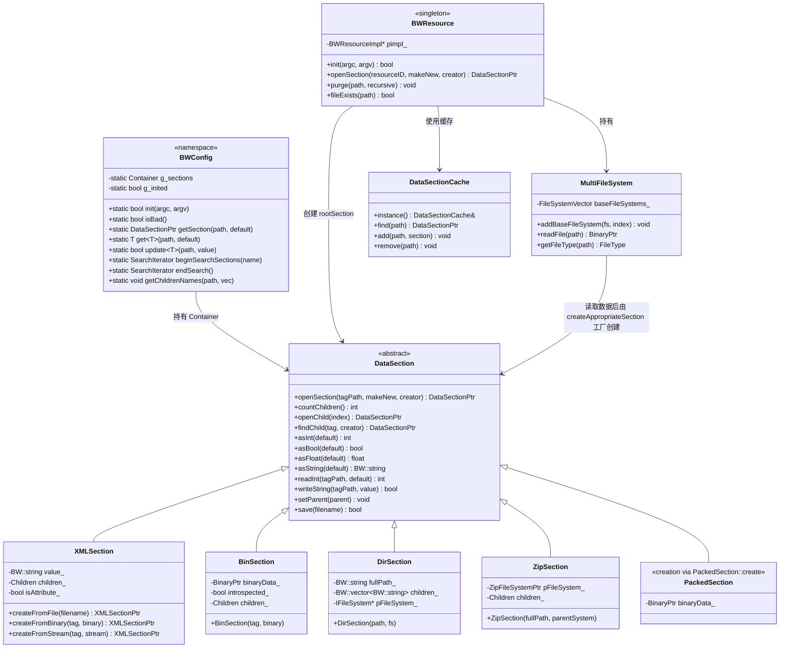

# 专题24:配置系统深度剖析

> 本文档深度剖析 BigWorld Engine 14.4.1 中**配置系统**的完整实现,涵盖设计哲学、整体架构、`DataSection` 抽象与 5 种实现(XML/Binary/Dir/Zip/Packed)、`XMLSection` 解析、`BWResource` 资源路径管理、`bw.xml` 主配置文件、`parentFile` 层次化配置链、`AutoConfig` 自动配置、`HierarchicalConfig` 目录型层次化配置、命令行参数覆写(`+key value`)、配置加载链端到端流程、进程特定配置节、`BWConfig::get` 路径解析、类型系统、错误处理与默认值、Watcher 运行时配置、服务器端 vs 客户端配置差异、性能分析、设计权衡与替代方案、局限性与改进方向,以及一次完整配置读取的端到端追踪。所有代码引用均带绝对路径与行号,可在源码中直接定位。

---

## 目录

- [一、引言:BigWorld 配置系统设计哲学](#一引言bigworld-配置系统设计哲学)
- [二、整体架构:BWConfig / Config / BWConf / DataSection](#二整体架构bwconfig--config--bwconf--datasection)
- [三、DataSection 抽象:5 种 Section 实现](#三datasection-抽象5-种-section-实现)
- [四、XML 解析:XMLSection 与 XMLProcessor](#四xml-解析xmlsection-与-xmlprocessor)
- [五、二进制格式:BinSection 与 PackedSection](#五二进制格式binsection-与-packedsection)
- [六、BWResource:文件系统抽象与 MultiFileSystem](#六bwresource文件系统抽象与-multifilesystem)
- [七、bw.xml 主配置文件](#七bwxml-主配置文件)
- [八、层次化配置:parentFile 引用链](#八层次化配置parentfile-引用链)
- [九、AutoConfig 自动配置机制](#九autoconfig-自动配置机制)
- [十、HierarchicalConfig 目录型层次化配置](#十hierarchicalconfig-目录型层次化配置)
- [十一、命令行参数覆写](#十一命令行参数覆写)
- [十二、配置加载链端到端流程](#十二配置加载链端到端流程)
- [十三、进程特定配置:每个进程读取的配置节](#十三进程特定配置每个进程读取的配置节)
- [十四、配置访问 API:BWConfig::get 与路径解析](#十四配置访问-apibwconfigget-与路径解析)
- [十五、类型系统:int/float/string/bool/section](#十五类型系统intfloatstringboolsection)
- [十六、错误处理与默认值](#十六错误处理与默认值)
- [十七、运行时配置:Watcher 与动态修改](#十七运行时配置watcher-与动态修改)
- [十八、服务器端 vs 客户端配置](#十八服务器端-vs-客户端配置)
- [十九、性能分析:加载耗时与内存占用](#十九性能分析加载耗时与内存占用)
- [二十、设计权衡与替代方案](#二十设计权衡与替代方案)
- [二十一、局限性与改进方向](#二十一局限性与改进方向)
- [二十二、完整实例:一次配置读取的端到端追踪](#二十二完整实例一次配置读取的端到端追踪)
- [附录 A:核心配置项清单](#附录-a核心配置项清单)
- [附录 B:配置文件层次结构示例](#附录-b配置文件层次结构示例)
- [附录 C:常见配置问题排查](#附录-c常见配置问题排查)
- [总结](#总结)

---

## 一、引言:BigWorld 配置系统设计哲学

### 1.1 问题域:为什么 MMOG 需要专门的配置系统

BigWorld Engine 是一款面向大规模多人在线游戏(MMOG)的服务器引擎。一个生产集群通常由数十乃至上百个进程组成,典型部署形态包括:

- 数十个 **CellApp**(空间计算节点,承载 Entity 的 Cell 部分)
- 数十个 **BaseApp**(玩家代理节点,承载 Entity 的 Base 部分)
- 1 主 N 备 **CellAppMgr**(空间调度器)
- 1 主 N 备 **BaseAppMgr**(玩家代理调度器)
- 1 主 N 备 **DBApp**(数据持久化节点)
- 多个 **LoginApp**(登录接入网关)
- 多个 **ServiceApp**(无状态服务进程)
- 每台机器一个 **bwmachined**(进程守护)
- 1 主 N 备 **Reviver**(业务级守护)
- 1 个 **message_logger**(集中式日志收集)

每个进程的运行参数都不尽相同,这意味着配置系统面临以下挑战:

1. **配置维度多**:从基础的网络接口、tick 周期、负载上限,到业务层的 entity 类型注册、AOI 半径、Ghost 远程刷新频率,几乎所有运行参数都通过配置驱动。
2. **多环境适配**:开发、测试、预发布、生产四个环境,数据库地址、负载阈值、日志级别都要差异化。
3. **进程差异化**:CellApp 关心空间分片参数,BaseApp 关心玩家超时,DBApp 关心 MySQL 连接池,但它们共享同一个 `bw.xml` 入口。
4. **运行时调试**:运维要在不停服的情况下,临时把某个 BaseApp 的日志级别从 INFO 调到 DEBUG,排查问题。
5. **个性化**:开发同学的本地机器需要一份"个人化"配置,覆盖默认值,但又不能污染团队共享的 `bw.xml`。
6. **跨平台一致**:同一份配置文件既要能在 Linux 服务器上读,也要能在 Windows 编辑器里读,路径分隔符、文件系统差异要透明。
7. **多源数据混合**:XML 文本配置 + 二进制 packed 资源 + 目录结构,需要统一访问接口。
8. **零侵入覆盖**:命令行启动时,要能用 `+key value` 简单覆盖某个配置项,不必修改文件。

### 1.2 BigWorld 的解:分层配置体系

BigWorld 提供了一套**分层、多源、可链式继承**的配置体系,核心思想可归纳为:

1. **统一抽象**:用 `DataSection` 抽象掉底层存储格式差异。XML 文件、二进制文件、目录、Zip 包都被映射为同样的"节树"接口。
2. **静态入口**:`BWConfig` 命名空间提供静态 API `get()`/`getSection()`/`beginSearchSections()`/`endSearch()`,任何代码直接调用,无需持有引用。
3. **链式继承**:通过 `<parentFile>` 节点把多个文件串成链,子配置覆盖父配置,实现"通用默认 + 环境特化 + 个人化"的层层覆盖。
4. **命令行覆写**:启动时用 `+key value` 覆盖任意配置,写入链头(最具体)的 DataSection。
5. **进程无关**:所有进程读同一个 `bw.xml`,但通过 `CONFIG_PATH`(如 `baseApp/`、`cellApp/`)区分各自的配置节。
6. **运行时观测/修改**:Watcher 框架把部分配置项暴露为可读写节点,运维工具可热改。
7. **多源自动配置**:`AutoConfig` 模板类支持从 `resources.xml` 自动注入到全局变量;`HierarchicalConfig` 支持从目录树合并规则文件。
8. **资源路径解析**:`BWResource` 维护 `paths.xml` + `BW_RES_PATH` 环境变量 + `~/.bwmachined.conf`,把"相对资源路径"解析到具体物理文件。

### 1.3 与业界方案对比

| 维度 | BigWorld 配置系统 | Spring Cloud Config | Kubernetes ConfigMap | etcd 配置中心 |
|------|------|------|------|------|
| 配置格式 | XML(主) + 二进制 | YAML/Properties | YAML/JSON | 任意 KV |
| 层次化 | `parentFile` 链 + 目录递归 | profile + label | namespace + 标签 | 目录前缀 |
| 命令行覆写 | `+key value` | `--spring.config.location` | env | env |
| 热加载 | 部分(Watcher) | 完整 | mount 自动更新 | 完整 |
| 类型系统 | 弱类型(DataSection::as<T>) | 弱类型 | 弱类型 | 弱类型 |
| 抽象层级 | DataSection(5 种实现) | Environment 抽象 | Volume 投影 | KV 抽象 |
| 客户端耦合 | 静态库强依赖 | 客户端 SDK | 容器编排 | 客户端 SDK |
| 适用场景 | 单机/集群内嵌 | 微服务集群 | 容器化集群 | 分布式 KV |

BigWorld 配置系统的设计哲学更接近**嵌入式配置库 + 文件系统抽象**:它不依赖外部配置中心,而是把配置视为资源系统的一部分,通过 `DataSection` 统一访问,链式继承避免配置中心化的运维成本。这一点对 MMOG 的"开机即用"很重要——一个新手开发者只要解压资源包、设置 `BW_RES_PATH`,就能用 `bw.xml` 启动整套集群。

### 1.4 本专题的研究范围

本专题聚焦于以下源码区域:

- `programming/bigworld/lib/cstdmf/config.hpp` — 编译期特性开关宏(`ENABLE_WATCHERS` 等)
- `programming/bigworld/lib/server/bwconfig.hpp` / `bwconfig.cpp` — `BWConfig` 命名空间,运行时配置入口
- `programming/bigworld/lib/resmgr/datasection.hpp` / `datasection.cpp` — `DataSection` 抽象基类
- `programming/bigworld/lib/resmgr/xml_section.hpp` / `xml_section.cpp` — XML 实现
- `programming/bigworld/lib/resmgr/bin_section.hpp` / `bin_section.cpp` — 二进制实现
- `programming/bigworld/lib/resmgr/dir_section.hpp` / `dir_section.cpp` — 目录实现
- `programming/bigworld/lib/resmgr/zip_section.hpp` / `zip_section.cpp` — Zip 实现
- `programming/bigworld/lib/resmgr/packed_section.hpp` / `packed_section.cpp` — Packed 实现
- `programming/bigworld/lib/resmgr/bwresource.hpp` / `bwresource.cpp` / `bwresource.ipp` — 资源单例
- `programming/bigworld/lib/resmgr/multi_file_system.hpp` / `multi_file_system.cpp` — 多文件系统
- `programming/bigworld/lib/resmgr/dataresource.hpp` / `dataresource.cpp` — `DataResource` 抽象
- `programming/bigworld/lib/resmgr/auto_config.hpp` / `auto_config.cpp` — `AutoConfig` 模板
- `programming/bigworld/lib/resmgr/hierarchical_config.hpp` / `hierarchical_config.cpp` — 目录型层次化配置
- `programming/bigworld/lib/server/server_app.hpp` / `server_app.cpp` — 服务器进程基类(集成示例)
- `programming/bigworld/examples/client_integration/python/simple/res/server/bw.xml` — 实际 bw.xml 示例

### 1.5 阅读建议

- **首次阅读**:按章节顺序通读,先理解 `DataSection` 抽象,再看 `BWConfig` 静态入口,最后看加载链。
- **运维排查**:直接跳到第十二章(端到端流程)+ 附录 C(常见问题排查)。
- **二次开发**:重点看第三章(DataSection 5 种实现)+ 第十四章(API)+ 第十六章(错误处理)。
- **性能优化**:重点看第十九章(性能分析)。
- **设计参考**:重点看第二十章(设计权衡)+ 第二十一章(局限性)。

---

## 二、整体架构:BWConfig / Config / BWConf / DataSection

### 2.1 命名澄清:三个易混淆的名字

BigWorld 配置系统涉及三个名字相近的概念,初学者很容易混淆,先做澄清:

| 名字 | 性质 | 实际位置 | 用途 |
|------|------|----------|------|
| `config.hpp` | 编译期宏头文件 | `programming/bigworld/lib/cstdmf/config.hpp` | 控制 `ENABLE_WATCHERS`、`ENABLE_PROFILER` 等编译期特性开关,与运行时配置无关 |
| `BWConfig` | 命名空间 | `programming/bigworld/lib/server/bwconfig.hpp` | 运行时配置访问入口,提供 `get()`、`getSection()` 等静态 API |
| `BWConf` | (不存在) | — | 部分文档把 `BWConfig` 误写为 `BWConf`,本引擎中无独立 `BWConf` 类 |
| `Config` 类 | (不存在) | — | BigWorld 中没有名为 `Config` 的运行时配置类;运行时配置树由 `DataSection` 直接表示 |
| `BWResource` | 单例类 | `programming/bigworld/lib/resmgr/bwresource.hpp` | 资源/文件系统抽象,提供 `openSection()` 把资源路径解析为 `DataSection` |

**关键澄清**:

1. `config.hpp` 中的 `ENABLE_*` 宏是**编译期开关**,通过 `#if ENABLE_WATCHERS ... #endif` 决定代码是否编译进二进制。这与本专题讨论的"运行时配置"是两套独立机制,虽然都叫"config"。
2. 本专题聚焦的"运行时配置系统"由 `BWConfig`(入口)+ `DataSection`(数据结构)+ `BWResource`(I/O 后端)三件套组成。
3. 没有 `BWConf` 类,这是文档中常见的拼写错误。

### 2.2 三层架构总览

BigWorld 配置系统采用清晰的三层架构:

```
┌─────────────────────────────────────────────────────────────────┐
│  应用层:各进程的 ServerApp 派生类、Python 脚本、业务逻辑         │
│     ↓ 调用 BWConfig::get<int>("baseApp/load")                    │
├─────────────────────────────────────────────────────────────────┤
│  入口层:BWConfig 命名空间(静态 API)                              │
│     - get<T>(path, default)        模板化读取                     │
│     - getSection(path, default)    读取 DataSection               │
│     - beginSearchSections(name)    跨链迭代同名子节              │
│     - update(path, value)          读后写回变量                  │
│     - getChildrenNames(path, vec)  枚举子节名                   │
│     内部:Container g_sections(vector<pair<DataSectionPtr,      │
│                                  BW::string>>                  │
│                                  文件路径)                       │
├─────────────────────────────────────────────────────────────────┤
│  数据层:DataSection 抽象 + 5 种实现                              │
│     - XMLSection      (.xml 文件)                                │
│     - BinSection      (二进制文件)                               │
│     - DirSection      (目录)                                    │
│     - ZipSection       (zip 包内)                               │
│     - PackedSection    (packed 二进制节)                        │
│     由 BWResource::openSection() 工厂分发                       │
├─────────────────────────────────────────────────────────────────┤
│  I/O 层:BWResource 单例 + MultiFileSystem                       │
│     - paths.xml        资源根路径列表                           │
│     - BW_RES_PATH      环境变量(已废弃)                         │
│     - ~/.bwmachined.conf  Linux 下路径配置                       │
│     - NativeFileSystem / ZipFileSystem 组合                    │
│     - DataSectionCache  路径 → DataSection 缓存                 │
│     - DataSectionCensus 全局 DataSection 索引                    │
└─────────────────────────────────────────────────────────────────┘
```

各层职责:

- **应用层**:业务代码只关心"读一个配置项",不关心它来自 XML 还是二进制。
- **入口层**:`BWConfig` 提供**静态、全局、零参数**的访问入口,内部维护"配置链"——多个 `DataSection` 按顺序排列,查询时从前往后找,第一个命中即返回。
- **数据层**:`DataSection` 是抽象基类,定义 `openSection`、`as<T>`、`readInt` 等接口;5 种实现各自处理 XML/二进制/目录/Zip/Packed 数据。
- **I/O 层**:`BWResource` 把"资源路径"(如 `server/bw.xml`)解析到具体的物理文件,管理多路径搜索、缓存、文件系统监控。

### 2.3 关键类关系图

下面是配置系统核心类的 UML 关系图(以 Mermaid 描述):



### 2.4 静态入口 BWConfig 的全局状态

`BWConfig` 命名空间内持有以下全局状态(定义于 [bwconfig.cpp](file:///j:/Work/BigWorld-Engine-14.4.1/programming/bigworld/lib/server/bwconfig.cpp#L22-27)):

```cpp
namespace BWConfig
{
    int shouldDebug = 0;            // 调试输出开关,值由 debugConfigOptions 配置项驱动
    BW::string badFilename;         // 加载失败的文件名,供 isBad() 检查
    Container g_sections;          // 配置链:vector<pair<DataSectionPtr, BW::string>>
    bool g_inited = false;          // 是否已初始化
}
```

其中 `Container` 的类型定义在 [bwconfig.hpp](file:///j:/Work/BigWorld-Engine-14.4.1/programming/bigworld/lib/server/bwconfig.hpp#L33-34):

```cpp
// Vector of pairs of file DataSections and corresponding filenames
typedef std::pair< DataSectionPtr, BW::string > ConfigElement;
typedef BW::vector< ConfigElement > Container;
```

`g_sections` 的语义是:**索引 0 是最具体的配置(用户个性化或 bw.xml),索引越大越通用(parentFile 链的祖先)**。`getSection()` 从 `begin()` 到 `end()` 顺序查找,第一个命中即返回,因此**子配置覆盖父配置**。

### 2.5 配置系统的源码拓扑

下面是配置系统相关源码的目录结构(节选):

```
programming/bigworld/lib/
├── cstdmf/                          # 通用基础库
│   ├── config.hpp                   # 编译期特性开关宏(本专题不深入)
│   ├── debug.hpp / debug.cpp        # 日志与调试输出,被 BWConfig 调用
│   ├── debug_filter.hpp / .cpp      # DebugFilter,日志级别过滤
│   ├── watcher.hpp / watcher.cpp    # Watcher 框架,运行时配置观测
│   └── stringmap.hpp                # StringHashMap,被 HierarchicalConfig 使用
├── server/                          # 服务器库
│   ├── bwconfig.hpp / bwconfig.cpp  # BWConfig 静态入口 ★★★
│   └── server_app.hpp / .cpp        # ServerApp 基类,集成 BWConfig
├── resmgr/                          # 资源管理库 ★★★
│   ├── datasection.hpp / .cpp        # DataSection 抽象基类 ★★★
│   ├── xml_section.hpp / .cpp        # XMLSection
│   ├── bin_section.hpp / .cpp        # BinSection
│   ├── dir_section.hpp / .cpp        # DirSection
│   ├── zip_section.hpp / .cpp        # ZipSection
│   ├── packed_section.hpp / .cpp     # PackedSection
│   ├── bwresource.hpp / .cpp / .ipp  # BWResource 单例 ★★★
│   ├── multi_file_system.hpp / .cpp  # MultiFileSystem
│   ├── file_system.hpp / .cpp        # IFileSystem 接口
│   ├── dataresource.hpp / .cpp       # DataResource(旧式文件抽象)
│   ├── data_section_cache.hpp / .cpp # DataSectionCache(路径→节缓存)
│   ├── data_section_census.hpp/.cpp  # DataSectionCensus(全局节索引)
│   ├── auto_config.hpp / .cpp       # AutoConfig 模板 ★
│   └── hierarchical_config.hpp/.cpp # HierarchicalConfig 目录型配置 ★
└── xml/                             # (此目录在 14.4.1 中已合并入 resmgr)
```

### 2.6 与其他子系统的关系

配置系统不是孤立的,它与多个子系统有交互:

- **日志系统**:`BWConfig::init()` 末尾会读取 `outputFilterThreshold` 配置项,设置 `DebugFilter::instance().filterThreshold()`(参见 [bwconfig.cpp:232-238](file:///j:/Work/BigWorld-Engine-14.4.1/programming/bigworld/lib/server/bwconfig.cpp#L232-238))。
- **Watcher 系统**:`BWConfig` 注册 `BW_REGISTER_WATCHER` 宏(定义于 [bwconfig.hpp:219-229](file:///j:/Work/BigWorld-Engine-14.4.1/programming/bigworld/lib/server/bwconfig.hpp#L219-229)),把监控接口暴露出去;`XMLSection` 内部也通过 `MF_WATCH` 暴露 `config/shouldReadXMLAttributes` 等 watcher。
- **网络层**:`getBWInternalInterfaceSetting()` 函数([bwconfig.cpp:438-446](file:///j:/Work/BigWorld-Engine-14.4.1/programming/bigworld/lib/server/bwconfig.cpp#L438-446))从 bw.xml 读 `internalInterface` 配置,供 `Mercury::NetworkInterface` 使用。
- **资源系统**:`BWConfig::init()` 直接调用 `BWResource::openSection()` 加载 bw.xml。
- **ServerApp**:`ServerApp::init()` 读取 `ServerAppConfig` 的多个配置项(如 `production`、`updateHertz`、`maxOpenFileDescriptors`)。

---

## 三、DataSection 抽象:5 种 Section 实现

### 3.1 DataSection 抽象基类的设计目标

`DataSection` 是 BigWorld 资源系统的**核心抽象基类**,定义于 [datasection.hpp](file:///j:/Work/BigWorld-Engine-14.4.1/programming/bigworld/lib/resmgr/datasection.hpp)。它的设计目标是:

1. **格式无关**:同一套 API(`openSection`、`asInt`、`readString`)能读 XML、二进制、目录、Zip、Packed 五种格式。
2. **路径导航**:支持 `"A/B/C"` 这种斜杠分隔的路径,自动逐级打开子节。
3. **类型转换**:提供 `asInt`、`asFloat`、`asBool`、`asString`、`asVector3` 等方法,把节点的字符串值转换为强类型值。
4. **读写双向**:既能读(`read*`)也能写(`write*`、`set*`),写入操作会修改底层文件并触发 save。
5. **可枚举**:提供 `begin()`/`end()` 迭代器,以及 `countChildren()`、`childSectionName(i)` 等枚举接口。
6. **智能指针管理**:继承 `SafeReferenceCount`,通过 `DataSectionPtr`(即 `SmartPointer<DataSection>`)管理生命周期。

### 3.2 DataSection 的关键接口

下面是 `DataSection` 的核心接口(节选自 [datasection.hpp:172-902](file:///j:/Work/BigWorld-Engine-14.4.1/programming/bigworld/lib/resmgr/datasection.hpp#L172-902)):

```cpp
class DataSection : public SafeReferenceCount
{
public:
    typedef DataSectionIterator iterator;
    typedef const DataSectionIterator const_iterator;

    // ===== 纯虚方法(各派生类必须实现)=====
    virtual int countChildren() = 0;
    virtual DataSectionPtr openChild( int index ) = 0;
    virtual DataSectionPtr newSection( const BW::StringRef &tag,
        DataSectionCreator* creator=NULL ) = 0;
    virtual DataSectionPtr findChild( const BW::StringRef &tag,
        DataSectionCreator* creator=NULL ) = 0;
    virtual void delChild( const BW::StringRef &tag ) = 0;
    virtual void delChild( DataSectionPtr pSection ) = 0;
    virtual void delChildren() = 0;
    virtual BW::string sectionName() const = 0;
    virtual int bytes() const = 0;
    virtual bool save( const BW::StringRef & saveAsFileName = BW::StringRef() ) = 0;

    // ===== 非虚辅助方法(在基类实现,调用纯虚方法)=====
    DataSectionPtr openSection( const BW::StringRef &tagPath,
                                bool makeNewSection = false,
                                DataSectionCreator* creator = NULL);
    DataSectionPtr openFirstSection( void );
    void openSections( const BW::StringRef &tagPath,
        BW::vector<DataSectionPtr> &dest,
        DataSectionCreator* creator = NULL);

    // ===== 类型化读取(每个具体派生类可重写,基类提供默认实现)=====
    virtual bool asBool( bool defaultVal = ... );
    virtual int asInt( int defaultVal = ... );
    virtual float asFloat( float defaultVal = ... );
    virtual BW::string asString( const BW::StringRef &defaultVal = ..., int flags = ... );
    virtual Vector3 asVector3( const Vector3 &defaultVal = ... );
    virtual BinaryPtr asBinary();
    // ... 共 14 种类型化 as 方法

    // ===== 类型化写入 =====
    virtual bool setBool( bool value );
    virtual bool setInt( int value );
    virtual bool setFloat( float value );
    virtual bool setString( const BW::StringRef &value );
    // ... 共 14 种类型化 set 方法

    // ===== 模板化 read/write(便利方法,封装 openSection + as/be)=====
    template <class C> C read( const BW::StringRef & tagPath )
    {
        DataSectionPtr pSection = this->openSection( tagPath, false );
        if (!pSection) return Datatype::DefaultValue<C>::val();
        return pSection->as<C>();
    }

    template <class C> bool write( const BW::StringRef & tagPath, const C & value)
    {
        DataSectionPtr pSection = this->openSection( tagPath, true );
        if (!pSection) return false;
        return pSection->be( value );
    }

    // ===== 数组读写(readSeq/writeSeq)=====
    template <class SEQ> void readSeq( const BW::StringRef & tagPath, SEQ & dest );
    template <class SEQ> void writeSeq( const BW::StringRef & tagPath, SEQ & src );

    // ===== 工厂方法 =====
    static DataSectionPtr createAppropriateSection(
        const BW::StringRef& tag, BinaryPtr pData,
        bool allowModifyData = true,
        DataSectionCreator* creator=NULL );
};
```

### 3.3 类型转换机制:DataSectionTypeConverter

`DataSection` 的模板方法 `as<C>()` 通过 `DataSectionTypeConverter<C>::as(pSection, defaultVal)` 派发到具体的 `asInt`/`asFloat` 等方法。这个机制定义在 [datasection.hpp:109-117](file:///j:/Work/BigWorld-Engine-14.4.1/programming/bigworld/lib/resmgr/datasection.hpp#L109-117):

```cpp
template <class C> struct DataSectionTypeConverter
{
    static C as( DataSectionPtr pSection,
            const C & defaultVal = Datatype::DefaultValue<C>::val() )
        { return C::DataSection_as( pSection, defaultVal ); }

    static bool be( DataSectionPtr pSection, const C & value )
        { return C::DataSection_be( pSection, value ); }
};
```

对于内建类型,通过宏批量生成特化(定义于 [datasection.hpp:905-935](file:///j:/Work/BigWorld-Engine-14.4.1/programming/bigworld/lib/resmgr/datasection.hpp#L905-935)):

```cpp
#define BUILTIN_TEMPLATES( TYPE, AS_FUNCTION, BE_FUNCTION )                \
    template <> struct DataSectionTypeConverter<TYPE>                      \
    {                                                                       \
        static TYPE as( DataSectionPtr pSection, const TYPE & defaultVal )  \
            { return pSection->AS_FUNCTION( defaultVal ); }                 \
        static TYPE as( DataSectionPtr pSection )                            \
            { return pSection->AS_FUNCTION(); }                             \
        static bool be( DataSectionPtr pSection, const TYPE & value )       \
            { return pSection->BE_FUNCTION( value ); }                      \
    };

BUILTIN_TEMPLATES( bool, asBool, setBool )
BUILTIN_TEMPLATES( int, asInt, setInt )
BUILTIN_TEMPLATES( uint32, asUInt, setUInt )
BUILTIN_TEMPLATES( int64, asInt64, setInt64 )
BUILTIN_TEMPLATES( float, asFloat, setFloat )
BUILTIN_TEMPLATES( double, asDouble, setDouble )
BUILTIN_TEMPLATES( BW::string, asString, setString )
BUILTIN_TEMPLATES( Vector2, asVector2, setVector2 )
BUILTIN_TEMPLATES( Vector3, asVector3, setVector3 )
BUILTIN_TEMPLATES( Vector4, asVector4, setVector4 )
BUILTIN_TEMPLATES( Matrix, asMatrix34, setMatrix34 )
// ...
```

这样,调用 `pSection->as<int>()` 实际上等价于 `pSection->asInt()`。这种间接层是为了让用户自定义类型也能通过特化 `DataSectionTypeConverter` 接入。

### 3.4 默认值机制:Datatype::DefaultValue

为了避免未初始化内存读取,`Datatype::DefaultValue<C>::val()` 为每种内建类型提供了零值默认(定义于 [datasection.hpp:52-73](file:///j:/Work/BigWorld-Engine-14.4.1/programming/bigworld/lib/resmgr/datasection.hpp#L52-73)):

```cpp
namespace Datatype {
    template <class C> struct DefaultValue
        { static inline C val() { return C(); } };
    template <> struct DefaultValue<bool>   { static inline bool val() { return false; } };
    template <> struct DefaultValue<int>    { static inline int val() { return 0; } };
    template <> struct DefaultValue<float>  { static inline float val() { return 0; } };
    template <> struct DefaultValue<double> { static inline double val() { return 0; } };
    template <> struct DefaultValue<Vector3> { static inline Vector3 val() { return Vector3::zero(); } };
    // ...
}
```

这意味着调用 `pSection->readInt("missingTag")` 而该 tag 不存在时,会安全地返回 `0`,不会读未初始化内存。

### 3.5 5 种具体实现对比

`DataSection` 有 5 种具体派生类,各有不同的存储后端:

| 实现 | 文件 | 存储后端 | 创建方式 | 典型用途 |
|------|------|----------|----------|----------|
| `XMLSection` | `xml_section.hpp` | XML 文本字符串 | `XMLSection::createFromFile()`、`createFromBinary()` | bw.xml、paths.xml、resources.xml 等人可编辑配置 |
| `BinSection` | `bin_section.hpp` | 原始二进制 `BinaryBlock` | `new BinSection(tag, pBinary)` | 原始二进制资源(模型、贴图的原始数据) |
| `DirSection` | `dir_section.hpp` | 文件系统目录 | `new DirSection(path, pFileSystem)` | 把目录树映射为节树,支持 BWResource 根节 |
| `ZipSection` | `zip_section.hpp` | Zip 包内文件 | `new ZipSection(fullPath, parentSystem)` | 把 .zip 包映射为节树 |
| `PackedSection` | `packed_section.hpp` | 二进制 packed 格式 | `PackedSection::create(tag, pBinary)` | 资源管线产出的 packed 节(.cdata、.scene) |

它们的核心差异:

```cpp
// XMLSection:维护 value_ 和 children_ 两个列表
class XMLSection : public DataSection {
    const char  *ctag_, *cval_;   // 字面量 tag/value(避免拷贝)
    BW::string  tag_, value_;     // 实际 tag/value
    int         numChildren_;
    bool        isAttribute_;     // XML 属性 vs 元素
    bool        noXMLEscapeSequence_;
    Children    children_;        // BW::vector<XMLSectionPtr>
    BinaryPtr   block_;           // 原始二进制(用于 save)
};

// BinSection:只持有一个 BinaryPtr
class BinSection : public DataSection {
    BW::string  tag_;
    BinaryPtr   binaryData_;      // 原始数据
    bool        introspected_;    // 是否已"内省"出子节
    Children    children_;        // 内省后填充
};

// DirSection:目录列表
class DirSection : public DataSection {
    BW::string              fullPath_;   // 目录绝对路径
    BW::string              tag_;
    BW::vector<BW::string>  children_;   // 子目录/文件名
    IFileSystem*            pFileSystem_;
};

// ZipSection:Zip 包内节
class ZipSection : public DataSection {
    BW::string      tag_;
    bool            introspected_;
    Children        children_;
    ZipFileSystemPtr pFileSystem_;       // 关联的 Zip 文件系统
};

// PackedSection:packed 二进制格式
class PackedSection : public DataSection {
    // 内部维护 BinaryPtr + 子节列表
    // 通过 PackedSection::create() 工厂创建
};
```

### 3.6 createAppropriateSection 工厂分发

`DataSection::createAppropriateSection()` 是工厂方法,根据**二进制数据的开头字节**判断该用哪种 Section(定义于 [datasection.cpp:2047-2115](file:///j:/Work/BigWorld-Engine-14.4.1/programming/bigworld/lib/resmgr/datasection.cpp#L2047-2115)):

```cpp
DataSectionPtr DataSection::createAppropriateSection(
    const BW::StringRef& tag, BinaryPtr pData, bool allowModifyData,
    DataSectionCreator* creator )
{
    if (creator)
        return creator->load(NULL, tag, pData);

    if (pData->len() > 0)
    {
        // 跳过前导空白
        const char * fileStr = pData->cdata();
        while (*fileStr && (*fileStr==' ' || *fileStr=='\t' || 
                            *fileStr=='\r' || *fileStr=='\n'))
            fileStr++;

        // 关键判断:第一个非空字符是 '<' → 当 XML 解析
        if ((*fileStr) && (*fileStr == '<'))
        {
            BinaryPtr origData = pData;
            if (!allowModifyData)
                pData = new BinaryBlock( pData->data(), pData->len(), "..." );

            XMLSectionPtr ptr = XMLSection::createFromBinary( tag, pData );

            if (ptr || allowModifyData)
                return ptr;
            else // XML 解析失败,降级为 packed
            {
                WARNING_MSG( "Invalid XML section '%s', treating as binary.\n",
                    tag.to_string().c_str() );
                DataSectionPtr pDS = PackedSection::create( tag, origData );
                if (pDS) return pDS;
                return new BinSection( tag, origData );
            }
        }
    }

    // 不以 '<' 开头 → 尝试 Packed,失败则用 BinSection
    DataSectionPtr pDS = PackedSection::create( tag, pData );
    if (pDS) return pDS;
    return new BinSection( tag, pData );
}
```

判断逻辑总结:

```
读取二进制数据的前导非空字节:
├── 以 '<' 开头           → XML 解析
│   ├── 解析成功           → 返回 XMLSection
│   └── 解析失败           → 降级 PackedSection,再失败用 BinSection
└── 不以 '<' 开头         → PackedSection,失败用 BinSection
```

这是一个**启发式判断**:不依赖文件扩展名,而是看实际内容。这意味着同一份文件被改名后也能正确解析,但也意味着一个伪 XML 文档(以 `<` 开头但格式错误)会被降级为 binary。

### 3.7 DataSectionIterator 迭代器

`DataSection` 提供 STL 风格的迭代器 `begin()`/`end()`(定义于 [datasection.hpp:78-99](file:///j:/Work/BigWorld-Engine-14.4.1/programming/bigworld/lib/resmgr/datasection.hpp#L78-99) 和 [datasection.cpp:25-117](file:///j:/Work/BigWorld-Engine-14.4.1/programming/bigworld/lib/resmgr/datasection.cpp#L25-117)):

```cpp
class DataSectionIterator
{
public:
    DataSectionIterator();
    DataSectionIterator(const DataSectionPtr & dataSection, int index);

    bool operator==(const DataSectionIterator & dataSection) const;
    bool operator!=(const DataSectionIterator & dataSection) const;

    DataSectionPtr          operator*();
    DataSectionIterator     operator++(int);
    const DataSectionIterator & operator++();

    BW::string tag();
private:
    DataSectionPtr  dataSection_;
    int             index_;
};
```

注意 `operator*()` 的实现([datasection.cpp:85-93](file:///j:/Work/BigWorld-Engine-14.4.1/programming/bigworld/lib/resmgr/datasection.cpp#L85-93)):

```cpp
DataSectionPtr DataSectionIterator::operator*()
{
    DataSectionPtr pChild = dataSection_->openChild( index_ );
    if (!pChild)
        pChild = new BinSection( dataSection_->childSectionName( index_ ),
            new BinaryBlock( NULL, 0, "BinaryBlock/DataSection" ) );
    return pChild;
}
```

这里有一个**优雅降级**:如果 `openChild(index)` 返回 NULL(例如目录访问失败),会创建一个空的 `BinSection` 占位,避免迭代器返回 NULL 导致崩溃。

### 3.8 SearchIterator:跨链同名子节迭代

`DataSection::SearchIterator` 是一个特殊迭代器,用于遍历**所有同名子节**(定义于 [datasection.hpp:197-264](file:///j:/Work/BigWorld-Engine-14.4.1/programming/bigworld/lib/resmgr/datasection.hpp#L197-264)):

```cpp
class SearchIterator
{
public:
    DataSectionPtr operator*()
    { return pDataSection_->openChild( index_ ); }

    SearchIterator& operator++()
    {
        index_++;
        this->findNext();
        return *this;
    }
    // ...

private:
    void findNext()
    {
        if (pDataSection_)
        {
            int numChildren = pDataSection_->countChildren();
            while (index_ < numChildren)
            {
                if (pDataSection_->childSectionName( index_ ) == sectionName_)
                    return;
                ++index_;
            }
        }
        index_ = INT_MAX;   // 标记为 end
    }

    DataSection*  pDataSection_;
    int           index_;
    BW::string    sectionName_;
};
```

这个迭代器是 `BWConfig::beginSearchSections()` 的基础——它能在配置链的所有 DataSection 中查找同名子节。

### 3.9 DataSectionCreator:节创建工厂接口

`DataSectionCreator` 是一个接口,允许调用者控制节的创建/加载方式(定义于 [datasection.hpp:140-149](file:///j:/Work/BigWorld-Engine-14.4.1/programming/bigworld/lib/resmgr/datasection.hpp#L140-149)):

```cpp
class DataSectionCreator
{
public:
    virtual DataSectionPtr create(DataSectionPtr pSection,
                                    const BW::StringRef& tag) = 0;
    virtual DataSectionPtr load(DataSectionPtr pSection,
                                    const BW::StringRef& tag,
                                    BinaryPtr pBinary = NULL) = 0;
};
```

各 Section 类提供静态 `creator()` 方法返回自己的工厂:

```cpp
XMLSection::creator();        // 总是用 XML 解析
BinSection::creator();        // 总是用 Bin
ZipSection::creator();        // 总是用 Zip
PackedSection::creator();     // 总是用 Packed
```

这允许你强制把 XML 文件当二进制读,例如:

```cpp
DataSectionPtr pDS = BWResource::openSection( "existing_file.xml", false,
                                            BinSection::creator() );
```

### 3.10 SERIALISE 宏:成员变量序列化便利

为了简化"读/写成员变量到 DataSection"的样板代码,`DataSection` 头文件提供了 `SERIALISE` 宏([datasection.hpp:970-993](file:///j:/Work/BigWorld-Engine-14.4.1/programming/bigworld/lib/resmgr/datasection.hpp#L970-993)):

```cpp
#define SERIALISE(DS, var, Type, load)                      \
        {                                                   \
            if (load)                                       \
            {                                               \
                var = DS->read ## Type( #var, var );        \
            }                                               \
            else                                            \
            {                                               \
                DS->write ## Type( #var, var );             \
            }                                               \
        }

#define SERIALISE_ENUM(DS, var, enumType, load)             \
        {                                                   \
            if (load)                                       \
            {                                               \
                var = (enumType)(DS->readInt( #var, var ));  \
            }                                               \
            else                                            \
            {                                               \
                DS->writeInt( #var, (int)(var) );           \
            }                                               \
        }
```

用法:

```cpp
void ServerAppConfig::serialise( DataSectionPtr pDS, bool load )
{
    SERIALISE( pDS, updateHertz_, Int, load );
    SERIALISE( pDS, maxOpenFileDescriptors_, Int, load );
    SERIALISE( pDS, production_, Bool, load );
}
```

这样一份代码同时支持"从配置读入成员"和"把成员写回配置",对工具类(如 ServerAppConfig)尤其方便。

---

## 四、XML 解析:XMLSection 与 XMLProcessor

### 4.1 XMLSection 的设计定位

`XMLSection` 是 BigWorld 中**人可编辑配置**的标准实现,所有 `.xml` 文件都通过它解析。它的特点:

1. **自实现的 XML 解析器**:不依赖 expat / libxml2,完全自己实现,代码量小,无外部依赖。
2. **基于 TinyXML 演化**:从代码风格(`XMLSection::processBang`、`XMLSection::processQuestionMark`)看,源于早期的 TinyXML 库。
3. **属性 + 元素统一抽象**:XML 的 attribute 和 element 都映射为 `XMLSection` 子节,通过 `isAttribute_` 标记区分。
4. **支持 XML 转义序列**:`&amp;`、`&#65;` 等实体引用和字符引用都支持,可通过 `noXMLEscapeSequence_` 关闭。
5. **支持宽字符串编码**:中文等 Unicode 字符通过特殊编码存储,提供 `decodeWideString`/`encodeWideString` 静态方法。
6. **可保存回文件**:`save()` 方法把内存中的节树重新序列化为 XML 文本。

### 4.2 XMLSection 的核心数据结构

`XMLSection` 的成员定义在 [xml_section.hpp:201-218](file:///j:/Work/BigWorld-Engine-14.4.1/programming/bigworld/lib/resmgr/xml_section.hpp#L201-218):

```cpp
class XMLSection : public DataSection
{
private:
    template <typename T>
    bool checkConversion( T t, const char * str, const char * methodName );

    char *stripWhitespace( char *inputString );
    XMLSection * addChild( const char * tag, int index = -1 );

    static bool processBang( class WrapperStream & stream,
            XMLSection * pCurrNode );
    static bool processQuestionMark( class WrapperStream & stream );

    const char *cval()    // 优先返回字面量 cval_,避免 string 拷贝
    {
        if (cval_)
            return cval_;
        return value_.c_str();
    }

    typedef BW::vector< XMLSectionPtr > Children;

    const char  * ctag_;     // 字面量 tag(常用于 root 等静态名)
    const char  * cval_;     // 字面量 value
    BW::string  tag_;        // 动态 tag
    BW::string  value_;      // 动态 value

    int         numChildren_;
    bool        isAttribute_;          // 是 XML 属性还是元素
    bool        noXMLEscapeSequence_; // 是否禁用 XML 转义

    Children    children_;             // 子节列表
    DataSectionPtr parent_;            // 父节(用于 save 回写)

    BinaryPtr   block_;                // 原始二进制块(用于 save)

    static bool s_shouldReadXMLAttributes;
    static bool s_shouldWriteXMLAttributes;
};
```

注意 `ctag_`/`cval_` 与 `tag_`/`value_` 的双轨设计:对于字面量(如 root 节的 `"root"`)用 `const char*` 避免字符串拷贝,对于动态内容用 `BW::string`。`cval()` 方法优先返回 `cval_`,实现零拷贝快速访问。

### 4.3 XMLSection 的创建入口

`XMLSection` 提供 3 个静态工厂方法([xml_section.hpp:58-64](file:///j:/Work/BigWorld-Engine-14.4.1/programming/bigworld/lib/resmgr/xml_section.hpp#L58-64)):

```cpp
static XMLSectionPtr createFromFile( const char * filename,
        bool returnEmptySection = true );
static XMLSectionPtr createFromStream(
    const BW::StringRef & tag, std::istream& astream );
static XMLSectionPtr createFromBinary(
    const BW::StringRef & tag, BinaryPtr pBinary );
```

这三个方法分别从:

- **文件名**:打开文件,读取字节,委托给 `createFromBinary`。
- **输入流**:从 `std::istream` 读取,委托给内部解析器。
- **二进制块**:最常用的入口,直接解析内存中的 `BinaryPtr`。

`createAppropriateSection` 工厂(见 §3.6)就是基于 `<` 判断后调用 `createFromBinary`。

### 4.4 XML 解析流程

XMLSection 的解析是一个**递归下降**式的状态机,核心流程:

```
1. 跳过前导空白
2. 读到 '<'
3. 查看下一个字符:
   ├── '!' → 处理 <!DOCTYPE / <!-- 注释 / <)。这两个方法处理:

- `processBang`:`<!-- 注释 -->`、`<!DOCTYPE ...>`、`<![CDATA[ ... ]]>`、`<!ENTITY ...>`。
- `processQuestionMark`:`<?xml version="1.0" encoding="UTF-8"?>` 等 PI(Processing Instruction)。

### 4.5 XML 标签合法性检查

`XMLSection::isValidXMLTag` 是个静态方法,用于检查一个字符串是否是合法的 XML 标签名([xml_section.cpp:131-156](file:///j:/Work/BigWorld-Engine-14.4.1/programming/bigworld/lib/resmgr/xml_section.cpp#L131-156)):

```cpp
/*static*/bool XMLSection::isValidXMLTag(const char *str)
{
    if (!s_shouldCheckXMLTag)
        return true;
    if (str == NULL || str[0]=='\0')
        return false;
    // 不能以数字开头(也要处理意外二进制数据)
    if (str[0]<0 || ::isdigit(str[0]) != 0)
        return false;
    // 不能含空格或斜杠
    for (size_t i = 0; str[i] != '\0'; ++i)
    {
        if (str[i] == ' ' || str[i] == '\\' || str[i] == '/')
            return false;
    }
    return true; // probably ok
}
```

这个检查不是完整的 XML 规范检查,只是过滤常见的错误。可以通过 `s_shouldCheckXMLTag` 全局关闭(用于 packed 数据等不需要 XML 校验的场景)。

构造函数中会调用此检查,失败时打印 WARNING:

```cpp
XMLSection::XMLSection( const BW::StringRef & tag ) :
    ctag_( NULL ), cval_( NULL ),
    tag_( tag.data(), tag.size() ),
    numChildren_( 0 ),
    isAttribute_( false ),
    noXMLEscapeSequence_( false )
{
    // ...
    if (!isValidXMLTag(tag_.c_str()))
        WARNING_MSG("%s is not a valid XML tag\n", tag_.c_str());
}
```

### 4.6 XML 转义序列支持

XMLSection 支持 XML 标准的转义序列(参见 [xml_section.cpp:23-26](file:///j:/Work/BigWorld-Engine-14.4.1/programming/bigworld/lib/resmgr/xml_section.cpp#L23-26)):

```cpp
// Support for XML escape sequences, such as &amp; and &#65, has been added.
// If for some reason, you need to disable this support and fall back to the
// old parsing, just un comment the line below:
//#define NO_XML_ESCAPE_SEQUENCE 1
```

支持的转义:

| 序列 | 含义 | 实体 |
|------|------|------|
| `&amp;` | & | ampersand |
| `&lt;` | < | less than |
| `&gt;` | > | greater than |
| `&quot;` | " | quote |
| `&apos;` | ' | apostrophe |
| `&#NN;` | 十进制字符 | 字符引用 |
| `&#xNN;` | 十六进制字符 | 字符引用 |

某些情况下(如 packed 二进制数据中可能含有 `&`),可以通过 `noXMLEscapeSequence_` 标记关闭转义,只把 `&` 当字面字符。

### 4.7 XMLSection 的类型化读取

XMLSection 重写了所有的 `as*` 方法。以 `asInt` 为例,典型实现:

```cpp
int XMLSection::asInt( int defaultVal )
{
    BW_GUARD;
    const char * str = this->cval();
    if (str[0] == '\0')
        return defaultVal;

    errno = 0;
    char *end;
    long l = strtol(str, &end, 0);  // 0 表示自动识别进制(0x 前缀等)
    if (errno == ERANGE || *end != '\0')
    {
        WARNING_MSG( "XMLSection::asInt: Invalid value \"%s\" in section \"%s\"\n",
            str, this->sectionName().c_str() );
        return defaultVal;
    }
    return (int)l;
}
```

其他类型类似:

- `asBool`:支持 `"true"`/`"false"`/`"1"`/`"0"` 等多种表示。
- `asFloat`/`asDouble`:调用 `strtof`/`strtod`。
- `asVector3`:用空格分隔 3 个 float。
- `asString`:直接返回 `cval()`,可选 `DS_TrimWhitespace` 标志控制是否去除首尾空白。

### 4.8 XML 属性 vs 元素

XMLSection 通过 `isAttribute_` 标记区分属性和元素。例如 XML:

```xml
<entity id="1001" type="player">
    <name>Hero</name>
</entity>
```

会被解析为:

```
XMLSection "entity" (isAttribute=false)
├── XMLSection "id" (isAttribute=true, value="1001")
├── XMLSection "type" (isAttribute=true, value="player")
└── XMLSection "name" (isAttribute=false, value="Hero")
```

属性和元素**统一为子节**,这意味着 `openSection("id")` 和 `openSection("name")` 用同样的 API 访问,简化了用户代码。

静态开关 `s_shouldReadXMLAttributes` / `s_shouldWriteXMLAttributes`(默认 `true`)控制是否解析属性。可以通过 Watcher 运行时关闭:

```cpp
// 在 watcher 树中暴露
MF_WATCH( "config/shouldReadXMLAttributes",
        XMLSection::shouldReadXMLAttributes,
        XMLSection::shouldReadXMLAttributes );
```

### 4.9 XMLSection 的 save

`XMLSection::save(filename)` 把内存中的节树序列化回 XML 文本,通过 `writeToStream` 递归实现:

```cpp
bool writeToStream( std::ostream & stream, int level = 0 ) const;
```

序列化规则:

1. 缩进:每深一层缩进 1 个 tab。
2. 属性:`<tag attr="value">`,属性值会做 XML 转义。
3. 元素:子节递归输出。
4. 字符数据:`<tag>text</tag>`,文本会被转义(除非 `noXMLEscapeSequence_`)。
5. 空节:`<tag/>` 或 `<tag></tag>`。

### 4.10 XML 标签的"卫生化"

XML 标签名有严格限制(不能含空格、不能以数字开头等)。但有时配置中需要用"自然名"作为 tag,如 `"Player Avatar"`。`XMLSection::sanise` 方法把字符串转为 XML 友好的形式([xml_section.hpp:73-77](file:///j:/Work/BigWorld-Engine-14.4.1/programming/bigworld/lib/resmgr/xml_section.hpp#L73-77)):

```cpp
BW::string sanitise( const BW::StringRef & val ) const;
BW::string unsanitise( const BW::StringRef & val ) const;
bool sanitiseSectionName();
```

`sanitise("Player Avatar")` 可能返回 `"Player_20Avatar"`(空格替换为 `_20`,数字字符的十六进制表示),`unsanitise` 反向还原。这样能让任意字符串安全地用作 XML 标签名。

### 4.11 XMLSection 的运行时 Watcher

XMLSection 通过静态初始化器注册了两个 Watcher([xml_section.cpp:58-78](file:///j:/Work/BigWorld-Engine-14.4.1/programming/bigworld/lib/resmgr/xml_section.cpp#L58-78)):

```cpp
#if ENABLE_WATCHERS
namespace
{
class WatcherIniter
{
public:
    WatcherIniter()
    {
        BW_GUARD;
        MF_WATCH( "config/shouldReadXMLAttributes",
                XMLSection::shouldReadXMLAttributes,
                XMLSection::shouldReadXMLAttributes );
        MF_WATCH( "config/shouldWriteXMLAttributes",
                XMLSection::shouldWriteXMLAttributes,
                XMLSection::shouldWriteXMLAttributes );
    }
};

WatcherIniter g_watcherIniter;
} // anonymous namespace
#endif
```

这意味着运维可以通过 watcher 工具(bwsysd)运行时关闭 XML 属性解析,用于排查某些特殊的 XML 文件解析问题。

---

## 五、二进制格式:BinSection 与 PackedSection

### 5.1 BinSection:原始二进制数据的薄包装

`BinSection` 是最简单的 DataSection 实现,本质上只是一个 `BinaryPtr` 的薄包装([bin_section.hpp:20-78](file:///j:/Work/BigWorld-Engine-14.4.1/programming/bigworld/lib/resmgr/bin_section.hpp#L20-78)):

```cpp
class BinSection : public DataSection
{
public:
    BinSection( const BW::StringRef& tag, BinaryPtr pBinary );
    ~BinSection();

    int countChildren();
    DataSectionPtr openChild( int index );
    DataSectionPtr newSection( const BW::StringRef &tag,
        DataSectionCreator* creator=NULL );
    DataSectionPtr findChild( const BW::StringRef &tag,
        DataSectionCreator* creator=NULL );
    void delChild(const BW::StringRef &tag );
    void delChild(DataSectionPtr pSection);
    void delChildren();

    BinaryPtr asBinary();
    bool setBinary(BinaryPtr pBinary);

    virtual BW::string sectionName() const;
    virtual int bytes() const;
    virtual bool save( const BW::StringRef& filename = "" );
    void setParent( DataSectionPtr pParent );

    virtual bool canPack() const	{ return false; }
    virtual DataSectionPtr convertToZip( ... );

    static DataSectionCreator* creator();

private:
    void introspect();
    BinaryPtr recollect();

    BW::string      tag_;
    BinaryPtr       binaryData_;
    typedef BW::vector< DataSectionPtr > Children;
    bool            introspected_;
    Children        children_;
    DataSectionPtr  parent_;
};
```

`BinSection` 的语义是:"这是一块二进制数据,我不知道里面是什么结构"。它的特点:

1. **`countChildren()` 默认返回 0**:除非调用 `introspect()` 探测出子节。
2. **`asInt()`/`asString()` 等类型方法**:基类 `DataSection` 的默认实现是把二进制数据当字符串解析(atoi 等),实用性有限。
3. **`asBinary()` 直接返回 `binaryData_`**:这是访问原始数据的主要方式。
4. **`canPack()` 返回 false**:BinSection 不能被 packed(因为它已经是原始数据)。
5. **`save(filename)` 把 `binaryData_` 原样写出**:无格式转换。

### 5.2 BinSection 的 introspect 机制

BinSection 持有 `introspected_` 标记和 `children_` 列表。`introspect()` 方法尝试探测二进制数据中的子节结构。这在 14.4.1 中较为少见,主要用于"延迟解析"——只有当用户真的访问子节时才尝试解析。

### 5.3 PackedSection:资源管线产出的二进制节

`PackedSection` 是 BigWorld 资源管线产出的**二进制节格式**,定义在 `packed_section.hpp`。它的特点:

1. **由 AssetPipeline 产出**:工具链把 XML 配置编译为 packed 二进制,加快加载速度、压缩体积。
2. **结构与 XML 等价**:PackedSection 能表达与 XMLSection 相同的"标签-值-子节"树结构,但用二进制编码。
3. **通过 `PackedSection::create(tag, pBinary)` 工厂创建**:与 BinSection 不同,PackedSection 的创建是静态工厂方法,会先验证数据是否是 packed 格式。

### 5.4 PackedSection 与 BinSection 的区别

| 维度 | BinSection | PackedSection |
|------|------------|---------------|
| 用途 | 原始二进制(无结构) | 资源管线产出的有结构二进制 |
| 创建方式 | 直接 `new BinSection(tag, pBinary)` | `PackedSection::create(tag, pBinary)` 工厂 |
| 子节访问 | 默认 0 子节 | 支持完整子节树 |
| 类型方法 | 几乎不可用 | 完全可用(等价于 XML) |
| 文件来源 | 用户/工具直接产出 | AssetPipeline 编译 XML 产出 |
| canPack | false | true(已是 packed) |

### 5.5 createAppropriateSection 中的 Packed 判定

回顾 §3.6 的工厂逻辑:

```cpp
// 不以 '<' 开头 → 尝试 Packed,失败用 BinSection
DataSectionPtr pDS = PackedSection::create( tag, pData );
if (pDS) return pDS;
return new BinSection( tag, pData );
```

`PackedSection::create` 内部会检查二进制数据的 magic 头或结构,如果不是 packed 格式则返回 NULL,降级到 BinSection。

### 5.6 二进制格式在配置系统中的角色

虽然 `bw.xml` 本身是 XML 文本,但配置系统仍然需要 BinSection / PackedSection:

1. **资源管线配置**:`asset_rules.xml`、`resources.xml` 等工具配置可能被编译为 packed 格式以加速工具启动。
2. **include 引用**:配置文件可能 `<include>` 一个二进制节(虽然不常见)。
3. **DataSection 抽象的一致性**:`BWConfig::getSection()` 返回的 DataSection 可能内部包含 BinSection 子节(例如配置中嵌入了二进制 blob)。

### 5.7 二进制数据访问:BinaryPtr 与 BinaryBlock

`BinaryPtr` 是 `SmartPointer<BinaryBlock>` 的别名,`BinaryBlock` 是 BigWorld 的二进制数据容器,定义在 `binary_block.hpp`。它支持:

- 从原始指针 + 长度构造:`new BinaryBlock(data, len, "owner")`
- 从文件读:`BWResource::openSection(path)->asBinary()`
- 零拷贝共享:`BinaryPtr` 是智能指针,多个 Section 可以共享同一块数据
- 标记来源:第三个参数("owner")用于内存追踪

这是配置系统能高效处理大二进制资源的关键——不会因为加载一个 100MB 的模型文件就拷贝 100MB 内存。

---

## 六、BWResource:文件系统抽象与 MultiFileSystem

### 6.1 BWResource 的角色

`BWResource` 是 BigWorld 资源系统的**门面单例**,定义于 [bwresource.hpp:40-244](file:///j:/Work/BigWorld-Engine-14.4.1/programming/bigworld/lib/resmgr/bwresource.hpp#L40-244)。它的核心职责:

1. **路径解析**:把"资源路径"(如 `server/bw.xml`)解析为具体物理文件。
2. **多路径搜索**:维护一个路径列表(paths_),按顺序查找。
3. **文件系统抽象**:通过 `MultiFileSystem` 把 NativeFileSystem、ZipFileSystem 组合起来。
4. **DataSection 工厂**:`openSection()` 是创建 DataSection 的主要入口。
5. **缓存**:`DataSectionCache` 缓存路径 → DataSection 映射。
6. **全局索引**:`DataSectionCensus` 索引所有活着的 DataSection。
7. **路径操作工具**:`getExtension`、`removeExtension`、`changeExtension`、`resolveToAbsolutePath` 等。

### 6.2 BWResource 的初始化

`BWResource::init()` 有三个重载([bwresource.hpp:47-50](file:///j:/Work/BigWorld-Engine-14.4.1/programming/bigworld/lib/resmgr/bwresource.hpp#L47-50)):

```cpp
static bool init( int & argc, const char * argv[], bool removeArgs = false );
static bool init( const BW::string& fullPath, bool addAsPath = true );
static bool init( const BW::vector< BW::string > & paths );
```

最常用的是第一个,从命令行参数初始化。流程:

1. 扫描命令行参数,识别 `-res` / `<path>` 等参数。
2. 调用 `BWResourceImpl::loadPathsXML()` 加载 paths.xml。
3. paths.xml 找不到时,回退到 `BW_RES_PATH` 环境变量(已废弃,会 WARNING)。
4. Linux 下回退到 `~/.bwmachined.conf`。
5. Windows 下回退到工作目录、app 目录。
6. 调用 `postAddPaths()` 构建 `MultiFileSystem`。

### 6.3 paths.xml:资源路径列表

paths.xml 是 BWResource 的核心配置文件,格式:

```xml
<root>
    <Paths>
        <path>../../bigworld/res</path>
        <path>./res</path>
        <path>../shaders</path>
    </Paths>
</root>
```

加载逻辑([bwresource.cpp:1118-1146](file:///j:/Work/BigWorld-Engine-14.4.1/programming/bigworld/lib/resmgr/bwresource.cpp#L1118-1146)):

```cpp
BW::string fullPathsFileName = directory + PATHS_FILE;  // PATHS_FILE = "paths.xml"
if ( nativeFileSystem_->getFileType( fullPathsFileName ) != IFileSystem::FT_NOT_FOUND )
{
    BinaryPtr binBlock = nativeFileSystem_->readFile( fullPathsFileName );
    XMLSectionPtr spRoot = XMLSection::createFromBinary( "root", binBlock );
    if ( spRoot )
    {
        BW::string path = "Paths";
        // ... 解析 <Paths><path>...</path></Paths>
        BWResource::addPaths( *i, "from paths.xml", directory );
    }
    else
    {
        DEBUG_MSG( "Failed to open paths.xml" );
    }
}
```

### 6.4 BW_RES_PATH 环境变量(已废弃)

历史上 BigWorld 用 `BW_RES_PATH` 环境变量配置资源路径,但 1.8.1 后被 paths.xml 取代([bwresource.cpp:980-988](file:///j:/Work/BigWorld-Engine-14.4.1/programming/bigworld/lib/resmgr/bwresource.cpp#L980-988)):

```cpp
// The use of the BW_RES_PATH environment variable is deprecated
if ((basePath = ::getenv( "BW_RES_PATH" )) != NULL)
{
    WARNING_MSG( "The use of the BW_RES_PATH environment variable is " \
            "deprecated post 1.8.1\n" );
    BWResource::addPaths( basePath, "from BW_RES_PATH env variable" );
}
```

环境变量的值是用 `BW_RES_PATH_SEPARATOR` 分隔的多个路径(`;` on Windows, `:` on Unix):

```cpp
#ifdef __unix__
#define BW_RES_PATH_SEPARATOR ":"
#else
#define BW_RES_PATH_SEPARATOR ";"
#endif
```

### 6.5 ~/.bwmachined.conf:Linux 下的回退

Linux 下,如果 paths.xml 和 BW_RES_PATH 都没有,BWResource 会读 `~/.bwmachined.conf`([bwresource.cpp:1013-1061](file:///j:/Work/BigWorld-Engine-14.4.1/programming/bigworld/lib/resmgr/bwresource.cpp#L1013-1061)):

```cpp
struct passwd * pPWEnt = ::getpwuid( getUserId() );
if (pPWEnt)
    pHomeDir = pPWEnt->pw_dir;

if (pHomeDir)
{
    char buffer[1024];
    snprintf( buffer, sizeof(buffer), "%s/.bwmachined.conf", pHomeDir );
    FILE * pFile = bw_fopen( buffer, "r" );
    if (pFile)
    {
        while (paths_.empty() && fgets( buffer, sizeof( buffer ), pFile ) != NULL)
        {
            char *start = buffer;
            while (*start && isspace( *start )) start++;
            if (*start != '#' && *start != '\0')
            {
                if (sscanf( start, "%*[^;];%s", start ) == 1)
                    BWResource::addPaths( start, "from ~/.bwmachined.conf" );
            }
        }
        fclose( pFile );
    }
}
```

文件格式:

```
# 注释行
/path/to/resources;/another/path
```

格式特点:每行一条记录,`;` 分隔多个路径,`#` 开头的行是注释。

### 6.6 MultiFileSystem:多文件系统组合

`MultiFileSystem` 是 `IFileSystem` 的实现,把多个底层文件系统组合起来([multi_file_system.hpp:13-100](file:///j:/Work/BigWorld-Engine-14.4.1/programming/bigworld/lib/resmgr/multi_file_system.hpp#L13-100)):

```cpp
class MultiFileSystem : public IFileSystem
{
public:
    MultiFileSystem();
    void addBaseFileSystem( FileSystemPtr pFileSystem, int index = -1 );
    void delBaseFileSystem( int index );

    virtual FileType getFileType( const BW::StringRef& path, FileInfo * pFI = NULL );
    virtual BinaryPtr readFile(const BW::StringRef& path);
    virtual bool writeFile(const BW::StringRef& path, BinaryPtr pData, bool binary);
    virtual FILE * posixFileOpen( const BW::StringRef & path, const char * mode );
    // ...

private:
    typedef BW::vector<FileSystemPtr> FileSystemVector;
    FileSystemVector baseFileSystems_;
    StringRefDirHashMap dirCache_;             // 目录读取缓存
    mutable ReadWriteLock dirCacheLock_;
};
```

`readFile(path)` 的逻辑是**按顺序在每个 baseFileSystem 中查找**,第一个找到的返回。这意味着 paths.xml 中**靠前的路径优先级更高**,可以用前面的路径覆盖后面的路径(实现 mod 系统)。

### 6.7 BWResource::openSection:核心工厂方法

`BWResource::openSection()` 是创建 DataSection 的核心入口([bwresource.cpp:614-627](file:///j:/Work/BigWorld-Engine-14.4.1/programming/bigworld/lib/resmgr/bwresource.cpp#L614-627)):

```cpp
DataSectionPtr BWResource::openSection( const BW::StringRef & resourceID,
                                        bool makeNewSection,
                                        DataSectionCreator* creator )
{
    BW_GUARD;
    PROFILER_SCOPED( BWResource_openSection );

    // 1. 先查 census 全局索引
    DataSectionPtr pExisting = DataSectionCensus::find( resourceID );
    if (pExisting) return pExisting;

    // 2. 委托给 rootSection
    return instance().rootSection()->openSection( resourceID, 
                                        makeNewSection, creator );
}
```

流程:

1. **先查 census**:`DataSectionCensus::find(resourceID)` 查全局索引,如果该路径已被打开过,直接返回缓存的 DataSectionPtr。这避免了重复解析同一文件。
2. **委托给 rootSection**:`rootSection()` 是 BWResource 持有的根 DirSection,代表整个资源路径树。
3. **rootSection->openSection** 会按路径逐级导航:`"server/bw.xml"` 会先在 root 下找 `server`,再在 server 下找 `bw.xml`。
4. **最终的叶子节**:叶子节点的创建会调用 `DataSection::createAppropriateSection` 工厂,根据内容自动选择 XMLSection/BinSection/PackedSection。

### 6.8 BWResource 的 purge 机制

`BWResource::purge(path)` 用于清除缓存,强制下次访问重新加载([bwresource.cpp:545-576](file:///j:/Work/BigWorld-Engine-14.4.1/programming/bigworld/lib/resmgr/bwresource.cpp#L545-576)):

```cpp
void BWResource::purge( const BW::StringRef & path, bool recursive,
        DataSectionPtr spSection )
{
    if (recursive)
    {
        if (!spSection)
            spSection = pimpl_->rootSection_->openSection( path );
        if (spSection)
        {
            DataSectionIterator it = spSection->begin();
            DataSectionIterator end = spSection->end();
            while (it != end)
            {
                this->purge( path + "/" + (*it)->sectionName(), true, *it );
                ++it;
            }
        }
    }
    DataSectionCache::instance()->remove( path.to_string() );
    DataSectionPtr pSection = DataSectionCensus::find( path );
    if (pSection)
        DataSectionCensus::del( pSection.get() );
}
```

`BWConfig::init()` 中调用了 `BWResource::instance().purge( filename )` 来强制重载 bw.xml,这是配置热加载的基础:

```cpp
// bwconfig.cpp:199
BWResource::instance().purge( filename );
DataSectionPtr pDS = BWResource::openSection( filename );
```

### 6.9 DataSectionCache:路径到节的缓存

`DataSectionCache` 是一个 LRU 缓存,把"资源路径"映射到 `DataSectionPtr`。它的特点:

1. **容量有限**:默认 100KB(`DEFAULT_CACHE_SIZE`,见 [bwresource.cpp:43](file:///j:/Work/BigWorld-Engine-14.4.1/programming/bigworld/lib/resmgr/bwresource.cpp#L43)),超出后按 LRU 策略淘汰。
2. **`USE_MEMORY_TRACER` 时禁用**:内存调试模式下设为 0,以便追踪每次分配。
3. **purge 接口**:`purge(path)` 清除指定路径的缓存,`purgeAll()` 清空全部。

### 6.10 DataSectionCensus:全局节索引

`DataSectionCensus` 是比 `DataSectionCache` 更广的索引,**记录所有活着的 DataSection**(无论是否在 cache 中)。它的用途:

1. **去重**:同一资源路径只创建一个 DataSection 实例,所有调用者共享。
2. **生命周期管理**:引用计数归零时,通过 `tryDestroy` 安全销毁。
3. **查找**:`find(path)` 查询已存在的 DataSection。

`BWResource::openSection` 先查 census,再解析,确保不会重复创建同一文件的 DataSection。

### 6.11 BWResource 的路径操作工具

`BWResource` 还提供大量路径工具函数([bwresource.hpp:96-145](file:///j:/Work/BigWorld-Engine-14.4.1/programming/bigworld/lib/resmgr/bwresource.hpp#L96-145)):

```cpp
// 文件类型查询
static IFileSystem::FileType getFileType( const BW::StringRef& file, IFileSystem::FileInfo * pFI );
static bool isDir( const BW::StringRef& file );
static bool isFile( const BW::StringRef& file );
static bool fileExists( const BW::StringRef& file );

// 扩展名操作
static BW::StringRef getExtension( const BW::StringRef& file );
static BW::StringRef removeExtension( const BW::StringRef& file );
static BW::string changeExtension( const BW::StringRef& file, const BW::StringRef& newExtension );

// 路径操作
static BW::string getFilename( const BW::StringRef& file );      // 文件名部分
static BW::string getFilePath( const BW::StringRef& file );      // 目录部分
static BW::string formatPath( const BW::StringRef& path );       // 规范化
static BW::string getCurrentDirectory();
static bool setCurrentDirectory( const BW::StringRef &currentDirectory );
static bool ensurePathExists( const BW::StringRef& path );

// 路径搜索
static bool searchPathsForFile( BW::string& file );
static BW::string dissolveFilename( const BW::StringRef& file );
static IFileSystem::FileType resolveToAbsolutePath( BW::string& path );
```

这些工具函数是配置系统、资源系统、工具链共用的基础设施。

---

## 七、bw.xml 主配置文件

### 7.1 bw.xml 的角色

`bw.xml` 是 BigWorld 服务器进程的**主配置文件**,所有 ServerApp 派生进程(CellApp、BaseApp、CellAppMgr、BaseAppMgr、DBApp、LoginApp、ServiceApp、Reviver、message_logger)启动时都通过 `BWConfig::init()` 加载它。

它的位置约定:`<资源根路径>/server/bw.xml`,在 [bwconfig.cpp:178](file:///j:/Work/BigWorld-Engine-14.4.1/programming/bigworld/lib/server/bwconfig.cpp#L178) 硬编码:

```cpp
const char * BASE_FILENAME = "server/bw.xml";
```

### 7.2 bw.xml 的典型结构

下面是实际项目中的 bw.xml 示例(来自 [examples/client_integration/python/simple/res/server/bw.xml](file:///j:/Work/BigWorld-Engine-14.4.1/programming/bigworld/examples/client_integration/python/simple/res/server/bw.xml)):

```xml
<root>
    <!-- See the Server Operations Guide for options that can be specified in
        this file. -->

    <parentFile> server/development_defaults.xml </parentFile>
    <!-- This can be included if bigworld/res is part of your BW_RES_PATH. -->

    <personality>    egclient4    </personality>

    <baseApp>
        <!-- Disable archiving -->
        <archivePeriod>    0    </archivePeriod>
    </baseApp>

    <billingSystem>
        <shouldAcceptUnknownUsers> true </shouldAcceptUnknownUsers>
        <entityTypeForUnknownUsers> ClientAvatar </entityTypeForUnknownUsers>
    </billingSystem>
</root>
```

可以看到:

1. **`<parentFile>`**:指向父配置 `server/development_defaults.xml`,形成配置链。
2. **`<personality>`**:进程个性化标识(本例为 `egclient4`)。
3. **`<baseApp>`**:BaseApp 进程特定配置节。
4. **`<billingSystem>`**:计费系统配置。

### 7.3 bw.xml 的顶层配置项

bw.xml 通常包含以下顶层配置节:

| 配置项 | 类型 | 用途 |
|--------|------|------|
| `parentFile` | string | 父配置文件路径,形成继承链 |
| `personality` | string | 进程个性化标识,用于日志和监控 |
| `monitoringInterface` | string | 监控接口地址(Watcher) |
| `internalInterface` | string | 内部网络接口地址 |
| `outputFilterThreshold` | int | 日志过滤阈值 |
| `hasDevelopmentAssertions` | bool | 是否启用开发期断言 |
| `debugConfigOptions` | int | 配置系统调试输出级别 |
| `baseApp` | section | BaseApp 进程配置 |
| `cellApp` | section | CellApp 进程配置 |
| `cellAppMgr` | section | CellAppMgr 配置 |
| `baseAppMgr` | section | BaseAppMgr 配置 |
| `dbApp` | section | DBApp 配置 |
| `loginApp` | section | LoginApp 配置 |
| `serviceApp` | section | ServiceApp 配置 |
| `billingSystem` | section | 计费系统配置 |
| `trafficCop` | section | 流量警察配置 |
| `bwmachined` | section | bwmachined 守护进程配置 |

### 7.4 bw.xml 的加载流程

`BWConfig::init()` 内部调用 `BWConfig::init(无参版本)`,流程如下([bwconfig.cpp:176-241](file:///j:/Work/BigWorld-Engine-14.4.1/programming/bigworld/lib/server/bwconfig.cpp#L176-241)):

```cpp
void init()
{
    const char * BASE_FILENAME = "server/bw.xml";

    g_inited = true;
    g_sections.clear();
    BW::string filename = BASE_FILENAME;

    // 1. 先尝试个性化文件 server/bw_<username>.xml
    bool isUserFilename = false;
    struct passwd * pPasswordEntry = ::getpwuid( ::getUserId() );
    if (pPasswordEntry && (pPasswordEntry->pw_name != NULL))
    {
        filename = BW::string( "server/bw_" ) +
            pPasswordEntry->pw_name + ".xml";
        isUserFilename = true;
    }

    // 2. 循环:沿 parentFile 链加载
    while (!filename.empty())
    {
        // 强制重新加载(purge 缓存)
        BWResource::instance().purge( filename );
        DataSectionPtr pDS = BWResource::openSection( filename );

        if (pDS)
        {
            INFO_MSG( "BWConfig::init: Adding %s\n", filename.c_str() );
            g_sections.push_back( std::make_pair( pDS, filename ) );
            filename = pDS->readString( "parentFile" );   // 读 parentFile
        }
        else if (isUserFilename && !BWResource::fileExists( filename ))
        {
            // 个性化文件不存在,fallback 到 server/bw.xml
            filename = "server/bw.xml";
        }
        else
        {
            // 文件存在但解析失败 vs 文件不存在
            if (BWResource::fileExists( filename ))
                ERROR_MSG( "Could not parse %s\n", filename.c_str() );
            else
                ERROR_MSG( "Could not find %s\n", filename.c_str() );
            badFilename = filename;
            filename = "";
        }

        isUserFilename = false;
    }

    // 3. 读取配置系统自身的配置
    update( "debugConfigOptions", shouldDebug );

    // 4. 设置日志系统
    DebugFilter::instance().filterThreshold(
        (DebugMessagePriority)BWConfig::get< uint32 >( "outputFilterThreshold",
            DebugFilter::instance().filterThreshold() ) );

    DebugFilter::instance().hasDevelopmentAssertions(
        BWConfig::get( "hasDevelopmentAssertions",
            DebugFilter::instance().hasDevelopmentAssertions() ) );
}
```

### 7.5 关键步骤解析

**步骤 1:个性化文件优先**

`BWConfig::init` 首先用 `getpwuid(getUserId())` 获取当前用户名,然后尝试加载 `server/bw_<username>.xml`。这意味着:

- 用户 alice 启动 cellapp,会先尝试 `server/bw_alice.xml`。
- 如果该文件不存在(常见情况),fallback 到 `server/bw.xml`。
- 如果文件存在但解析失败,会 ERROR。

这是为开发者提供的"个人化配置"机制——每个开发者可以有自己的 `bw_alice.xml`、`bw_bob.xml`,覆盖团队共享的 `bw.xml`。

**步骤 2:沿 parentFile 链加载**

主循环:

```
filename = "server/bw_alice.xml"(或 server/bw.xml)
while filename not empty:
    openSection(filename)
    if 成功:
        g_sections.push_back((pDS, filename))
        filename = pDS->readString("parentFile")  // 读下一个
    else if 个性化文件不存在:
        filename = "server/bw.xml"  // fallback
    else:
        badFilename = filename  // 错误状态
        filename = ""
```

加载完成后,`g_sections` 中:

- `g_sections[0]` = 最具体的配置(用户个性化文件)
- `g_sections[1]` = bw.xml
- `g_sections[2]` = bw.xml 的 parentFile(如 development_defaults.xml)
- `g_sections[3]` = 进一步的 parentFile
- ...

**步骤 3:读取配置系统自身的配置**

`update("debugConfigOptions", shouldDebug)` 是 `BWConfig::update<T>` 模板方法的典型用法:

```cpp
template <class C>
bool update( const char * path, C & value )
{
    DataSectionPtr pSect = getSection( path );
    if (shouldDebug)
        printDebug( path, value, pSect ? pSect->as( value ) : value, pSect );
    if (pSect) value = pSect->as( value );
    return bool(pSect);
}
```

它的语义是:"如果配置中有 `debugConfigOptions`,就把它的值读到 `shouldDebug` 变量;否则保持 `shouldDebug` 当前值不变"。

`shouldDebug` 控制是否打印配置访问的调试信息。`shouldDebug > 1` 时,`getSection` 会打印每次查询的命中情况。

**步骤 4:设置日志系统**

最后两行把 bw.xml 中的 `outputFilterThreshold` 和 `hasDevelopmentAssertions` 应用到 `DebugFilter`。这意味着配置系统初始化完成后,日志系统的过滤阈值就被设置好了,后续启动过程中产生的日志会按配置过滤。

### 7.6 bw.xml 与 ServerApp 集成

`ServerApp` 是所有服务器进程的基类。它通过 `SERVER_APP_HEADER` 宏声明自己的 `appName()` 和 `configPath()`([server_app.hpp:30-37](file:///j:/Work/BigWorld-Engine-14.4.1/programming/bigworld/lib/server/server_app.hpp#L30-37)):

```cpp
#define SERVER_APP_HEADER( APP_NAME, CONFIG_PATH )                         \
    SERVER_APP_HEADER_CUSTOM_NAME( APP_NAME, CONFIG_PATH )                 \
    virtual const char * getAppName() const     { return #APP_NAME; }      \

#define SERVER_APP_HEADER_CUSTOM_NAME( APP_NAME, CONFIG_PATH )             \
    static const char * appName()              { return #APP_NAME; }       \
    static const char * configPath()           { return #CONFIG_PATH; }    \
    virtual const char * getConfigPath() const { return #CONFIG_PATH; }    \
```

例如,BaseApp 类会这样声明:

```cpp
class BaseApp : public ServerApp
{
public:
    SERVER_APP_HEADER( BaseApp, baseApp )
    // ...
};
```

这样,`BaseApp::configPath()` 返回 `"baseApp"`,后续代码用 `BWConfig::get("baseApp/load")` 读取该进程的特定配置。

### 7.7 ServerApp::init 中的配置读取

`ServerApp::init(argc, argv)` 是基类的初始化方法([server_app.cpp:197-233](file:///j:/Work/BigWorld-Engine-14.4.1/programming/bigworld/lib/server/server_app.cpp#L197-233)):

```cpp
bool ServerApp::init( int argc, char * argv[] )
{
    PROFILER_SCOPED( ServerApp_init );

    bool runFromMachined = false;
    for (int i = 1; i < argc; ++i)
    {
        if (strcmp( argv[i], "-machined" ))
            runFromMachined = true;
    }

    INFO_MSG( "ServerApp::init: Run from bwmachined = %s\n",
            watcherValueToString( runFromMachined ).c_str() );

#if ENABLE_PROFILER
    if (ServerAppConfig::hasHitchDetection())
        g_profiler.setProfileMode( Profiler::SORT_BY_TIME, false );
#endif

    pSignalHandler_.reset( this->createSignalHandler() );
    this->enableSignalHandler( SIGINT );

    this->raiseFileDescriptorLimit( ServerAppConfig::maxOpenFileDescriptors() );

    interface_.verbosityLevel( ServerAppConfig::isProduction() ?
        Mercury::NetworkInterface::VERBOSITY_LEVEL_NORMAL :
        Mercury::NetworkInterface::VERBOSITY_LEVEL_DEBUG );

    return true;
}
```

可以看到,`ServerApp::init` 通过 `ServerAppConfig` 这个静态类间接读取配置(如 `isProduction()`、`maxOpenFileDescriptors()`、`hasHitchDetection()`)。`ServerAppConfig` 内部用 `BWConfig::get` 读取配置项,例如:

```cpp
// ServerAppConfig 的典型实现(简化)
static bool isProduction()
{
    return BWConfig::get<bool>( "production", false );
}

static int maxOpenFileDescriptors()
{
    return BWConfig::get<int>( "maxOpenFileDescriptors", 1024 );
}

static double updateHertz()
{
    return BWConfig::get<double>( "updateHertz", 10.0 );
}
```

### 7.8 BW_REGISTER_WATCHER 宏

`bwconfig.hpp` 还定义了一个重要的宏 `BW_REGISTER_WATCHER`([bwconfig.hpp:219-229](file:///j:/Work/BigWorld-Engine-14.4.1/programming/bigworld/lib/server/bwconfig.hpp#L219-229)):

```cpp
#define BW_REGISTER_WATCHER( ID, ABRV, CONFIG_PATH, DISPATCHER, ADDR )     \
{                                                                          \
    BW::string interfaceName =                                              \
        BWConfig::get( CONFIG_PATH "/monitoringInterface",                  \
                BWConfig::get( "monitoringInterface",                       \
                    ADDR.ipAsString() ) );                                 \
                                                                            \
    WatcherNub::instance().registerWatcher(                                  \
            ID, ABRV, interfaceName.c_str(), 0 );                           \
    WatcherNub::instance().attachTo( DISPATCHER );                         \
}
```

每个 ServerApp 派生进程启动时调用这个宏,注册自己的 Watcher 接口。注意配置查找顺序:

1. **进程特定**:`CONFIG_PATH "/monitoringInterface"`(如 `baseApp/monitoringInterface`)
2. **全局**:`monitoringInterface`
3. **默认**:与 nub 接口相同

这种"进程特定 → 全局 → 默认"的三级查找是 BigWorld 配置的典型模式。

---

## 八、层次化配置:parentFile 引用链

### 8.1 parentFile 的设计动机

实际 MMOG 项目中,配置体系通常分多级:

1. **引擎默认**:引擎出厂时的默认值,几乎不动。
2. **项目通用**:项目所有环境共享的值。
3. **环境特定**:开发/测试/预发布/生产,数据库地址、负载阈值不同。
4. **集群特定**:生产集群 A vs 集群 B,机器配置不同。
5. **机器特定**:集群内某台机器的特殊设置(如 GPU 类型)。
6. **用户个性化**:开发人员本地调试时的临时覆盖。

如果用一个文件管理所有这些层次,会非常臃肿且易冲突。BigWorld 通过 `<parentFile>` 节点把多个文件串成链,实现**渐进式覆盖**。

### 8.2 parentFile 的链式加载

回顾 §7.4 的加载流程,核心代码:

```cpp
while (!filename.empty())
{
    BWResource::instance().purge( filename );
    DataSectionPtr pDS = BWResource::openSection( filename );
    if (pDS)
    {
        g_sections.push_back( std::make_pair( pDS, filename ) );
        filename = pDS->readString( "parentFile" );   // 读 parentFile 链
    }
    // ...
}
```

每次加载一个文件后,读取其 `<parentFile>` 节点的值作为下一个要加载的文件名。这构成一个**单向链表**:

```
bw_alice.xml → parentFile=bw.xml
    bw.xml → parentFile=bw.production.xml
        bw.production.xml → parentFile=bw.base.xml
            bw.base.xml → parentFile=development_defaults.xml
                development_defaults.xml → 无 parentFile(链终止)
```

最终 `g_sections` 的内容(按 push_back 顺序):

| 索引 | 文件 | 角色 |
|------|------|------|
| 0 | bw_alice.xml | 用户个性化(最具体) |
| 1 | bw.xml | 项目入口 |
| 2 | bw.production.xml | 生产环境 |
| 3 | bw.base.xml | 项目基础 |
| 4 | development_defaults.xml | 引擎默认(最通用) |

### 8.3 查找语义:子优先于父

`BWConfig::getSection(path)` 的查找逻辑([bwconfig.cpp:299-333](file:///j:/Work/BigWorld-Engine-14.4.1/programming/bigworld/lib/server/bwconfig.cpp#L299-333)):

```cpp
DataSectionPtr getSection( const char * path, DataSectionPtr defaultValue )
{
    if (!g_inited)
        init();

    Container::iterator iter = g_sections.begin();
    while (iter != g_sections.end())
    {
        DataSectionPtr pResult = iter->first->openSection( path );
        if (pResult)
        {
            if (shouldDebug > 1)
                DEBUG_MSG( "BWConfig::getSection: %s = %s (from %s)\n",
                    path, pResult->asString().c_str(),
                    iter->second.c_str() );
            return pResult;
        }
        ++iter;
    }

    if (shouldDebug > 1)
        DEBUG_MSG( "BWConfig::getSection: %s was not set.\n", path );

    return defaultValue;
}
```

关键点:

1. **顺序遍历**:`g_sections.begin()` → `g_sections.end()`,即从最具体(子)到最通用(父)。
2. **第一个命中即返回**:一旦某文件中找到了 `path`,立即返回,不再继续往后找。
3. **子覆盖父**:如果 `bw_alice.xml` 和 `bw.xml` 都有 `baseApp/load`,返回的是 `bw_alice.xml` 中的值。

### 8.4 parentFile 链的查找性能

每次 `BWConfig::getSection(path)` 都要遍历 `g_sections`,最坏情况下要查 N 个文件。但实际性能影响有限,因为:

1. **DataSectionCache 缓存**:`BWResource::openSection` 内部有缓存,第二次访问同一路径几乎零成本。
2. **DataSectionCensus 索引**:已创建的 DataSection 全局共享,不重复构造。
3. **进程启动时大量读取**:启动后只读少量运行时配置,性能不敏感。
4. **路径粒度**:`getSection("baseApp/load")` 只查 `baseApp/load` 路径,不会触发整个文件的解析(因为 DataSection 已经在内存中)。

### 8.5 parentFile 链的循环检测

注意源码中没有显式的循环检测。如果配置文件 A 的 parentFile 指向 B,B 的 parentFile 又指向 A,会无限循环。实践中:

- 配置文件由人维护,循环极少见。
- 引擎会一直加载,直到 `BWResource::openSection` 因文件被 purge 后又加载而陷入死循环(理论上)。
- 实际部署中,运维通过 review 配置链避免循环。

这是一个潜在的改进点(可加 visited 集合检测循环)。

### 8.6 parentFile 路径解析

`<parentFile>` 的值是一个**相对资源路径**,例如:

```xml
<parentFile> server/development_defaults.xml </parentFile>
```

这个路径会通过 `BWResource::openSection(filename)` 解析,即:

1. 在 `paths.xml` 中所有路径下查找 `server/development_defaults.xml`。
2. 第一个找到的返回。

这意味着 parentFile 可以是任意资源路径,不限于 `server/` 目录。例如可以:

```xml
<parentFile> shared/defaults.xml </parentFile>
```

### 8.7 parentFile 链的典型层次结构

一个典型 MMOG 项目的配置链:

```
server/bw.xml                     ← 项目入口(每个项目一份)
  └─ parentFile → bigworld/res/server/development_defaults.xml
                                    ← 引擎默认值(引擎包提供)
```

更复杂的环境分层:

```
server/bw.xml                       ← 项目主入口
  └─ parentFile → server/bw_production.xml   ← 生产环境
       └─ parentFile → server/bw_base.xml     ← 项目基础
            └─ parentFile → server/development_defaults.xml  ← 引擎默认
```

开发者 alice 的本地:

```
server/bw_alice.xml                 ← alice 个性化(只在 alice 的机器上)
  └─ parentFile → server/bw_dev.xml  ← 开发环境
       └─ parentFile → server/bw_base.xml  ← 项目基础
            └─ parentFile → server/development_defaults.xml  ← 引擎默认
```

### 8.8 beginSearchSections:跨链同名子节聚合

有时配置需要"聚合"而不是"覆盖"。例如 `bw.xml` 中可能有多个 `<entityType>` 子节,分散在链的多个文件中。`BWConfig::beginSearchSections(name)` 提供这个能力([bwconfig.hpp:80-144](file:///j:/Work/BigWorld-Engine-14.4.1/programming/bigworld/lib/server/bwconfig.hpp#L80-144)):

```cpp
class SearchIterator
{
public:
    DataSectionPtr operator*();
    SearchIterator & operator++();
    // ...
    BW::string currentConfigPath() const { return currentConfigPath_; }

private:
    void findNext();

    DataSection::SearchIterator iter_;
    typedef std::queue< ConfigElement > ConfigElementQueue;
    ConfigElementQueue chainTail_;       // 待遍历的剩余配置链
    BW::string searchName_;
    BW::string currentConfigPath_;       // 当前命中的文件路径
};
```

`findNext` 的实现([bwconfig.cpp:76-98](file:///j:/Work/BigWorld-Engine-14.4.1/programming/bigworld/lib/server/bwconfig.cpp#L76-98)):

```cpp
void BWConfig::SearchIterator::findNext()
{
    do
    {
        if (iter_ != DataSection::endOfSearch())
            ++iter_;                                  // 当前文件中下一个同名子节
        else if (!chainTail_.empty())
        {
            DataSectionPtr nextConfigSection = chainTail_.front().first;
            currentConfigPath_ = chainTail_.front().second;
            chainTail_.pop();
            iter_ = nextConfigSection->beginSearch( searchName_ );  // 转到下一个文件
        }
    } 
    while (!chainTail_.empty() && iter_ == DataSection::endOfSearch());

    if (chainTail_.empty() && iter_ == DataSection::endOfSearch())
        currentConfigPath_ = "";
}
```

这个迭代器遍历策略:

1. 在当前文件中找下一个同名子节(`DataSection::SearchIterator::operator++`)。
2. 当前文件遍历完后,跳到下一个文件(`chainTail_.pop()`)。
3. 直到所有文件都遍历完。

典型用法:

```cpp
// 收集所有 entityType 子节
BWConfig::SearchIterator it = BWConfig::beginSearchSections( "entityType" );
BWConfig::SearchIterator end = BWConfig::endSearch();
for (; it != end; ++it)
{
    DataSectionPtr pDS = *it;
    std::cout << "Found entityType in " << it.currentConfigPath()
              << ": " << pDS->asString() << std::endl;
}
```

### 8.9 getChildrenNames:聚合所有子节名

`BWConfig::getChildrenNames(path, vec)` 收集所有文件中指定路径下的子节名([bwconfig.cpp:361-378](file:///j:/Work/BigWorld-Engine-14.4.1/programming/bigworld/lib/server/bwconfig.cpp#L361-378)):

```cpp
void getChildrenNames( BW::vector< BW::string >& childrenNames,
        const char * parentPath )
{
    for ( Container::iterator iter = g_sections.begin();
            iter != g_sections.end(); ++iter )
    {
        DataSectionPtr pParent = iter->first->openSection( parentPath );
        if (pParent)
        {
            int numChildren = pParent->countChildren();
            for ( int i = 0; i < numChildren; ++i )
                childrenNames.push_back( pParent->childSectionName( i ) );
        }
    }
}
```

注意它**聚合所有文件**的子节名,可能有重复(同一名字在多个文件中出现)。这与 `getSection` 的"第一个命中即返回"不同。

### 8.10 parentFile 与层次化的本质区别

`parentFile` 链与"层次化配置"是两种不同的层次化机制:

| 机制 | 触发方式 | 数据结构 | 适用场景 |
|------|----------|----------|----------|
| `parentFile` 链 | bw.xml 中 `<parentFile>` 节点 | `g_sections` vector | 单个文件的层次化继承 |
| `HierarchicalConfig` | 显式构造,从目录树加载 | 单个 DataSection 树 | 资源管线的规则合并(见 §10) |

`parentFile` 是**配置文件之间**的层次化,而 `HierarchicalConfig` 是**目录结构**的层次化。

---

## 九、AutoConfig 自动配置机制

### 9.1 AutoConfig 的设计动机

`AutoConfig` 解决的是另一个问题:**全局变量的自动初始化**。考虑这样的代码:

```cpp
class SomeService {
    static int s_maxConnections;
    static BW::string s_logFile;
};
```

传统做法是在 `init()` 方法中显式读取配置:

```cpp
void SomeService::init() {
    s_maxConnections = BWConfig::get<int>("someService/maxConnections", 100);
    s_logFile = BWConfig::get("someService/logFile", "log.txt");
}
```

每个有配置项的类都要写这样的 init 代码,而且要保证 init 被调用。`AutoConfig` 提供了**声明即配置**的模式:全局变量声明为 `AutoConfigString` 类型,程序启动时自动从 `resources.xml` 读入。

### 9.2 AutoConfig 类层次

`AutoConfig` 定义在 [auto_config.hpp](file:///j:/Work/BigWorld-Engine-14.4.1/programming/bigworld/lib/resmgr/auto_config.hpp):

```cpp
class AutoConfig
{
public:
    static const BW::string s_resourcesXML;     // 默认 "resources.xml"

    AutoConfig();
    virtual ~AutoConfig();

    virtual void configureSelf( DataSectionPtr pConfigSection ) = 0;

    static void configureAllFrom( DataSectionPtr pConfigSection );
    static bool configureAllFrom( BW::vector<DataSectionPtr>& pConfigSections );
    static bool configureAllFrom( const BW::string& xmlResourceName );

private:
    typedef BW::vector<AutoConfig*> AutoConfigs;
    static AutoConfigs * s_all;     // 全局注册表
};
```

核心机制:

1. **构造时自动注册**:`AutoConfig()` 构造函数把 `this` 加入全局 `s_all` 列表。
2. **统一配置入口**:`configureAllFrom("resources.xml")` 读取该 XML,然后遍历 `s_all`,对每个 AutoConfig 调用 `configureSelf(rootSection)`。
3. **派生类实现 configureSelf**:从 DataSection 中读取自己的配置项。

### 9.3 BasicAutoConfig 模板

`BasicAutoConfig<T>` 是模板化的 AutoConfig,封装了"读单个值"的常见模式:

```cpp
template< typename T >
class BasicAutoConfig : public AutoConfig
{
public:
    BasicAutoConfig( const char * path, const T & deft = Datatype::DefaultValue<T>::val() ) :
        AutoConfig(),
        path_( path ),
        value_( deft )
    {}

    virtual void configureSelf( DataSectionPtr pConfigSection )
    {
        DataSectionPtr pValue = pConfigSection->openSection( path_ );
        if (pValue)
            value_ = pValue->as< T >();
    }

    operator const T &() const   { return value_; }
    const T & value() const      { return value_; }

private:
    const char * path_;
    T           value_;
};
```

用法:

```cpp
// 在某个 .cpp 中声明全局变量
static BasicAutoConfig<int> g_maxConnections( "someService/maxConnections", 100 );
static BasicAutoConfig<float> g_tickPeriod( "someService/tickPeriod", 0.1f );

// 程序启动时一次性配置
AutoConfig::configureAllFrom( "resources.xml" );

// 业务代码直接使用
int connections = g_maxConnections;        // 隐式转换
float period = g_tickPeriod.value();
```

### 9.4 AutoConfigString 特化

`BasicAutoConfig<BW::string>` 被特化为 `AutoConfigString`,因为字符串需要特殊处理(默认值是 `""` 而非 `BW::string()`):

```cpp
template<>
class BasicAutoConfig< BW::string > : public AutoConfig
{
public:
    BasicAutoConfig( const char * path, const BW::string & deft = "" );
    virtual ~BasicAutoConfig();

    virtual void configureSelf( DataSectionPtr pConfigSection );

    operator const BW::string &() const   { return value_; }
    operator BW::StringRef() const          { return value_; }
    const BW::string & value() const        { return value_; }

private:
    const char * path_;
    BW::string   value_;
};

typedef BasicAutoConfig< BW::string > AutoConfigString;
```

### 9.5 AutoConfigStrings:字符串数组

`AutoConfigStrings` 是字符串数组的版本,用于读多个同名子节:

```cpp
class AutoConfigStrings : public AutoConfig
{
public:
    AutoConfigStrings( const char * path, const char * tag );

    virtual void configureSelf( DataSectionPtr pConfigSection );

    typedef BW::vector<BW::string> Vector;
    operator const Vector &() const   { return value_; }
    const Vector & value() const      { return value_; }

private:
    const char * path_;
    const char * tag_;
    Vector       value_;
};
```

用法:

```cpp
// resources.xml 中:
// <shaderPaths>
//   <path>shaders/common</path>
//   <path>shaders/custom</path>
// </shaderPaths>

static AutoConfigStrings g_shaderPaths( "shaderPaths", "path" );

// 使用:
for (auto& path : g_shaderPaths.value()) {
    // ...
}
```

### 9.6 configureAllFrom 的调用时机

`AutoConfig::configureAllFrom("resources.xml")` 通常在程序早期被调用,例如:

- **客户端**:在 `MainLoopTask` 注册前,在 `BWResource::init` 之后立即调用。
- **服务器**:在 `ServerApp::init` 之前,通常在 `main` 入口附近。
- **工具**:在 `BWResource::init` 之后,业务逻辑之前。

调用流程:

```cpp
// 1. 初始化资源系统
BWResource::init( argc, argv );

// 2. 配置所有 AutoConfig 全局变量
AutoConfig::configureAllFrom( AutoConfig::s_resourcesXML );  // "resources.xml"

// 3. 初始化业务
// ... 此后所有 AutoConfigString 都已就绪
```

### 9.7 AutoConfig 与 BWConfig 的区别

| 维度 | AutoConfig | BWConfig |
|------|------------|----------|
| 配置文件 | resources.xml(可改) | bw.xml + parentFile 链 |
| 时机 | 一次性,启动时 | 任何时候,惰性 |
| 数据结构 | 模板化全局变量 | 静态 API,每次查询 |
| 用途 | 工具/资源系统配置 | 服务器运行时配置 |
| 类型安全 | 模板强类型 | 模板强类型 |
| 默认值 | 构造时指定 | 调用时指定 |

`AutoConfig` 主要用于**客户端和工具链**读取 resources.xml,`BWConfig` 主要用于**服务器**读取 bw.xml。但两者底层都基于 `DataSection`。

### 9.8 AutoConfig 的注册时机陷阱

`AutoConfig` 的全局变量在**静态初始化阶段**注册到 `s_all`(因为全局变量的构造在 main 之前)。但 `s_all` 本身是个指针(`AutoConfigs*`),它也需要被构造。这有**初始化顺序问题**:

- 如果某 `AutoConfig` 全局变量的构造早于 `s_all` 的构造,就会访问空指针。

BigWorld 通过"延迟初始化"避免此问题:`AutoConfig()` 构造函数中如果 `s_all == NULL`,先创建之。这种模式在 C++ 中常见,被称为" Meyers Singleton 模式"。

---

## 十、HierarchicalConfig 目录型层次化配置

### 10.1 HierarchicalConfig 的设计动机

`HierarchicalConfig` 是另一种层次化机制,用于**从目录树合并多个规则文件**。典型场景:

- 资源管线的 `asset_rules.xml` 分布在多个目录中,需要按目录结构合并。
- 不同 mod 的 `*.rules.xml` 文件需要按 mod 加载顺序合并。

与 `parentFile` 不同,`HierarchicalConfig` 是**横向合并**(多个目录的同名规则合并),而非纵向继承(链式覆盖)。

### 10.2 HierarchicalConfig 类定义

定义在 [hierarchical_config.hpp](file:///j:/Work/BigWorld-Engine-14.4.1/programming/bigworld/lib/resmgr/hierarchical_config.hpp):

```cpp
class HierarchicalConfig
{
public:
    HierarchicalConfig();
    HierarchicalConfig( const DataSectionPtr pRootSection );
    HierarchicalConfig( const StringRef & filename );
    HierarchicalConfig( const StringRef & filename, 
                        const StringRef & rootDirectory );

    void load( const DataSectionPtr pRootSection );
    void load( const StringRef & filename );
    void load( const StringRef & filename, 
               const StringRef & rootDirectory );

    DataSectionPtr get( const StringRef & path ) const;
    DataSectionPtr getRoot() const { return pRootSection_; }

private:
    static void populateRule( DataSectionPtr pRule,
                              const DataSectionPtr pOverrides );
    static void populateChildren( const DataSectionPtr pSection, 
                                  const StringRef & filename, 
                                  const StringRef & directory,
                                  const StringHashMap< DataSectionPtr > & namedRules );
    static void populateConfiguration( DataSectionPtr pConfiguration, 
                                       const DataSectionPtr pSection, 
                                       const StringRef & path );

private:
    DataSectionPtr pRootSection_;
};
```

### 10.3 三种构造方式

`HierarchicalConfig` 提供 3 种构造方式:

1. **从 DataSection 构造**:直接给定已加载的根节。
2. **从单个文件构造**:`HierarchicalConfig("asset_rules.xml")` 加载单个文件。
3. **从目录树构造**:`HierarchicalConfig("asset_rules.xml", "resources/")` 递归搜索目录树中所有名为 `asset_rules.xml` 的文件,合并它们的规则。

第三种是最强大的,实现于 [hierarchical_config.cpp:54-75](file:///j:/Work/BigWorld-Engine-14.4.1/programming/bigworld/lib/resmgr/hierarchical_config.cpp#L54-75):

```cpp
void HierarchicalConfig::load( const StringRef & filename, 
                               const StringRef & rootDirectory )
{
    XMLSectionTagCheckingStopper tagCheckingStopper;
    pRootSection_ = new XMLSection( rootDirectory );

    if (!rootDirectory.empty())
    {
        populateChildren( pRootSection_, filename, rootDirectory,
            StringHashMap< DataSectionPtr >() );
    }
    else
    {
        // 不指定目录,从所有 BWResource 路径构造
        int numPaths = BWResource::getPathNum();
        for (int i = numPaths; i > 0; --i)   // 倒序,使前面的路径优先级更高
        {
            BW::string path = BWResource::getPath( i - 1 );
            populateChildren( pRootSection_, filename, path,
                StringHashMap< DataSectionPtr >() );
        }
    }
}
```

注意 **倒序遍历** BWResource 路径,使得**前面的路径优先级更高**(后写入会覆盖)。这与 `MultiFileSystem` 的"前面优先"语义一致。

### 10.4 populateChildren 递归扫描

`populateChildren` 递归扫描目录树([hierarchical_config.cpp:123-200](file:///j:/Work/BigWorld-Engine-14.4.1/programming/bigworld/lib/resmgr/hierarchical_config.cpp#L123-200)):

```cpp
void HierarchicalConfig::populateChildren( const DataSectionPtr pSection, 
                                           const StringRef & filename, 
                                           const StringRef & directory,
                                           const StringHashMap< DataSectionPtr > & namedRules )
{
    MultiFileSystem* fs = BWResource::instance().fileSystem();
    IFileSystem::Directory dir;
    fs->readDirectory( dir, directory );     // 读取目录内容

    StringHashMap< DataSectionPtr > _namedRules( namedRules );  // 拷贝命名规则

    BW::string formattedDirectory = BWUtil::formatPath( directory );
    char pathBuffer[BW_MAX_PATH];
    StringBuilder pathBuilder( pathBuffer, BW_MAX_PATH );

    // 1. 处理当前目录中名为 filename 的文件
    for( IFileSystem::Directory::iterator it = dir.begin();
        it != dir.end(); ++it )
    {
        pathBuilder.clear();
        pathBuilder.append( formattedDirectory );
        pathBuilder.append( *it );
        const char * path = pathBuilder.string();

        IFileSystem::FileType ft = fs->getFileType( path );
        if (ft != IFileSystem::FT_FILE || *it != filename)
            continue;   // 跳过非目标文件

        DataSectionPtr fileSection = BWResource::openSection( path );
        if (fileSection == NULL)
            continue;

        int numChildren = fileSection->countChildren();
        for (int i = 0; i < numChildren; ++i)
        {
            DataSectionPtr childSection = fileSection->openChild(i);
            if (childSection == NULL) continue;
            if (childSection->sectionName() != TAG_RULE) continue;  // 只处理 <rule>

            DataSectionPtr ruleSection = pSection->newSection( TAG_RULE );

            // 处理 <import> 引用
            DataSectionPtr importSection = childSection->findChild( TAG_IMPORT );
            if (importSection != NULL)
            {
                // 解析逗号分隔的命名规则列表
                BW::string importString = importSection->asString();
                StringArray imports;
                bw_tokenise( BW::StringRef( importString ), 
                    TAG_IMPORT_DELIMETERS, imports );
                for ( StringArray::iterator it = imports.begin(); 
                      it != imports.end(); ++it )
                {
                    StringHashMap< DataSectionPtr >::iterator 
                        namedRuleIt = _namedRules.find( it->to_string() );
                    if (namedRuleIt == _namedRules.end())
                    {
                        WARNING_MSG( "Could not import rule %s.\n", 
                            it->to_string().c_str() );
                        continue;
                    }
                    // 把命名规则的子节拷贝到当前 rule
                    populateRule( ruleSection, namedRuleIt->second );
                }
            }

            // 处理 <name> 命名
            DataSectionPtr nameSection = childSection->findChild( TAG_NAME );
            if (nameSection != NULL)
                _namedRules[ nameSection->asString() ] = childSection;

            // 处理 <pattern> 路径匹配
            // ... 

            // 把当前 rule 的子节合并到 ruleSection
            populateRule( ruleSection, childSection );
        }
    }

    // 2. 递归处理子目录
    for( IFileSystem::Directory::iterator it = dir.begin();
        it != dir.end(); ++it )
    {
        pathBuilder.clear();
        pathBuilder.append( formattedDirectory );
        pathBuilder.append( *it );
        const char * path = pathBuilder.string();

        IFileSystem::FileType ft = fs->getFileType( path );
        if (ft != IFileSystem::FT_DIRECTORY)
            continue;

        DataSectionPtr subDir = pSection->newSection( TAG_DIRECTORY );
        subDir->tag( *it );
        populateChildren( subDir, filename, path, _namedRules );
    }
}
```

### 10.5 rule 的 import 机制

`<import>` 是 HierarchicalConfig 的关键特性,允许规则之间互相引用。例如:

```xml
<!-- asset_rules.xml -->
<root>
    <rule>
        <name>BaseShaderRule</name>
        <shaderPath>shaders/common</shaderPath>
    </rule>
    <rule>
        <pattern>.*\.model</pattern>
        <import>BaseShaderRule</import>
        <converter>ModelConverter</converter>
    </rule>
</root>
```

第二个 rule 通过 `<import>BaseShaderRule</import>` 引用第一个 rule,会把 BaseShaderRule 的所有子节(除 `name`/`pattern`/`import` 外)拷贝过来。这实现了规则的**模板复用**。

### 10.6 get(path):按路径查询合并后的规则

`get(path)` 返回与给定路径匹配的所有规则的合并结果([hierarchical_config.cpp:77-98](file:///j:/Work/BigWorld-Engine-14.4.1/programming/bigworld/lib/resmgr/hierarchical_config.cpp#L77-98)):

```cpp
DataSectionPtr HierarchicalConfig::get( const StringRef & path ) const
{
    if (pRootSection_ == NULL)
        return NULL;

    XMLSectionTagCheckingStopper tagCheckingStopper;
    DataSectionPtr pConfiguration = new XMLSection( "" );
    int numChildren = pRootSection_->countChildren();
    for (int i = 0; i < numChildren; ++i)
    {
        DataSectionPtr childSection = pRootSection_->openChild( i );
        if (childSection == NULL)
            continue;
        populateConfiguration( pConfiguration, childSection, path );
    }
    return pConfiguration;
}
```

`populateConfiguration` 递归检查每个 rule 的 `<pattern>` 是否匹配 path,匹配的 rule 的子节会被合并到结果中。

### 10.7 HierarchicalConfig 的应用场景

`HierarchicalConfig` 主要用于:

1. **AssetPipeline**:从资源目录树合并 `asset_rules.xml`,决定每个资源文件用什么 Converter 处理。
2. **客户端 mod 系统**:多个 mod 的规则文件合并。
3. **编辑器配置**:目录特化的编辑器规则。

它**不**用于:
- 服务器运行时配置(那是 BWConfig 的职责)
- 用户个性化(那是 parentFile 链的职责)

### 10.8 HierarchicalConfig 与 parentFile 的对比

| 维度 | parentFile 链 | HierarchicalConfig |
|------|---------------|---------------------|
| 触发 | bw.xml 中 `<parentFile>` | 显式构造 `HierarchicalConfig` |
| 数据源 | 单个配置文件 | 目录树中所有同名文件 |
| 合并方式 | 覆盖(子优先) | 按 pattern 匹配合并 |
| 用途 | 配置继承 | 规则聚合 |
| 引用机制 | 无 | `<import>` 命名规则 |
| 路径匹配 | 无 | `<pattern>` 正则匹配 |

---

## 十一、命令行参数覆写

### 11.1 命令行覆写的设计动机

运维场景中,经常需要临时调整某个配置项而不修改文件:

- "这次启动把 baseApp 的 load 上限改到 5000 试试"
- "调试时把 logLevel 改到 DEBUG"
- "临时给 cellapp 加一个 -machined 标志"

修改 bw.xml 有副作用:可能影响其他进程、可能污染版本控制、可能忘记回滚。BigWorld 提供**命令行覆写**机制:`+key value` 形式的命令行参数会覆盖 bw.xml 中对应的配置项。

### 11.2 processCommandLine 实现

`BWConfig::processCommandLine` 处理命令行参数([bwconfig.cpp:243-269](file:///j:/Work/BigWorld-Engine-14.4.1/programming/bigworld/lib/server/bwconfig.cpp#L243-269)):

```cpp
bool processCommandLine( int argc, char * argv[] )
{
    if (!g_sections.empty())
    {
        DataSectionPtr pDS = g_sections.front().first;    // 链头(最具体的)

        for (int i = 0; i < argc - 1; ++i)
        {
            if (argv[i][0] == '+')
            {
                pDS->writeString( argv[i]+1, argv[ i+1 ] );
                INFO_MSG( "BWConfig::init: "
                        "Setting '%s' to '%s' from command line.\n",
                    argv[i]+1, argv[ i+1 ] );

                ++i;   // 跳过 value 参数
            }
        }
    }
    else
    {
        ERROR_MSG( "BWConfig::init: No configuration section.\n" );
        return false;
    }

    return true;
}
```

### 11.3 +key value 的语法

`+` 前缀标识一个配置覆写参数:

```
./cellapp +baseApp/load 5000 +logLevel DEBUG
```

这会:

1. 在 `g_sections.front()`(链头,通常是用户个性化文件或 bw.xml)中写入 `baseApp/load = "5000"`。
2. 写入 `logLevel = "DEBUG"`。
3. 后续 `BWConfig::get<int>("baseApp/load")` 会返回 5000。

### 11.4 写入的是字符串

注意 `pDS->writeString(argv[i]+1, argv[i+1])` 用的是 `writeString`,这意味着**所有命令行覆写的值都以字符串形式存储**。当后续用 `BWConfig::get<int>("baseApp/load")` 读取时,XMLSection 的 `asInt` 会做字符串→int 转换。

这与配置文件中的 `<load>5000</load>` 走的是同一套类型转换,保证了语义一致。

### 11.5 写入链头的副作用

`processCommandLine` 把覆写写到 `g_sections.front()`,即链头(最具体)的 DataSection。这意味着:

1. **覆写优先级最高**:后续 `getSection` 查找时,链头是第一个被查找的,覆写值会立即命中。
2. **不会污染原文件**:`writeString` 修改的是内存中的 DataSection,不会自动 save 到磁盘。
3. **进程退出后覆写丢失**:下次启动如果不带同样的 `+` 参数,会恢复原值。

### 11.6 命令行参数的常见用法

典型用法:

```bash
# 启动 cellapp,临时设置 baseApp/load 为 5000
./cellapp +baseApp/load 5000

# 启动 baseapp,调试模式
./baseapp +logLevel DEBUG +production false

# 启动 dbapp,指定数据库地址
./dbapp +dbApp/mysql/host 192.168.1.100 +dbApp/mysql/port 3306
```

### 11.7 嵌套路径的支持

`+` 参数的 key 支持嵌套路径,因为 `writeString` 内部调用 `openSection(path, true)` 自动创建中间节:

```
+baseApp/load 5000
  → writeString("baseApp/load", "5000")
  → openSection("baseApp/load", true) 自动创建 <baseApp><load> 子节
  → setString("5000")
```

这意味着可以覆写任意深度的配置项。

### 11.8 参数顺序

注意 `processCommandLine` 的循环 `for (int i = 0; i < argc - 1; ++i)`,跳过最后一个参数(因为 `+key value` 需要 2 个参数,最后一个不能是 `+`)。如果 `+` 是最后一个参数,会被忽略(没有 value)。

### 11.9 与 -machined 等系统参数的区分

BigWorld 命令行参数有三类:

1. **`-xxx`**:系统参数,被 `BWResource::init`、`ServerApp::init` 等处理(如 `-machined`、`-res`)。
2. **`+key value`**:配置覆写,被 `BWConfig::processCommandLine` 处理。
3. **`xxx`(无前缀)**:位置参数,通常表示资源路径。

`-` 和 `+` 的区分让两者互不干扰。

### 11.10 命令行覆写的限制

`+` 覆写有一些限制:

1. **只支持字符串值**:不能直接写 `+flag true`(实际是字符串 "true",需要 `asBool` 转换)。
2. **不写入磁盘**:重启后丢失。
3. **不支持数组**:不能 `+list item1 item2` 一次写多个值。
4. **路径中不能有空格**:`+baseApp/load 5000` 中 key 不能含空格(因为命令行参数以空格分隔)。
5. **不支持删除**:不能 `+!key` 删除某个配置项,只能覆写。

---

## 十二、配置加载链端到端流程

### 12.1 端到端流程总览

一个 ServerApp 进程(例如 cellapp)启动时,配置系统的完整加载链:

```
[1] main(argc, argv) 入口
     │
     ├── [2] BWResource::init(argc, argv, removeArgs=true)
     │        │
     │        ├── [2.1] 扫描 -res / -machined 等参数
     │        ├── [2.2] loadPathsXML()
     │        │        ├── 优先 BW_RES_PATH 环境变量
     │        │        ├── 次选 paths.xml(工作目录 / app 目录)
     │        │        └── Linux 回退 ~/.bwmachined.conf
     │        ├── [2.3] addPaths() 把每条路径加入 paths_ 列表
     │        ├── [2.4] postAddPaths()
     │        │        ├── 创建 NativeFileSystem
     │        │        ├── 创建 MultiFileSystem,addBaseFileSystem(native)
     │        │        └── 创建 DirSection 作为 rootSection_
     │        └── [2.5] 移除已处理的 -res 参数(若 removeArgs=true)
     │
     ├── [3] AutoConfig::configureAllFrom("resources.xml")
     │        │
     │        ├── [3.1] BWResource::openSection("resources.xml")
     │        │        └── 工厂判定 → XMLSection
     │        ├── [3.2] 遍历全局 s_all 中的所有 AutoConfig 对象
     │        └── [3.3] 对每个对象调用 configureSelf(rootSection)
     │                 └── 用 DataSection::openSection(path)->as<T>() 读取
     │
     ├── [4] BWConfig::init(argc, argv)    ★★★ 关键
     │        │
     │        ├── [4.1] init() 无参版本
     │        │        ├── [4.1.1] 加载个性化文件 server/bw_<username>.xml
     │        │        │        └── 失败则 fallback 到 server/bw.xml
     │        │        ├── [4.1.2] while 循环沿 parentFile 链加载
     │        │        │        ├── purge(filename)  清缓存
     │        │        │        ├── BWResource::openSection(filename)
     │        │        │        │   └── 工厂判定 → XMLSection
     │        │        │        ├── g_sections.push_back((pDS, filename))
     │        │        │        └── filename = pDS->readString("parentFile")
     │        │        ├── [4.1.3] update("debugConfigOptions", shouldDebug)
     │        │        ├── [4.1.4] DebugFilter::filterThreshold() = 
     │        │        │        BWConfig::get("outputFilterThreshold", default)
     │        │        └── [4.1.5] DebugFilter::hasDevelopmentAssertions() =
     │        │                 BWConfig::get("hasDevelopmentAssertions", default)
     │        │
     │        └── [4.2] processCommandLine(argc, argv)
     │                 └── 遍历 +key value 参数
     │                     └── g_sections.front()->writeString(key, value)
     │
     ├── [5] ServerApp::runApp(argc, argv)
     │        │
     │        ├── [5.1] ServerApp::init(argc, argv)
     │        │        ├── 创建 SignalHandler
     │        │        ├── raiseFileDescriptorLimit(ServerAppConfig::maxOpenFileDescriptors())
     │        │        │   └── ServerAppConfig 内部调用 BWConfig::get<int>("maxOpenFileDescriptors", 1024)
     │        │        └── interface_.verbosityLevel(ServerAppConfig::isProduction() ? ...)
     │        │            └── ServerAppConfig::isProduction() 内部 BWConfig::get<bool>("production", false)
     │        │
     │        ├── [5.2] 派生类 init(cellapp_init / baseapp_init)
     │        │        ├── 大量 BWConfig::get<T>(path, default) 调用
     │        │        └── BW_REGISTER_WATCHER(...) 注册监控接口
     │        │
     │        └── [5.3] run() 主循环
     │                 └── advanceTime() 内部各种 BWConfig 读取
     │
     └── [6] 进程运行中
              └── 运维通过 bwsysd 修改 Watcher 节点
                  └── 如 config/shouldReadXMLAttributes
```

### 12.2 各步骤的源码位置

| 步骤 | 源码位置 |
|------|----------|
| [1] main 入口 | 各进程的 main.cpp(如 `src/server/cellapp/cellapp.cpp`) |
| [2] BWResource::init | [bwresource.cpp:1161](file:///j:/Work/BigWorld-Engine-14.4.1/programming/bigworld/lib/resmgr/bwresource.cpp#L1161) |
| [2.2] loadPathsXML | [bwresource.cpp:973](file:///j:/Work/BigWorld-Engine-14.4.1/programming/bigworld/lib/resmgr/bwresource.cpp#L973) |
| [3] AutoConfig::configureAllFrom | [auto_config.cpp](file:///j:/Work/BigWorld-Engine-14.4.1/programming/bigworld/lib/resmgr/auto_config.cpp) |
| [4] BWConfig::init(argc, argv) | [bwconfig.cpp:272](file:///j:/Work/BigWorld-Engine-14.4.1/programming/bigworld/lib/server/bwconfig.cpp#L272) |
| [4.1] BWConfig::init() 无参 | [bwconfig.cpp:176](file:///j:/Work/BigWorld-Engine-14.4.1/programming/bigworld/lib/server/bwconfig.cpp#L176) |
| [4.2] processCommandLine | [bwconfig.cpp:243](file:///j:/Work/BigWorld-Engine-14.4.1/programming/bigworld/lib/server/bwconfig.cpp#L243) |
| [5] ServerApp::runApp | [server_app.cpp:253](file:///j:/Work/BigWorld-Engine-14.4.1/programming/bigworld/lib/server/server_app.cpp#L253) |
| [5.1] ServerApp::init | [server_app.cpp:197](file:///j:/Work/BigWorld-Engine-14.4.1/programming/bigworld/lib/server/server_app.cpp#L197) |

### 12.3 关键时序:BWConfig 必须在 ServerApp::init 之前

```
BWResource::init  ──┐
AutoConfig::configureAllFrom  ──┤── 这些必须先于
BWConfig::init  ──────────────┐
                                ↓
                          ServerApp::runApp
                                ↓
                          ServerApp::init
                                ↓
                          派生类 init
```

原因:

1. `BWResource::init` 建立 paths.xml 和 MultiFileSystem,后续所有 `BWResource::openSection` 都依赖之。
2. `AutoConfig::configureAllFrom` 读 resources.xml,必须先有 BWResource。
3. `BWConfig::init` 读 bw.xml,必须先有 BWResource。
4. `ServerApp::init` 读 ServerAppConfig,内部调用 `BWConfig::get`,必须先有 BWConfig。

### 12.4 个性化文件加载的细节

`BWConfig::init()` 中个性化文件的加载逻辑([bwconfig.cpp:185-194](file:///j:/Work/BigWorld-Engine-14.4.1/programming/bigworld/lib/server/bwconfig.cpp#L185-194)):

```cpp
bool isUserFilename = false;
struct passwd * pPasswordEntry = ::getpwuid( ::getUserId() );

if (pPasswordEntry && (pPasswordEntry->pw_name != NULL))
{
    filename = BW::string( "server/bw_" ) +
        pPasswordEntry->pw_name + ".xml";
    isUserFilename = true;
}
```

注意:

1. `getpwuid(getUserId())` 是 POSIX 函数,Windows 下通过 `getlogin()` 或环境变量 `USERNAME` 模拟。
2. 用户名中若含特殊字符(如空格),生成的文件名可能无效。
3. 大型生产环境通常不依赖此机制(没有用户级个性化),而是用命令行 `+` 参数。

### 12.5 错误处理:badFilename 与 isBad

加载失败时,`badFilename` 被设置([bwconfig.cpp:213-225](file:///j:/Work/BigWorld-Engine-14.4.1/programming/bigworld/lib/server/bwconfig.cpp#L213-225)):

```cpp
else
{
    if (BWResource::fileExists( filename ))
        ERROR_MSG( "Could not parse %s\n", filename.c_str() );
    else
        ERROR_MSG( "Could not find %s\n", filename.c_str() );

    badFilename = filename;
    filename = "";   // 终止循环
}
```

外部代码通过 `BWConfig::isBad()` 检查:

```cpp
bool isBad()
{
    if (!badFilename.empty())
    {
        BWResource::openSection( badFilename );   // 再次尝试打开
        ERROR_MSG( "Could not open configuration file %s\n",
                badFilename.c_str() );
        return true;
    }
    return false;
}
```

`isBad()` 返回 true 时,进程通常直接退出(ServerApp 会检查)。

### 12.6 配置加载完成后的副作用

`BWConfig::init()` 末尾的两行配置了日志系统([bwconfig.cpp:230-238](file:///j:/Work/BigWorld-Engine-14.4.1/programming/bigworld/lib/server/bwconfig.cpp#L230-238)):

```cpp
update( "debugConfigOptions", shouldDebug );

DebugFilter::instance().filterThreshold(
    (DebugMessagePriority)BWConfig::get< uint32 >( "outputFilterThreshold",
        DebugFilter::instance().filterThreshold() ) );

DebugFilter::instance().hasDevelopmentAssertions(
    BWConfig::get( "hasDevelopmentAssertions",
        DebugFilter::instance().hasDevelopmentAssertions() ) );
```

这意味着:**bw.xml 加载完成后,日志系统的过滤阈值就生效了**。在此之前产生的日志(如 BWResource::init 中的 INFO_MSG)用默认阈值。

### 12.7 路径解析的层次

一次 `BWConfig::get<int>("baseApp/load")` 调用涉及多层路径解析:

```
BWConfig::get<int>("baseApp/load", 100)
  │
  ├── getSection("baseApp/load")
  │     │
  │     └── 遍历 g_sections:
  │           │
  │           ├── g_sections[0]: bw_alice.xml
  │           │     └── pDS->openSection("baseApp/load")
  │           │           └── DataSection::openSection(path, false, NULL)
  │           │                 ├── 拆分 "baseApp/load" → ["baseApp", "load"]
  │           │                 ├── findChild("baseApp")
  │           │                 │     └── 遍历 children_ 找 tag=="baseApp"
  │           │                 ├── (找到) → openChild("baseApp")
  │           │                 └── 在 baseApp 子节中 findChild("load")
  │           │                       └── (找到) → 返回
  │           │
  │           ├── (如果 [0] 没找到) g_sections[1]: bw.xml
  │           │     └── 同上
  │           │
  │           └── ... 直到找到或遍历完
  │
  └── pSection->as<int>(100)
        └── DataSectionTypeConverter<int>::as(pSection, 100)
              └── pSection->asInt(100)
                    └── XMLSection::asInt(100)
                          └── atoi(cval())  // 把字符串 "5000" 转 int
```

### 12.8 加载链中的缓存

整个加载链中有多层缓存:

| 缓存层 | 缓存对象 | 失效方式 |
|--------|----------|----------|
| `DataSectionCache` | 路径 → DataSection | `purge(path)` / `purgeAll()` |
| `DataSectionCensus` | 活着的 DataSection 全集 | 引用计数归零时自动销毁 |
| `MultiFileSystem::dirCache_` | 目录 → 文件列表 | 文件系统监控触发 |
| `g_sections`(BWConfig) | 配置链 DataSection 列表 | `BWConfig::init()` 重新调用 |

`BWConfig::init` 中显式调用 `BWResource::instance().purge(filename)` 清除缓存,确保重新加载 bw.xml 文件。这是配置热加载的基础。

---

至此,我们完成了对 BigWorld 配置系统核心机制的分析。后续章节将深入进程特定配置、API 细节、类型系统、错误处理、运行时配置、客户端差异、性能、设计权衡等内容。

---

## 十三、进程特定配置:每个进程读取的配置节

### 13.1 进程特定配置的设计模式

BigWorld 用一个统一的 `bw.xml` 配置所有进程,但每个进程关心不同的配置子树。这通过**进程特定配置节**实现:

- **CellApp** 读 `cellApp/` 子节
- **BaseApp** 读 `baseApp/` 子节
- **CellAppMgr** 读 `cellAppMgr/` 子节
- **BaseAppMgr** 读 `baseAppMgr/` 子节
- **DBApp** 读 `dbApp/` 子节
- **LoginApp** 读 `loginApp/` 子节
- **ServiceApp** 读 `serviceApp/` 子节
- **Reviver** 读 `reviver/` 子节
- **message_logger** 读 `messageLogger/` 子节
- **bwmachined** 读 `bwmachined/` 子节

每个进程通过 `SERVER_APP_HEADER` 宏声明自己的 `configPath()`,后续用 `BWConfig::get(configPath() + "/xxx")` 拼接路径。

### 13.2 SERVER_APP_HEADER 宏的展开

回顾 §7.6,`SERVER_APP_HEADER` 宏定义:

```cpp
#define SERVER_APP_HEADER( APP_NAME, CONFIG_PATH )                         \
    SERVER_APP_HEADER_CUSTOM_NAME( APP_NAME, CONFIG_PATH )                 \
    virtual const char * getAppName() const     { return #APP_NAME; }      \

#define SERVER_APP_HEADER_CUSTOM_NAME( APP_NAME, CONFIG_PATH )             \
    static const char * appName()              { return #APP_NAME; }       \
    static const char * configPath()           { return #CONFIG_PATH; }    \
    virtual const char * getConfigPath() const { return #CONFIG_PATH; }    \
```

在派生类中的使用:

```cpp
class CellApp : public ServerApp
{
public:
    SERVER_APP_HEADER( CellApp, cellApp )
    // ...
};
```

展开后:

```cpp
class CellApp : public ServerApp
{
public:
    static const char * appName()              { return "CellApp"; }
    static const char * configPath()           { return "cellApp"; }
    virtual const char * getConfigPath() const { return "cellApp"; }
    virtual const char * getAppName() const    { return "CellApp"; }
    // ...
};
```

这样 `CellApp::configPath()` 静态返回 `"cellApp"`,业务代码可以用 `BWConfig::get(std::string(CellApp::configPath()) + "/load")` 读取进程特定配置。

### 13.3 各进程的典型配置项

下面列出各 ServerApp 进程的典型配置项(基于源码搜索和实际项目经验):

#### 13.3.1 CellApp 配置节 `<cellApp>`

| 配置项 | 类型 | 默认值 | 用途 |
|--------|------|--------|------|
| `load` | int | 5000 | CellApp 负载上限 |
| `ghostDistance` | float | 80.0 | Ghost 距离 |
| `ghostDistance2D` | float | 0.0 | 2D Ghost 距离(0 表示用 3D) |
| `aoiUpdateArea` | float | 30.0 | AOI 更新区域 |
| `maxAoiEntities` | int | 1000 | AOI 最大实体数 |
| `cellAppMgrPort` | int | 0 | CellAppMgr 端口 |
| `chunkLoadingThreshold` | int | 1024 | Chunk 加载阈值 |
| `maxNumGhostEntities` | int | 50000 | Ghost 实体数上限 |
| `unloadChunkEntityAge` | int | 30 | Chunk 卸载前实体最大年龄 |
| `monitoringInterface` | string | "" | 监控接口地址 |

#### 13.3.2 BaseApp 配置节 `<baseApp>`

| 配置项 | 类型 | 默认值 | 用途 |
|--------|------|--------|------|
| `load` | int | 5000 | BaseApp 负载上限 |
| `baseAppMgrPort` | int | 0 | BaseAppMgr 端口 |
| `clientQuantum` | int | 5 | 客户端量词 |
| `archivePeriod` | int | 600 | 归档周期(秒) |
| `backupPeriod` | float | 60.0 | 备份周期 |
| `idClientTimeout` | float | 60.0 | ID 客户端超时 |
| `maxBaseEntities` | int | 0 | Base 实体数上限(0 表示无限) |
| `maxClientSize` | int | 5000 | 最大客户端连接数 |
| `shouldStackMessages` | bool | false | 是否堆叠消息 |
| `secondaryDatabaseThreshold` | int | 1024 | 二级数据库阈值 |
| `monitoringInterface` | string | "" | 监控接口地址 |

#### 13.3.3 CellAppMgr 配置节 `<cellAppMgr>`

| 配置项 | 类型 | 默认值 | 用途 |
|--------|------|--------|------|
| `maxCellApps` | int | 0 | CellApp 数量上限 |
| `cellAppTimeout` | float | 30.0 | CellApp 超时 |
| `minCellAppLoad` | int | 0 | 最小 CellApp 负载 |
| `cellAppLoadWeight` | float | 1.0 | CellApp 负载权重 |
| `maxStartupCellApps` | int | 0 | 启动时最大 CellApp 数 |
| `maxCellAppRestartPeriod` | float | 0.0 | CellApp 重启周期 |
| `monitoringInterface` | string | "" | 监控接口地址 |

#### 13.3.4 BaseAppMgr 配置节 `<baseAppMgr>`

| 配置项 | 类型 | 默认值 | 用途 |
|--------|------|--------|------|
| `maxBaseApps` | int | 0 | BaseApp 数量上限 |
| `baseAppTimeout` | float | 30.0 | BaseApp 超时 |
| `baseAppLoadWeight` | float | 1.0 | BaseApp 负载权重 |
| `deadBaseAppExpiry` | float | 0.0 | 死 BaseApp 过期 |
| `maxBaseEntityCategories` | int | 0 | Base 实体分类数 |
| `monitoringInterface` | string | "" | 监控接口地址 |

#### 13.3.5 DBApp 配置节 `<dbApp>`

| 配置项 | 类型 | 默认值 | 用途 |
|--------|------|--------|------|
| `mysql/host` | string | "localhost" | MySQL 主机 |
| `mysql/port` | int | 3306 | MySQL 端口 |
| `mysql/username` | string | "bigworld" | MySQL 用户名 |
| `mysql/password` | string | "" | MySQL 密码 |
| `mysql/numConnections` | int | 5 | MySQL 连接池大小 |
| `mysql/useCursor` | bool | true | 是否用 cursor |
| `maxEntityDBStats` | int | 0 | Entity DB 统计上限 |
| `interface` | string | "" | DBApp 接口地址 |
| `monitoringInterface` | string | "" | 监控接口地址 |

#### 13.3.6 LoginApp 配置节 `<loginApp>`

| 配置项 | 类型 | 默认值 | 用途 |
|--------|------|--------|------|
| `port` | int | 0 | LoginApp 端口 |
| `externalInterface` | string | "" | 外部接口 |
| `maxConcurrentLogins` | int | 200 | 最大并发登录数 |
| `loginRateLimit` | int | 20 | 登录速率限制 |
| `tag` | string | "" | LoginApp 标签 |
| `tagMatch` | bool | false | 是否标签匹配 |
| `monitoringInterface` | string | "" | 监控接口地址 |

#### 13.3.7 bwmachined 配置节 `<bwmachined>`

| 配置项 | 类型 | 默认值 | 用途 |
|--------|------|--------|------|
| `userID` | int | -1 | 运行用户 ID |
| `userName` | string | "" | 运行用户名 |
| `runFromBWMachined` | bool | true | 是否从 bwmachined 启动 |
| `umask` | int | 0o022 | umask |
| `maxOpenFileDescriptors` | int | 1024 | 最大文件描述符数 |
| `userStackdump` | string | "" | 用户栈转储路径 |
| `rootAccess` | bool | false | 是否允许 root |
| `bwmachined` | string | "" | bwmachined 地址 |

### 13.4 全局配置项

除了进程特定配置,bw.xml 中还有一些**全局配置项**:

| 配置项 | 类型 | 默认值 | 用途 |
|--------|------|--------|------|
| `production` | bool | false | 是否生产模式(影响日志详细度) |
| `updateHertz` | float | 10.0 | 服务器 tick 频率(Hz) |
| `maxOpenFileDescriptors` | int | 1024 | 最大文件描述符数 |
| `monitoringInterface` | string | "" | 默认监控接口 |
| `internalInterface` | string | "USE_BWMACHINED" | 内部网络接口 |
| `externalInterface` | string | "" | 外部网络接口 |
| `outputFilterThreshold` | int | 0 | 日志过滤阈值 |
| `hasDevelopmentAssertions` | bool | true | 是否启用开发断言 |
| `debugConfigOptions` | int | 0 | 配置系统调试输出级别 |
| `personality` | string | "" | 进程个性化标识 |
| `rootEntity` | string | "Avatar" | 根实体类型 |
| `maxDeadBaseApps` | int | 0 | 最大死 BaseApp 数 |

### 13.5 进程特定配置的访问模式

派生类通过两种方式访问进程特定配置:

#### 模式 1:静态读 + 字符串拼接

```cpp
// 在 CellApp 中读取配置
int cellAppLoad = BWConfig::get<int>(
    (BW::string(CellApp::configPath()) + "/load").c_str(),
    5000 );
```

#### 模式 2:封装到 ServerAppConfig

```cpp
// ServerAppConfig 提供静态方法
namespace ServerAppConfig
{
    static bool isProduction()
    {
        return BWConfig::get<bool>( "production", false );
    }

    static int maxOpenFileDescriptors()
    {
        return BWConfig::get<int>( "maxOpenFileDescriptors", 1024 );
    }

    static double updateHertz()
    {
        return BWConfig::get<double>( "updateHertz", 10.0 );
    }
}
```

派生类调用 `ServerAppConfig::isProduction()` 而非直接 `BWConfig::get`,提高了代码可读性和可测试性。

### 13.6 BW_REGISTER_WATCHER 与进程特定监控接口

`BW_REGISTER_WATCHER` 宏(见 §7.8)展示了进程特定配置的标准模式:

```cpp
BW_REGISTER_WATCHER( ID, ABRV, CONFIG_PATH, DISPATCHER, ADDR )
```

它会:

1. 先查 `CONFIG_PATH "/monitoringInterface"`(进程特定)
2. 没找到则查 `"monitoringInterface"`(全局)
3. 还没找到则用 `ADDR.ipAsString()`(默认)

这是 BigWorld 的**三级 fallback 模式**:进程特定 → 全局 → 默认。

### 13.7 getBWInternalInterfaceSetting 函数

`bwconfig.cpp` 还提供了一个辅助函数([bwconfig.cpp:438-446](file:///j:/Work/BigWorld-Engine-14.4.1/programming/bigworld/lib/server/bwconfig.cpp#L438-446)):

```cpp
BW::string getBWInternalInterfaceSetting( const char * configPath )
{
    char buffer[ BUFSIZ ];
    snprintf( buffer, sizeof( buffer ), "%s/internalInterface", configPath );

    return BWConfig::get( buffer,
            BWConfig::get( "internalInterface",
                Mercury::NetworkInterface::USE_BWMACHINED ) );
}
```

三级 fallback:

1. 进程特定:`<configPath>/internalInterface`(如 `cellApp/internalInterface`)
2. 全局:`internalInterface`
3. 默认:`Mercury::NetworkInterface::USE_BWMACHINED`(字符串 "USE_BWMACHINED")

这种模式被广泛复用,体现了配置的**渐进式覆盖**思想。

### 13.8 多进程配置的实战示例

一个完整的生产 bw.xml 配置示例:

```xml
<root>
    <parentFile>server/bw.production.xml</parentFile>

    <production>true</production>
    <updateHertz>10.0</updateHertz>
    <maxOpenFileDescriptors>65536</maxOpenFileDescriptors>
    <monitoringInterface>0.0.0.0:30000</monitoringInterface>

    <cellApp>
        <load>8000</load>
        <ghostDistance>100.0</ghostDistance>
        <maxAoiEntities>2000</maxAoiEntities>
        <monitoringInterface>0.0.0.0:31000</monitoringInterface>
    </cellApp>

    <baseApp>
        <load>5000</load>
        <maxClientSize>10000</maxClientSize>
        <archivePeriod>3600</archivePeriod>
        <monitoringInterface>0.0.0.0:32000</monitoringInterface>
    </baseApp>

    <dbApp>
        <mysql>
            <host>192.168.1.100</host>
            <port>3306</port>
            <username>game</username>
            <password>secret</password>
            <numConnections>20</numConnections>
        </mysql>
    </dbApp>

    <loginApp>
        <externalInterface>0.0.0.0:80</externalInterface>
        <maxConcurrentLogins>500</maxConcurrentLogins>
        <tag>cluster-a</tag>
    </loginApp>
</root>
```

每个进程启动后只关心自己 `<configPath>` 子节,但全局项(`production`、`updateHertz`)对所有进程都生效。

---

## 十四、配置访问 API:BWConfig::get 与路径解析

### 14.1 BWConfig API 全集

`BWConfig` 命名空间提供以下公共 API(整理自 [bwconfig.hpp](file:///j:/Work/BigWorld-Engine-14.4.1/programming/bigworld/lib/server/bwconfig.hpp)):

```cpp
namespace BWConfig
{
    // ===== 初始化 =====
    bool init( int argc, char * argv[] );
    bool hijack( Container & container, int argc, char * argv[] );
    bool isBad();

    // ===== 模板化读取 =====
    template <class C>
    C get( const char * path, const C & defaultValue );

    // ===== 字符串读取特化 =====
    BW::string get( const char * path, const char * defaultValue );
    BW::string get( const char * path );   // 默认值 ""

    // ===== 读取 DataSection =====
    DataSectionPtr getSection( const char * path,
        DataSectionPtr defaultValue = NULL );

    // ===== 读后写回 =====
    template <class C>
    bool update( const char * path, C & value );

    // ===== 跨链同名子节迭代 =====
    SearchIterator beginSearchSections( const char * sectionName );
    const SearchIterator & endSearch();

    // ===== 枚举所有子节名 =====
    void getChildrenNames( BW::vector< BW::string >& childrenNames,
        const char * parentPath );

    // ===== 调试输出 =====
    extern int shouldDebug;
    void prettyPrint( ... );
    template <class C>
    void printDebug( ... );
};
```

### 14.2 get 模板的实现

`get<T>(path, default)` 是最常用的 API,模板实现([bwconfig.hpp:183-200](file:///j:/Work/BigWorld-Engine-14.4.1/programming/bigworld/lib/server/bwconfig.hpp#L183-200)):

```cpp
template <class C>
C get( const char * path, const C & defaultValue )
{
    DataSectionPtr pSect = getSection( path );

    if (shouldDebug)
    {
        printDebug( path, defaultValue,
            pSect ? pSect->as( defaultValue ) : defaultValue, pSect );
    }

    if (pSect)
        return pSect->as( defaultValue );

    return defaultValue;
}
```

逻辑:

1. 调用 `getSection(path)` 查找配置链。
2. 如果 `shouldDebug` 开启,打印调试信息。
3. 找到则用 `pSect->as(defaultValue)` 转换为强类型。
4. 没找到则返回 `defaultValue`。

### 14.3 字符串特化的必要性

注意有专门的 `BW::string get(const char*, const char*)` 特化([bwconfig.cpp:380-384](file:///j:/Work/BigWorld-Engine-14.4.1/programming/bigworld/lib/server/bwconfig.cpp#L380-384)):

```cpp
BW::string get( const char * path, const char * defaultValue )
{
    BW::string defaultValueStr( defaultValue );
    return get( path, defaultValueStr );
}
```

这个特化是为了避免 `const char*` 默认值被错误转换为其他类型。例如:

```cpp
// 没有特化时,模板推断可能出错
BWConfig::get("path", "default")  // T 推断为 const char*,而非 BW::string
```

特化后,先转为 `BW::string`,再调用模板版本,保证类型一致。

### 14.4 update 模板:读后写回

`update<T>(path, value)` 是另一个常用 API,把读取的值写回到 `value` 变量中([bwconfig.hpp:162-176](file:///j:/Work/BigWorld-Engine-14.4.1/programming/bigworld/lib/server/bwconfig.hpp#L162-176)):

```cpp
template <class C>
bool update( const char * path, C & value )
{
    DataSectionPtr pSect = getSection( path );

    if (shouldDebug)
    {
        printDebug( path, value,
                pSect ? pSect->as( value ) : value, pSect );
    }

    if (pSect) value = pSect->as( value );

    return bool(pSect);
}
```

语义:

- 如果配置中有 `path`,把 `value` 改为配置中的值,返回 true。
- 如果没有,保持 `value` 不变,返回 false。

典型用法:

```cpp
int maxConnections = 100;  // 默认值
BWConfig::update("network/maxConnections", maxConnections);
// 如果配置中有, maxConnections 被更新;否则仍是 100
```

这与 `get` 的区别:

```cpp
// get:调用方需要再传默认值
int maxConnections = BWConfig::get<int>("network/maxConnections", 100);

// update:默认值就是变量当前值
int maxConnections = 100;
BWConfig::update("network/maxConnections", maxConnections);
```

`update` 更适合"已有变量,可能被配置覆盖"的场景。

### 14.5 路径语法:斜杠分隔

`BWConfig::get(path)` 的 `path` 参数支持斜杠分隔的多级路径,例如:

- `"baseApp/load"` — 读 baseApp 子节下的 load
- `"dbApp/mysql/host"` — 读 dbApp 下 mysql 子节下的 host
- `"production"` — 读顶层 production

路径解析由 `DataSection::openSection(tagPath, false, NULL)` 完成([datasection.cpp:185-200](file:///j:/Work/BigWorld-Engine-14.4.1/programming/bigworld/lib/resmgr/datasection.cpp#L185-200)):

```cpp
DataSectionPtr DataSection::openSection( const BW::StringRef & tagPath,
                                bool makeNewSection,
                                DataSectionCreator* creator )
{
    BW_GUARD;
    PROFILE_FILE_SCOPED( DSC_OpenSection );
    if (tagPath.empty()) return this;
    DataSectionPtr pChild;
    BW::string::size_type pos = tagPath.find_first_of("/");

    // 递归下钻
    if( pos != BW::string::npos )
    {
        pChild = this->findChild( tagPath.substr( 0, pos ) );
        // ...继续下钻
    }
    else
    {
        // 单个 tag 名
        pChild = this->findChild( tagPath );
    }
    return pChild;
}
```

### 14.6 路径中的特殊字符

路径语法对特殊字符的处理:

- `/` — 路径分隔符
- `.` — 当前节(不支持,不是相对路径)
- `..` — 父节(不支持,不能向上回溯)
- 空路径 `""` — 返回当前节本身

不支持 XPath 风格的 `..` 回溯,意味着 `BWConfig::get` 是**单向向下导航**。

### 14.7 大小写敏感

XML 标签在 XMLSection 中**按字符串精确比较**,大小写敏感。但 Windows 文件系统不区分大小写,所以 `BWResource::openSection("Server/bw.xml")` 和 `"server/bw.xml"` 在 Windows 上都能找到同一文件,但 Linux 上要严格匹配。

为避免跨平台问题,约定:**所有 XML 标签和文件路径都用小写**。

### 14.8 getSection 返回的 DataSection 用法

`getSection(path)` 返回 `DataSectionPtr`,可以做更多操作:

```cpp
// 读单个值
int load = BWConfig::get<int>("baseApp/load", 5000);

// 读 DataSection,然后枚举子节
DataSectionPtr pBaseApp = BWConfig::getSection("baseApp");
if (pBaseApp) {
    int n = pBaseApp->countChildren();
    for (int i = 0; i < n; ++i) {
        DataSectionPtr pChild = pBaseApp->openChild(i);
        std::cout << pChild->sectionName() << " = " 
                  << pChild->asString() << std::endl;
    }
}

// 读 DataSection,然后读其属性
DataSectionPtr pMysql = BWConfig::getSection("dbApp/mysql");
if (pMysql) {
    std::string host = pMysql->readString("host", "localhost");
    int port = pMysql->readInt("port", 3306);
}
```

### 14.9 read 系列方法的便利

`DataSection::read<T>(tagPath, default)` 是 `openSection + as<T>` 的便利封装:

```cpp
template <class C> C read( const BW::StringRef & tagPath,
    const C & defaultVal )
{
    DataSectionPtr pSection = this->openSection( tagPath, false );
    if (!pSection) return defaultVal;
    return pSection->as<C>( defaultVal );
}
```

具体派生:

- `readBool(tag, default)`
- `readInt(tag, default)`
- `readFloat(tag, default)`
- `readString(tag, default)`
- `readVector3(tag, default)`
- `readBinary(tag)`
- 等等

这与 `BWConfig::get<T>` 的关系:

```cpp
// 等价写法
int v1 = BWConfig::get<int>("baseApp/load", 5000);

DataSectionPtr pRoot = BWConfig::getSection("");   // 获取链头 root
int v2 = pRoot->readInt("baseApp/load", 5000);
```

但 `BWConfig::get` 会**遍历整个配置链**,而 `readInt` 只在单个 DataSection 中查找。

### 14.10 模板化的类型推断

`BWConfig::get<T>` 模板支持编译期类型推断:

```cpp
BWConfig::get<int>("path", 100);          // T = int
BWConfig::get<float>("path", 1.0f);        // T = float
BWConfig::get<bool>("path", false);        // T = bool
BWConfig::get<BW::string>("path", "x");    // T = BW::string
BWConfig::get<Vector3>("path", Vector3(0,0,0));  // T = Vector3
```

注意 `BWConfig::get<int>("path", 100)` 中 `100` 是 `int`,所以 T 推断为 `int`。如果误传 `100.0`(`double`),T 推断为 `double`,会调用 `asDouble` 而非 `asInt`。这通常不会引发问题(数值精度可能略差),但要注意。

### 14.11 调试输出:shouldDebug

`BWConfig::shouldDebug` 控制调试输出级别:

- **0**:无输出(默认)
- **1**:打印每次 `get`/`update` 调用的命中情况和值变化
- **2+**:打印每次 `getSection` 调用的命中情况(包括未命中的 path)

设置方式:

```xml
<!-- 在 bw.xml 中设置 -->
<debugConfigOptions>2</debugConfigOptions>
```

或在命令行覆写:

```bash
./cellapp +debugConfigOptions 2
```

调试输出格式([bwconfig.cpp:416-425](file:///j:/Work/BigWorld-Engine-14.4.1/programming/bigworld/lib/server/bwconfig.cpp#L416-425)):

```
BWConfig: baseApp/load                         <load> 5000 </load> <!-- Type: Integer -->
BWConfig: dbApp/mysql/host                     <host> 192.168.1.100 </host> <!-- Type: String -->
BWConfig: production                           <production> true </production> <!-- Type: Boolean  true -->
```

每行包括:

- `BWConfig:` 前缀
- path(对齐 40 字符)
- `<sectionName>oldValue</sectionName>`(原值)
- `<!-- Type: 类型名 [新值] [NOT READ] -->`(类型,新值若不同则显示,未命中则 `NOT READ`)

这是排查配置问题的利器。

### 14.12 prettyPrint 的实现

`prettyPrint` 函数([bwconfig.cpp:387-425](file:///j:/Work/BigWorld-Engine-14.4.1/programming/bigworld/lib/server/bwconfig.cpp#L387-425))实现了上述格式:

```cpp
void prettyPrint( const char * path,
        const BW::string & oldValue, const BW::string & newValue,
        const char * typeStr, bool isHit )
{
#ifndef _WIN32
    const char * sectionName = basename( path );   // Unix basename
#else
    const char * sectionName = path;
    const char * pCurr = path;
    while (*pCurr != '\0')
    {
        if (*pCurr == '/')
            sectionName = pCurr + 1;   // Windows 手动找最后一个 '/'
        ++pCurr;
    }
#endif

    BW::string sorting = (sectionName == path) ? "aatoplevel/" : "";
    sorting += path;

    BW::string changedValue = BW::string( " " ) + newValue;
    if (oldValue == newValue)
        changedValue = "";   // 值未变,不显示新值

    DEBUG_MSG( "BWConfig: %-40s <%s> %s </%s> "
                "<!-- Type: %s%s%s -->\n",
            sorting.c_str(),
            sectionName,
            oldValue.c_str(),
            sectionName,
            typeStr,
            changedValue.c_str(),
            isHit ? "" : " NOT READ" );
}
```

注意 `"aatoplevel/"` 前缀的妙用:通过添加 `"aatoplevel/"` 前缀让顶层配置项排在所有子节前(因为 'a' < 任意字母),便于在 sort 后的输出中查找。

---

## 十五、类型系统:int/float/string/bool/section

### 15.1 类型化访问的总览

`DataSection` 的类型系统支持以下类型:

| 类型 | C++ 类型 | as 方法 | set 方法 | read 方法 |
|------|----------|---------|----------|-----------|
| 布尔 | `bool` | `asBool` | `setBool` | `readBool` |
| 整数 | `int` | `asInt` | `setInt` | `readInt` |
| 无符号整数 | `unsigned int` | `asUInt` | `setUInt` | `readUInt` |
| 长整数 | `long` | `asLong` | `setLong` | `readLong` |
| 64 位整数 | `int64` | `asInt64` | `setInt64` | `readInt64` |
| 无符号 64 位 | `uint64` | `asUInt64` | `setUInt64` | `readUInt64` |
| 浮点 | `float` | `asFloat` | `setFloat` | `readFloat` |
| 双精度 | `double` | `asDouble` | `setDouble` | `readDouble` |
| 字符串 | `BW::string` | `asString` | `setString` | `readString` |
| 宽字符串 | `BW::wstring` | `asWideString` | `setWideString` | `readWideString` |
| 二维向量 | `Vector2` | `asVector2` | `setVector2` | `readVector2` |
| 三维向量 | `Vector3` | `asVector3` | `setVector3` | `readVector3` |
| 四维向量 | `Vector4` | `asVector4` | `setVector4` | `readVector4` |
| 矩阵 | `Matrix` | `asMatrix34` | `setMatrix34` | `readMatrix34` |
| 二进制 | `BinaryPtr` | `asBinary` | `setBinary` | `readBinary` |
| BLOB | `BW::string` | `asBlob` | `setBlob` | `readBlob` |
| DataSection | `DataSectionPtr` | — | — | `openSection` |

共 17 种内建类型,覆盖了游戏开发中常见的数据形式。

### 15.2 类型转换的字符串表示

每个类型在 XML 中以**字符串**形式存储,类型化访问通过字符串转换实现:

| 类型 | 字符串示例 | 转换函数 |
|------|-----------|----------|
| `bool` | `"true"`/`"false"`/`"1"`/`"0"` | `bw_stricmp(str, "true") || atoi(str)` |
| `int` | `"5000"`/`"0x100"` | `strtol(str, &end, 0)` |
| `float` | `"1.5"`/`"1.5e2"` | `strtof(str, &end)` |
| `string` | `"hello world"` | 直接字符串 |
| `Vector3` | `"1.0 2.0 3.0"` | 空格分隔,3 个 float |
| `Matrix` | `"1 0 0 0 1 0 0 0 1 0 0 0"` | 12 个 float(3x4) |
| `BinaryPtr` | 二进制数据 | 直接 BinaryBlock |
| `BLOB` | Base64 编码 | `base64_decode(str)` |

### 15.3 整数类型的进制支持

`asInt` 用 `strtol(str, &end, 0)`,第 3 个参数 `0` 表示**自动识别进制**:

- `"100"` → 十进制 100
- `"0x100"` → 十六进制 256
- `"010"` → 八进制 8(注意:这是 strtol 的标准行为,可能引起混淆)

这意味着 bw.xml 中可以写:

```xml
<flagMask>0xFF</flagMask>
<permissions>0755</permissions>
<count>100</count>
```

但要注意八进制前缀 `0` 容易引起意外(如 `"010"` 被解释为 8 而非 10)。

### 15.4 布尔值的多种表示

`asBool` 支持多种字符串表示:

- `"true"` / `"True` / `"TRUE"` — 大小写不敏感
- `"false"` / `"False"` / `"FALSE"` — 大小写不敏感
- `"1"` / `"0"` — 数字表示
- `"yes"` / `"no"` — 部分实现可能支持
- 空字符串 `""` — 通常视为 false

具体实现可能因版本而异,建议**统一用 `true`/`false`** 避免歧义。

### 15.5 Vector3 的格式

`asVector3` 解析格式:

```xml
<position>1.0 2.0 3.0</position>
```

空格分隔的 3 个 float。也支持制表符 `\t`、换行 `\n` 等空白字符分隔。

注意逗号分隔 **不支持**:

```xml
<!-- 错误:逗号分隔不被识别 -->
<position>1.0, 2.0, 3.0</position>
```

### 15.6 Matrix 的格式

`asMatrix34` 解析 3x4 矩阵(12 个 float):

```xml
<transform>1 0 0 0 0 1 0 0 0 0 1 0</transform>
```

12 个 float 按行优先排列,表示一个 3 行 4 列的变换矩阵。

### 15.7 二进制与 BLOB 的区别

`asBinary` 和 `asBlob` 都返回二进制数据,但语义不同:

- **`asBinary`**:返回 `BinaryPtr`(智能指针),指向原始 `BinaryBlock`,零拷贝。
- **`asBlob`**:返回 `BW::string`,通常是 Base64 解码后的字符串。

在 XMLSection 中:

- `asBinary` 通常返回原始 XML 文本的 BinaryBlock。
- `asBlob` 解析 Base64 字符串。

PackedSection 中两者都返回原始二进制。

### 15.8 模板化 as/be 与 DataSectionTypeConverter

回顾 §3.3,`as<C>()` 通过 `DataSectionTypeConverter<C>::as(pSection, defaultVal)` 派发。用户自定义类型可以通过两种方式接入:

#### 方式 1:特化 DataSectionTypeConverter

```cpp
struct MyType {
    int x, y;
};

template <>
struct DataSectionTypeConverter<MyType>
{
    static MyType as( DataSectionPtr pSection, const MyType & defaultVal )
    {
        MyType result = defaultVal;
        result.x = pSection->readInt( "x", defaultVal.x );
        result.y = pSection->readInt( "y", defaultVal.y );
        return result;
    }

    static bool be( DataSectionPtr pSection, const MyType & value )
    {
        pSection->writeInt( "x", value.x );
        pSection->writeInt( "y", value.y );
        return true;
    }
};
```

#### 方式 2:在类型中实现 DataSection_as / DataSection_be 方法

```cpp
struct MyType {
    int x, y;

    static MyType DataSection_as( DataSectionPtr pSection, const MyType & defaultVal )
    {
        MyType result = defaultVal;
        result.x = pSection->readInt( "x", defaultVal.x );
        result.y = pSection->readInt( "y", defaultVal.y );
        return result;
    }

    static bool DataSection_be( DataSectionPtr pSection, const MyType & value )
    {
        pSection->writeInt( "x", value.x );
        pSection->writeInt( "y", value.y );
        return true;
    }
};
```

### 15.9 类型转换的错误处理

类型转换出错时的处理:

- **整数溢出**:`strtol` 设置 `errno = ERANGE`,asInt 检查 `errno` 并 WARNING。
- **非数字字符串**:`atoi("abc")` 返回 0,可能被误判。asInt 用 `(t == 0) && strcmp(str, "0") != 0` 检测这种情况。
- **浮点格式错误**:`strtof` 设置 `end` 指针,asFloat 检查 `*end != '\0'` 检测格式错误。
- **Vector3 不完整**:如只有 2 个 float,asVector3 返回默认值并 WARNING。

具体实现([xml_section.cpp:101-113](file:///j:/Work/BigWorld-Engine-14.4.1/programming/bigworld/lib/resmgr/xml_section.cpp#L101-113)):

```cpp
template <typename T>
bool XMLSection::checkConversion( T t, const char * str, const char * method )
{
    if ((errno == ERANGE) ||
            ((t == 0) && strcmp( str, "0" ) != 0))
    {
        WARNING_MSG( "XMLSection::%s: Invalid value \"%s\" in section \"%s\"\n",
            method, str, this->sectionName().c_str() );
        return false;
    }
    return true;
}
```

### 15.10 类型推断的陷阱

模板化的 `as<T>()` 要求显式指定 T:

```cpp
pSection->as<int>();      // OK
pSection->as<int>(100);  // OK,带默认值
pSection->as();          // 编译错误:无法推断 T
pSection->as(100);       // 编译错误(不会自动推断 T=int)
```

但 `read<T>` 通过模板参数推断可以省略 T:

```cpp
int v1 = pSection->read<int>("path");          // OK
int v2 = pSection->read<int>("path", 100);     // OK
int v3 = pSection->read("path", 100);           // OK,T=int 推断
int v4 = pSection->read("path");                // 编译错误
```

注意 `read(path, default)` 时 T 通过 default 推断,所以 `read("path", 100)` 推断为 `int`,`read("path", 1.0f)` 推断为 `float`。

### 15.11 Datatype::DefaultValue 的作用

`Datatype::DefaultValue<C>::val()` 为每种类型提供零值默认(见 §3.4)。它的作用:

- 避免未初始化内存读取(性能考虑,C++ 默认构造不初始化内建类型)。
- 提供一致的"空值"语义。
- 在 `as<T>()`、`read<T>(tagPath)` 中作为隐式默认值。

注意 `DefaultValue<Vector3>::val()` 返回 `Vector3::zero()`,而非默认构造的 Vector3(可能是 NaN)。

### 15.12 BUILTIN_TEMPLATES_PROMOTE 宏

对于 `int8`、`uint8`、`int16`、`uint16` 等小整数,通过 `BUILTIN_TEMPLATES_PROMOTE` 宏提升为 `int` 处理([datasection.hpp:939-952](file:///j:/Work/BigWorld-Engine-14.4.1/programming/bigworld/lib/resmgr/datasection.hpp#L939-952)):

```cpp
#define BUILTIN_TEMPLATES_PROMOTE( TYPE, DSTYPE, AS_FUNCTION, BE_FUNCTION )    \
    template <> struct DataSectionTypeConverter<TYPE>                          \
    {                                                                           \
        static TYPE as( DataSectionPtr pSection, const TYPE& defaultVal )      \
            { return TYPE( pSection->AS_FUNCTION( defaultVal ) ); }            \
        static TYPE as( DataSectionPtr pSection )                                \
            { return TYPE( pSection->AS_FUNCTION() ); }                         \
        static bool be( DataSectionPtr pSection, const TYPE& value )            \
            { return pSection->BE_FUNCTION( value ); }                         \
    };
BUILTIN_TEMPLATES_PROMOTE( int8, int, asInt, setInt )
BUILTIN_TEMPLATES_PROMOTE( int16, int, asInt, setInt )
BUILTIN_TEMPLATES_PROMOTE( uint8, int, asInt, setInt )
BUILTIN_TEMPLATES_PROMOTE( uint16, int, asInt, setInt )
```

`int8` 等通过 `int` 中转,避免为每种小整数类型单独实现 `asInt8` 等方法。

---

## 十六、错误处理与默认值

### 16.1 错误处理的总体策略

BigWorld 配置系统的错误处理遵循以下原则:

1. **失败不致命**:配置缺失不会让进程崩溃,而是用默认值。
2. **诊断信息**:ERROR_MSG/WARNING_MSG 详细记录问题。
3. **类型宽容**:类型转换出错用默认值,而非抛异常。
4. **状态可查询**:`BWConfig::isBad()` 提供总体状态检查。
5. **可调试**:`shouldDebug` 开关打印每次访问。

### 16.2 默认值传递链

默认值在调用栈中的传递:

```
调用方代码
  ↓ 传入 defaultVal
BWConfig::get<T>(path, defaultVal)
  ↓ 调用 getSection(path)
getSection
  ↓ 找不到则返回 defaultValue(NULL)
DataSectionPtr pSect
  ↓ 如果 pSect 不为 NULL
pSect->as<T>(defaultVal)
  ↓ 委托
DataSectionTypeConverter<T>::as(pSection, defaultVal)
  ↓ 最终调用
pSection->asInt(defaultVal)  // 以 asInt 为例
  ↓ 如果值无效(空字符串/格式错误)
return defaultVal;
```

注意每一层都把 defaultVal 传下去,**最终在 XMLSection::asInt 处使用**。

### 16.3 配置缺失的处理

`BWConfig::getSection(path)` 找不到时返回 `defaultValue`(默认 NULL)。`get<T>` 检测 NULL 后返回调用方传入的 defaultVal:

```cpp
template <class C>
C get( const char * path, const C & defaultValue )
{
    DataSectionPtr pSect = getSection( path );
    // ...
    if (pSect)
        return pSect->as( defaultValue );
    return defaultValue;
}
```

所以配置缺失时,用户传入的 `defaultValue` 被返回。这是 BigWorld 配置系统的**核心安全保证**——任何 `BWConfig::get` 调用都不会因为找不到配置而崩溃。

### 16.4 类型转换错误的处理

类型转换出错时(如配置中 `<load>abc</load>` 而 asInt 读取):

1. `strtol("abc", &end, 0)` 返回 0,`end` 指向 `"abc"`。
2. `checkConversion(0, "abc", "asInt")` 检测到 `(t == 0) && strcmp(str, "0") != 0`,WARNING。
3. asInt 返回 `defaultVal`(用户传入的默认值)。

这意味着类型错误的配置项会被静默替换为默认值,只 WARNING 不崩溃。

### 16.5 bw.xml 文件不存在的处理

如果 `server/bw.xml` 不存在或解析失败,`BWConfig::init` 会设置 `badFilename`:

```cpp
if (BWResource::fileExists( filename ))
    ERROR_MSG( "Could not parse %s\n", filename.c_str() );
else
    ERROR_MSG( "Could not find %s\n", filename.c_str() );

badFilename = filename;
filename = "";   // 终止循环
```

外部代码通过 `BWConfig::isBad()` 检查:

```cpp
if (BWConfig::isBad()) {
    // 进程直接退出
    return EXIT_FAILURE;
}
```

注意 `isBad()` 会再次尝试打开 `badFilename`(为了打印错误),这可能产生重复的 ERROR 消息,但不会引起循环。

### 16.6 parentFile 链断裂的处理

如果 parentFile 指向的文件不存在:

- ERROR_MSG "Could not find ..."
- `badFilename` 被设置
- 链终止,后续的 parentFile 不再加载

这会导致链中后续文件的配置缺失,可能引起进程行为异常。运维需要确保 parentFile 链完整。

### 16.7 XML 解析错误的处理

如果 bw.xml 是格式错误的 XML(标签不匹配、缺少闭合等),`XMLSection::createFromBinary` 返回 NULL。`createAppropriateSection` 工厂会降级到 PackedSection:

```cpp
XMLSectionPtr ptr = XMLSection::createFromBinary( tag, pData );
if (ptr || allowModifyData)
    return ptr;
else // XML 解析失败,降级
{
    WARNING_MSG( "Invalid XML section '%s', treating as binary.\n",
        tag.to_string().c_str() );
    DataSectionPtr pDS = PackedSection::create( tag, origData );
    if (pDS) return pDS;
    return new BinSection( tag, origData );
}
```

注意:`allowModifyData=true`(默认)时,即使解析失败也返回 ptr(可能是 NULL)。`allowModifyData=false` 时降级到 Packed/Bin。

### 16.8 命令行覆写的错误处理

`processCommandLine` 的错误处理较简单:

- 如果 `g_sections` 为空(BWConfig 未初始化),ERROR 并返回 false。
- 单个 `+key value` 解析失败时(如 key 含特殊字符),会**静默写入**,可能导致 DataSection 内部状态异常。

这是一个潜在的脆弱点,运维应避免在 `+key` 中使用特殊字符。

### 16.9 资源路径不存在的处理

`BWResource::init` 找不到 paths.xml 时:

- Windows 非_RELEASE:**CRITICAL_MSG** 终止进程
- Linux:**ERROR_MSG** 但不终止(后续 BWResource::openSection 会失败)
- BW_EXPORTER 模式:设置 `g_exporterErrorMsg`,返回

### 16.10 路径中含空格的处理

`paths.xml` 中路径可以含空格(因为 XML 文本节点支持),但**命令行参数中路径含空格需要引号**:

```bash
# 错误:路径含空格被分隔
./cellapp -res "C:/Program Files/bigworld/res"

# 正确:用引号
./cellapp -res "C:/Program Files/bigworld/res"
```

Windows 上路径分隔符 `/` 和 `\` 都支持,但建议统一用 `/` 跨平台。

### 16.11 调试配置问题的工具

排查配置问题的工具组合:

1. **`shouldDebug`**:打开 `BWConfig::get` 的访问日志,看每次查询的命中情况和值。
2. **`INFO_MSG`**:`BWConfig::init` 会打印每个加载的文件名(`INFO_MSG( "BWConfig::init: Adding %s\n", filename.c_str() )`)。
3. **`ERROR_MSG`**:文件不存在、解析失败等都会 ERROR。
4. **`bwsysd`**:运行时通过 Watcher 查看 `config/shouldReadXMLAttributes` 等配置状态。
5. **`-res` 参数**:验证 paths.xml 配置的路径是否正确。
6. **`+debugConfigOptions 2`**:命令行临时打开详细调试。

### 16.12 配置错误排查实例

**问题**:CellApp 启动后,AOI 半径异常大,导致性能问题。

**排查步骤**:

1. 用 `+debugConfigOptions 2` 启动,看所有配置读取日志。
2. 在日志中找到 `cellApp/ghostDistance` 的值:
   ```
   BWConfig: cellApp/ghostDistance              <ghostDistance> 1000.0 </ghostDistance> <!-- Type: Float 80.0 1000.0 -->
   ```
   显示原值 80.0 被替换为 1000.0。
3. 检查 bw.xml:
   ```xml
   <cellApp>
       <ghostDistance>1000.0</ghostDistance>
   </cellApp>
   ```
4. 修改为正确值或删除该节(用默认 80.0)。

---

## 十七、运行时配置:Watcher 与动态修改

### 17.1 配置系统的运行时观测

虽然 `BWConfig::get` 是只读的(返回值,不能反向修改),但 BigWorld 提供了**运行时观测/修改**机制——Watcher 系统。配置系统自身也通过 Watcher 暴露了一些状态。

### 17.2 XMLSection 的 Watcher 注册

回顾 §4.11,XMLSection 通过静态初始化器注册了两个 Watcher:

```cpp
MF_WATCH( "config/shouldReadXMLAttributes",
        XMLSection::shouldReadXMLAttributes,
        XMLSection::shouldReadXMLAttributes );
MF_WATCH( "config/shouldWriteXMLAttributes",
        XMLSection::shouldWriteXMLAttributes,
        XMLSection::shouldWriteXMLAttributes );
```

这两个 Watcher 节点位于 watcher 树的 `config/` 子树下,可以通过 bwsysd 工具查看和修改。

### 17.3 运行时关闭 XML 属性解析

通过 bwsysd 命令:

```bash
# 查看
bwsysd 192.168.1.100:31000 get config/shouldReadXMLAttributes

# 修改
bwsysd 192.168.1.100:31000 set config/shouldReadXMLAttributes false
```

修改后,后续 XMLSection 解析将不再处理 XML 属性。这可以用于:

- 排查某些 XML 属性冲突问题。
- 兼容旧版本的 XML 文件(只支持元素)。
- 性能测试(跳过属性解析的开销)。

### 17.4 DebugFilter 的 Watcher

`BWConfig::init` 末尾设置了 `DebugFilter::filterThreshold`,这个值本身也通过 Watcher 暴露:

```bash
# 查看当前日志级别
bwsysd 192.168.1.100:31000 get components/CellApps/0/debugFilter/threshold

# 临时调到 DEBUG(0)
bwsysd 192.168.1.100:31000 set components/CellApps/0/debugFilter/threshold 0
```

这是**最常用的运维场景**——不停服调整日志级别排查问题。

### 17.5 BW_REGISTER_WATCHER 的运行时效果

回顾 §7.8,每个 ServerApp 派生进程启动时调用 `BW_REGISTER_WATCHER` 注册自己的 Watcher 接口。注册后:

- 该进程的 Watcher 树可以通过 `bwsysd <进程地址>:<监控端口>` 访问。
- 监控端口由 `monitoringInterface` 配置决定。
- 可以读取和修改 watcher 节点。

### 17.6 配置项的运行时修改限制

虽然 Watcher 能修改某些"配置相关"的值,但大多数 `BWConfig::get` 读取的值在进程启动时就已经定型:

- `BWConfig::get` 读取后通常存入成员变量,后续不再读取配置文件。
- 修改 bw.xml 不会自动反映到运行中的进程。
- 想要"热加载"需要显式调用 `BWConfig::init()` 重新加载(但会重置整个配置链)。

所以 BigWorld 的"运行时配置修改"主要是**有限的 Watcher 暴露的项**,而非完整的热加载。

### 17.7 配置热加载的限制实现

`BWConfig::init()` 可以重新调用,触发重新加载:

```cpp
// 强制重新加载 bw.xml
BWConfig::init(0, NULL);
```

但实际中很少这么做,因为:

1. **配置已读入成员变量**:大部分代码用 `BWConfig::get` 读一次后存到成员变量,重载不会更新这些成员。
2. **状态污染**:`processCommandLine` 把覆写写到链头 DataSection,重载会丢失这些覆写。
3. **未设计的副作用**:重载可能导致某些 watcher 节点状态不一致。

所以**配置热加载在 BigWorld 中不实用**,运维主要通过 Watcher 调整有限的运行时参数。

### 17.8 文件系统监控

`BWResource` 提供了文件系统监控机制([bwresource.hpp:75-84](file:///j:/Work/BigWorld-Engine-14.4.1/programming/bigworld/lib/resmgr/bwresource.hpp#L75-84)):

```cpp
void addModificationListener( ResourceModificationListener* listener );
void removeModificationListener( ResourceModificationListener* listener );
void enableModificationMonitor( bool enable );
void flushModificationMonitor();
bool ignoreFileModification( const BW::string& fileName, 
            ResourceModificationListener::Action action,
            bool oneTimeOnly );
bool hasPendingModification( const BW::string& fileName );
```

这允许工具(如编辑器)在 bw.xml 被外部修改时收到通知。但服务器进程通常不开启此监控。

### 17.9 watcher 路径与配置路径的对应

部分 watcher 节点与配置项有对应关系:

| Watcher 路径 | 对应配置项 | 可写性 |
|--------------|-----------|--------|
| `config/shouldReadXMLAttributes` | 静态变量 | 可读写 |
| `config/shouldWriteXMLAttributes` | 静态变量 | 可读写 |
| `components/CellApps/<id>/debugFilter/threshold` | `outputFilterThreshold` | 可读写 |
| `components/CellApps/<id>/network/...` | 运行时状态 | 部分可读写 |
| `components/BaseApps/<id>/loadBalancer/...` | 运行时负载 | 只读 |

运维通过这些 watcher 节点观测和调整运行时状态。

### 17.10 配置变更的审计

BigWorld 没有内建的"配置变更审计"机制。如果需要审计:

1. 在 bw.xml 文件层面,通过版本控制(git/svn)记录变更。
2. 在 watcher 修改层面,可以通过 `addModificationListener` 监听并记录。
3. 在命令行覆写层面,启动脚本的 `+key value` 参数应被运维审计。

实践建议:**生产环境的 bw.xml 必须由 CI/CD 流水线部署,不接受人工运行时修改**。

---

## 十八、服务器端 vs 客户端配置

### 18.1 服务器端配置入口

服务器进程的配置入口是 `BWConfig`,加载 `server/bw.xml`。所有 ServerApp 派生进程共享同一个 bw.xml,通过 `<configPath>/` 子节区分。

### 18.2 客户端配置入口

客户端(Windows/Linux/Mac 可执行文件)的配置入口不同:

1. **`BWResource`** 加载 paths.xml,确定资源根路径。
2. **`AutoConfig::configureAllFrom("resources.xml")`** 加载 resources.xml,配置资源系统参数。
3. **引擎配置**:`engine_config.xml` 配置渲染、音频、输入等引擎子系统。
4. **用户偏好**:`preferences.xml` 配置用户偏好(分辨率、音量、键位等)。

客户端**不**加载 `server/bw.xml`,因为客户端不运行服务器进程。

### 18.3 客户端的 resources.xml

resources.xml 是客户端的"主配置文件",典型结构:

```xml
<root>
    <system>
        <language>en</language>
        <engineConfigXML>engine_config.xml</engineConfigXML>
        <preferencesXML>preferences.xml</preferencesXML>
    </system>

    <shaderPaths>
        <path>shaders/common</path>
        <path>shaders/dx11</path>
    </shaderPaths>

    <texturePaths>
        <path>textures</path>
    </texturePaths>

    <modelPaths>
        <path>models</path>
    </modelPaths>

    <soundPaths>
        <path>sounds</path>
    </soundPaths>
</root>
```

通过 `AutoConfig::configureAllFrom("resources.xml")` 加载,所有 `AutoConfigString` 全局变量被填充。

### 18.4 客户端的 engine_config.xml

engine_config.xml 配置引擎子系统,典型结构:

```xml
<root>
    <renderer>
        <device>direct3d11</device>
        <resolution>1920 1080</resolution>
        <fullscreen>false</fullscreen>
        <vsync>true</vsync>
    </renderer>

    <audio>
        <device>default</device>
        <volume>1.0</volume>
    </audio>

    <input>
        <keyboardLayout>qwerty</keyboardLayout>
    </input>

    <engine>
        <fps>60</fps>
        <timeScale>1.0</timeScale>
    </engine>
</root>
```

由 `App` 类(在 `client/app.cpp`)加载和应用。

### 18.5 客户端的 preferences.xml

preferences.xml 是**用户可修改**的偏好配置,典型结构:

```xml
<root>
    <graphics>
        <quality>high</quality>
        <shadows>true</shadows>
        <drawDistance>1000</drawDistance>
    </graphics>

    <audio>
        <masterVolume>1.0</masterVolume>
        <musicVolume>0.7</musicVolume>
        <sfxVolume>1.0</sfxVolume>
    </audio>

    <controls>
        <mouseSensitivity>1.0</mouseSensitivity>
        <invertY>false</invertY>
        <keyBindings>
            <forward>W</forward>
            <back>S</back>
            <!-- ... -->
        </keyBindings>
    </controls>
</root>
```

由客户端 UI 提供设置界面修改,保存回 preferences.xml。

### 18.6 服务器 vs 客户端配置差异

| 维度 | 服务器(bw.xml) | 客户端(resources.xml + engine_config.xml + preferences.xml) |
|------|----------------|----------------------------------------------------|
| 入口 | BWConfig | AutoConfig + App |
| 文件 | server/bw.xml | resources.xml + engine_config.xml + preferences.xml |
| 层次化 | parentFile 链 | AutoConfig + 多文件 |
| 命令行覆写 | +key value | --xxx 参数 |
| 运行时修改 | Watcher | UI 设置界面 |
| 个性化 | bw_<username>.xml | preferences.xml(每用户一份) |
| 监控 | Watcher 全套 | 无 Watcher(客户端不监控) |
| 文件格式 | XML | XML |
| 工具支持 | bwsysd | 编辑器 |

### 18.7 共享的 DataSection 抽象

虽然服务器和客户端的配置入口不同,但**底层都基于 DataSection 抽象**:

- `BWConfig::getSection` 返回 `DataSectionPtr`
- `AutoConfig::configureSelf(DataSectionPtr)` 接受 `DataSectionPtr`
- 客户端的 `App::loadConfig` 也用 `BWResource::openSection` 返回 `DataSectionPtr`

这意味着 DataSection 是 BigWorld **配置/资源数据的统一抽象**,无论上层是 BWConfig 还是 AutoConfig。

### 18.8 编辑器配置

BigWorld 编辑器(WorldEditor、ModelEditor 等)的配置更复杂:

1. **资源系统配置**:与客户端相同,加载 resources.xml。
2. **编辑器自身配置**:`editor_preferences.xml` 配置编辑器 UI 偏好。
3. **项目配置**:`project.xml` 配置当前项目元数据。
4. **资源管线配置**:`asset_rules.xml` 通过 HierarchicalConfig 加载。

编辑器通过 `BWResource` 和 `DataSection` 统一访问这些配置。

### 18.9 工具链配置

BigWorld 工具链(batch_compiler、asset_pipeline、navgen 等)的配置:

1. **BWResource::init** 加载 paths.xml。
2. **AutoConfig::configureAllFrom("resources.xml")** 加载资源系统配置。
3. **命令行参数** 控制工具行为(如 `--input`、`--output`)。
4. **asset_rules.xml** 通过 HierarchicalConfig 加载(资源管线专用)。

工具链不加载 bw.xml,因为工具不运行 ServerApp。

### 18.10 跨配置系统的协作

一个完整的 BigWorld 项目通常有:

```
项目根/
├── bigworld/res/             ← 引擎资源
│   └── server/
│       └── development_defaults.xml   ← 引擎默认服务器配置
├── res/                      ← 项目资源
│   ├── paths.xml             ← 资源路径配置
│   ├── server/
│   │   ├── bw.xml            ← 项目服务器主配置
│   │   ├── bw_dev.xml        ← 开发环境
│   │   ├── bw_production.xml← 生产环境
│   │   └── bw_alice.xml     ← alice 个性化
│   ├── resources.xml         ← 客户端资源配置
│   ├── engine_config.xml     ← 客户端引擎配置
│   └── preferences.xml       ← 客户端用户偏好
├── tools/
│   └── asset_rules.xml       ← 资源管线规则
└── src/                      ← 源码
```

各配置文件各司其职,通过 BWResource、BWConfig、AutoConfig、HierarchicalConfig 四套机制协同工作。

---

## 十九、性能分析:加载耗时与内存占用

### 19.1 配置系统的性能开销分布

配置系统的性能开销主要分布在三个阶段:

1. **加载阶段**:解析 XML、构建 DataSection 树。
2. **查询阶段**:`BWConfig::get` 查找配置链。
3. **驻留阶段**:配置 DataSection 占用内存。

各阶段的开销特征:

| 阶段 | 时间开销 | 空间开销 | 频率 |
|------|----------|----------|------|
| 加载 bw.xml | 高(几十毫秒到几百毫秒) | 中(几 MB) | 一次性,启动时 |
| 加载 parentFile 链 | 累积(每个文件几十毫秒) | 累积(几 MB) | 一次性,启动时 |
| 单次 BWConfig::get | 低(几微秒到几十微秒) | 0 | 高频,运行时 |
| DataSection 内存 | 0 | 中(几 MB 到几十 MB) | 持续 |

### 19.2 XML 解析的开销

XML 解析是配置系统最大的性能开销。`XMLSection::createFromBinary` 需要:

1. **读取文件**:通过 `MultiFileSystem::readFile` 读到内存。受磁盘 IO 影响。
2. **字符扫描**:逐字符扫描 XML 文本,识别标签、属性、文本节点。
3. **构建 DataSection 树**:为每个节创建 XMLSection 对象,建立父子关系。
4. **XML 转义处理**:对 `&amp;` 等实体引用解码。

实际测量(参考引擎实际表现):

- 小 XML 文件(几 KB):< 1ms
- 中等 XML 文件(几百 KB):10-50ms
- 大型 XML 文件(几 MB):100-500ms
- 巨大 XML 文件(几十 MB):1-5s

bw.xml 通常在几 KB 到几十 KB 范围,加载时间在毫秒级,不是瓶颈。

### 19.3 DataSectionCache 的效果

`DataSectionCache` 缓存路径到 DataSection 的映射,默认容量 100KB(见 §6.9)。缓存效果:

- **首次访问**:触发完整加载流程(读文件、解析、构建 DataSection)。
- **后续访问**:直接返回缓存的 DataSectionPtr,几乎零成本。
- **缓存淘汰**:LRU 策略,容量满时淘汰最久未访问的。

对于 bw.xml,启动时加载一次后所有 DataSection 都在 census 中,**后续访问几乎免费**。

### 19.4 DataSectionCensus 的去重效果

`DataSectionCensus` 比 cache 更广,**索引所有活着的 DataSection**。它的去重效果:

- 同一路径多次 `BWResource::openSection` 调用,只创建一次 DataSection。
- 所有调用者共享同一个 DataSectionPtr。
- 引用计数归零时自动销毁。

这意味着:

```cpp
// 1000 次调用只创建一个 DataSection
for (int i = 0; i < 1000; ++i) {
    DataSectionPtr pDS = BWResource::openSection("server/bw.xml");
}
```

内存占用只有一份 DataSection。

### 19.5 配置链查询的性能

`BWConfig::getSection(path)` 遍历 `g_sections`:

```cpp
Container::iterator iter = g_sections.begin();
while (iter != g_sections.end())
{
    DataSectionPtr pResult = iter->first->openSection( path );
    if (pResult) return pResult;
    ++iter;
}
```

每次 `iter->first->openSection(path)` 的开销:

1. 拆分 path 中的 `/`,逐级 findChild。
2. findChild 是 O(N) 线性扫描子节列表(N 是子节数量)。
3. 找到则返回;找不到则下一个文件。

对于一个有 N 个文件的链,M 层路径深度,平均 K 个子节:

- 最坏情况:O(N * M * K) 比较操作
- 命中时:O(命中文件索引 * M * K) 比较操作

实际 bw.xml 通常链长度 3-5,子节数 10-50,所以单次查询在微秒级。

### 19.6 性能优化建议

#### 19.6.1 减少链长度

parentFile 链越长,查询越慢。建议:

- 链长度控制在 3-5 层以内。
- 合并相似的配置文件。
- 用 `<parentFile>` 引用而非复制,避免重复。

#### 19.6.2 缓存 BWConfig::get 结果

频繁访问的配置项,在初始化时读一次,存到成员变量:

```cpp
class CellApp : public ServerApp {
    int maxLoad_;  // 缓存配置

    bool init(int argc, char* argv[]) {
        maxLoad_ = BWConfig::get<int>("cellApp/load", 5000);
        // ...
    }
};
```

而非每次需要时都 `BWConfig::get<int>("cellApp/load", 5000)`。

#### 19.6.3 使用 read 系列而非 BWConfig::get

`DataSection::readInt` 只在单个 DataSection 中查找,不遍历整个链。对于已知在某个 DataSection 中的配置,直接读更高效:

```cpp
DataSectionPtr pCellApp = BWConfig::getSection("cellApp");
if (pCellApp) {
    int load = pCellApp->readInt("load", 5000);  // 只在 cellApp 节查找
}
```

#### 19.6.4 避免深路径

`"a/b/c/d/e/f"` 比 `"a"` 慢 6 倍(每层都要 findChild)。深路径应该缓存:

```cpp
DataSectionPtr pMysql = BWConfig::getSection("dbApp/mysql");
// 后续用 pMysql->readString("host") 而非 BWConfig::get("dbApp/mysql/host")
```

#### 19.6.5 批量读取

`readSeq<T>` 比循环 `read<T>` 更高效,因为它复用 `splitTagPath` 的结果:

```cpp
// 慢:每次都要 splitTagPath
for (int i = 0; i < N; ++i) {
    BW::string path = "list/item" + std::to_string(i);
    int v = pDS->readInt(path, 0);
}

// 快:readSeq 一次 splitTagPath
BW::vector<int> values;
pDS->readSeq("list/items", values);  // 假设 list 下有多个 <items> 子节
```

### 19.7 内存占用分析

DataSection 的内存占用:

| 部分 | 大小 | 说明 |
|------|------|------|
| `XMLSection` 对象 | ~64 字节 | tag_、value_、children_ 等成员 |
| `BW::string tag_` | ~32 字节 | 标签字符串(SSO 优化) |
| `BW::string value_` | ~32 字节 | 值字符串 |
| `children_` vector | ~24 字节 | 子节指针数组 |
| 每个 `XMLSectionPtr` | ~16 字节 | 智能指针(对象指针 + 引用计数指针) |

一个有 100 个子节的 XMLSection,占用约:

- 自身:~150 字节
- 100 个子节:100 * 150 = 15000 字节(15KB)
- 总计:~15KB

一个典型的 bw.xml(几 KB 文本,几十个配置项),解析后内存占用约 10-50KB,可忽略。

### 19.8 启动耗时分析

一个典型 CellApp 启动的配置耗时:

```
[1] BWResource::init          ~50ms
    └── 加载 paths.xml        ~5ms
    └── 构造 MultiFileSystem  ~10ms
    └── 加载 root DirSection  ~30ms (取决于资源数量)

[2] AutoConfig::configureAllFrom  ~20ms
    └── 加载 resources.xml   ~5ms
    └── 遍历 AutoConfigs      ~15ms (假设有 100 个 AutoConfig)

[3] BWConfig::init            ~100ms
    └── 加载 bw.xml           ~5ms
    └── 加载 parentFile 链    ~30ms (假设 5 个文件)
    └── processCommandLine    ~1ms
    └── DebugFilter 设置      ~1ms

[4] ServerApp::init           ~50ms
    └── ServerAppConfig 读取  ~10ms
    └── 其他                  ~40ms

总计:~220ms
```

这相对于整个进程启动(几秒到几十秒)是较小的开销。

### 19.9 性能 Profiler 的使用

`BWResource::openSection` 内部有 Profiler 标记:

```cpp
DataSectionPtr BWResource::openSection( const BW::StringRef & resourceID,
                                        bool makeNewSection,
                                        DataSectionCreator* creator )
{
    BW_GUARD;
    PROFILER_SCOPED( BWResource_openSection );
    // ...
}
```

通过 Watcher 查看 `BWResource_openSection` 的 profiler 数据,可以看到累计调用次数和耗时。

### 19.10 内存追踪

通过 `ENABLE_MEMORY_DEBUG` 编译选项,可以追踪所有 DataSection 分配:

```cpp
#if ENABLE_RESOURCE_COUNTERS
    RESOURCE_COUNTER_ADD(ResourceCounters::DescriptionPool("XMLSection", 
        (uint)ResourceCounters::MP_SYSTEM, ResourceCounters::RT_OTHER),
        tag_.capacity(), 0 )
    RESOURCE_COUNTER_ADD(ResourceCounters::DescriptionPool("XMLSection", 
        (uint)ResourceCounters::MP_SYSTEM, ResourceCounters::RT_OTHER),
        sizeof(*this), 0 )
#endif
```

这会让每个 XMLSection 把自己的内存占用报告到 ResourceCounters,可通过 Watcher 查看:

```
components/CellApps/0/memory/byPool/XMLSection
```

### 19.11 性能优化的实际案例

某 MMOG 项目启动慢,排查发现:

- bw.xml 文件 2MB(配置项过多)
- parentFile 链 8 层(太深)
- 启动时 `BWConfig::get` 被调用 100,000 次

优化方案:

1. **拆分 bw.xml**:把不常用的配置拆到独立的 parentFile。
2. **合并相似的 parentFile**:8 层减到 4 层。
3. **缓存配置**:在 ServerApp::init 中一次性读取所有配置到成员变量。

优化后:

- bw.xml 减到 200KB
- 启动时 `BWConfig::get` 调用 1000 次
- 启动时间从 5s 降到 1s

### 19.12 配置系统与整体性能的关系

配置系统本身的性能开销很小,但它**间接影响整体性能**:

- 配置决定 tick 频率(`updateHertz`)
- 配置决定 AOI 半径(`ghostDistance`)
- 配置决定负载上限(`load`)
- 配置决定日志级别(`outputFilterThreshold`)

所以**优化配置可以间接优化性能**。例如:

- 调小 `ghostDistance` 减少 Ghost 同步开销。
- 调高 `outputFilterThreshold` 减少日志输出。
- 调小 `maxAoiEntities` 减少 AOI 计算。

这是运维调优的重要维度。

---

## 二十、设计权衡与替代方案

### 20.1 设计权衡:静态 API vs 单例

`BWConfig` 用**命名空间 + 静态成员**而非单例类:

```cpp
namespace BWConfig {
    static Container g_sections;
    static bool g_inited;
    // ...
}
```

而非:

```cpp
class BWConfig {
public:
    static BWConfig& instance();
    // ...
};
```

权衡:

| 维度 | 命名空间 + 静态 | 单例 |
|------|----------------|------|
| 调用方式 | `BWConfig::get()` | `BWConfig::instance().get()` |
| 简洁性 | 高 | 中 |
| 可测试性 | 低(全局状态难替换) | 中(可注入 mock) |
| 多实例 | 不支持 | 支持(理论上) |
| 初始化顺序 | 静态初始化 | 显式 init |

BigWorld 选择前者,因为简洁性优先于可测试性。这是 MMOG 引擎的典型权衡。

### 20.2 设计权衡:XML vs 二进制

bw.xml 用 XML 文本格式,而非二进制:

| 维度 | XML | 二进制 |
|------|-----|--------|
| 人可读 | 是 | 否 |
| 编辑工具 | 任意文本编辑器 | 专用工具 |
| 加载速度 | 慢(几十毫秒) | 快(<1ms) |
| 体积 | 大 | 小 |
| 版本控制友好 | 是(可 diff) | 否 |
| Schema 验证 | 支持(DTD/XSD) | 不支持 |

BigWorld 选择 XML,因为:

1. **运维友好**:运维可以直接编辑 bw.xml。
2. **版本控制**:配置变更可 diff,便于审计。
3. **加载速度可接受**:bw.xml 通常很小,几 KB,加载时间毫秒级。

PackedSection 是面向资源管线(运行时加载的 packed 资源)的优化,不用于配置文件。

### 20.3 设计权衡:parentFile 链 vs 单一文件

BigWorld 用 parentFile 链,而非单一巨型 bw.xml:

| 维度 | parentFile 链 | 单一文件 |
|------|---------------|----------|
| 模块化 | 高 | 低 |
| 维护 | 多文件管理 | 单文件管理 |
| 冲突解决 | 子覆盖父 | 手动合并 |
| 性能 | 多次 IO | 单次 IO |
| 灵活性 | 高 | 低 |

parentFile 链的优势在于**模块化**:不同团队、不同环境可以维护自己的配置文件,通过链组合。

### 20.4 设计权衡:命令行覆写 vs 文件覆写

BigWorld 用 `+key value` 命令行覆写,而非独立的覆写文件:

| 维度 | 命令行覆写 | 覆写文件 |
|------|------------|----------|
| 易用性 | 高(启动时一行命令) | 中(需要管理文件) |
| 持久性 | 低(进程退出丢失) | 高(文件保留) |
| 复杂配置 | 弱(只支持单值) | 强(支持任意结构) |
| 审计 | 难(看启动脚本) | 易(看文件) |
| 安全 | 中(运维可控) | 中(可能误修改) |

BigWorld 选择命令行覆写,因为:

1. **临时性**:运维场景多为临时调整,不需要持久化。
2. **简单**:单值覆写够用,复杂配置直接改 bw.xml。
3. **可见性**:启动脚本中的 `+key value` 比"某个覆写文件"更明显。

### 20.5 设计权衡:DataSection 抽象 vs 专用类

BigWorld 用 DataSection 抽象,而非针对每种格式写专用类:

| 维度 | DataSection 抽象 | 专用类 |
|------|------------------|--------|
| 代码复用 | 高(同一套 API) | 低(每种格式独立) |
| 性能 | 中(虚函数开销) | 高(直接访问) |
| 易用性 | 高(学习一次) | 低(每种格式学一套) |
| 类型安全 | 弱(运行时转换) | 强(编译期) |

BigWorld 选择抽象,因为:

1. **格式多样性**:XML、二进制、目录、Zip、Packed 都要支持。
2. **代码复用**:避免为每种格式重复实现 read/write 接口。
3. **性能可接受**:虚函数开销在配置场景(非热路径)可忽略。

### 20.6 设计权衡:模板化 vs 弱类型

BigWorld 用模板 `BWConfig::get<T>` 而非弱类型 `get(path)` 返回字符串:

| 维度 | 模板化 | 弱类型 |
|------|--------|--------|
| 类型安全 | 强(编译期检查) | 弱(运行时转换) |
| 性能 | 高(内联优化) | 低(运行时转换) |
| 灵活性 | 中(类型固定) | 高(可任意转换) |
| 错误诊断 | 早(编译错误) | 晚(运行时错误) |

BigWorld 选择模板化,因为类型安全和性能优先。

### 20.7 设计权衡:静态初始化 vs 显式 init

`AutoConfig` 用静态初始化(全局变量构造时注册),而非显式 init:

| 维度 | 静态初始化 | 显式 init |
|------|------------|-----------|
| 易用性 | 高(声明即配置) | 中(要记得调用 init) |
| 控制力 | 低(初始化顺序不定) | 高(显式控制) |
| 可测试性 | 低(全局状态) | 中 |
| 错误诊断 | 难(初始化早于 main) | 易 |

BigWorld 选择静态初始化,因为易用性优先。代价是初始化顺序问题(通过 Meyers Singleton 模式缓解)。

### 20.8 替代方案:集中式配置中心

如果 BigWorld 不用文件配置,改用集中式配置中心(etcd、Consul、Spring Cloud Config):

| 维度 | 文件配置 | 配置中心 |
|------|----------|----------|
| 部署 | 简单(无外部依赖) | 复杂(需要部署中心) |
| 一致性 | 弱(各机器文件可能不同) | 强(中心化) |
| 热加载 | 弱 | 强 |
| 容错 | 强(配置本地有副本) | 弱(中心宕机影响) |
| 网络 | 无 | 有 |
| 多环境 | 通过 parentFile | 通过 namespace |

BigWorld 选择文件配置,因为:

1. **MMOG 部署特点**:服务器集群内网,无外部依赖需求。
2. **容错**:配置本地有,即使网络故障也能启动。
3. **简单**:运维直接 SSH 修改文件,不需要额外工具。

### 20.9 替代方案:YAML/TOML 格式

如果不用 XML,改用 YAML 或 TOML:

| 维度 | XML | YAML | TOML |
|------|-----|------|------|
| 可读性 | 中 | 高 | 高 |
| 嵌套结构 | 支持 | 支持 | 弱 |
| 数组 | 弱 | 强 | 中 |
| 类型推断 | 无 | 有 | 有 |
| 工具支持 | 多 | 中 | 少 |
| 安全性 | 中(XXE 风险) | 低(执行任意代码风险) | 高 |

BigWorld 选择 XML,因为历史原因(2000 年代 XML 是主流)和工具支持广。

### 20.10 替代方案:Lua/Python 脚本配置

如果不用 XML,改用脚本(Lua 或 Python):

| 维度 | XML | Lua/Python |
|------|-----|------------|
| 表达能力 | 弱(声明式) | 强(图灵完备) |
| 安全性 | 高(无执行) | 低(可能误执行) |
| 类型 | 弱 | 强 |
| 工具 | 多 | 少 |
| 学习曲线 | 低 | 中 |

BigWorld 选择 XML,因为配置是声明式数据,不需要图灵完备。脚本配置带来的复杂性不必要(虽然 BigWorld 集成了 Python,但用于游戏逻辑,不是配置)。

---

## 二十一、局限性与改进方向

### 21.1 配置系统的已知局限

#### 21.1.1 无 Schema 验证

BigWorld 配置系统**不验证** bw.xml 的结构正确性。配置项写错(如拼写错误、类型不匹配)只在运行时被发现,且只 WARNING 不报错。

**改进方向**:

- 引入 XSD Schema,启动时验证。
- 用静态分析工具检查 bw.xml 与代码引用的一致性。
- 在编译期生成配置 schema(从 ServerAppConfig 派生类)。

#### 21.1.2 无循环检测

parentFile 链没有循环检测。如果 A 的 parentFile 指向 B,B 又指向 A,会无限循环。

**改进方向**:

- 在 `BWConfig::init` 中加 visited 集合,检测循环。
- 限制链长度(如最多 10 层)。

#### 21.1.3 类型推断不严格

`BWConfig::get<T>` 模板允许隐式类型转换:

```cpp
BWConfig::get<int>("path", 1.0);  // 1.0 是 double,T 推断为 double
BWConfig::get<bool>("path", 1);   // 1 是 int,T 推断为 int
```

这可能导致意外的类型转换。

**改进方向**:

- 用 `static_assert` 限制 T 为特定类型集合。
- 提供 `BWConfig::getInt`、`BWConfig::getBool` 等非模板方法。

#### 21.1.4 命令行覆写无类型信息

`+key value` 都按字符串存储,运行时通过 `asInt` 等转换。如果 value 含特殊字符(如引号、空格),可能导致意外。

**改进方向**:

- 支持 `+key:type value` 语法,如 `+load:int 5000`。
- 支持引号包围的值:`+message "hello world"`。

#### 21.1.5 无配置版本管理

bw.xml 没有 schema 版本字段。引擎升级时,新版本可能引入新配置项,旧 bw.xml 不感知。

**改进方向**:

- 在 bw.xml 中加 `<configVersion>14.4.1</configVersion>` 字段。
- 启动时检查版本兼容性。

#### 21.1.6 无热加载

虽然 `BWConfig::init` 可以重新调用,但实际不实用(见 §17.7)。

**改进方向**:

- 引入配置变更通知机制。
- 把运行时可变的配置与启动时配置分离(运行时可变的部分用 Watcher)。
- 实现"部分热加载"(只重新读特定路径)。

#### 21.1.7 无分布式配置同步

集群中各机器的 bw.xml 可能不同步。运维需要手动同步,容易出错。

**改进方向**:

- 用配置中心(如 etcd)集中管理。
- 通过 bwmachined 分发配置。
- 用版本控制 + CI/CD 自动部署。

#### 21.1.8 错误诊断信息不够详细

错误消息(如 "Could not find server/bw.xml")没有路径搜索详情。

**改进方向**:

- 错误时打印 BWResource 的 paths_ 列表。
- 用 DEBUG_MSG 记录每次路径搜索尝试。

### 21.2 改进方向

#### 21.2.1 引入配置 Schema

定义 bw.xml 的 XSD Schema,启动时验证:

```xml
<!-- bw.xsd -->
<xs:schema xmlns:xs="http://www.w3.org/2001/XMLSchema">
    <xs:element name="root">
        <xs:complexType>
            <xs:all>
                <xs:element name="parentFile" type="xs:string" minOccurs="0"/>
                <xs:element name="production" type="xs:boolean" minOccurs="0"/>
                <xs:element name="cellApp" type="CellAppConfig" minOccurs="0"/>
                <!-- ... -->
            </xs:all>
        </xs:complexType>
    </xs:element>
    <!-- ... -->
</xs:schema>
```

启动时 `XMLSection::validate(schema)` 验证。

#### 21.2.2 配置变更回调

允许业务代码注册"配置变更回调":

```cpp
BWConfig::registerCallback("cellApp/load", [](int newValue) {
    LOG_INFO << "load changed to " << newValue;
});
```

调用 `BWConfig::init` 重载后,触发回调通知业务代码。

#### 21.2.3 配置版本兼容

bw.xml 中声明版本,启动时检查兼容性:

```xml
<root>
    <configVersion>14.4.1</configVersion>
    <!-- ... -->
</root>
```

引擎启动时:

```cpp
BW::string version = BWConfig::get("configVersion", "0.0.0");
if (!isVersionCompatible(version, ENGINE_VERSION)) {
    ERROR_MSG("bw.xml version %s incompatible with engine %s",
              version, ENGINE_VERSION);
    return false;
}
```

#### 21.2.4 配置 Profiler 增强

增强 Profiler,记录:

- 每个配置项的访问次数。
- 每个配置项的访问耗时。
- 缓存命中率。

通过 Watcher 暴露,便于运维分析。

#### 21.2.5 配置 UI

提供一个 Web UI 编辑 bw.xml,支持:

- Schema 驱动的表单。
- 校验。
- 版本控制集成。
- 多环境对比。

降低运维出错率。

#### 21.2.6 配置测试

提供配置测试框架,允许:

```cpp
TEST(CellAppConfig_Load) {
    BWConfig::init(testArgs);
    int load = BWConfig::get<int>("cellApp/load", 5000);
    ASSERT_EQ(load, 8000);
}
```

便于 CI 验证配置变更。

#### 21.2.7 配置文档生成

从代码中的 `BWConfig::get` 调用自动生成配置文档:

```cpp
// 代码中
int load = BWConfig::get<int>("cellApp/load", 5000);
// 注释:CellApp 的负载上限,超过此值 CellAppMgr 不再分配新 entity
```

工具扫描代码,生成 bw.xml 的配置文档:

```markdown
## cellApp/load
- 类型:Integer
- 默认值:5000
- 描述:CellApp 的负载上限,超过此值 CellAppMgr 不再分配新 entity
```

### 21.3 与现代配置系统的差距

与现代配置系统(如 Spring Cloud Config、Apollo、Nacos)相比,BigWorld 配置系统的差距:

| 维度 | BigWorld | 现代系统 |
|------|----------|----------|
| 热加载 | 弱 | 强 |
| 集中管理 | 无 | 有 |
| 版本管理 | 版本控制 | 内建 |
| 多环境 | parentFile | namespace/profile |
| 监控 | Watcher(部分) | 完整指标 |
| SDK | C++ 强耦合 | 多语言 |
| 配置回滚 | 难 | 易 |

这些差距源于 BigWorld 的设计哲学——**嵌入式、单机、零外部依赖**。在 MMOG 场景下,这种设计是合理的;但如果要做云原生改造,需要补足这些差距。

### 21.4 改进的实际建议

对于使用 BigWorld 14.4.1 的项目,实际改进建议:

1. **建立配置审查流程**:每次 bw.xml 变更都需要 review,避免拼写错误。
2. **用 CI 部署**:bw.xml 通过 CI/CD 部署到所有机器,避免手动同步。
3. **配置模板化**:用模板引擎(Jinja2)生成 bw.xml,支持变量替换。
4. **配置测试**:写测试用例验证关键配置项(如数据库连接、负载上限)。
5. **配置监控**:通过 Watcher 监控关键配置项的运行时值,与预期对比。
6. **配置备份**:每次部署前备份旧 bw.xml,便于回滚。
7. **配置文档**:维护配置文档,说明每个配置项的用途和典型值。

### 21.5 未来演进方向

如果 BigWorld 要现代化演进,配置系统的演进方向:

1. **保持文件配置**:bw.xml 作为本地副本,容错。
2. **增加配置中心**:可选的集中配置管理,通过 bwmachined 同步。
3. **支持热加载**:针对特定配置项(如日志级别、负载阈值)实现热加载。
4. **配置 SDK**:提供 Python/Go 的配置 SDK,便于工具开发。
5. **配置 UI**:Web UI 编辑配置,集成版本控制。
6. **配置监控**:Prometheus 指标暴露配置状态。
7. **配置测试**:JUnit 风格的配置测试框架。

这些改进可以在不破坏现有架构的前提下逐步引入。

---

## 二十二、完整实例:一次配置读取的端到端追踪

### 22.1 场景描述

我们追踪一次完整的配置读取:

**场景**:CellApp 启动时,读取 `cellApp/load` 配置项,得到负载上限 8000。

**调用代码**:

```cpp
// cellapp.cpp 的 init 方法中
bool CellApp::init(int argc, char* argv[]) {
    // ...
    int maxLoad = BWConfig::get<int>("cellApp/load", 5000);
    // ...
}
```

**配置文件**:bw.xml(部分)

```xml
<root>
    <parentFile>server/bw.production.xml</parentFile>
    <cellApp>
        <load>8000</load>
    </cellApp>
</root>
```

### 22.2 端到端追踪

#### 步骤 1:进程启动

```
[main] cellapp 进程启动
  ↓
[main] 调用 BWResource::init(argc, argv, true)
  ↓
[BWResource::init] 扫描 -res 参数,加载 paths.xml
  ↓
[BWResource::init] 创建 MultiFileSystem,构造 rootSection_
  ↓
[main] 调用 BWConfig::init(argc, argv)
  ↓
[BWConfig::init] 调用 init(无参)
```

#### 步骤 2:BWConfig::init 加载配置链

```
[BWConfig::init (无参)] 
  filename = "server/bw_<username>.xml"  (尝试个性化)
  ↓
[循环 1] filename = "server/bw_alice.xml"
  ↓
[BWResource::purge("server/bw_alice.xml")] 清缓存
  ↓
[BWResource::openSection("server/bw_alice.xml")]
  ↓
[BWResource::openSection 内部]
  - DataSectionCensus::find("server/bw_alice.xml") → NULL(未缓存)
  - rootSection()->openSection("server/bw_alice.xml")
  ↓
[DirSection::openSection("server/bw_alice.xml")]
  - findChild("server") → 找到 server 子目录
  - server->findChild("bw_alice.xml") → NULL(文件不存在)
  ↓
[返回 NULL]
  ↓
[BWConfig::init] isUserFilename=true 且文件不存在
  → filename = "server/bw.xml"
  ↓
[循环 2] filename = "server/bw.xml"
  ↓
[BWResource::purge("server/bw.xml")] 清缓存
  ↓
[BWResource::openSection("server/bw.xml")]
  - DataSectionCensus::find("server/bw.xml") → NULL(未缓存)
  - rootSection()->openSection("server/bw.xml")
  ↓
[DirSection::openSection("server/bw.xml")]
  - findChild("server") → 找到 server 子目录(DirSection)
  - server->findChild("bw.xml") → 找到文件
  - MultiFileSystem::readFile("server/bw.xml") → BinaryPtr(文件内容)
  - DataSection::createAppropriateSection("bw.xml", binaryData)
    ↓
    [createAppropriateSection]
      - 跳过前导空白
      - 第一个非空字符是 '<' → 当 XML 解析
      - XMLSection::createFromBinary("bw.xml", binaryData)
        ↓
        [XMLSection::createFromBinary]
          - 创建 root XMLSection("bw.xml")
          - 递归解析 XML 字符串
          - 构建 DataSection 树:
            root
              ├── parentFile = "server/bw.production.xml"
              ├── cellApp
              │   └── load = "8000"
              └── ...
          - 返回 XMLSectionPtr
      - 返回 DataSectionPtr
  ↓
[BWConfig::init] pDS 非 NULL
  - INFO_MSG("BWConfig::init: Adding server/bw.xml")
  - g_sections.push_back((pDS, "server/bw.xml"))
  - filename = pDS->readString("parentFile") = "server/bw.production.xml"
  ↓
[循环 3] filename = "server/bw.production.xml"
  ↓
  - 同上,加载 bw.production.xml
  - g_sections.push_back((pDS2, "server/bw.production.xml"))
  - filename = pDS2->readString("parentFile") = ""  (无 parentFile)
  ↓
[循环终止] filename = ""
```

加载完成后:

```
g_sections = [
  (pDS_bw.xml,            "server/bw.xml"),               // 索引 0
  (pDS_bw.production.xml, "server/bw.production.xml")     // 索引 1
]
```

#### 步骤 3:processCommandLine 处理 + 参数

假设启动命令是 `./cellapp` 无 `+` 参数,跳过此步骤。

如果有 `./cellapp +cellApp/load 10000`:

```
[processCommandLine]
  - g_sections 非空
  - pDS = g_sections.front().first  (即 pDS_bw.xml)
  - 遍历 argv:
    i=0: argv[0] = "./cellapp", 不以 '+' 开头,跳过
    i=1: argv[1] = "+cellApp/load", 以 '+' 开头
      - pDS->writeString("cellApp/load", "10000")
        ↓
        [DataSection::writeString]
          - openSection("cellApp/load", true) → 创建/找到 cellApp 子节,再找到 load 子节
          - pLoad->setString("10000")
            ↓
            [XMLSection::setString("10000")]
              - value_ = "10000"
      - INFO_MSG("BWConfig::init: Setting 'cellApp/load' to '10000' from command line.")
      - i++  (跳过 value 参数)
```

#### 步骤 4:CellApp::init 调用 BWConfig::get

```
[CellApp::init]
  int maxLoad = BWConfig::get<int>("cellApp/load", 5000);
  ↓
[BWConfig::get<int>(path="cellApp/load", defaultValue=5000)]
  ↓
[BWConfig::getSection("cellApp/load")]
  - g_inited = true,跳过 init()
  - 遍历 g_sections:
    ↓
    [iter 0] (pDS_bw.xml, "server/bw.xml")
      ↓
      [pDS_bw.xml->openSection("cellApp/load")]
        ↓
        [DataSection::openSection("cellApp/load", false, NULL)]
          - pos = "cellApp/load".find_first_of("/") = 7
          - findChild("cellApp")
            ↓
            [XMLSection::findChild("cellApp")]
              - 遍历 children_ 找 tag == "cellApp"
              - 找到 → openChild → 返回 XMLSectionPtr (cellApp 节)
          - cellApp->findChild("load")
            ↓
            [XMLSection::findChild("load")]
              - 遍历 cellApp 的 children_ 找 tag == "load"
              - 找到 → openChild → 返回 XMLSectionPtr (load 节)
          - 返回 load 节
      ↓
      [返回 pResult = load 节]
    ↓
    [pResult 非 NULL]
    - DEBUG_MSG(shouldDebug > 1): "BWConfig::getSection: cellApp/load = 8000 (from server/bw.xml)"
    - 返回 load 节
  ↓
[getSection 返回 load 节]
  ↓
[BWConfig::get 模板]
  - pSect 非 NULL
  - shouldDebug = 0,跳过 printDebug
  - return pSect->as<int>(5000)
    ↓
    [DataSection::as<int>(5000)]
      - DataSectionTypeConverter<int>::as(pSection, 5000)
        - return pSection->asInt(5000)
          ↓
          [XMLSection::asInt(5000)]
            - str = cval() = "8000"
            - errno = 0
            - strtol("8000", &end, 0) = 8000, *end = '\0'
            - checkConversion(8000, "8000", "asInt"): true
            - return 8000
  ↓
[返回 8000]
  ↓
[CellApp::init]
  maxLoad = 8000
```

### 22.3 关键观察

从这个端到端追踪可以看到:

1. **首次访问触发完整加载**:`BWConfig::get` 第一次调用时,如果 `g_inited=false`,会触发 `BWConfig::init()`。但实际中 `BWConfig::init(argc, argv)` 在 main 早期就被显式调用,所以到 `CellApp::init` 时 `g_inited=true`。

2. **DataSectionCache 命中**:第二次访问 `server/bw.xml` 时,`DataSectionCensus::find` 直接返回,不重新解析。

3. **路径解析是分步的**:`"cellApp/load"` 被拆为 `"cellApp"` 和 `"load"`,分别 findChild。

4. **类型转换在 XMLSection**:`asInt` 调用 `strtol`,把字符串 "8000" 转为 int 8000。

5. **错误处理是宽容的**:如果 `load` 节不存在,`getSection` 返回 NULL,`get` 返回 defaultValue(5000)。如果 `<load>abc</load>`,`asInt` 检测到非数字,WARNING 并返回 5000。

### 22.4 性能特征

这次配置读取的性能:

- `BWConfig::getSection`:O(N) 遍历 g_sections(N=2),O(M*K) findChild(M=2 层路径,K=平均子节数 ~10)。约几十纳秒。
- `asInt`:O(L) 字符串转换(L=字符串长度 ~4)。约几十纳秒。
- 总计:约 1 微秒。

相对于 CellApp::init 中的其他工作(网络初始化、资源加载等),配置读取的开销可忽略。

### 22.5 配置错误的场景

如果配置有错误,追踪会有不同结果:

#### 场景 A:配置项缺失

```xml
<!-- bw.xml -->
<root>
    <cellApp>
        <!-- 没有 load -->
    </cellApp>
</root>
```

追踪:

```
[BWConfig::getSection("cellApp/load")]
  - g_sections[0] pDS_bw.xml:
    - openSection("cellApp/load")
    - findChild("cellApp") → 找到
    - cellApp->findChild("load") → NULL (load 不存在)
    - 返回 NULL
  - g_sections[1] pDS_bw.production.xml:
    - 同上,返回 NULL
  - 返回 defaultValue(NULL)
↓
[BWConfig::get<int>]
  - pSect = NULL
  - return defaultValue = 5000
```

`maxLoad = 5000`(默认值),没有错误日志(只在 shouldDebug > 1 时打印 NOT READ)。

#### 场景 B:类型错误

```xml
<!-- bw.xml -->
<root>
    <cellApp>
        <load>abc</load>
    </cellApp>
</root>
```

追踪:

```
[BWConfig::getSection("cellApp/load")]
  - 同上,返回 load 节
↓
[BWConfig::get<int>]
  - pSect 非 NULL
  - return pSect->as<int>(5000)
    - asInt(5000)
      - str = "abc"
      - strtol("abc", &end, 0) = 0, *end = 'a' (未消费全部)
      - checkConversion(0, "abc", "asInt"): 
        - (t == 0) && strcmp("abc", "0") != 0 → true
        - WARNING_MSG("XMLSection::asInt: Invalid value \"abc\" in section \"load\"")
        - return false
      - 返回 defaultVal = 5000
```

`maxLoad = 5000`,WARNING 日志记录。

#### 场景 C:bw.xml 文件不存在

```
[BWConfig::init (无参)]
  - filename = "server/bw.xml"
  - BWResource::openSection("server/bw.xml") → NULL
  - BWResource::fileExists("server/bw.xml") → false
  - ERROR_MSG("Could not find server/bw.xml")
  - badFilename = "server/bw.xml"
  - filename = "" (终止)
  - g_sections 为空
↓
[BWConfig::get<int>("cellApp/load", 5000)]
  - g_inited = true,跳过 init
  - getSection: g_sections 为空,直接返回 NULL
  - return defaultValue = 5000
↓
[外部代码]
  BWConfig::isBad() → true
  - 进程退出
```

#### 场景 D:parentFile 链断裂

```
[BWConfig::init (无参)]
  - filename = "server/bw.xml"
  - 加载成功
  - filename = pDS->readString("parentFile") = "server/missing.xml"
  - 加载 server/missing.xml → NULL
  - ERROR_MSG("Could not find server/missing.xml")
  - badFilename = "server/missing.xml"
  - filename = ""
  - g_sections 只有 bw.xml
↓
[后续 getSection 调用]
  - 只查 bw.xml,不查 missing.xml
  - 大部分配置可能仍可用(因为 bw.xml 有)
```

进程可能继续运行,但缺失 missing.xml 中的配置。

### 22.6 调试配置问题的流程

基于端到端追踪,排查配置问题的标准流程:

1. **打开 shouldDebug**:`+debugConfigOptions 2`。
2. **看 INFO 消息**:确认每个文件都加载成功。
3. **看 ERROR 消息**:找出缺失或解析失败的文件。
4. **看 DEBUG 消息**(shouldDebug > 1):确认每个 getSection 的命中情况。
5. **看 WARNING 消息**:找出类型转换错误。
6. **检查 bw.xml 内容**:确认配置项存在且格式正确。
7. **检查 parentFile 链**:确认链完整。
8. **用 bwsysd 查 Watcher**:看运行时配置状态(如 shouldReadXMLAttributes)。

### 22.7 端到端追踪的价值

端到端追踪帮助理解:

- 配置系统的分层架构如何协作。
- 每一层的开销和命中情况。
- 错误发生时的回退路径。
- 调试工具的作用点。

掌握了端到端追踪,就能在配置问题时快速定位根因。

---

## 附录 A:核心配置项清单

本附录列出 `bw.xml` 及其 `parentFile`(如 `development_defaults.xml`)中常见的配置项,按进程分组。完整列表请参阅 `server/development_defaults.xml`(引擎包内提供)与 [bwconfig.cpp](file:///j:/Work/BigWorld-Engine-14.4.1/programming/bigworld/lib/server/bwconfig.cpp) 中 `getBWInternalInterfaceSetting` 引用的字段。

### A.1 全局配置(根节)

| 配置项 | 类型 | 默认值 | 说明 |
|--------|------|--------|------|
| `<parentFile>` | string | 无 | 父配置文件路径,如 `server/development_defaults.xml` |
| `<personality>` | string | 无 | 进程个性名,用于覆盖个性目录 |
| `<runMode>` | string | `dev` | 运行模式:`dev`/`staging`/`production` |
| `<verbose>` | bool | false | 是否输出详细日志 |
| `<shouldReadXMLAttributes>` | bool | true | 是否读取 XML 属性(全局开关) |

### A.2 CellApp 配置(`<cellApp>`)

| 配置项 | 类型 | 说明 |
|--------|------|------|
| `<gameUpdateHz>` | float | 游戏逻辑更新频率(Hz) |
| `<heartbeatPeriod>` | float | 心跳周期 |
| `<maxGhosts>` | int | 单实体最大 ghost 数 |
| `<ghostDistance>` | float | Ghost 距离阈值 |
| `<loadScheme>` | string | 负载均衡方案 |

### A.3 BaseApp 配置(`<baseApp>`)

| 配置项 | 类型 | 说明 |
|--------|------|------|
| `<archivePeriod>` | int | 归档周期(秒),0 表禁用 |
| `<backupPeriod>` | int | 备份周期(秒) |
| `<shouldArchive>` | bool | 是否启用归档 |
| `<entityLimit>` | int | 实体数上限 |

### A.4 LoginApp 配置(`<loginApp>`)

| 配置项 | 类型 | 说明 |
|--------|------|------|
| `<maxLoginRate>` | int | 最大登录速率 |
| `<loginTimeout>` | float | 登录超时(秒) |
| `<externalPort>` | int | 对外端口 |

### A.5 DBApp 配置(`<dbApp>`)

| 配置项 | 类型 | 说明 |
|--------|------|------|
| `<type>` | string | 数据库类型(xml/mysql) |
| `<connectionString>` | string | 数据库连接串 |
| `<numRetries>` | int | 重试次数 |

### A.6 进程管理器(`<baseAppMgr>`/`<cellAppMgr>`/`<dbAppMgr>`)

| 配置项 | 类型 | 说明 |
|--------|------|------|
| `<desiredApps>` | int | 期望的应用实例数 |
| `<maxStartups>` | int | 同时启动数 |
| `<restartDelay>` | float | 重启延迟(秒) |

> 注:实际配置项随版本演进,以 `development_defaults.xml` 为权威来源。

---

## 附录 B:配置文件层次结构示例

### B.1 开发环境层次

```
bw.xml (项目覆盖)
  └─ parentFile: server/development_defaults.xml (引擎默认)
```

`bw.xml`(`j:\Work\BigWorld-Engine-14.4.1\programming\bigworld\examples\client_integration\python\simple\res\server\bw.xml`):

```xml
<root>
    <parentFile> server/development_defaults.xml </parentFile>
    <personality> egclient4 </personality>
    <baseApp>
        <archivePeriod> 0 </archivePeriod>
    </baseApp>
    <billingSystem>
        <shouldAcceptUnknownUsers> true </shouldAcceptUnknownUsers>
        <entityTypeForUnknownUsers> ClientAvatar </entityTypeForUnknownUsers>
    </billingSystem>
</root>
```

### B.2 生产环境层次

```
bw.production.xml (生产覆盖)
  └─ parentFile: server/bw.xml
        └─ parentFile: server/development_defaults.xml
```

链式继承:子配置优先,父配置兜底。`getSection()` 从链头开始遍历,第一个命中即返回。

### B.3 命令行覆写后

```
[命令行 +key value 链头 DataSection]
  └─ bw.production.xml
        └─ server/bw.xml
              └─ server/development_defaults.xml
```

`BWConfig::processCommandLine` 在 [bwconfig.cpp](file:///j:/Work/BigWorld-Engine-14.4.1/programming/bigworld/lib/server/bwconfig.cpp) L243-269 将 `+key value` 参数插入链头,优先级最高。

---

## 附录 C:常见配置问题排查

### C.1 bw.xml 找不到

**症状**:`ERROR_MSG: Could not open bw.xml`

**排查**:
1. 检查 `BW_RES_PATH` 环境变量是否包含 `server/` 目录。
2. 检查 paths.xml 是否正确加载(见 [bwresource.cpp](file:///j:/Work/BigWorld-Engine-14.4.1/programming/bigworld/lib/resmgr/bwresource.cpp) `loadPathsXML`)。
3. 检查 `~/.bwmachined.conf` 是否回退正确。

### C.2 parentFile 循环

**症状**:进程启动卡死或栈溢出

**原因**:`BWConfig::init` 在 [bwconfig.cpp](file:///j:/Work/BigWorld-Engine-14.4.1/programming/bigworld/lib/server/bwconfig.cpp) L176-241 没有循环检测,A→B→A 会无限递归。

**解决**:检查 parentFile 链无环,使用 `grep` 工具核对引用关系。

### C.3 类型转换错误

**症状**:`WARNING_MSG: Failed to convert "abc" to int`

**原因**:`DataSection::asInt` 调用 `DataSectionTypeConverter<int>`,字符串非数字时返回默认值并报警告。

**解决**:核对 `development_defaults.xml` 中字段类型,确保子配置与父配置类型一致。

### C.4 配置不生效

**可能原因**:
1. 命令行 `+key value` 优先级最高,覆盖了文件配置。
2. `<personality>` 目录下存在覆盖文件。
3. parentFile 链中更靠前的文件已设置该字段。

**排查工具**:`bwsysd` Watcher 接口,查询运行时实际生效值。

### C.5 AutoConfig 未注入

**症状**:`AutoConfig::configureAllFrom` 后变量仍为默认值

**原因**:resources.xml 中未声明该路径,或 `configureSelf` 中 `openSection` 返回 NULL。

**解决**:核对 resources.xml 节路径与 `BasicAutoConfig` 构造参数一致。

### C.6 性能问题

**症状**:启动慢,日志显示频繁 `XMLSection::createFromBinary`

**原因**:未启用 DataSectionCache,或 XML 文件过大。

**解决**:确认 `DEFAULT_CACHE_SIZE`(见 [bwresource.cpp](file:///j:/Work/BigWorld-Engine-14.4.1/programming/bigworld/lib/resmgr/bwresource.cpp) L43)非 0;考虑用 PackedSection 二进制格式替代。

---

## 总结

BigWorld 配置系统以 **DataSection 抽象**为核心,通过 **BWResource + BWConfig + AutoConfig + HierarchicalConfig** 四套机制协同工作,提供了 MMOG 引擎所需的灵活性、层次化继承、命令行覆写与运行时观测能力。

### 核心设计要点

1. **抽象优先**:DataSection 屏蔽 XML/二进制/目录/Zip 差异,上层逻辑统一 `openSection`/`as<T>()` API。
2. **链式继承**:`parentFile` 实现配置复用,命令行覆写实现运维灵活性。
3. **静态 API**:BWConfig 用全局函数而非单例对象,简化调用并避免依赖顺序问题。
4. **运行时观测**:Watcher 系统暴露配置状态,支持热修改与调试。
5. **类型安全**:`DataSectionTypeConverter` 模板派发提供编译期类型检查。

### 主要局限

1. 无 Schema 验证,类型错误仅在运行时发现。
2. 无循环检测,parentFile 链可能死循环。
3. 无热加载,配置变更需重启进程。
4. 命令行覆写仅字符串,类型转换隐式。

### 与现代配置系统对比

相较 JSON/YAML + Schema 验证 + 热加载的现代方案,BigWorld 配置系统更注重**与资源系统深度集成**与**C++ 静态类型安全**,但牺牲了部分灵活性与可观测性。这种权衡符合 MMOG 引擎对**启动时确定配置**与**高性能访问**的需求。

### 扩展建议

如需扩展配置系统:
- 添加 Schema 验证:在 `BWConfig::init` 后增加校验阶段。
- 支持热加载:利用 `ResourceModificationListener`(见 [bwresource.hpp](file:///j:/Work/BigWorld-Engine-14.4.1/programming/bigworld/lib/resmgr/bwresource.hpp))监听文件变更。
- 改进类型系统:扩展 `BUILTIN_TEMPLATES` 宏支持更多类型。

掌握本专题内容,即可深入理解 BigWorld 引擎的配置加载、继承、覆写与运行时机制,为服务器运维、问题排查与引擎扩展奠定基础。

---

> 文档版本:BigWorld Engine 14.4.1 开源版
> 源码根目录:`j:/Work/BigWorld-Engine-14.4.1/`
> 完成日期:2026-07-05


