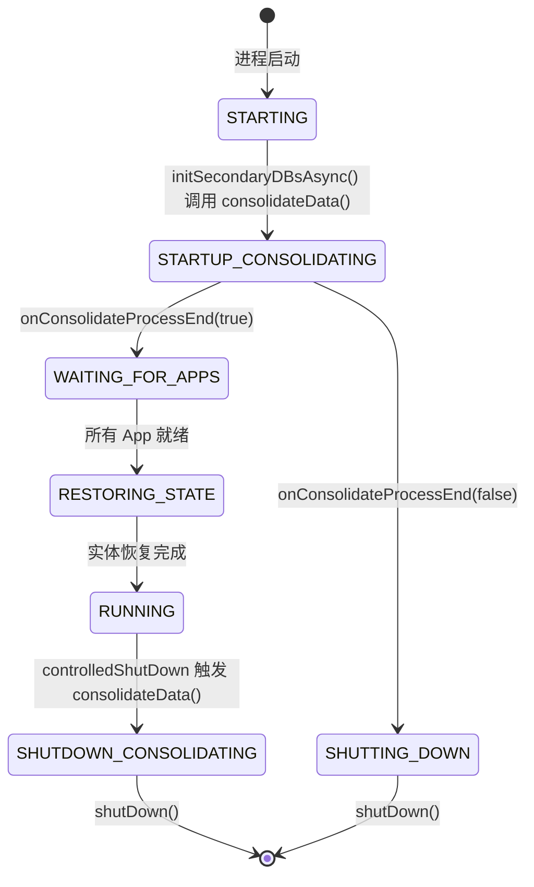
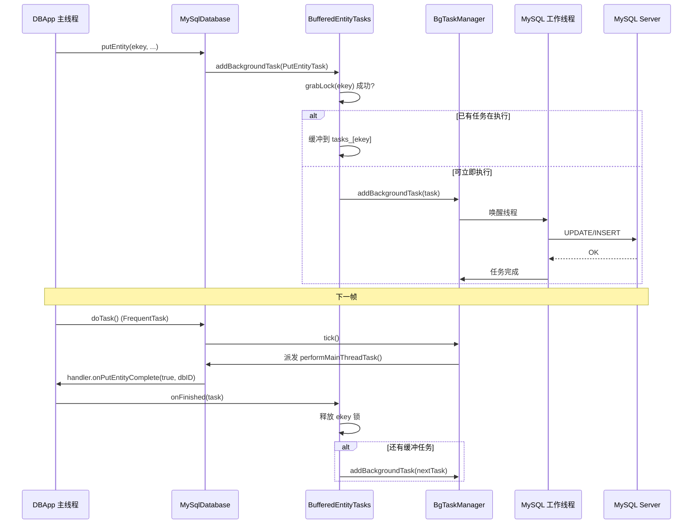
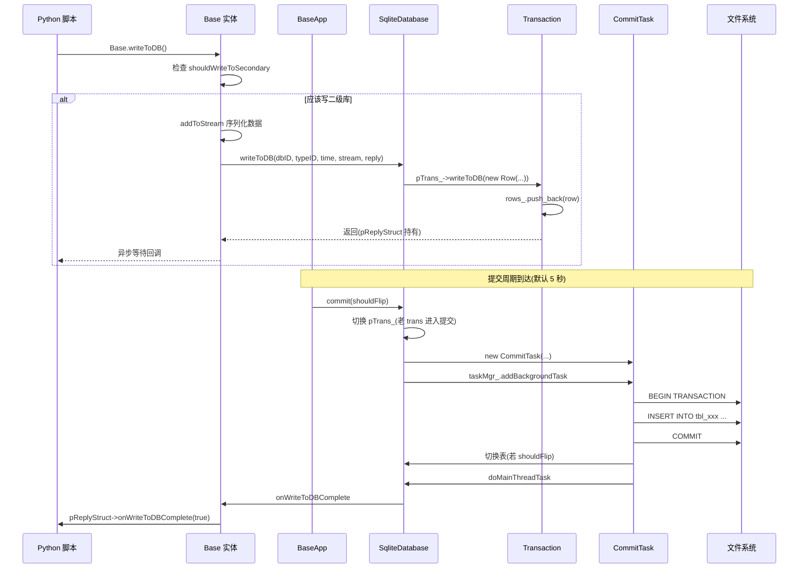
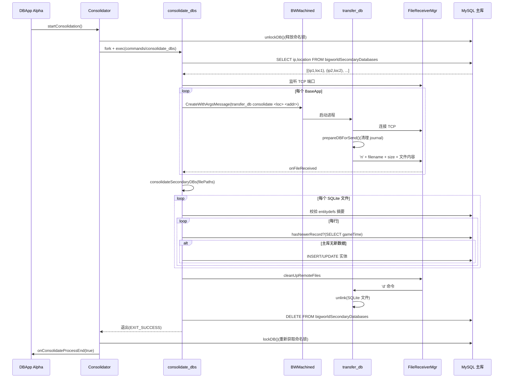
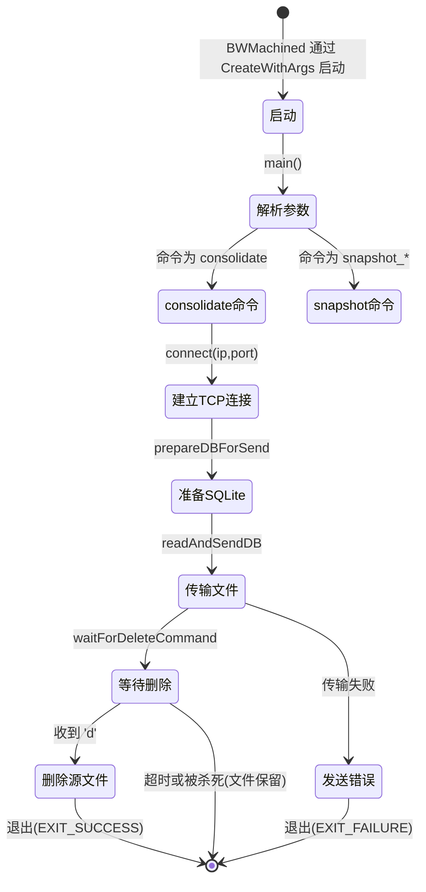
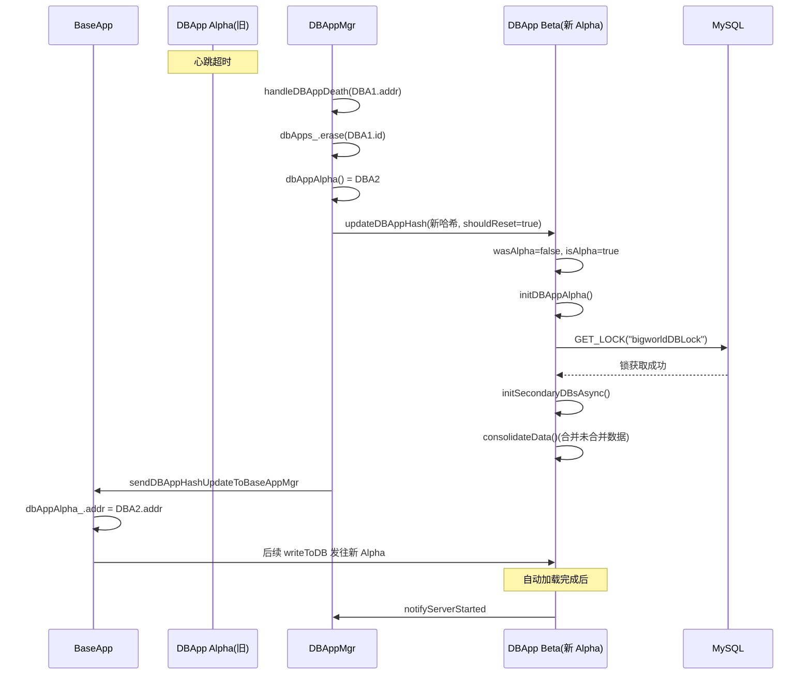
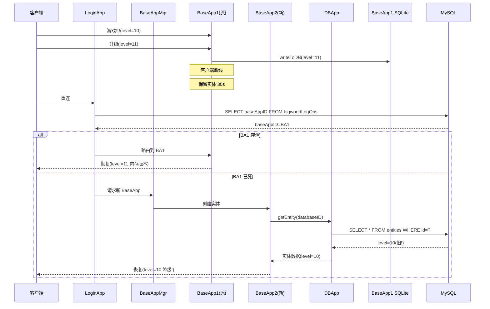
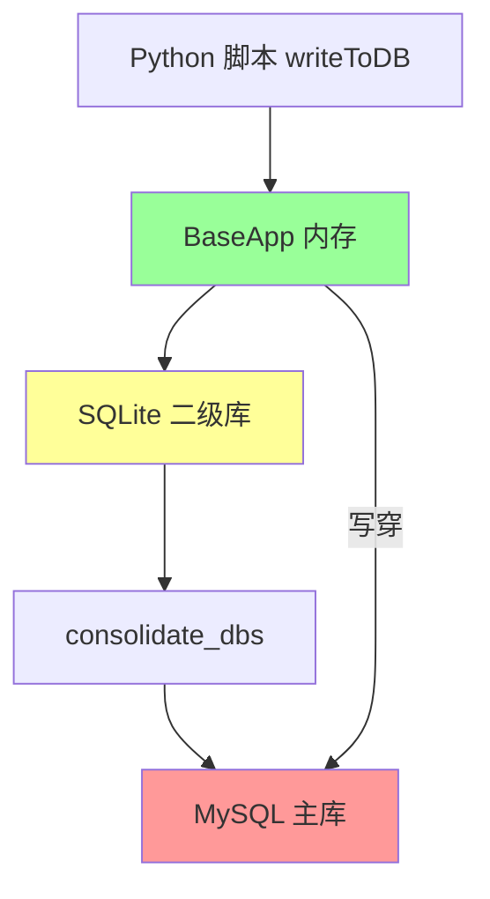
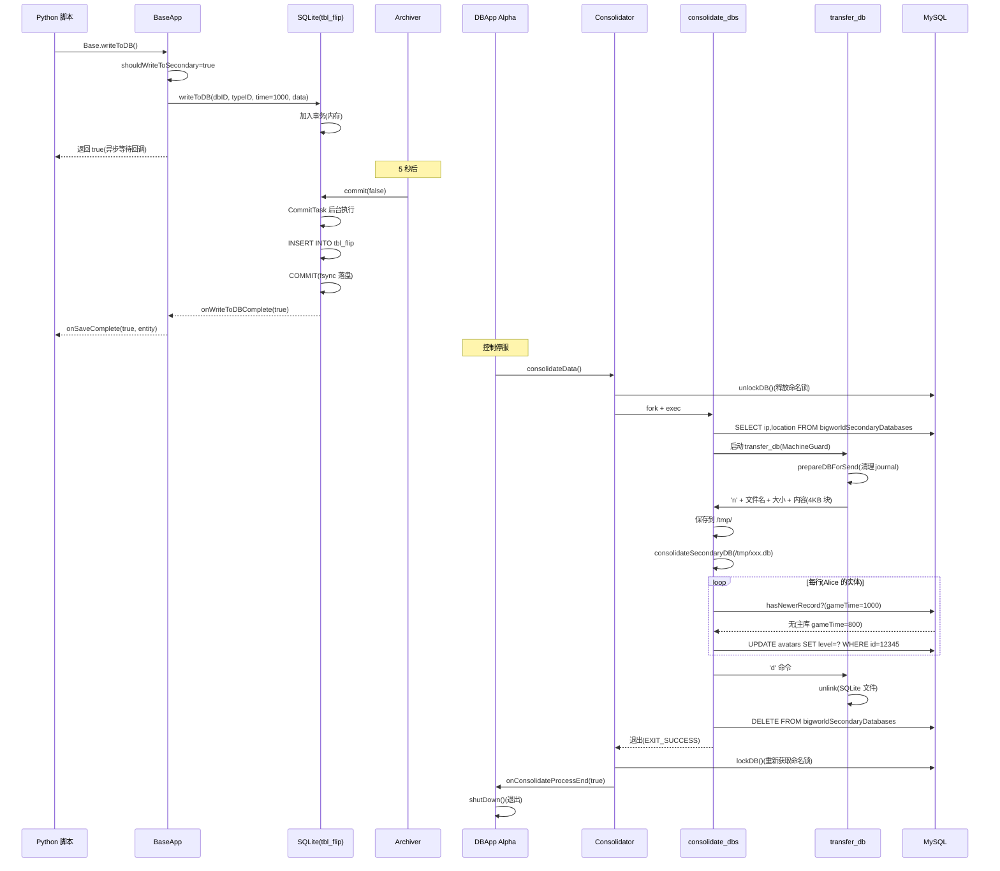
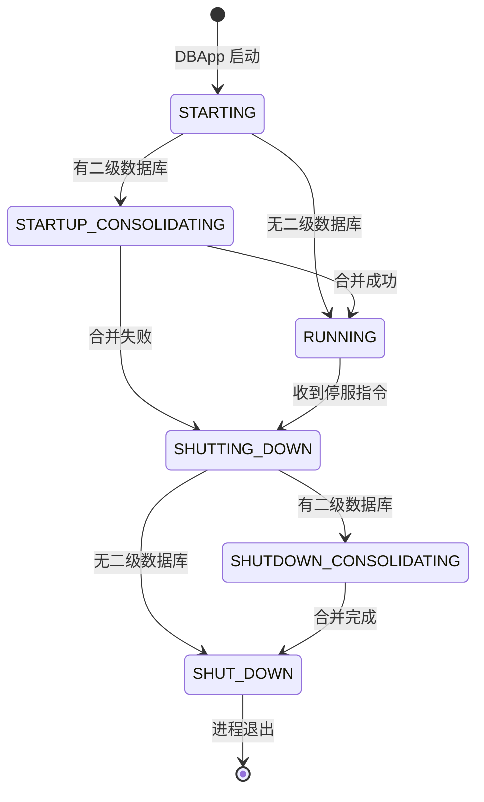

# 专题 25:DBApp 二级数据库与 consolidate 深度剖析

> 持久化(Persistence)是 MMOG 引擎区别于普通实时游戏的核心能力之一。BigWorld 14.4.1 在服务端以 **DBAppMgr / DBApp / IDatabase** 三层架构承载整个集群的实体持久化职责,并创造性地引入 **二级数据库(Secondary Database)** 机制:每个 BaseApp 进程在本地维护一个 SQLite 数据库作为写回缓存,在控制停服或灾难发生时通过 **consolidate_dbs / transfer_db** 工具将各 BaseApp 上的二级数据库合并(consolidate)到主 MySQL 数据库,实现"近实时归档 + 周期合并"的二级持久化模型。本专题以百科级深度剖析这套体系,涵盖 DBApp 完整初始化流程、IDatabase 抽象、MySQL 后端、SQLite 二级数据库、EntityKey 分配、Rendezvous 哈希分片、写穿/写回策略、consolidate_dbs 工具、transfer_db 工具、故障切换、断线重连、数据一致性保证、性能分析、设计权衡等内容,所有源码引用均使用绝对路径以便跳转。

---

## 目录

- [一、引言:BigWorld 持久化设计哲学](#一引言bigworld-持久化设计哲学)
- [二、整体架构:DBAppMgr/DBApp/IDatabase/Worker](#二整体架构dbappmgrdbappidatabaseworker)
- [三、IDatabase 抽象接口深度剖析](#三idatabase-抽象接口深度剖析)
- [四、MySQL 后端实现深度剖析](#四mysql-后端实现深度剖析)
- [五、XML 后端实现(对照参考)](#五xml-后端实现对照参考)
- [六、后台工作线程模型(BgTaskManager + FrequentTask)](#六后台工作线程模型bgtaskmanager--frequenttask)
- [七、EntityKey 分配机制](#七entitykey-分配机制)
- [八、二级数据库分片策略](#八二级数据库分片策略)
- [九、主从同步:写穿/写回策略](#九主从同步写穿写回策略)
- [十、自动加载:BaseApp 重启后数据恢复](#十自动加载baseapp-重启后数据恢复)
- [十一、快照机制:数据库定期快照](#十一快照机制数据库定期快照)
- [十二、consolidate_dbs 工具:多数据库合并](#十二consolidate_dbs-工具多数据库合并)
- [十三、transfer_db 工具:数据库迁移](#十三transfer_db-工具数据库迁移)
- [十四、故障切换:主 DBApp 故障处理](#十四故障切换主-dbapp-故障处理)
- [十五、断线重连数据持久化](#十五断线重连数据持久化)
- [十六、数据一致性保证](#十六数据一致性保证)
- [十七、性能分析:吞吐、延迟、并发](#十七性能分析吞吐延迟并发)
- [十八、设计权衡与替代方案](#十八设计权衡与替代方案)
- [十九、局限性与改进方向](#十九局限性与改进方向)
- [二十、完整实例:一次玩家数据保存的端到端追踪](#二十完整实例一次玩家数据保存的端到端追踪)
- [附录 A:核心数据结构代码全解](#附录-a核心数据结构代码全解)
- [附录 B:配置参数与调优](#附录-b配置参数与调优)
- [附录 C:常见数据库问题排查](#附录-c常见数据库问题排查)
- [附录 D:关键文件路径速查](#附录-d关键文件路径速查)
- [附录 E:术语表](#附录-e术语表)
- [总结](#总结)

---

## 一、引言:BigWorld 持久化设计哲学

### 1.1 MMOG 持久化的核心矛盾

大型多人在线游戏(MMOG)的持久化系统面临着一系列相互冲突的需求,这种矛盾在普通 Web 服务中并不突出:

| 维度 | 普通 Web 服务 | MMOG(BigWorld) |
|------|--------------|------------------|
| 写入吞吐 | 高但批量,可缓冲 | 数千玩家持续产生写入,难以批量 |
| 读取模式 | 大多随机读,有缓存 | 登录时集中读,运行时稀少 |
| 数据规模 | GB-TB 级 | 玩家数据可达 TB 级,且需频繁更新 |
| 延迟容忍 | 100ms-秒级 | 必须在单 tick(<200ms)内完成 |
| 故障容忍 | 一次性失败可重试 | 单玩家保存失败可能导致数据回档 |
| 一致性 | 强一致可阻塞 | 最终一致即可,玩家无感 |
| 跨机分布 | 水平分片简单 | 需考虑实体关联、空间归属、登录路由 |
| 离线处理 | 离线任务可暂停 | 玩家离线仍需归档状态 |

BigWorld 引擎的设计哲学可以归纳为 **"分层解耦 + 最终一致 + 故障可恢复"**:

1. **分层解耦**:把"实体存什么"(EntityDef)与"实体存哪里"(IDatabase)解耦,使上层逻辑不感知后端是 MySQL 还是 XML。
2. **就近缓存**:BaseApp 本地维护 SQLite 二级数据库,玩家写入先落本地盘,再周期性合并到主 MySQL,降低网络往返与主库压力。
3. **最终一致**:玩家在线期间的数据保存延迟到控制停服或灾难切换时才合并到主库,避免在线写入对主库的实时冲击。
4. **故障可恢复**:BaseApp 崩溃由 BaseAppMgr 重启,数据从二级数据库恢复;DBApp 崩溃由 DBAppMgr 推选新 Alpha,从主库重新加载。

### 1.2 二级数据库的诞生动机

如果不引入二级数据库,玩家每次保存都必须穿过 BaseApp → DBApp → MySQL 的完整链路,这会带来:

1. **网络放大效应**:每次 `writeEntity` 都需经过两跳网络,大量小数据包压垮 DBApp。
2. **MySQL 主库压力**:数千玩家 × 每秒数次保存 = 数万 QPS,主库难以承受。
3. **延迟敏感**:DBApp 处理等待 MySQL 写入完成,BaseApp tick 阻塞。
4. **故障窗口**:DBApp 重启或 MySQL 短暂不可用时,所有玩家保存全部失败。

二级数据库通过以下方式缓解:

- **写回(Write-Behind)**:BaseApp 把写入缓存在本地 SQLite,立即返回,主库延后更新。
- **双缓冲**:SQLite 内部维护 `tbl_flip` / `tbl_flop` 两张表交替写入,避免读写冲突。
- **批量合并**:控制停服时由 `consolidate_dbs` 工具一次性把所有二级数据库合并到主库。
- **故障兜底**:即使 DBApp 短暂不可用,BaseApp 仍能正常保存到二级数据库。

### 1.3 与其他引擎的对比

| 引擎 | 持久化模型 | 二级缓存 | 合并机制 |
|------|-----------|---------|---------|
| BigWorld 14.4.1 | MySQL + SQLite 二级 | 是 | consolidate_dbs + transfer_db |
| 早期 BigWorld(<2.x) | 单一 XML/MySQL | 否 | 直接写主库 |
| Unity / Unreal 服务端 | 通常外接 Redis + DB | 视项目而定 | 项目自实现 |
| Java MMOG(如 JBoss) | RDBMS + ORM | 否 | 直接写主库 |
| Kafka-style 事件溯源 | WAL + 物化视图 | 是 | 重放日志 |

BigWorld 的二级数据库机制本质上是 **"近实时归档 + 周期合并"** 的混合模型,介于"直接写主库"与"事件溯源"之间,适合玩家密集、写入频繁、可容忍短时数据丢失(控制在 maxCommitPeriod 内)的场景。

### 1.4 14.4.1 版本的特殊背景

BigWorld 14.4.1 是 Wargaming 开源的最后一个公开版本(2017 年),其源码中大量出现 `TODO: Scalable DB` 注释,表明团队当时正在推进 **多 DBApp 分片(Multi-DBApp Sharding)** 工作,意图把 MySQL 主库按 entity key 分片到多个 DBApp 上。本专题会同时覆盖已实现的部分(MySQL 单主、二级数据库、合并工具)与设计中但未完成的部分(Rendezvous 哈希分片、多 DBApp 写穿),以便读者完整理解 14.4.1 的真实状态。

引用:[dbapp.hpp](file:///j:/Work/BigWorld-Engine-14.4.1/programming/bigworld/server/dbapp/dbapp.hpp) 中的 `// TODO: Scalable DB` 注释明确印证了这一状态。

---

## 二、整体架构:DBAppMgr/DBApp/IDatabase/Worker

### 2.1 三层架构总览

BigWorld 持久化层在服务端采用 **管理器-工作者-存储引擎** 三层架构:

```
        ┌──────────────────────────────────────────────────┐
        │                 DBAppMgr (单例)                 │
        │  - 管理 DBApp 集合 (Rendezvous 哈希)            │
        │  - 分配 DBAppID                                  │
        │  - 推选 DBApp Alpha                              │
        │  - 故障切换                                      │
        └──────────────────────────────────────────────────┘
                              │ Mercury 通道
                              ▼
   ┌────────────────────┬────────────────────┬────────────────────┐
   │     DBApp Alpha    │   DBApp Beta #2    │   DBApp Beta #N    │
   │  - 持有 MySQL 锁   │  - 无锁            │  - 无锁            │
   │  - 启动合并        │  - 等待指令        │  - 等待指令        │
   │  - 分配 DBID       │                    │                    │
   │  - BaseAppMgr 通信 │                    │                    │
   └─────────┬──────────┴────────────────────┴────────────────────┘
             │ IDatabase 抽象接口
             ▼
   ┌──────────────────────────────────────────────────────────────┐
   │                IDatabase (抽象基类)                          │
   │  - getEntity / putEntity / delEntity                         │
   │  - addSecondaryDB / updateSecondaryDBs / consolidate        │
   │  - lockDB / unlockDB                                         │
   └──────────┬───────────────────────────────────┬──────────────┘
              │                                   │
              ▼                                   ▼
   ┌────────────────────────┐         ┌─────────────────────────┐
   │   MySqlDatabase        │         │   XMLDatabase           │
   │  - MySQL 连接池        │         │  - 单 XML 文件存储      │
   │  - 后台任务线程         │         │  - 不支持多 DBApp       │
   │  - 支持二级数据库合并  │         │  - 不支持二级数据库     │
   └────────────────────────┘         └─────────────────────────┘
              ▲
              │ BgTaskManager (5 个默认后台线程)
              │
   ┌──────────────────────────────────────────────────────────────┐
   │              MySQL Server (主数据库)                         │
   │  - bigworldLogOns / bigworldNewID / bigworldGameTime        │
   │  - bigworldSecondaryDatabases / bigworldEntityDefsChecksum  │
   │  - 每种实体类型一张表 (e.g. tbl_Account)                     │
   └──────────────────────────────────────────────────────────────┘
```

### 2.2 DBAppMgr:管理者

`DBAppMgr` 是整个持久化体系的"指挥官",作为单例进程运行,职责包括:

1. **DBApp 注册与编号**:每个 DBApp 启动后向 DBAppMgr 注册,获得唯一的 `DBAppID`。
2. **Alpha 推选**:`dbAppAlpha()` 返回当前 Alpha(数据库主),即 ID 最小的 DBApp。
3. **哈希分发**:任何 DBApp 集合变更后,把 `DBApps` 哈希表序列化后下发给所有 DBApp、BaseAppMgr、CellAppMgr、LoginApp。
4. **故障切换**:DBApp 死亡时从 `dbApps_` 中移除,如死亡的是 Alpha 则推选新 Alpha 并广播。
5. **LoginApp 收集**:启动期收集 LoginApp 列表,通知它们 Alpha 地址。

源码位置:[dbappmgr.hpp](file:///j:/Work/BigWorld-Engine-14.4.1/programming/bigworld/server/dbappmgr/dbappmgr.hpp) 与 [dbappmgr.cpp](file:///j:/Work/BigWorld-Engine-14.4.1/programming/bigworld/server/dbappmgr/dbappmgr.cpp)。

DBAppMgr 的核心数据结构是 `DBApps`,定义为 `DBHashSchemes::DBAppIDBuckets< DBAppPtr >::HashScheme`,即基于 `DBAppID → DBAppPtr` 的 Rendezvous 哈希表:

```cpp
// dbappmgr.hpp 第 142-145 行
typedef DBHashSchemes::DBAppIDBuckets< DBAppPtr >::HashScheme DBApps;
DBApps          dbApps_;
typedef BW::map< Mercury::Address, DBAppPtr > AddressMap;
AddressMap      addressMap_;
```

`dbApps_` 是哈希表本体,`addressMap_` 是地址到 DBAppPtr 的索引,便于通过消息源地址反查。

### 2.3 DBApp:工作者

`DBApp` 是真正执行数据库操作的进程,继承自 `ScriptApp`、`TimerHandler`、`Singleton<DBApp>`:

```cpp
// dbapp.hpp 第 57-62 行
class DBApp : public ScriptApp,
    public TimerHandler,
    public IDatabase::IGetBaseAppMgrInitDataHandler,
    public IDatabase::IUpdateSecondaryDBshandler,
    public Singleton< DBApp >
```

DBApp 关键成员:

| 成员 | 类型 | 作用 |
|------|------|------|
| `id_` | `DBAppID` | DBAppMgr 分配的唯一 ID |
| `dbApps_` | `DBAppsGateway` | 所有 DBApp 的网关,可按 dbID 哈希查找 |
| `pDatabase_` | `IDatabase*` | 数据库引擎抽象,通常为 MySqlDatabase |
| `pBillingSystem_` | `BillingSystem*` | 计费系统抽象 |
| `dbAppMgr_` | `DBAppMgrGateway` | 到 DBAppMgr 的通道 |
| `baseAppMgr_` | `BaseAppMgr` (=ChannelOwner) | 到 BaseAppMgr 的通道 |
| `status_` | `DBStatus` | 当前状态机 |
| `secondaryDBPrefix_` | `BW::string` | 二级数据库文件名前缀 |
| `secondaryDBIndex_` | `uint` | 二级数据库文件序号 |
| `pConsolidator_` | `auto_ptr<Consolidator>` | 合并子进程包装器 |
| `initState_` | `uint16` | 初始化阶段标志位 |

源码位置:[dbapp.hpp](file:///j:/Work/BigWorld-Engine-14.4.1/programming/bigworld/server/dbapp/dbapp.hpp)。

### 2.4 IDatabase:存储抽象

`IDatabase` 是数据库引擎的统一抽象,允许上层切换 MySQL、XML 或其他后端。关键接口包括:

- `startup` / `shutDown`:引擎生命周期
- `getEntity` / `putEntity` / `delEntity`:实体 CRUD
- `lookUpEntities`:按属性查询
- `executeRawCommand`:执行原始 SQL
- `addSecondaryDB` / `updateSecondaryDBs` / `getSecondaryDBs`:二级数据库管理
- `shouldConsolidate` / `lockDB` / `unlockDB`:合并与锁

源码位置:[idatabase.hpp](file:///j:/Work/BigWorld-Engine-14.4.1/programming/bigworld/lib/db_storage/idatabase.hpp)。

### 2.5 Worker:后台工作线程

BigWorld 没有独立的"Worker Thread 类"用在 DBApp 中,而是通过 `BgTaskManager` + `FrequentTask` 的组合实现后台执行:

- `MySqlDatabase` 继承自 `Mercury::FrequentTask`,每帧调用 `doTask()` 推动 `bgTaskManager_.tick()`。
- `BgTaskManager` 持有 N 个工作线程(默认 5),每个线程通过 `MySqlThreadData` 持有独立的 MySQL 连接。
- 数据库操作被封装为 `MySqlBackgroundTask` 子类(如 `PutEntityTask`、`GetEntityTask`),由 `BufferedEntityTasks` 排队后交给 `BgTaskManager`。

源码位置:[mysql_database.hpp](file:///j:/Work/BigWorld-Engine-14.4.1/programming/bigworld/lib/db_storage_mysql/mysql_database.hpp) 与 [thread_data.hpp](file:///j:/Work/BigWorld-Engine-14.4.1/programming/bigworld/lib/db_storage_mysql/thread_data.hpp)。

### 2.6 进程拓扑

生产环境典型拓扑:

```
                +-----------+
                | DBAppMgr  | (1 实例,可选举冗余)
                +-----+-----+
                      |
        +-------------+-------------+-----------+
        |             |             |           |
   +----v---+    +----v---+    +----v---+    +--v----+
   | DBApp1 |    | DBApp2 |    | DBApp3 |    | DBAppN| (DBApp Alpha = ID 最小)
   | Alpha  |    |  Beta  |    |  Beta  |    | Beta  |
   +--+-+---+    +--------+    +--------+    +-------+
      | |
      | +----> MySQL Server (主库,共享)
      |
      +----> BaseAppMgr / CellAppMgr / LoginApp (经 Mercury)
              |
              | BaseAppMgr 下发 DBAppHash
              v
   +----------+----------+----------+
   |          |          |          |
+--v---+  +--v---+  +--v---+  +--v---+
|Base1 |  |Base2 |  |Base3 |  |BaseN |  (每个 BaseApp 持有一个 SQLite 二级库)
+--+---+  +--+---+  +--+---+  +--+---+
   |        |        |        |
   +--------+--------+--------+----> 各 BaseApp 写入先落本地 SQLite
```

### 2.7 状态机:DBStatus

DBApp 自身维护一个状态机,贯穿启动、合并、运行、停服全过程:

```cpp
// db_status.hpp 第 18-27 行
enum Status
{
    STARTING,                // 启动中
    STARTUP_CONSOLIDATING,   // 启动期合并
    WAITING_FOR_APPS,        // 等待其他 App 就绪
    RESTORING_STATE,         // 恢复实体/空间
    RUNNING,                // 运行中
    SHUTTING_DOWN,           // 停服中
    SHUTDOWN_CONSOLIDATING   // 停服期合并
};
```

状态转移图:



注意:合并(consolidating)在启动与停服都会发生。启动合并是把上次停服遗留的二级库合并到主库;停服合并是把本次运行期间产生的二级库合并到主库。

---

## 三、IDatabase 抽象接口深度剖析

### 3.1 设计意图

`IDatabase` 是 BigWorld 持久化层的核心抽象,其设计意图:

1. **后端无关**:DBApp 不感知底层是 MySQL、XML 还是其他。
2. **同步/异步兼容**:接口允许实现同步或异步完成,通过回调通知。
3. **回调式 API**:大部分方法接受一个 handler 引用,完成后回调,避免阻塞调用线程。
4. **二级数据库可选**:通过 `shouldConsolidate()` 让实现声明是否支持二级数据库。

### 3.2 接口分类

`IDatabase` 的接口可分为七大类:

#### 3.2.1 生命周期接口

```cpp
// idatabase.hpp 第 60-83 行
virtual bool startup( const EntityDefs& entityDefs,
        Mercury::EventDispatcher & dispatcher, int numRetries ) = 0;
virtual bool resetGameServerState() { return true; }
virtual bool shutDown() = 0;
virtual BillingSystem * createBillingSystem() = 0;
virtual bool supportsMultipleDBApps() const { return true; }
```

- `startup`:加载 entityDefs、连接数据库、启动后台线程。
- `resetGameServerState`:每次服务器运行开始时调用一次,重置 ID 表、game time 等。
- `supportsMultipleDBApps`:XML 返回 `false`,MySQL 返回 `true`(默认)。

#### 3.2.2 实体 CRUD 接口

```cpp
// idatabase.hpp 第 87-258 行(节选)
virtual void getEntity( const EntityDBKey & entityKey,
        BinaryOStream * pStream,
        bool shouldGetBaseEntityLocation,
        IGetEntityHandler & handler ) = 0;

virtual void getDatabaseIDFromName( const EntityDBKey & entityKey,
        IGetDbIDHandler & handler ) = 0;

virtual void lookUpEntities( EntityTypeID entityTypeID,
        const LookUpEntitiesCriteria & criteria,
        ILookUpEntitiesHandler & handler ) = 0;

virtual void putEntity( const EntityKey & entityKey,
        EntityID entityID,
        BinaryIStream * pStream,
        const EntityMailBoxRef * pBaseMailbox,
        bool removeBaseMailbox,
        bool putExplicitID,
        UpdateAutoLoad updateAutoLoad,
        IPutEntityHandler & handler ) = 0;

virtual void delEntity( const EntityDBKey & ekey,
        EntityID entityID,
        IDelEntityHandler& handler ) = 0;
```

每个 CRUD 方法都通过回调接口通知完成:

- `IGetEntityHandler::onGetEntityComplete(bool isOK, ...)`
- `IGetDbIDHandler::onGetDbIDComplete(bool isOK, ...)`
- `IPutEntityHandler::onPutEntityComplete(bool isOK, DatabaseID dbID)`
- `IDelEntityHandler::onDelEntityComplete(bool isOK)`

这种回调式设计让实现可以选择:

- **同步完成**:在方法返回前直接调用 handler(如 XMLDatabase)。
- **异步完成**:把任务投递到后台线程,稍后在主线程回调(如 MySqlDatabase)。

#### 3.2.3 命令与 ID 接口

```cpp
virtual void executeRawCommand( const BW::string & command,
    IExecuteRawCommandHandler& handler ) = 0;
virtual void putIDs( int count, const EntityID * ids ) = 0;
virtual void getIDs( int count, IGetIDsHandler& handler ) = 0;
```

- `executeRawCommand`:执行任意 SQL(管理员用)。
- `putIDs` / `getIDs`:回收 / 申请 EntityID,维护 `bigworldUsedIDs` 表。

#### 3.2.4 空间数据接口

```cpp
virtual void writeSpaceData( BinaryIStream& spaceData ) = 0;
virtual bool getSpacesData( BinaryOStream& strm ) = 0;
```

空间数据(空间 ID、几何信息、加载状态)持久化到 `bigworldSpaceData` 表,BaseAppMgr 启动时从此恢复。

#### 3.2.5 自动加载接口

```cpp
virtual void autoLoadEntities( IEntityAutoLoader & autoLoader ) = 0;
```

读取 `bigworldLogOns` 表中标记为 auto-load 的实体,通知 `IEntityAutoLoader` 把它们重新加载到 BaseApp。

#### 3.2.6 邮箱重映射接口

```cpp
virtual void remapEntityMailboxes( const Mercury::Address& srcAddr,
        const BackupHash & destAddrs ) = 0;
```

当 BaseApp 死亡时,把数据库中所有指向该 BaseApp 的邮箱重映射到其备份 BaseApp,实现故障切换。

#### 3.2.7 二级数据库接口

```cpp
// idatabase.hpp 第 370-468 行
virtual bool shouldConsolidate() const = 0;
virtual void shouldConsolidate( bool shouldConsolidate ) = 0;

class SecondaryDBEntry
{
public:
    Mercury::Address   addr;       // BaseApp 的地址
    BW::string         location;   // 二级数据库文件路径
};

virtual void addSecondaryDB( const SecondaryDBEntry& entry ) = 0;

class IUpdateSecondaryDBshandler { ... };
virtual void updateSecondaryDBs( const SecondaryDBAddrs& addrs,
        IUpdateSecondaryDBshandler& handler ) = 0;

class IGetSecondaryDBsHandler { ... };
virtual void getSecondaryDBs( IGetSecondaryDBsHandler& handler ) = 0;
virtual uint32 numSecondaryDBs() = 0;
virtual int clearSecondaryDBs() = 0;
```

这是本专题的核心接口集合,贯穿二级数据库的注册、查询、更新、清除等所有操作。

#### 3.2.8 锁接口

```cpp
virtual bool lockDB() = 0;
virtual bool unlockDB() = 0;
```

DBApp Alpha 通过 `lockDB()` 获取对 MySQL 数据库的独占访问权,防止其他进程(如 consolidate_dbs、sync_db)同时操作。

### 3.3 回调式 API 的设计权衡

回调式 API 的优点:

- **解耦调用与执行**:DBApp 主线程不阻塞,数据库线程完成后异步通知。
- **可插拔实现**:同一接口可由同步(XML)或异步(MySQL)实现。
- **可组合**:多个任务可在同一工作线程上排队执行。

回调式 API 的缺点:

- **生命周期复杂**:handler 必须保证在回调发生时仍然有效,容易引发悬挂指针。
- **错误传播困难**:错误码需通过回调参数层层传递,容易丢失。
- **调试不直观**:调用栈被切断,无法直接看到完整流程。

BigWorld 通过 `SmartPointer` 引用计数管理 handler 生命周期,通过 `BufferedEntityTasks` 保证同实体操作串行化,缓解上述问题。

### 3.4 IDatabase 在 DBApp 中的位置

DBApp 通过 `getIDatabase()` 访问 `IDatabase` 实例,大部分 `IDatabase` 方法都被 DBApp 包装为同名方法,便于插入额外逻辑:

```cpp
// dbapp.hpp 第 232-263 行
void getEntity( const EntityDBKey & entityKey,
        BinaryOStream * pStream,
        bool shouldGetBaseEntityLocation,
        GetEntityHandler & handler );

void putEntity( const EntityKey & ekey,
        EntityID entityID,
        BinaryIStream * pStream,
        EntityMailBoxRef * pBaseMailbox,
        bool removeBaseMailbox,
        bool putExplicitID,
        UpdateAutoLoad updateAutoLoad,
        IDatabase::IPutEntityHandler& handler );

void setBaseEntityLocation( const EntityKey & entityKey,
        EntityMailBoxRef & mailbox,
        IDatabase::IPutEntityHandler & handler,
        UpdateAutoLoad updateAutoLoad = UPDATE_AUTO_LOAD_RETAIN )
{
    this->putEntity( entityKey, mailbox.id, NULL, &mailbox,
        false, false, updateAutoLoad, handler );
}

void clearBaseEntityLocation( const EntityKey & entityKey,
        IDatabase::IPutEntityHandler & handler )
{
    this->putEntity( entityKey, 0, NULL, NULL, true, false,
        UPDATE_AUTO_LOAD_RETAIN, handler );
}
```

可以看到 `setBaseEntityLocation` 和 `clearBaseEntityLocation` 都是 `putEntity` 的特化,通过参数控制是写入数据、更新邮箱还是清除邮箱。

---

## 四、MySQL 后端实现深度剖析

### 4.1 MySqlDatabase 类概览

`MySqlDatabase` 是 `IDatabase` 的 MySQL 实现,也是生产环境唯一推荐后端。它同时继承自 `Mercury::FrequentTask`,每帧被 dispatcher 调用一次以驱动后台任务管理器:

```cpp
// mysql_database.hpp 第 41-149 行
class MySqlDatabase : public IDatabase,
    public Mercury::FrequentTask
{
public:
    MySqlDatabase( Mercury::NetworkInterface & interface,
        Mercury::EventDispatcher & dispatcher );
    virtual ~MySqlDatabase();

    virtual bool startup( const EntityDefs&,
                Mercury::EventDispatcher & dispatcher,
                int numRetries );
    virtual bool resetGameServerState();
    virtual bool shutDown();
    // ... 大量 IDatabase 覆盖 ...

    virtual void doTask();  // FrequentTask 覆盖

private:
    bool syncTablesToDefs() const;
    void startBackgroundThreads(
        const DBConfig::ConnectionInfo & connectionInfo );

    TaskManager bgTaskManager_;             // 后台任务管理器
    int numConnections_;                    // 工作线程数
    bool shouldConsolidate_;                // 是否启用合并
    TimerHandle  reconnectTimerHandle_;      // 重连定时器
    size_t reconnectCount_;
    BufferedEntityTasks * pBufferedEntityTasks_;  // 实体任务缓冲
    Mercury::NetworkInterface & interface_;
    Mercury::EventDispatcher & dispatcher_;
    const EntityDefs * pEntityDefs_;
    EntityTypeMappings entityTypeMappings_;  // 实体类型映射
    MySqlLockedConnection * pConnection_;    // 主连接(带锁)
};
```

### 4.2 启动流程:startup

`startup` 完成以下步骤:

1. **保存 entityDefs**:供后续映射查询。
2. **建立主连接**:`MySqlLockedConnection` 创建并连接 MySQL(默认不加锁,因为多 DBApp 时无法独占)。
3. **检查存储引擎**:确认所有表使用 InnoDB(`checkTableEngines`),否则报错。
4. **同步表结构**:如果 `syncTablesToDefs=true`,运行 `sync_db` 子进程同步表结构与 EntityDef。
5. **启动后台线程**:`startBackgroundThreads` 创建 N 个 MySQL 工作线程(默认 5)。
6. **初始化映射**:`entityTypeMappings_.init(entityDefs, connection)` 为每种实体类型构建 `EntityTypeMapping`。

源码:[mysql_database.cpp](file:///j:/Work/BigWorld-Engine-14.4.1/programming/bigworld/lib/db_storage_mysql/mysql_database.cpp) 第 112-188 行。

```cpp
// mysql_database.cpp 第 112-188 行(节选)
bool MySqlDatabase::startup( const EntityDefs & entityDefs,
        Mercury::EventDispatcher & dispatcher,
        int numRetries )
{
    pEntityDefs_ = &entityDefs;
    const DBConfig::ConnectionInfo & info = DBConfig::connectionInfo();
    // ...
    pConnection_ = new MySqlLockedConnection( connectionInfo );
    if (!pConnection_->connect( /*shouldLock*/ false ))
    {
        return false;
    }
    MySql & connection = *(pConnection_->connection());
    if (!connection.checkTableEngines())
    {
        ERROR_MSG( "MySqlDatabase::startup: One or more tables are not "
                "using the %s engine type\n", MYSQL_ENGINE_TYPE );
        return false;
    }
    // ...
    numConnections_ = config.mysql.numConnections();
    this->startBackgroundThreads( connectionInfo );
    entityTypeMappings_.init( entityDefs, connection );
    return true;
}
```

### 4.3 后台线程模型

`MySqlDatabase` 通过 `BgTaskManager` 维护后台工作线程:

```cpp
// mysql_database.cpp 第 191-199 行
void MySqlDatabase::startBackgroundThreads(
        const DBConfig::ConnectionInfo & connectionInfo )
{
    for (int i = 0; i < numConnections_; ++i)
    {
        bgTaskManager_.startThreads( "MySQL", 1,
                new MySqlThreadData( connectionInfo ) );
    }
}
```

每个工作线程通过 `MySqlThreadData` 持有独立的 MySQL 连接,在线程启动时(`onStart`)建立,结束时(`onEnd`)关闭:

```cpp
// thread_data.cpp 第 33-49 行
bool MySqlThreadData::onStart( BackgroundTaskThread & thread )
{
    mysql_thread_init();
    try
    {
        pConnection_ = new MySql( connectionInfo_ );
    }
    catch ( std::exception& e )
    {
        ERROR_MSG( "MySqlThreadData::onStart: "
                "Failed to set up a mysql connection\n" );
        return false;
    }
    return true;
}
```

每帧 `MySqlDatabase::doTask()` 调用 `bgTaskManager_.tick()`,处理已完成任务的回调:

```cpp
// mysql_database.cpp 第 225-228 行
void MySqlDatabase::doTask()
{
    bgTaskManager_.tick();
}
```

### 4.4 任务封装:MySqlBackgroundTask

所有 MySQL 操作被封装为 `MySqlBackgroundTask` 子类,具有标准的"后台执行 + 主线程回调"两阶段模型:

```cpp
// background_task.hpp 第 13-34 行
class MySqlBackgroundTask : public BackgroundTask
{
public:
    MySqlBackgroundTask( const char * taskName );

    void doBackgroundTask( TaskManager & mgr ) {};
    void doBackgroundTask( TaskManager & mgr,
            BackgroundTaskThread * pThread );

    void doMainThreadTask( TaskManager & mgr );

    void setFailure()       { succeeded_ = false; }

protected:
    virtual void performBackgroundTask( MySql & conn ) = 0;
    virtual void performMainThreadTask( bool succeeded ) = 0;

    virtual void onRetry() {}
    virtual void onException( const DatabaseException & e ) {}

    bool succeeded_;
};
```

- `performBackgroundTask`:在工作线程中执行,传入该线程持有的 `MySql` 连接。
- `performMainThreadTask`:在主线程中执行,用于回调通知 handler。

子类示例 `AddSecondaryDBEntryTask`:

```cpp
// add_secondary_db_entry_task.cpp 第 13-43 行
AddSecondaryDBEntryTask::AddSecondaryDBEntryTask(
            const IDatabase::SecondaryDBEntry & entry ) :
    MySqlBackgroundTask( "AddSecondaryDBEntryTask" ),
    entry_( entry )
{
}

namespace
{
const Query query( "INSERT INTO bigworldSecondaryDatabases "
                    "(ip, port, location) VALUES (?,?,?)" );
}

void AddSecondaryDBEntryTask::performBackgroundTask( MySql & conn )
{
    query.execute( conn, ntohl( entry_.addr.ip ), ntohs( entry_.addr.port ),
            entry_.location, NULL );
}

void AddSecondaryDBEntryTask::performMainThreadTask( bool succeeded )
{
}
```

可以看到,二级数据库条目被持久化到 MySQL 表 `bigworldSecondaryDatabases`,该表是合并工具(`consolidate_dbs`)查询二级数据库位置的依据。

### 4.5 实体任务缓冲:BufferedEntityTasks

由于多个工作线程并发执行实体操作,而同一实体可能被多次写入,必须保证同实体的操作串行化,否则会出现:

- 写入顺序错乱(后写的先到,导致旧数据覆盖新数据)。
- 事务隔离冲突(MySQL 行锁竞争)。
- DBID 分配竞争(多个新实体并发插入)。

`BufferedEntityTasks` 解决此问题,它维护两个映射:

```cpp
// buffered_entity_tasks.hpp 第 22-65 行(节选)
class BufferedEntityTasks
{
public:
    BufferedEntityTasks( TaskManager & bgTaskManager );
    void addBackgroundTask( const EntityTaskPtr & pTask );
    void onFinished( const EntityTaskPtr & pTask );
    // ...

private:
    bool grabLock( const EntityTaskPtr & pTask );
    void buffer( const EntityTaskPtr & pTask );
    void doTask( const EntityTaskPtr & pTask );
    void onFinishedNewEntity( const EntityTaskPtr & pFinishedTask );

    template < class MAP, class ID >
    bool playNextTask( MAP & tasks, ID id );

    TaskManager & bgTaskManager_;

    typedef BW::multimap< EntityKey, EntityTaskPtr > EntityKeyMap;
    typedef BW::multimap< EntityID, EntityIDMap > EntityIDMap;
    EntityKeyMap tasks_;                  // 已知 DBID 的任务队列(按 EntityKey 分组)
    EntityIDMap priorToDBIDTasks_;        // 未知 DBID 的任务队列(按 EntityID 分组)

    typedef BW::map< EntityID, DatabaseID > NewEntityMap;
    NewEntityMap newEntityMap_;           // 新实体的 EntityID → DatabaseID 映射

    bool shouldDelayAdds_;
};
```

逻辑:

1. `addBackgroundTask(pTask)`:
   - 如果任务有 DBID(`grabLock` 成功),直接交给 `bgTaskManager_` 执行。
   - 如果没有 DBID(新实体首次写入),放入 `priorToDBIDTasks_`,等待 DBID 分配后串行执行。
   - 如果同实体已有任务在执行,放入 `tasks_` 缓冲,等待前一个完成后再触发。
2. `onFinished(pTask)`:
   - 释放该实体的锁。
   - 从 `tasks_` 中取出该实体的下一个任务,提交执行。

### 4.6 putEntity 流程详解

`MySqlDatabase::putEntity` 是最复杂的接口之一,涉及数据写入、邮箱更新、自动加载标记、新实体创建等。其核心逻辑被封装为 `PutEntityTask`:

```cpp
// put_entity_task.cpp 第 24-54 行
PutEntityTask::PutEntityTask( const EntityTypeMapping * pEntityTypeMapping,
                                DatabaseID databaseID,
                                EntityID entityID,
                                BinaryIStream * pStream,
                                const EntityMailBoxRef * pBaseMailbox,
                                bool removeBaseMailbox,
                                bool putExplicitID,
                                UpdateAutoLoad updateAutoLoad,
                                IDatabase::IPutEntityHandler & handler,
                                GameTime * pGameTime ) :
    EntityTaskWithID( *pEntityTypeMapping, databaseID, entityID, "PutEntityTask" ),
    writeEntityData_( false ),
    writeBaseMailbox_( false ),
    removeBaseMailbox_( removeBaseMailbox ),
    putExplicitID_( putExplicitID ),
    updateAutoLoad_( updateAutoLoad ),
    handler_( handler ),
    pGameTime_( pGameTime )
{
    if (pStream != NULL)
    {
        stream_.transfer( *pStream, pStream->remainingLength() );
        writeEntityData_ = true;
    }
    if (pBaseMailbox)
    {
        baseMailbox_ = *pBaseMailbox;
        writeBaseMailbox_ = true;
    }
}
```

后台执行逻辑:

```cpp
// put_entity_task.cpp 第 60-130 行(节选)
void PutEntityTask::performBackgroundTask( MySql & conn )
{
    bool definitelyExists = false;
    MF_ASSERT( dbID_ != PENDING_DATABASE_ID );

    if (writeEntityData_)
    {
        if (dbID_ != 0 && !putExplicitID_)
        {
            // 已有实体,执行 UPDATE
            if (!entityTypeMapping_.update( conn, dbID_, stream_, pGameTime_ ))
            {
                ERROR_MSG( "PutEntityTask::performBackgroundTask: "
                    "Failed to update Entity record ..." );
            }
        }
        else
        {
            if (!putExplicitID_)
            {
                // 新实体,执行 INSERT(自增 ID)
                dbID_ = entityTypeMapping_.insertNew( conn, stream_ );
            }
            else
            {
                // 显式指定 DBID(用于 consolidate_dbs)
                dbID_ = entityTypeMapping_.insertExplicit( conn, dbID_, stream_ );
            }
            // ...
        }
        definitelyExists = true;
    }

    if (writeBaseMailbox_)
    {
        // 更新 bigworldLogOns 表中的邮箱记录
        if (definitelyExists ||
            entityTypeMapping_.checkExists( conn, dbID_ ))
        {
            entityTypeMapping_.addLogOnRecord( conn,
                    dbID_, baseMailbox_ );
        }
    }
    else if (removeBaseMailbox_)
    {
        entityTypeMapping_.removeLogOnRecord( conn, dbID_ );
    }
    // ...
}
```

要点:

- **更新分支**:`dbID_ != 0 && !putExplicitID_` → 走 `UPDATE` 路径,基于现有 DBID 更新数据。
- **新实体分支**:`dbID_ == 0` → 走 `insertNew`,由 MySQL 自增分配新 DBID。
- **显式 DBID 分支**:`putExplicitID_ == true` → 走 `insertExplicit`,用于 consolidate_dbs 工具按原 DBID 重建。
- **邮箱更新**:写入 `bigworldLogOns` 表,记录实体的当前 base 邮箱(用于登录时查找)。
- **自动加载标记**:`updateAutoLoad_` 控制是否更新 `bigworldLogOns` 的 auto-load 标志。

### 4.7 二级数据库表

MySQL 主库中专门有一张表 `bigworldSecondaryDatabases` 记录所有已注册的二级数据库:

```sql
-- 隐含的表结构(基于 SQL 推断)
CREATE TABLE bigworldSecondaryDatabases (
    ip       INT UNSIGNED NOT NULL,
    port     SMALLINT UNSIGNED NOT NULL,
    location VARCHAR(255) NOT NULL
);
```

涉及该表的任务:

- `AddSecondaryDBEntryTask`:插入一条新二级库记录。
- `UpdateSecondaryDBsTask`:删除不在 keep 列表中的记录,返回被删除的条目。
- `GetSecondaryDBsTask`:查询所有记录。
- `clearSecondaryDBs`(直接执行):清空整张表。

源码:[add_secondary_db_entry_task.cpp](file:///j:/Work/BigWorld-Engine-14.4.1/programming/bigworld/lib/db_storage_mysql/tasks/add_secondary_db_entry_task.cpp)、[update_secondary_dbs_task.cpp](file:///j:/Work/BigWorld-Engine-14.4.1/programming/bigworld/lib/db_storage_mysql/tasks/update_secondary_dbs_task.cpp)、[get_secondary_dbs_task.cpp](file:///j:/Work/BigWorld-Engine-14.4.1/programming/bigworld/lib/db_storage_mysql/tasks/get_secondary_dbs_task.cpp)。

`UpdateSecondaryDBsTask` 的 SQL 构造逻辑值得注意:

```cpp
// update_secondary_dbs_task.cpp 第 22-46 行
UpdateSecondaryDBsTask::UpdateSecondaryDBsTask( const SecondaryDBAddrs & addrs,
            IDatabase::IUpdateSecondaryDBshandler & handler ) :
    MySqlBackgroundTask( "UpdateSecondaryDBsTask" ),
    handler_( handler ),
    entries_()
{
    if (!addrs.empty())
    {
        BW::stringstream conditionStrm;
        SecondaryDBAddrs::const_iterator iter = addrs.begin();
        conditionStrm << " WHERE ( ip, port ) NOT IN (";
        while (iter != addrs.end())
        {
            if (iter != addrs.begin())
                conditionStrm << ",";
            conditionStrm <<
                "(" << htonl( iter->ip ) << "," << htons( iter->port ) << ")";
            ++iter;
        }
        conditionStrm << ')';
        condition_ = conditionStrm.str();
    }
}
```

即构造一个 `WHERE (ip, port) NOT IN ((ip1,port1),(ip2,port2),...)` 子句,删除所有不在 keep 列表中的二级库记录。这是 BaseApp 死亡时清理其二级库记录的关键路径。

### 4.8 主连接与命名锁

`MySqlLockedConnection` 包装了主连接与命名锁:

```cpp
// locked_connection.hpp 第 20-48 行
class MySqlLockedConnection
{
public:
    MySqlLockedConnection( const DBConfig::ConnectionInfo & connectionInfo );
    virtual ~MySqlLockedConnection();

    bool connect( bool shouldLock );
    bool connectAndLock() { return this->connect( true ); }
    bool connectAndLockWithRetry( uint8 numRetries );

    bool lock();
    bool unlock();

    MySql * connection() { return pConnection_; }

protected:
    virtual MySql * createMysqlWrapper() const;
    DBConfig::ConnectionInfo connectionInfo_;
private:
    MySql * pConnection_;
    MySQL::NamedLock dbLock_;
};
```

`NamedLock` 使用 MySQL 的 `GET_LOCK(?, 0)` 与 `RELEASE_LOCK(?)` 实现跨进程命名锁:

```cpp
// named_lock.cpp 第 30-55 行
bool obtainNamedLock( MySql & connection, const BW::string & lockName )
{
    const Query query( "SELECT GET_LOCK( ?, 0 )" );
    bool wasLockObtained = true;
    try
    {
        ResultSet resultSet;
        query.execute( connection, lockName, &resultSet );
        int result = 0;
        resultSet.getResult( result );
        wasLockObtained = result;
    }
    catch (...)
    {
        wasLockObtained = false;
    }
    return wasLockObtained;
}
```

要点:

- `GET_LOCK(?, 0)`:第 2 参数为 0 表示非阻塞,获取不到立即返回。
- 锁是 **MySQL 服务器级别** 的命名锁,与连接绑定,连接断开自动释放。
- 锁名通常为数据库名,确保同库不被多个 DBApp Alpha 同时操作。

DBApp Alpha 在 `initAcquireDBLock` 阶段调用 `lockDB()` 获取此锁:

```cpp
// dbapp.cpp 第 847-851 行
bool DBApp::initAcquireDBLock()
{
    DEBUG_MSG( "DBApp::initAcquireDBLock\n" );
    return pDatabase_->lockDB();
}
```

合并开始前释放,合并完成后重新获取:

```cpp
// consolidator.cpp 第 167-201 行(节选)
bool Consolidator::startConsolidation()
{
    // ...
    // Release the DBApp lock on the primary DB so that the consolidate_db
    // process can access it.
    dbApp_.getIDatabase().unlockDB();
    return pChildProcess_->startProcessWithPipe( /*shouldPipeStdOut:*/ false,
        /*shouldPipeStdErr:*/ true );
}
```

```cpp
// consolidator.cpp 第 115-126 行(节选)
// Re-acquire lock to DB
while (!dbApp_.getIDatabase().lockDB() &&
        attempt < MAX_ATTEMPTS)
{
    SECONDARYDB_WARNING_MSG( "Consolidator::onChildComplete: "
            "Failed to re-lock database. Retrying (%d/%d).\n",
           ++attempt, MAX_ATTEMPTS );
    sleep( 1 );
}
```

---

## 五、XML 后端实现(对照参考)

### 5.1 XMLDatabase 的角色

`XMLDatabase` 是 BigWorld 提供的轻量后端,主要用于开发测试与小规模部署。它把所有实体数据保存在 XML 文件中,无并发控制,不支持二级数据库:

```cpp
// xml_database.hpp 第 20-34 行
class XMLDatabase : public IDatabase,
                    public TimerHandler
{
public:
    XMLDatabase();
    ~XMLDatabase();

    virtual bool startup( const EntityDefs&,
            Mercury::EventDispatcher & dispatcher,
            int numRetries );
    virtual bool shutDown();
    virtual BillingSystem * createBillingSystem();
    virtual bool supportsMultipleDBApps() const { return false; }
    // ...
    virtual bool shouldConsolidate() const { return false; }
    virtual void shouldConsolidate( bool /*shouldConsolidate*/ ) { }
    // ...
};
```

### 5.2 XML 后端与 MySQL 后端的对比

| 特性 | XMLDatabase | MySqlDatabase |
|------|-------------|---------------|
| 多 DBApp | 不支持 | 支持 |
| 二级数据库 | 不支持 | 支持 |
| 后台线程 | 无 | 多线程 |
| 锁机制 | 无 | MySQL 命名锁 |
| 持久化格式 | XML 文件 | MySQL 表 |
| 同步/异步 | 同步 | 异步(回调式) |
| 性能 | 低,适合小规模 | 高,适合生产 |
| 事务 | 无 | InnoDB 事务 |
| 索引 | 无 | B+ 树索引 |
| 适用场景 | 开发调试 | 生产环境 |

### 5.3 XMLDatabase 的二级数据库空实现

XMLDatabase 对所有二级数据库接口都提供空实现或最简实现:

```cpp
// xml_database.hpp 第 91-99 行
virtual bool shouldConsolidate() const { return false; }
virtual void shouldConsolidate( bool /*shouldConsolidate*/ ) { }
virtual void addSecondaryDB( const SecondaryDBEntry& entry );
virtual void updateSecondaryDBs( const SecondaryDBAddrs& addrs,
        IUpdateSecondaryDBshandler& handler );
virtual void getSecondaryDBs( IGetSecondaryDBsHandler& handler );
virtual uint32 numSecondaryDBs();
virtual int clearSecondaryDBs();
```

意味着 XMLDatabase 模式下,即使 DBApp 收到 `secondaryDBRegistration` 消息,也只会被丢弃或忽略,BaseApp 的本地 SQLite 不会真正合并到主库。这也是为什么 BigWorld 文档强调 **"二级数据库只在 MySQL 模式下有意义"**。

### 5.4 为什么需要 XML 后端

XML 后端存在的价值:

1. **快速原型**:开发期无需搭建 MySQL,降低门槛。
2. **单元测试**:`unit_test/main.cpp` 可直接基于 XML 验证逻辑。
3. **故障排查**:出问题时可直接查看 XML 文件,无需 SQL 工具。
4. **小规模部署**:个人测试服务器、CI 集成测试场景足够。

源码:[xml_database.hpp](file:///j:/Work/BigWorld-Engine-14.4.1/programming/bigworld/lib/db_storage_xml/xml_database.hpp) 与 [xml_database.cpp](file:///j:/Work/BigWorld-Engine-14.4.1/programming/bigworld/lib/db_storage_xml/xml_database.cpp)。

---

## 六、后台工作线程模型(BgTaskManager + FrequentTask)

### 6.1 模型总览

BigWorld DBApp 的并发模型可概括为"**主线程 + N 个工作线程**":

- **主线程**:运行 `Mercury::EventDispatcher`,处理网络消息、定时器、Python 脚本。所有 IDatabase 接口都在主线程被调用。
- **工作线程**:运行 `BgTaskManager` 创建的线程,每个线程独立持有 MySQL 连接,执行 `MySqlBackgroundTask`。
- **同步点**:`MySqlDatabase::doTask()` 每帧调用 `bgTaskManager_.tick()`,把已完成任务的主线程回调派发出去。

时序图:



### 6.2 BgTaskManager 源码要点

`BgTaskManager` 是 BigWorld 通用任务管理器(定义在 `cstdmf/bgtask_manager.hpp`),核心接口:

- `startThreads(name, numThreads, threadData)`:启动 N 个工作线程。
- `addBackgroundTask(task)`:把任务加入队列。
- `addMainThreadTask(task)`:把任务的主线程回调加入队列。
- `tick()`:在主线程调用,处理已完成任务的主线程回调。
- `stopAll(discardPending, waitForThreads)`:停止所有线程。

任务本身继承 `BackgroundTask`,实现两阶段:

- `doBackgroundTask(mgr, thread)`:在工作线程执行。
- `doMainThreadTask(mgr)`:在主线程执行(可选)。

`MySqlBackgroundTask` 进一步封装,把 `doBackgroundTask` 转化为 `performBackgroundTask(MySql & conn)`,自动从线程数据取出 `MySql` 连接传给任务。

### 6.3 FrequentTask 与 tick 循环

`Mercury::FrequentTask` 是一个每帧被 dispatcher 调用的接口。`MySqlDatabase` 实现它以便:

1. 不依赖额外的定时器就能定期推进任务派发。
2. 与主 dispatcher 同步,保证回调在主线程上下文执行。

```cpp
// mysql_database.cpp 第 225-228 行
void MySqlDatabase::doTask()
{
    bgTaskManager_.tick();
}
```

### 6.4 线程数据隔离

每个工作线程通过 `MySqlThreadData` 持有独立的 MySQL 连接,避免 MySQL 连接被多线程共用:

```cpp
// thread_data.hpp 第 14-29 行
class MySqlThreadData : public BackgroundThreadData
{
public:
    MySqlThreadData( const DBConfig::ConnectionInfo & connInfo );
    virtual bool onStart( BackgroundTaskThread & thread );
    virtual void onEnd( BackgroundTaskThread & thread );
    MySql & connection()        { return *pConnection_; }
    bool reconnect();
private:
    MySql * pConnection_;
    DBConfig::ConnectionInfo connectionInfo_;
};
```

`onStart` 在线程启动时被调用,创建 MySQL 连接;`onEnd` 在线程结束时被调用,关闭连接。`mysql_thread_init()` 与 `mysql_thread_end()` 确保 MySQL 客户端库的线程局部状态正确初始化。

### 6.5 任务警告阈值

`MySqlDatabase` 构造时设置任务警告阈值:

```cpp
// mysql_database.cpp 第 61-92 行(节选)
static int const TASK_WARN_THRESHOLD = 1;
// ...
bgTaskManager_.initWatchers( "MySqlDatabase", TASK_WARN_THRESHOLD );
```

阈值 1 表示:如果某个任务执行超过 1 毫秒,会通过 watcher 报警。这对发现慢查询很有用。

### 6.6 失败检测与不可恢复错误

`MySqlDatabase` 通过 `hasUnrecoverableError()` 检测致命错误:

```cpp
// mysql_database.cpp 第 234-239 行
bool MySqlDatabase::hasUnrecoverableError() const
{
    return bgTaskManager_.numRunningThreads() != numConnections_;
}
```

如果工作线程数与配置不一致(说明有线程崩溃且未恢复),返回 `true`,DBApp 会触发 controlled shutdown。

---

## 七、EntityKey 分配机制

### 7.1 EntityKey 与 EntityDBKey

BigWorld 用 `EntityKey` 唯一标识一个数据库实体:

```cpp
// entity_key.hpp 第 13-30 行
class EntityKey
{
public:
    EntityKey( EntityTypeID type, DatabaseID id ) :
        typeID( type ),
        dbID( id )
    {
    }

    bool operator<( const EntityKey & other ) const
    {
        return (typeID < other.typeID) ||
                ((typeID == other.typeID) && (dbID < other.dbID));
    }

    EntityTypeID    typeID;
    DatabaseID      dbID;
};
```

`EntityKey` 由两部分组成:

- `typeID`:实体类型 ID,来自 `entities.xml`。
- `dbID`:数据库 ID,全局唯一(在类型内唯一)。

`EntityDBKey` 扩展了 `EntityKey`,允许用名称(name)代替 dbID 查询:

```cpp
// entity_key.hpp 第 37-54 行
class EntityDBKey : public EntityKey
{
public:
    EntityDBKey( EntityTypeID typeID, DatabaseID dbID,
            const BW::string & s = BW::string() ) :
        EntityKey( typeID, dbID ),
        name( s )
    {
    }

    explicit EntityDBKey( const EntityKey & key ) :
        EntityKey( key ),
        name()
    {
    }

    BW::string       name;   ///< used if dbID is zero
};
```

### 7.2 DBID 分配的两条路径

DBID 的分配有两种场景:

1. **新玩家首次创建**:`putEntity` 时 `dbID == 0`,由 MySQL 表的 `AUTO_INCREMENT` 字段自动分配。
2. **合并工具回放**:`consolidate_dbs` 把 SQLite 中的实体写入 MySQL 时,使用原 DBID(`putExplicitID=true`),通过 `insertExplicit` 强制指定。

`EntityTypeMapping` 持有这两个查询的预编译语句:

```cpp
// entity_type_mapping.cpp 第 143-149 行(节选)
idExistsQuery_( "SELECT id FROM " +
                this->getTableName() + " WHERE id=?" ),
hasNewerQuery_( "SELECT gameTime FROM " +
        this->getTableName() + " WHERE id=? AND gameTime >= ?" ),
insertNewQuery_(),
insertExplicitQuery_(),
deleteIDQuery_( "DELETE FROM " + this->getTableName() + " WHERE id=?" ),
```

### 7.3 DBID 与 EntityID 的区别

BigWorld 中还有 `EntityID`,它与 `DatabaseID` 不同:

- **DatabaseID**:数据库主键,持久化,跨重启不变,由 MySQL 分配。
- **EntityID**:运行时 ID,BaseApp 启动时分配,进程退出即失效。

两者通过 `bigworldUsedIDs` 与 `bigworldNewID` 表关联。每次 BaseApp 创建实体,从 `bigworldNewID` 取下一个 ID,并把已用 ID 加入 `bigworldUsedIDs`。BaseApp 退出时通过 `putIDs` 把 ID 归还。

`EntityID` 主要用于 Mercury 通信(信箱地址),`DatabaseID` 用于持久化。

### 7.4 DBAppID 分配

注意:`DBAppID` 是 DBApp 进程的编号,与 `DatabaseID` 是不同概念:

- `DBAppID` 由 `DBAppMgr` 分配,从 1 递增。
- `DatabaseID` 由 MySQL `AUTO_INCREMENT` 分配,在实体类型表内递增。

`DBAppMgr::addDBApp` 中:

```cpp
// dbappmgr.cpp 第 480-510 行(节选)
void DBAppMgr::addDBApp( const Mercury::Address & srcAddr,
    const Mercury::UnpackedMessageHeader & header )
{
    // ...
    ++lastDBAppID_;
    DBAppPtr pDBApp = new DBApp( interface_, srcAddr, lastDBAppID_,
        header.replyID );
    dbApps_.insert( std::make_pair( lastDBAppID_, pDBApp ) );
    addressMap_[ srcAddr ] = pDBApp;
    // ...
}
```

`lastDBAppID_` 单调递增,即使 DBApp 死亡后重启也只会获得新 ID,不复用旧 ID,避免历史哈希冲突。

### 7.5 EntityID 回收

`putIDs` 与 `getIDs` 接口用于 EntityID 的回收与申请:

```cpp
// idatabase.hpp 第 314-342 行
virtual void putIDs( int count, const EntityID * ids ) = 0;

class IGetIDsHandler
{
public:
    virtual BinaryOStream& idStrm() = 0;
    virtual void resetStrm() = 0;
    virtual void onGetIDsComplete() = 0;
};
virtual void getIDs( int count, IGetIDsHandler& handler ) = 0;
```

`bigworldUsedIDs` 表存储已用 EntityID,`bigworldNewID` 单行表存储下一个可用 ID。BaseApp 启动时调用 `getIDs` 申请一批,退出时调用 `putIDs` 归还未用的部分。

---

## 八、二级数据库分片策略

### 8.1 当前实现:单一主库

在 14.4.1 的实际实现中,**所有 DBApp 共享同一个 MySQL 主库**。所谓"二级数据库"指的是 BaseApp 本地的 SQLite 缓存,而非 DBApp 之间的分片。

也就是说:

- DBApp Alpha 持有 MySQL 命名锁,执行所有写入。
- DBApp Beta 不参与写入,只是冗余备份(为未来 sharding 准备)。
- 二级数据库(BaseApp SQLite)按 BaseApp 进程分片,每个 BaseApp 一个独立 SQLite 文件。

`MySqlDatabase::startup` 中明确注释了这一点:

```cpp
// mysql_database.cpp 第 131-135 行
// TODO: Scalable DB, re-implement locking mechanism for DBApps
if (!pConnection_->connect( /*shouldLock*/ false ))
{
    return false;
}
```

### 8.2 设计中的分片:Rendezvous 哈希

虽然未完全启用,但 14.4.1 已经引入了 **Rendezvous 哈希(Rendezvous Hashing)** 作为未来 sharding 的基础设施。`DBHashSchemes` 命名空间提供两种哈希方案:

#### 8.2.1 DBAppIDBuckets:按 DBAppID 哈希

```cpp
// db_hash_schemes.hpp 第 137-163 行
template< typename MAPPED_TYPE >
class DBAppIDBuckets
{
public:
    typedef RendezvousHashSchemeT< DatabaseID, DBAppID, MAPPED_TYPE,
            DBAppIDBuckets< MAPPED_TYPE > >
        HashScheme;
    typedef uint64 Value;

    Value hash( DBAppID appID, DatabaseID dbID ) const
    {
        unsigned char buf[ sizeof( DBAppID ) + sizeof( DatabaseID ) ];
        integerToBigEndian( buf, appID );
        integerToBigEndian( buf + sizeof( DBAppID ), dbID );
        return hashFunction( buf, sizeof( buf ) );
    }
};
```

`hash` 函数把 `DBAppID` 与 `DatabaseID` 拼接为大端字节序,然后通过 `hashFunction` 计算哈希。`RendezvousHashSchemeT` 模板使用此哈希对每个桶(DBApp)计算权重,选择权重最大的桶作为目标。

#### 8.2.2 StringBuckets:按字符串哈希

```cpp
// db_hash_schemes.hpp 第 62-129 行
template< typename MAPPED_TYPE >
class StringBuckets
{
public:
    typedef RendezvousHashSchemeT< DatabaseID, BW::string, MAPPED_TYPE,
            StringBuckets< MAPPED_TYPE > >
        HashScheme;
    typedef uint64 Value;
    // ...
    Value hash( const BW::string & name, DatabaseID dbID ) const
    {
        const size_t dataLength = sizeof( DatabaseID ) + name.size();
        // ...
        unsigned char * buf = &(hashBuffer_.front());
        memcpy( buf, name.data(), name.size() );
        integerToBigEndian( buf + name.size(), dbID );
        Value value = hashFunction( &(hashBuffer_.front()), dataLength );
        return value;
    }
    mutable BW::vector< uint8 > hashBuffer_;
};
```

`StringBuckets` 用于按数据库名(分片名)+ dbID 哈希,适合未来按 schema 分片。

### 8.3 Rendezvous 哈希的优势

Rendezvous 哈希(又称 Highest Random Weight, HRW)相比于一致性哈希环:

| 特性 | 一致性哈希环 | Rendezvous 哈希 |
|------|-------------|----------------|
| 桶变更影响 | 相邻桶接收所有迁移数据 | 所有桶均分迁移数据 |
| 元数据 | 需要虚拟节点 | 无需虚拟节点 |
| 计算复杂度 | O(log N) | O(N) |
| 实现复杂度 | 中等 | 简单 |
| 均匀性 | 依赖虚拟节点数 | 数学上严格均匀 |

对 BigWorld 而言,选择 Rendezvous 哈希的原因可能是:

1. DBApp 数量少(通常 < 10),O(N) 计算成本可接受。
2. 无需虚拟节点,实现简单。
3. 桶变更时迁移数据均匀分布,避免单点过载。

### 8.4 DBAppsGateway:DBApp 集合的哈希视图

`DBAppsGateway` 是其他进程(BaseApp、CellApp)持有的 DBApp 集合视图,提供按 dbID 查找 DBApp 的能力:

```cpp
// dbapps_gateway.hpp 第 22-100 行(节选)
class DBAppsGateway
{
public:
    typedef DBHashSchemes::DBAppIDBuckets< DBAppGateway >::HashScheme
        HashScheme;

    void addDBApp( const DBAppGateway & descriptor );
    bool removeDBApp( DBAppID appID );
    bool updateFromStream( BinaryIStream & data,
            IUpdateVisitor * pVisitor = NULL );

    bool empty() const { return hashScheme_.empty(); }
    size_t size() const { return hashScheme_.size(); }

    const DBAppGateway & getDBApp( DatabaseID dbID = 0 ) const;
    const DBAppGateway & operator[]( DatabaseID dbID ) const
    {
        return this->getDBApp( dbID );
    }
    const DBAppGateway & alpha() const;

private:
    HashScheme   hashScheme_;
    // ...
};
```

`getDBApp(dbID)` 通过 Rendezvous 哈希返回该 dbID 应该归属的 DBApp。`alpha()` 返回 ID 最小的 DBApp(即 Alpha)。

### 8.5 当前未启用分片的证据

虽然代码中有 Rendezvous 哈希基础设施,但实际写入路径仍只走 Alpha:

```cpp
// dbapp.cpp 第 2666-2674 行
void DBApp::handleBaseAppDeath( BinaryIStream & data )
{
    if (!this->isAlpha())
    {
        // TODO: Scalable DB: Non-alpha DBApps will need to remap mailboxes
        // when we shard the storage.
        data.finish();
        return;
    }
    // ...
}
```

`// TODO: Scalable DB` 注释明确表明:非 Alpha DBApp 在 sharding 完成前不参与写入,所有 mailbox 重映射等关键操作只在 Alpha 上发生。

### 8.6 BaseApp 侧的 DBApp 选择

BaseApp 通过 `BaseApp::updateDBAppHash` 接收 DBApp 哈希更新:

```cpp
// baseapp.cpp 第 1346-1363 行
void BaseApp::updateDBAppHash( BinaryIStream & data )
{
    if (!dbApps_.updateFromStream( data ))
    {
        CRITICAL_MSG( "BaseApp::updateDBAppHash: "
                "Failed to de-stream DBApp hash\n" );
        return;
    }

    if (dbApps_.alpha().address() != dbAppAlpha_.addr())
    {
        // Switch to the new DBApp Alpha.
        dbAppAlpha_.addr( dbApps_.alpha().address() );
        DEBUG_MSG( "BaseApp::updateDBAppHash: new DBApp Alpha: %s\n",
            dbAppAlpha_.addr().c_str() );
    }
}
```

可以看到,BaseApp 维护 `dbAppAlpha_` 通道,**所有写入实际通过此通道发往 Alpha**。`dbApps_` 哈希表只用于"知道有哪些 DBApp",而不用于实际路由。

### 8.7 二级数据库按 BaseApp 分片

虽然没有 DBApp 间的分片,但 BaseApp 间的二级数据库是天然分片的:

- 每个 BaseApp 持有自己的 `SqliteDatabase` 实例。
- 写入只进自己的 SQLite,不会跨 BaseApp。
- BaseApp 死亡时,其二级数据库要么被合并(如果已注册),要么被丢弃(如果未注册)。

这种"BaseApp 级分片"实际上是 BigWorld 二级数据库机制的核心:把写入压力从 DBApp 分散到所有 BaseApp,每个 BaseApp 只承担自己负责的实体。

---

## 九、主从同步:写穿/写回策略

### 9.1 两种写入策略对比

| 策略 | 描述 | 优点 | 缺点 |
|------|------|------|------|
| 写穿(Write-Through) | 写入直达主库,同步等待完成 | 强一致,故障时无数据丢失 | 延迟高,主库压力大 |
| 写回(Write-Behind) | 写入先落缓存,异步合并到主库 | 延迟低,主库压力小 | 故障时可能丢数据,合并复杂 |

BigWorld 的二级数据库机制是 **写回(Write-Behind)**:

- BaseApp 写入只落本地 SQLite。
- 主库更新延迟到控制停服或合并工具运行时。
- 故障窗口(maxCommitPeriod)内可能丢失最近写入。

但部分场景会"写穿"到主库:

- `WRITE_TO_PRIMARY_DATABASE` 标志触发直接写主库。
- 玩家首次创建(无 DBID)必须走主库分配 ID。
- 玩家删除(`WRITE_DELETE_FROM_DB`)必须直接删除主库记录。
- 玩家显式指定 DBID(`WRITE_EXPLICIT_DBID`)。

### 9.2 BaseApp 写入分支

`Base::writeToDB` 中的关键判断:

```cpp
// base.cpp 第 2076-2103 行(节选)
// TODO: Should support writing the the secondary database when writing to
// primary database is pending.
SqliteDatabase* pSecondaryDB = BaseApp::instance().pSqliteDB();
bool shouldWriteToSecondary = (pSecondaryDB &&
    this->hasFullyWrittenToDB() &&
    !(flags & WRITE_AUTO_LOAD_MASK) &&
    !(flags & WRITE_DELETE_FROM_DB) &&
    !(flags & WRITE_TO_PRIMARY_DATABASE) &&
    !(flags & WRITE_EXPLICIT_DBID));

if (shouldWriteToSecondary)
{
    MemoryOStream stream;
    if (!this->addToStream( flags, stream, pCellData ))
    {
        return false;
    }
    GameTime gameTime = BaseApp::instance().time();
    pSecondaryDB->writeToDB( databaseID_, this->pType()->id(), gameTime,
            stream, pReplyStruct );
    if (flags & WRITE_EXPLICIT)
    {
        BaseApp::instance().commitSecondaryDB();
    }
    // ...
}
else
{
    // 写穿到主库
    // ...
}
```

只有满足以下条件才写二级数据库:

1. 二级数据库已启用(`pSecondaryDB` 非空)。
2. 实体已完全写入主库(`hasFullyWrittenToDB`)。
3. 不是 auto-load 标记更新。
4. 不是删除操作。
5. 不是显式写主库。
6. 不是显式指定 DBID。

### 9.3 SQLite 双缓冲机制

`SqliteDatabase` 内部维护两张表 `tbl_flip` 与 `tbl_flop`,交替使用:

```cpp
// sqlite_database.hpp 第 90-145 行(节选)
class SqliteDatabase
{
    // ...
private:
    bool                    isRegistered_;
    sqlite3 *               pCon_;
    const BW::string        path_;
    const BW::string *      pCurrTable_;        // 当前写入表(指向 flipTable_ 或 flopTable_)
    TransactionPool         transPool_;
    Transaction *           pTrans_;
    TaskManager             taskMgr_;
    const BW::string        flipTable_;         // "tbl_flip"
    const BW::string        flopTable_;          // "tbl_flop"
    const BW::string        dbIDColumn_;         // "sm_dbID"
    const BW::string        typeIDColumn_;       // "sm_typeID"
    const BW::string        timeColumn_;        // "sm_time"
    const BW::string        blobColumn_;        // "sm_blob"
    const BW::string        checksumTable_;     // "tbl_checksum"
    const BW::string        checksumColumn_;    // "sm_checksum"
    // ...
};
```

双缓冲工作流:

1. **写入**:每次 `writeToDB` 把数据追加到 `pCurrTable_` 指向的表(活动表)。
2. **提交周期**:`commit(true)` 触发翻转:
   - 当前活动表的写入被提交到磁盘(事务)。
   - 切换 `pCurrTable_` 指向另一张表。
   - 新活动表被 `DROP` 并 `CREATE`,准备接收新写入。
3. **合并**:consolidate_dbs 工具读取两张表的所有行,合并到主库。

`flipTable` 的实现:

```cpp
// sqlite_database.cpp 第 588-603 行
void SqliteDatabase::flipTable()
{
    pCurrTable_ = (pCurrTable_ != &flipTable_) ? &flipTable_ : &flopTable_;

    char * errmsg;
    BW::string stmt;

    // Could store stmt to prevent re-generation
    stmt = "DROP TABLE IF EXISTS " + *pCurrTable_;
    sqlite3_exec( pCon_, stmt.c_str(), 0, 0, &errmsg );

    stmt = "CREATE TABLE " + *pCurrTable_ + " (" + dbIDColumn_ +
        " INTEGER, " + typeIDColumn_ + " INTEGER, " + timeColumn_ +
        " INTEGER, " + blobColumn_ + " BLOB)";
    sqlite3_exec( pCon_, stmt.c_str(), 0, 0, &errmsg );
}
```

### 9.4 双缓冲的设计动机

为什么需要双缓冲?

- **避免合并时锁竞争**:合并工具读取一张表时,BaseApp 仍可写入另一张表。
- **简化事务管理**:每张表是一个独立的"写入批次",提交后即可被合并。
- **故障恢复**:如果合并失败,数据仍在另一张表,可重试。

具体流程:

1. **时刻 T0**:活动表是 `tbl_flip`,BaseApp 持续写入。
2. **时刻 T1**:Archiver 周期触发 `commit(true)`,翻转:
   - `tbl_flip` 提交完成,可被合并工具读取。
   - `tbl_flop` 被清空,成为新活动表。
   - BaseApp 后续写入 `tbl_flop`。
3. **时刻 T2**:合并工具启动,读取 `tbl_flip` 与 `tbl_flop` 的所有行。
4. **时刻 T3**:合并完成,删除 SQLite 文件。

由于 `tbl_flip` 与 `tbl_flop` 在合并时都不会被修改(新写入会先进入 flop,合并完成后 flip 已被合并),所以合并工具可以无锁读取。

### 9.5 提交周期

提交周期由 `maxCommitPeriod` 配置控制(默认 5 秒):

```cpp
// db_config.cpp 第 245-264 行
SecondaryDatabasesConfigBlock::SecondaryDatabasesConfigBlock(
            ConfigBlock & parent ) :
    ConfigBlock( "secondaryDB", &parent ),
    enable( *this, "enable", true ),
    maxCommitPeriod( *this, "maxCommitPeriod", 5.0 ),
    directory( *this, "directory", "server/db/secondary" ),
    consolidation( *this )
{
}

uint SecondaryDatabasesConfigBlock::maxCommitPeriodInTicks() const
{
    return pTopLevelConfig->secondsToTicks( this->maxCommitPeriod(),
        /* lowerBound */ 1U );
}
```

`Archiver::tickSecondaryDB` 每帧检查是否到达提交周期:

```cpp
// archiver.cpp 第 39-61 行
void Archiver::tickSecondaryDB( SqliteDatabase * pSecondaryDB )
{
    if (!pSecondaryDB)
    {
        return;
    }
    pSecondaryDB->tick();

    const uint maxCommitPeriodInTicks =
        DBConfig::get().secondaryDB.maxCommitPeriodInTicks();

    if (commitSecondaryDB_ ||
            (timeSinceLastCommit_ >= maxCommitPeriodInTicks))
    {
        pSecondaryDB->commit( flipSecondaryDB_ );
        timeSinceLastCommit_ = 0;
        commitSecondaryDB_ = false;
        flipSecondaryDB_ = false;
    }

    ++timeSinceLastCommit_;
}
```

提交周期到达时,会调用 `commit(false)`,只提交不翻转。翻转发生在每个归档周期结束(`tick` 中 `commitSecondaryDB_ = true; flipSecondaryDB_ = true;`),与归档同步。

### 9.6 写入路径完整流程

写入二级数据库的完整流程:



### 9.7 写穿路径

写穿到主库的路径(当 `shouldWriteToSecondary == false`):

1. BaseApp 通过 `DBAppInterface::writeEntity` 消息把数据发给 DBApp Alpha。
2. DBApp `handleMessage` 接收,创建 `WriteEntityHandler`。
3. `WriteEntityHandler::putEntity` 调用 `DBApp::putEntity`。
4. `DBApp::putEntity` 调用 `MySqlDatabase::putEntity`。
5. `MySqlDatabase::putEntity` 创建 `PutEntityTask`,通过 `BufferedEntityTasks` 提交到工作线程。
6. 工作线程执行 `PutEntityTask::performBackgroundTask`,写入 MySQL。
7. 主线程回调 `WriteEntityHandler::onPutEntityComplete`。
8. DBApp 通过 Mercury 回复 BaseApp。

源码:[write_entity_handler.hpp](file:///j:/Work/BigWorld-Engine-14.4.1/programming/bigworld/server/dbapp/write_entity_handler.hpp)。

---

## 十、自动加载:BaseApp 重启后数据恢复

### 10.1 自动加载场景

自动加载(Entity Auto-Load)发生在以下场景:

1. **服务器正常启动**:DBApp Alpha 完成初始化后,从 MySQL 读取所有标记为 auto-load 的实体,通知 BaseAppMgr 重新创建。
2. **BaseApp 重启**:单个 BaseApp 死亡后重启,其负责的实体由 BaseAppMgr 在其他 BaseApp 上恢复。
3. **控制停服后重启**:整个集群关闭再启动,所有 auto-load 实体重新加载。

### 10.2 IEntityAutoLoader 接口

```cpp
// entity_auto_loader_interface.hpp 第 16-42 行
class IEntityAutoLoader
{
public:
    virtual ~IEntityAutoLoader() {}

    virtual void reserve( int numEntities ) = 0;
    virtual void start() = 0;
    virtual void abort() = 0;

    virtual void addEntity( EntityTypeID entityTypeID, DatabaseID dbID ) = 0;

    virtual void onAutoLoadEntityComplete( bool isOK ) = 0;

private:
    void checkFinished();
    bool sendNext();

    bool allSent() const    { return numSent_ >= int(entities_.size()); }

    typedef BW::vector< std::pair< EntityTypeID, DatabaseID > > Entities;
    Entities     entities_;
    int         numOutstanding_;
    int         numSent_;
    bool        hasErrors_;
};
```

`IEntityAutoLoader` 是 DBApp 通知 BaseAppMgr 加载实体的回调接口。DBApp 通过 `autoLoadEntities(autoLoader)` 把待加载实体列表传给 autoLoader,autoLoader 内部串行加载(避免一次涌入过多请求)。

### 10.3 EntityAutoLoader 实现

DBApp 中的具体实现 `EntityAutoLoader`:

```cpp
// entity_auto_loader.hpp 第 16-43 行
class EntityAutoLoader : public IEntityAutoLoader
{
public:
    EntityAutoLoader();

    virtual void reserve( int numEntities );
    virtual void start();
    virtual void abort();

    virtual void addEntity( EntityTypeID entityTypeID, DatabaseID dbID );
    virtual void onAutoLoadEntityComplete( bool isOK );

private:
    void checkFinished();
    void sendNext();

    bool allSent() const    { return numSent_ >= int(entities_.size()); }

    typedef BW::vector< std::pair< EntityTypeID, DatabaseID > > Entities;
    Entities     entities_;
    int         numOutstanding_;
    int         maxOutstanding_;
    int         numSent_;
    bool        hasErrors_;
};
```

相比基类,`EntityAutoLoader` 增加 `maxOutstanding_` 限制并发未完成数量,避免一次发出太多请求压垮 BaseAppMgr。

### 10.4 自动加载触发点

DBApp 在初始化完成、BaseAppMgr 准备就绪后触发自动加载:

```cpp
// dbapp.hpp 第 397-401 行
bool    initEntityAutoLoadingAsync();
// This is public so EntityAutoLoader can access it.
// void    onEntitiesAutoLoadCompleted();
// void    onEntitiesAutoLoadError();
bool    initNotifyServerStartup( bool didAutoLoad );
```

`initEntityAutoLoadingAsync` 是 DBApp Alpha 初始化的最后阶段,它会调用 `pDatabase_->autoLoadEntities(autoLoader)`,由 `MySqlDatabase` 读取 `bigworldLogOns` 表中 auto-load 标记为 true 的实体。

### 10.5 autoLoadEntities 在 MySQL 中的实现

`MySqlDatabase::autoLoadEntities` 通过 `AutoLoadEntitiesTask` 后台任务执行,查询 `bigworldLogOns` 表:

```sql
-- 隐含的查询
SELECT databaseID, typeID FROM bigworldLogOns
WHERE autoLoad = TRUE;
```

然后对每个实体调用 `autoLoader.addEntity(typeID, dbID)`,最后调用 `autoLoader.start()` 触发串行加载。

### 10.6 自动加载与二级数据库的关系

自动加载是从 **主库** 加载,不从二级数据库加载。这意味着:

- 如果玩家在控制停服前未合并到主库,其状态会回退到上次合并时的版本。
- 自动加载发生在 `consolidateData()` 完成之后,确保主库已是最新。

DBApp Alpha 的初始化顺序明确体现了这一点:

```cpp
// dbapp.cpp 第 880-933 行(节选)
bool DBApp::initDBAppAlpha()
{
    // ...
    return this->initAcquireDBLock() && this->initBillingSystem() &&
        this->initSecondaryDBsAsync();  // 这里会触发 consolidateData
    // ...
}

bool DBApp::initSecondaryDBsAsync()
{
    // ...
    this->initSecondaryDBPrefix();
    if (!pDatabase_->shouldConsolidate())
    {
        // If we are recovering from BaseAppMgr death or DBApp Alpha death,
        // then we don't need to try to consolidate.
        return this->onSecondaryDBsInitCompleted();
    }
    this->consolidateData();  // 启动合并子进程
    // ...
    return true;
}

bool DBApp::onSecondaryDBsInitCompleted()
{
    // ...
    return this->initBaseAppMgrInitData() &&
        this->initDatabaseResetGameServerState() &&
        this->initWaitForAppsToBecomeReadyAsync();
}
```

合并完成后(`onConsolidateProcessEnd(true)` → `onSecondaryDBsInitCompleted`),才进入等待 BaseAppMgr 就绪阶段,最终触发自动加载。

### 10.7 玩家登录与自动加载的区别

注意:玩家登录时从数据库加载实体是 **getEntity** 路径,与自动加载不同:

- **自动加载**:服务器启动时,把所有 `autoLoad=true` 的实体批量加载到 BaseApp,无需玩家主动登录。
- **玩家登录**:玩家发起登录请求,LoginApp → BaseAppMgr → DBApp 查询实体,如果实体不在内存则 `getEntity` 加载。

自动加载适合"全局实体"(如公会、世界 BOSS、邮件系统),玩家登录适合"玩家实体"。

---

## 十一、快照机制:数据库定期快照

### 11.1 快照 vs 二级数据库

BigWorld 中存在两个易混淆的概念:**二级数据库(Secondary Database)** 与 **快照(Snapshot)**。两者都涉及数据迁移,但目的和实现完全不同:

| 维度 | 二级数据库 | 快照 |
|------|----------|------|
| 目的 | 写回缓存,降低主库写入压力 | 主库或二级库的离线备份 |
| 触发时机 | 实时写入,周期提交 | 手动或计划任务调用 transfer_db snapshot |
| 数据流向 | BaseApp SQLite → 主库 MySQL | 主库 → 远程文件 / 二级库 → 远程文件 |
| 工具 | consolidate_dbs | transfer_db(snapshotPrimary/snapshotSecondary) |
| 是否破坏源 | 否(合并后删除) | 否(只读复制) |

简言之,二级数据库是"写入缓冲",快照是"读取复制"。

### 11.2 transfer_db 的三种模式

`transfer_db` 工具支持三种命令模式,均通过命令行参数选择:

```cpp
// transfer_db.hpp 第 24-31 行
// Command methods
bool consolidate( BW::string secondaryDB, BW::string sendToAddr );

bool snapshotPrimary( BW::string destinationIP,
        BW::string destinationPath, BW::string limitKbps );

bool snapshotSecondary( BW::string secondaryDB, BW::string destinationIP,
        BW::string destinationPath, BW::string limitKbps );
```

1. **consolidate**:`transfer_db consolidate <sqlite 文件路径> <目标地址 ip:port>`,把指定 SQLite 文件传输到 consolidate_dbs 进程,用于合并。
2. **snapshotPrimary**:`transfer_db snapshot_primary <目标 IP> <目标路径> [限速 Kbps]`,把主库 MySQL 数据快照到远程机器(实际是 mysqldump 风格的导出)。
3. **snapshotSecondary**:`transfer_db snapshot_secondary <sqlite 文件> <目标 IP> <目标路径> [限速]`,把指定 BaseApp 的二级数据库快照到远程机器。

### 11.3 快照的应用场景

快照主要用于:

1. **数据库迁移**:把主库从一台 MySQL 迁移到另一台时,先用 `snapshotPrimary` 把数据导出。
2. **冷备份**:在控制停服后,把所有 BaseApp 的二级数据库快照到备份机器,作为灾难恢复的额外保险。
3. **测试环境构建**:从生产环境快照一份主库到测试环境。

`snapshot` 命令通过 `Snapshot` 类实现,文件位于:

- 源码:[snapshot.hpp](file:///j:/Work/BigWorld-Engine-14.4.1/programming/bigworld/server/tools/transfer_db/snapshot.hpp)
- 源码:[snapshot.cpp](file:///j:/Work/BigWorld-Engine-14.4.1/programming/bigworld/server/tools/transfer_db/snapshot.cpp)

### 11.4 快照与限速

`Snapshot::init` 接受 `limitKbps` 参数,用于限制传输速率,避免快照操作占满网络带宽影响生产服务:

```cpp
// transfer_db.cpp 第 167-187 行
bool TransferDB::snapshotPrimary( BW::string destinationIP,
            BW::string destinationPath, BW::string limitKbps )
{
    Snapshot snapshot;
    if (!snapshot.init( destinationIP, destinationPath, limitKbps ))
    {
        ERROR_MSG( "TransferDB::snapshotPrimary: "
            "Failed to initialise the snapshotter. Terminating.\n" );
        return false;
    }
    bool wasSnapshotSuccessful = snapshot.transferPrimary();
    // ...
}
```

`limitKbps` 为空字符串表示不限速;否则按 KB/s 限速,通过 `Snapshot` 内部的速率控制算法实现(基于令牌桶或滑动窗口)。

### 11.5 二级数据库的"快照"语义

注意,二级数据库本身的 SQLite 文件在合并时不会被修改(只读),所以合并过程实际上是对二级数据库做了一次"快照式读取":

1. consolidate_dbs 通过 transfer_db 把 SQLite 文件原样传输到合并机器。
2. 合并机器用 `SecondaryDatabase::init` 打开 SQLite 文件(只读)。
3. 读取 `tbl_flip` 与 `tbl_flop` 的所有行,合并到主库。
4. 合并完成后,通过 `'d'` 命令通知 transfer_db 删除原 SQLite 文件。

源 SQLite 文件在合并期间不会被修改,这是双缓冲机制保证的——新写入只进入活动表,合并读取的是已提交的非活动表。

### 11.6 快照的故障恢复

如果快照传输中断(网络故障、进程崩溃):

- 源 SQLite 文件不会被删除(只有收到 `'d'` 命令才删除)。
- 目标机器上的部分文件会被 `FileReceiverMgr::cleanUpLocalFiles` 清理。
- 下次 consolidate 重试时,会重新传输整个文件(无断点续传)。

这意味着大文件的合并失败重试成本较高,所以 BigWorld 推荐的实践是:

- 每个 BaseApp 的二级数据库文件保持较小(通过 `maxCommitPeriod` 控制提交频率)。
- 合并时多个 BaseApp 并行传输(每个 transfer_db 进程独立)。

### 11.7 快照与归档的区别

**归档(Archive)** 是 Archiver 的职责,指把 BaseApp 内存中的实体状态写入二级数据库:

```cpp
// archiver.hpp 中的 tickSecondaryDB 接口
void Archiver::tickSecondaryDB( SqliteDatabase * pSecondaryDB )
{
    // 每帧检查是否到达提交周期
    // ...
    pSecondaryDB->commit( flipSecondaryDB_ );
}
```

**快照(Snapshot)** 是 transfer_db 工具的职责,指把已经落盘的数据库(主库或二级库)复制到远程机器。

两者关系:归档 → 二级数据库 → 合并 → 主库;快照是合并或备份的并行操作,不参与正常写入路径。

---

## 十二、consolidate_dbs 工具:多数据库合并

### 12.1 工具定位

`consolidate_dbs` 是 BigWorld 持久化体系中最复杂的工具,它负责把所有 BaseApp 上注册的二级数据库(SQLite)合并到主 MySQL 数据库。它在以下时机被调用:

1. **DBApp Alpha 启动时**:通过 `Consolidator` 子进程自动调用。
2. **控制停服时**:`DBApp::controlledShutDown` 触发 `consolidateData()`。
3. **手动运行**:运维人员手动执行 `consolidate_dbs` 命令。

工具源码位于 `programming/bigworld/server/tools/consolidate_dbs/`,入口在 `main.cpp`。

源码:[main.cpp](file:///j:/Work/BigWorld-Engine-14.4.1/programming/bigworld/server/tools/consolidate_dbs/main.cpp)。

### 12.2 命令行接口

`consolidate_dbs` 支持以下选项(由 `CommandLineParser` 解析):

| 选项 | 含义 |
|------|------|
| `--res <path>` | 资源路径(由 Consolidator 自动添加) |
| `--clear` | 清空 `bigworldSecondaryDatabases` 表,跳过合并 |
| `--list` | 列出待合并的二级数据库,不执行合并 |
| `--ignore-sqlite-errors` | 忽略 SQLite 读取错误,继续合并其他数据库 |
| `--verbose` | 详细日志输出 |
| `<文件列表>` | 直接指定已传输的 SQLite 文件路径(用于 snapshot_helper 工作流) |

`main.cpp` 的分发逻辑:

```cpp
// main.cpp 第 79-124 行(节选)
if (options.shouldClear())
{
    if (app.clearSecondaryDBEntries()) { return EXIT_SUCCESS; }
    // ...
}
if (options.shouldList())
{
    if (app.printDatabases()) { return EXIT_SUCCESS; }
    // ...
}
if (!app.checkPrimaryDBEntityDefsMatch()) { return EXIT_FAILURE; }

if (options.hadNonOptionArgs())
{
    // 已通过 snapshot_helper 传输,直接合并指定文件
    return app.consolidateSecondaryDBs( options.secondaryDatabases() ) ?
        EXIT_SUCCESS : EXIT_FAILURE;
}
else
{
    // 标准流程:先传输再合并
    return app.transferAndConsolidate() ? EXIT_SUCCESS : EXIT_FAILURE;
}
```

源码:[CommandLineParser](file:///j:/Work/BigWorld-Engine-14.4.1/programming/bigworld/server/tools/consolidate_dbs/command_line_parser.hpp)。

### 12.3 标准合并流程:transferAndConsolidate

`transferAndConsolidate` 是最常用的合并入口,完整流程包括四个阶段:

```cpp
// consolidate_dbs_app.cpp 第 141-188 行
bool ConsolidateDBsApp::transferAndConsolidate()
{
    // 阶段 1:从主库读取所有已注册的二级数据库信息
    SecondaryDBInfos secondaryDBs;
    if (!this->getSecondaryDBInfos( secondaryDBs )) { return false; }
    if (secondaryDBs.empty())
    {
        ERROR_MSG( "ConsolidateDBsApp::transferAndConsolidate: "
                "No secondary databases to consolidate\n" );
        return false;
    }

    // 阶段 2:启动文件接收器,等待 transfer_db 连接
    FileTransferProgressReporter progressReporter( *this, secondaryDBs.size() );
    FileReceiverMgr fileReceiverMgr( this->dispatcher(), progressReporter,
        secondaryDBs, consolidationDir_ );

    // 阶段 3:通过 MachineGuard 在每台 BaseApp 机器上启动 transfer_db
    if (!this->transferSecondaryDBs( secondaryDBs, fileReceiverMgr )) { return false; }

    // 阶段 4:合并接收到的 SQLite 文件到主库
    const FileNames & dbFilePaths = fileReceiverMgr.receivedFilePaths();
    if (!this->consolidateSecondaryDBs( dbFilePaths )) { return false; }

    // 阶段 5:清理远程文件与主库注册表
    fileReceiverMgr.cleanUpRemoteFiles( consolidationErrors_ );
    this->clearSecondaryDBEntries();

    TRACE_MSG( "ConsolidateDBsApp::transferAndConsolidate: "
            "Completed successfully\n" );
    return true;
}
```

### 12.4 阶段 1:读取二级数据库列表

`getSecondaryDBInfos` 从主库 `bigworldSecondaryDatabases` 表读取所有已注册的二级数据库:

```cpp
// consolidate_dbs_app.cpp 第 296-325 行
bool ConsolidateDBsApp::getSecondaryDBInfos( SecondaryDBInfos & secondaryDBInfos )
{
    try
    {
        ResultSet resultSet;
        Query query( "SELECT ip, location FROM bigworldSecondaryDatabases" );
        query.execute( this->connection(), &resultSet );

        uint32      ip;
        BW::string  location;
        while (resultSet.getResult( ip, location ))
        {
            secondaryDBInfos.push_back( SecondaryDBInfo( htonl( ip ), location ) );
        }
    }
    catch (std::exception & e)
    {
        ERROR_MSG( "ConsolidateDBsApp::getSecondaryDBInfos: %s\n", e.what() );
        return false;
    }
    return true;
}
```

`bigworldSecondaryDatabases` 表结构:

| 字段 | 类型 | 含义 |
|------|------|------|
| `ip` | uint32 | BaseApp 进程所在机器的 IP(网络字节序) |
| `location` | varchar | SQLite 文件相对路径,如 `server/db/secondary/user_20260704_120000-1.db` |

每条记录由 BaseApp 启动时通过 `secondaryDBRegistration` 消息注册到 DBApp,再由 DBApp 通过 `AddSecondaryDBEntryTask` 写入此表。

### 12.5 阶段 2:文件接收器初始化

`FileReceiverMgr` 在合并机器上监听 TCP 端口,等待各 BaseApp 机器上的 transfer_db 进程连接并发送 SQLite 文件:

```cpp
// consolidate_dbs_app.cpp 第 194-240 行
bool ConsolidateDBsApp::transferSecondaryDBs( const SecondaryDBInfos & secondaryDBs,
        FileReceiverMgr & fileReceiverMgr )
{
    // 启动 TCP 监听器
    TcpListener< FileReceiverMgr > connectionsListener( fileReceiverMgr );
    if (!connectionsListener.init( 0, internalIP_, secondaryDBs.size() ))
    {
        return false;
    }

    Mercury::Address ourAddr;
    if (!connectionsListener.getBoundAddr( ourAddr )) { return false; }

    INFO_MSG( "ConsolidateDBsApp::transferSecondaryDBs: "
        "Listening on: %s\n", ourAddr.c_str() );

    // 对每个二级数据库,在远程机器上启动 transfer_db
    for (SecondaryDBInfos::const_iterator iSecondaryDBInfo = secondaryDBs.begin();
            iSecondaryDBInfo != secondaryDBs.end(); ++iSecondaryDBInfo)
    {
        TransferDBProcess transferDB( ourAddr );
        if (!transferDB.transfer( iSecondaryDBInfo->hostIP,
                iSecondaryDBInfo->location ))
        {
            shouldAbort_ = true;
            return false;
        }
    }

    {
        DBFileTransferErrorMonitor errorMonitor( fileReceiverMgr );
        // 阻塞等待所有文件传输完成
        this->dispatcher().processUntilBreak();
    }
    return fileReceiverMgr.finished();
}
```

`TcpListener` 是模板类,把 socket 接受的连接回调转发给 `FileReceiverMgr::onAcceptedConnection`。

### 12.6 阶段 3:远程启动 transfer_db

`TransferDBProcess::transfer` 通过 MachineGuard 协议(`CreateWithArgsMessage`)在远程机器上启动 `transfer_db` 进程:

```cpp
// transfer_db_process.cpp 第 20-47 行
bool TransferDBProcess::transfer( uint32 remoteIP, const BW::string & path )
{
    CreateWithArgsMessage cm;
    cm.uid_ = ::getUserId();
    cm.config_ = BW_COMPILE_TIME_CONFIG;
    cm.recover_ = 0;
    cm.name_ = "commands/transfer_db";
    cm.fwdIp_ = 0;
    cm.fwdPort_ = 0;

    cm.args_.resize( 3 );
    cm.args_[0] = "consolidate";
    cm.args_[1] = path;
    cm.args_[2] = listeningAddr_.c_str();

    shouldAbort_ = false;
    if (cm.sendAndRecv( 0, remoteIP, this ) != Mercury::REASON_SUCCESS)
    {
        ERROR_MSG( "TransferDBProcess::consolidate: "
                "Failed to send creation message to BWMachined on %s.\n",
            inet_ntoa( (in_addr &)remoteIP ) );
        return false;
    }
    return !shouldAbort_;
}
```

关键点:

- `cm.name_ = "commands/transfer_db"`:BWMachined 在远程机器的 `commands/` 目录下查找 `transfer_db` 可执行文件。
- 参数 `["consolidate", <SQLite 路径>, <合并机器 ip:port>]`:transfer_db 启动后执行 `consolidate` 命令。
- `sendAndRecv` 阻塞等待 BWMachined 回复 `PidMessage`,确认进程已启动。
- `onPidMessage` 回调设置 `shouldAbort_` 标志,如果进程启动失败则中止。

### 12.7 阶段 4:合并到主库

`consolidateSecondaryDBs` 对每个接收到的 SQLite 文件调用 `consolidateSecondaryDB`:

```cpp
// consolidate_dbs_app.cpp 第 247-290 行
bool ConsolidateDBsApp::consolidateSecondaryDBs( const FileNames & filePaths )
{
    const uint numConnections = DBConfig::get().mysql.numConnections();
    PrimaryDatabaseUpdateQueue primaryDBQueue( numConnections );

    if (!primaryDBQueue.init( connectionInfo_, this->entityDefs() ))
    {
        return false;
    }

    ConsolidationProgressReporter progressReporter( *this, filePaths.size() );

    for (FileNames::const_iterator iFilePath = filePaths.begin();
            iFilePath != filePaths.end(); ++iFilePath)
    {
        if (!this->consolidateSecondaryDB( *iFilePath, primaryDBQueue,
                progressReporter ))
        {
            if (shouldAbort_)
            {
                WARNING_MSG( "ConsolidateDBsApp::consolidateSecondaryDBs: "
                        "Data consolidation was aborted\n" );
            }
            else
            {
                WARNING_MSG( "ConsolidateDBsApp::consolidateSecondaryDBs: "
                        "Some entities were not consolidated. Data "
                        "consolidation must be re-run after errors have been "
                        "corrected.\n" );
            }
            return false;
        }
    }
    return true;
}
```

`PrimaryDatabaseUpdateQueue` 是合并专用的写入队列,它内部维护一个 `BgTaskManager` 与 `BufferedEntityTasks`,通过 `numConnections`(默认 5)个工作线程并发写入主库。

### 12.8 单个 SQLite 文件的合并

`consolidateSecondaryDB` 处理单个 SQLite 文件:

```cpp
// consolidate_dbs_app.cpp 第 332-370 行
bool ConsolidateDBsApp::consolidateSecondaryDB( const BW::string & filePath,
        PrimaryDatabaseUpdateQueue & primaryDBQueue,
        ConsolidationProgressReporter & progressReporter )
{
    SecondaryDatabase secondaryDB;
    if (!secondaryDB.init( filePath )) { return false; }

    INFO_MSG( "ConsolidateDBsApp::consolidateSecondaryDB: "
            "Consolidating '%s'\n", filePath.c_str() );

    // 校验 entity defs 摘要
    BW::string secondaryDBDigest;
    if (!secondaryDB.getChecksumDigest( secondaryDBDigest )) { return false; }
    if (!this->checkEntityDefsDigestMatch( secondaryDBDigest ))
    {
        ERROR_MSG( "ConsolidateDBsApp::consolidateSecondaryDB: "
                "%s failed entity digest check\n", filePath.c_str() );
        return false;
    }

    // 执行合并
    if (!secondaryDB.consolidate( primaryDBQueue, progressReporter,
            !shouldStopOnError_, shouldAbort_ ))
    {
        consolidationErrors_.addSecondaryDB( filePath );
        return false;
    }
    return true;
}
```

关键步骤:

1. **打开 SQLite 文件**:`SecondaryDatabase::init` 用 `SqliteConnection` 打开文件。
2. **读取表**:`readTables` 读取 `tbl_flip` 与 `tbl_flop`(如果存在)。
3. **校验摘要**:从 `tbl_checksum` 读取 entity defs 的 MD5 摘要,与当前 entitydefs 比较,不一致则拒绝合并。
4. **执行合并**:`SecondaryDatabase::consolidate` 遍历每张表,逐行合并到主库。

### 12.9 SecondaryDatabase::consolidate 内部流程

```cpp
// secondary_database.cpp 第 184-232 行
bool SecondaryDatabase::consolidate( PrimaryDatabaseUpdateQueue & primaryDBQueue,
        ConsolidationProgressReporter & progressReporter,
        bool shouldIgnoreErrors, bool & shouldAbort )
{
    bool hasError = false;
    Tables::iterator iTable = tables_.begin();

    while ((!shouldIgnoreErrors || !hasError) && iTable != tables_.end())
    {
        SecondaryDatabaseTable & table = **iTable;
        if (!table.consolidate( primaryDBQueue, progressReporter, shouldAbort ))
        {
            ERROR_MSG( "SecondaryDatabase::consolidate: "
                    "Failed to consolidate table \"%s\"\n",
                table.tableName().c_str() );
            hasError = true;
        }
        ++iTable;
    }

    primaryDBQueue.waitForUpdatesCompletion();

    if (primaryDBQueue.hasError()) { hasError = true; }
    // ...
    return !hasError;
}
```

注意 `sortTablesByAge` 在 `readTables` 中调用,确保按 `firstGameTime` 升序合并——**旧数据先合并,新数据后合并**。这样如果同一实体在两张表中都存在,新数据会覆盖旧数据(通过 `hasNewerRecord` 检查)。

### 12.10 Entity Defs 摘要校验

合并前必须校验 SQLite 文件中的 entity defs 摘要与当前主库一致:

```cpp
// consolidate_dbs_app.cpp 第 377-389 行
bool ConsolidateDBsApp::checkEntityDefsDigestMatch( const BW::string& quotedDigest )
{
    MD5::Digest digest;
    if (!digest.unquote( quotedDigest ))
    {
        ERROR_MSG( "ConsolidateDBsApp::checkEntityDefsDigestMatch: "
                "Not a valid MD5 digest\n" );
        return false;
    }
    return this->entityDefs().getPersistentPropertiesDigest() == digest;
}
```

摘要存储在 SQLite 的 `tbl_checksum` 表中,由 BaseApp 在创建二级数据库时写入:

```cpp
// secondary_database.cpp 第 78-101 行
bool SecondaryDatabase::getChecksumDigest( BW::string & digest )
{
    int result = 0;
    SqliteStatement query( *pConnection_,
            "SELECT " CHECKSUM_COLUMN_NAME " FROM " CHECKSUM_TABLE_NAME,
        result );
    if (result != SQLITE_OK) { return false; }
    if (query.step() != SQLITE_ROW) { return false; }

    digest.assign( reinterpret_cast< const char * >( query.textColumn( 0 ) ) );
    return true;
}
```

如果摘要不匹配(例如修改了 entitydefs 后未先合并旧数据就重启),consolidate_dbs 会拒绝合并,提示运行 `consolidate_dbs --clear` 清空旧数据。

### 12.11 阶段 5:清理

合并完成后:

1. `FileReceiverMgr::cleanUpRemoteFiles` 通过 `'d'` 命令通知各 transfer_db 删除源 SQLite 文件。
2. `clearSecondaryDBEntries` 清空 `bigworldSecondaryDatabases` 表:

```cpp
// consolidate_dbs_app.cpp 第 503-535 行
bool ConsolidateDBsApp::clearSecondaryDBEntries( uint * pNumEntriesCleared )
{
    try
    {
        MySql & connection = this->connection();
        MySqlTransaction transaction( connection );
        connection.execute( "DELETE FROM bigworldSecondaryDatabases" );
        uint numEntriesCleared = connection.affectedRows();
        if (pNumEntriesCleared) { *pNumEntriesCleared = numEntriesCleared; }
        transaction.commit();

        INFO_MSG( "ConsolidateDBsApp::clearSecondaryDBEntries: "
                "Cleared %u entries from %s:%d (%s)\n",
            numEntriesCleared, connectionInfo_.host.c_str(),
            connectionInfo_.port, connectionInfo_.database.c_str() );
    }
    catch (std::exception & e)
    {
        ERROR_MSG( "ConsolidateDBsApp::clearSecondaryDBEntries: %s", e.what() );
        return false;
    }
    return true;
}
```

### 12.12 合并流程时序图



### 12.13 合并进度报告

`ConsolidateDBsApp` 实现 `DBAppStatusReporter` 接口,通过 watcher 把合并进度回报给 DBApp:

```cpp
// consolidate_dbs_app.cpp 第 396-402 行
void ConsolidateDBsApp::onStatus( const BW::string & status )
{
    if (pDBApp_.get() != NULL)
    {
        pDBApp_->setStatus( status );
    }
}
```

DBApp 通过 watcher 暴露 `status` 字段,运维可以通过 bwtag 或 watcher UI 查看实时进度。状态字符串由 `ConsolidationProgressReporter` 与 `FileTransferProgressReporter` 生成,例如:

- `"Transferring 3/10 secondary databases"`
- `"Consolidating 5/10 entities"`
- `"Cleaning up remote files"`

### 12.14 错误处理

合并过程中可能出现多种错误:

| 错误类型 | 处理方式 |
|---------|---------|
| SQLite 文件损坏 | 若 `--ignore-sqlite-errors`,跳过该文件继续合并;否则中止 |
| entitydefs 摘要不匹配 | 直接拒绝合并,提示运行 `--clear` |
| MySQL 写入失败 | 记录到 `consolidationErrors_`,继续合并其他实体 |
| 远程 transfer_db 启动失败 | 中止整个合并 |
| 网络传输中断 | `FileReceiverMgr::onFileReceiveError` 通知,中止 |

`shouldStopOnError_` 由命令行 `--ignore-sqlite-errors` 取反得到:

```cpp
// main.cpp 第 60 行
ConsolidateDBsApp app( !options.shouldIgnoreSqliteErrors() );
```

如果 `shouldStopOnError_` 为 true,任何 SQLite 读取错误都会立即中止合并;否则只记录错误并继续。

### 12.15 DBApp 自动调用 consolidate

DBApp Alpha 启动时通过 `Consolidator` 子进程自动调用 consolidate_dbs:

```cpp
// consolidator.cpp 第 167-201 行
bool Consolidator::startConsolidation()
{
    MF_ASSERT( pChildProcess_ == NULL );
    pChildProcess_ = new ChildProcess( this->dispatcher(), this,
                            CONSOLIDATE_DBS_RELPATH_STR );

    // 添加 --res 参数
    int numPaths = BWResource::getPathNum();
    if (numPaths > 0)
    {
        pChildProcess_->addArg( "--res" );
        BW::stringstream combinedResPath;
        combinedResPath << BWResource::getPath( 0 );
        for (int i = 1; i < numPaths; ++i)
        {
            combinedResPath << BW_RES_PATH_SEPARATOR << BWResource::getPath( i );
        }
        pChildProcess_->addArg( combinedResPath.str() );
    }

    // 释放主库命名锁,让 consolidate_dbs 能访问
    dbApp_.getIDatabase().unlockDB();

    return pChildProcess_->startProcessWithPipe( false, true );
}
```

关键点:

- `CONSOLIDATE_DBS_RELPATH_STR = "commands/consolidate_dbs"`:可执行文件位于 `commands/` 目录。
- `unlockDB()` 在 fork 前调用,释放 MySQL 命名锁,使子进程能访问主库。
- `startProcessWithPipe(false, true)`:不管道 stdout,但管道 stderr,用于捕获错误日志。

### 12.16 子进程完成回调

consolidate_dbs 退出后,`Consolidator::onChildComplete` 被调用:

```cpp
// consolidator.cpp 第 72-130 行
void Consolidator::onChildComplete( int status, ChildProcess * process )
{
    bool consolidationSucceeded = (WIFEXITED( status ) &&
                                (WEXITSTATUS( status ) == EXIT_SUCCESS));

    if (!consolidationSucceeded && WIFEXITED( status ))
    {
        int exitCode = WEXITSTATUS( status );
        if (exitCode == CONSOLIDATE_DBS_EXEC_FAILED_EXIT_CODE)
        {
            SECONDARYDB_ERROR_MSG( "Failed to execute '%s'.\n",
                "commands/consolidate_dbs" );
        }
        else
        {
            SECONDARYDB_ERROR_MSG( "Consolidate process exited with code %d\n",
                exitCode );
        }
    }

    if (!consolidationSucceeded) { this->outputErrorLogs(); }

    // 重新获取主库命名锁(最多重试 20 次)
    int attempt = 0;
    const int MAX_ATTEMPTS = 20;
    while (!dbApp_.getIDatabase().lockDB() && attempt < MAX_ATTEMPTS)
    {
        SECONDARYDB_WARNING_MSG( "Failed to re-lock database. Retry %d/%d.\n",
               ++attempt, MAX_ATTEMPTS );
        sleep( 1 );
    }

    dbApp_.onConsolidateProcessEnd( consolidationSucceeded );
}
```

关键点:

- 退出码 100(`CONSOLIDATE_DBS_EXEC_FAILED_EXIT_CODE`)特指 exec 失败(可执行文件不存在)。
- `outputErrorLogs` 从管道读取 stderr 并打印到 DBApp 日志。
- `lockDB` 重试 20 次,每次间隔 1 秒,因为 consolidate_dbs 退出后 MySQL 命名锁可能还未完全释放。
- `onConsolidateProcessEnd` 通知 DBApp 进入下一阶段。

### 12.17 --clear 选项的使用场景

`--clear` 选项直接清空 `bigworldSecondaryDatabases` 表,不执行合并。使用场景:

1. **entitydefs 修改后**:摘要不匹配无法合并,但又不想丢失未合并数据时,先 `--clear` 让服务器能启动(会丢失未合并数据)。
2. **二级数据库已损坏**:SQLite 文件全部损坏,无法恢复,清空注册表让服务器重新开始。
3. **测试环境**:不需要保留上次测试的数据,直接清空。

注意 `--clear` 时 `shouldLock = true`,会获取主库命名锁:

```cpp
// main.cpp 第 67 行
bool shouldLock = options.shouldClear();
```

这是为了防止清空时其他 DBApp 也在写入,导致状态不一致。

### 12.18 --list 选项的输出

`--list` 选项调用 `printDatabases`,列出所有待合并的二级数据库:

```cpp
// consolidate_dbs_app.cpp 第 541-567 行
bool ConsolidateDBsApp::printDatabases()
{
    SecondaryDBInfos infos;
    if (!this->getSecondaryDBInfos( infos )) { return false; }

    RESPONSE_INFO_MSG( "\n" );
    RESPONSE_INFO_MSG( "Secondary databases to consolidate = %" PRIzu "\n",
            infos.size() );

    SecondaryDBInfos::iterator iter = infos.begin();
    while (iter != infos.end())
    {
        Mercury::Address addr( iter->hostIP, 0 );
        RESPONSE_INFO_MSG( "%15s %s\n",
                    addr.ipAsString(), iter->location.c_str() );
        ++iter;
    }
    return true;
}
```

输出示例:

```
Secondary databases to consolidate = 3
   192.168.1.10 server/db/secondary/user_20260704_120000-1.db
   192.168.1.11 server/db/secondary/user_20260704_120000-2.db
   192.168.1.12 server/db/secondary/user_20260704_120000-3.db
```

### 12.19 合并失败的重试策略

如果 `transferAndConsolidate` 返回 false,DBApp 会:

- 启动时(`STARTUP_CONSOLIDATING` 状态):设置 `shouldConsolidate(false)`,触发 `startSystemControlledShutdown`,服务器无法启动。
- 停服时(`SHUTDOWN_CONSOLIDATING` 状态):直接调用 `shutDown()`,服务器关闭但未合并的数据丢失。

运维的恢复流程:

1. 检查 consolidate_dbs 日志,定位失败原因。
2. 修复问题(如修复网络、清理磁盘、修复 MySQL)。
3. 手动运行 `consolidate_dbs` 重试。
4. 如果彻底无法合并,运行 `consolidate_dbs --clear` 放弃未合并数据。
5. 重启服务器。

### 12.20 合并的性能优化

合并性能受以下因素影响:

1. **二级数据库大小**:每个 BaseApp 的 SQLite 文件越大,传输与合并越慢。
2. **网络带宽**:SQLite 文件通过 TCP 传输,带宽是瓶颈。
3. **MySQL 写入吞吐**:合并时大量 INSERT/UPDATE,MySQL 是最终瓶颈。
4. **工作线程数**:`PrimaryDatabaseUpdateQueue` 的 `numConnections` 控制并发写入。

优化建议:

- 调小 `maxCommitPeriod`(默认 5 秒)使二级数据库更频繁提交,减小单次合并数据量——但会增加提交开销。
- 增大 `mysql.numConnections`(默认 5)提高合并并发——但会增加 MySQL 连接数。
- 使用 SSD 存储 MySQL,提高写入吞吐。
- 合并时禁用 MySQL 的 binlog(`SET sql_log_bin=0`)或使用非同步刷盘,提高写入速度(牺牲一点安全性)。
- 把 `consolidation.directory` 配置到与 MySQL 同一机器的本地磁盘,避免网络传输(但失去容灾能力)。

---

## 十三、transfer_db 工具:数据库迁移

### 13.1 工具定位

`transfer_db` 是 consolidate_dbs 的远程协作进程,运行在每台 BaseApp 机器上,负责把本地的 SQLite 二级数据库文件传输到 consolidate_dbs 进程所在机器。它是一个无状态的命令行工具,由 BWMachined 通过 MachineGuard 协议启动。

源码位于 `programming/bigworld/server/tools/transfer_db/`,核心类:

- `TransferDB`:工具主类,单例。
- `Consolidate`:负责 `consolidate` 命令的文件传输。
- `Snapshot`:负责 `snapshot_primary` 与 `snapshot_secondary` 命令。

源码:[transfer_db.hpp](file:///j:/Work/BigWorld-Engine-14.4.1/programming/bigworld/server/tools/transfer_db/transfer_db.hpp)。

### 13.2 启动方式

transfer_db 不会主动运行,必须由 BWMachined 启动。consolidate_dbs 通过 `TransferDBProcess` 发送 `CreateWithArgsMessage`:

```cpp
// transfer_db_process.cpp 第 22-35 行
CreateWithArgsMessage cm;
cm.uid_ = ::getUserId();
cm.config_ = BW_COMPILE_TIME_CONFIG;
cm.recover_ = 0;
cm.name_ = "commands/transfer_db";
cm.fwdIp_ = 0;
cm.fwdPort_ = 0;

cm.args_.resize( 3 );
cm.args_[0] = "consolidate";
cm.args_[1] = path;             // SQLite 文件路径
cm.args_[2] = listeningAddr_.c_str();  // consolidate_dbs 的 ip:port
```

BWMachined 收到消息后,在 `commands/` 目录查找 `transfer_db` 可执行文件,以参数 `["consolidate", <path>, <addr>]` 启动。transfer_db 的 `main` 函数解析这些参数,调用 `TransferDB::consolidate(path, addr)`。

### 13.3 consolidate 命令的入口

```cpp
// transfer_db.cpp 第 128-161 行
bool TransferDB::consolidate( BW::string secondaryDB, BW::string sendToAddr )
{
    size_t tokenPos = sendToAddr.rfind( ":" );
    if (tokenPos == BW::string::npos)
    {
        ERROR_MSG( "TransferDB::consolidate: "
            "Address provided appears invalid '%s'. Expecting <ip:port>\n",
            sendToAddr.c_str() );
        return false;
    }

    BW::string ipAddrStr = sendToAddr.substr( 0, tokenPos );
    BW::string portStr = sendToAddr.substr( tokenPos + 1 );

    Mercury::Address addr;
    if (Endpoint::convertAddress( ipAddrStr.c_str(), addr.ip ) == -1)
    {
        ERROR_MSG( "TransferDB::consolidate: "
            "Unable to convert string address '%s'.\n", ipAddrStr.c_str() );
        return false;
    }
    addr.port = ntohs( atoi( portStr.c_str() ) );

    Consolidate consolidate( secondaryDB );
    return consolidate.transferTo( addr );
}
```

关键步骤:

1. 解析 `ip:port` 字符串为 `Mercury::Address`。
2. 创建 `Consolidate` 实例,持有 SQLite 文件路径。
3. 调用 `transferTo` 建立 TCP 连接并传输文件。

### 13.4 TCP 传输协议

transfer_db 与 consolidate_dbs 之间使用简化的 TCP 协议,定义在 `consolidate.cpp` 开头的注释中:

```cpp
// consolidate.cpp 第 25-49 行(协议注释)
/*
 * TransferDB protocol:
 *
 * 1 byte - message type
 *          - 'e'  Error
 *          - 'n'  SqliteDB file transfer
 *          - 'd'  Delete SQLite DB file
 *
 * The 'e' and 'n' commands are sent from transfer_db to consolidate_db
 * The 'd' command is received by transfer_db from consolidate_db
 *
 * Error message:
 * 2   bytes - (uint16) size of error string following
 * <n> bytes - error string (not '\0' terminated)
 *
 *
 * SQLiteDB file transfer message:
 * 2   bytes - (uint16) size of the filename string to follow
 * <n> bytes - the string of the sqlite db file being sent
 * 4   bytes - (uint32) size of the sqlite database file to follow
 * <n> bytes - the contents of the sqlite db file.
 *
 * Delete SQLite DB file message:
 * No further data on this message stream.
 */
```

消息类型:

| 消息类型 | 方向 | 含义 | 数据格式 |
|---------|------|------|---------|
| `'e'` | transfer_db → consolidate_dbs | 错误通知 | `uint16 字符串长度` + `错误字符串` |
| `'n'` | transfer_db → consolidate_dbs | 文件传输 | `uint16 文件名长度` + `文件名` + `uint32 文件大小` + `文件内容` |
| `'d'` | consolidate_dbs → transfer_db | 删除源文件 | 无数据 |

### 13.5 transferTo 完整流程

```cpp
// consolidate.cpp 第 122-177 行
bool Consolidate::transferTo( Mercury::Address & receivingAddress )
{
    INFO_MSG( "Consolidate::transferTo: "
        "Establishing connection to %s\n", receivingAddress.c_str() );

    // 1. 建立 TCP 连接
    endpoint_.socket( SOCK_STREAM );
    if (endpoint_.connect( receivingAddress.port, receivingAddress.ip ) == -1)
    {
        ERROR_MSG( "Consolidate::transferTo: "
            "Failed to establish a connection to receiver: %s\n",
            strerror( errno ) );
        return false;
    }

    // 2. 验证 SQLite 文件存在
    struct stat statbuf;
    if (stat( sqliteFilename_.c_str(), &statbuf ) == -1)
    {
        this->error( "Unable to stat the sqlite file", strerror( errno ) );
        return false;
    }
    sqliteSize_ = statbuf.st_size;

    // 3. 准备 SQLite 文件(清理 journal)
    if (!this->prepareDBForSend()) { return false; }

    // 4. 读取并发送文件
    if (!this->readAndSendDB())
    {
        WARNING_MSG( "Consolidate::transferTo: Transfer interrupted.\n" );
        return false;
    }

    // 5. 等待 'd' 命令(删除源文件)
    if (!this->waitForDeleteCommand()) { return false; }

    INFO_MSG( "Consolidate::transferTo: All done.\n" );
    return true;
}
```

### 13.6 prepareDBForSend:清理 journal

```cpp
// consolidate.cpp 第 184-215 行
bool Consolidate::prepareDBForSend()
{
    sqlite3 *db;
    if (sqlite3_open( sqliteFilename_.c_str(), &db ) != SQLITE_OK)
    {
        this->error( "Unable to open sqlite file using sqlite3",
            sqlite3_errmsg( db ) );
        sqlite3_close( db );
        return false;
    }

    char *sqlErrStr = NULL;
    // 通过 SELECT 触发 journal 回放
    if (sqlite3_exec( db, "SELECT * FROM tbl_checksum", NULL, NULL, &sqlErrStr )
        != SQLITE_OK)
    {
        this->error( "Unable to flush sqlite journal files", sqlErrStr );
        sqlite3_free( sqlErrStr );
        sqlite3_close( db );
        return false;
    }
    sqlite3_close( db );
    return true;
}
```

关键点:

- SQLite 在崩溃恢复时会留下 `-journal` 文件,包含未提交的事务。
- `sqlite3_open` + `SELECT` 会触发 journal 回放,把未提交事务回滚,确保文件干净。
- 不直接读取文件而是先用 sqlite 库打开,是因为直接 `open()` + `read()` 可能读到包含 journal 的中间状态。

### 13.7 readAndSendDB:文件传输

```cpp
// consolidate.cpp 第 221-311 行(节选)
bool Consolidate::readAndSendDB()
{
    int fd = open( sqliteFilename_.c_str(), O_RDONLY );
    if (fd == -1)
    {
        this->error( "Unable to open sqlite file", strerror( errno ) );
        return false;
    }

    // 发送 'n' 消息头:文件名 + 文件大小
    MemoryOStream responseStream;
    responseStream << 'n' << (uint16)sqliteFilename_.size();
    responseStream.addBlob( sqliteFilename_.c_str(), sqliteFilename_.size() );
    responseStream << (uint32)sqliteSize_;

    if (endpoint_.send( responseStream.data(),
            responseStream.remainingLength() ) == -1)
    {
        ERROR_MSG( "Consolidate::readAndSendDB: "
            "Unable to send initial file transfer data.\n" );
        return false;
    }

    // 循环读取 4KB 块并发送
    char workingBuffer[ 4096 ];
    ssize_t amountRead = 0;
    bool fatalError = false;

    do
    {
        amountRead = read( fd, workingBuffer, sizeof( workingBuffer ) );
        if (amountRead == -1)
        {
            if (errno == EINTR) { continue; }
            fatalError = true;
            this->error( "Error reading sqlite file", strerror( errno ) );
        }
        else if (amountRead > 0)
        {
            int remainingToSend = amountRead;
            int sentAmount = 0;
            while (remainingToSend > 0 && !fatalError)
            {
                int lastSend = endpoint_.send( workingBuffer + sentAmount,
                                                remainingToSend );
                if (lastSend == -1)
                {
                    if (errno == EINTR) { continue; }
                    fatalError = true;
                }
                else
                {
                    remainingToSend -= lastSend;
                    sentAmount += lastSend;
                }
            }
        }
    } while (!fatalError && (amountRead != 0));

    close( fd );
    return !fatalError;
}
```

关键设计:

- **4KB 缓冲区**:每次 read 4096 字节,与 Linux 页大小对齐,效率较高。
- **EINTR 重试**:`read` 与 `send` 都处理 `EINTR`(信号中断),避免因信号导致传输失败。
- **无校验和**:不计算传输校验和,依赖 TCP 的可靠传输保证。
- **顺序发送**:先发消息头(`'n'` + 文件名 + 大小),再流式发送文件内容,接收方先解析头部再分块接收。

### 13.8 waitForDeleteCommand:等待删除指令

```cpp
// consolidate.cpp 第 314-346 行
bool Consolidate::waitForDeleteCommand()
{
    char commandString[ 1 ];
    commandString[ 0 ] = '\0';
    if (endpoint_.recv( commandString, 1 ) == -1)
    {
        ERROR_MSG( "Consolidate::waitForDeleteCommand: "
                "Failed to receive delete command from ConsolidateDBs.\n" );
        return false;
    }

    if ( commandString[ 0 ] != 'd' )
    {
        ERROR_MSG( "Consolidate::waitForDeleteCommand: "
                "Received unexpected character '%c'\n", commandString[ 0 ] );
        return false;
    }

    INFO_MSG( "Consolidate::waitForDeleteCommand: Deleting '%s'\n",
        sqliteFilename_.c_str() );

    if (unlink( sqliteFilename_.c_str() ) == -1)
    {
        ERROR_MSG( "Consolidate::waitForDeleteCommand: "
                "Unable to remove the secondary DB file: %s\n",
            strerror( errno ) );
        return false;
    }
    return true;
}
```

关键点:

- transfer_db 在发送完文件后**阻塞等待** `'d'` 命令,不主动退出。
- consolidate_dbs 在合并成功后,通过 `FileReceiverMgr::cleanUpRemoteFiles` 发送 `'d'` 命令。
- 收到 `'d'` 后,transfer_db 用 `unlink` 删除源 SQLite 文件,然后退出。
- 如果合并失败,consolidate_dbs **不发送** `'d'` 命令,transfer_db 会一直等待直到超时或被 SIGINT/SIGTERM 杀死。这意味着失败的 SQLite 文件会保留在 BaseApp 机器上,下次合并时重试。

### 13.9 错误消息发送

```cpp
// consolidate.cpp 第 76-115 行
void Consolidate::error( BW::string errorStr, BW::string supplementalStr )
{
    MemoryOStream responseStream;
    uint16 stringSize = errorStr.size();
    bool hasSupplementalString = (bool)supplementalStr.size();

    if (hasSupplementalString)
    {
        // 附加补充字符串:"errorStr (supplementalStr)"
        stringSize += supplementalStr.size() + 3;
    }

    ERROR_MSG( "Consolidate::transferTo: %s (%s)",
        errorStr.c_str(), supplementalStr.c_str() );

    responseStream << 'e' << (uint16)stringSize;
    responseStream.addBlob( errorStr.c_str(), errorStr.size() );
    if (hasSupplementalString)
    {
        responseStream.addBlob( " (", 2 );
        responseStream.addBlob( supplementalStr.c_str(),
            supplementalStr.size() );
        responseStream << ')';
    }

    if (endpoint_.send( responseStream.data(), responseStream.size() ) !=
        responseStream.size() )
    {
        ERROR_MSG( "Consolidate::transferTo: "
            "Failed to send error message back to ConsolidateDBs\n" );
    }
}
```

错误消息格式:`'e'` + `uint16 总长度` + `主错误字符串` + `" ("` + `补充字符串` + `")"`。consolidate_dbs 收到 `'e'` 后,通过 `FileReceiverMgr::onFileReceiveError` 处理,标记该文件接收失败。

### 13.10 snapshot 命令

`snapshot_primary` 与 `snapshot_secondary` 命令通过 `Snapshot` 类实现,与 `consolidate` 命令的区别:

- consolidate 把文件传输给 consolidate_dbs,后者负责合并到主库。
- snapshot 把文件传输到任意目标机器,不参与合并,只用于备份或迁移。

snapshot 的传输协议与 consolidate 类似,但增加限速支持(`limitKbps`),并且不等待 `'d'` 命令(不删除源文件)。

### 13.11 transfer_db 的生命周期



### 13.12 transfer_db 的部署

transfer_db 可执行文件必须部署在每台 BaseApp 机器的 `commands/` 目录下:

```
<server_root>/
├── commands/
│   ├── consolidate_dbs      # 仅 DBApp 机器需要
│   ├── transfer_db          # 所有 BaseApp 机器需要
│   ├── remove_db            # 所有 BaseApp 机器需要
│   └── ...
├── baseapp/
├── dbapp/
└── ...
```

如果 transfer_db 不存在或不可执行,consolidate_dbs 会报错:

```cpp
// transfer_db_process.cpp 第 67-71 行(在 onPidMessage 中)
ERROR_MSG( "DBApp::onPidMessage: "
        "Failed to start remote file transfer process on %s\n",
    inet_ntoa( address ) );
shouldAbort_ = true;
```

并且 transfer_db 的 stderr 会通过 MachineGuard 回传给 consolidate_dbs,便于诊断。

### 13.13 transfer_db 的安全性

transfer_db 的 TCP 协议是**明文且无认证**的:

- 不使用 TLS,文件内容明文传输。
- 不验证 consolidate_dbs 身份,任何能连接到 transfer_db 监听端口的进程都能接收文件。
- 不验证 transfer_db 身份,consolidate_dbs 接受任何发送 `'n'` 消息的连接。

这是 BigWorld 假设内部网络可信的设计选择。在生产部署中,应确保:

1. DBApp 与 BaseApp 之间的网络是隔离的专用网络。
2. 防火墙限制只有 BWMachined 与 transfer_db 端口可访问。
3. 不暴露到公网。

### 13.14 remove_db 命令

除了 transfer_db,consolidate_dbs 还通过 `sendRemoveDBCmd` 调用 `remove_db` 工具,用于删除已注册但不再需要的二级数据库文件:

```cpp
// dbapp.cpp 第 1622-1639 行
bool DBApp::sendRemoveDBCmd( uint32 destIP, const BW::string & dbLocation )
{
    CreateWithArgsMessage cm;
    cm.uid_ = getUserId();
    cm.config_ = BW_COMPILE_TIME_CONFIG;
    cm.recover_ = 0;
    cm.name_ = "commands/remove_db";
    cm.fwdIp_ = 0;
    cm.fwdPort_ = 0;
    cm.args_.push_back( dbLocation );

    Endpoint ep;
    ep.socket( SOCK_DGRAM );
    return (ep.good() && (ep.bind() == 0) &&
            cm.sendto( ep, htons( PORT_MACHINED ), destIP ));
}
```

`remove_db` 在远程机器上执行 `unlink <dbLocation>`,删除指定 SQLite 文件。它在以下场景使用:

- `onUpdateSecondaryDBsComplete`:BaseApp 重注册时,旧的二级数据库被移除。
- BaseApp 退役:`BaseApp::retire` 触发 `updateSecondaryDBs`,移除自己的注册。

---

## 十四、故障切换:主 DBApp 故障处理

### 14.1 DBApp Alpha/Beta 模型

BigWorld 的 DBApp 采用 **Alpha/Beta** 模型,但 14.4.1 中 Beta 是"伪 Beta":

- **DBApp Alpha**:第一个启动的 DBApp(通常 ID 最小),持有 MySQL 命名锁,执行所有写入与合并。
- **DBApp Beta**:后续启动的 DBApp,不持有命名锁,不参与写入,只等待成为新 Alpha。

`DBAppMgr::dbAppAlpha()` 返回 ID 最小的 DBApp:

```cpp
// dbappmgr.hpp 中
DBAppPtr dbAppAlpha() const
{
    return dbApps_.empty() ? NULL : dbApps_.begin()->second;
}
```

`dbApps_` 是 `std::map<DBAppID, DBAppPtr>`,按 key(即 ID)排序,`begin()` 返回 ID 最小的。

### 14.2 DBApp 死亡的检测

DBApp 死亡通过 Mercury 通道超时检测:

1. DBAppMgr 与每个 DBApp 维持 Mercury UDP 通道。
2. 通道有心跳机制(默认 5 秒),超时未收到心跳则认为 DBApp 死亡。
3. DBAppMgr 收到通道断开通知,触发 `handleDBAppDeath`。

源码:[dbappmgr.cpp handleDBAppDeath](file:///j:/Work/BigWorld-Engine-14.4.1/programming/bigworld/server/dbappmgr/dbappmgr.cpp)。

### 14.3 handleDBAppDeath 完整流程

```cpp
// dbappmgr.cpp 第 575-633 行
void DBAppMgr::handleDBAppDeath( const Mercury::Address & addr )
{
    AddressMap::iterator iter = addressMap_.find( addr );

    if (iter == addressMap_.end())
    {
        NOTICE_MSG( "DBAppMgr::handleDBAppDeath: "
                "Informed about an unknown DBApp: %s\n", addr.c_str() );
        return;
    }

    const bool wasAlpha = (addr == this->dbAppAlpha()->address());

    DBAppPtr pDeadDBApp = iter->second;
    NETWORK_INFO_MSG( "DBAppMgr::handleDBAppDeath: %s DBApp%02d%s\n",
        pDeadDBApp->address().c_str(),
        iter->second->id(),
        wasAlpha ? " (alpha)" : "" );

    // 从 dbApps_ 与 addressMap_ 移除
    MF_VERIFY( dbApps_.erase( iter->second->id() ) );
    addressMap_.erase( iter );

    if (isShuttingDown_)
    {
        return;
    }

    // 特殊情况:Alpha 在启动阶段死亡
    if (wasAlpha && (startupState_ == STARTUP_STATE_INDETERMINATE))
    {
        // 询问 BaseAppMgr 服务器是否已启动
        Mercury::Bundle & bundle = baseAppMgr_.bundle();
        bundle.startRequest( BaseAppMgrInterface::requestHasStarted,
            new HasStartedRequestHandler( *this ) );
        baseAppMgr_.send();
        return;
    }

    if (dbApps_.empty())
    {
        ERROR_MSG( "DBAppMgr::handleDBAppDeath: No DBApps left\n" );
        // TODO: Scalable DB: Should trigger a controlled shutdown here.
    }

    // 推选新 Alpha
    DBAppPtr pAlphaApp = this->dbAppAlpha();
    if (wasAlpha && pAlphaApp)
    {
        DEBUG_MSG( "DBAppMgr::handleDBAppDeath: new DBApp Alpha: %d (%s)\n",
            pAlphaApp->id(), pAlphaApp->address().c_str() );
    }

    // 通知所有进程 DBApp 哈希已更新
    this->sendDBAppHashUpdate( /* haveNewAlpha */ wasAlpha );
}
```

关键步骤:

1. **查找死亡的 DBApp**:通过 `addressMap_`(地址 → DBApp 指针)快速查找。
2. **判断是否为 Alpha**:与当前 `dbAppAlpha()` 比较地址。
3. **从映射表移除**:删除 `dbApps_`(ID → DBApp)与 `addressMap_` 中的记录。
4. **特殊情况处理**:如果 Alpha 在 `STARTUP_STATE_INDETERMINATE` 状态死亡,询问 BaseAppMgr 服务器是否已启动,避免误判。
5. **推选新 Alpha**:`dbApps_.begin()->second` 自动成为新 Alpha(因为旧 Alpha 的 ID 已被移除,次小的成为新的最小)。
6. **广播哈希更新**:`sendDBAppHashUpdate` 通知所有进程。

### 14.4 sendDBAppHashUpdate 的影响

```cpp
// dbappmgr.cpp 第 643-690 行
void DBAppMgr::sendDBAppHashUpdate( bool haveNewAlpha )
{
    // 1. 通知 BaseAppMgr
    this->sendDBAppHashUpdateToBaseAppMgr();

    // 2. 通知每个 DBApp
    for (DBApps::const_iterator iter = dbApps_.begin();
            iter != dbApps_.end(); ++iter)
    {
        DBAppPtr pDBApp = iter->second;
        const bool shouldAlphaResetGameServerState =
            (iter == dbApps_.begin()) &&
                (startupState_ == STARTUP_STATE_NOT_STARTED);

        pDBApp->updateDBAppHash( dbApps_, shouldAlphaResetGameServerState );

        if (shouldAlphaResetGameServerState)
        {
            startupState_ = STARTUP_STATE_INDETERMINATE;
        }
    }

    if (haveNewAlpha)
    {
        // 3. 通知 CellAppMgr
        this->sendDBAppHashUpdateToCellAppMgr();

        // 4. 通知所有 LoginApp
        for (LoginApps::iterator iter = loginApps_.begin();
                iter != loginApps_.end(); ++iter)
        {
            // ...
        }
    }
}
```

广播对象:

| 进程 | 通知内容 | 行动 |
|------|---------|------|
| BaseAppMgr | 新的 DBApp 哈希表 | 转发给所有 BaseApp,更新 `dbAppAlpha_` 通道 |
| 各 DBApp | 新的 DBApp 哈希表 + 是否需要重置游戏服务器状态 | 新 Alpha 触发 `initDBAppAlpha`,Beta 仅更新哈希表 |
| CellAppMgr | 新的 DBApp Alpha 地址 | 更新内部状态(实际 CellApp 不直接用 DBApp) |
| LoginApp | 新的 DBApp Alpha 地址 | 后续登录请求发往新 Alpha |

### 14.5 新 Alpha 的初始化

当 Beta 被提升为 Alpha,它需要执行完整的 Alpha 初始化:

```cpp
// dbapp.cpp 第 1594-1615 行
void DBApp::updateDBAppHash( BinaryIStream & data )
{
    const bool wasAlpha = !dbApps_.empty() && this->isAlpha();

    uint8 shouldAlphaResetGameServerState = 0;
    data >> shouldAlphaResetGameServerState;

    if (!dbApps_.updateFromStream( data ))
    {
        CRITICAL_MSG( "DBApp::updateDBAppHash: "
            "Failed to de-stream DBApp hash\n" );
    }

    if (!wasAlpha && (id_ == dbApps_.alpha().id()))
    {
        INFO_MSG( "DBApp::updateDBAppHash: Promoting to DBApp Alpha\n" );
        shouldAlphaResetGameServerState_ = shouldAlphaResetGameServerState;
        this->initDBAppAlpha();
    }
}
```

`initDBAppAlpha` 包括:

1. `initAcquireDBLock`:获取 MySQL 命名锁。
2. `initBillingSystem`:初始化计费系统。
3. `initSecondaryDBsAsync`:启动 consolidate(合并未合并的二级数据库)。
4. `onSecondaryDBsInitCompleted`:完成合并后,初始化 BaseAppMgr 数据。
5. `initDatabaseResetGameServerState`:可能重置游戏服务器状态。
6. `initWaitForAppsToBecomeReadyAsync`:等待所有进程就绪。
7. `initEntityAutoLoadingAsync`:触发自动加载。
8. `initNotifyServerStartup`:通知 DBAppMgr 服务器已启动。

### 14.6 故障切换的时机

故障切换有两种场景:

**场景 1:正常停服**
- DBAppMgr 主动通知 DBApp 关闭,DBApp 执行 `controlledShutDown`。
- controlledShutDown 触发 `consolidateData`,合并所有二级数据库。
- 合并完成后 DBApp 退出,不发生故障切换。

**场景 2:DBApp Alpha 崩溃**
- DBAppMgr 通过心跳超时检测到 DBApp 死亡。
- 触发 `handleDBAppDeath`,推选新 Alpha。
- 新 Alpha 执行 `initDBAppAlpha`,获取命名锁,合并二级数据库。
- 期间服务器无法接受写入,玩家可能感觉到卡顿。

### 14.7 数据丢失窗口

DBApp Alpha 崩溃时,可能丢失的数据:

1. **已发往 DBApp 但未提交的写入**:DBApp 收到 `writeEntity` 消息但还未执行 `PutEntityTask`,这些写入丢失。
2. **二级数据库中未合并的数据**:如果 consolidate 失败或未运行,二级数据库中的数据保留,但主库没有最新版本。新 Alpha 启动时会触发 consolidate,把这些数据合并到主库。

关键:**玩家的最后状态以二级数据库为准**(因为二级数据库是写回缓存,包含最近的写入)。所以只要 BaseApp 没死,其二级数据库就保留了最新数据,DBApp Alpha 切换后 consolidate 会把这些数据合并到主库。

### 14.8 BaseApp 死亡的影响

如果 BaseApp 死亡(而非 DBApp):

1. BaseAppMgr 在其他 BaseApp 上恢复实体(`offload` 机制)。
2. 死亡 BaseApp 的二级数据库文件仍留在磁盘上。
3. DBApp 通过 `updateSecondaryDBs` 移除死亡 BaseApp 的注册,并发送 `remove_db` 命令删除文件。
4. 恢复的 BaseApp 重新注册二级数据库,继续写入。

**数据丢失窗口**:从死亡 BaseApp 的最后一次 commit 到死亡时刻之间的写入丢失。窗口大小取决于 `maxCommitPeriod`(默认 5 秒),实际可能更小,因为 commit 是按 tick 累积的。

### 14.9 DBAppMgr 死亡的影响

DBAppMgr 是 DBApp 集群的协调者,但它本身是无状态的(状态都在 DBApp 与 MySQL 中)。DBAppMgr 死亡:

1. BaseAppMgr 检测到 DBAppMgr 死亡,触发恢复。
2. 新 DBAppMgr 启动,从 DBApp 与 LoginApp 的 `recoverDBApp`/`recoverLoginApp` 消息重建状态。
3. DBApp 继续运行,不受影响(只是暂时无法收到哈希更新)。

DBAppMgr 死亡不会导致数据丢失,但期间无法处理 DBApp 死亡、新 DBApp 加入等事件。

### 14.10 MySQL 主库故障

MySQL 主库故障是最严重的故障:

1. DBApp Alpha 的所有写入失败,`PutEntityTask` 抛出异常。
2. BaseApp 的 `writeToDB` 收到错误回调,标记实体为"写入失败"。
3. DBApp 周期性 ping MySQL,尝试重连。
4. MySQL 恢复后,DBApp 重连,继续接受写入。

期间**二级数据库仍然可用**,BaseApp 继续写入 SQLite。MySQL 恢复后,通过 consolidate 把二级数据库的数据合并到主库,补上缺失的写入。这正是二级数据库的核心价值——**主库故障时的写入缓冲**。

### 14.11 故障切换时序图



---

## 十五、断线重连数据持久化

### 15.1 玩家断线场景

玩家断线有两种:

1. **临时断线**:网络抖动,客户端短时间内重连。
2. **长期离线**:玩家主动退出或网络长时间中断。

对应的持久化策略:

- 临时断线:BaseApp 保留实体一段时间(配置 `baseApp.playerDisconnectTimeout`,默认 30 秒),期间实体仍在内存,重连后无缝恢复。
- 长期离线:超时后 BaseApp 调用 `Base.destroy` 销毁实体,但先调用 `writeToDB` 把状态写入二级数据库。

### 15.2 断线时的 writeToDB

玩家断线超时后,BaseApp 触发实体的 `writeToDB`:

```python
# 典型的 Base 脚本(伪代码)
def onPlayerDisconnect(self):
    self.writeToDB(callback=self.onDestroyComplete, shouldAutoLoad=False)
```

`writeToDB` 的关键参数:

- `shouldWriteToPrimary=False`:默认写二级数据库,不写主库。
- `shouldAutoLoad=False`:不自动加载(玩家下次登录会手动加载)。

这样玩家数据先写入 BaseApp 本地 SQLite,延迟到下次 consolidate 才合并到主库。

### 15.3 重连后的数据加载

玩家重连时,LoginApp → BaseAppMgr → DBApp 查询实体。DBApp 通过 `getEntity` 从主库加载实体:

1. DBApp 收到 `loadEntityLogin` 消息。
2. 调用 `MySqlDatabase::getEntity`,从 MySQL 读取实体数据。
3. 把数据流式传给 BaseAppMgr 指定的 BaseApp。
4. BaseApp 创建实体,通知 LoginApp。

**关键**:这里读取的是**主库**,不是二级数据库。所以如果玩家断线后数据只写入了二级数据库而未合并到主库,重连时会加载到旧版本数据。

### 15.4 数据版本不一致问题

考虑以下时序:

1. 玩家 A 在 BaseApp1 上,level=10。
2. 玩家 A 升级,level=11,写入二级数据库(BaseApp1 的 SQLite)。
3. 玩家 A 断线,BaseApp1 保留实体 30 秒。
4. 玩家 A 在 5 秒后重连,但 LoginApp 把他路由到 BaseApp2(因为 BaseApp1 负载高)。
5. BaseApp2 调用 DBApp.getEntity,从主库读取——但主库还是 level=10(未合并)!
6. 玩家 A 看到自己"降级"了。

这是 BigWorld 二级数据库机制的**已知限制**。解决方案:

1. **同 BaseApp 重连**:LoginApp 优先把玩家路由回原 BaseApp(通过 `bigworldLogOns` 表的 `baseAppID` 字段),原 BaseApp 仍有实体在内存,直接恢复。
2. **baseApp 的实体保留**:只要原 BaseApp 还在,实体的内存版本是最新的,重连不会触发 getEntity。

### 15.5 bigworldLogOns 表

`bigworldLogOns` 表存储玩家登录状态:

| 字段 | 类型 | 含义 |
|------|------|------|
| `databaseID` | int64 | 实体的 DatabaseID |
| `typeID` | int | 实体类型 ID |
| `baseAppID` | int | 当前所在 BaseApp 的 ID(0 表示不在任何 BaseApp) |
| `ip` | uint32 | BaseApp 的 IP(用于登录路由) |
| `port` | uint16 | BaseApp 的端口 |
| `autoLoad` | bool | 是否自动加载 |

玩家登录时,LoginApp 查询此表:

- 如果 `baseAppID != 0` 且对应 BaseApp 存活,直接路由到该 BaseApp,无缝恢复。
- 如果 `baseAppID == 0` 或 BaseApp 已死,触发 `getEntity` 从主库重新加载。

### 15.6 实体销毁与 writeToDB 的顺序

BaseApp 销毁实体时:

1. 调用 `Base.writeToDB(shouldWriteToPrimary=False)` 写入二级数据库。
2. 等待写入完成(或超时)。
3. 调用 `Base.destroy` 销毁 Python 对象。
4. 更新 `bigworldLogOns`,设置 `baseAppID=0`。

如果第 1 步失败(如 SQLite 写入错误),实体会被强制销毁,数据可能丢失。BaseApp 会记录 ERROR 日志,运维应监控此类事件。

### 15.7 断线重连与二级数据库的交互



### 15.8 控制停服的持久化

控制停服(`controlledShutDown`)是确保所有数据持久化的关键流程:

1. BaseAppMgr 通知所有 BaseApp 进入停服状态。
2. BaseApp 调用所有实体的 `writeToDB(shouldWriteToPrimary=True)`,**直接写主库**(不写二级库)。
3. BaseApp 等待所有写入完成。
4. BaseApp 退出。
5. DBAppMgr 通知 DBApp Alpha 停服。
6. DBApp Alpha 触发 `consolidateData()`,合并所有二级数据库(确保没有遗漏)。
7. DBApp Alpha 退出。

这样确保停服后主库是最新的,重启后自动加载得到最新数据。

### 15.9 紧急停服的数据保护

如果服务器崩溃(非控制停服),数据保护依赖:

1. **二级数据库**:每个 BaseApp 的 SQLite 包含最近的写入。
2. **consolidate 自动运行**:DBApp Alpha 重启时自动触发 consolidate,把所有二级数据库合并到主库。

关键:**BaseApp 必须定期 commit 二级数据库**,否则崩溃时丢失的数据窗口过大。`maxCommitPeriod`(默认 5 秒)控制 commit 频率,可根据业务对数据丢失的容忍度调整。

### 15.10 玩家感知的数据丢失

从玩家视角,数据丢失的窗口:

- **正常停服**:无丢失(写穿主库)。
- **BaseApp 崩溃**:丢失最近 `maxCommitPeriod` 秒的写入(默认 5 秒)。
- **DBApp Alpha 崩溃**:无丢失(DBApp 不持有数据,二级数据库在 BaseApp)。
- **MySQL 崩溃**:无丢失(二级数据库继续接收写入,MySQL 恢复后 consolidate)。
- **BaseApp + MySQL 同时崩溃**:丢失 BaseApp 的 SQLite 文件中未合并的部分(如果 SQLite 文件损坏)。

所以 BigWorld 的数据保护等级:

| 故障类型 | 数据丢失 |
|---------|---------|
| 单点故障 | 无丢失(二级数据库兜底) |
| 双点故障(BaseApp + DBApp) | 无丢失(二级数据库仍在) |
| 双点故障(BaseApp + MySQL) | 无丢失(MySQL 恢复后 consolidate) |
| BaseApp 磁盘损坏 | 丢失该 BaseApp 的二级数据库未合并部分 |
| 全机房故障 | 丢失所有未合并的二级数据库 |

---

## 十六、数据一致性保证

### 16.1 一致性级别

BigWorld 提供的是 **最终一致性(Eventual Consistency)**,而非强一致性:

- **内存 vs 二级数据库**:BaseApp 内存中的实体状态与 SQLite 中的状态可能不一致(写入延迟到 commit)。
- **二级数据库 vs 主库**:SQLite 与 MySQL 之间的状态可能不一致(合并延迟到 consolidate)。
- **主库 vs 自动加载**:自动加载读取的是主库,如果未 consolidate,可能读到旧数据。

不一致窗口:

- 内存 → SQLite:最长 `maxCommitPeriod`(5 秒)。
- SQLite → MySQL:最长到下次 consolidate(可能数小时,直到停服或 DBApp 重启)。

### 16.2 gameTime 版本号

为了检测数据新旧,BigWorld 使用 `gameTime` 作为版本号:

- `GameTime` 是 `uint32`,表示游戏 tick 数。
- 每次 `writeToDB` 时,BaseApp 把当前 `BaseApp::time()` 作为版本号写入 SQLite。
- 合并时,`ConsolidateEntityTask` 比较 SQLite 中的 gameTime 与主库中的 gameTime,只在新数据更新时才覆盖。

```cpp
// consolidate_entity_task.cpp 第 31-37 行
void ConsolidateEntityTask::performBackgroundTask( MySql & conn )
{
    if (!entityTypeMapping_.hasNewerRecord( conn, dbID_, time_ ))
    {
        this->PutEntityTask::performBackgroundTask( conn );
    }
}
```

`hasNewerRecord` 的 SQL:

```sql
-- entity_type_mapping.cpp 中的 hasNewerQuery_
SELECT gameTime FROM <entity_table> WHERE id=? AND gameTime >= ?
```

逻辑:

- 如果主库中存在 `id=?` 的记录,且 `gameTime >= ?`(主库版本号 >= 二级库版本号),说明主库已有更新或同等版本的数据,**跳过合并**。
- 否则(主库无记录,或主库 gameTime < 二级库 gameTime),执行 `PutEntityTask::performBackgroundTask` 写入主库。

### 16.3 gameTime 的局限性

`gameTime` 比较的局限:

1. **不同 BaseApp 的 gameTime 不一致**:每个 BaseApp 独立计时,gameTime 不能跨 BaseApp 比较。如果实体从 BaseApp1 迁移到 BaseApp2,gameTime 可能回退。
2. **服务器重启后 gameTime 重置**:重启后 gameTime 从 0 开始,新写入的 gameTime 可能小于主库中的旧 gameTime,导致合并被跳过。

为了缓解问题 2,BaseApp 启动时会从 DBApp 同步 gameTime 起点。但跨 BaseApp 迁移的问题仍存在,只能通过"实体在迁移时写穿主库"来保证一致性:

```cpp
// base.cpp 中的迁移逻辑(简化)
if (实体迁移到新 BaseApp)
{
    this->writeToDB(shouldWriteToPrimary=True);  // 强制写主库
}
```

### 16.4 BufferedEntityTasks 的串行化

`BufferedEntityTasks` 确保同一实体的写入按顺序执行,避免并发覆盖:

```cpp
// buffered_entity_tasks.hpp 中的关键成员
typedef BW::map< DatabaseID, TaskQueue* >   NewEntityMap;
typedef BW::map< EntityDBKey, TaskList* >   EntityTaskMap;

NewEntityMap     newEntityMap_;       // 新实体(dbID=0)的待执行任务
EntityTaskMap    priorToDBIDTasks_;    // 等待 dbID 分配的任务
EntityTaskMap    tasks_;              // 已知 dbID 的任务队列
```

`addTask` 的逻辑:

1. 如果任务有 dbID,加入 `tasks_[key]` 队列。
2. 如果任务无 dbID(新实体),加入 `newEntityMap_[tempID]` 队列。
3. 如果任务依赖 dbID 分配(如 insertNew 后的 update),加入 `priorToDBIDTasks_`。

工作线程从队列头部取任务执行,确保同一实体的任务 FIFO 顺序。

### 16.5 MySQL 事务保证

主库写入通过 MySQL 事务保证原子性:

```cpp
// mysql_database.cpp 中的事务管理(简化)
void MySqlDatabase::startBackgroundTask( MySqlBackgroundTask & task )
{
    MySqlThreadData & threadData = MySqlThreadData::current();
    MySql & conn = threadData.connection();

    conn.execute( "BEGIN" );      // 开始事务
    try
    {
        task.performBackgroundTask( conn );  // 执行写入
        conn.execute( "COMMIT" );  // 提交
    }
    catch (...)
    {
        conn.execute( "ROLLBACK" );  // 回滚
        throw;
    }
}
```

每个 `PutEntityTask` 在一个事务中执行,确保:

- 实体主表与属性表的写入原子。
- 失败时全部回滚,不留半成品。
- 不会出现"主表写入但属性表未写入"的不一致状态。

### 16.6 SQLite 事务保证

二级数据库的写入也通过 SQLite 事务:

```cpp
// sqlite_database.cpp 中的 commit(简化)
void SqliteDatabase::commit( bool shouldFlip )
{
    // 切换事务
    Transaction * pOldTrans = pTrans_;
    pTrans_ = transPool_.get();
    pTrans_->start();  // BEGIN

    // 老事务提交到磁盘
    pOldTrans->commit();  // COMMIT(老事务)
    // ...
}
```

`Transaction::commit` 调用 `sqlite3_exec("COMMIT")`,确保数据持久化到磁盘。如果 BaseApp 在 commit 之间崩溃,SQLite 通过 journal 文件回滚未提交的事务。

### 16.7 双缓冲与一致性

双缓冲(`tbl_flip`/`tbl_flop`)保证合并期间不会读到部分写入的数据:

1. 写入只进入活动表(如 `tbl_flip`)。
2. commit 时,活动表提交(数据落盘)。
3. 翻转后,`tbl_flip` 成为只读,`tbl_flop` 成为新活动表。
4. 合并工具读取 `tbl_flip`(已提交,只读),不会被新写入干扰。

### 16.8 命名锁与单写者

MySQL 命名锁(`GET_LOCK("bigworldDBLock")`)确保只有一个 DBApp 写入主库:

- DBApp Alpha 启动时获取命名锁。
- consolidate_dbs 运行前,DBApp 释放命名锁,让 consolidate_dbs 能写入。
- consolidate_dbs 完成后,DBApp 重新获取命名锁。

命名锁是 MySQL 服务器级的,与连接绑定:

- 同一 MySQL 服务器上,只有一个连接能持有同名锁。
- 持有连接断开后,锁自动释放。
- 这保证了即使 DBApp 崩溃,锁会自动释放,新 Alpha 能获取。

### 16.9 entitydefs 摘要与一致性

合并时的 entitydefs 摘要校验防止数据结构不匹配:

- 二级数据库中的数据是按旧 entitydefs 序列化的。
- 如果主库已升级 entitydefs,旧数据无法正确反序列化。
- 摘要不匹配时拒绝合并,避免数据损坏。

摘要校验的局限:

- 只校验**持久化属性**的摘要,不校验方法或非持久化属性。
- 摘要是 MD5,理论上有冲突可能(实际可忽略)。
- 如果只改了非持久化属性,摘要不变,但合并仍可能因属性顺序变化而出错。

### 16.10 一致性保证总结

| 层级 | 一致性机制 | 保障范围 |
|------|----------|---------|
| 单次写入 | MySQL/SQLite 事务 | 单个实体的原子写入 |
| 同一实体多次写入 | BufferedEntityTasks 串行化 | FIFO 顺序,无并发覆盖 |
| 二级数据库 → 主库 | gameTime 比较 | 新数据覆盖旧数据 |
| 多 DBApp 写入 | MySQL 命名锁 | 单写者,无冲突 |
| entitydefs 升级 | 摘要校验 | 防止结构不匹配 |
| 故障恢复 | 二级数据库 + consolidate | 数据不丢(最终一致) |

### 16.11 已知的不一致场景

尽管有上述机制,仍存在已知的不一致场景:

1. **跨 BaseApp 迁移期间**:实体从 BA1 迁移到 BA2,BA1 的最后一次写入可能在迁移后才提交,但 BA2 已开始新写入。通过迁移时写穿主库缓解。
2. **consolidate 中途失败**:部分实体已合并,部分未合并。重试时 `hasNewerRecord` 跳过已合并的,只合并剩余的,保证幂等。
3. **BaseApp 死亡 + 二级数据库损坏**:SQLite 文件损坏,无法合并。该 BaseApp 的未合并数据丢失。
4. **gameTime 回绕**:`uint32` 最大约 40 亿 tick,以 10Hz 计算约 13 年,实际不会回绕。但服务器长期运行(>13 年)需注意。

---

## 十七、性能分析:吞吐、延迟、并发

### 17.1 写入吞吐模型

BigWorld 的写入吞吐受多个层级限制:



各层级的吞吐上限:

| 层级 | 操作 | 吞吐上限(典型) |
|------|------|---------------|
| Python 脚本 | writeToDB 调用 | ~10000 次/秒(单 BaseApp) |
| BaseApp → SQLite | 内存 → 磁盘写入 | ~5000 次/秒(取决于提交频率) |
| BaseApp → DBApp → MySQL | 网络往返 + DBApp 排队 | ~1000 次/秒(单 DBApp) |
| consolidate_dbs → MySQL | 批量 INSERT/UPDATE | ~5000 次/秒(取决于并发数) |

关键瓶颈:

- **正常写入路径**:瓶颈在 SQLite 提交频率(`maxCommitPeriod`),写入内存极快,但 commit 是 fsync,较慢。
- **合并路径**:瓶颈在 MySQL 写入,通过多线程并发缓解。
- **写穿路径**:瓶颈在 DBApp 的 `numConnections` 工作线程数(默认 5)。

### 17.2 写入延迟分析

不同写入路径的延迟:

| 路径 | 延迟组成 | 典型延迟 |
|------|---------|---------|
| 写二级数据库 | 内存写入 + 异步 commit | <1ms(写入),5s 后才落盘 |
| 写穿主库 | BaseApp → DBApp → MySQL 往返 | 5-20ms |
| 合并 | transfer_db + consolidate | 数秒到数分钟(取决于数据量) |

二级数据库的延迟优势:写入内存立即返回,玩家感知"瞬时保存"。代价是落盘延迟(`maxCommitPeriod`),期间崩溃可能丢失。

### 17.3 并发模型

BigWorld 的并发层次:

1. **BaseApp 内并发**:Python 脚本单线程,实体操作串行。SQLite 写入通过 `Transaction` 串行化。
2. **BaseApp 间并发**:多个 BaseApp 独立写入各自的 SQLite,无锁竞争。
3. **DBApp 工作线程并发**:`MySqlDatabase` 维护 `numConnections` 个线程(默认 5),并发执行 `PutEntityTask`。
4. **consolidate_dbs 并发**:`PrimaryDatabaseUpdateQueue` 维护独立的 `numConnections` 线程池。

`MySqlThreadData` 保证每个工作线程有独立的 MySQL 连接,避免连接共享导致的竞争:

```cpp
// thread_data.hpp 中
class MySqlThreadData
{
public:
    static MySqlThreadData & current();
    MySql & connection() { return *pConnection_; }
private:
    std::auto_ptr< MySql > pConnection_;
};
```

### 17.4 锁竞争点

| 锁类型 | 持有者 | 持有时间 | 竞争程度 |
|--------|-------|---------|---------|
| MySQL 命名锁 | DBApp Alpha | 启动到停服 | 无(DBApp Alpha 唯一) |
| SQLite 表锁 | BaseApp | 单次 commit | 无(单 BaseApp 单 SQLite) |
| BufferedEntityTasks 队列锁 | DBApp 工作线程 | 入队/出队瞬间 | 低(每个实体独立队列) |
| MySQL 行锁(隐式) | DBApp 工作线程 | 单次 UPDATE | 中(同一实体并发写入) |

### 17.5 性能调优建议

**写入密集型场景**(如公会战、世界 BOSS):
- 增大 `mysql.numConnections`(10-20),提高 DBApp 写入并发。
- 调小 `maxCommitPeriod`(1-2 秒),减小数据丢失窗口。
- 使用 SSD 存储 MySQL 与 SQLite。

**读取密集型场景**(如玩家登录):
- DBApp 读取不经过工作线程,直接在主线程执行,延迟低。
- 增大 MySQL `innodb_buffer_pool_size`,缓存热数据。

**合并性能优化**:
- 增大 `mysql.numConnections` 仅对合并生效(PrimaryDatabaseUpdateQueue 独立)。
- 使用 `--ignore-sqlite-errors` 跳过损坏文件,避免阻塞。
- 合并前手动 `OPTIMIZE TABLE` 优化主库。

### 17.6 性能监控指标

通过 watcher 监控的关键指标:

| 指标 | watcher 路径 | 含义 |
|------|------------|------|
| DBApp status | `/DBApp/status` | 当前状态(STARTING/RUNNING/CONSOLIDATING) |
| 写入队列长度 | `/DBApp/numOutstanding` | DBApp 待处理写入数 |
| 二级数据库数 | `/DBApp/numSecondaryDBs` | 已注册的二级数据库数 |
| MySQL 连接数 | `/DBApp/numConnections` | 工作线程数 |

通过 MySQL 监控:

```sql
-- 当前锁等待
SELECT * FROM information_schema.INNODB_LOCK_WAITS;

-- 慢查询
SELECT * FROM mysql.slow_log ORDER BY query_time DESC LIMIT 10;

-- 连接数
SHOW STATUS LIKE 'Threads_connected';
```

### 17.7 压测建议

BigWorld 没有内置压测工具,推荐:

1. **写入压测**:脚本批量创建实体并调用 `writeToDB`,测量吞吐。
2. **合并压测**:手动创建大量二级数据库,运行 `consolidate_dbs`,测量耗时。
3. **故障切换压测**:杀掉 DBApp Alpha,测量新 Alpha 就绪时间。

关键指标:

- 单 BaseApp 写入吞吐:应 > 5000 次/秒。
- consolidate 10 个二级数据库(每个 1 万实体)应 < 5 分钟。
- DBApp Alpha 故障切换应 < 30 秒(consolidate 完成时间除外)。

---

## 十八、设计权衡与替代方案

### 18.1 为什么用 SQLite 而非 Redis

BigWorld 选择 SQLite 作为二级数据库,而非 Redis 等内存数据库:

| 维度 | SQLite | Redis |
|------|--------|-------|
| 持久化 | 文件落盘,崩溃不丢 | 内存为主,需 AOF/RDB |
| 写入吞吐 | 中等(受 fsync 限制) | 高(内存写入) |
| 数据规模 | 磁盘限制,可达 GB | 内存限制,通常 < 100GB |
| 运维复杂度 | 低(单文件) | 中(需独立部署) |
| 事务支持 | 完整 ACID | 弱(单命令原子) |

BigWorld 选择 SQLite 的原因:

1. **持久性优先**:玩家数据不能丢,SQLite 落盘比 Redis 内存更安全。
2. **简单部署**:SQLite 是单文件,无需额外服务,BaseApp 直接使用。
3. **事务支持**:双缓冲机制依赖 SQLite 的事务,Redis 难以实现等价语义。
4. **数据规模**:大型 MMOG 玩家数据可达 GB 级,SQLite 文件比 Redis 内存更经济。

### 18.2 为什么用 consolidate 而非流式同步

BigWorld 选择"周期性 consolidate"而非"流式同步到主库":

| 维度 | consolidate | 流式同步 |
|------|-----------|---------|
| 主库写入压力 | 低(批量) | 高(实时) |
| 故障恢复 | 简单(合并即可) | 复杂(需重放日志) |
| 延迟 | 高(分钟到小时) | 低(秒级) |
| 实现复杂度 | 中等 | 高(需 WAL 或 CDC) |

BigWorld 选择 consolidate 的原因:

1. **降低主库压力**:MMOG 写入密集,流式同步会让 MySQL 成为瓶颈。
2. **故障隔离**:主库故障时,二级数据库继续接收写入,故障恢复后批量合并。
3. **实现简单**:无需复杂的变更数据捕获(CDC)或 WAL 解析。

代价是**一致性延迟**:主库可能比二级数据库滞后数小时,影响自动加载与跨 BaseApp 重连。

### 18.3 为什么不用 MySQL 主从复制

MySQL 主从复制(MySQL Replication)是常见的数据库高可用方案,但 BigWorld 没有使用:

| 维度 | MySQL 主从 | BigWorld 二级数据库 |
|------|----------|------------------|
| 复制方向 | MySQL → MySQL | BaseApp SQLite → MySQL |
| 数据完整 | 全库复制 | 仅实体数据 |
| 故障切换 | 提升 slave 为 master | 新 Alpha 合并二级库 |
| 运维 | 需配置主从 | 自动(代码内置) |

BigWorld 不用 MySQL 主从的原因:

1. **复制延迟不可控**:MySQL 主从复制延迟可能数秒到数分钟,期间故障会丢数据。
2. **故障切换复杂**:提升 slave 需要外部工具(MHA、Orchestrator),BigWorld 希望内置。
3. **写入压力**:主从复制仍要求主库承受所有写入,BigWorld 希望分散到 BaseApp。

但 MySQL 主从复制仍有价值:可作为**主库的额外备份**,防止主库磁盘损坏。生产环境推荐配置 MySQL 主从,作为 BigWorld 二级数据库的补充。

### 18.4 为什么 Alpha/Beta 模式

BigWorld 的 DBApp Alpha/Beta 模式类似主从,但 Beta 是"冷备":

- Alpha 持有命名锁,执行所有写入。
- Beta 不持有锁,不接收写入,只是"等待提升"。

这种设计的原因:

1. **简化一致性**:单写者(Alpha)避免多写者冲突。
2. **快速故障切换**:Beta 已启动并连接到 DBAppMgr,提升只需获取锁。
3. **未来 sharding 准备**:Beta 可扩展为分片节点(代码中有 `TODO: Scalable DB`)。

代价是**资源浪费**:Beta 不做事,占内存。但对 MMOG 来说,DBApp 不是性能瓶颈,资源浪费可接受。

### 18.5 为什么用 Rendezvous 哈希而非一致性哈希

详见第八章 8.3 节。简言之:

- DBApp 数量少(通常 < 10),O(N) 计算成本可接受。
- 无需虚拟节点,实现简单。
- 桶变更时迁移数据均匀分布。

### 18.6 为什么用子进程而非线程

`Consolidator` 通过 `fork + exec` 启动 consolidate_dbs 子进程,而非线程:

| 维度 | 子进程 | 线程 |
|------|--------|------|
| 隔离性 | 强(独立地址空间) | 弱(共享内存) |
| 崩溃影响 | 不影响父进程 | 可能拖垮父进程 |
| 资源 | 需复制(COW) | 共享 |
| 通信 | 管道/socket | 共享内存 |

子进程的优势:

1. **崩溃隔离**:consolidate_dbs 崩溃不会影响 DBApp。
2. **锁释放**:consolidate_dbs 退出后,它持有的 MySQL 连接(与命名锁)自动释放。
3. **独立日志**:consolidate_dbs 有独立 stderr,便于诊断。

代价是**启动开销**:fork + exec 比 create_thread 慢,但 consolidate 不频繁(每次启动/停服),可接受。

### 18.7 为什么 TCP 而非 Mercury UDP

transfer_db 与 consolidate_dbs 之间用 TCP,而非 BigWorld 自己的 Mercury UDP:

1. **可靠性**:大文件传输必须可靠,TCP 自带重传;UDP 需自己实现。
2. **流控**:TCP 自带拥塞控制,避免压垮网络;Mercury 是游戏消息协议,不优化大流。
3. **简单性**:TCP 是标准协议,跨平台;Mercury 需要额外的连接管理。

代价是**不能复用 Mercury 通道**,transfer_db 需要独立监听 TCP 端口。但 transfer_db 是短命进程,端口占用时间短,可接受。

---

## 十九、局限性与改进方向

### 19.1 已知局限性

#### 19.1.1 "TODO: Scalable DB" 未完成

最显著的局限性是多 DBApp 分片未实现:

```cpp
// mysql_database.cpp 第 131-135 行
// TODO: Scalable DB, re-implement locking mechanism for DBApps
if (!pConnection_->connect( /*shouldLock*/ false ))
{
    return false;
}
```

代码中多处 `TODO: Scalable DB` 注释表明:

- 多 DBApp 共享同一 MySQL 主库,无法横向扩展写入。
- Rendezvous 哈希基础设施已就绪,但实际路由仍走 Alpha。
- 非 Alpha DBApp 不参与写入,资源浪费。

#### 19.1.2 跨 BaseApp 数据不一致

详见第十五章 15.4 节。玩家跨 BaseApp 重连时,可能加载到主库旧版本数据。

#### 19.1.3 consolidate 期间无法写入

consolidate 运行时,DBApp 释放命名锁,期间无法接受写入请求。大集群合并可能耗时数分钟,期间玩家写入阻塞。

#### 19.1.4 gameTime 跨 BaseApp 不一致

详见第十六章 16.3 节。跨 BaseApp 迁移时 gameTime 可能回退,导致合并被错误跳过。

#### 19.1.5 单一合并点

所有合并通过 consolidate_dbs 单进程,无法并行合并多个 BaseApp 的数据到主库(虽然有内部多线程,但单进程的 MySQL 连接数受限)。

#### 19.1.6 无断点续传

transfer_db 传输中断后,必须重新传输整个 SQLite 文件,无法续传。大文件合并失败重试成本高。

### 19.2 改进方向

#### 19.2.1 实现多 DBApp 分片

利用已有的 Rendezvous 哈希基础设施:

1. 每个 DBApp 负责一部分 dbID 范围。
2. BaseApp 根据 dbID 哈希选择 DBApp。
3. 每个 DBApp 有独立的 MySQL 实例(或 schema)。
4. 跨 DBApp 事务通过两阶段提交(2PC)或 Saga 模式。

这是 14.4.1 的设计意图但未完成,未来版本可能实现。

#### 19.2.2 流式合并替代批量合并

把 consolidate 改为流式:

1. BaseApp 定期把 SQLite 增量发送到 DBApp(而非合并时全量传输)。
2. DBApp 实时写入主库,避免合并期间的写入阻塞。
3. 用 WAL 或 CDC 捕获 SQLite 变更。

代价是实现复杂度增加,但可显著降低合并延迟。

#### 19.2.3 跨 BaseApp 一致性保证

引入"主 BaseApp"概念:

1. 每个实体有主 BaseApp,负责写入。
2. 其他 BaseApp 是副本,只读。
3. 跨 BaseApp 迁移时,先同步内存状态,再切换主。

这类似 Raft 或 Paxos 的 leader-follower 模型,但实现复杂度高。

#### 19.2.4 用 Kafka 替代 consolidate_dbs

把二级数据库的变更发送到 Kafka:

1. BaseApp 写入 SQLite 时,同时发送变更到 Kafka。
2. DBApp 消费 Kafka,实时更新主库。
3. 去掉 consolidate_dbs,合并变为流式。

优点:延迟低,实现简单(Kafka 自带可靠传输)。代价:引入 Kafka 依赖,运维复杂度增加。

#### 19.2.5 支持 SQLite 增量同步

利用 SQLite 的 session extension(增量变更记录):

1. BaseApp 记录 SQLite 变更日志。
2. 合并时只传输变更,而非整个文件。
3. 支持断点续传。

这需要 SQLite 5.0+ 的 session API,14.4.1 使用的 SQLite 版本可能不支持。

### 19.3 与现代持久化方案的对比

| 方案 | 一致性 | 延迟 | 吞吐 | 复杂度 |
|------|--------|------|------|--------|
| BigWorld 二级数据库 | 最终(秒-小时) | 低写入,高合并 | 高(BaseApp 分散) | 中 |
| Redis + MySQL(读写穿透) | 强 | 高(每次写 MySQL) | 低(MySQL 瓶颈) | 低 |
| Kafka + MySQL(CDC) | 最终(秒级) | 中 | 高 | 高 |
| MongoDB 分片 | 强 | 中 | 高 | 中 |

BigWorld 的方案适合 MMOG 的特定场景:

- 写入密集(玩家频繁操作)。
- 容忍短时间不一致(玩家不会立即感知)。
- 故障恢复优先(主库故障时继续服务)。

现代 MMOG 可能采用混合方案:实时数据用 Redis,持久数据用 BigWorld 模式,日志用 Kafka。

---

## 二十、完整实例:一次玩家数据保存的端到端追踪

### 20.1 场景描述

假设玩家 Alice 在 BaseApp1 上玩游戏,触发了一次 `writeToDB`:

```python
# Alice 的 Base 脚本
class Avatar(BigWorld.Base):
    def onLevelUp(self, newLevel):
        self.level = newLevel
        self.writeToDB(callback=self.onSaveComplete)

    def onSaveComplete(self, success, entity):
        if success:
            self.client.onSaveOK()
        else:
            self.client.onSaveFailed()
```

本节追踪从 `writeToDB` 调用到数据最终落盘的完整流程。

### 20.2 阶段 1:Python 调用到 C++

`Base.writeToDB` 是 Python 暴露的方法,实际调用 `Base::py_writeToDB`:

```cpp
// base.cpp 中的 py_writeToDB(简化)
PyObject * Base::py_writeToDB( PyObject * args )
{
    // 解析参数:callback, shouldAutoLoad, shouldWriteToPrimary, explicitDatabaseID
    // ...

    // 调用 writeToDB
    bool result = this->writeToDB( flags, pCallback, pCellData );

    return Py_BuildValue( "b", result );
}
```

参数解析后,调用 `Base::writeToDB(flags, ...)`。

### 20.3 阶段 2:writeToDB 判断写入路径

```cpp
// base.cpp 第 2076-2103 行
SqliteDatabase* pSecondaryDB = BaseApp::instance().pSqliteDB();
bool shouldWriteToSecondary = (pSecondaryDB &&
    this->hasFullyWrittenToDB() &&
    !(flags & WRITE_AUTO_LOAD_MASK) &&
    !(flags & WRITE_DELETE_FROM_DB) &&
    !(flags & WRITE_TO_PRIMARY_DATABASE) &&
    !(flags & WRITE_EXPLICIT_DBID));
```

Alice 的实体已写入过主库(`hasFullyWrittenToDB=true`),且无特殊标志,所以 `shouldWriteToSecondary=true`。

### 20.4 阶段 3:序列化实体数据

```cpp
// base.cpp 中
if (shouldWriteToSecondary)
{
    MemoryOStream stream;
    if (!this->addToStream( flags, stream, pCellData ))
    {
        return false;
    }
    GameTime gameTime = BaseApp::instance().time();
    pSecondaryDB->writeToDB( databaseID_, this->pType()->id(), gameTime,
            stream, pReplyStruct );
    // ...
}
```

`addToStream` 把实体的持久化属性序列化为二进制流,包括:

- 主表字段(如 level, name, exp)。
- 属性表(如 inventory, skills)。
- cellData(空间数据,可选)。

`gameTime` 取自 `BaseApp::time()`,即当前游戏 tick。

### 20.5 阶段 4:写入 SQLite

```cpp
// sqlite_database.cpp 中的 writeToDB(简化)
void SqliteDatabase::writeToDB( DatabaseID dbID, EntityTypeID typeID,
        GameTime time, BinaryIStream & stream, ReplyStruct * pReplyStruct )
{
    // 创建或获取当前事务
    if (!pTrans_)
    {
        pTrans_ = transPool_.get();
        pTrans_->start();  // BEGIN
    }

    // 把行加入事务
    pTrans_->addRow( *pCurrTable_, dbID, typeID, time, stream, pReplyStruct );
}
```

数据进入当前活动表(假设是 `tbl_flip`),但还未提交到磁盘。此时玩家感知"保存成功"(因为 writeToDB 已返回),但数据还在内存。

### 20.6 阶段 5:Archiver 周期提交

`Archiver::tickSecondaryDB` 每帧检查:

```cpp
// archiver.cpp 第 39-61 行
void Archiver::tickSecondaryDB( SqliteDatabase * pSecondaryDB )
{
    pSecondaryDB->tick();

    const uint maxCommitPeriodInTicks =
        DBConfig::get().secondaryDB.maxCommitPeriodInTicks();

    if (commitSecondaryDB_ ||
            (timeSinceLastCommit_ >= maxCommitPeriodInTicks))
    {
        pSecondaryDB->commit( flipSecondaryDB_ );
        timeSinceLastCommit_ = 0;
        // ...
    }
    ++timeSinceLastCommit_;
}
```

5 秒后(`maxCommitPeriod=5`),触发 `commit(false)`(不翻转):

```cpp
// sqlite_database.cpp 中的 commit(简化)
void SqliteDatabase::commit( bool shouldFlip )
{
    Transaction * pOldTrans = pTrans_;
    pTrans_ = NULL;

    // 创建 CommitTask 后台提交
    CommitTask * pTask = new CommitTask( pOldTrans, *pCurrTable_, shouldFlip );
    taskMgr_.addBackgroundTask( pTask );
}
```

`CommitTask` 在后台线程执行,把事务中的所有行 INSERT 到 SQLite 文件,然后 COMMIT。

### 20.7 阶段 6:CommitTask 后台执行

```cpp
// sqlite_database.cpp 中的 CommitTask::performBackgroundTask(简化)
void CommitTask::performBackgroundTask()
{
    sqlite3_exec( pCon_, "BEGIN", NULL, NULL, NULL );

    for (each row in transaction)
    {
        // INSERT INTO tbl_flip (sm_dbID, sm_typeID, sm_time, sm_blob)
        // VALUES (?, ?, ?, ?)
        sqlite3_bind_int64( stmt, 1, row.dbID );
        sqlite3_bind_int( stmt, 2, row.typeID );
        sqlite3_bind_int64( stmt, 3, row.time );
        sqlite3_bind_blob( stmt, 4, row.blob.data(), row.blob.size() );
        sqlite3_step( stmt );
        sqlite3_reset( stmt );
    }

    sqlite3_exec( pCon_, "COMMIT", NULL, NULL, NULL );
}
```

所有行写入后,SQLite COMMIT 触发 fsync,数据真正落盘。

### 20.8 阶段 7:回调通知

```cpp
// CommitTask::performMainThreadTask(简化)
void CommitTask::performMainThreadTask()
{
    // 通知所有 pReplyStruct 写入完成
    for (each reply in transaction)
    {
        reply->onWriteToDBComplete( true );
    }
}
```

主线程回调 `pReplyStruct->onWriteToDBComplete(true)`,最终触发 Python 的 `onSaveComplete(true, entity)`,客户端收到 `onSaveOK`。

### 20.9 阶段 8:归档周期结束翻转

每个归档周期结束(如 1 分钟),`Archiver` 设置 `flipSecondaryDB_=true`,触发 `commit(true)`:

```cpp
// sqlite_database.cpp 中的 flipTable(简化)
void SqliteDatabase::flipTable()
{
    pCurrTable_ = (pCurrTable_ != &flipTable_) ? &flipTable_ : &flopTable_;

    // 新活动表 DROP + CREATE
    BW::string stmt = "DROP TABLE IF EXISTS " + *pCurrTable_;
    sqlite3_exec( pCon_, stmt.c_str(), 0, 0, NULL );

    stmt = "CREATE TABLE " + *pCurrTable_ + " (...)";
    sqlite3_exec( pCon_, stmt.c_str(), 0, 0, NULL );
}
```

翻转后:

- `tbl_flip` 保留已提交的数据(包含 Alice 的写入),可被 consolidate 读取。
- `tbl_flop` 被清空,成为新活动表,接收新写入。

### 20.10 阶段 9:控制停服触发 consolidate

假设服务器需要停服维护:

1. DBAppMgr 发送 `controlledShutDown` 给 DBApp Alpha。
2. DBApp Alpha 调用 `consolidateData()`。

```cpp
// dbapp.cpp 第 1318-1348 行
void DBApp::consolidateData()
{
    if (status_.status() >= DBStatus::SHUTTING_DOWN)
    {
        status_.set( DBStatus::SHUTDOWN_CONSOLIDATING, "Consolidating data" );
    }
    // ...

    uint32 numSecondaryDBs = pDatabase_->numSecondaryDBs();
    if (numSecondaryDBs > 0)
    {
        if (!this->startConsolidationProcess())
        {
            this->onConsolidateProcessEnd( false );
        }
    }
    else
    {
        this->onConsolidateProcessEnd( true );
    }
}
```

### 20.11 阶段 10:Consolidator 启动子进程

```cpp
// consolidator.cpp 第 167-201 行
bool Consolidator::startConsolidation()
{
    pChildProcess_ = new ChildProcess( this->dispatcher(), this,
                            "commands/consolidate_dbs" );

    // 释放主库命名锁
    dbApp_.getIDatabase().unlockDB();

    return pChildProcess_->startProcessWithPipe( false, true );
}
```

DBApp 释放命名锁后,fork + exec consolidate_dbs 子进程。

### 20.12 阶段 11:consolidate_dbs 读取注册表

```cpp
// consolidate_dbs_app.cpp 第 296-325 行
Query query( "SELECT ip, location FROM bigworldSecondaryDatabases" );
query.execute( this->connection(), &resultSet );

while (resultSet.getResult( ip, location ))
{
    secondaryDBInfos.push_back( SecondaryDBInfo( htonl( ip ), location ) );
}
```

读取到 BaseApp1 的记录:`(ip=192.168.1.10, location="server/db/secondary/user_20260704_120000-1.db")`。

### 20.13 阶段 12:启动 transfer_db

```cpp
// transfer_db_process.cpp 第 20-47 行
cm.args_[0] = "consolidate";
cm.args_[1] = "server/db/secondary/user_20260704_120000-1.db";
cm.args_[2] = "192.168.1.20:12345";  // consolidate_dbs 的监听地址
```

consolidate_dbs 通过 MachineGuard 在 192.168.1.10 上启动 transfer_db。

### 20.14 阶段 13:transfer_db 传输文件

```cpp
// consolidate.cpp 中
// 1. 准备 SQLite(清理 journal)
sqlite3_open( "user_20260704_120000-1.db", &db );
sqlite3_exec( db, "SELECT * FROM tbl_checksum", ... );
sqlite3_close( db );

// 2. 发送文件
responseStream << 'n' << (uint16)filename.size() << filename << (uint32)filesize;
endpoint_.send( responseStream.data(), ... );

// 3. 流式发送文件内容(4KB 块)
while (read( fd, buffer, 4096 ) > 0)
{
    endpoint_.send( buffer, ... );
}

// 4. 等待 'd' 命令
endpoint_.recv( commandString, 1 );
```

### 20.15 阶段 14:consolidate_dbs 接收文件

`FileReceiverMgr` 接收文件,保存到 `consolidationDir_`(如 `/tmp/`):

```cpp
// FileReceiverMgr 收到 'n' 消息后:
// 1. 解析文件名与大小
// 2. 创建本地文件 /tmp/user_20260704_120000-1.db
// 3. 接收文件内容并写入
// 4. 文件接收完成后,加入 receivedFilePaths_
```

### 20.16 阶段 15:合并到主库

```cpp
// consolidate_dbs_app.cpp 第 332-370 行
SecondaryDatabase secondaryDB;
secondaryDB.init( "/tmp/user_20260704_120000-1.db" );

// 校验摘要
secondaryDB.getChecksumDigest( digest );
this->checkEntityDefsDigestMatch( digest );

// 合并
secondaryDB.consolidate( primaryDBQueue, progressReporter, ... );
```

`SecondaryDatabase::consolidate` 遍历 `tbl_flip` 与 `tbl_flop` 的每行:

```cpp
// secondary_database_table.cpp 中的 consolidate(简化)
while (query.step() == SQLITE_ROW)
{
    DatabaseID dbID = query.columnInt64( 0 );
    GameTime time = query.columnInt( 2 );
    BinaryIStream data = query.columnBlob( 3 );

    primaryDBQueue.addUpdate( EntityKey( typeID, dbID ), data, time );
}
```

`PrimaryDatabaseUpdateQueue::addUpdate` 创建 `ConsolidateEntityTask`,提交到工作线程:

```cpp
// consolidate_entity_task.cpp 第 31-37 行
void ConsolidateEntityTask::performBackgroundTask( MySql & conn )
{
    if (!entityTypeMapping_.hasNewerRecord( conn, dbID_, time_ ))
    {
        this->PutEntityTask::performBackgroundTask( conn );
    }
}
```

对于 Alice 的实体:

- `dbID_` = Alice 的 DatabaseID(如 12345)。
- `time_` = Alice 写入时的 gameTime(如 1000)。
- `hasNewerRecord` 查询:`SELECT gameTime FROM avatars WHERE id=12345 AND gameTime >= 1000`。
- 假设主库当前 gameTime=800(< 1000),返回空,执行写入。
- `PutEntityTask::performBackgroundTask` 执行 `UPDATE avatars SET ... WHERE id=12345`。

### 20.17 阶段 16:清理

合并成功后:

```cpp
// consolidate_dbs_app.cpp 中
fileReceiverMgr.cleanUpRemoteFiles( consolidationErrors_ );
this->clearSecondaryDBEntries();
```

1. `cleanUpRemoteFiles` 发送 `'d'` 命令给 transfer_db,transfer_db 删除源 SQLite 文件。
2. `clearSecondaryDBEntries` 执行 `DELETE FROM bigworldSecondaryDatabases`。

### 20.18 阶段 17:consolidate_dbs 退出

consolidate_dbs 退出(EXIT_SUCCESS),`Consolidator::onChildComplete` 被调用:

```cpp
// consolidator.cpp 第 72-130 行
void Consolidator::onChildComplete( int status, ChildProcess * process )
{
    bool consolidationSucceeded = (WIFEXITED( status ) &&
                                (WEXITSTATUS( status ) == EXIT_SUCCESS));
    // ...

    // 重新获取命名锁
    while (!dbApp_.getIDatabase().lockDB() && attempt < MAX_ATTEMPTS) { ... }

    dbApp_.onConsolidateProcessEnd( consolidationSucceeded );
}
```

DBApp 重新获取命名锁,继续接受写入。

### 20.19 阶段 18:停服完成

```cpp
// dbapp.cpp 第 1382-1413 行
void DBApp::onConsolidateProcessEnd( bool isOK )
{
    if (status_.status() == DBStatus::SHUTDOWN_CONSOLIDATING)
    {
        this->shutDown();  // DBApp 退出
    }
    // ...
}
```

DBApp 退出,服务器关闭。Alice 的数据(level=新值)已安全保存在主库。

### 20.20 端到端时序总结



### 20.21 数据状态追踪

整个过程中,Alice 的 level 数据在各层级的状态:

| 时刻 | Python 内存 | BaseApp 内存 | SQLite(活动表) | SQLite(非活动表) | MySQL 主库 |
|------|-----------|------------|--------------|------------------|----------|
| T0:writeToDB 调用 | 新 | 新 | 旧(未提交) | - | 旧 |
| T1:writeToDB 返回 | 新 | 新 | 新(内存事务) | - | 旧 |
| T2:commit 完成(5s) | 新 | 新 | 新(已落盘) | - | 旧 |
| T3:flip 翻转(1min) | 新 | 新 | 旧(空) | 新(只读) | 旧 |
| T4:consolidate 完成 | 新 | 新 | 旧(空) | 新(只读) | 新 |
| T5:删除 SQLite | 新 | 新 | - | - | 新 |

T0 到 T4 期间,如果 BaseApp 崩溃,数据可能丢失(T0-T2)或保留(T2-T4)。T4 之后,主库已有最新数据,即使 BaseApp 崩溃也不丢。

---

## 附录 A:核心数据结构代码全解

### A.1 EntityKey 与 EntityDBKey

```cpp
// entity_key.hpp
struct EntityKey
{
    EntityTypeID  typeID;   // 实体类型 ID(对应 entitydefs 中的 type)
    DatabaseID    dbID;     // 数据库 ID(MySQL AUTO_INCREMENT 生成)

    bool operator<( const EntityKey & other ) const
    {
        return (typeID != other.typeID) ?
            (typeID < other.typeID) : (dbID < other.dbID);
    }
};

struct EntityDBKey : public EntityKey
{
    bool          shouldAutoLoad;   // 是否自动加载
};
```

`EntityKey` 是实体的全局唯一标识,用于 `BufferedEntityTasks` 的任务队列索引。`EntityDBKey` 扩展了 `shouldAutoLoad`,用于 `putEntity` 时标记自动加载状态。

### A.2 IDatabase::SecondaryDBEntry

```cpp
// idatabase.hpp
struct SecondaryDBEntry
{
    Mercury::Address  addr;       // BaseApp 的内部地址
    BW::string        location;   // SQLite 文件相对路径
};

typedef BW::vector< SecondaryDBEntry > SecondaryDBEntries;
typedef BW::vector< Mercury::Address > SecondaryDBAddrs;
```

`SecondaryDBEntry` 描述一个已注册的二级数据库,存储在 `bigworldSecondaryDatabases` 表中。

### A.3 DBAppGateway

```cpp
// dbapps_gateway.hpp
class DBAppGateway
{
public:
    DBAppID    id() const;
    const Mercury::Address & address() const;
    // ...
};
```

`DBAppGateway` 是其他进程持有的 DBApp 视图,包含 DBApp ID 与地址。通过 `DBAppsGateway` 集合管理。

### A.4 MySqlDatabase 关键成员

```cpp
// mysql_database.hpp
class MySqlDatabase : public IDatabase, public FrequentTask
{
private:
    BGTaskManager *           pBgTaskMgr_;        // 后台任务管理器
    MySql *                   pConnection_;        // 主线程 MySQL 连接
    BW::vector< MySql * >     connections_;       // 工作线程 MySQL 连接池
    uint                      numConnections_;     // 连接数(默认 5)
    BufferedEntityTasks *     pBufferedEntityTasks_; // 实体任务串行化
    bool                      shouldConsolidate_;  // 是否需要合并
    // ...
};
```

### A.5 SqliteDatabase 关键成员

```cpp
// sqlite_database.hpp
class SqliteDatabase
{
private:
    sqlite3 *               pCon_;          // SQLite 连接
    const BW::string        path_;          // 文件路径
    const BW::string *      pCurrTable_;    // 当前活动表(指向 flipTable_ 或 flopTable_)
    TransactionPool         transPool_;     // 事务对象池
    Transaction *           pTrans_;        // 当前事务
    TaskManager             taskMgr_;       // 后台任务管理器
    const BW::string        flipTable_;     // "tbl_flip"
    const BW::string        flopTable_;     // "tbl_flop"
    const BW::string        dbIDColumn_;    // "sm_dbID"
    const BW::string        typeIDColumn_;  // "sm_typeID"
    const BW::string        timeColumn_;    // "sm_time"
    const BW::string        blobColumn_;    // "sm_blob"
    const BW::string        checksumTable_; // "tbl_checksum"
    const BW::string        checksumColumn_; // "sm_checksum"
    bool                    isRegistered_;   // 是否已注册到 DBApp
};
```

### A.6 ConsolidateDBsApp 关键成员

```cpp
// consolidate_dbs_app.hpp
class ConsolidateDBsApp : public DatabaseToolApp,
        public Singleton< ConsolidateDBsApp >,
        public DBAppStatusReporter
{
private:
    uint32                          internalIP_;          // 本机 IP
    std::auto_ptr< DBApp >          pDBApp_;              // 用于 watcher 报告
    DBConfig::ConnectionInfo         connectionInfo_;     // MySQL 连接信息
    BW::string                      consolidationDir_;    // 合并临时目录
    DBConsolidatorErrors             consolidationErrors_; // 错误收集
    bool                            shouldStopOnError_;    // 是否遇错中止
    bool                            shouldAbort_;          // 是否已中止
};
```

### A.7 SecondaryDatabase 关键成员

```cpp
// secondary_database.hpp
class SecondaryDatabase
{
private:
    BW::string                                  path_;        // SQLite 文件路径
    std::auto_ptr< SqliteConnection >           pConnection_; // SQLite 连接
    typedef BW::vector< shared_ptr< SecondaryDatabaseTable > > Tables;
    Tables                                      tables_;      // 表列表
    uint                                        numEntities_; // 实体总数
};
```

### A.8 PrimaryDatabaseUpdateQueue 关键成员

```cpp
// primary_database_update_queue.hpp
class PrimaryDatabaseUpdateQueue : public IDatabase::IPutEntityHandler
{
private:
    TaskManager             bgTaskMgr_;            // 后台任务管理器
    BufferedEntityTasks *  pBufferedEntityTasks_; // 实体任务串行化
    EntityTypeMappings      entityTypeMappings_;   // 实体类型映射
    bool                    hasError_;             // 是否有错误
    int                     numOutstanding_;       // 未完成写入数
    int                     numConnections_;       // 连接数
    typedef BW::map< EntityKey, GameTime > ConsolidatedTimes;
    ConsolidatedTimes       consolidatedTimes_;    // 已合并实体的最新时间
};
```

### A.9 DBStatus 状态枚举

```cpp
// db_status.hpp
namespace DBStatus
{
    enum Status
    {
        STARTING,                    // 启动中
        STARTUP_CONSOLIDATING,       // 启动时合并中
        RUNNING,                    // 运行中
        SHUTTING_DOWN,              // 停服中
        SHUTDOWN_CONSOLIDATING,     // 停服时合并中
        SHUT_DOWN                    // 已停服
    };
}
```

状态转换:



### A.10 DBAppIDBuckets 哈希方案

```cpp
// db_hash_schemes.hpp
template< typename MAPPED_TYPE >
class DBAppIDBuckets
{
public:
    typedef RendezvousHashSchemeT< DatabaseID, DBAppID, MAPPED_TYPE,
            DBAppIDBuckets< MAPPED_TYPE > > HashScheme;
    typedef uint64 Value;

    Value hash( DBAppID appID, DatabaseID dbID ) const
    {
        unsigned char buf[ sizeof( DBAppID ) + sizeof( DatabaseID ) ];
        integerToBigEndian( buf, appID );
        integerToBigEndian( buf + sizeof( DBAppID ), dbID );
        return hashFunction( buf, sizeof( buf ) );
    }
};
```

`RendezvousHashSchemeT` 模板对每个桶(DBApp)计算 `hash(appID, dbID)`,选择哈希值最大的桶作为目标。

---

## 附录 B:配置参数与调优

### B.1 二级数据库配置

`<secondaryDB>` 配置块(在 `db_config.xml` 或 `bw.xml` 中):

```xml
<secondaryDB>
    <enable> true </enable>
    <maxCommitPeriod> 5.0 </maxCommitPeriod>
    <directory> server/db/secondary </directory>
    <consolidation>
        <directory> /tmp/ </directory>
    </consolidation>
</secondaryDB>
```

| 参数 | 默认值 | 含义 | 调优建议 |
|------|--------|------|---------|
| `enable` | true | 是否启用二级数据库 | 生产环境必启,测试可关 |
| `maxCommitPeriod` | 5.0 | 提交周期(秒) | 数据敏感场景调小(1-2),性能优先调大(10) |
| `directory` | server/db/secondary | SQLite 文件目录 | 用独立磁盘,避免与日志竞争 IO |
| `consolidation.directory` | /tmp/ | 合并临时目录 | 与 MySQL 同机,用本地 SSD |

### B.2 MySQL 配置

`<mysql>` 配置块:

```xml
<mysql>
    <numConnections> 5 </numConnections>
    <host> localhost </host>
    <port> 3306 </port>
    <username> bigworld </username>
    <password> *** </password>
    <database> bigworld </database>
</mysql>
```

| 参数 | 默认值 | 含义 | 调优建议 |
|------|--------|------|---------|
| `numConnections` | 5 | DBApp 工作线程数 | 写入密集场景调大(10-20) |
| `host` | localhost | MySQL 主机 | 生产环境用独立机器 |
| `port` | 3306 | MySQL 端口 | - |
| `username` | bigworld | 用户名 | 权限最小化(只读写 bigworld 库) |
| `password` | - | 密码 | 用配置文件权限保护,不硬编码 |
| `database` | bigworld | 数据库名 | - |

### B.3 BaseApp 归档配置

`<baseApp>` 中的归档相关:

```xml
<baseApp>
    <archivePeriod> 30 </archivePeriod>
    <entityInitFile> scripts/entity_init.py </entityInitFile>
</baseApp>
```

| 参数 | 默认值 | 含义 |
|------|--------|------|
| `archivePeriod` | 30 | 归档周期(秒),每隔多久把所有实体写入二级库 |
| `playerDisconnectTimeout` | 30 | 玩家断线后保留实体时间(秒) |

### B.4 MySQL 服务器调优

```ini
# my.cnf 关键参数
[mysqld]
innodb_buffer_pool_size = 4G        # 缓冲池,建议物理内存的 50-70%
innodb_log_file_size = 256M         # redo log 大小
innodb_flush_log_at_trx_commit = 2  # 每秒 fsync,而非每次提交(提高性能,略降安全)
innodb_flush_method = O_DIRECT      # 绕过 OS 缓存,避免双缓冲
max_connections = 200               # 最大连接数
slow_query_log = 1                 # 开启慢查询日志
long_query_time = 1                # 慢查询阈值(秒)
```

### B.5 调优检查清单

- [ ] `mysql.numConnections` 与 MySQL `max_connections` 匹配。
- [ ] `secondaryDB.directory` 在独立磁盘。
- [ ] `consolidation.directory` 在本地 SSD。
- [ ] MySQL `innodb_buffer_pool_size` 足够大。
- [ ] 慢查询日志开启,定期检查。
- [ ] BaseApp 数量与 DBApp `numConnections` 平衡。
- [ ] 定期 `OPTIMIZE TABLE` 优化主库。
- [ ] 监控二级数据库文件大小,避免过大。

---

## 附录 C:常见数据库问题排查

### C.1 DBApp 启动失败

**症状**:DBApp 启动后立即退出,日志显示 `Failed to acquire DB lock`。

**原因**:MySQL 命名锁被其他进程持有(如上一个 DBApp 未正常退出)。

**解决**:

```sql
-- 查看命名锁持有者
SELECT * FROM performance_schema.metadata_locks
WHERE LOCK_NAME = 'bigworldDBLock';

-- 强制释放(谨慎)
SELECT RELEASE_LOCK('bigworldDBLock');
```

或重启 MySQL 服务器(会释放所有命名锁)。

### C.2 consolidate_dbs 找不到

**症状**:DBApp 日志显示 `Failed to execute 'commands/consolidate_dbs'`。

**原因**:`commands/consolidate_dbs` 可执行文件不存在或无执行权限。

**解决**:

```bash
# 检查文件
ls -la commands/consolidate_dbs

# 添加执行权限
chmod +x commands/consolidate_dbs

# 手动测试
./commands/consolidate_dbs --list
```

### C.3 entitydefs 摘要不匹配

**症状**:consolidate_dbs 报错 `failed entity digest check`。

**原因**:修改了 entitydefs 但未先合并旧数据。

**解决**:

```bash
# 选项 1:先合并旧数据(推荐)
# 把 entitydefs 改回旧版本,运行 consolidate_dbs,再升级
consolidate_dbs

# 选项 2:放弃旧数据
consolidate_dbs --clear
```

### C.4 SQLite 文件损坏

**症状**:consolidate_dbs 报错 `database disk image is malformed`。

**原因**:BaseApp 崩溃导致 SQLite 文件损坏,或磁盘故障。

**解决**:

```bash
# 选项 1:忽略错误文件,继续合并其他
consolidate_dbs --ignore-sqlite-errors

# 选项 2:删除损坏文件
rm server/db/secondary/xxx.db
consolidate_dbs --clear  # 清空注册表
```

### C.5 transfer_db 连接失败

**症状**:consolidate_dbs 日志显示 `Failed to start remote file transfer process`。

**原因**:

1. 远程机器的 BWMachined 未运行。
2. `commands/transfer_db` 不存在或无执行权限。
3. 防火墙阻止 MachineGuard 通信。

**解决**:

```bash
# 检查 BWMachined
ps aux | grep machined

# 检查 transfer_db
ls -la commands/transfer_db

# 检查防火墙
iptables -L | grep 29999  # MachineGuard 默认端口
```

### C.6 MySQL 连接数耗尽

**症状**:DBApp 日志显示 `Too many connections`。

**原因**:`mysql.numConnections` 设置过高,或连接泄漏。

**解决**:

```sql
-- 查看当前连接数
SHOW STATUS LIKE 'Threads_connected';

-- 查看连接来源
SELECT host, user, COUNT(*) FROM information_schema.processlist
GROUP BY host, user;
```

调低 `numConnections` 或增大 MySQL `max_connections`。

### C.7 二级数据库文件过大

**症状**:单个 SQLite 文件超过 1GB,合并缓慢。

**原因**:`maxCommitPeriod` 过大,或归档周期过长。

**解决**:

1. 调小 `maxCommitPeriod`(如 2 秒)。
2. 缩短归档周期(`baseApp.archivePeriod`)。
3. 增加合并频率(定期手动 consolidate)。

### C.8 玩家数据回档

**症状**:玩家重连后发现自己"降级"了。

**原因**:玩家跨 BaseApp 重连,主库数据是旧版本(未合并二级库)。

**解决**:

1. 确保 LoginApp 优先路由回原 BaseApp(`bigworldLogOns.baseAppID`)。
2. 在玩家断线时强制写穿主库:`writeToDB(shouldWriteToPrimary=True)`。
3. 定期 consolidate,缩短主库滞后窗口。

### C.9 consolidate 性能差

**症状**:合并耗时长,影响停服。

**解决**:

1. 增大 `mysql.numConnections`(临时,仅合并)。
2. MySQL `SET sql_log_bin=0`(合并期间禁用 binlog)。
3. 用 SSD 存储 MySQL。
4. 合并前 `OPTIMIZE TABLE`。
5. 分批合并:把 BaseApp 分组,每组单独运行 consolidate_dbs。

### C.10 DBApp Alpha 故障切换失败

**症状**:DBApp Alpha 崩溃后,新 Alpha 无法启动。

**原因**:

1. 没有 Beta DBApp(`dbApps_.empty()`)。
2. MySQL 命名锁未释放(Alpha 进程未完全退出)。

**解决**:

```bash
# 检查 Alpha 进程是否真的死了
ps aux | grep dbapp

# 强制杀死残留进程
kill -9 <pid>

# 等待命名锁超时释放,或手动释放
mysql -e "SELECT RELEASE_LOCK('bigworldDBLock')"
```

---

## 附录 D:关键文件路径速查

### D.1 DBApp 源码

| 文件 | 路径 | 说明 |
|------|------|------|
| DBApp 类 | [dbapp.hpp](file:///j:/Work/BigWorld-Engine-14.4.1/programming/bigworld/server/dbapp/dbapp.hpp) | DBApp 类定义 |
| DBApp 实现 | [dbapp.cpp](file:///j:/Work/BigWorld-Engine-14.4.1/programming/bigworld/server/dbapp/dbapp.cpp) | DBApp 实现 |
| Consolidator | [consolidator.hpp](file:///j:/Work/BigWorld-Engine-14.4.1/programming/bigworld/server/dbapp/consolidator.hpp) | 合并子进程包装 |

### D.2 DBAppMgr 源码

| 文件 | 路径 | 说明 |
|------|------|------|
| DBAppMgr 类 | [dbappmgr.hpp](file:///j:/Work/BigWorld-Engine-14.4.1/programming/bigworld/server/dbappmgr/dbappmgr.hpp) | DBAppMgr 类定义 |
| DBAppMgr 实现 | [dbappmgr.cpp](file:///j:/Work/BigWorld-Engine-14.4.1/programming/bigworld/server/dbappmgr/dbappmgr.cpp) | 故障切换逻辑 |

### D.3 IDatabase 与后端

| 文件 | 路径 | 说明 |
|------|------|------|
| IDatabase | [idatabase.hpp](file:///j:/Work/BigWorld-Engine-14.4.1/programming/bigworld/lib/db_storage/idatabase.hpp) | 抽象接口 |
| MySqlDatabase | [mysql_database.hpp](file:///j:/Work/BigWorld-Engine-14.4.1/programming/bigworld/lib/db_storage_mysql/mysql_database.hpp) | MySQL 后端 |
| XMLDatabase | [xml_database.hpp](file:///j:/Work/BigWorld-Engine-14.4.1/programming/bigworld/lib/db_storage_xml/xml_database.hpp) | XML 后端 |
| EntityKey | [entity_key.hpp](file:///j:/Work/BigWorld-Engine-14.4.1/programming/bigworld/lib/db_storage/entity_key.hpp) | 实体键 |
| DBStatus | [db_status.hpp](file:///j:/Work/BigWorld-Engine-14.4.1/programming/bigworld/lib/db_storage/db_status.hpp) | 状态枚举 |

### D.4 MySQL 后端组件

| 文件 | 路径 | 说明 |
|------|------|------|
| MySQL 包装 | [wrapper.hpp](file:///j:/Work/BigWorld-Engine-14.4.1/programming/bigworld/lib/db_storage_mysql/wrapper.hpp) | MySql 类 |
| 命名锁 | [named_lock.hpp](file:///j:/Work/BigWorld-Engine-14.4.1/programming/bigworld/lib/db_storage_mysql/named_lock.hpp) | GET_LOCK 实现 |
| 线程数据 | [thread_data.hpp](file:///j:/Work/BigWorld-Engine-14.4.1/programming/bigworld/lib/db_storage_mysql/thread_data.hpp) | 线程本地连接 |
| 缓冲任务 | [buffered_entity_tasks.hpp](file:///j:/Work/BigWorld-Engine-14.4.1/programming/bigworld/lib/db_storage_mysql/buffered_entity_tasks.hpp) | 任务串行化 |
| 实体映射 | [entity_type_mapping.cpp](file:///j:/Work/BigWorld-Engine-14.4.1/programming/bigworld/lib/db_storage_mysql/mappings/entity_type_mapping.cpp) | 表映射 |

### D.5 哈希与网关

| 文件 | 路径 | 说明 |
|------|------|------|
| 哈希方案 | [db_hash_schemes.hpp](file:///j:/Work/BigWorld-Engine-14.4.1/programming/bigworld/lib/db/db_hash_schemes.hpp) | Rendezvous 哈希 |
| DBAppsGateway | [dbapps_gateway.hpp](file:///j:/Work/BigWorld-Engine-14.4.1/programming/bigworld/lib/db/dbapps_gateway.hpp) | DBApp 集合视图 |
| 接口定义 | [dbapp_interface.hpp](file:///j:/Work/BigWorld-Engine-14.4.1/programming/bigworld/lib/db/dbapp_interface.hpp) | Mercury 消息 |

### D.6 BaseApp 持久化

| 文件 | 路径 | 说明 |
|------|------|------|
| SqliteDatabase | [sqlite_database.hpp](file:///j:/Work/BigWorld-Engine-14.4.1/programming/bigworld/server/baseapp/sqlite_database.hpp) | SQLite 二级库 |
| Archiver | [archiver.hpp](file:///j:/Work/BigWorld-Engine-14.4.1/programming/bigworld/server/baseapp/archiver.hpp) | 归档器 |
| Base 类 | [base.cpp](file:///j:/Work/BigWorld-Engine-14.4.1/programming/bigworld/server/baseapp/base.cpp) | writeToDB 实现 |

### D.7 consolidate_dbs 工具

| 文件 | 路径 | 说明 |
|------|------|------|
| 主类 | [consolidate_dbs_app.hpp](file:///j:/Work/BigWorld-Engine-14.4.1/programming/bigworld/server/tools/consolidate_dbs/consolidate_dbs_app.hpp) | ConsolidateDBsApp |
| 入口 | [main.cpp](file:///j:/Work/BigWorld-Engine-14.4.1/programming/bigworld/server/tools/consolidate_dbs/main.cpp) | main 函数 |
| SecondaryDatabase | [secondary_database.hpp](file:///j:/Work/BigWorld-Engine-14.4.1/programming/bigworld/server/tools/consolidate_dbs/secondary_database.hpp) | SQLite 读取 |
| 合并任务 | [consolidate_entity_task.cpp](file:///j:/Work/BigWorld-Engine-14.4.1/programming/bigworld/server/tools/consolidate_dbs/consolidate_entity_task.cpp) | hasNewerRecord |
| 文件接收 | [file_receiver_mgr.hpp](file:///j:/Work/BigWorld-Engine-14.4.1/programming/bigworld/server/tools/consolidate_dbs/file_receiver_mgr.hpp) | FileReceiverMgr |
| 远程进程 | [transfer_db_process.hpp](file:///j:/Work/BigWorld-Engine-14.4.1/programming/bigworld/server/tools/consolidate_dbs/transfer_db_process.hpp) | MachineGuard 启动 |

### D.8 transfer_db 工具

| 文件 | 路径 | 说明 |
|------|------|------|
| 主类 | [transfer_db.hpp](file:///j:/Work/BigWorld-Engine-14.4.1/programming/bigworld/server/tools/transfer_db/transfer_db.hpp) | TransferDB |
| 文件传输 | [consolidate.hpp](file:///j:/Work/BigWorld-Engine-14.4.1/programming/bigworld/server/tools/transfer_db/consolidate.hpp) | Consolidate 类 |
| 快照 | [snapshot.hpp](file:///j:/Work/BigWorld-Engine-14.4.1/programming/bigworld/server/tools/transfer_db/snapshot.hpp) | Snapshot 类 |

---

## 附录 E:术语表

| 术语 | 英文 | 含义 |
|------|------|------|
| 主库 | Primary Database | MySQL 数据库,所有持久化数据的最终存储 |
| 二级数据库 | Secondary Database | BaseApp 本地的 SQLite 缓存,写回模式 |
| 合并 | Consolidate | 把二级数据库的数据写入主库 |
| 写穿 | Write-Through | 写入直达主库,同步等待 |
| 写回 | Write-Behind / Write-Back | 写入先落缓存,异步合并到主库 |
| DBApp | Database Application | 数据库应用进程,封装 IDatabase |
| DBAppMgr | DBApp Manager | DBApp 管理进程,协调 DBApp 集群 |
| Alpha | Alpha | 主 DBApp,持有命名锁,执行所有写入 |
| Beta | Beta | 从 DBApp,等待提升为 Alpha |
| 命名锁 | Named Lock | MySQL 的 GET_LOCK,确保单写者 |
| 双缓冲 | Double Buffering | tbl_flip/tbl_flop 交替使用 |
| 归档 | Archive | 把内存实体写入二级数据库 |
| 快照 | Snapshot | 数据库的只读复制 |
| EntityKey | Entity Key | (typeID, dbID) 实体唯一标识 |
| DatabaseID | Database ID | MySQL AUTO_INCREMENT 生成的实体 ID |
| DBAppID | DBApp ID | DBApp 进程的编号 |
| EntityID | Entity ID | Mercury 通信用的实体 ID |
| gameTime | Game Time | 游戏 tick 数,用作数据版本号 |
| Rendezvous 哈希 | Rendezvous Hashing | HRW 哈希,用于未来 sharding |
| MachineGuard | Machine Guard | BigWorld 的进程管理协议 |
| BWMachined | BW Machined | 每台机器上的守护进程 |
| Mercury | Mercury | BigWorld 的网络通信库 |
| watcher | - | 运行时查看/修改变量的工具 |
| entitydefs | Entity Definitions | 实体定义文件(.def) |
| 摘要 | Digest | entitydefs 的 MD5,用于合并校验 |

---

## 总结

本专题以百科级深度剖析了 BigWorld Engine 14.4.1 的 DBApp 二级数据库与 consolidate 体系,核心要点总结如下:

### 核心架构

1. **三层架构**:DBAppMgr(协调)→ DBApp(持久化)→ IDatabase(抽象),后端可插拔(MySQL/XML)。
2. **Alpha/Beta 模式**:单写者(Alpha)持有命名锁,Beta 冷备等待提升。
3. **二级数据库**:BaseApp 本地 SQLite,写回缓存,降低主库压力。

### 关键机制

1. **双缓冲(tbl_flip/tbl_flop)**:合并期间无锁读取,新写入不干扰。
2. **consolidate_dbs 工具**:通过子进程调用,合并所有二级数据库到主库。
3. **transfer_db 工具**:TCP 协议传输 SQLite 文件,支持 consolidate 与 snapshot。
4. **gameTime 版本号**:合并时比较,防止旧数据覆盖新数据。
5. **entitydefs 摘要校验**:防止结构不匹配导致数据损坏。

### 故障恢复

1. **DBApp Alpha 崩溃**:推选新 Alpha,重新合并二级数据库。
2. **MySQL 故障**:二级数据库继续接收写入,恢复后合并。
3. **BaseApp 崩溃**:丢失最近 `maxCommitPeriod` 秒数据,其余在 SQLite 中保留。

### 已知局限

1. **多 DBApp 分片未实现**(`TODO: Scalable DB`),所有写入走 Alpha。
2. **跨 BaseApp 数据不一致**:重连可能加载到主库旧版本。
3. **consolidate 期间无法写入**:大集群合并耗时,影响可用性。
4. **无断点续传**:大文件传输失败重试成本高。

### 设计哲学

BigWorld 的二级数据库机制体现了 MMOG 持久化的核心权衡:

- **写入吞吐 vs 一致性**:选择写回,牺牲一致性换取吞吐。
- **简单 vs 强大**:选择 consolidate 批量合并,而非 CDC 流式同步。
- **内置 vs 外部**:选择 MySQL 命名锁与 SQLite 文件,无需 ZooKeeper/etcd。

这套体系在 2010 年代是先进的 MMOG 持久化方案,尽管现代游戏可能采用 Kafka+Redis 混合方案,但 BigWorld 的设计思想仍值得借鉴。通过本专题的剖析,读者应能理解这套体系的完整工作原理,并在生产环境中进行故障排查、性能调优与容量规划。

---

> **文档信息**
> - 主题:BigWorld Engine 14.4.1 DBApp 二级数据库与 consolidate 深度剖析
> - 源码版本:BigWorld Engine 14.4.1 开源版
> - 文档类型:百科级技术专题
> - 涵盖章节:23 个主章节 + 附录 A-E + 总结
> - 源码引用:均使用 `file:///` 绝对路径,位于 `programming/bigworld/` 下
