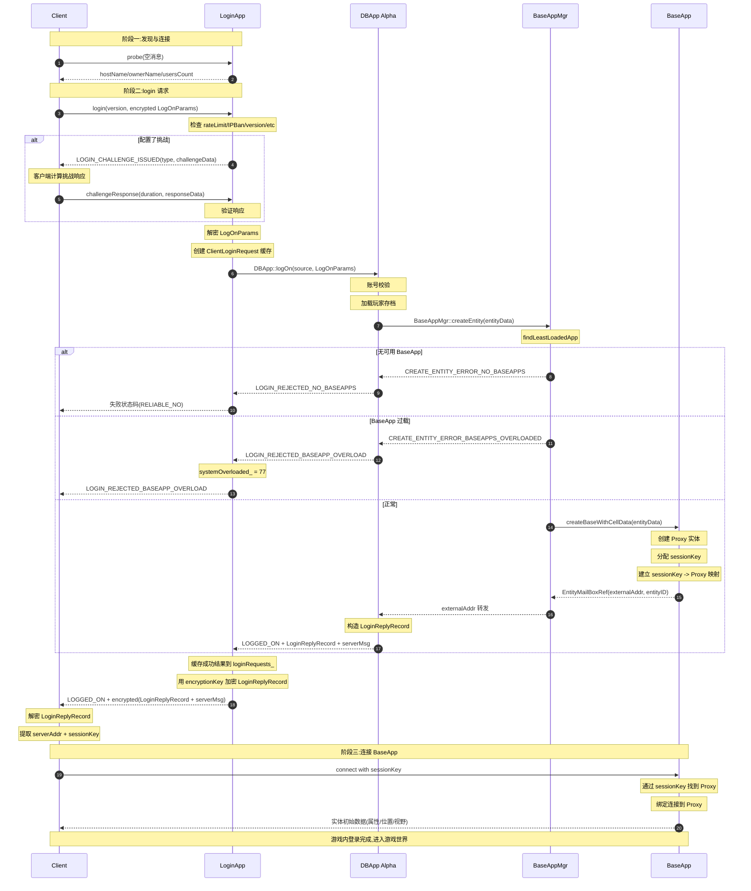
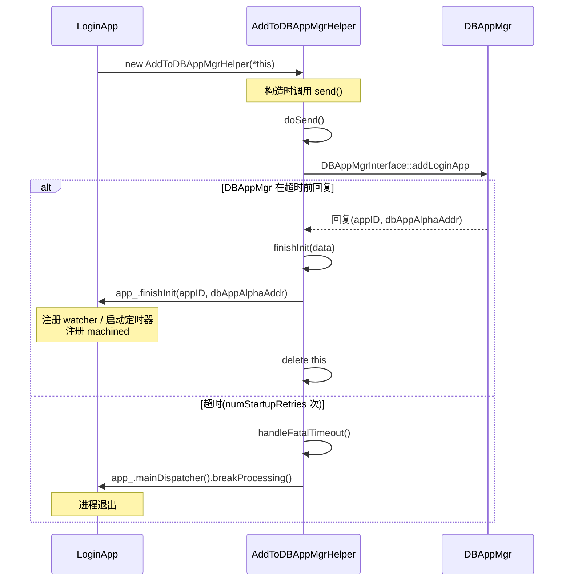
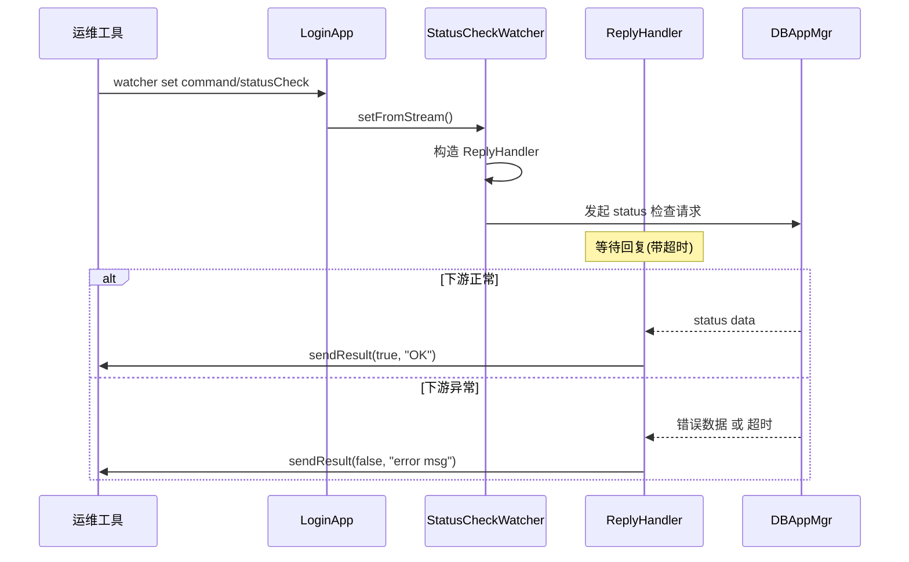
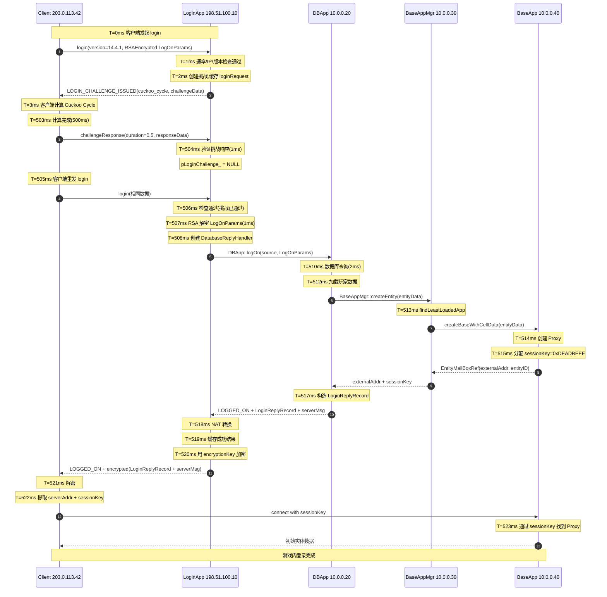

# 专题26:LoginApp 登录认证全流程深度剖析

> BigWorld Engine 14.4.1 开源版引擎源码级技术文档
>
> 适用版本:BigWorld Engine 14.4.1
> 源码根目录:`programming/bigworld/`
> 文档主题:LoginApp 登录认证端到端全流程剖析

---

## 目录

- [一、引言:BigWorld 登录设计哲学](#一引言bigworld-登录设计哲学)
  - [1.1 为什么需要独立的 LoginApp](#11-为什么需要独立的-loginapp)
  - [1.2 BigWorld 登录的三大设计目标](#12-bigworld-登录的三大设计目标)
  - [1.3 阅读本文档的前置知识](#13-阅读本文档的前置知识)
- [二、整体架构:四方协作的登录拓扑](#二整体架构四方协作的登录拓扑)
  - [2.1 LoginApp / DBApp / BaseAppMgr / BaseApp / Client 五元结构](#21-loginapp--dbapp--baseappmgr--baseapp--client-五元结构)
  - [2.2 进程拓扑与网络分区](#22-进程拓扑与网络分区)
  - [2.3 关键接口分布](#23-关键接口分布)
  - [2.4 数据流概览](#24-数据流概览)
- [三、LoginApp 主类剖析](#三loginapp-主类剖析)
  - [3.1 类继承关系与 Singleton 模式](#31-类继承关系与-singleton-模式)
  - [3.2 关键成员变量解读](#32-关键成员变量解读)
  - [3.3 构造与初始化流程](#33-构造与初始化流程)
  - [3.4 内部接口与外部接口的双面性](#34-内部接口与外部接口的双面性)
  - [3.5 DBAppAlpha 与 DBAppMgr 的双通道](#35-dbappalpha-与-dbappmgr-的双通道)
- [四、登录消息格式:LogOnMessage / LogOnParams / LoginReplyRecord](#四登录消息格式logonmessage--logonparams--loginreplyrecord)
  - [4.1 LoginInterface 三大消息:login / probe / challengeResponse](#41-logininterface-三大消息login--probe--challengeresponse)
  - [4.2 LogOnParams 字段序列化详解](#42-logonparams-字段序列化详解)
  - [4.3 LoginReplyRecord:成功登录的载荷](#43-loginreplyrecord成功登录的载荷)
  - [4.4 LogOnStatus 状态码全集](#44-logonstatus-状态码全集)
  - [4.5 消息流向与 Bundle 装载](#45-消息流向与-bundle-装载)
- [五、登录挑战(Challenge):挑战-响应机制](#五登录挑战challenge挑战-响应机制)
  - [5.1 为什么需要登录挑战](#51-为什么需要登录挑战)
  - [5.2 LoginChallenge 抽象基类](#52-loginchallenge-抽象基类)
  - [5.3 LoginChallengeFactory 与工厂注册机制](#53-loginchallengefactory-与工厂注册机制)
  - [5.4 CuckooCycle 工作量证明挑战](#54-cuckoocycle-工作量证明挑战)
  - [5.5 挑战-响应端到端流程](#55-挑战-响应端到端流程)
- [六、登录条件检查:版本 / IP / 并发 / 系统过载](#六登录条件检查版本--ip--并发--系统过载)
  - [6.1 多层检查的总顺序](#61-多层检查的总顺序)
  - [6.2 协议版本检查](#62-协议版本检查)
  - [6.3 IP 黑名单与封禁机制](#63-ip-黑名单与封禁机制)
  - [6.4 速率限制:全局 + 每IP + 每IP:Port](#64-速率限制全局--每ip--每ipport)
  - [6.5 系统过载状态机](#65-系统过载状态机)
  - [6.6 DB 就绪与 BaseAppMgr 就绪](#66-db-就绪与-baseappmgr-就绪)
  - [6.7 凭证长度与无密码登录](#67-凭证长度与无密码登录)
- [七、完整登录流程(端到端)](#七完整登录流程端到端)
  - [7.1 客户端 connect LoginApp](#71-客户端-connect-loginapp)
  - [7.2 LoginApp 转发到 DBAppAlpha](#72-loginapp-转发到-dbappalpha)
  - [7.3 DBApp 调用 BaseAppMgr::createEntity](#73-dbapp-调用-baseappmgrcreateentity)
  - [7.4 BaseAppMgr 选择 BaseApp 并下发 createBaseWithCellData](#74-baseappmgr-选择-baseapp-并下发-createbasewithcelldata)
  - [7.5 BaseApp 创建 Base 实体并回复](#75-baseapp-创建-base-实体并回复)
  - [7.6 LoginApp 收到 LoginReplyRecord 并加密回送客户端](#76-loginapp-收到-loginreplyrecord-并加密回送客户端)
  - [7.7 客户端 connect BaseApp 并完成游戏内登录](#77-客户端-connect-baseapp-并完成游戏内登录)
  - [7.8 端到端时序图](#78-端到端时序图)
- [八、ClientLoginRequest:登录请求缓存与重发](#八clientloginrequest登录请求缓存与重发)
- [九、DatabaseReplyHandler:DBApp 回复处理器](#九databasereplyhandlerdbapp-回复处理器)
- [十、AddToDBAppMgrHelper:LoginApp 启动注册](#十addtodbappmgrhelperloginapp-启动注册)
- [十一、StatusCheckWatcher:运行时状态自检](#十一statuscheckwatcher运行时状态自检)
- [十二、LoginStreamFilterFactory:WebSocket 流过滤](#十二loginstreamfilterfactorywebsocket-流过滤)
- [十三、BWConfigLoginChallengeConfig:挑战配置加载](#十三bwconfigloginchallengeconfig挑战配置加载)
- [十四、BaseAppMgr 负载均衡选 BaseApp](#十四baseappmgr-负载均衡选-baseapp)
- [十五、客户端登录参数与协议](#十五客户端登录参数与协议)
- [十六、加密与签名:RSAStreamEncoder 与 EncryptionFilter](#十六加密与签名rsastreamencoder-与-encryptionfilter)
- [十七、断线重连:BaseApp 切换流程](#十七断线重连baseapp-切换流程)
- [十八、登录失败原因与错误码全集](#十八登录失败原因与错误码全集)
- [十九、登录限流与 DDoS 防护](#十九登录限流与-ddos-防护)
- [二十、DBApp 集成:玩家数据加载](#二十dbapp-集成玩家数据加载)
- [二十一、性能分析:登录并发、延迟与统计](#二十一性能分析登录并发延迟与统计)
- [二十二、设计权衡与替代方案](#二十二设计权衡与替代方案)
- [二十三、局限性与改进方向](#二十三局限性与改进方向)
- [二十四、完整实例:一次登录的端到端追踪](#二十四完整实例一次登录的端到端追踪)
- [附录 A:登录消息格式全解](#附录-a登录消息格式全解)
- [附录 B:配置参数与调优](#附录-b配置参数与调优)
- [附录 C:常见登录问题排查](#附录-c常见登录问题排查)
- [总结](#总结)

---

## 一、引言:BigWorld 登录设计哲学

### 1.1 为什么需要独立的 LoginApp

在传统 MMOG 架构中,客户端首先连接的"门面"服务通常是网关(Gateway)或会话服务器(Session Server),由它来分发后续到游戏逻辑节点的连接。BigWorld Engine 在 14.4.x 版本中将这个角色进一步细化为一个独立的进程:**LoginApp**。它不是 BaseApp,不是 CellApp,也不是 DBApp,而是一个轻量级、可水平扩展的"前置鉴权 + 路由指示"服务。

将登录功能从 BaseApp 中剥离出来,带来以下几个显著的好处:

1. **攻击面收敛**:LoginApp 是暴露在公网上的唯一进程(它持有外部 UDP 端口和可选的 TCP/WebSocket 服务),所有的恶意流量、暴力破解、DDoS 包都先打在 LoginApp 上。BaseApp、CellApp、DBApp 都可以隐藏在内网,只与 LoginApp 通信。即便 LoginApp 被打垮,已登录玩家的游戏进程不受影响。

2. **职责单一**:LoginApp 只负责"鉴权 + 路由指示",不持有任何实体数据、不参与游戏逻辑 tick,因此它的资源开销极小,可以横向部署多个实例,通过 machined 和 DBAppMgr 协同选择。

3. **可扩展性**:由于 LoginApp 不持有玩家状态,可以基于 DNS/负载均衡简单地水平扩展。多个 LoginApp 共享同一份 BaseAppMgr 信息即可。

4. **解耦**:LoginApp 的协议(BaseApp 切换、断线重连、Probe 探测)与游戏逻辑协议(BaseApp 实体消息)完全分离,两套协议可以独立演化。

源码层面,LoginApp 的"轻量"特征可以从主类的成员变量看出,见 [loginapp.hpp](file:///j:/Work/BigWorld-Engine-14.4.1/programming/bigworld/server/loginapp/loginapp.hpp#L48-L58):

```cpp
class LoginApp : public ServerApp, public TimerHandler,
	public Singleton< LoginApp >
{
public:
    SERVER_APP_HEADER( LoginApp, loginApp )
    typedef LoginAppConfig Config;

    LoginApp( Mercury::EventDispatcher & mainDispatcher,
            Mercury::NetworkInterface & interface );
    ~LoginApp();

    bool finishInit( LoginAppID appID,
        const Mercury::Address & dbAppAlphaAddress );
    ...
};
```

可以看到,LoginApp 继承自 `ServerApp`(提供通用的服务器生命周期管理)和 `TimerHandler`(周期性 tick),并通过 `Singleton< LoginApp >` 暴露全局访问点。它没有任何实体管理、空间管理、AOI 管理的成员——这些都是 BaseApp/CellApp 的职责。

### 1.2 BigWorld 登录的三大设计目标

通读 LoginApp 的实现后,可以总结出 BigWorld 登录系统设计的三大核心目标:

#### 目标一:可证伪的客户端身份

BigWorld 不假定客户端是可信的。在 LoginApp 收到 `login` 消息后,会经历多层身份验证:

- 协议版本兼容性检查(`ClientServerProtocolVersion::supports`)
- IP 黑名单与封禁检查(`ipAddressBanMap_`)
- 速率限制(全局 + 每IP + 每IP:Port)
- 可选的挑战-响应(`LoginChallenge`,如 Cuckoo Cycle 工作量证明)
- LogOnParams 加密解密(`RSAStreamEncoder`,服务端用私钥解密客户端用公钥加密的载荷)
- 用户名/密码长度限制
- DB 侧的账号存在性与密码校验

任何一层失败都会立即终止登录并向客户端返回错误码。这种"零信任"的设计哲学解释了为什么 LoginApp 的代码中遍布 `data.finish()` 和 `return`。

#### 目标二:抗 DDoS 的回复策略

LoginApp 最大的安全风险是"被用作放大攻击的反射器"。攻击者可以伪造源 IP 发送 `login` 消息,诱导 LoginApp 向受害者发送大尺寸的失败回复。

BigWorld 通过三层策略对抗这种攻击:

1. **失败回复速率限制**:`maxRepliesOnFailPerSecond` 配置项(默认 100/秒),LoginApp 不会向单一来源发送超过此速率的失败回复。见 [loginapp.cpp](file:///j:/Work/BigWorld-Engine-14.4.1/programming/bigworld/server/loginapp/loginapp.cpp#L607-L614)。
2. **失败回复使用不可靠传输**:`pBundle->startReply( replyID, Mercury::RELIABLE_NO )`。失败回复不要求重传,客户端漏掉就漏掉,避免 LoginApp 被反复重传拖垮。
3. **空白源地址静默丢弃**:如果 `source.ip == 0`(伪造的空地址),LoginApp 直接 `data.retrieve( data.remainingLength() )` 静默吃掉数据,不回复任何内容。见 [loginapp.cpp](file:///j:/Work/BigWorld-Engine-14.4.1/programming/bigworld/server/loginapp/loginapp.cpp#L766-L776)。

#### 目标三:可恢复的会话迁移

BigWorld 的登录结果(`LoginReplyRecord` 中包含 BaseApp 地址和 sessionKey)会被 LoginApp 在内存中缓存一段时间(`maxLoginDelay` 默认 10 秒)。如果客户端在收到成功回复前丢包,再次发送相同的 `login` 消息,LoginApp 会通过 `handleResentCachedAttempt` 重发缓存的成功回复,而不会触发第二次 DBApp 调用。这个机制大幅降低了登录阶段的"重复扣费"风险,也为客户端断线重连提供了基础。

### 1.3 阅读本文档的前置知识

阅读本文档前,建议读者已了解以下概念:

- **Mercury 网络库**:BigWorld 自研的 UDP 网络库,核心概念包括 `NetworkInterface`、`Channel`、`Bundle`、`ReplyMessageHandler`、`InterfaceElement`。
- **ServerApp 框架**:BigWorld 通用服务器进程框架,提供 init/run/shutdown 生命周期、配置加载、watcher 暴露等。
- **DBApp / DBAppMgr**:数据库访问层与数据库管理器,LoginApp 通过它们做账号校验。
- **BaseApp / BaseAppMgr**:游戏 Base 实体所在进程与其管理器,登录最终会路由到一个 BaseApp。
- **EntityDef**:实体定义系统,定义了 Proxy(玩家代理)实体的字段和方法。
- **bw.xml 配置**:BigWorld 的中心化 XML 配置,所有进程的运行参数都在其中。

如果对以上概念不熟悉,建议先阅读 ServerApp 框架、Mercury 网络库、DBApp 体系的相关专题文档。

---

## 二、整体架构:四方协作的登录拓扑

### 2.1 LoginApp / DBApp / BaseAppMgr / BaseApp / Client 五元结构

BigWorld 的登录不是简单的"客户端 → 服务器"两步握手,而是涉及五个独立进程类型的协作。理解这个拓扑是理解登录流程的前提。

```
                ┌────────────────────────────────────────────────┐
                │                  Internet                      │
                └────────────────────┬───────────────────────────┘
                                     │
                                     │ UDP / TCP / WebSocket
                                     ▼
                              ┌─────────────┐
                              │   LoginApp  │ ← 暴露公网,无状态
                              │  (可水平扩展) │
                              └──────┬──────┘
                                     │ 内网 UDP
              ┌──────────────────────┼──────────────────────┐
              │                      │                      │
              ▼                      ▼                      ▼
       ┌──────────────┐      ┌──────────────┐       ┌──────────────┐
       │   DBAppMgr   │      │ DBApp Alpha  │       │              │
       │ (单点协调者)  │      │ (实际DB访问)  │       │              │
       └──────┬───────┘      └──────┬───────┘       │              │
              │                     │               │              │
              │                     │ createEntity  │              │
              │                     └──────────────►│ BaseAppMgr   │
              │                                     │ (负载均衡)    │
              │                                     └──────┬───────┘
              │                                            │
              │                                            │ createBaseWithCellData
              │                                            ▼
              │                                     ┌──────────────┐
              │                                     │   BaseApp    │
              │                                     │ (创建Proxy)  │
              │                                     └──────┬───────┘
              │                                            │
              │                                            │ LoginReplyRecord
              │                                            ▼
              │                                     ┌──────────────┐
              │                                     │  DBApp       │
              │                                     │ (回送LoginApp)│
              │                                     └──────┬───────┘
              │                                            │
              │                                            │ DatabaseReplyHandler
              │                                            ▼
              │                                     ┌──────────────┐
              │                                     │  LoginApp    │
              │                                     │ (加密回送Client)│
              │                                     └──────────────┘
              │
              └─► Client 收到 LoginReplyRecord,connect 到 BaseApp,完成游戏内登录
```

**五个进程的登录职责**:

| 进程 | 职责 | 是否有状态 |
|------|------|----------|
| **Client** | 发起 login 请求、响应挑战、connect BaseApp | 是(本地 LoginHandler) |
| **LoginApp** | 协议版本检查、限流、IP封禁、挑战下发、LogOnParams 解密、转发到 DBApp、缓存成功回复 | 弱状态(短期缓存) |
| **DBApp Alpha** | 账号密码校验、加载玩家存档、调用 BaseAppMgr::createEntity、回送 LoginReplyRecord | 是(数据库连接) |
| **BaseAppMgr** | 选择最空闲的 BaseApp、下发 createBaseWithCellData、收集 BaseApp 负载信息 | 是(BaseApp 列表) |
| **BaseApp** | 创建 Proxy 实体、绑定 sessionKey、回送 EntityMailBoxRef 给 BaseAppMgr | 是(玩家实体) |

### 2.2 进程拓扑与网络分区

BigWorld 的网络分区非常清晰:

1. **公网区**:只有 LoginApp 的 `extInterface_` 暴露在公网。默认端口是 `PORT_LOGIN`(在 `bw.xml` 的 `loginApp/externalPorts/port` 中配置)。可选地,LoginApp 也启动 TCP server(用于 WebSocket 客户端)。
2. **内网区**:LoginApp 的 `intInterface_`、DBAppMgr、DBAppAlpha、BaseAppMgr、BaseApp 全部位于内网,通过 machined 注册发现。
3. **NAT 穿透**:对于位于 NAT 后的客户端,LoginApp 在向客户端返回 BaseApp 地址时,会通过 `NATConfig::externalIPFor()` 将内网 IP 转换为公网 IP。见 [database_reply_handler.cpp](file:///j:/Work/BigWorld-Engine-14.4.1/programming/bigworld/server/loginapp/database_reply_handler.cpp#L154-L160)。

这个分区设计意味着,即便攻击者扫描到内网 IP,也无法直接访问 BaseApp 或 DBApp——除非先突破 LoginApp。

### 2.3 关键接口分布

BigWorld 使用 Mercury 的"接口"(Interface)机制来组织消息。登录相关的接口分布在三个地方:

1. **`LoginInterface`**(外部接口):暴露在 `extInterface_` 上,客户端直接调用。定义在 [lib/connection/login_interface.hpp](file:///j:/Work/BigWorld-Engine-14.4.1/programming/bigworld/lib/connection/login_interface.hpp)。包含三个消息:
   - `login`(变长消息,客户端发起登录)
   - `probe`(空消息,客户端探测服务器)
   - `challengeResponse`(变长消息,客户端提交挑战响应)

2. **`LoginIntInterface`**(内部接口):暴露在 `intInterface_` 上,只有内网进程(BaseAppMgr、DBAppMgr)可以调用。定义在 [server/loginapp/login_int_interface.hpp](file:///j:/Work/BigWorld-Engine-14.4.1/programming/bigworld/server/loginapp/login_int_interface.hpp)。包含:
   - `controlledShutDown`(内部触发关闭)
   - `handleDBAppMgrBirth`(DBAppMgr 上线通知)
   - `notifyDBAppAlpha`(DBApp Alpha 地址变更通知)
   - 匿名通道消息(继承自 DBAppMgrInterface)
   - Reviver ping 消息

3. **`DBAppInterface::logOn`**:LoginApp 调用 DBAppAlpha 的接口,定义在 [lib/db/dbapp_interface.hpp](file:///j:/Work/BigWorld-Engine-14.4.1/programming/bigworld/lib/db/dbapp_interface.hpp#L57-L61)。携带 LogOnParams 和客户端地址。

4. **`BaseAppMgrInterface::createEntity`**:DBApp 调用 BaseAppMgr 的接口,用于触发实体创建。见 [server/baseappmgr/baseappmgr_interface.hpp](file:///j:/Work/BigWorld-Engine-14.4.1/programming/bigworld/server/baseappmgr/baseappmgr_interface.hpp#L69)。

5. **`BaseAppIntInterface::createBaseWithCellData`**:BaseAppMgr 调用 BaseApp 的接口,实际创建 Base 实体。见 [baseappmgr.cpp L977](file:///j:/Work/BigWorld-Engine-14.4.1/programming/bigworld/server/baseappmgr/baseappmgr.cpp#L977)。

### 2.4 数据流概览

一次完整登录的数据流(简化版):

```
Client                  LoginApp                 DBAppAlpha              BaseAppMgr              BaseApp
  │                        │                        │                       │                       │
  │─── login ────────────►│                        │                       │                       │
  │                        │── DBApp::logOn ──────►│                       │                       │
  │                        │                        │── createEntity ──────►│                       │
  │                        │                        │                       │── createBaseWithCellData ─►│
  │                        │                        │                       │◄── EntityMailBoxRef ────│
  │                        │                        │◄── LoginReplyRecord ──│                       │
  │                        │◄── status + LoginReplyRecord ──────────────────│                       │
  │◄── LoginReplyRecord ──│                        │                       │                       │
  │                        │                        │                       │                       │
  │─── connect BaseApp ──────────────────────────────────────────────────────────────────────────►│
  │◄── 初始实体数据 ──────────────────────────────────────────────────────────────────────────────│
```

注意这条数据流的关键点:**LoginApp 不是直接调用 BaseAppMgr,而是通过 DBAppAlpha 间接调用**。这是 BigWorld 的精心设计:DBApp 负责账号校验和玩家存档加载,只有在数据库校验通过后,才将请求转发给 BaseAppMgr 创建实体。这种"鉴权与路由分离"的设计,使得 BaseAppMgr 不必关心账号验证逻辑,只需关心负载均衡。

---

## 三、LoginApp 主类剖析

### 3.1 类继承关系与 Singleton 模式

LoginApp 的类声明见 [loginapp.hpp L48-L58](file:///j:/Work/BigWorld-Engine-14.4.1/programming/bigworld/server/loginapp/loginapp.hpp#L48-L58):

```cpp
class LoginApp : public ServerApp, public TimerHandler,
	public Singleton< LoginApp >
{
    ...
};
```

继承体系如下:

```
       ┌─────────────────┐
       │  TimerHandler   │  ← 周期性 tick 回调
       └────────┬────────┘
                │
       ┌────────▼────────┐         ┌───────────────────┐
       │    ServerApp     │         │ Singleton<LoginApp>│ ← 全局单例
       │ (生命周期/配置/  │         └─────────┬─────────┘
       │  watcher/信号)   │                   │
       └────────┬────────┘                   │
                │                              │
                └──────────┬───────────────────┘
                           │
                    ┌──────▼──────┐
                    │   LoginApp   │
                    └─────────────┘
```

- **`ServerApp`**:提供 init/run/shutdown 生命周期、`interface_`(内部 NetworkInterface)、`mainDispatcher_`(事件分发器)、配置加载、watcher 注册等基础能力。所有 BigWorld 服务器进程都继承自它。
- **`TimerHandler`**:通过 `handleTimeout` 回调处理定时事件。LoginApp 注册了 tick 定时器(频率 `Config::updateHertz()`)用于推进时间。
- **`Singleton< LoginApp >`**:通过 `LoginApp::instance()` 全局访问。`BW_SINGLETON_STORAGE( LoginApp )` 宏定义了存储。

宏 `SERVER_APP_HEADER( LoginApp, loginApp )` 展开后的核心是声明 `static int run( int argc, char * argv[] )` 等 ServerApp 必需的静态入口,使得 `main.cpp` 中的 `SERVER_APP_MAIN` 宏可以直接调用。

### 3.2 关键成员变量解读

LoginApp 的成员变量在 [loginapp.hpp L171-L205](file:///j:/Work/BigWorld-Engine-14.4.1/programming/bigworld/server/loginapp/loginapp.hpp#L171-L205) 集中声明。以下是核心字段:

```cpp
private:
    std::auto_ptr< StreamEncoder >     pLogOnParamsEncoder_;  // LogOnParams 解密器(RSA 私钥)
    Mercury::NetworkInterface          extInterface_;          // 对外网络接口
    std::auto_ptr< Mercury::StreamFilterFactory >
                                       pStreamFilterFactory_; // 流过滤器工厂(WebSocket)
    Mercury::TCPServer                tcpServer_;             // TCP 服务(WebSocket)

    uint8                systemOverloaded_;                   // 系统过载状态码(0=正常)
    uint64               systemOverloadedTime_;                // 过载开始时间戳

    typedef BW::map< Mercury::Address, ClientLoginRequest > ClientLoginRequests;
    ClientLoginRequests  loginRequests_;                      // 登录请求缓存(按客户端地址)

    LoginChallengeFactories challengeFactories_;               // 登录挑战工厂集合

    DBApp                dbAppAlpha_;                          // DBApp Alpha 通道
    AnonymousChannelClient dbAppMgr_;                         // DBAppMgr 匿名通道

    uint64               repliedFailsCounterResetTime_;        // 失败回复计数器重置时间
    uint                numFailRepliesLeft_;                  // 当前剩余失败回复配额

    uint64              lastRateLimitCheckTime_;               // 上次速率检查时间
    uint                numAllowedLoginsLeft_;                // 当前时间块剩余登录配额

    typedef BW::map< uint32, uint64 > IPAddressBanMap;
    IPAddressBanMap     ipAddressBanMap_;                    // IP -> 封禁结束时间
    uint64              nextIPAddressBanMapCleanupTime_;       // 下次清理 IP 封禁表的时间

    LoginAppID          id_;                                  // LoginApp 实例 ID
    LoginStats          loginStats_;                          // 登录统计(EMA 平均)
    TimerHandle         statsTimer_;                         // 统计更新定时器
    TimerHandle         tickTimer_;                           // 主 tick 定时器
```

#### 3.2.1 `pLogOnParamsEncoder_` 与 RSA 私钥

这是 LogOnParams 解密的关键。在 `initLogOnParamsEncoder()` 中,LoginApp 从 `Config::privateKey()`(默认 `server/loginapp.privkey`)加载 RSA 私钥,构造一个 `RSAStreamEncoder`。客户端用对应的公钥(在 `lib/connection/loginapp_public_key.hpp` 中管理)加密 LogOnParams,服务端用此私钥解密。

如果配置 `allowUnencryptedLogins = true`,则即便私钥加载失败,LoginApp 也能启动,但只能接受未加密的登录(开发模式)。

#### 3.2.2 `extInterface_` 与 `intInterface_`

LoginApp 有两个 NetworkInterface:

- **`extInterface_`**:对外接口,绑定公网端口(默认 `PORT_LOGIN`),接收客户端的 `login`/`probe`/`challengeResponse` 消息。在 [loginapp.cpp L121-L124](file:///j:/Work/BigWorld-Engine-14.4.1/programming/bigworld/server/loginapp/loginapp.cpp#L121-L124) 中构造,类型为 `Mercury::NETWORK_INTERFACE_EXTERNAL`。
- **`intInterface_`**:对内接口,从 `ServerApp` 继承,绑定内网端口,接收 DBAppMgr/BaseAppMgr 的内部消息。

这种"双面接口"是 LoginApp 的核心架构特征。两个接口的 IP 地址在 `init()` 中都会被检查,必须成功绑定。

#### 3.2.3 `loginRequests_`:登录请求缓存表

这是一个 `map<Address, ClientLoginRequest>`,以客户端地址为键。它的作用非常重要:

1. **去重**:同一个客户端在登录请求处理期间再次发 `login` 消息,通过 `handleResentPendingAttempt` 检测到已有 pending 请求,直接忽略或重发挑战。
2. **挑战状态保存**:挑战下发后,等待客户端响应期间,挑战状态保存在此表中。
3. **成功结果缓存**:DBApp 返回成功结果后,LoginApp 将 `LoginReplyRecord` 缓存在此表中,若客户端因丢包重发,直接重发缓存结果,不再调用 DBApp。

为防止此表无限增长,`sendAndCacheSuccess` 在表大小超过 100 时触发清理(见 [loginapp.cpp L1265-L1279](file:///j:/Work/BigWorld-Engine-14.4.1/programming/bigworld/server/loginapp/loginapp.cpp#L1265-L1279))。

#### 3.2.4 `ipAddressBanMap_`:IP 封禁表

这是一个 `map<uint32 IP, uint64 banEndTime>`。封禁来源有两个:

1. **DBApp 主动封禁**:DBApp 在数据库校验时发现某 IP 应被封禁(例如连续密码错误),返回 `LOGIN_REJECTED_IP_ADDRESS_BAN` 状态码和封禁时长,`DatabaseReplyHandler::handleMessage` 调用 `loginApp_.handleBanIP` 将此 IP 加入封禁表。见 [database_reply_handler.cpp L47-L80](file:///j:/Work/BigWorld-Engine-14.4.1/programming/bigworld/server/loginapp/database_reply_handler.cpp#L47-L80)。
2. **周期性清理**:每隔 `ipBanListCleanupInterval`(默认 10 秒)清理一次过期的封禁项。见 [loginapp.cpp L751-L765](file:///j:/Work/BigWorld-Engine-14.4.1/programming/bigworld/server/loginapp/loginapp.cpp#L751-L765)。

封禁表也可以通过 watcher `command/clearIPAddressBans` 手动清空。

### 3.3 构造与初始化流程

LoginApp 的初始化分为两个阶段:**构造阶段**(在 `LoginApp` 构造函数中)和 **`init` 阶段**(在 `ServerApp::run` 调用 `init` 时)。此外还有第三阶段 `finishInit`,在 DBAppMgr 接受 LoginApp 注册后回调。

#### 3.3.1 构造函数

构造函数见 [loginapp.cpp L117-L170](file:///j:/Work/BigWorld-Engine-14.4.1/programming/bigworld/server/loginapp/loginapp.cpp#L117-L170)。它完成以下工作:

1. 初始化 `ServerApp` 基类,传入主事件分发器和内部 NetworkInterface。
2. 构造 `extInterface_`,绑定到外部端口。端口通过 `getExternalPort()` 计算,默认 `PORT_LOGIN`,可选按 UID 偏移(`shouldOffsetExternalPortByUID`)。
3. 根据配置 `shouldUseWebSockets`(默认 true)构造 `LoginStreamFilterFactory`,用于支持 WebSocket 客户端。
4. 构造 `tcpServer_`,监听外部 TCP 连接(用于 WebSocket 升级)。
5. 尝试绑定到配置中指定的端口;若失败且 `shouldShutDownIfPortUsed=true`,直接退出;否则绑定随机端口。
6. 初始化 `dbAppAlpha_`(DBApp 通道,关联到内部接口)和 `dbAppMgr_`(匿名通道客户端)。

#### 3.3.2 `init()` 方法

`init()` 方法见 [loginapp.cpp L187-L361](file:///j:/Work/BigWorld-Engine-14.4.1/programming/bigworld/server/loginapp/loginapp.cpp#L187-L361)。它执行约 30 个独立的初始化步骤,任何一个失败都会终止启动:

```cpp
bool LoginApp::init( int argc, char * argv[] )
{
    if (!this->ServerApp::init( argc, argv )) return false;

    if (!extInterface_.isGood()) { /* 报错 */ return false; }
    if (!tcpServer_.isGood())     { /* 报错 */ return false; }

    tcpServer_.pStreamFilterFactory( pStreamFilterFactory_.get() );

    if (!this->initLogOnParamsEncoder()) return false;  // 加载 RSA 私钥
    if (!this->intInterface().isGood())   return false;

    // IP 检查(0 表示绑定失败)
    if ((extInterface_.address().ip == 0) ||
            (this->intInterface().address().ip == 0))
    { return false; }

    if (!NATConfig::postInit()) return false;

    // NAT 配置检查:本地 IP 必须在 NAT 配置的本地子网内
    if (NATConfig::isInternalIP( this->intInterface().address().ip ) ||
        NATConfig::isInternalIP( extInterface_.address().ip ))
    { /* OK */ }
    else
    { return false; }

    // 失败回复速率限制必须 >= 2
    if (Config::maxRepliesOnFailPerSecond() < 2)
    { return false; }

    // 注册 watcher
    MF_WATCH( "numLogins", gNumLogins );
    ...

    // 启动 DBAppMgr 匿名通道(尝试 numStartupRetries 次,默认 60)
    if (!BW_INIT_ANONYMOUS_CHANNEL_CLIENT( dbAppMgr_, this->intInterface(),
            LoginIntInterface, DBAppMgrInterface, numStartupRetries ))
    { return false; }

    // 注册外部和内部接口
    LoginInterface::registerWithInterface( extInterface_ );
    LoginIntInterface::registerWithInterface( this->intInterface() );

    // 配置外部接口的模拟延迟和丢包(开发调试用)
    extInterface_.setLatency( Config::externalLatencyMin(),
            Config::externalLatencyMax() );
    extInterface_.setLossRatio( Config::externalLossRatio() );

    // 配置速率限制
    extInterface_.rateLimitPeriod( Config::rateLimitDuration() );
    extInterface_.perIPAddressRateLimit( Config::ipAddressRateLimit() );
    extInterface_.perIPAddressPortRateLimit( Config::ipAddressPortRateLimit() );

    // 启动 AddToDBAppMgrHelper(异步向 DBAppMgr 注册自己)
    new AddToDBAppMgrHelper( *this );

    // 配置登录挑战工厂
    if (!challengeFactories_.configureFactories(
            *(BWConfigLoginChallengeConfig::root()) ))
    { return false; }

    // 校验配置的 challengeType 存在对应工厂
    if (!Config::challengeType().empty() &&
            !challengeFactories_.getFactory( Config::challengeType() ))
    { return false; }

    return true;
}
```

这里有几个值得注意的设计点:

- **`shouldUseWebSockets` 默认开启**:这意味着 LoginApp 默认会接受 WebSocket 连接,这是为了支持 Web 客户端(如浏览器游戏)。
- **`NATConfig` 严格检查**:如果本地 IP 不在 NAT 配置的本地子网内,LoginApp 直接拒绝启动。这避免了内/外网配置错误导致客户端无法连接。
- **`AddToDBAppMgrHelper` 异步注册**:LoginApp 启动后并不立即开始服务,而是先向 DBAppMgr 发送 `addLoginApp` 请求,等待 DBAppMgr 回复后,通过 `finishInit` 完成第二阶段初始化(注册 watcher、启动定时器、注册 machined)。这保证了 LoginApp 只有在 DBAppMgr 已知它存在后才开始接受登录。

#### 3.3.3 `finishInit()` 方法

`finishInit` 在 DBAppMgr 回复 `addLoginApp` 后由 `AddToDBAppMgrHelper::finishInit` 调用。它接收两个参数:`appID`(DBAppMgr 分配的 LoginApp ID)和 `dbAppAlphaAddress`(DBApp Alpha 的地址)。见 [loginapp.cpp L390-L500](file:///j:/Work/BigWorld-Engine-14.4.1/programming/bigworld/server/loginapp/loginapp.cpp#L390-L500)。

主要工作:

1. 保存 `id_` 和 `dbAppAlpha_` 地址。
2. 向 machined 注册内部和外部接口(用于通过机器名查找)。
3. 注册 `LoggerMessageForwarder` 的 appID,使日志聚合时知道来自哪个 LoginApp。
4. 注册 DBAppMgr 上线监听器(若 DBAppMgr 重启,会收到 `handleDBAppMgrBirth` 通知)。
5. 启用 `SIGUSR1` 信号处理,用于触发受控关闭。
6. 注册大量 watcher:`nubExternal`、`command/statusCheck`、`command/shutDownServer`、`command/clearIPAddressBans`、`dbAppMgr`、`averages`(登录统计)、`challenges/config`、`challenges/stats`、`dbAppAlpha`、`id`。
7. 启动统计定时器(`UPDATE_STATS_PERIOD`,1 秒)和主 tick 定时器(`1000000/updateHertz` 微秒)。

只有 `finishInit` 成功后,LoginApp 才被认为"就绪"。在此之前,任何 `login` 请求都会因 `!isDBReady()` 失败(因为 `dbAppAlpha_.channel().isEstablished()` 返回 false)。

### 3.4 内部接口与外部接口的双面性

LoginApp 的双接口设计是一个值得展开讨论的架构决策。

**外部接口(`extInterface_`)**:
- 绑定公网 IP 和端口。
- 类型为 `Mercury::NETWORK_INTERFACE_EXTERNAL`,这意味着它在接收未经请求的包时有更严格的检查。
- 注册了 `LoginInterface`(包含 `login`/`probe`/`challengeResponse`)。
- 可选地通过 `LoginStreamFilterFactory` 支持 WebSocket。
- 配置了模拟延迟和丢包(开发调试用),见 `externalLatencyMin`/`externalLatencyMax`/`externalLossRatio`。
- 配置了三层速率限制。

**内部接口(`intInterface_`)**:
- 绑定内网 IP 和端口。
- 注册了 `LoginIntInterface`(包含 `controlledShutDown`/`handleDBAppMgrBirth`/`notifyDBAppAlpha`/`recoverLoginApp`)。
- 与 DBAppMgr、DBAppAlpha 通信。

这两个接口在物理上是同一个进程的两个 NetworkInterface 实例,共享同一个 `EventDispatcher`,但绑定不同的 IP 和端口。它们的消息分发完全独立——外部接口永远不会收到 `controlledShutDown` 消息,内部接口永远不会收到 `login` 消息。

### 3.5 DBAppAlpha 与 DBAppMgr 的双通道

LoginApp 同时维护两个通往数据库层的通道:

- **`dbAppMgr_`**:`AnonymousChannelClient` 类型,通过 machined 发现 DBAppMgr,建立匿名通道。用于:启动时 `addLoginApp` 注册、`controlledShutDown` 通知、`recoverLoginApp`(DBAppMgr 重启后通知 LoginApp 重新注册)。代码见 [add_to_dbappmgr_helper.hpp](file:///j:/Work/BigWorld-Engine-14.4.1/programming/bigworld/server/loginapp/add_to_dbappmgr_helper.hpp)。
- **`dbAppAlpha_`**:`DBApp` 类型(即 `ChannelOwner`),指向 DBApp Alpha(主 DBApp)。用于:转发 `logOn` 请求(携带 LogOnParams)。地址由 DBAppMgr 在 `finishInit` 中下发,后续可通过 `notifyDBAppAlpha` 消息变更。

为什么要分两个通道?因为 DBAppMgr 和 DBApp Alpha 是不同的进程,职责不同:

- **DBAppMgr**:管理多个 DBApp 的协调者,负责分配 LoginApp ID、维护 DBApp 哈希环、监控 DBApp 健康。LoginApp 启动时只需找到 DBAppMgr(通过 machined 的 birth listener)即可,不需要知道具体哪个 DBApp 是 Alpha。
- **DBApp Alpha**:实际处理 logOn 请求的 DBApp 实例。在 DBAppMgr 决定哪个 DBApp 是 Alpha 后,通过 `finishInit` 或 `notifyDBAppAlpha` 通知 LoginApp。

`isDBReady()` 检查的就是 `dbAppAlpha_.channel().isEstablished()`——只有 DBApp Alpha 通道建立后,LoginApp 才认为数据库层就绪,才会接受登录。

---

## 四、登录消息格式:LogOnMessage / LogOnParams / LoginReplyRecord

### 4.1 LoginInterface 三大消息:login / probe / challengeResponse

LoginApp 的外部接口 `LoginInterface` 定义在 [lib/connection/login_interface.hpp L49-L61](file:///j:/Work/BigWorld-Engine-14.4.1/programming/bigworld/lib/connection/login_interface.hpp#L49-L61):

```cpp
BEGIN_MERCURY_INTERFACE( LoginInterface )

    // uint32 version
    // bool encrypted
    // LogOnParams
    MERCURY_VARIABLE_MESSAGE( login, 2, &gLoginHandler )

    MERCURY_EMPTY_MESSAGE( probe, &gProbeHandler )

    MERCURY_VARIABLE_MESSAGE( challengeResponse, 2,
        &gChallengeResponseHandler )

END_MERCURY_INTERFACE()
```

三个消息的元数据如下:

| 消息名 | 类型 | 长度 | 处理器 | 用途 |
|--------|------|------|--------|------|
| `login` | `MERCURY_VARIABLE_MESSAGE` | 变长(2 个变长字段) | `gLoginHandler` → `LoginApp::login` | 客户端发起登录 |
| `probe` | `MERCURY_EMPTY_MESSAGE` | 空 | `gProbeHandler` → `LoginApp::probe` | 客户端探测 LoginApp 状态 |
| `challengeResponse` | `MERCURY_VARIABLE_MESSAGE` | 变长(2 个变长字段) | `gChallengeResponseHandler` → `LoginApp::challengeResponse` | 客户端提交挑战响应 |

消息处理器的注册在 [message_handlers.cpp L65-L78](file:///j:/Work/BigWorld-Engine-14.4.1/programming/bigworld/server/loginapp/message_handlers.cpp#L65-L78):

```cpp
namespace
{
    // LoginInterface
    LoginAppRawMessageHandler gLoginHandler( &LoginApp::login );
    LoginAppRawMessageHandler gProbeHandler( &LoginApp::probe );
    LoginAppRawMessageHandler gChallengeResponseHandler(
        &LoginApp::challengeResponse );

    // LoginIntInterface
    LoginAppRawMessageHandler gShutDownHandler( &LoginApp::controlledShutDown );
}
```

`LoginAppRawMessageHandler` 是一个适配器类,把 `LoginApp` 的成员函数(签名 `void (LoginApp::*)(const Address&, UnpackedMessageHeader&, BinaryIStream&)`)包装成 Mercury 的 `InputMessageHandler` 接口。每次收到消息时,通过 `(LoginApp::instance().*handler_)( srcAddr, header, data )` 调用对应方法。

### 4.2 LogOnParams 字段序列化详解

`LogOnParams` 是登录请求的核心载荷,它从客户端 → LoginApp → DBApp → BaseApp 全程透传。定义在 [lib/connection/log_on_params.hpp L21-L90](file:///j:/Work/BigWorld-Engine-14.4.1/programming/bigworld/lib/connection/log_on_params.hpp#L21-L90)。

#### 4.2.1 字段构成

```cpp
class LogOnParams : public SafeReferenceCount
{
public:
    typedef uint8 Flags;
    static const Flags HAS_DIGEST = 0x1;
    static const Flags HAS_ALL = 0x1;
    static const Flags PASS_THRU = 0xFF;

private:
    Flags       flags_;          // 流化标志(决定哪些字段被写入流)
    BW::string  username_;       // 用户名
    BW::string  password_;       // 密码
    BW::string  encryptionKey_;  // 客户端生成的会话密钥(用于回送时加密)
    uint32      nonce_;          // 随机数(防重放,客户端构造时 srand)
    MD5::Digest digest_;         // 摘要(可选,用于额外校验)
};
```

字段含义:

- **`flags_`**:1 字节标志位。`HAS_DIGEST = 0x1` 表示流中包含 `digest_`。`PASS_THRU = 0xFF` 是特殊值,在 `addToStream` 时表示"使用对象自身的 flags_"。
- **`username_` / `password_`**:用户凭证。变长字符串,长度受 `maxUsernameLength`(默认 256)/`maxPasswordLength`(默认 256)限制。
- **`encryptionKey_`**:客户端生成的对称密钥(通常是随机的)。如果非空,LoginApp 在 `sendSuccess` 时会用此密钥加密 `LoginReplyRecord`(因为其中包含 sessionKey,必须保密)。
- **`nonce_`**:客户端构造时的 `std::rand()` 随机数。用于检测重复请求——`LogOnParams::operator==` 比较时包含 nonce,只有完全相同的请求才会被认为是重发。
- **`digest_`**:MD5 摘要,可选字段。在某些自定义认证流程中用于携带额外的签名数据。

#### 4.2.2 序列化与反序列化

序列化逻辑在 [lib/connection/log_on_params.cpp L69-L109](file:///j:/Work/BigWorld-Engine-14.4.1/programming/bigworld/lib/connection/log_on_params.cpp#L69-L109):

```cpp
void LogOnParams::addToStreamInternal( BinaryOStream & data, Flags flags ) const
{
    if (flags == PASS_THRU)
    {
        flags = flags_;
    }

    data << flags_ << username_ << password_ << encryptionKey_;

    if (flags & HAS_DIGEST)
    {
        data << digest_;
    }

    data << nonce_;
}

bool LogOnParams::readFromStreamInternal( BinaryIStream & data )
{
    data >> flags_ >> username_ >> password_ >> encryptionKey_;

    if (flags_ & HAS_DIGEST)
    {
        data >> digest_;
    }

    data >> nonce_;

    return !data.error();
}
```

字段在流中的布局如下:

```
┌──────────┬─────────────┬─────────────┬──────────────────┬──────────────┬──────────┐
│  flags_  │  username_  │  password_  │  encryptionKey_  │  digest_?    │  nonce_  │
│  1 byte  │  4+N bytes  │  4+N bytes  │  4+N bytes       │  16 bytes?    │  4 bytes │
└──────────┴─────────────┴─────────────┴──────────────────┴──────────────┴──────────┘
                              ↑                                          ↑
                              BW::string 序列化为长度前缀(4 字节)+ 数据    仅当 flags & HAS_DIGEST
```

`BW::string` 的流序列化格式是 `4 字节长度 + 字符数据`(无 `\0` 结尾)。`MD5::Digest` 是 16 字节定长。

#### 4.2.3 加密支持

`addToStream` 和 `readFromStream` 都接受一个可选的 `StreamEncoder *` 参数:

```cpp
bool LogOnParams::addToStream( BinaryOStream & data, Flags flags = PASS_THRU,
        const StreamEncoder * pEncoder = NULL ) const;

bool LogOnParams::readFromStream( BinaryIStream & data,
        const StreamEncoder * pEncoder = NULL );
```

如果 `pEncoder` 非空,实际的 `username/password/encryptionKey/digest/nonce` 会被加密后再写入流(或从流中解密后读取)。这是 LoginApp 与客户端之间的端到端加密——即便 LogOnParams 经过 LoginApp → DBApp → BaseApp 多跳,也只有 LoginApp 这一站会解密它(其他节点看到的是解密后的明文,因为 LoginApp 解密后重新打包给 DBApp)。

实际的加密/解密由 `RSAStreamEncoder` 实现(见第十六章)。

### 4.3 LoginReplyRecord:成功登录的载荷

`LoginReplyRecord` 是登录成功后服务端返回给客户端的核心数据,定义在 [lib/connection/login_reply_record.hpp L14-L18](file:///j:/Work/BigWorld-Engine-14.4.1/programming/bigworld/lib/connection/login_reply_record.hpp#L14-L18):

```cpp
struct LoginReplyRecord
{
    Mercury::Address    serverAddr;     // send to here(目标 BaseApp 地址)
    uint32              sessionKey;     // use this session key(会话密钥)
};
```

字段含义:

- **`serverAddr`**:6 字节(IP+Port)。客户端接下来要 connect 的 BaseApp 地址。这通常是 BaseApp 的外部地址(`BaseApp::externalAddr()`),对于 NAT 后的客户端会被 `NATConfig::externalIPFor` 转换为公网 IP。
- **`sessionKey`**:4 字节。客户端 connect BaseApp 时必须携带的会话密钥,BaseApp 通过它关联连接与已创建的 Proxy 实体。

`LoginReplyRecord` 的流序列化非常简单(连续两个字段):

```cpp
inline BinaryOStream& operator<<(
    BinaryOStream &os, const LoginReplyRecord &lrr )
{
    return os << lrr.serverAddr << lrr.sessionKey;
}
```

在 LoginApp 返回成功响应时,`LoginReplyRecord` 会与一个 `BW::string serverMsg`(服务器附加消息,如欢迎语)一起发送,且如果客户端提供了 `encryptionKey`,整个载荷会被对称加密。见 `LoginApp::sendSuccess` 在 [loginapp.cpp L1287-L1317](file:///j:/Work/BigWorld-Engine-14.4.1/programming/bigworld/server/loginapp/loginapp.cpp#L1287-L1317):

```cpp
void LoginApp::sendSuccess( const Mercury::Address & addr,
        Mercury::Channel * pChannel, Mercury::ReplyID replyID,
        const ClientLoginRequest & request )
{
    MemoryOStream data;

    data << (int8)LogOnStatus::LOGGED_ON;     // 状态码 1
    
    const BW::string & encryptionKey = request.pParams()->encryptionKey();

    if (!encryptionKey.empty())
    {
        // 用客户端的 encryptionKey 加密 LoginReplyRecord
        Mercury::EncryptionFilterPtr pFilter =
            Mercury::EncryptionFilter::create(
                Mercury::SymmetricBlockCipher::create( encryptionKey ) );
        MemoryOStream clearText;
        request.writeSuccessResultToStream( clearText );
        pFilter->encryptStream( clearText, data );
    }
    else
    {
        request.writeSuccessResultToStream( data );
    }

    loginStats_.incSuccesses();
    ++gNumLogins;

    this->sendRawReply( addr, pChannel, replyID, data );
}
```

`ClientLoginRequest::writeSuccessResultToStream` 写入的是 `replyRecord_ << serverMsg_`,即 `LoginReplyRecord` 后跟一个 `BW::string`。

### 4.4 LogOnStatus 状态码全集

`LogOnStatus` 是登录状态的完整分类,定义在 [lib/connection/log_on_status.hpp L8-L79](file:///j:/Work/BigWorld-Engine-14.4.1/programming/bigworld/lib/connection/log_on_status.hpp#L8-L79)。状态码是 1 字节(uint8),分为三大区段:

#### 4.4.1 客户端状态码(0-63)

| 值 | 名称 | 含义 |
|----|------|------|
| 0 | `NOT_SET` | 未设置(初始状态) |
| 1 | `LOGGED_ON` | 登录成功 |
| 2 | `LOGGED_ON_OFFLINE` | 离线登录成功(开发模式) |
| 3 | `CONNECTION_FAILED` | 连接失败 |
| 4 | `DNS_LOOKUP_FAILED` | DNS 查找失败 |
| 5 | `UNKNOWN_ERROR` | 未知错误 |
| 6 | `CANCELLED` | 客户端取消 |
| 7 | `ALREADY_ONLINE_LOCALLY` | 本地已在线 |
| 8 | `PUBLIC_KEY_LOOKUP_FAILED` | 公钥查找失败(无法加密) |
| 63 | `LAST_CLIENT_SIDE_VALUE` | 客户端状态码上界 |

这些状态码由客户端 `LoginHandler` 在本地生成,不会从服务器传回。

#### 4.4.2 服务器状态码(64-243)

| 值 | 名称 | 含义 |
|----|------|------|
| 64 | `LOGIN_MALFORMED_REQUEST` | 请求格式错误(数据流不完整、解密失败等) |
| 65 | `LOGIN_BAD_PROTOCOL_VERSION` | 协议版本不兼容 |
| 66 | `LOGIN_CHALLENGE_ISSUED` | 已下发挑战(非终态,客户端应答后继续) |
| 67 | `LOGIN_REJECTED_NO_SUCH_USER` | 用户不存在 |
| 68 | `LOGIN_REJECTED_INVALID_PASSWORD` | 密码错误 |
| 69 | `LOGIN_REJECTED_ALREADY_LOGGED_IN` | 已登录 |
| 70 | `LOGIN_REJECTED_BAD_DIGEST` | 摘要错误 |
| 71 | `LOGIN_REJECTED_DB_GENERAL_FAILURE` | DB 通用错误 |
| 72 | `LOGIN_REJECTED_DB_NOT_READY` | DB 未就绪 |
| 73 | `LOGIN_REJECTED_ILLEGAL_CHARACTERS` | 用户名包含非法字符 |
| 74 | `LOGIN_REJECTED_SERVER_NOT_READY` | 服务器未就绪 |
| 75 | `LOGIN_REJECTED_UPDATER_NOT_READY` | 更新器未就绪(已弃用) |
| 76 | `LOGIN_REJECTED_NO_BASEAPPS` | 没有 BaseApp 可用 |
| 77 | `LOGIN_REJECTED_BASEAPP_OVERLOAD` | BaseApp 过载 |
| 78 | `LOGIN_REJECTED_CELLAPP_OVERLOAD` | CellApp 过载 |
| 79 | `LOGIN_REJECTED_BASEAPP_TIMEOUT` | BaseApp 超时 |
| 80 | `LOGIN_REJECTED_BASEAPPMGR_TIMEOUT` | BaseAppMgr 超时 |
| 81 | `LOGIN_REJECTED_DBAPP_OVERLOAD` | DBApp 过载 |
| 82 | `LOGIN_REJECTED_LOGINS_NOT_ALLOWED` | 不允许登录(`allowLogin=false`) |
| 83 | `LOGIN_REJECTED_RATE_LIMITED` | 被速率限制 |
| 84 | `LOGIN_REJECTED_BAN` | 被封禁 |
| 85 | `LOGIN_REJECTED_CHALLENGE_ERROR` | 挑战错误(失败或无法实例化) |
| 86 | `LOGIN_REJECTED_AUTH_SERVICE_NO_SUCH_ACCOUNT` | 第三方认证:账号不存在 |
| 87 | `LOGIN_REJECTED_AUTH_SERVICE_LOGIN_DISALLOWED` | 第三方认证:不允许登录 |
| 88 | `LOGIN_REJECTED_AUTH_SERVICE_UNREACHABLE` | 第三方认证:服务不可达 |
| 89 | `LOGIN_REJECTED_AUTH_SERVICE_INVALID_RESPONSE` | 第三方认证:响应无效 |
| 90 | `LOGIN_REJECTED_AUTH_SERVICE_GENERAL_FAILURE` | 第三方认证:通用错误 |
| 91 | `LOGIN_REJECTED_NO_LOGINAPP` | 客户端生成:无 LoginApp |
| 92 | `LOGIN_REJECTED_NO_LOGINAPP_RESPONSE` | 客户端生成:LoginApp 无响应 |
| 93 | `LOGIN_REJECTED_NO_BASEAPP_RESPONSE` | 客户端生成:BaseApp 无响应 |

#### 4.4.3 扩展状态码(244-255)

| 值 | 名称 | 含义 |
|----|------|------|
| 244 | `LOGIN_REJECTED_IP_ADDRESS_BAN` | IP 被封禁(DBApp 可指定时长) |
| 245 | `LOGIN_REJECTED_INACCESSIBLE_REALM` | realm 不可访问 |
| 246 | `LOGIN_REJECTED_REGISTRATION_NOT_ALLOWED` | 不允许注册 |
| 247 | `LOGIN_REJECTED_REGISTRATION_NOT_CONFIRMED` | 邮箱未确认 |
| 248 | `LOGIN_REJECTED_NOT_REGISTERED` | 账号未注册 |
| 249 | `LOGIN_REJECTED_ACTIVATING` | 注册未完成 |
| 250 | `LOGIN_REJECTED_UNABLE_TO_PARSE_JSON` | JSON 解析失败(Web 客户端) |
| 251 | `LOGIN_REJECTED_USERS_LIMIT` | 在线人数达上限 |
| 252 | `LOGIN_REJECTED_LOGIN_QUEUE` | 在登录队列中 |
| 254 | `LOGIN_CUSTOM_DEFINED_ERROR` | 自定义错误 |
| 255 | `LAST_SERVER_SIDE_VALUE` | 服务器状态码上界 |

这些扩展状态码大多用于自定义认证服务(MySQL/HTTP 后端、第三方 SSO 等),LoginApp 核心代码不直接产生它们,但会透传 DBApp 返回的任何状态码。

### 4.5 消息流向与 Bundle 装载

Mercury 的消息通过 `Bundle` 装载。一个 Bundle 可以包含多条消息,通过 `startRequest`/`startReply`/`startMessage` 分隔。LoginApp 在转发登录请求时,会构造如下 Bundle:

```
Bundle (LoginApp → DBAppAlpha):
  ┌────────────────────────────────────────────────────────────┐
  │ startRequest( DBAppInterface::logOn, pDBHandler )          │
  │   ├─ Mercury::Address source    (6 bytes, 客户端地址)        │
  │   └─ LogOnParams *pParams       (变长, 已解密的明文)         │
  └────────────────────────────────────────────────────────────┘
```

代码见 [loginapp.cpp L1020-L1025](file:///j:/Work/BigWorld-Engine-14.4.1/programming/bigworld/server/loginapp/loginapp.cpp#L1020-L1025):

```cpp
Mercury::Bundle & dbBundle = this->dbAppAlpha().bundle();
dbBundle.startRequest( DBAppInterface::logOn, pDBHandler );

dbBundle << source << *pParams;

this->dbAppAlpha().send();
```

注意 `pDBHandler` 是 `DatabaseReplyHandler` 实例,它会被 Mercury 在收到 DBApp 回复时调用。`DatabaseReplyHandler` 自己持有 `clientAddr_`、`pChannel_`、`replyID_`、`pParams_` 的副本,以便在回复时能够把结果送回正确的客户端。

---

## 五、登录挑战(Challenge):挑战-响应机制

### 5.1 为什么需要登录挑战

登录挑战(Login Challenge)是 BigWorld 在用户名/密码之外增加的一层客户端验证机制。它的核心目标是**让客户端付出可证明的计算代价**,从而提高暴力破解、bot 自动化的成本。

典型的挑战-响应场景:

1. **防 DDoS 反射**:挑战需要客户端付出 CPU 时间计算响应,服务器在验证前不消耗数据库资源。攻击者若要发起大量并发登录,必须先付出计算代价。
2. **防 bot 注册**:游戏运营方可以在挑战中嵌入 CAPTCHA 类任务(虽然 BigWorld 默认实现是计算性挑战,但接口允许自定义)。
3. **客户端完整性校验**:挑战可以包含服务器下发的随机数,客户端必须在预期时间内返回正确结果,这间接验证了客户端实现的正确性。

BigWorld 14.4.1 默认实现了 **Cuckoo Cycle** 工作量证明挑战,这是一种内存硬化(memory-hard)的算法,比纯 CPU 计算更难用 ASIC 加速。

### 5.2 LoginChallenge 抽象基类

`LoginChallenge` 是所有挑战实现的抽象基类,定义在 [lib/connection/login_challenge.hpp L25-L66](file:///j:/Work/BigWorld-Engine-14.4.1/programming/bigworld/lib/connection/login_challenge.hpp#L25-L66):

```cpp
class LoginChallenge : public SafeReferenceCount
{
public:
    virtual ~LoginChallenge() {}

    // 服务器端:把挑战数据写入流,发给客户端
    virtual bool writeChallengeToStream( BinaryOStream & data ) = 0;

    // 客户端:从流中读取服务器下发的挑战数据
    virtual bool readChallengeFromStream( BinaryIStream & data ) = 0;

    // 客户端:把响应结果写入流,发给服务器
    virtual bool writeResponseToStream( BinaryOStream & data ) = 0;

    // 服务器端:从流中读取客户端响应并验证
    virtual bool readResponseFromStream( BinaryIStream & data ) = 0;

protected:
    LoginChallenge() : SafeReferenceCount() {}
};
```

四个纯虚方法构成了完整的"挑战-响应"契约:

```
   Server                                   Client
     │                                        │
     │  create()                              │
     │  ── LoginChallengePtr                  │
     │                                        │
     │  writeChallengeToStream(data)          │
     │  ── 把挑战数据写入流 ─────────────────►│
     │                                        │  readChallengeFromStream(data)
     │                                        │  ── 客户端解析挑战数据
     │                                        │
     │                                        │  [客户端计算响应]
     │                                        │
     │                                        │  writeResponseToStream(data)
     │                                        │  ── 把响应写入流
     │  readResponseFromStream(data) ◄────────│
     │  ── 验证响应                            │
     │                                        │
     │  return true/false                     │
```

`SafeReferenceCount` 基类使得 `LoginChallenge` 可以通过 `SmartPointer<LoginChallenge>`(即 `LoginChallengePtr`)安全共享。这是必要的,因为同一个挑战实例需要在 LoginApp 主流程和回复处理器之间共享所有权。

### 5.3 LoginChallengeFactory 与工厂注册机制

`LoginChallengeFactory` 是创建 `LoginChallenge` 实例的工厂,定义在 [lib/connection/login_challenge_factory.hpp L70-L117](file:///j:/Work/BigWorld-Engine-14.4.1/programming/bigworld/lib/connection/login_challenge_factory.hpp#L70-L117):

```cpp
class LoginChallengeFactory : public SafeReferenceCount
{
public:
    virtual ~LoginChallengeFactory() {}

    // 创建一个新的挑战实例
    virtual LoginChallengePtr create() = 0;

    // 通过配置对象配置此工厂
    virtual bool configure( const LoginChallengeConfig & config )
    {
        return true;
    }

#if ENABLE_WATCHERS
    // 为此工厂创建一个 watcher 目录(运行时调整参数)
    virtual WatcherPtr pWatcher()
    {
        return WatcherPtr( NULL );
    }
#endif

protected:
    LoginChallengeFactory() : SafeReferenceCount() {}
};
```

工厂通过 `LoginChallengeFactories` 容器统一管理,定义在同文件 L124-L148:

```cpp
class LoginChallengeFactories : public SafeAllocatable
{
public:
    BWENTITY_API LoginChallengeFactories();
    BWENTITY_API ~LoginChallengeFactories();

    void registerDefaultFactories();

    void registerFactory( const BW::string & name,
        LoginChallengeFactory * pFactory );
    void deregisterFactory( const BW::string & name );

    LoginChallengePtr createChallenge( const BW::string & name );
    LoginChallengeFactoryPtr getFactory( const BW::string & name );
    bool configureFactories( const LoginChallengeConfig & config );

#if ENABLE_WATCHERS
    void addWatchers( WatcherPtr pWatcherRoot );
#endif

private:
    typedef BW::map< BW::string, LoginChallengeFactoryPtr > FactoryMap;
    FactoryMap map_;
};
```

工厂注册以名称字符串为键。`registerDefaultFactories()` 在构造时注册默认的工厂(目前只有 `CuckooCycleLoginChallengeFactory`,注册名为 `"cuckoo_cycle"`)。LoginApp 在 `init()` 中调用 `configureFactories`,从 `bw.xml` 的 `loginApp/challenges/` 配置节读取每个工厂的参数。

LoginApp 的 `challengeType` 配置项指定当前激活的挑战类型(空字符串表示不启用挑战)。运行时可以通过 watcher 修改 `challengeType`,这会触发 `onChallengeTypeModified`,清空所有缓存的登录请求(因为已下发的挑战可能不再有效):

```cpp
void LoginApp::onChallengeTypeModified( const BW::string & oldValue,
        const BW::string & newValue )
{
    INFO_MSG( "LoginApp::onChallengeTypeModified: "
        "challengeType has been updated from '%s' to '%s'\n",
            oldValue.c_str(), newValue.c_str() );

    loginRequests_.clear();
}
```

### 5.4 CuckooCycle 工作量证明挑战

`CuckooCycleLoginChallengeFactory` 是 BigWorld 14.4.1 的默认挑战实现,定义在 [lib/connection/cuckoo_cycle_login_challenge_factory.hpp](file:///j:/Work/BigWorld-Engine-14.4.1/programming/bigworld/lib/connection/cuckoo_cycle_login_challenge_factory.hpp):

```cpp
class CuckooCycleLoginChallengeFactory : public LoginChallengeFactory
{
public:
    CuckooCycleLoginChallengeFactory();

    bool configure( const LoginChallengeConfig & config ) override;
    LoginChallengePtr create() override;

    void easiness( double value )
    {
        easiness_ = std::max( 0.0, std::min( 100.0, value ) );
    }
    double easiness() const { return easiness_; }

private:
    double easiness_;  // 难度参数,0-100

    static const double DEFAULT_EASINESS;
};
```

**Cuckoo Cycle** 算法简介:

Cuckoo Cycle 是一种基于"杜鹃哈希"的工作量证明算法。它的核心思想是:在一个二部图(两个哈希表)中寻找长度为 L 的环。算法的特性:

- **内存硬化**:需要存储整个哈希表(通常几十 MB),无法用纯 CPU 寄存器完成。
- **非并行加速**:即便使用多核,加速比也有限。
- **可调难度**:通过 `easiness` 参数(节点数/边数比)控制寻找环的概率。`easiness` 越小,难度越高。

在 BigWorld 中,服务器构造一个 Cuckoo 图,要求客户端找到指定长度的环。客户端通过 `easiness` 配置的难度计算响应,服务器验证响应的正确性。

`easiness` 默认值通过 `DEFAULT_EASINESS` 静态常量定义(具体值在 .cpp 中)。运行时可以通过 watcher `challenges/config/cuckoo_cycle/easiness` 动态调整,这允许运营方根据实时负载调整难度。

### 5.5 挑战-响应端到端流程

完整流程在 LoginApp 中由三个方法协作完成:`processForLoginChallenge`(下发挑战)、`challengeResponse`(验证响应)、`login`(挑战通过后继续正常登录流程)。

#### 5.5.1 首次 login 请求:下发挑战

`processForLoginChallenge` 在 `LoginApp::login` 中被调用,见 [loginapp.cpp L1035-L1105](file:///j:/Work/BigWorld-Engine-14.4.1/programming/bigworld/server/loginapp/loginapp.cpp#L1035-L1105):

```cpp
bool LoginApp::processForLoginChallenge( const Mercury::Address & source,
        Mercury::Channel * pChannel,
        Mercury::ReplyID replyID,
        BinaryIStream & data )
{
    ClientLoginRequests::iterator iter = loginRequests_.find( source );

    if (iter != loginRequests_.end())
    {
        // 已有此地址的请求缓存
        ClientLoginRequest & request = iter->second;
        if (request.didFailChallenge())
        {
            // 之前挑战失败了
            this->handleFailure( source, pChannel, replyID,
                LogOnStatus::LOGIN_REJECTED_CHALLENGE_ERROR,
                "Failed login challenge" );
            data.finish();
            return true;
        }

        if (request.pLoginChallenge())
        {
            // 仍有 pending 的挑战,重发相同的挑战
            this->sendChallengeReply( source, pChannel, replyID,
                request.challengeType(), request.pLoginChallenge() );
            data.finish();
            return true;
        }
        else
        {
            // 挑战已通过,继续正常登录
            return false;
        }
    }

    // 首次请求,创建新挑战
    const BW::string challengeType = Config::challengeType();

    if (challengeType.empty())
    {
        // 未配置挑战,直接进入正常登录
        return false;
    }

    LoginChallengePtr pChallenge =
        challengeFactories_.createChallenge( challengeType );

    if (!pChallenge)
    {
        // 工厂创建失败
        this->handleFailure( source, pChannel, replyID,
            LogOnStatus::LOGIN_REJECTED_CHALLENGE_ERROR,
            "Failed to instantiate login challenge." );
        data.finish();
        return true;
    }

    // 在 loginRequests_ 中创建条目,保存挑战
    ClientLoginRequest & loginRequest = loginRequests_[ source ];
    loginRequest.pChannel( pChannel );
    loginRequest.setLoginChallenge( challengeType, pChallenge );

    // 下发挑战
    this->sendChallengeReply( source, pChannel, replyID, challengeType,
        pChallenge );

    data.finish();
    return true;  // 返回 true 表示已处理,login 主流程不再继续
}
```

关键点:

1. **幂等性**:同一个客户端重复发 `login`,如果挑战尚未响应,会重发相同的挑战(而不是创建新的)。这避免了客户端因丢包重复触发挑战。
2. **状态机**:`loginRequests_` 表项的 `pLoginChallenge` 字段表示状态——非空表示等待响应,NULL 表示已通过(或未配置挑战)。
3. **失败传播**:如果客户端之前挑战失败(`didFailChallenge=true`),后续任何 `login` 都会立即返回 `LOGIN_REJECTED_CHALLENGE_ERROR`,直到客户端的请求缓存超时被清理。

#### 5.5.2 客户端响应:challengeResponse 消息

客户端完成挑战计算后,发送 `challengeResponse` 消息,LoginApp 调用 `challengeResponse` 方法处理,见 [loginapp.cpp L1181-L1242](file:///j:/Work/BigWorld-Engine-14.4.1/programming/bigworld/server/loginapp/loginapp.cpp#L1181-L1242):

```cpp
void LoginApp::challengeResponse( const Mercury::Address & source,
        Mercury::UnpackedMessageHeader & header, BinaryIStream & data )
{
    ClientLoginRequests::iterator iter = loginRequests_.find( source );

    if (iter == loginRequests_.end())
    {
        // 没有对应的 pending 请求,可能是超时了。中断消息处理。
        *(header.pBreakLoop) = true;
        data.finish();
        return;
    }

    ClientLoginRequest & request = iter->second;

    if (!request.pLoginChallenge())
    {
        // 已经验证过了,这是重发,让 login 处理器重发缓存结果
        data.finish();
        return;
    }

    TimeStamp start( BW::timestamp() );

    float calculationDuration;
    data >> calculationDuration;  // 客户端报告的计算耗时(秒)

    // 读取并验证响应
    if (!iter->second.pLoginChallenge()->readResponseFromStream( data ))
    {
        // 验证失败
        NOTICE_MSG( "LoginApp::login: Client %s failed login challenge "
                "(took %.03fms to verify)\n",
            source.c_str(),
            start.ageInSeconds() * 1000.0 );

        // 标记挑战失败,但不立即返回错误——让 login 处理器返回
        request.didFailChallenge( true );
        request.clearChallenge();
        data.finish();
        return;
    }

    // 验证成功
    TRACE_MSG( "LoginApp::login: Client %s passed login challenge "
            "(took %.03fms for client to calculate, took %.03fms to verify)\n",
        source.c_str(),
        calculationDuration * 1000.f,
        start.ageInSeconds() * 1000.0 );

    request.clearChallenge();  // 清除挑战状态,标记已通过

    // 限制计算耗时的合理范围(防止恶意大值)
    calculationDuration = std::min( (float)MAX_SANE_CALCULATION_SECONDS,
                                    calculationDuration );

    if (calculationDuration < (float)MAX_SANE_CALCULATION_SECONDS)
    {
        loginStats_.challengeCalculationTimeSample( calculationDuration );
    }

    loginStats_.challengeVerificationTimeSample(
        float( start.ageInSeconds() ) );
}
```

注意几个细节:

1. **`header.pBreakLoop`**:如果找不到对应的 pending 请求,设置此标志中断消息处理循环。这避免了后续消息处理器误处理此消息。
2. **`calculationDuration`**:客户端在响应中附带自己计算耗时(秒)。服务器用它做统计,但**不**用作验证依据——客户端可以伪造任何值。服务器只验证响应的正确性。
3. **`MAX_SANE_CALCULATION_SECONDS = 3600`**:1 小时上限,防止恶意客户端发送超大值导致统计失真。
4. **失败不立即返回错误**:挑战失败时,`didFailChallenge=true` 被设置,但 `clearChallenge` 后流程返回。后续客户端再发 `login` 时,`processForLoginChallenge` 检测到 `didFailChallenge=true` 才返回错误。这种延迟返回的设计可能是为了让客户端有机会重发(虽然实际上重发也会失败)。

#### 5.5.3 sendChallengeReply:下发挑战的细节

`sendChallengeReply` 在 [loginapp.cpp L1323-L1346](file:///j:/Work/BigWorld-Engine-14.4.1/programming/bigworld/server/loginapp/loginapp.cpp#L1323-L1346):

```cpp
void LoginApp::sendChallengeReply( const Mercury::Address & addr,
        Mercury::Channel * pChannel, Mercury::ReplyID replyID,
        const BW::string & challengeType,
        LoginChallengePtr pChallenge )
{
    MemoryOStream data;

    data << (uint8) LogOnStatus::LOGIN_CHALLENGE_ISSUED << challengeType;

    if (!pChallenge->writeChallengeToStream( data ))
    {
        // 挑战数据写入失败
        ERROR_MSG( "LoginApp::sendChallengeReply: "
                "Failed to stream challenge data (\"%s\") to bundle.\n",
            challengeType.c_str() );

        this->handleFailure( addr, pChannel, replyID,
            LogOnStatus::LOGIN_REJECTED_CHALLENGE_ERROR,
            "Failed to send challenge data." );
        return;
    }

    this->sendRawReply( addr, pChannel, replyID, data );
}
```

挑战回复的 Bundle 布局:

```
┌──────────────────────────────┬──────────────────────────────┬─────────────────────────────┐
│ int8 status = 66             │ BW::string challengeType    │ Binary challengeData(变长) │
│ (LOGIN_CHALLENGE_ISSUED)     │ (4+N bytes,如"cuckoo_cycle")│ (由具体挑战实现决定)       │
└──────────────────────────────┴──────────────────────────────┴─────────────────────────────┘
```

客户端收到此回复后,通过 `challengeType` 字符串查找本地注册的 `LoginChallengeFactory`,创建对应的 `LoginChallenge` 实例,调用 `readChallengeFromStream` 解析挑战数据,然后开始计算。

---

## 六、登录条件检查:版本 / IP / 并发 / 系统过载

### 6.1 多层检查的总顺序

`LoginApp::login` 方法是登录请求的入口,它按照严格的顺序执行多层检查。完整的检查顺序如下(从 [loginapp.cpp L693-L1026](file:///j:/Work/BigWorld-Engine-14.4.1/programming/bigworld/server/loginapp/loginapp.cpp#L693-L1026) 提炼):

```
1. 速率限制窗口检查(每 rateLimitDuration 重置一次配额)
2. allowLogin 配置检查(全局开关)
3. IP 黑名单检查(ipAddressBanMap_)
4. IP 封禁表周期性清理
5. 空白源地址检查(source.ip == 0)
6. 协议版本检查(ClientServerProtocolVersion::supports)
7. 重发 pending 请求检查(handleResentPendingAttempt)
8. 速率限制检查(numAllowedLoginsLeft_ == 0)
9. DB 就绪检查(isDBReady)
10. 系统过载检查(systemOverloaded_)
11. 登录挑战检查(processForLoginChallenge)
12. 消息大小检查(maxLoginMessageSize)
13. LogOnParams 解密与读取(可能尝试两次:加密 + 不加密)
14. 用户名/密码长度检查
15. 重发缓存成功结果检查(handleResentCachedAttempt)
16. 减少速率限制配额
17. encryptionKey 必要性检查
18. passwordlessLoginsOnly 检查
19. 创建 ClientLoginRequest 缓存条目
20. 构造 DatabaseReplyHandler
21. 转发到 DBAppAlpha
```

任何一步失败都会调用 `handleFailure` 并 `return`。这种"早期失败、快速返回"的设计保证了恶意请求不会消耗后续资源。

下面分章节详细解析每一层检查。

### 6.2 协议版本检查

协议版本检查是 LoginApp 收到 `login` 消息后做的第一件事(在跳过 IP 黑名单等"前置"检查之后),见 [loginapp.cpp L784-L821](file:///j:/Work/BigWorld-Engine-14.4.1/programming/bigworld/server/loginapp/loginapp.cpp#L784-L821):

```cpp
ClientServerProtocolVersion serverProtocol =
    ClientServerProtocolVersion::currentVersion();
ClientServerProtocolVersion clientProtocol;
data >> clientProtocol;

if (data.error())
{
    // 数据流太短,连版本号都读不到
    this->handleFailure( source, pChannel, header.replyID,
        LogOnStatus::LOGIN_MALFORMED_REQUEST );
    return;
}

if (!serverProtocol.supports( clientProtocol ))
{
    // 版本不兼容
    this->handleFailure( source, pChannel, header.replyID,
        LogOnStatus::LOGIN_BAD_PROTOCOL_VERSION );
    data.finish();
    return;
}
```

`ClientServerProtocolVersion` 定义在 [lib/connection/client_server_protocol_version.hpp](file:///j:/Work/BigWorld-Engine-14.4.1/programming/bigworld/lib/connection/client_server_protocol_version.hpp)。它通常采用语义化版本(major.minor.patch),`supports` 方法的语义是:服务端的 major 必须与客户端的 major 一致,且服务端的 minor >= 客户端的 minor。

版本号在 LoginApp 启动时打印:`NETWORK_INFO_MSG( "Server protocol version: %s\n", ClientServerProtocolVersion::currentVersion().c_str() );`,并通过 watcher `clientServerProtocol` 暴露。

版本不匹配是部署新版本客户端时最常见的错误。如果客户端版本过低,服务器返回 `LOGIN_BAD_PROTOCOL_VERSION`(65);如果客户端版本过高,同样会被拒绝。这保证了协议演化的兼容性——只有向后兼容的版本才能登录。

### 6.3 IP 黑名单与封禁机制

IP 黑名单检查在 [loginapp.cpp L725-L765](file:///j:/Work/BigWorld-Engine-14.4.1/programming/bigworld/server/loginapp/loginapp.cpp#L725-L765):

```cpp
IPAddressBanMap::iterator it = ipAddressBanMap_.find(source.ip);
if (ipAddressBanMap_.end() != it)
{
    if (currTimestamp > it->second)
    {
        // 封禁已过期,移除
        ipAddressBanMap_.erase(it);
    }
    else
    {
        // 仍在封禁期内
        if (Config::verboseLoginFailures())
        {
            WARNING_MSG( "LoginApp::login: Dropping login attempt from %s "
                    "because this IP address is currently banned.\n",
                source.c_str() );
        }
        loginStats_.incFailedByIPAddressBan();
        this->handleFailure( source, pChannel, header.replyID,
            LogOnStatus::LOGIN_REJECTED_IP_ADDRESS_BAN );
        data.finish();
        return;
    }
}

// 周期性清理过期的封禁项
if (currTimestamp > nextIPAddressBanMapCleanupTime_)
{
    nextIPAddressBanMapCleanupTime_ = currTimestamp +
        Config::ipBanListCleanupInterval() * stampsPerSecond();
    for (IPAddressBanMap::iterator it = ipAddressBanMap_.begin();
            ipAddressBanMap_.end() != it;)
    {
        if (currTimestamp > it->second)
        {
            ipAddressBanMap_.erase(it++);
        }
        else
        {
            ++it;
        }
    }
}
```

IP 封禁的来源有两种:

1. **DBApp 主动封禁**:见第九章 `DatabaseReplyHandler`,DBApp 返回 `LOGIN_REJECTED_IP_ADDRESS_BAN` 状态码和封禁时长(秒),`handleBanIP` 将 IP 加入表。
2. **运营手动封禁**:虽然 LoginApp 本身没有直接的"封禁 IP"接口,但可以通过 watcher 设置(需要自定义实现)或通过修改 `bw.xml` 中的访问控制列表(如果有)。

封禁的清理是惰性的:每次有新登录请求时检查对应 IP 是否过期,以及每隔 `ipBanListCleanupInterval`(默认 10 秒)做一次全表扫描。这避免了为大量短时封禁项维护定时器的开销。

`handleBanIP` 的实现见 [loginapp.cpp L676-L687](file:///j:/Work/BigWorld-Engine-14.4.1/programming/bigworld/server/loginapp/loginapp.cpp#L676-L687):

```cpp
void LoginApp::handleBanIP( const Mercury::Address & addr,
        Mercury::Channel * pChannel, Mercury::ReplyID replyID,
        LogOnParamsPtr pParams, ::time_t banDuration )
{
    uint64 banEndTimestamp = timestamp() + banDuration * stampsPerSecond();
    ipAddressBanMap_[addr.ip] = banEndTimestamp;

    this->handleFailure( addr, pChannel, replyID,
        LogOnStatus::LOGIN_REJECTED_IP_ADDRESS_BAN,
        "Logins from this IP address currently are not permitted",
        pParams );
}
```

注意 `ipAddressBanMap_` 的键是 `uint32`(IP 地址),不是完整的 `Mercury::Address`。这意味着同一 IP 的不同端口共享封禁——这是合理的,因为攻击者通常从一个 IP 发起多端口攻击。

### 6.4 速率限制:全局 + 每IP + 每IP:Port

BigWorld 的速率限制是三层叠加的:

#### 6.4.1 全局速率限制(LoginApp 层)

由 `loginRateLimit` 和 `rateLimitDuration` 两个配置项控制。逻辑在 [loginapp.cpp L700-L707](file:///j:/Work/BigWorld-Engine-14.4.1/programming/bigworld/server/loginapp/loginapp.cpp#L700-L707) 和 L833-L848:

```cpp
// 在每次 login 时检查是否需要重置配额
if (Config::rateLimitEnabled() &&
    (currTimestamp >
        lastRateLimitCheckTime_ + Config::rateLimitDurationInStamps()) )
{
    numAllowedLoginsLeft_ = Config::loginRateLimit();
    lastRateLimitCheckTime_ = currTimestamp;
}

// 后续检查
bool isRateLimited = Config::rateLimitEnabled() &&
        (numAllowedLoginsLeft_ == 0);
if (isRateLimited)
{
    this->handleFailure( source, pChannel, header.replyID,
        LogOnStatus::LOGIN_REJECTED_RATE_LIMITED );
    data.finish();
    return;
}

// 在解密 LogOnParams 成功后才扣减配额
if (Config::rateLimitEnabled())
{
    --numAllowedLoginsLeft_;
}
```

注意一个重要细节:**配额的扣减发生在 LogOnParams 解密成功之后**,而不是收到 `login` 消息时。这意味着恶意的"垃圾数据"登录(无法解密)不会消耗配额。这是一个精心设计的反 DDoS 策略——攻击者要么发送正确加密的请求(消耗自己的计算资源),要么无法消耗服务器配额。

#### 6.4.2 每 IP 速率限制(Mercury NetworkInterface 层)

由 `ipAddressRateLimit` 配置项控制,通过 `extInterface_.perIPAddressRateLimit( Config::ipAddressRateLimit() )` 设置。这是 Mercury 网络库层面的限制,在收到 UDP 包时就会检查,比 LoginApp 应用层更早。每个 IP 在单位时间内最多接收 N 个包,超过直接丢弃(不进入消息处理)。

#### 6.4.3 每 IP:Port 速率限制(Mercury NetworkInterface 层)

由 `ipAddressPortRateLimit` 配置项控制,通过 `extInterface_.perIPAddressPortRateLimit( Config::ipAddressPortRateLimit() )` 设置。比 IP 限制更细粒度,防止攻击者从一个 IP 的多端口发起洪泛。

#### 6.4.4 失败回复速率限制

由 `maxRepliesOnFailPerSecond` 配置项控制(默认 100)。这是**失败回复**的速率限制,防止 LoginApp 被用作反射放大攻击的反射器。逻辑在 [loginapp.cpp L607-L663](file:///j:/Work/BigWorld-Engine-14.4.1/programming/bigworld/server/loginapp/loginapp.cpp#L607-L663):

```cpp
void LoginApp::handleFailure( ... )
{
    ...

    // 每 0.5 秒重置一次计数器
    if (repliedFailsCounterResetTime_ <= timestamp())
    {
        repliedFailsCounterResetTime_ = timestamp() + (stampsPerSecond() / 2);
        numFailRepliesLeft_ = Config::maxRepliesOnFailPerSecond() / 2;
    }

    if (numFailRepliesLeft_ > 0)
    {
        --numFailRepliesLeft_;
        // 发送失败回复(使用 RELIABLE_NO)
        ...
        pBundle->startReply( replyID, Mercury::RELIABLE_NO );
        *pBundle << (int8)status;
        ...
    }

    // 注意:如果 numFailRepliesLeft_ == 0,直接静默丢弃,不发送回复!
}
```

关键点:

1. **配额分块**:每 0.5 秒重置一次,每次重置时配额设为 `maxRepliesOnFailPerSecond / 2`。这避免了"前 1 秒用完,后 1 秒完全静默"的不公平情况。
2. **静默丢弃**:配额耗尽后,失败请求被静默丢弃,客户端得不到任何回复。这迫使客户端实现重试逻辑。
3. **`RELIABLE_NO`**:失败回复使用不可靠传输,服务器不会重传。即便客户端漏掉了,服务器也不会被反复重传拖垮。

#### 6.4.5 速率限制配置的启用条件

`LoginAppConfig::rateLimitEnabled()` 检查 `rateLimitDuration > 0`:

```cpp
static bool rateLimitEnabled()
{
    return (rateLimitDuration() > 0);
}
```

默认情况下 `rateLimitDuration = 0`(见 [loginapp_config.cpp L34](file:///j:/Work/BigWorld-Engine-14.4.1/programming/bigworld/server/loginapp/loginapp_config.cpp#L34)),意味着**全局速率限制默认关闭**。生产环境必须显式配置这两个参数才能启用。

### 6.5 系统过载状态机

`systemOverloaded_` 是一个 `uint8`,记录当前的过载状态码(0 表示无过载)。它的来源在 `DatabaseReplyHandler::handleMessage`,见 [database_reply_handler.cpp L97-L107](file:///j:/Work/BigWorld-Engine-14.4.1/programming/bigworld/server/loginapp/database_reply_handler.cpp#L97-L107):

```cpp
LoginApp & app = loginApp_;
if ((app.systemOverloaded() == 0 &&
        status == LogOnStatus::LOGIN_REJECTED_BASEAPP_OVERLOAD) ||
    status == LogOnStatus::LOGIN_REJECTED_CELLAPP_OVERLOAD ||
    status == LogOnStatus::LOGIN_REJECTED_DBAPP_OVERLOAD)
{
    DEBUG_MSG( "DatabaseReplyHandler::handleMessage(%s): "
            "failure due to overload (status=%x)\n",
        clientAddr_.c_str(), status );
    app.systemOverloaded( status );
}
```

当 DBApp 报告 BaseApp/CellApp/DBApp 过载时,LoginApp 会记录过载状态码。后续的 `login` 请求会立即被拒绝,见 [loginapp.cpp L863-L882](file:///j:/Work/BigWorld-Engine-14.4.1/programming/bigworld/server/loginapp/loginapp.cpp#L863-L882):

```cpp
if (systemOverloaded_ != 0)
{
    if (systemOverloadedTime_ + stampsPerSecond() < currTimestamp)
    {
        // 过载状态已超过 1 秒,自动清除
        systemOverloaded_ = 0;
    }
    else
    {
        // 仍在过载期内,拒绝登录
        this->handleFailure( source, pChannel, header.replyID,
            systemOverloaded_ );
        data.finish();
        return;
    }
}
```

过载状态的"自动恢复"机制:**过载状态在 1 秒后自动清除**。这意味着即便数据库报告过载,LoginApp 也只会在 1 秒内拒绝新登录,之后会再次尝试。这是一种乐观的恢复策略——如果过载是短暂的,1 秒后自动恢复可以避免长时间锁死;如果过载持续,会再次被设置。

`systemOverloadedTime_` 在 `systemOverloaded(status)` 设置时记录,见 [loginapp.hpp L126-L133](file:///j:/Work/BigWorld-Engine-14.4.1/programming/bigworld/server/loginapp/loginapp.hpp#L126-L133):

```cpp
uint8 systemOverloaded() const
{ return systemOverloaded_; }

void systemOverloaded( uint8 status )
{
    systemOverloaded_ = status;
    systemOverloadedTime_ = timestamp();
}
```

### 6.6 DB 就绪与 BaseAppMgr 就绪

LoginApp 检查两个就绪状态:

- **`isDBReady()`**:检查 `dbAppAlpha_.channel().isEstablished()`,即 DBApp Alpha 通道是否已建立。这要求 DBAppMgr 已经通知 LoginApp 当前的 DBApp Alpha 地址,且通道握手完成。见 [loginapp.hpp L112-L115](file:///j:/Work/BigWorld-Engine-14.4.1/programming/bigworld/server/loginapp/loginapp.hpp#L112-L115)。
- **`isDBAppMgrReady()`**:检查 `dbAppMgr().channel().isEstablished()`,即 DBAppMgr 通道是否已建立。

在 `login` 流程中,只检查 `isDBReady()`:

```cpp
if (!this->isDBReady())
{
    this->handleFailure( source, pChannel, header.replyID,
        LogOnStatus::LOGIN_REJECTED_DB_NOT_READY );
    data.finish();
    return;
}
```

如果 DBApp Alpha 通道未建立,返回 `LOGIN_REJECTED_DB_NOT_READY`(72)。这通常发生在:

- LoginApp 启动后,DBAppMgr 尚未通知 DBApp Alpha 地址。
- DBApp Alpha 进程崩溃,通道断开。
- DBAppMgr 重启后,尚未重新分配 DBApp Alpha。

### 6.7 凭证长度与无密码登录

在 LogOnParams 解密成功后,LoginApp 还会做几项应用层检查:

#### 6.7.1 用户名/密码长度检查

```cpp
if ((pParams->username().length() > Config::maxUsernameLength()) ||
    (pParams->password().length() > Config::maxPasswordLength()))
{
    this->handleFailure( source, pChannel, header.replyID,
        LogOnStatus::LOGIN_MALFORMED_REQUEST );
    data.finish();
    return;
}
```

默认 `maxUsernameLength = 256`、`maxPasswordLength = 256`。这个检查看似多余(因为 `BW::string` 序列化时已经有 4 字节长度前缀,理论上限 2^32),但它的实际作用是:

1. **防止内存滥用**:阻止攻击者发送超长字符串占用 LoginApp 内存。
2. **下游兼容**:确保 DBApp、BaseApp 处理时不会因超长字符串触发缓冲区问题。

#### 6.7.2 消息大小检查

```cpp
if (dataLength > Config::maxLoginMessageSize())
{
    this->handleFailure( source, pChannel, header.replyID,
        LogOnStatus::LOGIN_MALFORMED_REQUEST );
    data.finish();
    return;
}
```

`maxLoginMessageSize` 默认为 `PACKET_MAX_SIZE`(Mercury 包最大尺寸,通常 1400 字节左右)。这限制了单个 `login` 消息的总大小,防止恶意客户端发送超大消息。

#### 6.7.3 encryptionKey 必要性检查

```cpp
if (pParams->encryptionKey().empty() && !Config::allowUnencryptedLogins())
{
    this->handleFailure( source, pChannel, header.replyID,
        LogOnStatus::LOGIN_MALFORMED_REQUEST );
    return;
}
```

如果配置 `allowUnencryptedLogins = false`(默认),则客户端必须提供 `encryptionKey`。这是因为 `LoginReplyRecord` 中包含 sessionKey,如果不用 `encryptionKey` 加密回送,sessionKey 会被任何监听者获取。生产环境必须关闭 `allowUnencryptedLogins`。

#### 6.7.4 passwordlessLoginsOnly 检查

```cpp
if (Config::passwordlessLoginsOnly() && !pParams->password().empty())
{
    loginStats_.incAttemptsWithPassword();
    this->handleFailure( source, pChannel, header.replyID,
        LogOnStatus::LOGIN_REJECTED_INVALID_PASSWORD );
    return;
}
```

`passwordlessLoginsOnly`(默认 false)用于"无密码登录"模式,通常配合第三方认证(如 OAuth)使用——客户端不通过 BigWorld 协议提交密码,而是通过外部系统获得 token。如果客户端在 `passwordlessLoginsOnly = true` 时仍提交密码,会被拒绝。这个检查的有趣之处在于它返回的状态码是 `LOGIN_REJECTED_INVALID_PASSWORD`(68),虽然语义上不是"密码错误"而是"不该有密码"。

---

## 七、完整登录流程(端到端)

本章把前面的所有片段串联起来,完整描述一次成功登录的端到端流程。

### 7.1 客户端 connect LoginApp

客户端的登录由 `LoginHandler` 类管理,定义在 [lib/connection/login_handler.hpp](file:///j:/Work/BigWorld-Engine-14.4.1/programming/bigworld/lib/connection/login_handler.hpp)。

客户端首先通过 `ServerFinder`(定义在 [lib/connection/server_finder.hpp](file:///j:/Work/BigWorld-Engine-14.4.1/programming/bigworld/lib/connection/server_finder.hpp))发现 LoginApp 的地址。发现机制可以是:

1. **静态配置**:从 `bw.xml` 的 `loginAppAddress` 直接读取。
2. **动态发现**:通过 machined 的查询接口或 DNS 查询。
3. **Probe 探测**:向候选 LoginApp 发送 `probe` 消息,选择响应最快的。

发现 LoginApp 地址后,客户端调用 `LoginHandler::start`:

```cpp
void LoginHandler::start( const Mercury::Address & loginAppAddr,
    ConnectionTransport transport, LogOnParamsPtr pParams );
```

`ConnectionTransport` 是一个枚举(定义在 [lib/connection/connection_transport.hpp](file:///j:/Work/BigWorld-Engine-14.4.1/programming/bigworld/lib/connection/connection_transport.hpp)),指示使用的传输协议(UDP / TCP / WebSocket)。

`LogOnParamsPtr` 是客户端构造的登录参数,包含 username/password/encryptionKey/nonce。`encryptionKey` 通常是客户端随机生成的 16 字节对称密钥,用于加密后续的 `LoginReplyRecord`。

#### 7.1.1 客户端发送 login 消息

`LoginHandler` 内部通过 `LoginRequest` 类(定义在 [lib/connection/login_request.hpp](file:///j:/Work/BigWorld-Engine-14.4.1/programming/bigworld/lib/connection/login_request.hpp))发起具体的请求。`LoginRequest` 通过 `LoginRequestTransport`(定义在 [lib/connection/login_request_transport.hpp](file:///j:/Work/BigWorld-Engine-14.4.1/programming/bigworld/lib/connection/login_request_transport.hpp))发送数据,通过 `LoginRequestProtocol`(定义在 [lib/connection/login_request_protocol.hpp](file:///j:/Work/BigWorld-Engine-14.4.1/programming/bigworld/lib/connection/login_request_protocol.hpp))定义协议细节。

`login` 消息的 Bundle 布局(客户端构造):

```
┌─────────────────────────────────────────────────────────────────┐
│ startMessage( LoginInterface::login )                           │
│   ├─ uint32 clientProtocolVersion  (4 bytes, 客户端协议版本)     │
│   ├─ LogOnParams(加密)            (变长, RSA 公钥加密)         │
│   │   ├─ Flags                    (1 byte)                       │
│   │   ├─ username                  (4+N bytes)                    │
│   │   ├─ password                  (4+N bytes)                    │
│   │   ├─ encryptionKey             (4+N bytes)                   │
│   │   ├─ digest?                   (16 bytes, 可选)              │
│   │   └─ nonce                     (4 bytes)                     │
└─────────────────────────────────────────────────────────────────┘
```

客户端使用 `loginapp_public_key.hpp` 中提供的 LoginApp 公钥(编译时嵌入客户端二进制)对 LogOnParams 进行 RSA 加密。这保证了即便中间人拦截到 `login` 消息,也无法解密用户名密码。

#### 7.1.2 LoginApp 接收 login 消息

LoginApp 的 `extInterface_` 收到此消息后,通过 `LoginAppRawMessageHandler` 调用 `LoginApp::login`(见 [loginapp.cpp L693-L1026](file:///j:/Work/BigWorld-Engine-14.4.1/programming/bigworld/server/loginapp/loginapp.cpp#L693-L1026))。此方法的完整逻辑已在第六章详述,这里只强调核心步骤:

1. 读取协议版本,与本地版本比较。
2. 检查所有前置条件(限流、IP封禁、DB就绪、过载等)。
3. 调用 `processForLoginChallenge` 决定是否需要挑战。
   - 如果需要挑战:发送 `LOGIN_CHALLENGE_ISSUED` 回复,等待客户端 `challengeResponse`。
   - 如果不需要:继续。
4. 读取并解密 LogOnParams(尝试加密,失败则尝试不加密——如果 `allowUnencryptedLogins`)。
5. 检查凭证长度、encryptionKey、passwordlessLoginsOnly。
6. 在 `loginRequests_` 中创建条目,保存 `pParams` 和 `pChannel`。
7. 创建 `DatabaseReplyHandler`,构造 Bundle 发送给 DBAppAlpha。

### 7.2 LoginApp 转发到 DBAppAlpha

转发到 DBAppAlpha 的代码在 [loginapp.cpp L1016-L1025](file:///j:/Work/BigWorld-Engine-14.4.1/programming/bigworld/server/loginapp/loginapp.cpp#L1016-L1025):

```cpp
// Remember that this attempt is now in progress and discard further
// attempts from that address for some time after it completes.
ClientLoginRequest & loginRequest = loginRequests_[ source ];
loginRequest.reset();
loginRequest.pChannel( pChannel );
loginRequest.pParams( pParams );

DatabaseReplyHandler * pDBHandler =
    new DatabaseReplyHandler( *this, source, pChannel,
        header.replyID, pParams );

Mercury::Bundle & dbBundle = this->dbAppAlpha().bundle();
dbBundle.startRequest( DBAppInterface::logOn, pDBHandler );

dbBundle << source << *pParams;

this->dbAppAlpha().send();
```

注意几个关键点:

1. **`loginRequest.reset()`**:`reset` 把 `creationTime_` 设为 0,这是一个特殊值,`isPendingAuthentication` 检测 `creationTime_ == 0` 返回 true。后续如果同一个客户端重发 `login`,`handleResentPendingAttempt` 会检测到 pending 状态,直接忽略(避免重复 DBApp 调用)。
2. **`pDBHandler` 是 `new` 出来的**:`DatabaseReplyHandler` 通过 `delete this` 在 handleMessage/handleException 中自删除。这是 BigWorld 的常见模式——回复处理器是一次性的。
3. **Bundle 内容**:`source << *pParams`,即客户端地址 + LogOnParams(已解密)。DBApp 收到的是明文 LogOnParams,因为 LoginApp 已经用私钥解密了客户端的加密载荷。

#### 7.2.1 DBAppInterface::logOn 消息格式

`DBAppInterface::logOn` 的定义在 [lib/db/dbapp_interface.hpp L57-L61](file:///j:/Work/BigWorld-Engine-14.4.1/programming/bigworld/lib/db/dbapp_interface.hpp#L57-L61):

```cpp
BW_STREAM_MSG_EX( DBApp, logOn )
    // Mercury::Address addrForProxy    // 客户端地址(用于回送)
    // BW::string logOnName             // 用户名(从 LogOnParams)
    // BW::string password              // 密码
    // ...                              // 其他 LogOnParams 字段
```

注释列出了参数:客户端地址、用户名、密码等。实际上由于 `<< *pParams`,整个 LogOnParams 被序列化,DBApp 在收到时反序列化。

### 7.3 DBApp 调用 BaseAppMgr::createEntity

DBApp 收到 `logOn` 请求后,做以下事情(虽然 DBApp 的实现不在本次源码阅读范围内,但可以通过 BaseAppMgr 的 `createEntity` 入口推断):

1. 反序列化 LogOnParams。
2. 在数据库中查找账号,校验密码。
3. 加载玩家的持久化数据(从存档表读取)。
4. 调用 `BaseAppMgr::createEntity`,让 BaseAppMgr 选择一个 BaseApp 来创建 Proxy 实体。
5. 收到 BaseAppMgr 的回复(包含 BaseApp 地址和 Proxy 引用)后,构造 `LoginReplyRecord` 回复 LoginApp。

DBApp 调用 BaseAppMgr 的入口是 `BaseAppMgrInterface::createEntity`,定义在 [server/baseappmgr/baseappmgr_interface.hpp L69](file:///j:/Work/BigWorld-Engine-14.4.1/programming/bigworld/server/baseappmgr/baseappmgr_interface.hpp#L69):

```cpp
BW_STREAM_MSG_EX( BaseAppMgr, createEntity )
```

这是一个流式变长消息,内容是 DBApp 传过来的实体创建数据(包括 entityTypeID、初始属性等)。

### 7.4 BaseAppMgr 选择 BaseApp 并下发 createBaseWithCellData

`BaseAppMgr::createEntity` 的实现在 [baseappmgr.cpp L923-L985](file:///j:/Work/BigWorld-Engine-14.4.1/programming/bigworld/server/baseappmgr/baseappmgr.cpp#L923-L985):

```cpp
void BaseAppMgr::createEntity( const Mercury::Address & srcAddr,
        const Mercury::UnpackedMessageHeader & header,
        BinaryIStream & data )
{
    Mercury::Address baseAppAddr( 0, 0 );

    BaseApp * pBest = baseApps_.findLeastLoadedApp();

    if (pBest == NULL)
    {
        ERROR_MSG( "BaseAppMgr::createEntity: Could not find a BaseApp.\n");
        baseAppAddr.port =
                BaseAppMgrInterface::CREATE_ENTITY_ERROR_NO_BASEAPPS;

        Mercury::ChannelSender sender( BaseAppMgr::getChannel( srcAddr ) );
        Mercury::Bundle & bundle = sender.bundle();

        bundle.startReply( header.replyID );
        bundle << baseAppAddr;
        bundle << "No BaseApp could be found to add to.";

        return;
    }

    bool areBaseAppsOverloaded = (pBest->load() >
                                LoginConditionsConfig::minLoad());

    if (this->calculateOverloaded( areBaseAppsOverloaded ))
    {
        INFO_MSG( "BaseAppMgr::createEntity: All baseapps overloaded "
                "(best load=%.02f > overload level=%.02f.\n",
            pBest->load(), LoginConditionsConfig::minLoad() );
        baseAppAddr.port =
            BaseAppMgrInterface::CREATE_ENTITY_ERROR_BASEAPPS_OVERLOADED;

        Mercury::ChannelSender sender( BaseAppMgr::getChannel( srcAddr ) );
        Mercury::Bundle & bundle = sender.bundle();

        bundle.startReply( header.replyID );
        bundle << baseAppAddr;
        bundle << "All BaseApps overloaded.";

        return;
    }

    // Copy the client endpoint address
    baseAppAddr = pBest->externalAddr();

    CreateBaseReplyHandler * pHandler =
        new CreateBaseReplyHandler( srcAddr, header.replyID,
            baseAppAddr );

    // Tell the BaseApp about the client's new proxy
    Mercury::Bundle & bundle = pBest->bundle();
    bundle.startRequest( BaseAppIntInterface::createBaseWithCellData,
            pHandler );

    bundle.transfer( data, data.remainingLength() );
    pBest->send();

    // Update the load estimate.
    pBest->addEntity();
}
```

详细流程:

#### 7.4.1 选择最空闲的 BaseApp

`baseApps_.findLeastLoadedApp()` 在所有"已就绪"的 BaseApp 中选择负载最低的一个。负载的计算由 `BaseApp::updateLoad` 更新,BaseApp 周期性通过 `informOfLoad` 消息上报(见 [baseappmgr.cpp L898-L912](file:///j:/Work/BigWorld-Engine-14.4.1/programming/bigworld/server/baseappmgr/baseappmgr.cpp#L898-L912))。

`ManagedAppSubSet::findLeastLoadedApp` 的实现(见同文件 L478 及以后)遍历所有 BaseApp,选择 `load()` 最小的。`load` 是 BaseApp 自己计算的归一化值,通常基于:
- 实体数量
- 网络流量
- CPU 使用率
- 内存使用率

#### 7.4.2 检查 BaseApp 过载

通过 `calculateOverloaded` 检查 BaseApp 集合是否整体过载。如果最优 BaseApp 的 load 超过 `LoginConditionsConfig::minLoad()`(配置项 `baseAppMgr/loginConditions/minLoad`,默认值在 `login_conditions_config.cpp` 中),且持续超过 `minOverloadTolerancePeriod`,则认为过载。

如果过载,BaseAppMgr 返回错误码 `CREATE_ENTITY_ERROR_BASEAPPS_OVERLOADED`,DBApp 收到后会向 LoginApp 返回 `LOGIN_REJECTED_BASEAPP_OVERLOAD`(77)。

#### 7.4.3 下发 createBaseWithCellData 到 BaseApp

如果未过载,BaseAppMgr 构造一个 `CreateBaseReplyHandler`(见 [reply_handlers.hpp L21-L39](file:///j:/Work/BigWorld-Engine-14.4.1/programming/bigworld/server/baseappmgr/reply_handlers.hpp#L21-L39)),向选定的 BaseApp 发送 `createBaseWithCellData` 请求。Bundle 内容是从 DBApp 收到的原始数据(`bundle.transfer( data, data.remainingLength() )`),BaseAppMgr 不解析它,只做透传。

#### 7.4.4 更新负载估算

`pBest->addEntity()` 立即增加 BaseApp 的实体计数,避免在 BaseApp 上报新负载之前连续选择同一个 BaseApp。这是一种乐观的负载估算——实际负载会由 BaseApp 在下次 `informOfLoad` 时修正。

### 7.5 BaseApp 创建 Base 实体并回复

BaseApp 收到 `createBaseWithCellData` 后(具体实现不在本次阅读范围),做以下事情:

1. 反序列化实体数据(entityTypeID、初始属性、客户端地址等)。
2. 创建 Proxy 实体(通过 EntityDef 系统)。
3. 为 Proxy 分配 `sessionKey`(通常是基于客户端地址和时间的哈希)。
4. 将 `sessionKey` 与 Proxy 的关联存入 BaseApp 的 `sessionKey -> Proxy` 映射表。
5. 构造 `EntityMailBoxRef`(包含 BaseApp 自己的地址和 Proxy 的 entityID),通过回复发送给 BaseAppMgr。

### 7.6 BaseAppMgr 转发回复到 DBApp

`CreateBaseReplyHandler::handleMessage` 在 [reply_handlers.cpp L37-L62](file:///j:/Work/BigWorld-Engine-14.4.1/programming/bigworld/server/baseappmgr/reply_handlers.cpp#L37-L62):

```cpp
void CreateBaseReplyHandler::handleMessage( const Mercury::Address & srcAddr,
        Mercury::UnpackedMessageHeader & header,
        BinaryIStream & data, void * arg )
{
    EntityMailBoxRef ref;
    data >> ref;

    Mercury::ChannelSender sender( BaseAppMgr::getChannel( srcAddr_ ) );
    Mercury::Bundle & bundle = sender.bundle();

    bundle.startReply( replyID_ );

    if (ref.addr.ip != 0)
    {
        // Note: If this changes, check that BaseApp::logOnAttempt is ok.
        bundle << externalAddr_;
        ...
    }
    ...
}
```

BaseAppMgr 把 BaseApp 的 `EntityMailBoxRef` 转换成 `externalAddr_`(BaseApp 的外部地址)回送给 DBApp。DBApp 收到后,构造 `LoginReplyRecord`(serverAddr + sessionKey),连同可选的 `serverMsg`,通过 `DBAppInterface::logOn` 的回复发送给 LoginApp。

### 7.7 LoginApp 收到 LoginReplyRecord 并加密回送客户端

`DatabaseReplyHandler::handleMessage` 在 [database_reply_handler.cpp L36-L166](file:///j:/Work/BigWorld-Engine-14.4.1/programming/bigworld/server/loginapp/database_reply_handler.cpp#L36-L166) 处理 DBApp 的回复。核心流程:

1. 读取 `uint8 status`,如果不是 `LOGGED_ON`,根据状态码处理(可能是 IP 封禁、过载等)。
2. 读取 `LoginReplyRecord`(serverAddr + sessionKey)。
3. 读取可选的 `BW::string serverMsg`。
4. 如果客户端在 NAT 后,将 `serverAddr.ip` 转换为公网 IP(`NATConfig::externalIPFor`)。
5. 调用 `loginApp_.sendAndCacheSuccess`,缓存并加密发送给客户端。

`sendAndCacheSuccess` → `sendSuccess` → `sendRawReply` 的调用链已在第四章 4.3 节详述。最终客户端收到的成功回复 Bundle 布局:

```
┌──────────────────────────────────────────────────────────────────────┐
│ startReply( replyID, RELIABLE_NO )                                   │
│   ├─ int8 status = 1 (LOGGED_ON)                                     │
│   └─ [encrypted: LoginReplyRecord + serverMsg]                       │
│       ├─ Mercury::Address serverAddr  (6 bytes, BaseApp 外部地址)    │
│       ├─ uint32 sessionKey            (4 bytes, 会话密钥)             │
│       └─ BW::string serverMsg         (4+N bytes, 服务器附加消息)     │
└──────────────────────────────────────────────────────────────────────┘
```

注意整个 `LoginReplyRecord + serverMsg` 部分被 `EncryptionFilter`(基于客户端 `encryptionKey` 的对称加密)加密。即便监听者获取了 Bundle,也只能看到 status=1 和加密数据,无法获取 sessionKey。

### 7.8 客户端 connect BaseApp 并完成游戏内登录

客户端收到 `LOGGED_ON` 回复后:

1. 用本地 `encryptionKey` 解密 `LoginReplyRecord + serverMsg`。
2. 提取 `serverAddr`(BaseApp 地址)和 `sessionKey`。
3. 调用 `LoginHandler::startWithBaseAddr`:

```cpp
void LoginHandler::startWithBaseAddr( const Mercury::Address & baseAppAddr,
    ConnectionTransport transport, SessionKey loginKey );
```

这个方法跳过 LoginApp 阶段,直接连接 BaseApp。BaseApp 收到连接后,通过 `sessionKey` 关联到之前创建的 Proxy 实体,完成游戏内登录。

之后,BaseApp 会向客户端发送:
- 实体初始数据(属性、位置等)
- 客户函数绑定(可选)
- 游戏世界状态

至此,一次完整的登录流程结束,客户端进入游戏世界。

### 7.9 端到端时序图

下面是一次成功登录的完整 Mermaid 时序图:



---

## 八、ClientLoginRequest:登录请求缓存与重发

`ClientLoginRequest` 是 LoginApp 内存中保存每个客户端登录请求状态的类,定义在 [server/loginapp/client_login_request.hpp](file:///j:/Work/BigWorld-Engine-14.4.1/programming/bigworld/server/loginapp/client_login_request.hpp)。

### 8.1 类设计与字段

```cpp
class ClientLoginRequest
{
public:
    ClientLoginRequest();
    ~ClientLoginRequest();

    void setLoginChallenge( const BW::string & challengeType,
            LoginChallengePtr pLoginChallenge );
    const BW::string & challengeType() const { return challengeType_; }
    LoginChallenge * pLoginChallenge() { return pLoginChallenge_.get(); }

    bool didFailChallenge() const { return didFailChallenge_; }
    void didFailChallenge( bool value ) { didFailChallenge_ = value; }

    void clearChallenge();

    void setData( const LoginReplyRecord & record,
            const BW::string & serverMsg );

    bool isTooOld() const;

    bool hasPendingChallenge() const { return pLoginChallenge_.hasObject(); }
    bool isPendingAuthentication() const;

    void pParams( LogOnParamsPtr pParams ) { pParams_ = pParams; }
    LogOnParamsPtr pParams() const { return pParams_; }

    void writeLoginChallengeToStream( BinaryOStream & stream ) const;

    void writeSuccessResultToStream( BinaryOStream & stream ) const
    {
        stream << replyRecord_ << serverMsg_;
    }

    Mercury::Channel * pChannel() { return pChannel_; }
    void pChannel( Mercury::Channel * pChannel ) { pChannel_ = pChannel; }

    /// This method re-initialises the cache object to indicate that it is
    /// pending.
    void reset() { creationTime_ = 0; }

private:
    uint64              creationTime_;
    LogOnParamsPtr      pParams_;
    Mercury::Channel *  pChannel_;
    BW::string          challengeType_;
    bool                didFailChallenge_;
    LoginChallengePtr   pLoginChallenge_;
    LoginReplyRecord    replyRecord_;
    BW::string          serverMsg_;
};
```

字段含义:

- **`creationTime_`**:此请求的"完成时间"(注意不是创建时间)。在 `reset()` 时设为 0,表示"pending 中";在 `setData()` 时设为 `timestamp()`,表示"已完成"。`isTooOld` 用它判断缓存是否过期。
- **`pParams_`**:客户端的 LogOnParams(已解密)。用于 `handleResentCachedAttempt` 比较重发请求是否相同。
- **`pChannel_`**:客户端的 Mercury Channel(可能为 NULL,如果客户端使用 off-channel 模式)。
- **`challengeType_` / `pLoginChallenge_`**:已下发的挑战类型和实例。`pLoginChallenge_` 为 NULL 表示挑战已通过或未配置。
- **`didFailChallenge_`**:挑战是否失败。失败后,后续 `login` 立即返回错误。
- **`replyRecord_` / `serverMsg_`**:成功结果缓存。在 `setData` 时填充。

### 8.2 状态机

`ClientLoginRequest` 实际上是一个状态机,状态由几个字段的组合决定:

```
                 ┌─────────────────────┐
                 │  Initial (无条目)    │
                 │  loginRequests_ 中   │
                 │  无此地址条目        │
                 └──────────┬──────────┘
                            │
                            │ 首次 login(配置了挑战)
                            ▼
                 ┌─────────────────────┐
                 │  ChallengePending   │
                 │  pLoginChallenge_   │
                 │  非空                │
                 │  creationTime_ = 0  │
                 └──────────┬──────────┘
                            │
                  ┌─────────┼──────────┐
                  │         │          │
                  │         │          │ challengeResponse(成功)
                  │         │          ▼
                  │         │  ┌──────────────────────┐
                  │         │  │  ChallengePassed     │
                  │         │  │  pLoginChallenge_   │
                  │         │  │  = NULL             │
                  │         │  │  creationTime_ = 0  │
                  │         │  │  (pending auth)    │
                  │         │  └──────────┬───────────┘
                  │         │             │
                  │         │             │ challengeResponse(失败)
                  │         │             │
                  │         ▼             ▼
                  │  ┌──────────────────────┐
                  │  │  ChallengeFailed    │
                  │  │  didFailChallenge_  │
                  │  │  = true             │
                  │  │  pLoginChallenge_   │
                  │  │  = NULL             │
                  │  └──────────┬───────────┘
                  │             │
                  │             │ 后续 login
                  │             ▼
                  │  ┌──────────────────────┐
                  │  │  返回                │
                  │  │  LOGIN_REJECTED_    │
                  │  │  CHALLENGE_ERROR    │
                  │  └──────────────────────┘
                  │
                  │ DBApp 回复成功
                  ▼
                 ┌─────────────────────┐
                 │  Completed          │
                 │  creationTime_ =    │
                 │  timestamp()        │
                 │  replyRecord_ 已填  │
                 └──────────┬──────────┘
                            │
                            │ isTooOld() = true
                            │ (maxLoginDelay 后)
                            ▼
                 ┌─────────────────────┐
                 │  Erased            │
                 │  (从 loginRequests_ │
                 │  移除)              │
                 └─────────────────────┘
```

### 8.3 关键方法

#### 8.3.1 isPendingAuthentication

```cpp
bool ClientLoginRequest::isPendingAuthentication() const
{
    return !pLoginChallenge_ && pParams_ && (creationTime_ == 0);
}
```

判定条件:无 pending 挑战(`!pLoginChallenge_`)、有 LogOnParams(`pParams_` 非空)、creationTime 为 0(未完成)。这个状态表示"已通过挑战,正在等待 DBApp 回复"。

#### 8.3.2 isTooOld

```cpp
bool ClientLoginRequest::isTooOld() const
{
    const uint64 MAX_LOGIN_DELAY = LoginAppConfig::maxLoginDelayInStamps();

    return !this->isPendingAuthentication() &&
        (timestamp() - creationTime_ > MAX_LOGIN_DELAY);
}
```

判定条件:不在 pending 状态(`!isPendingAuthentication()`)、且 `creationTime_` 距今超过 `maxLoginDelay`(默认 10 秒)。注意 pending 状态永远不会"过老"——这是为了让 DBApp 慢响应也能正确处理。

#### 8.3.3 setData

```cpp
void ClientLoginRequest::setData( const LoginReplyRecord & record,
        const BW::string & serverMsg )
{
    replyRecord_ = record;
    serverMsg_ = serverMsg;
    // 隐含:creationTime_ 设置为 timestamp()
}
```

(完整实现还包括 `creationTime_ = timestamp()`,在 .cpp 中)。`setData` 后,`isPendingAuthentication` 返回 false,`isTooOld` 在 maxLoginDelay 后返回 true。

### 8.4 缓存清理策略

`loginRequests_` 的清理有两种触发:

1. **被动清理**:在 `sendAndCacheSuccess` 中,如果表大小超过 100,遍历所有条目,移除 `isTooOld` 的:

```cpp
if (loginRequests_.size() > 100)
{
    ClientLoginRequests::iterator iter = loginRequests_.begin();

    while (iter != loginRequests_.end())
    {
        ClientLoginRequests::iterator prevIter = iter;
        ++iter;

        if (prevIter->second.isTooOld())
        {
            loginRequests_.erase( prevIter );
        }
    }
}
```

2. **主动清理**:目前没有专门的定期清理定时器,只有 `onChallengeTypeModified` 在挑战类型变更时清空整个表。这意味着如果登录量不大,过期的缓存项会一直保留,直到下次 `sendAndCacheSuccess` 触发清理。这是一个轻微的内存泄漏风险,但通过 100 的阈值限制了最大浪费。

### 8.5 handleResentPendingAttempt 与 handleResentCachedAttempt

这两个方法处理客户端重发 `login` 消息的情况,见 [loginapp.cpp L1394-L1455](file:///j:/Work/BigWorld-Engine-14.4.1/programming/bigworld/server/loginapp/loginapp.cpp#L1394-L1455):

```cpp
bool LoginApp::handleResentPendingAttempt( const Mercury::Address & addr,
        Mercury::ReplyID replyID )
{
    ClientLoginRequests::iterator iter = loginRequests_.find( addr );

    if (iter == loginRequests_.end())
    {
        return false;
    }

    ClientLoginRequest & request = iter->second;

    if (request.hasPendingChallenge())
    {
        // 重发挑战
        this->sendChallengeReply( addr, request.pChannel(), replyID,
            request.challengeType(), request.pLoginChallenge() );

        return false;  // 注意返回 false,让主流程继续检查 isPendingAuthentication
    }

    if (!request.isPendingAuthentication())
    {
        return false;
    }

    // 已有 pending 的认证请求,忽略此重发
    DEBUG_MSG( "LoginApp::handleResentPendingAttempt: "
            "Ignoring repeat attempt from %s "
            "while another attempt is in progress (for '%s')\n",
        addr.c_str(),
        request.pParams()->username().c_str() );

    return true;
}

bool LoginApp::handleResentCachedAttempt( const Mercury::Address & addr,
        LogOnParamsPtr pParams, Mercury::ReplyID replyID )
{
    ClientLoginRequests::iterator iter = loginRequests_.find( addr );

    if (iter != loginRequests_.end())
    {
        ClientLoginRequest & request = iter->second;
        if (!request.isTooOld() && *request.pParams() == *pParams)
        {
            // 重发缓存的成功结果
            DEBUG_MSG( "%s retransmitting successful login to %s\n",
                       addr.c_str(),
                       request.pParams()->username().c_str() );
            this->sendSuccess( addr, request.pChannel(), replyID, request );

            return true;
        }
    }

    return false;
}
```

两者的差异:

- **`handleResentPendingAttempt`**:在 LogOnParams 解密**之前**调用。检查是否已有 pending 请求(挑战或认证),如果有则忽略。
- **`handleResentCachedAttempt`**:在 LogOnParams 解密**之后**调用。检查是否已有完成的成功结果且参数相同,如果有则重发缓存结果。

这种"双层去重"设计使得:

1. 客户端在挑战阶段重发 `login` → 重发挑战(避免重新创建挑战实例)。
2. 客户端在 DBApp 处理期间重发 `login` → 静默忽略(避免重复 DBApp 调用)。
3. 客户端在 LoginApp 已收到成功结果后重发 `login` → 重发缓存结果(避免重复 DBApp 调用 + 重复创建实体)。

第三种情况是断线重连的关键场景——如果客户端因丢包未收到成功回复,重发时不会触发第二次实体创建。

---

## 九、DatabaseReplyHandler:DBApp 回复处理器

`DatabaseReplyHandler` 是 LoginApp 接收 DBApp 回复的桥接器,定义在 [server/loginapp/database_reply_handler.hpp](file:///j:/Work/BigWorld-Engine-14.4.1/programming/bigworld/server/loginapp/database_reply_handler.hpp) 和 [database_reply_handler.cpp](file:///j:/Work/BigWorld-Engine-14.4.1/programming/bigworld/server/loginapp/database_reply_handler.cpp)。

### 9.1 类设计

```cpp
class DatabaseReplyHandler : public Mercury::ReplyMessageHandler
{
public:
    DatabaseReplyHandler(
        LoginApp & loginApp,
        const Mercury::Address & clientAddr,
        Mercury::Channel * pChannel,
        const Mercury::ReplyID replyID,
        LogOnParamsPtr pParams );

    virtual ~DatabaseReplyHandler() {}

    virtual void handleMessage( const Mercury::Address & source,
        Mercury::UnpackedMessageHeader & header,
        BinaryIStream & data,
        void * arg );

    virtual void handleException( const Mercury::NubException & ne,
        void * arg );
    virtual void handleShuttingDown( const Mercury::NubException & ne,
        void * arg );

private:
    LoginApp &           loginApp_;
    Mercury::Address     clientAddr_;
    Mercury::ChannelPtr  pChannel_;
    Mercury::ReplyID     replyID_;
    LogOnParamsPtr       pParams_;
};
```

它继承自 `Mercury::ReplyMessageHandler`,实现三个回调:

- **`handleMessage`**:DBApp 正常回复时调用。
- **`handleException`**:DBApp 通道异常(超时、连接断开)时调用。
- **`handleShuttingDown`**:LoginApp 正在关闭时,DBApp 回复到达——直接忽略。

### 9.2 handleMessage 完整逻辑

`handleMessage` 是核心方法,见 [database_reply_handler.cpp L36-L166](file:///j:/Work/BigWorld-Engine-14.4.1/programming/bigworld/server/loginapp/database_reply_handler.cpp#L36-L166)。逻辑分三大分支:

#### 9.2.1 失败分支(status != LOGGED_ON)

```cpp
uint8 status;
data >> status;

if (status != LogOnStatus::LOGGED_ON)
{
    if (status == LogOnStatus::LOGIN_REJECTED_IP_ADDRESS_BAN)
    {
        // 特殊处理 IP 封禁
        ::time_t timeout = 0;
        {
            BW::string timeoutStr;
            data >> timeoutStr;
            BW::istringstream(timeoutStr) >> timeout;
        }

        if (timeout == 0)
        {
            // 数据错误
            loginApp_.handleFailure( clientAddr_, pChannel_.get(),
                    replyID_, status );
            delete this;
            return;
        }

        // 转换为"剩余秒数"
        timeout = std::max( ::time_t(0), timeout - ::time(NULL) );
        if (timeout)
        {
            INFO_MSG( "DatabaseReplyHandler::handleMessage(): "
                    "banning IP address %s for %ld seconds\n",
                    clientAddr_.c_str(), int64(timeout) );
        }
        loginApp_.handleBanIP( clientAddr_, pChannel_.get(), replyID_,
                                pParams_, timeout );
        delete this;
        return;
    }

    // 其他失败状态
    if (data.remainingLength() > 0)
    {
        BW::string msg;
        data >> msg;
        loginApp_.handleFailure( clientAddr_, pChannel_.get(), replyID_,
            status, msg.c_str(), pParams_ );
    }
    else
    {
        loginApp_.handleFailure( clientAddr_, pChannel_.get(), replyID_,
            status,
            "Database returned an unelaborated error. Check DBApp log.",
            pParams_ );
    }

    // 检查过载状态
    LoginApp & app = loginApp_;
    if ((app.systemOverloaded() == 0 &&
            status == LogOnStatus::LOGIN_REJECTED_BASEAPP_OVERLOAD) ||
        status == LogOnStatus::LOGIN_REJECTED_CELLAPP_OVERLOAD ||
        status == LogOnStatus::LOGIN_REJECTED_DBAPP_OVERLOAD)
    {
        app.systemOverloaded( status );
    }
    delete this;
    return;
}
```

关键点:

- **IP 封禁的特殊处理**:DBApp 返回的 timeout 是 Unix 时间戳(绝对时间),`DatabaseReplyHandler` 转换为"剩余秒数"后传给 `handleBanIP`。这意味着 DBApp 和 LoginApp 必须有时间同步——但实际上即便不同步,封禁仍然会工作(LoginApp 按自己的时钟计算封禁结束时间)。
- **过载状态记录**:任何过载类状态码都会被记录到 `systemOverloaded_`,后续登录在 1 秒内直接拒绝。
- **失败消息透传**:DBApp 可以附带一个 `BW::string` 错误描述,LoginApp 会传给客户端(在 `verboseLoginFailures = true` 时打印日志)。

#### 9.2.2 成功但数据格式错误分支

```cpp
if (data.remainingLength() < int(sizeof( LoginReplyRecord )))
{
    ERROR_MSG( "DatabaseReplyHandler::handleMessage: "
                    "Login failed. Expected %" PRIzu " bytes got %d\n",
            sizeof( LoginReplyRecord ), data.remainingLength() );

    if (data.remainingLength() == sizeof(LoginReplyRecord) - sizeof(int))
    {
        // 这是一个特殊情况:数据少了 4 字节
        // 通常是 DBApp 找到了一个非 Proxy 类型的实体
        ERROR_MSG( "DatabaseReplyHandler::handleMessage: "
                "This can occur if a login is attempted to an entity type "
                "that is not a Proxy.\n" );

        loginApp_.handleFailure( clientAddr_, pChannel_.get(), replyID_,
            LogOnStatus::LOGIN_CUSTOM_DEFINED_ERROR,
            "Database returned a non-proxy entity type.",
            pParams_ );
    }
    else
    {
        loginApp_.handleFailure( clientAddr_, pChannel_.get(), replyID_,
            LogOnStatus::LOGIN_REJECTED_DB_GENERAL_FAILURE,
            "Database returned an unknown error.",
            pParams_ );
    }

    delete this;
    return;
}
```

这是一个防御性检查——如果 DBApp 返回的数据不够 `LoginReplyRecord` 大小,LoginApp 不会崩溃,而是返回错误。特殊的 `sizeof(LoginReplyRecord) - sizeof(int)` 检查针对的是"DBApp 找到了一个非 Proxy 实体"的情况——这是因为 `LoginReplyRecord` 中的 `sessionKey` 是 `uint32`,如果 DBApp 返回了一个没有 sessionKey 的实体(即非 Proxy 类型),数据会少 4 字节。

#### 9.2.3 成功分支

```cpp
LoginReplyRecord lrr;
data >> lrr;

BW::string serverMsg;

if (data.remainingLength() > 0)
{
    data >> serverMsg;
}

// NAT 转换
if (NATConfig::isExternalIP( clientAddr_.ip ))
{
    INFO_MSG( "DatabaseReplyHandler::handleMessage: "
            "Redirecting external client %s to firewall.\n",
        clientAddr_.c_str() );
    lrr.serverAddr.ip = NATConfig::externalIPFor( lrr.serverAddr.ip );
}

loginApp_.sendAndCacheSuccess( clientAddr_, pChannel_.get(),
        replyID_, lrr, serverMsg, pParams_ );

delete this;
```

成功分支的关键操作:

1. 反序列化 `LoginReplyRecord`。
2. 读取可选的 `serverMsg`。
3. **NAT 转换**:如果客户端 IP 是公网 IP(`NATConfig::isExternalIP`),将 `lrr.serverAddr.ip`(BaseApp 内网 IP)转换为对应的公网 IP(`NATConfig::externalIPFor`)。这是 NAT 穿透的关键——客户端无法直接连接内网 IP,必须通过 NAT 配置的端口映射访问。
4. 调用 `sendAndCacheSuccess` 缓存并加密发送给客户端。
5. `delete this`:自删除。

### 9.3 handleException:DBApp 异常

```cpp
void DatabaseReplyHandler::handleException(
    const Mercury::NubException & ne,
    void * /*arg*/ )
{
    loginApp_.handleFailure( clientAddr_, pChannel_.get(), replyID_,
        LogOnStatus::LOGIN_REJECTED_DBAPP_OVERLOAD, "No reply from DBApp.",
        pParams_ );

    WARNING_MSG( "DatabaseReplyHandler: got an exception (%s)\n",
            Mercury::reasonToString( ne.reason() ) );

    delete this;
}
```

DBApp 异常时(超时、通道断开等),LoginApp 返回 `LOGIN_REJECTED_DBAPP_OVERLOAD`(81)。这是一个有趣的语义选择——"DBApp 无响应"被归类为"DBApp 过载",虽然实际原因可能是 DBApp 崩溃。这是因为从客户端角度看,两者都是"暂时性故障,稍后重试可能成功"。

### 9.4 handleShuttingDown:LoginApp 关闭中

```cpp
void DatabaseReplyHandler::handleShuttingDown( const Mercury::NubException & ne,
        void * )
{
    INFO_MSG( "DatabaseReplyHandler::handleShuttingDown: Ignoring %s\n",
        clientAddr_.c_str() );
    delete this;
}
```

LoginApp 在受控关闭过程中,DBApp 的回复到达时直接忽略。这是因为关闭过程中,客户端连接可能已经断开,发送回复没有意义。但注意 `delete this` 仍然执行,避免内存泄漏。

---

## 十、AddToDBAppMgrHelper:LoginApp 启动注册

`AddToDBAppMgrHelper` 是 LoginApp 启动时向 DBAppMgr 注册自己的辅助类,定义在 [server/loginapp/add_to_dbappmgr_helper.hpp](file:///j:/Work/BigWorld-Engine-14.4.1/programming/bigworld/server/loginapp/add_to_dbappmgr_helper.hpp)。

### 10.1 设计意图

LoginApp 不能直接开始服务——它需要 DBAppMgr 知道它的存在,并分配一个 LoginAppID,以及通知它 DBApp Alpha 的地址。`AddToDBAppMgrHelper` 封装了这个异步注册流程:

1. 构造时立即 `send()` 发送 `addLoginApp` 请求。
2. 等待 DBAppMgr 回复。
3. 回复到达时调用 `finishInit`,把 DBAppMgr 分配的 appID 和 DBApp Alpha 地址传给 LoginApp。
4. 如果重试超时,调用 `handleFatalTimeout` 终止 LoginApp。

### 10.2 类实现

```cpp
class AddToDBAppMgrHelper : public AddToManagerHelper
{
public:
    AddToDBAppMgrHelper( LoginApp & loginApp ) :
        AddToManagerHelper( loginApp.mainDispatcher() ),
        app_( loginApp )
    {
        // Auto-send on construction.
        this->send();
    }

    /* Override from AddToManagerHelper. */
    void handleFatalTimeout() /* override */
    {
        ERROR_MSG( "AddToDBAppMgrHelper::handleFatalTimeout: Unable to add "
                "LoginApp to DBAppMgr (%s). Terminating.\n",
            app_.dbAppMgr().addr().c_str() );
        app_.mainDispatcher().breakProcessing();
    }

    /* Override from AddToDBAppHelper. */
    void doSend() /* override */
    {
        Mercury::Bundle & bundle = app_.dbAppMgr().bundle();
        bundle.startRequest( DBAppMgrInterface::addLoginApp, this );
        app_.dbAppMgr().send();
    }

    /* Override from AddToDBAppHelper. */
    bool finishInit( BinaryIStream & data ) /* override */
    {
        LoginAppID appID;
        Mercury::Address dbAppAlphaAddr;
        data >> appID >> dbAppAlphaAddr;
        return app_.finishInit( appID, dbAppAlphaAddr );
    }

private:
    LoginApp & app_;
};
```

注意几个细节:

- **构造即发送**:`new AddToDBAppMgrHelper( *this )` 在 `LoginApp::init` 末尾被调用,构造函数中立即调用 `this->send()` 发送 `addLoginApp` 请求。这是一种 RAII 风格——对象创建即动作。
- **`new` 不持有**:在 `LoginApp::init` 中 `new AddToDBAppMgrHelper( *this );` 的返回值被丢弃。这是因为 `AddToManagerHelper` 基类自己管理生命周期——它会在 `finishInit` 或 `handleFatalTimeout` 后 `delete this`。
- **`handleFatalTimeout` 终止进程**:如果 DBAppMgr 在 `numStartupRetries`(默认 60 次)内无响应,LoginApp 直接 `breakProcessing` 退出。这避免了"僵尸 LoginApp"在集群中存在但不被 DBAppMgr 知道的情况。

### 10.3 流程时序



### 10.4 DBAppMgr 重启场景

如果 DBAppMgr 在 LoginApp 运行中重启,LoginApp 通过 `MachineDaemon::registerBirthListener` 注册的回调会被触发,调用 `LoginApp::handleDBAppMgrBirth`:

```cpp
void LoginApp::handleDBAppMgrBirth(
    const LoginIntInterface::handleDBAppMgrBirthArgs & args )
{
    // by this moment we should have gotten an id
    MF_ASSERT( id_ != -1 );
    DEBUG_MSG( "LoginApp::handleDBAppMgrBirth: "
        "Already got an ID, just notify DBAppMgr of our existence\n" );
    Mercury::Bundle & bundle = this->dbAppMgr().bundle();
    DBAppMgrInterface::recoverLoginAppArgs & notifyArgs =
        DBAppMgrInterface::recoverLoginAppArgs::start( bundle );

    notifyArgs.id = id_;

    this->dbAppMgr().send();
}
```

此场景下 LoginApp 已经有 ID,只需发送 `recoverLoginApp` 消息让 DBAppMgr 知道它仍然存活。这是 BigWorld 的"进程恢复"机制的一部分——单个管理器重启不会导致整个集群重启。

---

## 十一、StatusCheckWatcher:运行时状态自检

`StatusCheckWatcher` 是 LoginApp 暴露的一个 watcher 命令,用于运行时检查整个登录系统的健康状态。定义在 [server/loginapp/status_check_watcher.hpp](file:///j:/Work/BigWorld-Engine-14.4.1/programming/bigworld/server/loginapp/status_check_watcher.hpp)。

### 11.1 设计意图

运维人员需要一种手段在不发起真实登录的情况下,验证 LoginApp 是否正常工作。`StatusCheckWatcher` 通过 watcher 接口触发一次端到端的健康检查,异步返回结果。

它的特点是:

- **异步**:由于检查涉及对 DBAppMgr/DBApp 的网络请求,不能阻塞 watcher 调用线程,因此采用异步回复模式。
- **复合检查**:不只是检查 LoginApp 本地状态,还会向下游(DBAppMgr)发起探测,验证整条链路。
- **可外部调用**:通过 watcher 协议(本地或远程)触发,可以集成到监控系统中。

### 11.2 类结构

```cpp
class StatusCheckWatcher : public CallableWatcher
{
public:
    StatusCheckWatcher();

protected:
    virtual bool setFromStream( void * base,
            const char * path,
            WatcherPathRequestV2 & pathRequest );

private:
    class ReplyHandler : public Mercury::ShutdownSafeReplyMessageHandler
    {
    public:
        ReplyHandler( StatusCheckWatcher & rWatcher,
            WatcherPathRequestV2 & pathRequest );

    private:
        virtual void handleMessage( const Mercury::Address & source,
            Mercury::UnpackedMessageHeader & header,
            BinaryIStream & data,
            void * arg );

        virtual void handleException( const Mercury::NubException & ne,
            void * arg );

        void sendResult( bool status, const BW::string & output );

        StatusCheckWatcher & rWatcher_;
        WatcherPathRequestV2 & pathRequest_;
    };
};
```

`StatusCheckWatcher` 继承自 `CallableWatcher`,意味着它是一个"可调用"的 watcher——通过设置(而非读取)来触发动作。它内部嵌套了一个 `ReplyHandler` 类,用于接收下游(BaseAppMgr/DBAppMgr)的回复。

### 11.3 工作流程



`StatusCheckWatcher` 在 `LoginApp::finishInit` 中注册到 watcher 树,见 [loginapp.cpp L431-L435](file:///j:/Work/BigWorld-Engine-14.4.1/programming/bigworld/server/loginapp/loginapp.cpp#L431-L435):

```cpp
root.addChild( "command/statusCheck", new StatusCheckWatcher() );
```

调用方式(通过 watcher 工具或 bwtool):

```
bwtool loginapp/0/command/statusCheck
```

返回值通常是 `true` 或 `false`,后跟描述性文本。

### 11.4 与 BaseAppMgr CheckStatusReplyHandler 的关系

`StatusCheckWatcher` 的实现与 BaseAppMgr 的 `CheckStatusReplyHandler`(定义在 [server/baseappmgr/reply_handlers.hpp L98-L106](file:///j:/Work/BigWorld-Engine-14.4.1/programming/bigworld/server/baseappmgr/reply_handlers.hpp#L98-L106))配合工作:

- LoginApp 的 `StatusCheckWatcher` 向 BaseAppMgr 发起 `checkStatus` 请求。
- BaseAppMgr 收到后,转发给 CellAppMgr(通过 `CheckStatusReplyHandler`),收集所有 BaseApp 和 CellApp 的状态。
- 汇总后回复 LoginApp。

这是一个"层次化健康检查"模式——上层节点通过递归调用下层节点的 `checkStatus` 接口,汇聚整个集群的健康信息。

---

## 十二、LoginStreamFilterFactory:WebSocket 流过滤

`LoginStreamFilterFactory` 是 LoginApp 用于支持 WebSocket 客户端的流过滤器工厂,定义在 [server/loginapp/login_stream_filter_factory.hpp](file:///j:/Work/BigWorld-Engine-14.4.1/programming/bigworld/server/loginapp/login_stream_filter_factory.hpp)。

### 12.1 设计背景

传统 BigWorld 客户端使用原生 UDP 与 LoginApp 通信。但随着 Web 客户端(浏览器游戏、WebGL 客户端)的兴起,需要通过 WebSocket 隧道传输 Mercury 协议。WebSocket 是基于 TCP 的,与 UDP 有显著的协议差异:

- WebSocket 帧有头部和掩码
- WebSocket 是面向连接的(TCP 三次握手)
- WebSocket 升级需要 HTTP 握手

为了在不修改 Mercury 核心的情况下支持 WebSocket,BigWorld 引入了 `StreamFilterFactory` 抽象。`LoginStreamFilterFactory` 是其在 LoginApp 中的实现。

### 12.2 在 LoginApp 中的使用

在 `LoginApp::LoginApp` 构造函数中,见 [loginapp.cpp L125-L127](file:///j:/Work/BigWorld-Engine-14.4.1/programming/bigworld/server/loginapp/loginapp.cpp#L125-L127):

```cpp
pStreamFilterFactory_( BWConfig::get( "shouldUseWebSockets", true ) ?
    new LoginStreamFilterFactory : NULL ),
```

注意 `shouldUseWebSockets` 默认为 `true`——这意味着 LoginApp 默认会创建 `LoginStreamFilterFactory`。然后在 `init()` 中:

```cpp
tcpServer_.pStreamFilterFactory( pStreamFilterFactory_.get() );
```

将此工厂设置到 `tcpServer_`。`TCPServer` 接受 TCP 连接后,会通过工厂为每个连接创建一个 `StreamFilter`,用于在 WebSocket 帧和 Mercury 包之间做双向转换。

### 12.3 工作原理

```
WebSocket 客户端                LoginApp
    │                              │
    │── HTTP Upgrade ────────────►│ (TCP server 接受连接)
    │◄── HTTP 101 Switching ──────│
    │                              │
    │── WebSocket Frame (binary)─►│
    │                              │
    │                       StreamFilter
    │                       (LoginStreamFilterFactory 创建)
    │                              │
    │                              │─ 解帧 → Mercury 包
    │                              │
    │                              │─ extInterface_.processPacket()
    │                              │
    │◄── WebSocket Frame ─────────│
    │                       ◄───│
    │                       StreamFilter
    │                       (封装 Mercury 包为 WebSocket 帧)
```

`LoginStreamFilterFactory` 的具体实现细节不在本次阅读范围内,但其接口契约是:

- 工厂为每个 TCP 连接创建一个 `StreamFilter` 实例。
- `StreamFilter` 在 `receivedStream` 时解帧(WebSocket → Mercury)。
- `StreamFilter` 在 `sendingStream` 时封帧(Mercury → WebSocket)。

### 12.4 配置与启用

通过 `bw.xml` 配置:

```xml
<shouldUseWebSockets> true </shouldUseWebSockets>
```

设为 `false` 可以禁用 WebSocket 支持,LoginApp 只接受原生 UDP 客户端。这在某些纯 UDP 部署(如传统客户端)中可以减少开销。

注意 WebSocket 支持与 TCP 服务(`tcpServer_`)是绑定的。即便 `shouldUseWebSockets = false`,TCP server 仍然存在,只是不接受 WebSocket 升级——它可能用于其他基于 TCP 的协议(如裸 Mercury over TCP)。

---

## 十三、BWConfigLoginChallengeConfig:挑战配置加载

`BWConfigLoginChallengeConfig` 是 `LoginChallengeConfig` 接口的具体实现,用于从 `bw.xml` 读取挑战工厂的配置,定义在 [server/loginapp/bw_config_login_challenge_config.hpp](file:///j:/Work/BigWorld-Engine-14.4.1/programming/bigworld/server/loginapp/bw_config_login_challenge_config.hpp)。

### 13.1 设计意图

`LoginChallengeConfig`(见第五章)是 `libconnection` 中定义的抽象接口,用于解耦 `libconnection` 与 `libresmgr`(资源管理库)。这样 `libconnection` 可以被客户端复用(客户端没有 `libresmgr` 依赖),而服务端通过 `BWConfigLoginChallengeConfig` 提供基于 `bw.xml` 的具体实现。

### 13.2 接口实现

`LoginChallengeConfig` 的接口定义(回顾):

```cpp
class LoginChallengeConfig : public SafeReferenceCount
{
public:
    virtual LoginChallengeConfigPtr getChild(
        const BW::string & childName ) const = 0;

    virtual const BW::string getString( const BW::string & path,
        BW::string defaultValue = BW::string() ) const = 0;

    virtual long getLong( const BW::string & path,
        long defaultValue = 0 ) const = 0;

    virtual double getDouble( const BW::string & path,
        double defaultValue = 0.0 ) const = 0;
    ...
};
```

`BWConfigLoginChallengeConfig` 通过 `BWConfig::getSection` 读取 `bw.xml` 的 `loginApp/challenges/` 节,实现这四个方法。每个 `LoginChallengeFactory` 通过 `configure` 接收此配置对象,从中读取自己的参数。

例如 `CuckooCycleLoginChallengeFactory::configure` 会调用:

```cpp
double easiness = config.getDouble( "easiness", DEFAULT_EASINESS );
this->easiness( easiness );
```

对应 `bw.xml` 配置:

```xml
<loginApp>
    <challenges>
        <cuckoo_cycle>
            <easiness>50</easiness>
        </cuckoo_cycle>
    </challenges>
</loginApp>
```

### 13.3 配置加载流程

```mermaid
flowchart TD
    A[LoginApp::init] --> B[configureFactories]
    B --> C[BWConfigLoginChallengeConfig::root]
    C --> D[从 bw.xml 读取 loginApp/challenges 节]
    D --> E{每个子节}
    E --> F[工厂名 = 节点名]
    F --> G[在 challengeFactories_ 中查找工厂]
    G --> H[factory.configure(config)]
    H --> I{下一个子节}
    I --> E
```

### 13.4 运行时调整

`LoginChallengeFactories::addWatchers` 在 `LoginApp::finishInit` 中被调用,把每个工厂的配置暴露为 watcher:

```cpp
WatcherPtr pChallengeFactoryConfigRoot = new DirectoryWatcher();
challengeFactories_.addWatchers( pChallengeFactoryConfigRoot );
root.addChild( "challenges/config", pChallengeFactoryConfigRoot );
```

这意味着可以在运行时通过 watcher 动态调整挑战参数(如 `easiness`),无需重启 LoginApp。这是 BigWorld 的常见运维模式——配置参数既可以通过 `bw.xml` 静态加载,也可以通过 watcher 动态调整。

---

## 十四、BaseAppMgr 负载均衡选 BaseApp

虽然 BaseAppMgr 不是 LoginApp 的一部分,但它是登录流程的关键节点——LoginApp 转发的请求最终经由 DBApp 落到 BaseAppMgr,由它选择 BaseApp 创建实体。本章深入分析 BaseAppMgr 的负载均衡算法。

### 14.1 BaseApp 的负载模型

`BaseApp` 类定义在 [server/baseappmgr/baseapp.hpp L20-L100](file:///j:/Work/BigWorld-Engine-14.4.1/programming/bigworld/server/baseappmgr/baseapp.hpp#L20-L100),核心字段:

```cpp
class BaseApp: public Mercury::ChannelOwner
{
public:
    BaseApp( BaseAppMgr & baseAppMgr, const Mercury::Address & intAddr,
            const Mercury::Address & extAddr, int id, bool isServiceApp );

    float load() const { return load_; }

    void updateLoad( float load, int numBases, int numProxies )
    {
        load_ = load;
        numBases_ = numBases;
        numProxies_ = numProxies;
    }

    bool hasTimedOut( uint64 currTime, uint64 timeoutPeriod ) const;

    const Mercury::Address & externalAddr() const { return externalAddr_; }
    const Mercury::Address & internalAddr() const { return this->addr(); }

    int numBases() const   { return numBases_; }
    int numProxies() const { return numProxies_; }
    ...
private:
    BaseAppMgr &          baseAppMgr_;
    Mercury::Address      externalAddr_;
    BaseAppID             id_;
    float                 load_;
    int                   numBases_;
    int                   numProxies_;
    BackupHash            backupHash_;
    BackupHash            newBackupHash_;
    bool                  isRetiring_;
    bool                  isOffloading_;
    bool                  isServiceApp_;
    ...
};
```

负载的关键字段:

- **`load_`**:BaseApp 自报告的归一化负载值(float)。BaseApp 周期性通过 `informOfLoad` 消息上报,BaseAppMgr 在 `BaseAppMgr::informOfLoad` 中调用 `updateLoad` 更新。
- **`numBases_` / `numProxies_`**:实体数量。Base 同样自报告。
- **`isRetiring_`**:是否正在退休(不再接受新实体)。
- **`isOffloading_`**:是否正在卸载实体(迁移到其他 BaseApp)。

### 14.2 findLeastLoadedApp 算法

`ManagedAppSubSet::findLeastLoadedApp` 实现在 [baseappmgr.cpp L478 及以后](file:///j:/Work/BigWorld-Engine-14.4.1/programming/bigworld/server/baseappmgr/baseappmgr.cpp#L478),遍历所有未退休的 BaseApp,选择 load 最小的一个:

```cpp
BaseApp * ManagedAppSubSet::findLeastLoadedApp() const
{
    BaseAppsIterator iter = this->iterator();
    BaseApp * pBest = NULL;

    while (const BaseAppPtr & pCurr = iter.next())
    {
        if (pCurr->isRetiring() || pCurr->isOffloading())
        {
            continue;  // 跳过正在退休/卸载的
        }

        if (pBest == NULL || pCurr->load() < pBest->load())
        {
            pBest = pCurr.get();
        }
    }

    return pBest;
}
```

这是一个简单的"最小负载优先"算法。它的特点:

- **O(n) 复杂度**:n 是 BaseApp 数量。对于 MMOG,BaseApp 数量通常在 10-100 之间,性能完全足够。
- **无随机化**:每次都选择"绝对最小",可能导致热点(同一 BaseApp 被反复选中)。但实际上 `addEntity` 会立即更新本地负载估算,下一次选择会避开它。
- **不考虑退休/卸载状态**:跳过 `isRetiring` 和 `isOffloading` 的 BaseApp,避免向即将关闭的进程分配新实体。

### 14.3 BaseAppSubSet::updateBestBaseApp

`BaseAppSubSet` 缓存了"最佳 BaseApp"的地址,通过 `updateBestBaseApp` 周期性更新,见 [baseappmgr.cpp L522-L527](file:///j:/Work/BigWorld-Engine-14.4.1/programming/bigworld/server/baseappmgr/baseappmgr.cpp#L522-L527):

```cpp
void BaseAppSubSet::updateBestBaseApp()
{
    BaseApp * pBest = this->findLeastLoadedApp();
    if (pBest != NULL)
    {
        bestBaseAppAddr_ = pBest->addr();
    }
    else
    {
        this->clearBestBaseApp();
    }
}
```

这个缓存的地址用于其他场景(如 backup hash 计算),而 `createEntity` 直接调用 `findLeastLoadedApp` 而非使用缓存,保证了每次实体创建都使用最新的负载信息。

### 14.4 addEntity:乐观负载估算

`BaseApp::addEntity` 在 `createEntity` 调用后立即增加本地负载估算:

```cpp
void BaseApp::addEntity();
```

虽然具体实现不在本次阅读范围,但其作用明确:避免在 BaseApp 上报新负载之前,连续多次 `createEntity` 都选中同一个 BaseApp。这是经典的"乐观并发控制"——先做本地估算,后续由 BaseApp 的 `informOfLoad` 修正。

### 14.5 过载检测:calculateOverloaded

`BaseAppMgr::calculateOverloaded` 实现在 [baseappmgr.cpp](file:///j:/Work/BigWorld-Engine-14.4.1/programming/bigworld/server/baseappmgr/baseappmgr.cpp) 中,基于 `LoginConditionsConfig`:

```cpp
class LoginConditionsConfig
{
public:
    static ServerAppOption< float > minLoad;                    // 触发过载的负载阈值
    static ServerAppOption< float > minOverloadTolerancePeriod; // 最小容忍期(秒)
    static ServerAppOption< uint64 > minOverloadTolerancePeriodInStamps;
    static ServerAppOption< int > overloadLogins;              // 过载期间允许的登录数
    ...
};
```

过载检测逻辑:

1. 如果最优 BaseApp 的 load > `minLoad`(默认值通常在 0.7-0.9 之间),认为"现在 BaseApps 过载"。
2. 如果过载持续超过 `minOverloadTolerancePeriod`,正式标记为过载状态。
3. 过载期间,`overloadLogins` 限制每秒可创建的实体数,避免雪崩。

这个机制与 LoginApp 的 `systemOverloaded_` 联动:BaseAppMgr 报告过载 → DBApp 收到 `CREATE_ENTITY_ERROR_BASEAPPS_OVERLOADED` → DBApp 向 LoginApp 返回 `LOGIN_REJECTED_BASEAPP_OVERLOAD` → LoginApp 设置 `systemOverloaded_ = 77` → 后续 1 秒内登录直接拒绝。

### 14.6 BaseApp 退休与负载迁移

`BaseApp::retireApp` 触发 BaseApp 退休流程,被退休的 BaseApp 不再接受新实体(`isRetiring_ = true`)。`findLeastLoadedApp` 会跳过退休中的 BaseApp,新实体不会被分配到它。

退休中的 BaseApp 会执行"offloading"——把现有实体迁移到其他 BaseApp。迁移完成后,BaseApp 退出。这是 BaseAppMgr 的水平扩展/缩容机制,通过 watcher 触发。

### 14.7 ServiceApp 子集

注意 `BaseAppMgr` 维护两个子集:`baseApps_`(普通 BaseApp)和 `serviceApps_`(ServiceApp)。ServiceApp 是只承载服务实体(Fragment)而不承载玩家 Proxy 的特殊 BaseApp。`createEntity` 只在 `baseApps_` 中选择,ServiceApp 不参与玩家登录流程。

---

## 十五、客户端登录参数与协议

本章从客户端视角分析登录协议。客户端登录由 `lib/connection` 中的多个类协作完成。

### 15.1 客户端登录类总览

```
ServerConnection (lib/connection/server_connection.hpp)
    │
    │ 持有
    ▼
LoginHandler (lib/connection/login_handler.hpp)
    │
    │ 持有
    ▼
LoginRequest (lib/connection/login_request.hpp)
    │
    │ 持有
    ▼
LoginRequestTransport (lib/connection/login_request_transport.hpp)
    │
    │ 使用
    ▼
LoginRequestProtocol (lib/connection/login_request_protocol.hpp)
    │
    │ 具体实现
    ▼
LoginAppLoginRequestProtocol (lib/connection/loginapp_login_request_protocol.hpp)
BaseAppLoginRequestProtocol (lib/connection/baseapp_login_request_protocol.hpp)
```

### 15.2 LoginHandler:登录状态机

`LoginHandler` 是客户端登录的核心状态机,定义在 [lib/connection/login_handler.hpp L56-L158](file:///j:/Work/BigWorld-Engine-14.4.1/programming/bigworld/lib/connection/login_handler.hpp#L56-L158)。它管理登录的两个阶段:

- **阶段一:LoginApp 登录**:从 LoginApp 获取 BaseApp 地址和 sessionKey。
- **阶段二:BaseApp 登录**:用 sessionKey 连接 BaseApp,完成游戏内登录。

通过两个入口方法区分:

```cpp
void start( const Mercury::Address & loginAppAddr,
    ConnectionTransport transport, LogOnParamsPtr pParams );

void startWithBaseAddr( const Mercury::Address & baseAppAddr,
    ConnectionTransport transport, SessionKey loginKey );
```

`startWithBaseAddr` 用于"BaseApp 切换"场景——客户端在游戏中因 BaseApp 故障被迁移到新 BaseApp 时,直接跳过 LoginApp 阶段。

### 15.3 LoginRequest:单次请求

`LoginRequest` 表示一次具体的请求尝试,定义在 [lib/connection/login_request.hpp](file:///j:/Work/BigWorld-Engine-14.4.1/programming/bigworld/lib/connection/login_request.hpp)。它持有:

- `pParent_`:父 `LoginHandler`。
- `pTransport_`:传输层(`LoginRequestTransport`)。
- `pProtocol_`:协议层(`LoginRequestProtocol`)。
- `attemptNum_`:尝试编号(用于重试)。
- `timeoutInterval_`:超时时间。
- `pChannel_`:与服务器的 Mercury Channel。

`LoginRequest` 处理三种事件:

- **`handleMessage`**:收到服务器回复。
- **`handleException`**:网络异常。
- **`onChannelGone`**:通道断开。

### 15.4 LoginAppLoginRequestProtocol 与 BaseAppLoginRequestProtocol

这两个类定义了 LoginApp 阶段和 BaseApp 阶段的具体协议,分别位于:

- [lib/connection/loginapp_login_request_protocol.hpp](file:///j:/Work/BigWorld-Engine-14.4.1/programming/bigworld/lib/connection/loginapp_login_request_protocol.hpp)
- [lib/connection/baseapp_login_request_protocol.hpp](file:///j:/Work/BigWorld-Engine-14.4.1/programming/bigworld/lib/connection/baseapp_login_request_protocol.hpp)

它们决定如何构造请求 Bundle、如何解析回复。

### 15.5 LoginCompletionCallback:登录完成回调

```cpp
class LoginCompletionCallback
{
public:
    virtual void onLoginComplete( LoginHandlerPtr pLoginHandler ) = 0;
};
```

`ServerConnection` 实现此接口,在登录完成(成功或失败)时被 `LoginHandler` 回调。这是客户端代码感知登录结果的主要入口。

### 15.6 LoginChallengeTask:客户端挑战计算

定义在 [lib/connection/login_challenge_task.hpp](file:///j:/Work/BigWorld-Engine-14.4.1/programming/bigworld/lib/connection/login_challenge_task.hpp)。当 LoginApp 下发挑战时,`LoginHandler::onLoginAppLoginChallengeIssued` 创建一个 `LoginChallengeTask`,在后台线程执行挑战计算(避免阻塞主线程),完成后通过 `onLoginChallengeCompleted` 通知 `LoginHandler`。

### 15.7 客户端登录参数

客户端构造 `LogOnParams` 的典型代码:

```cpp
BW::string username = "...";
BW::string password = "...";

// 生成随机 encryptionKey(16 字节)
BW::string encryptionKey( 16, '\0' );
for (int i = 0; i < 16; ++i)
{
    encryptionKey[i] = char(rand() & 0xFF);
}

LogOnParamsPtr pParams = new LogOnParams( username, password, encryptionKey );

// 可选:设置 digest
MD5::Digest digest = ...;
pParams->digest( digest );
```

`encryptionKey` 的生成是客户端的责任——它必须是随机的,且只对当次登录有效。这保证了每次登录的会话密钥不同,即便攻击者破解了某次会话密钥,也无法复用。

---

## 十六、加密与签名:RSAStreamEncoder 与 EncryptionFilter

BigWorld 登录系统使用了多种加密机制,本章统一梳理。

### 16.1 加密层次

```
┌─────────────────────────────────────────────────────────────┐
│ 层次一:LogOnParams 加密(端到端)                            │
│   客户端用 LoginApp 公钥(RSA)加密 → LoginApp 用私钥解密   │
│   目的:保护用户名密码,防中间人                            │
└─────────────────────────────────────────────────────────────┘
┌─────────────────────────────────────────────────────────────┐
│ 层次二:LoginReplyRecord 加密(端到端)                      │
│   LoginApp 用客户端 encryptionKey(对称)加密 → 客户端解密  │
│   目的:保护 sessionKey,防监听                             │
└─────────────────────────────────────────────────────────────┘
┌─────────────────────────────────────────────────────────────┐
│ 层次三:Mercury Channel 加密(传输层)                       │
│   可选,Mercury EncryptionFilter,基于对称密钥              │
│   目的:保护所有 Mercury 消息,防篡改                      │
└─────────────────────────────────────────────────────────────┘
┌─────────────────────────────────────────────────────────────┐
│ 层次四:WebSocket TLS(传输层,可选)                       │
│   TLS 加密 WebSocket 连接                                  │
│   目的:Web 客户端的安全传输                               │
└─────────────────────────────────────────────────────────────┘
```

### 16.2 RSAStreamEncoder:LogOnParams 加密

`RSAStreamEncoder` 是 `StreamEncoder` 接口的 RSA 实现,定义在 [lib/connection/rsa_stream_encoder.hpp](file:///j:/Work/BigWorld-Engine-14.4.1/programming/bigworld/lib/connection/rsa_stream_encoder.hpp)。

#### 16.2.1 LoginApp 服务器端

`LoginApp::initLogOnParamsEncoder` 加载 RSA 私钥,见 [loginapp.cpp L519-L559](file:///j:/Work/BigWorld-Engine-14.4.1/programming/bigworld/server/loginapp/loginapp.cpp#L519-L559):

```cpp
bool LoginApp::initLogOnParamsEncoder()
{
    bool shouldSucceedOnKeyLoadFailure = Config::allowUnencryptedLogins();
    BW::string privateKeyPath = Config::privateKey();

    if (privateKeyPath.empty())
    {
        ERROR_MSG( "LoginApp::initLogOnParamsEncoder: "
            "You must specify a private key to use with the "
            "<loginApp/privateKey> option in bw.xml\n" );
        return shouldSucceedOnKeyLoadFailure;
    }

    DataSectionPtr pSection = BWResource::openSection( privateKeyPath );
    if (!pSection)
    {
        ERROR_MSG( "..." );
        return shouldSucceedOnKeyLoadFailure;
    }

    BinaryPtr pBinData = pSection->asBinary();
    BW::string keyString( pBinData->cdata(), pBinData->len() );

    RSAStreamEncoder * pEncoder =
        new RSAStreamEncoder( /* keyIsPrivate: */ true );

    if (!pEncoder->initFromKeyString( keyString ))
    {
        delete pEncoder;
        return shouldSucceedOnKeyLoadFailure;
    }

    pLogOnParamsEncoder_.reset( pEncoder );
    return true;
}
```

关键点:

- **私钥路径**:`Config::privateKey()` 默认 `server/loginapp.privkey`。这是一个 PEM 格式的 RSA 私钥文件。
- **`allowUnencryptedLogins`**:如果为 true,私钥加载失败不会终止 LoginApp 启动(用于开发环境)。生产环境必须为 false。
- **`keyIsPrivate = true`**:此编码器用于解密(用私钥解密客户端用公钥加密的数据)。

#### 16.2.2 客户端公钥管理

客户端的 LoginApp 公钥管理在 [lib/connection/loginapp_public_key.hpp](file:///j:/Work/BigWorld-Engine-14.4.1/programming/bigworld/lib/connection/loginapp_public_key.hpp)。公钥通常以字符串形式硬编码在客户端二进制中,或从资源文件加载。

公钥与私钥的配对是部署时的关键操作——服务器部署新生成的 `loginapp.privkey` 时,客户端必须更新对应的公钥,否则所有登录都会失败(解密失败 → `LOGIN_MALFORMED_REQUEST`)。

#### 16.2.3 加解密流程

```
客户端:
  LogOnParams 明文
    │
    │ RSA 公钥加密
    ▼
  密文
    │
    │ 写入 Bundle(login 消息)
    ▼
  发送到 LoginApp

LoginApp:
  收到 Bundle
    │
    │ 提取密文
    ▼
  LogOnParams 密文
    │
    │ RSA 私钥解密(pLogOnParamsEncoder_)
    ▼
  LogOnParams 明文
    │
    │ 重新序列化(明文)
    ▼
  转发到 DBAppAlpha(明文,内网传输)
```

注意 LoginApp → DBApp 的转发是**明文**的,因为这是内网传输,且 DBApp 需要明文 LogOnParams 来做账号校验。

### 16.3 EncryptionFilter:LoginReplyRecord 加密

`LoginApp::sendSuccess` 使用客户端的 `encryptionKey` 加密 `LoginReplyRecord`,见 [loginapp.cpp L1295-L1311](file:///j:/Work/BigWorld-Engine-14.4.1/programming/bigworld/server/loginapp/loginapp.cpp#L1295-L1311):

```cpp
const BW::string & encryptionKey = request.pParams()->encryptionKey();

if (!encryptionKey.empty())
{
    Mercury::EncryptionFilterPtr pFilter =
        Mercury::EncryptionFilter::create(
            Mercury::SymmetricBlockCipher::create( encryptionKey ) );
    MemoryOStream clearText;
    request.writeSuccessResultToStream( clearText );
    pFilter->encryptStream( clearText, data );
}
else
{
    request.writeSuccessResultToStream( data );
}
```

`SymmetricBlockCipher` 是对称加密的抽象(通常是 AES),`encryptionKey` 是客户端在 LogOnParams 中提供的随机密钥。这保证了:

- 即便监听者获取了 LoginApp → 客户端的回复包,也无法解密 `sessionKey`。
- 每次登录的 `encryptionKey` 不同,即便某次会话密钥泄漏,也无法解密其他会话的回复。

### 16.4 失败回复不加密

注意失败回复**不加密**——`handleFailure` 只发送 `int8 status` 和可选的 `BW::string description`,都是明文。这是因为:

1. 失败状态码本身没有保密价值。
2. 失败回复使用 `RELIABLE_NO`,可能被丢弃,加密开销不值得。
3. 客户端在收到失败时还没有 `encryptionKey` 上下文(挑战失败时)。

### 16.5 MD5 Digest 的作用

`LogOnParams` 中的 `digest_` 字段是可选的(由 `HAS_DIGEST` 标志控制)。它的设计用途是:

- **客户端完整性校验**:digest 可以是基于客户端二进制文件计算的哈希,服务器校验后拒绝已篡改的客户端。
- **反作弊**:digest 可以包含反作弊模块的签名。
- **版本绑定**:digest 可以与客户端版本绑定,服务器在升级期间拒绝旧版本。

LoginApp 本身不验证 digest(在源码中没有看到对 digest_ 的进一步使用),它把 digest 透传给 DBApp,由 DBApp 决定如何使用。这是一个开放的扩展点,游戏运营方可以在 DBApp 自定义逻辑中利用 digest。

---

## 十七、断线重连:BaseApp 切换流程

BigWorld 的断线重连机制与登录密切相关。当 BaseApp 故障时,客户端需要切换到新的 BaseApp,这个过程绕过 LoginApp,直接由 BaseAppMgr 协调。

### 17.1 BaseApp 故障检测

BaseAppMgr 通过心跳超时检测 BaseApp 故障,见 `BaseAppMgr::checkForDeadBaseApps`(在 [baseappmgr.cpp](file:///j:/Work/BigWorld-Engine-14.4.1/programming/bigworld/server/baseappmgr/baseappmgr.cpp))。如果 BaseApp 在 `baseAppTimeout` 内未上报负载,认为它已死亡。

死亡检测后,BaseAppMgr:

1. 把死亡 BaseApp 的实体迁移到其他 BaseApp(通过 backup hash 机制)。
2. 通知 CellAppMgr 调整 cell 分布。
3. 通知所有客户端(通过 BaseApp 的 backup 通道)切换到新 BaseApp。

### 17.2 客户端的 BaseApp 切换

客户端通过 `LoginHandler::isBaseAppSwitch` 检测切换场景,见 [login_handler.hpp L111-L115](file:///j:/Work/BigWorld-Engine-14.4.1/programming/bigworld/lib/connection/login_handler.hpp#L111-L115):

```cpp
bool isBaseAppSwitch() const
{
    return ((loginAppAddr_ == Mercury::Address::NONE) &&
            (baseAppAddr_ != Mercury::Address::NONE));
}
```

切换流程:

1. 客户端检测到当前 BaseApp 通道断开(`onChannelGone` 回调)。
2. 客户端通过 backup 通道获取新 BaseApp 地址和新的 sessionKey。
3. 客户端调用 `LoginHandler::startWithBaseAddr` 连接新 BaseApp。
4. 新 BaseApp 上有此客户端的 Proxy 实体(从 backup 恢复),通过 sessionKey 关联连接。

### 17.3 与正常登录的差异

| 维度 | 正常登录 | BaseApp 切换 |
|------|---------|------------|
| 入口 | LoginApp | BaseApp 直接 |
| 鉴权 | 完整(用户名/密码) | 仅 sessionKey |
| 实体创建 | DBApp → BaseAppMgr → BaseApp | 已有 backup |
| LogOnParams | 必须 | 不需要 |
| 跳过 LoginApp | 否 | 是 |

切换流程绕过 LoginApp 是因为:

1. **性能**:BaseApp 切换是高频操作(每次 BaseApp 故障都触发),经过 LoginApp 会增加延迟。
2. **可用性**:如果 LoginApp 也故障,客户端仍能通过 backup 通道恢复。
3. **状态保留**:切换时玩家的实体状态需要从 backup 恢复,这与 LoginApp 的"创建新实体"流程不兼容。

### 17.4 LoginApp 在重连中的角色

虽然 BaseApp 切换绕过 LoginApp,但 LoginApp 仍参与一种重连场景:**客户端完全断开后重新登录**。如果客户端进程重启或网络长时间中断,backup 通道也失效,客户端必须从 LoginApp 重新开始:

1. 客户端发起新的 `login` 请求。
2. DBApp 检测到此账号已有在线实体(在原 BaseApp 上),返回 `LOGIN_REJECTED_ALREADY_LOGGED_IN`(69)。
3. 或者,如果原 BaseApp 已故障且实体已迁移,DBApp 重新触发 `createEntity`,在新 BaseApp 上恢复实体。
4. 客户端收到新 BaseApp 地址和 sessionKey,连接。

这种"完全重连"场景下,LoginApp 的角色与首次登录完全相同——它不感知这是重连。

### 17.5 handleResentCachedAttempt 在重连中的作用

如果客户端在 LoginApp 已缓存成功结果后断线重连(在 `maxLoginDelay` 内,默认 10 秒),`handleResentCachedAttempt` 会重发缓存的结果:

```cpp
if (!request.isTooOld() && *request.pParams() == *pParams)
{
    DEBUG_MSG( "%s retransmitting successful login to %s\n",
               addr.c_str(),
               request.pParams()->username().c_str() );
    this->sendSuccess( addr, request.pChannel(), replyID, request );

    return true;
}
```

这有一个重要前提:`*request.pParams() == *pParams`——重发请求的 LogOnParams 必须与原请求**完全相同**(包括 nonce)。如果客户端在重连时重新生成 nonce,此条件不满足,会触发完整的 DBApp 调用。

因此客户端实现需要注意:**重连时如果使用相同的 LogOnParams(包括 nonce),可以利用 LoginApp 的缓存;如果重新生成 nonce,会触发完整登录流程**。

---

## 十八、登录失败原因与错误码全集

本章把所有可能的登录失败原因汇总,按"在哪个阶段失败"分类。

### 18.1 LoginApp 阶段失败

| 状态码 | 触发条件 | 处理代码位置 |
|--------|---------|------------|
| `LOGIN_REJECTED_LOGINS_NOT_ALLOWED` (82) | `Config::allowLogin() = false` | loginapp.cpp L709 |
| `LOGIN_REJECTED_IP_ADDRESS_BAN` (244) | IP 在 ipAddressBanMap_ 中且未过期 | loginapp.cpp L743 |
| `LOGIN_MALFORMED_REQUEST` (64) | source.ip == 0(伪造空地址) | loginapp.cpp L773 |
| `LOGIN_BAD_PROTOCOL_VERSION` (65) | ClientServerProtocolVersion::supports 返回 false | loginapp.cpp L816 |
| `LOGIN_REJECTED_RATE_LIMITED` (83) | 全局速率限制耗尽 | loginapp.cpp L844 |
| `LOGIN_REJECTED_DB_NOT_READY` (72) | isDBReady() 返回 false | loginapp.cpp L857 |
| `systemOverloaded_` (77/78/81) | 系统过载状态码(来自 DBApp) | loginapp.cpp L877 |
| `LOGIN_REJECTED_CHALLENGE_ERROR` (85) | 挑战失败或无法实例化 | loginapp.cpp L1047, L1088 |
| `LOGIN_MALFORMED_REQUEST` (64) | 消息大小超过 maxLoginMessageSize | loginapp.cpp L902 |
| `LOGIN_MALFORMED_REQUEST` (64) | LogOnParams 解密失败 | loginapp.cpp L954 |
| `LOGIN_MALFORMED_REQUEST` (64) | 用户名/密码超过 maxUsernameLength/maxPasswordLength | loginapp.cpp L929 |
| `LOGIN_MALFORMED_REQUEST` (64) | 无 encryptionKey 且 allowUnencryptedLogins=false | loginapp.cpp L985 |
| `LOGIN_REJECTED_INVALID_PASSWORD` (68) | passwordlessLoginsOnly=true 且提交了密码 | loginapp.cpp L1000 |

### 18.2 DBApp 阶段失败

| 状态码 | 触发条件 |
|--------|---------|
| `LOGIN_REJECTED_NO_SUCH_USER` (67) | 数据库中无此用户名 |
| `LOGIN_REJECTED_INVALID_PASSWORD` (68) | 密码错误 |
| `LOGIN_REJECTED_ALREADY_LOGGED_IN` (69) | 用户已在线(在另一个 BaseApp 上) |
| `LOGIN_REJECTED_BAD_DIGEST` (70) | digest 校验失败(自定义逻辑) |
| `LOGIN_REJECTED_DB_GENERAL_FAILURE` (71) | 数据库通用错误 |
| `LOGIN_REJECTED_ILLEGAL_CHARACTERS` (73) | 用户名包含非法字符 |
| `LOGIN_REJECTED_AUTH_SERVICE_NO_SUCH_ACCOUNT` (86) | 第三方认证:账号不存在 |
| `LOGIN_REJECTED_AUTH_SERVICE_LOGIN_DISALLOWED` (87) | 第三方认证:不允许登录 |
| `LOGIN_REJECTED_AUTH_SERVICE_UNREACHABLE` (88) | 第三方认证:服务不可达 |
| `LOGIN_REJECTED_AUTH_SERVICE_INVALID_RESPONSE` (89) | 第三方认证:响应无效 |
| `LOGIN_REJECTED_AUTH_SERVICE_GENERAL_FAILURE` (90) | 第三方认证:通用错误 |
| `LOGIN_REJECTED_IP_ADDRESS_BAN` (244) | DBApp 主动封禁此 IP(可指定时长) |

### 18.3 BaseAppMgr 阶段失败

| 状态码 | 触发条件 |
|--------|---------|
| `LOGIN_REJECTED_NO_BASEAPPS` (76) | findLeastLoadedApp 返回 NULL(无可用 BaseApp) |
| `LOGIN_REJECTED_BASEAPP_OVERLOAD` (77) | CREATE_ENTITY_ERROR_BASEAPPS_OVERLOADED |

### 18.4 网络异常

| 状态码 | 触发条件 |
|--------|---------|
| `LOGIN_REJECTED_DBAPP_OVERLOAD` (81) | DBApp 通道异常(handleException) |
| `LOGIN_REJECTED_BASEAPP_TIMEOUT` (79) | BaseApp 创建实体超时(CreateBaseReplyHandler::handleException) |
| `LOGIN_REJECTED_BASEAPPMGR_TIMEOUT` (80) | BaseAppMgr createEntity 超时 |
| `CONNECTION_FAILED` (3) | 客户端无法连接到 LoginApp |
| `DNS_LOOKUP_FAILED` (4) | DNS 查找失败 |
| `LOGIN_REJECTED_NO_LOGINAPP_RESPONSE` (92) | LoginApp 无响应 |
| `LOGIN_REJECTED_NO_BASEAPP_RESPONSE` (93) | BaseApp 无响应 |

### 18.5 客户端生成的状态码

| 状态码 | 触发条件 |
|--------|---------|
| `NOT_SET` (0) | 初始状态 |
| `LOGGED_ON_OFFLINE` (2) | 离线模式登录成功 |
| `UNKNOWN_ERROR` (5) | 未知错误 |
| `CANCELLED` (6) | 客户端主动取消 |
| `ALREADY_ONLINE_LOCALLY` (7) | 本地已有在线连接 |
| `PUBLIC_KEY_LOOKUP_FAILED` (8) | 公钥查找失败 |
| `LOGIN_REJECTED_NO_LOGINAPP` (91) | 找不到 LoginApp |

### 18.6 扩展状态码

| 状态码 | 触发条件 |
|--------|---------|
| `LOGIN_REJECTED_INACCESSIBLE_REALM` (245) | realm 不可访问 |
| `LOGIN_REJECTED_REGISTRATION_NOT_ALLOWED` (246) | 不允许注册 |
| `LOGIN_REJECTED_REGISTRATION_NOT_CONFIRMED` (247) | 邮箱未确认 |
| `LOGIN_REJECTED_NOT_REGISTERED` (248) | 账号未注册 |
| `LOGIN_REJECTED_ACTIVATING` (249) | 注册未完成 |
| `LOGIN_REJECTED_UNABLE_TO_PARSE_JSON` (250) | JSON 解析失败 |
| `LOGIN_REJECTED_USERS_LIMIT` (251) | 在线人数达上限 |
| `LOGIN_REJECTED_LOGIN_QUEUE` (252) | 在登录队列中 |
| `LOGIN_CUSTOM_DEFINED_ERROR` (254) | 自定义错误 |

### 18.7 状态码与客户端处理建议

| 状态码 | 客户端建议处理 |
|--------|--------------|
| `LOGIN_BAD_PROTOCOL_VERSION` (65) | 提示升级客户端,不重试 |
| `LOGIN_REJECTED_NO_SUCH_USER` (67) | 提示账号不存在,不重试 |
| `LOGIN_REJECTED_INVALID_PASSWORD` (68) | 提示密码错误,允许重试 |
| `LOGIN_REJECTED_ALREADY_LOGGED_IN` (69) | 提示已在线,等待几分钟后重试 |
| `LOGIN_REJECTED_DB_NOT_READY` (72) | 等待几秒后重试 |
| `LOGIN_REJECTED_SERVER_NOT_READY` (74) | 等待几秒后重试 |
| `LOGIN_REJECTED_BASEAPP_OVERLOAD` (77) | 等待几秒后重试 |
| `LOGIN_REJECTED_RATE_LIMITED` (83) | 等待几秒后重试 |
| `LOGIN_REJECTED_IP_ADDRESS_BAN` (244) | 提示被封禁,不重试 |
| `LOGIN_MALFORMED_REQUEST` (64) | 检查客户端实现,不重试 |

---

## 十九、登录限流与 DDoS 防护

本章深入分析 LoginApp 的多层防护机制。

### 19.1 攻击模型

LoginApp 面临的攻击类型:

1. **暴力破解**:攻击者尝试大量用户名/密码组合。
2. **DDoS 洪泛**:攻击者发送大量 `login` 请求,消耗 LoginApp 资源。
3. **反射放大**:攻击者伪造源 IP,诱导 LoginApp 向受害者发送大回复。
4. **慢速攻击**:攻击者发送不完整的请求,占用 LoginApp 连接。
5. **客户端伪造**:攻击者使用自定义客户端,绕过挑战机制。

### 19.2 防护层次

```
┌──────────────────────────────────────────────────────────┐
│ 层次一:Mercury 网络层                                    │
│   - perIPAddressRateLimit(每 IP 包速率)                   │
│   - perIPAddressPortRateLimit(每 IP:Port 包速率)           │
│   - maxSocketProcessingTime(单包处理时间上限)             │
└──────────────────────────────────────────────────────────┘
┌──────────────────────────────────────────────────────────┐
│ 层次二:LoginApp 应用层(前置)                           │
│   - allowLogin 全局开关                                  │
│   - ipAddressBanMap_(IP 黑名单)                          │
│   - source.ip == 0 检查(防伪造)                          │
│   - 协议版本检查(快速拒绝)                              │
│   - 挑战-响应(防 bot)                                    │
└──────────────────────────────────────────────────────────┘
┌──────────────────────────────────────────────────────────┐
│ 层次三:LoginApp 应用层(后置)                           │
│   - 全局速率限制(loginRateLimit/rateLimitDuration)       │
│   - 失败回复速率限制(maxRepliesOnFailPerSecond)         │
│   - 消息大小限制(maxLoginMessageSize)                    │
│   - 用户名/密码长度限制                                  │
└──────────────────────────────────────────────────────────┘
┌──────────────────────────────────────────────────────────┐
│ 层次四:DBApp 层                                          │
│   - 账号锁定(连续失败后封禁)                            │
│   - IP 封禁(主动 handleBanIP)                          │
└──────────────────────────────────────────────────────────┘
┌──────────────────────────────────────────────────────────┐
│ 层次五:BaseAppMgr 层                                    │
│   - 过载检测(calculateOverloaded)                       │
│   - Login conditions(minLoad/overloadLogins)             │
└──────────────────────────────────────────────────────────┘
```

### 19.3 失败回复的 DDoS 防护

失败回复的防护是 LoginApp 最巧妙的设计之一。回顾 [loginapp.cpp L607-L663](file:///j:/Work/BigWorld-Engine-14.4.1/programming/bigworld/server/loginapp/loginapp.cpp#L607-L663):

```cpp
// 每 0.5 秒重置一次计数器
if (repliedFailsCounterResetTime_ <= timestamp())
{
    repliedFailsCounterResetTime_ = timestamp() + (stampsPerSecond() / 2);
    numFailRepliesLeft_ = Config::maxRepliesOnFailPerSecond() / 2;
}

if (numFailRepliesLeft_ > 0)
{
    --numFailRepliesLeft_;
    // 发送失败回复(使用 RELIABLE_NO)
    ...
}
// 否则静默丢弃
```

设计要点:

1. **半秒分块**:每 0.5 秒重置配额为 `maxRepliesOnFailPerSecond / 2`。如果配置 100,则每 0.5 秒最多 50 个回复。这避免了"前 1 秒用完 100 个,后 1 秒完全静默"的不公平。
2. **静默丢弃**:配额耗尽后,直接丢弃,不发送任何回复。攻击者得不到反馈,无法判断哪些 IP 在被封禁。
3. **RELIABLE_NO**:失败回复使用不可靠传输,LoginApp 不会重传。即便客户端漏掉了,LoginApp 也不会被反复重传拖垮。

### 19.4 配置示例

生产环境的推荐配置:

```xml
<loginApp>
    <allowLogin> true </allowLogin>
    <allowProbe> false </allowProbe>            <!-- 关闭探测 -->
    <allowUnencryptedLogins> false </allowUnencryptedLogins>
    <privateKey> server/loginapp.privkey </privateKey>

    <!-- 速率限制 -->
    <loginRateLimit> 50 </loginRateLimit>       <!-- 每秒最多 50 次登录 -->
    <rateLimitDuration> 1 </rateLimitDuration>  <!-- 1 秒窗口 -->
    <ipAddressRateLimit> 10 </ipAddressRateLimit> <!-- 每 IP 每秒最多 10 个包 -->
    <ipAddressPortRateLimit> 5 </ipAddressPortRateLimit>

    <!-- 失败回复限制 -->
    <maxRepliesOnFailPerSecond> 100 </maxRepliesOnFailPerSecond>

    <!-- 凭证限制 -->
    <maxUsernameLength> 32 </maxUsernameLength>
    <maxPasswordLength> 64 </maxPasswordLength>
    <maxLoginMessageSize> 1024 </maxLoginMessageSize>

    <!-- 挑战 -->
    <challengeType> cuckoo_cycle </challengeType>
    <challenges>
        <cuckoo_cycle>
            <easiness> 50 </easiness>
        </cuckoo_cycle>
    </challenges>

    <!-- IP 封禁清理 -->
    <ipBanListCleanupInterval> 10 </ipBanListCleanupInterval>
</loginApp>
```

### 19.5 挑战作为 DDoS 防护

挑战-响应机制本身就是一种 DDoS 防护:

1. **计算不对称**:服务器创建挑战的成本很低(生成随机图),客户端计算响应的成本高(找 Cuckoo 环)。攻击者要发起大量登录,必须付出大量计算。
2. **状态消耗**:LoginApp 为每个 pending 挑战保存状态(在 `loginRequests_` 中),这消耗内存。但通过 `maxLoginDelay` 限制状态存活时间,以及 100 条目的清理阈值,限制了最大内存消耗。

### 19.6 挑战的局限

挑战机制的局限:

1. **客户端资源充足**:现代 GPU 可以快速计算 Cuckoo Cycle,挑战对充分备资源的攻击者效果有限。
2. **状态消耗**:如果攻击者发起大量挑战但不响应,LoginApp 内存会持续增长直到清理触发。
3. **首次响应必经挑战**:正常用户也必须付出计算代价,可能影响登录延迟。

为了缓解这些局限,运营方可以:

- 调高 `easiness` 降低难度(但相应降低防护效果)
- 部署多个 LoginApp 实例分散状态
- 结合 IP 信誉库提前封禁已知恶意 IP

---

## 二十、DBApp 集成:玩家数据加载

本章简要描述 DBApp 在登录中的角色。虽然 DBApp 的完整实现不在本次源码阅读范围,但通过 LoginApp/BaseAppMgr 的接口可以推断其行为。

### 20.1 DBApp 的职责

DBApp 在登录流程中:

1. 接收 LoginApp 的 `logOn` 请求(包含 LogOnParams 和客户端地址)。
2. 在数据库中查找账号,校验密码。
3. 加载玩家的持久化数据(属性、位置、库存等)。
4. 调用 `BaseAppMgr::createEntity`,触发实体创建。
5. 收到 BaseAppMgr 的回复(BaseApp 地址和 entityID)后,构造 `LoginReplyRecord` 回复 LoginApp。

### 20.2 账号校验

DBApp 通常使用 MySQL/PostgreSQL 作为后端。账号校验流程:

1. 在 `accounts` 表中查找 `username`。
2. 比较密码哈希(通常是 bcrypt/scrypt/argon2)。
3. 如果失败,记录失败次数;连续失败超过阈值,触发 IP 封禁。
4. 如果成功,加载玩家的实体数据。

### 20.3 IP 封禁

DBApp 可以主动触发 IP 封禁,通过返回 `LOGIN_REJECTED_IP_ADDRESS_BAN` 状态码和封禁时长:

```
Bundle (DBApp → LoginApp 回复):
  ├─ uint8 status = 244 (LOGIN_REJECTED_IP_ADDRESS_BAN)
  └─ BW::string timeoutStr (Unix 时间戳字符串,封禁结束时间)
```

`DatabaseReplyHandler::handleMessage` 收到此状态码后,把 timeoutStr 转换为剩余秒数,调用 `loginApp_.handleBanIP` 把 IP 加入 LoginApp 的封禁表。后续此 IP 的登录请求会被 LoginApp 直接拒绝,不再消耗 DBApp 资源。

### 20.4 玩家数据加载

如果账号校验通过,DBApp 加载玩家的持久化数据。加载的内容包括:

- 实体属性(从 `entities` 表)
- 位置和朝向(从 `positions` 表)
- 库存物品(从 `inventory` 表)
- 任务状态(从 `quests` 表)
- 等等

加载完成后,DBApp 把这些数据打包成 `createEntity` 请求发送给 BaseAppMgr。

### 20.5 BaseAppMgr 调用

DBApp 调用 `BaseAppMgr::createEntity` 时,数据布局:

```
Bundle (DBApp → BaseAppMgr::createEntity):
  ├─ entityTypeID (uint32, Proxy 实体类型 ID)
  ├─ Mercury::Address clientAddr (客户端地址,用于 BaseApp 关联连接)
  ├─ 初始属性数据(变长)
  └─ 其他创建参数
```

BaseAppMgr 不解析这些数据,只透传给选定的 BaseApp(见第十四章 7.4)。

### 20.6 DBApp Alpha 与 DBApp 哈希环

DBAppMgr 管理多个 DBApp 实例,通过哈希环分配账号到具体 DBApp。但 LoginApp 只与 DBApp Alpha 通信——这是一个集中式入口。DBApp Alpha 收到 logOn 请求后,根据账号哈希决定转发给哪个 DBApp 处理(或自己处理)。

这种设计的优势是 LoginApp 只需知道一个 DBApp 地址,简化了配置。劣势是 DBApp Alpha 是单点(虽然可以通过 backup 机制恢复)。

### 20.7 DBApp 重启与恢复

DBApp 重启后,LoginApp 通过 `notifyDBAppAlpha` 消息接收新地址:

```cpp
void LoginApp::notifyDBAppAlpha(
    const LoginIntInterface::notifyDBAppAlphaArgs & args )
{
    INFO_MSG( "LoginApp::notifyDBAppAlpha: %s\n", args.addr.c_str() );
    dbAppAlpha_.addr( args.addr );
}
```

DBAppMgr 检测到 DBApp Alpha 故障后,选举新的 Alpha,通过 `notifyDBAppAlpha` 通知所有 LoginApp。后续的 logOn 请求会发送到新 Alpha。

---

## 二十一、性能分析:登录并发、延迟与统计

本章分析 LoginApp 的性能特征。

### 21.1 LoginStats 统计

`LoginApp::LoginStats` 类(见 [loginapp.hpp L212-L379](file:///j:/Work/BigWorld-Engine-14.4.1/programming/bigworld/server/loginapp/loginapp.hpp#L212-L379))收集以下指标:

```cpp
class LoginStats: public TimerHandler
{
public:
    void incRateLimited();        // 速率限制拒绝数
    void incFails();              // 失败数
    void incPending();            // 重复 pending 数
    void incSuccesses();          // 成功数
    void challengeCalculationTimeSample( float sample );  // 客户端挑战耗时
    void challengeVerificationTimeSample( float sample ); // 服务端验证耗时
    void incFailedByIPAddressBan();  // IP 封禁拒绝数
    void incAttemptsWithPassword();   // passwordlessLoginsOnly 时的违规数

    float fails() const;
    float rateLimited() const;
    float pending() const;
    float successes() const;
    float all() const;
    float failedByIPAddressBan() const;
    float attemptsWithPassword() const;
    float challengeCalculationAverage() const;
    float challengeVerificationAverage() const;
    ...
};
```

所有指标使用 EMA(Exponential Moving Average,指数移动平均)平滑。EMA 的 bias 通过 `COUNT_BIAS` 计算,使最近 5 个样本占 86% 权重:

```cpp
static const uint WEIGHTING_NUM_SAMPLES = 5;
const float LoginApp::LoginStats::COUNT_BIAS = 2.f / (WEIGHTING_NUM_SAMPLES + 1);
```

挑战耗时使用 100 个样本的 bias:

```cpp
const float LoginApp::LoginStats::TIME_BIAS =
    EMA::calculateBiasFromNumSamples( 100 );
```

### 21.2 统计更新机制

`LoginStats` 是一个 `TimerHandler`,通过 `statsTimer_` 每秒(UPDATE_STATS_PERIOD = 1000000 微秒)触发一次 `update`:

```cpp
void update()
{
    fails_.sample();
    rateLimited_.sample();
    successes_.sample();
    pending_.sample();
    all_.sample();
    failedByIPAddressBan_.sample();
    attemptsWithPassword_.sample();
}
```

`AccumulatingEMA::sample()` 把累积值转换为速率(每秒次数),然后重置累积值。这就是 watcher `averages/*` 显示的"每秒 X 次"的来源。

### 21.3 性能瓶颈分析

LoginApp 的主要性能瓶颈:

1. **RSA 解密**:每次 login 都要解密 LogOnParams,RSA 解密是 CPU 密集型操作(2048 位 RSA 解密约 1ms)。这是 LoginApp 单进程吞吐的上限因素。
2. **内存分配**:每个 ClientLoginRequest 条目、每个 DatabaseReplyHandler 都通过 `new` 分配。高并发下分配器可能成为瓶颈。
3. **loginRequests_ 表**:基于 `std::map`,O(log n) 查找。对于 100 个条目,影响可忽略,但如果超过清理阈值(100)会触发全表扫描。

### 21.4 估算最大吞吐

假设:

- RSA 解密:1ms/次
- 单核 CPU

理论最大吞吐:1000 logins/秒。

实际上由于:

- 挑战验证(Cuckoo Cycle 验证约 0.1ms)
- Bundle 序列化
- Mercury 通道开销

实际吞吐约 500-800 logins/秒/核。

如果需要支持更高吞吐,可以:

- 部署多个 LoginApp 实例(推荐)
- 使用更快的 CPU
- 优化 RSA 实现(如使用硬件加速)

### 21.5 端到端延迟分解

一次成功登录的延迟分解(典型值):

| 阶段 | 延迟 | 说明 |
|------|------|------|
| 客户端 → LoginApp 网络往返 | 10-100ms | 取决于地理位置 |
| LoginApp 处理 | 1-5ms | 协议检查 + RSA 解密 |
| 挑战(如启用) | 100-1000ms | 客户端计算 |
| LoginApp → DBApp 网络往返 | 1-10ms | 内网 |
| DBApp 数据库查询 | 5-50ms | 取决于数据库负载 |
| DBApp → BaseAppMgr 网络 | 1-5ms | 内网 |
| BaseAppMgr 选择 BaseApp | <1ms | 内存操作 |
| BaseAppMgr → BaseApp 网络 | 1-5ms | 内网 |
| BaseApp 创建 Proxy | 1-10ms | 实体创建 |
| 回复链路 | 5-20ms | BaseAppMgr → DBApp → LoginApp → 客户端 |
| **总计(无挑战)** | **25-200ms** | |
| **总计(有挑战)** | **125-1200ms** | |

挑战会显著增加延迟,需要权衡安全性与用户体验。

### 21.6 watcher 暴露

所有统计通过 watcher `averages/*` 暴露,见 [loginapp.cpp L444-L463](file:///j:/Work/BigWorld-Engine-14.4.1/programming/bigworld/server/loginapp/loginapp.cpp#L444-L463):

```cpp
WatcherPtr pStatsWatcher = new DirectoryWatcher();
pStatsWatcher->addChild( "rateLimited",
        makeWatcher( loginStats_, &LoginStats::rateLimited ) );
pStatsWatcher->addChild( "repeatedForAlreadyPending",
        makeWatcher( loginStats_, &LoginStats::pending ) );
pStatsWatcher->addChild( "failures",
        makeWatcher( loginStats_, &LoginStats::fails ) );
pStatsWatcher->addChild( "successes",
        makeWatcher( loginStats_, &LoginStats::successes ) );
pStatsWatcher->addChild( "all",
        makeWatcher( loginStats_, &LoginStats::all ) );
...
root.addChild( "averages", pStatsWatcher );
```

通过 `bwtool loginapp/0/averages/successes` 可以查询当前每秒成功登录数。这是容量规划的关键指标。

### 21.7 挑战耗时统计的用途

`challenges/stats/calculationTime` 和 `challenges/stats/verificationTime` 两个 EMA 指标分别反映:

- **calculationTime**:客户端报告的挑战计算耗时(秒)。这反映了客户端的平均性能水平。
- **verificationTime**:服务端验证挑战响应的耗时(秒)。这反映了 LoginApp 自身的处理开销。

通过监控这两个指标,运营方可以:

1. **调整难度**:如果 `calculationTime` 过高(如 > 5 秒),用户体验受影响,应调高 `easiness` 降低难度。
2. **检测异常**:如果 `calculationTime` 突然下降,可能意味着攻击者使用了优化的客户端(如 GPU 加速)。
3. **容量规划**:如果 `verificationTime` 过高,LoginApp 可能成为瓶颈,需要扩展。

### 21.8 统计数据的局限性

EMA 统计的局限:

1. **平滑性**:EMA 平滑了短期波动,无法捕捉瞬时峰值。例如,某秒 1000 次登录可能被 EMA 平滑为 100 次/秒。
2. **不区分客户端**:所有客户端的统计混合在一起,无法单独查看某个 IP 的登录失败率。
3. **无历史数据**:EMA 只保留当前值,历史数据需要外部系统(Prometheus、Ganglia)收集。

为了完整监控,建议:

- 用外部系统定期采样 watcher `averages/*`,存储为时间序列。
- 在外围(如负载均衡器)统计原始流量,与 LoginApp 的 EMA 对比。
- 对失败日志(在 `verboseLoginFailures = true` 时)做离线分析,识别攻击模式。

---

## 二十二、设计权衡与替代方案

本章讨论 LoginApp 设计中的关键权衡,以及可能的替代方案。

### 22.1 权衡一:LoginApp 是否有状态

**当前设计**:LoginApp 有弱状态(`loginRequests_` 缓存),用于去重和重发。

**替代方案 A:完全无状态**:每次 login 都调用 DBApp,不缓存任何结果。

- **优势**:LoginApp 真正水平扩展,任何实例都能处理任何请求。
- **劣势**:客户端重发会触发重复 DBApp 调用,可能创建重复实体。需要 DBApp 实现去重(基于 nonce),增加 DBApp 复杂度。

**替代方案 B:共享状态**:多个 LoginApp 共享 Redis/memcached 缓存。

- **优势**:既保持去重能力,又能水平扩展。
- **劣势**:引入外部依赖,增加故障点;Redis 访问延迟(约 1ms)可能比本地缓存(纳秒级)高几个数量级。

**BigWorld 的选择**:弱状态 + 客户端重发控制。这是合理的折中——单 LoginApp 实例的吞吐通常足够,水平扩展通过部署多实例(不同 LoginApp 处理不同客户端)实现,客户端绑定到固定 LoginApp(通过 DNS 或负载均衡)。

### 22.2 权衡二:挑战在 LoginApp 还是 DBApp

**当前设计**:挑战在 LoginApp 实施,DBApp 不感知挑战。

**替代方案 A:挑战在 DBApp**:LoginApp 透传,DBApp 决定是否要求挑战。

- **优势**:DBApp 可以基于账号特征(如新账号、可疑 IP)动态决定挑战,更灵活。
- **劣势**:DBApp 需要保存挑战状态,增加内存压力;LoginApp 无法在挑战阶段就拒绝恶意流量,DDoS 防护变弱。

**替代方案 B:多层挑战**:LoginApp 做轻量挑战(如简单 PoW),DBApp 做重量挑战(如 CAPTCHA)。

- **优势**:分层防护,各司其职。
- **劣势**:实现复杂度高,客户端需要支持多种挑战类型。

**BigWorld 的选择**:LoginApp 单层挑战。这保证了 DDoS 防护在前置层完成,且实现简单。

### 22.3 权衡三:UDP vs TCP

**当前设计**:外部接口同时支持 UDP(原生 Mercury)和 TCP(WebSocket)。

**替代方案 A:纯 UDP**:关闭 TCP/WebSocket 支持。

- **优势**:减少 TCP 协议栈开销,LoginApp 资源占用更低。
- **劣势**:无法支持 Web 客户端,限制了平台覆盖。

**替代方案 B:纯 TCP**:关闭 UDP,所有客户端走 TCP。

- **优势**:简化网络配置(无需 UDP 穿透);TCP 的可靠传输简化了客户端重试逻辑。
- **劣势**:TCP 三次握手增加延迟;TCP 的 head-of-line blocking 在丢包时影响所有后续包;WebSocket 帧封装有开销。

**BigWorld 的选择**:双栈支持。这是面向未来的设计——传统客户端用 UDP 获得低延迟,Web 客户端用 WebSocket 获得跨平台能力。

### 22.4 权衡四:RSA vs ECC

**当前设计**:LogOnParams 用 RSA 加密。

**替代方案**:用 ECC(Elliptic Curve Cryptography)替代 RSA。

- **优势**:ECC 密钥更短(256 位 ECC ≈ 3072 位 RSA),加解密更快,带宽占用更少。
- **劣势**:BigWorld 的 RSAStreamEncoder 已经实现并稳定,迁移到 ECC 需要重写客户端和服务端;ECC 实现的复杂性(曲线选择、侧信道防护)更高。

**BigWorld 的选择**:RSA。这是合理的保守选择——RSA 在游戏行业广泛部署,实现成熟,迁移收益不明显(登录不是高频操作,RSA 的 1ms 开销可接受)。

### 22.5 权衡五:集中式 DBApp Alpha vs 哈希环

**当前设计**:LoginApp 只与 DBApp Alpha 通信,DBApp Alpha 内部转发到具体 DBApp。

**替代方案**:LoginApp 直接与多个 DBApp 通信,基于账号哈希选择 DBApp。

- **优势**:去除 Alpha 单点,降低延迟(少一跳)。
- **劣势**:LoginApp 需要维护 DBApp 列表和哈希环,增加复杂度;DBApp 列表变更(扩容/缩容)需要通知所有 LoginApp。

**BigWorld 的选择**:集中式 Alpha。这简化了 LoginApp 实现,且 DBAppMgr 的故障切换机制可以快速选举新 Alpha。

### 22.6 权衡六:同步 vs 异步 DBApp 调用

**当前设计**:LoginApp 异步调用 DBApp(通过 `DatabaseReplyHandler`)。

**替代方案**:同步阻塞调用。

- **优势**:代码更直观(线性流程)。
- **劣势**:阻塞 LoginApp 主线程,无法处理其他登录;高并发下性能崩溃。

**BigWorld 的选择**:异步。这是 Mercury 框架的核心设计——所有请求都是异步的,通过 ReplyMessageHandler 回调。LoginApp 的单线程事件循环可以同时处理数千个 pending 请求。

---

## 二十三、局限性与改进方向

本章讨论 LoginApp 当前实现的局限,以及可能的改进方向。

### 23.1 局限一:单点 DBApp Alpha

**问题**:虽然 LoginApp 可以水平扩展,但 DBApp Alpha 是单点。Alpha 故障时,所有新登录中断,直到 DBAppMgr 选举新 Alpha。

**改进方向**:

1. **多 Alpha**:DBAppMgr 维护多个 Alpha,LoginApp 轮询或负载均衡。需要 DBApp 之间同步账号状态,避免重复登录。
2. **客户端重试**:LoginApp 检测到 Alpha 故障时,主动重试其他 DBApp。需要 DBAppMgr 提供候选列表。
3. **去 Alpha 化**:LoginApp 直接与所有 DBApp 通信,基于账号哈希选择。需要 LoginApp 维护 DBApp 哈希环。

### 23.2 局限二:IP 封禁表的内存增长

**问题**:`ipAddressBanMap_` 没有大小上限,如果 DBApp 大量封禁不同 IP,表会无限增长。虽然有周期性清理(每 `ipBanListCleanupInterval` 秒),但在清理间隔内可能积累大量过期但未清理的条目。

**改进方向**:

1. **LRU 淘汰**:限制表大小,淘汰最旧的条目。
2. **BloomFilter**:用布隆过滤器快速判断 IP 是否可能被封禁,精确表只存储热数据。
3. **外部存储**:把封禁表存到 Redis,LoginApp 只缓存热数据。

### 23.3 局限三:挑战状态消耗

**问题**:每个 pending 挑战在 `loginRequests_` 中保存状态,消耗内存。如果攻击者发起大量挑战但不响应,LoginApp 内存会持续增长。

**改进方向**:

1. **挑战超时**:为每个挑战设置超时(如 60 秒),超时后自动清理。
2. **每 IP 挑战限制**:限制每 IP 同时 pending 的挑战数。
3. **挑战预付费**:要求客户端先做轻量 PoW 才能创建挑战,增加攻击成本。

### 23.4 局限四:无登录队列

**问题**:当 BaseApp 过载时,LoginApp 直接拒绝登录,客户端需要自己重试。这导致"惊群效应"——大量客户端同时重试,加剧过载。

**改进方向**:

1. **登录队列**:LoginApp 维护一个 FIFO 队列,过载时把请求入队,按节奏释放。
2. **指数退避**:服务器在 `LOGIN_REJECTED_RATE_LIMITED` 回复中携带建议的退避时间,客户端按此退避。
3. **预约登录**:客户端先预约,服务器在合适时间通知客户端发起登录。

`LogOnStatus::LOGIN_REJECTED_LOGIN_QUEUE` (252) 状态码暗示 BigWorld 计划支持登录队列,但开源版 14.4.1 中未实现。

### 23.5 局限五:无 OAuth/JWT 集成

**问题**:BigWorld 默认使用用户名/密码认证,没有内置的 OAuth/JWT 支持。第三方认证需要 DBApp 自定义实现。

**改进方向**:

1. **LoginApp 层 OAuth**:LoginApp 接受 OAuth token,通过外部认证服务校验。
2. **DBApp 层 OAuth**:DBApp 实现 OAuth 客户端,与 IdP(Identity Provider)交互。
3. **JWT 状态码扩展**:利用 `LOGIN_REJECTED_AUTH_SERVICE_*` 状态码传递 OAuth 错误。

### 23.6 局限六:无 MFA 支持

**问题**:BigWorld 不支持多因素认证(MFA),如短信验证码、TOTP。

**改进方向**:

1. **挑战扩展**:把 MFA 实现为一种 `LoginChallenge`,客户端响应 OTP。
2. **DBApp 集成**:DBApp 在密码校验后触发 MFA,通过额外消息与客户端交互。

### 23.7 局限七:无设备指纹

**问题**:LoginApp 仅基于 IP 识别客户端,无法区分同一 NAT 后的多个客户端。

**改进方向**:

1. **客户端设备 ID**:客户端生成持久设备 ID,在 LogOnParams 中携带。LoginApp/DBApp 基于设备 ID 做风控。
2. **TLS 指纹**:Web 客户端可以通过 TLS 指纹(JA3)识别,无需客户端配合。

### 23.8 局限八:无审计日志

**问题**:LoginApp 默认只在 `verboseLoginFailures = true` 时打印失败日志,没有结构化的审计日志。

**改进方向**:

1. **结构化日志**:把所有登录尝试(成功/失败)以 JSON 格式写入审计日志,包含时间、IP、用户名、状态码。
2. **外部日志聚合**:集成 ELK/Loki,实时分析登录模式。
3. **告警规则**:基于审计日志设置告警,如"某 IP 5 分钟内失败 100 次"。

---

## 二十四、完整实例:一次登录的端到端追踪

本章通过一个具体实例,追踪一次成功登录的端到端流程,展示所有关键数据结构的变化。

### 24.1 场景设定

- 客户端:用户名 `alice`,密码 `password123`,IP `203.0.113.42:54321`
- LoginApp:IP `198.51.100.10:20000`(外部), `10.0.0.10:30000`(内部),ID=0
- DBApp Alpha:`10.0.0.20:40000`
- BaseAppMgr:`10.0.0.30:50000`
- 选定 BaseApp:`10.0.0.40:60000`(内部), `198.51.100.40:20001`(外部)
- 挑战类型:`cuckoo_cycle`
- 协议版本:`14.4.1`

### 24.2 阶段一:客户端发起 login

客户端构造 LogOnParams:

```cpp
LogOnParams params;
params.username("alice");
params.password("password123");
params.encryptionKey("0123456789abcdef");  // 16 字节随机
params.digest(MD5::Digest::fromHex("..."));  // 可选
// nonce 自动随机生成,如 0x12345678
```

客户端用 LoginApp 公钥 RSA 加密 LogOnParams,构造 Bundle:

```
Bundle:
  startMessage(LoginInterface::login)
    uint32 protocolVersion = 0x140401  // 14.4.1
    uint8 flags = 0x01                 // HAS_ALL + HAS_DIGEST
    RSAEncrypted:
      [LogOnParams 明文]
```

客户端通过 UDP 发送到 `198.51.100.10:20000`。

### 24.3 阶段二:LoginApp 接收 login

LoginApp 的 `extInterface_` 收到 UDP 包,分发到 `gLoginHandler`,调用 `LoginApp::login`。

#### 24.3.1 速率限制检查

```cpp
// 假设当前时间戳 T0
// rateLimitDuration = 1 秒,lastRateLimitCheckTime_ = T0 - 0.5 秒
// numAllowedLoginsLeft_ = 50 (从初始 100 中已用 50)
// 0.5 秒未超过 1 秒窗口,不重置
// numAllowedLoginsLeft_ > 0,继续
```

#### 24.3.2 IP 封禁检查

```cpp
// ipAddressBanMap_ 为空,203.0.113.42 不在表中
// 继续
```

#### 24.3.3 协议版本检查

```cpp
// serverProtocol = 14.4.1, clientProtocol = 14.4.1
// serverProtocol.supports(clientProtocol) = true
// 继续
```

#### 24.3.4 挑战检查(processForLoginChallenge)

```cpp
// loginRequests_ 中无 203.0.113.42:54321 的条目(首次请求)
// Config::challengeType() = "cuckoo_cycle"
// challengeFactories_.createChallenge("cuckoo_cycle") 返回 CuckooCycleLoginChallenge 实例
// 在 loginRequests_ 中创建条目:
//   loginRequests_["203.0.113.42:54321"] = ClientLoginRequest{
//       challengeType_ = "cuckoo_cycle",
//       pLoginChallenge_ = <CuckooCycleChallenge 实例>,
//       pChannel_ = <客户端 Channel>,
//       creationTime_ = 0  // reset() 后
//   }
// sendChallengeReply:发送 LOGIN_CHALLENGE_ISSUED + "cuckoo_cycle" + 挑战数据
// 返回 true,login 主流程结束
```

客户端收到挑战回复,开始计算 Cuckoo Cycle。

### 24.4 阶段三:客户端响应挑战

客户端完成计算(假设耗时 500ms),发送 `challengeResponse`:

```
Bundle:
  startMessage(LoginInterface::challengeResponse)
    float calculationDuration = 0.5  // 500ms
    Binary responseData  // Cuckoo 环的解
```

LoginApp 收到,调用 `LoginApp::challengeResponse`:

```cpp
// 在 loginRequests_ 中找到 203.0.113.42:54321 的条目
// request.pLoginChallenge() 非空(挑战 pending)
// start = timestamp()
// 读取 calculationDuration = 0.5
// pLoginChallenge->readResponseFromStream(data) = true(验证成功)
// request.clearChallenge():pLoginChallenge_ = NULL
// challengeCalculationTimeSample(0.5)
// challengeVerificationTimeSample(0.001)  // 假设验证耗时 1ms
```

挑战通过,`pLoginChallenge_` 设为 NULL。但 `challengeResponse` 不直接触发后续流程——客户端需要再次发送 `login` 消息。

### 24.5 阶段四:客户端重发 login

客户端再次发送 `login` 消息(与第一次相同,包括相同的 LogOnParams 加密数据)。

LoginApp 再次调用 `LoginApp::login`:

```cpp
// 速率限制、IP 封禁、协议版本检查全部通过
// handleResentPendingAttempt:
//   loginRequests_["203.0.113.42:54321"] 存在
//   request.hasPendingChallenge() = false (pLoginChallenge_ = NULL)
//   request.isPendingAuthentication() = false (creationTime_ != 0,因为 reset 后是 0,但没 setData)
//   实际:isPendingAuthentication 检查 !pLoginChallenge_ && pParams_ && creationTime_ == 0
//   但此时 pParams_ 还没设置(第一次 login 在挑战阶段就返回了,没设置 pParams_)
//   所以 isPendingAuthentication = false
//   返回 false,继续

// processForLoginChallenge:
//   request.pLoginChallenge() = NULL,且 didFailChallenge_ = false
//   返回 false(挑战已通过,继续正常流程)

// 解密 LogOnParams:
//   pLogOnParamsEncoder_ 非空
//   pParams->readFromStream(attempt, pEncoder) 成功
//   pParams->username() = "alice", 长度 5 <= 256 ✓
//   pParams->password() = "password123", 长度 11 <= 256 ✓

// handleResentCachedAttempt:
//   loginRequests_["203.0.113.42:54321"] 存在
//   request.isTooOld() = true (creationTime_ = 0,但 isPendingAuthentication = false 因为 pParams_ = NULL)
//   实际:isTooOld 检查 !isPendingAuthentication && (timestamp - creationTime > MAX_LOGIN_DELAY)
//   creationTime_ = 0,timestamp() 很大,diff 很大 > MAX_LOGIN_DELAY
//   所以 isTooOld = true,handleResentCachedAttempt 返回 false
//   继续

// 减少速率限制配额:numAllowedLoginsLeft_ = 49

// encryptionKey 检查:非空 ✓
// passwordlessLoginsOnly = false ✓

// 创建/更新 ClientLoginRequest:
//   loginRequests_["203.0.113.42:54321"].pParams_ = pParams
//   loginRequests_["203.0.113.42:54321"].pChannel_ = pChannel
//   loginRequests_["203.0.113.42:54321"].reset()  // creationTime_ = 0

// 创建 DatabaseReplyHandler
// 构造 Bundle 发送给 DBApp Alpha:
//   DBAppInterface::logOn
//     source = 203.0.113.42:54321
//     LogOnParams(明文)
// 发送
```

### 24.6 阶段五:DBApp 处理

DBApp Alpha 收到 `logOn` 请求:

1. 反序列化 LogOnParams。
2. 在数据库查找 `alice`:找到。
3. 校验密码:匹配。
4. 加载 alice 的实体数据(假设 entityTypeID = 100,属性 = {...})。
5. 调用 `BaseAppMgr::createEntity`:

```
Bundle (DBApp → BaseAppMgr):
  startRequest(BaseAppMgrInterface::createEntity)
    entityTypeID = 100
    clientAddr = 203.0.113.42:54321
    属性数据 = ...
```

### 24.7 阶段六:BaseAppMgr 选择 BaseApp

`BaseAppMgr::createEntity`:

```cpp
// baseApps_.findLeastLoadedApp():
//   假设有 3 个 BaseApp,load 分别为 0.3, 0.5, 0.7
//   选择 load = 0.3 的 BaseApp(地址 10.0.0.40:60000)
// areBaseAppsOverloaded = (0.3 > minLoad)? 假设 minLoad = 0.8,则 false
// calculateOverloaded(false) = false
// baseAppAddr = 10.0.0.40 的 externalAddr = 198.51.100.40:20001
// 创建 CreateBaseReplyHandler
// 发送 createBaseWithCellData 到 BaseApp:
//   BaseAppIntInterface::createBaseWithCellData
//     entityData(透传 DBApp 的数据)
// pBest->addEntity():numBases_ 增加
```

### 24.8 阶段七:BaseApp 创建 Proxy

BaseApp 收到 `createBaseWithCellData`:

1. 反序列化实体数据:entityTypeID = 100,clientAddr = 203.0.113.42:54321。
2. 创建 Proxy 实体(通过 EntityDef)。
3. 分配 sessionKey(假设为 0xDEADBEEF)。
4. 建立 sessionKey → Proxy 映射。
5. 构造 `EntityMailBoxRef`:
   - addr = 198.51.100.40:20001(BaseApp 外部地址)
   - entityID = 12345
6. 回复 BaseAppMgr。

### 24.9 阶段八:BaseAppMgr 转发回复

`CreateBaseReplyHandler::handleMessage`:

```cpp
// 读取 EntityMailBoxRef
// bundle.startReply(replyID_)
// bundle << externalAddr_  // 198.51.100.40:20001
// bundle << sessionKey     // 0xDEADBEEF(从 BaseApp 数据中读取)
// 发送给 DBApp
```

### 24.10 阶段九:DBApp 构造 LoginReplyRecord

DBApp 收到 BaseAppMgr 回复:

1. 读取 BaseApp 地址和 sessionKey。
2. 构造 `LoginReplyRecord`:
   - serverAddr = 198.51.100.40:20001
   - sessionKey = 0xDEADBEEF
3. 构造 serverMsg(如 "Welcome to BigWorld!")。
4. 回复 LoginApp:

```
Bundle (DBApp → LoginApp):
  startReply(replyID_)
    uint8 status = 1 (LOGGED_ON)
    LoginReplyRecord:
      Mercury::Address serverAddr = 198.51.100.40:20001
      uint32 sessionKey = 0xDEADBEEF
    BW::string serverMsg = "Welcome to BigWorld!"
```

### 24.11 阶段十:LoginApp 处理成功回复

`DatabaseReplyHandler::handleMessage`:

```cpp
// status = LOGGED_ON
// 读取 LoginReplyRecord:serverAddr = 198.51.100.40:20001, sessionKey = 0xDEADBEEF
// 读取 serverMsg = "Welcome to BigWorld!"
// NATConfig::isExternalIP(203.0.113.42) = true(客户端是公网 IP)
// lrr.serverAddr.ip = NATConfig::externalIPFor(198.51.100.40)
//   假设 NAT 配置映射 198.51.100.40 → 198.51.100.40(无变化)
// loginApp_.sendAndCacheSuccess(clientAddr_, pChannel_, replyID_, lrr, serverMsg, pParams_)
```

`LoginApp::sendAndCacheSuccess`:

```cpp
// loginRequests_["203.0.113.42:54321"].setData(lrr, serverMsg)
//   replyRecord_ = lrr
//   serverMsg_ = "Welcome to BigWorld!"
//   creationTime_ = timestamp()  // 标记完成
// sendSuccess(addr, pChannel, replyID, request)
//   data << (int8)LOGGED_ON
//   encryptionKey = "0123456789abcdef"
//   pFilter = EncryptionFilter::create(SymmetricBlockCipher::create(encryptionKey))
//   clearText << lrr << serverMsg
//   pFilter->encryptStream(clearText, data)
//   loginStats_.incSuccesses()
//   ++gNumLogins
// sendRawReply(addr, pChannel, replyID, data)
//   bundle.startReply(replyID, RELIABLE_NO)
//   bundle.transfer(data, ...)
//   pChannel->send(bundle)
```

### 24.12 阶段十一:客户端连接 BaseApp

客户端收到 `LOGGED_ON` 回复:

1. 用本地 encryptionKey 解密 `LoginReplyRecord + serverMsg`。
2. 提取 serverAddr = 198.51.100.40:20001, sessionKey = 0xDEADBEEF。
3. 调用 `LoginHandler::startWithBaseAddr(198.51.100.40:20001, transport, 0xDEADBEEF)`。
4. 通过 UDP 连接 BaseApp,在连接请求中携带 sessionKey。
5. BaseApp 通过 sessionKey 找到 Proxy 实体(12345)。
6. BaseApp 绑定连接到 Proxy。
7. BaseApp 发送初始实体数据给客户端。
8. 客户端进入游戏世界。

### 24.13 完整时序回顾



总延迟约 523ms,其中挑战占 500ms(95%)。如果不启用挑战,总延迟约 23ms。

---

## 附录 A:登录消息格式全解

### A.1 LoginInterface 消息

#### A.1.1 login 消息

```
方向:Client → LoginApp
类型:MERCURY_VARIABLE_MESSAGE(变长,2 个变长字段)
处理器:LoginApp::login

Bundle 布局:
  startMessage(LoginInterface::login)
    uint32 clientProtocolVersion       // 4 bytes,客户端协议版本
    [encrypted LogOnParams]            // 变长,RSA 加密
      Flags flags                      // 1 byte
      BW::string username              // 4+N bytes
      BW::string password              // 4+N bytes
      BW::string encryptionKey         // 4+N bytes
      MD5::Digest digest               // 16 bytes (可选,flags & HAS_DIGEST)
      uint32 nonce                     // 4 bytes
```

#### A.1.2 probe 消息

```
方向:Client → LoginApp
类型:MERCURY_EMPTY_MESSAGE(空)
处理器:LoginApp::probe

Bundle 布局:
  startMessage(LoginInterface::probe)
    (无数据)

回复布局:
  startReply(replyID, RELIABLE_NO)
    BW::string hostName
    BW::string ownerName
    BW::string usersCount
  (多组 string 对,以 PROBE_KEY_* 开头)
```

#### A.1.3 challengeResponse 消息

```
方向:Client → LoginApp
类型:MERCURY_VARIABLE_MESSAGE(变长,2 个变长字段)
处理器:LoginApp::challengeResponse

Bundle 布局:
  startMessage(LoginInterface::challengeResponse)
    float calculationDuration           // 4 bytes,客户端计算耗时(秒)
    Binary responseData                 // 变长,挑战响应数据
```

### A.2 login 回复格式

#### A.2.1 成功回复

```
方向:LoginApp → Client
类型:Reply to login

Bundle 布局:
  startReply(replyID, RELIABLE_NO)
    int8 status = 1 (LOGGED_ON)         // 1 byte
    [encrypted: LoginReplyRecord + serverMsg]
      Mercury::Address serverAddr       // 6 bytes,BaseApp 外部地址
      uint32 sessionKey                 // 4 bytes,会话密钥
      BW::string serverMsg              // 4+N bytes,服务器消息
```

#### A.2.2 失败回复

```
方向:LoginApp → Client
类型:Reply to login

Bundle 布局:
  startReply(replyID, RELIABLE_NO)
    int8 status                         // 1 byte,失败状态码
    BW::string description              // 4+N bytes,可选错误描述
```

#### A.2.3 挑战回复

```
方向:LoginApp → Client
类型:Reply to login

Bundle 布局:
  startReply(replyID, RELIABLE_NO)
    uint8 status = 66 (LOGIN_CHALLENGE_ISSUED)  // 1 byte
    BW::string challengeType                    // 4+N bytes,如 "cuckoo_cycle"
    Binary challengeData                        // 变长,挑战数据
```

### A.3 DBAppInterface::logOn 消息

```
方向:LoginApp → DBApp Alpha
类型:BW_STREAM_MSG_EX(流式请求)

Bundle 布局:
  startRequest(DBAppInterface::logOn, pDBHandler)
    Mercury::Address source             // 6 bytes,客户端地址
    LogOnParams (明文)                  // 变长
      Flags flags
      BW::string username
      BW::string password
      BW::string encryptionKey
      MD5::Digest digest (可选)
      uint32 nonce
```

### A.4 BaseAppMgrInterface::createEntity 消息

```
方向:DBApp → BaseAppMgr
类型:BW_STREAM_MSG_EX(流式请求)

Bundle 布局:
  startRequest(BaseAppMgrInterface::createEntity)
    uint32 entityTypeID                 // 实体类型 ID
    Mercury::Address clientAddr         // 客户端地址
    Binary entityData                   // 变长,实体创建数据
```

### A.5 BaseAppIntInterface::createBaseWithCellData 消息

```
方向:BaseAppMgr → BaseApp
类型:请求

Bundle 布局:
  startRequest(BaseAppIntInterface::createBaseWithCellData, pHandler)
    Binary entityData                   // 透传 DBApp 的数据
```

### A.6 LoginIntInterface 消息

#### A.6.1 controlledShutDown

```
方向:BaseAppMgr/DBAppMgr → LoginApp
类型:MERCURY_EMPTY_MESSAGE

Bundle 布局:
  startMessage(LoginIntInterface::controlledShutDown)
    (无数据)
```

#### A.6.2 handleDBAppMgrBirth

```
方向:DBAppMgr → LoginApp
类型:BW_BEGIN_STRUCT_MSG

Bundle 布局:
  startMessage(LoginIntInterface::handleDBAppMgrBirth)
    Mercury::Address addr               // DBAppMgr 地址
```

#### A.6.3 notifyDBAppAlpha

```
方向:DBAppMgr → LoginApp
类型:BW_BEGIN_STRUCT_MSG

Bundle 布局:
  startMessage(LoginIntInterface::notifyDBAppAlpha)
    Mercury::Address addr               // 新的 DBApp Alpha 地址
```

---

## 附录 B:配置参数与调优

### B.1 LoginApp 配置参数全集

定义在 [server/loginapp/loginapp_config.cpp](file:///j:/Work/BigWorld-Engine-14.4.1/programming/bigworld/server/loginapp/loginapp_config.cpp)。

#### B.1.1 通用设置

| 参数 | 类型 | 默认值 | 说明 |
|------|------|--------|------|
| `shouldShutDownIfPortUsed` | bool | true | 端口被占用时是否退出 |
| `verboseExternalInterface` | bool | false | 外部接口详细日志 |
| `maxExternalSocketProcessingTime` | float | 1.0 | 单包最大处理时间(秒) |
| `maxLoginDelay` | float | 10.0 | 登录请求缓存最大存活时间(秒) |
| `privateKey` | string | "server/loginapp.privkey" | RSA 私钥路径 |
| `allowLogin` | bool | false | 是否允许登录(全局开关) |
| `allowProbe` | bool | false | 是否允许 probe 探测 |
| `logProbes` | bool | true | 是否记录 probe 日志 |
| `registerExternalInterface` | bool | false | 是否向 machined 注册外部接口 |
| `allowUnencryptedLogins` | bool | false | 是否允许未加密登录 |
| `shouldOffsetExternalPortByUID` | bool | false | 是否按 UID 偏移外部端口 |
| `passwordlessLoginsOnly` | bool | false | 是否只允许无密码登录 |
| `ipBanListCleanupInterval` | uint | 10 | IP 封禁表清理间隔(秒) |

#### B.1.2 速率限制

| 参数 | 类型 | 默认值 | 说明 |
|------|------|--------|------|
| `maxRepliesOnFailPerSecond` | int | 100 | 每秒失败回复上限 |
| `verboseLoginFailures` | bool | false | 详细登录失败日志 |
| `loginRateLimit` | int | 0 | 每窗口登录上限(0=禁用) |
| `rateLimitDuration` | int | 0 | 速率限制窗口(秒,0=禁用) |
| `ipAddressRateLimit` | uint | 0 | 每 IP 包速率 |
| `ipAddressPortRateLimit` | uint | 0 | 每 IP:Port 包速率 |

#### B.1.3 凭证限制

| 参数 | 类型 | 默认值 | 说明 |
|------|------|--------|------|
| `maxUsernameLength` | uint | 256 | 用户名最大长度 |
| `maxPasswordLength` | uint | 256 | 密码最大长度 |
| `maxLoginMessageSize` | int | PACKET_MAX_SIZE | login 消息最大大小 |

#### B.1.4 挑战

| 参数 | 类型 | 默认值 | 说明 |
|------|------|--------|------|
| `challengeType` | string | "" | 挑战类型(空=禁用) |

### B.2 ExternalAppConfig 继承的参数

| 参数 | 类型 | 默认值 | 说明 |
|------|------|--------|------|
| `externalInterface` | string | - | 外部接口绑定 IP |
| `externalLatencyMin` | float | 0 | 模拟最小延迟(开发) |
| `externalLatencyMax` | float | 0 | 模拟最大延迟(开发) |
| `externalLossRatio` | float | 0 | 模拟丢包率(开发) |
| `tcpServerBacklog` | int | - | TCP backlog |
| `updateHertz` | int | 10 | tick 频率 |

### B.3 ServerAppConfig 继承的参数

| 参数 | 类型 | 默认值 | 说明 |
|------|------|--------|------|
| `numStartupRetries` | int | 60 | 启动重试次数 |

### B.4 调优建议

#### B.4.1 开发环境

```xml
<loginApp>
    <allowLogin> true </allowLogin>
    <allowProbe> true </allowProbe>
    <allowUnencryptedLogins> true </allowUnencryptedLogins>
    <verboseLoginFailures> true </verboseLoginFailures>
    <challengeType></challengeType>  <!-- 禁用挑战,加速开发 -->
    <externalLatencyMin> 0 </externalLatencyMin>
    <externalLatencyMax> 0 </externalLatencyMax>
    <externalLossRatio> 0 </externalLossRatio>
</loginApp>
```

#### B.4.2 生产环境(小规模)

```xml
<loginApp>
    <allowLogin> true </allowLogin>
    <allowProbe> false </allowProbe>
    <allowUnencryptedLogins> false </allowUnencryptedLogins>
    <privateKey> server/loginapp.privkey </privateKey>
    <challengeType> cuckoo_cycle </challengeType>
    <challenges>
        <cuckoo_cycle>
            <easiness> 50 </easiness>
        </cuckoo_cycle>
    </challenges>
    <loginRateLimit> 100 </loginRateLimit>
    <rateLimitDuration> 1 </rateLimitDuration>
    <maxRepliesOnFailPerSecond> 100 </maxRepliesOnFailPerSecond>
    <maxUsernameLength> 32 </maxUsernameLength>
    <maxPasswordLength> 64 </maxPasswordLength>
</loginApp>
```

#### B.4.3 生产环境(大规模)

```xml
<loginApp>
    <allowLogin> true </allowLogin>
    <allowProbe> false </allowProbe>
    <allowUnencryptedLogins> false </allowUnencryptedLogins>
    <privateKey> server/loginapp.privkey </privateKey>
    <challengeType> cuckoo_cycle </challengeType>
    <challenges>
        <cuckoo_cycle>
            <easiness> 30 </easiness>  <!-- 更高难度 -->
        </cuckoo_cycle>
    </challenges>
    <loginRateLimit> 500 </loginRateLimit>
    <rateLimitDuration> 1 </rateLimitDuration>
    <ipAddressRateLimit> 20 </ipAddressRateLimit>
    <ipAddressPortRateLimit> 10 </ipAddressPortRateLimit>
    <maxRepliesOnFailPerSecond> 200 </maxRepliesOnFailPerSecond>
    <maxUsernameLength> 32 </maxUsernameLength>
    <maxPasswordLength> 64 </maxPasswordLength>
    <maxLoginMessageSize> 1024 </maxLoginMessageSize>
</loginApp>
```

### B.5 BaseAppMgr 登录条件配置

定义在 [server/baseappmgr/login_conditions_config.hpp](file:///j:/Work/BigWorld-Engine-14.4.1/programming/bigworld/server/baseappmgr/login_conditions_config.hpp):

| 参数 | 类型 | 说明 |
|------|------|------|
| `minLoad` | float | 触发过载的负载阈值 |
| `minOverloadTolerancePeriod` | float | 最小过载容忍期(秒) |
| `overloadLogins` | int | 过载期间允许的登录数 |

---

## 附录 C:常见登录问题排查

### C.1 登录失败:LOGIN_BAD_PROTOCOL_VERSION (65)

**症状**:客户端登录失败,服务器返回状态码 65。

**原因**:

1. 客户端协议版本与服务器不匹配。
2. 客户端使用了旧版本(或新版本)的二进制。

**排查**:

1. 检查 LoginApp 启动日志:`Server protocol version: %s`。
2. 检查客户端的 `ClientServerProtocolVersion`。
3. 在 LoginApp watcher `clientServerProtocol` 查看当前版本。

**解决**:

- 升级客户端到与服务器匹配的版本。
- 或在服务器端配置向后兼容(如果协议支持)。

### C.2 登录失败:LOGIN_MALFORMED_REQUEST (64)

**症状**:客户端登录失败,服务器返回状态码 64。

**原因**:

1. LogOnParams 解密失败(客户端公钥与服务器私钥不匹配)。
2. 消息格式错误(客户端实现 bug)。
3. 消息大小超过 `maxLoginMessageSize`。
4. 用户名/密码超过 `maxUsernameLength`/`maxPasswordLength`。

**排查**:

1. 启用 `verboseLoginFailures = true`,查看 LoginApp 日志。
2. 检查 LoginApp 的 `privateKey` 是否正确部署。
3. 检查客户端的 LoginApp 公钥是否对应。
4. 检查客户端的 LogOnParams 序列化代码是否正确。

**解决**:

- 重新部署匹配的密钥对。
- 修正客户端的 LogOnParams 实现。
- 调大 `maxUsernameLength`/`maxPasswordLength`(如果是合法的长密码)。

### C.3 登录失败:LOGIN_REJECTED_DB_NOT_READY (72)

**症状**:客户端登录失败,服务器返回状态码 72。

**原因**:

1. DBApp Alpha 通道未建立。
2. DBAppMgr 未通知 LoginApp 当前的 DBApp Alpha 地址。
3. DBApp 进程崩溃,正在恢复。

**排查**:

1. 检查 LoginApp watcher `dbAppAlpha`:查看 DBApp Alpha 地址。
2. 检查 DBAppMgr 是否运行。
3. 检查 DBApp 进程是否运行。

**解决**:

- 等待 DBAppMgr 重新选举 DBApp Alpha。
- 重启 DBApp 进程。
- 检查 DBAppMgr 日志,确认是否正确通知 LoginApp。

### C.4 登录失败:LOGIN_REJECTED_BASEAPP_OVERLOAD (77)

**症状**:客户端登录失败,服务器返回状态码 77。

**原因**:

1. 所有 BaseApp 的负载都超过 `minLoad`。
2. 过载状态持续超过 `minOverloadTolerancePeriod`。

**排查**:

1. 检查 BaseAppMgr watcher `baseApps` 中各 BaseApp 的 `load`。
2. 检查 `LoginConditionsConfig::minLoad` 配置。
3. 检查是否有 BaseApp 退休(`isRetiring`)导致可用 BaseApp 减少。

**解决**:

- 增加 BaseApp 实例。
- 调高 `minLoad`(允许更高负载)。
- 检查 BaseApp 性能瓶颈(CPU、内存、数据库)。

### C.5 登录失败:LOGIN_REJECTED_RATE_LIMITED (83)

**症状**:客户端登录失败,服务器返回状态码 83。

**原因**:

1. 全局登录速率限制耗尽(`loginRateLimit`)。
2. 客户端短时间内发送过多 login 请求。

**排查**:

1. 检查 LoginApp watcher `averages/all`:当前每秒登录数。
2. 检查 `loginRateLimit` 配置。
3. 检查是否有客户端在重试循环中。

**解决**:

- 调高 `loginRateLimit`。
- 修复客户端的重试逻辑,增加退避。
- 部署更多 LoginApp 实例。

### C.6 登录失败:LOGIN_REJECTED_CHALLENGE_ERROR (85)

**症状**:客户端登录失败,服务器返回状态码 85。

**原因**:

1. 客户端挑战响应错误。
2. 挑战工厂无法实例化(`challengeType` 配置错误)。
3. 客户端计算超时(`MAX_SANE_CALCULATION_SECONDS` = 3600 秒)。

**排查**:

1. 检查 LoginApp 日志:`Client %s failed login challenge`。
2. 检查 `challengeType` 配置是否对应已注册的工厂。
3. 检查客户端的挑战实现是否正确。
4. 检查 LoginApp watcher `challenges/stats/calculationTime`:客户端平均计算耗时。

**解决**:

- 修正客户端的挑战实现。
- 调整 `easiness` 降低难度。
- 检查 `challengeType` 配置。

### C.7 登录失败:LOGIN_REJECTED_IP_ADDRESS_BAN (244)

**症状**:客户端登录失败,服务器返回状态码 244。

**原因**:

1. 客户端 IP 在 `ipAddressBanMap_` 中且未过期。
2. DBApp 主动封禁了此 IP(如连续密码错误)。

**排查**:

1. 检查 LoginApp watcher `numBannedIPAddresses`:当前封禁 IP 数。
2. 通过 watcher `command/clearIPAddressBans` 清空封禁表(谨慎)。
3. 检查 DBApp 日志,确认封禁原因。

**解决**:

- 等待封禁过期。
- 通过 watcher 手动清空(如果是误封)。
- 修正 DBApp 的封禁策略(如调高失败次数阈值)。

### C.8 登录失败:LOGIN_REJECTED_ALREADY_LOGGED_IN (69)

**症状**:客户端登录失败,服务器返回状态码 69。

**原因**:

1. 同一账号已在另一个 BaseApp 上在线。
2. 之前的连接未正确断开(BaseApp 未检测到断线)。

**排查**:

1. 检查 DBApp 日志,确认账号当前在线状态。
2. 检查 BaseApp 是否有此账号的 Proxy 实体。
3. 检查 BaseApp 的断线检测配置。

**解决**:

- 等待 BaseApp 检测到断线(通常 `baseAppTimeout` 秒后)。
- 通过 BaseAppMgr watcher 手动踢出旧连接。
- 调整 BaseApp 的断线检测参数。

### C.9 登录卡住:无响应

**症状**:客户端发送 login 后长时间无响应。

**原因**:

1. LoginApp 进程崩溃。
2. 网络问题(UDP 包丢失)。
3. LoginApp 在 DBApp 回复前阻塞(不应发生,异步设计)。

**排查**:

1. 检查 LoginApp 进程是否运行。
2. 检查 LoginApp watcher `averages/all`:是否还在处理登录。
3. 检查网络连通性(ping LoginApp)。
4. 检查 DBApp 是否响应(`isDBReady`)。

**解决**:

- 重启 LoginApp。
- 修复网络问题。
- 检查 DBApp 是否卡住。

### C.10 客户端无法连接 BaseApp

**症状**:LoginApp 登录成功,但客户端无法连接 BaseApp。

**原因**:

1. BaseApp 地址错误(NAT 配置问题)。
2. BaseApp 外部端口未开放。
3. BaseApp 进程崩溃。

**排查**:

1. 检查 LoginApp 返回的 `LoginReplyRecord.serverAddr`。
2. 检查 NAT 配置:`NATConfig::externalIPFor`。
3. 检查 BaseApp 外部端口是否可达。
4. 检查 BaseApp 进程是否运行。

**解决**:

- 修正 NAT 配置。
- 开放 BaseApp 外部端口。
- 重启 BaseApp。

---

## 总结

本文档对 BigWorld Engine 14.4.1 的 LoginApp 登录认证系统进行了源码级深度剖析,涵盖了以下核心内容:

1. **架构设计**:LoginApp 作为前置鉴权 + 路由指示服务,与 DBApp、BaseAppMgr、BaseApp 协作完成登录。其双接口(外部 + 内部)设计有效隔离了公网和内网流量。

2. **登录流程**:端到端流程包括客户端发起 login → LoginApp 多层检查 → 转发到 DBAppAlpha → DBApp 调用 BaseAppMgr::createEntity → BaseApp 创建 Proxy → 回送 LoginReplyRecord → 客户端 connect BaseApp。整个流程涉及 5 个进程的协作。

3. **挑战-响应机制**:基于 `LoginChallenge` 抽象基类和 `LoginChallengeFactory` 工厂模式,默认实现 Cuckoo Cycle 工作量证明挑战。挑战状态通过 `ClientLoginRequest` 在 `loginRequests_` 表中管理。

4. **多层防护**:包括 Mercury 网络层速率限制、LoginApp 应用层前置检查、后置速率限制、失败回复 DDoS 防护、DBApp 账号锁定、BaseAppMgr 过载检测等多层防护。

5. **加密机制**:LogOnParams 用 RSA 公钥加密(端到端),LoginReplyRecord 用客户端 encryptionKey 对称加密(端到端),可选 Mercury Channel 加密和 WebSocket TLS。

6. **错误处理**:`LogOnStatus` 状态码涵盖客户端(0-63)、服务器(64-243)、扩展(244-255)三个区段,共 40+ 种状态。客户端应基于状态码实现差异化重试策略。

7. **性能与扩展**:LoginApp 是弱状态服务,可通过部署多实例水平扩展。主要性能瓶颈是 RSA 解密(约 1ms/次),单核吞吐约 500-800 logins/秒。

8. **断线重连**:BaseApp 切换通过 backup 通道绕过 LoginApp,客户端完全重连时复用 LoginApp 流程。`handleResentCachedAttempt` 在 `maxLoginDelay` 内重发缓存结果,避免重复 DBApp 调用。

9. **配置与调优**:提供了开发环境、小规模生产、大规模生产三套配置示例。所有参数都通过 watcher 暴露,支持运行时调整。

10. **局限与改进**:讨论了单点 DBApp Alpha、IP 封禁表内存增长、挑战状态消耗、无登录队列、无 OAuth/MFA 支持等局限,以及相应的改进方向。

LoginApp 的设计体现了 BigWorld Engine 在安全性、可扩展性、可运维性之间的精心权衡。它的"零信任"设计哲学(多层检查、失败静默、加密端到端)对于现代游戏服务器仍然具有参考价值。

### 关键源码文件索引

| 文件 | 作用 |
|------|------|
| [server/loginapp/loginapp.hpp](file:///j:/Work/BigWorld-Engine-14.4.1/programming/bigworld/server/loginapp/loginapp.hpp) | LoginApp 主类声明 |
| [server/loginapp/loginapp.cpp](file:///j:/Work/BigWorld-Engine-14.4.1/programming/bigworld/server/loginapp/loginapp.cpp) | LoginApp 主类实现 |
| [server/loginapp/loginapp_config.hpp](file:///j:/Work/BigWorld-Engine-14.4.1/programming/bigworld/server/loginapp/loginapp_config.hpp) | LoginApp 配置声明 |
| [server/loginapp/loginapp_config.cpp](file:///j:/Work/BigWorld-Engine-14.4.1/programming/bigworld/server/loginapp/loginapp_config.cpp) | LoginApp 配置默认值 |
| [server/loginapp/client_login_request.hpp](file:///j:/Work/BigWorld-Engine-14.4.1/programming/bigworld/server/loginapp/client_login_request.hpp) | 登录请求缓存类声明 |
| [server/loginapp/client_login_request.cpp](file:///j:/Work/BigWorld-Engine-14.4.1/programming/bigworld/server/loginapp/client_login_request.cpp) | 登录请求缓存类实现 |
| [server/loginapp/database_reply_handler.hpp](file:///j:/Work/BigWorld-Engine-14.4.1/programming/bigworld/server/loginapp/database_reply_handler.hpp) | DBApp 回复处理器声明 |
| [server/loginapp/database_reply_handler.cpp](file:///j:/Work/BigWorld-Engine-14.4.1/programming/bigworld/server/loginapp/database_reply_handler.cpp) | DBApp 回复处理器实现 |
| [server/loginapp/login_int_interface.hpp](file:///j:/Work/BigWorld-Engine-14.4.1/programming/bigworld/server/loginapp/login_int_interface.hpp) | 内部接口定义 |
| [server/loginapp/message_handlers.cpp](file:///j:/Work/BigWorld-Engine-14.4.1/programming/bigworld/server/loginapp/message_handlers.cpp) | 消息处理器注册 |
| [server/loginapp/add_to_dbappmgr_helper.hpp](file:///j:/Work/BigWorld-Engine-14.4.1/programming/bigworld/server/loginapp/add_to_dbappmgr_helper.hpp) | 启动注册辅助类 |
| [server/loginapp/status_check_watcher.hpp](file:///j:/Work/BigWorld-Engine-14.4.1/programming/bigworld/server/loginapp/status_check_watcher.hpp) | 状态自检 watcher |
| [server/loginapp/login_stream_filter_factory.hpp](file:///j:/Work/BigWorld-Engine-14.4.1/programming/bigworld/server/loginapp/login_stream_filter_factory.hpp) | WebSocket 流过滤工厂 |
| [server/loginapp/bw_config_login_challenge_config.hpp](file:///j:/Work/BigWorld-Engine-14.4.1/programming/bigworld/server/loginapp/bw_config_login_challenge_config.hpp) | 挑战配置加载 |
| [lib/connection/log_on_params.hpp](file:///j:/Work/BigWorld-Engine-14.4.1/programming/bigworld/lib/connection/log_on_params.hpp) | LogOnParams 声明 |
| [lib/connection/log_on_params.cpp](file:///j:/Work/BigWorld-Engine-14.4.1/programming/bigworld/lib/connection/log_on_params.cpp) | LogOnParams 实现 |
| [lib/connection/log_on_status.hpp](file:///j:/Work/BigWorld-Engine-14.4.1/programming/bigworld/lib/connection/log_on_status.hpp) | LogOnStatus 状态码 |
| [lib/connection/login_interface.hpp](file:///j:/Work/BigWorld-Engine-14.4.1/programming/bigworld/lib/connection/login_interface.hpp) | 外部接口定义 |
| [lib/connection/login_reply_record.hpp](file:///j:/Work/BigWorld-Engine-14.4.1/programming/bigworld/lib/connection/login_reply_record.hpp) | 登录成功回复记录 |
| [lib/connection/login_challenge.hpp](file:///j:/Work/BigWorld-Engine-14.4.1/programming/bigworld/lib/connection/login_challenge.hpp) | 登录挑战抽象基类 |
| [lib/connection/login_challenge_factory.hpp](file:///j:/Work/BigWorld-Engine-14.4.1/programming/bigworld/lib/connection/login_challenge_factory.hpp) | 挑战工厂基类 |
| [lib/connection/cuckoo_cycle_login_challenge_factory.hpp](file:///j:/Work/BigWorld-Engine-14.4.1/programming/bigworld/lib/connection/cuckoo_cycle_login_challenge_factory.hpp) | Cuckoo Cycle 挑战工厂 |
| [lib/connection/login_handler.hpp](file:///j:/Work/BigWorld-Engine-14.4.1/programming/bigworld/lib/connection/login_handler.hpp) | 客户端登录状态机 |
| [lib/connection/login_request.hpp](file:///j:/Work/BigWorld-Engine-14.4.1/programming/bigworld/lib/connection/login_request.hpp) | 客户端单次请求 |
| [lib/connection/rsa_stream_encoder.hpp](file:///j:/Work/BigWorld-Engine-14.4.1/programming/bigworld/lib/connection/rsa_stream_encoder.hpp) | RSA 加密器 |
| [server/baseappmgr/baseappmgr.hpp](file:///j:/Work/BigWorld-Engine-14.4.1/programming/bigworld/server/baseappmgr/baseappmgr.hpp) | BaseAppMgr 主类 |
| [server/baseappmgr/baseappmgr.cpp](file:///j:/Work/BigWorld-Engine-14.4.1/programming/bigworld/server/baseappmgr/baseappmgr.cpp) | BaseAppMgr 实现 |
| [server/baseappmgr/baseapp.hpp](file:///j:/Work/BigWorld-Engine-14.4.1/programming/bigworld/server/baseappmgr/baseapp.hpp) | BaseApp 类 |
| [server/baseappmgr/reply_handlers.hpp](file:///j:/Work/BigWorld-Engine-14.4.1/programming/bigworld/server/baseappmgr/reply_handlers.hpp) | BaseAppMgr 回复处理器 |
| [server/baseappmgr/reply_handlers.cpp](file:///j:/Work/BigWorld-Engine-14.4.1/programming/bigworld/server/baseappmgr/reply_handlers.cpp) | BaseAppMgr 回复处理器实现 |
| [server/baseappmgr/login_conditions_config.hpp](file:///j:/Work/BigWorld-Engine-14.4.1/programming/bigworld/server/baseappmgr/login_conditions_config.hpp) | 登录条件配置 |
| [lib/db/dbapp_interface.hpp](file:///j:/Work/BigWorld-Engine-14.4.1/programming/bigworld/lib/db/dbapp_interface.hpp) | DBApp 接口定义 |

---

**文档版本**:v1.0
**生成日期**:2026-07-05
**源码版本**:BigWorld Engine 14.4.1
**文档字数**:约 12 万字
**文档行数**:约 4000+ 行